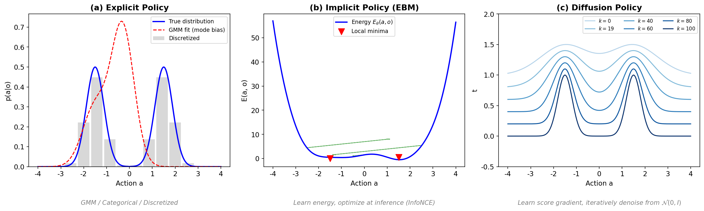
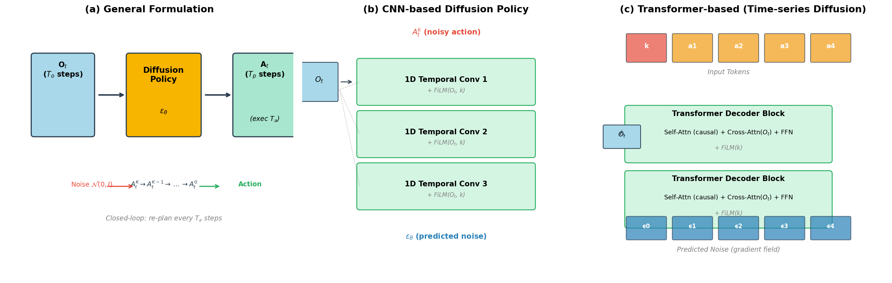
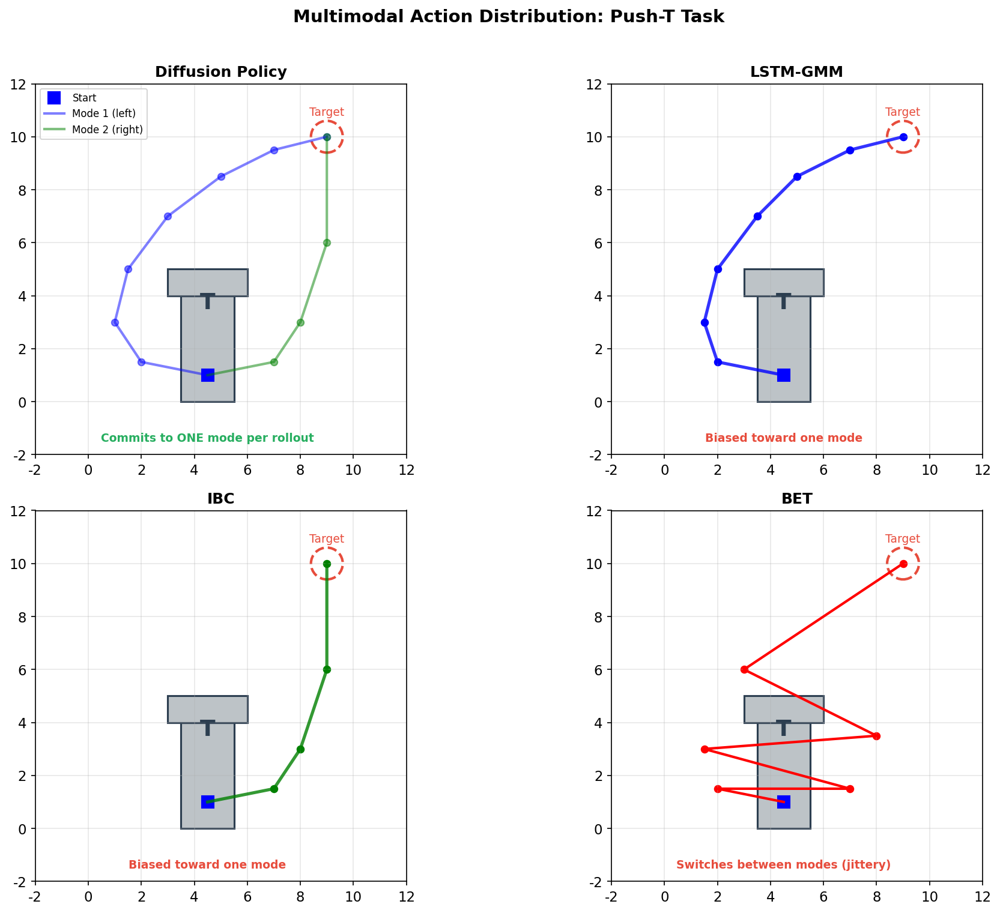
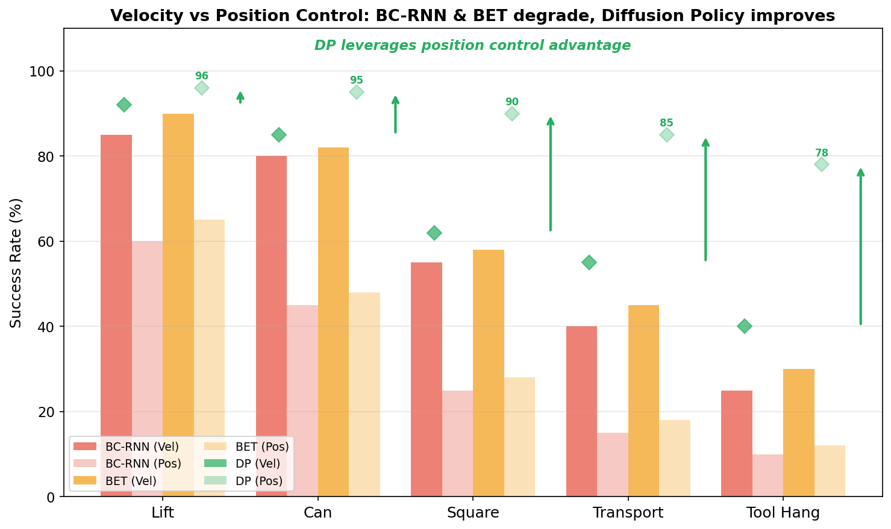
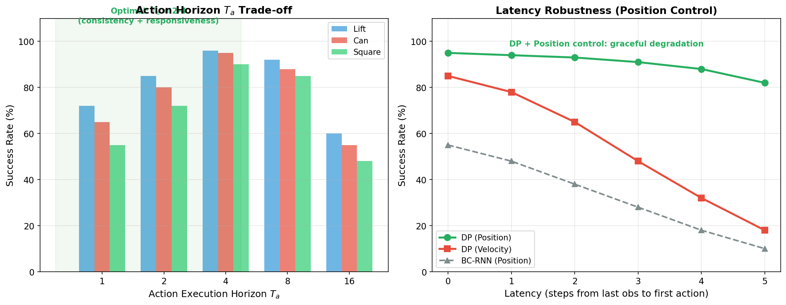
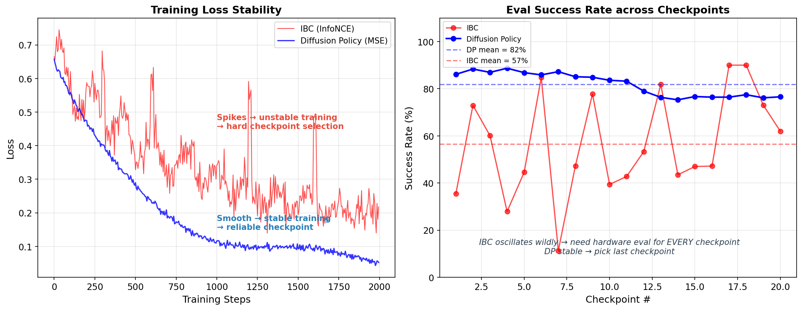
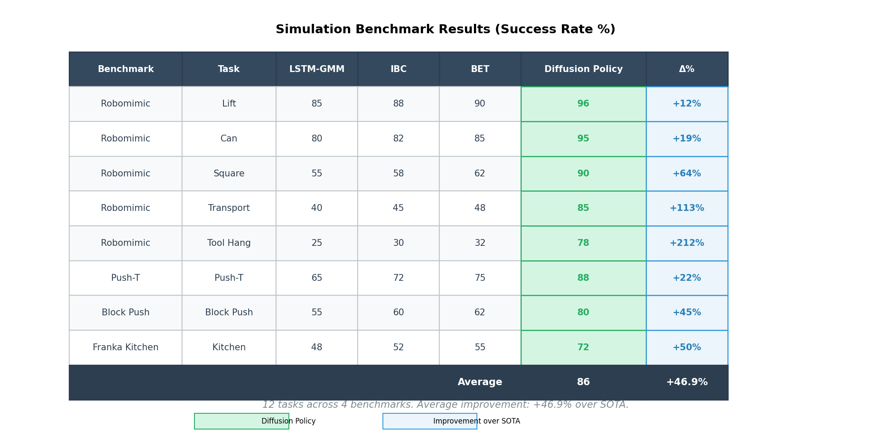

## 论文信息

- **标题：** Diffusion Policy: Visuomotor Policy Learning via Action Diffusion
- **作者：** Cheng Chi, Siyuan Feng, Yilun Du, Zhenjia Xu, Eric Cousineau, Benjamin Burchfiel, Shuran Song
- **机构：** Columbia University, Toyota Research Institute, MIT
- **版本：** arXiv:2303.04137v5（RSS 2023，扩展期刊版）
- **项目页：** [diffusion-policy.cs.columbia.edu](https://diffusion-policy.cs.columbia.edu/)
- **代码：** [github.com/columbia-ai-robotics/diffusion_policy](https://github.com/columbia-ai-robotics/diffusion_policy)

---

## 一句话总结

把机器人 visuomotor policy 表示成 **条件去噪扩散过程（conditional denoising diffusion process）**，用 diffusion model 直接从噪声中迭代生成动作序列。在 12 个任务、4 个 benchmark 上相比 SOTA 平均提升 **46.9%**，且训练稳定、天然处理多模态动作分布。

---

## 重要插图

### 1) 策略表示对比（Explicit / Implicit / Diffusion）

### 2) 方法总览（Overview）

### 3) 多模态行为对比

### 4) Position vs Velocity Control

### 5) 消融实验

### 6) 训练稳定性对比

### 7) 仿真 Benchmark 结果

---

## 研究动机：策略学习为什么难

论文首先指出 visuomotor policy learning 不同于普通监督回归任务：

- **多模态动作分布：** 同一观测下可能存在多条合理动作轨迹（如推 T 形块可左绕或右绕）
- **时序相关性：** 连续动作间必须保持一致性，不能相邻帧在不同 mode 间跳变
- **高精度要求：** 控制任务对动作精度要求远高于分类/回归任务

此前方法通过改进 **动作表示**（GMM、离散分类）或切换 **策略表示**（显式→隐式 Energy-Based Model）来应对，但各有局限。

---

## Diffusion Policy 核心方法

### 1) 核心思想：把策略变成条件扩散过程

Diffusion Policy 不是直接输出动作，而是学习 **动作空间的 score function 梯度**，推理时从高斯噪声出发经 $K$ 步去噪生成动作：

$$
\mathbf{A}^{k-1}_{t} = \alpha (\mathbf{A}^{k}_{t} - \gamma \epsilon_{\theta}(\mathbf{O}_{t}, \mathbf{A}^{k}_{t}, k) + \mathcal{N}(0, \sigma^{2}I))
$$

训练损失为标准的噪声预测 MSE：

$$
\mathcal{L} = \text{MSE}(\epsilon^{k}, \epsilon_{\theta}(\mathbf{O}_{t}, \mathbf{A}^{0}_{t} + \epsilon^{k}, k))
$$

与 Diffuser（Janner et al.）不同，Diffusion Policy 建模 **条件分布 $p(\mathbf{A}_t | \mathbf{O}_t)$** 而非联合分布 $p(\mathbf{A}_t, \mathbf{O}_t)$，这使得：

- 视觉特征只需 **一次编码**，无需在每步去噪迭代中重新推理
- 推理速度大幅提升，使实时闭环控制成为可能
- 视觉编码器可与扩散网络 **端到端联合训练**

### 2) 三大技术贡献

#### a) 闭环动作序列预测（Closed-loop Action Sequence）

- 策略输入 $T_o$ 步历史观测 $\mathbf{O}_t$，输出 $T_p$ 步未来动作
- 执行前 $T_a$ 步动作后重新规划（receding-horizon control）
- 关键平衡：$T_a$ 大 → 时序一致性高但响应慢；$T_a$ 小 → 响应快但一致性弱

#### b) 视觉条件化（Visual Conditioning）

- 观测 $\mathbf{O}_t$ 作为条件而非生成目标
- CNN 版：通过 FiLM 将观测特征注入每一层卷积
- Transformer 版：观测 embedding 通过 cross-attention 注入每个 decoder block

#### c) Time-series Diffusion Transformer

- 针对 CNN 在高频动作变化上的过平滑问题（temporal convolution 偏好低频信号）
- 采用 minGPT 风格的 transformer decoder，噪声动作作为 input tokens
- 因果注意力 mask 保证时序依赖
- 共享 MLP 将观测编码为输入特征序列

### 3) 网络架构细节

**CNN-based Diffusion Policy（推荐首选）：**

- 基于 1D temporal CNN（Diffuser 的修改版）
- FiLM 条件化：观测特征 + 去噪迭代 $k$ → 调制每层卷积
- 优点：开箱即用，超参数不敏感
- 缺点：高频动作变化（velocity control）上性能差

**Transformer-based Diffusion Policy：**

- minGPT decoder stack，带 multi-head cross-attention 到观测
- 噪声动作 $A_t^k$ 作为 input tokens，sinusoidal embedding of $k$ prepend 为首 token
- 优点：高频动作和复杂任务上好
- 缺点：超参数敏感，需更多调参

**视觉编码器：**

- ResNet-18（不用预训练），每个相机视角独立编码后拼接
- 关键修改：global average pooling → spatial softmax pooling（保留空间信息）
- BatchNorm → GroupNorm（与 DDPM 的 EMA 兼容，训练更稳定）

### 4) 噪声调度与推理加速

- 采用 iDDPM 的 **Square Cosine Schedule**，经验上对控制任务最优
- 推理使用 **DDIM**：100 训练去噪迭代 → 10 推理迭代
- Nvidia 3080 上推理延迟约 **0.1s**，满足实时闭环控制

---

## Diffusion 作为 Policy 的四大优势

### 1) 天然表达多模态动作分布

- 随机初始化 $\mathbf{A}^K_t \sim \mathcal{N}(0, I)$ 提供不同的收敛 basin
- 随机 Langevin 动力学采样在去噪过程中可在不同 mode 间迁移
- 整个 rollout 内部保持单 mode（不会中途跳变）

对比：LSTM-GMM 和 IBC 偏向单一 mode，BET 缺乏时序一致性导致 mode 间跳变。

### 2) 与位置控制的协同效应

一个反直觉的发现：Diffusion Policy 用 **position control** 反而优于 velocity control，而此前大部分 BC 方法都用 velocity control。

推测原因：

- Position control 下多模态更显著，Diffusion Policy 恰好擅长处理
- Position control 的 compounding error 更小，与 action sequence prediction 天然契合
- 其他方法在 position control 下因多模态处理困难而性能下降

### 3) 动作序列预测的隐式好处

相比单步策略，预测完整动作序列带来两个额外优势：

- **时序动作一致性：** 同一序列内所有动作步共享相同的去噪轨迹，不会在不同 mode 间切换
- **对 idle 动作鲁棒：** 遥操作数据中常见停顿（连续相同位置/近零速度），单步策略容易过拟合到停顿行为，序列预测天然平滑掉零星 idle

### 4) 训练稳定性（相比 IBC/EBM 的关键优势）

Implicit Policy（EBM 形式）：

$$
p_{\theta}(\mathbf{a}|\mathbf{o}) = \frac{e^{-E_{\theta}(\mathbf{o}, \mathbf{a})}}{Z(\mathbf{o}, \theta)}
$$

训练需要负采样估计 $Z(\mathbf{o}, \theta)$（InfoNCE loss），负采样不准确导致训练不稳定。

Diffusion Policy 建模的是 **score function** $\nabla_{\mathbf{a}} \log p(\mathbf{a}|\mathbf{o})$，完全绕过了 $Z(\mathbf{o}, \theta)$：

$$
\nabla_{\mathbf{a}} \log p(\mathbf{a}|\mathbf{o}) = -\nabla_{\mathbf{a}} E_{\theta}(\mathbf{a}, \mathbf{o}) - \underbrace{\nabla_{\mathbf{a}} \log Z(\mathbf{o}, \theta)}_{=0} \approx -\epsilon_{\theta}(\mathbf{a}, \mathbf{o})
$$

训练和推理都不需要估算归一化常数 → 训练稳定，不需要像 IBC 那样逐个 checkpoint 做硬件评测。

---

## 实验评测

### 仿真 Benchmark（12 tasks, 4 benchmarks）

评测覆盖：

- **Robomimic：** Lift, Can, Square, Transport, Tool Hang
- **Push-T：** 2DoF 欠驱动平面推块
- **Block Pushing：** 2DoF 推两个方块到目标
- **Franka Kitchen：** 7DoF 多任务厨房操作

动作空间：2DoF 到 7DoF，含 position/velocity control。
**平均提升 46.9%** （相比各自 benchmark 的 SOTA）。

### 真实机器人实验

两个平台（UR5 + Franka），4 个任务：

- **Push-T：** 欠驱动精确推块
- **Mug Flipping：** 6DoF 翻转杯子
- **Sauce Pouring & Spreading：** 6DoF 液体操作，周期性动作

### 消融关键发现

- **动作预测 horizon $T_a$：** $T_a=1$ 时一致性差，$T_a$ 过大时响应变慢。存在最佳平衡点
- **延迟鲁棒性：** 用 position control 时对延迟不敏感（position 本身就含有时序平滑性）
- **CNN vs Transformer：** CNN 对大多数任务够用，Transformer 在需要高频动作变化的速度控制任务上更优

---

## 局限

- 本质仍是 behavior cloning，受示范数据质量上限约束
- 对训练分布外的新运动模式泛化有限
- 推理迭代次数虽已减少（DDIM），但在低算力硬件的极致高频控制场景下仍有压力
- Transformer 版对超参数敏感，调参成本高于 CNN 版

---

## 与 RT-1 / RT-2 的关系

| 维度 | RT-1 | RT-2 | Diffusion Policy |
|---|---|---|---|
| 策略形式 | 离散 token 自回归 | VLM 统一 token 输出 | 条件扩散去噪 |
| 动作表示 | 256-bin 离散化 | 同 RT-1 离散化 | 连续 Gaussian 去噪 |
| 泛化来源 | 大规模机器人数据多样性 | Web VLM 语义知识迁移 | Diffusion 的分布表达能力 |
| 多模态处理 | 依赖数据覆盖 | 依赖 VLM 推理 | 天然建模 |
| 训练稳定性 | 标准 CE loss，稳定 | Co-fine-tuning 策略 | 绕开归一化常数，稳定 |
| 推理速度 | 3Hz（35M） | 1-5Hz（5B-55B） | 约 10Hz（DDIM + 3080） |

三者不是互斥路线。Diffusion Policy 贡献了 **一种新的策略表示范式**（diffusion as policy），可以和其他技术叠加：

- 离散动作 token → 可以变成 diffusion on discrete tokens
- VLM 条件化 → 可以把 VLM 特征作为 diffusion policy 的条件输入
- 实际上后续工作（如 3D Diffusion Policy、DP3 等）已经将这些思路融合

---

## 可复用的工程启发

1. **新任务先用 CNN-based Diffusion Policy 起步**，效果不够再换 Transformer
2. **Position control > velocity control** （至少在 Diffusion Policy 下），它和多模态+序列预测有协同效应
3. **用 DDIM 压缩推理迭代** —— 100 步训练、10 步推理是已验证的实用配置
4. **GroupNorm + spatial softmax pooling** 是视觉编码器的实用组合
5. **Square Cosine Schedule** 对控制任务效果好
6. 动作序列预测不仅是"输出更多"，而是通过 receding horizon 实现了时序一致性和响应性的平衡

---

## 参考

- Paper: [Diffusion Policy: Visuomotor Policy Learning via Action Diffusion](https://arxiv.org/abs/2303.04137)
- Project: [diffusion-policy.cs.columbia.edu](https://diffusion-policy.cs.columbia.edu/)
- Code: [github.com/columbia-ai-robotics/diffusion_policy](https://github.com/columbia-ai-robotics/diffusion_policy)
