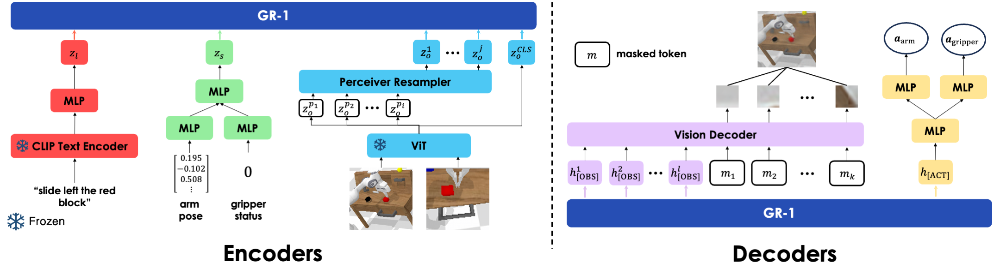
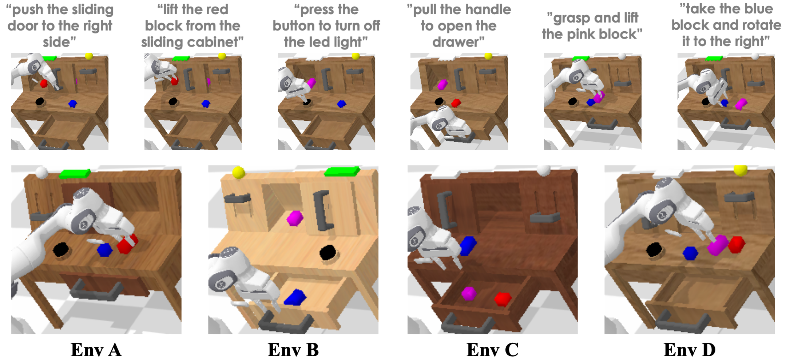
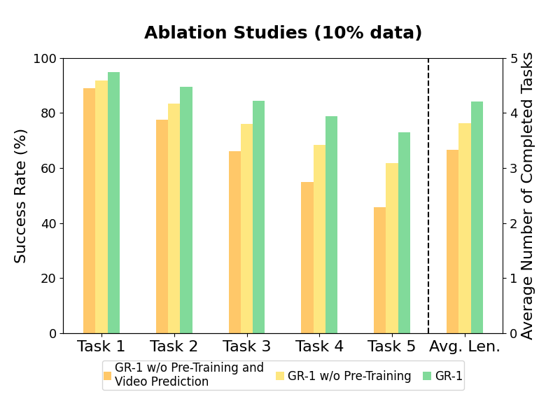
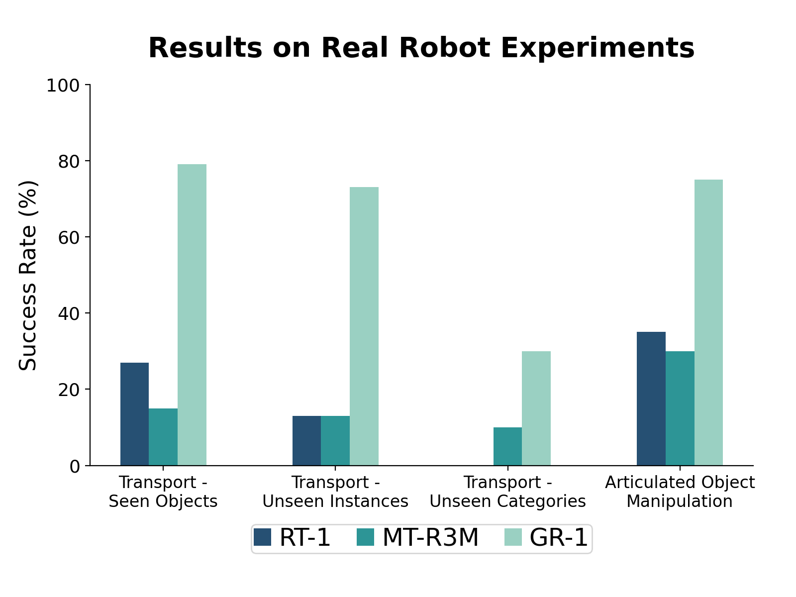

## 论文信息

- **标题：** Unleashing Large-Scale Video Generative Pre-training for Visual Robot Manipulation
- **作者：** Hongtao Wu, Ya Jing, Chilam Cheang, Guangzeng Chen, Jiafeng Xu, Xinghang Li, Minghuan Liu, Hang Li, Tao Kong
- **版本：** arXiv:2312.13139v2（2023-12）
- **一句话主题：** 把大规模视频生成预训练（Ego4D）接到 GPT-style 机器人策略中，让模型同时学习"下一步该怎么动"和"未来画面会怎样变化"。

---

## 一句话总结

GR-1 的核心贡献不是新奇网络组件，而是把机器人控制训练成一个统一的生成式问题：给定语言、图像序列和机器人状态，模型在同一个因果 Transformer 内同时输出动作和未来视觉。实现层面最关键的是三件事：**token 序列构造**、**掩码规则**、**联合损失设计**。

---

## 论文原文关键段落 + 详细解释

### 1) 方法总定义

> "a straightforward GPT-style model ... predicts robot actions and future images"

实现含义是：模型主干不是 actor-critic，也不是传统 CNN+MLP 控制器，而是一个统一自回归 Transformer。动作和未来图像在同一时间轴上建模，带来更强的一致性约束。

### 2) 数据来源与迁移逻辑

> "sourced from the ... Ego4D dataset"

作者先在 Ego4D 上学"视觉动态规律"，再迁移到机器人控制。工程上这等价于先把时序世界模型学好，再在较小机器人数据上做 task adaptation。

### 3) 微调目标

> "L_finetune = L_arm + L_gripper + L_video"

这不是简单行为克隆。它把动作损失（`L_arm`, `L_gripper`）和视觉前瞻损失（`L_video`）耦合在一起。实现上等于让每个控制动作同时满足"局部动作正确"与"未来状态合理"。

### 4) 实机结论

> "Table 2: Real Robot Experiment Results."

这张表对应真实机器人四项结果（seen/unseen/articulated）。从实现角度看，它验证了模型不是只在模拟器拟合，而能在视觉扰动、物体变体和接触任务下保持稳定。

---

## 重要插图

### 1) 模型编码器/解码器结构



### 2) CALVIN 环境与划分



### 3) 主消融结果（ABCD→D）



### 4) 真实机器人结果图



---

## 实现视角：模型是怎么接起来的

### 1) 模型架构规范

GR-1 的核心是一个 **GPT-style 因果 Transformer**，完整架构参数如下：

| 组件                 | 规格                                            |
| -------------------- | ----------------------------------------------- |
| 总参数量             | 195M                                            |
| 可训练参数量         | 46M（仅主干 + 输出头）                          |
| Transformer 层数     | 12 层                                           |
| 注意力头数           | 12 头                                           |
| 隐藏层维度           | 384                                             |
| 文本编码器           | CLIP（冻结）                                     |
| 图像编码器           | MAE 预训练 ViT（冻结）                           |
| 动作解码头           | 3 层 MLP（arm: Smooth-L1, gripper: BCE）          |
| 视频预测头           | Transformer Decoder（self-attn + linear layers） |

**关键设计决策：** 视觉和文本编码器在完整训练过程中保持冻结。可训练参数集中在因果 Transformer 主干和两个输出头部。

### 2) 多模态编码阶段（每个 timestep）

在一个时间步 `t`，GR-1 接收三种输入：

- 语言指令 `l`（CLIP text encoder，冻结）
- 观测图像 `o_t`（MAE 预训练 ViT，冻结）
- 机器人状态 `s_t`（末端 6D + gripper 二值）

视觉编码后会产生全局 token（CLS）和局部 patch token。局部 token 先经过 perceiver resampler 压缩，再与语言、状态 token 一起投影到统一维度后送入因果 Transformer。实现上这一步的意义是把不同模态统一到同一 token 空间，避免后续注意力层需要分模态特判。

### 3) Token 序列打包（这是复现成败关键）

论文给了两种序列模板：

- **预训练：** `(l, o_{t-h}, [OBS], ..., l, o_t, [OBS])`
- **微调：** `(l, s_{t-h}, o_{t-h}, [OBS], [ACT], ..., l, s_t, o_t, [OBS], [ACT])`

这里有两个关键实现细节：

1. 语言 token 在每个 timestep 重复注入，防止被长时序视觉 token 淹没。
2. 每个 timestep 共享同一时间嵌入（relative timestep embedding），让模型能对齐"同一时刻的跨模态信息"。

### 4) 注意力掩码规则（不是标准 GPT 默认掩码）

- **预训练时：** token 不能看到未来，也不能看到 `[OBS]` 预测位。
- **微调时：** 除了因果约束外，还要屏蔽 `[ACT]` 与 `[OBS]` 位置，防止标签泄漏。

如果这套 mask 做错，模型会出现"训练指标很好、部署崩溃"的典型 label leakage 问题。

### 5) 输出头与损失对应

- `[ACT]` 对应动作头：
  - arm 连续控制用 **Smooth-L1 Loss**
  - gripper 开合用 **BCE Loss**
- `[OBS]` 对应视觉解码头：用 mask token + transformer decoder 预测未来 patch，损失为像素 **MSE**

这就是 `L_arm + L_gripper + L_video` 的落地方式。

---

## 训练流程：按工程执行顺序

### 训练超参数总览

| 项目               | 视频预训练（Ego4D） | CALVIN 微调   | 实机微调     |
| ------------------ | ------------------ | ------------- | ------------ |
| 数据源             | Ego4D（3500+ 小时） | CALVIN（ABC→D） | 1775/2856 轨迹 |
| 数据规模           | ~800K clips / 8M frames | 标准 CALVIN 拆分 | 1.7K–2.8K 条 |
| Batch Size         | 1024               | 512           | 64           |
| 学习率             | 3.6e-4             | 1e-3          | 1e-3         |
| 训练轮数           | 50                 | 20            | 30           |
| Dropout            | 0.1                | —             | —            |
| Optimizer          | AdamW + cosine decay | AdamW + cosine decay | AdamW + cosine decay |
| 关键参数 Δt        | —                  | 3             | —            |
| 冻结部分           | CLIP + MAE ViT     | CLIP + MAE ViT | CLIP + MAE ViT |

### 阶段 A：视频生成预训练

- **数据：** Ego4D（3500+ 小时）
- **构造：** 每个视频截 3 秒短片，累计约 800K clips / 8M frames
- **目标：** 给定历史帧预测未来帧
- **训练设置：** batch 1024，lr 3.6e-4，warmup 5，epoch 50

### 阶段 B：机器人微调（CALVIN / 实机）

- **冻结：** CLIP text encoder + MAE image encoder
- **可训练：** 主干因果 Transformer + 任务相关头部
- **训练设置：** batch 512，lr 1e-3，warmup 1，epoch 20
- **关键参数：** `Δt=3`（预测更远未来），`sequence length=10`

可以把训练主循环理解为：

```text
encode(language, image, state)
-> pack tokens with [ACT]/[OBS]
-> causal transformer (masked)
-> decode action + future image
-> loss = L_arm + L_gripper + L_video
-> backprop (AdamW + cosine decay)
```

训练路径本质是"先学动态，再做控制对齐"，两个阶段不能互换顺序。

---

## 推理与闭环控制（部署时怎么跑）

部署时每一步都要重新编码当前观测，输出下一动作，再执行，再读新观测，形成 closed-loop。GR-1 不是一次性生成整段轨迹；它依赖在线反馈更新，因此对观测噪声和执行偏差更鲁棒。

如果要工程落地，建议重点监控两件事：

- `[ACT]` 输出是否稳定（尤其 gripper 抖动）
- 视觉预测是否失真（失真通常预示 OOD 场景）

部署阶段我会把视觉预测当作健康度信号，它对发现分布外场景很有用。

---

## 实验设置细节（不仅看分数）

### 1) CALVIN 评估协议

- 1000 条 instruction chains
- 每条最多连续 5 个任务
- 单任务 360 步内未完成记失败
- 只在前任务成功后才会下发后任务

这意味着后续任务分数更能反映长时序鲁棒性，而不是单步 skill。

### 2) 实机设置

- Object transportation：1775 demonstrations
- Drawer manipulation：2856 trajectories
- 评估维度：Seen Objects / Unseen Instances / Unseen Categories + Articulated

这组设计能区分"记住训练对象"和"真正泛化到新实例/新类别"的差别。

---

## 主结果解读（结合实现意义）

### 1) ABCD→D（常规多任务）

| 方法          | Avg. Len. | 多任务成功率 |
| ------------- | --------- | ------------ |
| HULC          | 3.06      | 66.8%        |
| RT-1          | 2.45      | —            |
| **GR-1**      | **4.21**  | **94.9%**    |

这代表在同分布任务链里，GR-1 的连续任务稳定性显著更高，成功率从 88.9% 提升至 94.9%。

### 2) ABC→D（零样本场景泛化）

| 方法          | Avg. Len. |
| ------------- | --------- |
| RT-1          | 0.90      |
| MT-R3M        | 0.93      |
| HULC          | 0.67      |
| **GR-1**      | **3.06**  |

实现层面的解释是：视频预训练让视觉动态建模更稳，面对新背景/新布局时不容易漂移。成功率从 53.3% 跃升至 **85.4%**。

### 3) 10% 数据（低资源场景）

| 方法          | Avg. Len. | 成功率   |
| ------------- | --------- | -------- |
| HULC          | 1.11      | 66.8%    |
| **GR-1**      | **2.00**  | **77.8%** |

说明视频先验确实在低数据 regime 下提高 sample efficiency。

### 4) 真实机器人

| 评估维度           | GR-1   | RT-1   | MT-R3M |
| ------------------ | ------ | ------ | ------ |
| Seen Objects       | **0.79** | 0.27   | 0.15   |
| Unseen Instances   | **0.73** | 0.13   | 0.13   |
| Unseen Categories  | **0.30** | 0.00   | 0.10   |
| Articulated (Drawer) | **0.75** | 0.35   | 0.30   |

优势最大的是 instance 泛化，说明模型不仅在"看过的具体物体"上有效。Unseen Categories 仍有瓶颈（0.30），说明跨语义类别泛化尚未解决。

---

## 消融的实现启示

### 1) 预训练与视频预测都不能删

| 设置                          | ABCD→D Avg. Len. | ABC→D Avg. Len. | 10% Data |
| ----------------------------- | ---------------- | --------------- | -------- |
| Full GR-1（全保留）           | **4.21**         | **3.06**        | **2.00** |
| W/o Pretrain（保留预测）      | 3.82             | 2.65            | 1.52     |
| W/o Pretrain & Prediction     | 3.33             | 2.40            | 1.04     |

这表明 `L_video` 不是锦上添花，而是策略泛化的结构性约束。去掉预训练和视频预测联合损失，性能分别下降 10% 和 21%。

### 2) 未来步长需要折中

| 未来预测步长 | Avg. Len.（ABCD→D） |
| ------------ | ------------------- |
| Δt = 1       | 3.61                |
| Δt = 3       | **3.82**            |
| Δt = 5       | 3.67                |

步长太短看不到足够动态，太长又会削弱对局部动作的指导，`Δt=3` 是工程折中点。

---

## 与 OpenVLA / RoboFlamingo 的关系

GR-1、OpenVLA、RoboFlamingo 代表了三条并行但有交集的 VLA 技术路线：

- **GR-1：** 强调 **视频生成预训练** 作为世界动态先验，用联合损失（动作 + 视觉预测）约束策略学习。核心贡献是"让模型不仅会做，还能预见"。
- **OpenVLA：** 强调 **VLM 骨干网络 + 动作 token 离散化**，利用 LLM 的词表扩展能力统一动作生成。核心贡献是"用自然语言接口统一视觉、语言和动作"。
- **RoboFlamingo：** 强调 **感知-控制解耦**，VLM 只做单步视觉语言融合，时序控制交给独立 policy head。核心贡献是"把 VLM 当高质量感知器，控制权交给轻量模块"。

三者的互补关系可以总结为：

- GR-1 的视频生成先验可以增强 OpenVLA 的世界动态建模能力（动作 token + 视频前瞻联合训练）。
- RoboFlamingo 的解耦设计允许替换 GR-1 的 policy head 来适配不同控制频率需求。
- OpenVLA 的大规模数据清洗和 LoRA 微调策略可以为所有 VLA 模型提供实用的工程基础。

---

## 局限与总结

Unseen Categories 仍只有 0.30，说明跨语义类别泛化还未解决；真实机器人任务类型也偏有限。即便如此，GR-1 提供了一个很实用的训练范式：**先学世界动态，再学控制映射**。这条线和 RT-2/OpenVLA 的 action-token 路线可以互补，后续很可能演化成"动作 token + 视频前瞻联合训练"的混合范式。

### 与 OpenVLA / RoboFlamingo 的核心区别

| 维度           | GR-1                       | OpenVLA                | RoboFlamingo           |
| -------------- | -------------------------- | ---------------------- | ---------------------- |
| 模型规模       | 195M（46M 可训练）         | 7B（全参数/LoRA 微调） | 3B–9B（~1B 可训练）      |
| 预训练         | Ego4D 视频生成             | Prismatic VLM 预训练   | OpenFlamingo VL 预训练  |
| 输出方式       | 连续动作（Smooth-L1 + BCE） | 离散动作 token（Cross-Entropy） | 连续动作（MSE + BCE） |
| 时序建模       | 因果 Transformer 内建模    | 单步 token 预测（无显式时序头） | 显式 Policy Head（LSTM/GPT） |
| 视频预测       | 联合训练（核心贡献）        | 无                     | 无                     |

如果我要复现这篇，我会先保证两阶段训练与 mask 正确，再做模型规模和数据量扩展。
