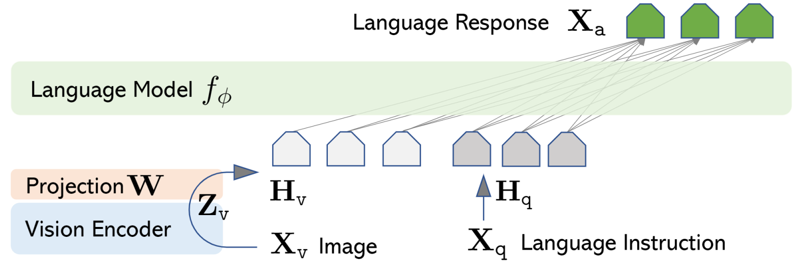
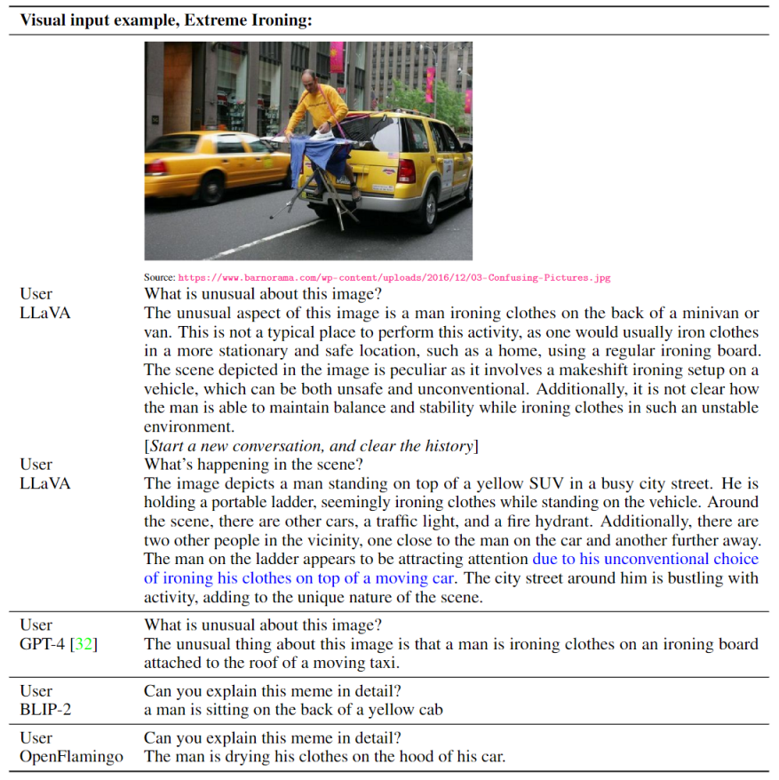
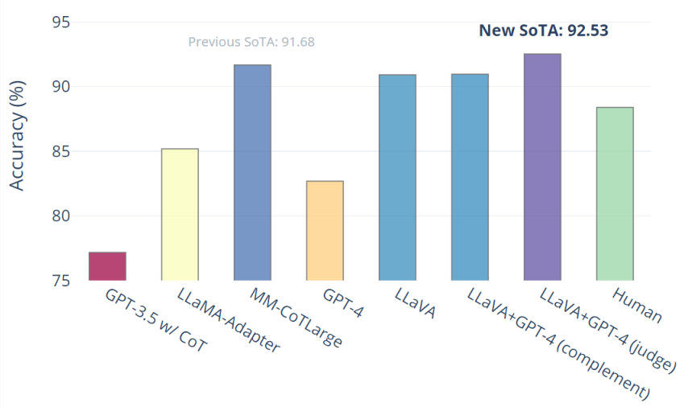

## LLaVA: Large Language and Vision Assistant

### 论文信息

- **标题：** Visual Instruction Tuning
- **作者：** Haotian Liu, Chunyuan Li, Qingyang Wu, Yong Jae Lee
- **论文地址：** https://arxiv.org/abs/2304.08485
- **一句话：** 用 GPT-4 自动构造大规模图文指令数据，把纯语言大模型（Vicuna）快速对齐成通用多模态助手（LLaVA）。

---

### 基础概念

- **Visual Instruction Tuning（视觉指令微调）**
  - 把"图像 + 指令 -> 回答"组织成类似 ChatGPT 的 instruction-following 数据格式。
  - 目标不是只做分类/检索，而是让模型能够进行开放式多轮视觉对话。

- **Multimodal Connector（多模态连接层）**
  - 用一个简单的可训练投影层，把视觉编码器输出映射到语言模型 token embedding 空间。
  - LLaVA 的关键工程思想：尽量不改大模型主体，靠轻量连接层完成视觉-语言对齐。

- **Synthetic Data Generation（合成指令数据）**
  - 用 GPT-4 基于 COCO 图像标注自动生成高质量图像问答/对话数据。
  - 这是 LLaVA 能在低成本下得到强泛化能力的核心方法之一。

---

### 重要图表

#### 1) LLaVA 总体架构



LLaVA 由三部分组成：

- 视觉编码器：CLIP ViT-L/14（通常冻结）
- 连接层：一层线性投影（论文里强调简单有效）

> Note that our simple projection scheme is lightweight, which allows us to iterate data centric experiments quickly. More sophisticated schemes to connect the image and language representations can also be considered, such as gated cross-attention in Flamingo [2] and Q-former in BLIP-2 [28]. We leave exploring possibly more effective and sophisticated architecture designs for LLaVA as future work.

- 语言模型：Vicuna（7B/13B）

#### 2) 与 GPT-4V 的案例对比



这张图展示 LLaVA 在复杂图像问答上已经具备较强解释能力，但在极细粒度感知和稳健推理上仍弱于 GPT-4V。

#### 3) ScienceQA 结果



论文报告：LLaVA 在 ScienceQA 上可达到 **90.92%**，而在与 GPT-4 协同的 setting 下达到 **92.53%**。

---

### 方法详解（LLaVA 的两阶段训练）

LLaVA 的训练 pipeline 非常清晰，核心是"先对齐，再指令微调"。

#### Stage 1: Feature Alignment（特征对齐预训练）

- **数据：** CC3M 子集，约 **595K** 图文对。
- **做法：** 冻结视觉编码器和语言模型，仅训练投影层。
- **目标：** 让视觉 token 在 embedding 空间里"说得上话"，先完成模态对齐。

这个阶段本质是在做一个"视觉到语言空间的翻译器"初始化。

> In this way, the image features $\mathbf{H}_v$ can be aligned with the pre-trained LLM word embedding. This stage can be understood as training a compatible visual tokenizer for the frozen LLM.

#### Stage 2: Visual Instruction Tuning（视觉指令微调）

- **数据：** 论文构建的 **158K** 图文指令数据（LLaVA-Instruct-150K）。
- **构成：**
  - Conversation（多轮对话）：58K
  - Detailed Description（细节描述）：23K
  - Complex Reasoning（复杂推理）：77K
  - **总计：** ~158K 样本，来自 ~80K 张 COCO 图像
- **做法：** 端到端微调 **连接层和语言模型**（视觉编码器通常保持冻结）。

这一阶段让模型具备真正的"看图聊天 + 推理 + 执行指令"能力。

> Finally, note that visual instruction tuning is different from visual prompt tuning [23]: the former aims to improve the model's instruction-following abilities, while the latter aims to improve the parameter-efficiency in model adaptation.

注意区分 **Visual Instruction Tuning** 和 **Visual Prompt Tuning**，前者旨在提升模型遵循指令的能力，而后者旨在提升模型适应过程中的参数效率。

---

### 训练超参数总览

| 项目               | Stage 1（对齐预训练） | Stage 2（指令微调） | ScienceQA 微调 |
| ------------------ | -------------------- | ------------------ | -------------- |
| 数据规模           | 595K（CC3M 子集）    | 158K（LLaVA-Instruct） | ScienceQA 训练集 |
| Epochs             | 1                    | 3                  | 12             |
| Learning Rate      | 2e-3                 | 2e-5               | 2e-5           |
| Batch Size         | 128                  | 32                 | 32             |
| 训练参数           | 仅投影层             | 投影层 + LLM        | 投影层 + LLM   |
| 冻结部分           | ViT + LLM            | ViT                | ViT            |
| 训练时长（8×A100） | ~4 小时              | ~10 小时           | ~4 小时        |
| 精度               | BF16 + TF32          | BF16 + TF32        | BF16 + TF32    |
| 优化器             | Adam（no weight decay） | Adam + cosine lr | Adam + cosine lr |

**关键配置：** Cosine 学习率衰减 + 3% warmup，结合 FSDP 和 gradient checkpointing 节省显存。

---

### 数据构建（为什么这篇论文影响力很大）

论文最有启发性的部分之一不是网络结构，而是数据生产方式：

1. **符号化图像表示：** 将图像编码为 GPT-4 能识别的序列——caption（场景描述）+ bounding boxes（物体空间位置）。
2. **GPT-4 作为数据教师：** 用 text-only GPT-4（语言输入），基于图像符号描述自动生成三种类型的指令数据。
3. **三类指令：**
   - **Conversation（58K）：** 涉及物体、数量、动作、位置、相对位置的多轮问答，只保留有明确答案的问题。
   - **Detailed Description（23K）：** 丰富的全面图像描述，由精心设计的 prompt 列表驱动。
   - **Complex Reasoning（77K）：** 需要逐步逻辑推理的深度推理问题。
4. **低成本扩展：** 用少量 seed 示例 + few-shot in-context learning 驱动 GPT-4 批量生成。

这套做法后来直接影响了大量开源 MLLM 路线：

- LLaVA-1.5 / 1.6 系列
- 多种 "Vision Encoder + LLM + projector" 的标准范式
- 以及后续 VLA（Vision-Language-Action）把动作也 token 化接进统一生成空间的思路

---

### 实验结果与关键结论

#### 1) LLaVA-Bench（COCO 数据集，以 GPT-4 作为评审）

| 训练数据配置                   | Conversation | Detail | Complex | **All**     |
| ------------------------------ | ------------ | ------ | ------- | ----------- |
| Full data（全部三类）          | 83.1         | 75.3   | 96.5    | **85.1**    |
| Detail + Complex only          | 81.5         | 73.3   | 90.8    | 81.9        |
| Conv + 5% Detail + 10% Complex | 81.0         | 68.4   | 91.5    | 80.5        |
| Conversation only              | 76.5         | 59.8   | 84.9    | 73.8        |
| No instruction tuning          | 22.0         | 24.0   | 18.5    | **21.5**    |

**核心结论：** 不做 instruction tuning 时模型基本不具备指令遵循能力（总分仅 21.5）；加入全部三类数据后提升至 85.1，说明数据多样性的重要性。

#### 2) LLaVA-Bench（In-the-Wild，与现有方法对比）

| 方法          | Conversation    | Detail          | Complex         | **All**         |
| ------------- | --------------- | --------------- | --------------- | --------------- |
| OpenFlamingo  | 19.3 ± 0.5      | 19.0 ± 0.5      | 19.1 ± 0.7      | 19.1 ± 0.4      |
| BLIP-2        | 54.6 ± 1.4      | 29.1 ± 1.2      | 32.9 ± 0.7      | 38.1 ± 1.0      |
| **LLaVA**     | **57.3 ± 1.9**  | **52.5 ± 6.3**  | **81.7 ± 1.8**  | **67.3 ± 2.0**  |

LLaVA 在总体分数上比 BLIP-2 高约 29 分、比 OpenFlamingo 高约 48 分，尤其在 complex reasoning 上的优势最为明显（81.7 vs 32.9）。

#### 3) ScienceQA

| 方法                          | 准确率    |
| ----------------------------- | --------- |
| Human                         | 88.40%    |
| GPT-3.5 w/ CoT                | 75.17%    |
| LLaMA-Adapter                 | 85.19%    |
| MM-CoT (Large)                | 91.68%    |
| **LLaVA**                     | **90.92%** |
| LLaVA + GPT-4 (judge)         | **92.53%** |
| GPT-4 (text-only, 2-shot)     | 82.69%    |

LLaVA + GPT-4 协同达到当时 **SOTA 92.53%**，比人类标注者还高约 4 个百分点。

**ScienceQA 分项得分（LLaVA + GPT-4 judge）：**

| 类别      | NAT    | SOC    | LAN    | TXT    | IMG    | NO     | G1-6   | G7-12  |
| --------- | ------ | ------ | ------ | ------ | ------ | ------ | ------ | ------ |
| 准确率    | 91.56% | 96.74% | 91.09% | 90.62% | 88.99% | 93.52% | 92.73% | 92.16% |

#### 4) 消融实验（ScienceQA）

| 消融设置                                | 准确率    | 差异    |
| --------------------------------------- | --------- | ------- |
| Best（last layer features, reasoning-first, 13B） | **90.92%** | —       |
| 使用 CLIP 最后一层特征（vs 倒数第二层） | 89.96%    | −0.96   |
| 先预测答案（不经过 CoT 推理）            | 89.77%    | −1.15   |
| **跳过 Stage 1 对齐预训练**             | **85.81%** | **−5.11** |
| 7B 模型（vs 13B）                        | 89.84%    | −1.08   |

**核心结论：** 跳过 Stage 1 对齐预训练导致 **5.11% 的显著下降**，说明模态对齐阶段不可或缺。

---

### 局限性（论文也明确承认）

- **事实幻觉：** 在超出图像信息或知识边界时，模型仍会"自信地错"。
- **细粒度感知不足：** 对小目标、OCR、密集场景理解仍有弱点。
- **评测规模较小：** 早期 LLaVA-Bench 样本量有限，统计稳定性一般。
- **零样本跨模态不足：** 虽然能识别训练中未出现的名人（如 Elon Musk），但在结构化视觉推理上仍有局限。

---

### 我的理解：这篇论文的真正贡献

如果只看架构，LLaVA 并不"复杂"；但它做对了 3 件更重要的事：

1. **把多模态训练问题工程化：** 用极简 connector 快速完成 VLM 搭建。
2. **把数据瓶颈产品化：** 用 GPT-4 自动生成高质量视觉指令数据。
3. **把开源社区路线定型：** 形成了可复现、可扩展、可迭代的 MLLM 训练范式。

这也是它能成为后续一系列多模态开源工作的"母体范式"的原因。

---

### 作为 VLA 的基石

参照 `openvla.md`、`GR-1精读笔记.md` 和 `RoboFlamingo精读笔记.md` 的主线看，LLaVA 的位置很特殊：

- LLaVA 证明了 **"统一 token 生成空间 + 指令微调"** 在视觉-语言侧可行，且可以极低成本实现。
- OpenVLA 把这个思想扩展到动作空间（action tokens），证明了 LLM 词表可以承载机器人控制指令。
- GR-1 和 RoboFlamingo 则在 VLM 骨干上进一步加入了 **时序建模** 和 **视频预测**，弥补了 LLaVA 纯单步推理的不足。

关系图谱：

```text
LLaVA（VLM 基座：图像 + 指令 -> 文本回答）
  ├── OpenVLA（扩展动作空间：图像 + 指令 -> 动作 token）
  ├── GR-1（扩展时序+视频预测：图像 + 指令 -> 动作 + 未来帧）
  └── RoboFlamingo（扩展时序 head：图像 + 指令 -> 特征 -> 策略 head -> 动作）
```

简言之：**LLaVA 是 VLA 的"文本级"原型**，RoboFlamingo/GR-1 是向"可执行控制"延伸的不同技术路线。

---

### 可复现设置（论文中的关键训练配方）

- 视觉编码器：CLIP ViT-L/14
- 语言模型：Vicuna-13B（也报告了 7B 版本）
- 两阶段训练：595K 对齐预训练 + 158K 指令微调
- 低成本策略：冻结大部分参数，重点训练 connector 与 LLM

这套配方在当时的意义是：让实验室和个人开发者都能以可接受成本训练出"能用"的多模态助手。
