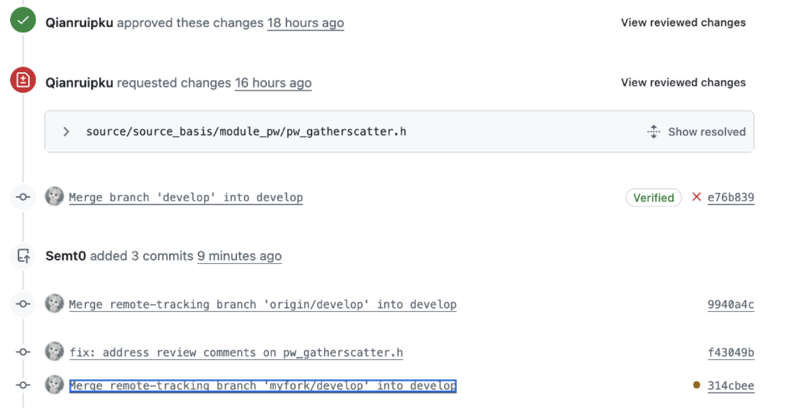
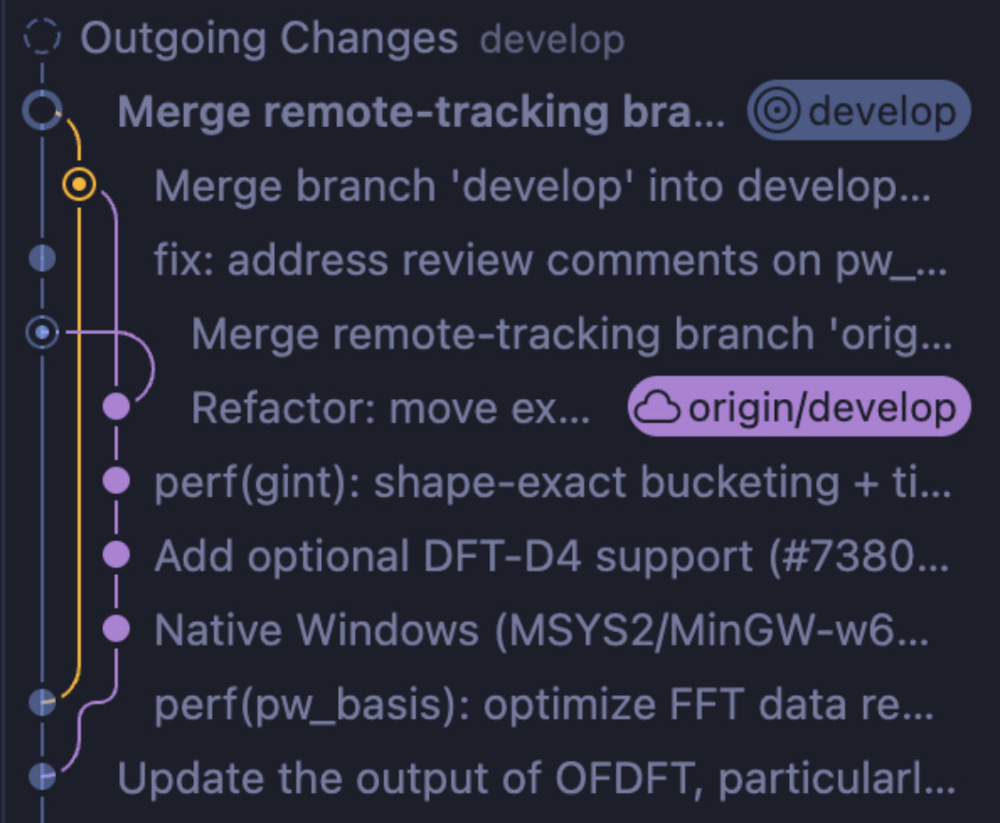
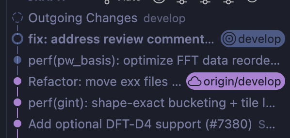
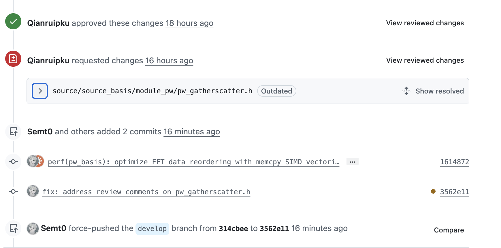

下面按 **时间线** 复盘这次完整经历，并把涉及的知识点串起来。可以把它当作一份 **"Fork + PR 工作流避坑指南"**。

---

## 1 事件时间线：每一步做了什么

| 时间 | 操作 | 发生了什么 | 结果 |
| :--: | :--- | :--- | :--- |
| 1 | 在 GitHub fork 了 `deepmodeling/abacus-develop` 并提交了第一次 PR | 得到了自己的远程仓库 `Semt0/abacus-develop` ，第一次 PR 通过后又添加了新的 comment，需要修改 | ✅ 正常 |
| 2 | **直接在本地 `develop` 分支写代码** | 把 `develop` 当成了功能分支 | ❌ **万恶之源** |
| 3 | `git pull --ff-only` | 试图同步上游，但本地 `develop` 有你的提交，上游也有新提交，**历史分叉** | ❌ 报错 `fatal: Not possible to fast-forward` |
| 4 | `git merge origin/develop` | 强制合并上游，生成第 1 个 merge commit | ⚠️ 能跑，但历史开始变脏 |
| 5 | `git push myfork develop` | 推送被拒，因为 fork 的远程 `develop` 上有一个 GitHub 自动生成的 merge commit（`e76b839`），和本地历史分叉 | ❌ `! [rejected]` |
| 6 | `git merge myfork/develop --no-edit` | 再次合并，生成第 2 个 merge commit | ⚠️ 历史更脏了 |
| 7 | 修改 reviewer 提出的代码问题 | 生成 `fix: address review comments` commit | ✅ 正确 |
| 8 | `git push myfork develop` | 成功，但 push 了 3 个 commit（2 个 merge + 1 个 fix） | ⚠️ PR 历史很丑 |
| 9 | `git fetch origin` + `git rebase origin/develop` + `git push --force-with-lease` | 把两个 merge commit 丢弃，把 fix 提交"搬家"到最新上游代码之上，然后强制推送 | ✅ 历史变干净 |
| 10 | GitHub 页面刷新 | 只剩 2 个 commit，reviewer 之前的行级评论全部变成 **Outdated** | ⚠️ 副作用 |

---

{ width="800" }

上图是非线性的丑陋历史 =w=

{ width="800" }

执行以下命令后变成了一条直线：

```bash
git fetch origin
git rebase origin/develop
git push --force-with-lease
```

{ width="800" }

两个多余的 merge commit 也消失了：

{ width="800" }

!!! warning "核心教训"
    **以后不要为了图方便直接在 `develop` 分支上进行开发！**

---

## 2 核心知识点串讲

### 2.1 为什么不能在 `develop` 上写代码？

**`develop`（或 `main`）应该是"只读"的同步分支。**

- 它的唯一职责是 **跟踪上游最新代码**。
- 如果在上面写代码，每次上游更新时，你的 `develop` 和上游就会 **分叉**（diverge）。
- 分叉后，任何同步操作（`pull`、`merge`）都会产生 **merge commit**，把历史搅成一锅粥。

**正确做法**：从 `develop` 切出一个 **feature 分支**（如 `optimize-fft`），所有修改在 feature 分支上做。

---

### 2.2 `git pull --ff-only` 为什么失败？

`--ff-only` = **Fast-Forward Only**（只允许快进）。

- **快进**：远程只是本地历史的"延长线"，Git 只需要把指针往前挪，不需要合并。
- **失败原因**：你的本地 `develop` 有你的提交，上游 `develop` 也有新提交。两边从同一个祖先 **分叉** 了，不再是延长线关系。

```text
快进失败的情况：

上游:  A --- B --- C --- D
你的:  A --- B --- X(你的修改)
              ↑
           分叉点（共同祖先）
```

---

### 2.3 `origin/develop` 是什么？

它不是远程仓库上的东西，而是 **本地的一个"缓存指针"**。

- **位置**：`.git/refs/remotes/origin/develop`
- **作用**：记录 **"上次 `git fetch` 时，远程 `develop` 在哪里"**
- **更新时机**：只有 `git fetch` / `git pull` 时才会更新
- **用途**：供你对比"本地落后远程多少"或"本地领先远程多少"

---

### 2.4 `git merge` vs `git rebase`

| | `merge` | `rebase` |
| :--- | :--- | :--- |
| **历史形状** | 保留分叉，产生 merge commit | 把提交"剪下来"贴到新的基底上，历史成直线 |
| **Commit hash** | 原有 hash 不变 | 被搬家的提交 hash 全部重写 |
| **安全性** | 不修改历史，安全 | 修改历史，危险（需要 force push） |
| **适用场景** | 公共分支（main、develop） | 个人 feature 分支（还没 push 或确定没人基于它工作） |

!!! info "补充说明"
    你的两次 `merge` 产生了两个无意义的 merge commit，它们不包含功能代码，纯粹是为了同步上游。

---

### 2.5 `git push --force-with-lease` 的原理

普通 `push` 被拒绝时，因为你本地的历史不是远程历史的"延长线"（远程有你没有的 commit）。

- `--force`：直接覆盖远程，**不管远程有什么**，极其危险。
- `--force-with-lease`：先检查 **"远程还是不是我上次 fetch 看到的样子？"**
  - 是 → 允许覆盖（CAS 成功）
  - 不是（有人在你 fetch 后又 push 了）→ **拒绝**，防止误覆盖别人的工作。

!!! warning "安全第一"
    **永远用 `--force-with-lease`，不要用 `--force`。**

---

### 2.6 GitHub PR 的 Approve / Request Changes 机制

- Reviewer 可以多次变更审查状态，**以最后一次为准**。
- 即使之前 Approve 了，后来点了 Request Changes，PR 就处于"需修改"状态，无法合并（如果仓库有分支保护）。
- 你的代码修改后，需要 **重新请求审查**（Re-request review），Reviewer 再次 Approve 后才能合并。

---

### 2.7 Rebase 的副作用：为什么评论变 Outdated？

Rebase 会 **重写 commit hash**。GitHub 的行级评论是绑定到 **具体的 commit hash + 行号** 上的。

- 旧 hash 被丢弃 → 评论失去锚点 → GitHub 标记为 **Outdated**。
- Reviewer 需要重新打开 Files changed 页面，在新的 commit 上重新审查。
- **CI 检查也会全部重新跑**。

---

## 3 正确的标准工作流（黄金法则）

以后每一个新功能，都按这个流程走，**永远不会遇到这次的问题**：

```bash
# 1. 同步上游（develop 只读，永远不改）
git checkout develop
git pull origin develop

# 2. 切功能分支
git checkout -b feature-optimize-fft

# 3. 写代码、提交（在这个分支上随便 commit）
git add .
git commit -m "perf: optimize FFT data reordering with memcpy SIMD"

# 4. 推送到自己的 fork
git push myfork feature-optimize-fft

# 5. 在 GitHub 上从 feature-optimize-fft 分支发起 PR
#    （不要从 develop 发！）
```

**后续维护（Reviewer 提出修改意见）：**

```bash
# 直接在 feature 分支上改
git checkout feature-optimize-fft
# ... 修改代码 ...
git add .
git commit -m "fix: address review comments"
git push myfork feature-optimize-fft
# PR 会自动更新，不需要 force push
```

**同步上游更新（如果上游在你开发期间有新提交）：**

```bash
git checkout develop
git pull origin develop
git checkout feature-optimize-fft
git rebase develop
git push myfork feature-optimize-fft --force-with-lease
```

因为 feature 分支是你一个人在用，force push 没有副作用。

---

## 4 如果已经搞砸了（紧急修复指南）

如果你又像这次一样，已经在 `develop` 上写了代码并且历史一团糟：

### 4.1 方案 A：Rebase 清理（推荐）

```bash
git fetch origin
git rebase origin/develop
git push myfork develop --force-with-lease
```

!!! warning "注意代价"
    Reviewer 评论全部 Outdated，CI 重新跑。

### 4.2 方案 B：放弃治疗（也能合）

如果 Reviewer 已经深入 review 过，你不想让他重看：

```bash
# 不管历史脏不脏，直接继续改代码
git add .
git commit -m "fix: review comments"
git push myfork develop
```

!!! tip "温馨提示"
    PR 里多几个 merge commit，项目历史丑一点，但 **功能完全正常，照样能合并**。

---

## 5 一句话总结

> **`develop` 是高速公路的快车道，只用来超车（同步上游），不要在上面停车卸货（写代码）。所有装卸作业必须在服务区（feature 分支）完成，然后再并回主路。**
