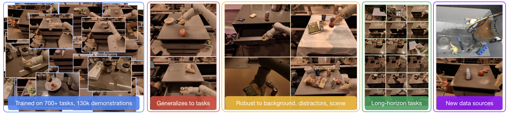
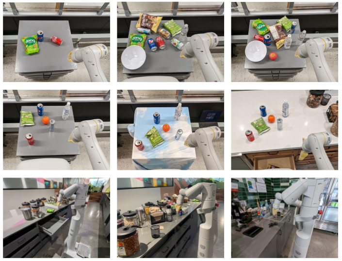
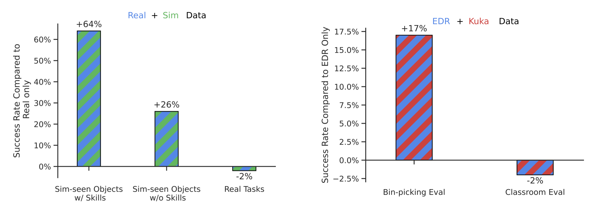
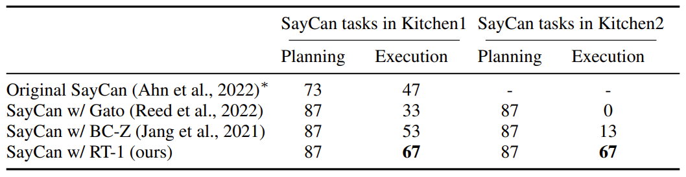

## 论文信息

- **标题：** RT-1: Robotics Transformer for Real-World Control at Scale
- **版本：** arXiv:2212.06817v2（2023-08-11）
- **核心关键词：** Vision-Language-Action, Transformer Policy, Real-World Robotics, Generalization, Data Scaling

---

## 一句话总结

RT-1 的核心价值不是“某个单点技巧”，而是把 **数据规模（130k demos, 700+ instructions）+ 高效可实时的 Transformer 架构（35M, 3Hz）+ 面向泛化的训练设计** 组合在一起，证明了机器人策略模型也可以像视觉/语言模型一样走“规模化吸收数据 -> 泛化提升”的路线。

---

## 重要插图

### 1) 总览图（Teaser）

![Screenshot 2026-04-24 at 19.46.21]pictures/Screenshot 2026-04-24 at 19.46.21.png)

### 2) 泛化评测场景图

### 3) 主结果图（Seen / Unseen / Robustness）

### 4) 异构数据吸收结果（仿真/多机器人）

### 5) SayCan 长时任务结果

---

## 研究问题与动机

作者在回答 5 个关键问题：

1. 一个统一模型能否在真实世界学会大量指令，并对新任务/新环境泛化？
2. 能否吸收异构数据（仿真、不同机器人）且不破坏原有能力？
3. 能否支持长时序任务（SayCan 场景）？
4. 数据规模与数据多样性哪个更关键？
5. RT-1 的哪些工程设计真正贡献了性能？

---

## RT-1 方法细节（精读）

### 1) 输入输出形式

- **输入：** 6 帧历史图像 + 自然语言指令
- **输出：** 离散化动作 token
- **控制频率：** 3 Hz（面向真实机器人闭环控制）

### 2) 架构分解

RT-1 = `FiLM-conditioned EfficientNet-B3` + `TokenLearner` + `Decoder-only Transformer`

- **视觉与语言早融合（Early Fusion）**
  - 使用 USE（Universal Sentence Encoder）得到语言嵌入
  - 通过 FiLM 调制 EfficientNet 中间特征
  - 关键技巧：FiLM 层做 identity 初始化，尽量不破坏预训练特征

- **Token 压缩（实时性关键）**
  - EfficientNet 输出 81 个视觉 token
  - TokenLearner 压缩到 8 个 token
  - 6 帧历史合并后形成 48 个 token 给 Transformer

- **Transformer 主干**
  - Decoder-only, 8 层自注意力
  - 与前端合计约 35M 参数（其中 Transformer 约 19M）

### 3) 动作离散化设计

每个动作维度离散成 256 bins：

- 7 维机械臂（x, y, z, roll, pitch, yaw, gripper）
- 3 维底盘（x, y, yaw）
- 1 维模式切换（arm/base/terminate）

训练目标是标准 causal mask + cross-entropy。

这一步很关键：论文后续消融显示，相比连续高斯动作建模，离散 token 在复杂多模态动作分布下效果明显更好。

### 4) 为什么能跑到实时

RT-1 为了满足真实控制延迟预算（论文里给出模型预算 <100ms），用了两个直接有效的优化：

- TokenLearner 压 token（提速约 2.4x）
- 历史窗口重叠部分复用特征（提速约 1.7x）

---

## 数据集与任务设计

- **数据采集：** 13 台机器人，17 个月，约 130k 真实示范轨迹
- **指令规模：** 700+ 语言指令（论文表述为 700+，表 1 汇总为 744）
- **技能类型：** pick / move-near / place-upright / knock-over / open/close drawer / in-out receptacle 等
- **场景：** 训练 robot classroom + 两个真实厨房（Kitchen1 / Kitchen2）

作者强调：任务和对象都要有“结构化多样性”，不是单纯堆数据量。

---

## 关键实验结果（带数字）

### 1) 总体性能（Table 2）

- **Seen tasks：** RT-1 = 97（Gato 65, BC-Z 72, BC-Z XL 56）
- **Unseen tasks：** RT-1 = 76（Gato 52, BC-Z 19, BC-Z XL 43）
- **Distractors：** RT-1 = 83（Gato 43, BC-Z 47, BC-Z XL 23）
- **Backgrounds：** RT-1 = 59（Gato 35, BC-Z 41, BC-Z XL 35）

论文给出的相对结论：RT-1 在四个维度均显著领先，尤其在干扰物和背景变化上的鲁棒性优势明显。

### 2) 真实厨房分级泛化（Table 3）

- **All：** RT-1 = 70（Gato 30, BC-Z 45, BC-Z XL 55）
- **L1：** RT-1 = 88
- **L2：** RT-1 = 75
- **L3：** RT-1 = 50

即便在高分布偏移（L3）下仍保持可用成功率。

### 3) 吸收仿真数据（Table 4）

RT-1 `Real Only` -> `Real + Sim`：

- seen skill + real objects：92 -> 90（-2）
- seen skill + sim-only objects：23 -> 87（+64）
- unseen skill + sim-only objects：7 -> 33（+26）

结论：能吸收仿真知识，并迁移到真实世界，不明显牺牲原有任务性能。

### 4) 吸收不同机器人数据（Table 5）

混合 Kuka bin-picking + EDR 数据后：

- Classroom eval：92 -> 90（-2）
- Bin-picking eval：22 -> 39（+17，接近 2x）

结论：跨形态机器人数据融合有效，且灾难性遗忘较轻。

### 5) SayCan 长时序任务（Table 6）

- Kitchen1 执行成功率：RT-1 67（Gato 33, BC-Z 53）
- Kitchen2 执行成功率：RT-1 67（Gato 0, BC-Z 13）

这是很强的信号：RT-1 能在长链条任务中维持较高执行成功率，且跨厨房泛化显著。

### 6) 数据规模 vs 数据多样性（Table 7）

论文最有价值的经验之一：

- 只减少数据量会掉性能，但还可以接受
- 减少任务多样性（即使保留 97% 数据量）会导致更明显泛化损失

作者结论：**data diversity > data quantity**（在该设置下更关键）。

---

## 模型消融的关键信息（Appendix D.4/D.5）

- 连续动作（高斯）显著劣于离散动作 token
- 去掉 ImageNet 预训练会显著伤害泛化（尤其 unseen tasks）
- 自回归动作生成会让推理慢约 2x，收益不明显
- 去掉历史帧会明显损伤泛化与鲁棒性
- 去掉 Transformer 有负面影响，但不是最大伤害项

我的理解：RT-1 成功不是“换了 Transformer 就赢”，而是 **离散动作建模 + 早融合 + 预训练 + 历史信息 + 数据多样性** 的系统工程。

---

## 与 OpenVLA 的关系（结合你前一篇笔记）

RT-1 可以看成 OpenVLA 的直接前辈之一：

- **共同点：** 都把机器人控制表述成 token 预测问题
- **差异点：**
  - RT-1 仍是相对轻量策略网络（35M）
  - OpenVLA 进一步走向大规模 VLM 主干（Prismatic + Llama）
  - RT-1 的语言编码更“工程化”（USE + FiLM），OpenVLA 走“统一 VLM 语义空间”路线

可以粗略理解为：

- RT-1 证明了“token 化动作 + 大规模多任务数据”在真实机器人上的可行性
- OpenVLA 进一步把这条路线推向“通用视觉语言模型 backbone”的阶段

---

## 局限与思考

论文也明确了局限：

- 本质仍是 imitation learning，性能受示范上限约束
- 对全新运动模式（训练从未出现）泛化有限
- 任务覆盖虽大，但操作灵巧性（dexterity）仍有限

我自己的补充理解：

- RT-1 的成功很依赖高质量、流程化的数据采集基础设施，这在学术外部团队不容易复现
- 3Hz 对高层 manipulation 可以接受，但对更快动态控制仍不够
- 离散动作非常实用，但分箱策略与跨平台标定在更复杂动作空间里会变成新瓶颈

---

## 可复用的工程启发

如果要做自己的 VLA/机器人策略系统，这篇论文最值得直接拿走的实践是：

1. 先保证实时闭环，再谈模型规模（延迟是硬约束）
2. 用 token 压缩和缓存复用解决 Transformer 推理成本
3. 优先提升任务/对象/环境多样性，而不是盲目追求总样本数
4. 动作离散化是强 baseline，不要默认连续高斯更“高级”
5. 异构数据（仿真、他机型）不要怕混，关键是评估是否保持原任务能力

---

## 参考

- Paper: [RT-1: Robotics Transformer for Real-World Control at Scale](https://arxiv.org/abs/2212.06817)
- Project: [robotics-transformer1.github.io](https://robotics-transformer1.github.io/)
