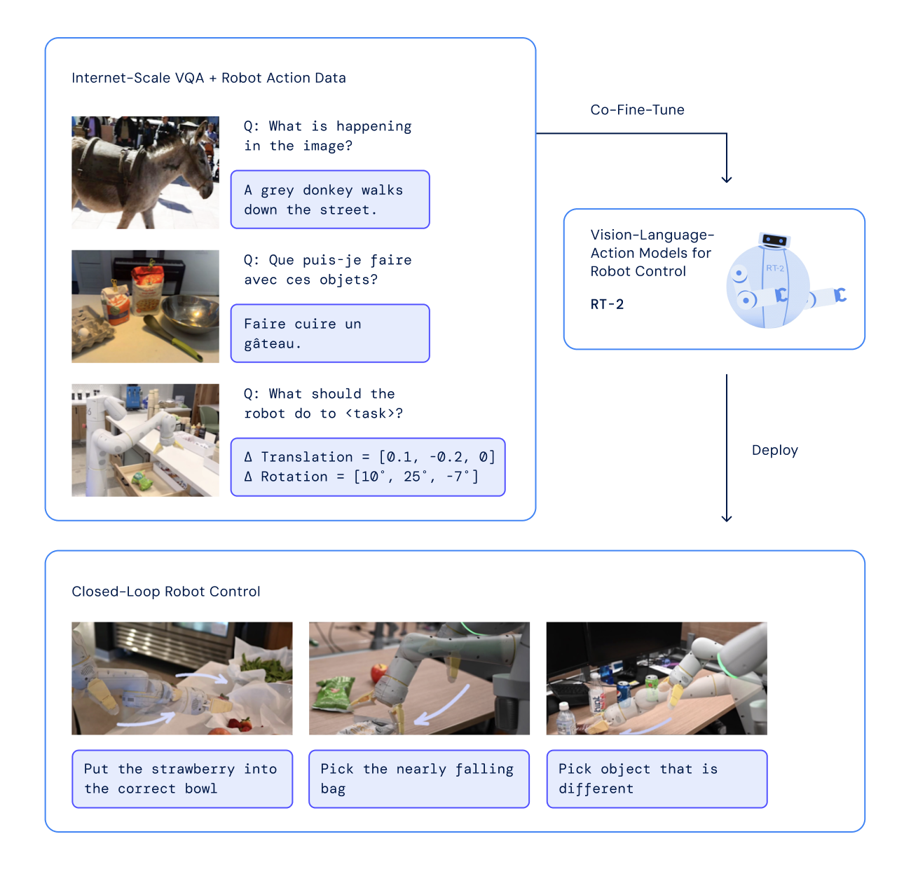
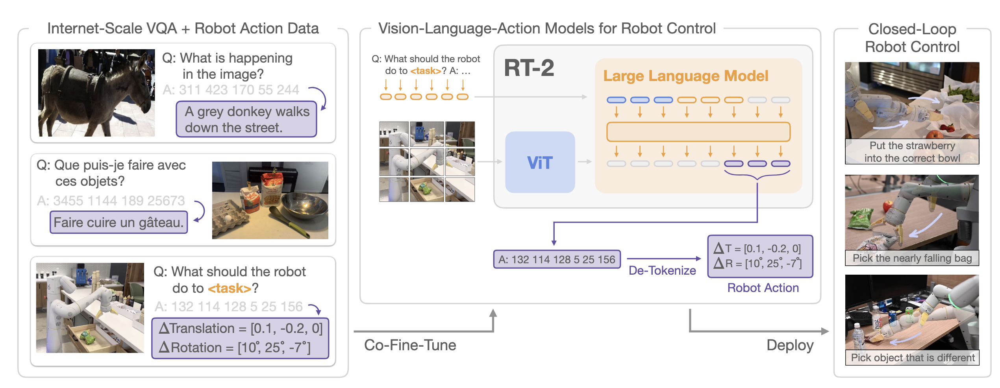
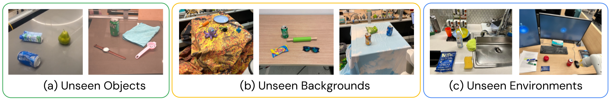
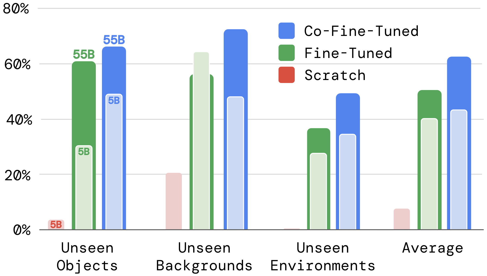
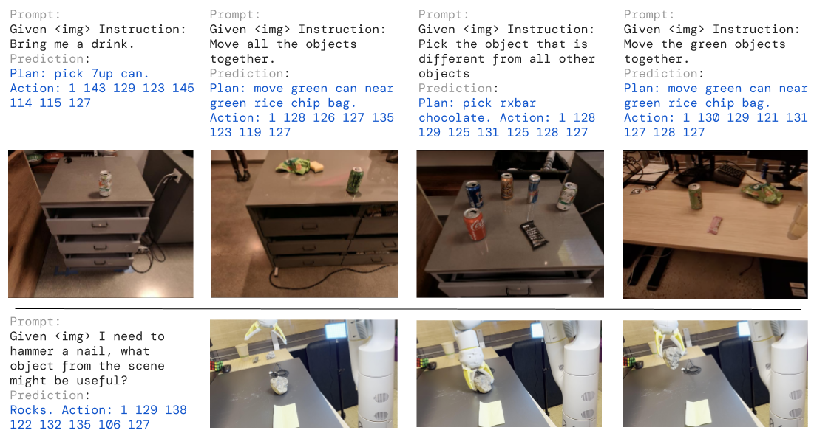

## 论文信息

- **标题：** RT-2: Vision-Language-Action Models Transfer Web Knowledge to Robotic Control
- **版本：** arXiv:2307.15818v1（2023-07）
- **一句话主题：** 把大规模 VLM 直接变成低层机器人策略，让“网络语义知识”直接迁移到动作控制。

---

## 一句话总结

We study how vision-language models trained on Internet-scale data can be incorporated directly into  end-to-end robotic control to boost generalization and enable emergent semantic reasoning. Our goal is  to enable a single end-to-end trained model to both learn to map robot observations to actions and enjoy  the benefits of large-scale pretraining on language and vision-language data from the web. To this end,  we propose to co-fine-tune state-of-the-art vision-language models on both robotic trajectory data and  Internet-scale vision-language tasks, such as visual question answering. In contrast to other approaches,  we propose a simple, general recipe to achieve this goal: in order to fit both natural language responses  and robotic actions into the same format, we express the actions as text tokens and incorporate them  directly into the training set of the model in the same way as natural language tokens. We refer to  such category of models as **vision-language-action models (VLA)** and instantiate an example of such  a model, which we call RT-2. Our extensive evaluation (6k evaluation trials) shows that our approach  leads to performant robotic policies and enables RT-2 to obtain a range of emergent capabili8ties from  Internet-scale training. This includes significantly improved generalization to novel objects, the ability  to interpret commands not present in the robot training data (such as placing an object onto a particular  number or icon), and the ability to perform rudimentary reasoning in response to user commands (such  as picking up the smallest or largest object, or the one closest to another object). We further show that  incorporating **chain of thought reasoning** allows RT-2 to perform multi-stage semantic reasoning, for  example figuring out which object to pick up for use as an improvised hammer (a rock), or which type  of drink is best suited for someone who is tired (an energy drink).

RT-2 相比 RT-1 的关键飞跃是：**不再只在机器人数据内学习泛化，而是把 web-scale VLM 的语义能力通过统一 token 输出空间直接迁移到动作生成**，从而在新物体/新场景泛化和 emergent reasoning 上显著提升。

---

## 重要插图

### 1) 总览图（Teaser）

### 2) 方法总览（动作文本化 + 共训练）

### 3) 核心模型架构图

### 4) 泛化主结果图（Seen vs Unseen）

### 5) Emergent 能力评估图

### 6) 消融图（模型规模与训练策略）

### 7) Language-Table 图

---

## RT-1 vs RT-2：核心对比

| 维度 | RT-1 | RT-2 |
|---|---|---|
| 模型起点 | 机器人策略模型（35M） | 预训练大规模 VLM（5B/12B/55B） |
| 输入输出 | 图像+指令 -> 动作 token | 图像+指令 -> 文本/动作统一 token |
| 动作表示 | 256-bin 离散动作（专用策略） | 继续用 256-bin，但直接映射到 VLM 词表 token |
| 训练方式 | 机器人 imitation 学习为主 | **co-fine-tuning（机器人数据 + 原 VLM web 数据）** |
| 语义能力来源 | 机器人数据中的语言标注 | 互联网视觉语言预训练知识迁移 |
| 实时部署 | 本地高效推理（3Hz） | 云端多 TPU 推理（55B 可 1-3Hz；5B 约 5Hz） |
| 新能力 | 多任务操作泛化 | 在此基础上增加符号理解、推理、人物识别、CoT 规划迹象 |

我自己的判断：RT-1 是“强机器人 policy”，RT-2 是“把 VLM 变成 policy”的范式升级。

---

## RT-2 的关键创新点

### 1) 统一输出空间：把动作当作“文本 token”预测

- 将每个动作维度离散化到 256 bins，并编码成 token 序列输出。
- 对 PaLI-X：可直接用数字 token（<=1000 有独立 token）。
- 对 PaLM-E：覆盖最低频的 256 个 token 作为动作词表。

这使得模型可以在同一解码器里同时处理“语言任务”和“动作任务”。

### 2) Co-Fine-Tuning（论文强调的核心工程点）

不是只拿机器人数据微调，而是把机器人轨迹和原始 web-scale 视觉语言数据一起训练。

- RT-2-PaLI-X 训练混合里机器人数据约占 50%
- RT-2-PaLM-E 里机器人数据约占 66%

效果上，这能减少“机器人微调导致的语义遗忘”，提升泛化。

### 3) 输出约束（Output Constraint）

机器人执行时只允许采样合法动作 token，避免模型输出普通自然语言导致不可执行动作。

### 4) 大模型可执行部署方案

- 55B 模型使用多 TPU 云服务推理，闭环频率 1-3Hz
- 5B 模型可到约 5Hz

本质是用系统工程把“超大 VLM 低层控制”从不可能变成可落地。

---

## 定量结果（重点看 RT-1 对比）

## 1) 主评测：Seen + Unseen 泛化（Appendix Table）

### Seen Tasks

- RT-1: **92**
- RT-2-PaLI-X-55B: **91**
- RT-2-PaLM-E-12B: **93**

结论：在 seen tasks 上 RT-2 与 RT-1 基本同档，没有牺牲已有能力。

### Unseen Average（对象/背景/环境平均）

- RT-1: **32**
- MOO: **35**
- RT-2-PaLI-X-55B: **62**
- RT-2-PaLM-E-12B: **62**

相对 RT-1 大约提升 **1.9x**。

### 各子项（RT-1 -> RT-2-PaLI-X-55B）

- Unseen Objects Easy: 31 -> 70
- Unseen Objects Hard: 43 -> 62
- Unseen Backgrounds Easy: 71 -> 96
- Unseen Backgrounds Hard: 9 -> 48
- Unseen Environments Easy: 26 -> 63
- Unseen Environments Hard: 14 -> 35

可见提升最大的通常是 harder OOD 条件（尤其 background hard）。

## 2) Emergent 能力评测（符号/推理/人物识别）

论文把 emergent 分成三类：

- Symbol understanding
- Reasoning（含 math、logo、nutrition、multilingual）
- Person recognition

总体平均：

- RT-1: **17**
- RT-2-PaLI-X-55B: **60**
- RT-2-PaLM-E-12B: **40**

RT-2-PaLI-X-55B 相比 RT-1 约 **3.5x**。

## 3) Language-Table 开源基准（模拟）

- BC-Zero: 72 ± 3
- RT-1: 74 ± 13
- LAVA: 77 ± 4
- RT-2-PaLI-3B: **90 ± 10**

说明这套范式在不同环境与任务形式下也有迁移价值。

---

## 消融：为什么 RT-2 有效

在 PaLI-X 分支的消融里：

- **从零训练 5B**：平均 9（几乎不可用）
- **仅机器人 fine-tune（5B）**：平均 42
- **co-fine-tune（5B）**：平均 44
- **仅机器人 fine-tune（55B）**：平均 52
- **co-fine-tune（55B）**：平均 63（最佳）

两个关键信号：

1. 规模很重要（5B -> 55B 提升明显）
2. co-fine-tuning 比单纯 robot-only fine-tuning 更好

---

## Chain-of-Thought（CoT）在 RT-2 中的意义

作者尝试让模型先输出自然语言 `Plan` 再输出 `Action tokens`，例如：

`Instruction -> Plan -> Action`

结论是“定性上出现了更复杂语义推理行为”（例如“临时当锤子该选什么”“疲惫的人该给什么饮料”）。

这不是严格意义上“已被充分量化证明的 CoT 控制突破”，但它展示了一个重要方向：**高层语言推理与低层控制可以在同一 VLA 模型中耦合**。

---

## 我对 RT-2 相比 RT-1 的创新判断

最关键的不是“模型更大”，而是以下三点同时成立：

1. **范式统一：** 语言 token 和动作 token 共用解码空间。
2. **训练统一：** web-scale 视觉语言任务与机器人轨迹联合 co-fine-tuning。
3. **部署统一：** 通过云端推理把超大模型真正接到闭环控制链路里。

RT-1 解决了“多任务机器人控制可规模化”；RT-2 进一步解决了“把互联网语义知识直接注入控制策略”。

---

## 局限（论文也承认）

- 新增的是语义与推理泛化，不是全新运动技能本体。
- 物理技能仍受机器人数据分布限制。
- 某些难动态交互（如特殊推物体动力学）仍失败。
- 55B 路线依赖云端 TPU 基础设施，工程门槛高。

---

## 对你现有 RT-1 笔记的衔接建议

如果后续把 RT-1 / RT-2 / OpenVLA 写成系列，我建议主线可以是：

- RT-1：验证 tokenized action + 大规模机器人数据
- RT-2：验证 web VLM 知识可迁移到 low-level control
- OpenVLA：往开源 VLM 主干和更易复现训练栈推进

这样三篇会形成一条非常清晰的 VLA 演进路线。

---

## 参考

- Paper: [RT-2: Vision-Language-Action Models Transfer Web Knowledge to Robotic Control](https://arxiv.org/abs/2307.15818)
- Project: [robotics-transformer2.github.io](https://robotics-transformer2.github.io/)
