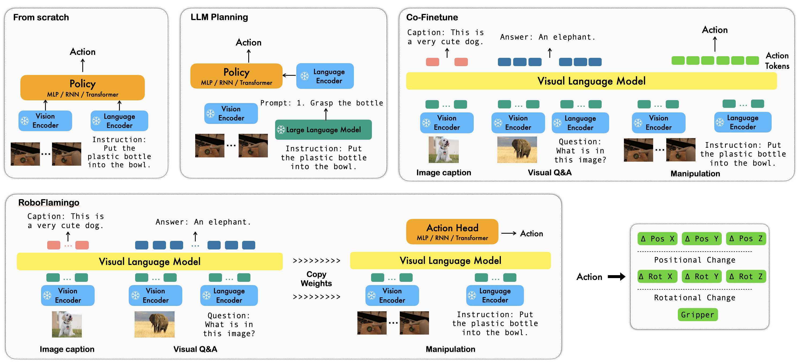
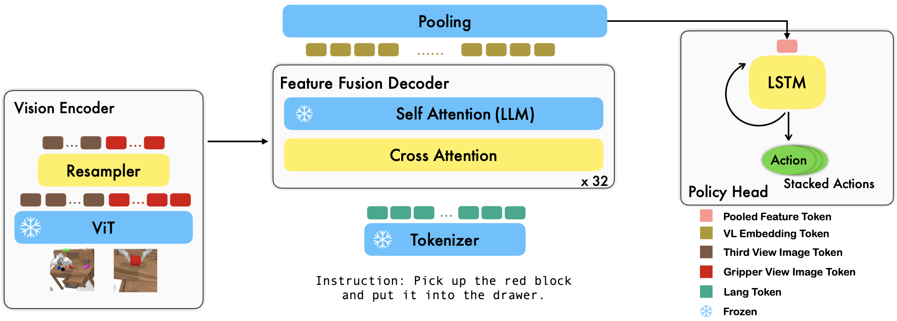
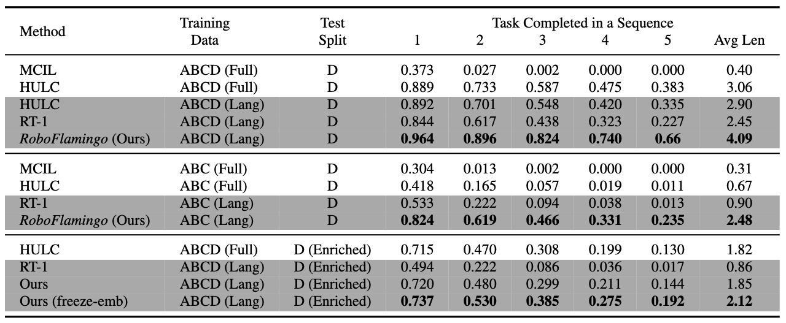
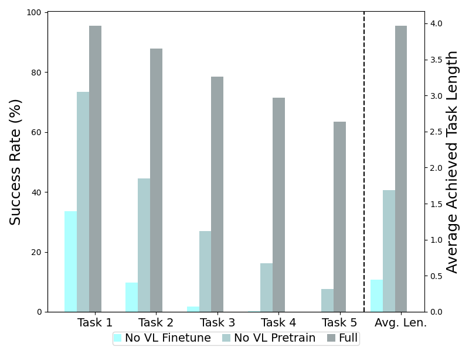

## 论文信息

- **标题：** Vision-Language Foundation Models as Effective Robot Imitators
- **作者：** Xinghang Li, Minghuan Liu, Hanbo Zhang, Cunjun Yu, Jie Xu, Hongtao Wu, Chilam Cheang, Ya Jing, Weinan Zhang, Huaping Liu, Hang Li, Tao Kong
- **版本：** arXiv:2311.01378v3（2024-02）
- **一句话主题：** 用 OpenFlamingo 做视觉语言理解骨干，外接时序 policy head 做控制，以参数高效微调实现强机器人 imitation 性能。

---

## 一句话总结

RoboFlamingo 的关键不是"把 VLM 端到端硬拉成策略"，而是明确拆分职责：VLM 负责单步视觉语言融合，policy head 负责跨时序动作生成。实现层面最重要的是：**resampler 压缩、cross-attn 融合、LSTM/GPT 头建模历史、参数高效微调策略**。

我把它记成一句话：`强感知 backbone + 可控时序 head`。

---

## 论文原文关键段落 + 详细解释

### 1) 方法核心句

> "utilizes pre-trained VLMs for single-step vision-language comprehension, models sequential history information with an explicit policy head"

这句在实现上的含义是"感知和控制解耦"：

- 感知融合交给 OpenFlamingo backbone
- 时序记忆交给显式 policy head

这样做的优势是训练稳定、可替换性强、算力可控。

### 2) 训练策略关键句

> "only training the parameters of the resampler, the gated cross-attention ... and the policy head while freezing all other parameters"

这是典型参数高效微调（PEFT）思想。不是全模型乱调，而是只调最影响跨模态对齐和任务适配的子模块，避免 full fine-tune 引发灾难性遗忘或训练不稳。

### 3) 消融动机关键句

> "To verify the necessity of VL pre-training ..."

作者明确检验"VL 预训练到底是否必要"。结果表明去掉 VL 预训练会显著掉点，说明提升不是只靠后端 policy head 堆参数。

### 4) 复现资源关键句

> "All experiments ... on a single GPU server with 8 NVIDIA Tesla A100 GPUs"

这个信息很重要：它说明方案不是"只能大厂复现"。同时论文给出 MPT-3B/MPT-9B 的每 epoch 训练时长，具备工程规划价值。

---

## 重要插图

### 1) 与已有路线的对比图

### 2) 方法框架图

### 3) 主评测结果图

### 4) 消融图（策略头/训练范式/开环控制）

这几张图里我最常回看的是 `framework` 和 `train_abl`，前者看结构，后者看设计是否真的有效。

---

## 实现视角：网络如何从输入走到动作

### 1) 输入与编码

每个时刻输入包括：

- 语言指令 token
- 第三人称视角图像
- gripper 视角图像

视觉经 frozen ViT 编码后得到 token 序列，再由 perceiver resampler 把 token 数量从 `N` 压到 `N_r`，减少后续 cross-attn 计算量。

### 2) Feature Fusion Decoder（Flamingo 主干）

压缩后的视觉 token 与语言 token 在 feature fusion decoder 中融合（self-attn + gated cross-attn 结构）。输出的是"当前时刻的视觉语言联合表征"，本质上偏单步理解。

### 3) Policy Head 负责时序

RoboFlamingo 不把长时序全压给 backbone，而是把每步 pooled feature 交给 policy head（默认 LSTM）做历史整合。最终输出 7-DoF 动作（末端位姿 + gripper）。

这一设计让你可以单独替换 policy head（MLP/GPT/LSTM）而不重构 VLM 主干。

---

## 训练目标与参数更新策略

### 1) 监督目标（imitation）

论文把策略学习写成最大似然目标，落地损失为：

- 末端位姿：MSE
- gripper：BCE
- 总损失：逐时刻累加

### 2) 参数更新策略

| 模块                 | 训练策略         |
| -------------------- | ---------------- |
| ViT 视觉编码器       | 冻结             |
| LLM 主体（decoder layers） | 冻结       |
| Perceiver Resampler  | 训练             |
| Gated Cross-Attention | 训练            |
| Policy Head          | 训练             |
| **可训练参数量**       | ~1B（M-3B 设定） |

### 3) 为什么不全量微调

附录 Table 8 显示：

| 设置                  | 可训练参数量 | Avg. Len.（ABCD→D） |
| --------------------- | ----------- | ------------------- |
| Full fine-tune（3B）  | ~3B         | 0.50                |
| RoboFlamingo-style    | ~1B         | **4.09**            |

在该任务/数据规模下，全量微调更容易把预训练分布对齐破坏掉。少而关键地微调，比全量微调更稳更实用。

---

## 训练超参数

| 项目             | 具体设置                           |
| ---------------- | ---------------------------------- |
| 硬件             | 单服务器 8 × A100（80GB）          |
| Batch Size       | 6 每卡（per GPU）                    |
| 优化器           | AdamW                              |
| 学习率           | 1e-4（具体数值需查附录确认）        |
| 训练轮数         | 3–4 epoch 达最佳                      |
| 数据             | CALVIN ABC→D / ABCD→D              |
| 语言扩充         | GPT-4 生成 50 条同义指令/任务         |
| 评估指标         | Avg. Len.（连续任务长度，最大 5）   |

**训练时长（M-3B）：** ~13h/epoch，最佳在第 3 epoch
**训练时长（M-9B）：** ~26h/epoch，最佳在第 4 epoch

---

## 推理路径：闭环与开环

### 1) 默认闭环

每步都重新观察、重编码、重推理，再执行下一动作。这是最稳的控制方式。

### 2) 开环（Open-loop）加速

论文也测试了"单次推理输出 stacked actions"来减少推理频率。优点是延迟小，缺点是不重训直接开环会掉性能；需要用 jump-step 数据再训练来缓解。

这给部署一个实用建议：先闭环保性能，再逐步引入开环做吞吐优化。

---

## 主实验结果（结合实现解读）

### 1) 标准 Imitation：ABCD(Lang)→D

| 方法                       | Avg. Len. |
| -------------------------- | --------- |
| HULC（Full）               | 3.06      |
| RT-1（Lang）               | 2.45      |
| **RoboFlamingo（Lang）**   | **4.09**  |

在只用语言标注子集时超过 Full-data 的 HULC，说明预训练 VLM 迁移效果显著。

### 2) 零样本视觉泛化：ABC(Lang)→D

| 方法                       | Avg. Len. |
| -------------------------- | --------- |
| RT-1                       | 0.90      |
| HULC（Full）               | 0.67      |
| **RoboFlamingo**           | **2.48**  |

VLM backbone 的视觉语言先验提高了场景变化下的稳健性。

### 3) 语言泛化（Enriched 指令）

| 方法                               | Avg. Len. |
| ---------------------------------- | --------- |
| HULC                               | 1.82      |
| RT-1                               | 0.86      |
| RoboFlamingo                       | 1.85      |
| **RoboFlamingo（freeze-emb）**     | **2.12**  |

这里的工程启示是：**冻结 embedding 层**可减轻同义改写带来的词空间漂移。RoboFlamingo 使用原始词 token（而不是 HULC 的 frozen sentence encoder），因此对同义改写更敏感。Freeze-emb 策略帮助减轻了这种敏感度，并带来 15% 的语言泛化提升。

---

## VLM 变体与小数据规律

### 1) 不同 Backbone 的任务表现（Backbone Comparison）

| Backbone         | Best Avg. Len.（ABCD→D） |
| ---------------- | ------------------------ |
| M-3B-IFT          | **4.09**                    |
| M-3B             | 3.94                     |
| G-4B-IFT         | 3.79                     |
| L-9B             | 2.79                     |
| M-9B             | 3.97                     |

**结论：** "更大模型"不是绝对优势。M-3B-IFT（含指令微调）反而超过更大的 L-9B，说明模型架构与指令微调路径同样关键。

### 2) 低资源（10% Language Data）

| Backbone | Avg. Len. |
| -------- | --------- |
| M-3B     | 0.05      |
| M-9B     | **0.83**  |

在极低数据 regime，**规模优势更明显**，data efficiency 更好。大模型用更少数据就能达到相近表现。

---

## 消融实验详解

### 1) 策略头对比（Policy Head Ablation）

| Policy Head   | 特点               | 性能结论             |
| ------------- | ------------------ | -------------------- |
| LSTM + MLP    | 隐式时序编码       | 最佳（与 GPT 接近）    |
| GPT + MLP     | 显式自回归时序编码 | 与 LSTM 表现相近     |
| Single MLP    | 无历史编码         | 显著低于前两者       |

结论：**带历史编码的策略头是必要的**，但 LSTM 和 GPT 在该任务上差别不大。

### 2) 训练范式消融（Training Paradigm）

- **VL 预训练是关键：** 去掉 VL 预训练直接在机器人数据上从头训练 backbone，性能大幅下降。
- **VLM 微调不可少：** 仅靠 policy head 学习是不够的——backbone 也需要在机器人数据上做任务适配。

### 3) 闭环 vs 开环（Open-Loop Control）

- 直接开环推理（不经过 jump-step 重训练）会导致性能明显下降。
- 用 jump-step 数据重训练后可以缓解，但闭环仍然是最稳的方案。
- 开环的优势在于：推理频率更低、延迟更小，适合低性能平台部署。

---

## 与 GR-1 / OpenVLA 的关系

RoboFlamingo、GR-1、OpenVLA 代表了 VLA 领域的三种技术路线：

| 维度           | RoboFlamingo                      | GR-1                         | OpenVLA                  |
| -------------- | --------------------------------- | ---------------------------- | ------------------------ |
| 结构核心       | VLM + 显式 Policy Head（解耦）    | 统一因果 Transformer         | VLM + 动作 Token 离散化    |
| 时序建模       | Policy Head（LSTM/GPT）           | Transformer 内建时序          | 无显式时序头              |
| 视频预测       | 无                                | 联合训练（核心贡献）          | 无                       |
| 预训练         | OpenFlamingo（VL 图文预训练）     | Ego4D（视频生成预训练）       | Prismatic-7B（VLM 预训练） |
| 动作输出       | 连续（MSE + BCE）                 | 连续（Smooth-L1 + BCE）       | 离散 Token（CE Loss）    |
| 参数量         | 3B–9B（~1B 可训练）              | 195M（46M 可训练）            | 7B（全参或 LoRA）        |
| 微调策略       | PEFT（选子模块训练）              | 全量微调（解冻主干）          | 全量微调或 LoRA          |

**互补关系：**

- RoboFlamingo 的 **解耦设计** 是三者中最灵活的——你可以替换 policy head 来适配不同控制频率需求，而骨干网络不需要动。
- GR-1 的 **视频生成先验** 是 RoboFlamingo 和 OpenVLA 都缺失的维度。将 `Lvideo` 引入 RoboFlamingo 的解耦框架可能是一条有趣的混合路线。
- OpenVLA 的 **大规模数据清洗 + LoRA 高效微调** 为所有 VLA 模型提供了工程基础。

---

## 局限与总结

论文主评测仍以 CALVIN 为核心，**真实机器人系统验证不足**；语言泛化在 enriched 设置下仍有退化；开环控制也有明显稳定性代价。

但从工程方法论看，RoboFlamingo 给出了一条非常实用的路线：**把 VLM 当高质量感知融合器，把时序控制交给可控的轻量策略头**。这使它在性能、训练稳定性、部署复杂度之间取得了不错平衡。

如果我要做下一步工作，我会沿着这条解耦路线补强真实机器人数据和开环稳定性。
