## 1 什么是 Verilog、为何需要 HDL

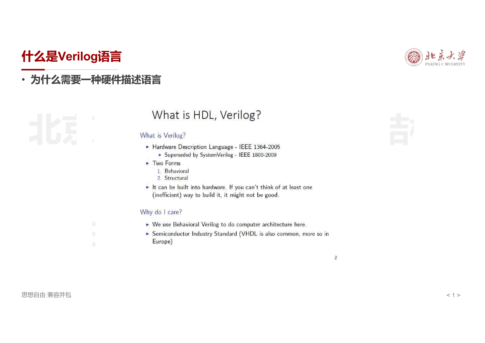{ width="800" }

**Verilog** 属于硬件描述语言（HDL），标准为 IEEE 1364-2005；后续演进为 **SystemVerilog** （IEEE 1800-2009）。描述方式有两类： **行为级** （电路做什么）与 **结构级** （电路如何由器件搭成）。只要能在脑子里想出至少一种（哪怕不高效的）硬件实现，设计才更踏实。行为级 Verilog 在体系结构课程中常用；产业界普遍采用，欧洲也常见 VHDL。

!!! tip "HDL ≠ 软件编程"
    初学者最大的误区是把 Verilog 当作"另一种 C 语言"。Verilog 描述的是 **并行硬件** ：所有 `always` 块、`assign` 语句在概念上是同时执行的，而非像软件那样顺序运行。写 Verilog 时，脑中应始终有一幅"电路图"。

!!! info "如何理解并行执行？"
    在 C 语言中，`a=1; b=a;` 执行完后 `b` 一定是 1。
    在 Verilog 的两个 `assign` 语句中：
    ```verilog
    assign b = a;
    assign a = 1;
    ```
    无论谁写在前面，结果都是一样的：`a` 变成 1 的瞬间，`b` 也会立刻跟着变成 1。它们是**连线**，而不是**动作**。

## 2 行为级与结构级

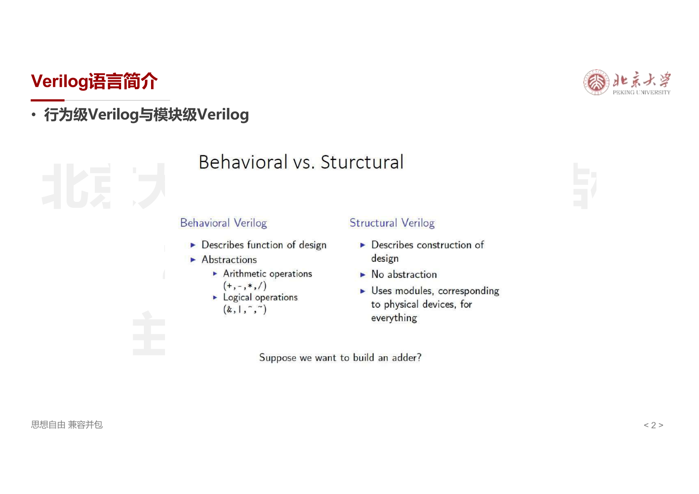{ width="800" }

- **行为级** ：描述功能，抽象层次高，可用算术（`+ - * /`）与按位逻辑（`& | ^ ~` 等）。
- **结构级** ：描述构造，无额外抽象，用与物理器件一一对应的模块搭出电路。

实际项目中，两种风格常混合使用：顶层模块用结构级把各子模块"连线"，子模块内部用行为级描述功能。

接下来以 **1-bit 加法器** 对比两种写法。

## 3 用 Verilog 构建 1-bit 全加器

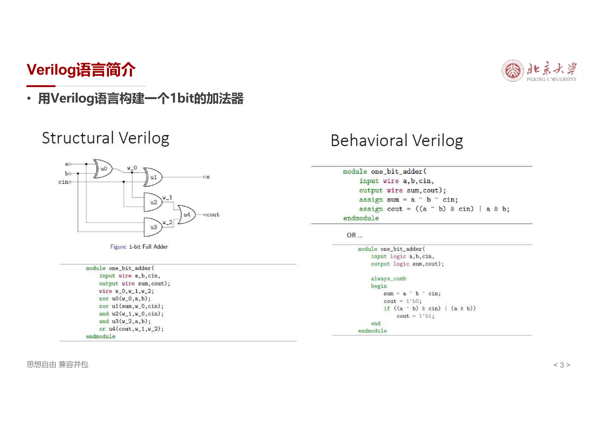{ width="800" }

**结构级** ：声明内部线 `w_0, w_1, w_2`，实例化 `xor` / `and` / `or` 门（`u0`–`u4`），与门级图一一对应。

```verilog
module full_adder_structural(
    input  wire a, b, cin,
    output wire sum, cout
);
    wire w0, w1, w2;
    xor u0(w0, a, b);
    xor u1(sum, w0, cin);
    and u2(w1, w0, cin);
    and u3(w2, a, b);
    or  u4(cout, w1, w2);
endmodule
```

**行为级** 可用 `assign`：

```verilog
module full_adder_behavioral(
    input  wire a, b, cin,
    output wire sum, cout
);
    assign sum  = a ^ b ^ cin;
    assign cout = ((a ^ b) & cin) | (a & b);
endmodule
```

也可用更简洁的拼接赋值：`assign {cout, sum} = a + b + cin;`，综合器会自动推断进位逻辑。

还可用 `always_comb` 过程块描述组合逻辑（注意分支完整，避免无意锁存，见第 9 节）。

## 4 数据类型与可综合性

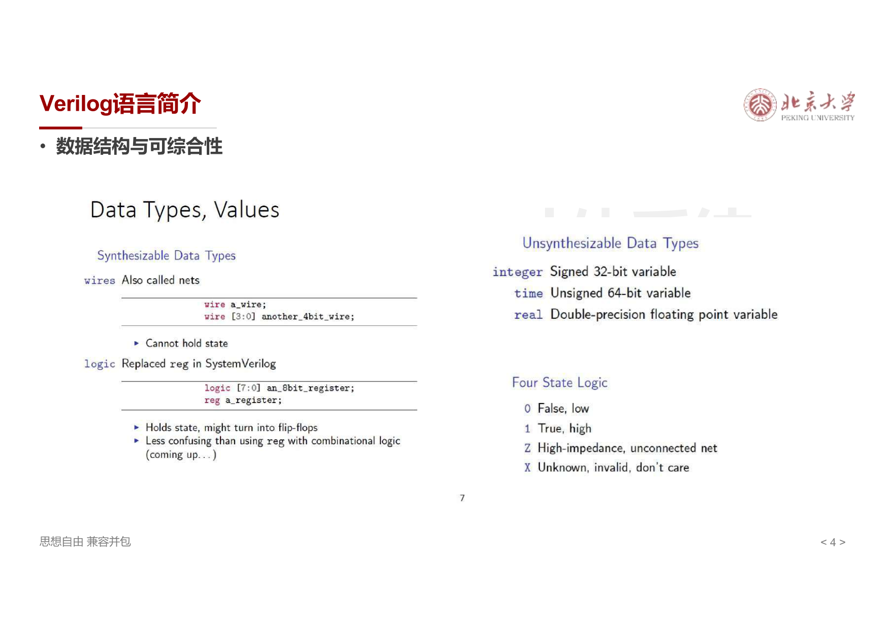{ width="800" }

**可综合类型** ：

**`wire`** — 把它想成电路板上的一根导线。它自己不能"记住"任何值，只是把一端的信号原样传到另一端。只要驱动源变了，`wire` 上的值立刻跟着变。典型用法是 `assign` 连续赋值和模块之间的连线。

```verilog
wire [3:0] bus;          // 4-bit 总线，本身不存值
assign bus = a + b;      // 右侧表达式变化时，bus 实时更新
```

**`reg`** — 名字极具误导性：它 **不一定** 综合成寄存器。`reg` 只是表示"可以在 `always` 块里被赋值的变量"。如果你在 `always_comb`（组合逻辑）里用 `reg`，综合出来的是纯组合电路，没有任何寄存器。只有在 `always_ff`（时序逻辑）里赋值时，它才真正变成触发器。这是经典 Verilog 的遗留设计，新代码建议用 `logic` 替代。

**`logic`** — SystemVerilog 引入的"万能类型"，可以同时替代 `wire` 和 `reg`。无论是 `assign` 连续赋值还是 `always` 块内赋值，都可以用 `logic`。好处是你不用再纠结该写 `wire` 还是 `reg`，语义也更清晰。新项目推荐一律使用 `logic`。

```verilog
logic [7:0] data;        // 既可以被 assign 驱动，也可以在 always 块里赋值
```

!!! warning "`logic` 的一个限制"
    `logic` 只能有一个驱动源。如果需要多个驱动（如三态总线），仍然必须用 `wire`。

**不可综合类型** （多用于仿真）：`integer`（32-bit 有符号整数，常用于 `for` 循环计数）、`time`（64-bit 仿真时间）、`real`（浮点数）。这些类型只在 Testbench 中使用，综合工具会忽略或报错。

**四值逻辑** ：

| 值 | 含义 | 常见场景 |
| --- | --- | --- |
| `0` | 逻辑低 | — |
| `1` | 逻辑高 | — |
| `Z` | 高阻态 | 三态总线、未驱动的引脚 |
| `X` | 未知/不关心 | 未初始化的寄存器、`casez` 中的 don't-care |

!!! warning "X 与 Z 的区别"
    `Z` 是有意的高阻态（如三态缓冲器输出），`X` 表示值未确定（如复位前的寄存器）。仿真中看到 `X` 通常是问题信号，应排查是否遗漏了复位或赋值。

## 5 运算符与 `assign`

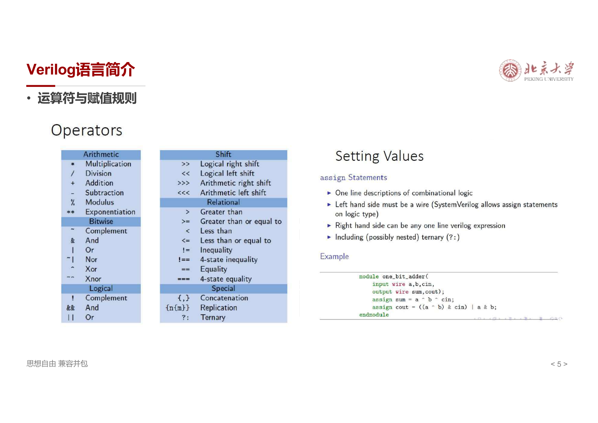{ width="800" }

常用运算符分类：

| 类别 | 运算符 | 说明 |
| --- | --- | --- |
| 算术 | `+ - * / %` | `/` 和 `%` 综合开销大，尽量避免 |
| 按位 | `& \| ^ ~ ^~` | 对每一 bit 操作 |
| 逻辑 | `&& \|\| !` | 结果为 1-bit |
| 归约 | `& \| ^ ~& ~\| ~^` | 将多位归约为 1-bit（如 `&data` = 全 1 检测） |
| 移位 | `<< >> <<< >>>` | `>>>` 为算术右移（保留符号位） |
| 拼接/复制 | `{a, b}` / `{4{a}}` | 灵活构造位向量 |
| 三目 | `cond ? a : b` | MUX 的行为级写法 |

`assign` 用于一行式描述组合逻辑；左侧通常为 `wire`（SystemVerilog 下也可对 `logic` 连续赋值）；右侧为任意合法表达式，可嵌套 `?:`。

!!! tip "归约运算符的妙用"
    `^data` 可一行实现奇偶校验；`|data` 判断是否非零；`&data` 判断是否全 1。写法简洁且综合效率高。

## 6 `always_comb` 与 `always_ff`

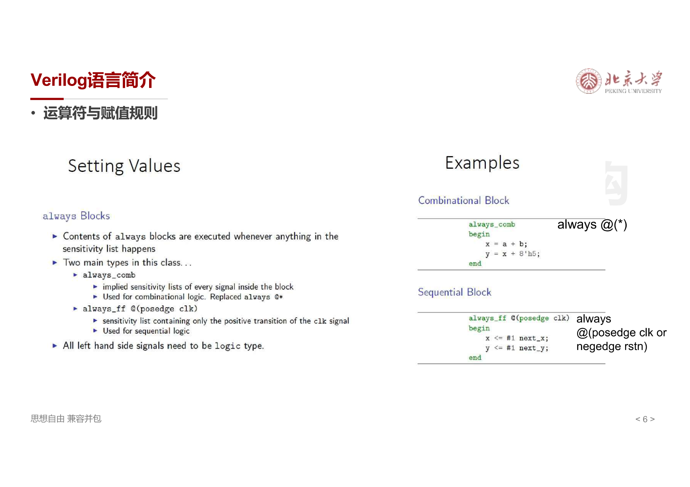{ width="800" }

| | `always_comb` | `always_ff @(posedge clk)` |
| --- | --- | --- |
| 用途 | 组合逻辑 | 时序逻辑（触发器） |
| 敏感表 | **隐式** （块内读取的信号变化即触发） | **显式** （时钟沿，可选复位沿） |
| 赋值 | 阻塞 `=` | 非阻塞 `<=` |
| 综合结果 | 纯组合电路 | 寄存器/触发器 |

块内赋给左侧的信号类型需为 `logic`（SystemVerilog 要求）。

!!! abstract "复位策略对比"
    **异步复位 (Asynchronous Reset)**：复位信号一变，电路立刻复位，不看时钟。
    ```verilog
    always_ff @(posedge clk or negedge rst_n) begin
        if (!rst_n) q <= '0;
        else        q <= d;
    end
    ```
    *优点：节省面积（FPGA/ASIC 触发器通常自带异步复位端）；缺点：容易受毛刺影响。*

    **同步复位 (Synchronous Reset)**：复位信号变了，必须等时钟上升沿到了才复位。
    ```verilog
    always_ff @(posedge clk) begin
        if (!rst_n) q <= '0;
        else        q <= d;
    end
    ```
    *优点：时序完全同步，滤除毛刺；缺点：逻辑稍微复杂一点。*

!!! warning "经典 Verilog 的 `always @*`"
    `always_comb` 是 SystemVerilog 改进，比 `always @*` 更严格——它会在仿真开始时自动执行一次（确保初始值正确），还会检测组合环路。新项目建议一律使用 `always_comb`。

## 7 阻塞赋值与波形（组合逻辑）

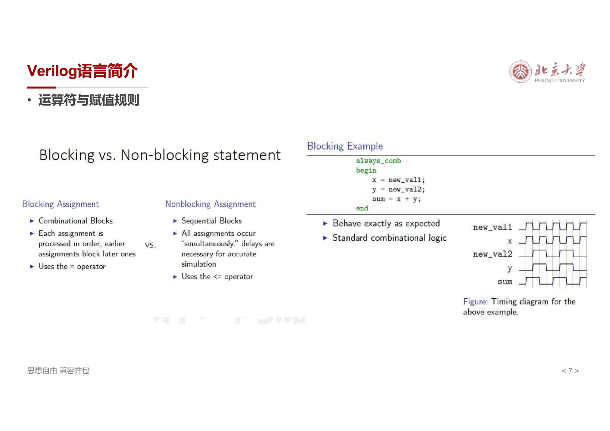{ width="800" }

在 `always_comb` 中使用 **阻塞赋值** `=`：语句顺序执行，前一条会阻塞后一条，行为与组合逻辑预期一致。

```verilog
always_comb begin
    x   = new_val1;
    y   = new_val2;
    sum = x + y;      // 此处 x、y 已是更新后的值
end
```

课件波形中可见：`x`、`y`、`sum` 在输入变化后同一仿真时刻更新。

## 8 非阻塞赋值与波形（时序逻辑）

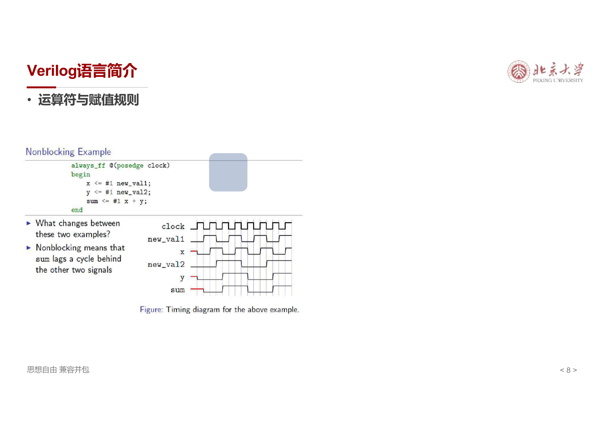{ width="800" }

在 `always_ff` 中使用 **非阻塞赋值** `<=`：同一拍内右侧统一使用更新前的旧值。

```verilog
always_ff @(posedge clk) begin
    x   <= #1 new_val1;
    y   <= #1 new_val2;
    sum <= #1 x + y;   // 此处 x、y 仍为"上一拍"的旧值！
end
```

因此 `sum` 相对 `x`、`y` 会滞后一拍（课件强调这一点）。仿真中常带 `#1` 延迟以在波形中清晰区分时钟沿与数据变化。

!!! abstract "核心口诀"
    组合用阻塞 `=`，时序用非阻塞 `<=`。混用是新手最常见的 bug 来源。

## 9 避免无意产生的 Latch

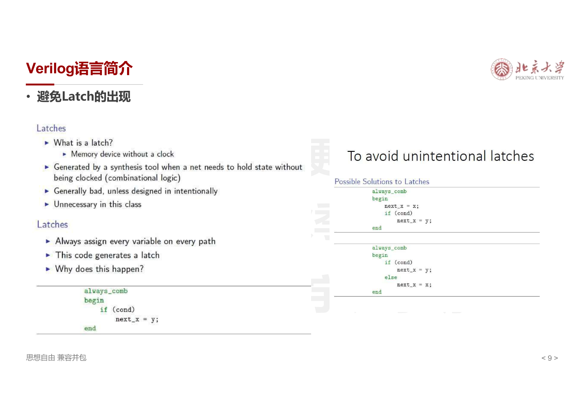{ width="800" }

**Latch** 可理解为无时钟的记忆元件；组合逻辑中若某变量在部分分支未赋值，综合器可能插入 Latch 以"保持原值"，通常非本课期望。

```verilog
// ❌ 有 Latch 风险
always_comb begin
    if (sel)
        out = a;
    // else 分支缺失 → out 需保持旧值 → Latch！
end

// ✅ 方法 1：先给默认值
always_comb begin
    out = '0;           // 默认值
    if (sel)
        out = a;
end

// ✅ 方法 2：写全分支
always_comb begin
    if (sel)
        out = a;
    else
        out = b;
end
```

!!! tip "快速自查"
    综合工具通常会报 latch inference warning。养成习惯：每次综合后检查 warning，确认没有意外的 latch。

## 10 模块（Module）概念

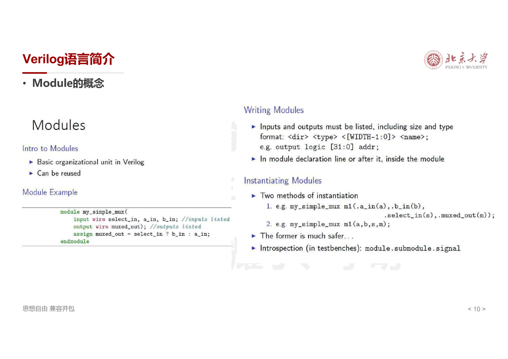{ width="800" }

模块是设计的基本单元，可复用。端口格式为 **方向 + 类型 + 位宽 + 名**。

```verilog
module alu #(parameter WIDTH = 8) (
    input  logic [WIDTH-1:0] a, b,
    input  logic [2:0]       op,
    output logic [WIDTH-1:0] result
);
    // ...
endmodule
```

例化推荐 **按名连接** （`.port(signal)`），比按位置更安全、更易维护：

```verilog
alu #(.WIDTH(16)) u_alu (
    .a      (operand_a),
    .b      (operand_b),
    .op     (alu_op),
    .result (alu_result)
);
```

层次访问可用 `子模块.信号` 等形式（如测试平台调试）。

!!! warning "常见陷阱"
    端口位宽不匹配时 Verilog 不会报错，只会静默截断或零扩展。务必确认例化时信号位宽与模块定义一致。

## 11 组合与时序的可综合性要点

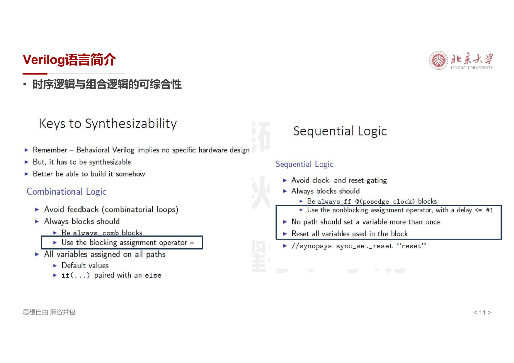{ width="800" }

**组合逻辑** ：

- 避免组合反馈环（A 的输出经过组合逻辑又回到 A 的输入）
- 用 `always_comb` + 阻塞 `=`
- 所有路径赋值完整以免 Latch

**时序逻辑** ：

- 避免随意门控时钟/复位
- 用 `always_ff @(posedge clock)` + 非阻塞 `<=`
- 同一变量不要在多个 `always` 块中被驱动（多驱动会导致综合错误）
- 注意复位策略（同步 vs 异步，全局统一）
- 可配合综合注释如 `//synopsys sync_set_reset 'reset'` 等

## 12 控制流（可综合 vs 仅仿真）

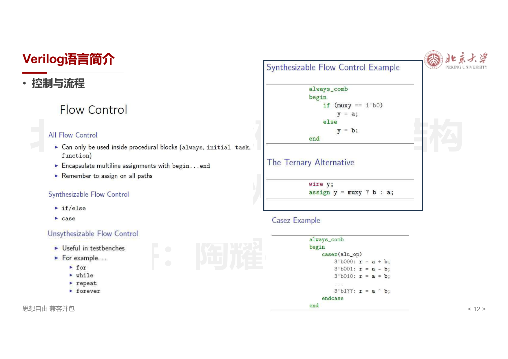{ width="800" }

流程控制仅在 `always` / `initial` / `task` / `function` 等过程环境中使用；多语句用 `begin…end`。

| 结构 | 可综合？ | 说明 |
| --- | --- | --- |
| `if / else` | ✅ | 综合为 MUX 或优先级逻辑 |
| `case / casez` | ✅ | `casez` 用 `?` 表示 don't-care 位 |
| `for`（常量边界） | ✅ | 综合器展开为重复硬件 |
| `for`（变量边界） | ❌ | 仅仿真 |
| `while / repeat / forever` | ❌ | 仅仿真（Testbench） |

!!! tip "`case` vs `if/else` 的综合差异"
    `case` 默认综合为并行多路选择器（所有分支优先级相同），`if/else` 综合为优先级链。当分支间无优先级关系时，`case` 通常综合出更优的电路。

## 13 Testbench 入门

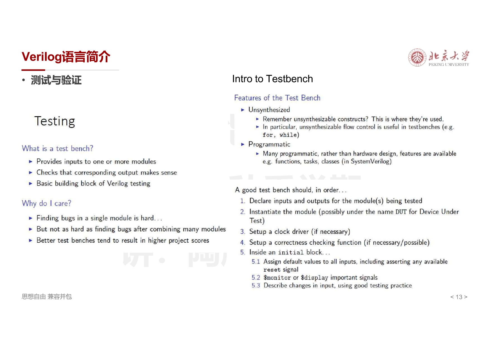{ width="800" }

Testbench 向 DUT（Design Under Test）施加激励并检查输出，是验证的基本单元。TB 不综合，可自由使用循环、延迟等结构。

典型 Testbench 骨架：

```verilog
module tb_adder;
    logic a, b, cin;
    logic sum, cout;

    // 1. 例化 DUT
    full_adder dut(.a(a), .b(b), .cin(cin),
                   .sum(sum), .cout(cout));

    // 2. 施加激励
    initial begin
        {a, b, cin} = 3'b000;
        #10 {a, b, cin} = 3'b011;
        #10 {a, b, cin} = 3'b111;
        #10 $finish;
    end

    // 3. 监控输出
    initial begin
        $monitor("t=%0t a=%b b=%b cin=%b → sum=%b cout=%b",
                 $time, a, b, cin, sum, cout);
    end
endmodule
```

## 14 `initial`、`task` 与 `function`

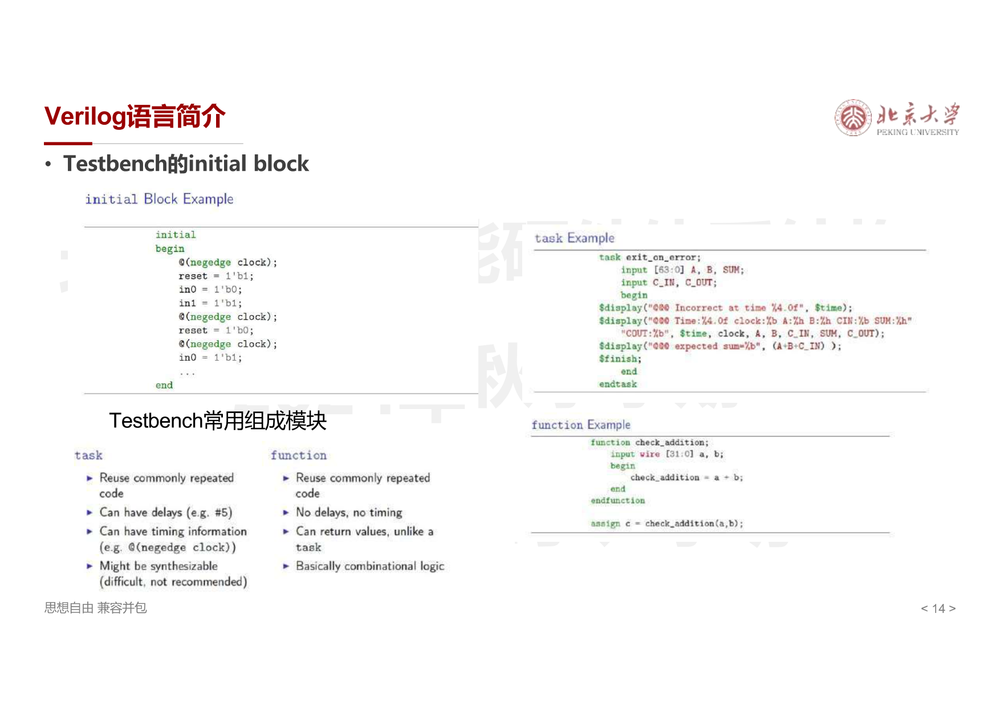{ width="800" }

| | `initial` | `task` | `function` |
| --- | --- | --- | --- |
| 执行次数 | 上电后一次 | 可调用多次 | 可调用多次 |
| 时序控制 | ✅ 可含 `#`、`@` | ✅ 可含延迟 | ❌ 无延迟 |
| 返回值 | — | 无（通过 `output` 参数） | 有 |
| 典型用途 | 激励序列、初始化 | 封装带时序的调试流程 | 纯组合计算、可综合 |

!!! info "`function` 在综合中的妙用"
    `function` 不含时序控制，因此是可综合的。可以用它封装重复的组合逻辑计算，提高代码复用性，如 CRC 计算、编码转换等。

## 15 系统任务与 TB 示例片段

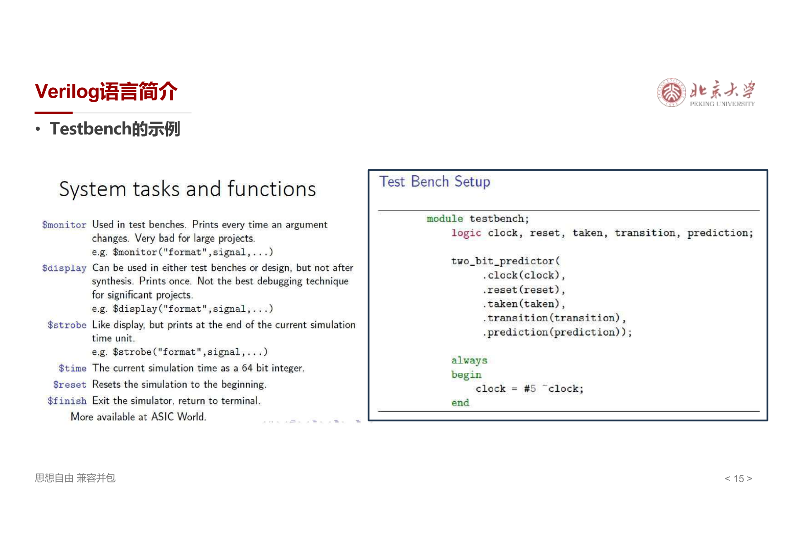{ width="800" }

| 系统任务 | 功能 | 注意事项 |
| --- | --- | --- |
| `$display` | 立即打印（自动换行） | 类似 C 的 `printf` |
| `$monitor` | 信号变化时自动打印 | 同时只能有一个活跃的 `$monitor` |
| `$strobe` | 当前时刻结束时打印 | 看到的是该时刻的最终稳定值 |
| `$time` | 返回当前仿真时间 | — |
| `$finish` | 结束仿真 | — |
| `$readmemh` / `$readmemb` | 从文件读入数据到存储器 | 常用于加载测试向量 |

右侧给出带时钟翻转的 testbench 骨架：例化 DUT、`always` 里 `#` 周期翻转时钟。

## 16 Verilog + Testbench：FIR 实例（设计）

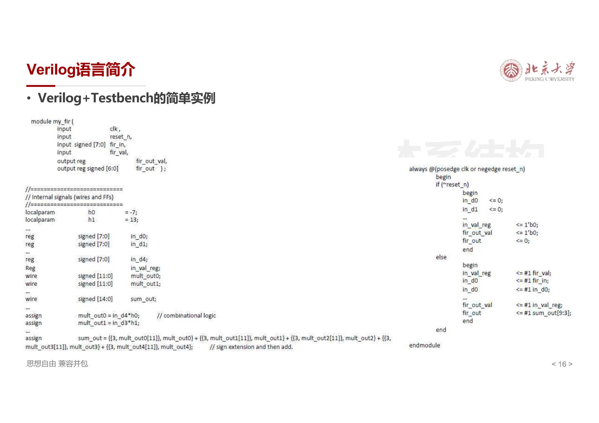{ width="800" }

课件给出 FIR 模块：移位寄存器、系数乘法、符号扩展与多路累加（`sum_out`），以及时序控制与输出截取。体现 assign 组合累加 + always_ff 移位寄存器的典型写法。

FIR 滤波器的核心思想：

$$
y[n] = \sum_{k=0}^{N-1} h[k] \cdot x[n-k]
$$

其中 $h[k]$ 为滤波器系数，$x[n-k]$ 通过移位寄存器实现延迟。

## 17 Verilog + Testbench：FIR 实例（TB）

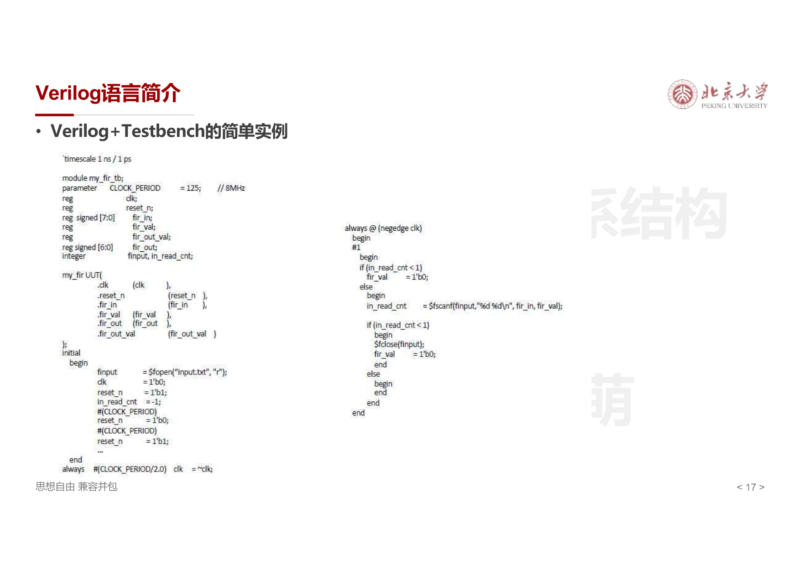{ width="800" }

Testbench 中定义 `timescale`、时钟周期、从文件 `$fopen` / `$fscanf` 读入激励、`always` 产生时钟等，适合作为文件激励型验证模板。

```verilog
`timescale 1ns/1ps
module my_fir_tb;
    parameter CLK_PERIOD = 10;
    logic clk, rst;
    // ... 声明与 DUT 例化 ...
    always #(CLK_PERIOD/2) clk = ~clk;

    initial begin
        clk = 0; rst = 1;
        #(CLK_PERIOD*2) rst = 0;
        // 从文件读取激励 ...
    end
endmodule
```

## 18 简单计数器示例

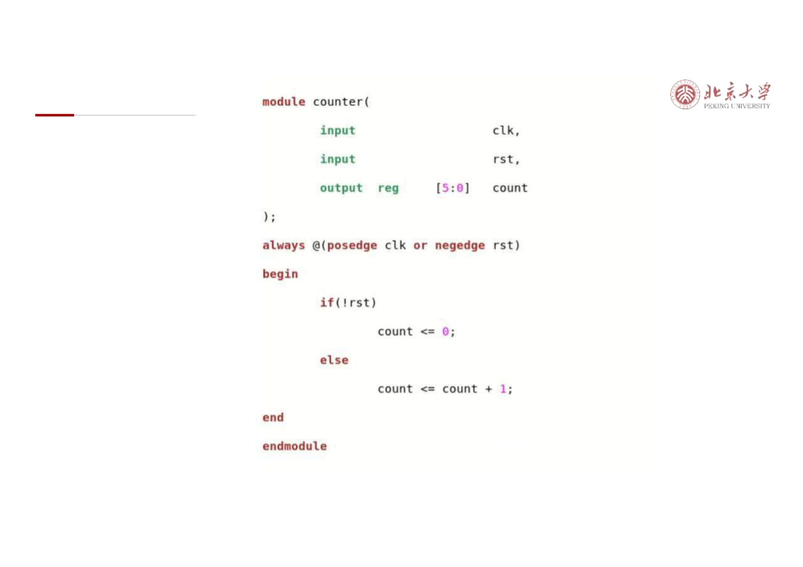{ width="800" }

```verilog
module counter #(parameter WIDTH = 8) (
    input  logic             clk, rst_n,
    output logic [WIDTH-1:0] count
);
    always_ff @(posedge clk or negedge rst_n) begin
        if (!rst_n)
            count <= '0;
        else
            count <= count + 1'b1;
    end
endmodule
```

这是异步复位 + 非阻塞赋值的经典风格。注意 `+ 1'b1` 而非 `+ 1`，避免位宽推断问题。

## 19 有限状态机（FSM）标准模版

在处理复杂控制逻辑（如协议解析、总线控制）时，必须使用状态机。推荐使用 **三段式** 写法，结构最清晰，时序最稳。

```verilog
// 1. 状态定义
typedef enum logic [1:0] {IDLE, READ, WRITE} state_t;
state_t curr_state, next_state;

// 2. 状态转移（时序逻辑）
always_ff @(posedge clk or negedge rst_n) begin
    if (!rst_n) curr_state <= IDLE;
    else        curr_state <= next_state;
end

// 3. 下一状态逻辑（组合逻辑）
always_comb begin
    next_state = curr_state; // 默认保持，防止 Latch
    case (curr_state)
        IDLE:  if (start) next_state = READ;
        READ:  if (done)  next_state = WRITE;
        WRITE: if (ack)   next_state = IDLE;
    endcase
end

// 4. 输出逻辑（组合或时序均可，建议时序输出更稳）
assign out = (curr_state == READ); 
```

---

## 小结

| 主题 | 要点 | 避坑指南 |
| --- | --- | --- |
| 描述方式 | 行为级写功能，结构级写门/模块连接 | 始终保持“电路图”思维 |
| 组合逻辑 | `assign` 或 `always_comb`，用阻塞 `=` | 避免 Latch，检查分支完整性 |
| 时序逻辑 | `always_ff`，用非阻塞 `<=` | 组合用 `=`, 时序用 `<=`，绝不混用 |
| 模块化 | 参数化设计（`parameter`），按名例化 | 注意位宽匹配，Verilog 不报错 |
| 验证 | Testbench 不综合，善用系统任务 | 敏感表里不要漏掉 `negedge rst_n` |
| 状态机 | 推荐三段式写法 | 组合逻辑段必须覆盖所有分支 |
| 算术运算 | 显式指定位宽（如 `+ 1'b1`） | 混合 signed/unsigned 会导致错误 |

课件版权归原课程所有；本文仅作个人学习归档。
