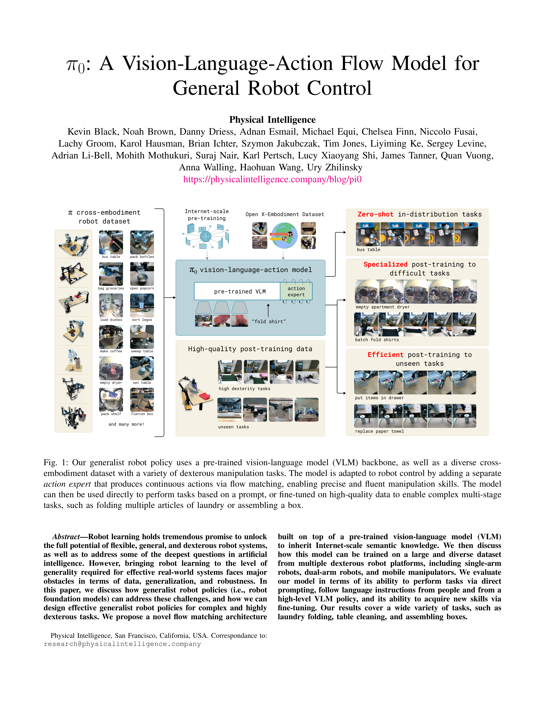
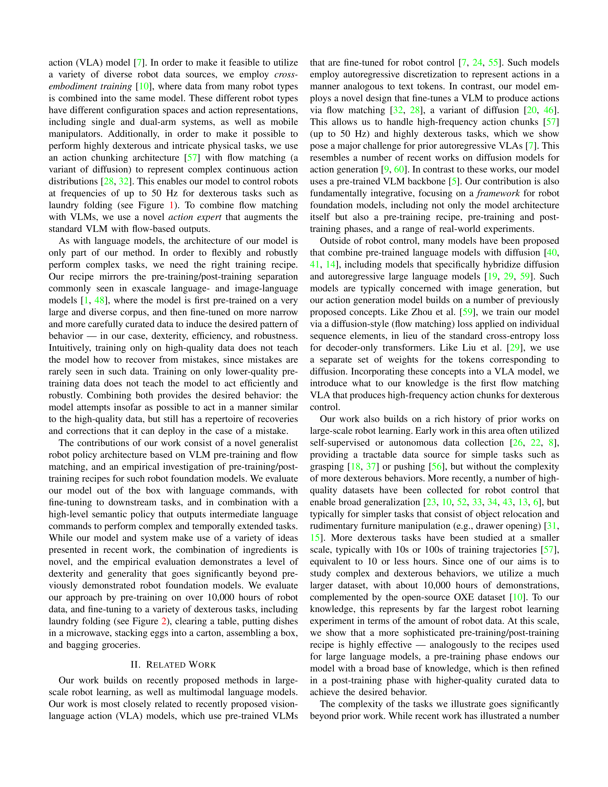
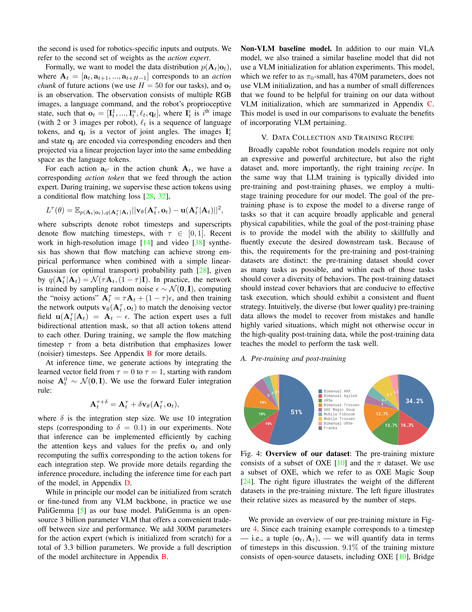
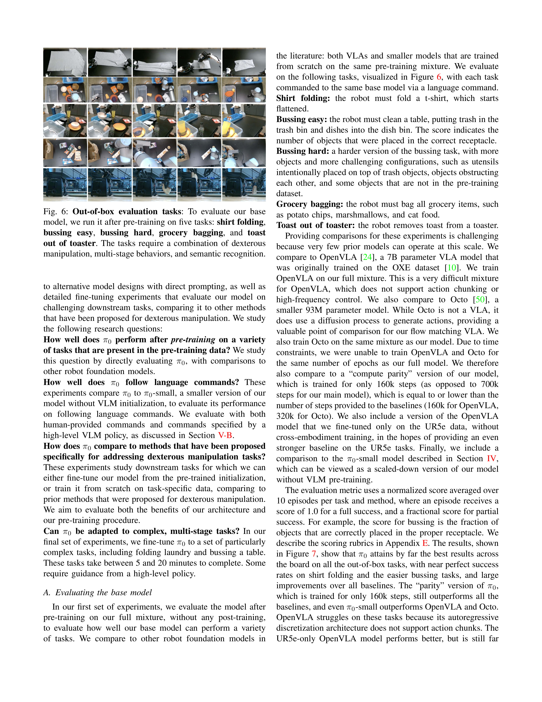
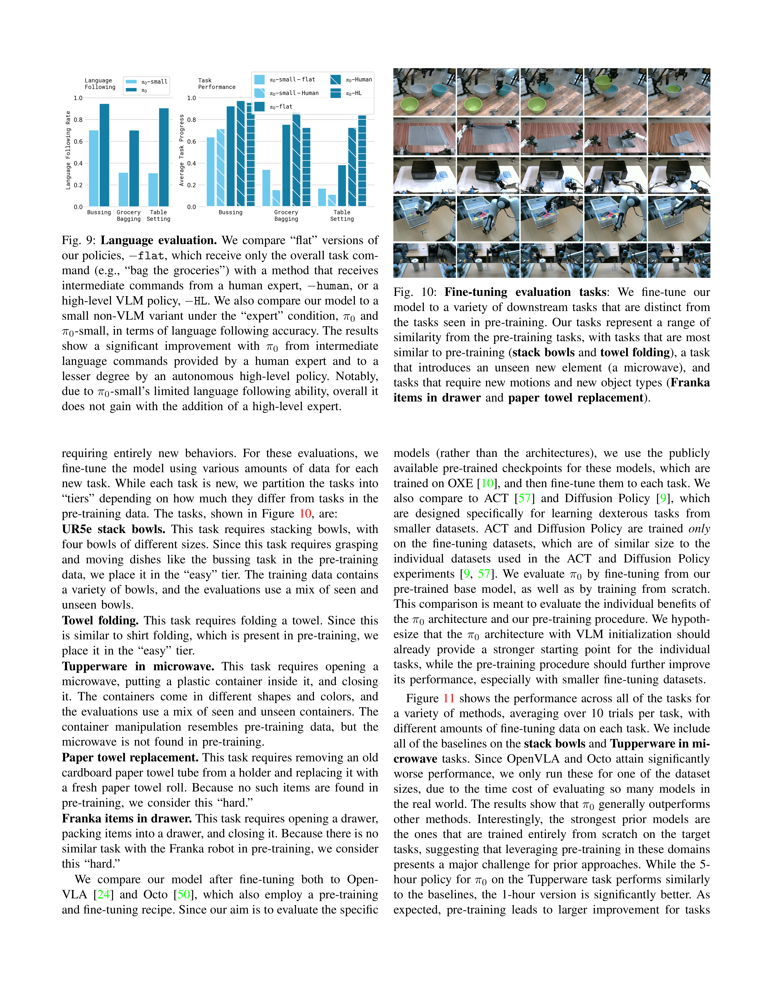
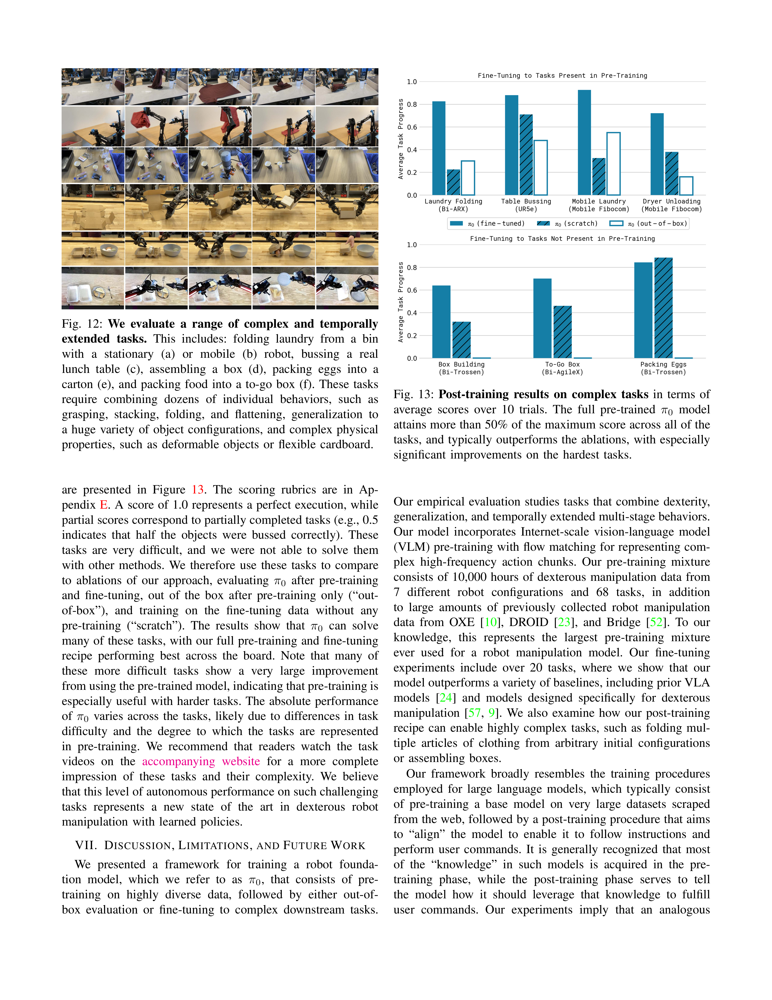

## π0: A Vision-Language-Action Flow Model for General Robot Control

**Physical Intelligence (π), 2024**

### 基础概念

- **VLA (Vision-Language-Action)**: 将视觉-语言模型（VLM）扩展为机器人控制模型，输入图像和语言指令，输出机器人动作
- **Flow Matching（流匹配）**: 一种生成模型方法，是扩散模型（Diffusion Model）的变体。通过学习一个向量场（vector field），将简单分布（如高斯噪声）逐步变换为目标数据分布。相比标准扩散，数学形式更简洁，训练更稳定
- **Action Chunking（动作分块）**: 模型一次预测未来 $H$ 步动作（而非单步），减少推理频率，提升动作连贯性。π0 使用 $H = 50$
- **Cross-Embodiment Training（跨具身训练）**: 将不同机器人平台（单臂、双臂、移动操作）的数据混合训练同一模型，不同机器人的动作维度通过 zero-padding 统一
- **Pre-training / Post-training**: 类似 LLM 的训练范式。预训练阶段使用大规模多样化数据学习通用物理能力；后训练阶段使用高质量专门数据精调特定任务
- **PaliGemma**: Google 开源的 3B 参数视觉-语言模型，由 SigLIP 视觉编码器 + Gemma 2B 语言模型组成，π0 以此为基础架构

### 核心动机

现有的机器人系统大多是 **窄专家**：为特定任务编程，无法泛化。而 NLP 和 CV 领域已经证明，大规模预训练的通用模型在下游任务上可以超越专门训练的模型。π0 的核心假设是：

> **通用机器人策略（机器人基础模型）可以通过大规模多样化数据预训练 + 高质量数据后训练，实现灵巧的通用操作能力。**

这与 OpenVLA 的思路一脉相承，但 π0 在架构（流匹配 vs 自回归离散化）、数据规模（10,000 小时 vs 970k 轨迹）和任务复杂度（叠衣服、组装纸箱 vs 拿放物体）上都迈出了更大的一步。

### 重要图表

{ width="800" }

**Figure 1** 展示了 π0 的整体框架：基于预训练 VLM 骨干，加上独立的 Action Expert 通过 Flow Matching 输出连续动作，可以在多种机器人上执行多种任务。

{ width="800" }

**Figure 3** 展示了训练流程：预训练混合数据（自有灵巧操作数据集 + OXE 开源数据集）→ Flow Matching VLA 模型 → 零样本/后训练应用。

{ width="800" }

**Figure 5** 展示了 7 种不同的机器人配置：从单臂 UR5e/Franka，到双臂 Trossen/ARX，再到移动操作平台，全部统一训练。

### 模型架构

π0 的架构基于 **PaliGemma VLM**，并进行了关键扩展：

#### 整体结构

模型输入为 $o_t = [I^1_t, ..., I^n_t, \ell_t, q_t]$，其中 $I^i_t$ 是 RGB 图像（2-3 张），$\ell_t$ 是语言指令 Token 序列，$q_t$ 是关节角度向量（本体感知状态）。

图像和状态通过编码器映射到与语言 Token 相同的嵌入空间，送入 Transformer 骨干。

#### Action Expert（动作专家）

这是 π0 最核心的架构创新。借鉴 **Transfusion** 的思想，π0 使用 **两组权重（双专家）**：

- **VLM 专家**：处理图像和语言输入，权重从 PaliGemma 初始化（3B 参数）
- **Action 专家**：处理机器人状态 $q_t$ 和动作 $A_t$，从头训练（~300M 参数）

两组权重 **仅在自注意力层交互**，其他参数独立。Action 专家的宽度从 2048 缩小到 1024（MLP 维度从 16384 降到 4096），加速推理。

!!! tip "为什么需要独立的 Action Expert？"
    VLM 预训练时从未见过机器人动作相关的 Token。如果强行复用 VLM 权重来处理动作，会破坏预训练学到的表示。独立专家既保留了 VLM 的语义理解能力，又避免了分布偏移。

#### Flow Matching 输出

模型需要建模动作分布 $p(A_t | o_t)$，其中 $A_t = [a_t, a_{t+1}, ..., a_{t+H-1}]$ 是 $H = 50$ 步的动作块。

**训练目标**：条件流匹配损失

$$
L_\tau(\theta) = \mathbb{E}_{p(A_t|o_t), q(A_t^\tau | A_t)} \left[ \| v_\theta(A_t^\tau, o_t) - u(A_t^\tau | A_t) \|^2 \right]
$$

其中：

- $\tau \in [0, 1]$ 是流匹配时间步
- $A_t^\tau = \tau A_t + (1 - \tau)\epsilon$ 是加噪动作（$\epsilon \sim \mathcal{N}(0, I)$）
- $u(A_t^\tau | A_t) = A_t - \epsilon$ 是去噪向量场（目标）
- $v_\theta$ 是网络预测的向量场

**推理过程**：从纯噪声 $A_t^0 \sim \mathcal{N}(0, I)$ 开始，用前向欧拉法积分 10 步：

$$
A_t^{\tau + \delta} = A_t^\tau + \delta \cdot v_\theta(A_t^\tau, o_t)
$$

其中 $\delta = 0.1$。

!!! warning "Flow Matching vs 标准扩散"
    Flow Matching 使用 **线性传输路径**（optimal transport），而非标准扩散的随机微分方程。这意味着噪声添加是确定性的线性插值，数学上更简洁。本质上，模型学习的是"从噪声到动作"的最短路径。

#### 时间步采样策略

π0 采用了独特的 **Beta 分布采样** $p(\tau) = \text{Beta}(\frac{s - \tau}{s}; 1.5, 1)$，偏重低时间步（高噪声区域），并设置截断值 $s = 0.999$。

!!! tip "为什么偏重高噪声区域？"
    与图像生成不同，动作预测中观测 $o_t$ 非常具有信息量——它强烈约束了可能的动作分布。因此预测均值动作 $\mathbb{E}[A_t | o_t]$ 本身就是难题。相比之下，图像生成中给定文本标签预测均值图像相对简单。高噪声区域的训练对学好"均值动作"至关重要。

#### 注意力掩码

使用 **块状因果注意力（Blockwise Causal Attention）**，分三个块：

1. $[I^1_t, ..., I^n_t, \ell_t]$：图像 + 语言，块内双向注意力
2. $[q_t]$：机器人状态，独立成块（推理时可缓存 KV）
3. $[a^\tau_t, ..., a^\tau_{t+H-1}]$：噪声动作，块内双向注意力，可 attend 到全部输入

### 数据收集与训练方案

π0 的数据规模在机器人学习领域前所未有。

#### 预训练数据混合

| 数据来源 | 比例 | 特点 |
| --- | --- | --- |
| 自有灵巧操作数据 | 90.9% | 903M timesteps，68 个任务，7 种机器人 |
| OXE / Bridge v2 / DROID | 9.1% | 22 种机器人，覆盖广泛的物体和环境 |

自有数据包含：

- 106M steps 单臂数据
- 797M steps 双臂数据
- 每个任务涵盖复杂行为（如"清理桌面"包含盘子、杯子、餐具、垃圾等多种物品）

**权重平衡**：每个任务-机器人组合的权重为 $n^{0.43}$（$n$ 为该组合的样本数），降低过度代表的组合权重。

**动作空间统一**：所有机器人的配置和动作向量 zero-pad 到 18 维（适配双 6-DoF 臂 + 2 夹爪 + 移动底座 + 升降躯干）。

#### Pre-training vs Post-training

!!! abstract "预训练阶段（Pre-training）"
    - **目标**：学习广泛的物理交互能力
    - **数据**：大规模、多样化，包含错误、纠正、恢复行为
    - **语言标签**：任务名称 + 细粒度段落标注（约 2 秒子轨迹）
    - **结果**：模型具备零样本任务执行能力，但不一定流畅

!!! abstract "后训练阶段（Post-training）"
    - **目标**：在特定任务上达到高水平的熟练度和鲁棒性
    - **数据**：高质量、精心策划，5-100+ 小时
    - **类比**：类似 LLM 的 RLHF/对齐阶段
    - **结果**：模型学会一致且高效的策略

!!! warning "为什么需要两阶段？"
    只用高质量数据训练 → 模型不会从错误中恢复（因为训练数据中很少有错误）。只用多样化数据训练 → 模型无法学会高效流畅的策略。**两阶段结合**：预训练提供恢复能力，后训练提供执行效率。

#### 语言与高层策略

复杂任务（如清理桌面）需要一个高层 VLM 策略，将高层任务（"清理桌子"）分解为子任务（"捡起餐巾" → "把餐巾扔进垃圾桶"）。π0 接收这些子任务的语言指令作为输入。这类似于 SayCan 的方法。

### 实验评估

π0 的实验从四个维度展开：

#### 1. 开箱评估（Out-of-Box Evaluation）

5 个任务直接用预训练模型 + 语言指令测试：

{ width="800" }

**对比基线**：

- **OpenVLA** (7B)：自回归离散化，不支持 Action Chunking
- **Octo** (93M)：扩散动作输出，但表征能力有限
- **π0-small** (470M)：无 VLM 预训练的缩小版
- **π0 (parity)**：仅训练 160k 步（与基线计算量相当）

**核心发现**：

- π0 在所有任务上全面领先，接近完美的衬衫折叠和简单清理
- 即使是 parity 版本（160k 步）也超过了所有基线
- OpenVLA 因为不支持 Action Chunking 而严重受限
- VLM 预训练带来巨大提升（π0 vs π0-small）

#### 2. 语言指令跟随

3 个任务，5 种条件组合：

{ width="800" }

- **π0-flat**：仅给整体任务描述（"装袋杂货"）
- **π0-human**：人类专家提供逐步语言指令
- **π0-HL**：高层 VLM 自动生成子任务指令

**核心发现**：

- π0 的语言跟随准确率远超 π0-small，证明 VLM 预训练的关键作用
- 逐步语言指令（human/HL）显著提升复杂任务表现
- 高层 VLM 策略可以实现全自主的复杂任务执行

#### 3. 新任务学习（Fine-tuning）

5 个不同难度的下游任务：

{ width="800" }

任务按与预训练数据的相似度分为：

- **Easy**：堆叠碗（类似清理）、折叠毛巾（类似折叠衬衫）
- **Medium**：将保鲜盒放入微波炉（新物体）
- **Hard**：更换纸巾卷、将物品放入抽屉（全新动作）

**核心发现**：

- π0 预训练模型通常显著优于从零训练（scratch），提升最高达 2x
- 预训练的优势在 **更难、更不同于预训练的任务** 上尤为显著
- 即使仅 1 小时的后训练数据，π0 也能超越基线方法的最佳表现
- ACT 和 Diffusion Policy 等专门方法在窄任务上竞争力强，但在泛化上不如 π0

#### 4. 复杂多阶段任务

这是 π0 最令人印象深刻的实验，包含多个前所未见的机器人学习任务

| 任务 | 描述 | 是否在预训练中 |
| --- | --- | --- |
| **Laundry Folding** | 从篮中取出皱褶衣物，展平、折叠、堆叠 | 是 |
| **Mobile Laundry** | 移动机器人完成上述折叠任务 | 是 |
| **Dryer Unloading** | 从烘干机取出衣物放入篮子 | 是 |
| **Table Bussing** | 清理真实午餐桌，需泛化到未见物体 | 否 |
| **Box Building** | 将扁平纸箱组装成立体，需反复尝试 | 否 |
| **To-go Box** | 将食物打包进外卖盒并封口 | 否 |
| **Packing Eggs** | 将 6 个鸡蛋从碗装入蛋盒并合盖 | 否 |

**核心发现**：

- 预训练 + 后训练的完整方案在所有任务上表现最优
- 许多困难任务展现出从预训练模型的 **巨大提升**（如 Box Building）
- 绝对性能因任务难度而异，但 π0 在所有任务上都达到 50% 以上的得分
- 模型展现出 **涌现策略**：如堆叠多个盘子一起放入容器、把盘子上的垃圾抖进垃圾桶

### 推理性能

| 模块 | 耗时 |
| --- | --- |
| 图像编码器 | 14ms |
| 观测前向传播 | 32ms |
| Action Expert × 10 步 Flow Matching | 27ms × 10 = 270ms |
| 总推理时间（板载） | ~73ms（不含 Flow 步） |
| 总推理时间（离板 + WiFi） | ~86ms |

- 推理平台：NVIDIA RTX 4090
- 控制频率：20Hz 机器人每 0.8s 推理一次，50Hz 机器人每 0.5s 推理一次
- 每个 Action Chunk 包含 50 步，执行 16-25 步后重新推理

### 与 OpenVLA 的对比

| 维度 | π0 | OpenVLA |
| --- | --- | --- |
| **架构** | VLM + Flow Matching Action Expert | VLM + 自回归离散化 |
| **动作表示** | 连续分布（50 步 Action Chunk） | 离散 Token（256 bins × 7 维） |
| **基础模型** | PaliGemma (3B) + 300M Action Expert | Prismatic-7B (SigLIP + DinoV2 + Llama 2) |
| **控制频率** | 最高 50Hz | 6Hz |
| **训练数据** | 10,000 小时 + OXE | OpenX 精选子集（970k 轨迹） |
| **机器人平台** | 7 种（单臂/双臂/移动） | 主要单臂 |
| **任务复杂度** | 叠衣服、组装纸箱 | 拿放物体 |
| **开源状态** | 闭源 | 开源 |

π0 的核心优势在于 **Flow Matching + Action Chunking** 使得高频灵巧控制成为可能，而 OpenVLA 的自回归离散化在这方面是根本性瓶颈。

### Discussion & Limitations

#### 核心贡献

- **首个 Flow Matching VLA**：将 VLM 预训练与流匹配动作输出结合，支持高频（50Hz）灵巧控制
- **最大规模机器人预训练**：10,000 小时，7 种机器人，68 个任务
- **Pre-training / Post-training 范式**：验证了类似 LLM 训练的两阶段方案在机器人领域的有效性
- **前所未有的任务复杂度**：折叠衣物、组装纸箱等需要数分钟连续操作的任务

#### 局限性

- **数据配比未充分理解**：目前是"有多少数据就用多少"，不同数据类型的权重和配比仍是开放问题
- **并非所有任务都可靠**：部分任务成功率仍有较大提升空间
- **正向迁移的程度尚不确定**：跨机器人和跨任务的正向迁移效果需要更系统的消融实验
- **泛化范围有限**：目前仅在桌面操作领域验证，是否扩展到自动驾驶、导航、足式运动仍是未知

#### 未来方向

- **长时域推理与规划**：当前模型主要依赖反应式策略
- **自主自我改进**：从自身经验中持续学习
- **安全性与鲁棒性**：确保在开放环境中的可靠运行
- **扩展到更多领域**：验证通用预训练的普适性
