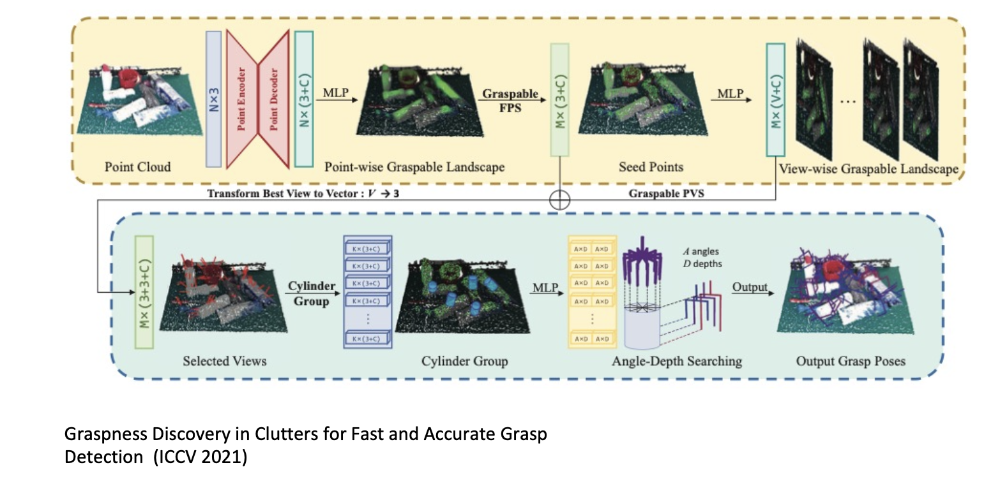

## GS-Net

### 第一部分：上层核心（Seed & View Discovery）

目标：从海量点云中识别“哪里值得抓”和“从哪个方向抓更好”。

1. **Point Encoder-Decoder（点云编解码器）**
   输入原始点云（$N \times 3$），通过类似 U-Net/PointNet++ 的结构提取点级特征，输出每个点的坐标与语义特征（可记为 $N \times (3+C)$）。
2. **Point-wise Graspable Landscape（逐点可抓取景观图）**
   通过 MLP 为每个点预测 Graspness Score（可抓取性分数），优先突出高价值抓取区域，减少在空旷或难抓区域的无效计算。
3. **Graspable FPS（可抓取性引导的最远点采样）**
   不是随机采样，也不是纯几何 FPS，而是在高 Graspness 区域优先采样，选出 $M$ 个最有潜力的种子点（Seed Points）。
4. **View-wise Graspable Landscape（视野维度可抓取性）**
   对每个种子点在球面候选方向中选择得分最高的逼近方向（Best View），用于后续位姿搜索。

### 第二部分：下层核心（Refinement & Searching）

目标：在给定种子点和逼近方向后，确定最终 6-DoF 抓取位姿。

1. **Selected Views（选定视野）**
   组合 $M$ 个种子点与对应最佳逼近方向。
2. **Cylinder Group（圆柱体分组）**
   沿逼近方向、以种子点为中心构建圆柱邻域，仅提取与夹爪闭合空间强相关的局部特征，降低背景干扰。
3. **Angle-Depth Searching（角度与深度搜索）**
   在固定逼近方向下，联合搜索：
   - Angle：夹爪绕逼近轴旋转角
   - Depth：夹爪沿逼近方向的进入深度

   网络可输出一个 $A \times D$（或离散网格扩展形式）的评分矩阵，再选择最优组合。
4. **Output Grasp Poses（输出抓取位姿）**
   最终输出完整 6-DoF 抓取参数：位置 $(x,y,z)$、逼近方向（View）、旋转角（Angle）、深度（Depth）。

### GS-Net 要点总结

1. **主动搜索**：先定位“好抓区域”再做精细求解，显著减少盲搜成本。
2. **背景过滤**：Graspable FPS 在采样阶段就压制无关点云。
3. **几何对齐特征提取**：Cylinder Group 与夹爪作用空间一致，更贴近真实抓取物理约束。
4. **效率与精度兼顾**：在 clutter 场景中通常能比传统采样策略更快且更稳。

补充结论：

- 该方法核心依赖几何点云，理论上对颜色变化不敏感（前提是 3D 几何重建质量足够）。
- 小数据集下仍可泛化，关键原因在于点云几何表示对任务本质信息更直接。

## Eye-in-Hand Calibration Workflow

在机器人视觉抓取系统中，**Eye-in-Hand（手眼同体）** 标定指相机安装在机器人末端执行器上。目标是估计相机坐标系到末端坐标系的外参变换 $^{end}T_{cam}$。

### 1. 准备阶段（Preparation）

- 确保相机刚性固定在末端执行器。
- 准备高精度标定板（棋盘格、ChAruco 或圆点阵列）。
- 将标定板固定在工作空间中，采集期间不能移动。
- 先完成相机内参标定（焦距、主点、畸变参数）。

### 2. 数据采集（Data Collection）

控制机器人到多个姿态（建议 $N \ge 10$），每个姿态记录两类数据：

1. 机器人末端位姿 $^{base}T_{end}$。
2. 标定板图像（用于后续解算标定板位姿）。

关键技巧：采样时应包含足够大的旋转变化。若几乎只有平移，旋转分量会退化，影响求解稳定性。

### 3. 图像处理与位姿估计（Feature Extraction）

对每张图像：

- 提取棋盘格角点或 ArUco/ChAruco 特征。
- 使用 PnP 估计标定板在相机坐标系中的位姿 $^{cam}T_{target}$。

于是得到 $N$ 组配对：

- $A_i = \, ^{base}T_{end,i}$
- $B_i = \, ^{cam}T_{target,i}$

### 4. 数学求解（Solving $AX=XB$）

手眼标定可归结为经典方程：

$$
AX = XB
$$

其中 $X = \, ^{end}T_{cam}$ 为待求矩阵。常见流程：

1. 选取采样对 $(i,j)$。
2. 计算末端相对运动：

$$
A = (^{base}T_{end,i})^{-1} \cdot \, ^{base}T_{end,j}
$$

3. 计算视觉相对运动：

$$
B = \, ^{cam,i}T_{target} \cdot (^{cam,j}T_{target})^{-1}
$$

4. 用 Tsai-Lenz、Park 或非线性优化法求解 $X$。

### 5. 验证与评估（Validation）

- **重投影/一致性验证**：将目标点经估计变换映射到基座坐标系，检查不同姿态下是否一致。
- **触碰测试**：图像选点 -> 坐标转换 -> 机械臂执行触碰，检验末端是否准确到达。

### 6. 常见问题与排查

| 问题 | 常见原因 | 解决建议 |
| --- | --- | --- |
| 标定误差大 | 姿态变化不足 | 增加 Roll/Pitch/Yaw 多样性 |
| 平移异常 | 单位不一致 | 统一 mm 与 m 单位体系 |
| 结果不稳定 | 相机内参不准 | 重新做高质量内参标定 |
| 无法收敛 | 标定板在采集中移动 | 固定标定板并重新采样 |

### 常用工具

- OpenCV：`cv2.calibrateHandEye()`
- ROS：`easy_handeye`
- MATLAB：Robotics System Toolbox

与 GS-Net 的关系：

- GS-Net 通常输出相机坐标系下的抓取位姿。
- 通过 $^{end}T_{cam}$（及机器人运动链）转换到基座坐标系后，机械臂才能执行真实抓取。
