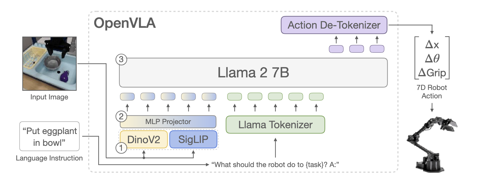
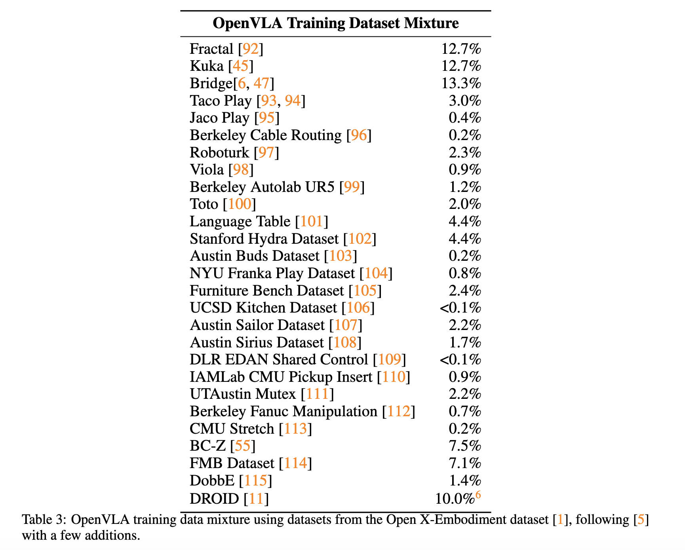
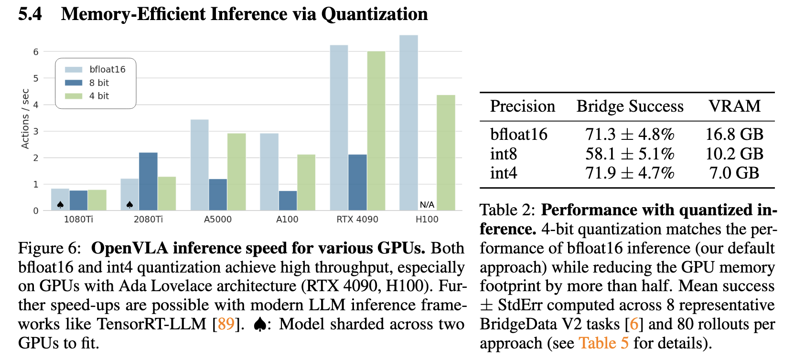
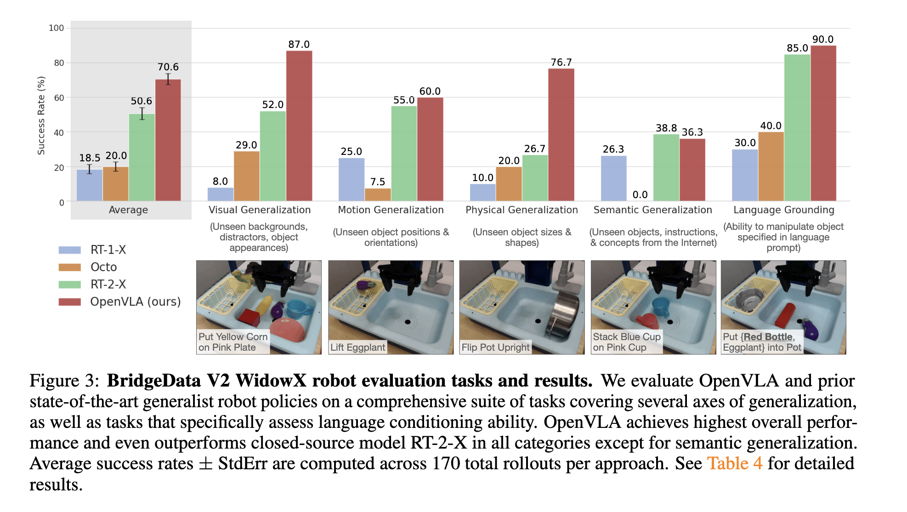
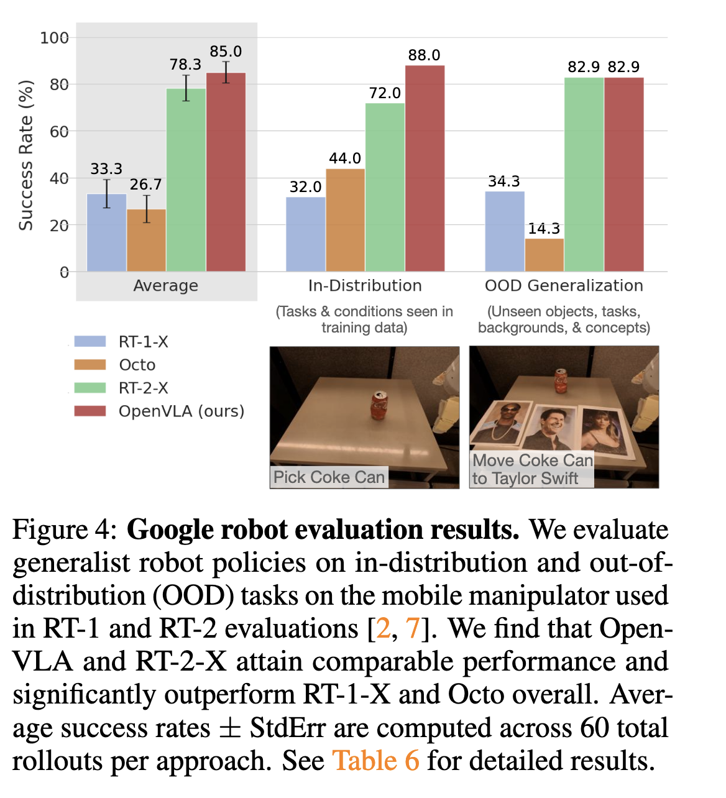
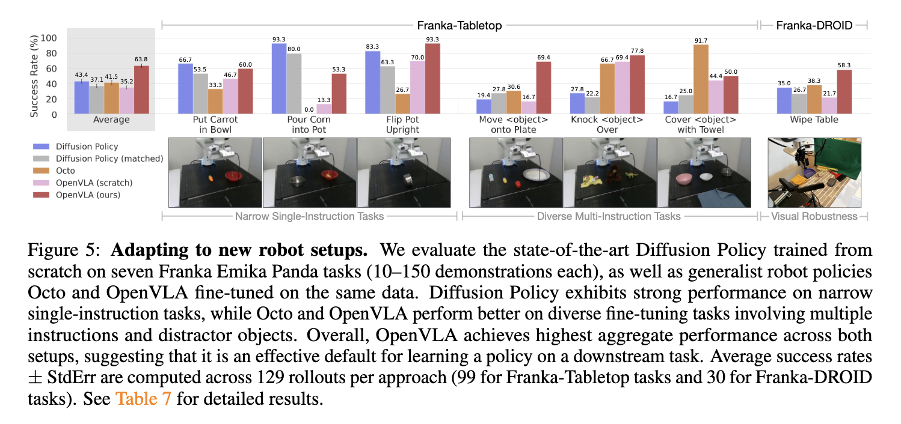
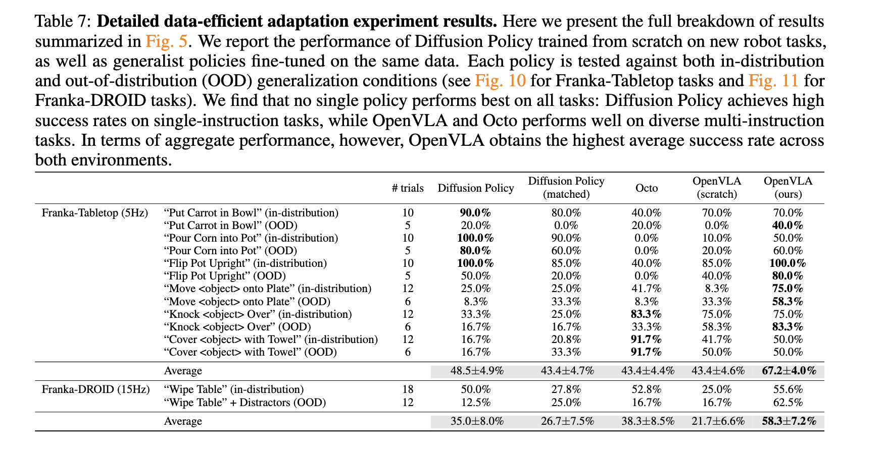
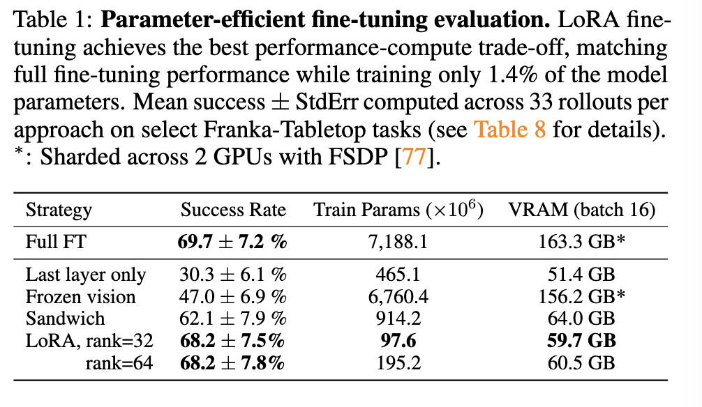

## OpenVLA

### 基础概念

- **VLA**: Vision-Language-Action models
- **Language grounding（语言落地/语言基础）：** 在机器人领域，这指的是 **让 AI 把抽象的语言和真实的物理世界对应起来的能力**。比如，你对它说“拿起那个红色的杯子”，它不仅要听懂这句话，还要能在摄像头的画面里找到“红杯子”在哪，并知道怎么去抓。

- **Mixed Precision**
    - **核心思想**：在模型计算中 **同时使用多种精度**（如 FP16 + FP32），通常用于 **加速训练**。
    - **常见做法**：大部分计算用 FP16（半精度）进行前向和反向传播，同时保留一份 FP32 的权重副本用于累加更新，避免精度损失。
    - **主要目的**：**减少显存、加快计算**（尤其利用 Tensor Core），同时保持训练精度接近 FP32。
    - **典型场景**：大模型训练（如 GPT、VLM），已经是训练的标准技术。
    - **存储形式**：权重、激活、梯度可以是混合的（FP16/FP32），但 **不会变成整数类型**。

- **Quantization**
    - **核心思想**：将模型权重和激活从 **浮点数（如 FP32/BF16）映射为低比特整数**（如 INT8、INT4）。
    - **常见做法**：训练后量化（PTQ）或量化感知训练（QAT），推理时直接做整数运算。
    - **主要目的**：**极致压缩模型大小**（4倍、8倍压缩）、降低内存带宽需求、在边缘设备上高效推理。
    - **典型场景**：模型部署到手机、嵌入式设备、或显存受限的 GPU（如 OpenVLA 的量化）。
    - **存储形式**：最终是整数（INT8/INT4），不是浮点。
- **Automatic Mixed Precision, AMP**: 
    - 在PyTorch中，自动混合精度（AMP）是一种能让模型训练既快又省显存的技术。简单来说，它 **在训练时，让模型的关键部分用高精度（FP32，单精度浮点数）计算以确保稳定，而将大部分计算交给低精度（FP16，半精度浮点数）以换取速度和效率**。
    - PyTorch的AMP已经是一个**原生、稳定且持续更新**的功能，在PyTorch 1.6版本就已经集成在 `torch.amp` 模块中。它主要通过两个核心部件协同工作：**`autocast` 自动类型转换** 和 **`GradScaler` 梯度缩放**。
  
- **FSDP（Fully Sharded Data Parallel，全分片数据并行）**:  是PyTorch中一种专门用于训练 **超大模型** 的分布式策略。可以把它理解为PyTorch对微软DeepSpeed中ZeRO Stage 3技术的原生实现。它的核心目标是解决传统数据并行（DDP）的一个痛点：每个GPU都要复制一份完整的模型参数，导致单卡显存不够用。

### 重要图表

The architecture consists of three key components: (1) a vision encoder that concatenates Dino V2 and SigLIP features, (2) a projector that maps visual features to the language embedding space, and (3) the LLM backbone, a Llama 2 7B-parameter large language model.

Prismatic architecture : a 600M-parameter **visual encoder**, a small 2-layer MLP **projector**, and a 7B-parameter Llama 2 **language model backbone**. Notably, Prismatic uses a *two-part* visual encoder, consisting of pretrained SigLIP and DinoV2 models.

### Training Procedure

- **核心思路：** 将机器人动作预测转换为“视觉-语言”任务。（We formulate the action prediction problem as a **“vision-language” task**, where an input observation image and a natural language task instruction are mapped to a string of predicted robot actions）
- **输入：** 观察图像 (Observation Image) + 自然语言指令 (Language Instruction)。
- **输出：** 代表机器人动作的“词表字符串” (Sequence of Action Tokens)。
- **基础模型：** Prismatic-7B VLM。（To train OpenVLA, we **fine-tune a pretrained Prismatic-7B VLM backbone** for robot action prediction）

To enable the VLM’s language model backbone to predict robot actions, we represent the actions in the output space of the LLM by mapping continuous robot actions to discrete tokens used by the language model’s tokenizer.

为了让 LLM 能够预测连续的机器人动作值，必须进行离散化处理：

- **分辨率：** 每一个动作维度被均匀划分为 **256 个分度 (Bins)**，对应 [0...255] 的整数。
- **分箱范围（创新点）：** 采用 **1% 到 99% 分位数 (Quantile)** 之间的数据进行划分，而非传统的 Min-Max 范围。**优点：** 有效过滤训练数据中的离群值（Outliers），防止极值拉大分箱间距，从而 **提高动作的有效分辨率（Granularity）**。

Following Brohan et al. [7], we discretize each dimension of the robot actions separately into one of 256 bins. For each action dimension, we set the bin width to uniformly divide the interval between the 1st and 99th quantile of the actions in the training data. Using quantiles instead of the min-max bounds Brohan et al. [7] used allows us to ignore outlier actions in the data that could otherwise drastically expand the discretization interval and reduce the effective granularity of our action discretization.

**传统做法：Min-Max 边界 (Min-Max Bounds)**

在之前的研究（如 RT-1）中，通常是找到数据里的 **最小值** 和 **最大值**，然后在中间均匀切 256 份。

- **例子：** 假设大部分动作都在 -1 到 1 之间，但数据里偶尔出现了一个错误操作或极端抖动，数值达到了 10。
- **结果：** 你的划分区间就变成了 [-1, 10]。
- **代价：** 256 个档位要覆盖 11 个单位的长度，每个档位的宽度（精度）就变大了。

**OpenVLA 的改进：1% 到 99% 分位数 (Quantiles)**

OpenVLA 不看最大最小值，而是看**分位数**：

- **1st Quantile (1% 分位数)：** 把所有数据从小到大排，排在第 1% 位置的那个数。
- **99th Quantile (99% 分位数)：** 排在第 99% 位置的那个数。
- **做法：** 它们只把这 1% 到 99% 之间的范围均匀切成 256 份。

文中的核心理由是：**“ignore outlier actions”（忽略离群动作）**。

Unfortunately, the tokenizer used by OpenVLA’s language backbone, the Llama tokenizer, only reserves 100 “special tokens” for tokens newly introduced during fine-tuning, which is too few for the 256 tokens of our action discretization.

- **面临问题：** Llama 的 Tokenizer 仅预留了 100 个“特殊 Token”空位，不足以容纳 256 个动作词。
- **解决方案：** 采用“**最少使用频率覆盖法**”。直接覆盖（Overwrite）Llama 原有词典中 **使用频率最低的最后 256 个 Token**。**评价：** 这种做法在保持模型结构不变的前提下，简单高效地扩展了动作空间。

Once the actions are processed into a sequence of tokens, OpenVLA is trained with a standard next-token prediction objective, evaluating the cross-entropy loss on the predicted action tokens only.

- 标准的 **Next-Token Prediction**（因果语言建模）。
- **损失函数：** 计算预测动作 Token 的 **Cross-Entropy Loss**。

### Training Date

OpenVLA 的成功很大程度上归功于它对 OpenX 数据集的 “**精挑细选**”：统一为“第三人称视角 + 单臂末端控制”，并参考 Octo 的经验进行权重平衡，最后果断放弃了难以拟合的超大规模多样性数据。

#### 1. 数据来源：Open X-Embodiment (OpenX)

- **基础：** 利用目前机器人领域最大的开源数据集 OpenX。
- **规模：** 包含 70+ 个独立机器人数据集，超过 200 万条机器人轨迹 (Trajectories)。
- **核心目标：** 捕获极高的**具身多样性 (Embodiment Diversity)**、场景多样性和任务多样性，实现“开箱即用”的多机器人控制能力。

#### 2. 数据筛选与处理 (Data Curation)

为了保证训练的实用性和稳定性，研究团队设定了两个筛选目标：

- **目标 (1)：输入输出空间的统一 (Coherent I/O Space)** 视觉输入： 仅保留包含至少一个 **第三人称视角摄像头 (3rd person camera)** 的数据集。**动作输出：** 统一为 **单臂末端执行器控制 (Single-arm end-effector control)** 任务。
- **目标 (2)：数据集分布的平衡 (Balanced Mix)** 策略： 采用 **Octo [5] 的混合权重方案**。**逻辑：** 启发式地降低多样性较低的数据集权重，提高任务和场景丰富的数据集权重。

#### 3. DROID 数据集实验与教训

- **尝试：** 加入了最近发布的 DROID 数据集（以 10% 的保守权重）。
- **发现：** 在训练过程中，模型在 DROID 数据上的 **动作 Token 预测准确率持续偏低**。
- **结论：** 研究者认为 DROID 的多样性太高，当前的混合权重或模型规模（7B）可能不足以完美拟合。
- **操作：** 为了保证最终模型的质量，在 **训练的最后三分之一阶段将 DROID 移除**。

#### 4. 关键洞察 (Key Insights for VLM Training)

- **质量 > 数量：** 并不是所有 OpenX 的数据都适合直接堆叠训练，必须经过严格的摄像头视角和控制模态筛选。
- **权重平衡至关重要：** 盲目加入高多样性数据集（如 DROID）可能会拉低整体训练效果，需要模型规模和训练策略的同步匹配。

a complete overview of the used datasets and mixture weights：

### Key learnings

#### VLM Backbone

研究团队对比了三种主流的视觉-语言模型（VLM）在机器人动作预测（Action Prediction）上的表现：

- **IDEFICS-1**
- **LLaVA**
- **Prismatic** (最终胜出者)

性能评估结论 (Performance Analysis)

- **简单任务（单物体场景）：** LLaVA 与 IDEFICS-1 表现持平。
- **复杂任务（多物体场景 + 语言指令识别）**：LLaVA > IDEFICS-1 在 BridgeData V2 环境中，LLaVA 的 **绝对成功率提升了 35%**。这表明 LLaVA 具有更强的 **Language Grounding**（语言指令与物理实体的对应）能力。**Prismatic > LLaVA：** Prismatic 在各类任务中比 LLaVA 又进一步提升了约 **10% 的绝对成功率**。

Prismatic 胜出的核心原因 (Key Factors)

研究团队归纳了 fine-tuningPrismatic 成为 OpenVLA 最优骨干网络的两个主要原因：

- **技术层面：增强的空间推理（Spatial Reasoning）** Prismatic 采用了 **Fused SigLIP-DinoV2 backbones**（融合了 SigLIP 和 DinoV2 的视觉骨干）。SigLIP 擅长语义理解（识别“是什么”），DinoV2 擅长感知几何结构和精细特征（理解“在哪里”及“空间关系”）。这种融合赋予了模型极强的三维空间推理能力，对精准抓取和操作至关重要。
- **工程层面：模块化与易用性** Prismatic 的代码库设计更具 **模块化 (Modular)** 且 **Easy-to-use**，方便进行微调和系统集成。

**OpenVLA 最终选择 Prismatic 作为其语言骨干（Language Backbone）的基础**，因为它在复杂的、涉及多物体的语言落地任务中展现了最高的成功率和最强的空间感知性能。

#### Image Resolution

The resolution of input images has significant impact on the computational requirements of VLA training, since higher-resolution images result in more image patch tokens and thus **longer context lengths** that **quadratically increase training compute**.

Note that on many VLM benchmarks, increased resolution does improve performance, but we did not see this trend (yet) for VLAs. 

提高输入图像的分辨率在很多 VLM benchmarks 中往往能得到更好的表现，但目前在 VLA 中并没有体现出差异：OpenVLA 对比了 $224 \times 224px$ 和 $384 \times 384px$ 两种分辨率的图像输入 ，但是并没有在评估中发现性能的差异，但是后者 takes 3x longer to train，花费了 3 倍的训练时间。因此选择了 $224 \times 224px$ 分辨率作为 final OpenVLA model 的标准。

#### Fine-Tuning Vision Encoder.

- **冲突点：** 传统 VLM 倾向于“冻结”视觉编码器以保持泛化性；但 OpenVLA 证明在机器人领域，“微调”视觉编码器才是成功的关键。
- **原因：** 预训练的视觉模型（如 SigLIP/DinoV2）虽然强大，但其原始特征更偏向 **语义理解**，缺乏机器人精准控制所需的 **极细粒度空间感知**。
- **启示：** 机器人视觉不仅要懂“是什么”，更要懂“精准的几何关系”。为了捕捉这些关系，必须让视觉模块在机器人实际操作数据中进行针对性演化。

传统观点：冻结视觉编码器 (Freezing is better)

- **做法：** 在训练普通的 VLM（比如让你描述图片的 AI）时，通常会将视觉部分（Vision Encoder）锁死（Frozen），不更新它的参数，只训练后面的语言模型部分。
- **理由：** 这些视觉编码器是在海量互联网图片上练出来的，它们已经拥有了非常“鲁棒”（健壮）的特征提取能力。大家认为，如果去动它，可能会破坏它原本学好的“常识”，导致性能下降。

OpenVLA 的发现：必须微调 (Fine-tuning is crucial)

- **现象：** 研究团队发现，如果把视觉编码器锁死，OpenVLA 的表现会很差。只有解冻它，让它在机器人数据上进行微调，表现才会好。
- **结论：** 对于机器人任务，*微调视觉编码器至关重要*

作者提出了一个核心假设：**空间细节的缺失**

- **识别 vs. 操作 (Recognition vs. Manipulation)：** 互联网图像（VLM 擅长的）： 主要是为了识别。比如只要看到两只尖耳朵和胡须，模型就能判定“这是猫”。它不需要知道这只猫左边胡须末端的精确三维坐标。**机器人任务（VLA 需要的）：** 需要极度精确的 **空间细节（Fine-grained spatial details）**。机器人不仅要看到“那是杯子”，还要看清杯柄的细微边缘、杯子与桌面的缝隙、以及夹爪距离杯子是 1 厘米还是 1.1 厘米。
- **视觉特征的“盲区”：** 那些在互联网上训练好的视觉模型，虽然能看懂“大意”，但它们在预训练过程中可能 **过滤掉了这些微小的几何细节**（因为识别物体并不需要这些细节）。通过 **微调（Fine-tuning）**，视觉编码器就像是重新调整了焦距或戴上了显微镜，开始专门学习那些对机器人控制至关重要的空间信息。

#### Training Epochs.

Typical LLM or VLM training runs complete at most one or two epochs through their training dataset. In contrast, we found it important for VLA training to iterate through the training dataset significantly more times, with real robot performance continually increasing until training action token accuracy surpasses 95%. Our final training run completes 27 epochs through its training dataset.

##### 典型做法（LLM/VLM）

- 通常只训练 **1~2 个epoch**。
- 原因：这些模型的数据集极其庞大（网上抓取的海量图文对、文本），而且模型容量高。过多次数地重复学习同一批数据，模型会 **过拟合** 。因此在LLM/VLM训练中，见一遍数据已经能学到很好的泛化能力，重复多轮收益很小甚至有害。

##### VLA 的特殊发现

- 作者发现，对于VLA模型，只训练1~2个epoch远远不够。他们需要 **显著更多的epoch**（最终跑了27个epoch）。
- 观察到的现象：**真实机器人的性能随着epoch增加持续提升**，直到训练数据上的 **动作token准确率超过95%**。也就是说，模型需要反复学习同一批机器人操作数据，才能把动作预测做得足够精准。
- 为什么会有这种差异？可能原因：
  1. **机器人动作数据稀缺**：VLA通常依赖遥操作采集的演示数据，规模远小于互联网图文数据。在有限的数据集上，模型需要多次“温习”才能充分提取动作模式。
  2. **动作预测难度高**：输出连续或离散的精细动作，比单纯理解图像/文字更难。模型需要达到很高的内部准确率（>95%动作token正确）才能在实际物理世界中成功执行任务。
  3. **避免过拟合的矛盾**：理论上多epoch容易过拟合，但作者发现机器人性能仍在提升，说明在这个任务和数据集规模下，欠拟合才是主要问题——模型还没把有限数据里的知识学透。

#### Learning Rate. 

- achieved the best results using a fixed learning rate of 2e-5 (the same learning rate used during VLM pretraining ).

- did not find **learning rate warmup** to provide benefits.

### Infrastructure for Training and Inference

| 项目         | 关键指标             | 备注                              |
| ------------ | -------------------- | --------------------------------- |
| **训练算力** | 64 x A100 (14天)     | 总计 21.5k A100 小时              |
| **显存占用** | 15GB (bf16)          | 消费级显卡 (3090/4090) 可直接部署 |
| **推理速度** | 6 Hz (4090)          | 满足机器人高层决策实时性需求      |
| **量化支持** | 支持 4-bit/8-bit     | 量化后不损失真实机器人任务成功率  |
| **部署模式** | 支持本地或远程服务器 | 提供了开源的远程流式推理接口      |

During inference, OpenVLA requires 15GB of GPU memory when loaded in bfloat16 precision (i.e., without quantization) and runs at approximately 6Hz on one NVIDIA RTX 4090 GPU (**without compilation, speculative decoding, or other inference speed-up tricks**).

We can further reduce the memory footprint of OpenVLA during inference via **quantization**, without compromising performance in real-world robotics tasks, as shown in：

also includes **inference speed on various consumer- and server-grade GPUs**

### The OpenVLA Codebase

- A modular PyTorch codebase for training VLA models (see https://openvla.github.io)
- It scales from fine-tuning VLAs on individual GPUs to training billion-parameter VLAs on multi-node GPU clusters
- Supports modern techniques for large transformer model training such as:
  - Automatic mixed precision (**AMP, PyTorch**)
  - FlashAttention
  - Fully sharded data parallelism (**FSDP**)
- Out of the box, the OpenVLA codebase has full support for training on the **Open X dataset**, integrates with **HuggingFace's AutoModel class**
- Supports **LoRA fine-tuning** and **quantized model inference**

### Experiments

1. How does OpenVLA compare to prior generalist robot policies, when evaluating on multiple robots and various types of generalizations?
2. Can OpenVLA be effectively fine-tuned on a new robot setup and task, and how does it compare to state-of-the-art **data-efficient imitaion learning** approaches?
3. Can we use parameter-efficient fine-tuning and quantization to reduce the computational requirements for training and inference of OpenVLA models and make them more accessible? **What are the performance-compute trade-offs?**

#### Direct Evaluations on Multiple Robot Platforms

**Comparisons**. We compare OpenVLA’s performance to three prior generalist manipulation policies: **RT-1-X** [1], **RT-2-X** [1], and **Octo** [5]. **RT-1-X** (35M parameters) and Octo (93M parameters) are transformer policies trained from scratch on subsets of the OpenX dataset; Octo is the state-of-the-art model among open-source manipulation policies. **RT-2-X** (55B parameters) is a state-of-the-art, closed-source VLA that leverages Internet-pretrained vision and language backbones.

For **BridgeData V2** evaluations:

For **Google robot** evaluations:

Note that our evaluations test even larger degrees of generalization than the evaluations performed in those prior works to challenge the Internet-pretrained VLA models. **Thus, lower performance of models without Internet pretraining is expected**. RT-2-X clearly outperforms both RT-1-X and Octo, demonstrating the benefits of large, pretrained VLMs for robotics.

The performance difference can be attributed to a combination of factors: we **curated a much larger training dataset for OpenVLA with 970k trajectories** (vs. 350k for RT-2-X); we performed **more careful cleaning of the training dataset** and, e.g., filtered out all-zero actions in the Bridge dataset (see Appendix C for a detailed discussion); and OpenVLA uses **a fused vision encoder that combines pretrained semantic and spatial features**. See Appendix D for ablation analyses of these components.

##### 1. 实验设置 (Evaluation Setup)

- **双平台测试：** **WidowX (BridgeData V2)：** 桌面级机械臂，测试 170 次。**Google Robot (RT-1/2)：** 移动式操作机器人，测试 60 次。
- **泛化维度：** 测试涵盖了视觉（环境）、运动（姿态）、物理（尺寸）以及最难的 **语义泛化**（未见过的互联网概念指令）。
- **核心挑战：** 重点考察在有 **干扰物 (Distractors)** 的场景下，机器人能否准确识别并操作指令指定的物体（Language Conditioning）。

##### 2. 对比基准 (Baselines)

- **RT-1-X (35M) & Octo (93M)：** 纯机器人数据训练，无大规模互联网预训练。
- **RT-2-X (55B)：** 顶尖闭源模型，超大规模互联网预训练 + 机器人数据。
- **OpenVLA (7B)：** 本文模型，中等规模互联网预训练 + 机器人数据。

##### 3. 核心实验结论 (Key Results)

- **整体表现：** OpenVLA 和 RT-2-X 显著优于 RT-1-X 和 Octo（后两者常在干扰物面前失效或乱动）。
- **以小博大：** **7B vs 55B：** OpenVLA 在参数量小一个数量级的情况下，在 Google Robot 上表现 **比肩 RT-2-X**，在 WidowX 上甚至 **超越了 RT-2-X**。
- **语义泛化差异：** RT-2-X 在 **语义理解** 上仍有微弱优势（主要得益于其 55B 的超大规模和共同微调策略）。
- **鲁棒性表现：** OpenVLA 表现出极佳的视觉对齐能力，且具备 **错误恢复 (Mistake Recovery)** 能力（例如抓取不稳时会重新调整）。

##### 4. OpenVLA 领先的三个技术原因 (Why OpenVLA works better?)

1. **数据量优势：** 训练集包含 **970k** 条轨迹（RT-2-X 仅使用 350k 条）。
2. **精细的数据清洗：** 过滤掉了 Bridge 数据集中大量的“全零动作”（Invalid actions），提高了训练效率。
3. **视觉架构创新：** 采用了 **Fused Vision Encoder**（融合 SigLIP 语义特征和 DinoV2 空间几何特征），弥补了小模型在空间感知上的不

最重要的结论是：**模型规模（Scale）固然重要，但高质量、大批量的训练数据以及针对机器人优化的视觉架构（语义+空间融合）可以弥补参数量的巨大差距。** 7B 的 OpenVLA 证明了开源轻量级模型完全可以达到甚至超越 55B 级闭源模型的物理操作水平

#### Data-Efficient Adaptation to New Robot Setups

While prior works mainly focused on directly evaluating **VLAs “out-of-the-box”**, effective **fine-tuning of VLA models to new tasks and robot setups** is largely unexplored, yet is key for their widespread adoption. In this section, we investigate OpenVLA’s ability to be quickly adapted to a new *real-world* robot setup.

For narrower but highly dexterous tasks, Diffusion Policy still shows smoother and more precise trajectories; ==incorporating action chunking and temporal smoothing, as implemented in Diffusion Policy, may help OpenVLA attain the same level of dexterity and may be a promising direction for future work==

##### 1. 核心目标

验证 OpenVLA 能否通过极少量的数据（**10–150 条演示轨迹**），快速迁移（Fine-tune）到一个完全陌生的机器人硬件和任务环境中。

##### 2. 实验设置 (Setups)

- **硬件平台：** 采用了工业界常用的 **Franka Emika Panda (7-DoF)** 机械臂。**Franka-Tabletop：** 固定式安装，5Hz 控制频率。**Franka-DROID：** 移动桌面安装，15Hz 高频控制。
- **微调策略：** 对所有模型参数进行 **全参数微调 (Full fine-tuning)**。

##### 3. 对比方法 (Baselines)

- **Diffusion Policy：** 目前模仿学习（Imitation Learning）的 SOTA，从零训练。
- **Octo：** 之前最强的开源通用策略，同样进行微调。
- **OpenVLA (scratch)：** 消融实验。不使用 OpenX 预训练权重，直接从基础 VLM 开始微调，以验证“大规模机器人数据预训练”的价值。

##### 4. 关键实验结论 (Key Findings)

- **任务类型差异：** **窄任务（Single-instruction）：** 如“把胡萝卜放进碗里”。**Diffusion Policy** 表现非常强，甚至优于通用模型，因为它的轨迹更平滑、更精准。**多样化/语言任务（Multi-instruction）：** 涉及多个物体、需要理解复杂语言指令。**OpenVLA 和 Octo** 显著胜出。
- **OpenVLA 的统治力：** **总分第一：** OpenVLA 在所有测试任务中的平均表现最高。**唯一全能选手：** OpenVLA 是唯一一个在所有测试任务中成功率均 **超过 50%** 的模型。作者建议将其作为下游模仿学习任务的 “**强力默认选项 (Strong default)**”。
- **预训练的重要性：** OpenVLA 表现远好于 OpenVLA (scratch)，证明了 **OpenX 大规模预训练**赋予了模型极强的语言落地（Language Grounding）和泛化能力。

##### 5. 发现与未来改进 (Insights & Limitations)

- **灵巧性差距：** Diffusion Policy 预测的是“动作块 (Action Chunking)”并带有时间平滑处理，因此动作比 OpenVLA 更丝滑。
- **改进方向：** OpenVLA 未来可以引入 **Action Chunking（动作分块）** 和 **Temporal Smoothing（时间平滑）** 技术，以提升在精细操作任务中的表现。

如果只有不到 100 条演示数据：

1. 如果任务极其单一且需要高精度，选 **Diffusion Policy**。
2. 如果任务涉及复杂指令、多物体干扰或需要通用性，选 **OpenVLA 进行微调**。
   OpenVLA 最大的价值在于它强大的“**底座能力**”，让它在面对新环境时只需少量样本就能理解“干什么”以及“怎么在干扰中精准操作”。

#### Parameter-Efficient Fine-Tuning

Concretely, we compare the following fine-tuning approaches:

- **full fine-tuning** updates all weights during fine-tuning, as described above
- **last layer only** fine-tunes only the last layer of OpenVLA's transformer back-bone and the token embedding matrix
- **frozen vision** freezes the vision encoder but fine-tunes all other weights
- **sandwich fine-tuning** unfreezes the vision encoder, token embedding matrix, token embedding matrix, and last layer
- **LoRA** uses the popular low-rank adaptation technique with multiple rank values $r$, applied to all linear layers of the model

We report fine-tuning success rates across multiple Franka-Tabletop tasks, as well as training parameter count and GPU memory requirements, in Table 1.

**Found:**

- Only fine-tuning the network's last layer or freezing the vision encoder leads to poor performance, suggesting that **further adaptation of the visual features to the target scene is crucial**.
- "Sandwich fine-tuning" achieves better performance since it fine-tunes the vision encoder, and it consumes less GPU memory since **it does not fine-tune the full LLM backbone**.
- Lastly, **LoRA** achieves the best trade-off between performance and training memory consumption, outperforming "sandwich fine-tuning" and matching full fine-tuning performance while fine-tuning only $1.4%$ of the parameters.

We find that the LoRA rank has negligible effect on policy performance and thus recommend using a default rank of $r = 32$. With LoRA, we can fine-tune OpenVLA on a new task **within 10-15 hours** on a *single* A100 GPU —— an **8x reduction in compute** compared to full fine-tuning.

### Discussion and Limitations

#### 核心总结 (Core Summary)

OpenVLA 是一个 **SOTA且开源** 的视觉-语言-动作模型。它在跨机器人平台（Cross-embodiment）控制上表现出强大的“开箱即用”能力，并证明了可以通过参数高效微调（PEFT）轻松适配新环境。

#### 当前模型的局限性 (Key Limitations)

- **输入模态单一：** 目前仅支持 **单张图像** 输入。缺乏对比多摄像头、本体感知（Proprioception）以及历史观察信息（Observation History）的支持。
- **推理频率较低：** 6Hz 的速度无法满足高频控制（如 50Hz 的 ALOHA）或高度灵巧的双臂操作任务。
- **可靠性仍有空间：** 虽然优于前代模型，但在复杂任务中的成功率通常仍低于 90%，尚未达到工业级的极高可靠性。

#### 未来改进方向 (Future Avenues)

- **输入扩展：** 探索支持多图、历史序列和传感器反馈的 VLA 架构。建议利用在交错图文数据上预训练的 VLM 作为底座。
- **推理加速：** 引入 **Action Chunking（动作分块）**：单次预测输出一串动作序列。引入 **Speculative Decoding（投机采样）**：利用小模型辅助大模型加速生成。
- **模型演进：** **Scaling 效应：** 验证更大参数规模（如 >7B）对机器人性能的提升。**Co-training（协同训练）：** 探讨在微调时同时保留互联网图文数据和机器人数据，是否能进一步提升泛化性。**视觉特征优化：** 继续寻找最适合机器人操作的视觉特征组合。

#### 结论性评价

OpenVLA 的发布为机器人社区提供了一个强大的 **开源基座**。它不仅打破了闭源模型（如 RT-2-X）的垄断，还通过详尽的实验指明了 VLA 模型从“语义理解”向“精准操作”进化的路径