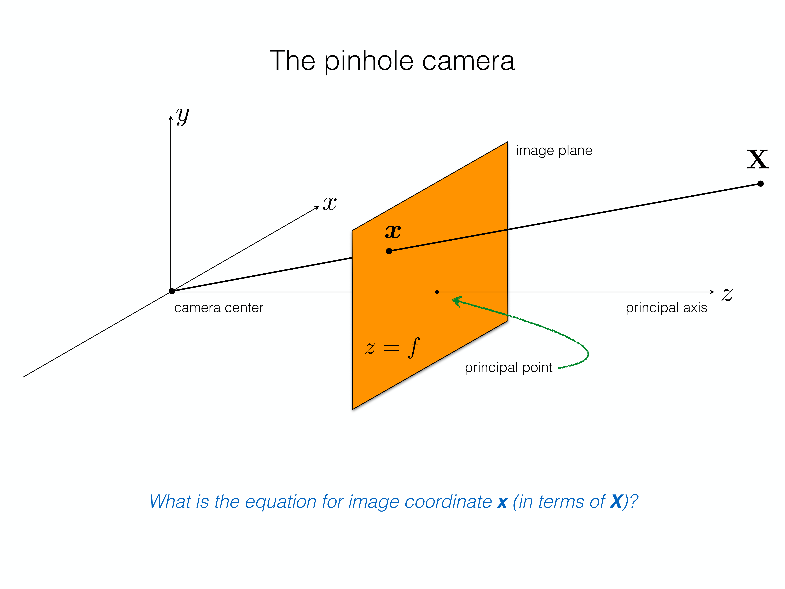
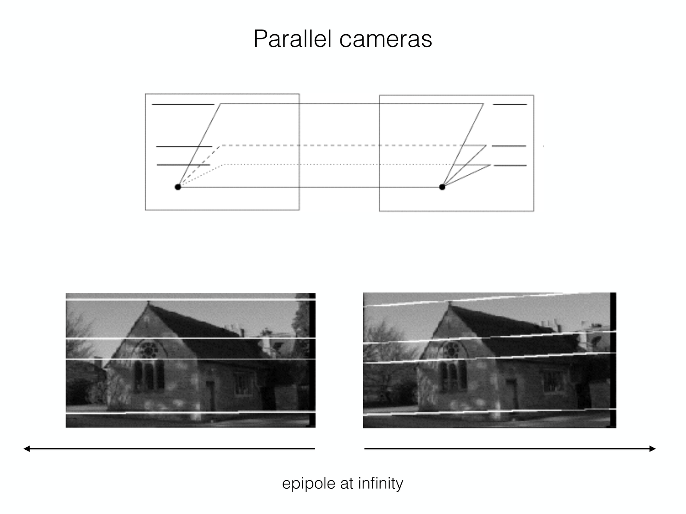
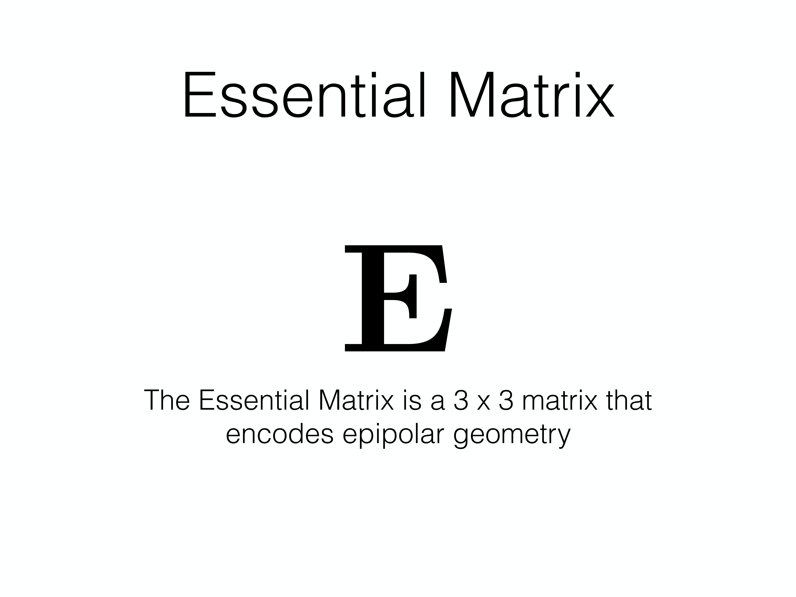
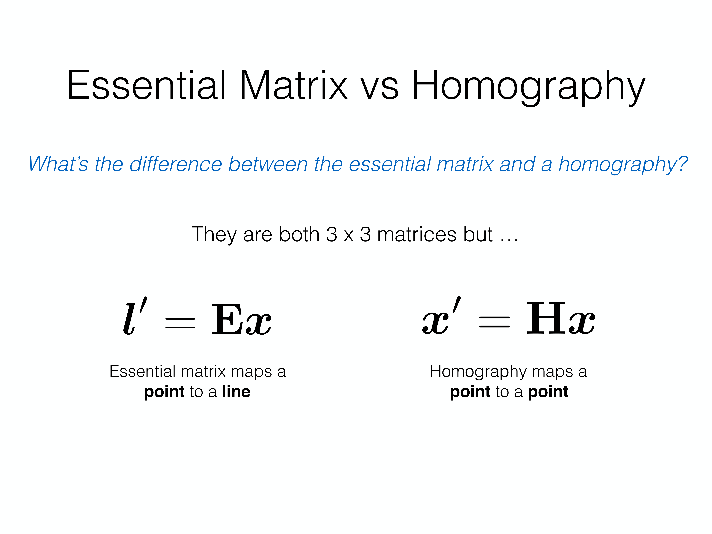
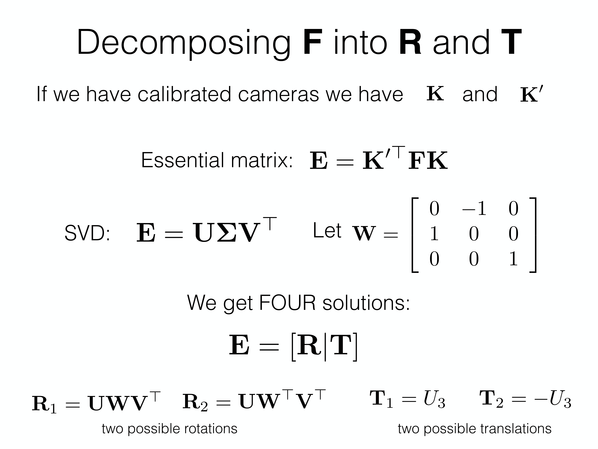
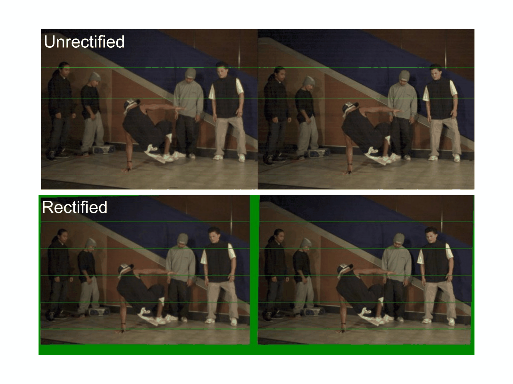
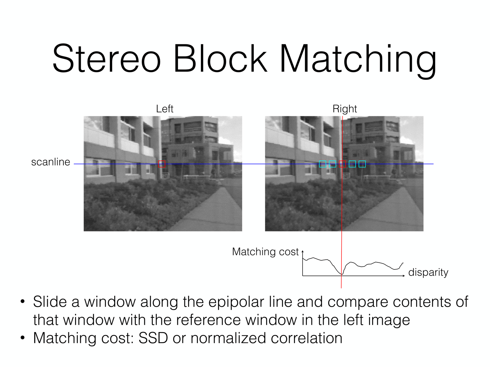
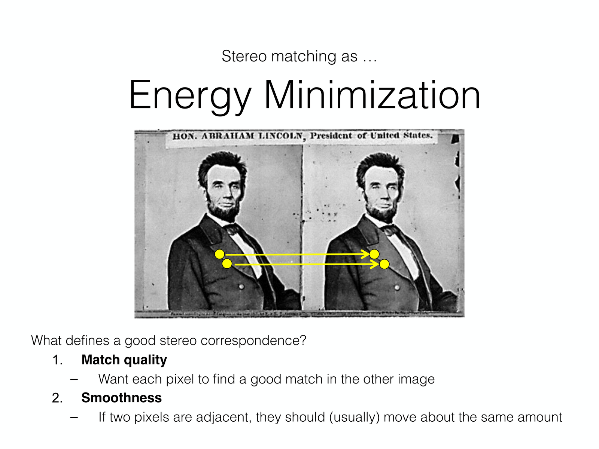

[CMU-3dvision](slides/CMU-3dvision.pdf)

这份笔记按课件主线整理 3D vision 的核心内容：从 **相机成像模型** 出发，过渡到 **双视图几何（epipolar geometry）**、**本质矩阵 / 基础矩阵**、**两视图重建与三角化**，再到 **立体校正（rectification）**、**视差与深度估计**。目标不是只记结论，而是把“二维像素如何对应三维世界”的整条逻辑串起来。

## 1 相机矩阵：从 3D 点到 2D 点

### 1.1 相机本质上是一个投影映射

课件开头反复强调一个最核心的事实：

> 相机是从三维世界到二维图像的映射。

若用齐次坐标表示，一个世界点记作

$$
X = [X, Y, Z, 1]^\top \in \mathbb{P}^3,
$$

它在图像中的投影记作

$$
x = [u, v, 1]^\top \in \mathbb{P}^2.
$$

二者的关系可统一写成

$$
x \sim PX,
$$

其中 $P \in \mathbb{R}^{3\times 4}$ 称为 **camera matrix（相机矩阵）**。

这条式子非常重要，因为整门 3D vision 课程几乎都在围绕它展开：

- 已知 $P$ 和 $X$，求投影点 $x$
- 已知多个视图中的 $x$，反推 3D 点 $X$
- 已知点对应关系，反推相机之间的相对位姿

### 1.2 小孔成像模型

最基本的成像模型是 **pinhole camera（小孔相机）**。它假设所有光线都通过同一个相机中心，并与成像平面相交。

{ width="650" }

若相机坐标系中一点为 $(X, Y, Z)$，焦距为 $f$，则由相似三角形可得：

$$
u = \frac{fX}{Z}, \qquad v = \frac{fY}{Z}.
$$

写成齐次形式就是

$$
\begin{bmatrix}
u\\
v\\
1
\end{bmatrix}
\sim
\begin{bmatrix}
f & 0 & 0 & 0\\
0 & f & 0 & 0\\
0 & 0 & 1 & 0
\end{bmatrix}
\begin{bmatrix}
X\\
Y\\
Z\\
1
\end{bmatrix}.
$$

这说明：

- 透视投影会导致远处物体看起来更小
- 深度 $Z$ 通过除法进入成像过程，因此投影是非线性的
- 但在齐次坐标里，它可以被线性矩阵乘法统一表示

### 1.3 内参矩阵与外参矩阵

真实相机通常既包含成像几何，也包含坐标系变换，因此标准相机矩阵常写成

$$
P = K [R \mid t].
$$

其中：

- $K$ 是 **intrinsic matrix（内参矩阵）**
- $R, t$ 是 **extrinsic parameters（外参）**

内参矩阵常写为

$$
K =
\begin{bmatrix}
f_x & s & c_x\\
0 & f_y & c_y\\
0 & 0 & 1
\end{bmatrix},
$$

这里：

- $f_x, f_y$ 是沿两个图像轴的有效焦距
- $(c_x, c_y)$ 是 principal point（主点）
- $s$ 是 skew（通常可近似为 0）

外参 $[R \mid t]$ 描述的是：

- 世界坐标系到相机坐标系的旋转 $R$
- 世界原点在相机坐标系中的平移 $t$

因此完整流程可以理解为：

1. 先把世界点 $X_w$ 变换到相机坐标系 $X_c = RX_w + t$
2. 再通过内参矩阵与透视投影映射到图像平面

### 1.4 为什么要用齐次坐标

在非齐次坐标里，投影有除法，看起来不方便；在齐次坐标中，平移、透视投影和一般射影变换都可以统一成矩阵乘法。这使得：

- 多个几何变换可以方便连乘
- 推导 epipolar geometry、homography、triangulation 时都更规整
- 算法上容易写成 DLT / SVD 一类线性代数问题

## 2 双视图几何：为什么匹配点不必在整张图里乱搜

### 2.1 Epipolar Geometry 的基本对象

当同一个 3D 点 $X$ 被左右两个相机拍到时，就会在两张图上形成一对对应点 $x, x'$。这两个点并不是完全独立的，它们受一个共同的几何平面约束：

- 左相机中心 $o$
- 右相机中心 $o'$
- 空间点 $X$

这三者张成一个 **epipolar plane（极平面）**。极平面与左右图像平面的交线，分别叫做：

- 左图的 epipolar line
- 右图的 epipolar line

{ width="650" }

同时，另一相机中心在当前图像平面上的投影称为 **epipole（极点）**。

因此双视图几何里的几个关键词分别表示：

- **epipole**：另一相机中心的投影
- **epipolar line**：极平面与图像平面的交线
- **epipolar plane**：由两个相机中心和一个 3D 点张成的平面

### 2.2 Epipolar Constraint

最重要的实际意义是：

> 一个点在第一张图中的对应点，在第二张图中一定落在一条极线上，而不是整张图的任意位置。

这就把匹配搜索从二维区域降成了一维搜索，大幅减少了 stereo matching 的难度。

课件还展示了不同相机运动时极线的形态：

- 汇聚相机：极线向极点汇聚
- 平行双目：极线常近似水平
- 前向运动：极线从 FOE（focus of expansion）向外辐射

这类直觉图对后面 rectification 和 stereo 很关键。

## 3 本质矩阵与基础矩阵

### 3.1 本质矩阵的定义

对于 **已标定相机（calibrated cameras）**，双视图几何可以由一个 $3\times 3$ 矩阵编码，这就是 **Essential Matrix**：

{ width="650" }

它满足：

$$
x'^\top E x = 0,
$$

其中 $x, x'$ 都是 **归一化相机坐标** 下的齐次点。

本质矩阵的几何含义是：

- 给定左图中的点 $x$
- 通过 $l' = Ex$ 可得到右图中的对应极线

因此：

$$
l' = Ex, \qquad l = E^\top x'
$$

### 3.2 本质矩阵来自哪里

若两个相机之间的相对位姿为 $(R, t)$，则本质矩阵可写成

$$
E = [t]_\times R,
$$

其中

$$
[t]_\times =
\begin{bmatrix}
0 & -t_z & t_y\\
t_z & 0 & -t_x\\
-t_y & t_x & 0
\end{bmatrix}
$$

是由平移向量构造出的反对称矩阵，对应叉乘运算。

这条式子说明：

- $E$ 编码的是 **相对旋转和平移方向**
- 它不包含真实绝对尺度
- 所以只靠两张图通常只能恢复“到尺度为止（up to scale）”的几何关系

### 3.3 Homography 与 Essential Matrix 的区别

课件专门拿这两个 $3\times 3$ 矩阵做比较，这是常见易混点：

{ width="650" }

- **Homography**：把点映到点，满足 $x' \sim Hx$
- **Essential Matrix**：把点映到线，满足 $l' = Ex$

进一步说：

- Homography 常对应 **同一平面** 上的点，或纯旋转等特殊情形
- Essential / Fundamental 矩阵对应 **一般双视图极几何**

所以不能把它们混用。

### 3.4 基础矩阵

当相机 **未标定（uncalibrated）** 时，图像点不是归一化相机坐标，而是像素坐标。这时对应的矩阵叫 **Fundamental Matrix**：

$$
x'^\top F x = 0.
$$

它与本质矩阵的关系是

$$
E = K'^\top F K.
$$

因此：

- $E$ 工作在归一化相机平面
- $F$ 工作在像素坐标平面

若内参已知，就可以在二者之间转换。

## 4 从点对应到相机运动：两视图重建

### 4.1 两视图重建的任务分解

课件把几类 3D vision 问题分得很清楚：

- **Pose Estimation**：已知 3D 点与 2D 点对应，求相机位姿
- **Triangulation**：已知相机矩阵与 2D-2D 对应，求 3D 点
- **Reconstruction / SfM**：2D-2D 对应已知，但相机和 3D 结构都未知，要一起估计

其中本讲重点是双视图 reconstruction。

### 4.2 典型的两视图重建流程

课件给出的标准 procedure 可以整理为：

1. 从点对应估计 Fundamental Matrix $F$
2. 若内参已知，则计算 $E = K'^\top F K$
3. 从 $E$ 分解得到相机相对位姿的候选解 $(R, t)$
4. 对每个匹配点做 triangulation 得到 3D 点
5. 用 cheirality constraint 选择使点落在两个相机前方的正确解

这个流程就是最基础的 **two-view structure from motion**。

### 4.3 从 Essential Matrix 分解出 $R, t$

若 $E = U \Sigma V^\top$，则通过 SVD 可构造出两个候选旋转和两个候选平移方向，因此一共会得到四组可能解。

课件强调了两个筛选条件：

- 合法旋转应满足 $\det(R)=1$
- 正确解应使三角化后的点具有 **positive depth**

{ width="650" }

这就是常说的 **cheirality check**。

### 4.4 Projective Ambiguity

若相机未标定，则重建只能恢复到一个任意射影变换，也就是 **projective ambiguity**。

若相机已标定，则不确定性会缩小到 similarity ambiguity（相似变换：旋转、平移、尺度）。

因此：

- uncalibrated reconstruction：只能恢复射影结构
- calibrated reconstruction：可恢复到尺度不定的欧式结构

## 5 Triangulation：由两条视线恢复 3D 点

### 5.1 核心思想

Triangulation 的输入是：

- 两个相机矩阵 $P, P'$
- 同一个 3D 点在两幅图中的对应点 $x, x'$

目标是恢复 3D 点 $X$，满足

$$
x \sim PX, \qquad x' \sim P'X.
$$

几何直觉上，这是在求两条反投影光线的交点；数值上常用 DLT 写成线性方程组，再通过 SVD 最小化代数误差。

### 5.2 为什么实际中“交点”往往不真的相交

由于匹配误差、像素量化误差和相机估计误差，两条反投影光线通常不会严格相交。因此 triangulation 实际求的是某种意义下“最一致”的 3D 点。

所以 triagulation 本质上是一个 **带噪几何反演** 问题，而不是纯粹画两条线找交点那么理想。

## 6 Stereo Vision：从视差到深度

### 6.1 视差与深度的关系

双目视觉中最关键的物理关系是：

> 越近的物体视差越大，越远的物体视差越小。

在平行双目、已校正的理想情形下：

$$
Z = \frac{bf}{d},
$$

其中：

- $b$ 是 baseline（双目基线）
- $f$ 是焦距
- $d$ 是 disparity（视差）

这条式子说明深度与视差成反比。

### 6.2 Stereo Rectification

在原始双目图像中，极线不一定水平，匹配仍不方便。Rectification 的目标是把两幅图重新 warp 到一个共同参考平面上，使对应极线尽量变成水平线。

{ width="650" }

Rectification 的好处是显而易见的：

- 匹配从“在极线上搜索”进一步简化为“沿同一水平行搜索”
- disparity 直接变成水平方向位移
- 后续深度估计更稳定、更高效

### 6.3 Rectification 的核心步骤

课件里给出了一个典型流程，大意可总结为：

1. 估计 $E$
2. 求 epipole
3. 构造 rectifying rotation
4. 分解相对位姿
5. 对两幅图分别做几何 warp

实际中也常直接求一对 rectifying homographies。

## 7 Stereo Matching：从对应关系到 disparity map

### 7.1 最基础的 Block Matching

经过 rectification 后，最基本的做法是 block matching：

1. 在左图选一个参考窗口
2. 在右图同一条 scanline 上滑动搜索
3. 比较相似度，找到最佳匹配位置
4. 该水平位移就是 disparity

{ width="650" }

常用匹配代价包括：

- SAD
- SSD
- NCC

其中：

- SSD 对亮度差异较敏感
- NCC 对线性光照变化更鲁棒

### 7.2 窗口大小的影响

窗口大小是一个典型 trade-off：

- 小窗口：细节更丰富，但更噪
- 大窗口：更平滑，但边界会变糊

因此固定窗口 block matching 往往在边界、细纹理和重复纹理区域表现不好。

### 7.3 Block Matching 为什么会失败

课件指出几类经典失败场景：

- **textureless regions**：没有纹理，无法唯一匹配
- **repeated patterns**：重复结构造成歧义
- **specularities**：高光破坏亮度一致性
- **occlusions**：一侧可见、另一侧不可见

这也是为什么仅靠局部窗口匹配通常不够。

## 8 Stereo Matching as Energy Minimization

### 8.1 从局部匹配到全局优化

更稳健的立体匹配思路，是把 disparity estimation 写成一个能量最小化问题：

$$
E(d) = E_{\text{data}}(d) + E_{\text{smooth}}(d).
$$

课件把“好 correspondence”的标准总结成两条：

- **match quality**：每个像素都应找到一个外观上匹配得好的点
- **smoothness**：相邻像素的 disparity 通常应缓慢变化

{ width="650" }

其中：

- 数据项衡量左右窗口的匹配代价
- 平滑项鼓励相邻像素 disparity 不要跳变太剧烈

### 8.2 典型平滑先验

平滑项常基于：

- 4-connected 或 8-connected 邻域
- L1 / Potts model 一类的惩罚

其含义是：除非有明显边界证据，否则相邻像素应属于相近深度层。

这与 `PixelComputing.md` 里 graph cut / MRF 的思想非常一致，只是这里优化的不是前景背景标签，而是 disparity label。

## 9 总结与易错点

### 9.1 一条主线

整份 3D vision 课件可以压缩成下面这条逻辑链：

- **Camera matrix**：定义 3D 到 2D 的投影
- **Epipolar geometry**：约束双视图中的对应关系
- **Essential / Fundamental matrix**：把双视图几何写成代数形式
- **Triangulation / Reconstruction**：从对应点恢复 3D 结构与相机运动
- **Stereo rectification / matching**：把几何约束转成可计算的深度估计流程

### 9.2 高频易错点

- 把 $P=K[R|t]$ 看成“先投影再变换”：正确顺序是先外参把世界点变到相机坐标，再由内参与透视投影成像。
- 混淆 **homography** 和 **essential/fundamental matrix**：前者点到点，后者点到线。
- 认为 $E$ 和 $F$ 只是符号不同：前者作用于归一化相机坐标，后者作用于像素坐标。
- 觉得两视图就能恢复绝对尺度：一般只能恢复到尺度不定。
- 认为 rectification 只是“让图看起来整齐”：它的真正作用是把匹配降为一维 scanline 搜索。
- 认为 stereo matching 只靠局部块相似度就够：实际还需要 smoothness 和全局优化思想。

## 10 考试重点

- **小孔相机模型** 与 $x \sim PX$
- **相机矩阵分解**：$P = K[R|t]$
- **epipolar geometry**：epipole、epipolar line、epipolar constraint
- **Essential Matrix / Fundamental Matrix**：定义、区别、关系
- **两视图重建流程**：$F \rightarrow E \rightarrow (R,t) \rightarrow X$
- **Triangulation** 的输入输出与正深度判据
- **Stereo rectification** 的作用
- **disparity-depth** 关系：$Z = bf/d$
- **stereo matching**：data term + smoothness term
