## 1 目标检测任务：从分类到定位

目标检测（Object Detection）要同时回答两类问题：

- **是什么：** 目标属于哪个类别
- **在哪里：** 目标在图像中的位置（通常用 axis-aligned bounding box 表示）

{ width="650" }

### 1.1 基本输出形式

一个常见的检测输出是一组候选框及其置信度：

$$
\{(b_i, c_i, s_i)\}_{i=1}^N,
$$

其中 $b_i=(x_i,y_i,w_i,h_i)$ 或 $(x_{1i},y_{1i},x_{2i},y_{2i})$ 表示框，$c_i$ 是类别，$s_i$ 是分数（概率或 logit）。

### 1.2 为什么“检测比分类难很多”

从 slides 的 “detection-by-classification / sliding window” 视角，检测可以被看作在大量位置与尺度上重复做分类：

{ width="650" }

slides 中给出了几个关键量级直觉：

- 滑窗需要评估 **数万级** 的位置/尺度组合
- 以人脸为例，单张图像里人脸很稀少（0–10 个）
- 若图像尺寸约为 $10^6$ 像素，候选位置数量也可达同量级
- 为避免“每张图都出现误检”，总体 false positive rate 需要低至 $10^{-6}$ 量级

### 1.3 评估指标的直观解释（补充）

为了把 “定位 + 分类” 的正确性量化，通常需要一个几何重叠度量。最常用的是 IoU（Intersection-over-Union）：

$$
\mathrm{IoU}(B, \hat B)=\frac{|B\cap \hat B|}{|B\cup \hat B|}.
$$

给定 IoU 阈值（例如 0.5），把预测框与 GT 框进行匹配后，可以得到 precision/recall 曲线，并计算 AP / mAP 来综合评价模型在不同阈值下的表现。

## 2 经典范式：Viola–Jones 实时人脸检测

Viola–Jones（CVPR 2001 / IJCV 2004）是“实时检测”的代表性系统。slides 总结其三大关键思想：

{ width="650" }

- **Integral image**：快速计算矩形特征
- **Boosting**：从海量弱特征中选择有效子集并形成强分类器
- **Attentional cascade**：级联结构快速拒绝大量负样本窗口

??? info "Boosting：从弱分类器到强分类器（以 AdaBoost 为例）"
    Boosting 的核心思想是：迭代地训练一系列 **弱分类器（weak learner）** ，并把它们加权组合成一个 **强分类器（strong classifier）** 。每一轮训练都会把注意力更多放在“之前容易分错的样本”上，从而逐步提高整体判别能力。

    **基本设定：** 给定训练集 $\{(x_i, y_i)\}_{i=1}^n$，其中 $y_i \in \{-1, +1\}$。Boosting 维护一组样本权重 $w_i^{(t)}$（第 $t$ 轮）。

    **加权错误率：** 第 $t$ 轮选择一个弱分类器 $h_t(x)\in\{-1,+1\}$，使其在当前权重下的错误率最小：

    $$
    \varepsilon_t=\sum_{i=1}^n w_i^{(t)} \cdot \mathbf{1}[h_t(x_i)\ne y_i].
    $$

    **弱分类器权重：** 对应地，为该弱分类器分配一个组合权重 $\alpha_t$（错误率越小，权重越大）：

    $$
    \alpha_t=\frac{1}{2}\ln\frac{1-\varepsilon_t}{\varepsilon_t}.
    $$

    **样本权重更新：** 下一轮会提高“被分错样本”的权重、降低“被分对样本”的权重（只给出经典形式）：

    $$
    w_i^{(t+1)} \propto w_i^{(t)}\exp\left(-\alpha_t y_i h_t(x_i)\right).
    $$

    **最终强分类器：**

    $$
    H(x)=\mathrm{sign}\left(\sum_{t=1}^T \alpha_t h_t(x)\right).
    $$

    **在 Viola–Jones 中 Boosting 做了两件事：**

    - **特征选择：** 在约 $1.6\times 10^5$ 个矩形特征里，每一轮选择一个（特征 + 阈值 + parity）组合，使当前加权错误率最小。
    - **模型组合：** 通过 $\sum \alpha_t h_t(x)$ 把许多“很弱但便宜”的矩形特征组合成高精度分类器。

    slides 给出的弱分类器写法本质上就是“对单个矩形特征做阈值化”：

    $$
    h_t(x)=
    \begin{cases}
    1, & p_t f_t(x) > p_t \theta_t, \\
    0, & \text{otherwise},
    \end{cases}
    $$

    其中 $f_t(x)$ 为第 $t$ 个矩形特征值，$\theta_t$ 为阈值，$p_t\in\{+1,-1\}$ 控制不等号方向。Boosting 的作用就是在海量候选 $(f_t,\theta_t,p_t)$ 中持续挑选最有用的一批，并把它们以合适的权重组合起来。

### 2.1 矩形特征（Rectangle filters）

在固定大小的检测窗口（slides 中为 $24\times 24$）上定义简单的矩形模板特征：

{ width="650" }

其值为白色区域像素和减去黑色区域像素和。特点是：

- 模板简单，但组合空间巨大
- 对比度结构（如眼睛-鼻梁-脸颊）能用少量矩形近似捕捉

slides 指出：仅对 $24\times 24$ 的窗口，可能的矩形特征数约为 $1.6\times 10^5$，必须做特征选择。

### 2.2 Integral image：任意矩形求和变成常数次加减

定义积分图（integral image）为：

$$
ii(x,y)=\sum_{x'\le x,\,y'\le y} i(x',y').
$$

slides 给出一种单遍计算方式：

$$
\begin{aligned}
 s(x,y) &= s(x-1,y) + i(x,y), \\
 ii(x,y) &= ii(x,y-1) + s(x,y).
\end{aligned}
$$

{ width="650" }

??? tip "为什么积分图能加速滑窗"
    对任意窗口位置与尺度，矩形特征本质上都需要大量区域求和。如果每次都直接累加像素，计算量会随矩形面积增长。

    积分图把 “二维区域求和” 变成 “四个角点做常数次加减”，因此：

    - 单个矩形求和是 $O(1)$
    - 一个窗口包含多个矩形特征时，总开销近似正比于特征数量
    - 使得在滑窗框架下评估海量候选成为可能

对于任意轴对齐矩形区域，其像素和可由四个角点的积分值以常数次运算得到：

$$
\mathrm{sum}=A-B-C+D.
$$

{ width="650" }

这使得在滑窗中评估大量矩形特征成为可能。

### 2.3 Boosting：从弱分类器到强分类器（AdaBoost 思路）

slides 对 Boosting 的概括是：把一组 “略强于随机猜测” 的弱分类器组合成一个更强的分类器，并在训练过程中逐轮聚焦难样本（通过样本权重体现）。

{ width="650" }

训练流程（slides）：

- 初始时对训练样本等权
- 每轮选择一个加权错误率最低的弱分类器
- 增大被当前弱分类器误分样本的权重
- 最终以弱分类器的线性组合形成强分类器（弱分类器权重与其准确性相关）

在人脸检测中，弱分类器可由单个矩形特征阈值化得到（slides）：

$$
h_t(x)=
\begin{cases}
1, & p_t f_t(x) > p_t \theta_t, \\
0, & \text{otherwise},
\end{cases}
$$

其中 $f_t(x)$ 是第 $t$ 个矩形特征在窗口 $x$ 上的取值，$\theta_t$ 是阈值，$p_t\in\{+1,-1\}$ 控制不等号方向（parity）。

slides 给出一个学习复杂度估计：若进行 $M$ 轮 boosting，样本数为 $N$，候选特征数为 $K$，则计算复杂度约为 $O(MNK)$（需要评估并搜索阈值）。

### 2.4 Attentional cascade：以乘法方式获得极低误检率

级联结构的核心是：前几级用极少量特征快速过滤掉绝大多数负样本窗口，只有通过的窗口才进入更复杂的后续级别。

{ width="650" }

slides 指出：级联整体的检测率与误检率，近似等于各 stage 指标的乘积。例如：

- 若每个 stage 的检测率约为 0.99，则 10-stage 级联整体检测率约 $0.99^{10}\approx 0.9$
- 若每个 stage 的误检率约为 0.30，则 10-stage 级联整体误检率约 $0.3^{10}\approx 6\times 10^{-6}$

这正契合 detection 需要 $10^{-6}$ 量级误检率的要求。

??? tip "级联的核心直觉"
    由于人脸等目标在全图中非常稀少，绝大多数窗口都是负样本。级联的设计目标是把计算预算集中到少数可能为正的窗口上：

    - 前几级追求 “极快 + 高 recall”，宁可放过一些负样本，也不要错杀正样本
    - 后几级追求 “更强判别力 + 更低 false positive”，逐步把误检压到极低

### 2.5 系统效果与总结

slides 记录了 Viola–Jones 系统的一些经典数字（当年硬件条件下）：

- 检测速度：约 0.067s / 张 $384\times 288$ 图（约 15Hz）
- 训练时间：数周
- 级联层数：38 层，总特征数 6061；测试时平均每个窗口仅评估约 10 个特征

{ width="650" }

最后，slides 总结 Viola–Jones 的四个关键点：矩形特征、积分图加速、Boosting 特征选择、级联快速拒绝。

## 3 HOG + SVM：滑窗检测的强基线（Dalal & Triggs 2005）

课件补充：

[lecture17_hog](slides/lecture17_hog.pdf)

lecture17_hog 将检测方法粗略分为三类（按思路）：

- **兴趣点 + 投票（Hough voting）：** 先找局部证据，再在参数空间聚合出目标
- **滑窗（sliding window）：** 在大量位置/尺度上裁剪窗口并分类
- **候选区域（region proposals）：** 先生成少量候选区域，再分类与回归

本节聚焦在滑窗路线的代表方法：HOG（特征） + 线性 SVM（分类） + NMS（后处理）。

{ width="650" }

### 3.1 滑窗与图像金字塔（image pyramid）

滑窗通常使用固定窗口大小扫描整张图像：

- 在每个位置取出一个窗口
- 提取特征
- 分类得到分数

窗口大小固定时，为了检测不同尺度的目标，常见做法是对图像做 **多尺度金字塔** ：逐层缩小图像并重复滑窗检测。

{ width="650" }

??? warning "滑窗的结构性限制"
    滑窗强依赖窗口的大小与长宽比。如果目标姿态/长宽比变化很大（例如行人非直立、强形变），固定窗口的检测能力会受限。lecture17_hog 指出，这一类问题在后续 DPM（deformable part-based model）等方法中被进一步处理。

### 3.2 HOG 特征：梯度方向直方图（Histograms of Oriented Gradients）

lecture17_hog 强调：HOG 是一个在检测领域非常成功的手工特征（在当时某种程度上替代了 SIFT），计算可概括为三个步骤：

{ width="650" }

??? info "对比学习：HOG vs SIFT（相同点与关键差异）"
    HOG 与 SIFT 都属于基于 **梯度方向直方图** 的手工特征，它们共享一些核心设计（例如用梯度幅值加权投票、用局部统计而不是像素直接值来提升鲁棒性），但它们的目标与使用方式差别很大。

    **共同点（为什么都有效）：**

    - 都把局部外观表示成 “方向直方图”，对小的几何扰动与噪声更稳健
    - 都会做归一化，让特征对局部光照/对比度变化不那么敏感
    - 都倾向于突出边缘/轮廓信息（对检测与匹配都很关键）

    **关键差异（考试/面试最常问的点）：**

    | 维度 | HOG | SIFT |
    | --- | --- | --- |
    | 典型任务 | **检测**（dense sliding window） | **匹配 / 检索**（keypoint matching） |
    | 采样方式 | 在密集网格上计算（每个位置都有描述子） | 先检测关键点（DoG 等），再在关键点附近算描述子 |
    | 尺度处理 | 主要靠 **图像金字塔** 扫尺度；描述子本身不天然尺度不变 | 关键点检测提供尺度，描述子在对应尺度邻域上计算，较强尺度不变性 |
    | 旋转处理 | 通常不做显式旋转对齐（行人直立假设下足够） | 会估计主方向并对齐，提供旋转不变性 |
    | 方向范围 | 常用 **0–180°（unsigned）** + 9 bins（Dalal-Triggs 设定） | 常用 **0–360°（signed）** + 8 bins（每个 cell） |
    | 空间结构 | cell + block，block 归一化是核心 | $4\\times 4$ cell（每 cell 8 bins）拼成 **128 维** 描述子 |
    | 归一化目的 | 抑制光照/对比度差异，增强检测稳定性 | 抑制光照/对比度差异，并配合阈值截断提升鲁棒性 |

    **一个直观总结：**

    - HOG 更像是 “把整张图转成一个适合做相关/卷积的特征图”，配合线性分类器天然适合滑窗检测
    - SIFT 更像是 “给关键点一张可匹配的局部身份证”，强调尺度与旋转不变性，适合跨图匹配与检索

#### 3.2.1 计算图像梯度

首先对图像（通常是灰度或每通道）计算梯度，得到每个像素的梯度幅值与方向：

$$
G_x(x,y)=I(x+1,y)-I(x-1,y), \quad G_y(x,y)=I(x,y+1)-I(x,y-1),
$$

$$
m(x,y)=\sqrt{G_x^2+G_y^2}, \quad \theta(x,y)=\mathrm{atan2}(G_y,G_x).
$$

{ width="650" }

lecture17_hog 也提到：梯度计算与是否先做平滑（smoothing）等细节会影响性能，Dalal & Triggs 在论文里对这些选择做了系统实验对比。

#### 3.2.2 cell：在局部区域做方向直方图

把图像划分为 $8\times 8$ 像素的 cells：

{ width="650" }

在每个 cell 内，把像素的梯度方向投票到若干个方向 bin，得到一个方向直方图（常用设定为 **9 个 bin，方向范围 0–180°（unsigned）** ）：

{ width="650" }

投票常用梯度幅值作为权重，直观上意味着：

- 强边缘对特征贡献更大
- 噪声与弱纹理的影响相对更小

最终，每个 cell 得到一个 9 维向量；文献里常见的 “小线段” 可视化只是直方图的可视化方式，不要和真实特征（9 维数值向量）混淆。

{ width="650" }

#### 3.2.3 block：对局部特征做归一化（对光照更鲁棒）

仅有 cell-level 直方图还不够。HOG 会把相邻 cells 组成 blocks（常见为 $2\times 2$ 个 cells），并对 block 内拼接的向量做归一化：

{ width="650" }

{ width="650" }

这一步的核心作用是抵抗局部光照/对比度变化：当整体亮度变化导致梯度幅值整体缩放时，归一化能显著稳定特征。

一个常用归一化形式是 L2 norm（此处给出常见写法）：

$$
v \leftarrow \frac{v}{\sqrt{\|v\|_2^2+\varepsilon^2}}.
$$

由于 blocks 采用滑动方式覆盖图像，同一个 cell 会参与多个 block，从而在不同归一化上下文下产生多个特征副本，这能进一步增强鲁棒性。

#### 3.2.4 检测窗口的维度（以行人检测为例）

lecture17_hog 给出的经典行人检测窗口在 HOG cell 坐标下为 $15\times 7$ 个 cells。若每个 cell 是 $8\times 8$ 像素，则窗口约为 $120\times 56$ 像素。

{ width="650" }

把窗口内的所有 block 特征按固定顺序向量化，就得到一个高维特征 $x$，供后续分类器使用。

### 3.3 线性 SVM：分类与“模板匹配”视角

在 HOG 特征上，经典做法是训练线性 SVM。对任意窗口特征 $x$，分类分数为：

$$
s(x)=w^\top x + b.
$$

{ width="650" }

lecture17_hog 强调一个重要等价关系：对每个位置计算 $w^\top x+b$，等价于在特征图上用模板 $w$ 做 **互相关（cross-correlation）** 再加偏置 $b$。这解释了为什么滑窗检测可以用卷积/相关的方式高效实现（后续深度检测器也继承了这种计算结构）。

### 3.4 训练技巧：bootstrapping / hard negative mining

除了常规的“收集标注数据 → 计算 HOG → 训练 SVM”，lecture17_hog 特别强调了 bootstrapping（也常称 hard negative mining）：

{ width="650" }

做法是：

- 用当前检测器跑一遍训练图像的完整检测流程
- 收集得分高但应为负样本的窗口（hard negatives）
- 把这些难负样本加入训练集，再训练/微调分类器

这一步通常能显著降低误检率，是滑窗检测系统里非常关键的 “工程技巧”。

### 3.5 后处理：NMS（Non-Maximum Suppression）

滑窗会在同一目标周围产生大量重叠的高分框，需要通过 NMS 去重：

{ width="650" }

常见 NMS 过程是按分数排序，依次保留最高分框，并抑制与其 IoU 超过阈值的其它框（具体 IoU 定义见 1.3）。

### 3.6 DPM：可形变部件模型（Felzenszwalb et al., PAMI 2010）

课件补充：

[lecture18_dpm](slides/lecture18_dpm.pdf)

HOG 将目标看作一个 “刚性模板”。DPM 的核心思想是：**目标由若干部件组成，部件相对根模板的位置允许有弹性**。

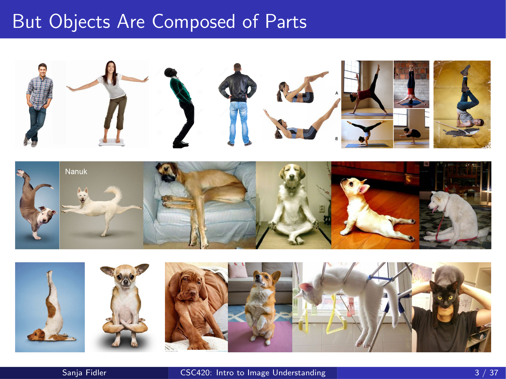{ width="650" }

#### 3.6.1 模型结构

- 根滤波器（root filter）：类似 HOG 行人的整体模板（在较粗分辨率上）
- 部件滤波器（part filters）：在更高分辨率（常为 root 的 2×）的 HOG 上建模每个部件外观
- 形变代价：当部件偏离其相对期望位置时，引入二次惩罚（典型为二次函数）

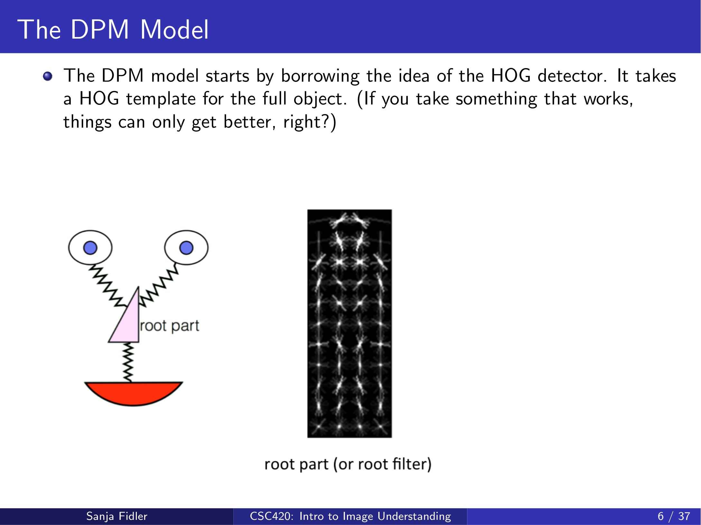{ width="650" }

#### 3.6.2 打分函数（概念式）

对某个金字塔层级 $l$ 和根位置 $p_0$，DPM 的窗口打分可写成：

$$
\mathrm{score}(l, p_0)
= F_0 \cdot \mathrm{HOG}(l, p_0)
+ \sum_{i=1}^{n} \max_{p_i}\;\Big[F_i \cdot \mathrm{HOG}(l', p_i) - \mathrm{deform}_i(p_i - \hat p_i)\Big],
$$

其中 $F_0, F_i$ 分别是根与第 $i$ 个部件的模板（滤波器），$\mathrm{deform}_i(\cdot)$ 是形变代价函数，$\hat p_i$ 是部件的相对期望位置，$l'$ 为更高分辨率层级。

#### 3.6.3 高效评分：相关 + 距离变换（动态规划）

- 与 HOG 一样，$F \cdot \mathrm{HOG}$ 可通过 **互相关/卷积** 高效计算整幅特征图的响应
- 对形变项的 $\max$（在部件局部邻域内搜索）可通过 **距离变换** 等技巧在格点上高效实现（或用近邻窗口近似）

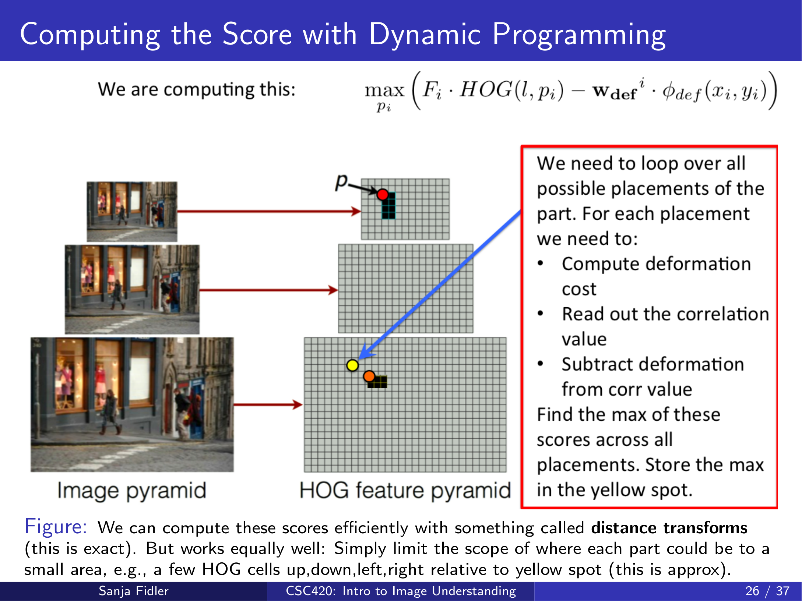{ width="650" }

#### 3.6.4 训练：Latent SVM

部件位置是 **潜变量（latent）**，没有标注。不能直接用标准 SVM 训练。DPM 使用 **latent SVM** 框架：在迭代中交替 “给定参数估计潜变量” 与 “给定潜变量优化参数”。

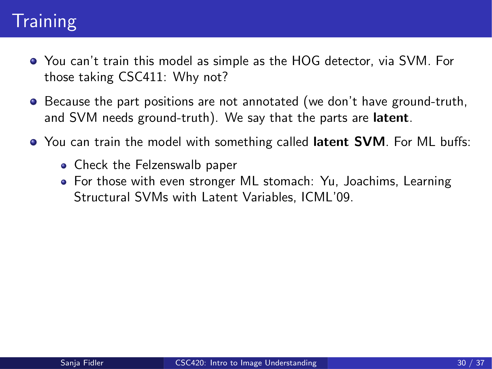{ width="650" }

#### 3.6.5 版本演进与效果

- v1：加入部件
- v2：加入混合组件（mixture/component），兼顾不同姿态（如坐姿）或子类
- v3：多个混合组件，进一步提升泛化

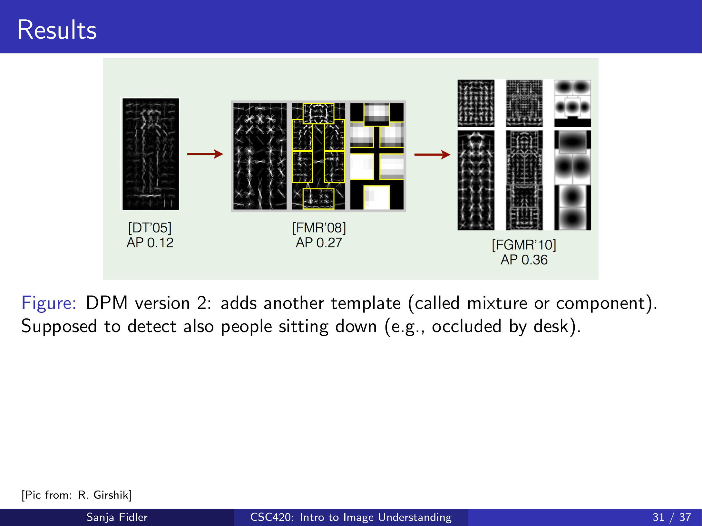{ width="650" }

早期在 PASCAL VOC 等基准上，DPM 相较单一 HOG 模板具有显著优势，但 **计算代价** 较大（课件给出约 20–30s/图/类的量级，后续有加速策略）。

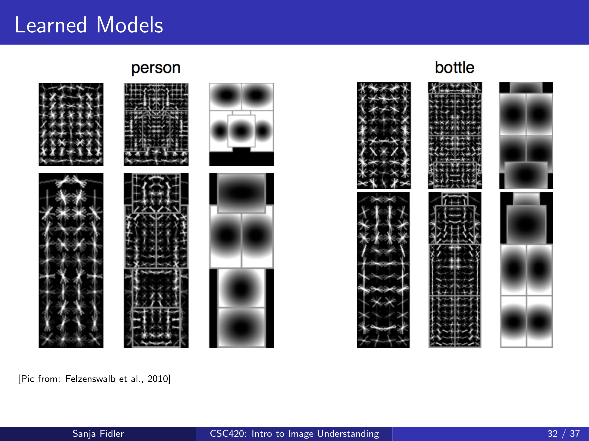{ width="650" }

## 4 走向深度学习：从滑窗到特征图上的区域

第一部分课程最后提到 HOG+SVM、DPM 等传统检测路线；第二部分课程转向深度学习检测体系（R-CNN 系列、YOLO/SSD、FPN 等）。

{ width="650" }

### 4.1 CNN 的一个关键事实：卷积层天然保留空间位置信息

slides 强调：卷积层可接受任意大小输入，输出 feature map 尺寸与输入成比例。这意味着：

- feature map 不仅提供 “是什么” 的语义特征
- 也隐含了 “在哪里” 的空间结构（在 feature map 上的坐标对应输入图像的感受野）

{ width="650" }

### 4.2 感受野（Receptive field）与“特征 + 位置”

对于 feature map 上的一个 cell，其对应输入图像上的一个感受野区域。感受野大小随网络层数加深而增大，这解释了为何深层特征更偏语义、浅层特征更偏局部纹理。

{ width="650" }

slides 用一句话概括：feature maps 同时表示 features 及其 locations。

{ width="650" }

### 4.3 特征可视化（补充理解）

slides 用 ZFNet 的可视化示例强调：深层 feature map 的某个神经元/通道往往对应特定的视觉模式；通过 unpooling / deconv 等操作，可以把 “某个激活对应的输入结构” 还原到像素空间，从而理解网络学到了什么。

{ width="650" }

## 5 Region-based 检测：R-CNN → Fast R-CNN → Faster R-CNN

### 5.1 为什么要引入 region proposals

slides 给出的动机是 “Beyond sliding windows”：用候选区域（region proposals）代替密集滑窗，优势包括：

- 显著减少需要评估的区域数量
- 允许使用更强的特征与分类器
- proposal 机制可类无关，并且可训练

### 5.2 Selective Search：一种经典 proposal 方法

slides 提到 Selective Search 的基本思想：先做过分割得到 superpixels，然后基于多种 cue 做层次化合并，产生不同尺度的候选区域。

{ width="650" }

### 5.3 R-CNN：Regions with CNN Features（CVPR 2014）

R-CNN 由 Ross Girshick 等人于 2014 年提出，**首次成功将深度学习（CNN）引入目标检测**，将 mAP 提升了 30% 以上，是该领域的里程碑式工作。

#### 5.3.1 核心流程：四阶段管线

R-CNN 的工作流程分为”找框 → 提特征 → 分类 → 精修”四个阶段：

{ width="650" }

1. **生成候选区域（Region Proposals）：** 使用 **Selective Search** 算法，根据颜色、纹理等特征从图像中选出约 **2000 个** 可能包含物体的候选框。
2. **特征提取（Feature Extraction）：** 将每个候选区域 warp 到固定大小（如 $224\times 224$），逐一输入 CNN 提取高维特征向量。
3. **SVM 分类（Classification）：** 每个类别训练一个 SVM 分类器，对 CNN 特征进行分类判断。
4. **Bounding Box Regression：** 用线性回归模型微调框的位置和大小，使其更精准地贴合物体。

#### 5.3.2 为什么 R-CNN 能大幅提升精度

传统方法（如 HOG + SVM）依赖人工设计的特征。R-CNN 的关键突破是 **用大规模数据预训练的 CNN（如 AlexNet）提取特征**，CNN 学到的层次化语义表示远强于手工特征，从而在分类精度上实现了质的飞跃。

#### 5.3.3 R-CNN 的缺点

虽然精度大幅提升，但 R-CNN 有三个致命缺陷：

- **速度极慢：** 每张图的 2000 个候选区域都要单独跑一遍 CNN forward，处理一张图需要约 **47 秒**（当年 GPU 条件下）。
- **硬盘占用巨大：** 需要将 2000 个区域提取的特征全部存入硬盘来训练 SVM，空间开销大。
- **非端到端训练：** 训练流程碎片化——先训练 CNN，再训练 SVM，最后训练回归器，无法一气呵成。

#### 5.3.4 R-CNN 家族的演进

为了解决 R-CNN 的问题，后来出现了几个极其著名的改进版本：

| 版本 | 核心改进 | 效果 |
| --- | --- | --- |
| **Fast R-CNN**（2015） | 整张图跑一次 CNN，feature map 上截取 proposals | 速度快 10–100 倍 |
| **Faster R-CNN**（2015） | 用 RPN（区域生成网络）替代 Selective Search | 真正实现端到端，实时检测的基础 |
| **Mask R-CNN**（2017） | 在检测基础上加入 mask branch 做实例分割 | 同时输出检测框和物体轮廓 |

### 5.4 Fast R-CNN：共享卷积计算 + RoI Pooling

Fast R-CNN 的关键变化是：

- 对整张图像只做一次卷积前向得到 feature map
- 每个 proposal 不再裁剪原图，而是在 feature map 上截取对应区域
- 通过 RoI Pooling 把任意大小的 RoI 变成固定维度特征，再接全连接层分类与回归

{ width="650" }

#### 5.4.1 为什么需要 RoI Pooling

CNN 全连接层要求固定维度输入，而 region proposals 大小不一。RoI Pooling 的核心思想是把任意大小的 RoI(Region of Interest) 划分为固定数量的子窗口（如 $H\times W$），再对每个子窗口做 max pooling——无论原始 RoI 尺寸如何，输出始终是 $H\times W$ 维特征。

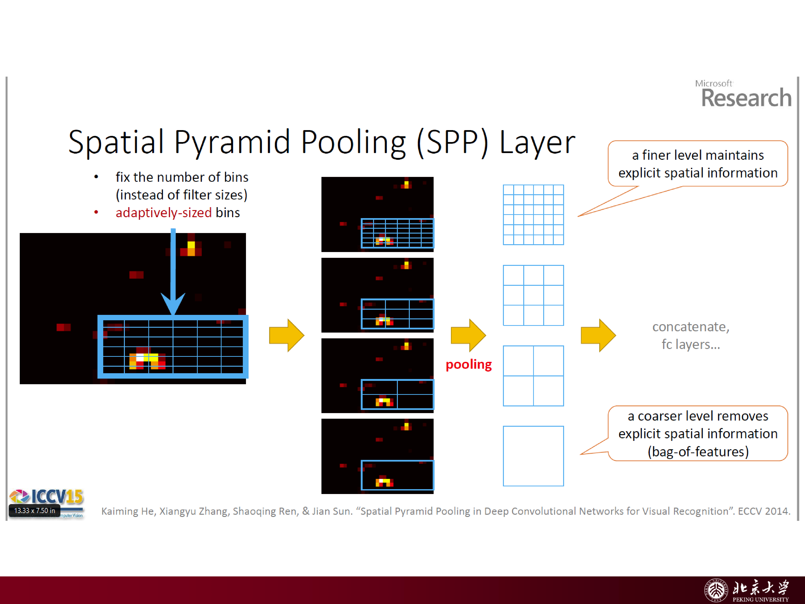{ width="650" }

slides 给出一个直观示例：若 RoI 尺寸为 $700\times 700$，划分成 $7\times 7$ 个 bin，每个 bin 约 $100\times 100$ 像素，在每个 bin 内做 max pooling 即得到 $7\times 7$ 输出。

??? info "RoI Pooling 的问题：量化误差"
     RoI Pooling 采用取整（floor/ceil）操作，会引入量化误差。后续工作（如 RoI Align）通过双线性插值解决了这个问题。

#### 5.4.2 End-to-end 训练

与 R-CNN 的多阶段独立训练不同，Fast R-CNN 可以端到端优化整个网络（包括 CNN backbone + RoI head + 分类/回归 head）。这不仅简化了流程，也显著提升了性能。

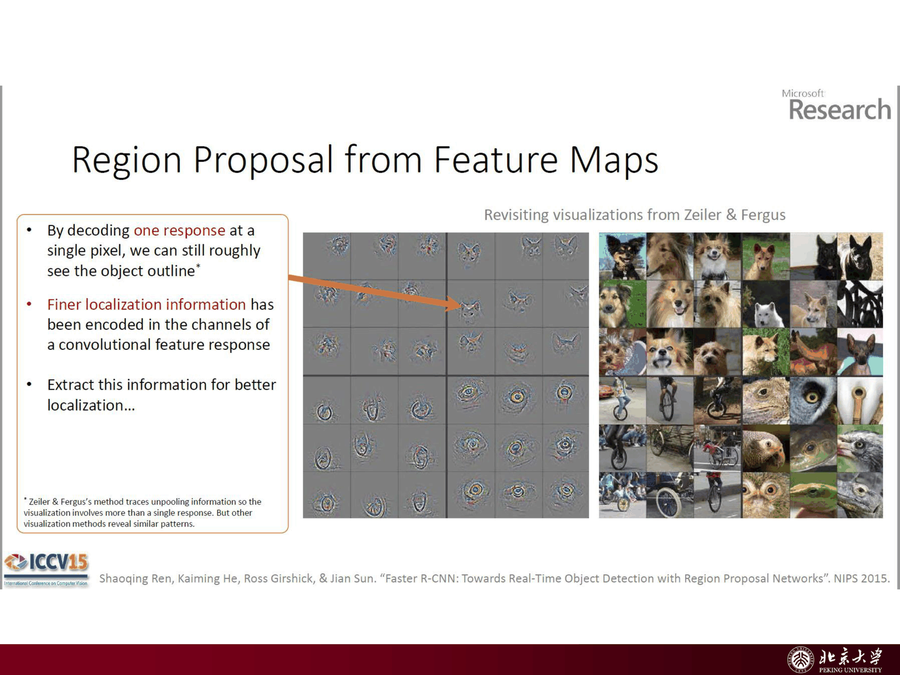{ width="650" }

Fast R-CNN 的分类损失 $L_{cls}$ 使用 multi-task loss：

$$
L(p,u,t^u,t^\star)=L_{cls}(p,u)+\lambda\cdot\mathbf{1}[u\ge 1]\cdot L_{loc}(t^u,t^\star),
$$

其中 $u$ 是真实类别标签（背景类 $u=0$），$t^u$ 是预测的 bounding box 回归参数（仅对前景类 $u\ge 1$ 生效）。

### 5.5 Faster R-CNN：把 proposal 也”网络化”（RPN）

推荐阅读: [一文读懂 Faster R-CNN](https://zhuanlan.zhihu.com/p/31426458);

Fast R-CNN 仍依赖外部 proposal。slides 提出核心问题：检测网络已很快（例如 0.2s），但 Selective Search 仍可达 2s/图，proposal 成为瓶颈。

{ width="650" }

Faster R-CNN 的思路是：在共享 feature map 上引入 Region Proposal Network（RPN）直接生成 proposals，并与检测 head 共享特征。

#### 5.5.0 RPN 是什么：把“找候选框”也交给网络

**RPN** 的全称是 **Region Proposal Network**（区域生成网络）。它是 Faster R-CNN 最关键的核心创新之一：用一个轻量的全卷积子网络，在 GPU 上直接从共享 feature map 预测 “哪些位置可能有物体” 以及 “候选框该怎么微调”，从而替代 CPU 上的 Selective Search。

直观对比：

- R-CNN / Fast R-CNN：proposal 由外部算法生成，慢且不可端到端学习（经典说法：Selective Search 约 2s/图）
- Faster R-CNN：proposal 由 RPN 生成，通常在 10ms 量级（取决于实现与硬件），并且与检测 head 共享特征

RPN 的输入是 backbone 输出的 feature map。其核心机制可以理解为“在 feature map 上做滑窗检测，但只做类无关的前景/背景判断”：

1. **滑动窗口（Sliding Window）**
   在 feature map 上用一个小卷积核（常用 $3\times 3$）滑动，每个位置对应原图中的一个局部感受野中心。
2. **锚框（Anchors）**
   每个滑动位置预设 $k$ 个不同尺度/长宽比的 anchor（讲义典型设定 $k=9$）。这一步把“多尺度、多形状”的枚举显式化，让网络只需学习偏移量而不是从零生成框。
3. **两条输出分支（Two Heads）**
   对每个 anchor 同时预测：
        - **Objectness（前景/背景分类）**：只回答“是不是物体”，不做具体类别区分
        - **BBox regression（边界框回归）**：输出 4 个偏移量，用于把 anchor 微调成更贴近目标的 proposal

4. **训练标签与筛选策略**
   训练时通过 IoU 进行 anchor 标注：
    - 正例：与某个 GT IoU 最高的 anchor，或 IoU $>$ 0.7
    - 负例：IoU $<$ 0.3
    - 其余：通常不参与损失（忽略）

5. **NMS 生成最终 proposals**
   全图会产生大量候选框（例如 feature map 为 $60\times 40$，$k=9$，则约 $60\times 40\times 9\approx 2\times 10^4$ 个 anchors）。RPN 会按 objectness 排序并做 NMS，保留少量高质量 proposals（例如 2000 个）交给后续 RoI Pooling / detection head。

!!! tip "为什么 RPN 很高效"
    核心原因是 **特征共享 + 全卷积设计**：

    - RPN 与检测 head 共用同一 backbone feature map，proposal 生成几乎是“附带成本”
    - 全卷积结构可处理任意尺寸输入
    - proposal 生成可端到端训练，随着训练变得越来越准

{ width="650" }

#### 5.5.1 Anchor Box：多尺度和长宽比的先验

滑窗方法需要在图像金字塔上枚举大量尺度/位置，效率低。RPN 的解决方案是引入 **anchor box**（也称 anchor 或 prior box）：在 feature map 的每个位置，预先定义一组固定尺度和长宽比的参考框，再基于这些参考框预测偏移量。

slides 给出的经典设定：

- **scale（面积）：** $\{128^2, 256^2, 512^2\}$（对应小/中/大目标）
- **aspect ratio（长宽比）：** $\{1:1, 1:2, 2:1\}$（覆盖竖长、横宽、正方形）

三者组合即 $3\times 3=9$ 个 anchor boxes / 位置。对一张 $W\times H$ 的 feature map，总共有 $WH\times 9$ 个 anchors。

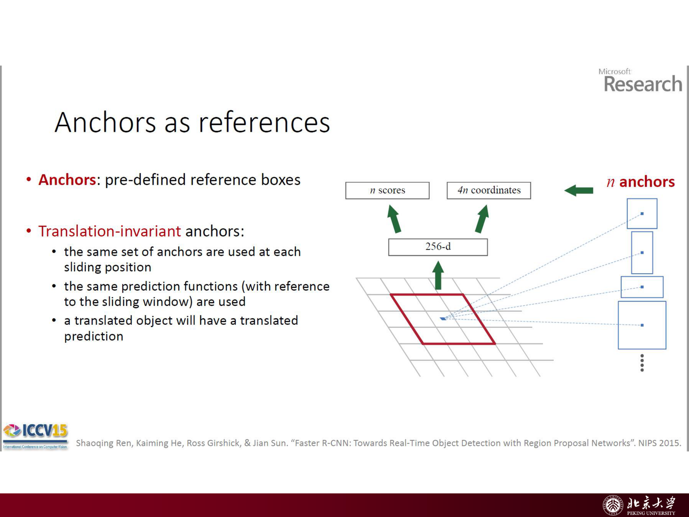{ width="650" }

#### 5.5.2 RPN 的输出与损失

对每个 anchor，RPN 输出：

- **Objectness score（分类）：** 该 anchor 是前景还是背景的概率
- **Bounding box regression：** 预测相对于 anchor 的偏移量 $(t_x, t_y, t_w, t_h)$ （详细见下一部分）

训练时，将每个 anchor 与 GT 框匹配（IoU > 0.7 为正例，< 0.3 为负例），再计算：

- **Classification loss：** binary cross-entropy（前景/背景二分类）
- **Localization loss：** smooth L1 loss（仅正例参与）

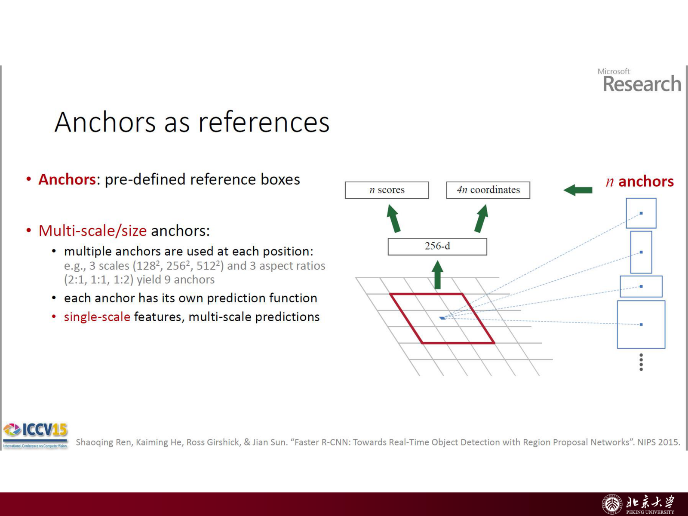{ width="650" }

#### 5.5.3 Proposal Layer：把 RPN 输出转换为候选框

RPN 输出的回归偏移量应用到 anchor 上，得到大量候选框（数量约为 $WH\times 9$，可能达数万个）。Proposal Layer 负责：

1. 将偏移量应用到所有 anchors，生成修正后的候选框
2. 对所有候选框按前景 score 排序
3. 执行 NMS（Non-Maximum Suppression），去除高度重叠的框
4. 取 score 最高的前 $N$（如 2000）个作为最终 proposals，输出给 Fast R-CNN head

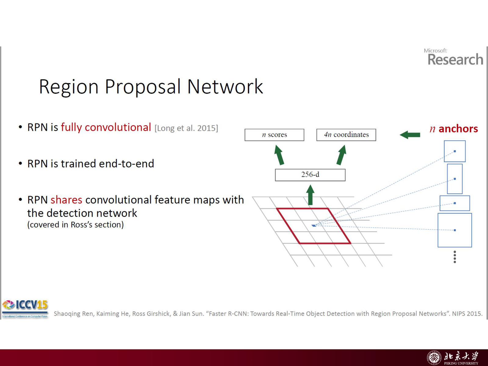{ width="650" }

#### 5.5.4 四步交替训练（4-Step Alternating Training）

由于 RPN 和 Fast R-CNN 共享特征，二者需要协同训练。Faster R-CNN 原论文采用四步交替训练：

1. **训练 RPN：** 在 ImageNet 预训练的 backbone 上单独训练 RPN，得到初步 proposal 网络
2. **训练 Fast R-CNN：** 用步骤 1 的 RPN 生成的 proposals 训练 Fast R-CNN 检测 head（此时 RPN 和 Fast R-CNN 的 backbone 不同）
3. **微调 RPN（共享 backbone）：** 固定 Fast R-CNN 的 backbone，Fine-tune RPN（此时两者共享特征）
4. **微调 Fast R-CNN：** 固定 RPN，用步骤 3 生成的 proposals 再次训练 Fast R-CNN

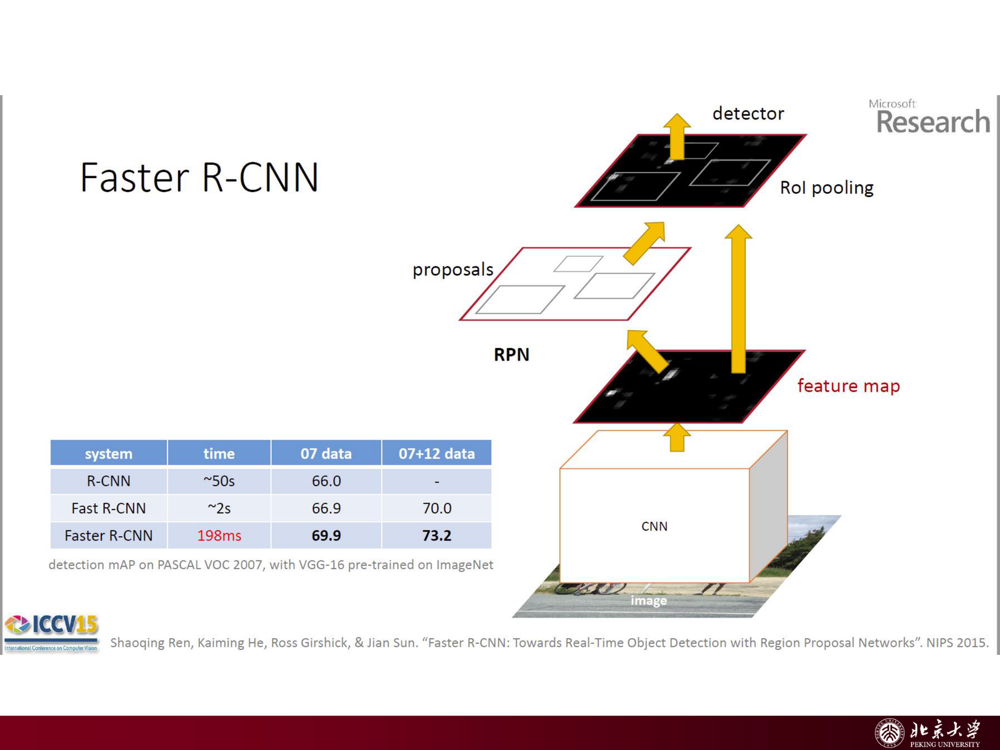{width="650"}

#### 5.5.5 Inference 完整流程

Inference 时，RPN + Fast R-CNN 共享同一 backbone，形成端到端检测管线：

1. 全图通过 backbone 得到 feature map
2. RPN 在 feature map 上生成 ~2000 个 proposals
3. RoI Pooling 根据 proposals 在共享 feature map 上截取特征
4. 分类 head + 回归 head 输出最终类别与精修后的框
5. 再次 NMS 得到最终检测结果

其中第 3 步的 **RoI Pooling** 可以展开为：

1. **坐标映射到 feature map**
   RPN 给出的 proposal 通常在原图坐标系（像素）下，先按 backbone stride $s$ 映射到 feature map：

$$
(x_1', y_1', x_2', y_2') = \left(\frac{x_1}{s}, \frac{y_1}{s}, \frac{x_2}{s}, \frac{y_2}{s}\right)
$$

2. **划分固定网格（如 $7\times 7$）**
   将 RoI 区域按输出尺寸切成 $H_{out}\times W_{out}$ 个 bins（经典 Fast/Faster R-CNN 常用 $7\times 7$）。

3. **每个 bin 内做池化（通常 max pooling）**
   对每个通道，在 bin 内取最大值，得到一个标量。遍历所有通道与所有 bins，最终输出固定形状特征：

$$
\text{RoI Feature} \in \mathbb{R}^{C \times H_{out} \times W_{out}}
$$

4. **送入检测头**
   固定尺寸特征可直接接全连接层（或后续卷积层），做分类与框回归。

!!! note "RoI Pooling 的关键问题：量化误差"
    RoI Pooling 在边界映射和 bin 划分时通常会做取整（floor/ceil/round），导致 RoI 与原特征存在对齐偏差（misalignment），对小目标和边界敏感任务影响更明显。这也是 Mask R-CNN 使用 RoI Align（双线性插值、避免离散量化）替代 RoI Pooling 的核心原因。

slides 给出 Faster R-CNN 在 VOC 2007 test 上的 mAP 达 **78.8%**，是当时 state-of-the-art。Faster R-CNN 将 proposal 生成从 CPU 计算（Selective Search 约 2s）变成 GPU 计算（RPN 约 10ms），极大降低了整体延时。

## 6 Bounding Box Regression：把“粗框”修正为“更准的框”

slides 专门讨论了 bounding box regression，用于对 proposal 的位置与尺度进行连续修正。

{ width="650" }

常见做法是对框进行参数化（以中心点与宽高为例）：

$$
\begin{aligned}
t_x &= \frac{x^\star - x}{w}, \quad
t_y = \frac{y^\star - y}{h}, \\
t_w &= \log \frac{w^\star}{w}, \quad
t_h = \log \frac{h^\star}{h},
\end{aligned}
$$

其中 $(x,y,w,h)$ 是 proposal，$(x^\star,y^\star,w^\star,h^\star)$ 是目标框（GT 或更准确的目标）。网络预测 $(t_x,t_y,t_w,t_h)$ 后即可反推出修正框。

## 7 单阶段检测：YOLO 与 SSD

Region-based 方法属于两阶段（proposal + classification/regression）。另一条路线是把检测看作一个端到端回归问题，直接在特征图上输出类别与框。

### 7.1 YOLO v1：把检测视为端到端回归（CVPR 2016）

YOLO（You Only Look Once，CVPR 2016）的核心创新是 **将检测任务重新定义为单一的回归问题**：把输入图像划分为 $S\times S$ 个 grid cell，直接从图像像素到边界框坐标和类别概率的映射。

#### 7.1.1 核心思想

slides 的关键表述是：如果一个目标的中心落在某个 grid cell 内，那么这个 cell 负责预测该目标。

{ width="650" }

- 输入图像被划分为 $7\times 7$ 个 grid cells
- 每个 cell 预测 $B=2$ 个 bounding boxes（每个包含位置、尺寸和置信度）
- 每个 cell 还预测 $C$ 个类别概率（如 VOC 数据集 $C=20$）

因此最终输出 tensor 维度为 $S\times S\times (B\times 5 + C)=7\times 7\times 30$。

#### 7.1.2 每个 bounding box 的输出

每个预测框包含 5 个值：

$$
(x, y, w, h, \text{confidence}),
$$

其中 $(x,y)$ 是框中心相对于 grid cell 的归一化坐标，$(w,h)$ 是相对于整张图像的宽高，$\text{confidence}$ 反映该框包含目标的概率（类似 $P(\text{object})\times \text{IoU}$）。

#### 7.1.3 YOLO 损失函数

YOLO v1 使用 **sum-squared error（SSE）** 作为损失函数，可分解为三部分：

$$
\mathcal{L} = \underbrace{\sum_{i=1}^{S^2}\mathbf{1}_i^{\text{obj}}\Big[(x_i-\hat{x}_i)^2+(y_i-\hat{y}_i)^2\Big]}_{\text{中心点位置损失}}
+ \underbrace{\sum_{i=1}^{S^2}\mathbf{1}_i^{\text{obj}}\Big[(\sqrt{w_i}-\sqrt{\hat{w}_i})^2+(\sqrt{h_i}-\sqrt{\hat{h}_i})^2\Big]}_{\text{宽高损失（开方减少大框主导）}}
+ \underbrace{\sum_{i=1}^{S^2}\mathbf{1}_i^{\text{obj}}\Big[(c_i-\hat{c}_i)^2\Big]}_{\text{正例置信度损失}}
+ \underbrace{\lambda_{\text{no-obj}}\sum_{i=1}^{S^2}\mathbf{1}_i^{\text{noobj}}\Big[(c_i-\hat{c}_i)^2\Big]}_{\text{负例置信度损失（加权惩罚）}}
+ \underbrace{\sum_{i=1}^{S^2}\mathbf{1}_i^{\text{obj}}\sum_{c\in\text{classes}}\Big[p_i(c)-\hat{p}_i(c)\Big]^2}_{\text{类别概率损失}}.
$$

slides 强调了几个关键设计：

- $\lambda_{\text{no-obj}}$（如 0.5）用于降低负例置信度损失的权重，因为大多数 cell 都是不含目标的负例
- 宽高预测使用 $\sqrt{w}$、$\sqrt{h}$（开方），使小框和大框的相对误差在损失函数中贡献更均衡
- 只有当 cell 内有 GT 目标中心时，才计算位置损失和类别损失

#### 7.1.4 YOLO v1 架构

YOLO v1 采用类似 GoogLeNet 的网络结构：24 个卷积层 + 2 个全连接层，ImageNet 预训练后 fine-tune。

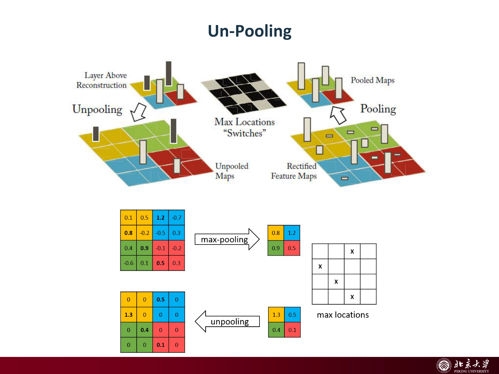{ width="650" }

#### 7.1.5 YOLO v1 的优势与局限

slides 总结了 YOLO v1 的优点：

- **速度快：** 基础版达 45 FPS，fast 版本达 150 FPS（远快于当时的两阶段方法）
- **端到端：** 推理即为一次前向传播，无复杂后处理管线
- **全局推理：** 由于看整张图像，背景误检率较低（相对于 R-CNN 基于局部区域的方式）

**局限性：**

- 每个 grid cell 只预测 $B=2$ 个框，且只预测一个类别，限制了密集小目标的检测能力
- 对长宽比变化大的目标检测效果较差（框的形状受限于预设）
- 定位精度相对较低（尤其是小目标）
- 损失函数中位置损失和分类损失使用相同的 SSE，未做加权平衡

#### 7.1.6 YOLO v1 性能

slides 给出 YOLO 在 VOC 2007 上的结果：mAP 约 **63.4%**，速度 45 FPS。对比当时 Faster R-CNN 的 78.8% mAP，精度仍有差距，但速度优势巨大。

### 7.2 SSD：YOLO + Default Boxes + Multi-scale（ECCV 2016）

SSD（Single Shot MultiBox Detector，ECCV 2016）在 YOLO 的端到端框架基础上，引入了两个关键改进，显著提升了精度。

slides 用一句话概括 SSD：YOLO + default boxes + multi-scale。

#### 7.2.1 Default Box（Anchor）的引入

与 Faster R-CNN 的 anchor box 类似，SSD 在每个 feature map 位置预设了多个 default boxes（不同 scale 和 aspect ratio）。

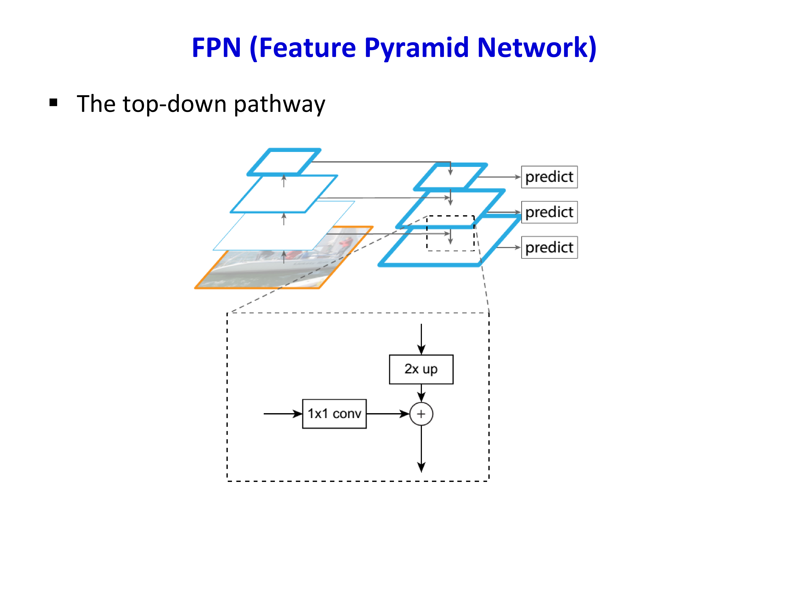{ width="650" }

slides 给出的默认设置：对 feature map 上的每个位置，SSD 预设 6 种 default boxes（4 个 aspect ratios + 2 个额外 scales）。对 $m\times n$ 的 feature map，总共有 $m\times n\times 6$ 个 default boxes。

#### 7.2.2 Multi-scale Feature Maps

与 YOLO 仅在最后一个 feature map 上做预测不同，SSD 在**多个不同尺度的 feature maps 上分别做预测**：

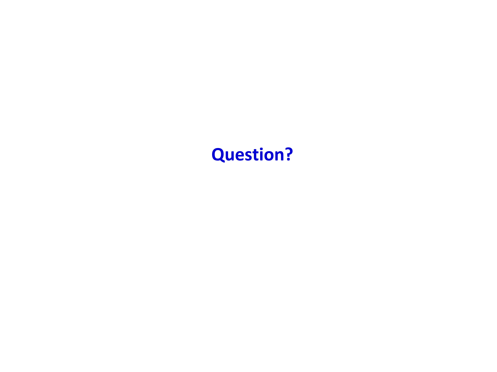{ width="650" }

- 浅层 feature map（如 $38\times 38$）：负责检测小目标（default box scale 较小）
- 深层 feature map（如 $1\times 1$）：负责检测大目标（default box scale 较大）

slides 指出：不同层的 default boxes 对应不同的 scale 范围。例如 conv4_3 层负责最小目标，fc7 层负责中等目标，conv6_2 及更粗层负责大目标。

#### 7.2.3 SSD 输出

对每个 default box，SSD 预测：

- **类别概率：** $(C+1)$ 个类别分数（$C$ 个前景类 + 1 个背景类）
- **位置偏移：** 相对于 default box 的精细调整 $(t_x, t_y, t_w, t_h)$

因此，对一个有 $k$ 个 default boxes 和 $C$ 个类别的任务，输出 feature map 为 $(C+4)\times k$ 通道。

#### 7.2.4 SSD 损失函数

SSD 采用 multi-task loss：

$$
\mathcal{L}(x,c,l,g)=\frac{1}{N}\Big[\mathcal{L}_{conf}(x,c)+\alpha\cdot\mathcal{L}_{loc}(x,l,g)\Big],
$$

- **Classification loss $\mathcal{L}_{conf}$：** softmax loss over $(C+1)$ 类（正负例均参与）
- **Localization loss $\mathcal{L}_{loc}$：** smooth L1 loss，只在正例 default boxes 上计算
- $N$：匹配到的正例数量（用于归一化）
- $\alpha$：权重平衡因子（通常为 1）

#### 7.2.5 Hard Negative Mining

由于绝大多数 default boxes 都是负例（背景），直接训练会导致类别极度不平衡。SSD 采用 **hard negative mining**：只保留置信度最高的负例（使正负例比例约为 1:3），丢弃其余负例，从而保持类别平衡。

#### 7.2.6 SSD 性能

slides 给出 SSD 在 VOC 2007 test 上的结果：mAP 约 **77.2%**（使用 VGG-16 backbone），速度 46 FPS（Titan X）。在精度上接近 Faster R-CNN（78.8%），同时保持了实时的检测速度。

## 8 多尺度增强：FPN（Feature Pyramid Network）

检测的一个关键挑战是目标尺度变化。FPN 的核心思想是同时利用深层语义强、浅层分辨率高的优势，通过自顶向下路径与 lateral connections 构建多尺度特征金字塔。

{ width="650" }

### 8.1 动机：为什么需要特征金字塔

单一尺度的 feature map 难以同时处理不同大小的目标：

- 深层 feature map 语义信息丰富，但分辨率低，小目标信息丢失
- 浅层 feature map 分辨率高，但语义信息弱，特征判别力不足

传统方法通过图像金字塔（对原图做多尺度缩放）解决这一问题，但计算代价巨大。

### 8.2 FPN 的结构

FPN 由两条路径组成：

- **Bottom-up pathway（前馈路径）：** 主干网络（如 ResNet）的逐层前馈计算，产生多尺度特征图 $\{C_2, C_3, C_4, C_5\}$（分别对应 stride 4, 8, 16, 32）
- **Top-down pathway + Lateral connections（自顶向下 + 横向连接）：** 将深层特征上采样（2× up），与对应的浅层特征通过 $1\times 1$ 卷积融合，产生 $\{P_2, P_3, P_4, P_5\}$（P = Pyramid）

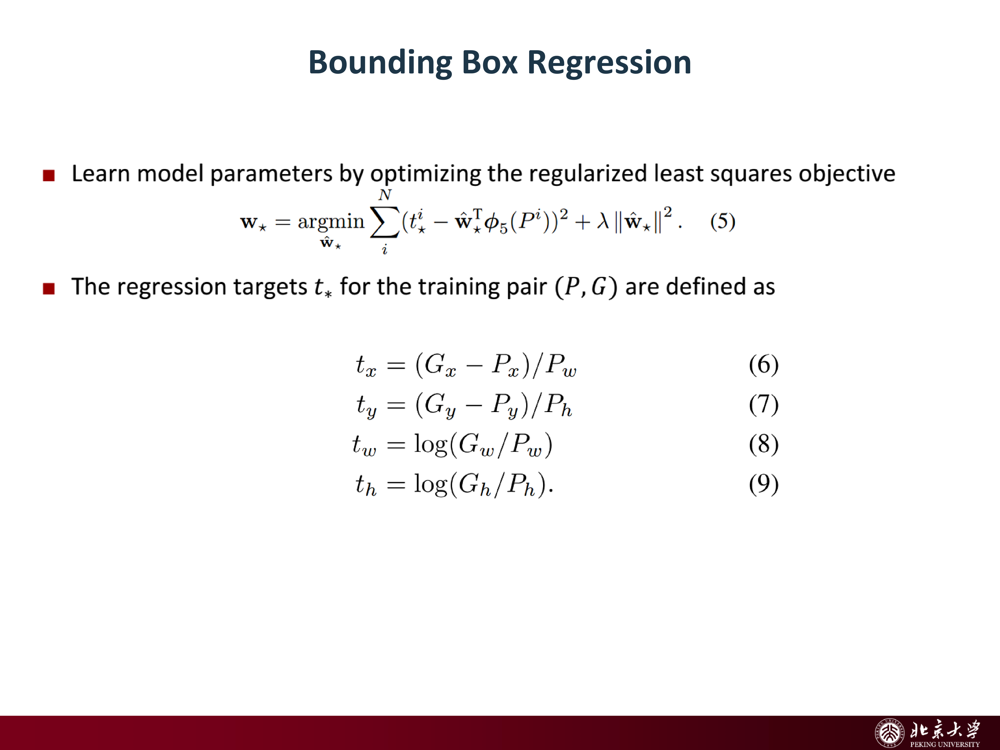{ width="650" }

具体步骤：

1. 对每个层级的特征 $C_i$，通过 $1\times 1$ 卷积（lateral connection）降维到 256 通道
2. 从最深层级 $P_5$ 开始，依次上采样（nearest neighbor upsample）并与对应 $C_i$ 逐元素相加
3. 每个融合后的 $P_i$ 再接一个 $3\times 3$ 卷积，减少上采样的混叠效应

### 8.3 FPN 如何用于检测

FPN 的每个层级 $P_i$ 负责检测特定尺度范围的目标：

- **$P_2$：** 小目标（面积约 $<32^2$）
- **$P_3$：** 中小目标（面积约 $32^2$–$64^2$）
- **$P_4$：** 中等目标（面积约 $64^2$–$128^2$）
- **$P_5$：** 大目标（面积约 $128^2$–$256^2$）
- **$P_6$：** 更大目标（可选，通过 $3\times 3$ stride-2 conv 从 $P_5$ 得到）

每个层级的特征图上使用 RPN 或检测 head 独立做预测，实现多尺度检测。

### 8.4 FPN 的意义

FPN 成为了现代检测器的标配组件。slides 指出其核心价值：

- 几乎不增加计算量（仅额外几个 $1\times 1$ 卷积和轻量上采样）
- 显著提升多尺度目标的检测性能
- 统一了特征表示，使得不同尺度的目标都能在合适的层级被检测

## 9 精度 vs 速度：一阶段与两阶段的对比

slides 专门用一页总结了检测方法在精度与速度上的 trade-off。

{ width="650" }

### 9.1 两阶段方法（Two-stage）

以 Faster R-CNN 为代表，流程为：**Region Proposal → Classification & Regression**。

- **优点：** 精度高（mAP > 75%），proposal 机制减少负例干扰，定位更准确
- **缺点：** 速度较慢（通常 10-30 FPS），两阶段 pipeline 复杂
- **代表方法：** R-CNN → SPP-Net → Fast R-CNN → Faster R-CNN

### 9.2 一阶段方法（One-stage）

以 YOLO、SSD 为代表，直接在 feature map 上回归类别和框。

- **优点：** 速度快（可达 30-100+ FPS），架构简洁
- **缺点：** 精度通常略低于两阶段方法，尤其是小目标和密集目标
- **代表方法：** YOLO → SSD → RetinaNet → YOLOv2/v3

### 9.3 Focal Loss 与 RetinaNet：弥合精度差距

一阶段方法精度低于两阶段的一个关键原因是**类别不平衡**（class imbalance）：背景负例数量远大于正例（目标），大量易分类的负例主导了梯度，使正例的学习被抑制。

#### 9.3.1 Focal Loss（ICCV 2017）

Focal Loss 的设计动机是**降低易分类负例的贡献，增加难分类样本的梯度权重**：

$$
\mathrm{FL}(p_t) = -(1-p_t)^\gamma \log(p_t),
$$

其中 $p_t$ 是模型对真实类别的预测概率，$\gamma\ge 0$ 是**聚焦参数（focusing parameter）**。

- 当样本被正确分类（$p_t$ 高）时，$(1-p_t)^\gamma$ 项趋近于 0，损失被大幅衰减
- 当样本难以分类（$p_t$ 低）时，$(1-p_t)^\gamma$ 接近 1，损失几乎不受影响
- $\gamma=0$ 时退化为普通交叉熵；$\gamma=2$ 是常用设定

slides 还补充了一个可选的类别平衡权重 $\alpha_t$：

$$
\mathrm{FL}(p_t) = -\alpha_t (1-p_t)^\gamma \log(p_t).
$$

#### 9.3.2 RetinaNet：Focal Loss + FPN + 两分支 head

RetinaNet（ICCV 2017）的设计非常简洁：

- **Backbone：** ResNet + FPN（多尺度特征金字塔）
- **检测 head：** 两个并行的子网络
  - **Classification subnet：** 预测每个 anchor 的类别概率（Focal Loss 训练）
  - **Regression subnet：** 预测每个 anchor 的边界框偏移量
- **Anchors：** 与 Faster R-CNN 类似，多尺度、多长宽比（每位置 9 个 anchors）

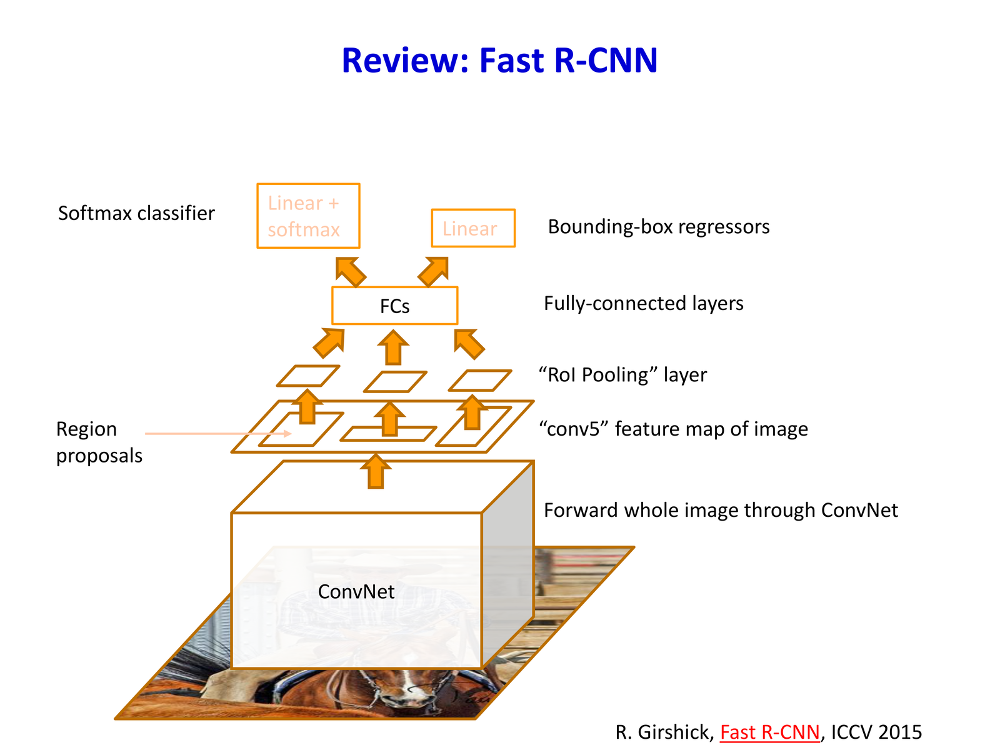{ width="650" }

RetinaNet 的核心发现是：使用 Focal Loss 后，一阶段检测器可以达到与两阶段方法相当的精度，同时保持更快的速度。

#### 9.3.3 精度 vs 速度的最终结论

slides 给出了一个经典的精度-速度 trade-off 图：

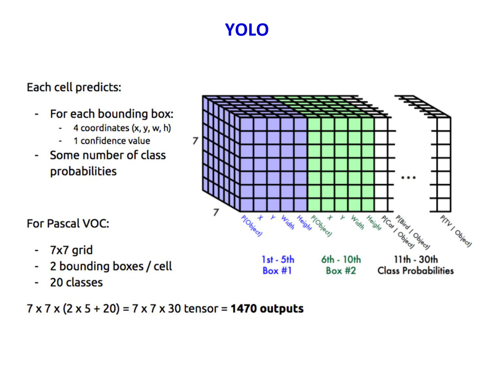{ width="650" }

关键结论：

- **Faster R-CNN：** 最高精度（mAP ~79%），但最慢
- **SSD：** 中等精度（mAP ~77%），速度较快（40-50 FPS）
- **YOLO：** 速度最快（150 FPS），但精度较低（mAP ~63%）
- **RetinaNet：** 通过 Focal Loss 达到了与 Faster R-CNN 相当的精度（mAP ~39.1% on COCO），同时保持了较好的速度

??? info "COCO vs PASCAL VOC 指标差异"
    slides 多次提到 COCO 数据集的 mAP（AP@[0.5:0.95]，即 IoU 从 0.5 到 0.95 的平均 AP），这与 PASCAL VOC 的 AP@0.5 指标不同。COCO 评估更严格，因为需要更高的定位精度（IoU 阈值更高），所以同一方法在 COCO 上的 mAP 通常低于 VOC。

## 9 总结

- **传统实时检测（Viola–Jones）：** 通过积分图 + Boosting + 级联在滑窗框架下实现极高效率与极低误检率。
- **深度学习检测：** 关键在于把 “特征 + 位置” 的特性发挥出来，在 feature map 上对区域进行建模。
- **两阶段 vs 单阶段：** R-CNN 系列通过 proposal/region 建模更灵活；YOLO/SSD 通过端到端密集预测获得更高速度。
- **多尺度：** FPN 通过特征金字塔显著增强跨尺度检测能力。

## 考试重点
**RPN**： Region Proposal Network (==important!==)
**Anchor**: 很关键的概念，RPN 和 YOLO 中都有使用
**FPN**: 赶进度，直接跳过了
