## 1 目标检测任务：从分类到定位

课件链接：

[detection - I](slides/detection%20-%20I.pdf)

[detection - II](slides/detection%20-%20II.pdf)

目标检测（Object Detection）要同时回答两类问题：

- **是什么：** 目标属于哪个类别
- **在哪里：** 目标在图像中的位置（通常用 axis-aligned bounding box 表示）

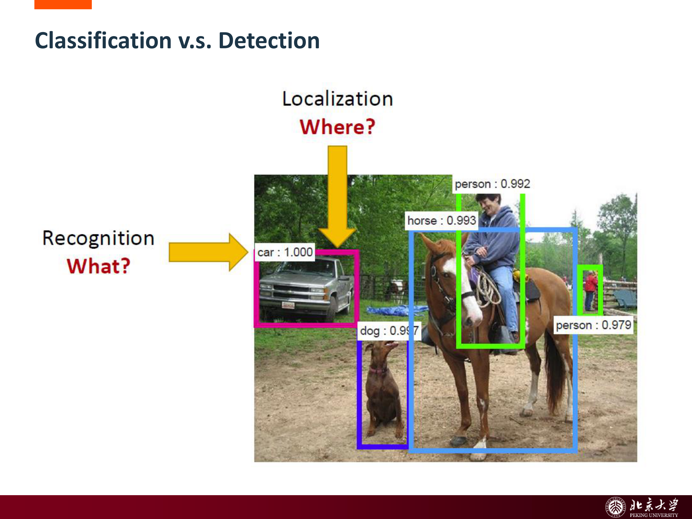{ width="800" }

### 1.1 基本输出形式

一个常见的检测输出是一组候选框及其置信度：

$$
\{(b_i, c_i, s_i)\}_{i=1}^N,
$$

其中 $b_i=(x_i,y_i,w_i,h_i)$ 或 $(x_{1i},y_{1i},x_{2i},y_{2i})$ 表示框，$c_i$ 是类别，$s_i$ 是分数（概率或 logit）。

### 1.2 为什么“检测比分类难很多”

从 slides 的 “detection-by-classification / sliding window” 视角，检测可以被看作在大量位置与尺度上重复做分类：

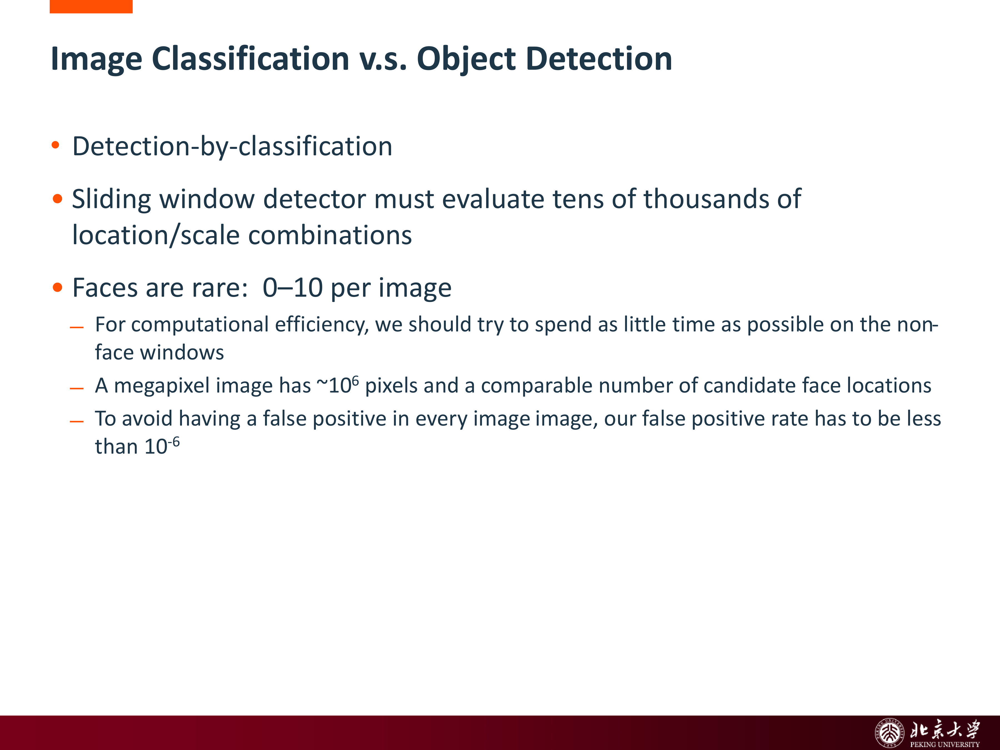{ width="800" }

slides 中给出了几个关键量级直觉：

- 滑窗需要评估 **数万级** 的位置/尺度组合
- 以人脸为例，单张图像里人脸很稀少（0–10 个）
- 若图像尺寸约为 $10^6$ 像素，候选位置数量也可达同量级
- 为避免“每张图都出现误检”，总体 false positive rate 需要低至 $10^{-6}$ 量级

### 1.3 评估指标的直观解释（补充）

为了把 “定位 + 分类” 的正确性量化，通常需要一个几何重叠度量。最常用的是 IoU（Intersection-over-Union）：

$$
\mathrm{IoU}(B, \hat B)=\frac{|B\cap \hat B|}{|B\cup \hat B|}.
$$

给定 IoU 阈值（例如 0.5），把预测框与 GT 框进行匹配后，可以得到 precision/recall 曲线，并计算 AP / mAP 来综合评价模型在不同阈值下的表现。

## 2 经典范式：Viola–Jones 实时人脸检测

Viola–Jones（CVPR 2001 / IJCV 2004）是“实时检测”的代表性系统。slides 总结其三大关键思想：

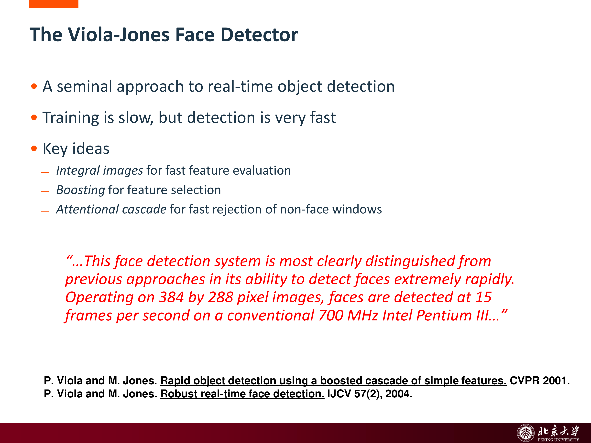{ width="800" }

- **Integral image**：快速计算矩形特征
- **Boosting**：从海量弱特征中选择有效子集并形成强分类器
- **Attentional cascade**：级联结构快速拒绝大量负样本窗口

??? info "Boosting：从弱分类器到强分类器（以 AdaBoost 为例）"
    Boosting 的核心思想是：迭代地训练一系列 **弱分类器（weak learner）** ，并把它们加权组合成一个 **强分类器（strong classifier）** 。每一轮训练都会把注意力更多放在“之前容易分错的样本”上，从而逐步提高整体判别能力。

    **基本设定：** 给定训练集 $\{(x_i, y_i)\}_{i=1}^n$，其中 $y_i \in \{-1, +1\}$。Boosting 维护一组样本权重 $w_i^{(t)}$（第 $t$ 轮）。

    **加权错误率：** 第 $t$ 轮选择一个弱分类器 $h_t(x)\in\{-1,+1\}$，使其在当前权重下的错误率最小：

    $$
    \varepsilon_t=\sum_{i=1}^n w_i^{(t)} \cdot \mathbf{1}[h_t(x_i)\ne y_i].
    $$

    **弱分类器权重：** 对应地，为该弱分类器分配一个组合权重 $\alpha_t$（错误率越小，权重越大）：

    $$
    \alpha_t=\frac{1}{2}\ln\frac{1-\varepsilon_t}{\varepsilon_t}.
    $$

    **样本权重更新：** 下一轮会提高“被分错样本”的权重、降低“被分对样本”的权重（只给出经典形式）：

    $$
    w_i^{(t+1)} \propto w_i^{(t)}\exp\left(-\alpha_t y_i h_t(x_i)\right).
    $$

    **最终强分类器：**

    $$
    H(x)=\mathrm{sign}\left(\sum_{t=1}^T \alpha_t h_t(x)\right).
    $$

    **在 Viola–Jones 中 Boosting 做了两件事：**

    - **特征选择：** 在约 $1.6\times 10^5$ 个矩形特征里，每一轮选择一个（特征 + 阈值 + parity）组合，使当前加权错误率最小。
    - **模型组合：** 通过 $\sum \alpha_t h_t(x)$ 把许多“很弱但便宜”的矩形特征组合成高精度分类器。

    slides 给出的弱分类器写法本质上就是“对单个矩形特征做阈值化”：

    $$
    h_t(x)=
    \begin{cases}
    1, & p_t f_t(x) > p_t \theta_t, \\
    0, & \text{otherwise},
    \end{cases}
    $$

    其中 $f_t(x)$ 为第 $t$ 个矩形特征值，$\theta_t$ 为阈值，$p_t\in\{+1,-1\}$ 控制不等号方向。Boosting 的作用就是在海量候选 $(f_t,\theta_t,p_t)$ 中持续挑选最有用的一批，并把它们以合适的权重组合起来。

### 2.1 矩形特征（Rectangle filters）

在固定大小的检测窗口（slides 中为 $24\times 24$）上定义简单的矩形模板特征：

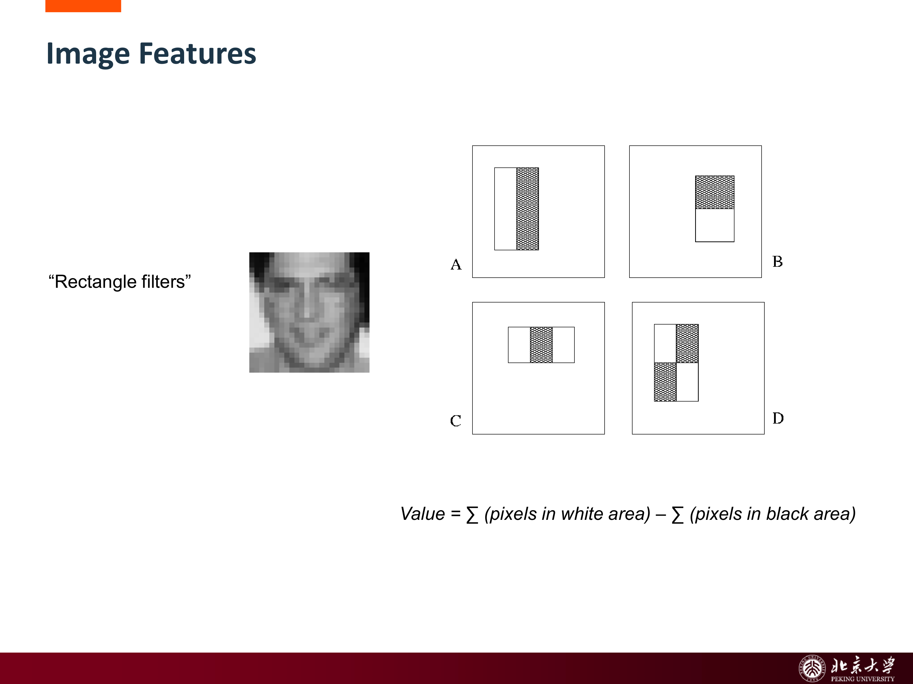{ width="800" }

其值为白色区域像素和减去黑色区域像素和。特点是：

- 模板简单，但组合空间巨大
- 对比度结构（如眼睛-鼻梁-脸颊）能用少量矩形近似捕捉

slides 指出：仅对 $24\times 24$ 的窗口，可能的矩形特征数约为 $1.6\times 10^5$，必须做特征选择。

### 2.2 Integral image：任意矩形求和变成常数次加减

定义积分图（integral image）为：

$$
ii(x,y)=\sum_{x'\le x,\,y'\le y} i(x',y').
$$

slides 给出一种单遍计算方式：

$$
\begin{aligned}
 s(x,y) &= s(x-1,y) + i(x,y), \\
 ii(x,y) &= ii(x,y-1) + s(x,y).
\end{aligned}
$$

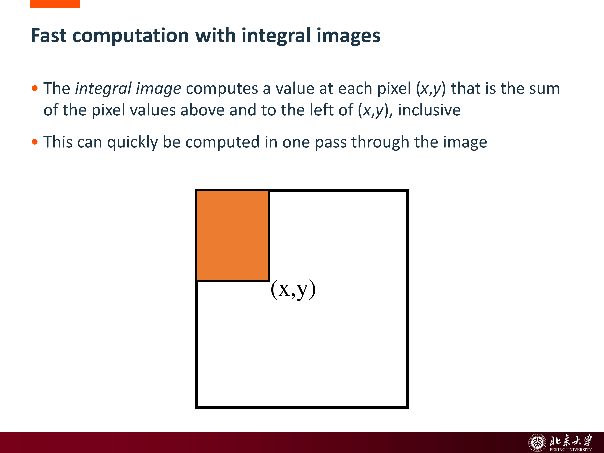{ width="800" }

??? tip "为什么积分图能加速滑窗"
    对任意窗口位置与尺度，矩形特征本质上都需要大量区域求和。如果每次都直接累加像素，计算量会随矩形面积增长。

    积分图把 “二维区域求和” 变成 “四个角点做常数次加减”，因此：

    - 单个矩形求和是 $O(1)$
    - 一个窗口包含多个矩形特征时，总开销近似正比于特征数量
    - 使得在滑窗框架下评估海量候选成为可能

对于任意轴对齐矩形区域，其像素和可由四个角点的积分值以常数次运算得到：

$$
\mathrm{sum}=A-B-C+D.
$$

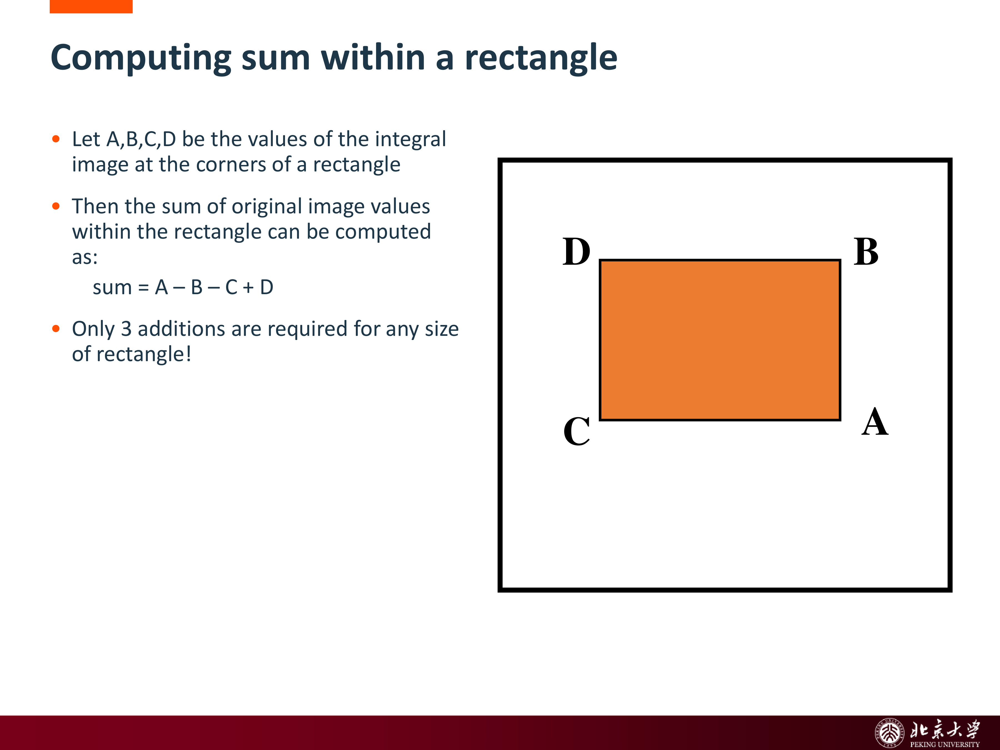{ width="800" }

这使得在滑窗中评估大量矩形特征成为可能。

### 2.3 Boosting：从弱分类器到强分类器（AdaBoost 思路）

slides 对 Boosting 的概括是：把一组 “略强于随机猜测” 的弱分类器组合成一个更强的分类器，并在训练过程中逐轮聚焦难样本（通过样本权重体现）。

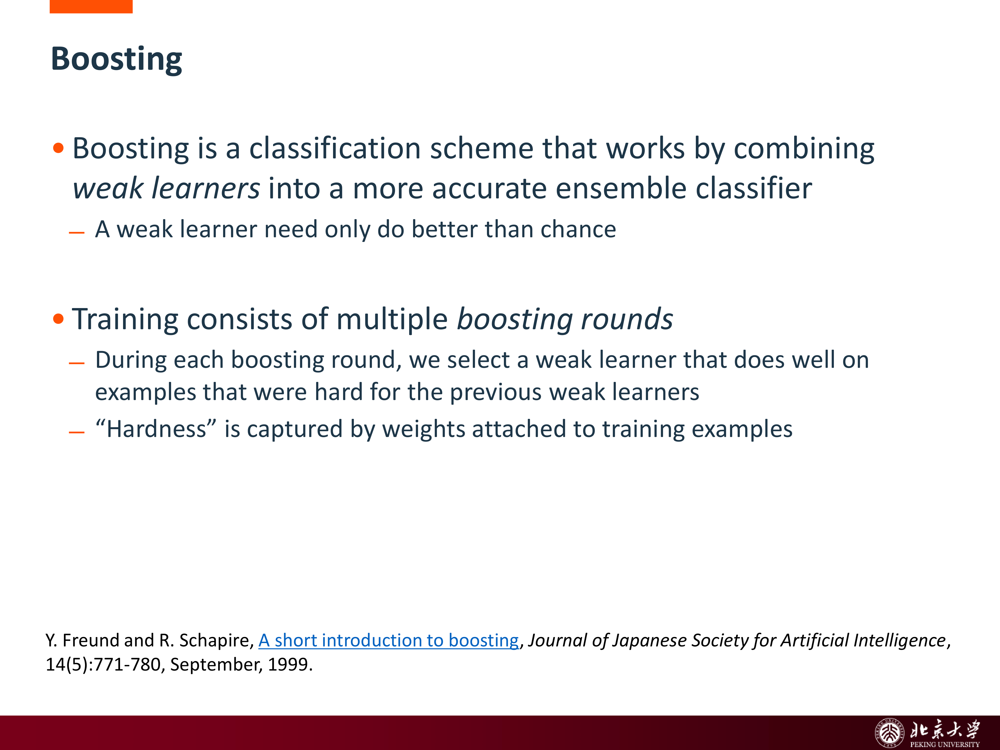{ width="800" }

训练流程（slides）：

- 初始时对训练样本等权
- 每轮选择一个加权错误率最低的弱分类器
- 增大被当前弱分类器误分样本的权重
- 最终以弱分类器的线性组合形成强分类器（弱分类器权重与其准确性相关）

在人脸检测中，弱分类器可由单个矩形特征阈值化得到（slides）：

$$
h_t(x)=
\begin{cases}
1, & p_t f_t(x) > p_t \theta_t, \\
0, & \text{otherwise},
\end{cases}
$$

其中 $f_t(x)$ 是第 $t$ 个矩形特征在窗口 $x$ 上的取值，$\theta_t$ 是阈值，$p_t\in\{+1,-1\}$ 控制不等号方向（parity）。

slides 给出一个学习复杂度估计：若进行 $M$ 轮 boosting，样本数为 $N$，候选特征数为 $K$，则计算复杂度约为 $O(MNK)$（需要评估并搜索阈值）。

### 2.4 Attentional cascade：以乘法方式获得极低误检率

级联结构的核心是：前几级用极少量特征快速过滤掉绝大多数负样本窗口，只有通过的窗口才进入更复杂的后续级别。

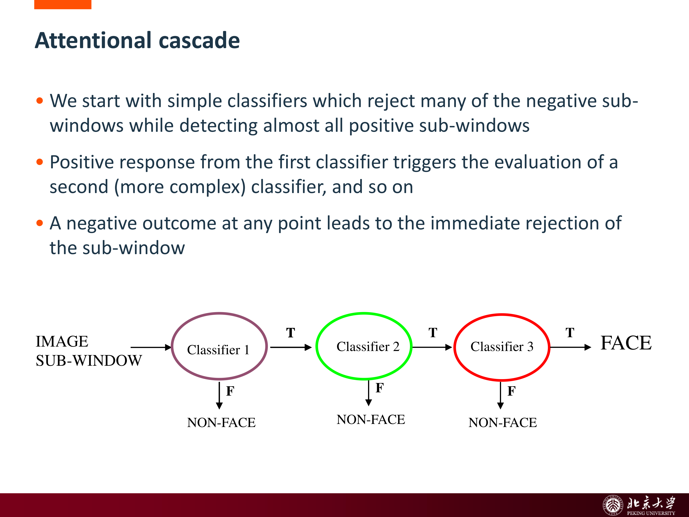{ width="800" }

slides 指出：级联整体的检测率与误检率，近似等于各 stage 指标的乘积。例如：

- 若每个 stage 的检测率约为 0.99，则 10-stage 级联整体检测率约 $0.99^{10}\approx 0.9$
- 若每个 stage 的误检率约为 0.30，则 10-stage 级联整体误检率约 $0.3^{10}\approx 6\times 10^{-6}$

这正契合 detection 需要 $10^{-6}$ 量级误检率的要求。

??? tip "级联的核心直觉"
    由于人脸等目标在全图中非常稀少，绝大多数窗口都是负样本。级联的设计目标是把计算预算集中到少数可能为正的窗口上：

    - 前几级追求 “极快 + 高 recall”，宁可放过一些负样本，也不要错杀正样本
    - 后几级追求 “更强判别力 + 更低 false positive”，逐步把误检压到极低

### 2.5 系统效果与总结

slides 记录了 Viola–Jones 系统的一些经典数字（当年硬件条件下）：

- 检测速度：约 0.067s / 张 $384\times 288$ 图（约 15Hz）
- 训练时间：数周
- 级联层数：38 层，总特征数 6061；测试时平均每个窗口仅评估约 10 个特征

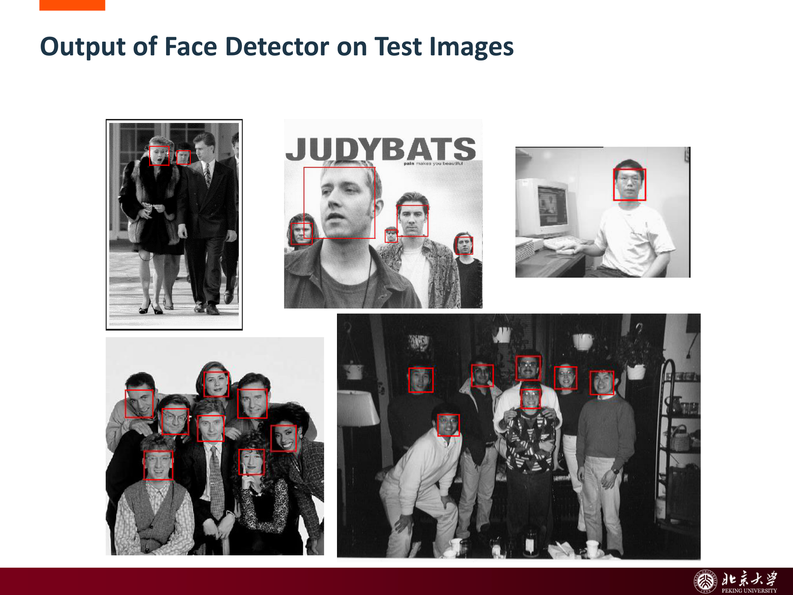{ width="800" }

最后，slides 总结 Viola–Jones 的四个关键点：矩形特征、积分图加速、Boosting 特征选择、级联快速拒绝。

## 3 HOG + SVM：滑窗检测的强基线（Dalal & Triggs 2005）

课件补充：

[lecture17_hog](slides/lecture17_hog.pdf)

lecture17_hog 将检测方法粗略分为三类（按思路）：

- **兴趣点 + 投票（Hough voting）：** 先找局部证据，再在参数空间聚合出目标
- **滑窗（sliding window）：** 在大量位置/尺度上裁剪窗口并分类
- **候选区域（region proposals）：** 先生成少量候选区域，再分类与回归

本节聚焦在滑窗路线的代表方法：HOG（特征） + 线性 SVM（分类） + NMS（后处理）。

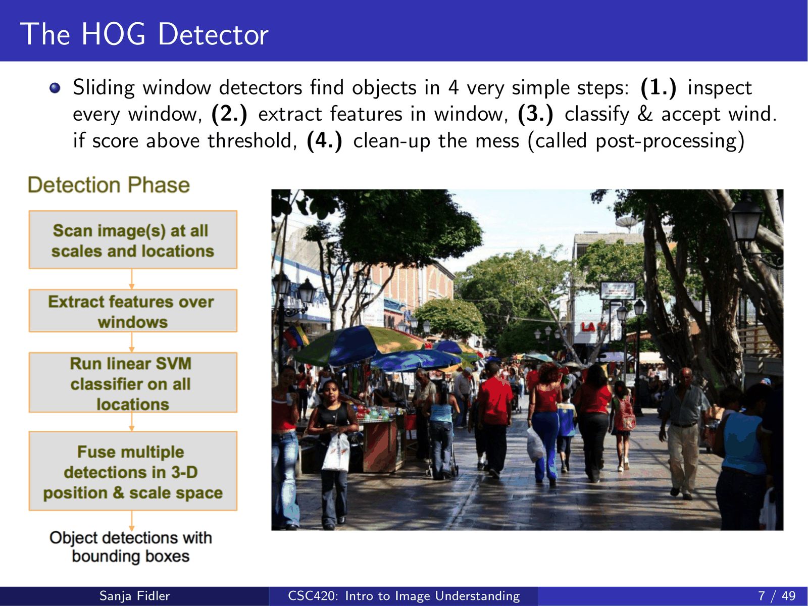{ width="800" }

### 3.1 滑窗与图像金字塔（image pyramid）

滑窗通常使用固定窗口大小扫描整张图像：

- 在每个位置取出一个窗口
- 提取特征
- 分类得到分数

窗口大小固定时，为了检测不同尺度的目标，常见做法是对图像做 **多尺度金字塔** ：逐层缩小图像并重复滑窗检测。

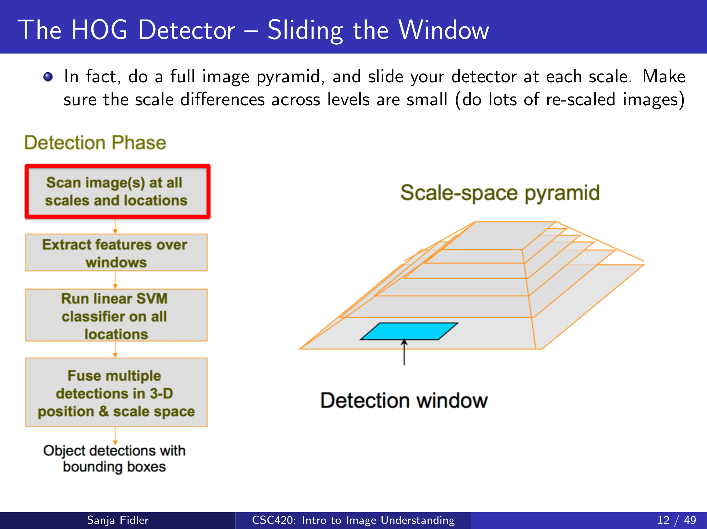{ width="800" }

??? warning "滑窗的结构性限制"
    滑窗强依赖窗口的大小与长宽比。如果目标姿态/长宽比变化很大（例如行人非直立、强形变），固定窗口的检测能力会受限。lecture17_hog 指出，这一类问题在后续 DPM（deformable part-based model）等方法中被进一步处理。

### 3.2 HOG 特征：梯度方向直方图（Histograms of Oriented Gradients）

lecture17_hog 强调：HOG 是一个在检测领域非常成功的手工特征（在当时某种程度上替代了 SIFT），计算可概括为三个步骤：

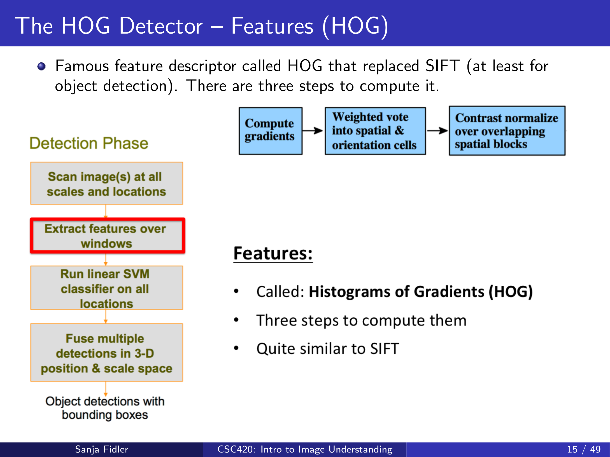{ width="800" }

??? info "对比学习：HOG vs SIFT（相同点与关键差异）"
    HOG 与 SIFT 都属于基于 **梯度方向直方图** 的手工特征，它们共享一些核心设计（例如用梯度幅值加权投票、用局部统计而不是像素直接值来提升鲁棒性），但它们的目标与使用方式差别很大。

    **共同点（为什么都有效）：**

    - 都把局部外观表示成 “方向直方图”，对小的几何扰动与噪声更稳健
    - 都会做归一化，让特征对局部光照/对比度变化不那么敏感
    - 都倾向于突出边缘/轮廓信息（对检测与匹配都很关键）

    **关键差异（考试/面试最常问的点）：**

    | 维度 | HOG | SIFT |
    | --- | --- | --- |
    | 典型任务 | **检测**（dense sliding window） | **匹配 / 检索**（keypoint matching） |
    | 采样方式 | 在密集网格上计算（每个位置都有描述子） | 先检测关键点（DoG 等），再在关键点附近算描述子 |
    | 尺度处理 | 主要靠 **图像金字塔** 扫尺度；描述子本身不天然尺度不变 | 关键点检测提供尺度，描述子在对应尺度邻域上计算，较强尺度不变性 |
    | 旋转处理 | 通常不做显式旋转对齐（行人直立假设下足够） | 会估计主方向并对齐，提供旋转不变性 |
    | 方向范围 | 常用 **0–180°（unsigned）** + 9 bins（Dalal-Triggs 设定） | 常用 **0–360°（signed）** + 8 bins（每个 cell） |
    | 空间结构 | cell + block，block 归一化是核心 | $4\\times 4$ cell（每 cell 8 bins）拼成 **128 维** 描述子 |
    | 归一化目的 | 抑制光照/对比度差异，增强检测稳定性 | 抑制光照/对比度差异，并配合阈值截断提升鲁棒性 |

    **一个直观总结：**

    - HOG 更像是 “把整张图转成一个适合做相关/卷积的特征图”，配合线性分类器天然适合滑窗检测
    - SIFT 更像是 “给关键点一张可匹配的局部身份证”，强调尺度与旋转不变性，适合跨图匹配与检索

#### 3.2.1 计算图像梯度

首先对图像（通常是灰度或每通道）计算梯度，得到每个像素的梯度幅值与方向：

$$
G_x(x,y)=I(x+1,y)-I(x-1,y), \quad G_y(x,y)=I(x,y+1)-I(x,y-1),
$$

$$
m(x,y)=\sqrt{G_x^2+G_y^2}, \quad \theta(x,y)=\mathrm{atan2}(G_y,G_x).
$$

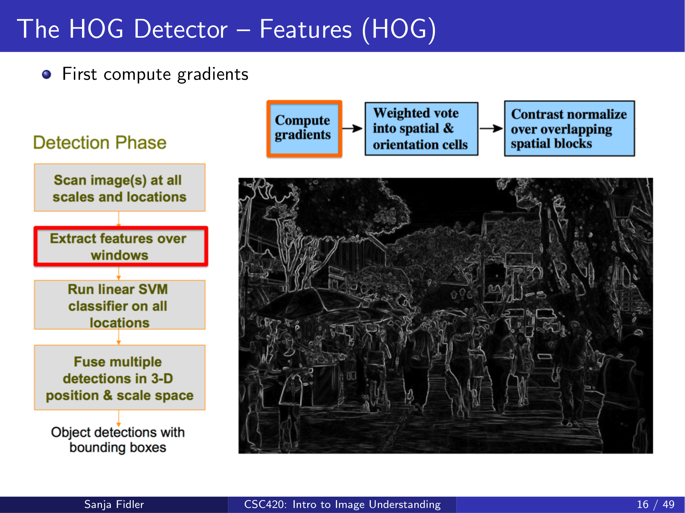{ width="800" }

lecture17_hog 也提到：梯度计算与是否先做平滑（smoothing）等细节会影响性能，Dalal & Triggs 在论文里对这些选择做了系统实验对比。

#### 3.2.2 cell：在局部区域做方向直方图

把图像划分为 $8\times 8$ 像素的 cells：

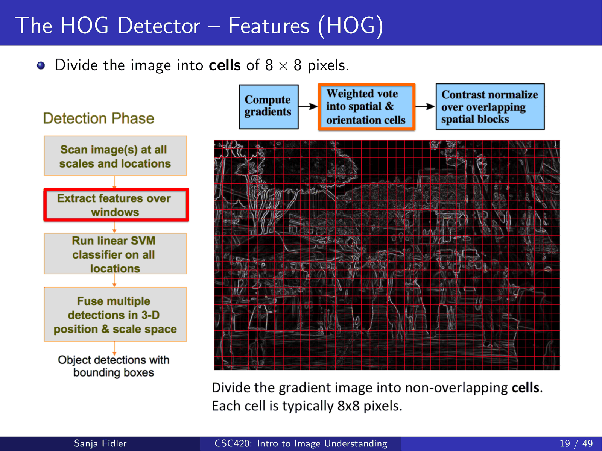{ width="800" }

在每个 cell 内，把像素的梯度方向投票到若干个方向 bin，得到一个方向直方图（常用设定为 **9 个 bin，方向范围 0–180°（unsigned）** ）：

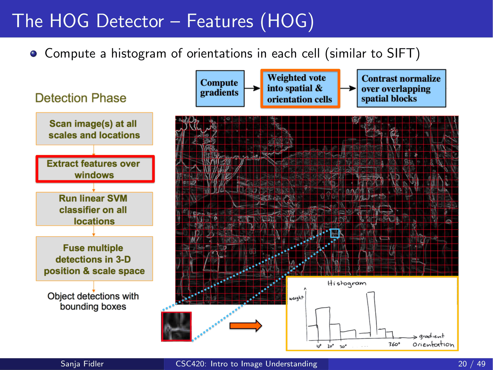{ width="800" }

投票常用梯度幅值作为权重，直观上意味着：

- 强边缘对特征贡献更大
- 噪声与弱纹理的影响相对更小

最终，每个 cell 得到一个 9 维向量；文献里常见的 “小线段” 可视化只是直方图的可视化方式，不要和真实特征（9 维数值向量）混淆。

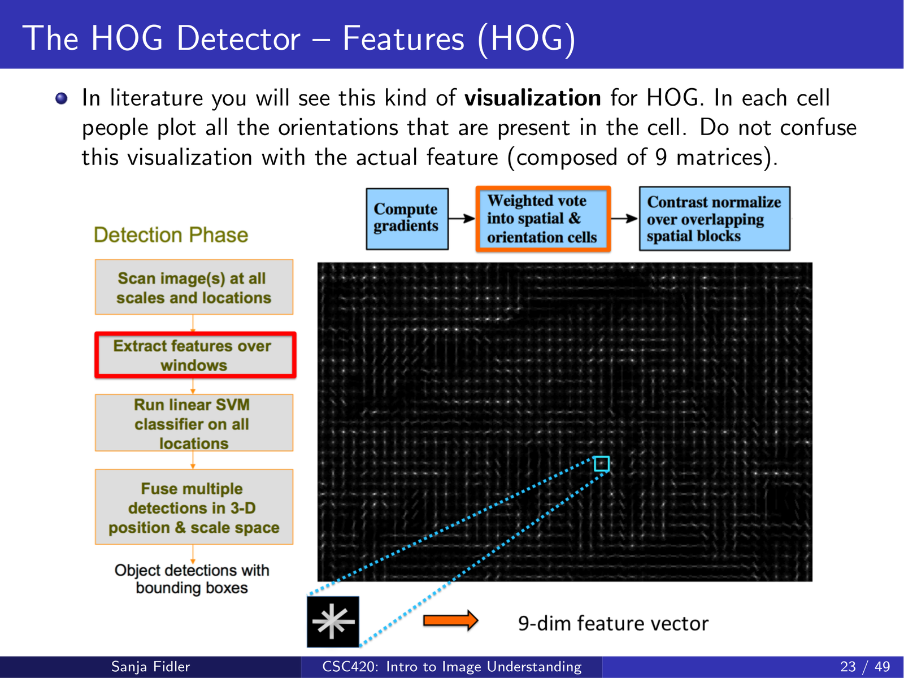{ width="800" }

#### 3.2.3 block：对局部特征做归一化（对光照更鲁棒）

仅有 cell-level 直方图还不够。HOG 会把相邻 cells 组成 blocks（常见为 $2\times 2$ 个 cells），并对 block 内拼接的向量做归一化：

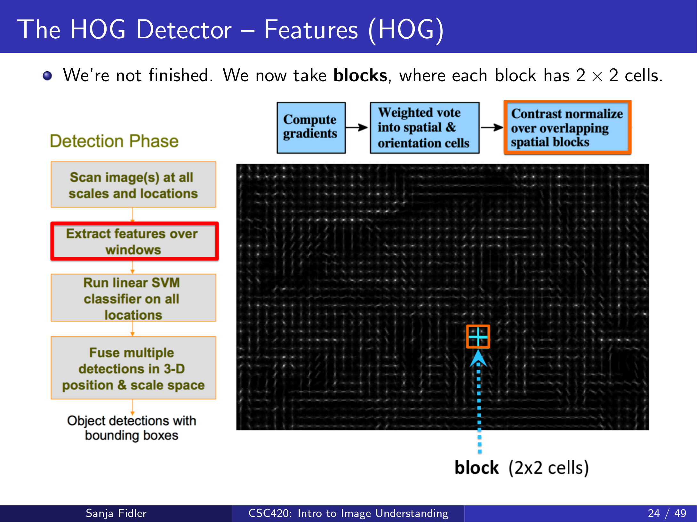{ width="800" }

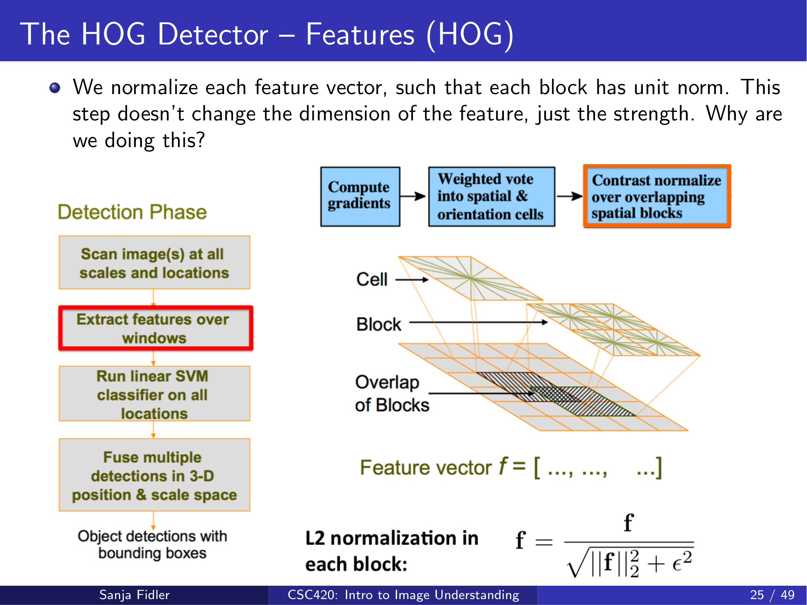{ width="800" }

这一步的核心作用是抵抗局部光照/对比度变化：当整体亮度变化导致梯度幅值整体缩放时，归一化能显著稳定特征。

一个常用归一化形式是 L2 norm（此处给出常见写法）：

$$
v \leftarrow \frac{v}{\sqrt{\|v\|_2^2+\varepsilon^2}}.
$$

由于 blocks 采用滑动方式覆盖图像，同一个 cell 会参与多个 block，从而在不同归一化上下文下产生多个特征副本，这能进一步增强鲁棒性。

#### 3.2.4 检测窗口的维度（以行人检测为例）

lecture17_hog 给出的经典行人检测窗口在 HOG cell 坐标下为 $15\times 7$ 个 cells。若每个 cell 是 $8\times 8$ 像素，则窗口约为 $120\times 56$ 像素。

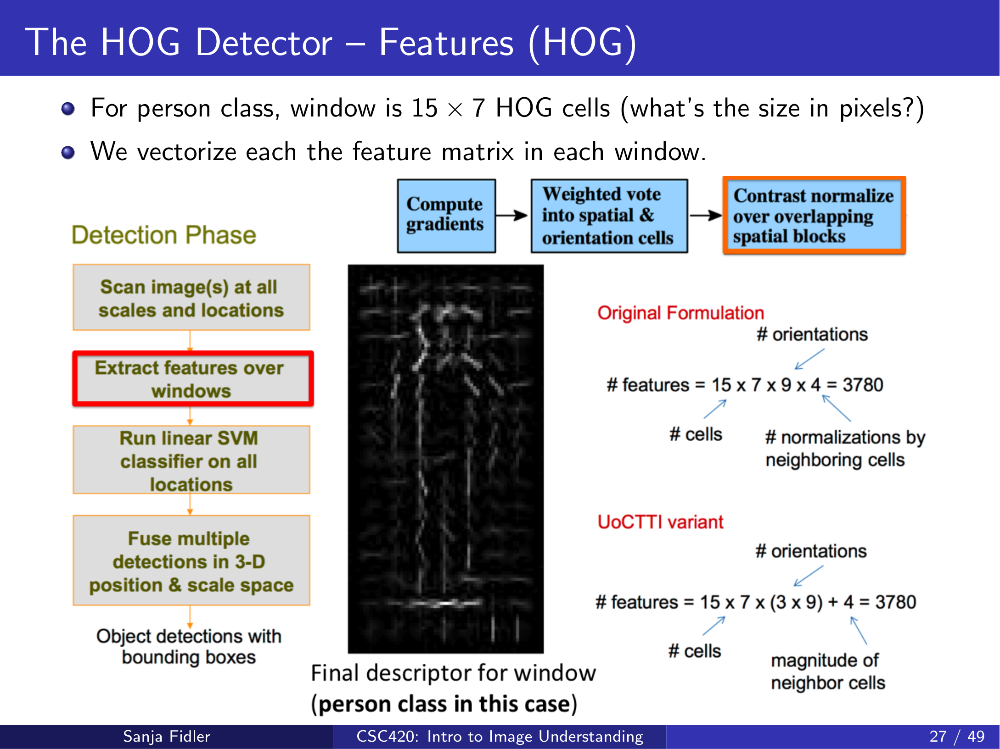{ width="800" }

把窗口内的所有 block 特征按固定顺序向量化，就得到一个高维特征 $x$，供后续分类器使用。

### 3.3 线性 SVM：分类与“模板匹配”视角

在 HOG 特征上，经典做法是训练线性 SVM。对任意窗口特征 $x$，分类分数为：

$$
s(x)=w^\top x + b.
$$

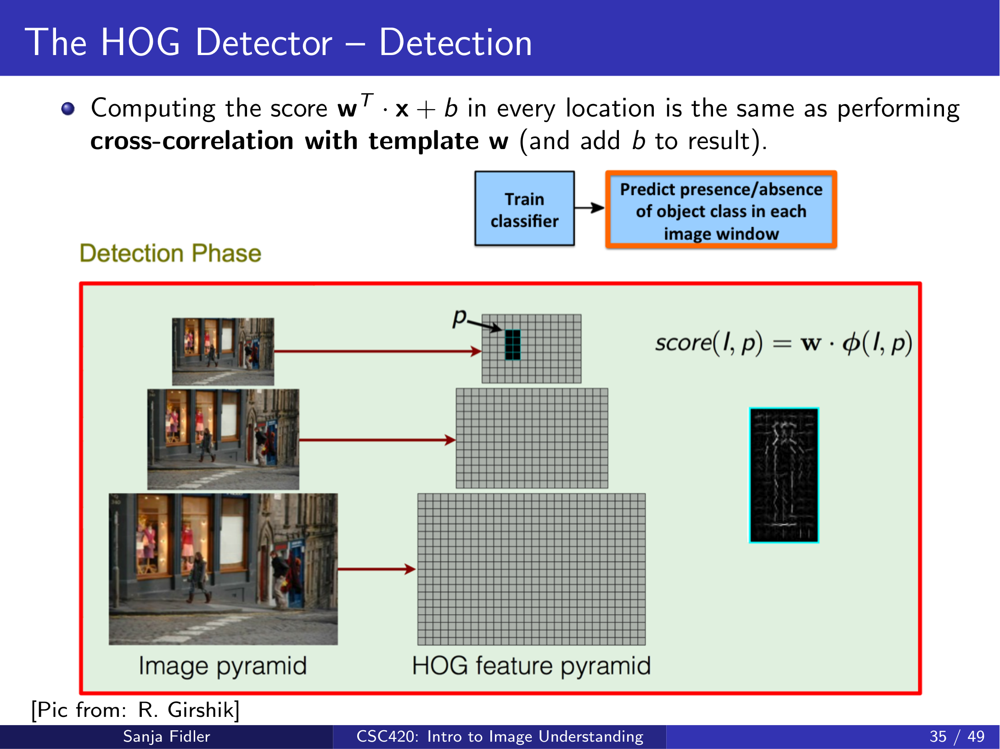{ width="800" }

lecture17_hog 强调一个重要等价关系：对每个位置计算 $w^\top x+b$，等价于在特征图上用模板 $w$ 做 **互相关（cross-correlation）** 再加偏置 $b$。这解释了为什么滑窗检测可以用卷积/相关的方式高效实现（后续深度检测器也继承了这种计算结构）。

### 3.4 训练技巧：bootstrapping / hard negative mining

除了常规的“收集标注数据 → 计算 HOG → 训练 SVM”，lecture17_hog 特别强调了 bootstrapping（也常称 hard negative mining）：

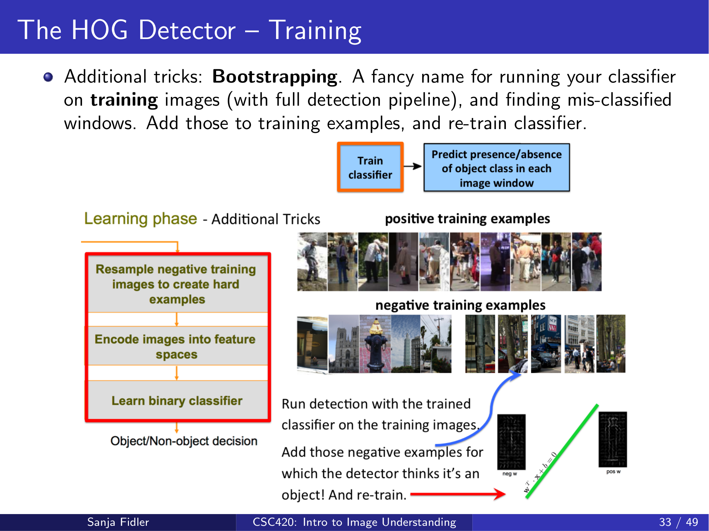{ width="800" }

做法是：

- 用当前检测器跑一遍训练图像的完整检测流程
- 收集得分高但应为负样本的窗口（hard negatives）
- 把这些难负样本加入训练集，再训练/微调分类器

这一步通常能显著降低误检率，是滑窗检测系统里非常关键的 “工程技巧”。

### 3.5 后处理：NMS（Non-Maximum Suppression）

滑窗会在同一目标周围产生大量重叠的高分框，需要通过 NMS 去重：

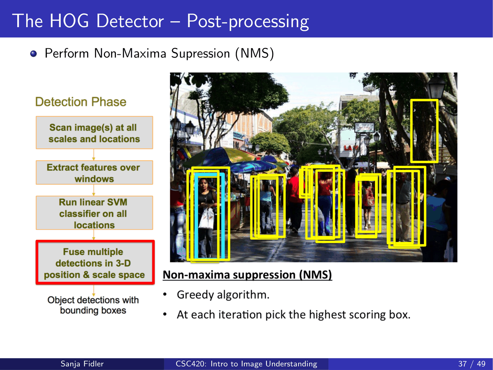{ width="800" }

常见 NMS 过程是按分数排序，依次保留最高分框，并抑制与其 IoU 超过阈值的其它框（具体 IoU 定义见 1.3）。

## 4 走向深度学习：从滑窗到特征图上的区域

第一部分课程最后提到 HOG+SVM、DPM 等传统检测路线；第二部分课程转向深度学习检测体系（R-CNN 系列、YOLO/SSD、FPN 等）。

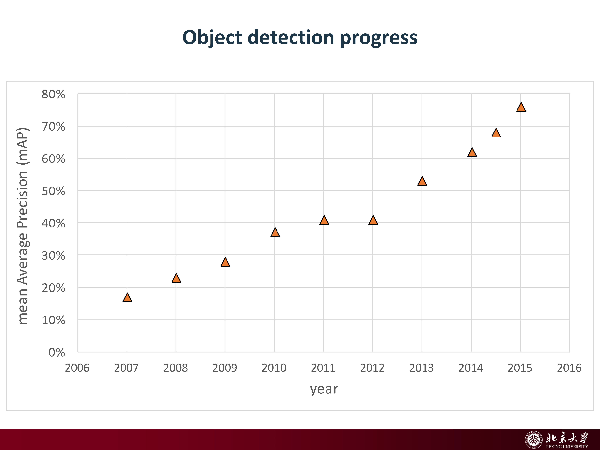{ width="800" }

### 4.1 CNN 的一个关键事实：卷积层天然保留空间位置信息

slides 强调：卷积层可接受任意大小输入，输出 feature map 尺寸与输入成比例。这意味着：

- feature map 不仅提供 “是什么” 的语义特征
- 也隐含了 “在哪里” 的空间结构（在 feature map 上的坐标对应输入图像的感受野）

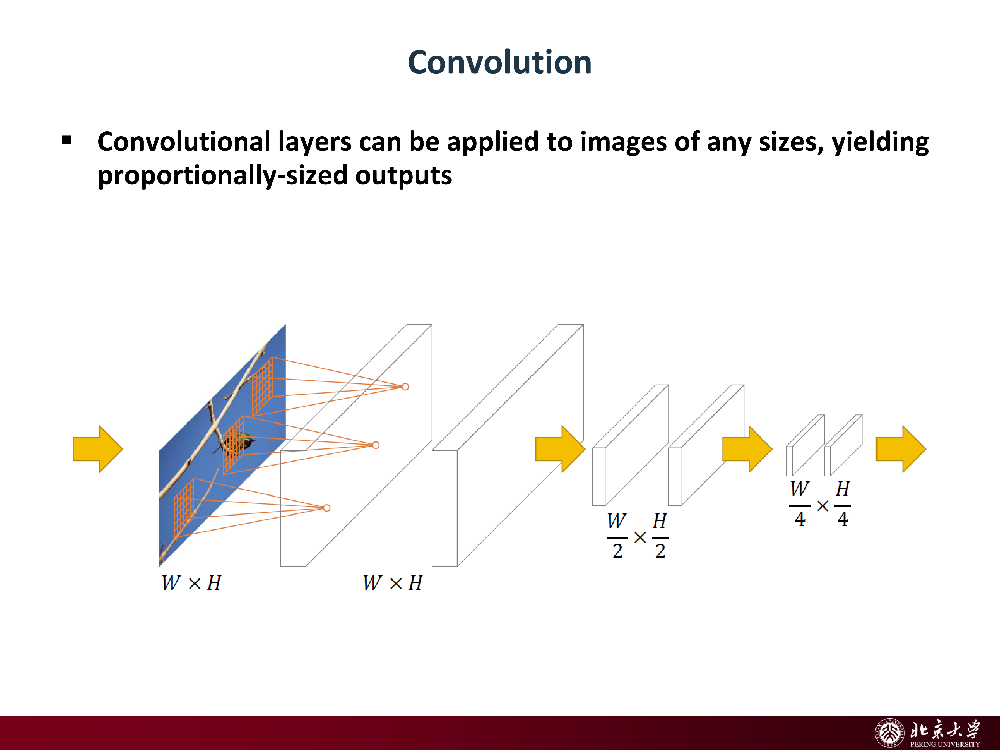{ width="800" }

### 4.2 感受野（Receptive field）与“特征 + 位置”

对于 feature map 上的一个 cell，其对应输入图像上的一个感受野区域。感受野大小随网络层数加深而增大，这解释了为何深层特征更偏语义、浅层特征更偏局部纹理。

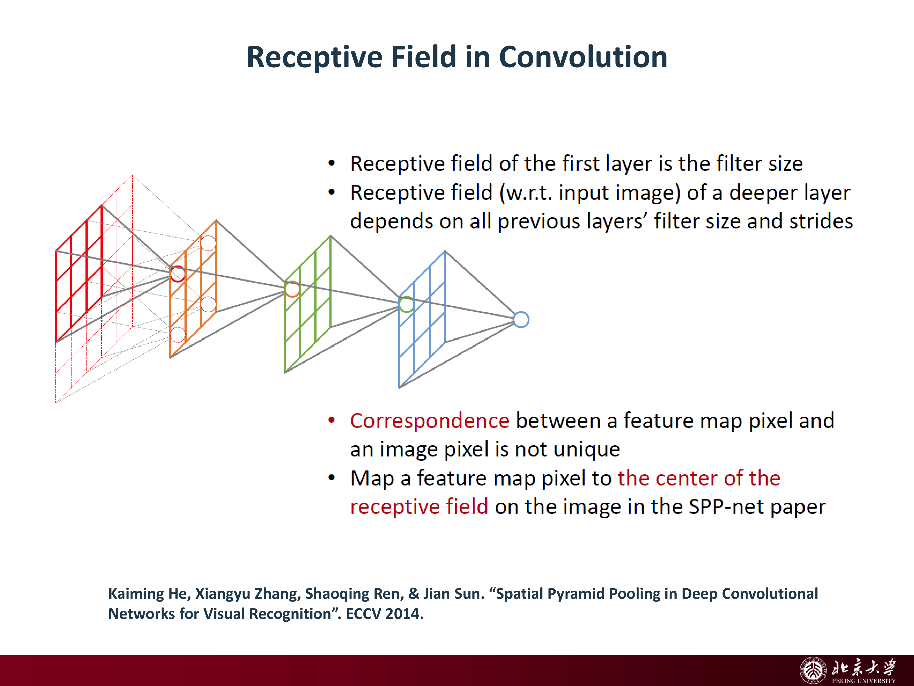{ width="800" }

slides 用一句话概括：feature maps 同时表示 features 及其 locations。

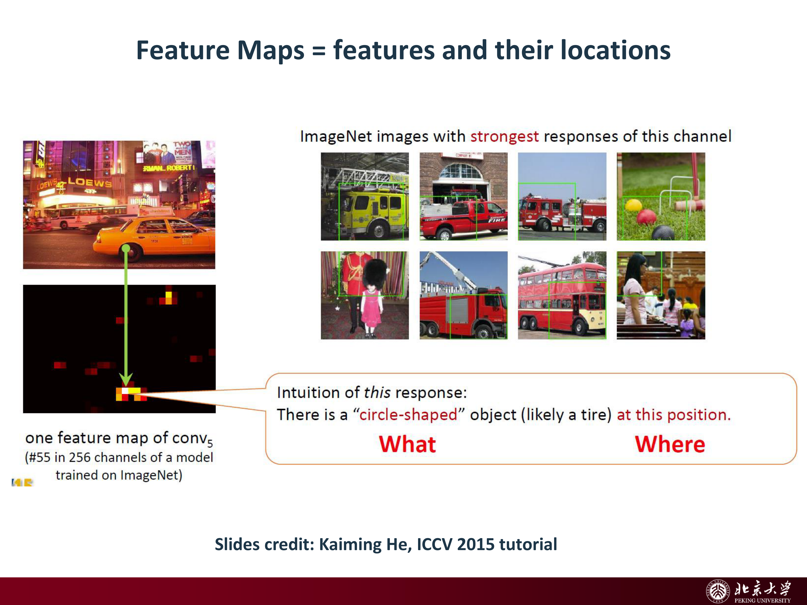{ width="800" }

### 4.3 特征可视化（补充理解）

slides 用 ZFNet 的可视化示例强调：深层 feature map 的某个神经元/通道往往对应特定的视觉模式；通过 unpooling / deconv 等操作，可以把 “某个激活对应的输入结构” 还原到像素空间，从而理解网络学到了什么。

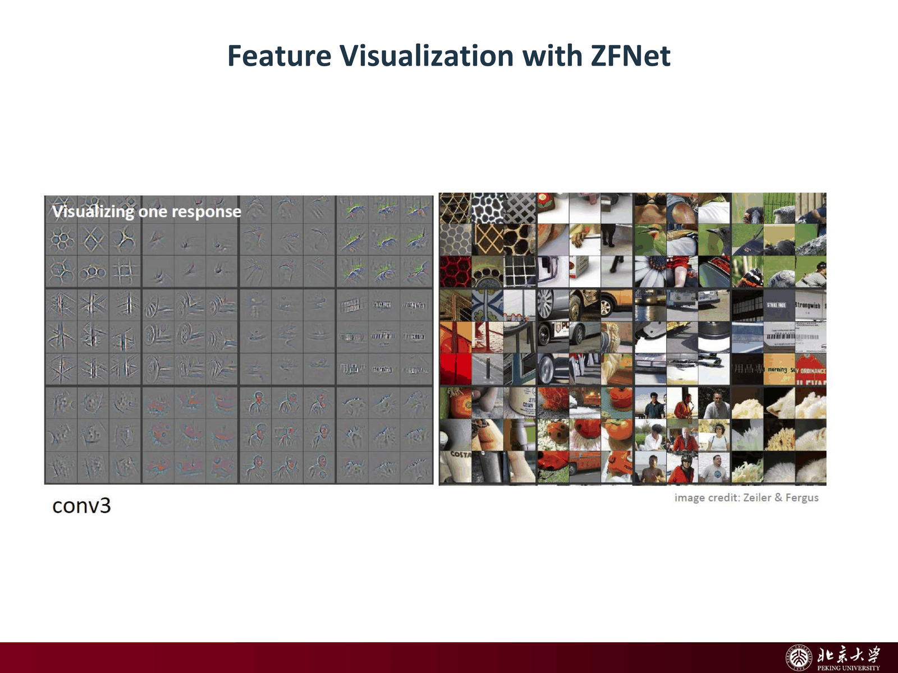{ width="800" }

## 5 Region-based 检测：R-CNN → Fast R-CNN → Faster R-CNN

### 5.1 为什么要引入 region proposals

slides 给出的动机是 “Beyond sliding windows”：用候选区域（region proposals）代替密集滑窗，优势包括：

- 显著减少需要评估的区域数量
- 允许使用更强的特征与分类器
- proposal 机制可类无关，并且可训练

### 5.2 Selective Search：一种经典 proposal 方法

slides 提到 Selective Search 的基本思想：先做过分割得到 superpixels，然后基于多种 cue 做层次化合并，产生不同尺度的候选区域。

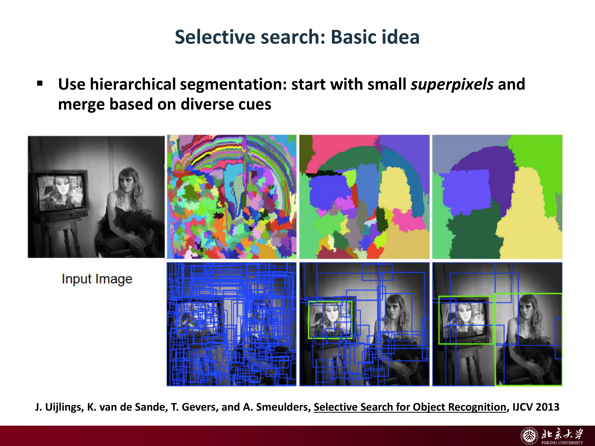{ width="800" }

### 5.3 R-CNN：对每个 proposal 单独跑 CNN（慢）

R-CNN（CVPR 2014）的核心流程（slides）：

- 外部 proposal（例如 Selective Search）生成约 2000 个候选区域
- 将每个区域裁剪/warp 到固定大小
- 对每个区域分别通过 CNN 提取特征
- 用 SVM 进行分类，并配合 bounding box regression 做定位修正

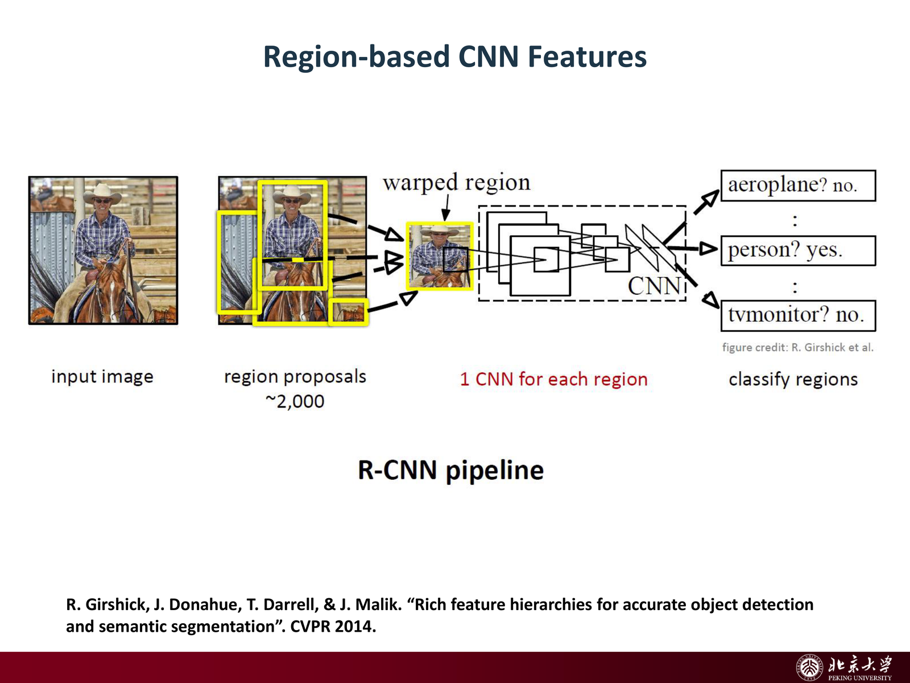{ width="800" }

slides 指出其主要瓶颈：需要对 2000 个区域做 2000 次 CNN 前向，代价很高。

### 5.4 Fast R-CNN：共享卷积计算 + RoI Pooling

Fast R-CNN 的关键变化是：

- 对整张图像只做一次卷积前向得到 feature map
- 每个 proposal 不再裁剪原图，而是在 feature map 上截取对应区域
- 通过 RoI Pooling 把任意大小的 RoI 变成固定维度特征，再接全连接层分类与回归

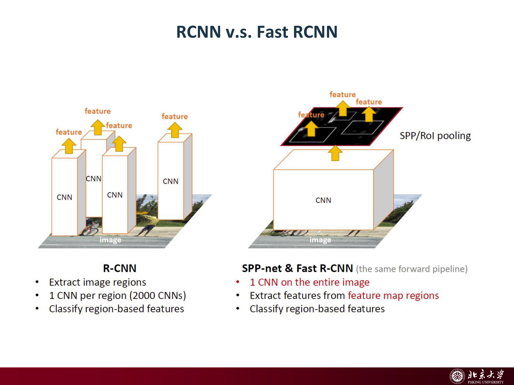{ width="800" }

### 5.5 Faster R-CNN：把 proposal 也“网络化”（RPN）

Fast R-CNN 仍依赖外部 proposal。slides 提出核心问题：检测网络已很快（例如 0.2s），但 Selective Search 仍可达 2s/图，proposal 成为瓶颈。

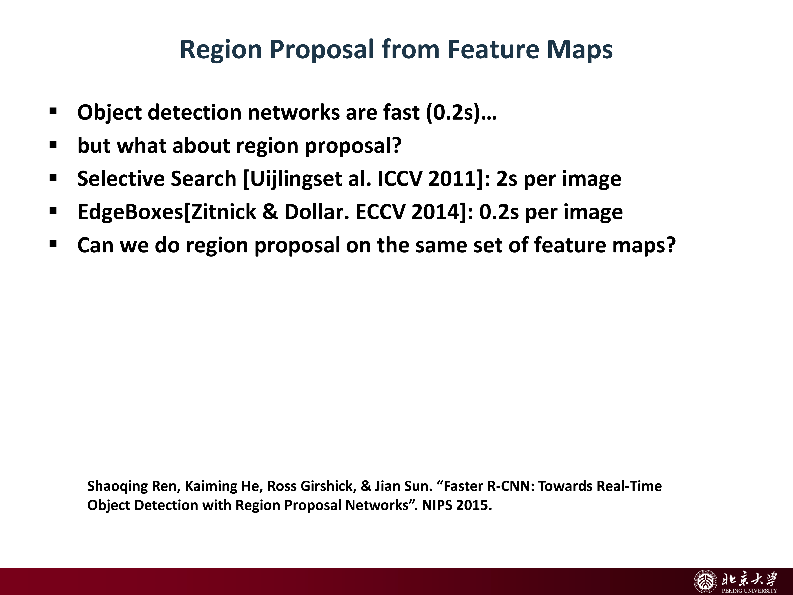{ width="800" }

Faster R-CNN 的思路是：在共享 feature map 上引入 Region Proposal Network（RPN）直接生成 proposals，并与检测 head 共享特征。

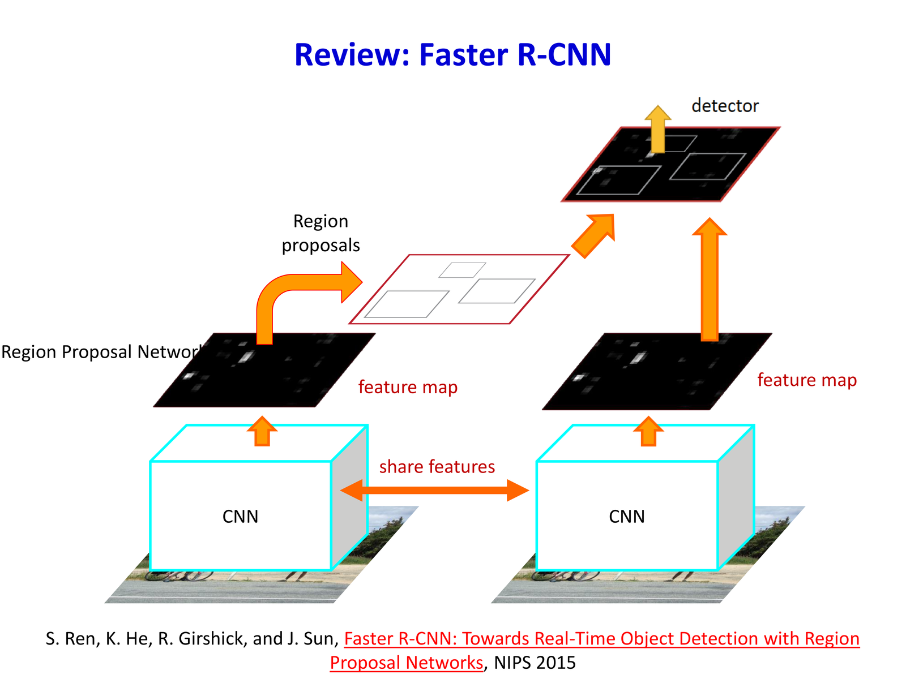{ width="800" }

## 6 Bounding Box Regression：把“粗框”修正为“更准的框”

slides 专门讨论了 bounding box regression，用于对 proposal 的位置与尺度进行连续修正。

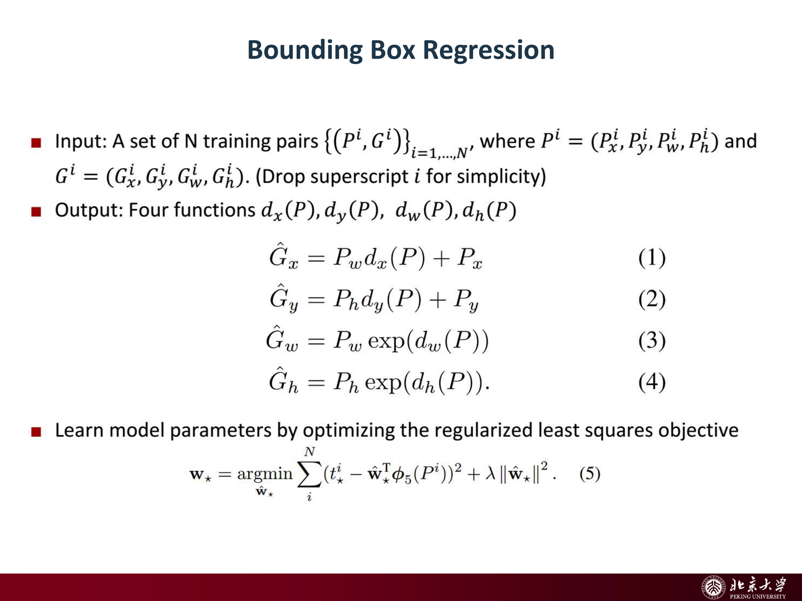{ width="800" }

常见做法是对框进行参数化（以中心点与宽高为例）：

$$
\begin{aligned}
t_x &= \frac{x^\star - x}{w}, \quad
t_y = \frac{y^\star - y}{h}, \\
t_w &= \log \frac{w^\star}{w}, \quad
t_h = \log \frac{h^\star}{h},
\end{aligned}
$$

其中 $(x,y,w,h)$ 是 proposal，$(x^\star,y^\star,w^\star,h^\star)$ 是目标框（GT 或更准确的目标）。网络预测 $(t_x,t_y,t_w,t_h)$ 后即可反推出修正框。

## 7 单阶段检测：YOLO 与 SSD

Region-based 方法属于两阶段（proposal + classification/regression）。另一条路线是把检测看作一个端到端回归问题，直接在特征图上输出类别与框。

### 7.1 YOLO：把检测视为回归

slides 的关键表述是：如果一个目标的中心落在某个 grid cell 内，那么这个 cell 负责预测该目标。

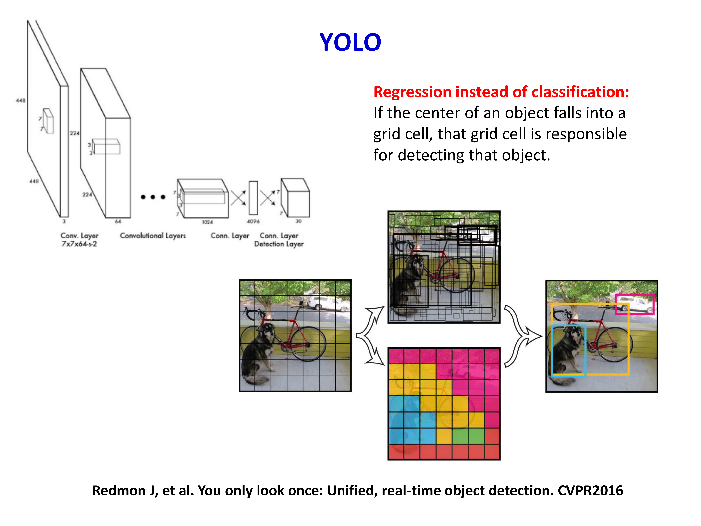{ width="800" }

这种设计在工程上带来高吞吐，但也引入一些结构性取舍（例如对小目标、密集目标的处理更敏感）。

### 7.2 SSD：YOLO + default boxes + multi-scale

slides 用一句话概括 SSD：

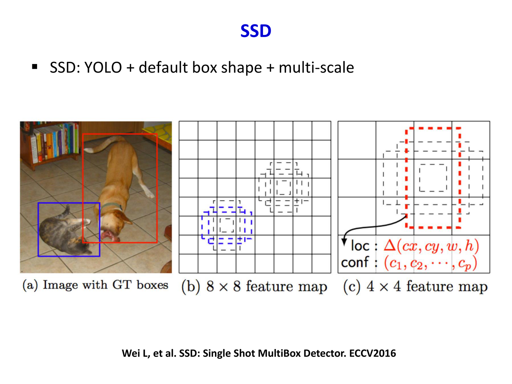{ width="800" }

- 在不同尺度的 feature maps 上做预测（multi-scale）
- 引入多种默认框形状（default box / anchor-like design），覆盖不同长宽比与尺度

## 8 多尺度增强：FPN（Feature Pyramid Network）

检测的一个关键挑战是目标尺度变化。FPN 的核心思想是同时利用深层语义强、浅层分辨率高的优势，通过自顶向下路径与 lateral connections 构建多尺度特征金字塔。

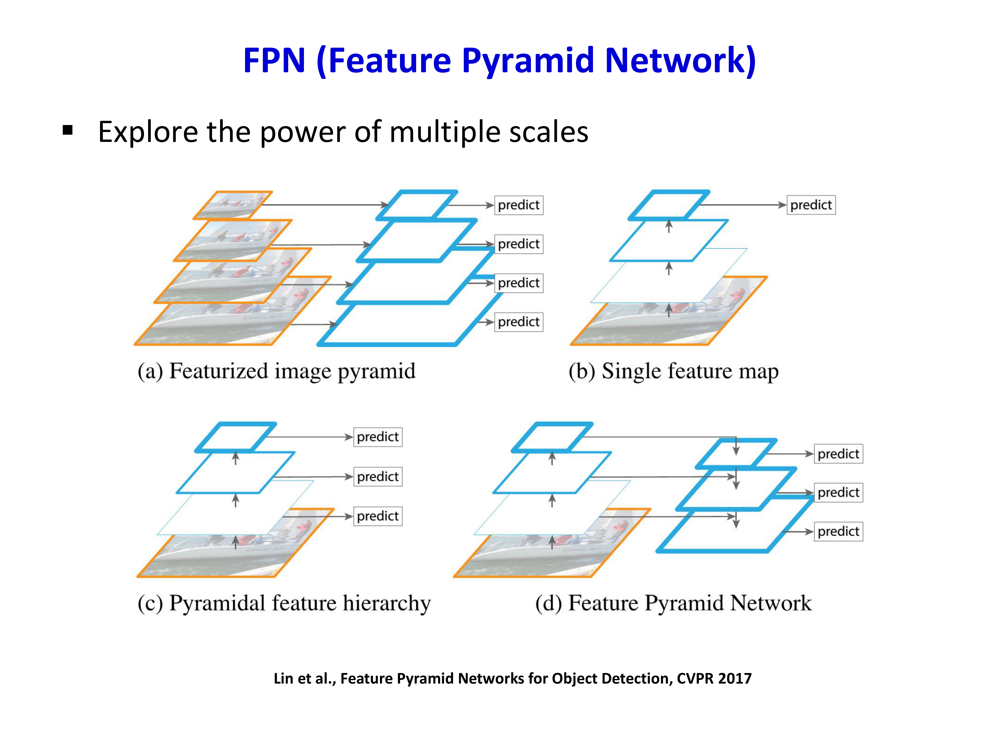{ width="800" }

## 9 总结

- **传统实时检测（Viola–Jones）：** 通过积分图 + Boosting + 级联在滑窗框架下实现极高效率与极低误检率。
- **深度学习检测：** 关键在于把 “特征 + 位置” 的特性发挥出来，在 feature map 上对区域进行建模。
- **两阶段 vs 单阶段：** R-CNN 系列通过 proposal/region 建模更灵活；YOLO/SSD 通过端到端密集预测获得更高速度。
- **多尺度：** FPN 通过特征金字塔显著增强跨尺度检测能力。
