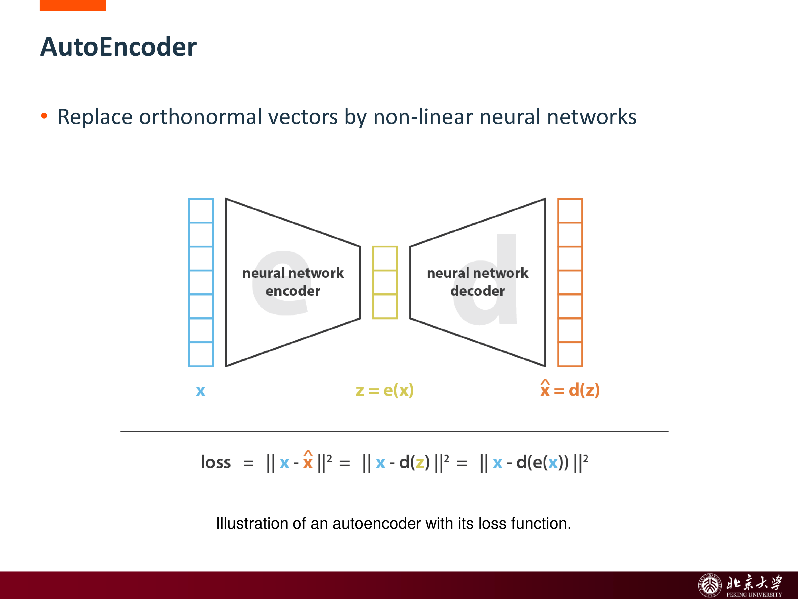
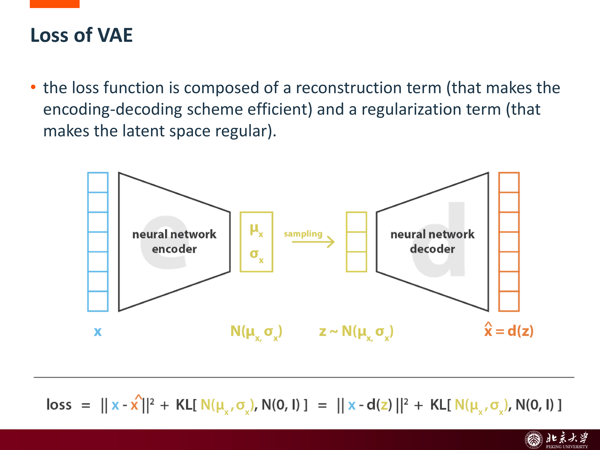
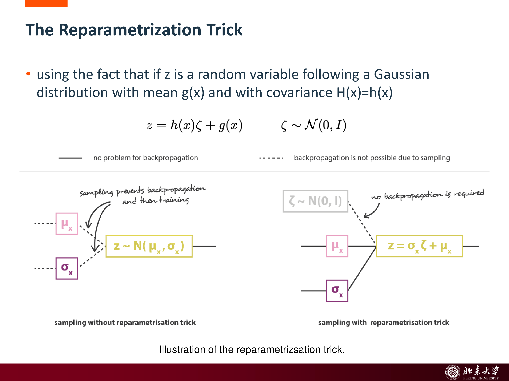
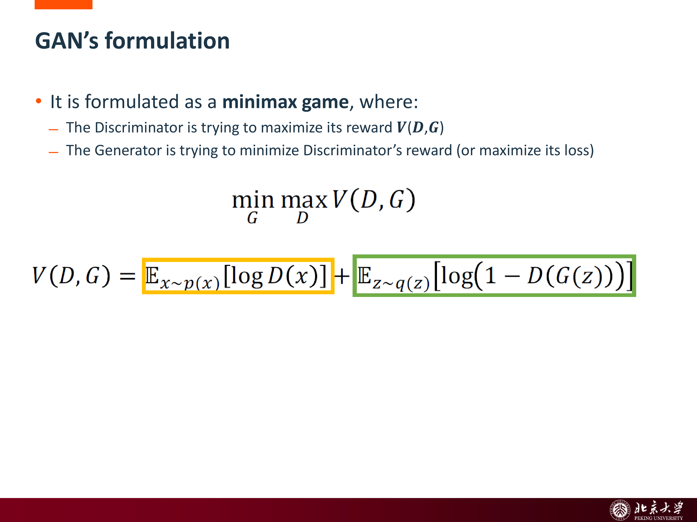
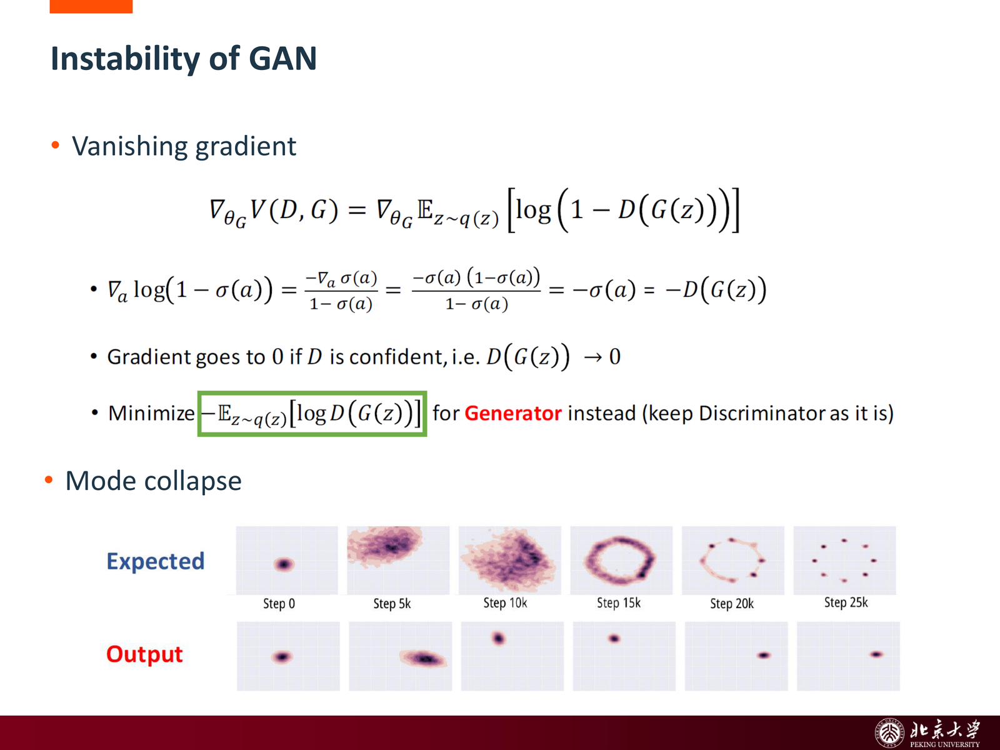
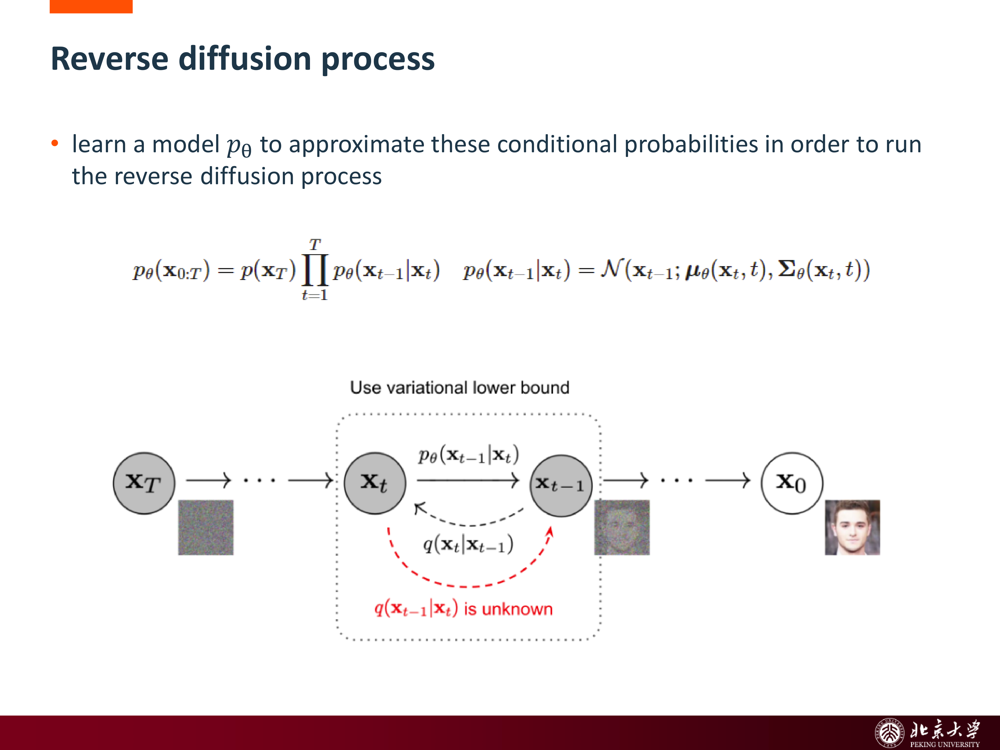
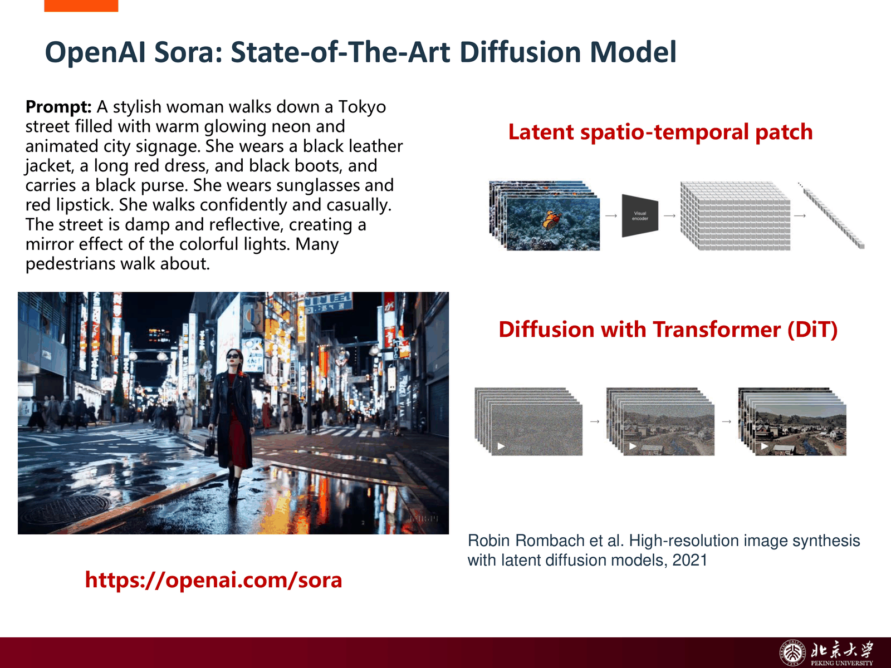

[generative models](slides/generative%20models.pdf)

这份笔记按课件主线整理深度生成模型的几个核心家族：从 **PCA / AutoEncoder 的降维视角** 出发，过渡到 **VAE** 的概率建模，再到 **GAN** 的对抗训练，以及近年的 **Diffusion Models** 和 **Autoregressive Models**。整条主线围绕同一个问题展开：

> 如何学习数据分布，并从中生成新的、看起来合理的样本。

## 1 生成模型在做什么

### 1.1 从判别到生成

判别模型更关心：

- 给定 $x$，预测类别 $y$
- 或建模 $p(y|x)$

而生成模型更关心：

- 数据本身是如何生成的
- 如何建模 $p(x)$ 或联合分布 $p(x, z)$
- 如何从模型里采样出新的内容

课件开头强调了生成模型的几个吸引点：

- 能生成高度逼真的图像、文本、音频等内容
- 可以通过 **latent code manipulation** 控制生成内容
- 能把“学习表示”和“生成样本”统一起来

### 1.2 生成模型的共同套路

虽然不同家族差别很大，但它们通常都包含以下几个元素：

- 一个 **latent variable** $z$
- 一个把数据压缩到隐空间的表示过程
- 一个从隐空间还原样本的生成过程
- 某种约束，让 latent space 有良好结构并可采样

这也是为什么课件先从降维和 encoder-decoder 视角切入。

## 2 从降维到 AutoEncoder

### 2.1 PCA：最简单的低维表示

PCA 的目标是寻找一个低维嵌入，使数据在投影后尽可能保留方差。它可以被看作最简单的“线性编码器-解码器”：

- encoder：把高维数据投影到主成分坐标
- decoder：再从低维坐标还原回原空间

但 PCA 的表达能力受限于线性子空间，无法描述复杂非线性流形。

### 2.2 AutoEncoder：用神经网络替代线性映射

AutoEncoder（AE）把 PCA 的线性变换换成神经网络：

- **encoder**：$z = e(x)$
- **decoder**：$\hat x = d(z)$

目标通常是最小化重建误差 （MSE loss）：

$$
\mathcal{L}_{\text{AE}} = \|x - \hat x\|^2.
$$

关键约束：潜空间维度 $dim(z)≪dim(x)$ ，形成**信息瓶颈**，迫使网络学习数据的最本质特征。

{ width="650" }

AE 的优点是能够学习非线性表示，但它有一个重要问题：

> 虽然它能压缩和重建训练数据，但 learned latent space 往往并不规则，不适合直接采样生成新样本。

### 2.3 为什么普通 AE 的 latent space 不适合生成

课件里把这个问题说得很直白：

- 降维时我们希望保留数据的主要结构
- 但普通 AE 容易过拟合训练样本
- latent space 可能非常不规则、不连续

如果 latent space 中只有一些零散孤岛，随机采样很容易落到“训练时没覆盖”的区域，decoder 输出就可能是无意义内容。

因此生成模型不只要“重建得好”，还要让 latent space **连续（continuity）**、**完整（completeness）**。

## 3 VAE：给 latent space 加上概率结构

### 3.1 从点编码到分布编码

VAE（Variational AutoEncoder）与普通 AE 的关键区别是：

- AE：把输入编码成一个确定点 $z$
- VAE：把输入编码成一个概率分布 $q_\phi(z|x)$

通常我们令

$$
q_\phi(z|x) = \mathcal{N}(\mu_\phi(x), \Sigma_\phi(x)).
$$

也就是说，encoder 不再直接输出一个隐变量，而是输出其均值和方差参数。

课件中 VAE 的流程可以概括为：

1. 输入 $x$ 被编码成 latent distribution
2. 从该分布采样得到 $z$
3. decoder 用 $z$ 重建出 $\hat x$
4. 通过 reconstruction + regularization 联合训练

### 3.2 VAE 的损失函数

VAE 的核心损失由两部分组成：

- **重建项**：保证 encode-decode 有效
- **正则项**：让 latent space 逼近预设先验，保持规则

最经典的目标函数写为：

$$
\mathcal{L}_{\text{VAE}}
=
\mathbb{E}_{q_\phi(z|x)}[-\log p_\theta(x|z)]
+
\operatorname{KL}\bigl(q_\phi(z|x)\,\|\,p(z)\bigr).
$$

其中常取

$$
p(z) = \mathcal{N}(0, I).
$$

{ width="650" }

直观上：

- 第一项希望重建尽量好
- 第二项希望不同样本的 posterior 不要偏离标准高斯太远

这就是 reconstruction 与 regularization 的 trade-off。

### 3.3 为什么要正则 latent code

课件把 regular latent space 的两个目标总结得很好：

- **continuity**：邻近的 latent points 解码后应得到相似内容
- **completeness**：从先验里采样的点，大多数都能解码出“有意义”的样本

如果没有 KL 正则，模型完全可以把每个训练样本编码到一个彼此孤立的点上，虽然重建误差小，但采样毫无意义。

所以 VAE 的关键价值不只是“会编码会解码”，而是：

> 它把隐变量空间塑造成一个可插值、可采样、可操作的概率空间。

### 3.4 概率图模型视角

VAE 假设数据由 latent variable $z$ 生成：

$$
p_\theta(x, z) = p(z)p_\theta(x|z).
$$

其中：

- $p(z)$ 是 prior
- $p_\theta(x|z)$ 是 probabilistic decoder

理论上我们希望计算 posterior $p_\theta(z|x)$，但它通常不可 tractable，因此引入近似分布

$$
q_\phi(z|x)
$$

来逼近它，这就是 **variational inference**。

### 3.5 ELBO 与 Jensen 不等式

由于直接最大化 $\log p(x)$ 很难，VAE 转而最大化其变分下界（ELBO）：

$$
\log p_\theta(x)
\ge
\mathbb{E}_{q_\phi(z|x)}[\log p_\theta(x|z)]
-
\operatorname{KL}\bigl(q_\phi(z|x)\,\|\,p(z)\bigr).
$$

这个不等式来自 Jensen inequality。它的重要意义是：

- 左边是真正想优化的 log-likelihood
- 右边是可计算、可优化的下界

因此 VAE 训练本质上就是最大化 ELBO。

### 3.6 Reparameterization Trick

VAE 还有一个看似技术性、实则决定成败的关键点：**如何让采样这一步可反向传播**。

若直接写

$$
z \sim \mathcal{N}(\mu, \sigma^2),
$$

采样操作对网络参数不可导。重参数化技巧把它改写成

$$
z = \mu + \sigma \odot \epsilon, \qquad \epsilon \sim \mathcal{N}(0, I).
$$

{ width="650" }

这样：

- 随机性被移到独立噪声 $\epsilon$
- $\mu, \sigma$ 仍然是可导的网络输出

这让整个 VAE 可以端到端训练。

## 4 GAN：把生成写成一场对抗博弈

### 4.1 GAN 的基本角色

GAN（Generative Adversarial Network）引入两个网络：

- **Generator** $G$：把随机噪声 $z$ 变成生成样本 $G(z)$
- **Discriminator** $D$：判断输入来自真实数据还是生成器

这里：

- $z$ 通常采样自 Gaussian / Uniform
- 可理解为图像的 latent representation

### 4.2 Minimax Objective

GAN 的目标被写成一个 minimax game：

$$
\min_G \max_D V(D, G),
$$

其中

$$
V(D, G)
=
\mathbb{E}_{x \sim p_{\text{data}}(x)}[\log D(x)]
+
\mathbb{E}_{z \sim p(z)}[\log(1 - D(G(z)))].
$$

{ width="650" }

含义是：

- 判别器想把真样本分成 1、假样本分成 0
- 生成器想骗过判别器，让假样本也被判成真

### 4.3 GAN 的训练流程

GAN 训练通常交替进行：

1. 固定 $G$，更新 $D$
2. 固定 $D$，更新 $G$

于是训练过程像一场对抗博弈：

- $D$ 变强，会逼 $G$ 生成更真实样本
- $G$ 变强，又会逼 $D$ 学到更细致的真实/伪造边界

这是 GAN 能生成清晰锐利样本的根本原因之一。

### 4.4 GAN 的问题：为什么训练不稳定

课件直接点出了 GAN 的两大经典问题：

- **vanishing gradient**
- **mode collapse**

{ width="650" }

具体来说：

- 若判别器太强，生成器得到的梯度可能非常弱
- 生成器还可能学会只输出少数几类“足以骗过判别器”的样本，导致缺乏多样性

这也是后续出现 WGAN、StyleGAN、GAN inversion 等大量变体的背景。

### 4.5 GAN Inversion

课件还提到了 **GAN inversion** 的思路：给定一张真实图像，反过来寻找一个 latent code，使生成器能还原这张图。

它的重要意义在于：

- 可以把真实图像映射进生成模型的 latent space
- 从而支持编辑、属性操控和重建

这说明生成模型不仅可“从噪声生成”，也可以变成一个可操作的表示空间。

## 5 Diffusion Models：从加噪到去噪

### 5.1 基本思想

Diffusion models 是近几年最强势的生成范式之一。课件里把它描述为：

- 受非平衡热力学启发
- 构造一个可逆的随机变换过程
- 不强依赖专门的生成器/判别器架构

其核心包括两个方向相反的过程：

- **forward diffusion**：逐步给真实样本加噪
- **reverse diffusion**：学习如何一步步把噪声去掉，恢复数据

### 5.2 Forward Diffusion

前向扩散过程从真实样本 $x_0$ 出发，不断叠加小的高斯噪声：

$$
x_0 \rightarrow x_1 \rightarrow x_2 \rightarrow \cdots \rightarrow x_T.
$$

当 $T$ 足够大时，$x_T$ 会逐渐接近各向同性高斯分布。

这一步是固定的、已知的、逐步破坏结构的过程。

### 5.3 Reverse Diffusion

真正要学的是反向过程：

$$
x_T \rightarrow x_{T-1} \rightarrow \cdots \rightarrow x_0.
$$

模型学习每一步条件分布

$$
p_\theta(x_{t-1}|x_t),
$$

从而把纯噪声逐步“雕刻”成清晰样本。

{ width="650" }

从生成视角看，这和 GAN 最大的不同在于：

- GAN：一次性把 latent code 映射成样本
- Diffusion：通过很多步逐渐 refinement

这也是 diffusion 结果通常更稳定、更高质量的重要原因之一。

### 5.4 Latent Diffusion

直接在像素空间做 diffusion 计算开销很大。Latent Diffusion 的核心是：

- 先用 autoencoder / VAE 类模型把图像压缩到 latent space
- 再在 latent space 中做 diffusion

这样可以：

- 显著降低计算量
- 把低层感知细节与高层语义变化适度解耦

课件总结为 **decouple perceptual and semantic signals**。

### 5.5 DiT 与 Sora：Diffusion + Transformer

近年的 diffusion 系统越来越多地与 Transformer 结合。课件里提到：

- **DiT（Diffusion Transformer）**
- **OpenAI Sora**

{ width="650" }

这一步非常值得注意，因为它说明生成模型正在经历一次“架构统一”：

- latent diffusion 提供生成范式
- Transformer 提供更强的序列/块级建模能力
- 视频生成则进一步把图像 latent 扩展成时空 patch 序列

## 6 自回归生成模型

### 6.1 基本思想

Autoregressive models 的核心是链式分解：

$$
p(x) = \prod_{t=1}^{T} p(x_t \mid x_{<t}).
$$

也就是说，把生成过程写成“每次预测下一个 token”。

这个 token 可以是：

- 文本 token
- 图像 token / patch token
- 视频 token
- 音频 token

### 6.2 GPT-Style 训练方式

课件后面把 GPT-style generative models 作为回顾，是为了说明：

- 自回归模型不是只能做语言
- 只要数据能 token 化，就能按 next-token prediction 训练

这也是很多多模态模型、视频模型的统一建模方式。

### 6.3 与 Diffusion 的对比

课件最后列出 VideoPoet、Phenaki、Make-A-Video 等代表工作，说明视频生成可以走两条主流路线：

- **autoregressive**：逐 token 生成
- **diffusion**：逐步去噪生成

它们的区别可以粗略理解为：

- AR 更像“顺序讲故事”
- Diffusion 更像“从噪声中逐层雕刻画面”

## 7 一条总主线：AE → VAE → GAN → Diffusion → AR

若把整份课件压成一条演化主线，可以这样理解：

- **PCA / AE**：先学会压缩与重建
- **VAE**：让 latent space 变成可采样的概率空间
- **GAN**：通过对抗学习生成高保真样本
- **Diffusion**：通过逐步去噪得到更稳定的生成质量
- **Autoregressive**：把生成写成 next-token prediction，方便和大语言模型思路统一

因此不同生成模型的主要分歧，不在于“是否有 latent variable”，而在于：

- 如何定义生成过程
- 如何训练这个过程
- 如何平衡样本质量、覆盖性、稳定性与采样效率

## 8 总结与易错点

### 8.1 关键对比

!!! summary "生成模型速查"
    - **AE**：重建为主，latent space 不一定适合采样。
    - **VAE**：显式建模 $q(z|x)$ 与 $p(x|z)$，通过 KL 正则塑造规则 latent space。
    - **GAN**：生成器和判别器对抗博弈，样本锐利，但训练不稳定。
    - **Diffusion**：前向加噪、反向去噪，生成稳定、质量高，但采样步数较多。
    - **Autoregressive**：链式分解，逐 token 生成，和 GPT 风格训练高度一致。

### 8.2 高频易错点

- 把普通 AE 当成生成模型直接采样：AE 的 latent space 可能非常不规则，随机采样通常不可靠。
- 认为 VAE 的 KL 项只是“额外正则化”：它实质上是在把 posterior 拉向 prior，从而塑造可采样的 latent space。
- 把 ELBO 当成真实 likelihood：它是 log-likelihood 的可优化下界。
- 觉得 reparameterization trick 只是数学小技巧：没有它，VAE 的采样步骤很难端到端反传。
- 认为 GAN 的目标是直接最小化重建误差：GAN 主要依靠对抗损失，而不是像 AE/VAE 那样逐像素重建。
- 把 diffusion 理解成“不断加噪的模型”：真正训练的重点是 **reverse diffusion**。
- 认为 AR 和 diffusion 只能二选一：在多模态生成里，两类方法常并存，各有适用场景。

## 9 考试重点

- **AE vs VAE**：确定编码 vs 概率编码
- **VAE loss**：reconstruction + KL regularization
- **ELBO** 与 Jensen inequality 的基本关系
- **reparameterization trick**
- **GAN minimax objective**
- **GAN 的典型问题**：vanishing gradient、mode collapse
- **diffusion**：forward process / reverse process
- **latent diffusion** 的动机
- **autoregressive generation** 的基本链式分解思想
