本讲内容围绕 **pixel-level understanding / pixel labeling** 展开：从无监督分割（聚类、图分割）到交互式抠图（GraphCut/GrabCut/Lazy Snapping），再到更细粒度的 **图像 Matting**，以及相关任务（co-segmentation、inpainting/completion）。

## 1 Pixel Computing 与 Pixel Labeling

{ width="650" }

{ width="650" }

“Pixel Labeling” 强调把一张图像理解到像素级别：每个像素都对应某种标签/解释（所属区域、前景/背景、透明度、语义类别、深度等）。

{ width="650" }

从建模角度看，pixel labeling 常见有三类输出：

- **离散标签**：如前景/背景、语义类别（道路/行人/车）。
- **连续值**：如 matting 的 $\alpha$、深度估计值。
- **结构关系**：如像素之间是否应属于同一区域（图模型/能量模型中的 pairwise 关系）。

这也是为什么本讲会同时出现聚类、图割、MRF、PDE（Poisson）和 patch 匹配等不同技术路线：它们在“像素级决策”的角度上是同一问题的不同解法。

## 2 任务与应用图景

### 2.1 无监督分割（Unsupervised Segmentation）

无监督分割通常希望把图像分解为“连贯的区域”，作为后续处理（识别、交互、重建）的基础。

{ width="650" }

{ width="650" }

### 2.2 交互式抠图与 Matting

抠图（cutout）更关注“把目标从背景中分离出来”。当目标边界存在 **半透明/细毛发/反光** 时，需要 Matting（估计透明度 $\alpha$）而不只是二值分割。

{ width="650" }

{ width="650" }

{ width="650" }

Matting 中常见输入是 **trimap**：明确标注“前景确定 / 背景确定 / 未知区域”。

{ width="650" }

### 2.3 相关任务：Co-segmentation / Parsing / Depth / Inpainting

{ width="650" }

{ width="650" }

{ width="650" }

## 3 无监督分割：把 Segmentation 看成 Clustering

### 3.1 K-means（向量量化视角）

一个最直接的想法是：把像素映射为特征向量，然后做聚类。

{ width="650" }

仅用强度/颜色做聚类能得到“颜色一致”的簇，但不保证空间连贯：同色但分散在图像不同位置的像素可能被分到同一类。

{ width="650" }

{ width="650" }

把空间坐标也加入特征（例如用 $(r,g,b,x,y)$）能显式地鼓励空间连贯性。

{ width="650" }

K-means 的典型目标函数是最小化类内平方误差：

$$
\min_{\{\mu_k\}, \{z_i\}}
\sum_{i=1}^{n}\left\|x_i - \mu_{z_i}\right\|_2^2,
\quad z_i \in \{1,\dots,K\}
$$

其中 $x_i$ 是第 $i$ 个像素（或 superpixel）的特征，$\mu_k$ 是第 $k$ 个簇的中心。

K-means 在分割中的实际运行可总结为：

1. 初始化 $K$ 个簇中心（随机或 k-means++）。
2. 把每个像素分配给最近中心（assignment）。
3. 重新计算每个簇中心（update）。
4. 重复 2-3 直到簇中心变化很小或达到迭代上限。

在图像任务中，一个常见细节是 **特征归一化与权重平衡**。例如用 $(r,g,b,x,y)$ 时，若不缩放坐标，空间项或颜色项可能“压过”另一方，导致分割过碎或过粗。工程上常写成 $(r,g,b,\lambda x,\lambda y)$，用 $\lambda$ 控制空间连贯程度。

!!! info "K-means 的优缺点（分割场景）"
    优点：实现简单、收敛到局部最优、速度快。

    缺点：需要指定 $K$、对初始化/异常点敏感、偏好“球状簇”（各向同性），对复杂形状与尺度变化不鲁棒。

{ width="650" }

### 3.2 Mean Shift（找密度模态）

Mean Shift 把聚类理解为“在特征空间的密度峰值（mode）附近聚合”，不需要预先指定簇数。

{ width="650" }

直觉：对每个点，从一个局部窗口出发，不断把窗口中心移动到窗口内数据的“质心”，最终会收敛到某个密度峰值；落入同一吸引域（attraction basin）的点属于同一簇。

如果写成公式，Mean Shift 的更新可理解为：

$$
x^{(t+1)} = \frac{\sum_j K\left(\frac{\|x_j-x^{(t)}\|^2}{h^2}\right)x_j}{\sum_j K\left(\frac{\|x_j-x^{(t)}\|^2}{h^2}\right)}
$$

其中 $h$ 是窗口尺度（bandwidth）。它几乎决定了结果粒度：

- $h$ 小：模态数量多，分割更细，容易碎片化。
- $h$ 大：模态数量少，分割更粗，可能把不同物体并到一起。

所以 Mean Shift 虽然“不用指定 $K$”，但并不等于“无参数”，其核心控制参数就是 bandwidth。

{ width="650" }

{ width="650" }

{ width="650" }

{ width="650" }

{ width="650" }

{ width="650" }

{ width="650" }

{ width="650" }

{ width="650" }

Mean Shift 的流程可概括为：

{ width="650" }

{ width="650" }

{ width="650" }

{ width="650" }

!!! info "Mean Shift 的优缺点"
    优点：不假设簇是球形、参数相对少（主要是窗口大小）、可得到可变数量的模态、对异常点相对鲁棒。

    缺点：对窗口大小敏感、计算开销大、特征维数升高后更难扩展。

{ width="650" }

## 4 图分割：Normalized Cut（Ncut）

Normalized Cut 把分割建模为 **图的划分（graph partitioning）**：像素/超像素是节点，边权是相似度（affinity），希望切断“弱连接”而保留“强连接”。

{ width="650" }

{ width="650" }

{ width="650" }

{ width="650" }

### 4.1 图表示与相似度（affinity）

{ width="650" }

{ width="650" }

常见相似度构造：把两点距离通过 Gaussian kernel 映射成亲和力：

$$
w_{ij} = \exp\left(-\frac{\mathrm{dist}(x_i,x_j)^2}{2\sigma^2}\right)
$$

{ width="650" }

尺度 $\sigma$ 决定“邻近”的范围：$\sigma$ 小只连接很近的点，$\sigma$ 大会把更远的点也连接起来。

实践里，相似度常同时考虑 **颜色差异 + 空间距离**，例如：

$$
w_{ij}
=
\exp\left(-\frac{\|I_i-I_j\|^2}{2\sigma_I^2}\right)
\exp\left(-\frac{\|p_i-p_j\|^2}{2\sigma_p^2}\right)
$$

并只在局部邻域连边（而非全连接图），否则图太大、存储和求解都会很重。

{ width="650" }

### 4.2 Min-Cut 的问题与 Normalized Cut

最小割（min-cut）倾向于切掉很小、孤立的区域（因为切一小块的边权和可能很小），不符合“语义上合理的分割”。

{ width="650" }

{ width="650" }

{ width="650" }

Ncut 用归一化来抑制“切一小块”的偏置。设 $A,B$ 为两部分，$V$ 为全体节点：

- $\mathrm{cut}(A,B)=\sum_{i\in A, j\in B} w_{ij}$
- $\mathrm{assoc}(A,V)=\sum_{i\in A, j\in V} w_{ij}$

则：

$$
\mathrm{Ncut}(A,B)
=
\frac{\mathrm{cut}(A,B)}{\mathrm{assoc}(A,V)}
+
\frac{\mathrm{cut}(A,B)}{\mathrm{assoc}(B,V)}
$$

{ width="650" }

{ width="650" }

{ width="650" }

### 4.3 松弛与特征向量解法（广义特征值问题）

令 $W$ 为邻接矩阵，$D$ 为度矩阵（$D_{ii}=\sum_j W_{ij}$）。对指示向量做连续松弛后，Ncut 的优化可转化为解广义特征值问题：

$$
(D-W)y = \lambda Dy
$$

通常取 **第二小** 特征值对应的特征向量作为划分依据（第一小对应平凡解）。

这里的“第二小特征向量”可理解为图上的“最平滑非平凡划分方向”：它让强连接节点取值更接近，弱连接两侧取值差异更大。再对该向量做阈值切分（如 0、median 或搜索最优阈值）即可得到二分结果。

{ width="650" }

{ width="650" }

Ncut 的基本算法流程：

{ width="650" }

多类扩展常见做法：

- 递归二分（recursive bipartition）
- 取多个特征向量后做 k-means

{ width="650" }

{ width="650" }

!!! info "Normalized Cut 的优缺点"
    优点：框架通用，特征/相似度的定义灵活，能捕获全局一致性（相对局部聚类而言）。

    缺点：时间和存储开销大；存在倾向把图划成“大小相近”区域的偏置。

{ width="650" }

最后，讲义强调 Ncut 缺少“全局的前景/背景建模”能力，这也是后续交互式 GraphCut/GrabCut 的动机之一。

{ width="650" }

## 5 交互式抠图：Graph Cut / GrabCut / Lazy Snapping

{ width="650" }

### 5.1 Boykov & Jolly：交互式 Graph Cut

GraphCut 典型输入是用户 strokes（例如蓝色表示前景、红色表示背景），目标是得到一个二值分割。

{ width="650" }

{ width="650" }

GraphCut 的能量函数常写为二元 MRF：

$$
E(L)
=
\sum_i D_i(L_i) + \sum_{(i,j)\in\mathcal{E}} V_{ij}(L_i,L_j)
$$

- $L_i\in\{0,1\}$ 表示像素 $i$ 的前景/背景标签
- $D_i$ 是 unary term（数据项/区域项），通常由颜色直方图或概率模型给出
- $V_{ij}$ 是 pairwise term（平滑项），鼓励相似且相邻的像素获得相同标签

一个常见的平滑项写法是：

$$
V_{ij}(L_i,L_j)=\lambda\,[L_i\neq L_j]\exp\left(-\beta\|I_i-I_j\|^2\right)
$$

含义是：当两个像素颜色很接近时，给它们不同标签会被更强惩罚；在强边缘（颜色突变处）惩罚变小，从而允许切割沿真实边界通过。

{ width="650" }

数据项可用用户标注区域的颜色统计（如直方图）来定义；平滑项常同时依赖颜色相似度与空间邻接。

{ width="650" }

该类二值能量在满足一定条件时可转为 s-t min-cut / max-flow 求解。

{ width="650" }

### 5.2 GrabCut：GMM + Iterated Graph Cut

GrabCut 用一个 bounding box 作为交互输入，避免用户精细描边；并用 GMM 建模前景/背景颜色分布，通过迭代（类似 EM）交替更新模型与分割。

{ width="650" }

{ width="650" }

GrabCut 的典型循环：

1. 用 bbox 初始化“可能前景/背景”集合
2. 分别对前景/背景拟合 GMM（通常 5–8 个高斯分量）
3. 用当前 GMM 得到每像素的 unary term（负对数似然）
4. 加上平滑项构图，做一次 graph cut 得到分割
5. 用新分割重新估计 GMM，继续迭代直到收敛

GrabCut 的关键价值在于把“用户交互负担”从精细描边降到“框选 + 少量修正笔刷”。在很多自然图像中，仅 bbox 初始化就能得到可用结果；困难样本再通过少量前/背景笔刷增强 GMM 的可分性。

{ width="650" }

{ width="650" }

{ width="650" }

### 5.3 Lazy Snapping：更轻量的交互与加速

Lazy Snapping 依然基于 GraphCut，但强调交互式体验与速度：用户标注少量前景/背景 strokes，先做一次 Boykov & Jolly 风格 graphcut，再支持边界编辑（Edit Boundary）。

{ width="650" }

{ width="650" }

讲义中将其能量拆成两部分：

- $E_1(X)$：用 K-means 对已知前景/背景颜色聚类，得到代表色（辅助构建数据项）
- $E_2(X)$：与 Boykov & Jolly 类似的 MRF 能量（unary + pairwise），用 graph cut 求解

但逐像素 graphcut 在交互式 refinement 中可能太慢，因此引入 superpixels 做加速。

本质上，Lazy Snapping 通过“先过分割成区域单元，再在区域图上优化”减少变量规模。代价是边界精度受 superpixel 粒度影响，因此通常会保留边界编辑步骤来做局部修补。

{ width="650" }

{ width="650" }

{ width="650" }

## 6 Image Matting：从二值到连续透明度

### 6.1 合成模型与 matting 方程

Matting 用 $\alpha\in[0,1]$ 表示每个像素的透明度。合成模型是：

$$
I = \alpha F + (1-\alpha)B
$$

其中 $I$ 是观测像素颜色（RGB），$F$ 是前景颜色，$B$ 是背景颜色。

这个模型说明了 matting 与分割的核心区别：分割只决定“属于谁”，而 matting 还要估计“混合比例”。因此像头发丝、纱布、运动模糊边缘等场景，单纯二值 mask 往往会出现锯齿、黑边、漏抠。

{ width="650" }

{ width="650" }

二值分割可以看作 $\alpha\in\{0,1\}$ 的特殊情形；Matting 允许边界/细毛发区域出现连续过渡。

{ width="650" }

### 6.2 为什么 matting 难

单个像素的未知量很多：$F$（3 维）、$B$（3 维）、$\alpha$（1 维），总计 7 个未知量，但观测只有 $I$ 的 3 个通道。

{ width="650" }

{ width="650" }

{ width="650" }

{ width="650" }

因此 Matting 必须引入额外信息，例如：

- trimap（已知前景/背景区域提供边界条件）
- 局部平滑/颜色线性模型等先验
- 多张不同背景的图像（蓝/绿幕或多背景拍摄）增加方程数

实际流程通常是：

1. 用户给 trimap（或由分割模型自动提供粗 trimap）。
2. 在未知区域估计 $\alpha$（和/或 $F,B$）。
3. 可选地再做前景颜色精修，避免合成时边缘发灰。

这也是工业流程里“分割模型 + matting 模型”常常串联使用的原因。

{ width="650" }

## 7 Poisson Matting（梯度域求解）

Poisson Matting 的核心思路是把问题转到梯度域：与其直接在颜色域估计 $\alpha$，不如估计（或构造）一个与真实 $\nabla \alpha$ 接近的向量场，然后通过 Poisson 方程恢复 $\alpha$。

{ width="650" }

{ width="650" }

{ width="650" }

{ width="650" }

一个常见形式是解带 Dirichlet 边界条件的 Poisson 方程：

$$
\Delta \alpha = \mathrm{div}(v) \quad \text{in } \Omega
$$

$$
\alpha = 0 \ \text{on } \Omega_B,\quad \alpha = 1 \ \text{on } \Omega_F
$$

其中 $\Omega$ 是未知区域，$\Omega_F,\Omega_B$ 由 trimap 给出；$v$ 是从观测图像与 $F,B$ 估计得到的梯度场近似。

{ width="650" }

{ width="650" }

## 8 Related Topics：Co-segmentation 与 Inpainting / Completion

### 8.1 Image Co-Segmentation

Co-segmentation 希望从一组图像中分割出“共同的前景对象”，即使背景不同。

{ width="650" }

早期代表性工作通过加入 **全局约束（例如直方图匹配）** 把 “跨图像一致性” 融入 MRF 能量中。

{ width="650" }

应用之一是更鲁棒的图像距离度量：用“共同前景”的匹配而不是整图的像素差异。

{ width="650" }

{ width="650" }

### 8.2 Image Inpainting / Image Completion

Inpainting/Completion 的目标是“把缺失区域补全到看起来真实且无缝”，常用于去除物体、修复照片等。

{ width="650" }

{ width="650" }

{ width="650" }

{ width="650" }

直观上我们希望：

- 延拓进入洞区域的结构线（边缘、曲线）
- 用周围纹理在洞里“长”出来
- 无明显接缝/伪影

这类任务的难点在于“欠约束”：同一个洞可能有多种看起来都合理的补法。传统方法依赖局部统计与先验，而现代生成模型会进一步引入语义先验（例如“天空应该平滑、建筑边缘应连续”）。

{ width="650" }

#### 8.2.1 结构 vs 纹理

Inpainting 通常需要同时处理两类信息：结构（几何、边缘、曲线）与纹理（重复的局部模式）。

{ width="650" }

#### 8.2.2 Exemplar-based Inpainting（Criminisi et al.）

经典方法通过“从已知区域复制相似 patch”来填洞，填充顺序非常关键。

{ width="650" }

{ width="650" }

{ width="650" }

简单的“洋葱皮”顺序（从边界往内一圈圈填）可能破坏线性结构。

{ width="650" }

更好的策略是优先填那些处在结构延拓方向上的区域，让边缘/曲线先被补全。

{ width="650" }

{ width="650" }

填充优先级通常由“置信度 + 数据项（结构强度）”构成（例如边界处强梯度方向的延拓给更高优先级）。

经典 Criminisi 优先级写作：

$$
P(p)=C(p)\,D(p)
$$

- $C(p)$（confidence）：该 patch 已知像素比例越高，说明可参考信息越可靠。
- $D(p)$（data term）：与等照线（isophote）延拓相关，倾向优先延续强结构。

因此它不是简单“从外向内填”，而是先补最能延续结构的边界位置。

{ width="650" }

{ width="650" }

{ width="650" }

{ width="650" }

{ width="650" }

{ width="650" }

#### 8.2.3 Structure-first Completion：图标注 + DP/BP

讲义给出的关键观察是：自然图像里最显著的缺失结构通常可由少数曲线近似；并且应先补结构、后补纹理。

{ width="650" }

该类方法通常引入用户交互来指定结构曲线，先沿曲线做结构传播，再对剩余区域做纹理传播。

{ width="650" }

对应地可以构造能量函数（由结构项、完成项、连贯项等组成），把“给每个 anchor 选择哪个 source patch”视为一个图上的标签分配问题。

{ width="650" }

当结构拓扑是链状（1-D chain）时可用动态规划（DP）；更一般的图结构可用 belief propagation（BP）近似求解。

{ width="650" }

{ width="650" }

{ width="650" }

{ width="650" }

{ width="650" }

{ width="650" }

## 9 从传统 Pixel Computing 到深度 Pixel Computing

第二讲的主线，是把第一讲里的“像素级任务”正式带入深度学习时代。前半讲我们更多看到的是：

- 聚类
- 图分割
- GraphCut / GrabCut
- Matting
- Inpainting

它们大多依赖手工设计的特征、能量函数、图模型或 PDE。第二讲则讨论：能否直接让神经网络学习一个 **pixel in, pixel out** 的映射，把输入图像端到端变成像素级输出。

从任务划分看，深度 pixel computing 主要分成三层：

- **pixel-level methods**：语义分割、object parsing 等，对每个像素输出类别
- **instance-level methods**：不仅分出类别，还要区分同类中的不同实例
- **pose estimation**：输出人体关键点或骨架，本质上仍是像素级定位问题

## 10 Pixel-Level Methods：语义分割进入 CNN 时代

### 10.1 为什么分类 CNN 不能直接拿来做分割

第二讲首先强调一个看似简单、其实关键的问题：普通 CNN 分类器虽然能回答“图里有什么”，但它在高层特征里已经做了大量 pooling / stride，下采样后空间分辨率很粗，因此很难精确回答“这个像素属于什么”。

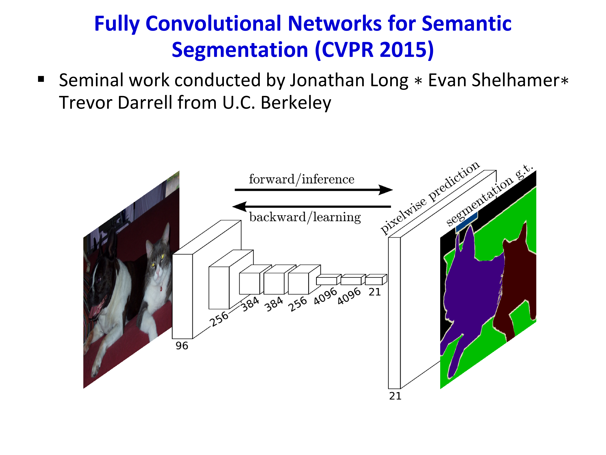{ width="650" }

如果把分类网络直接用于像素标注，会遇到两个核心矛盾：

- **语义强，但位置粗**：深层特征知道“是什么”，但不知道边界精确在哪
- **位置细，但语义弱**：浅层特征保留边缘和局部细节，但类别判别能力不够

这也是后面 FCN、skip connection、SegNet、DeepLab、CRF-as-RNN 都在反复解决的核心问题。

### 10.2 FCN：把分类网络改造成 dense predictor

FCN（Fully Convolutional Network, CVPR 2015）是语义分割里的奠基性工作。它的思想非常朴素但极其重要：**把原本为分类设计的 CNN 改造成全卷积网络，使它能够接受任意尺寸输入，并输出对应的像素级预测图。**

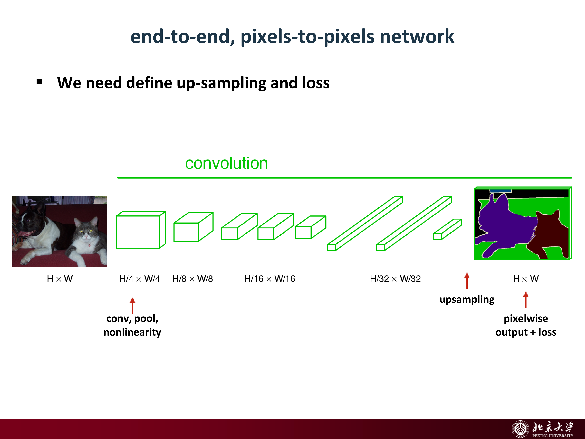{ width="650" }

核心改造包括两步：

1. 把原先的全连接层视作特殊的卷积层，从而保留空间结构。
2. 在网络尾部加入上采样（upsampling / deconvolution），把低分辨率特征图恢复到接近原图尺度。

因此 FCN 的计算流程可以概括为：

- 前半段：`conv + pool + nonlinearity` 提取越来越抽象的特征
- 后半段：上采样，把粗特征重新映射回像素网格
- 输出层：对每个像素给一个类别分布，并计算逐像素损失

### 10.3 FCN 里的三个关键部件

#### 10.3.1 上采样（Upsampling / Deconvolution）

FCN 必须解决“低分辨率特征如何还原到原图大小”这个问题。讲义里把它称为 upsampling，也常叫 deconvolution（更准确地说通常是 transposed convolution 或双线性插值上采样）。

上采样的作用不是“凭空恢复全部细节”，而是把 coarse feature map 投回更密的像素网格，让网络能在原图尺度做分类。

#### 10.3.2 Skip Layer Fusion：浅层位置 + 深层语义

仅依赖最后一层特征时，输出往往过于粗糙。FCN 的重要改进是引入 skip fusion，把浅层与深层信息融合起来。

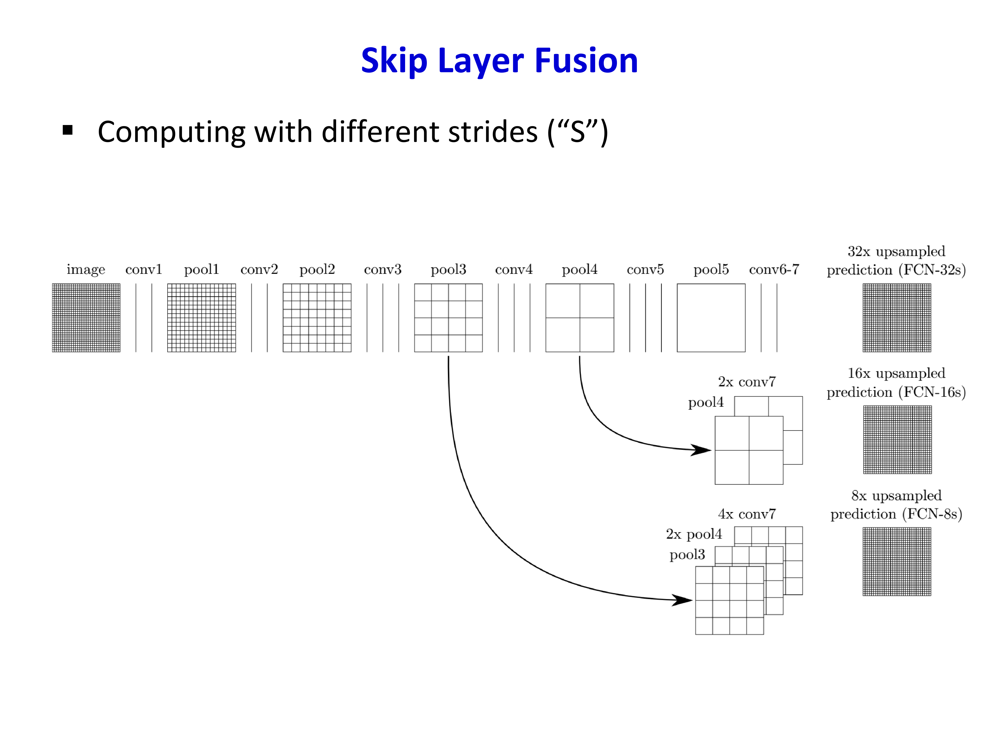{ width="650" }

这正对应一句经典总结：**combine where with what**。

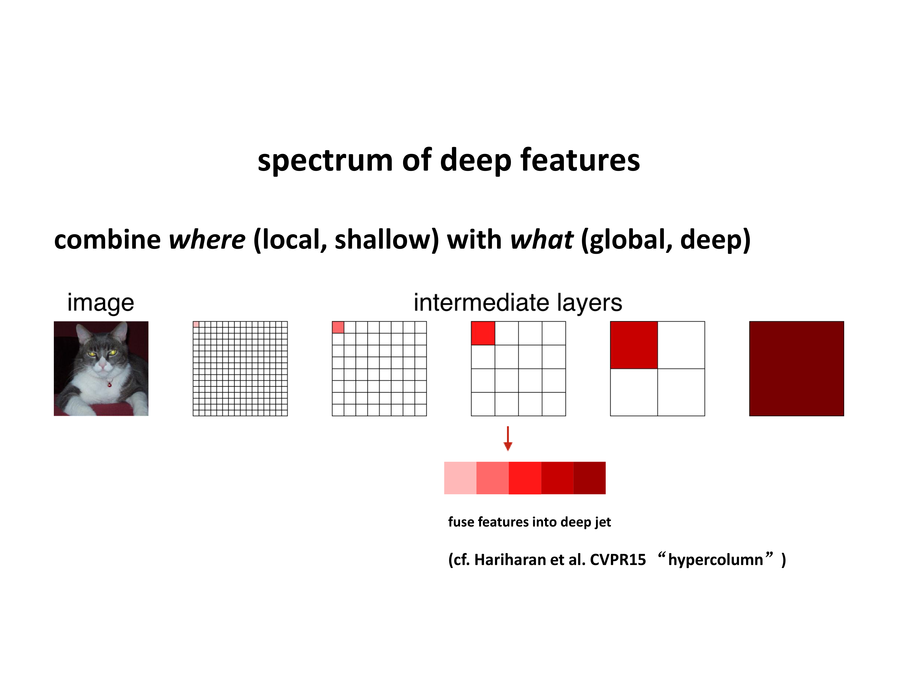{ width="650" }

- 浅层特征更擅长回答 **where**
- 深层特征更擅长回答 **what**

融合后，网络既保留了局部边界信息，又保留了全局语义信息。

#### 10.3.3 损失函数与评价指标

语义分割通常使用 **逐像素多分类损失**。如果像素 $i$ 的真实标签是 one-hot 向量 $y_i$，预测概率为 $p_i$，那么常见的交叉熵写作：

$$
\mathcal{L}_{\text{pixel}}
=
-\sum_i \sum_{c=1}^{C} y_{ic}\log p_{ic}
$$

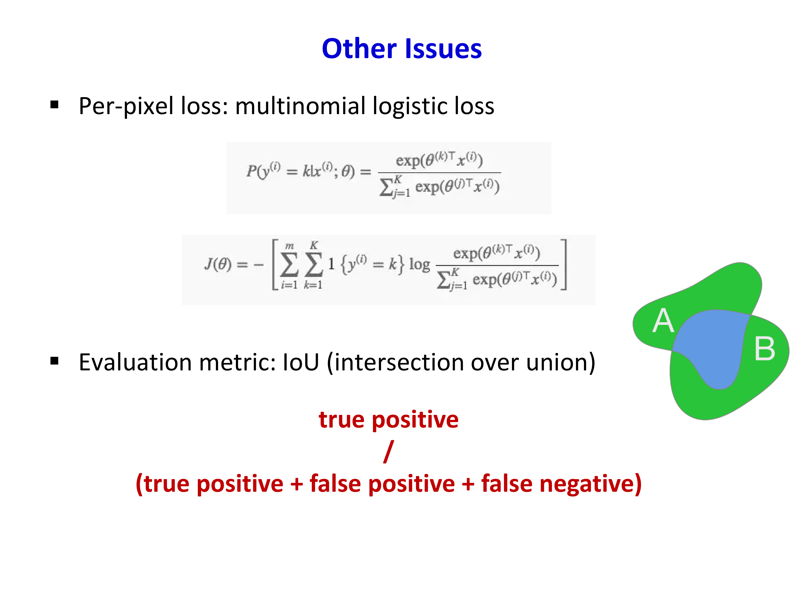{ width="650" }

而评价时，单纯看 pixel accuracy 往往不够，因为类别不平衡时“大面积背景”很容易把指标冲高。所以分割里更常用 **IoU（Intersection over Union）**：

$$
\mathrm{IoU}
=
\frac{\mathrm{TP}}{\mathrm{TP}+\mathrm{FP}+\mathrm{FN}}
$$

IoU 的直觉是：预测区域与真实区域有多大比例重合。它比单纯正确率更能反映边界和区域质量。

### 10.4 FCN-32s / 16s / 8s：为什么 stride 越小边界越好

FCN 后续的常见版本是 FCN-32s、FCN-16s、FCN-8s。数字表示最终预测相对于输入图像的 stride。

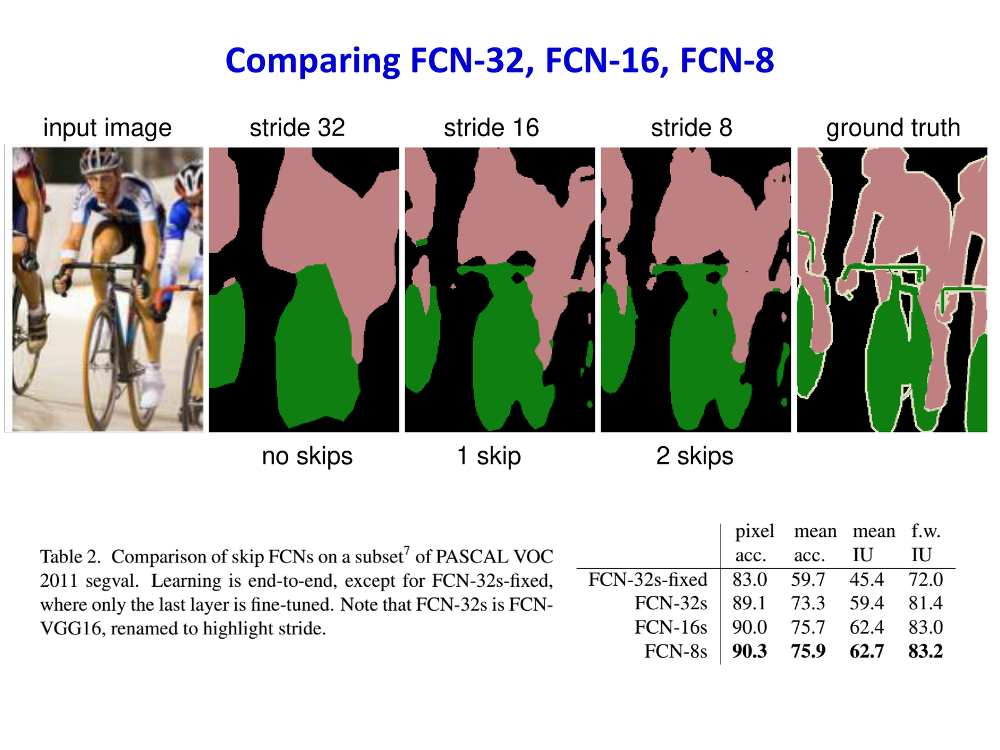{ width="650" }

直观理解：

- **FCN-32s**：只用最深层输出，语义强但边界很粗
- **FCN-16s**：加入 1 次 skip，细节更好
- **FCN-8s**：加入 2 次 skip，边界进一步改善

因此 stride 更小并不只是“分辨率更高”，本质上是：网络在更高分辨率层面保留了更多定位信息。

### 10.5 SegNet：编码器-解码器结构

FCN 之后，一个非常自然的方向是直接设计 **encoder-decoder** 结构。SegNet 就是代表之一。

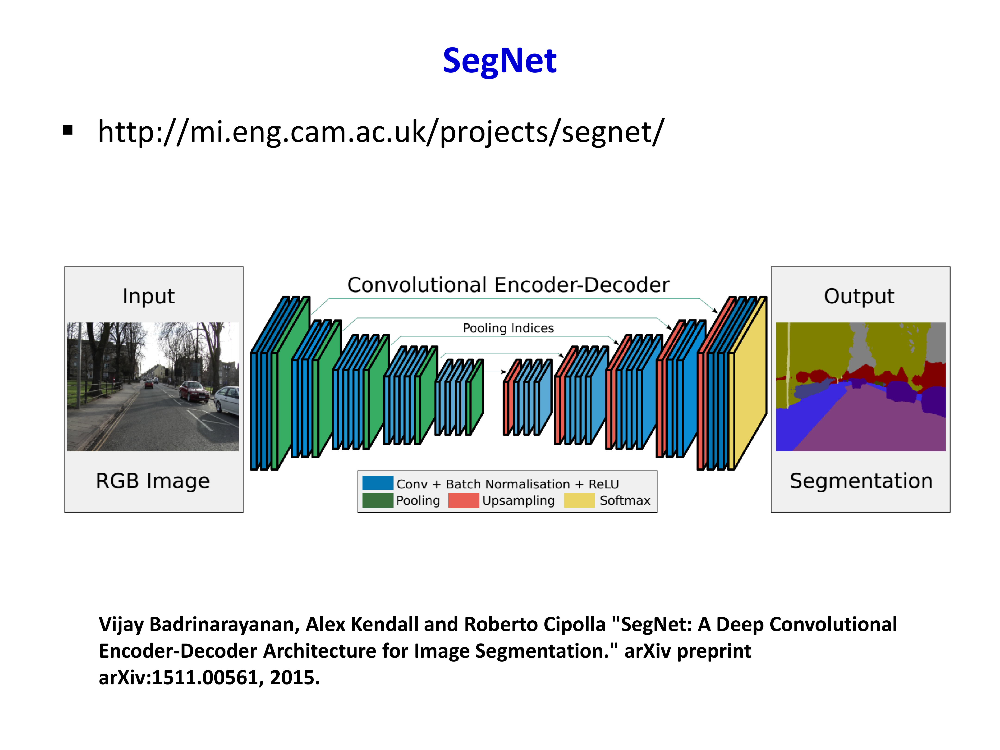{ width="650" }

SegNet 的核心思想是：

- 编码器负责逐步下采样、提取语义特征
- 解码器负责逐步上采样、恢复空间分辨率

与简单插值恢复不同，SegNet 的一个关键设计是保存 pooling indices，并在解码时利用这些索引做 unpooling。这样做的动机是：最大池化时哪些位置“赢了”本身就是一种空间线索，恢复时利用它们能更好保留边界结构。

因此，SegNet 可以理解为“为分割量身定做的对称 CNN 架构”，它比直接从分类网络魔改的 FCN 更有结构化先验。

### 10.6 DeepLab：空洞卷积与多尺度上下文

语义分割还有另一个核心矛盾：如果不断 pooling，下采样会伤害边界；如果不下采样，感受野又可能不够大。DeepLab 的关键突破之一，就是 **atrous convolution（空洞卷积）**。

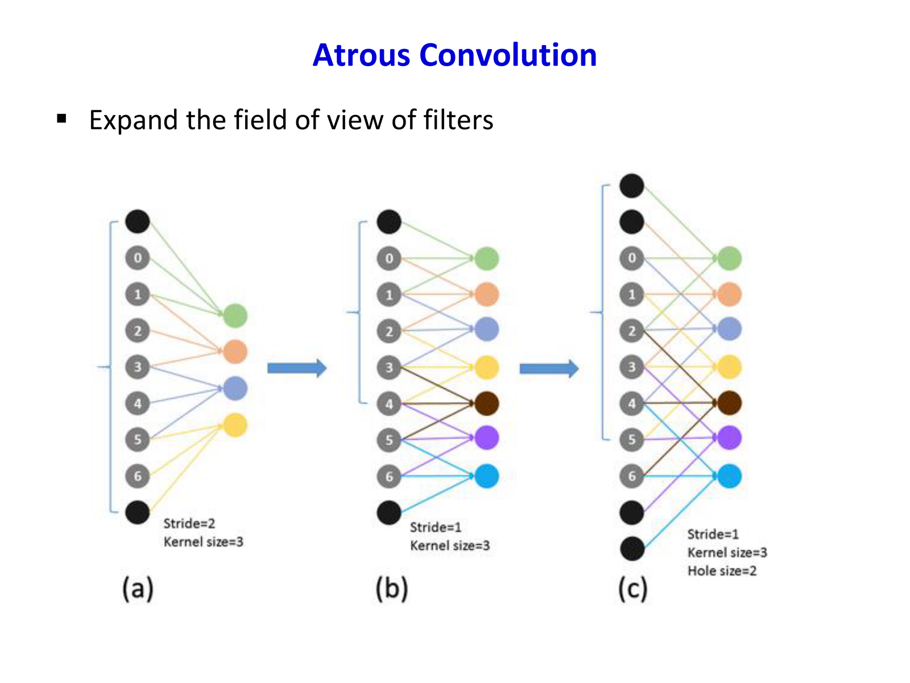{ width="650" }

空洞卷积的本质是：在不显著增加参数量的情况下，把卷积核“稀疏插空”，从而扩大感受野。它的好处是：

- 不必靠更深层或更大 stride 来扩大 receptive field
- 可以在保持较高特征分辨率的同时获得更大上下文

进一步地，DeepLab 引入 ASPP（Atrous Spatial Pyramid Pooling）来显式建模多尺度上下文：

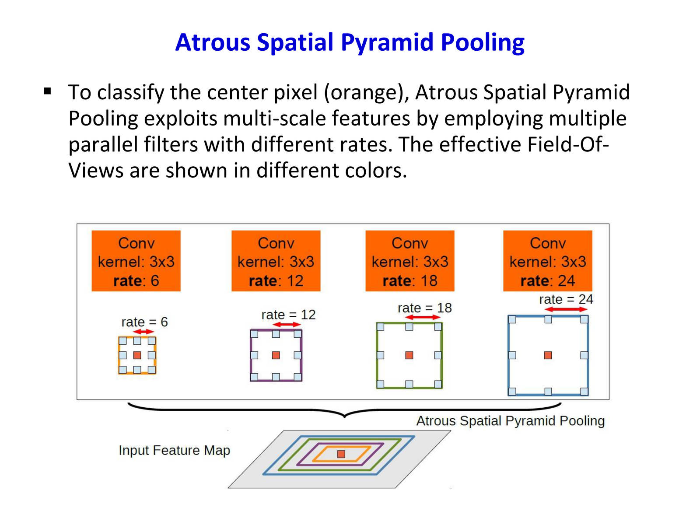{ width="650" }

ASPP 用多个不同 dilation rate 的并行卷积分支同时观察中心像素，从而让网络同时看到“小邻域、中邻域、大邻域”的上下文信息。这对场景分割尤其重要，因为同一个像素的正确标签往往依赖周围大范围语境。

### 10.7 CRF-as-RNN：把结构优化并进神经网络

第一讲已经讲过 CRF / GraphCut 这类结构模型的价值：它们能利用邻域一致性、边缘与上下文来修正粗预测。第二讲里的 CRF-as-RNN，则是在问：

> 能不能把这种后处理本身也做成可微模块，直接嵌到网络里端到端训练？

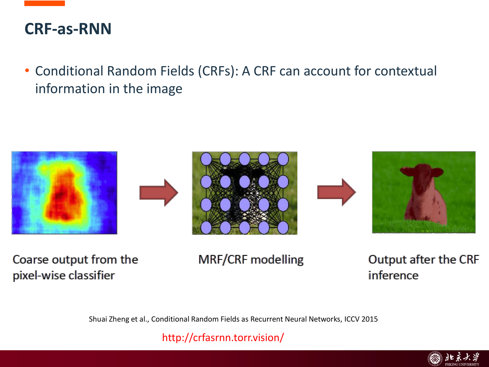{ width="650" }

答案是可以。CRF-as-RNN 把 fully connected CRF 的 mean-field inference 展开成若干轮可微迭代，每轮可看成一个 recurrent block。

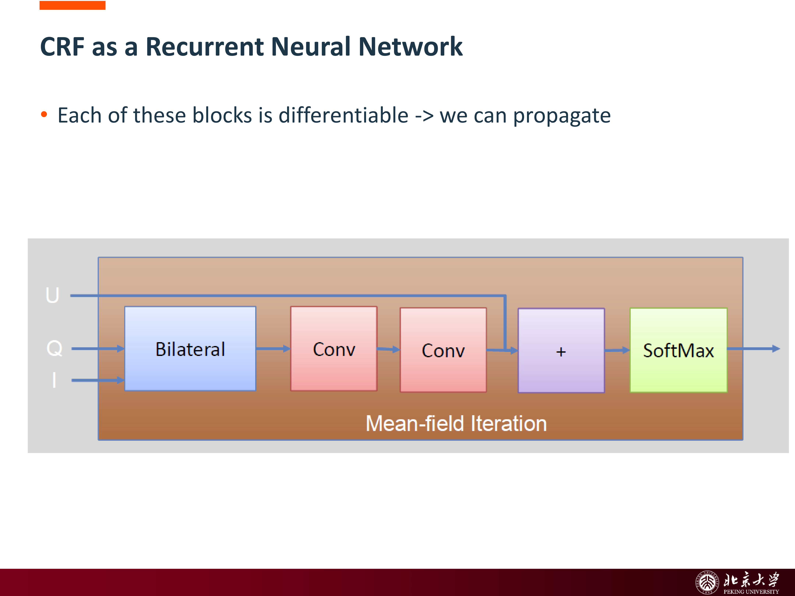{ width="650" }

这一结构通常包含：

- **unary term**：CNN 给出的像素级初始分类分数
- **message passing**：通过 bilateral filtering 等把邻域信息传给每个像素
- **compatibility transform**：学习不同类别之间的相互作用
- **normalization / softmax**：更新每个像素的标签分布

因为每一步都可微，所以整条链路可以反向传播。它的意义不只是“又加了个 RNN”，而是把传统图模型中的结构先验重新包装成了深度学习模块。

### 10.8 从 FCN 到 DeepLab，这条线到底在解决什么

把上面几种方法放在一起，会更容易看出它们的演进关系：

- **FCN**：首先解决“CNN 如何输出像素标签”
- **skip fusion**：解决“深层语义强但定位粗”的问题
- **SegNet**：把分割网络结构化为 encoder-decoder
- **DeepLab**：解决“高分辨率特征与大感受野如何兼得”
- **CRF-as-RNN**：把结构优化和上下文建模并进端到端学习

这一阶段的中心思想可以概括为：**从粗特征图出发，逐步把像素级定位、边界恢复、多尺度上下文和结构先验重新加回来。**

## 11 Instance-Level Methods：从语义分割走向实例分割

语义分割只回答“每个像素属于哪个类别”，但它不区分同类中的不同实例。例如两个人都可能被标成 person，却无法知道谁是谁。

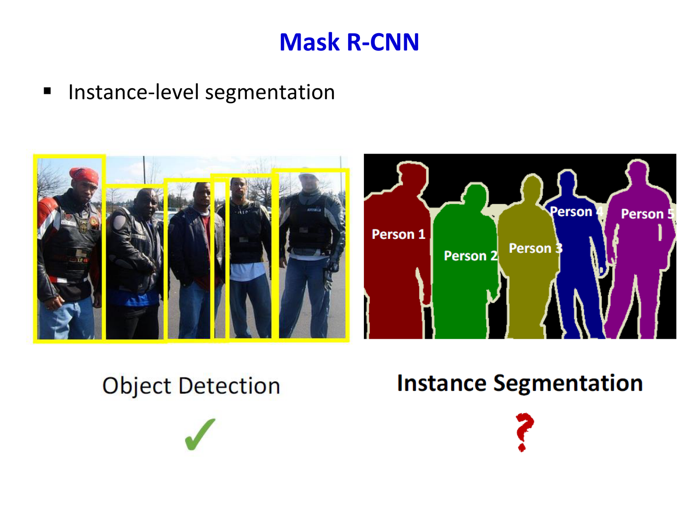{ width="650" }

实例分割的目标则是：既要知道类别，又要知道每个实例的独立 mask。

### 11.1 Mask R-CNN：Faster R-CNN + FCN on RoIs

Mask R-CNN 是第二讲里实例级方法的主角。其核心思想几乎可以一句话概括：

> **Mask R-CNN = Faster R-CNN + FCN on each RoI**

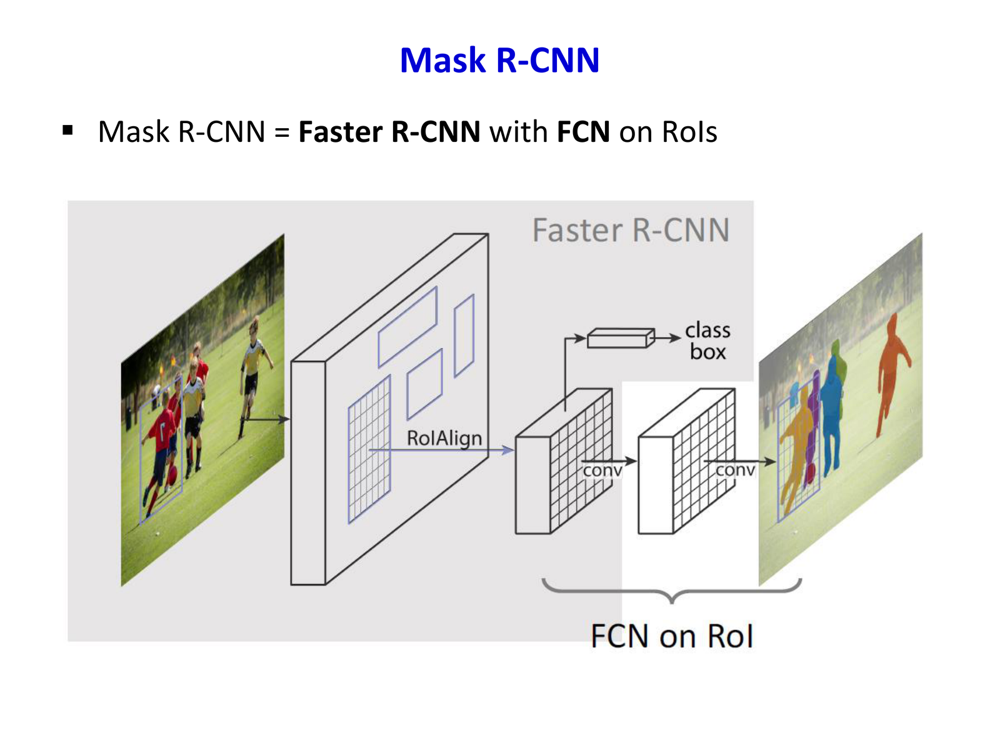{ width="650" }

和 Faster R-CNN 一样，它先检测 proposal / RoI；但在每个 RoI 上，除了分类和框回归，还额外预测一个像素级 mask。

### 11.2 Parallel Heads：为什么 mask 头要并行

Mask R-CNN 的设计要点之一是把三类任务分成并行 head：

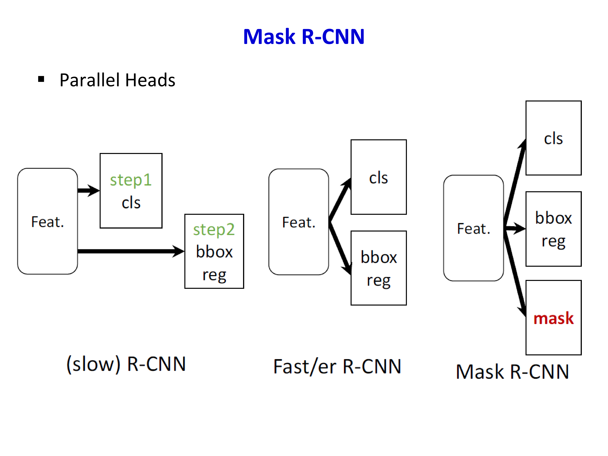{ width="650" }

- 分类 head：判断类别
- bbox regression head：修正框
- mask head：输出 RoI 内的二值分割图

这说明实例分割并不是“检测完再随便补一层”，而是在一个共享 backbone 上并行优化三种互相关联、但目标不同的任务。

### 11.3 RoIAlign：为什么不能再用 RoIPool

Mask R-CNN 中最著名的一个小改动，就是把 RoIPool 换成了 RoIAlign。

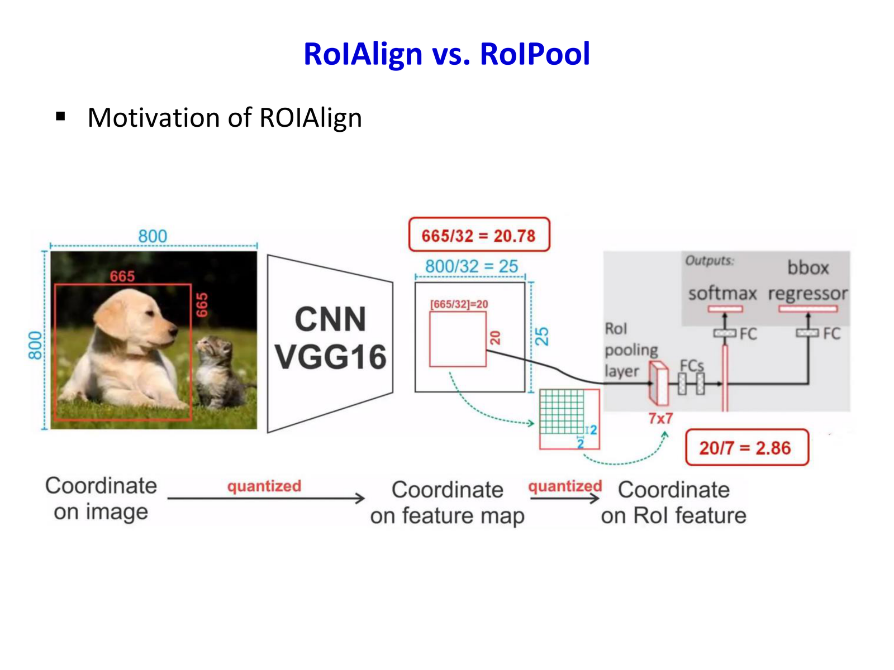{ width="650" }

原因很直接：RoIPool 在把原图坐标映射到 feature map、再映射到固定大小 RoI 特征时，会发生多次量化（quantization）。检测任务对少量对齐误差还能容忍，但 mask 预测是像素级的，边界对不齐会直接损害结果。

RoIAlign 的改进是：

- 不做粗暴取整
- 使用双线性插值在连续坐标上取样

因此它本质上是在减少几何 misalignment。Mask R-CNN 的成功也说明：**实例分割比目标检测更敏感于空间对齐误差。**

### 11.4 与检测模型的关系

第二讲里专门回顾了 detection / segmentation 模型的发展关系。

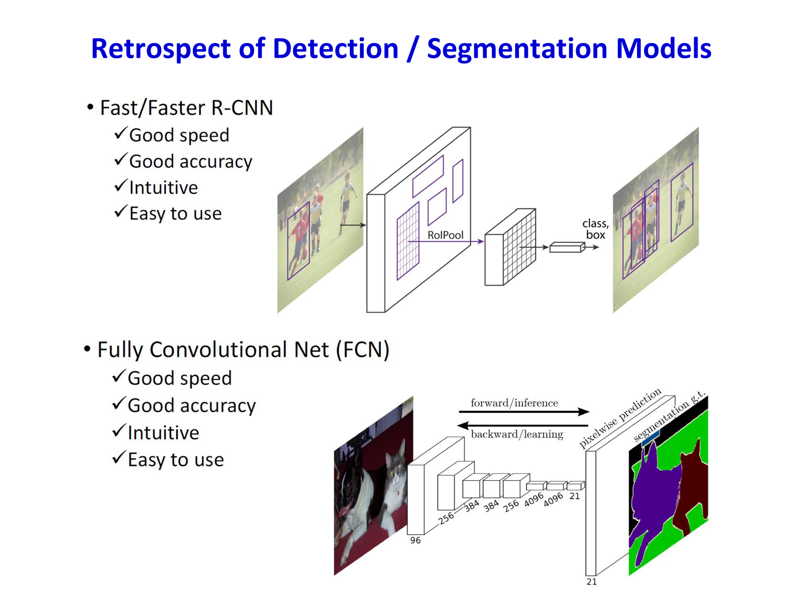{ width="650" }

可以把它理解为两条线最后会合：

- 检测线：R-CNN, Fast/Faster R-CNN
- 分割线：FCN, encoder-decoder, dense prediction

Mask R-CNN 正是这两条线的结合点：检测负责找实例，FCN-style head 负责在实例内部做像素分割。

## 12 Pixel-to-Pixel Generation：Pix2Pix 与 CycleGAN

虽然这部分不再是“传统意义上的语义分割”，但讲义把它们放进 Pixel Computing，是因为它们仍然学习一种 **图像到图像、像素到像素** 的变换。

### 12.1 Pix2Pix：配对监督的图像翻译

Pix2Pix 的设定是：训练数据成对给出输入与目标输出，例如：

- label map $\to$ street scene
- edge map $\to$ photo
- day $\to$ night

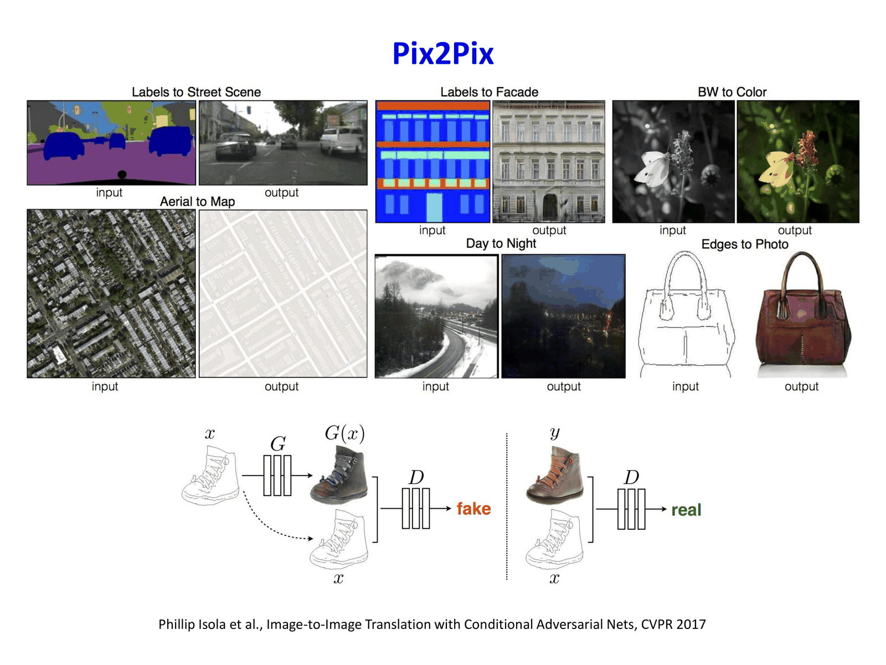{ width="650" }

它通常采用条件 GAN：

- 生成器 $G$：把输入图像翻译成目标域图像
- 判别器 $D$：判断生成结果是否像真实目标域样本

因此 Pix2Pix 的本质，是用“逐像素映射 + 对抗学习”来完成 image-to-image translation。

### 12.2 CycleGAN：无配对翻译

Pix2Pix 的限制是必须有 paired data。但很多任务里并不存在一一对应的配对图像，例如：

- 马 $\leftrightarrow$ 斑马
- 夏天 $\leftrightarrow$ 冬天
- 照片 $\leftrightarrow$ 莫奈画风

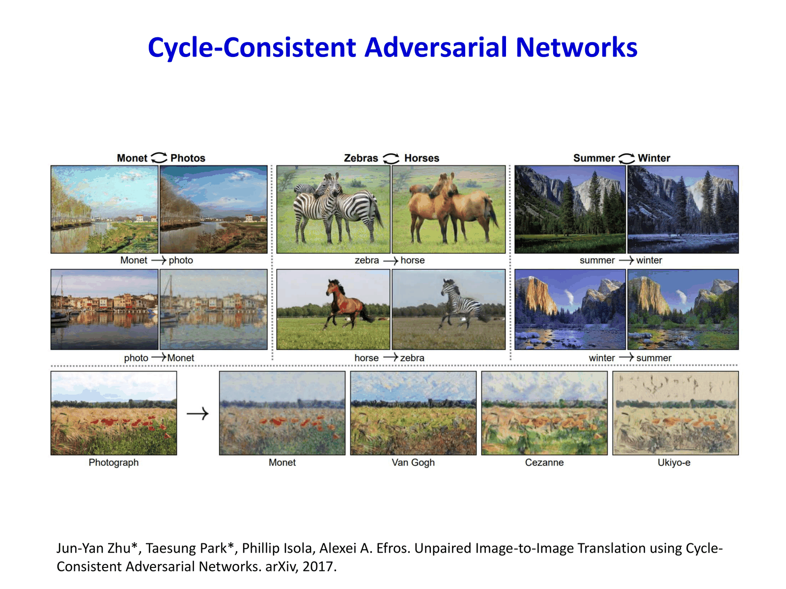{ width="650" }

CycleGAN 的关键就是 **cycle consistency**：

$$
X \xrightarrow{G} Y \xrightarrow{F} X
$$

要求经过两次变换后尽量回到原图。这个约束让“无配对监督”变得可学。

因此从 Pixel Computing 视角看，Pix2Pix / CycleGAN 说明像素级任务不只是在做分类，也可以是在做 **结构化生成与翻译**。

## 13 Human Pose Estimation：关键点也是像素级预测

人体姿态估计的目标是：从单张图像中估计一组预定义的人体关节。

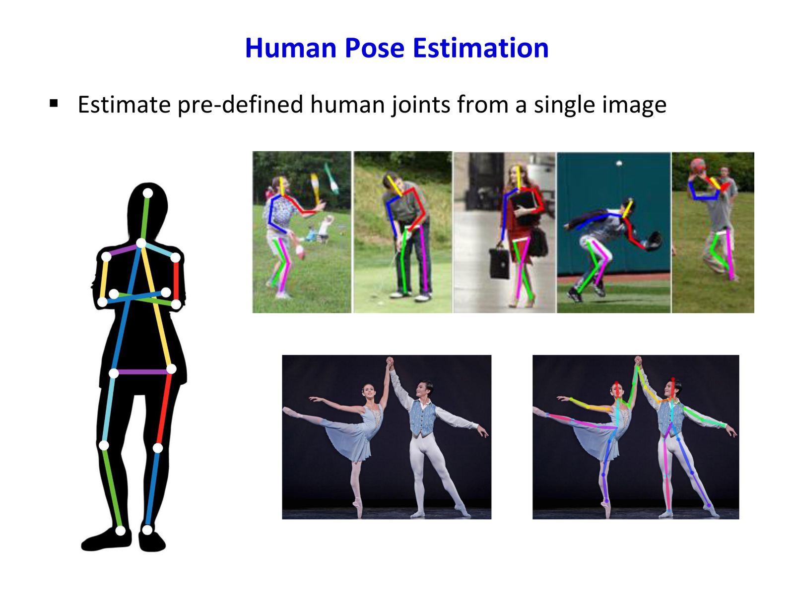{ width="650" }

它看起来不像“分割”，但本质仍是像素级定位问题：网络要在图像平面上找出鼻子、肩膀、肘、腕、髋、膝、踝等关键点的位置。

### 13.1 Bottom-Up：先找所有关节，再做分组

#### OpenPose

OpenPose 是最经典的 bottom-up 方法之一。它使用双分支网络，同时预测：

- **confidence maps / heatmaps**：每种关节可能出现的位置
- **PAFs（Part Affinity Fields）**：连接两个关节的向量场，用于表示“这两个点是否属于同一个人”

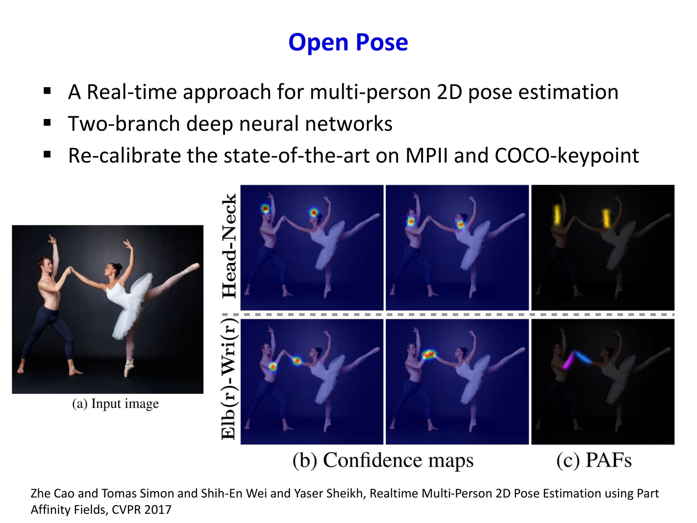{ width="650" }

PAF 的意义尤其关键：

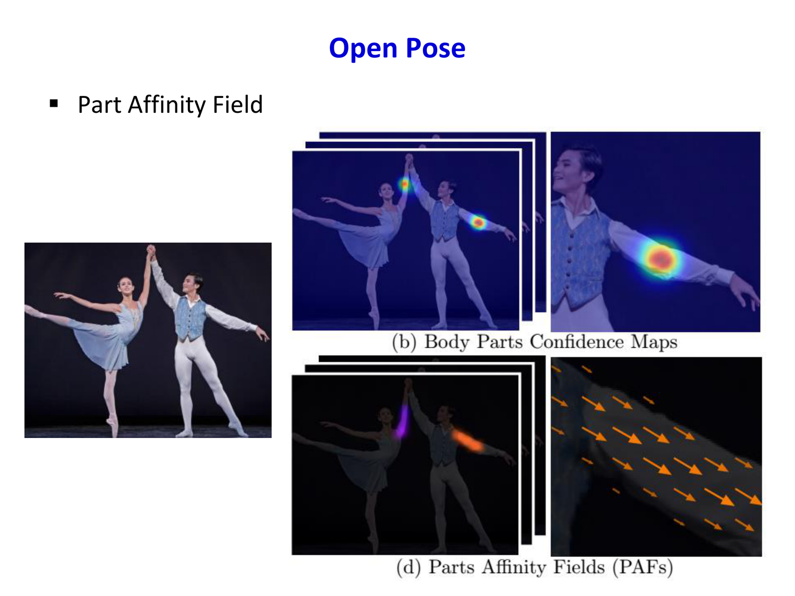{ width="650" }

单独有 heatmap，只能知道“某处可能有左腕、某处可能有右肘”；但多人场景下，不知道这些点该如何拼成一个人。PAF 提供了 limb-level 的连接证据。

OpenPose 的网络通常是多阶段迭代结构：

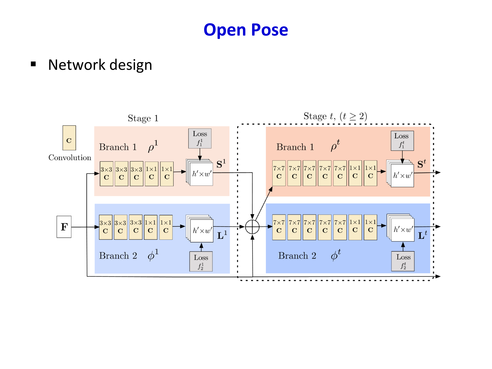{ width="650" }

后续阶段反复细化 heatmap 和 PAF，最后再通过 bipartite matching 等图匹配方法，把关节组装成多人骨架。

#### Associative Embedding

另一类 bottom-up 方法是 Associative Embedding（AE）。它的思路不是学习显式向量场，而是给每个检测到的关节分配一个 **tag / embedding**，同一个人的关节 tag 应该彼此接近，不同人的关节 tag 应该分开。

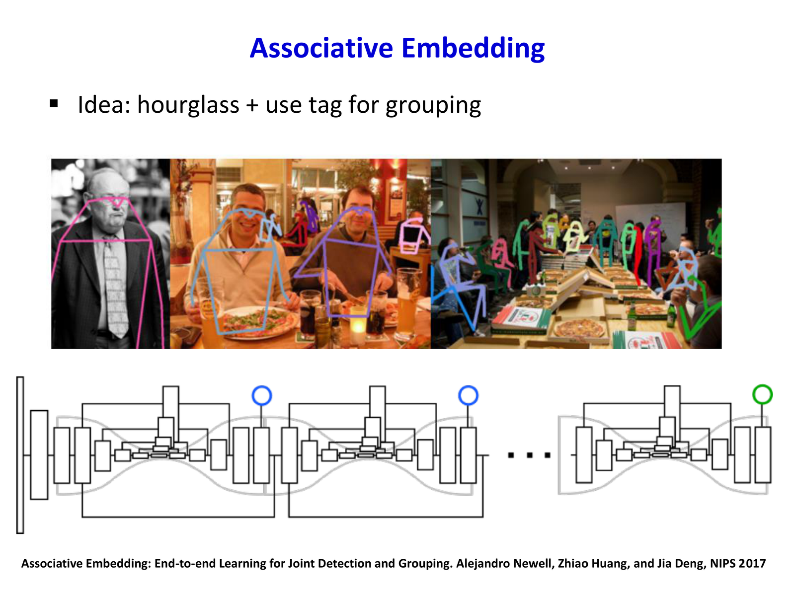{ width="650" }

所以 AE 可以概括为：**joint detection + grouping by learned tags**。

### 13.2 Top-Down：先检测人，再估计单人姿态

Top-down 方法的思路与 bottom-up 相反：

1. 先检测出每个人的 bounding box
2. 对每个 bbox 内的人单独做单人姿态估计

这种方法通常关键点质量更高，因为每次只处理一个人，歧义更小；但速度和检测依赖更明显。

#### Cascaded Pyramid Network（CPN）

CPN 是典型 top-down 方法之一，它特别强调“简单可见关键点”和“困难关键点”的分阶段处理。

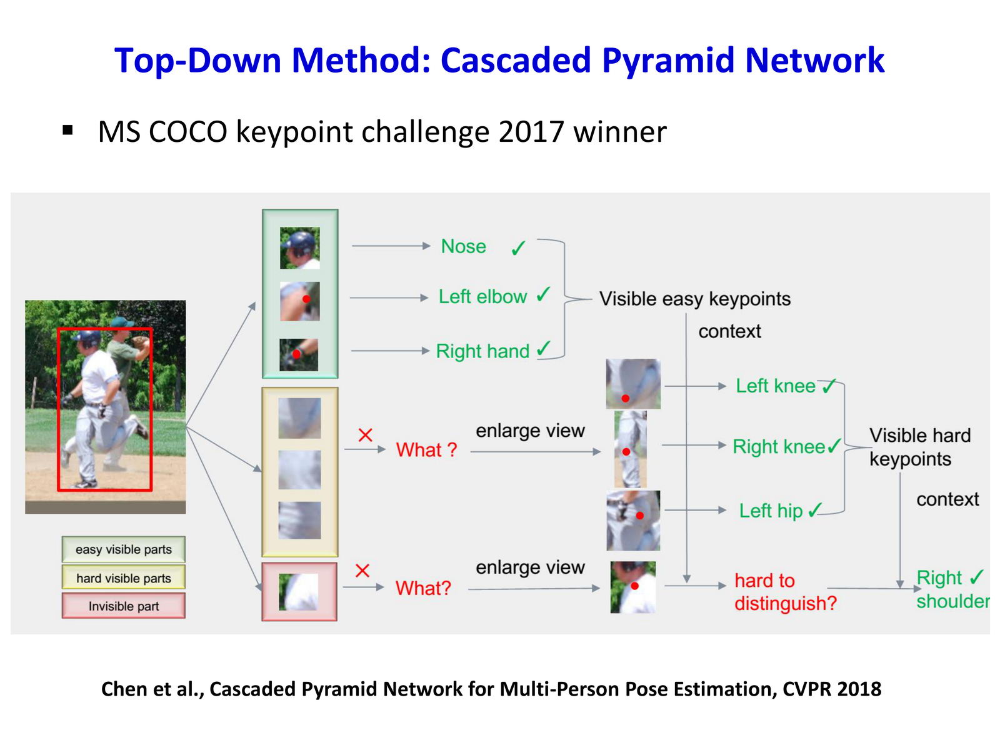{ width="650" }

它的核心思想是：先用全局网络找到明显关键点，再利用上下文和更细特征去修复难点、遮挡点和易混淆点。

#### SimpleBaseline 与 HRNet

讲义后面强调了一个非常重要的结论：**分辨率对于 point-based estimation 极其关键**。

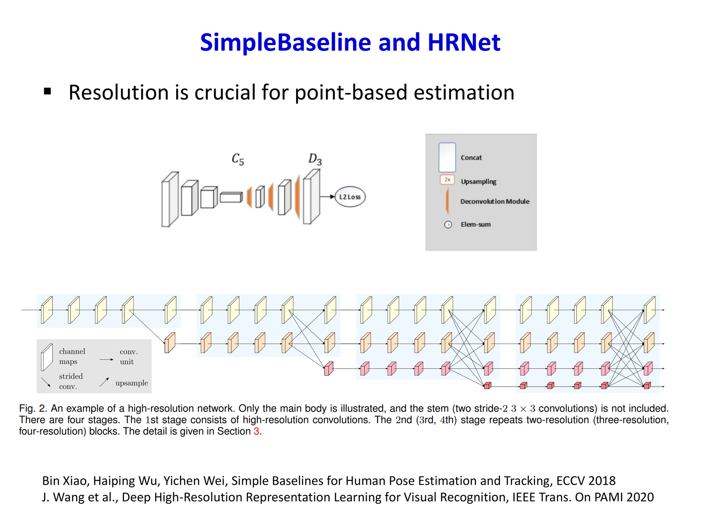{ width="650" }

- **SimpleBaseline**：在分类 backbone 后接若干反卷积层恢复高分辨率 heatmap
- **HRNet**：始终保留高分辨率分支，并与低分辨率分支反复交换信息

它们都在说明一点：关键点估计比分类更依赖高分辨率空间表示，因为输出对象本质上是离散点。

### 13.3 3D Pose Estimation：从 2D 关键点到三维骨架

2D 姿态解决的是图像平面上的关键点，而 3D pose 还要恢复深度维。

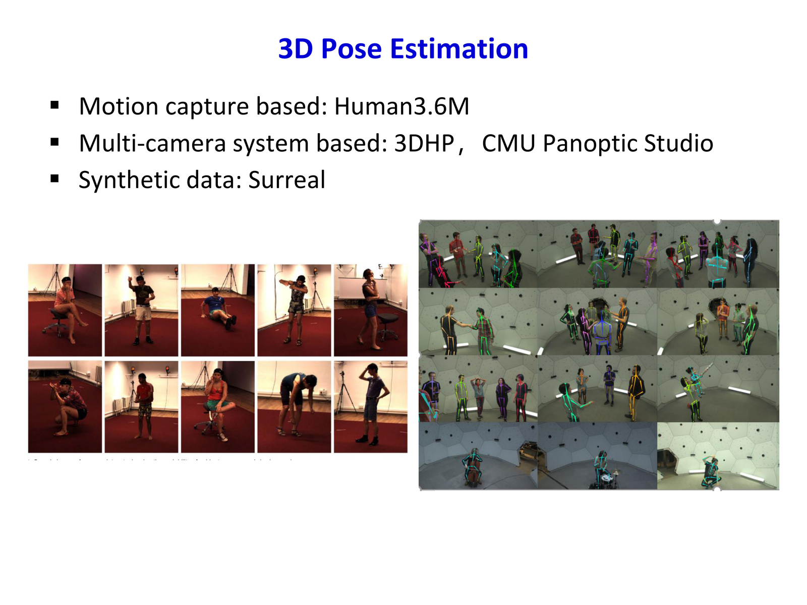{ width="650" }

常见数据来源包括：

- motion capture 数据集，如 Human3.6M
- 多相机系统，如 3DHP、CMU Panoptic Studio
- 合成数据，如 SURREAL

但 3D pose 的难点在于：2D 标注容易获得，3D 标注昂贵稀缺。因此一个重要研究方向是 **利用几何或弱监督把 2D 与 3D 联结起来**。

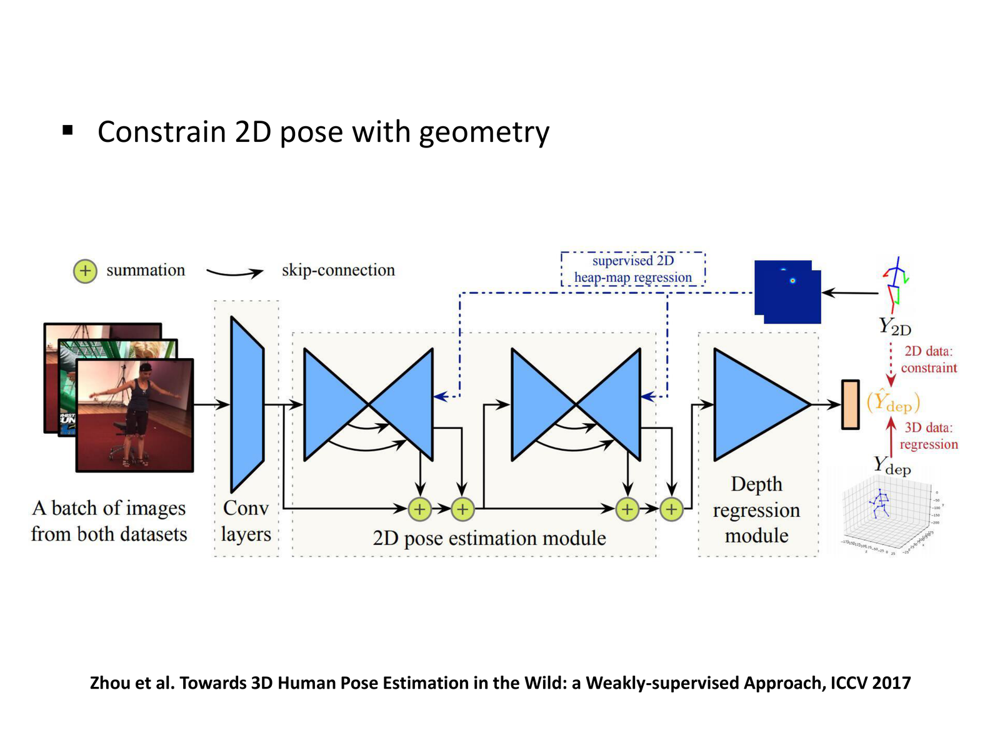{ width="650" }

这类方法常见的逻辑是：

- 用大量 2D 数据训练 2D keypoint / heatmap 模块
- 用少量 3D 数据训练 depth / lifting 模块
- 用人体几何一致性、骨长约束或投影一致性来缩小 2D 到 3D 的歧义

## 14 一个更大的视角：Stacked U-Net is Everywhere

讲义最后专门举了一个跨领域例子：**stacked U-Net is everywhere**。

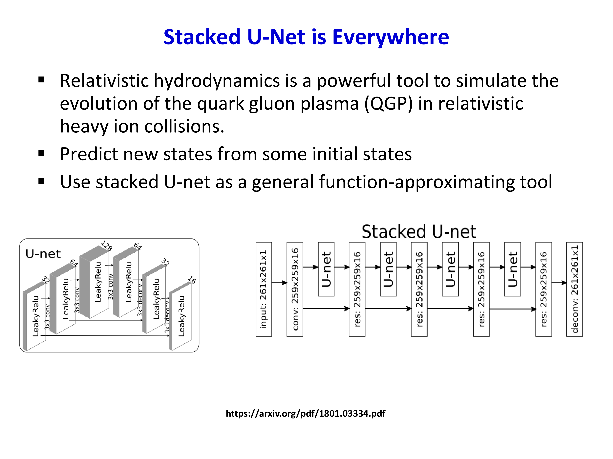{ width="650" }

它想表达的并不是“图像任务只能用 U-Net”，而是：

- 编码器-解码器
- 多尺度融合
- skip connection
- 高分辨率输出

这套思想已经远远超出了语义分割，成为很多密集预测和函数逼近任务的通用结构模板。只要任务目标是“输入一个场，输出另一个空间对齐的场”，U-Net 家族往往都会出现。

## 15 复习与易错点

### 15.1 方法之间的主线关系

- **K-means / Mean Shift**：偏“特征空间聚类”，从像素统计相似性出发。
- **Ncut / GraphCut**：偏“图优化”，显式建模像素之间关系与全局能量。
- **GrabCut / Lazy Snapping**：在 GraphCut 框架中加入交互和颜色模型，强调可用性。
- **Matting / Poisson Matting**：从离散标签升级到连续 $\alpha$，专攻半透明边界。
- **Inpainting / Completion**：关注缺失区域重建，核心是结构与纹理的协调。
- **FCN / SegNet / DeepLab**：把 pixel labeling 交给深度网络端到端学习，逐步解决 coarse output、多尺度上下文和结构细化。
- **CRF-as-RNN**：把传统结构优化嵌进神经网络，使上下文建模与 dense prediction 联合训练。
- **Mask R-CNN**：把 detection 与 FCN-style segmentation 合并，完成 instance-level segmentation。
- **OpenPose / AE / CPN / HRNet**：把像素级预测推广到关键点与骨架估计。

### 15.2 高频易错点

- 把分割当成 matting：二值 mask 无法表达半透明过渡。
- 认为 Mean Shift 无需调参：其实 bandwidth 是关键参数。
- 认为 min-cut 一定合理：会偏向切小块，才需要 Ncut 归一化。
- 以为 FCN 只是“把分类器最后一层换掉”：真正关键还包括上采样、逐像素损失和 skip fusion。
- 误以为空洞卷积只是“更大的卷积核”：它本质是以更低代价扩大感受野。
- 把语义分割和实例分割混为一谈：前者区分类别，后者还要区分同类不同实例。
- 忽略 RoIPool 的量化误差：对 mask 任务会直接带来边界错位，所以 Mask R-CNN 需要 RoIAlign。
- 把 OpenPose 只理解成“多人关键点热图”：它真正解决多人分组问题依赖的是 PAF。
- Inpainting 只重视纹理匹配：若结构线先断裂，后续纹理再好也会“假”。

## 16 考试重点

- **K-means / Mean Shift / Ncut** 的建模差异
- **GraphCut / GrabCut / Lazy Snapping** 的核心思想
- **Matting 方程** $I=\alpha F+(1-\alpha)B$ 及其欠定性
- **Poisson Matting** 的梯度域思路
- **FCN**：全卷积、上采样、skip fusion、FCN-32/16/8
- **IoU**：$\mathrm{TP}/(\mathrm{TP}+\mathrm{FP}+\mathrm{FN})$
- **SegNet / DeepLab**：encoder-decoder、atrous convolution、ASPP
- **CRF-as-RNN**：把结构优化写成可微迭代
- **Mask R-CNN**：instance segmentation、parallel heads、RoIAlign
- **OpenPose / Associative Embedding / CPN / HRNet**：bottom-up vs top-down 的区别
