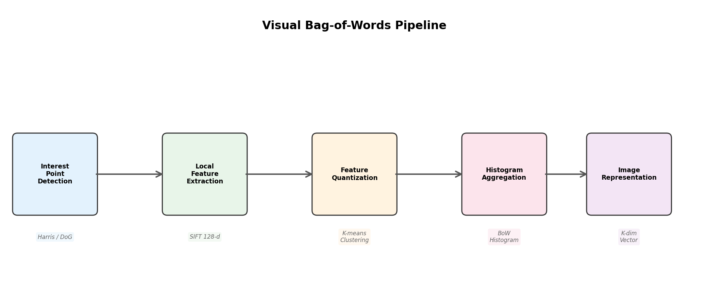
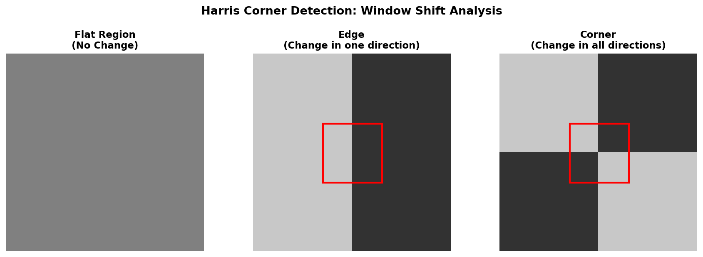
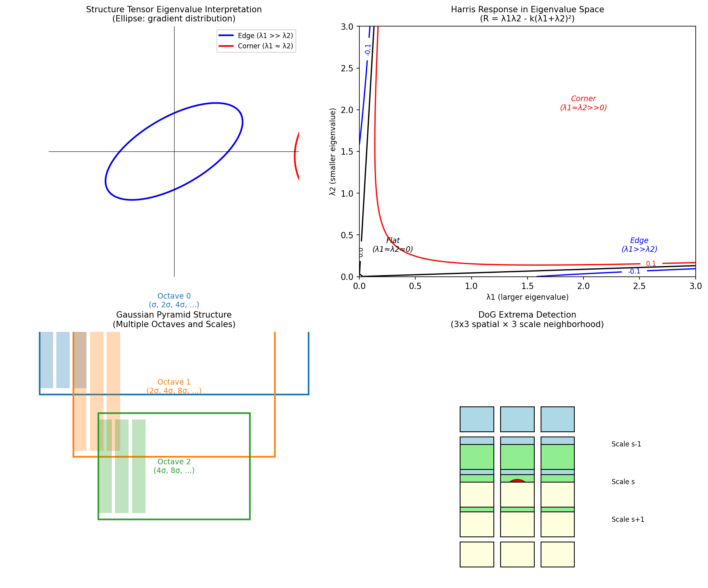
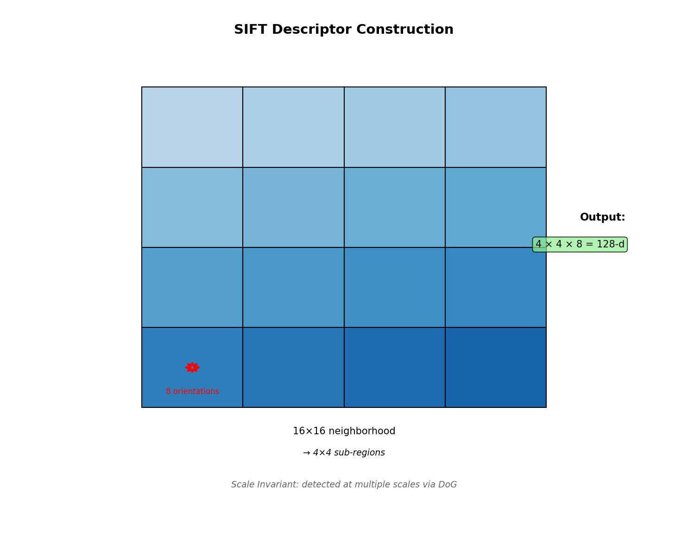
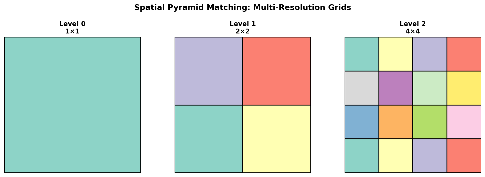
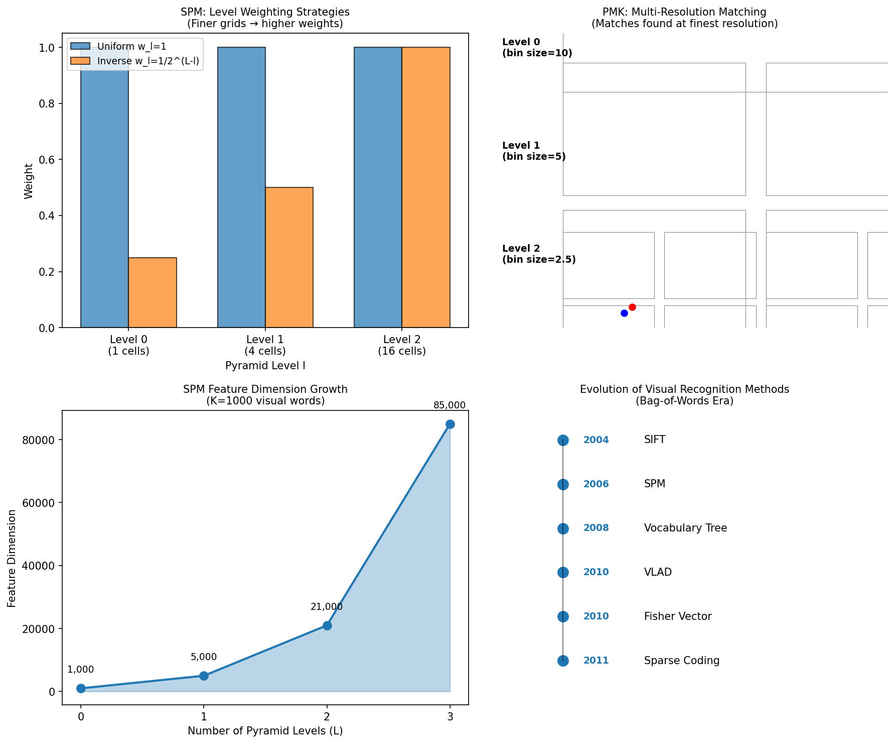
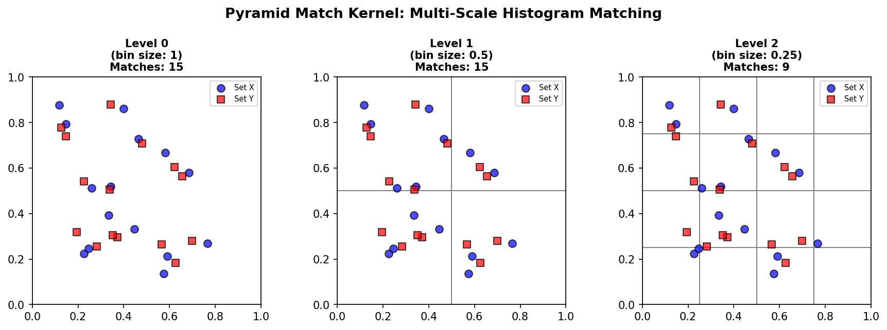
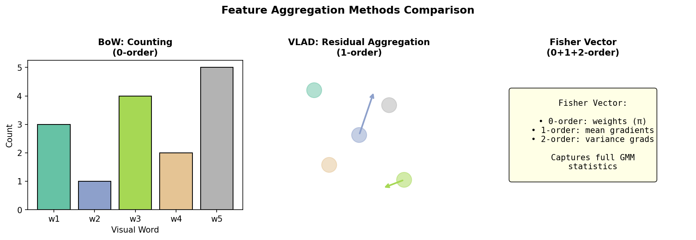
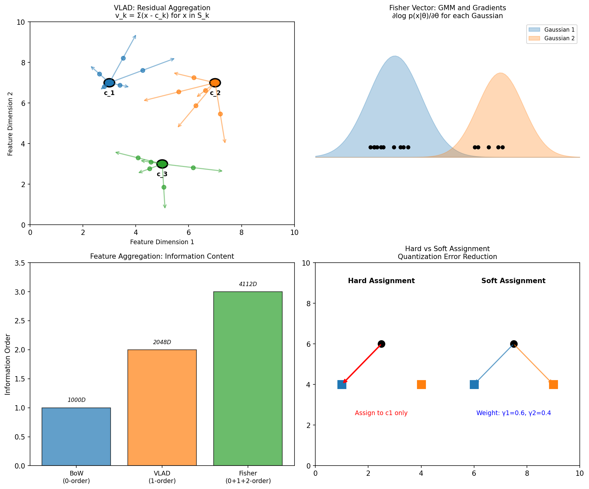

## 1 视觉识别概述

### 1.1 任务定义与挑战

图像分类（Image Classification）是计算机视觉的核心任务：给定一张图像 $I \in \mathbb{R}^{H \times W \times C}$，判断其中是否包含特定类别的物体，输出二元标签 $y \in \{0, 1\}$。

!!! abstract "定义 1.1（图像分类）"
    给定图像 $I$ 和类别集合 $\mathcal{C} = \{c_1, c_2, ..., c_K\}$，图像分类任务是学习一个映射函数：

    $$
    f: \mathbb{R}^{H \times W \times C} \rightarrow \{0, 1\}^K
    $$

    其中输出是 $K$ 维二元向量，表示每个类别的存在性。

!!! warning "语义鸿沟（Semantic Gap）"
    计算机看到的像素值与人类理解的语义之间存在巨大差距：

    - 像素级别的数值表示难以直接映射到高层语义概念
    - 相同的物体在不同条件下（光照、姿态、尺度）呈现截然不同的像素分布
    - 背景变化、遮挡、形变等因素进一步加剧了这一差距

### 1.2 视觉变化的挑战

视觉识别面临多种变化因素，这些变化使得基于模板匹配的方法难以奏效：

**几何变化**：

- 尺度变化（Scale）：物体在图像中的大小差异，需要尺度不变性
- 旋转变化（Rotation）：物体不同朝向，需要旋转不变性
- 视角变化（Viewpoint）：相机视角改变导致投影变形，需要视角鲁棒性

**外观变化**：

- 光照变化（Illumination）：阴影、反光、不同光源导致颜色/亮度变化
- 形变（Deformation）：非刚性物体的形状变化（如人体姿态）
- 遮挡（Occlusion）：部分物体被其他物体遮挡

**语义复杂性**：

- 粒度问题（Granularity）：识别可以在不同粒度上进行（如"狗"vs"哈士奇"）
- 上下文依赖（Context）：复杂概念的理解需要结合场景上下文

### 1.3 视觉识别的历史发展

!!! info "主要数据集与挑战"
    - Caltech-101/256（2004-2007）：早期对象识别数据集，101/256类
    - PASCAL VOC（2005-2012）：20类物体检测与分类，奠定评估标准
    - ImageNet ILSVRC（2010-2017）：1000类大规模识别，推动深度学习革命
    - YFCC100M（多媒体领域）：1亿带标签图像，用于图像标注研究

---

## 2 Bag-of-Words 模型

### 2.1 从文本到图像的映射

Bag-of-Words（BoW）模型起源于自然语言处理，核心思想是将文档表示为单词的集合（multiset），忽略语法和词序，但保留词频信息。

!!! abstract "定义 2.1（Bag-of-Words 模型）"
    给定文档 $D$ 和词汇表 $\mathcal{V} = \{w_1, w_2, ..., w_V\}$，文档的 BoW 表示为向量：

    $$
    \mathbf{h} = [h_1, h_2, ..., h_V]^T \in \mathbb{R}^V
    $$

    其中 $h_i = \text{count}(w_i \in D)$ 是词汇 $w_i$ 在文档中出现的次数。

**视觉 BoW 的类比**：

| 文本分析 | 视觉分析 |
|----------|----------|
| 文档（Document） | 图像（Image） |
| 单词（Word） | 局部特征描述子（Local Descriptor） |
| 词汇表（Vocabulary） | 视觉码本（Visual Codebook） |
| 词频直方图 | 视觉词频直方图 |

### 2.2 视觉 BoW 的核心假设

!!! tip "局部性假设（Locality Assumption）"
    相似性是局部的：两幅图像整体相似，是因为它们在局部区域具有相似的视觉模式。即全局相似性可以通过局部特征的统计分布来刻画。

构建视觉 BoW 模型的完整流程包含四个阶段：

1. 兴趣点检测（Interest Point Detection）：识别图像中具有区分性的位置
2. 局部特征提取（Local Feature Extraction）：在兴趣点周围计算描述子
3. 视觉词典学习（Codebook Learning）：聚类特征得到视觉词汇
4. 特征量化与聚合（Quantization & Aggregation）：统计视觉词频直方图

{ width="550" }

### 2.3 BoW 的数学表述

!!! abstract "定义 2.2（视觉 BoW 表示）"
    给定图像 $I$、局部特征集合 $\mathcal{X} = \{x_1, x_2, ..., x_N\}$（其中 $x_i \in \mathbb{R}^d$），以及视觉码本 $\mathcal{C} = \{c_1, c_2, ..., c_K\}$（$c_k \in \mathbb{R}^d$）：

    硬分配量化函数：

    $$
    q(x) = \arg\min_{k \in \{1, ..., K\}} \|x - c_k\|_2$$

    BoW 特征向量（归一化直方图）：

    $$
    h_k = \frac{1}{N} \sum_{i=1}^{N} \mathbb{1}[q(x_i) = k], \quad k = 1, ..., K$$

    最终表示为 $\mathbf{h} = [h_1, h_2, ..., h_K]^T \in \mathbb{R}^K$，通常进行 L2 归一化：$\mathbf{h} \leftarrow \mathbf{h} / \|\mathbf{h}\|_2$。

---

## 3 兴趣点检测

### 3.1 什么是好的兴趣点

!!! abstract "定义 3.1（兴趣点/关键点）"
    兴趣点是图像中具有视觉独特性（Visual Uniqueness）的局部区域，应具备以下特性：

    - 可区分性：局部区域内包含丰富的纹理/结构信息
    - 不变性：对光照变化、视角变化、尺度变化具有鲁棒性
    - 稳定性：在相同场景的不同图像中可重复检测
    - 局部性：只关注关键点周围的小邻域，对遮挡鲁棒

### 3.2 Harris 角点检测器

Harris 角点检测器由 Chris Harris 和 Mike Stephens 于 1988 年提出，是计算机视觉中最经典的兴趣点检测算法之一。它基于 Moravec 算子的核心思想：好的角点应该在任何方向移动窗口时都导致外观的显著变化。

!!! info "Moravec 算子的原始思想"
    Moravec (1980) 最早提出通过窗口移动时的强度变化来检测角点：

    - 在平坦区域，窗口向任何方向移动都几乎没有强度变化
    - 在边缘区域，窗口沿边缘方向移动变化小，垂直于边缘方向移动变化大
    - 在角点区域，窗口向任何方向移动都产生大的强度变化

Harris 和 Stephens 改进了 Moravec 的方法，主要贡献包括：

1. **引入结构张量**：用梯度信息构建二阶矩矩阵，更精确地刻画局部强度变化
2. **避免方向离散化**：Moravec 只考虑 8 个固定方向的移动，Harris 使用二次型近似任意方向的变化
3. **特征值分析**：通过矩阵特征值判断区域类型（平坦/边缘/角点）
4. **计算效率**：用行列式和迹的运算避免显式计算特征值

这使得 Harris 检测器具有更好的旋转不变性和定位精度，成为后续许多视觉算法的基础。

#### 3.2.1 数学推导

考虑图像 $I(x, y)$ 和以 $(x, y)$ 为中心的窗口 $W$，当窗口向 $(u, v)$ 偏移时，强度变化为：

$$
E(u, v) = \sum_{(x,y) \in W} w(x, y) [I(x+u, y+v) - I(x, y)]^2$$

对 $I(x+u, y+v)$ 进行一阶泰勒展开：

$$
I(x+u, y+v) \approx I(x, y) + u I_x + v I_y$$

其中 $I_x = \frac{\partial I}{\partial x}$，$I_y = \frac{\partial I}{\partial y}$ 是图像梯度。代入得：

$$
E(u, v) \approx \sum_{(x,y) \in W} w(x, y) [u I_x + v I_y]^2 = \begin{bmatrix} u & v \end{bmatrix} M \begin{bmatrix} u \\ v \end{bmatrix}$$

!!! abstract "定义 3.2（结构张量/二阶矩矩阵）"
    结构张量（Structure Tensor）$M$ 定义为：

    $$
    M = \sum_{(x,y) \in W} w(x, y) \begin{bmatrix} I_x^2 & I_x I_y \\ I_x I_y & I_y^2 \end{bmatrix}$$

    其中 $w(x, y)$ 通常是高斯权重窗口。

#### 3.2.2 特征值分析

矩阵 $M$ 是对称正定矩阵，可以进行特征值分解 $M = R^{-1} \text{diag}(\lambda_1, \lambda_2) R$，其中 $\lambda_1 \geq \lambda_2 \geq 0$ 是特征值。

!!! info "特征值的几何意义"
    - $\lambda_1, \lambda_2$ 分别代表梯度变化最大和最小的方向的强度
    - 特征向量指示变化的主方向

**基于特征值的区域分类**：

| 情况 | 特征值条件 | 图像区域类型 |
|------|-----------|-------------|
| 平坦区域 | $\lambda_1 \approx \lambda_2 \approx 0$ | 无明显纹理，所有方向变化小 |
| 边缘 | $\lambda_1 \gg \lambda_2 \approx 0$ | 沿边缘方向变化小，垂直方向变化大 |
| 角点 | $\lambda_1 \approx \lambda_2 \gg 0$ | 所有方向变化都大，且相近 |

#### 3.2.3 Harris 响应函数

直接计算特征值需要开方运算，Harris 提出响应函数避免显式计算特征值。

### 算法 3.1（Harris 角点检测）

$$
\begin{aligned}
& \textbf{算法: } \text{HarrisCornerDetection} \\
& \textbf{输入: } \text{灰度图像 } I, \text{ 高斯窗口参数 } \sigma, \text{ 阈值 } t, \text{ 敏感因子 } k \\
& \textbf{输出: } \text{角点位置集合 } C \\
& 1. \quad \text{计算图像梯度 } I_x, I_y \\
& 2. \quad \text{计算二阶矩矩阵分量：} I_{xx} = I_x^2, I_{yy} = I_y^2, I_{xy} = I_x I_y \\
& 3. \quad \text{用高斯窗口 } G_\sigma \text{ 平滑：} M_{xx} = G_\sigma * I_{xx}, M_{yy} = G_\sigma * I_{yy}, M_{xy} = G_\sigma * I_{xy} \\
& 4. \quad \textbf{for } \text{每个像素 } (x, y) \textbf{ do} \\
& 5. \quad \quad M = \begin{bmatrix} M_{xx} & M_{xy} \\ M_{xy} & M_{yy} \end{bmatrix} \\
& 6. \quad \quad \det(M) = M_{xx} M_{yy} - M_{xy}^2 \\
& 7. \quad \quad \text{tr}(M) = M_{xx} + M_{yy} \\
& 8. \quad \quad R = \det(M) - k \cdot \text{tr}^2(M) \\
& 9. \quad \quad \textbf{if } R > t \textbf{ then} \text{ 标记为候选角点} \\
& 10. \quad \textbf{end for} \\
& 11. \quad \text{非极大值抑制（NMS）} \\
& 12. \quad \textbf{return } C
\end{aligned}
$$

!!! info "Harris 响应函数的等价形式"
    利用 $\det(M) = \lambda_1 \lambda_2$ 和 $\text{tr}(M) = \lambda_1 + \lambda_2$：

    $$
    R = \lambda_1 \lambda_2 - k (\lambda_1 + \lambda_2)^2$$

    当 $k = 0.04 \sim 0.06$ 时，$R > 0$ 表示角点，$R < 0$ 表示边缘，$|R|$ 小表示平坦区域。

!!! tip "Shi-Tomasi 改进"
    Shi 和 Tomasi 提出更简单的角点度量：$R = \min(\lambda_1, \lambda_2)$。只有当两个特征值都大于阈值时才认为是角点，效果更好。

{ width="550" }

{ width="550" }

### 3.3 尺度空间与 DoG 检测器

!!! warning "Harris 检测器的尺度敏感性问题"
    Harris 角点检测器存在一个根本局限：它对图像尺度变化非常敏感。这意味着当图像被放大或缩小时，检测到的角点位置和数量会发生显著变化。

**尺度敏感性的原因**：

1. **固定窗口大小**：Harris 检测器使用固定大小的窗口 $W$ 计算结构张量。当图像尺度变化时，窗口覆盖的物理区域随之变化
    - 图像放大时：固定窗口只能覆盖原图的局部区域，可能错过更大尺度的角点结构
    - 图像缩小时：固定窗口覆盖过多像素，细节被平滑，角点响应减弱

2. **梯度计算的尺度依赖性**：图像梯度 $I_x, I_y$ 依赖于像素间距。当图像尺度变化时，相同物理边缘的梯度强度会改变

3. **高斯平滑的尺度固定**：结构张量中的权重窗口 $w(x,y)$ 通常使用固定标准差的高斯核，无法适应不同尺度的特征

**具体表现**：

| 场景 | Harris 检测结果 | 问题 |
|------|----------------|------|
| 原图 | 在门窗角落、纹理丰富区域检测到角点 | 正常工作 |
| 放大2倍 | 原角点位置可能分裂为多个响应，或检测不到 | 窗口过小，无法捕捉整体结构 |
| 缩小2倍 | 大量角点丢失，只剩最强响应 | 窗口过大，细节被平滑 |

这使得 Harris 检测器无法匹配不同尺度图像中的同一物理位置，严重限制了它在实际应用中的鲁棒性。

**解决方案思路**：

为解决尺度敏感性问题，需要：

1. 在不同尺度（不同分辨率）上分别检测特征
2. 找到在各个尺度上都能稳定存在的特征点
3. 为每个特征点分配一个特征尺度，使得在该尺度下检测效果最佳

这正是尺度空间理论（Scale-Space Theory）和 SIFT 算法的核心思想。

#### 3.3.1 尺度空间理论

!!! abstract "定义 3.3（尺度空间）"
    图像 $I(x, y)$ 的尺度空间表示 $L(x, y, \sigma)$ 是通过高斯核卷积得到的：

    $$
    L(x, y, \sigma) = G(x, y, \sigma) * I(x, y)$$

    其中高斯核 $G(x, y, \sigma) = \frac{1}{2\pi\sigma^2} e^{-\frac{x^2 + y^2}{2\sigma^2}}$，$\sigma$ 是尺度参数，控制平滑程度。

#### 3.3.2 LoG 与 DoG

Laplacian of Gaussian（LoG）是尺度不变的 blob 检测器：

$$\text{LoG} = \nabla^2 G = \frac{\partial^2 G}{\partial x^2} + \frac{\partial^2 G}{\partial y^2}$$

!!! abstract "定义 3.4（DoG 近似 LoG）"
    Difference of Gaussians（DoG）是 LoG 的高效近似：

    $$
    \begin{aligned}
    G(x, y, k\sigma) - G(x, y, \sigma) &\approx (k-1)\sigma^2 \nabla^2 G \\
    &\propto \text{LoG}
    \end{aligned}$$

    证明：对 $G$ 在 $\sigma$ 处进行泰勒展开，$G(k\sigma) \approx G(\sigma) + (k-1)\sigma \frac{\partial G}{\partial \sigma}$。又因为 $\frac{\partial G}{\partial \sigma} = \sigma \nabla^2 G$，所以得证。

#### 3.3.3 SIFT 的兴趣点检测（Lowe, IJCV 2004）

SIFT 检测与后续描述均在尺度空间上完成。Lowe 论文将算法分为四步：尺度空间极值检测、关键点定位与筛选、方向赋值、描述子生成。

!!! info "原始文献"
    David G. Lowe, "Distinctive Image Features from Scale-Invariant Keypoints," *International Journal of Computer Vision*, 60(2):91–110, 2004.

**1）尺度空间金字塔与 DoG**

!!! info "什么是 Octave？"
    在音乐中，一个 octave（八度）表示频率翻倍。在尺度空间中，octave 表示图像尺度翻倍（即图像被下采样为原来的一半分辨率）。SIFT 通过构建多个 octave 来覆盖不同的尺度范围。

**尺度空间金字塔的构建过程**：

将原始图像与高斯核卷积得到 $L(x,y,\sigma)$，然后按 octave 组织成金字塔结构。

**每一层 octave 的构建细节**：

假设每 octave 采样 $s$ 层（如 $s=3$），则相邻尺度比为：
$$k = 2^{1/s}$$

例如当 $s=3$ 时，$k = 2^{1/3} \approx 1.26$，即每一层的 $\sigma$ 是前一层的 1.26 倍。

**为什么要取 $s+3$ 张高斯图？**

| 图像索引 | 尺度 $\sigma$ | 用途 |
|---------|-------------|------|
| 0 | $\sigma_0$ | 与第 1 张计算 DoG |
| 1 | $k\sigma_0$ | 与第 0、2 张计算 DoG（中间层） |
| 2 | $k^2\sigma_0$ | 与第 1、3 张计算 DoG（中间层） |
| 3 | $k^3\sigma_0 = 2\sigma_0$ | 与第 2、4 张计算 DoG（中间层） |
| 4 | $k^4\sigma_0$ | 与第 3 张计算 DoG，下采样为下一 octave 的第 0 张 |
| 5 | $k^5\sigma_0$ | 与第 4 张计算 DoG |

- $s$ 张用于产生有效的 DoG 层（可在 3D 空间找极值）
- 额外的 3 张是为了保证 octave 之间的连续性，并为下一 octave 提供高斯模糊的起点

**Octave 之间的下采样**：

第 4 张图像的尺度 $k^3\sigma_0 = 2\sigma_0$ 正好对应尺度翻倍。将其下采样一半分辨率，作为下一个 octave 的第 0 张（其有效尺度变为 $\sigma_0$），这样可以高效地覆盖更大尺度范围。

**差分高斯（DoG）的计算**：

对每一 octave 内的相邻高斯图求差：

$$D(x,y,\sigma) = L(x,y,k\sigma) - L(x,y,\sigma)$$

$$
D(x,y,\sigma) = L(x,y,k\sigma) - L(x,y,\sigma)$$

DoG 在尺度轴上近似 $\sigma^2 \nabla^2 G$ 的响应，用于检测 blob 状结构。极值搜索仅在中间若干张 DoG 上进行（首尾尺度缺少完整邻域）。

**2）三维邻域极值检测**

对 DoG 中每个体素，与其同尺度 8 邻域及相邻两尺度各 9 邻域共 26 个邻居比较；若为严格极大或极小，则作为候选关键点。

**3）亚像素位置与尺度精炼**

在 $(x,y,\sigma)$ 处对 $D$ 做泰勒展开至二阶：

$$
D(\mathbf{x}) \approx D + \frac{\partial D^T}{\partial \mathbf{x}}\mathbf{x} + \frac{1}{2}\mathbf{x}^T \frac{\partial^2 D}{\partial \mathbf{x}^2}\mathbf{x}$$

其中 $\mathbf{x} = (x, y, \sigma)^T$。令 $\partial D/\partial \mathbf{x} = \mathbf{0}$ 解出亚像素偏移 $\hat{\mathbf{x}}$；若任一分量绝对值超过 0.5，则迭代或舍弃。同时可剔除 $|D(\hat{\mathbf{x}})|$ 过小的响应（低对比度点）。

**4）边缘响应抑制（DoG 上的 Hessian）**

DoG 在细长边缘上也会产生强响应。Lowe 在 DoG 响应 $D$ 上计算 Hessian：

$$
H = \begin{bmatrix} D_{xx} & D_{xy} \\ D_{xy} & D_{yy} \end{bmatrix}$$

设主曲率比为 $\alpha = \lambda_{\max}/\lambda_{\min}$。利用迹与行列式避免显式求特征值：若

$$
\frac{\text{Tr}(H)^2}{\text{Det}(H)} < \frac{(r+1)^2}{r}$$

其中 $r$ 为允许的最大主曲率比（典型 $r=10$），则保留；否则视为边缘响应而丢弃。

!!! tip "与 Harris 的关系"
    二者都区分"角点状"与"边缘状"。SIFT 在 DoG 上算二阶导数 Hessian；Harris 在灰度梯度上构造结构张量。原文未在边缘剔除步骤使用 Harris 角点算子。

---

## 4 局部特征描述

### 4.1 SIFT 完整流程（Lowe 四阶段）

SIFT（Scale-Invariant Feature Transform）是手工局部特征的代表。下面按论文顺序补充方向赋值、描述子与匹配的细节。

### 4.2 方向赋值（Orientation Assignment）

在关键点尺度对应的高斯图像 $L$ 上（非 DoG），在半径约 $3 \times 1.5\sigma$ 的窗口内计算梯度幅值与方向；幅值再乘以高斯权重（$\sigma$ 常取 $1.5\sigma_{\text{keypoint}}$），突出中心贡献。

方向直方图：将 $360^\circ$ 分为 36 个 bin（每 bin $10^\circ$）。每个采样对相邻 bin 做线性插值。直方图平滑后取峰值；若某峰值 $\geq$ 最大值的 80%，则用抛物线拟合相邻三 bin 得到亚 bin 精度方向。

!!! abstract "定义 4.1（多主方向）"
    若存在多个峰值 $\geq$ 最大值的 80%，则为每个峰值复制一个关键点，位置与尺度相同、仅主方向不同，以提高旋转变化下的召回率。

### 4.3 描述子构造（128 维与三线性插值）

!!! abstract "定义 4.2（SIFT 描述子）"
    以关键点为中心，在关键点尺度下取 $16 \times 16$ 采样窗口（边长与 $\sigma$ 成比例，有效支撑约 $4\sigma$）。将窗口分为 $4 \times 4$ 子区域，每子区域 8 个方向的梯度直方图（每方向 45°），共 $4 \times 4 \times 8 = 128$ 维。

梯度（在 $L$ 上）：

$$
m(x, y) = \sqrt{(L(x+1, y) - L(x-1, y))^2 + (L(x, y+1) - L(x, y-1))^2}$$

$$
\theta(x, y) = \operatorname{atan2}\bigl(L(x, y+1) - L(x, y-1),\ L(x+1, y) - L(x-1, y)\bigr)$$

旋转归一化：先将邻域坐标旋转到主方向，再统计直方图，保证旋转不变性。

三线性插值（Trilinear Interpolation）：每个梯度样本按其在空间 $(x,y)$ 与方向 $\theta$ 上的连续位置，分配到相邻 8 个直方图格子（减轻边界效应与量化误差），这是描述子稳定性的重要实现细节。

后处理：

1. 128 维 L2 归一化
2. 各分量截断到 0.2（抑制少数主导大梯度）
3. 再次 L2 归一化

### 4.4 特征匹配与最近邻比值检验

对归一化描述子常用 L2 距离。Lowe 最近邻比值：设最近邻距离 $d_1$、次近邻 $d_2$，若

$$
\frac{d_1}{d_2} < \tau$$

（典型 $\tau \approx 0.8$）则接受匹配；比值接近 1 表示歧义大，多为误匹配。

!!! tip "SIFT 的优良特性（小结）"
    - 尺度不变性：检测与描述均在尺度空间 $L(\cdot,\sigma)$ 上完成
    - 旋转不变性：主方向对齐 + 旋转后统计梯度方向直方图
    - 光照鲁棒性：双次 L2 归一化 + 截断，对线性及一定非线性光照变化不敏感
    - 局部性：有限窗口 + 高斯加权，对遮挡与部分变形有容忍度
    - 几何校验：实际系统常与 RANSAC 等结合剔除外点

### 4.5 变体与工程说明

SIFT 的变体（考虑颜色信息）：

- HueSIFT：在 HSV 的 H 通道计算 SIFT
- RGB-SIFT：在 R、G、B 三个通道分别计算并连接
- OpponentSIFT：在 opponent 颜色空间计算
- Dense SIFT：在规则网格上密集采样，跳过检测阶段

!!! info "加速实现与许可"
    - SURF、ORB 等在速度与二进制描述上做了工程权衡
    - SIFT 曾受专利限制（美国等地约至 2020 年前后过期）；OpenCV 中 `SIFT` 的可用性与许可以官方文档为准

{ width="550" }

### 4.6 其他经典描述子

!!! info "描述子发展历程"
    - SIFT (2004)：尺度不变特征变换，最经典的方法
    - SURF (2006)：加速稳健特征，使用 Haar 小波加速
    - ORB (2011)：Oriented FAST + Rotated BRIEF，二进制描述子，计算极快
    - LIFT (2016)：深度学习描述子，端到端训练

---

## 5 特征量化与视觉词典

### 5.1 量化误差问题

!!! warning "硬分配的量化误差"
    传统 BoW 使用硬分配（Hard Assignment），每个特征只分配给最近的视觉词。这会导致：

    - 边界特征的信息丢失：位于两个视觉词边界附近的特征只被分配给一个
    - 码本大小困境：小码本量化误差大，大码本稀疏且泛化差
    - 重复模式的信息损失：相似的局部模式可能被分配到不同视觉词

### 5.2 K-means 聚类与词典学习

视觉词典通常通过 K-means 聚类从无标注图像的特征集合中学习。

!!! abstract "定义 5.1（K-means 聚类目标）"
    给定特征集合 $\mathcal{X} = \{x_1, ..., x_N\}$，$x_i \in \mathbb{R}^d$，K-means 最小化：

    $$
    J = \sum_{i=1}^{N} \sum_{k=1}^{K} r_{ik} \|x_i - c_k\|^2$$

    其中 $r_{ik} \in \{0, 1\}$ 是分配指示变量，$\sum_k r_{ik} = 1$。

### 算法 5.1（K-means 聚类 - Lloyd 算法）

$$
\begin{aligned}
& \textbf{算法: } \text{K-means Clustering} \\
& \textbf{输入: } \text{特征集 } X = \{x_1, ..., x_N\}, \text{ 聚类数 } K, \text{ 最大迭代数 } T \\
& \textbf{输出: } \text{聚类中心 } C = \{c_1, ..., c_K\} \\
& 1. \quad \text{随机初始化 } K \text{ 个中心 } c_k \\
& 2. \quad \textbf{for } t = 1, 2, ..., T \textbf{ do} \\
& 3. \quad \quad \text{// E-step: 分配步骤} \\
& 4. \quad \quad \textbf{for } i = 1, ..., N \textbf{ do} \\
& 5. \quad \quad \quad z_i = \arg\min_{k} \|x_i - c_k\|^2 \\
& 6. \quad \quad \quad r_{ik} = \mathbb{1}[k = z_i] \\
& 7. \quad \quad \textbf{end for} \\
& 8. \quad \quad \text{// M-step: 更新步骤} \\
& 9. \quad \quad \textbf{for } k = 1, ..., K \textbf{ do} \\
& 10. \quad \quad \quad N_k = \sum_{i} r_{ik} \\
& 11. \quad \quad \quad c_k = \frac{1}{N_k} \sum_{i} r_{ik} x_i \\
& 12. \quad \quad \textbf{end for} \\
& 13. \quad \quad \textbf{if } \text{中心不再变化} \textbf{ then break} \\
& 14. \quad \textbf{end for} \\
& 15. \quad \textbf{return } C
\end{aligned}
$$

!!! info "K-means 的性质"
    - 收敛性：Lloyd 算法保证收敛到局部最优（目标函数单调递减）
    - 初始化敏感：不同初始化可能导致不同结果，常用 K-means++ 改进
    - 复杂度：每轮迭代 $O(NKd)$，总复杂度取决于迭代次数

### 5.3 分层词典树（Vocabulary Tree）

当词典规模很大时（如百万级），线性搜索最近视觉词很慢。Vocabulary Tree 通过分层结构加速。

!!! abstract "定义 5.2（Vocabulary Tree）"
    Vocabulary Tree 通过递归 K-means 构建树形结构：

    - 每个内部节点使用 K-means 分为 $k$ 个子分支（通常 $k=10$）
    - 递归构建直到达到最大深度 $L$ 或节点特征数少于阈值
    - 叶子节点对应视觉词，数量可达 $k^L$

    查询复杂度从 $O(K)$ 降低到 $O(k \cdot L) = O(\log_k K)$。

!!! tip "Vocabulary Tree 的优势"
    - 支持大规模词典（百万级词汇）
    - 树结构支持快速最近邻搜索
    - 分层结构可用于层次化图像表示
    - 特别适合图像检索场景

---

## 6 引入空间信息

### 6.1 空间金字塔匹配（SPM）

标准 BoW 完全忽略特征的空间位置，导致无法区分具有相同局部特征但空间布局不同的图像。SPM 通过多分辨率空间划分解决此问题。

!!! abstract "定义 6.1（空间金字塔表示）"
    空间金字塔在 $L$ 个层次上划分图像：

    - Level 0：$1 \times 1$（整幅图像，标准 BoW）
    - Level 1：$2 \times 2$ 网格，4 个单元
    - Level 2：$4 \times 4$ 网格，16 个单元
    - ...

    第 $l$ 层有 $2^l \times 2^l = 4^l$ 个单元。总特征维度：

    $$
    K \times \sum_{l=0}^{L} 4^l = K \cdot \frac{4^{L+1}-1}{3}$$

    例如 $K=1000, L=2$ 时，维度为 $1000 \times 21 = 21000$。

### 算法 6.1（SPM 特征提取）

$$
\begin{aligned}
& \textbf{算法: } \text{SpatialPyramidMatching} \\
& \textbf{输入: } \text{图像 } I, \text{ 视觉词典 } \mathcal{C} = \{c_k\}_{k=1}^K, \text{ 层数 } L \\
& \textbf{输出: } \text{金字塔特征向量 } \mathbf{h}_{SPM} \\
& 1. \quad \text{提取图像局部特征 } \mathcal{X} = \{x_i, p_i\}_{i=1}^N \text{（特征+位置）} \\
& 2. \quad \mathbf{h}_{SPM} = [\,] \\
& 3. \quad \textbf{for } l = 0, 1, ..., L \textbf{ do} \\
& 4. \quad \quad \text{将图像划分为 } 2^l \times 2^l \text{ 网格} \\
& 5. \quad \quad \textbf{for } \text{每个网格单元 } c \textbf{ do} \\
& 6. \quad \quad \quad \mathcal{X}_c = \{x_i : p_i \in c\} \\
& 7. \quad \quad \quad \mathbf{h}_c = \text{BoW}(\mathcal{X}_c, \mathcal{C}) \\
& 8. \quad \quad \quad \mathbf{h}_{SPM} = \text{concat}(\mathbf{h}_{SPM}, w_l \cdot \mathbf{h}_c) \\
& 9. \quad \quad \textbf{end for} \\
& 10. \quad \textbf{end for} \\
& 11. \quad \textbf{return } \mathbf{h}_{SPM}
\end{aligned}
$$

!!! info "层次权重 $w_l$"
    通常权重与层次相关，细粒度层次给予更高权重：

    - 均匀权重：$w_l = 1$
    - 逆网格大小：$w_l = 1/2^{L-l}$
    - 逆单元数：$w_l = 1/4^{L-l}$

    细粒度层次（高 $l$）有更多单元，每个单元更精确地定位特征。

{ width="550" }

{ width="550" }

### 6.2 金字塔匹配核（PMK）

Pyramid Match Kernel 提供了一种理论上有保证的、高效的部分匹配相似度度量。

!!! abstract "定义 6.2（部分匹配问题）"
    给定两个特征集合 $X = \{x_1, ..., x_m\}$ 和 $Y = \{y_1, ..., y_n\}$，$x_i, y_j \in \mathbb{R}^d$，$m$ 和 $n$ 可能不同。最优部分匹配的成本为：

    $$
    C^*(X, Y) = \min_{\phi: X \rightarrow Y} \sum_{x \in X} \|x - \phi(x)\|$$

    其中 $\phi$ 是部分对应（injective mapping），计算复杂度为 $O(m^2 n + mn^2 \log(mn))$。

!!! abstract "定义 6.3（金字塔匹配核）"
    PMK 通过多分辨率直方图隐式找到对应关系。构建 $L$ 层直方图金字塔：

    - 第 $i$ 层将空间划分为边长为 $d_i = 2^{L-i}$ 的网格
    - $H_X^i(j)$ 表示集合 $X$ 在第 $i$ 层第 $j$ 个单元中的点数

    直方图交集（衡量重叠）：

    $$\mathcal{I}(H_X^i, H_Y^i) = \sum_{j} \min(H_X^i(j), H_Y^i(j))$$

    PMK 核函数：

    $$
    K(X, Y) = \sum_{i=0}^{L} w_i \cdot \left[ \mathcal{I}(H_X^i, H_Y^i) - \mathcal{I}(H_X^{i-1}, H_Y^{i-1}) \right]$$

    其中约定 $H^{-1} = 0$，权重 $w_i = 1/d_i = 1/2^{L-i}$。

??? note "PMK 的核心思想解读"
    新匹配对（Newly Matched Pairs）：

    $\mathcal{I}(H_X^i, H_Y^i) - \mathcal{I}(H_X^{i-1}, H_Y^{i-1})$ 统计了在第 $i$ 层新匹配的点对数。

    - 如果两个点在第 $i$ 层落入同一单元，但在第 $i-1$ 层（更粗粒度）不同单元，说明它们在更细粒度上"相遇"
    - 这对应于逐渐精确化的匹配过程

    权重设计的理论依据：

    细粒度匹配（小 $d_i$）意味着更精确的定位，应给予更高权重。$w_i = 1/d_i$ 体现了这一原则。

!!! tip "PMK 的理论保证"
    Grauman & Darrell (2005) 证明 PMK 满足 Mercer 条件（正定核），且近似最优部分匹配成本：

    $$C^*(X, Y) \leq K(X, Y) \leq C^*(X, Y) + O(L \cdot (m+n))$$

    计算复杂度仅为 $O(L \cdot (m+n))$，远优于精确匹配的指数级复杂度。

{ width="550" }

---

## 7 高级特征聚合方法

### 7.1 VLAD（局部聚合向量）

VLAD 通过记录残差而非简单投票来保留更多信息，是 BoW 的一阶扩展。

!!! abstract "定义 7.1（VLAD 编码）"
    给定码本 $\mathcal{C} = \{c_1, ..., c_K\}$，VLAD 对每个视觉词记录分配给它的特征的残差之和：

    $$
    \mathbf{v}_k = \sum_{x \in \mathcal{S}_k} (x - c_k)$$

    其中 $\mathcal{S}_k = \{x : q(x) = k\}$ 是分配给第 $k$ 个中心的特征集合。

    最终 VLAD 向量：

    $$
    \mathbf{v} = \begin{bmatrix} \mathbf{v}_1 \\ \mathbf{v}_2 \\ \vdots \\ \mathbf{v}_K \end{bmatrix} \in \mathbb{R}^{Kd}$$

    其中 $d$ 是原始特征维度（如 SIFT 的 128），$K$ 是码本大小。

!!! info "VLAD 的归一化"
    VLAD 通常需要两步归一化：

    1. 分量归一化：对每个 $\mathbf{v}_k$ 进行 L2 归一化
    2. 全局归一化：对整个 $\mathbf{v}$ 进行 L2 归一化

    这能提高对特征数量变化的鲁棒性。

!!! tip "VLAD 的优势"
    - 信息量：记录残差比简单计数包含更多信息
    - 紧凑性：维度 $Kd$（如 $16 \times 128 = 2048$）比大码本 BoW 更紧凑
    - 可扩展性：可结合 PCA 降维进一步压缩
    - 效率：搜索 1000 万张图像约 50ms

{ width="550" }

{ width="550" }

### 7.2 Fisher Vector

Fisher Vector 编码特征相对于生成模型（GMM）参数的梯度，是 BoW 的高阶扩展。

!!! abstract "定义 7.2（Fisher Vector 框架）"
    生成模型：假设局部特征服从高斯混合分布（GMM）：

    $$
    p(x|\theta) = \sum_{k=1}^{K} w_k \mathcal{N}(x; \mu_k, \Sigma_k)$$

    其中 $\theta = \{w_k, \mu_k, \Sigma_k\}_{k=1}^K$ 是模型参数。

    Fisher 信息矩阵：衡量概率分布对参数变化的敏感度。

    Fisher Kernel：

    $$K(X, Y) = \mathbf{G}_X^T \mathbf{F}_\theta^{-1} \mathbf{G}_Y$$

    其中 $\mathbf{G}_X = \nabla_\theta \log p(X|\theta)$ 是得分向量。

    Fisher Vector：

    $$\mathbf{G}_X = \sum_{i=1}^{N} \nabla_\theta \log p(x_i|\theta)$$

    表示图像使 GMM 参数需要调整的方向和幅度。

!!! abstract "定义 7.3（GMM 梯度的具体形式）"
    对每个高斯分量 $k$，计算三类梯度：

    **0 阶（权重梯度）**：

    $$\mathcal{G}_{w_k} = \frac{1}{N\sqrt{w_k}} \sum_{i=1}^{N} \gamma_i(k)$$

    **1 阶（均值梯度）**：

    $$\mathcal{G}_{\mu_k} = \frac{1}{N\sqrt{w_k}} \sum_{i=1}^{N} \gamma_i(k) \Sigma_k^{-1/2}(x_i - \mu_k)$$

    **2 阶（方差梯度）**：

    $$\mathcal{G}_{\sigma_k} = \frac{1}{N\sqrt{2w_k}} \sum_{i=1}^{N} \gamma_i(k) \left[ \Sigma_k^{-1/2}(x_i - \mu_k)^2 - 1 \right]$$

    其中 $\gamma_i(k) = p(k|x_i, \theta)$ 是后验概率（软分配权重）。

    最终 Fisher Vector：

    $$\mathbf{G} = \begin{bmatrix} \mathcal{G}_{w_1}, \mathcal{G}_{\mu_1}, \mathcal{G}_{\sigma_1}, ..., \mathcal{G}_{w_K}, \mathcal{G}_{\mu_K}, \mathcal{G}_{\sigma_K} \end{bmatrix}^T$$

    维度：$K(1 + 2d)$（假设对角协方差），如 $K=256, d=128$ 时维度为 $256 \times 257 = 65792$。

!!! info "Fisher Vector 的归一化技术（Perronnin et al. 2010）"
    - L2 归一化：$\mathbf{G} \leftarrow \mathbf{G} / \|\mathbf{G}\|_2$
    - Power 归一化：对 $\mathbf{G}$ 的每个分量做 $\text{sign}(z)|z|^\alpha$（通常 $\alpha = 0.5$），去稀疏化
    - PCA 降维：将高维 $\mathbf{G}$ 投影到低维子空间

!!! tip "Fisher Vector vs BoW 理论对比"
    | 方法 | 统计量 | 分配方式 | 信息阶数 |
    |------|--------|----------|----------|
    | BoW | 计数 | 硬分配 | 0 阶 |
    | VLAD | 残差和 | 硬分配 | 1 阶 |
    | Fisher Vector | 对 GMM 梯度 | 软分配 | 0+1+2 阶 |

### 7.3 软分配（Soft Assignment）

硬分配存在量化误差，软分配通过让特征投票给多个视觉词来缓解。

!!! abstract "定义 7.4（软分配权重）"
    特征 $x$ 对第 $k$ 个视觉词的软分配权重：

    $$
    \gamma_k(x) = \frac{\exp(-\alpha \|x - c_k\|^2)}{\sum_{j=1}^{K} \exp(-\alpha \|x - c_j\|^2)}$$

    其中 $\alpha$ 控制分配的"硬度"：

    - $\alpha \rightarrow \infty$：退化为硬分配
    - $\alpha \rightarrow 0$：均匀分配（每个词权重 $1/K$）

    软分配 BoW：

    $$h_k = \sum_{i=1}^{N} \gamma_k(x_i)$$

!!! tip "软分配的优势"
    - 减少边界特征的量化误差
    - 提高对码本大小变化的鲁棒性
    - 实验中通常带来 2-5% 的准确率提升

!!! warning "码本大小与量化误差的权衡"
    - 小码本（$K=100$）：量化误差大，但泛化能力可能更好
    - 大码本（$K=10000$）：量化误差小，但稀疏性增加，过拟合风险
    - 软分配：提供两者之间的平衡

### 7.4 稀疏编码（Sparse Coding）

稀疏编码联合学习词典和稀疏表示，比 K-means 更具表达力。

!!! abstract "定义 7.5（稀疏编码优化问题）"
    给定特征集 $\mathcal{X} = \{x_1, ..., x_N\}$，稀疏编码联合优化：

    $$
    \min_{D, \{\alpha_i\}} \sum_{i=1}^{N} \|x_i - D\alpha_i\|^2 + \lambda \|\alpha_i\|_1$$

    约束条件：$\|d_j\|_2 = 1$（词典原子归一化）

    其中：

    - $D = [d_1, ..., d_K] \in \mathbb{R}^{d \times K}$ 是词典矩阵
    - $\alpha_i \in \mathbb{R}^K$ 是稀疏编码向量
    - $\|\alpha_i\|_1$ 是 L1 范数，促进稀疏性（大多数元素为 0）
    - $\lambda$ 控制稀疏度权衡

!!! info "稀疏编码 vs K-means"
    | 特性 | K-means | 稀疏编码 |
    |------|---------|----------|
    | 表示方式 | 单原子（one-hot） | 多原子的线性组合 |
    | 重构误差 | 较大 | 较小 |
    | 稀疏性 | 天然稀疏 | L1 正则化实现 |
    | 训练复杂度 | 较低 | 较高（需迭代优化） |
    | 表达能力 | 有限 | 更强 |

    稀疏编码的词典原子通常比 K-means 中心更具代表性。

---

## 8 总结与展望

### 8.1 核心概念对比

| 方法 | 核心思想 | 空间信息 | 量化方式 | 聚合方式 | 维度 | 典型应用 |
|------|----------|----------|----------|----------|------|----------|
| BoW | 视觉词直方图 | 无 | 硬分配 | 投票计数 | $K$ | 图像分类 |
| SPM | 多分辨率空间直方图 | 金字塔网格 | 硬分配 | 加权投票 | $K \times 21$ | 场景识别 |
| PMK | 多尺度直方图交集 | 隐式通过网格 | 直方图 | 差异加权 | 隐式 | 集合匹配 |
| VLAD | 残差聚合 | 可扩展 | 硬分配 | 残差求和 | $K \times 128$ | 图像检索 |
| Fisher Vector | 概率模型梯度 | 可扩展 | 软分配（GMM） | 高阶统计量 | $K \times 257$ | 大规模分类 |
| Soft Assignment | 减少量化误差 | 可扩展 | 软分配 | 加权投票 | $K$ | 提高 BoW 性能 |
| Sparse Coding | 稀疏线性表示 | 可扩展 | 稀疏编码 | 编码系数 | $K$（稀疏） | 特征学习 |

### 8.2 BoW 模型的改进维度

!!! tip "改进方向总结"
    1. 空间信息：SPM、PMK 引入空间结构，从 orderless 到 spatial-aware
    2. 量化误差：Soft Assignment、Sparse Coding 减少量化损失
    3. 词典学习：Vocabulary Tree 支持大规模词典；Sparse Coding 学习更有表达力的原子
    4. 特征聚合：VLAD、Fisher Vector 超越简单投票，利用高阶统计量
    5. 粒度控制：视觉词组（Visual Phrases）捕获联合模式；层次化词典

### 8.3 历史演进与深度学习的联系

!!! info "从手工特征到深度学习"
    传统 BoW 流程可以看作一种"浅层"特征学习：

    - SIFT $\rightarrow$ 深度网络早期层（边缘/纹理检测）
    - 视觉词典 $\rightarrow$ 词典学习 / 聚类层
    - SPM $\rightarrow$ 空间金字塔池化层（SPP-Net）
    - VLAD/Fisher $\rightarrow$ 聚合层 / 全局特征层

    深度学习（CNN）实际上学习了端到端的特征提取、量化和聚合，但传统 BoW 的理论洞察仍然有价值：
    - 局部性假设
    - 多尺度处理
    - 空间金字塔思想

---

## 参考文献

### 核心论文

1. David G. Lowe. "Distinctive Image Features from Scale-Invariant Keypoints." *IJCV*, 60(2):91-110, 2004. （SIFT 完整论述；最近邻比值检验、三线性插值等实现细节见此文。早期会议版：David G. Lowe, "Object Recognition from Local Scale-Invariant Features," *ICCV*, 1999.）

2. Svetlana Lazebnik, Cordelia Schmid, Jean Ponce. "Beyond Bags of Features: Spatial Pyramid Matching for Recognizing Natural Scene Categories." *CVPR*, 2006. （SPM）

3. Kristen Grauman, Trevor Darrell. "The Pyramid Match Kernel: Discriminative Classification with Sets of Image Features." *ICCV*, 2005; *JMLR*, 8:725-760, 2007. （PMK）

4. Hervé Jégou, Matthijs Douze, Cordelia Schmid, Patrick Pérez. "Aggregating Local Descriptors into a Compact Image Representation." *CVPR*, 2010. （VLAD）

5. Florent Perronnin, Jorge Sánchez, Thomas Mensink. "Improving the Fisher Kernel for Large-Scale Image Classification." *ECCV*, 2010. （Fisher Vector 改进）

6. David Nistér, Henrik Stewénius. "Scalable Recognition with a Vocabulary Tree." *CVPR*, 2006. （分层词典树）

7. Yu-Gang Jiang, Chong-Wah Ngo, Jun Yang. "Towards Optimal Bag-of-Features for Object Categorization and Semantic Video Retrieval." *CIVR*, 2007. （软分配）

8. John Mairal, Francis Bach, Jean Ponce, Guillermo Sapiro. "Online Dictionary Learning for Sparse Coding." *ICML*, 2009. （稀疏编码）

### 理论基础

9. C. Harris, M. Stephens. "A Combined Corner and Edge Detector." *Alvey Vision Conference*, 1988. （Harris 角点）

10. J. Shi, C. Tomasi. "Good Features to Track." *CVPR*, 1994. （Shi-Tomasi 改进）

11. T. Lindeberg. "Scale-Space Theory: A Basic Tool for Analyzing Structures at Different Scales." *Journal of Applied Statistics*, 1994. （尺度空间理论）

12. F. Perronnin, C. Dance. "Fisher Kernels on Visual Vocabularies for Image Categorization." *CVPR*, 2007. （Fisher Vector 原始论文）
