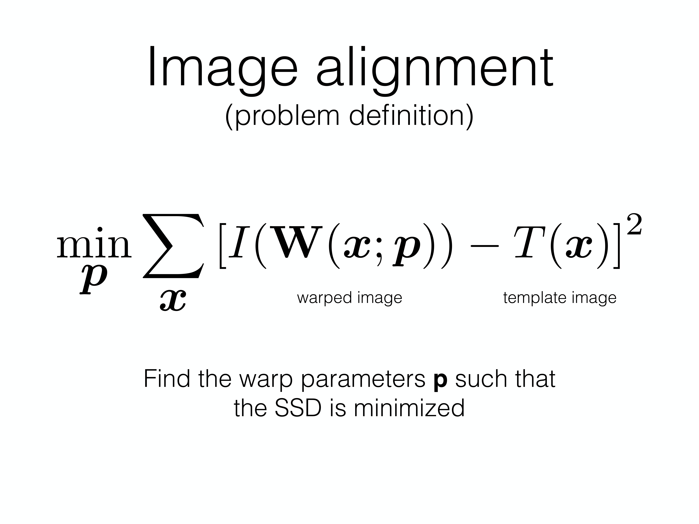
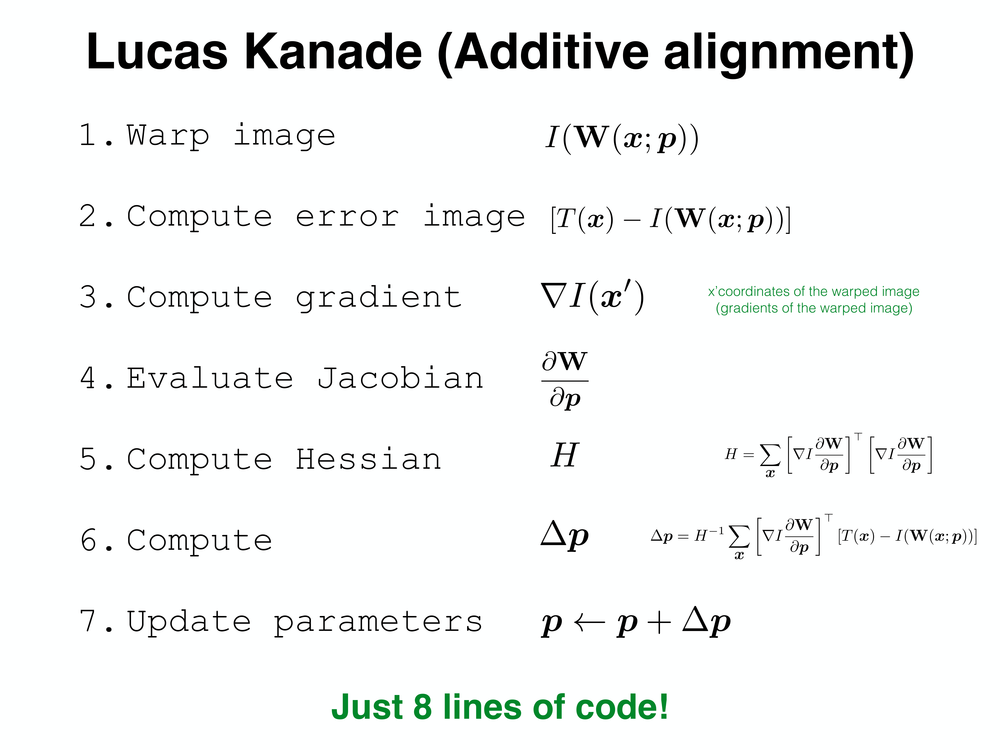
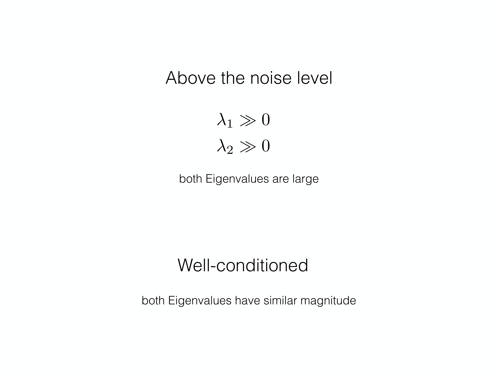
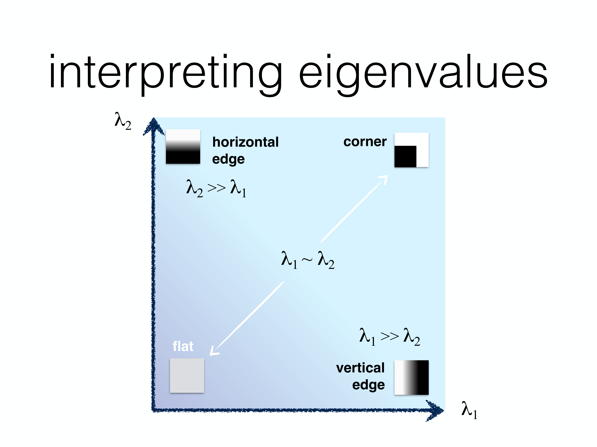
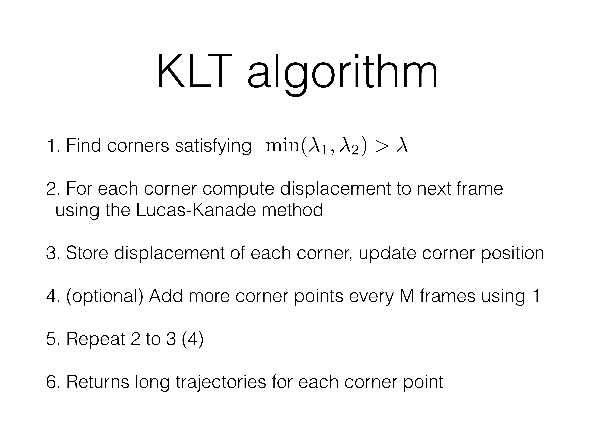
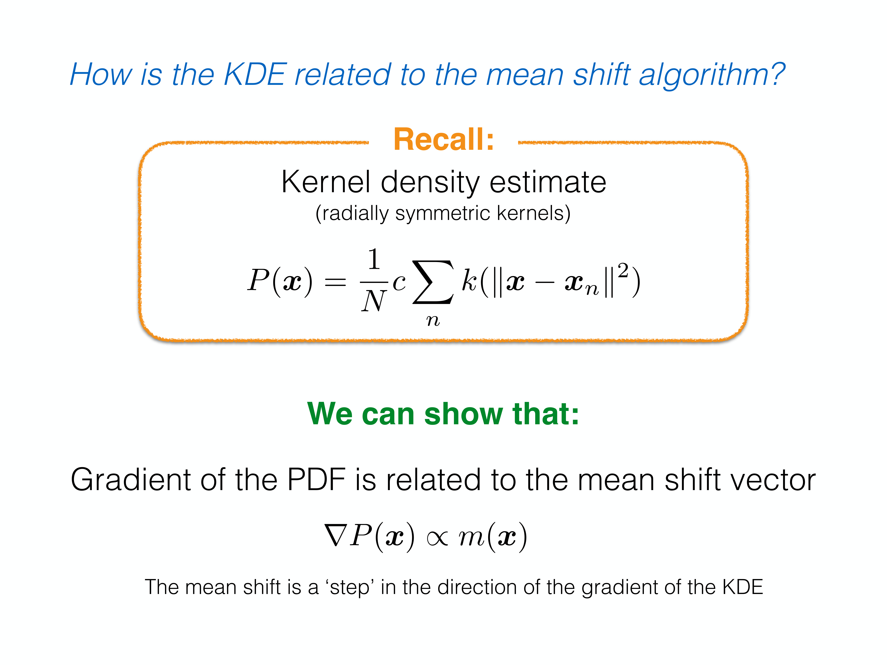
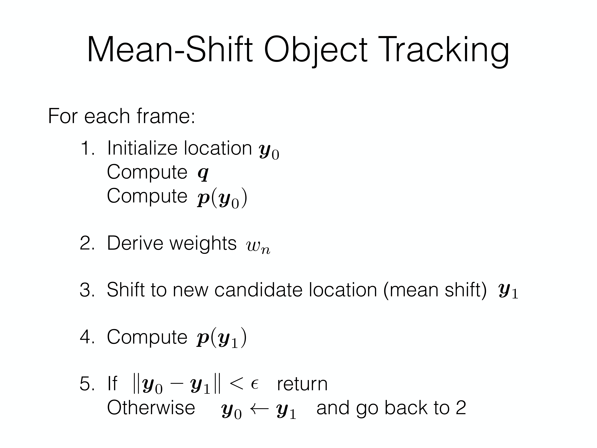

[CMU-tracking](slides/CMU-tracking.pdf)

这份笔记按课件主线整理 **图像配准（image alignment）**、**Lucas-Kanade（LK）**、**KLT 特征跟踪** 与 **Mean-Shift Tracking**。它们表面上分别属于“配准”“光流/跟踪”“目标跟踪”，但本质都在解决同一个问题：

> 如何在下一帧里找到当前目标最可能出现的位置。

## 1 从模板匹配到图像配准

### 1.1 三种思路：从全局搜索到局部优化

课件一开始对比了三种寻找目标位置的方法：

- **Template Matching**：直接在整张图里暴力匹配模板，慢但直观
- **Pyramid Template Matching**：通过图像金字塔加速搜索，但仍偏组合式
- **Model Refinement**：若已有较好初值，只做局部细化，速度最快

这也预示了 Lucas-Kanade 的核心假设：

> 目标在相邻两帧间位移不大，因此可以从一个较好的初值出发做局部迭代优化。

### 1.2 Warp 的记号

课件先统一了一个很重要的记号：

$$
W(x; p)
$$

表示由参数 $p$ 控制的二维图像变换（warp）。

其中：

- $x = [x, y]^\top$ 是图像坐标
- $p = \{p_1, \dots, p_N\}$ 是变换参数

例如：

- **平移模型**

$$
W(x; p) =
\begin{bmatrix}
x + p_1\\
y + p_2
\end{bmatrix}
$$

- **仿射模型**

$$
W(x; p) =
\begin{bmatrix}
p_1x + p_2y + p_3\\
p_4x + p_5y + p_6
\end{bmatrix}
$$

这套记号非常关键，因为后面所有 alignment / LK / KLT 推导都在围绕它展开。

## 2 图像配准问题：最小化 SSD

### 2.1 基本定义

图像配准的目标是：给定模板图像 $T(x)$ 和当前图像 $I(x)$，找到一组 warp 参数 $p$，使 warped image 尽可能接近模板。

标准目标函数写成：

$$
\min_p \sum_x \left[I(W(x; p)) - T(x)\right]^2.
$$

{ width="650" }

这就是典型的 **SSD（sum of squared differences）** 对齐目标。

### 2.2 为什么这个优化不容易

困难在于：

- $I(\cdot)$ 是对图像的采样，本身不是简单解析函数
- $W(x; p)$ 又是参数化变换
- 两者组合后形成了一个关于参数 $p$ 的非线性优化问题

所以直接全局求解很难。Lucas-Kanade 的策略是：

- 假设已有一个较好的初值
- 只在当前参数附近做一阶近似
- 通过不断的小步更新逼近局部最优

## 3 Lucas-Kanade：局部线性化 + 迭代更新

### 3.1 增量式更新思想

若当前参数估计为 $p$，我们不直接重解整个问题，而是求一个小增量 $\Delta p$：

$$
\min_{\Delta p} \sum_x \left[I(W(x; p+\Delta p)) - T(x)\right]^2.
$$

然后对 $I(W(x; p+\Delta p))$ 在 $\Delta p = 0$ 附近做一阶 Taylor 展开：

$$
I(W(x; p+\Delta p))
\approx
I(W(x; p)) + \nabla I \frac{\partial W}{\partial p}\Delta p.
$$

于是目标函数被线性化，变成一个标准最小二乘问题。

### 3.2 梯度更新公式

整理后可得到 LK 的经典更新公式：

$$
\Delta p
=
H^{-1}
\sum_x
\left[
\nabla I \frac{\partial W}{\partial p}
\right]^\top
\left[T(x)-I(W(x; p))\right],
$$

其中 Hessian 为

$$
H
=
\sum_x
\left[
\nabla I \frac{\partial W}{\partial p}
\right]^\top
\left[
\nabla I \frac{\partial W}{\partial p}
\right].
$$

{ width="650" }

然后用

$$
p \leftarrow p + \Delta p
$$

不断迭代，直到收敛。

### 3.3 Lucas-Kanade 的本质

可以把 LK 理解成三个关键词：

- **局部**：假设已有 good initialization
- **线性化**：对 warp 后图像做一阶近似
- **迭代**：每次只修正一个小位移/小变换

它比全局模板匹配快得多，但代价是只能保证局部最优。

## 4 KLT：什么样的特征才适合跟踪

### 4.1 跟踪稳定性与 Hessian 条件数

课件接着问了一个关键问题：

> 不是所有 patch 都适合跟踪，那么什么样的特征是“好特征”？

答案来自 LK 自身的 Hessian：

$$
H =
\sum_x
\begin{bmatrix}
I_x^2 & I_x I_y\\
I_x I_y & I_y^2
\end{bmatrix}.
$$

当我们只考虑平移模型时，上式正是图像结构张量（second moment matrix）。

若 $H$ 奇异或病态，就意味着：

- 某些方向上的位移几乎无法区分
- 迭代会不稳定
- 甚至无法求逆

### 4.2 特征类型与特征值解释

结构张量的两个特征值 $\lambda_1, \lambda_2$ 可以很好解释 patch 的可跟踪性：

- **flat region**：$\lambda_1 \approx 0, \lambda_2 \approx 0$
- **edge**：一个大、一个小
- **corner**：两个都大，且量级接近

{ width="650" }

{ width="650" }

因此 KLT/Shi-Tomasi 的经典判据就是：

$$
\min(\lambda_1, \lambda_2) > \lambda.
$$

这说明好的跟踪特征应当：

- 在两个方向上都有足够梯度变化
- 也就是“角点（corner）”而不是边缘或平坦区

### 4.3 KLT 的完整流程

课件把 KLT 算法总结得很清楚：

1. 先找满足 $\min(\lambda_1, \lambda_2)>\lambda$ 的角点
2. 对每个角点，用 Lucas-Kanade 估计其到下一帧的位移
3. 更新点位置并记录轨迹
4. 可选地每隔若干帧补充新角点

{ width="650" }

所以 KLT 本质上是：

- **Tomasi/Shi**：负责“选什么点跟”
- **Lucas-Kanade**：负责“这些点怎么跟”

## 5 Mean Shift：从密度峰值搜索到目标跟踪

### 5.1 先理解 Mean Shift 本身

Mean Shift 最初不是为 tracking 提出的，而是一个 **mode seeking algorithm（找密度峰值）**。给定样本点 $\{x_s\}_{s=1}^S$ 和核函数 $K(x, x_s)$，定义局部加权均值：

$$
m(x) =
\frac{\sum_s K(x, x_s)x_s}{\sum_s K(x, x_s)}.
$$

然后 mean shift 向量定义为

$$
v(x) = m(x) - x.
$$

算法每步做：

1. 计算当前点的 mean shift 向量
2. 按这个向量移动到新位置
3. 反复迭代直到位移足够小

### 5.2 和 KDE 的关系

课件花了大量篇幅推导 mean shift 与核密度估计（KDE）的关系。结论非常重要：

> Mean shift 向量和 KDE 的梯度方向一致，因此 mean shift 本质上是在做 **带自适应步长的梯度上升**。

{ width="650" }

因此它不是一个拍脑袋的“移动窗口算法”，而是一个有明确优化意义的密度模式搜索方法。

## 6 Mean-Shift Tracking：在下一帧里找最像目标的位置

### 6.1 Tracking 的建模思路

把 Mean Shift 用到 tracking 时，目标不再是“找样本密度峰值”本身，而是：

> 在下一帧的局部邻域里，找到一个候选区域，使它的特征分布最像当前目标。

通常的做法是：

- 用目标区域的颜色直方图、核加权直方图等作为目标描述子 $q$
- 对下一帧中候选位置 $y$ 计算候选描述子 $p(y)$
- 最大化相似度 $\rho[p(y), q]$

### 6.2 为什么 Mean Shift 适合做 tracking

跟踪中的搜索空间通常是局部的，且相邻帧目标位置不会跳太远。因此：

- 候选位置可以从上一帧目标中心初始化
- 局部相似度通常形成一个峰值结构
- Mean shift 可以不断把候选中心往相似度更高的位置推过去

### 6.3 跟踪流程

课件给出的 mean-shift object tracking 伪代码可总结为：

1. 初始化位置 $y_0$
2. 计算目标描述子 $q$ 与当前候选描述子 $p(y_0)$
3. 根据二者差异得到像素权重 $w_n$
4. 用 mean shift 更新候选中心到 $y_1$
5. 若 $\|y_1-y_0\| < \varepsilon$ 则停止，否则继续迭代

{ width="650" }

所以 Mean-Shift Tracking 的关键词是：

- **目标描述子**
- **候选区域相似度**
- **局部迭代搜索**

### 6.4 非刚体目标跟踪

课件后面还强调了一个现实问题：真实目标往往是非刚体的，外观会变化。因此 tracking 不是简单“找到一模一样的 patch”，而是要找到 **统计特征最相似** 的候选区域。

这也是为什么 mean shift 更常配合：

- 颜色直方图
- 核加权描述子
- 局部邻域搜索

而不是直接拿像素逐点做刚性匹配。

## 7 Lucas-Kanade / KLT / Mean Shift 的关系

这三者很容易被分散地记忆，但其实关系很紧密：

- **Image alignment / Lucas-Kanade**：给出一个通用的局部配准框架
- **KLT**：在 LK 的基础上加上“好特征选择”，形成点跟踪器
- **Mean Shift Tracking**：换一种目标函数，不再显式配准像素，而是在分布相似度上做局部模式搜索

也就是说：

- LK / KLT 更像 **几何/光度配准** 路线
- Mean Shift 更像 **外观分布匹配** 路线

## 8 总结与易错点

### 8.1 主线总结

这份 tracking 课件可以压成下面这条线：

- **Template matching**：全局搜索，慢但直观
- **Image alignment**：把跟踪写成 warp 参数优化
- **Lucas-Kanade**：局部线性化 + 最小二乘更新
- **KLT**：结合角点选择，实现稳定的 feature tracking
- **Mean Shift**：从密度峰值搜索推广到对象跟踪

### 8.2 高频易错点

- 把 LK 当作全局最优算法：它本质上依赖 good initialization，只保证局部最优。
- 认为边缘点也适合跟踪：边缘只在一个方向上可辨识，另一方向位移不稳定。
- 忽略 Hessian 的条件数：KLT 选角点本质上就是为了让 Hessian 可逆且稳定。
- 把 Mean Shift 看成“简单求均值”：真正更新的是核加权均值减去当前中心，且它有 KDE 梯度上升解释。
- 认为 Mean-Shift Tracking 是在跟像素模板：更准确地说，它是在跟目标描述子的分布相似性。

## 9 考试重点

- **warp** 记号 $W(x; p)$ 的含义
- **image alignment** 目标：$\min_p \sum_x [I(W(x;p)) - T(x)]^2$
- **Lucas-Kanade**：Taylor 线性化、Hessian、参数更新
- **KLT**：为什么好特征是角点
- **Shi-Tomasi 判据**：$\min(\lambda_1,\lambda_2) > \lambda$
- **Mean shift**：$m(x)$、$v(x)=m(x)-x$
- **Mean shift 与 KDE 梯度** 的关系
- **Mean-Shift Object Tracking** 的每帧迭代流程
