## Machine Learning Basics

- Machine learning: (part of ML techniques) learning a predictive model from data
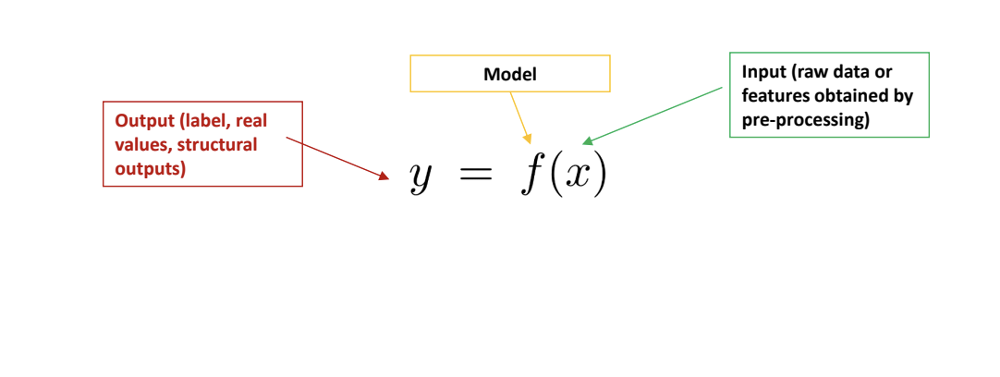{ width="450" } 

- An example:

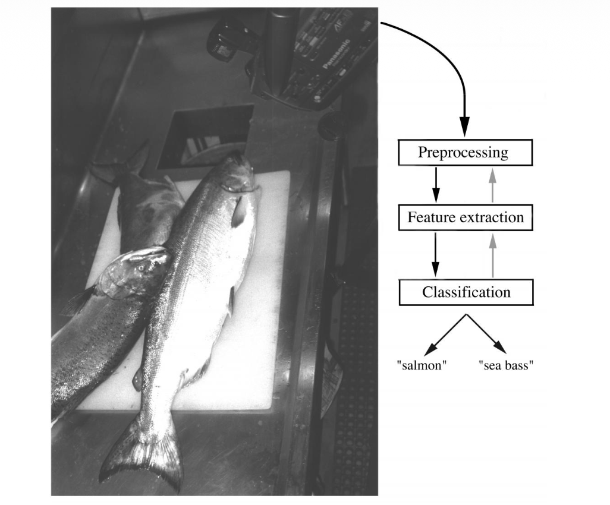{ width="220", align=left } 
The objects to be classified are first sensed by a transducer (camera), whose signals are preprocessed.
Next the features are extracted and finally the classification is emitted, here either "salmon" or "sea bass".
Although the information flow is often chosen to be from the source to the classifier, some systems
employ information flow in which earlier levels of processing can be altered based on the tentative or
preliminary response in later levels (gray arrows)
Yet others combine two or more stages into a unified step, such as simultaneous segmentation
and feature extraction.

### Linear Classifier
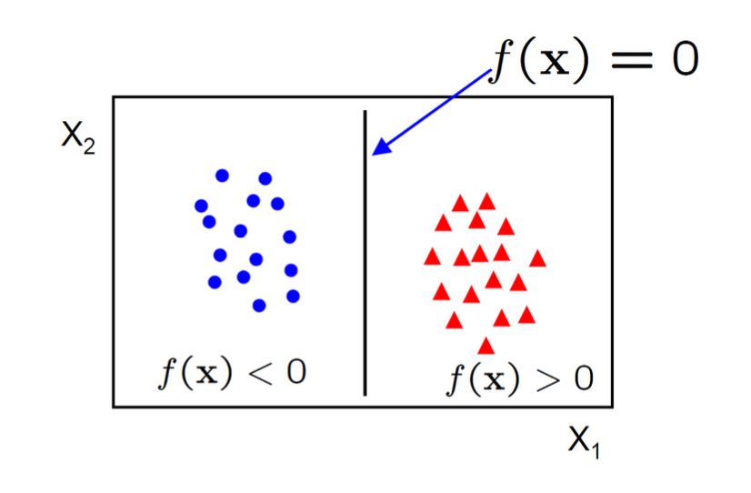{ width="200", align=right}
A linear classifier has the form
$$
f(x)=W^Tx+b
$$

- in 2D the discriminant is a line
- **W** is the ==normal== to the line, and b the ==bias==
- **W** is known as the ==weight vector==

### Perceptron
In the modern sense, the perceptron is an algorithm for learning a binary classifier: a function that maps its input **x** (a real-valued ==vector==) to an output value $f(x)$ (a single ==binary== value):
$$
f(x)=
\begin{cases}
1 \quad if \space w \cdot x + b > 0 \\\
0 \quad otherwise
\end{cases}
$$
where *w* is a vector of real-valued weights, $w \cdot x$ is the ==dot product== $\sum\limits_{i=0}^mw_{i}x_{i}$, where m is the number of inputs to the perceptron and *b* is the bias. The bias shifts the decision boundary away from the origin and does not depend on any input value.

### Multivariate Linear Regression
This time, $x \in \mathbb{R}^m$ and $y \in \mathbb{R}^k$ , and the model is 
$$
y = Ax
$$
for a $k \times m$ matrix $A$ .
We assume the last coordinate of each *x* vector is 1. Then the last column of $A$ acts as the bias vector $b$ we had before, simplifying the model.
The empirical risk is 

$$
L = \sum\limits_{i=1}^{N} (Ax_{i}-y_{i})^{2} = \sum\limits_{i=1}^{N} (x_{i}^{T}A^T - y_{i}^T)(Ax_{i} - y_{i})
$$

We want to optimize $L$ with respect to the model matrix $A$, so this time we need a ==gradient==:

$$
\nabla_{A} L = 0
$$
We are treating the ==loss== as a function $L(A)$ of the matrix $A$ (fixing x's and y's):

$$
L(A) = \sum\limits_{i=1}^{N} (x_{i}^TA^T - y_{i}^T)(Ax_{i} - y_{i})
$$

The gradient of the loss is 

$$
\nabla_{A}L = 2A \sum\limits_{i=1}^{N} x_{i}x_{i}^T - 2 \sum\limits_{i=1}^{N} y_{i}x_{i}^T = 0
$$
Which we can write as 

$$
2AM_{x x} - 2M_{yx} = 0
$$
where $M_{x x} = \sum\limits_{i=1}^{N}x_{i}x_{i}^T$ and $M_{yx} = \sum\limits_{i=1}^{N}y_{i}x_{i}^T$

The solution for zero loss gradient: 

$$
\nabla_{A}L(A) = 2A M_{x x} - 2M_{yx} = 0
$$
is:

$$
A = M_{yx}M_{x x}^{-1}
$$
Also works if we define 

$$
\begin{align}
M_{x x} = \frac{1}{n} \sum\limits_{i=1}^{N} x_{i}x_{i}^T  \\\
M_{yx} = \frac{1}{n} \sum\limits_{i=1}^{N} y_{i}x_{i}^T
\end{align}
$$

These are called ==sample moments== , and they converge to the true moments

$$
\begin{align}
M_{x x} \to \mu_{x x} = \mathbb{E}[x x^T] \\\
M_{yx} \to \mu_{y x} = \mathbb{E}[yx^T]
\end{align}
$$

So our ==empirical risk-minimizing model== $A = M_{yx}M_{x x}^{-1}$ converges to the ==true risk minimizing model== $A_{0} = \mu_{yx}\mu_{x x}^{-1}$

### Aside: Gradients
when we write $\nabla_{A}L(A)$, we mean the vector of partial derivatives:

$$
\nabla_{A}L(A) = \left[ \frac{ \partial L }{ \partial A_{11} }, \frac{ \partial L }{ \partial A_{12} } , \frac{ \partial L }{ \partial A_{21} } , \frac{ \partial L }{ \partial A_{22} }   \right]^T
$$

Where $\frac{ \partial L }{ \partial A_{11} }$ measures how fast the loss changes vs. change in $A_{11}$ .

When $\nabla_{A}L(A)=0$ , it means all the partials are zero.

i.e. the loss is not changing in any direction. Thus we are at a local optimum (or at least a saddle point)

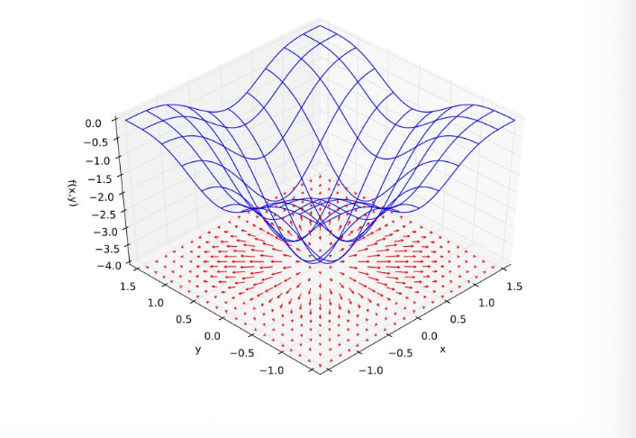{ width="400" }

## Support Vector Machine

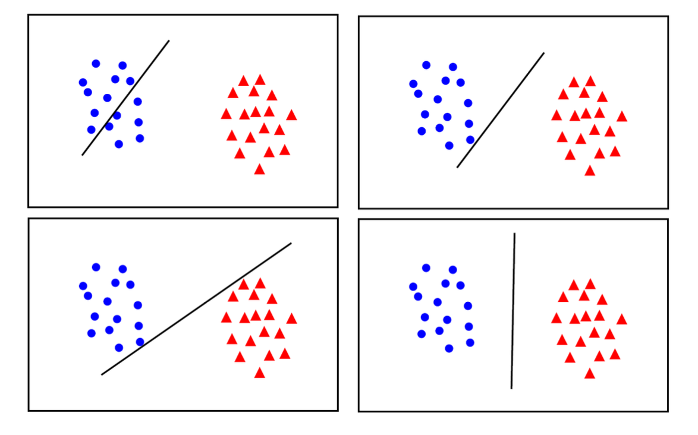{ width="600" }

- ==maximum margin== solution: most stable under perturbations of the inputs

- Distance from example to the separator is 

$$
r = y \frac{w^Tx + b}{||w||}
$$

- Example closest to the hyperplane are ==support vectors== .
- ==Margin== $\rho$ of the separator is the width of separation between support vectors of classes

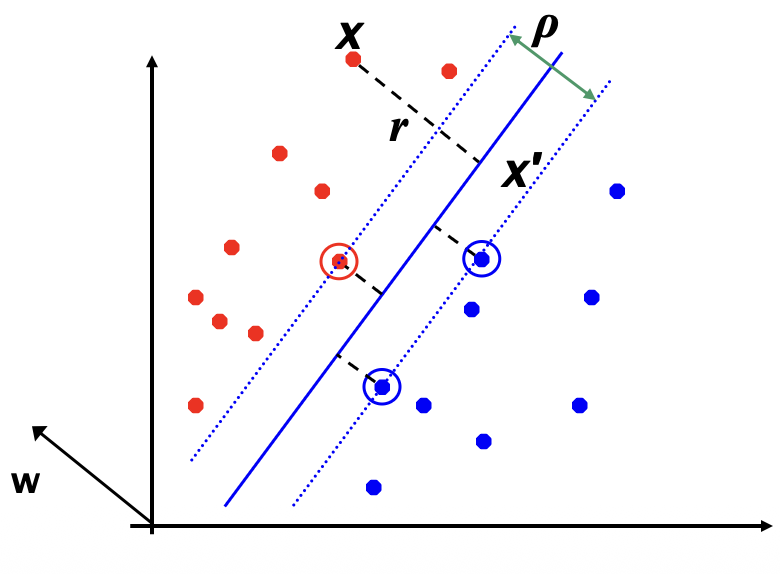{ width="150", align=left }
**Derivation fo finding r: Dotted line x' -x is perpendicular to decision boundary so parallel to w. Unit vector is w/|w|, so line is rw/|w|. x' = x - yrw/|w|. x' satisfies w^T x' + b = 0. So w^T (x - yrw/|w|) + b = 0 Recall that |w| = sqrt(w^T w). So w^T w - yr|w| + b = 0. So, solving for r gives: r = y(w^T x + b) / |w|**

- Since $w^T x + b = 0$ and $c(w^T x + b) = 0$ define the same plane, we have the freedom to choose the normalization of $w$
- Choose normalization such that $w^Tx_{+} + b = +1$ and $w^Tx_{-} + b = -1$ for the positive and negative support vectors respectively
- Then the ==margin== is given by

$$
\frac{w}{||w||} \cdot (x_{+} - x{-}) = \frac{w^T(x_{+} - x_{-})}{||w||} = \frac{2}{||w||}
$$

### Optimization of SVM
- Learning the SVM can be formulated as an optimization: 

$$
\max\limits_{w} \frac{2}{||w||}
$$
subject to 

$$
w^T x_{i} + b
\begin{cases}
\geq 1 \quad if \space y_{i} = +1  \\\
\leq -1 \quad if \space y_{i} = -1
\end{cases}
$$
for $i = 1\dots N$

- Or equivalently

$$
\min\limits_{w} ||w||^{2}
$$

subject to

$$
y_{i}(w^{T}x_{i} + b) \geq 1
$$
for $i = 1\dots N$

- This is a quadratic optimization problem subject to linear constraints and there is a unique minimum

### Tradeoff of Linear Separability / Large Margin
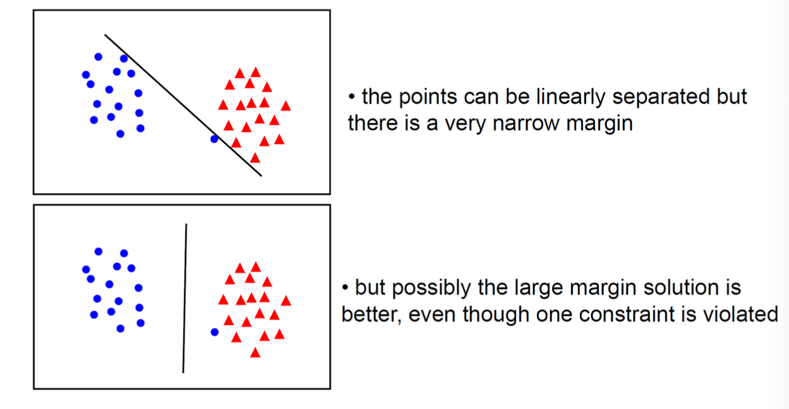{ width="500" }

In general there is a trade off between the margin and the number of mistakes on the training data

### Soft-Margin Support Vector Machine
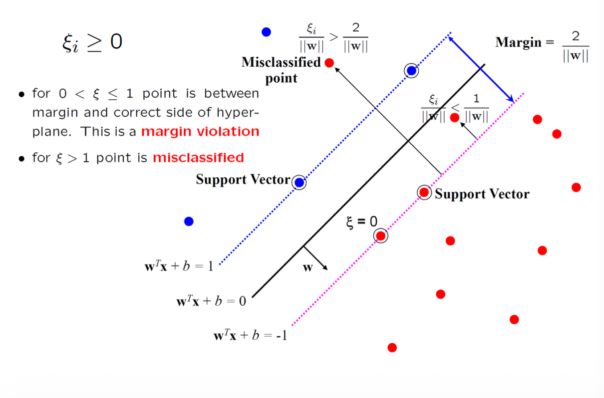{ width="500" }

The optimization problem becomes

$$
\min\limits_{w \in \mathbb{R}^{d},\xi_{i} \in \mathbb{R}^{+}} ||w||^{2} + C \sum\limits_{i}^{N} \xi_{i}
$$

subject to

$$
y_{i}(w^{T}x_{i} + b) \geq 1 - \xi_{i} , \quad i = 1\dots N
$$

- Every constraint can be satisfied if $\xi_{i}$ is sufficiently large 
- $C$ is a ==regularization== parameter:
	- small $C$ allows constraints to be easily ignored $\to$ large margin
	- large $C$ makes constraints hard to ignore $\to$ narrow margin
	- $C = \infty$ enforces all constraints: hard margin
- This is still a quadratic optimization problem and there is a unique minimum. Note, there is only one parameter, $C$ .

## Basics of Deep Networks

### XOR Problem

**Single-layer cannot solve XOR**

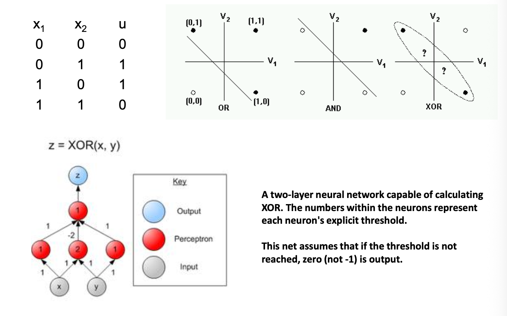{ width="600" }

### Gradient and Chain Rule

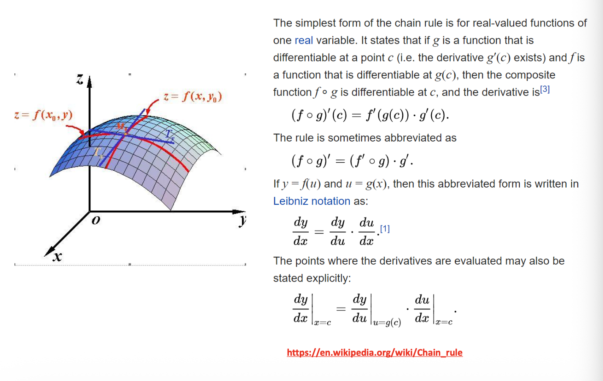{ width="600" }

### Back Propagation

Anatomy for a unit neuron

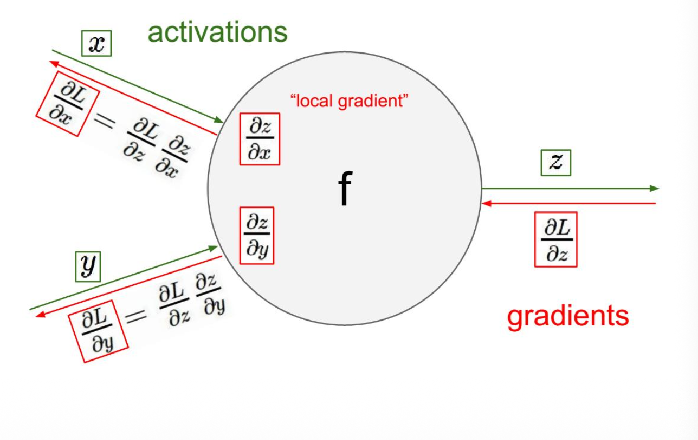{ width="600" }

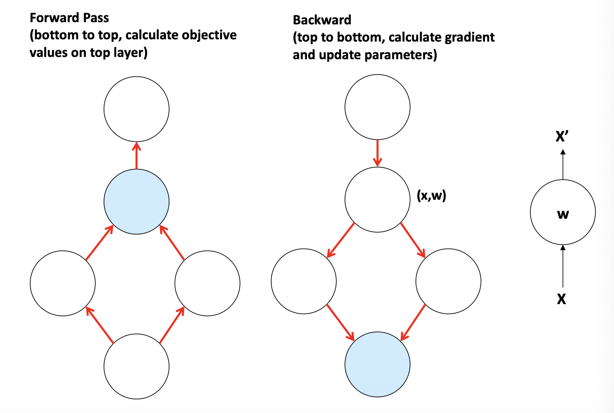{ width="600" }

### LeNet-5: An Exceptional Example
- Supervised deep networks are too difficulty to train (before 2012)
- LeNet-5 is an exception

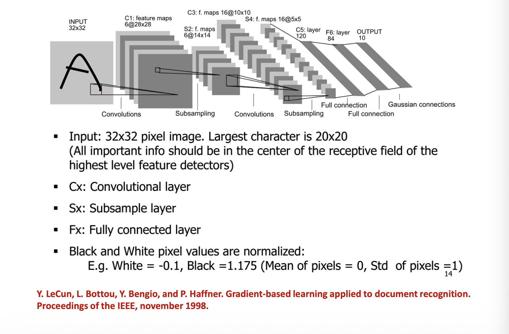{ width="600" }

确立了现代CNN的基本结构——**卷积层、池化层、全连接层的组合**

LeNet-5 的名字中的“5”意味着它包含5层可训练参数的层（3个卷积层 + 2个全连接层）。其输入是32x32的灰度图像，输出是10个类别（数字0-9）的概率。

| 层数 (Layer) | 组件           | 详情 (输入 → 核大小/步长 → 输出维度)               | 参数量 (Parameters)         | 简要说明                                                                                                    |
| ---------- | ------------ | ------------------------------------- | ------------------------ | ------------------------------------------------------------------------------------------------------- |
| **输入层**    | Input        | 32x32 灰度图像                            | -                        | 输入图像比MNIST数据集中的字符大，以便网络能更好地学习边缘、拐角等特征。 |
| **C1**     | **卷积层**      | 32x32x1 → 5x5/1, **6个** 核 → 28x28x6   | (5*5*1+1)\*6 = **156**   | 使用6个5x5卷积核提取基础特征（如边缘、弧线）。输出6张28x28的特征图。                                                                 |
| **S2**     | **池化层**      | 28x28x6 → 2x2/2 → 14x14x6             | 2*6 = **12**             | 平均池化层（下采样），对特征图进行降维，同时引入非线性（当时使用sigmoid）。                                                               |
| **C3**     | **卷积层**      | 14x14x6 → 5x5/1, **16个** 核 → 10x10x16 | 根据连接表计算，共 **1,516**      | 使用16个5x5卷积核提取更复杂的组合特征。其与S2的连接是一种非全连接，旨在打破对称性、丰富特征组合。                                                    |
| **S4**     | **池化层**      | 10x10x16 → 2x2/2 → 5x5x16             | 2*16 = **32**            | 再次进行平均池化，进一步降低特征图分辨率。                                                                                   |
| **C5**     | **卷积层**      | 5x5x16 → 5x5/1, **120个** 核 → 1x1x120  | (5*5*16+1)*120 =  48,120 | 由于输入尺寸与核大小相同，实际相当于全连接层。将特征图展平成120维的特征向量。                                                                |
| **F6**     | **全连接层**     | 120 → 84                              | (120+1)*84 = 10,164      | 全连接层，输出84维向量。这一设计与输出层的RBF单元编码有关。                                                                        |
| **输出层**    | Output (RBF) | 84 → 10                               | 84*10 = **840**          | 使用径向基函数计算输入与预设编码的欧氏距离，距离最小的类别即为识别结果。   |

**总参数量**：约 **60,000** ；**总连接数**：约 **340,000** 。

#### The Activation Functions
- Twist the linear responses
- Avoid numerical overflow

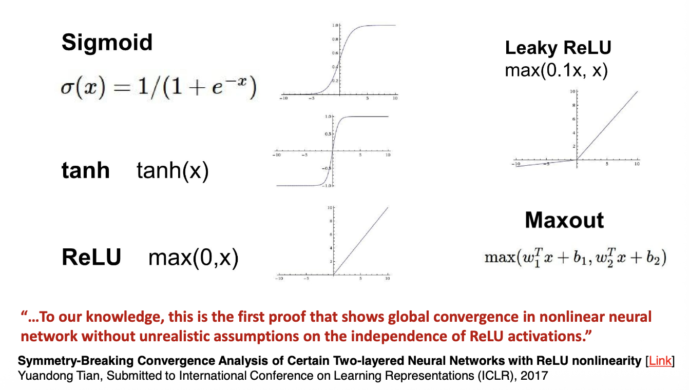{ width="500" }

#### Softmax Layer
Generate probabilistic output

$$
p(y) = \frac{\exp (o)}{1 + \sum\limits_{j=1}^{J - 1} \exp(o)}
$$

#### Regularizing Networks: Dropout
- Keeping a neuron active with some probability
- Only in training mode, scaling the weights accordingly
- Google applied for a US patent for dropout in 2014

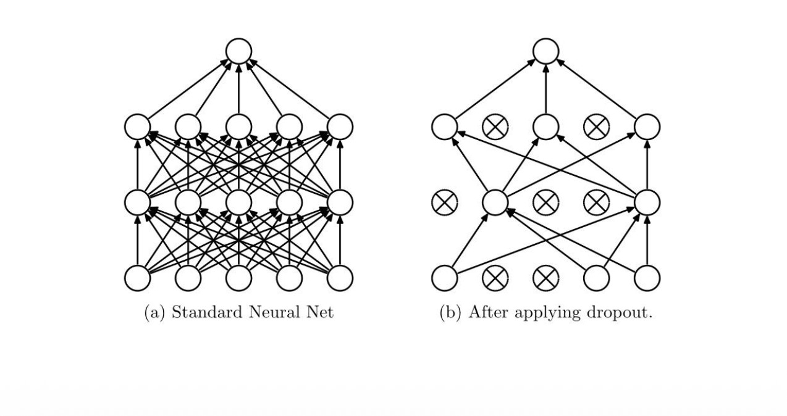{ width="500"}

#### Momentum and Weight Decay
- The objective often has the form of a long shallow ravine leading to the optimum and steep walls on the sides
- SGD tend to oscillate across the narrow ravine

**SGD:**

$$
\theta = \theta - \alpha \nabla_{\theta}J(\theta;x^{(i)}, y^{(i)})
$$

**Momentum:**

$$
\begin{align}
\upsilon  & = \gamma\upsilon + \alpha \nabla_{\theta}J(\theta; x_{(i)}, y^{(i)}) \\\
\theta  & = \theta - \upsilon
\end{align}
$$

- Weight decay: limit the number of free parameters in your model so as to avoid over-fitting

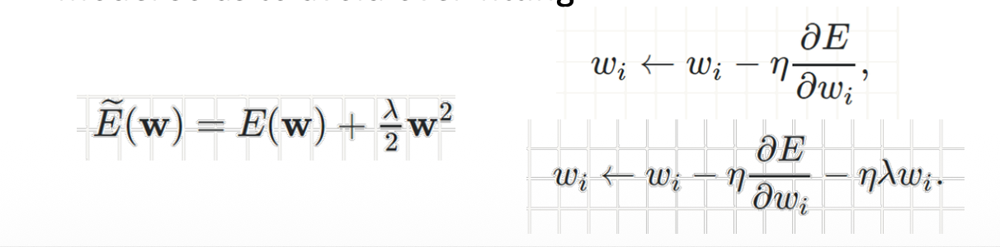{ width="400"}

#### Regularizing Networks: Early Stopping
- Training error decreases steadily over time, but validation set error begins to rise again
- We should adopt **Early Stopping!** 

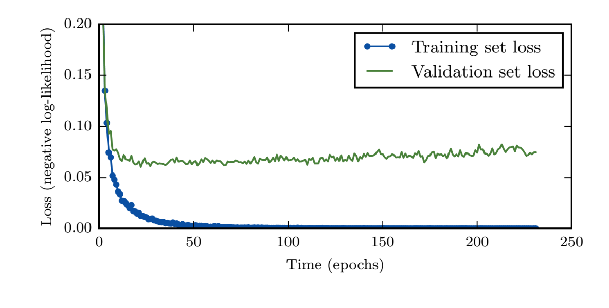{ width="500"}
