[rnn-transformer](slides/rnn-transformer.pdf)

本讲围绕 **序列建模（sequential modeling）** 展开：先从循环神经网络（RNN）的动机与基本形式出发，分析 BPTT、双向 RNN、seq2seq、长程依赖问题与 LSTM；然后过渡到 attention 与 Transformer，再进一步连接到视觉任务中的 ViT、DETR 与 Swin Transformer。

## 1 从静态数据到序列数据

### 1.1 为什么需要序列模型

很多视觉与多媒体任务都不是“一个样本独立对应一个标签”的静态问题，而是天然带有时间顺序或 token 顺序：

- 视频是按时间排列的帧序列
- 语音是连续时间窗上的声学特征序列
- 句子是词序列
- 图像描述（image captioning）是“图像输入，文本序列输出”
- 降雨预测、股票价格、汇率、DNA 序列也都具有强烈的时序依赖

课件的核心观点是：**对于 sequential samples，不应把每个样本独立看待，而应建模它们之间的依赖关系，并做一连串相互关联的决策。**

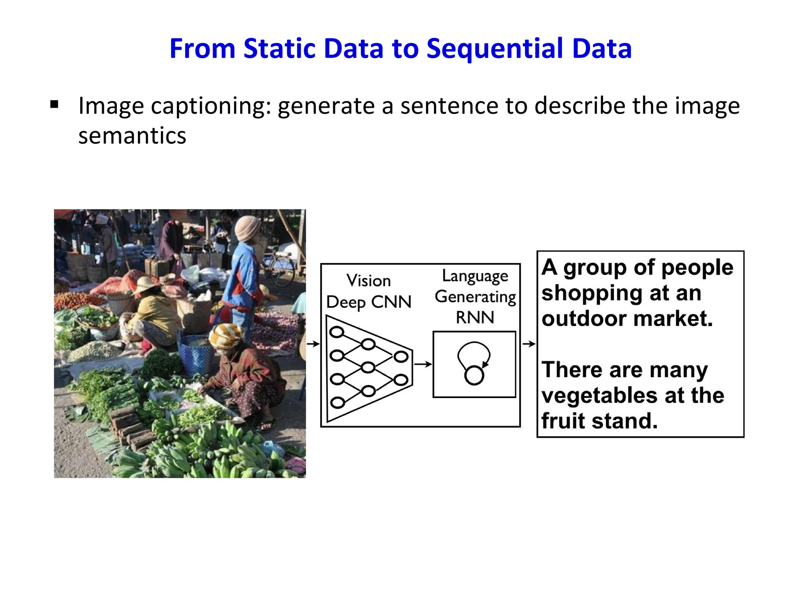{ width="650" }

### 1.2 序列模型和静态模型的本质差异

在普通分类网络里，一个输入样本经过网络后直接输出预测；而在序列模型中，第 $t$ 个时刻的预测往往依赖：

- 当前输入 $x_t$
- 历史状态 $h_{t-1}$
- 有时还依赖未来信息（如双向 RNN）

因此，序列模型的关键不是“多看一个样本”，而是要有一种 **状态（state）** 来压缩和传递历史信息。

## 2 展开计算图：RNN 的基本思想

### 2.1 动态系统与时间展开

RNN 最核心的视角，是把网络看成一个离散时间动态系统：

$$
h_t = f(h_{t-1}, x_t)
$$

其中 $h_t$ 是时刻 $t$ 的隐状态（hidden state）。如果把时间轴展开，同一个更新函数会在多个时刻被重复应用，这就得到所谓的 **unfolded computational graph**。

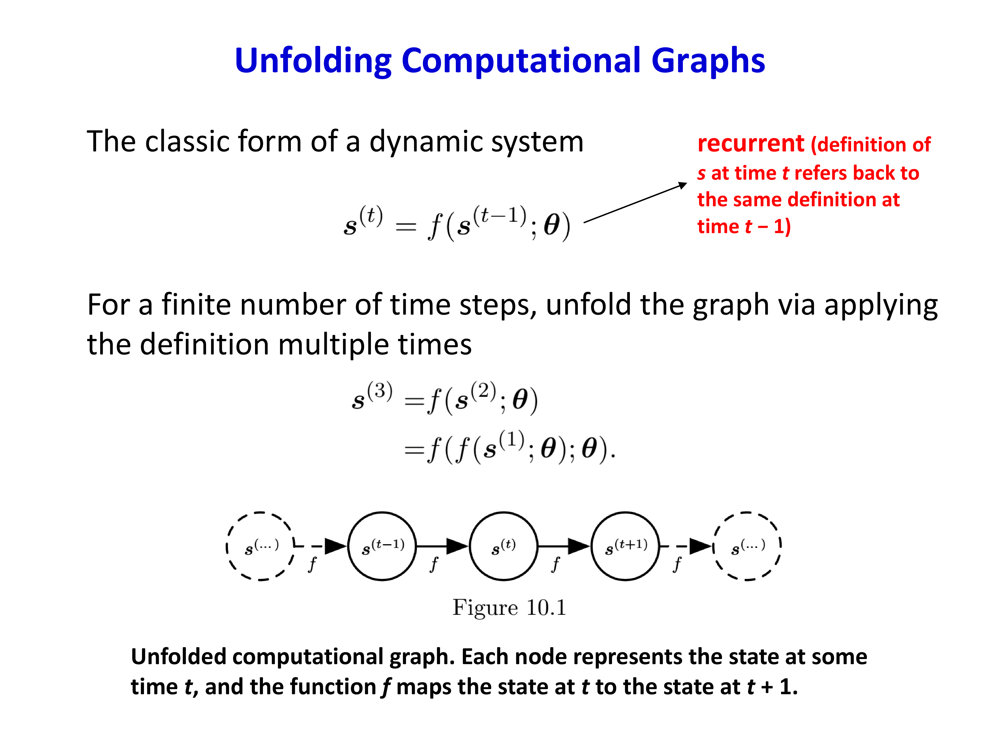{ width="650" }

这个展开视角很重要，因为它把“有环结构的循环网络”变成了“无环但很深的前馈网络”，从而可以直接使用反向传播。

### 2.2 隐状态是对过去的有损摘要

当网络每接收一个新输入 $x_t$ 时，都会用它去更新隐藏状态 $h_t$。因此：

- $h_t$ 可以理解为对过去输入序列 $x_1,\dots,x_t$ 的摘要
- 这个摘要通常是 **固定维度** 的
- 而输入序列长度可以是可变的

所以 RNN 的一个天然优点是：**它能处理变长序列**。但这也带来了代价：把任意长序列压缩到固定维向量，本质上是一种有损映射。

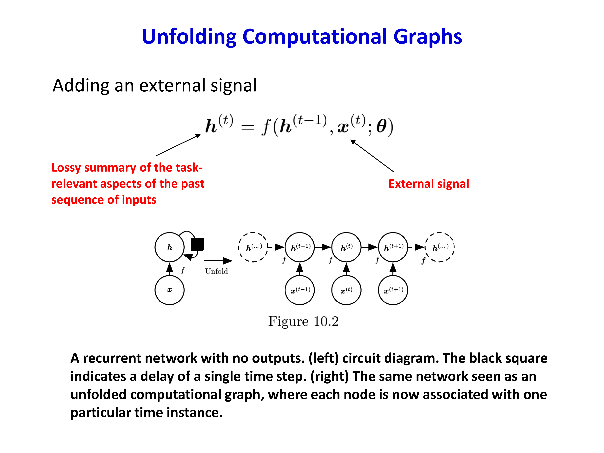{ width="650" }

??? info "为什么说这和 CNN 有点像"
    课件里提到，RNN 与 CNN 有一个重要共性：**参数共享（parameter sharing）**。

    - CNN 在不同空间位置共享卷积核参数
    - RNN 在不同时间步共享状态更新参数

    正因为共享参数，模型才能推广到训练时没有见过的序列长度；否则若每个时间步都需要一套新参数，就几乎无法泛化。

## 3 基本 RNN：形式、结构与训练

### 3.1 标准 RNN 的更新公式

最经典的 RNN 单元可写为：

$$
a^{(t)} = b + Wh^{(t-1)} + Ux^{(t)}
$$

$$
h^{(t)} = \tanh(a^{(t)})
$$

$$
o^{(t)} = c + Vh^{(t)}
$$

$$
\hat y^{(t)} = \operatorname{softmax}(o^{(t)})
$$

这里：

- $x^{(t)}$ 是当前输入
- $h^{(t)}$ 是当前隐藏状态
- $o^{(t)}$ 是输出层 logit
- $\hat y^{(t)}$ 是当前时刻的预测分布

若任务要求每个时间步都输出预测，则总体损失通常写为逐时刻损失之和：

$$
L = \sum_t L^{(t)}
$$

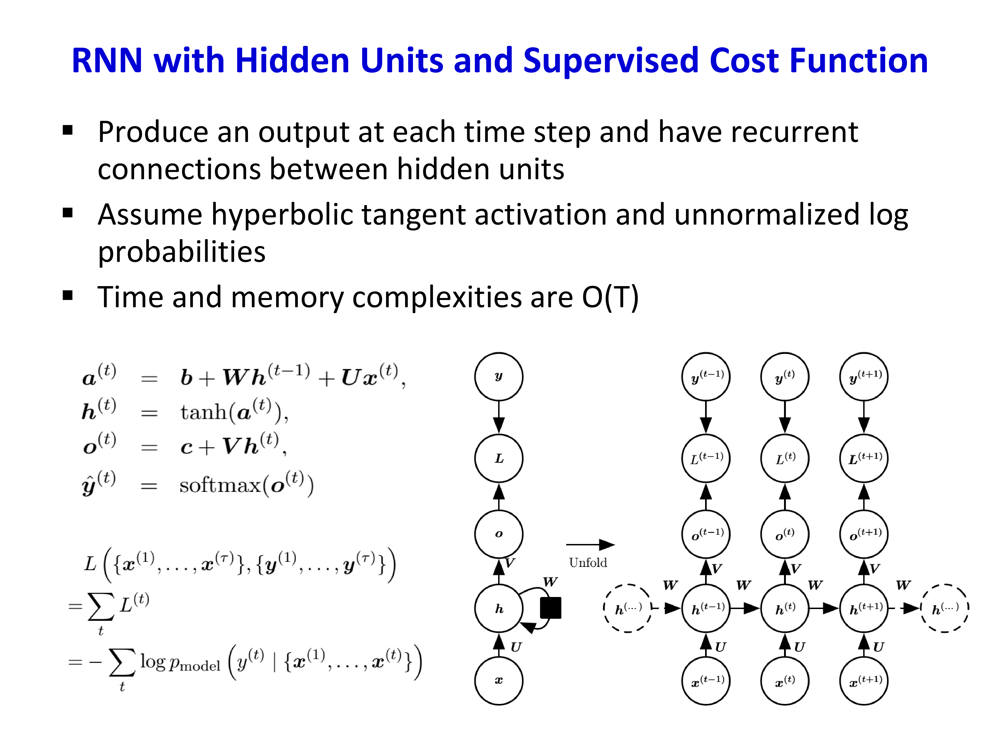{ width="650" }

### 3.2 常见输入输出模式

RNN 可适配多种序列任务：

- **many-to-many**：输入输出都为序列，如机器翻译、语音识别
- **many-to-one**：输入是序列，输出是单个标签，如情感分类、视频分类
- **one-to-many**：输入是单个向量，输出是序列，如 image captioning
- **sequence input, single output**：把整段序列压成一个固定向量再做后续预测

其中，课件特别展示了 **sequence input, single output** 的情形：最后一个隐藏状态可以作为整段序列的紧凑表示。

### 3.3 Teacher Forcing

在序列生成任务里，训练和测试往往存在不一致：

- 训练时，当前步输入可直接使用真实上一个 token
- 测试时，当前步输入只能使用模型上一步自己的预测

Teacher forcing 的做法是：训练时把真实标签喂回模型，而不是喂模型自己的输出。

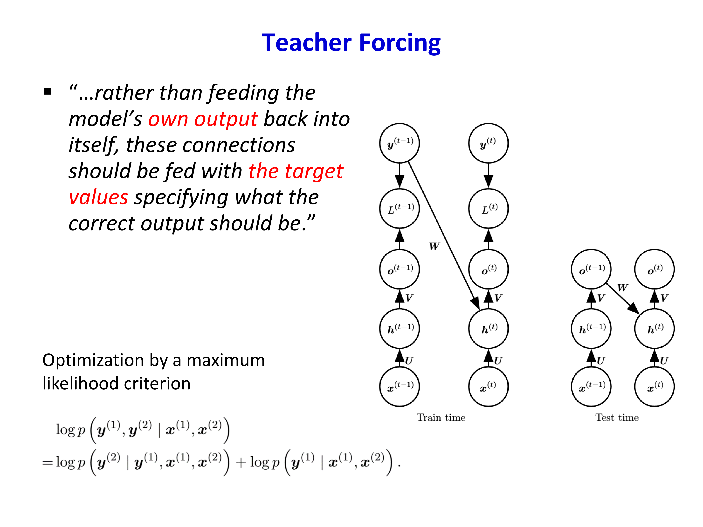{ width="650" }

它的优点是优化更稳定、更容易收敛；缺点是会带来 exposure bias，即训练时没有暴露给“自己犯错后如何继续生成”的情况。

### 3.4 反向传播：BPTT

RNN 的训练并不需要特殊的新算法，只需把时间展开后的网络当作一个很深的前馈网络，然后直接做反向传播，这就是 **BPTT（Back-Propagation Through Time）**。

其核心思路是：

1. 先按时间顺序做前向传播，得到每个时刻的状态与损失
2. 再按时间反向，把梯度沿展开图一层层回传
3. 因为各时间步共享参数，所以不同时间步对应的梯度要累加起来更新同一套参数

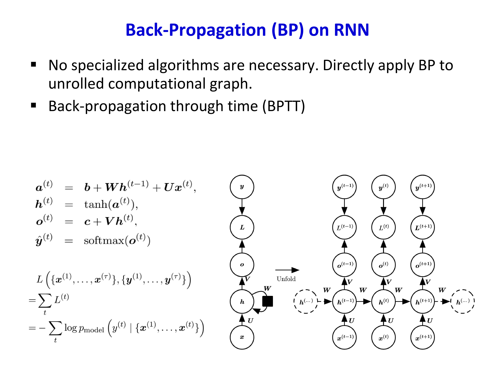{ width="650" }

## 4 变体与扩展：双向 RNN、Seq2Seq、Deep RNN

### 4.1 Bidirectional RNN

普通 RNN 在时刻 $t$ 只能利用过去信息。但有些任务里，当前预测还需要未来上下文。例如语音识别中一个音素的判断，常常既依赖前文也依赖后文。

双向 RNN 的做法是同时建立：

- 一个从左到右的 forward RNN
- 一个从右到左的 backward RNN

然后把两者的状态融合起来做预测。

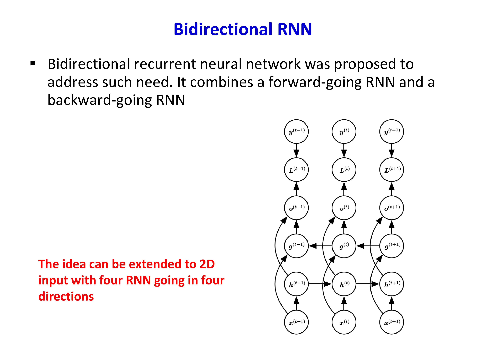{ width="650" }

因此，双向 RNN 的本质是：**让每个位置同时看到过去和未来上下文**。课件还提到，这个思想还能推广到 2D 输入，形成多个方向同时扫描的 RNN。

### 4.2 Sequence-to-Sequence（Encoder-Decoder）

对于机器翻译、语音转文字、问答等任务，输入和输出通常是两个长度不同的序列。这时常见做法是 seq2seq：

- **encoder**：读取输入序列，得到上下文表示 $C$
- **decoder**：以 $C$ 为条件，逐步生成输出序列

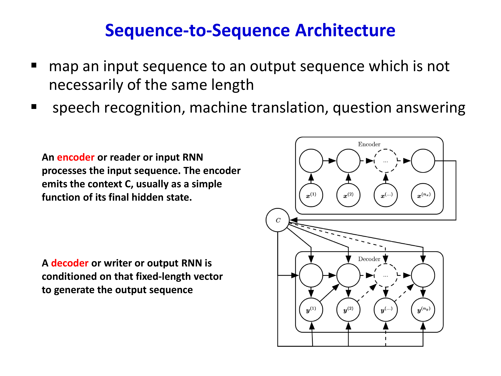{ width="650" }

早期 seq2seq 的一个核心限制，是把整个输入序列压缩成一个固定长度向量 $C$。这在长句子上容易丢信息，也为 attention 的出现埋下了伏笔。

### 4.3 Deep RNN

像 CNN 一样，RNN 也可以做深。Deep RNN 的想法是：在每个时间步内部再堆叠多层隐藏层，让低层表示更接近原始输入，高层表示更偏抽象语义。

这样做的动机是：

- 低层负责局部模式提取
- 高层负责更复杂、更长期的抽象依赖

但更深的网络也会带来更难训练的问题，特别是长程梯度传播。

## 5 长程依赖问题：梯度消失与爆炸

### 5.1 问题来源

RNN 的经典难点是 **long-term dependencies**。当误差信号跨越很多时间步回传时，梯度会不断乘上循环权重矩阵及激活函数导数，结果通常是：

- 大多数情况下 **梯度消失（vanishing）**
- 少数情况下 **梯度爆炸（exploding）**

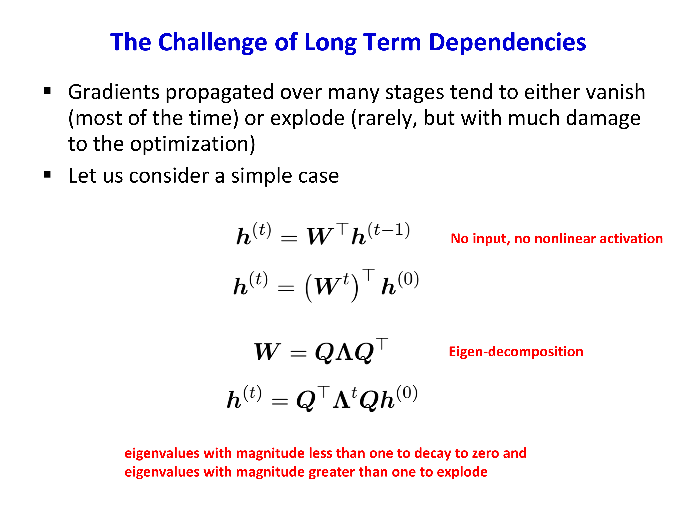{ width="650" }

如果在线性近似下把状态更新视作不断乘矩阵 $W$，那么梯度的大小会和 $W$ 的特征值模相关：

- 特征值模长 $< 1$ 时，信号指数衰减
- 特征值模长 $> 1$ 时，信号指数爆炸

这就是为什么 RNN 很难记住很久以前的信息。

### 5.2 直观理解

可以把普通 RNN 想成：每经过一个时间步，过去信息都要再通过一次“压缩 + 非线性变换”。步数一长，早期信息就会被反复冲淡。于是：

- 短期依赖通常还能学到
- 长期依赖则越来越难保留

这也是后面 LSTM/GRU、attention 甚至 Transformer 出现的根本动机。

## 6 LSTM：显式建模长期记忆

### 6.1 为什么需要 LSTM

课件给出的直觉例子很典型：

- “I grew up in France ... I speak fluent French.”

要正确预测后面内容，就必须保留很久之前的 “France” 信息。普通 RNN 很难做到这一点，而 LSTM 通过更细致的状态控制机制来解决这个问题。

### 6.2 LSTM 的核心状态

LSTM 里最关键的是两类状态：

- **cell state** $C_t$：更像长期记忆主干
- **hidden state** $h_t$：当前时刻暴露给外部的表示

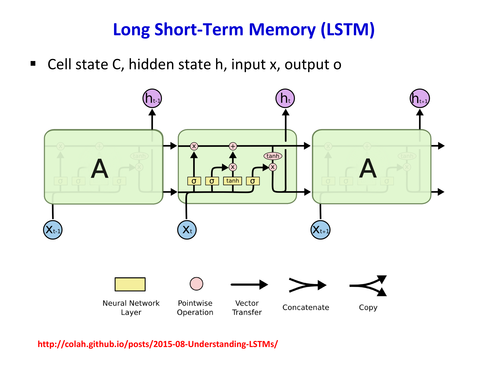{ width="650" }

LSTM 的更新不是简单一次非线性，而是由几个门控共同决定：

- forget gate：忘掉多少旧记忆
- input gate：写入多少新信息
- output gate：输出多少当前状态

### 6.3 LSTM 的更新逻辑

一种常见写法是：

$$
f_t = \sigma(W_f[h_{t-1}, x_t] + b_f)
$$

$$
i_t = \sigma(W_i[h_{t-1}, x_t] + b_i)
$$

$$
\tilde C_t = \tanh(W_c[h_{t-1}, x_t] + b_c)
$$

$$
C_t = f_t \odot C_{t-1} + i_t \odot \tilde C_t
$$

$$
o_t = \sigma(W_o[h_{t-1}, x_t] + b_o)
$$

$$
h_t = o_t \odot \tanh(C_t)
$$

其中：

- $f_t$ 决定旧记忆保留多少
- $i_t$ 决定候选记忆 $\tilde C_t$ 写入多少
- $o_t$ 决定当前暴露出去多少

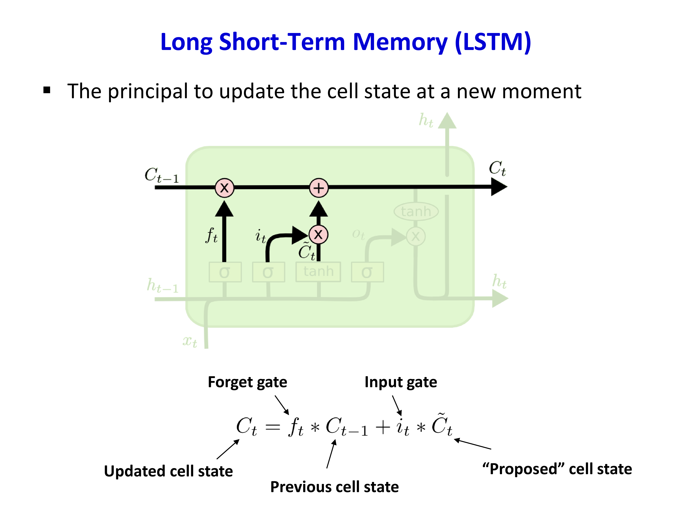{ width="650" }

### 6.4 为什么 LSTM 更能保留长期依赖

LSTM 的本质改进在于：它为记忆提供了一条更“线性”的通路。也就是说，$C_{t-1}$ 可以在 forget gate 接近 1 时较稳定地传到 $C_t$，不会像普通 RNN 那样每一步都被完全重写。

所以可以把 LSTM 理解成：

- 普通 RNN：每一步都在“重写状态”
- LSTM：每一步都在“编辑记忆”

这使得它在语言建模、翻译、视频理解等长序列任务中长期占据主流地位。

## 7 RNN/LSTM 的典型应用

### 7.1 Image Captioning

Image captioning 是“视觉输入 + 文本输出”的经典序列生成任务。通常做法是：

1. 用 CNN 提取图像特征
2. 把图像特征作为初始状态或输入条件
3. 用 RNN/LSTM 逐词生成描述句子

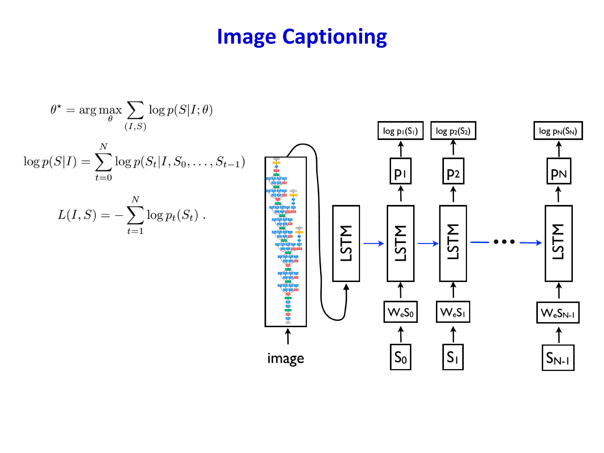{ width="650" }

这个任务很有代表性，因为它把视觉表征和语言序列建模真正连了起来，也是后来 attention 与 Transformer 在视觉语言任务里爆发的重要前奏。

### 7.2 Convolutional LSTM

如果输入本身是空间结构明显的序列，例如雷达图像、视频帧，那么直接把图像 flatten 后交给 LSTM 会丢掉空间局部结构。ConvLSTM 的核心改动是：**把全连接状态更新换成卷积更新**。

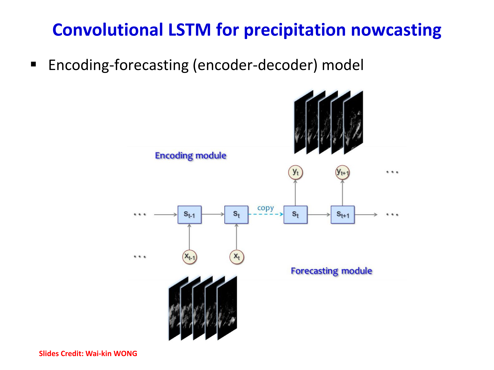{ width="650" }

因此：

- 输入、状态、输出都可以是 feature maps
- 时序建模和空间建模可同时进行

这对降雨预测（nowcasting）特别自然：一段时间上的气象图像序列输入进来，模型既要记住时间变化，也要保留空间云团结构。

### 7.3 Social LSTM

在多人轨迹预测里，一个人的未来运动不仅由自己过去轨迹决定，还受到周围人的影响。Social LSTM 的核心思想就是把“邻居之间的社会交互”显式融入状态建模。

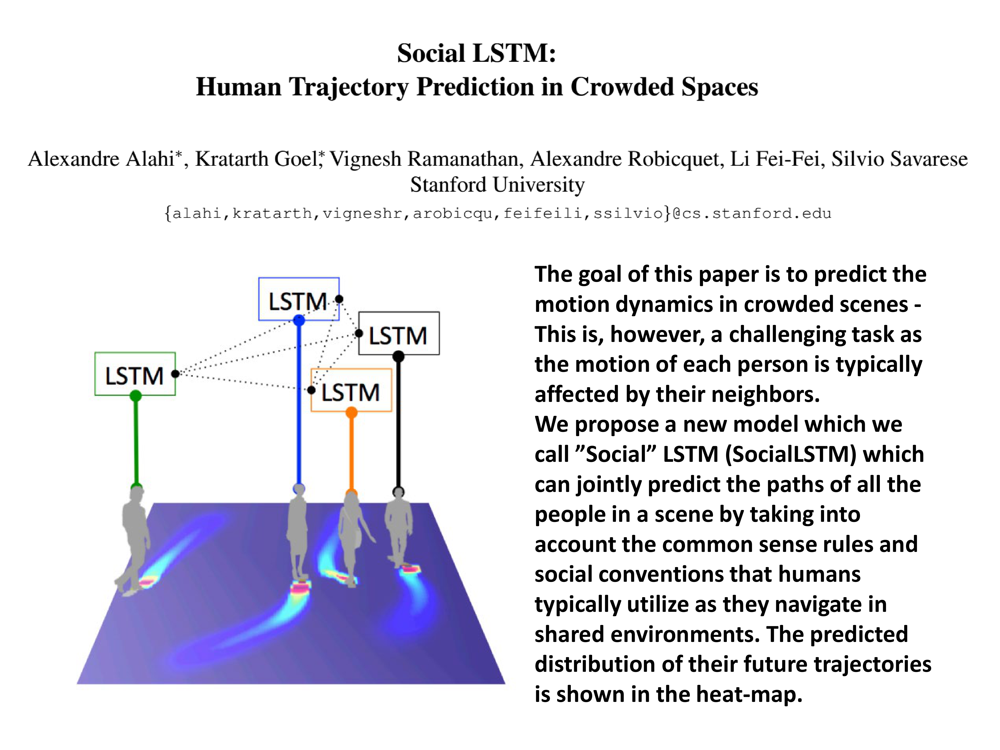{ width="650" }

可将其理解为：单人轨迹建模只是时间依赖，而多人场景里还要加上 **群体交互依赖**。

## 8 从固定上下文到 Attention

### 8.1 为什么 Seq2Seq 还不够

早期 encoder-decoder 的瓶颈是：不管输入序列多长，都要被压成一个固定长度向量 $C$。这会带来两个问题：

- 长句子容易信息瓶颈
- 解码某个词时，很难只聚焦于输入中真正相关的部分

Attention 的出现，实质上是把“固定上下文”改成“按需读取上下文”。

### 8.2 Bahdanau Soft Attention

Bahdanau attention 的思想是：在生成输出序列第 $t$ 个词时，不再只看一个固定向量，而是对输入的每个位置都打一个分数，再做 softmax 得到权重分布。

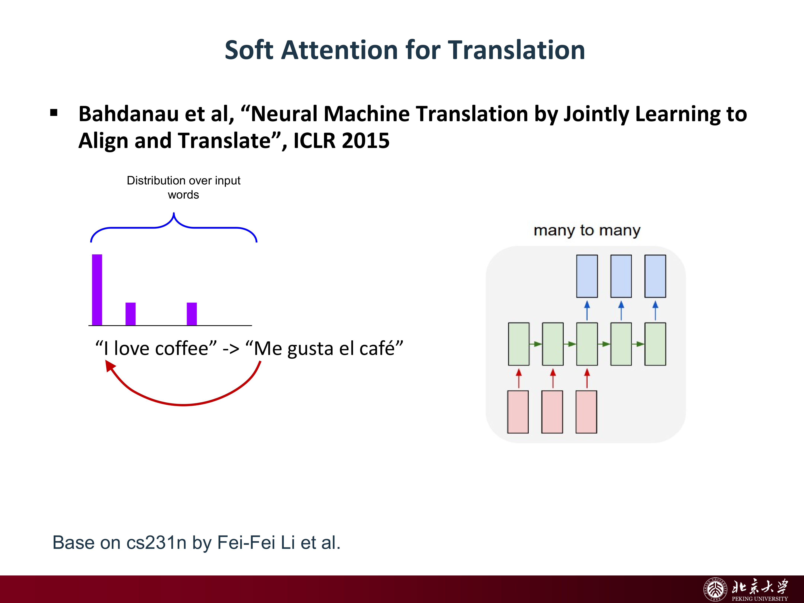{ width="650" }

于是当前上下文向量可写为：

$$
c_t = \sum_{i=1}^{T_x} \alpha_{t,i} h_i
$$

其中 $\alpha_{t,i}$ 表示在生成第 $t$ 个输出词时，对第 $i$ 个输入词分配的注意力权重。

这意味着解码器在不同时间步可以“看向”输入序列的不同部分，因此翻译与对齐（align）被统一到一个框架里。

### 8.3 Attention 在视觉中的意义

Attention 不仅适用于机器翻译，也被自然引入 image captioning：生成句子中不同词时，模型应关注图像的不同区域。

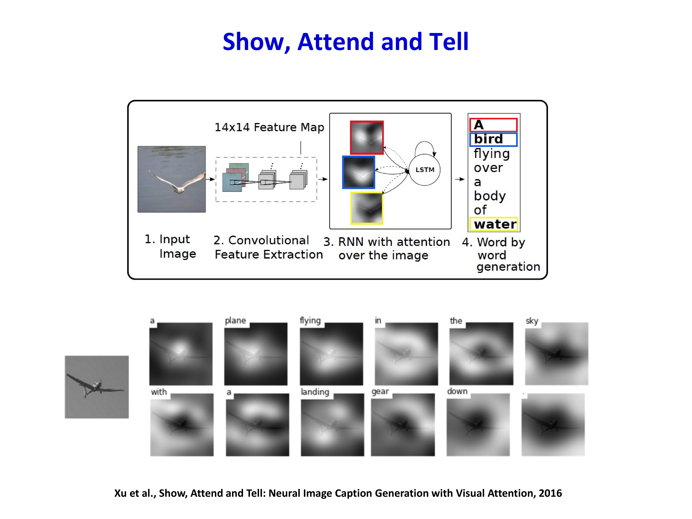{ width="650" }

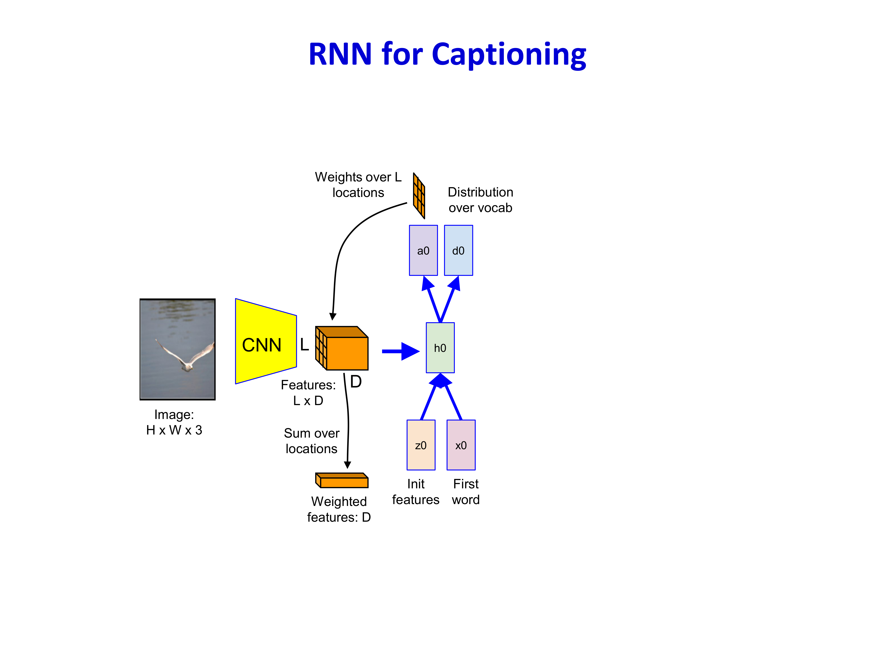{ width="650" }

这一步极其关键，因为它标志着：

- 从“全局固定图像特征”走向“动态空间关注”
- 从“时间上的记忆压缩”走向“显式选择相关上下文”

而 Transformer 可以看作把这种 attention 思想推广成网络的核心计算单元。

## 9 Transformer：用 Self-Attention 取代循环

### 9.1 Self-Attention 的基本直觉

Self-attention 的核心不再是“按时间一步一步传状态”，而是：**序列中每个位置都直接与其它位置交互，并根据相关性聚合信息。**

对某个位置的 query $q_i$，它会与所有 key $k_j$ 计算相似度，再对 value $v_j$ 做加权求和。

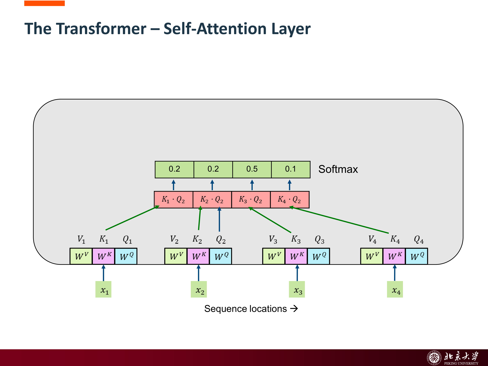{ width="650" }

其标准公式是：

$$
\operatorname{Attention}(Q,K,V)
=
\operatorname{softmax}\left(\frac{QK^\top}{\sqrt{d_k}}\right)V
$$

这里：

- $Q$：query matrix
- $K$：key matrix
- $V$：value matrix
- $d_k$：key 的维度，用于缩放点积避免数值过大

### 9.2 为什么 Transformer 并行性更强

RNN 必须按时间顺序依次更新，天然难并行。而 Transformer 把整段序列都写成矩阵：

- $Q$ 的每一行对应一个位置的 query
- $K$ 的每一行对应一个位置的 key
- $V$ 的每一行对应一个位置的 value

于是整次 attention 可以作为一个大矩阵运算一次性完成，这带来了极强的并行性，也成为 Transformer 在大规模训练中胜出的关键原因之一。

### 9.3 Multi-Head Attention

单个 attention head 只能在一种投影空间里看相关性，而多头注意力则通过多组不同的线性映射，让模型能从多个子空间并行观察依赖关系。

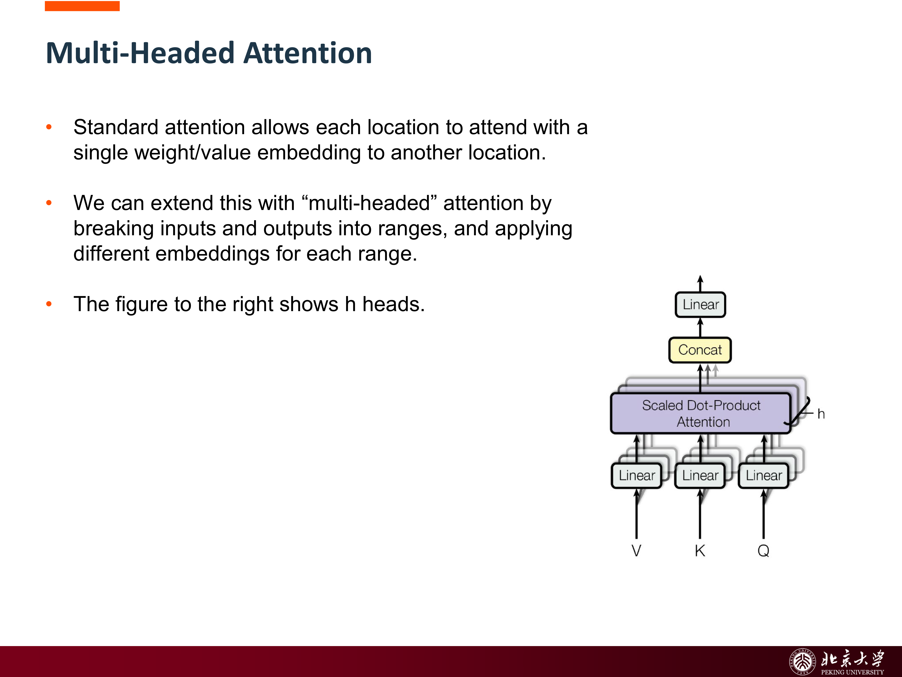{ width="650" }

它的直观作用包括：

- 一个 head 可能更关注句法关系
- 一个 head 更关注长距离依赖
- 一个 head 更关注局部邻近词

最终各 head 的输出会 concat 再线性映射，从而形成更丰富的表示。

### 9.4 Transformer Encoder / Decoder

Transformer 的标准结构分为 encoder 和 decoder 两部分。

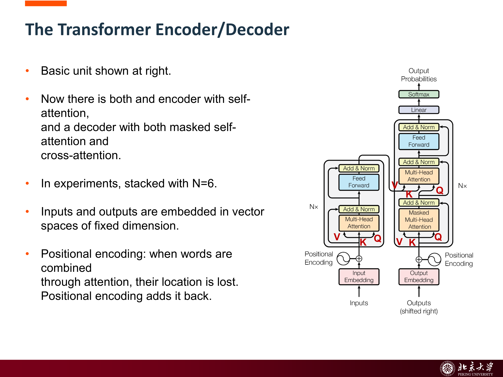{ width="650" }

Encoder 的每层通常包含：

- multi-head self-attention
- feed-forward network
- residual connection
- layer normalization

Decoder 的每层通常包含：

- masked self-attention
- encoder-decoder cross-attention
- feed-forward network
- residual + normalization

其中 **masked self-attention** 的作用是：在生成第 $t$ 个 token 时，不能偷看未来 token。

### 9.5 Positional Encoding

由于 self-attention 本身不区分顺序，若不额外处理，模型会丢失位置信息。因此 Transformer 需要加入 positional encoding。

它的作用非常直接：**把“这是第几个位置”重新注入到 token 表示中**。没有它，模型只能看到一堆 token 集合，而看不到顺序。

## 10 Transformer 与 RNN 的对比

课件最后专门做了 retrospect。两类模型可以从几个角度理解：

- **依赖路径长度**
  - RNN：两个远距离 token 之间需要经过很多时间步传递
  - Transformer：任意两个位置一次 attention 就能直接交互
- **并行性**
  - RNN：时间上串行
  - Transformer：整段序列高度并行
- **顺序建模方式**
  - RNN：顺序内建在递推中
  - Transformer：顺序靠 positional encoding 外加
- **长程依赖**
  - RNN：易受梯度消失影响
  - Transformer：更容易建模全局依赖，但注意力复杂度通常是 $O(T^2)$

因此可以说，Transformer 并不是“更强的 RNN”，而是换了一种完全不同的序列建模范式。

## 11 Transformer 走向视觉：ViT、DETR、Swin

### 11.1 ViT：把图像切成 patch token

ViT（Vision Transformer）的关键思想，是把图像切成固定大小的 patch，再把每个 patch 当作一个 token 输入 Transformer。

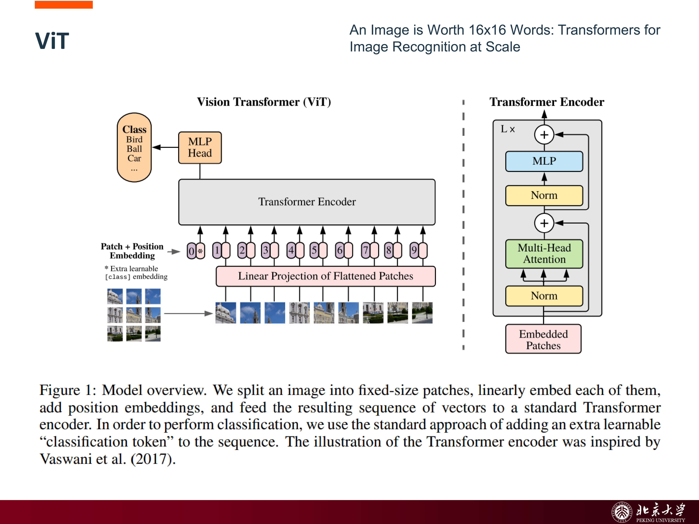{ width="650" }

这说明 Transformer 不只适用于语言，只要输入可以被离散成“序列化单元”，attention 就能直接工作。

### 11.2 DETR：目标检测中的 Transformer

DETR（Detection Transformer）把目标检测重新写成 **set prediction** 问题。

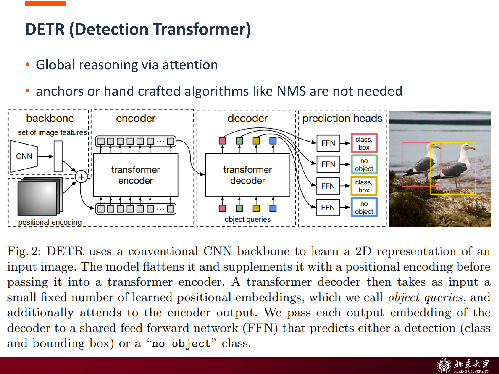{ width="650" }

其核心特点包括：

- 用 CNN backbone 提取图像特征
- 展平成序列后输入 Transformer encoder
- decoder 使用一组 learnable object queries
- 直接并行输出固定数量的候选目标

课件强调了它的一个重要卖点：**不再需要 anchors，也不再依赖手工设计的 NMS**。

### 11.3 DETR 的 set prediction loss

传统检测器往往依赖大量候选框与后处理，而 DETR 通过 bipartite matching 把预测集合与 GT 集合一一匹配，再计算 set loss。

这意味着检测被写成了一个更“干净”的端到端问题：

- 预测多少个目标
- 哪些预测对应真实目标
- 哪些预测应为 no object

### 11.4 Swin Transformer：局部窗口 + 层次结构

标准 ViT 的全局 self-attention 在高分辨率图像上计算代价很高，也不够适合需要层次特征图的视觉下游任务。Swin Transformer 的改进非常关键：

- 使用 **window-based self-attention**，把注意力限制在局部窗口内
- 使用 **shifted window**，让相邻层之间能够跨窗口交互
- 构造 **hierarchical feature maps**，更贴近 CNN 的多尺度表示

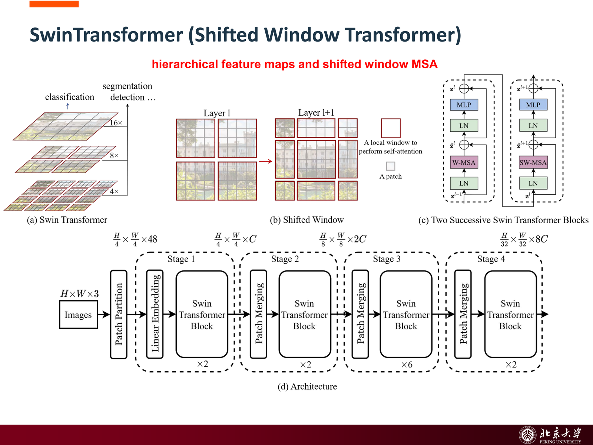{ width="650" }

所以 Swin 可以看作一个很成功的折中：

- 保留 Transformer 的注意力建模能力
- 同时引入更适合视觉任务的局部性与层次性

## 12 总结与主线串联

### 12.1 一条完整的演化主线

从这套课件的结构看，可以把主线总结为：

- **RNN**：用递归状态表示历史
- **LSTM**：通过门控机制缓解长程依赖问题
- **Seq2Seq + Attention**：把固定上下文变为动态对齐与读取
- **Transformer**：彻底移除循环，用 self-attention 直接建模全局依赖
- **ViT / DETR / Swin**：把 Transformer 扩展到视觉分类、检测与通用视觉 backbone

### 12.2 关键对比速查

!!! summary "RNN / LSTM / Transformer 速查"
    - **RNN**：状态递推，天然适合序列，但长程依赖难、并行性弱。
    - **LSTM**：引入 cell state 与门控，能更稳定保留长期记忆。
    - **Attention**：在当前步动态选择最相关的上下文，而不是只依赖单个固定向量。
    - **Transformer**：以 self-attention 为核心，依赖路径短、并行性强。
    - **ViT**：把图像 patch 当作 token。
    - **DETR**：把检测写成 set prediction，弱化 anchor / NMS。
    - **Swin**：通过窗口注意力与层次结构把 Transformer 做成通用视觉 backbone。

### 12.3 高频易错点

- 把 RNN 的 hidden state 当成“无损记忆”：它本质上只是对历史的固定维有损摘要。
- 认为 BPTT 是一种全新训练算法：其实只是把展开后的 RNN 直接做普通 BP。
- 认为 teacher forcing 是推理时也要用的策略：它主要用于训练阶段稳定优化。
- 认为 LSTM 完全解决了长程依赖：它是显著缓解，而不是彻底消除所有困难。
- 把 attention 理解成“只是一层加权平均”：关键在于权重是 **随当前 query 动态计算** 的。
- 以为 Transformer 不需要位置信息：self-attention 本身不编码顺序，必须显式补 position。
- 把 ViT / DETR / Swin 看成彼此无关的模型：它们都建立在 Transformer 的序列建模思想之上，只是面向不同视觉任务做了结构改造。

## 13 考试重点

- **RNN 基本公式**、时间展开与 BPTT
- **Bidirectional RNN** 的动机与结构
- **Seq2Seq**：encoder-decoder 的基本思想
- **梯度消失 / 爆炸** 的原因
- **LSTM**：forget gate、input gate、output gate、cell state 更新公式
- **Attention**：从固定上下文到动态对齐的思想转变
- **Self-Attention**：$\operatorname{softmax}(QK^\top/\sqrt{d_k})V$
- **Multi-Head Attention**：为什么需要多头
- **Transformer Encoder / Decoder**：masked self-attention、cross-attention、positional encoding
- **ViT / DETR / Swin**：各自解决的视觉问题与核心结构
