参考笔记链接：
[slides](slides/08_ACC_GD.pdf)
[notes](slides/notes_ch3.pdf)

本章围绕 **加速梯度下降**（Accelerated Gradient Descent）展开。我们从梯度下降在病态问题上的 “锯齿形” 现象出发，引入两类典型的加速策略：

- **动量法**：Polyak 的 heavy-ball（重球）动量、Nesterov 的加速梯度（NAG）。
- **多步历史外推**：Anderson acceleration。

在理论部分，我们给出 Nesterov 方法在 **一般凸** 与 **强凸** 场景下的严格收敛证明，并说明其达到一阶方法的 **最优复杂度**（lower bound）。

---

## 1 问题设定与基本不等式

考虑无约束优化问题：

$$
\min_{x\in\mathbb{R}^d} f(x),
$$

其中 $f$ 可微。

!!! abstract "定义 1.1（$L$-光滑 / $L$-smooth）"
    $f$ 是 $L$-光滑的，若对任意 $x,y\in\mathbb{R}^d$ 有

    $$
    \|\nabla f(x)-\nabla f(y)\|_2\le L\|x-y\|_2.
    $$

    等价地（下降引理），对任意 $x,y$ 有

    $$
    f(y)\le f(x)+\langle\nabla f(x),y-x\rangle+\frac{L}{2}\|y-x\|_2^2.
    $$

!!! abstract "定义 1.2（$\mu$-强凸 / $\mu$-strongly convex）"
    $f$ 是 $\mu$-强凸的，若存在 $\mu>0$ 使得对任意 $x,y$ 有

    $$
    f(y)\ge f(x)+\langle\nabla f(x),y-x\rangle+\frac{\mu}{2}\|y-x\|_2^2.
    $$

### 1.1 梯度下降（基线）

梯度下降（GD）更新为

$$
x_{k+1}=x_k-\gamma\nabla f(x_k).
$$

对于 $L$-光滑且凸的 $f$，典型选择 $\gamma\le 1/L$ 可保证稳定下降；但在 **条件数** $\kappa:=L/\mu$ 很大（等高线极扁）的情形，GD 容易出现明显的 “zig-zag”，收敛非常慢。

---

## 2 动量的直觉：缓解 “zig-zag”

动量方法的核心思想是：在负梯度方向下降之外，再加入一个与历史位移相关的外推项，从而让迭代轨迹更 “顺滑”。

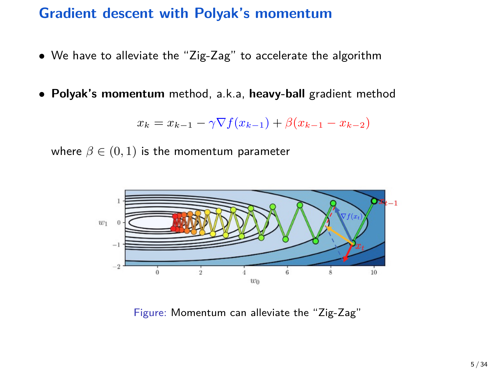{ width="800" }

---

## 3 Polyak 的 Heavy-Ball 动量（重球法）

### 3.1 算法

Heavy-ball（Polyak momentum）迭代为

$$
x_{k+1}=x_k-\gamma\nabla f(x_k)+\beta(x_k-x_{k-1}),\qquad \beta\in(0,1).
$$

它可以理解为：在 “当前位置” 的梯度下降基础上，叠加一段沿着历史速度 $(x_k-x_{k-1})$ 的惯性推进。

### 3.2 仅在二次型上可严格证明的加速

课件中用二次型目标展示 heavy-ball 的理论加速。设

$$
f(x)=\frac{1}{2}x^\top Ax,\qquad A\succeq 0.
$$

此时 $\nabla f(x)=Ax$，heavy-ball 变为线性递推。把状态拼成向量

$$
s_k=\begin{bmatrix}x_k\\x_{k-1}\end{bmatrix},
$$

则存在矩阵 $M$ 使得 $s_{k+1}=Ms_k$。

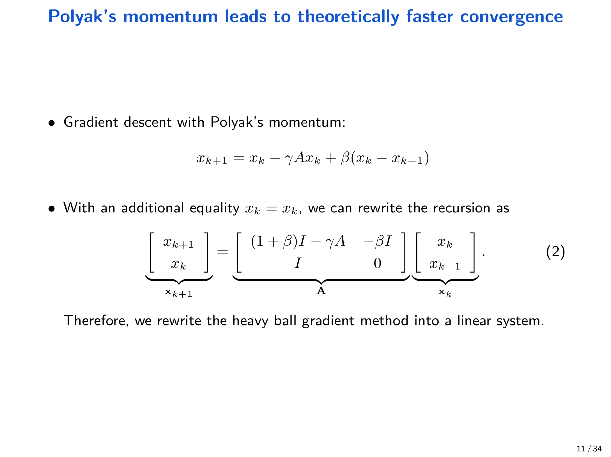{ width="800" }

进一步做谱分解，可将分析化为对每个特征方向上的 $2\times 2$ 递推。对 $L$-光滑且 $\mu$-强凸的二次型（即 $A$ 的特征值落在 $[\mu,L]$），可以选择一组 “最优” 参数使谱半径最小，从而得到比 GD 更快的线性收敛。

!!! abstract "结论 3.1（Heavy-ball 在二次型上的最优参数与速率）"
    对强凸二次型，可取

    $$
    \sqrt{\beta}=\frac{\sqrt{L}-\sqrt{\mu}}{\sqrt{L}+\sqrt{\mu}},
    \qquad
    \gamma=\frac{(1-\sqrt{\beta})^2}{\mu}=\frac{(1+\sqrt{\beta})^2}{L},
    $$

    并得到收敛因子

    $$
    \|x_k-x^\star\|_2
    \le C\left(\frac{\sqrt{L}-\sqrt{\mu}}{\sqrt{L}+\sqrt{\mu}}\right)^k,
    $$

    其中 $C$ 与初始化及谱分解常数有关。

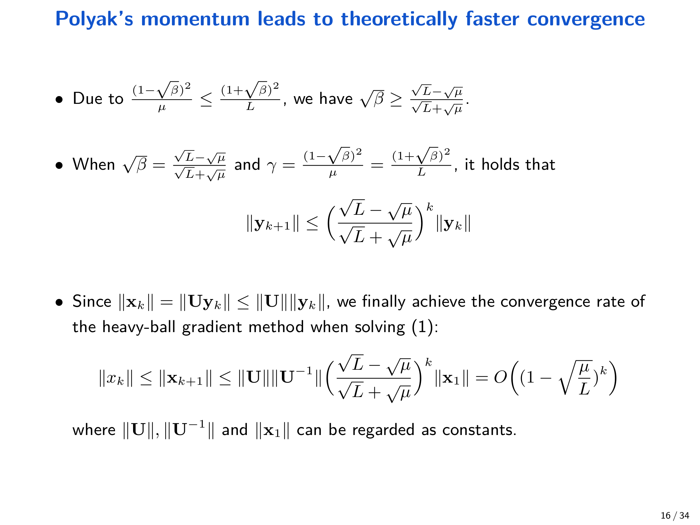{ width="800" }

!!! warning "Heavy-ball 的局限"
    heavy-ball 的 “理论加速” 证明高度依赖二次型的线性结构；对一般光滑凸函数，heavy-ball 是否能在最坏情形下严格优于 GD 并不清楚（课件中也强调这一点）。

---

## 4 Nesterov 加速梯度（NAG）

Nesterov 加速梯度是最经典的一阶加速方法，也是后续 lower bound 意义下的 **最优** 一阶算法原型。

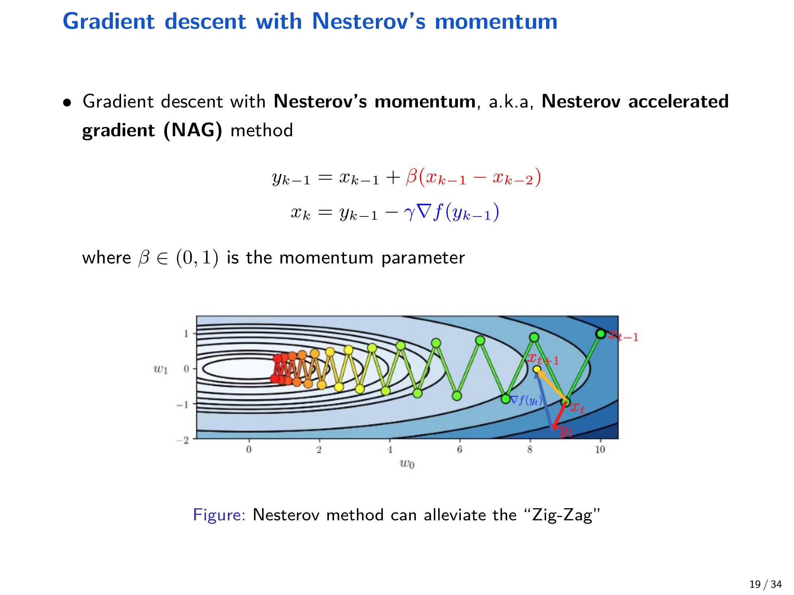{ width="800" }

### 4.1 算法（两序列形式）

笔记中的 Nesterov 动量梯度下降写作：

$$
\begin{aligned}
y_{k-1} &= x_{k-1} + \beta_k (x_{k-1}-x_{k-2}),\\
x_k &= y_{k-1} - \gamma \nabla f(y_{k-1}),
\end{aligned}
$$

其中 $\gamma>0$ 为步长，$\beta_k\in(0,1)$ 为动量系数（可随 $k$ 变化），并取初始化 $x_1=x_0$。

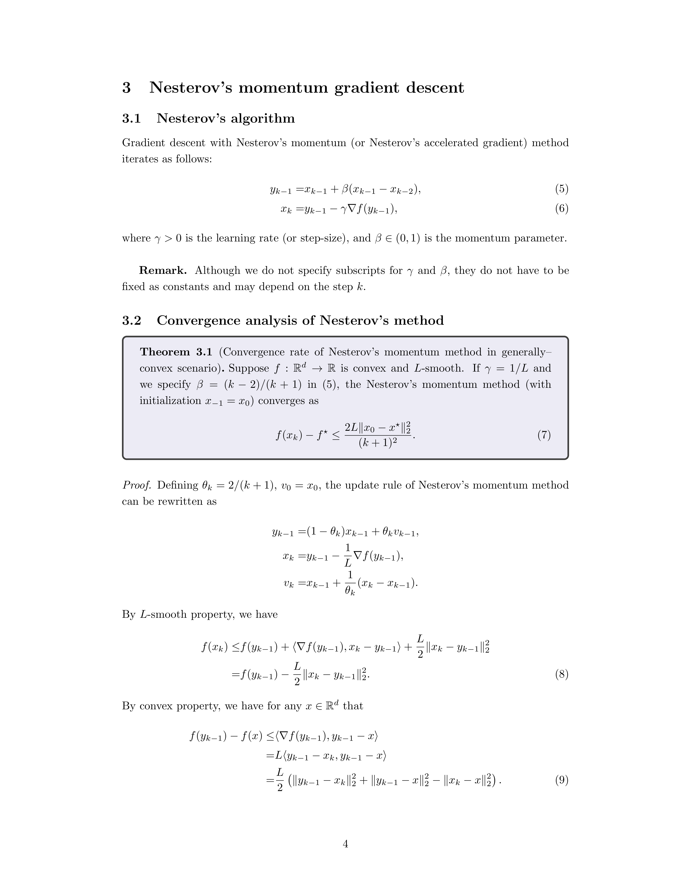{ width="800" }

### 4.2 一般凸情形：$O(1/k^2)$ 收敛

!!! abstract "定理 4.1（一般凸 + 光滑：Nesterov 的收敛率）"
    设 $f:\mathbb{R}^d\to\mathbb{R}$ 为凸且 $L$-光滑。取

    $$
    \gamma=\frac{1}{L},
    \qquad
    \beta_k=\frac{k-2}{k+1},
    $$

    则对所有 $k\ge 1$，

    $$
    f(x_k)-f^\star
    \le
    \frac{2L\|x_0-x^\star\|_2^2}{(k+1)^2}.
    $$

#### 4.2.1 等价三序列形式（用于证明）

令

$$
\theta_k:=\frac{2}{k+1},
$$

并定义辅助序列 $v_k$，可以把更新写成等价形式：

$$
\begin{aligned}
y_{k-1} &= (1-\theta_k)x_{k-1}+\theta_k v_{k-1},\\
x_k &= y_{k-1}-\frac{1}{L}\nabla f(y_{k-1}),\\
v_k &= x_{k-1}+\frac{1}{\theta_k}(x_k-x_{k-1}).
\end{aligned}
$$

这个形式的关键是：$v_k$ 让我们能够构造一个会 **单调下降** 的势函数，从而完成伸缩求和。

#### 4.2.2 两个核心不等式

令 $y:=y_{k-1}$，$x^+:=x_k=y-\frac{1}{L}\nabla f(y)$。

**(1) 由 $L$-光滑性（下降引理）得到：**

$$
\begin{aligned}
f(x^+)
&\le
f(y)+\left\langle\nabla f(y),x^+-y\right\rangle+\frac{L}{2}\|x^+-y\|_2^2\\
&=
f(y)-\frac{L}{2}\|x^+-y\|_2^2.
\end{aligned}
$$

对照到序列即

$$
f(x_k)\le f(y_{k-1})-\frac{L}{2}\|x_k-y_{k-1}\|_2^2.
$$

**(2) 由凸性得到：对任意 $x\in\mathbb{R}^d$**

$$
f(y)-f(x)\le \left\langle \nabla f(y),y-x\right\rangle.
$$

又由于 $x^+=y-\frac{1}{L}\nabla f(y)$，等价于 $\nabla f(y)=L(y-x^+)$，于是

$$
\begin{aligned}
f(y)-f(x)
&\le L\langle y-x^+,y-x\rangle\\
&=\frac{L}{2}\left(\|y-x^+\|_2^2+\|y-x\|_2^2-\|x^+-x\|_2^2\right).
\end{aligned}
$$

对照到序列即

$$
f(y_{k-1})-f(x)
\le
\frac{L}{2}\left(\|y_{k-1}-x_k\|_2^2+\|y_{k-1}-x\|_2^2-\|x_k-x\|_2^2\right).
$$

把两式相加消去 $\|y_{k-1}-x_k\|^2$，得到对任意 $x$ 的关键不等式：

$$
f(x_k)-f(x)
\le
\frac{L}{2}\left(\|y_{k-1}-x\|_2^2-\|x_k-x\|_2^2\right).
$$

#### 4.2.3 选取比较点并构造势函数

令比较点为

$$
x=(1-\theta_k)x_{k-1}+\theta_k x^\star.
$$

由凸性，

$$
f(x)\le (1-\theta_k)f(x_{k-1})+\theta_k f^\star,
$$

因此

$$
f(x_k)-(1-\theta_k)f(x_{k-1})-\theta_k f^\star
\le
f(x_k)-f(x).
$$

结合前一节的不等式得到

$$
f(x_k)-f^\star-(1-\theta_k)\bigl(f(x_{k-1})-f^\star\bigr)
\le
\frac{L}{2}\left(\|y_{k-1}-x\|_2^2-\|x_k-x\|_2^2\right).
$$

接下来用三序列形式把右侧改写成 $v_{k-1},v_k$ 的差。

由 $y_{k-1}=(1-\theta_k)x_{k-1}+\theta_k v_{k-1}$ 可得

$$
y_{k-1}-x=\theta_k(v_{k-1}-x^\star).
$$

由 $v_k=x_{k-1}+\frac{1}{\theta_k}(x_k-x_{k-1})$ 可化简得到

$$
x_k-x=\theta_k(v_k-x^\star).
$$

代回得

$$
f(x_k)-f^\star-(1-\theta_k)\bigl(f(x_{k-1})-f^\star\bigr)
\le
\frac{L\theta_k^2}{2}\left(\|v_{k-1}-x^\star\|_2^2-\|v_k-x^\star\|_2^2\right).
$$

移项并除以 $L\theta_k^2$，得到单调性（伸缩）结构：

$$
\frac{1}{L\theta_k^2}\bigl(f(x_k)-f^\star\bigr)+\frac{1}{2}\|v_k-x^\star\|_2^2
\le
\frac{1}{L\theta_{k-1}^2}\bigl(f(x_{k-1})-f^\star\bigr)+\frac{1}{2}\|v_{k-1}-x^\star\|_2^2.
$$

于是势函数

$$
\Psi_k:=\frac{1}{L\theta_k^2}\bigl(f(x_k)-f^\star\bigr)+\frac{1}{2}\|v_k-x^\star\|_2^2
$$

是非增的。由 $\theta_k=2/(k+1)$ 与初始化 $v_0=x_0$，可推出

$$
f(x_k)-f^\star
\le
L\theta_k^2\cdot\Psi_1
\le
L\theta_k^2\cdot \frac{1}{2}\|x_0-x^\star\|_2^2
=
\frac{2L\|x_0-x^\star\|_2^2}{(k+1)^2}.
$$

### 4.3 强凸情形：线性（指数）收敛

!!! abstract "定理 4.2（强凸 + 光滑：Nesterov 的收敛率）"
    设 $f$ 为 $\mu$-强凸且 $L$-光滑。取

    $$
    \gamma=\frac{1}{L},
    \qquad
    \beta=\frac{\sqrt{L}-\sqrt{\mu}}{\sqrt{L}+\sqrt{\mu}},
    $$

    则存在势函数 $\Phi_k$ 使得

    $$
    \Phi_k\le \left(1-\sqrt{\frac{\mu}{L}}\right)\Phi_{k-1},
    $$

    从而得到

    $$
    f(x_k)-f^\star
    \le
    \left(1-\sqrt{\frac{\mu}{L}}\right)^k\left(f(x_0)-f^\star+\frac{\mu}{2}\|x_0-x^\star\|_2^2\right).
    $$

#### 4.3.1 等价更新与势函数

讲义给出一个与两序列形式等价的更新（用 $v_k$ 表示）：

$$
\begin{aligned}
y_{k-1} &= x_{k-1} + \frac{\sqrt{L}-\sqrt{\mu}}{\sqrt{L}+\sqrt{\mu}}\,v_{k-1},\\
x_k &= y_{k-1}-\frac{1}{L}\nabla f(y_{k-1}),\\
v_k &= \frac{\sqrt{L}-\sqrt{\mu}}{\sqrt{L}+\sqrt{\mu}}\,v_{k-1}+\frac{\sqrt{L}}{\sqrt{L}+\sqrt{\mu}}\,(x_k-y_{k-1}),
\end{aligned}
$$

并取 $v_0=x_0$。

定义势函数

$$
\Phi_k:=f(x_k)-f^\star+\frac{\mu}{2}\|v_k-x^\star\|_2^2,
$$

讲义通过把 $L$-光滑与 $\mu$-强凸的两边界不等式按比例组合，构造出一个 “交叉项被抵消” 的收缩关系，最终得到

$$
\Phi_k\le \left(1-\sqrt{\frac{\mu}{L}}\right)\Phi_{k-1}.
$$

该结论的意义是：在强凸情形，Nesterov 将 GD 的 $O((1-\mu/L)^k)$ 改善为 $O((1-\sqrt{\mu/L})^k)$，从而把迭代复杂度从 $O(\kappa\log(1/\epsilon))$ 降到 $O(\sqrt{\kappa}\log(1/\epsilon))$。

---

## 5 Anderson Acceleration

Anderson acceleration 可以视为对固定点迭代的多步外推。令

$$
g(x):=x-\gamma\nabla f(x),
$$

则最优点 $x^\star$ 满足 $x^\star=g(x^\star)$。Anderson 在每一步使用过去 $m+1$ 个历史状态，解一个带约束的最小二乘来组合它们，从而得到更快的实践表现。

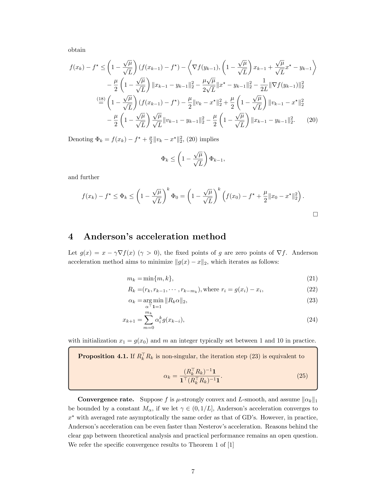{ width="800" }

### 5.1 算法（讲义形式）

令 $m_k:=\min\{m,k\}$，残差 $r_i:=g(x_i)-x_i$，并令 $R_k=(r_k,r_{k-1},\ldots,r_{k-m_k})$。Anderson 的更新为：

$$
\begin{aligned}
m_k &:= \min\{m,k\},\\
\alpha_k &:= \arg\min_{\alpha:\;\alpha^\top\mathbf{1}=1}\|R_k\alpha\|_2,\\
x_{k+1} &:= \sum_{i=0}^{m_k}\alpha_{k,i}\,g(x_{k-i}).
\end{aligned}
$$

!!! abstract "命题 5.1（闭式解的等价形式）"
    若 $R_k^\top R_k$ 非奇异，则上面的带约束最小二乘有等价闭式表达（讲义给出具体形式），可由 KKT 条件推导得到。

!!! info "收敛性（讲义备注）"
    在 $\mu$-强凸且 $L$-光滑假设下，若进一步假设 $\|\alpha_k\|_1$ 有界并取 $\gamma\in(0,1/L]$，Anderson 的渐近收敛阶与 GD 同量级；但在实践中，它常常比 Nesterov 更快，理论与实践之间的差距仍是开放问题。

---

## 6 Lower Bound 与最优性

一阶方法的经典模型假设算法只能访问梯度信息，并满足

$$
x_k \in x_0+\mathrm{span}\{\nabla f(x_0),\nabla f(x_1),\ldots,\nabla f(x_{k-1})\}.
$$

在该模型下，Nesterov 的速率是最优的。

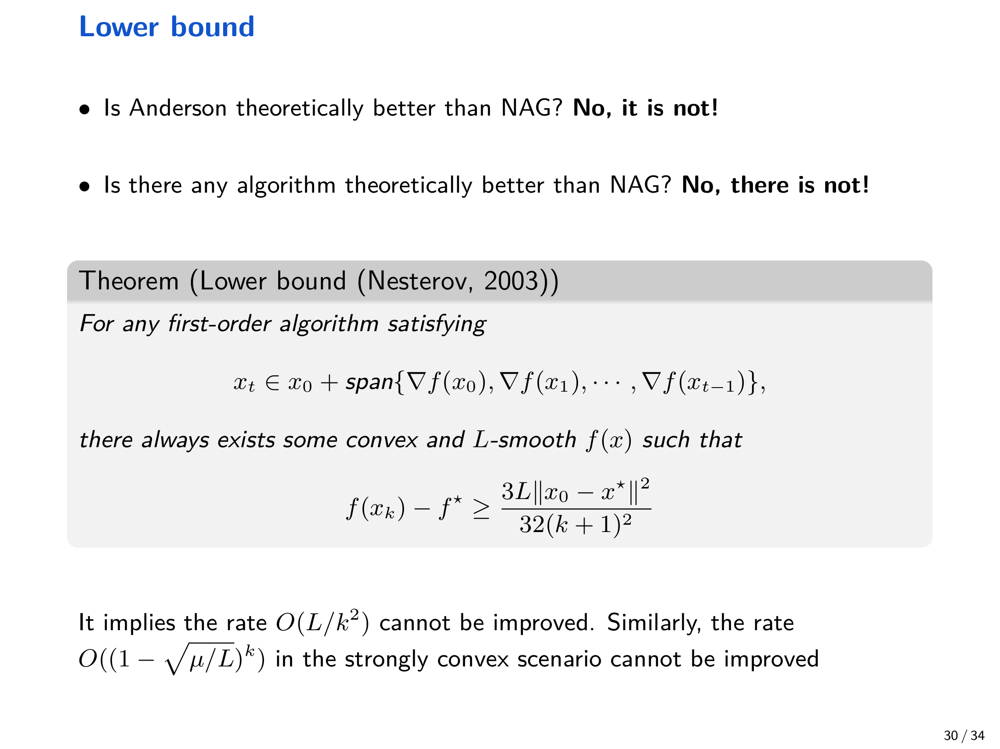{ width="800" }

!!! abstract "定理 6.1（一般凸：复杂度下界）"
    对任意满足上述一阶信息模型的算法，总存在某个凸且 $L$-光滑的 $f$，使得

    $$
    f(x_k)-f^\star \ge \frac{3L\|x_0-x^\star\|_2^2}{32(k+1)^2}.
    $$

!!! abstract "定理 6.2（强凸：复杂度下界）"
    对任意满足上述一阶信息模型的算法，总存在某个 $\mu$-强凸且 $L$-光滑的 $f$，使得

    $$
    f(x_k)-f^\star
    \ge
    \frac{\mu}{2}\left(\frac{2\sqrt{\mu}}{\sqrt{L}+\sqrt{\mu}}\right)^k\|x_0-x^\star\|_2^2.
    $$

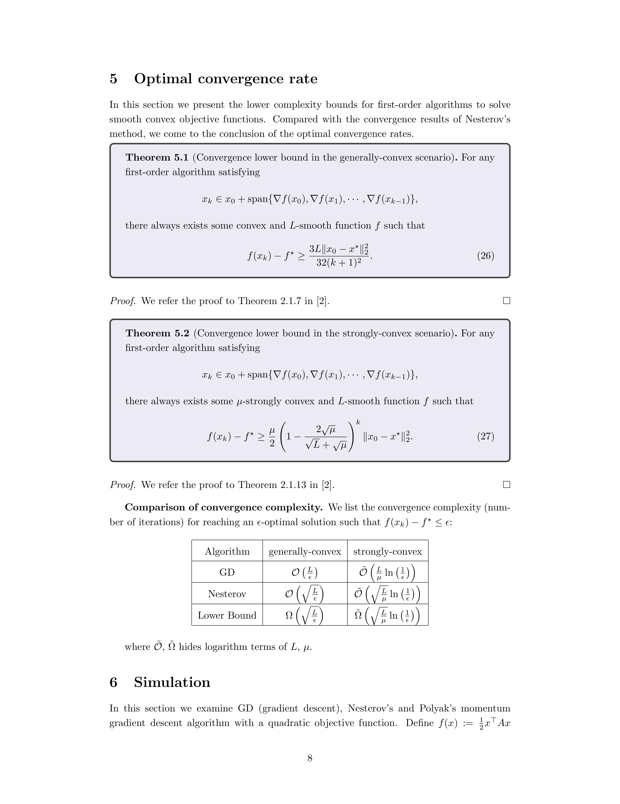{ width="800" }

---

## 7 数值实验：二次型上的对比

讲义用二维二次型展示四类方法的行为差异。定义

$$
f(x):=\frac{1}{2}x^\top Ax,
\qquad
A=\begin{bmatrix}1&0\\0&20\end{bmatrix},
$$

则 $f$ 为 $1$-强凸且 $20$-光滑。以 $(10,1)$ 为初始点，展示迭代点轨迹与损失下降曲线：

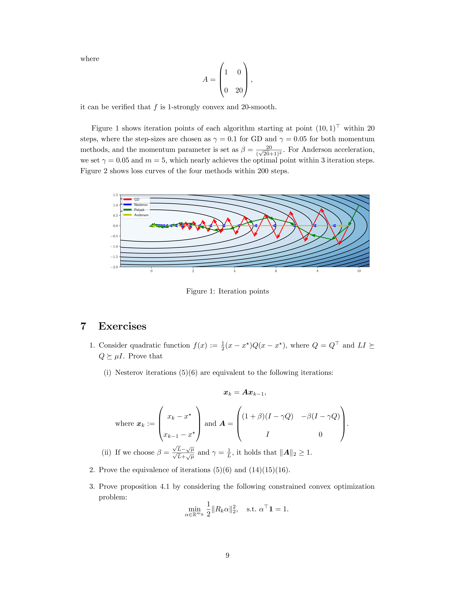{ width="750" }

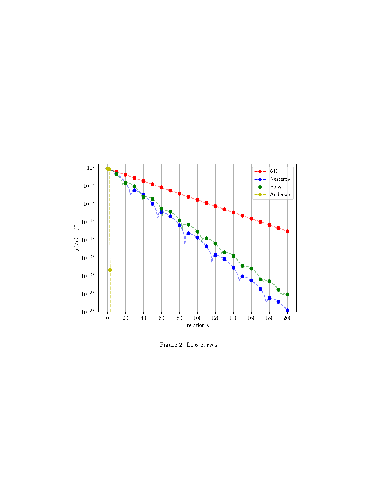{ width="750" }

课件也给出了对比图（GD / Polyak / Nesterov / Anderson）：

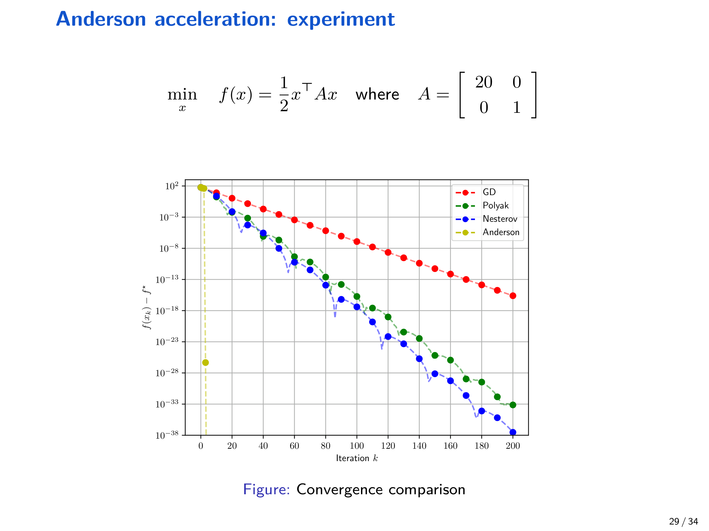{ width="750" }

---

## 8 练习

1. 考虑二次型 $f(x)=\frac{1}{2}(x-x^\star)^\top Q(x-x^\star)$，其中 $Q=Q^\top$ 且 $LI\succeq Q\succeq \mu I$。

    - 证明 Nesterov 迭代可写成一个关于 $\begin{bmatrix}x_k-x^\star\\x_{k-1}-x^\star\end{bmatrix}$ 的线性系统，并写出对应矩阵。
    - 当 $\beta=\frac{\sqrt{L}-\sqrt{\mu}}{\sqrt{L}+\sqrt{\mu}}$ 且 $\gamma=1/L$ 时，证明谱范数 $\|A\|_2\ge 1$（该问题提醒：参数选择与分析需要更精细的势函数，而非直接看线性系统谱半径）。

2. 证明两序列形式的 Nesterov 迭代与强凸情形的三序列形式（含 $v_k$）等价。

3. 用 KKT 条件证明 Anderson 的命题 5.1（等价闭式解）。

---

## 9 总结

- Polyak heavy-ball 与 Nesterov 动量都能在实践中显著缓解 GD 的 zig-zag。
- Heavy-ball 的严格加速结论主要建立在二次型（线性递推）上。
- Nesterov 在一般凸情形达到 $O(1/k^2)$，在强凸情形达到 $O((1-\sqrt{\mu/L})^k)$，并且在一阶信息模型下达到最优复杂度下界。
- Anderson acceleration 虽在最坏情形下不优于 Nesterov，但在许多任务中表现非常强，理论解释仍在发展中。
