[Chain of Thoughts](slides/CoT.pdf)

这份笔记按课件主线整理 **Chain of Thought（CoT）** 及其后续扩展方法。主题并不只是一个 prompt 技巧，而是围绕这样一个核心问题展开：

> 当大语言模型面对需要多步推理的问题时，怎样让它“想得更慢、更清楚、更有条理”。

从课件结构来看，整条主线是：

- 为什么 LLM 在简单任务上强、在复杂推理上弱
- CoT 到底是什么，为什么有效
- few-shot CoT、zero-shot CoT、Auto-CoT
- self-consistency
- Tree of Thoughts（ToT）
- Graph of Thoughts（GoT）

## 1 为什么需要 CoT：LLM 并不天然擅长慢思考任务

课件一开始借用了心理学中的两套系统来解释推理问题：

- **System-I**
- **System-II**

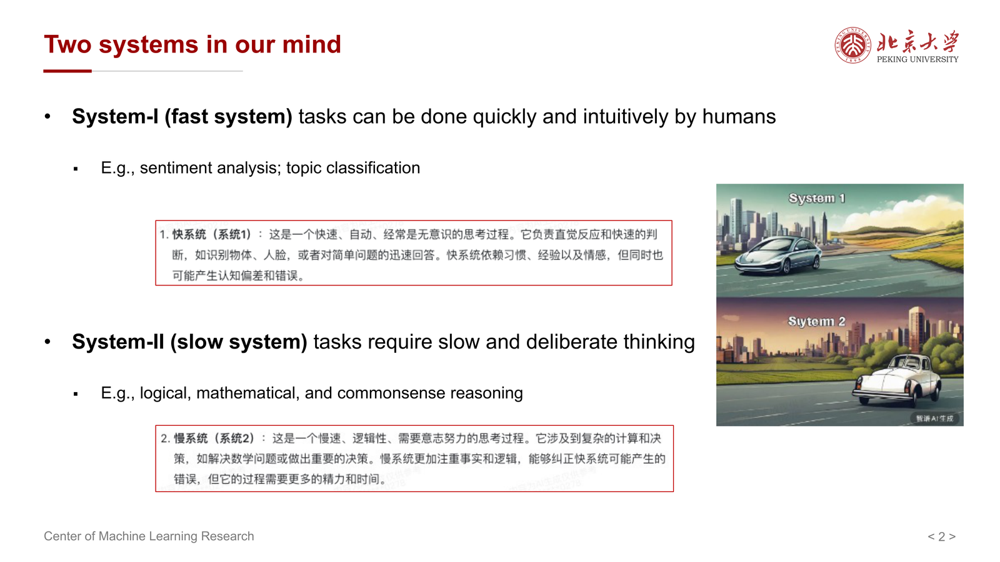{ width="800" }

其中：

- System-I 是快系统，强调直觉、快速反应
- System-II 是慢系统，强调审慎、分步、推理

课件给出的例子是：

- fast-system tasks：情感分析、主题分类
- slow-system tasks：逻辑推理、数学推理、常识推理

这个区分非常重要，因为它解释了一个常见现象：

- 模型规模变大时，简单模式识别任务提升很快
- 但复杂推理任务提升得没有那么线性、没有那么稳定

因此 CoT 的动机可以理解为：

> 大模型已经很会“快速匹配答案”，但未必天然会“逐步展开推理”。

## 2 什么是 Chain of Thought

课件给出的定义是：

> a coherent series of short sentences that lead to the answer for a reasoning problem

也就是：

- 一系列连贯的中间推理句子
- 它们共同把问题一步一步引向最终答案

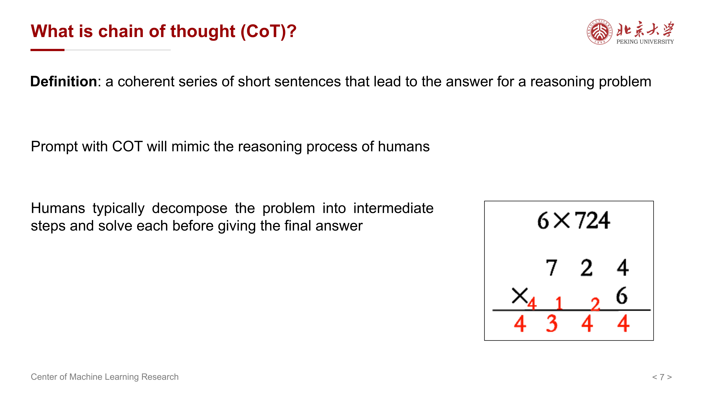{ width="800" }

如果不用 CoT，模型往往被要求直接给出最终结果；而用了 CoT，模型会先显式写出中间步骤，再给出结论。

这与人类做复杂题时的过程非常相似：

- 先拆问题
- 再解中间步骤
- 最后汇总答案

## 3 为什么 CoT 有用

课件总结了 CoT 有效的几个原因：

- 它允许模型把多步问题拆解成中间步骤
- 它给需要推理的问题分配了更多计算过程
- 它显式示范了“答案是怎么来的”
- 它使很多 slow-system task 可以被语言化处理

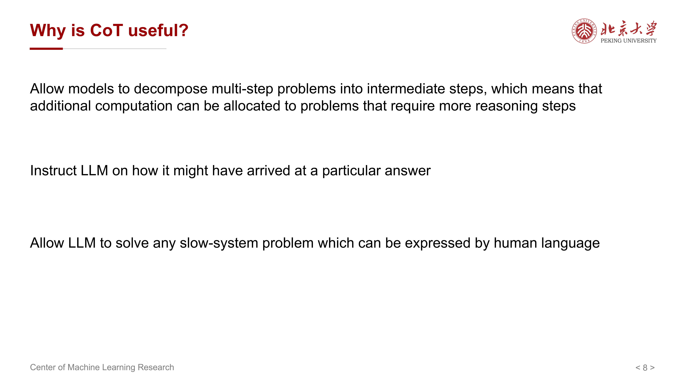{ width="800" }

其核心价值并不是单纯“让回答更长”，而是：

> 把原本隐藏在模型内部、可能一闪而过的推理过程，显式展开成若干个受语言约束的中间步骤。

这样做的好处包括：

- 降低一步到位时的跳步错误
- 强迫模型逐层分解任务
- 更容易让 prompt 对推理路径施加控制

## 4 CoT 应该怎么写

课件给了三类典型示例：

- math reasoning
- symbolic reasoning
- commonsense reasoning

从这些示例可以抽象出一个通用原则：

- 每一步只做一个明确的小推导
- 前后步骤要保持语义连贯
- 最终答案要能从中间过程自然推出

这意味着，一个好的 CoT 通常不是：

- 很多无关赘述
- 冗长但无结构的自言自语

而是：

- 有中间变量
- 有分解步骤
- 有局部结论
- 有最终汇总

## 5 CoT 的性能表现与消融观察

课件中专门展示了 CoT 在 fast-system 与 slow-system 任务上的表现对比。

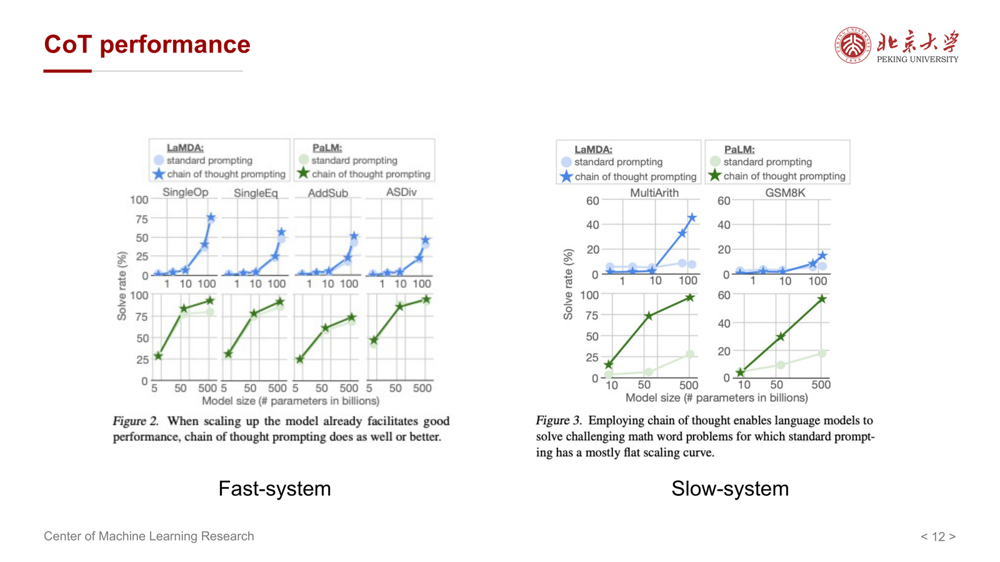{ width="800" }

最重要的结论是：

- CoT 对快系统任务帮助有限
- 对慢系统推理任务帮助更显著

这是非常符合直觉的，因为：

- 简单分类题本来就不需要复杂推理链
- 真正受益于 CoT 的，是那些必须经过中间步骤才能稳定求解的问题

课件的 ablation study 还指出：

- equations 很重要
- sentence description 很重要
- order 也很重要

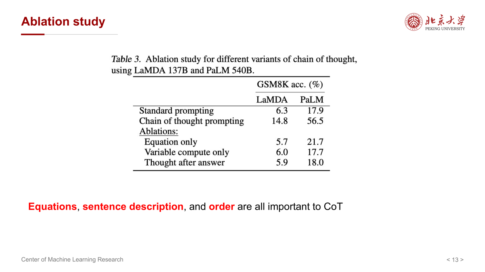{ width="800" }

这说明 CoT 的效果并不只是“多写几句话”就有，而是与以下因素密切相关：

- 步骤内容本身是否有信息量
- 步骤顺序是否合理
- 数学或符号表达是否准确

## 6 Few-shot CoT 的基本范式

最经典的 CoT 做法，其实是 **few-shot prompting**：

- 在 prompt 中给出若干带有推理过程的示例
- 再让模型模仿这些示例的推理格式处理新题

它背后的假设是：

- 模型已经在预训练中见过大量自然语言与推理模式
- 只要给它一个合适的格式引导，它就能模仿这种“先推理、后作答”的行为

这种方法常常有效，但也有明显成本：

- 要手工写示例
- 对每类任务都要精心设计
- prompt 很长

这就引出了后面的 zero-shot 与自动化方法。

## 7 Zero-shot CoT：Let’s think step by step

### 7.1 核心思想

课件介绍的一个非常经典的发现是：

> 即使不给推理示例，只要在 prompt 中加上一句 “Let’s think step by step”，模型的推理表现也可能显著提升。

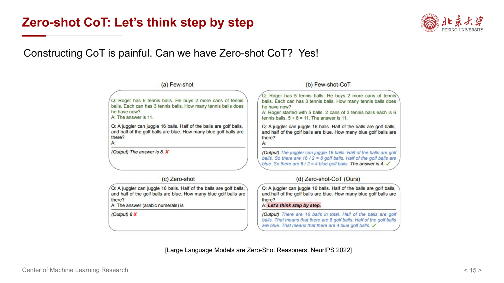{ width="800" }

这就是 **zero-shot CoT** 的基本思想：

- 不给 few-shot 示例
- 只给一个非常短的推理触发语
- 让模型自行展开中间步骤

### 7.2 为什么它令人惊讶

在传统 prompt 设计里，人们通常认为：

- 复杂推理需要精心写好的 demonstration

而 zero-shot CoT 表明：

- 对足够强的大模型，仅仅显式触发“请逐步思考”，就可能调动出潜在的推理能力

课件给出的提升数字很醒目：

- From 17.7% to 78.7%
- From 10.4% to 40.7%

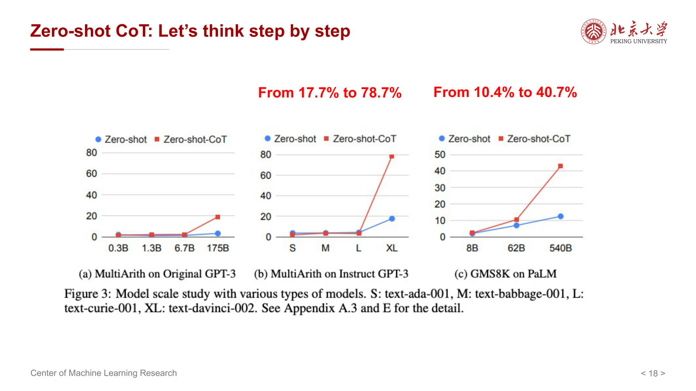{ width="800" }

这说明模型内部并非完全没有推理能力，只是很多时候没有被正确调用。

### 7.3 它的局限

当然，zero-shot CoT 并不意味着：

- 所有推理任务只要加一句话就能解决

它更适合：

- 模型本身已经足够强
- 任务可以被自然语言分步骤表达
- 需要的是激活已有能力，而非注入全新知识

## 8 Auto-CoT：自动构造推理示例

few-shot CoT 有一个麻烦点：人工写示例很费劲。于是课件介绍 **Auto-CoT**：

- 自动生成 CoT demonstrations
- 再把这些自动生成的示例用于 prompting

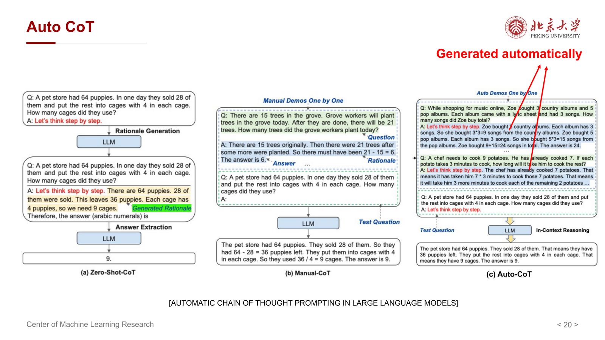{ width="800" }

它的核心目标是：

> 把“人工构造高质量推理链”这件事自动化。

这样做的意义在于：

- 降低 prompt 工程成本
- 更容易扩展到多任务场景
- 减少对人工 expert demonstration 的依赖

但要注意，Auto-CoT 的效果仍取决于：

- 自动生成示例的质量
- 是否覆盖了代表性题型
- 是否会传播错误推理模式

## 9 Self-Consistency：不要只走一条推理路径

### 9.1 基本思想

课件介绍的 **self-consistency（SC）** 是 CoT 的一个重要增强方法。

其核心观察是：

- 一个复杂问题通常存在多条合理推理路径
- 正确答案往往唯一
- 错误路径之间未必一致

于是 self-consistency 的策略是：

- 不只采样一条 greedy reasoning path
- 而是采样多条不同的 CoT
- 最后对答案做投票或一致性选择

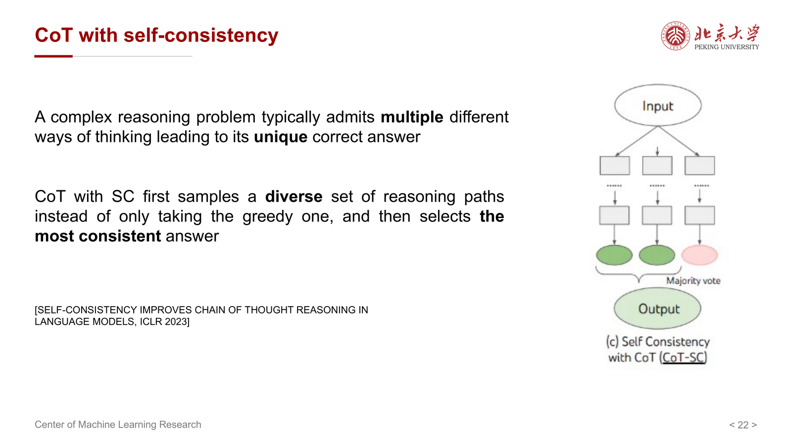{ width="800" }

### 9.2 为什么它有效

如果只取一条推理链，模型可能因为局部错误而整条链崩掉；而如果采样多条链：

- 正确路径更可能在多个样本中重复出现
- 偶然错误更容易被多数投票抵消

因此 self-consistency 的本质是：

> 把“单路径推理”变成“多路径采样 + 最终聚合”。

这在推理问题上尤其自然，因为我们关心的往往是最终答案是否稳健，而不是某一条单独推理链是否漂亮。

## 10 Tree of Thoughts（ToT）：从线性链到搜索树

### 10.1 为什么要从 chain 走向 tree

CoT 默认是一条线性的 thought chain：

- 一步接一步
- 一旦某一步偏掉，后面也会跟着偏掉

而很多复杂问题其实更像搜索问题：

- 需要尝试多个中间方案
- 发现走不通时回退
- 再探索其他分支

这就是 **Tree of Thoughts（ToT）** 的出发点。

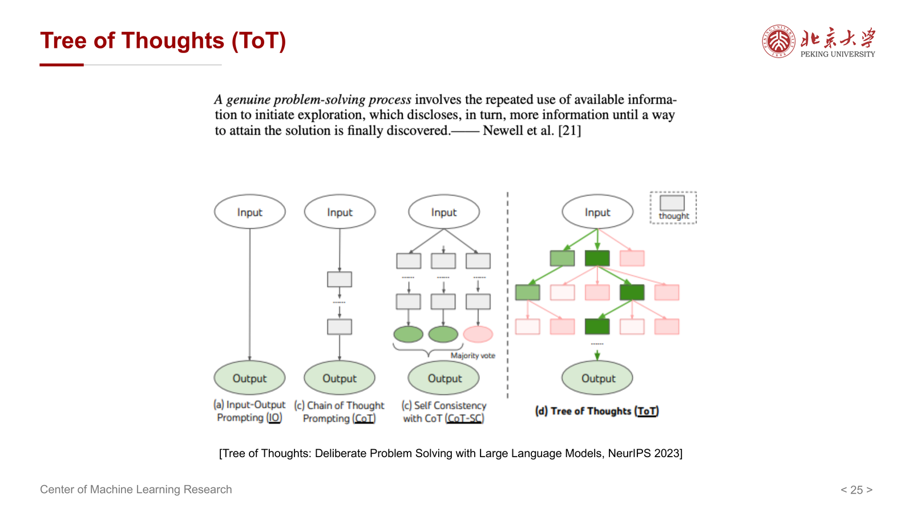{ width="800" }

### 10.2 ToT 的核心机制

ToT 的思想可以概括为：

- 把每个中间思路当作一个节点
- 从一个节点扩展多个候选后续 thought
- 对这些候选进行评估
- 再决定保留、剪枝、回退或继续扩展

课件用一句很形象的话总结：

- Fail and Trial!
- Search, Search, Research!

这说明 ToT 本质上把 LLM 推理从“生成文本”扩展成了“搜索思路空间”。

### 10.3 BFS 与 DFS

课件进一步提到 ToT 可以结合经典搜索策略：

- Breadth First Search
- Depth First Search

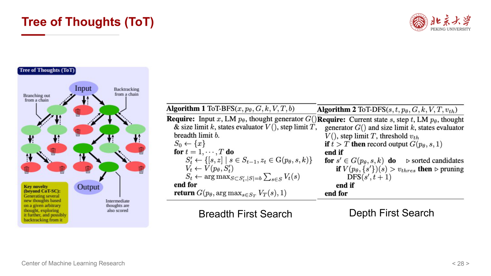{ width="800" }

这意味着：

- BFS 更适合广泛探索多个候选思路
- DFS 更适合沿某条 promising path 深入推进

因此 ToT 不是单一算法，而是一个把 **LLM 生成** 与 **搜索控制** 结合起来的框架。

### 10.4 ToT 的适用问题

课件还展示了 ToT 在不同任务上的例子，例如：

- creative writing
- mini-crosswords

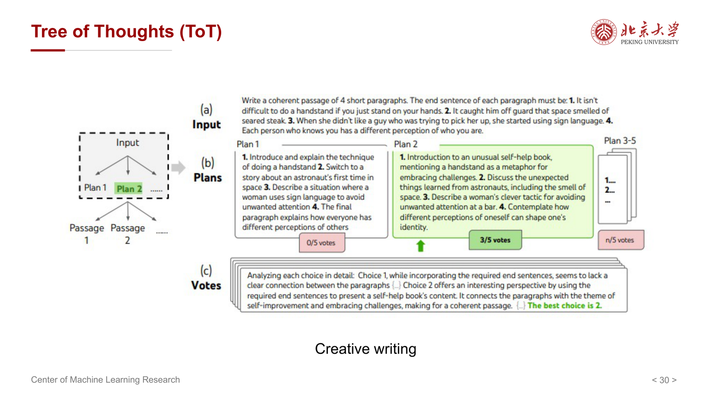{ width="800" }

这说明 ToT 并不只适用于数学题，还适用于：

- 需要规划的任务
- 需要尝试和修正的任务
- 有较大组合搜索空间的任务

## 11 Graph of Thoughts（GoT）

在 CoT 是链、ToT 是树之后，课件最后提到 **Graph of Thoughts（GoT）**。

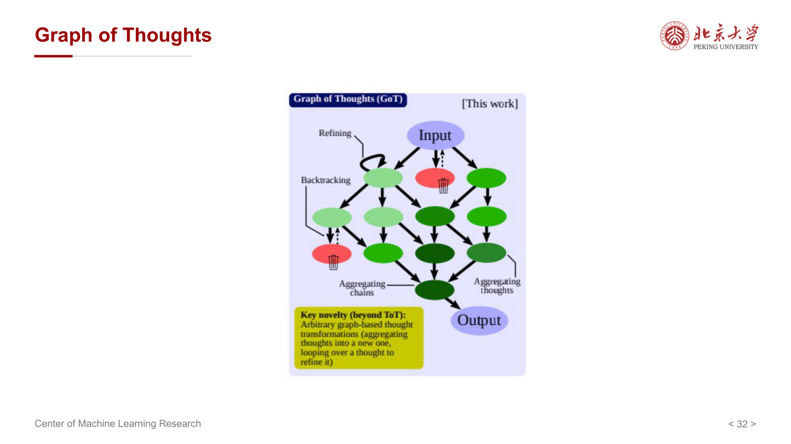{ width="800" }

它隐含的进一步推广是：

- 思维单元之间不一定只能形成一条链
- 也不一定只能形成树
- 更一般地，可以形成图结构

这样就允许：

- 多条思路相互合并
- 某些中间结论被重复复用
- 不同分支之间共享信息

从方法论角度看，GoT 表示一种更一般的认知框架：

> LLM 推理不一定非得是“顺着一句话一直往后写”，而可以组织成更复杂的中间状态结构。

## 12 一条总主线：CoT 不只是 prompt，而是推理控制范式

如果把整份课件压成一句话，可以概括为：

> CoT 的本质不是“让模型多说几句”，而是通过显式中间步骤、路径采样与结构化搜索，提升 LLM 在 slow-system task 上的推理能力。

从这个角度看，各种方法之间的关系是：

- **CoT**：线性展开中间步骤
- **Zero-shot CoT**：用简短触发语调出分步推理
- **Auto-CoT**：自动构造示例
- **Self-consistency**：多条链并行采样再投票
- **ToT**：把线性链扩展成搜索树
- **GoT**：再从树推广到更一般的图结构

这条演化路线反映了一个清晰趋势：

> 从“单条答案生成”，逐步走向“对推理过程本身进行显式建模与搜索”。

## 13 易错点

- 把 CoT 理解成“回答写长一点”：真正关键是中间步骤是否有结构、是否推动了推理。
- 以为 CoT 对所有任务都同样有效：它主要帮助 slow-system task，而不是所有 fast-system task。
- 把 zero-shot CoT 当作万能咒语：它能激活能力，但不能凭空弥补模型知识或能力缺陷。
- 混淆 self-consistency 与 ToT：前者是多条链采样后聚合，后者是显式地在中间思路空间做搜索。
- 以为 ToT 只适用于数学题：它同样适合需要规划、回溯与尝试的开放任务。

!!! summary "复习与考试重点"
    - **System-I / System-II**：LLM 对快系统任务更强，对慢系统推理任务更需要额外方法辅助。
    - **CoT 定义**：通过一系列连贯的中间步骤，把问题逐步引向最终答案。
    - **为什么 CoT 有用**：能把复杂问题分解，并为推理分配更多显式中间计算。
    - **Few-shot CoT**：通过带推理链的示例，让模型模仿“先推理后作答”的格式。
    - **Zero-shot CoT**：用 “Let’s think step by step” 等触发语直接激活推理链。
    - **Auto-CoT**：自动生成 CoT demonstrations，降低人工构造示例的成本。
    - **Self-consistency**：采样多条 reasoning path，再选择最一致的答案。
    - **ToT / GoT**：把推理从线性链推广到树搜索乃至图结构组织。
