[Data Preparation for LLM Pre-training](slides/Data%20Preparation%20for%20LLM%20Pre_training.pdf)

这份笔记按课件主线整理 LLM 预训练中的 **数据准备（data preparation）** 问题：先说明为什么数据对 LLM 如此关键，再分别讨论 **数据来源**、**数据处理** 与 **数据调度（data scheduling）**。目标不是只记住几个数据集名词，而是形成这样一条完整认识：

> 预训练效果不仅取决于模型规模和训练算力，也极大取决于“拿什么数据训练、如何清洗这些数据、以什么比例和顺序喂给模型”。

## 1 背景：为什么 LLM 预训练首先是数据问题

### 1.1 从 SLM 到 LLM

课件在背景部分简要回顾了语言模型的演化：

- **Statistical Language Model（SLM）**
- **Neural Language Model（NLM）**
- **Pre-trained Language Model（PLM）**
- **Large Language Model（LLM）**

这个演化过程的一个核心变化是：模型越来越依赖大规模通用语料进行预训练，再通过下游适配获得能力迁移。

### 1.2 LLM 训练流程中的预训练阶段

在 LLM 的整体训练流程中，预训练通常是最早、也是最重的一步。课件强调：

- 它是模型学习语言规律的初始阶段
- 常见任务包括 **language modeling** 与 **denoising autoencoding**
- 所需数据通常是 **海量无标注文本**

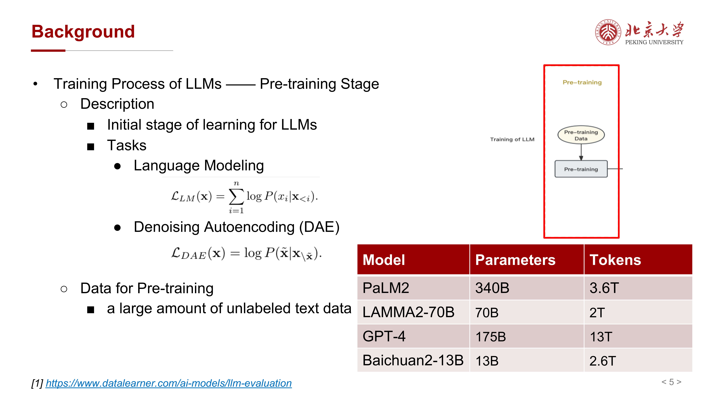{ width="800" }

课件列出了一些量级例子：

- PaLM2：340B 参数，3.6T tokens
- LLaMA2-70B：70B 参数，2T tokens
- GPT-4：175B 参数，13T tokens
- Baichuan2-13B：13B 参数，2.6T tokens

这里最重要的结论不是具体数字，而是：**参数规模上去以后，数据规模和数据质量会成为同等重要的问题**。

## 2 预训练数据从哪里来

### 2.1 数据源的基本分类

课件把 LLM 预训练数据源分为两大类：

- **General Text Data**
    - Webpages
    - Conversation Text
    - Books

- **Specialized Text Data**
    - Multilingual Text
    - Scientific Text
    - Code

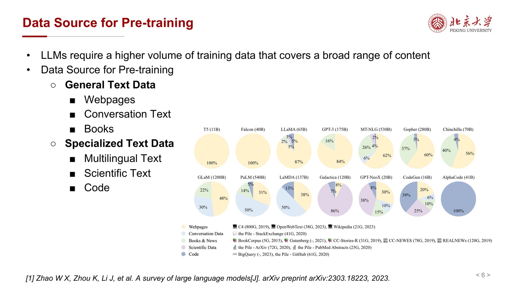{ width="800" }

这个分类非常自然：

- 通用文本负责提供大范围世界知识、常识和语言模式
- 专业文本负责补充特定能力，如多语言、学术推理和代码生成

### 2.2 通用文本数据

课件列举的典型通用数据源包括：

- **Webpages**：如 Common Crawl
- **Conversation text**：如 Reddit / PushShift 语料
- **Books**：如 Books3、BookCorpus2

这些语料的共同特点是：

- 规模大
- 覆盖广
- 噪声也很大

因此它们非常适合作为预训练的“底座语料”，但必须经过严格过滤和清洗。

### 2.3 专业文本数据

专业数据主要包括：

- **Multilingual text**：如 ROOTS，覆盖 59 种语言
- **Scientific text**：如 arXiv 论文、教材、数学网页
- **Code**：如 GitHub、Stack Exchange 等

这类数据的重要性在于：它们通常对应某类能力瓶颈。

例如：

- 多语言数据决定模型是否真正具备跨语言能力
- 科学文本决定模型在数学、学术问答、技术写作上的表现
- 代码语料决定模型在补全、解释和程序合成上的上限

同时，课件也提醒：这类数据往往格式复杂，因此需要特殊预处理与 tokenization 设计。

## 3 数据处理总览：从原始语料到可训练 token

课件把 data processing pipeline 总结为四步：

- **Quality Filtering**
- **Deduplication**
- **Sensitive Information Detection**
- **Tokenization**

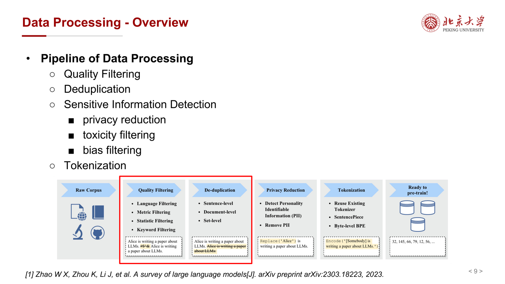{ width="800" }

从工程角度看，这条流水线的目标是：

> 把来源复杂、质量参差、格式不统一、可能含隐私或有害内容的原始语料，变成可安全、高效、稳定用于训练的 token 流。

## 4 Deduplication：去重不是小修小补，而是训练稳定性的关键

### 4.1 为什么要去重

课件给出的动机很明确：

- 原始网页语料中存在大量重复内容
- 重复数据会导致训练过程不稳定
- 还会增加隐私泄露和记忆训练样本的风险

因此去重并不是“节省一些存储空间”这么简单，而是直接影响：

- 训练效率
- 泛化能力
- 安全性

### 4.2 三类去重方法

课件把 deduplication 分成三类：

- **exact-based**
- **fuzzy-based**
- **embedding-based / model-based**

这三类方法从易到难，也从“字面重复”逐渐走向“语义重复”。

### 4.3 Exact / Fuzzy Deduplication

在 RefinedWeb / Falcon 相关工作中，课件提到了两类经典方案：

- **fuzzy deduplication**：如 MinHash + 5-gram
- **exact substring deduplication**：如 suffix arrays

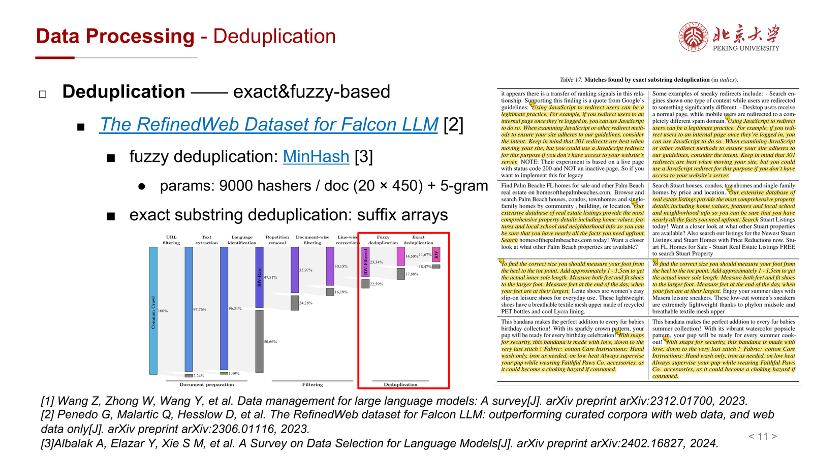{ width="800" }

可将它们理解为：

- exact-based：只要字符串相同或大段子串相同就删掉
- fuzzy-based：即使不完全一样，但 n-gram 结构很相似，也认为是重复

MinHash 的价值在于：它能在大规模数据上高效近似 Jaccard 相似度，适合网页语料这种海量近重复文本场景。

### 4.4 Embedding-based Deduplication

字面去重还不够，因为很多文本表面不同、语义几乎相同。为此课件介绍了 **SemDeDup**：

- 用预训练模型计算文本 embedding
- 做聚类（如 k-means）
- 在簇内计算 cosine similarity
- 仅保留最代表性的样本，删除其余语义重复样本

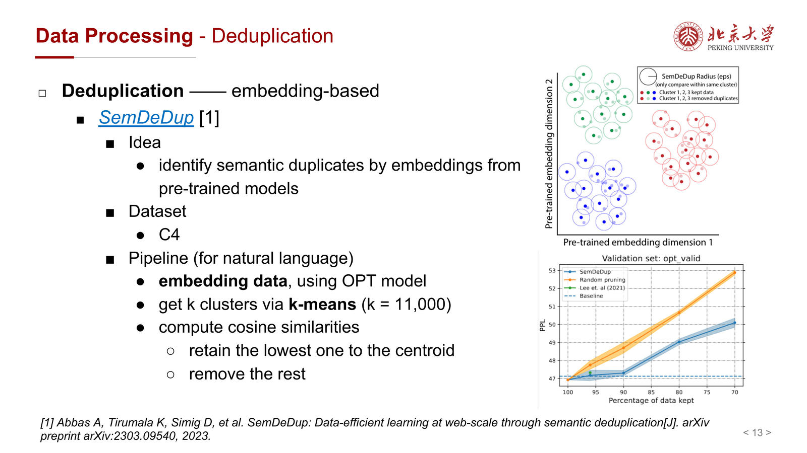{ width="800" }

这一思路的本质是：

> 从“字符串重复”上升到“语义重复”。

它代价更高，但对于 web-scale 数据非常有价值，尤其是在数据量已经足够大、但冗余和低效样本很多时。

## 5 Quality Filtering：不是所有网页文本都值得学

### 5.1 为什么要做质量过滤

大规模抓取语料中会混入大量低质量文本，例如：

- 模板页
- 广告页
- 无语义噪声文本
- 乱码
- 自动生成的低质内容

这些内容会浪费 token budget，甚至破坏模型学习的分布。

### 5.2 三类质量过滤方法

课件将质量过滤分为三类：

- **classifier-based**
- **heuristic-based**
- **metric-based**

### 5.3 Classifier-based Filtering：GPT-3 的做法

GPT-3 的做法是一个经典例子：

- 用高质量文本训练一个 selection classifier
- 正样本来自 WebText、Wikipedia、Books 等高质量语料
- 负样本来自未过滤的 Common Crawl
- 然后用这个分类器给网页打分，筛掉低质量文档

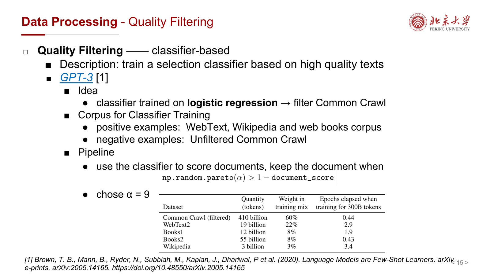{ width="800" }

这种方法的核心思想是：

> 先定义“什么像高质量文本”，再让分类器去做大规模近似判断。

### 5.4 Heuristic-based Filtering：Dolma 的思路

课件在 Dolma 例子中提到，quality filtering 也可以依赖：

- 设计良好的规则
- 统计规律

这类方法虽然没有复杂模型，但在工程上很重要，因为：

- 运行成本低
- 可解释性强
- 容易在海量语料上快速部署

### 5.5 Metric-based Filtering：用 PPL 衡量语料质量

课件以 CCNet 等工作为例介绍了 metric-based filtering：

- 先训练一个语言模型或 n-gram 模型
- 计算文档的 **perplexity（PPL）**
- 用 PPL 作为过滤依据

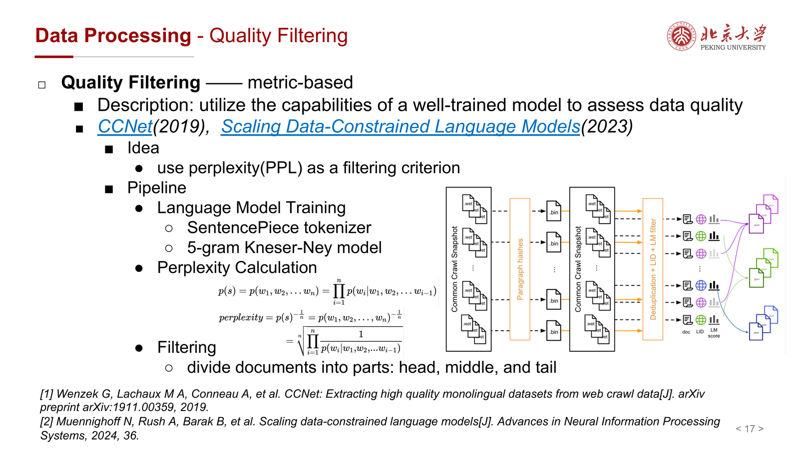{ width="800" }

其直觉是：

- 若一个文档对正常语言模型来说极其“不自然”，则它可能是低质量文本
- 因此可以把高 PPL 文档筛掉

这个思路的优势在于：它不是人工枚举规则，而是让“语言模型本身”来判断文本是否像自然语言。

## 6 Sensitive Information Detection：数据好不等于数据安全

课件把敏感信息检测拆成三类：

- **privacy reduction**
- **toxicity filtering**
- **bias filtering**

这一步并不是锦上添花，而是现代 LLM 预训练几乎不可缺少的一环。

### 6.1 Privacy Reduction

隐私过滤主要处理 PII（Personally Identifiable Information），例如：

- 姓名
- 电话
- 地址

常见方法包括：

- 正则表达式
- 字典匹配
- 基于云服务或规则系统的 infotype detector

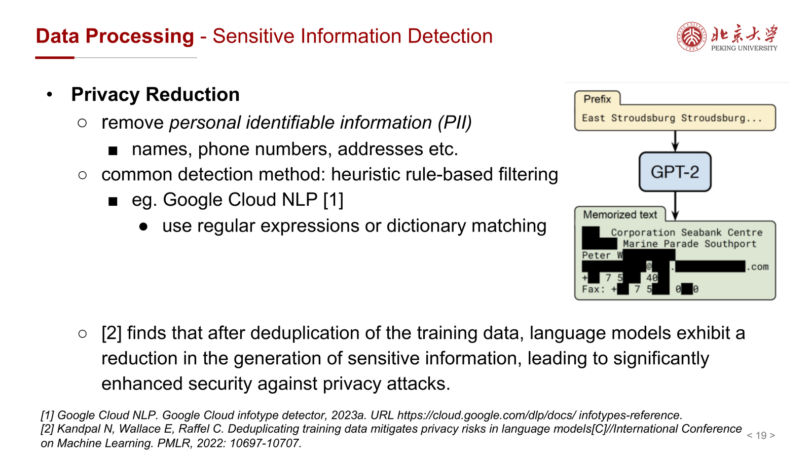{ width="800" }

课件还提到一个重要观察：**去重本身也会降低语言模型泄露敏感信息的风险**。因为重复越多，模型越容易“记住”特定片段。

### 6.2 Toxicity Filtering

Toxicity 指的是：

- rude
- disrespectful
- unreasonable

课件把检测方法分为：

- 传统方法：规则、N-gram classifier 等
- 高级方法：如 Perspective API、BERT-based 模型等

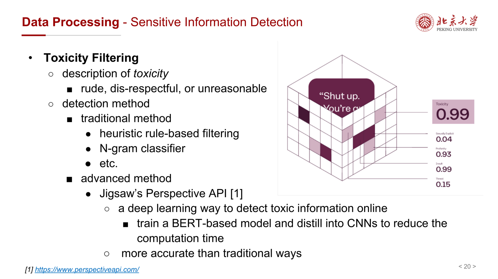{ width="800" }

其工程含义是：预训练语料不是“越多越好”，有害文本的占比和分布同样会塑造模型行为。

### 6.3 Bias Filtering

偏见过滤主要处理：

- gender bias
- racial bias
- religious bias

课件列举了多种去偏方法：

- **Counterfactual Data Augmentation (CDA)**
- **Dropout**
- **INLP**
- **Sentence Debias**
- **Self-Debias**

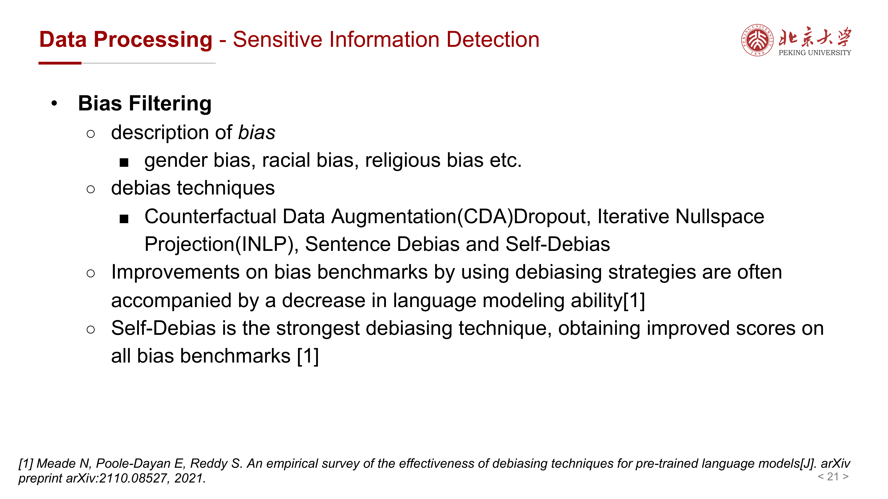{ width="800" }

并进一步给出了这些方法的简要解释：

- CDA：交换偏见属性词进行数据增强
- INLP：训练线性分类器识别偏见属性，再把该信息从表示空间中投影掉
- Sentence Debias：移除句向量中的偏见子空间
- Self-Debias：让模型先显式识别偏见，再诱导其生成去偏结果

课件同时提醒一个重要 trade-off：

> 偏见基准上的改进，常常伴随着语言建模能力下降。

这说明安全、公平与建模能力之间并非完全无冲突。

## 7 Tokenization：把清洗后的文本统一变成 token 流

课件在 overview 中把 tokenization 放到最后一步，说明它是“准备好预训练”的最后接口。

常见做法包括：

- 复用已有 tokenizer
- SentencePiece
- byte-level BPE

它的重要性在于：

- 决定文本如何被切分成训练单位
- 影响词表大小、压缩率和跨语言适配能力
- 对 scientific text / code 等特殊语料尤其关键

虽然课件没有在这部分展开很多公式，但从工程上看，tokenization 是把前面所有数据治理结果真正接入模型训练的最后一环。

## 8 Data Scheduling：不仅要选数据，还要决定如何喂数据

课件把 Data Scheduling 分为两部分：

- **Data Composition**
- **Data Curriculum**

这一步非常重要，因为即使语料清洗完毕，不同数据源的比例和呈现顺序也会影响模型学到什么、先学什么、学得多快。

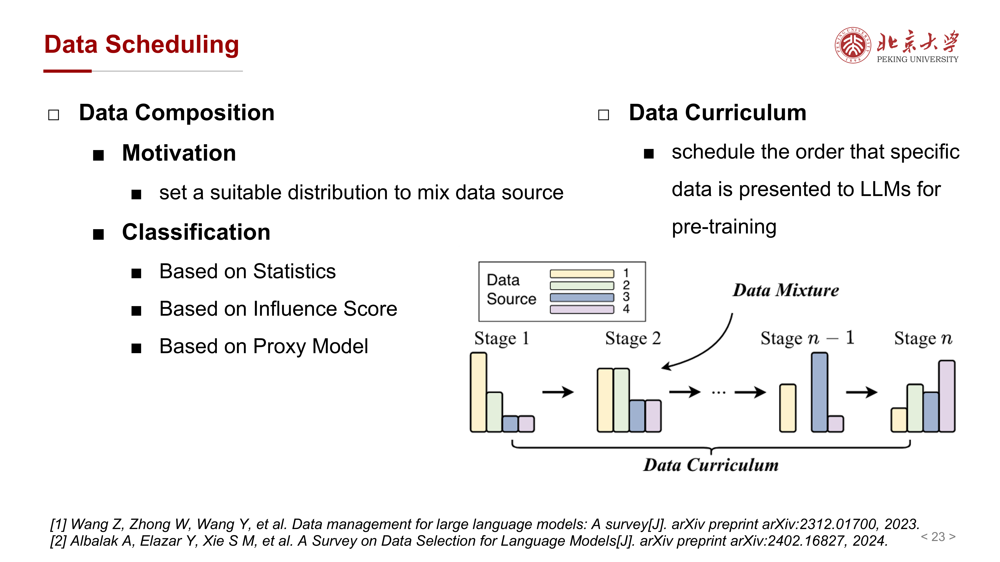{ width="800" }

## 9 Data Composition：不同域的数据该按什么比例混合

### 9.1 Based on Statistics

最简单的思路是用启发式或人工设定的 domain weights 来混合不同数据源。

课件举了 **DSIR（Data Selection with Importance Resampling）** 的例子：

- 有一个大 raw dataset
- 还有一个较小但更接近目标任务的 target dataset
- 在某个特征空间里让选出的子集更接近 target distribution

其流程包括：

- hashed n-gram features
- importance weights
- resampling

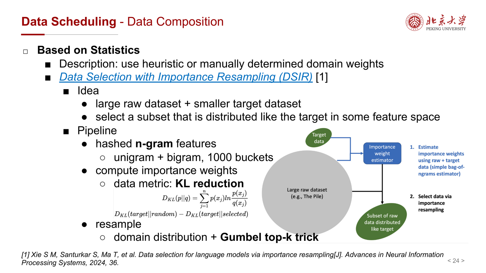{ width="800" }

### 9.2 Based on Influence Score

这类方法直接试图估计：

> 某条数据对最终模型性能的影响有多大。

如果影响可被近似评估，就能用 influence score 来做重加权或采样。

这个方向的直觉非常合理，但真正困难在于：web-scale 语料上的 influence estimation 代价非常高。

### 9.3 Based on Proxy Model：DoReMi

课件重点讲了 **DoReMi**：

- 先训练一个小的 proxy / reference model
- 用 Group DRO 或 minimax optimization 学出不同 domain 的权重
- 再按这些权重重采样大语料
- 最后用重加权后的数据训练 full-size model

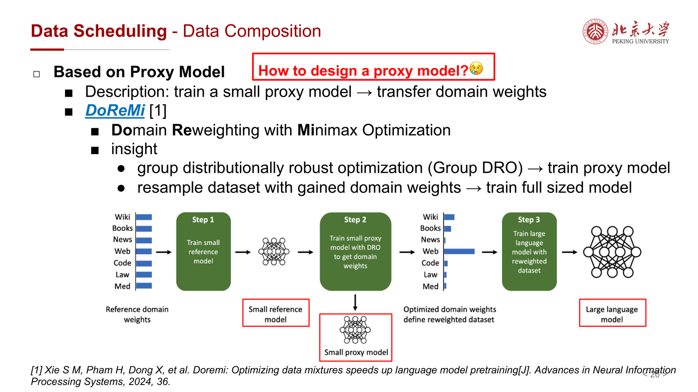{ width="800" }

它的核心思想是：

> 先在小模型上便宜地试错，再把得到的数据混合权重迁移到大模型训练。

这是一种非常典型的“用 proxy model 节省昂贵大模型实验成本”的思路。

## 10 Data Curriculum：先学什么、后学什么

### 10.1 基本思想

Data curriculum 讨论的是：

> 数据不是只决定“喂什么”，还决定“按什么顺序喂”。

课件将其描述为：

- 按某种次序呈现特定数据
- 通常是从基础到目标
- 特别关注 continual pre-training 场景

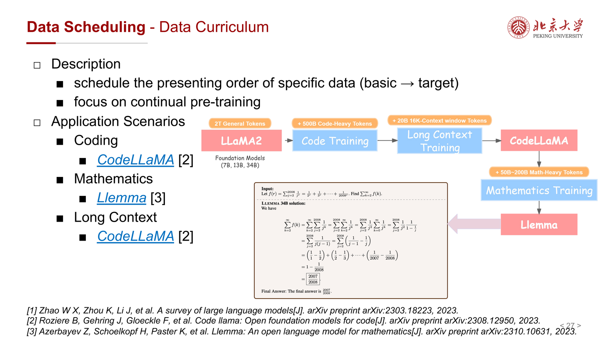{ width="800" }

应用例子包括：

- Coding：如 CodeLLaMA
- Mathematics：如 Llemma
- Long Context

### 10.2 Skill-It!

课件最后提到 **Skill-It!**：

- 一个 online data sampling algorithm
- 强调 skill-based data curriculum
- 基本动机是：模型学习不同技能时存在自然顺序

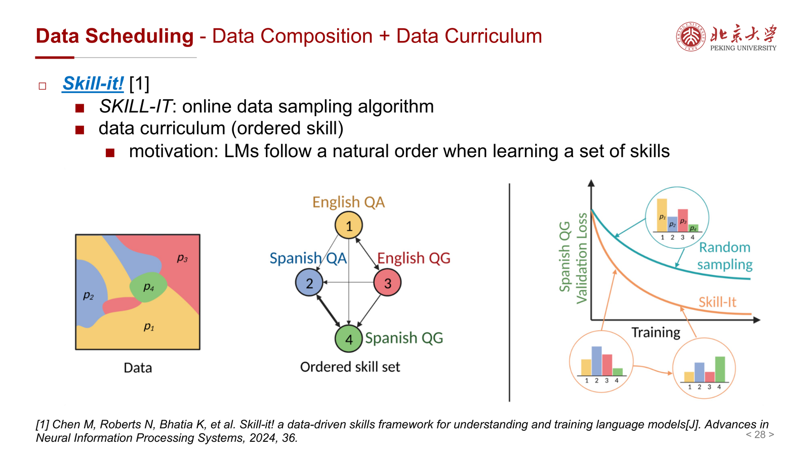{ width="800" }

这代表了一个更动态的方向：

- 不是静态预先定好数据混合比例
- 而是在训练过程中根据能力状态不断调整采样策略

## 11 一条完整主线：Data is not just corpus, but policy

如果把整份课件压成一句话，可以总结为：

> LLM 预训练中的“数据准备”，不仅是收集语料，更是一个包含 **数据选择、清洗、安全治理、表示统一、混合策略与课程设计** 的完整策略系统。

从这个角度看：

- **Data source** 决定模型“见过什么世界”
- **Data processing** 决定模型“学到的内容是否干净、稳定、安全”
- **Data scheduling** 决定模型“以什么路径吸收这些知识”

## 12 易错点与考试重点

### 12.1 高频易错点

- 认为预训练数据越多越好：低质量、重复、有害数据会直接拖累模型。
- 把 deduplication 只看成节省存储：它同时关系到训练稳定性、泛化和隐私风险。
- 认为质量过滤只能靠规则：classifier-based 和 metric-based 方法同样重要。
- 忽视敏感信息检测：privacy / toxicity / bias 会直接影响模型安全性与可部署性。
- 把 data scheduling 当成“可选调参”：数据比例和课程顺序会实质改变最终能力分布。

### 12.2 考试重点

- **预训练数据来源分类**：general vs specialized
- **Data processing pipeline**：quality filtering / deduplication / sensitive info / tokenization
- **Deduplication**：exact、fuzzy、embedding-based
- **Quality filtering**：classifier-based、heuristic-based、metric-based（PPL）
- **Sensitive information detection**：privacy / toxicity / bias
- **Data composition**：statistics、influence score、proxy model
- **DoReMi** 与 **Skill-It!** 的核心思想
