[Efficient LLM Inference](slides/24_infer_lecture.pdf)

这份笔记按课件主线整理 **大语言模型高效推理** 的核心问题。与训练阶段不同，推理阶段的关键目标通常不是继续提升模型能力，而是在尽量不损失效果的前提下，降低：

- 延迟
- 显存占用
- 服务成本
- 长上下文场景下的吞吐瓶颈

整份课件可以浓缩成一句话：

> LLM 推理的核心瓶颈，往往不在“算不出来”，而在“算得太慢、缓存太大、显存管理太低效”。

## 1 为什么需要高效推理

课件开头先强调了一个现实背景：模型规模增长极快，而部署侧最关心的是：

- inference latency
- throughput
- cost

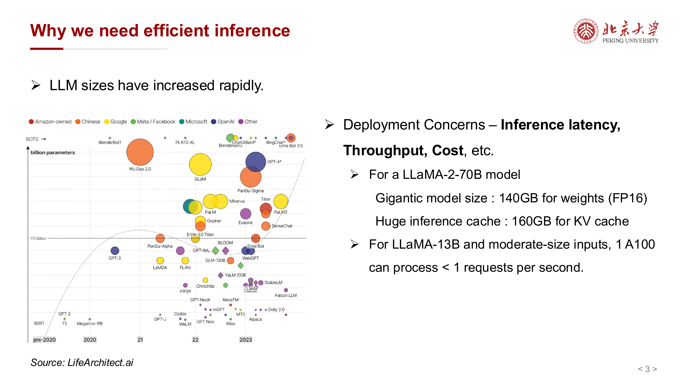{ width="800" }

课件给出的例子非常直观：

- LLaMA-2-70B 的 FP16 权重约 140 GB
- 其 KV cache 甚至可以达到 160 GB
- 对 LLaMA-13B 和中等输入长度，单张 A100 的处理速度可能仍低于每秒 1 个请求

这说明一个重要事实：

> 只看参数量还不够，真正上线时，KV cache 和服务系统本身同样决定推理成本。

## 2 LLM 推理的基本过程

### 2.1 自回归解码

大语言模型通常采用 **auto-regressive decoding**：

- 先输入 prompt
- 生成第一个 token
- 再把 prompt 与新 token 一起送回模型
- 继续生成下一个 token
- 重复直到结束

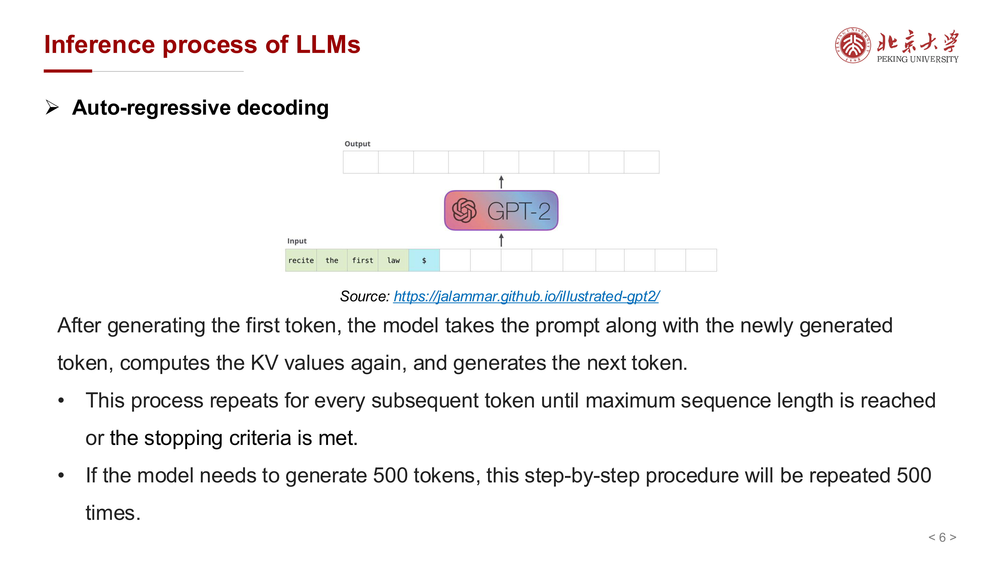{ width="800" }

因此，如果要生成 500 个 token，模型就要重复这套流程 500 次。推理慢的根本原因之一就在这里：**输出是逐 token 展开的**。

### 2.2 KV Cache 的作用

如果每次都对整个历史序列重新计算 attention 中的 key 和 value，代价会非常高。因此推理时通常会使用 **KV cache**：

- 已生成 token 的 K/V 状态缓存起来
- 下一步只计算最新 token 的 K/V
- 避免对旧 token 重复计算

课件进一步把推理拆成两个阶段：

- **Prefill**
- **Decode**

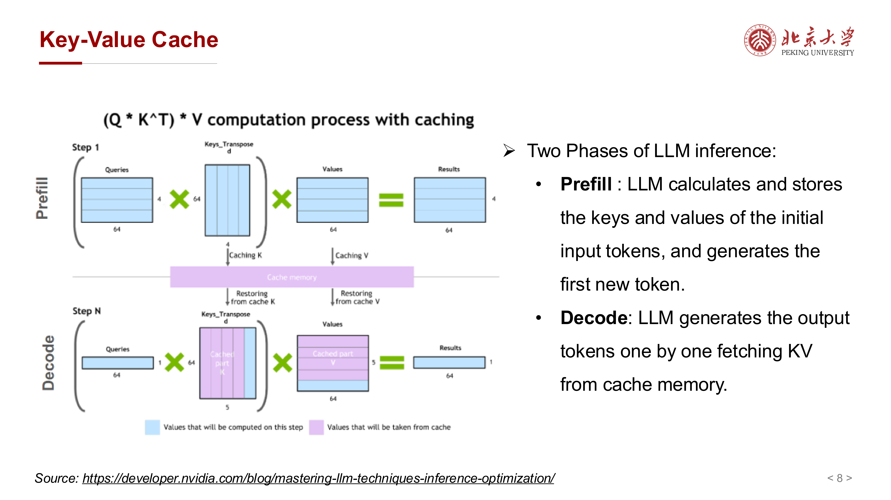{ width="800" }

其中：

- Prefill：对初始输入 token 计算并存储 K/V，同时生成第一个新 token
- Decode：之后逐 token 生成，并不断从 cache 中读取历史 K/V

## 3 推理为什么仍然慢：prefill 与 decode 的瓶颈不同

课件指出，LLM 推理并不是单一瓶颈，而是两个阶段各有不同限制：

- **Prefill 是 compute bound**
- **Decode 是 memory bound**

这背后的原因是：

- prefill 更像大规模 matrix-matrix multiplication，GPU 并行度高
- decode 更像 matrix-vector multiplication，GPU 利用率较差
- decode 时延迟往往由数据搬运主导，而不是由纯计算主导

这也是为什么：

> 推理优化不能只想着“减少计算量”，还必须关注内存访问模式和缓存管理。

## 4 KV Cache 为什么会成为长上下文瓶颈

课件给出了 KV cache 大小的典型估算公式：

$$
\text{Cache Size}
=
2 \times \text{precision in bytes}
\times \text{batch size}
\times \text{sequence length}
\times \text{number of layers}
\times \text{embedding dimension}
$$

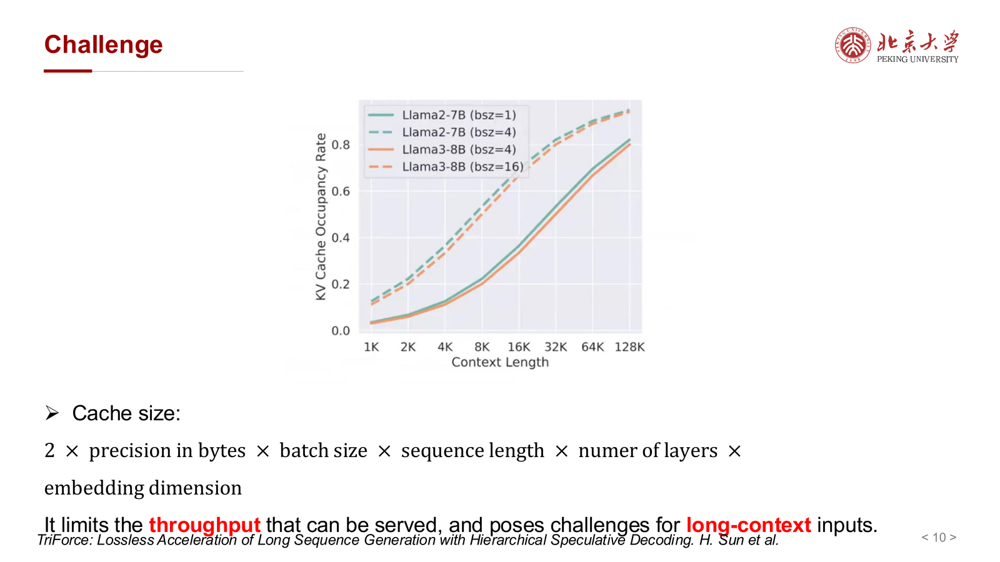{ width="800" }

从公式可以看出，KV cache 会随以下因素线性增长：

- batch size
- sequence length
- 层数
- 隐藏维度
- 精度字节数

因此一旦上下文长度增大，KV cache 很快就会压垮显存预算。

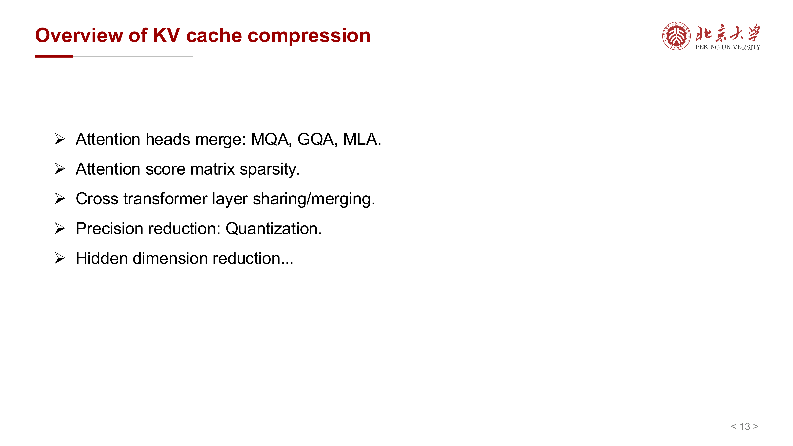{ width="800" }

这也是后面所有优化方法的共同出发点：

- 减少 cache
- 更聪明地用 cache
- 更便宜地存 cache

## 5 KV Cache Compression 总览

课件把 KV cache 压缩大致分为几类：

- attention heads merge：MQA / GQA / MLA
- attention score sparsity
- cross-layer sharing / merging
- precision reduction：quantization
- hidden dimension reduction

{ width="800" }

可以把这些方法理解为沿不同维度做压缩：

- 沿 **head 维度** 减少冗余
- 沿 **token 维度** 只保留重要信息
- 沿 **layer 维度** 共享或合并 cache
- 沿 **precision 维度** 降低数值表示成本

## 6 头维度压缩：MQA、GQA、MLA

### 6.1 为什么多头会带来 KV 冗余

在标准 multi-head attention 中，不同 head 通常都会各自维护 K/V，因此 cache 开销会随着 head 数增加而变大。

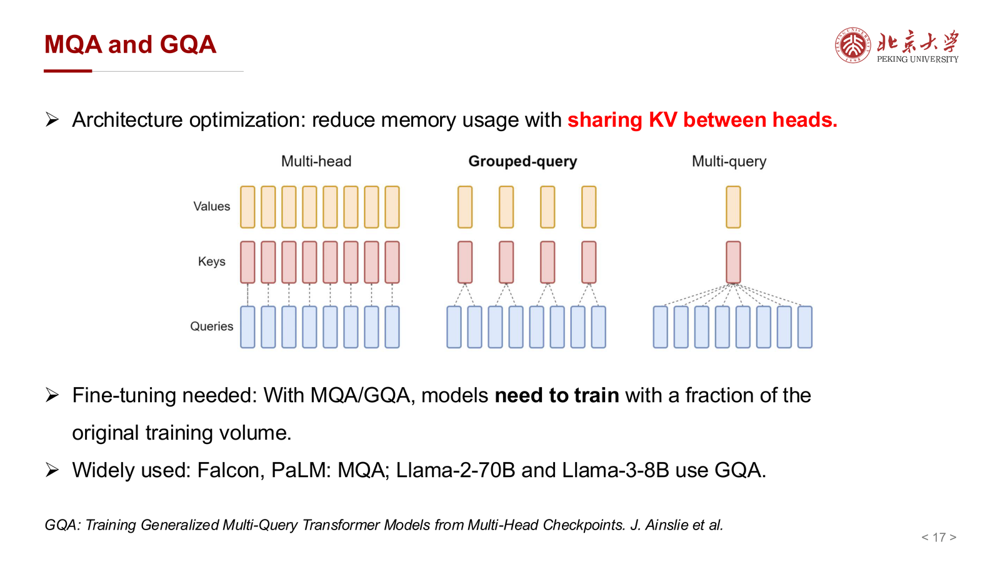{ width="800" }

这意味着：

- query 可以分头
- 但 key/value 不一定非要每个 head 都完全独立

于是就有了共享 K/V 的思路。

### 6.2 MQA 与 GQA

课件介绍了两种经典架构改造：

- **MQA（Multi-Query Attention）**
- **GQA（Grouped-Query Attention）**

它们的共同核心是：

- 多个 query head 共享较少数量的 K/V head
- 从而显著降低 KV cache 占用

{ width="800" }

二者的差别可以粗略理解为：

- MQA：很多 query head 共享同一组 K/V
- GQA：query head 先分组，每组共享一套 K/V

因此 GQA 可以看成介于标准 MHA 与极端共享的 MQA 之间的折中方案。

课件还提到：

- Falcon、PaLM 使用 MQA
- Llama-2-70B、Llama-3-8B 使用 GQA

这说明它们已经是工业界常用方案。

### 6.3 MLA

课件随后介绍 **MLA（Multi-Head Latent Attention）**，并指出其关键思想是：

- 做 low-rank key-value joint compression
- 利用 key-value 的低秩结构

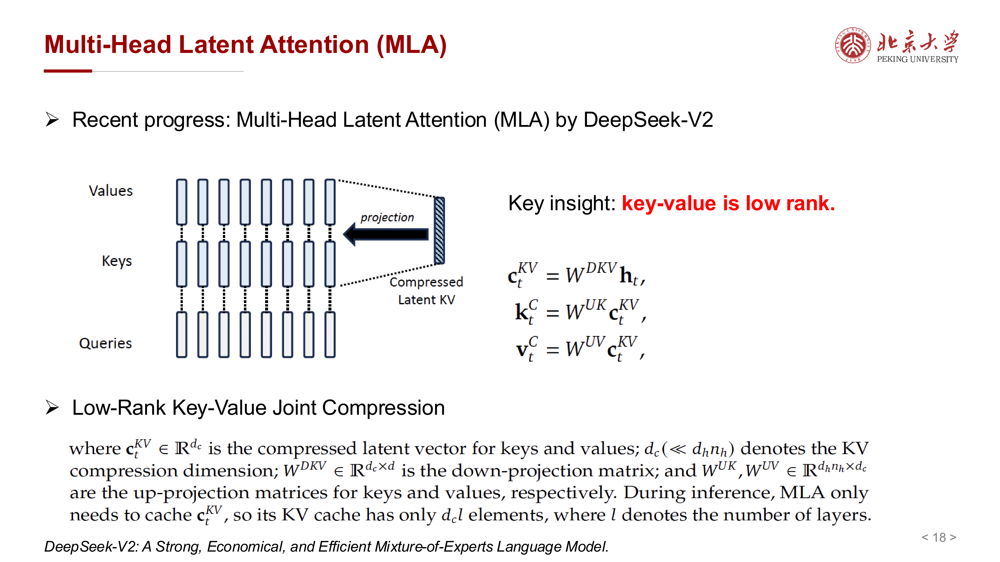{ width="800" }

与 MQA / GQA 相比，MLA 不只是“共享”，而是在更深层次上假设 K/V 表示存在低秩冗余，因此可以投影到更小的 latent 空间后再参与注意力计算。

## 7 Token 维度压缩：Attention Sparsity

### 7.1 稀疏注意力的核心观察

课件指出，虽然 LLM 是稠密训练出来的，但 attention 分数本身往往具有天然稀疏性：

- 不是所有历史 token 都同样重要
- 很多 token 的注意力分数非常小
- 只保留少数重要 token，可能就能近似原始结果

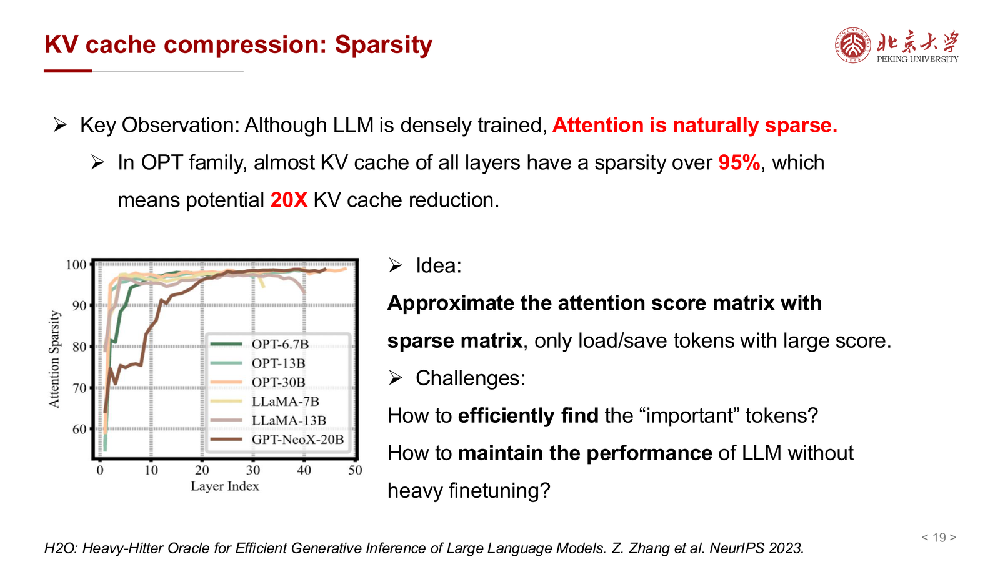{ width="800" }

因此，一个自然想法是：

> 不必每一步都加载全部 KV cache，只处理最重要的那部分 token。

### 7.2 H2O：Heavy Hitter Oracle

课件讲的第一个代表方法是 **H2O**。

其动机是：

- 在生成过程中，少量 token 会反复成为“重击者（heavy hitters）”
- 这些 token 对后续生成最关键

H2O 的基本策略是一个 **KV cache eviction policy**：

- 动态保留一部分 recent tokens
- 同时保留一部分 heavy-hitter tokens
- 其余 token 可以被淘汰

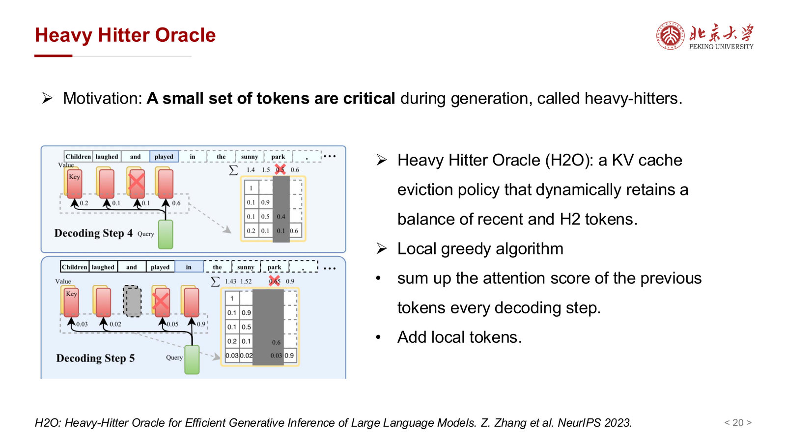{ width="800" }

这里要注意，H2O 不是简单按时间窗口保留最新 token，而是试图在：

- “最近信息”
- “全局重要信息”

之间做平衡。

### 7.3 Attention Sink 与 Streaming LLM

课件还介绍了 **attention sink** 现象：

- 模型往往会给最初几个 token 很高注意力
- 即便它们未必有真正语义重要性
- 这种现象在更深层里尤其明显

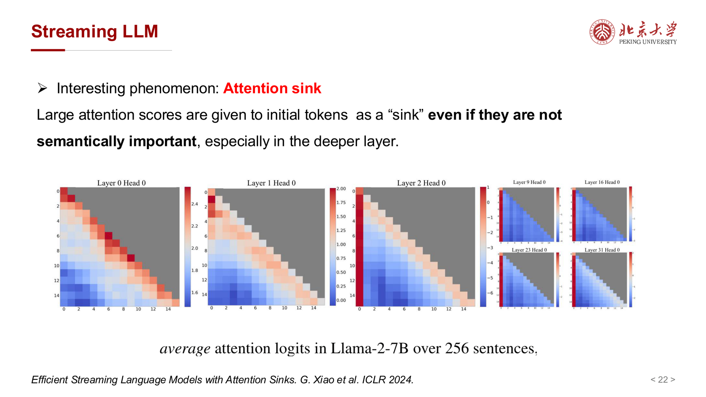{ width="800" }

这告诉我们一个重要事实：

> 高 attention 分数不一定完全等于“语义上重要”，还可能混入模型结构性偏好。

因此设计稀疏策略时，既要利用稀疏性，也要避免误删那些虽然表面不显眼、但对模型稳定性有作用的 token。

### 7.4 Quest：动态稀疏

H2O 一类方法的缺点是：

- token 一旦被 eviction，就再也无法访问

于是课件介绍 **Quest**：

- 保留全部 KV cache
- 但在实际注意力计算时，只动态加载关键子集

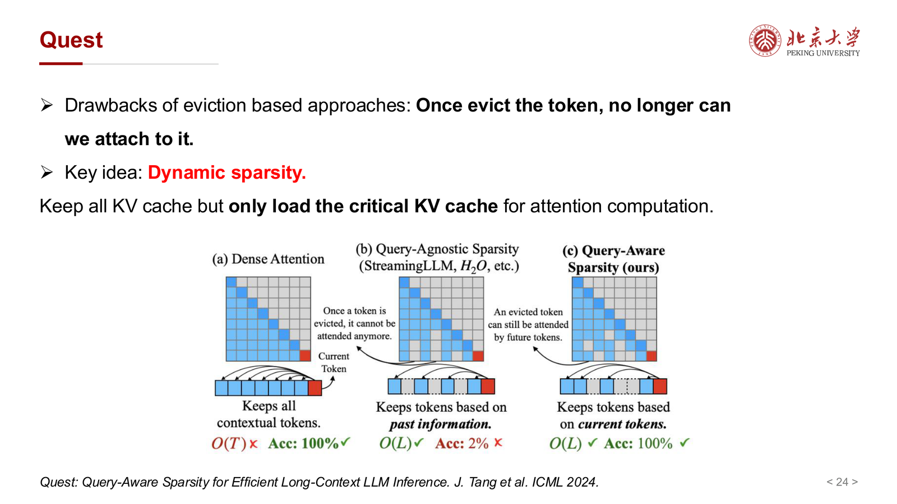{ width="800" }

这相当于把问题从“删掉谁”改成：

> “全部都留着，但每次只取最值得看的那些”。

这种动态稀疏方式通常更稳健，但实现也更复杂。

## 8 Layer 维度压缩

课件接着指出，**相邻层的 KV cache 往往相似**，因此可以考虑沿 layer 维度压缩。

典型思路包括：

- Cross-Layer Attention
- 相邻层 KV sharing
- 插值等深度维压缩算法

{ width="800" }

这里的直觉是：

- 不同层并非完全独立地产生全新信息
- 若跨层冗余足够强，就可能共享或近似重建部分 KV

但课件也提醒，某些方案需要 retraining，因此这类方法往往比 token/head 维压缩更具架构侵入性。

## 9 Precision 维度压缩：KV Cache Quantization

### 9.1 为什么 KV cache 量化比权重量化更难

课件明确指出，KV cache quantization 虽然也属于量化，但比普通权重量化更复杂，原因包括：

- 有位置编码（如 RoPE）的影响
- KV cache 在生成过程中持续更新
- 统计量可能需要在线估计
- 若用离线校准，又可能带来精度问题

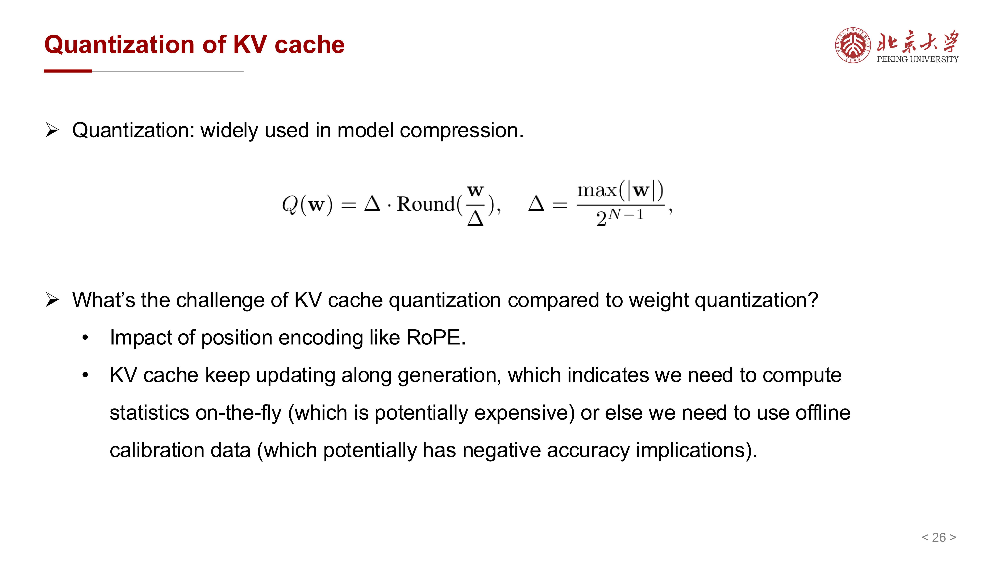{ width="800" }

因此 KV cache 量化难点不只是“压到几 bit”，而是：

> 如何在动态变化、分布不稳定的缓存上，做低代价而稳定的量化。

### 9.2 Key 与 Value 的分布不同

课件进一步指出：

- key matrix 往往存在明显 outlier channel
- value cache 则没有这么明显的 outlier 模式

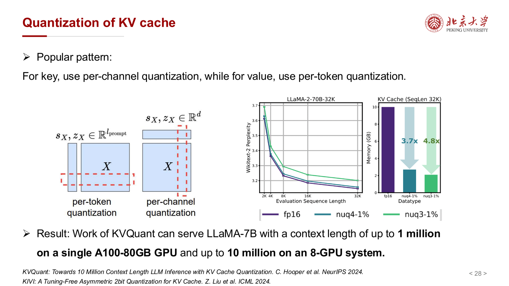{ width="800" }

于是一个常见设计是：

- 对 **key** 使用 per-channel quantization
- 对 **value** 使用 per-token quantization

这说明 K 和 V 在统计分布上并不对称，量化策略也不应强行统一。

## 10 直接提升解码速度：Speculative Decoding

### 10.1 基本思路

普通自回归解码一次只输出一个 token，太慢。课件介绍的 **speculative decoding** 试图解决这个问题。

核心做法是同时使用两个模型：

- **Target model**：真正的大模型
- **Draft model**：更小、更快的草稿模型

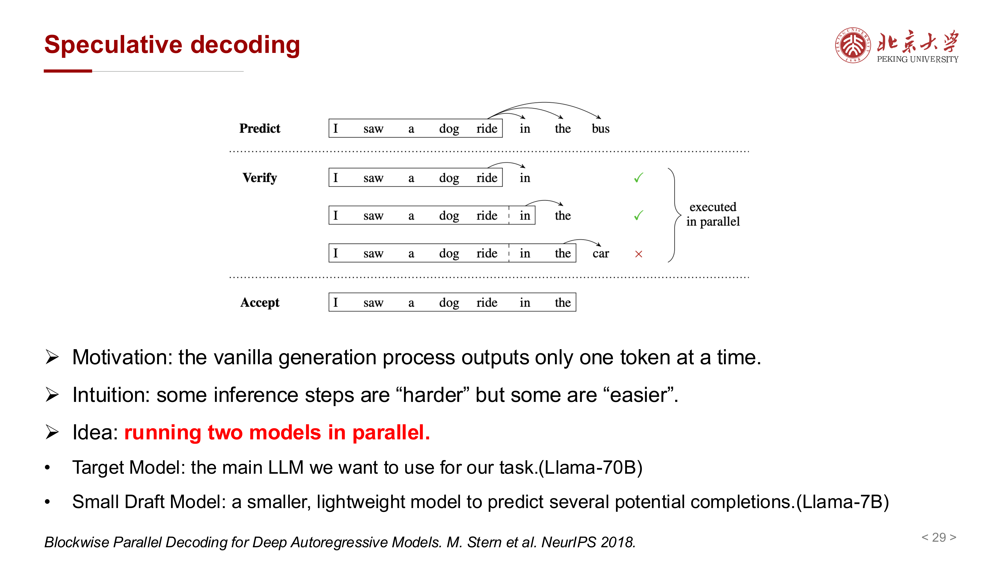{ width="800" }

其思路是：

- 先让小模型一次提出多个候选 token
- 再让大模型并行验证这些候选
- 通过“接受 + 修正”机制减少逐 token 串行等待

### 10.2 为什么它能加速

其关键直觉是：

- 并非每一步生成都同样困难
- 对那些相对容易预测的 token，可以先由小模型快速提出
- 大模型只负责验证和纠错

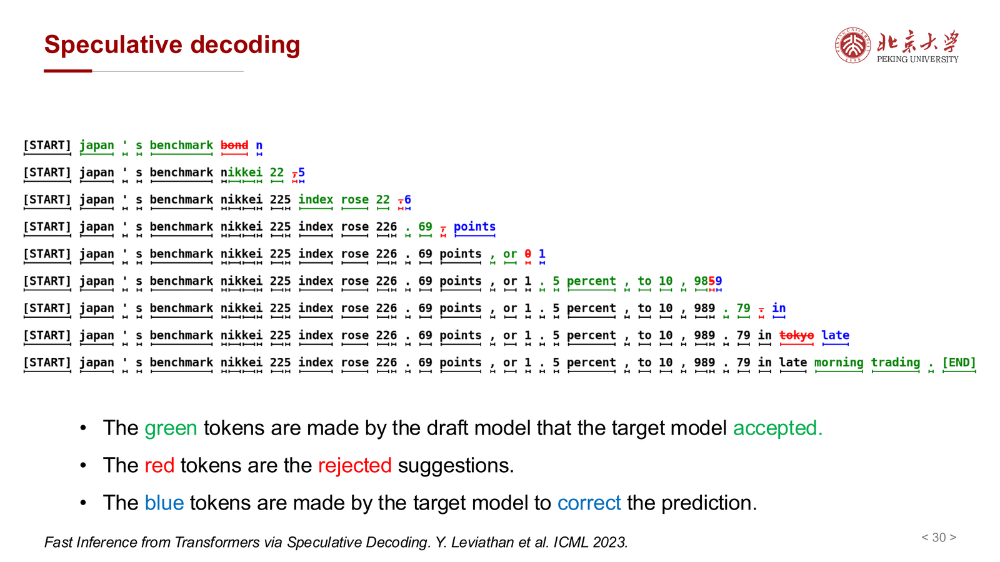{ width="800" }

课件给出的经验结论是：

- 常见建议 $K = 3 \sim 4$ 或 $K = 3 \sim 7$
- 可带来约 `2x` 到 `3.4x` 的加速

因此 speculative decoding 属于非常重要的一类 **算法级推理加速** 方法。

## 11 系统层优化：vLLM 与 PagedAttention

### 11.1 只压缩 cache 还不够

课件后半部分强调，即便 KV cache 大小本身已经降低，系统中仍可能有大量浪费，来源包括：

- reservation
- internal fragmentation
- external fragmentation

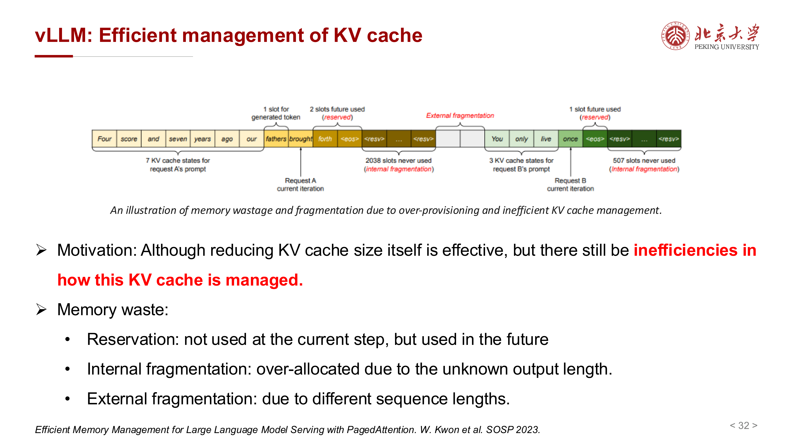{ width="800" }

也就是说，问题不仅是“cache 多大”，还有：

> 这块 cache 在内存里到底是怎么被分配、复用和回收的。

### 11.2 vLLM 的核心思想

vLLM 的关键启发来自虚拟内存与分页机制：

- 连续的逻辑 token 序列
- 不必映射到连续的物理内存
- 改用固定大小的 token block 做分页管理

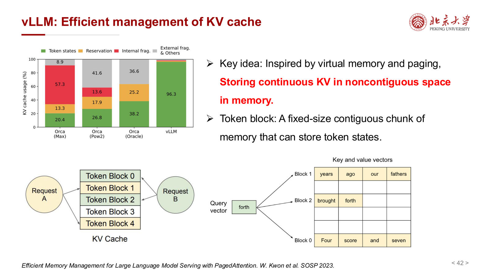{ width="800" }

课件中的关键概念包括：

- **logical token blocks**
- **physical token blocks**
- **block table**

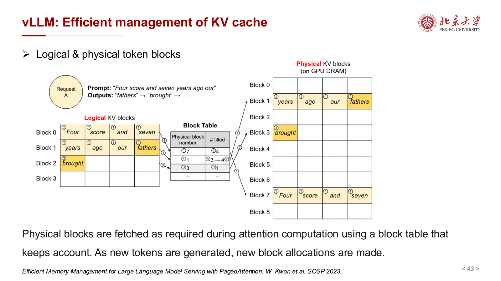{ width="800" }

这种设计的好处是：

- 降低碎片化
- 减少预留但未使用的内存浪费
- 更适合不同长度序列并发服务

### 11.3 vLLM 的收益

课件最后给出的结论是：

- 在相近延迟下，vLLM 可以把吞吐提升到 `2x` 到 `4x`
- 对大模型、长序列、复杂采样方式更有效

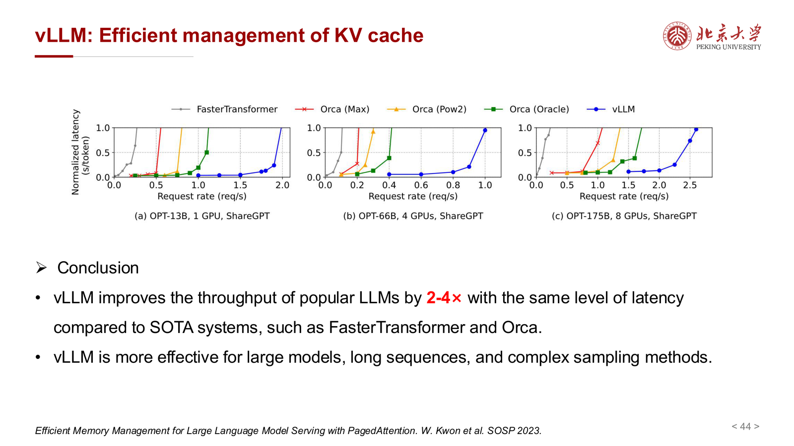{ width="800" }

因此 vLLM 的价值主要在 **工程系统层**，而不只是单个算子的微优化。

## 12 一条总主线：从模型结构到系统实现的全链路优化

如果把整份课件压成一条主线，可以这样总结：

> 高效 LLM 推理不是某一个技巧，而是从 **架构设计、缓存压缩、数值表示、解码算法到内存管理系统** 的整条链路共同优化。

这些方法分别在不同层次上工作：

- **MQA / GQA / MLA**：减少 head 维度上的 KV 冗余
- **H2O / Quest / StreamingLLM**：减少 token 维度上真正参与计算的内容
- **Cross-layer sharing**：减少 layer 维度冗余
- **KV quantization**：减少单个缓存单元的表示成本
- **Speculative decoding**：减少串行生成带来的等待
- **vLLM / PagedAttention**：减少系统层的分配浪费与碎片

## 13 易错点

- 把推理瓶颈只理解成算力不足：decode 阶段经常更受内存访问约束。
- 以为 KV cache 只是一个附属结构：在长上下文里，它本身就是最主要瓶颈之一。
- 以为所有稀疏方法都在“删除 token”：Quest 一类方法更像动态选择而不是永久删除。
- 以为量化只要降 bit 就行：KV cache 量化还要处理在线更新、RoPE 和 K/V 分布不一致的问题。
- 以为 vLLM 是一种新的模型结构：它本质上是高效管理 KV cache 的系统方案。

!!! summary "复习与考试重点"
    - **推理流程**：Prefill 先算输入并建立 KV cache，Decode 再逐 token 读取 cache 生成输出。
    - **阶段瓶颈**：Prefill 通常是 compute bound，Decode 通常是 memory bound。
    - **KV cache 大小** 随 batch、sequence length、layer、hidden size、precision 一起增长，是长上下文核心瓶颈。
    - **MQA / GQA / MLA**：通过共享或低秩压缩 K/V，减少 head 维度冗余。
    - **H2O / StreamingLLM / Quest**：利用 attention 稀疏性，只保留或只加载重要 token。
    - **KV quantization**：常见做法是 key 用 per-channel，value 用 per-token。
    - **Speculative decoding**：用 draft model 提前猜测，再由 target model 验证与修正，提升生成速度。
    - **vLLM / PagedAttention**：通过分页式 KV cache 管理减少 reservation 与 fragmentation，提升系统吞吐。
