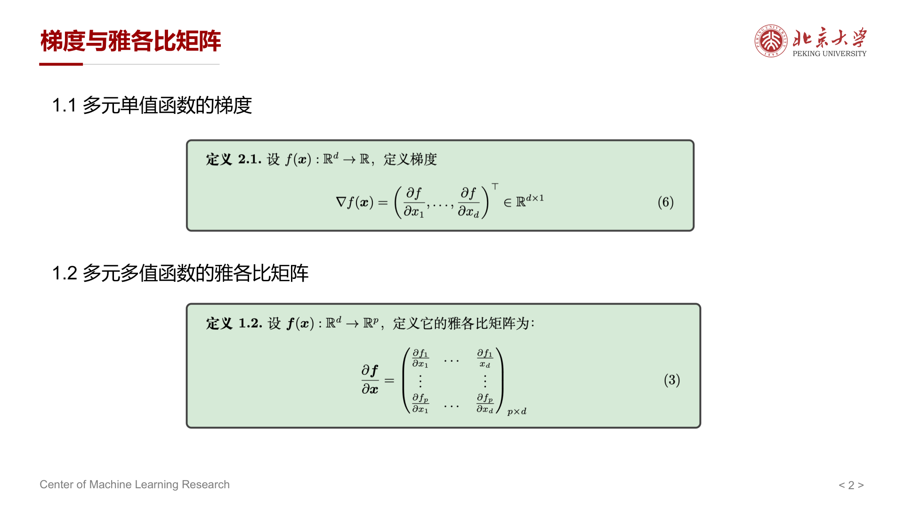
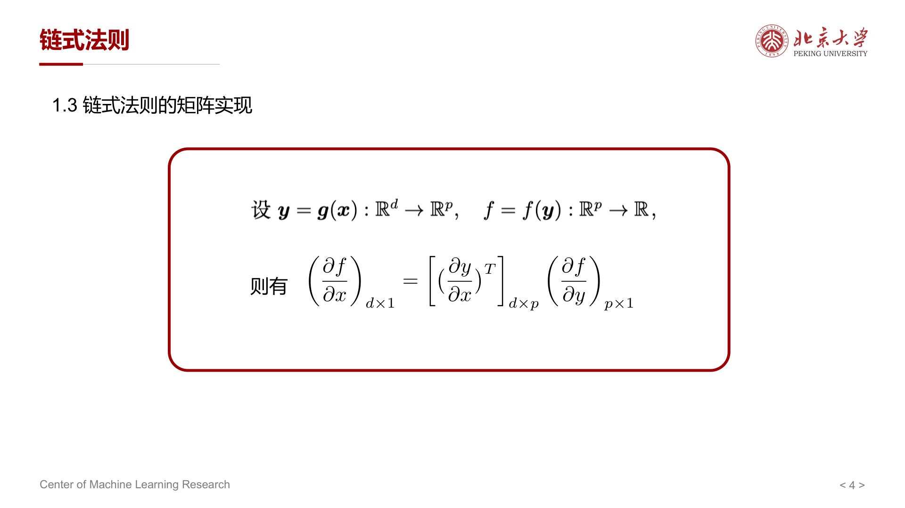
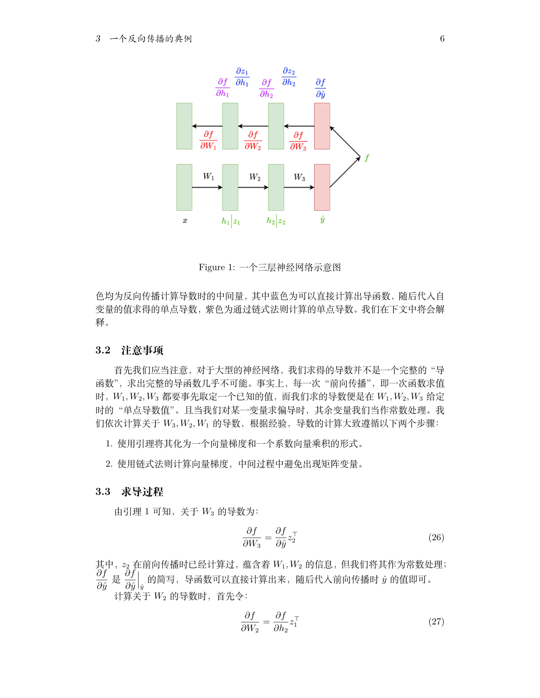
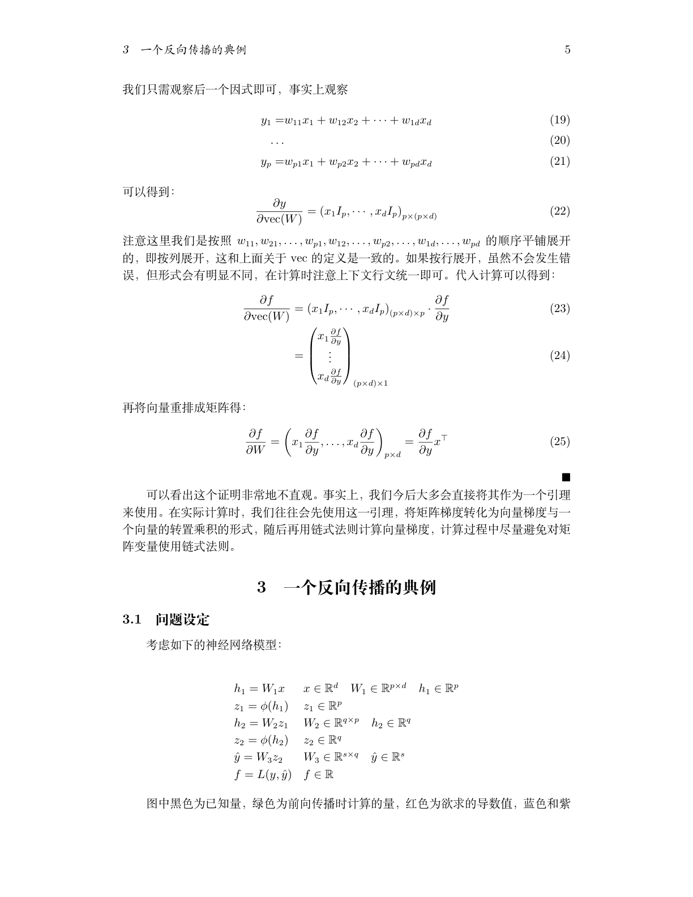

本章讨论梯度下降算法的基本理论，包括凸优化基础概念、梯度下降算法及其在不同条件下的收敛性分析。

---

## 1 问题表述 (Problem Formulation)

本章考虑以下 **无约束优化问题** ：

$$
\min_{x \in \mathbb{R}^d} f(x)
$$

其中 $f(x)$ 是可微的目标函数。

**符号约定** ：

- $x^\star := \arg\min_{x \in \mathbb{R}^d} \{f(x)\}$ 为问题的 **最优解**
- $f^\star := \min_{x \in \mathbb{R}^d} \{f(x)\}$ 为 **最优函数值**

---

## 2 凸集与凸函数

### 2.1 凸集 (Convex Set)

!!! abstract "定义 1（凸集）"
    集合 $\mathcal{X} \subseteq \mathbb{R}^d$ 称为 **凸集** ，如果对于 $\forall x, y \in \mathcal{X}$，有

    $$
    \theta x + (1 - \theta) y \in \mathcal{X}, \quad \forall \theta \in [0, 1]
    $$

直观理解：集合中 **任意两点之间的线段** 都完全包含在集合内部。对于非凸集，可以找到两个点使得连线的某些部分落在集合外部。

凸集的常见例子：

- **超平面** (Hyperplane)：$\{x \mid a^T x = b\}$
- **半空间** (Halfspace)：$\{x \mid a^T x \le b\}$
- **欧几里得球** (Euclidean ball)：$\{x \mid \|x - x_c\| \le r\}$
- **多面体** (Polyhedron)：$\{x \mid a_j^T x \le b_j,\; j = 1, \cdots, m,\; c_j^T x = d_j,\; j = 1, \cdots, p\}$

---

### 2.2 凸函数 (Convex Function)

!!! abstract "定义 2（凸函数）"
    函数 $f: \mathcal{X} \to \mathbb{R}$ 称为 **凸函数** ，如果 $\mathcal{X} \subseteq \mathbb{R}^d$ 是凸集，且对于 $\forall x, y \in \mathcal{X}$，有

    $$
    f(\theta x + (1 - \theta) y) \le \theta f(x) + (1 - \theta) f(y), \quad \forall \theta \in [0, 1]
    $$

直观理解：函数图像上 **任意两点之间的弦** 总在函数曲线的上方（或重合）。

凸函数的常见例子：

- **指数函数** ：$e^{ax}$ 在 $\mathbb{R}$ 上对任意 $a \in \mathbb{R}$ 是凸的
- **范数** ：$\|x\|_1$ 和 $\|x\|_2$ 在 $\mathbb{R}^d$ 上是凸的
- **线性回归损失函数** ：$\|Ax - b\|^2$ 在 $\mathbb{R}^d$ 上是凸的
- **逻辑回归** ：$\frac{1}{n} \sum_{i=1}^{n} \log(1 + \exp(-b_i a_i^T x))$ 在 $\mathbb{R}^d$ 上是凸的

#### 凸函数的等价性质

!!! abstract "引理 1（凸性质 / Convex Property）"
    设 $f: \mathcal{X} \to \mathbb{R}$ 可微，则 $f$ 是凸函数 **当且仅当**

    $$
    f(y) \ge f(x) + \langle \nabla f(x), y - x \rangle, \quad \forall x, y \in \mathcal{X}
    $$

几何意义：凸函数总在其 **切线** （一阶泰勒近似）的 **上方** 。即函数的 **线性近似** 是函数值的一个 **全局下界** 。

---

### 2.3 强凸函数 (Strongly-Convex Function)

!!! abstract "定义 3（$\mu$-强凸函数）"
    函数 $f: \mathcal{X} \to \mathbb{R}$ 是 $\mu$- **强凸** 的，如果存在常数 $\mu > 0$ 使得

    $$
    f(y) \ge f(x) + \langle \nabla f(x), y - x \rangle + \frac{\mu}{2} \|y - x\|_2^2, \quad \forall x, y \in \mathcal{X}
    $$

与一般凸函数相比，强凸函数不仅在切线上方，还在切线加上一个 **二次项** $\frac{\mu}{2}\|y - x\|^2$ 的上方。参数 $\mu$ 越大，函数在最小值附近的 "弯曲" 程度越大。

!!! tip "强凸与凸的关系"
    当 $\mu = 0$ 时，强凸条件退化为一般凸条件。因此 **强凸函数一定是凸函数** ，但反之不成立。

---

### 2.4 $L$-光滑性 ($L$-Smoothness)

!!! abstract "定义 4（$L$-光滑性）"
    可微函数 $f: \mathbb{R}^n \to \mathbb{R}$ 称为 $L$- **光滑** 的，如果对于 $\forall x, y \in \mathbb{R}^n$，有

    $$
    \|\nabla f(x) - \nabla f(y)\|_2 \le L \|x - y\|_2
    $$

    其中 $L > 0$ 是 $\nabla f$ 的 **Lipschitz 常数** 。

换言之，梯度 **不能变化太快** ——梯度的变化量被 $L$ 倍的自变量变化量所约束。

上述不等式等价于以下 **二次上界** 条件（也称 **下降引理**（Descent Lemma）；证明见下方注释）：

$$
f(y) \le f(x) + \langle \nabla f(x), y - x \rangle + \frac{L}{2} \|y - x\|_2^2
$$

??? note "证明（下降引理 Descent Lemma）"
    这个不等式在凸优化中通常被称为 **下降引理**（Descent Lemma）。它是 $L$-光滑（$L$-smooth）函数的核心性质之一。

    **1. $L$-光滑的定义**

    若 $f$ 是 $L$-光滑的，则其梯度 $\nabla f$ 是 $L$-Lipschitz 连续的：对任意 $x, y$，

    $$
    \|\nabla f(y) - \nabla f(x)\|_2 \le L \|y - x\|_2 .
    $$

    **2. 线段参数化 + 微积分基本定理**

    定义 $g(t) := f\bigl(x + t(y - x)\bigr)$，其中 $t \in [0, 1]$。由微积分基本定理，

    $$
    f(y) - f(x) = g(1) - g(0) = \int_{0}^{1} g'(t)\,dt .
    $$

    由链式法则，

    $$
    g'(t) = \langle \nabla f\bigl(x + t(y - x)\bigr),\, y - x \rangle .
    $$

    因此

    $$
    f(y) = f(x) + \int_{0}^{1} \langle \nabla f\bigl(x + t(y - x)\bigr),\, y - x \rangle \,dt .
    $$

    **3. 加减 $\nabla f(x)$ 并界定剩余项**

    $$
    \begin{aligned}
    f(y)
    &= f(x)
       + \int_{0}^{1} \langle \nabla f(x),\, y - x \rangle \, dt \\
    &\quad + \int_{0}^{1}
       \left\langle
         \nabla f\bigl(x + t(y - x)\bigr) - \nabla f(x),\, y - x
       \right\rangle \, dt \\
    &= f(x) + \langle \nabla f(x),\, y - x \rangle \\
    &\quad + \int_{0}^{1}
       \left\langle
         \nabla f\bigl(x + t(y - x)\bigr) - \nabla f(x),\, y - x
       \right\rangle \, dt .
    \end{aligned}
    $$

    对最后一个积分项，用 Cauchy–Schwarz 不等式与 $L$-Lipschitz 条件：

    $$
    \begin{aligned}
    \left\langle
      \nabla f\bigl(x + t(y - x)\bigr) - \nabla f(x),\, y - x
    \right\rangle
    &\le \|\nabla f\bigl(x + t(y - x)\bigr) - \nabla f(x)\|_2 \cdot \|y - x\|_2 \\
    &\le L \|t(y - x)\|_2 \cdot \|y - x\|_2 \\
    &= L t\, \|y - x\|_2^2 .
    \end{aligned}
    $$

    因而

    $$
    \int_{0}^{1} \langle \nabla f\bigl(x + t(y - x)\bigr) - \nabla f(x),\, y - x \rangle \,dt
    \le \int_{0}^{1} L t\, \|y - x\|_2^2 \,dt
    = \frac{L}{2}\|y - x\|_2^2 .
    $$

    代回即得

    $$
    f(y) \le f(x) + \langle \nabla f(x), y - x \rangle + \frac{L}{2} \|y - x\|_2^2 .
    $$

    **直观理解：** 这个不等式说明：当梯度变化速度被 $L$ 限制时，函数图像可以被一个开口向上的二次函数从上方“罩住”。这也是梯度下降里选取足够小步长时（例如取 $y = x - \gamma \nabla f(x)$ 且 $0 < \gamma < \frac{2}{L}$）能保证函数值下降的关键原因。

这意味着 $f(y)$ 可以被以 $x$ 为顶点的一个 **二次函数上界** 约束。

!!! info "强凸与光滑的几何直觉"
    对于同时满足 $\mu$-强凸和 $L$-光滑的函数 $f$，在任意一点 $x$ 处，$f$ 被夹在两个二次函数之间：

    - **下界** （强凸性）：$f(y) \ge f(x) + \langle \nabla f(x), y-x \rangle + \frac{\mu}{2}\|y-x\|^2$
    - **上界** （光滑性）：$f(y) \le f(x) + \langle \nabla f(x), y-x \rangle + \frac{L}{2}\|y-x\|^2$

    函数被这两个二次函数 "夹" 在中间，$\mu$ 和 $L$ 分别控制着函数弯曲程度的下限和上限。

### 2.5 例题

???+ example "例题 4（$f(x)=|Ax|_2^2$ 的强凸与光滑常数）"
    考虑关于 $x \in \mathbb{R}^n$ 上的函数

    $$
    f(x) = |Ax|_2^2, \quad A \in \mathbb{R}^{m \times n},\; m \ge n.
    $$

    1. 若 $A$ 是列满秩矩阵，请判断 $f(x)$ 是否为 $\mu$-强凸函数（$\mu$-strongly convex），是否为 $L$-光滑函数（$L$-smooth），并用与 $A$ 相关的矩阵特征值表示 $\mu, L$ 的具体取值。
    2. 若 $A$ 不是列满秩矩阵，此时 $f(x)$ 是否为 $\mu$-强凸函数，是否为 $L$-光滑函数？

    提示：矩阵 $AA^T$、$A^T A$ 与 $A$ 有相同的秩。

    **解答与推导：**

    先将目标函数写成二次型：

    $$
    f(x) = |Ax|_2^2 = (Ax)^T (Ax) = x^T A^T A x.
    $$

    令 $Q := A^T A$，则 $Q$ 为对称半正定矩阵。

    **(1) 计算梯度并给出一个精确分解**

    对任意方向 $d \in \mathbb{R}^n$，有

    $$
    \begin{aligned}
    f(x+d) - f(x)
    &= (x+d)^T Q (x+d) - x^T Q x \\
    &= 2 x^T Q d + d^T Q d.
    \end{aligned}
    $$

    由可微函数的一阶展开 $f(x+d) = f(x) + \langle \nabla f(x), d \rangle + o(|d|)$ 可知

    $$
    \nabla f(x) = 2Qx = 2A^T A x.
    $$

    因而对任意 $x,y$（令 $d=y-x$）进一步得到精确恒等式

    $$
    \begin{aligned}
    f(y)
    &= f(x) + \langle \nabla f(x), y-x \rangle + (y-x)^T Q (y-x) \\
    &= f(x) + \langle \nabla f(x), y-x \rangle + |A(y-x)|_2^2.
    \end{aligned}
    $$

    **(2) $L$-光滑性（引用定义 4：梯度 Lipschitz）**

    由 $\nabla f(x) = 2Qx$，对任意 $x,y$ 有

    $$
    |\nabla f(x) - \nabla f(y)|_2
    = 2|Q(x-y)|_2
    \le 2|Q|_2\,|x-y|_2.
    $$

    因此 $f$ 是 $L$-光滑的，且可以取

    $$
    L = 2|Q|_2 = 2\lambda_{\max}(A^T A) = 2\sigma_{\max}(A)^2.
    $$

    这里 $\lambda_{\max}(\cdot)$ 为最大特征值，$\sigma_{\max}(A)$ 为最大奇异值。

    **(3) $\mu$-强凸性（引用定义 3：二次下界）**

    由上面的精确分解可知：对任意 $x,y$，

    $$
    f(y) - f(x) - \langle \nabla f(x), y-x \rangle = (y-x)^T Q (y-x).
    $$

    记 $d:=y-x$。由对称矩阵的谱性质，

    $$
    d^T Q d \ge \lambda_{\min}(Q)\,|d|_2^2.
    $$

    因而

    $$
    f(y) \ge f(x) + \langle \nabla f(x), y-x \rangle + \lambda_{\min}(Q)\,|y-x|_2^2.
    $$

    与定义 3 的形式 $\frac{\mu}{2}|y-x|_2^2$ 对比，可取

    $$
    \mu = 2\lambda_{\min}(A^T A) = 2\sigma_{\min}(A)^2.
    $$

    - 若 $A$ **列满秩**（$\mathrm{rank}(A)=n$），则 $\sigma_{\min}(A) > 0$，从而 $\mu>0$，$f$ 是 $\mu$-强凸函数。
    - 若 $A$ **不是列满秩**，则存在非零向量 $d \ne 0$ 使得 $Ad=0$（零空间非平凡）。取 $x=0, y=d$，则 $f(y)=f(x)=0$ 且 $\nabla f(x)=0$。若存在某个 $\mu>0$ 使定义 3 成立，则应有

      $$
      0 = f(y) \ge f(x) + \langle \nabla f(x), y-x \rangle + \frac{\mu}{2}|y-x|_2^2 = \frac{\mu}{2}|d| _2^2 > 0,
      $$

      矛盾。因此当 $A$ 非列满秩时，$f$ **不可能是任何 $\mu>0$ 的强凸函数**（只能取 $\mu=0$ 退化为一般凸）。

    **(4) 与提示的对应关系（用 $AA^T$ 表示）**

    $A^T A$ 与 $AA^T$ 具有相同的非零特征值，且它们都等于 $A$ 的非零奇异值的平方；同时 $\mathrm{rank}(A)=\mathrm{rank}(A^T A)=\mathrm{rank}(AA^T)$。因此也可以写

    $$
    L = 2\lambda_{\max}(AA^T),
    $$

    并且当 $A$ 列满秩时

    $$
    \mu = 2\lambda_{\min}(A^T A) = 2\lambda_{\min}^+(AA^T),
    $$

    其中 $\lambda_{\min}^+(AA^T)$ 表示 $AA^T$ 的最小非零特征值。

---

## 3 梯度下降算法

### 3.0 梯度的计算：雅各比、链式法则与反向传播

梯度下降的核心是每一步都要计算 $\nabla f(x_k)$。在训练 **基础模型** 时，$f$ 往往是由大量的矩阵运算与非线性函数复合而成的目标（例如经验风险 + 正则项），梯度需要通过 **链式法则** 高效计算；在神经网络语境下，这套系统化的链式法则实现就是 **反向传播**（backpropagation）。

{ width="850" }

#### 3.0.1 梯度与雅各比（形状约定）

对 $f:\mathbb{R}^d\to \mathbb{R}$，梯度有两种常见约定：

- **数学分析** 常用行向量梯度：$\nabla f(x)\in\mathbb{R}^{1\times d}$，满足 $df=\nabla f(x)\,dx$。
- **机器学习** 常用列向量梯度：$\nabla f(x)\in\mathbb{R}^{d\times 1}$，满足 $df=dx^\top\nabla f(x)$。

对向量值函数 $g:\mathbb{R}^d\to\mathbb{R}^p$，其雅各比矩阵定义为

$$
J_g(x) := \frac{\partial g(x)}{\partial x}\in\mathbb{R}^{p\times d}.
$$

#### 3.0.2 链式法则的矩阵形式

设 $y=g(x):\mathbb{R}^d\to\mathbb{R}^p$，$f=f(y):\mathbb{R}^p\to\mathbb{R}$。用行向量梯度写链式法则最直接：

$$
\frac{\partial f}{\partial x}
=
\frac{\partial f}{\partial y}\cdot \frac{\partial y}{\partial x},
\qquad
\frac{\partial f}{\partial y}\in\mathbb{R}^{1\times p},\;
\frac{\partial y}{\partial x}\in\mathbb{R}^{p\times d}.
$$

{ width="850" }

若采用机器学习常见的列向量梯度，则等价地有

$$
\nabla_x f
=
\left(\frac{\partial y}{\partial x}\right)^\top \nabla_y f.
$$

#### 3.0.3 标量对矩阵的导数：微分与 Frobenius 内积

当参数是矩阵 $W\in\mathbb{R}^{m\times n}$ 且 $f(W)\in\mathbb{R}$ 时，常用约定是令矩阵梯度与 $W$ 同形，并用 Frobenius 内积表达微分：

$$
df
=
\langle \nabla_W f,\, dW\rangle_F
=
\mathrm{tr}\!\left((\nabla_W f)^\top dW\right).
$$

一个非常常用的结论是：若 $y=Wx$，$f=f(y)$，采用列向量梯度 $\nabla_y f\in\mathbb{R}^{p\times 1}$，则

$$
\nabla_W f
=
\nabla_y f\cdot x^\top.
$$

#### 3.0.4 反向传播例：三层网络

下图给出一个三层网络的前向与反向量在计算图上的流动方式：

{ width="850" }

{ width="850" }

定义前向传播：

$$
\begin{aligned}
h_1 &= W_1x, & z_1 &= \phi(h_1),\\
h_2 &= W_2z_1, & z_2 &= \phi(h_2),\\
\hat{y} &= W_3z_2, & f &= L(y,\hat{y}).
\end{aligned}
$$

需要强调的是：对大规模网络而言，我们并不会、也几乎不可能写出关于所有参数的“完整导函数”。反向传播在每一次前向传播给定 $W_1,W_2,W_3$ 的数值后，计算的是这些点上的 **单点导数值**（也就是当前参数处的梯度）。

令 $\delta_3 := \nabla_{\hat{y}} L(y,\hat{y})$，反向传播可以写成一组递推：

$$
\begin{aligned}
\nabla_{W_3} f &= \delta_3 z_2^\top,\\
\delta_2 &= (W_3^\top \delta_3)\odot \phi'(h_2), & \nabla_{W_2} f &= \delta_2 z_1^\top,\\
\delta_1 &= (W_2^\top \delta_2)\odot \phi'(h_1), & \nabla_{W_1} f &= \delta_1 x^\top.
\end{aligned}
$$

其中 $\odot$ 是逐元素乘法。这个递推把“对每个参数的偏导”转化为“沿计算图从右向左传播误差信号”，从而能在与前向传播同阶的时间复杂度内得到所有参数的梯度。

### 3.1 算法描述

### 3.1 算法描述

对于 **光滑** 且 **无约束** 的优化问题，**梯度下降** (Gradient Descent, GD) 是一种非常有效的求解方法。

给定任意初始点 $x_0$，梯度下降的迭代公式为：

$$
x_{k+1} = x_k - \gamma \nabla f(x_k), \quad \forall k = 0, 1, 2, \cdots
$$

其中 $\gamma$ 是 **学习率** （或 **步长** ，learning rate / step size）。

每一步沿 **负梯度方向** 移动，因为负梯度是函数值下降最快的方向。

---

### 3.2 驻点 (Stationary Solution)

给定可微函数 $f(x)$，$x^\star$ 是 **驻点** 当且仅当：

$$
\nabla f(x^\star) = 0
$$

驻点包含三种类型：

- **局部极小值** (local minimum)：函数在该点附近取最小值
- **局部极大值** (local maximum)：函数在该点附近取最大值
- **鞍点** (saddle point)：在某些方向是极小、某些方向是极大

!!! warning "凸函数的特殊性质"
    对于 **凸函数** ，所有驻点都是 **全局最优解** 。这是凸优化理论中最重要的性质之一。

---

## 4 收敛性分析

### 4.1 光滑非凸问题

!!! note "假设 3.1（$L$-光滑）"
    $f(x)$ 是 $L$-光滑的，即存在常数 $L > 0$ 使得

    $$
    f(y) - f(x) - \langle \nabla f(x), y - x \rangle \le \frac{L}{2} \|y - x\|_2^2, \quad \forall x, y \in \mathbb{R}^d
    $$

#### 函数值递减引理

!!! abstract "引理（函数值递减 / Decay in Function Value）"
    假设 $f(x)$ 是 $L$-光滑的。若 $\gamma \le 1/L$，则

    $$
    f(x_{k+1}) \le f(x_k) - \frac{\gamma}{2} \|\nabla f(x_k)\|^2
    $$

??? note "证明"
    由 $L$-光滑性（假设 3.1），有

    $$
    f(x_{k+1}) \le f(x_k) + \langle \nabla f(x_k), x_{k+1} - x_k \rangle + \frac{L}{2} \|x_{k+1} - x_k\|^2
    $$

    代入 GD 更新公式 $x_{k+1} - x_k = -\gamma \nabla f(x_k)$：

    $$
    \begin{aligned}
    f(x_{k+1}) &\le f(x_k) - \gamma \|\nabla f(x_k)\|^2 + \frac{\gamma^2 L}{2} \|\nabla f(x_k)\|^2 \\
    &= f(x_k) - \gamma\left(1 - \frac{\gamma L}{2}\right) \|\nabla f(x_k)\|^2 \\
    &\le f(x_k) - \frac{\gamma}{2} \|\nabla f(x_k)\|^2
    \end{aligned}
    $$

    最后一步在 $\gamma \le 1/L$ 时成立（此时 $1 - \frac{\gamma L}{2} \ge \frac{1}{2}$）。$\square$

由此可以得到 $\{f(x_k)\}$ 是 **严格递减序列** ：

$$
f(x_0) > f(x_1) > \cdots > f(x_k) > f(x_{k+1}) > \cdots
$$

这意味着在选择足够小的学习率时，梯度下降的每一步都会使函数值 **严格下降** 。

#### 非凸收敛定理

!!! abstract "定理 1（非凸收敛 / Non-convex Convergence）"
    假设 $f(x)$ 是 $L$-光滑的。若 $\gamma = 1/L$，梯度下降的收敛速率为

    $$
    \frac{1}{K+1} \sum_{k=0}^{K} \|\nabla f(x_k)\|^2 \le \frac{2L(f(x_0) - f^\star)}{K+1}
    $$

??? note "证明"
    由函数值递减引理，移项可得

    $$
    \|\nabla f(x_k)\|^2 \le \frac{2(f(x_k) - f(x_{k+1}))}{\gamma}
    $$

    对 $k = 0, 1, \cdots, K$ 求和并除以 $(K+1)$：

    $$
    \frac{1}{K+1} \sum_{k=0}^{K} \|\nabla f(x_k)\|^2 \le \frac{2(f(x_0) - f(x_K))}{(K+1)\gamma} \le \frac{2(f(x_0) - f^\star)}{(K+1)\gamma}
    $$

    右侧利用了求和的 **伸缩性 (telescoping)**：$\sum_{k=0}^{K} (f(x_k) - f(x_{k+1})) = f(x_0) - f(x_{K+1})$，以及 $f(x_{K+1}) \ge f^\star$。

    当 $\gamma = 1/L$ 时，代入得

    $$
    \frac{1}{K+1} \sum_{k=0}^{K} \|\nabla f(x_k)\|^2 \le \frac{2L(f(x_0) - f^\star)}{K+1}
    $$

    证毕。$\square$

**关键要点** ：

- 如果 **遍历平均** (ergodic average) 趋于 0，则 $\|\nabla f(x_k)\| \to 0$，即梯度下降收敛到驻点
- 更小的 $\gamma$ 导致更慢的收敛
- 收敛速率为 $O(L/K)$——即需要 $K$ 次迭代才能使平均梯度范数降到 $O(L/K)$ 量级

!!! abstract "推论 3.3（迭代复杂度）"
    在假设 3.1 下，若 $\gamma = 1/L$，梯度下降的 **迭代复杂度** 为 $O(L/\epsilon)$。

??? note "证明"
    **迭代复杂度** (iteration complexity) 指算法达到 $\epsilon$-精确解所需的迭代次数。

    由定理 1，为保证梯度下降收敛到 $\epsilon$-精确解，只需令

    $$
    \frac{2L(f(x_0) - f^\star)}{K+1} \le \epsilon
    $$

    即 $K \ge \frac{2L(f(x_0) - f^\star)}{\epsilon} - 1$。因此迭代复杂度为 $K = O(L/\epsilon)$。$\square$

---

### 4.2 光滑凸问题

#### 辅助引理

!!! abstract "引理 3.4（梯度范数上界）"
    若 $f(x)$ 是 $L$-光滑的（不需要凸性假设），则

    $$
    \|\nabla f(x)\|^2 \le 2L(f(x) - f^\star), \quad \forall x \in \mathbb{R}^d
    $$

??? note "证明"
    令 $y = x - \frac{1}{L}\nabla f(x)$ 代入 $L$-光滑性条件：

    $$
    \begin{aligned}
    f^\star &\le f\left(x - \frac{1}{L}\nabla f(x)\right) \\
    &\le f(x) + \left\langle \nabla f(x), -\frac{1}{L}\nabla f(x) \right\rangle + \frac{1}{2L}\|\nabla f(x)\|^2 \\
    &= f(x) - \frac{1}{2L}\|\nabla f(x)\|^2
    \end{aligned}
    $$

    移项即得 $\|\nabla f(x)\|^2 \le 2L(f(x) - f^\star)$。$\square$

#### 凸收敛定理

!!! note "假设 3.6（凸 + $L$-光滑）"
    $f(x)$ 是凸的且 $L$-光滑的，即存在常数 $L > 0$ 使得

    $$
    0 \le f(y) - f(x) - \langle \nabla f(x), y - x \rangle \le \frac{L}{2}\|y - x\|_2^2, \quad \forall x, y \in \mathbb{R}^d
    $$

!!! abstract "定理 2（凸收敛 / Convex Convergence）"
    在假设 3.6 下，若 $\gamma = 1/(2L)$，梯度下降的收敛速率为

    $$
    f(x_K) - f^\star \le \frac{2L\|x_0 - x^\star\|^2}{K+1}
    $$

??? note "证明"
    由 GD 迭代公式 $x_{k+1} = x_k - \gamma \nabla f(x_k)$，展开 $\|x_{k+1} - x^\star\|^2$：

    $$
    \begin{aligned}
    \|x_{k+1} - x^\star\|^2 &= \|x_k - x^\star - \gamma\nabla f(x_k)\|^2 \\
    &= \|x_k - x^\star\|^2 - 2\gamma\langle x_k - x^\star, \nabla f(x_k) \rangle + \gamma^2 \|\nabla f(x_k)\|^2
    \end{aligned}
    $$

    利用以下两个引理进行放缩：

    - **引理 3.5（凸性质）** ：$\langle \nabla f(x_k), x_k - x^\star \rangle \ge f(x_k) - f(x^\star) = f(x_k) - f^\star$（令 $x = x_k, y = x^\star$）
    - **引理 3.4** ：$\|\nabla f(x_k)\|^2 \le 2L(f(x_k) - f^\star)$

    代入得

    $$
    \begin{aligned}
    \|x_{k+1} - x^\star\|^2 &\le \|x_k - x^\star\|^2 - 2\gamma(f(x_k) - f^\star) + 2L\gamma^2(f(x_k) - f^\star) \\
    &= \|x_k - x^\star\|^2 - 2\gamma(1 - L\gamma)(f(x_k) - f^\star)
    \end{aligned}
    $$

    当 $\gamma = 1/(2L)$ 时，$2\gamma(1 - L\gamma) = \frac{1}{2L}$，因此

    $$
    \|x_{k+1} - x^\star\|^2 \le \|x_k - x^\star\|^2 - \frac{1}{2L}(f(x_k) - f^\star)
    $$

    移项得

    $$
    f(x_k) - f^\star \le 2L\left(\|x_k - x^\star\|^2 - \|x_{k+1} - x^\star\|^2\right)
    $$

    对 $k = 0, 1, \cdots, K$ 求和并除以 $(K+1)$（伸缩求和）：

    $$
    \frac{1}{K+1}\sum_{k=0}^{K} (f(x_k) - f^\star) \le \frac{2L\|x_0 - x^\star\|^2}{K+1}
    $$

    由函数值递减性 $f(x_{k+1}) \le f(x_k)$（见式 (5)），可知 $f(x_K) \le f(x_k)$ 对所有 $k \le K$ 成立，因此

    $$
    f(x_K) - f^\star \le \frac{1}{K+1}\sum_{k=0}^{K} (f(x_k) - f^\star) \le \frac{2L\|x_0 - x^\star\|^2}{K+1}
    $$

    证毕。$\square$

**关键要点** ：

- 对于凸函数，$f(x_k) \to f^\star$，收敛速率为 $O(L/K)$——函数值以 **次线性速率** 趋近最优值
- 与非凸情形相比，凸情形衡量的是 **函数值** 的收敛（而非梯度范数的收敛）

!!! abstract "推论 3.8（迭代复杂度）"
    在假设 3.6 下，若 $\gamma = 1/(2L)$，梯度下降的迭代复杂度为 $O(L/\epsilon)$。

---

### 4.3 光滑强凸问题

#### 辅助引理

!!! abstract "引理 3.10（$L$-光滑 $\mu$-强凸性质）"
    设 $f: \mathbb{R}^n \to \mathbb{R}$ 为 $L$-光滑且 $\mu$-强凸函数，则对 $\forall x, y \in \mathbb{R}^n$ 有

    $$
    \langle \nabla f(y) - \nabla f(x), y - x \rangle \ge \frac{\mu L}{\mu + L}\|y - x\|_2^2 + \frac{1}{\mu + L}\|\nabla f(y) - \nabla f(x)\|_2^2
    $$

此引理将强凸性和光滑性 **结合** 在一个不等式中，是强凸收敛分析的关键工具。

#### 强凸收敛定理

!!! note "假设 3.9（$\mu$-强凸）"
    $f(x)$ 是 $\mu$-强凸的，即存在常数 $\mu > 0$ 使得

    $$
    f(y) \ge f(x) + \langle \nabla f(x), y - x \rangle + \frac{\mu}{2}\|y - x\|_2^2, \quad \forall x, y \in \mathbb{R}^d
    $$

!!! abstract "定理 3（强凸收敛 / Strongly-Convex Convergence）"
    在假设 3.6 和假设 3.9 下，若 $\gamma = 2/(L + \mu)$，梯度下降的收敛速率为

    $$
    \|x_K - x^\star\| \le \left(\frac{L - \mu}{L + \mu}\right)^{K+1} \|x_0 - x^\star\|
    $$

??? note "证明"
    由 GD 迭代公式，展开 $\|x_{k+1} - x^\star\|^2$：

    $$
    \begin{aligned}
    \|x_{k+1} - x^\star\|^2 &= \|x_k - x^\star - \gamma\nabla f(x_k)\|^2 \\
    &= \|x_k - x^\star\|^2 - 2\gamma\langle x_k - x^\star, \nabla f(x_k) \rangle + \gamma^2 \|\nabla f(x_k)\|^2
    \end{aligned}
    $$

    由最优性条件 $\nabla f(x^\star) = 0$，上式等价于

    $$
    \|x_{k+1} - x^\star\|^2 = \|x_k - x^\star\|^2 - 2\gamma\langle x_k - x^\star, \nabla f(x_k) - \nabla f(x^\star) \rangle + \gamma^2 \|\nabla f(x_k) - \nabla f(x^\star)\|^2
    $$

    应用引理 3.10（令 $y = x_k, x = x^\star$），得

    $$
    \langle \nabla f(x_k) - \nabla f(x^\star), x_k - x^\star \rangle \ge \frac{\mu L}{\mu + L}\|x_k - x^\star\|^2 + \frac{1}{\mu + L}\|\nabla f(x_k) - \nabla f(x^\star)\|^2
    $$

    代入并整理：

    $$
    \begin{aligned}
    \|x_{k+1} - x^\star\|^2 &\le \left(1 - \frac{2\gamma\mu L}{\mu + L}\right)\|x_k - x^\star\|^2 - \left(\frac{2\gamma}{\mu + L} - \gamma^2\right)\|\nabla f(x_k) - \nabla f(x^\star)\|^2
    \end{aligned}
    $$

    当 $\gamma = \frac{2}{\mu + L}$ 时，$\frac{2\gamma}{\mu + L} - \gamma^2 = \frac{4}{(\mu+L)^2} - \frac{4}{(\mu+L)^2} = 0$，第二项消失。因此

    $$
    \|x_{k+1} - x^\star\|^2 \le \left(1 - \frac{4\mu L}{(\mu + L)^2}\right)\|x_k - x^\star\|^2 = \left(\frac{L - \mu}{\mu + L}\right)^2 \|x_k - x^\star\|^2
    $$

    最后一步利用了恒等式 $1 - \frac{4\mu L}{(\mu+L)^2} = \frac{(\mu+L)^2 - 4\mu L}{(\mu+L)^2} = \frac{(L-\mu)^2}{(\mu+L)^2}$。

    取平方根：$\|x_{k+1} - x^\star\| \le \frac{L-\mu}{L+\mu}\|x_k - x^\star\|$。

    递归展开得 $\|x_K - x^\star\| \le \left(\frac{L-\mu}{L+\mu}\right)^{K+1}\|x_0 - x^\star\|$。$\square$

**关键要点** ：

- 对于强凸函数，$x_k \to x^\star$，收敛速率为 $O\!\left(\left(1 - \frac{1}{\kappa}\right)^k\right)$
- 其中 $\kappa = L/\mu$ 是函数的 **条件数** (condition number)
- 梯度下降在强凸问题上以 **指数速度** （也称 **线性速度** ）收敛——这是三种情形中最快的
- 条件数 $\kappa$ 越大，收敛越慢

!!! abstract "推论 3.12（迭代复杂度）"
    在假设 3.6 和假设 3.9 下，若 $\gamma = 2/(L + \mu)$，梯度下降的迭代复杂度为 $O\!\left(\frac{L}{\mu}\log\frac{1}{\epsilon}\right)$。

??? note "证明"
    由定理 3，要求

    $$
    \left(\frac{L - \mu}{L + \mu}\right)^{K+1} \|x_0 - x^\star\| \le \epsilon
    $$

    取对数：

    $$
    (K+1)\log\frac{L + \mu}{L - \mu} \ge \log\frac{1}{\epsilon} - \log\frac{1}{\|x_0 - x^\star\|}
    $$

    当 $L \gg \mu$ 时，$\log\frac{L + \mu}{L - \mu} \approx \frac{2\mu}{L - \mu} \approx \frac{2\mu}{L}$，因此

    $$
    K = O\!\left(\frac{L}{\mu}\log\frac{1}{\epsilon}\right)
    $$

    证毕。$\square$

!!! info "指数收敛 vs. 次线性收敛"
    强凸情形的迭代复杂度为 $O(\kappa \log(1/\epsilon))$，依赖于 $\log(1/\epsilon)$ 而非 $1/\epsilon$。这意味着每增加一个数量级的精度只需要 **常数倍** 的额外迭代，比非凸和一般凸情形高效得多。

---

## 5 收敛速率总结

|  | 收敛速率 | 迭代复杂度 |
|---|---|---|
| 光滑非凸 (Smooth non-convex) | $\frac{2L(f(x_0) - f^\star)}{K}$ | $O\!\left(\frac{L}{\epsilon}\right)$ |
| 光滑凸 (Smooth convex) | $\frac{2L\|x_0 - x^\star\|^2}{K}$ | $O\!\left(\frac{L}{\epsilon}\right)$ |
| 光滑强凸 (Smooth strongly-convex) | $\left(\frac{L - \mu}{L + \mu}\right)^K \|x_0 - x^\star\|$ | $O\!\left(\frac{L}{\mu}\log\frac{1}{\epsilon}\right)$ |

!!! tip "对比理解"
    - **非凸** 和 **凸** 问题的收敛速率均为 $O(L/K)$，迭代复杂度为 $O(L/\epsilon)$——次线性收敛
    - **强凸** 问题的收敛速率为指数级（线性收敛），迭代复杂度为 $O(\kappa \log(1/\epsilon))$——显著更快
    - 强凸性提供了更强的 "曲率" 保证，使得梯度下降能更高效地定位最优解

---

## 6 实验

### 6.1 非凸函数上的梯度下降

最小化非凸光滑函数：

$$
f(x) = \sin(\pi x) + 2x
$$

设学习率 $\gamma = \frac{1}{40}$。从起始点出发，梯度下降沿着负梯度方向逐步下降，最终收敛到一个 **局部最小值** （而非全局最小值）。损失函数随迭代次数单调递减后趋于稳定，验证了函数值递减引理的结论。

---

### 6.2 凸函数上的梯度下降

最小化凸光滑函数：

$$
f(x) = \begin{cases} x^2 + \frac{1}{2}x, & x \le -\frac{1}{2} \\ x^2 - \frac{1}{3}x, & x \ge \frac{1}{3} \\ 0, & \text{otherwise} \end{cases}
$$

容易验证 $f(x)$ 是 $L$-光滑的，其中 $L = 2$。

**学习率对收敛性的影响** ：

- $\gamma = \frac{1}{5L}$：收敛，但速度较慢——步长太小，每步前进量不足
- $\gamma = \frac{1}{L}$：快速收敛——步长适中，迅速达到最优解
- $\gamma = \frac{2.06}{L}$：产生剧烈的 **振荡** ——步长过大，在最优解两侧反复跳跃，收敛极慢

!!! warning "学习率选择的重要性"
    过小和过大的学习率都会导致慢收敛。这突出了梯度下降对学习率选择的 **敏感性** 。理论上最优学习率通常在 $1/L$ 至 $2/(L+\mu)$ 的范围内。

---

### 6.3 强凸函数上的梯度下降

**实验 1** ：最小化 $f(x) = x^2 + x$，学习率 $\gamma = \frac{8}{9}$。对数损失函数随迭代次数 **线性下降** ，体现了强凸问题的指数收敛特性。

**实验 2** ：最小化分段函数

$$
f(x) = \begin{cases} \frac{3}{2}x^2, & x \le 0 \\ \frac{9}{2}x^2, & x > 0 \end{cases}
$$

其中 $L = 9, \mu = 3$。设 $\gamma = \frac{1}{20} < \frac{2}{L + \mu}$。将此函数视为两个独立的二次函数时，**强凸常数** $\mu$ 越大的函数收敛越快。这与理论结论一致：较大的 $\mu$ 意味着更小的条件数 $\kappa = L/\mu$，从而更快的收敛。

---

### 6.4 二元强凸函数上的梯度下降

分别最小化以下两个函数：

$$
f(x, y) = x^2 + y^2 \qquad (L = 2,\; \mu = 2,\; \kappa = 1)
$$

$$
f_1(x, y) = 10x^2 + y^2 \qquad (L = 20,\; \mu = 2,\; \kappa = 10)
$$

学习率设置：

- $f(x,y)$：$\gamma = \frac{1}{4} = \frac{1}{L+\mu}$
- $f_1(x,y)$：$\gamma_1 = \frac{1}{11} = \frac{2}{L+\mu}$

!!! info "条件数对收敛的影响"

    - $f(x,y)$ 的条件数 $\kappa = 1$：等高线为 **同心圆** ，梯度方向始终指向最优点，梯度下降沿 **直线** 走向最优点，收敛极快
    - $f_1(x,y)$ 的条件数 $\kappa = 10$：等高线为 **椭圆** ，梯度方向偏离最优点方向，梯度下降呈现明显的 **锯齿形轨迹** (zig-zag)，收敛显著变慢

    当两个函数共享相同的 $\mu$ 时，$L$ 较小的函数（即条件数 $\kappa$ 更小）收敛更快、迭代复杂度更低。这验证了条件数 $\kappa = L/\mu$ 是决定梯度下降收敛速度的关键因素。

---

## 7 高级话题

在本讲中，我们证明了对于 $L$-光滑函数：

$$
\frac{1}{K+1}\sum_{k=0}^{K} \|\nabla f(x_k)\|^2 \le \frac{2L(f(x_0) - f^\star)}{K+1}
$$

这意味着梯度下降会收敛到 **驻点** （$\nabla f(x^\star) = 0$）。

**问题** ：梯度下降会收敛到局部极大值或鞍点吗？

**答** ：不会！梯度下降以 **概率 1** 收敛到 **局部极小值** 。

这一结论来源于动力系统理论——局部极大值和鞍点是梯度流的 **不稳定不动点** (unstable fixed points)。从随机初始化出发，梯度下降几乎不可能收敛到这些点。
