参考课件:

**Accelerated SGD**:

[slides](slides/10_ACC_SGD.pdf)

[notes](slides/notes_ch8_1.pdf)

**Adaptive SGD**:

[slides](slides/11_Adaptive_SGD.pdf)

## 1 为什么需要动量（Momentum）

在深度学习训练中，优化问题常常呈现出 “狭长谷底” 等 **病态（ill-conditioned** 几何结构：沿某些方向曲率很大、另一些方向曲率很小。此时标准梯度下降会出现明显的 “Zig-Zag” 现象，导致收敛非常慢。

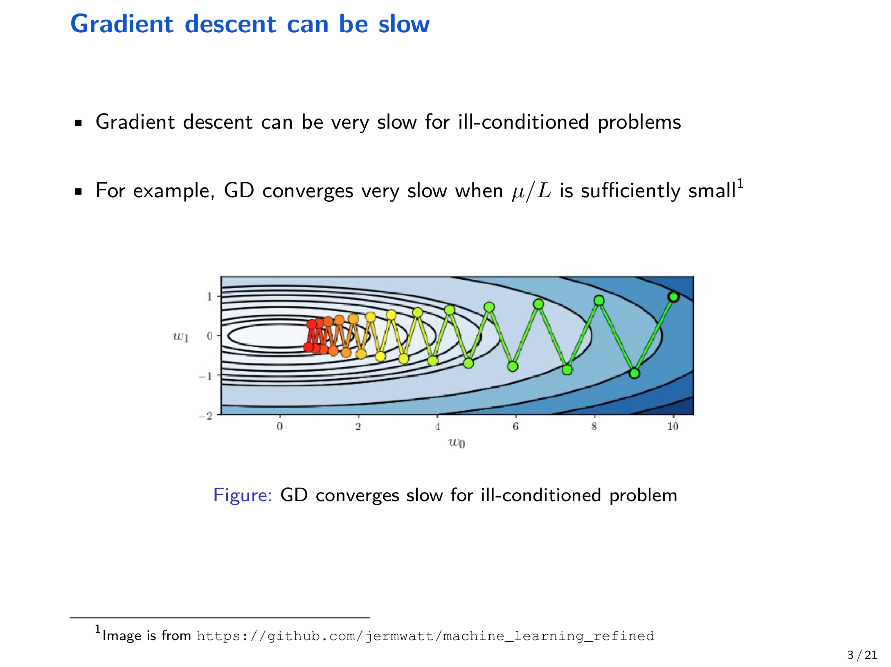{ width="800" }

一种朴素想法是：在更新中引入 “惯性”，把历史更新方向叠加进来，让轨迹少走弯路。

## 2 从加速 GD 到加速 SGD

### 2.1 Polyak 动量（Heavy-ball）

Polyak 动量（又称 heavy-ball）在确定性梯度下降中使用：

$$
x_k = x_{k-1} - \gamma \nabla f(x_{k-1}) + \beta (x_{k-1} - x_{k-2}), \quad \beta \in (0,1).
$$

其中 $\beta$ 控制 “惯性” 强度，$\gamma$ 是学习率。直观上，$\beta (x_{k-1}-x_{k-2})$ 会沿着上一步的位移方向继续推进，从而缓解 Zig-Zag。

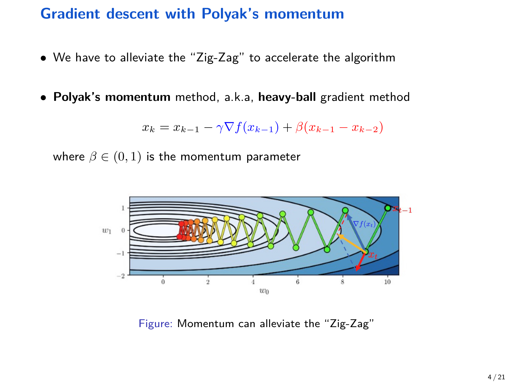{ width="800" }

### 2.2 Nesterov 动量（NAG）

Nesterov 加速梯度（NAG）常写成 “先外推、再求梯度” 的形式：

$$
\begin{aligned}
y_{k-1} &= x_{k-1} + \beta (x_{k-1} - x_{k-2}), \\
x_k &= y_{k-1} - \gamma \nabla f(y_{k-1}), \quad \beta \in (0,1).
\end{aligned}
$$

相比 heavy-ball，NAG 用外推点 $y_{k-1}$ 来计算梯度，确定性凸优化下可达到经典的 $O(1/k^2)$ 加速率。

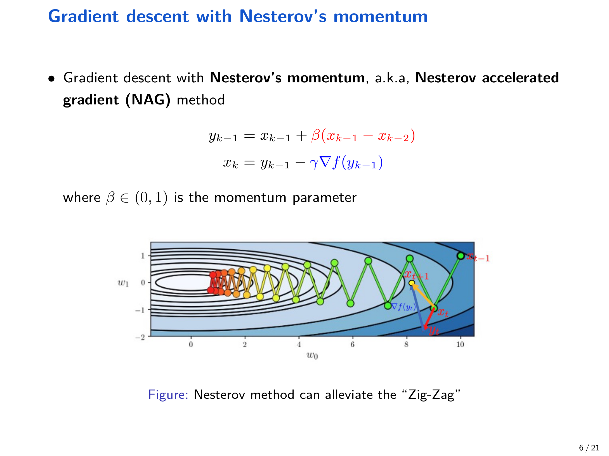{ width="800" }

## 3 Momentum SGD：重球动量在随机梯度上的实现

随机优化问题为：

$$
\min_{x \in \mathbb{R}^d} f(x) := \mathbb{E}_{\xi \sim \mathcal{D}}[F(x;\xi)].
$$

标准 SGD 更新为：

$$
x_{k+1} = x_k - \gamma \nabla F(x_k;\xi_k).
$$

Momentum SGD（Polyak 动量的随机版本）则为：

$$
x_{k+1} = x_k - \gamma \nabla F(x_k;\xi_k) + \beta (x_k - x_{k-1}), \quad \beta \in [0,1).
$$

它也常被写成 “动量缓冲区（momentum buffer）” 的形式：

$$
\begin{aligned}
m_k &= \beta m_{k-1} + \nabla F(x_k;\xi_k), \quad m_0 = 0, \\
x_{k+1} &= x_k - \gamma m_k.
\end{aligned}
$$

该写法与常见深度学习框架（例如 PyTorch 的 SGD with momentum）实现一致。

### 3.1 现象：动量看似加速，但也可能恶化最终效果

讲义在简单线性回归例子中展示：

- 在相同学习率下，加入动量可能更快下降，但最终误差反而更大
- 调整学习率后，动量方法的轨迹常与 “更大学习率的 SGD” 现象相似

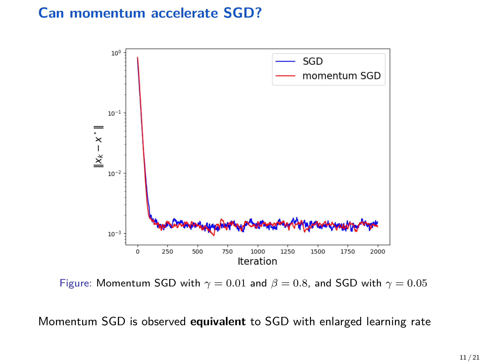{ width="800" }

## 4 一个重要结论：在小学习率下，Momentum SGD 等价于放大学习率的 SGD

讲义给出一个非正式定理（Yuan et al., 2016），解释了上面的数值观察。

!!! abstract "定理（Yuan et al., 2016，非正式）"
    假设 $f$ 是 $L$-smooth 且强凸。若动量法的学习率 $\gamma_m$ 足够小、动量系数 $\beta$ 与 $1$ 有固定间隔（bounded away from $1$），并令

    $$
    \gamma_s = \frac{\gamma_m}{1-\beta},
    $$

    则 Momentum SGD 与标准 SGD（学习率为 $\gamma_s$）在收敛行为上等价。

该结论带来两个直接含义：

- 动量看起来像是 “把学习率放大了 $1/(1-\beta)$”
- 当学习率已经足够小时，动量并不会带来额外理论收益（这也是一个 “负面结果”）

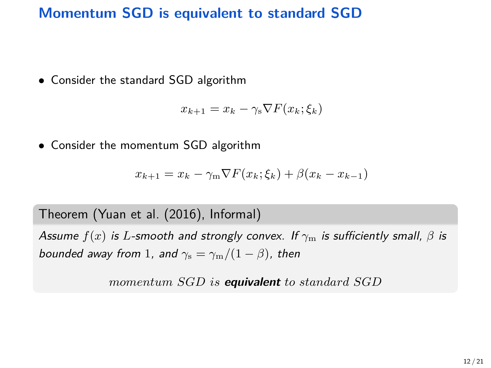{ width="800" }

## 5 Nesterov 动量的随机版本：Accelerated SGD 的收敛性

Polyak 动量在理论上不带来真正加速后，一个自然问题是：Nesterov 动量在随机梯度下能否加速？

### 5.1 算法：Nesterov Momentum SGD（讲义/讲义笔记记号）

笔记（notes_ch8_1）使用如下迭代：

$$
\begin{aligned}
y_k &= (1-\theta_k)x_{k-1} + \theta_k v_{k-1}, \\
x_k &= y_{k-1} - \gamma \nabla F(y_{k-1};\xi_k), \\
v_k &= \theta_k^{-1} x_k + (1-\theta_k^{-1}) x_{k-1}.
\end{aligned}
$$

其中 $\theta_k$ 是随迭代变化的动量参数。

### 5.2 两个基本假设（随机梯度 Oracle）

!!! note "假设 5.1（无偏 + 有界方差）"
    给定过滤族（filtration）$\mathcal{F}_k$，假设

    $$
    \mathbb{E}\left[\nabla F(y_{k-1};\xi_k)\mid \mathcal{F}_k\right]=\nabla f(y_{k-1}),
    $$

    $$
    \mathbb{E}\left[\left\lVert \nabla F(y_{k-1};\xi_k)-\nabla f(y_{k-1})\right\rVert^2\mid \mathcal{F}_k\right]\le \sigma^2.
    $$

其中 $\mathcal{F}_k$ 表示第 $k$ 步之前的所有历史信息（包含 $x_0,y_0,v_0,\xi_0,\dots,\xi_{k-1}$ 以及由它们生成的迭代变量），而当前采样 $\xi_k$ 不属于 $\mathcal{F}_k$。

### 5.3 收敛结果：凸光滑情形的 “部分加速”

讲义给出的结论可以概括为：当 $f$ 是凸且 $L$-smooth 时，Nesterov 动量的随机版本满足

$$
\mathbb{E}[f(x_K)-f^\star] = O\left(\sqrt{\frac{\sigma^2}{K}} + \frac{1}{K^2}\right).
$$

当 $\sigma^2 = 0$ 时退化为确定性加速 GD 的 $O(1/K^2)$；而标准 SGD 在同样假设下通常为

$$
\mathbb{E}[f(x_K)-f^\star] = O\left(\sqrt{\frac{\sigma^2}{K}} + \frac{1}{K}\right).
$$

因此，动量只能加速确定性项（$1/K \to 1/K^2$），但无法改善随机噪声主导项 $\sqrt{\sigma^2/K}$。当 $K$ 足够大时，$\sqrt{\sigma^2/K}$ 往往支配整体误差，从而 “看不到” 加速。

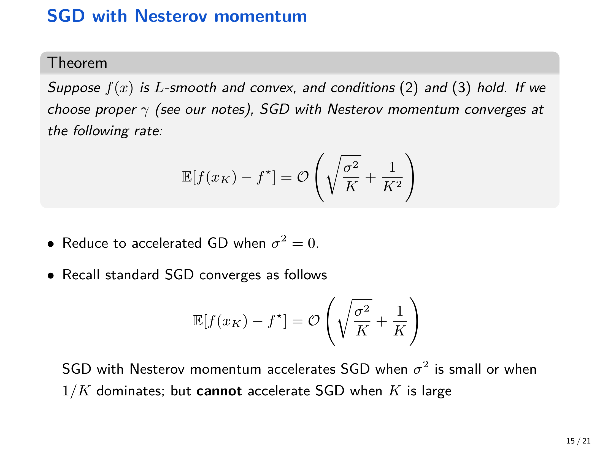{ width="800" }

### 5.4 更精确的上界（notes_ch8_1）

!!! abstract "定理 5.2（He & Yuan，notes_ch8_1: Theorem 3.2）"
    设 $f$ 是凸且 $L$-smooth，并且假设 5.1 成立。若取 $\theta_k = 2/(k+1)$ 且 $0<\gamma \le 1/L$，则

    $$
    \mathbb{E}[f(x_K)-f^\star]
    \le
    \frac{2L\Delta_0}{\gamma (K+1)^2}
    +
    \frac{(K+2)(2K+3)\gamma \sigma^2}{6L(K+1)},
    $$

    其中 $\Delta_0 := \|x_0-x^\star\|_2^2$。

    进一步若取

    $$
    \gamma
    =
    \frac{1/L}{1+\sqrt{\frac{(K+1)(K+2)(2K+3)\sigma^2}{12 L^2 \Delta_0}}},
    $$

    则有简化上界

    $$
    \mathbb{E}[f(x_K)-f^\star]
    \le
    \frac{2L\Delta_0}{(K+1)^2}
    +
    \sqrt{\frac{5\Delta_0\sigma^2}{K+1}}.
    $$

## 6 下界：为什么无法加速噪声主导项

讲义给出一个典型的随机优化下界：对任何一阶算法（每一步只能使用过去随机梯度信息），总存在某个凸且 $L$-smooth 的目标函数，使得该算法输出满足

$$
f(x_K) - f^\star = \Omega\left(\sqrt{\frac{\sigma^2}{K}} + \frac{1}{K^2}\right).
$$

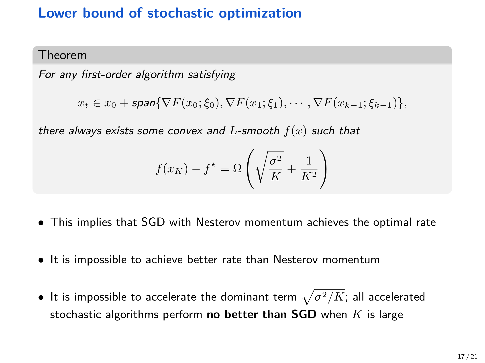{ width="800" }

该下界意味着两点：

- $1/K^2$ 这类确定性项可以被加速并达到最优
- 但主导项 $\sqrt{\sigma^2/K}$ 在仅使用凸性 + 光滑性假设时无法改进，因此当 $K$ 大、噪声主导时 “加速” 在阶数上不可能发生

讲义同时总结了不同设置下的复杂度上界/下界对照表。

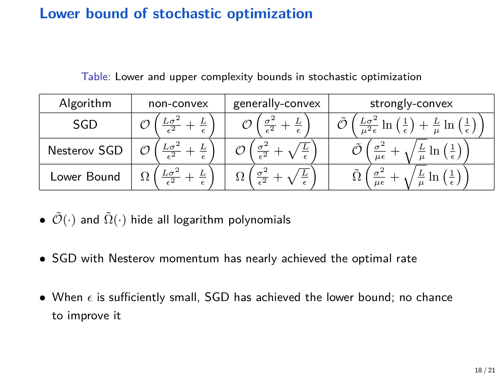{ width="800" }

notes_ch8_1 也给出一般凸情形的迭代复杂度下界（Proposition 4.2）：对任意 $\Delta_0>0$，存在常数 $c=\Theta(1)$、凸 $L$-smooth 的 $f$ 与满足假设 5.1 的随机梯度 oracle，使得任意算法要达到 $\mathbb{E}[f(\hat x)]-f^\star\le \varepsilon$（$0<\varepsilon\le cL\Delta_0$）至少需要

$$
\Omega\left(\frac{\Delta_0\sigma^2}{\varepsilon} + \sqrt{\frac{L\Delta_0}{\varepsilon}}\right)
$$

次迭代。

## 7 实践：为什么动量仍然被广泛使用

尽管上述理论表明 “在阶数意义下很难加速噪声主导项”，动量仍在实际深度学习训练中几乎无处不在。讲义指出理论与实践之间仍存在缺口，一个可能的原因是深度模型/数据具有额外结构，尚未被这些经典假设所捕捉。

## 8 Adaptive SGD：从预条件（Preconditioning）到自适应学习率

自适应方法的核心观点是：病态性往往体现在不同坐标方向的尺度差异上，如果能构造合适的预条件矩阵 $P_k$，就能对不同方向自动缩放更新幅度。

### 8.1 预条件梯度下降（Preconditioned GD）

对于病态二次型问题，直接 GD 往往很慢：

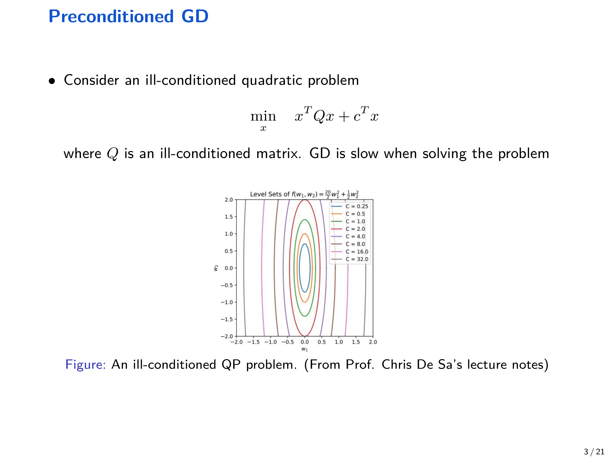{ width="800" }

通过变量替换 $x = P^{1/2} w$ 可改善几何结构；当 $P = Q^{-1}$ 时可把病态问题变为良态问题，从而显著加速。

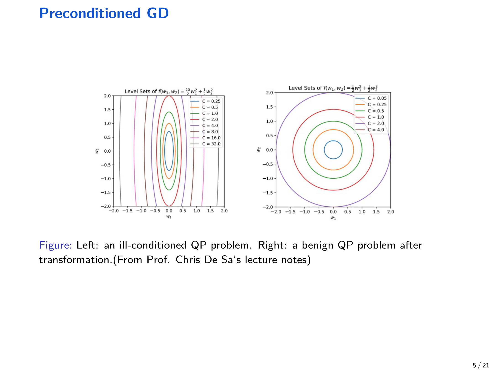{ width="800" }

一般地，预条件 GD 形如：

$$
x_{k+1} = x_k - \gamma P_k \nabla f(x_k).
$$

若取 $P_k = [\nabla^2 f(x_k)]^{-1}$，则退化为牛顿法。对应到随机优化，即预条件 SGD：

$$
x_{k+1} = x_k - \gamma P_k \nabla F(x_k;\xi_k).
$$

## 9 AdaGrad

AdaGrad 是典型的坐标自适应方法，使用历史梯度平方的累加来缩放每个坐标方向的步长。令

$$
g_k = \nabla F(x_k;\xi_k), \quad s_k = s_{k-1} + g_k \odot g_k, \quad s_0 = 0,
$$

则 AdaGrad 更新为（$\odot$ 表示逐元素运算）：

$$
x_{k+1} = x_k - \frac{\gamma}{\sqrt{s_k}+\varepsilon}\odot g_k.
$$

它可以视为预条件 SGD，取

$$
P_k = \mathrm{diag}\left(\frac{1}{\sqrt{s_{k,1}}+\varepsilon},\dots,\frac{1}{\sqrt{s_{k,d}}+\varepsilon}\right).
$$

因此，对 “经常出现大梯度的方向” 自动减小学习率，对 “梯度较小的方向” 相对增大学习率，从而缓解 Zig-Zag。

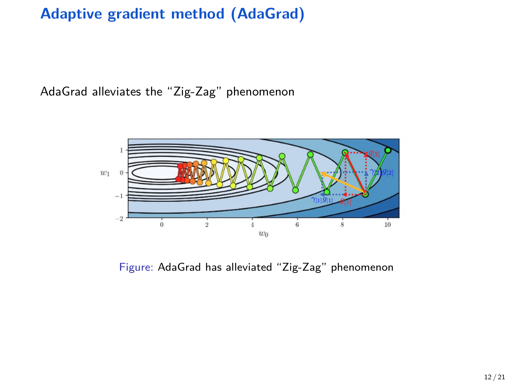{ width="800" }

## 10 RMSProp

AdaGrad 的一个问题是 $s_k$ 单调累积，导致有效学习率不断变小，后期可能过慢。RMSProp 改为指数滑动平均：

$$
s_k = \beta s_{k-1} + (1-\beta) g_k \odot g_k, \quad \beta \in (0,1),
$$

并使用同样的预条件更新：

$$
x_{k+1} = x_k - \frac{\gamma}{\sqrt{s_k}+\varepsilon}\odot g_k.
$$

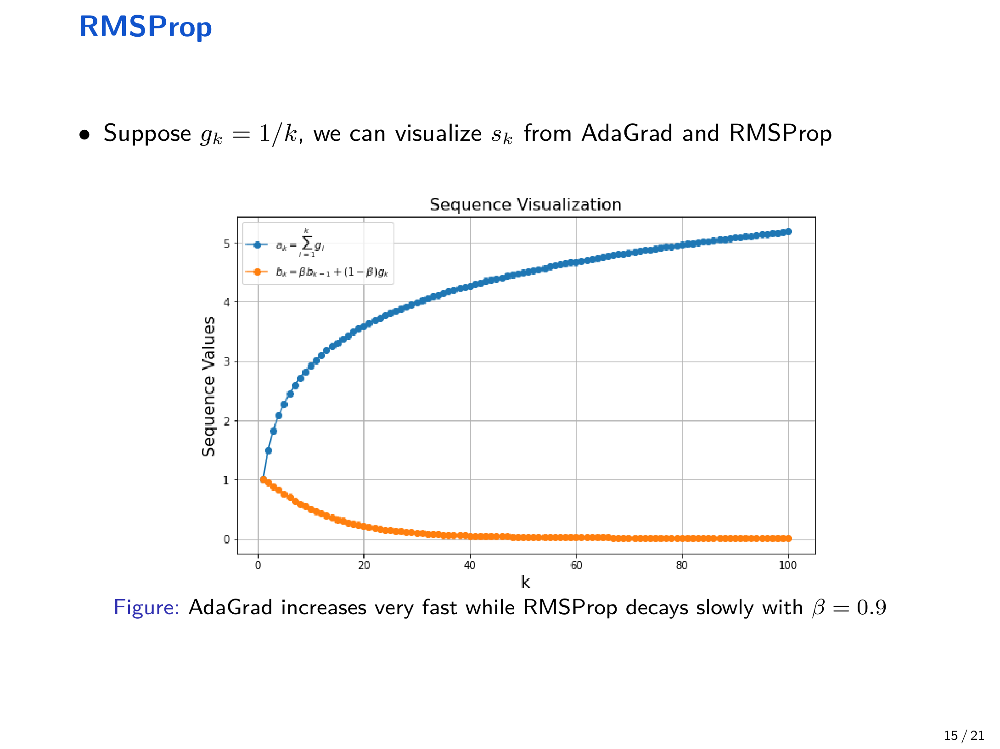{ width="800" }

## 11 Adam：动量 + 自适应学习率

Adam 同时引入一阶动量与二阶累积（逐元素）：

$$
\begin{aligned}
g_k &= \nabla F(x_k;\xi_k), \\
m_k &= \beta_1 m_{k-1} + (1-\beta_1) g_k, \\
s_k &= \beta_2 s_{k-1} + (1-\beta_2) g_k \odot g_k, \\
x_{k+1} &= x_k - \frac{\gamma}{\sqrt{s_k}+\varepsilon}\odot m_k,
\end{aligned}
$$

其中常用超参数为 $\beta_1=0.9,\beta_2=0.999$，并用 $\varepsilon$ 做数值稳定。

## 12 数值表现与参考文献

讲义展示了在 MNIST 多层网络 + dropout 上，多种自适应算法/动量算法的训练曲线对比（图来自 Adam 论文）。

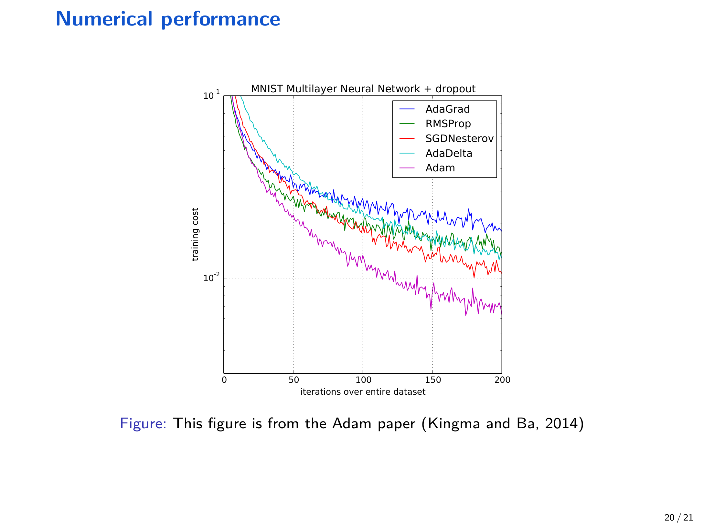{ width="800" }

参考文献（与讲义一致）：

- Kingma, D. P., & Ba, J. (2014). Adam: A method for stochastic optimization.
- Yuan, K., Ying, B., & Sayed, A. H. (2016). On the influence of momentum acceleration on online learning.
- Carmon, Y., Duchi, J. C., Hinder, O., & Sidford, A. (2020). Lower bounds for finding stationary points.
