[Parameter-Efficient Fine-Tuning (PEFT)](slides/fine_tune_0521.pdf)

这份笔记按课件主线整理大语言模型中的 **参数高效微调** 问题。核心问题是：当我们已经有一个昂贵的预训练模型时，如何在 **有限显存、有限存储、有限训练预算** 下，把它快速适配到具体任务或具体领域。

整份课件可以概括成一条很清晰的主线：

> Full fine-tuning 效果强，但代价高；PEFT 的目标不是彻底替代全参数微调，而是在资源受限场景下，用尽可能少的可训练参数逼近全参数微调的效果。

## 1 什么是 Finetune

课件一开始先回顾了微调的基本定义：

- 先拿一个已经预训练好的模型
- 再在更具体的数据集上继续训练
- 让模型适配特定任务或特定领域

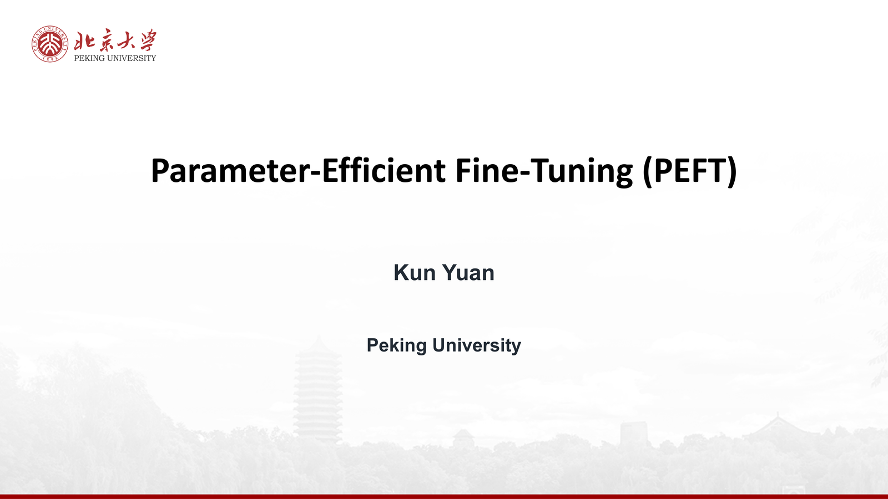{ width="800" }

因此，finetune 的本质并不是“从头训练一个新模型”，而是：

> 以预训练模型作为一个很好的初始化，再沿着目标任务的方向继续优化。

这也是课件中 “Finetune is essentially retraining the model with nice initialization” 这句话的含义。

## 2 Finetune、Prompt、RAG 分别适合什么场景

### 2.1 Finetune vs Prompt

课件用两页内容对比了 finetune 与 prompt：

- **Finetune** 更适合有足够标注数据、追求高性能定制的场景
- **Prompting** 更适合数据稀缺、希望快速适配新任务的场景

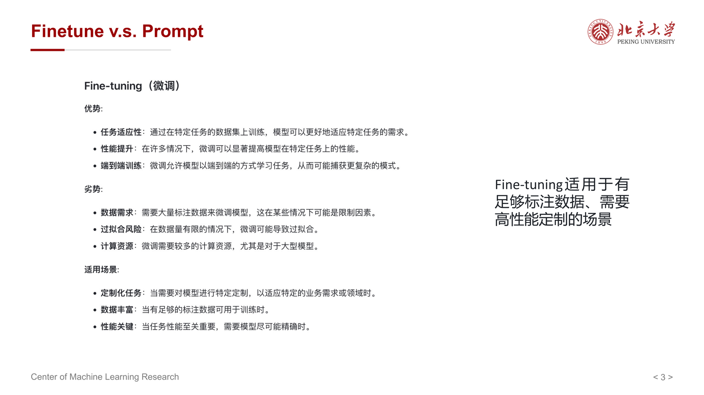{ width="800" }

可以这样理解：

- 如果你已经有比较稳定的任务定义、足够的数据、明确的效果目标，那么微调通常更有价值
- 如果你只是想快速试验任务、数据很少，或者任务还在频繁变化，那么 prompt engineering 更灵活

### 2.2 Finetune vs RAG

课件还把 finetune 与 RAG 做了区分：

- **RAG** 更适合依赖外部知识检索的场景
- 它尤其适合知识经常变化、希望引用最新资料的应用
- 代价是推理链路更长，系统复杂度也更高

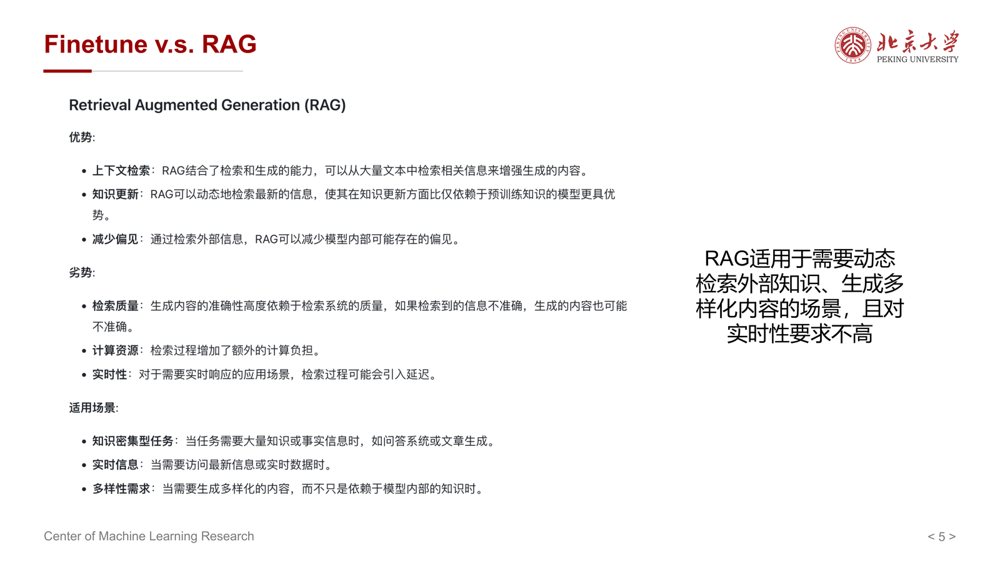{ width="800" }

所以三者的角色并不冲突：

- Prompt 更像“轻量适配”
- Finetune 更像“把能力写进模型”
- RAG 更像“把知识放到模型外部，按需检索”

## 3 为什么 Full Fine-Tuning 很贵

### 3.1 训练成本高

课件强调，LLM 的全参数微调非常昂贵，主要原因包括：

- **计算资源** 昂贵
- **高质量领域数据** 获取与清洗成本高
- **训练与调参经验** 有门槛
- **多轮实验与维护** 代价大

更关键的是，full fine-tuning 的显存消耗几乎和预训练同量级。

### 3.2 以 7B 模型为例的显存账本

课件给出了一个很典型的 7B 模型估算：

- Parameters: 7B
- Model storage: 14 GB
- Gradient storage: 14 GB
- Optimizer states: 28 GB
- Activations: 2 GB
- Total: 58 GB

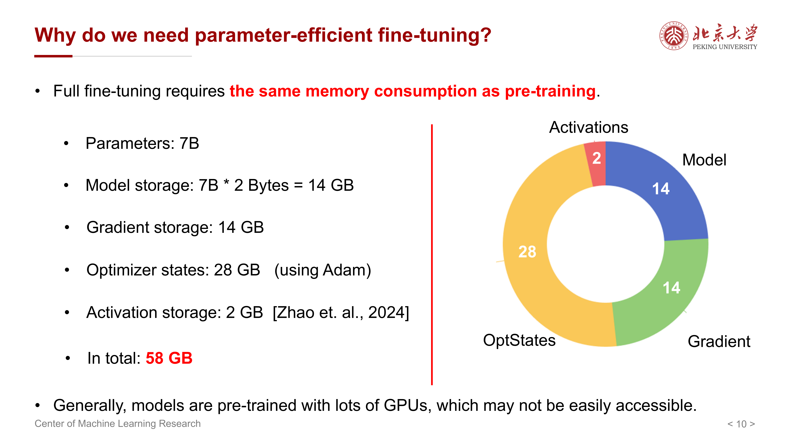{ width="800" }

这张图最重要的结论不是具体数字，而是：

> 如果所有参数都要训练，那么不仅模型本身要放进显存，梯度和优化器状态也都要为每个参数额外分配空间。

因此 full fine-tuning 真正贵的地方不只是参数量，而是训练时一整套附加状态一起膨胀。

### 3.3 存储多个任务版本同样昂贵

除了训练显存，课件还强调了另一个现实问题：**checkpoint 存储**。

- 一个基础模型就已经很大
- 若每个任务都保存一份完整微调权重，存储会迅速爆炸
- 同一任务的不同版本也会进一步叠加成本

这说明全参数微调不仅训练贵，长期维护也贵。

## 4 为什么需要 Parameter-Efficient Fine-Tuning

PEFT 的目标可以概括为三点：

- 尽量冻结预训练模型主体参数
- 只训练一小部分新增参数或少量已有参数
- 用较小的代价得到可部署的任务专用模型

课件用 adapter 的例子说明：

- 基础模型只保存一份
- 每个任务只额外保存很小的适配模块
- 组合基础模型与适配模块，就能恢复任务专用能力

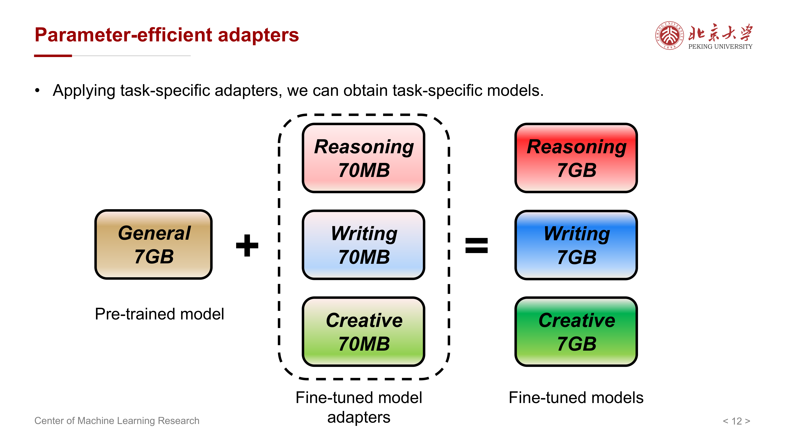{ width="800" }

这背后的优势非常直接：

- 训练更省显存
- 部署更省存储
- 多任务切换更方便
- 便于在私有应用中做定制化适配

## 5 第一类方法：BitFit

### 5.1 核心思想

**BitFit** 的思路非常激进也非常简单：

- 冻结几乎所有权重矩阵
- 只训练各层中的 bias 项

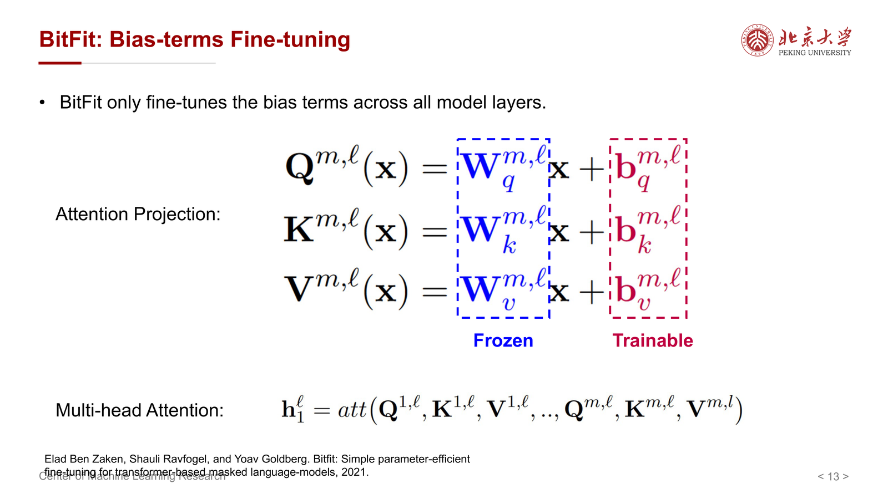{ width="800" }

课件连续两页都在强调这件事：BitFit 不是往模型里插新层，也不是近似原矩阵，而是直接只开放最少量的已有参数。

### 5.2 为什么它可能有效

直觉上，bias 可以看成对各层激活分布的一个小范围平移修正。因此 BitFit 的假设是：

> 预训练模型的大部分知识已经足够好，下游任务更多只是需要对表示做少量偏移。

这种方法的优点是：

- 参数量极小
- 实现简单
- 训练成本低

但局限也很明显：

- 可调节自由度太小
- 面对复杂任务时，表达能力往往不够

所以 BitFit 更像是最轻量的 PEFT 基线。

## 6 第二类方法：Adapter-H

### 6.1 基本结构

**Adapter-H（Houlsby Adapter）** 的核心做法是在每个 Transformer layer 中插入额外的小模块，而原始主干参数大多冻结。

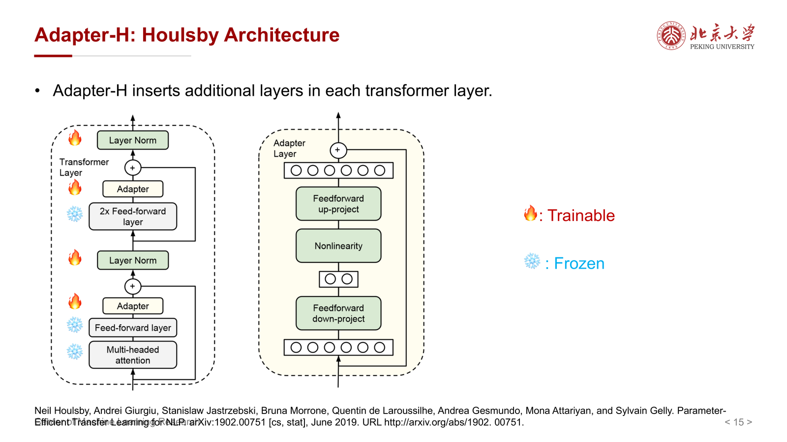{ width="800" }

它的关键点是：

- 主干网络保持不变
- 新增小型可训练层
- 下游知识主要写入这些 adapter 中

### 6.2 Adapter 的理解方式

可以把 adapter 看成：

- 一个插在大模型内部的小型任务专用变换器
- 参数量远小于主模型
- 但比 BitFit 有更强的表达能力

与 BitFit 相比，adapter 更“重”一些；与 full fine-tuning 相比，它又轻很多。因此它在历史上是 PEFT 非常经典的一类方法。

## 7 第三类方法：LoRA

### 7.1 LoRA 的基本想法

课件把 LoRA 作为重点内容展开。它的核心思想是：

- 不直接更新大矩阵 $W$
- 把权重增量 $\Delta W$ 近似成一个低秩矩阵乘积
- 只训练这个低秩增量

其优化目标可写成：

$$
\min_{A \in \mathbb{R}^{p \times r}, \, B \in \mathbb{R}^{r \times q}}
\mathbb{E}_{\xi \sim D} \bigl[F(W + AB; \xi)\bigr]
$$

其中：

- $W$ 是冻结的预训练权重
- $A, B$ 是可训练的低秩矩阵
- $\Delta W = AB$
- $r$ 是秩，且通常远小于 $p, q$

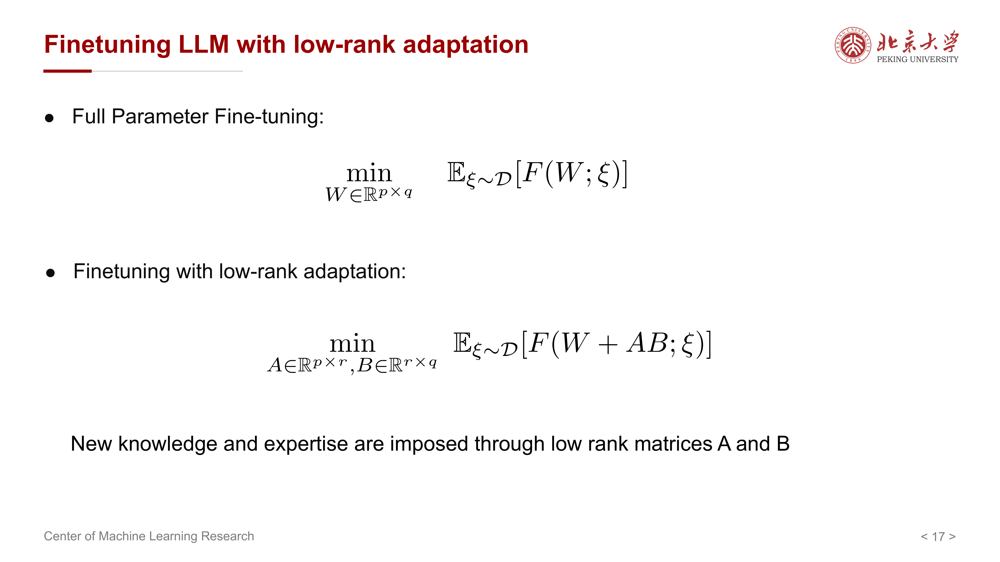{ width="800" }

### 7.2 为什么低秩近似有意义

LoRA 的隐含假设是：

> 对于很多下游任务，预训练权重真正需要的更新方向并不覆盖完整高维空间，而是集中在一个相对低维的子空间里。

因此，不必真的为整个 $p \times q$ 的矩阵都开训练自由度，只需要学习一个秩为 $r$ 的更新：

$$
W' = W + \Delta W = W + AB
$$

于是前向传播变成：

$$
W'x = (W + AB)x = Wx + ABx
$$

这里的关键不是把原矩阵替换掉，而是在原始线性变换上叠加一个低秩修正项。

### 7.3 LoRA 的优点

相对 full fine-tuning，LoRA 的主要优点是：

- 可训练参数从 $O(pq)$ 降到 $O((p+q)r)$
- 多任务存储成本大幅下降
- 与现有 Transformer 线性层兼容性很好
- 常常能在较低成本下取得接近 full fine-tuning 的效果

因此，LoRA 成了 PEFT 中最有代表性的方案之一。

## 8 LoRA 的 memory 与 computation 分析

### 8.1 Memory 为什么能省

课件专门对 full fine-tuning 与 LoRA 的内存开销做了对比。

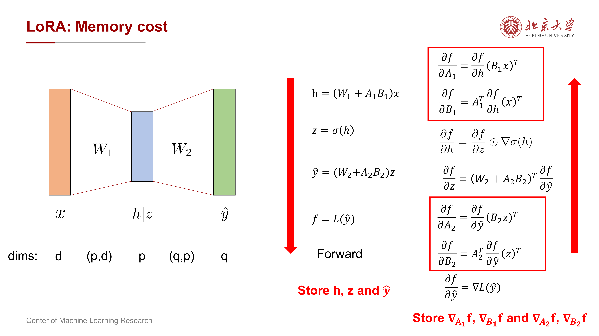{ width="800" }

核心结论是：

- LoRA 不需要为整个大矩阵保存梯度和优化器状态
- 只需要为 $A, B$ 这两个低秩矩阵保存对应状态
- 因此 model / grads / optimizer states 三部分都能显著减少

课件总结为：

$$
\text{Memory cost} = \text{Models} + \text{Grads} + \text{Optimizers} + \text{Activations}
$$

LoRA 的优势主要体现在前 3 项，从

$$
O(pq)
$$

下降到

$$
O((p+q)r)
$$

### 8.2 为什么 LoRA 不能显著节省 activation memory

课件特别提醒：

> LoRA 并不会显著节省 activation-incurred memory。

原因是：

- 前向传播仍然要经过完整主模型
- 反向传播依然需要保留很多中间激活用于求导
- 当长上下文导致 activation memory 成为主导时，LoRA 的优势会被削弱

所以如果瓶颈来自超长序列，而不是权重和优化器状态，LoRA 并不是万能解法。

### 8.3 为什么 LoRA 也不一定省计算

课件在 computational cost 部分也给出一个很容易被忽视的结论：

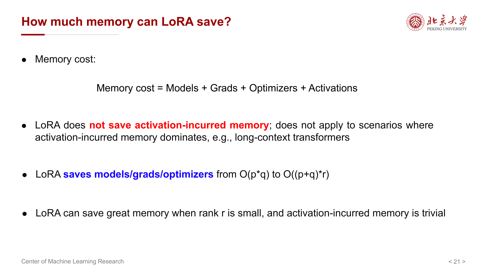{ width="800" }

> LoRA 不会显著减少计算量。

这是因为：

- 主干的前向计算仍然存在
- 额外还引入了低秩分支 $ABx$
- 反向传播中仍需计算 $A, B$ 的梯度

所以 LoRA 更准确的价值是 **省参数状态内存**，而不是大幅减少 FLOPs。

## 9 LoRA 的进一步改进：LoRA+

课件随后介绍 **LoRA+**。它关注的不是 LoRA 的总体结构，而是训练动力学问题。

其观察是：

- 在 LoRA 中，$A$ 或 $B$ 往往有一个会初始化为 0
- 因而这一分支在训练初期更新会很慢

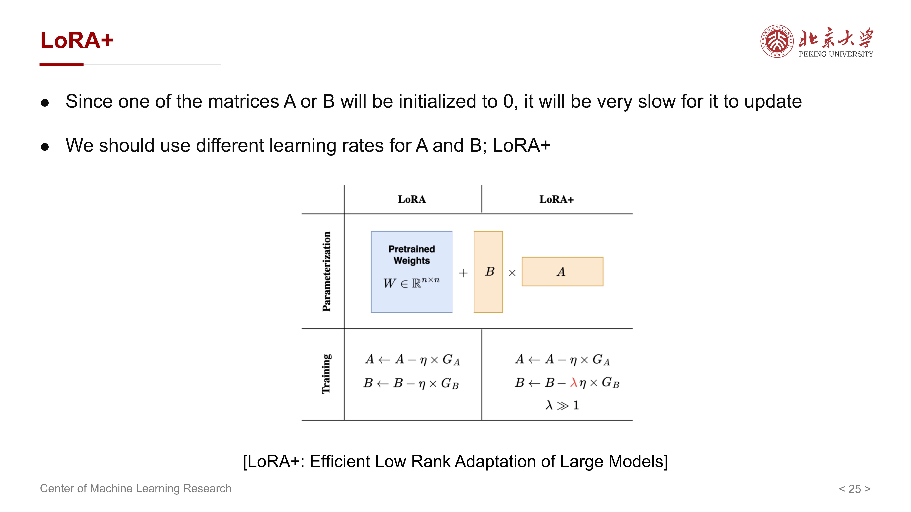{ width="800" }

LoRA+ 的做法是：

- 给 $A$ 和 $B$ 使用不同的 learning rate

直觉上，这是因为两个矩阵在优化中的角色并不完全对称，若还强行使用同一学习率，就可能出现一边更新过快、一边更新过慢的问题。

所以 LoRA+ 可以看成是：

> 在不改变 LoRA 低秩结构的前提下，进一步改善优化效率的训练技巧。

## 10 另一种改进：DoRA

### 10.1 DoRA 的核心想法

课件介绍的 **DoRA（Weight-Decomposed Low-Rank Adaptation）** 强调：

- 一个权重矩阵可以拆成 **magnitude** 与 **direction**
- LoRA 更擅长处理方向变化
- 但对幅值变化的建模不够直接

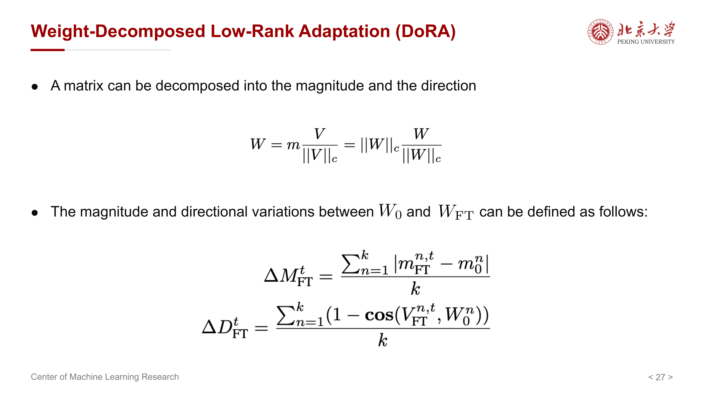{ width="800" }

因此，DoRA 试图把参数更新拆成两部分：

- 单独学习权重大小的变化
- 单独学习权重方向的变化

### 10.2 DoRA 想解决什么问题

课件后几页都在比较 LoRA 与 full fine-tuning 在更新模式上的差异，结论可以概括为：

- LoRA 与 full fine-tuning 的更新形态并不完全一致
- DoRA 希望让这种更新行为更接近 full fine-tuning

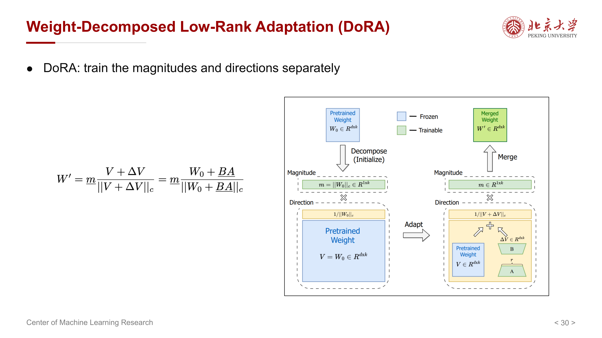{ width="800" }

所以 DoRA 可以理解为：

> 在 LoRA 的参数高效框架下，进一步增强更新表达能力，使其更像真正的全参数更新。

## 11 不只更新低秩分支：LISA

### 11.1 LISA 的出发点

课件提出了一个很自然的问题：

> 如果 LoRA 只是训练一个低秩增量，那能不能在显存可控的前提下，直接训练“部分全参数”？

这就是 **LISA（Layer-wise Importance Sampling for Memory-Efficient Large Language Model Fine-Tuning）** 的出发点。

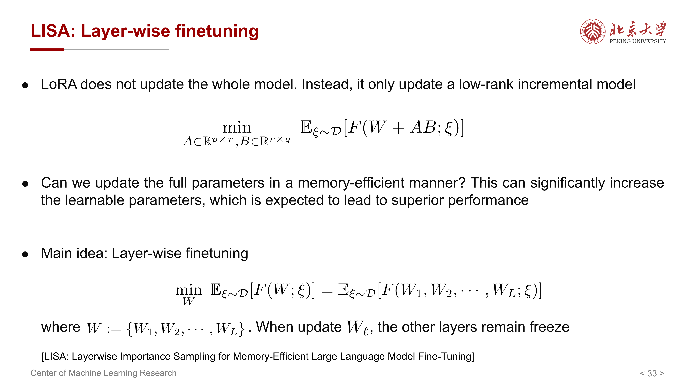{ width="800" }

其基本思想是：

- 模型共有很多层
- 每次不是所有层一起更新
- 而是只选部分层进行训练，其余层冻结

### 11.2 为什么这样能省资源

如果每一步只更新少数层，那么：

- 只需为这些层保存梯度和优化器状态
- 训练自由度又比单纯的 low-rank update 更大

这类方法的思想和 LoRA 很不一样：

- LoRA：所有层都可插低秩增量，但每层只改很少参数
- LISA：允许训练真实参数，但每次只开放一部分层

因此，LISA 是“参数高效”与“更接近 full fine-tuning”之间的另一条路线。

## 12 Block-wise Training

### 12.1 基本流程

课件后面进一步介绍了 **block-wise training**：

- 把 Transformer 按 block 划分
- 每次只更新一个 block
- 其他 block 保持冻结
- 在训练过程中轮流切换被更新的 block

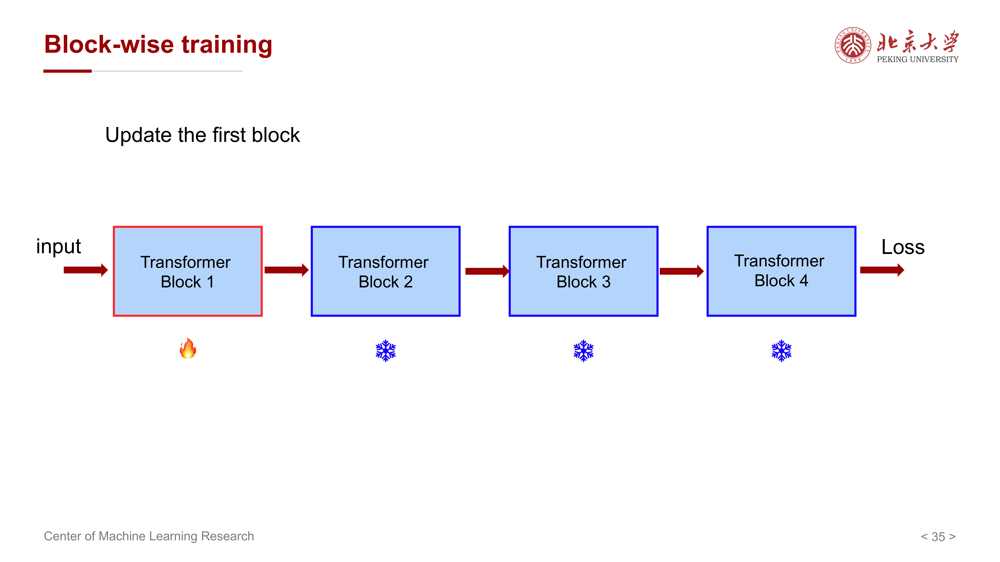{ width="800" }

这和 LISA 的思想非常接近，只是粒度更明确地落在 block 层面。

### 12.2 为什么它能节省显存

课件给出的显存公式仍然从这四部分出发：

$$
\text{Memory} = \text{Model} + \text{Gradient} + \text{Optimizer states} + \text{Activations}
$$

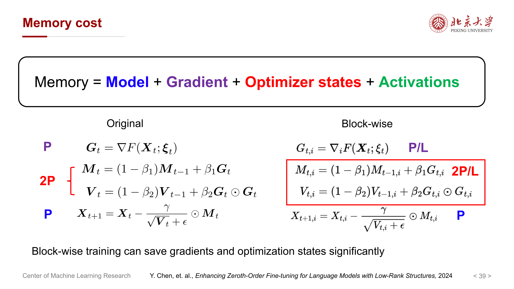{ width="800" }

block-wise training 的好处主要体现在：

- 梯度存储减少
- 优化器状态减少
- 在某些设置下，activation 也可能减少

因为当只有一个 block 可训练时，不需要为所有 block 同时维护完整的训练状态。

### 12.3 它的局限

课件也提醒，activation 是否真的能显著降低，取决于：

- 当前激活的是哪个 block
- 反向传播时哪些中间量仍然必须保留

所以它不是无条件地大幅节省所有显存，而是对不同组件节省程度不同。

## 13 这些方法之间应该如何理解

可以把这份课件中的方法按“可训练自由度”从小到大粗略排成一条线：

- **BitFit**：只调 bias
- **Adapter**：插入小型新增模块
- **LoRA**：训练低秩增量
- **DoRA / LoRA+**：对 LoRA 做结构或优化改进
- **LISA / Block-wise training**：直接训练真实参数，但只开放部分层或部分 block
- **Full fine-tuning**：所有参数全部参与训练

这条线体现的是一个持续存在的 trade-off：

- 参数越少，越省资源，但表达能力越受限
- 可训练参数越多，通常越接近 full fine-tuning，但成本也越高

因此实践中没有绝对最优方法，只有与资源预算和任务目标更匹配的方法。

## 14 一条总主线：PEFT 在解决什么

如果把整份课件压缩成一句话，可以总结为：

> PEFT 解决的是 “如何让大模型的任务适配成本下降” 这个工程问题，而不是单纯追求参数最少。

更具体地说，它在试图同时优化四件事：

- 训练显存
- 模型存储
- 多任务复用
- 下游性能

而课件介绍的 BitFit、Adapter、LoRA、DoRA、LISA、block-wise training，本质上都是在不同约束条件下，对这四个目标做权衡。

!!! summary "复习与考试重点"
    - **为什么需要 PEFT**：full fine-tuning 的模型、梯度、优化器状态与 checkpoint 存储都很贵。
    - **BitFit**：只训练 bias，最轻量，但表达能力有限。
    - **Adapter-H**：冻结主干，在每层插入小型可训练模块。
    - **LoRA**：令 $\Delta W = AB$，把可训练参数从 $O(pq)$ 降到 $O((p+q)r)$。
    - **LoRA 的关键结论**：更省参数状态内存，但不显著节省 activation memory，也不显著降低计算量。
    - **LoRA+**：为 $A$ 和 $B$ 设置不同学习率，改善训练速度。
    - **DoRA**：将更新拆成 magnitude 与 direction，两部分分开学习，使更新行为更接近 full fine-tuning。
    - **LISA / block-wise training**：不是训练低秩增量，而是只开放部分层或部分 block 的真实参数，以节省梯度和优化器状态。

## 15 易错点

- 把 PEFT 理解成“训练更快”：很多 PEFT 方法主要省的是显存和存储，不一定显著省计算时间。
- 以为 LoRA 会显著减少 activation memory：课件明确指出这通常不成立，尤其在 long-context 场景下。
- 以为参数最少的方法一定最好：BitFit 很轻量，但并不意味着效果普遍最好。
- 以为 LoRA 就是给模型换了一个小矩阵：更准确地说，它是在原权重上叠加低秩增量，而不是直接替换原始权重。
- 混淆 LoRA 与 LISA：LoRA 训练的是低秩新增参数，LISA 则是在层级上选择性训练真实权重。
