参考：北京大学机器学习研究中心 **Kun Yuan** 讲义 *Parameters, Memories, and Computations in Transformers*、*Memory Analysis in Transformers*。分析对象为 **Decoder-only Transformer**（如 GPT），与 [Transformer](Transformer.md) 中介绍的自注意力与解码器结构一致，本文侧重 **量级估计** 与 **工程预算**（训练显存、FLOPs）。

---

## 目录

- 为何关注 Decoder-only 与记号
- 前向各模块的形状与参数
- 参数量分析
- 计算量（FLOPs）分析
- 显存分解与激活
- 总显存与何时激活占主导
- 实例与小结

---

## 为何关注 Decoder-only 与记号

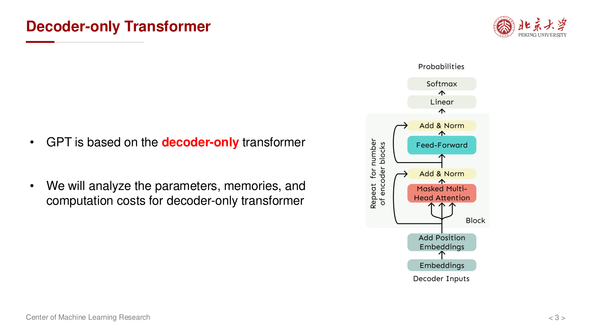{ width="550" }

**GPT** 等自回归语言模型采用 **仅解码器**（Decoder-only）结构：每一层对长度为 $s$ 的序列做 **因果自注意力**（causal self-attention，即位置 $t$ 只能看见 $1, 2, \dots, t$ 的 token，不能"偷看"未来），再经前馈子层。这种自回归方式使模型天然适合 **文本生成** 任务——每次根据已有上下文预测下一个 token。

为什么要做参数量、计算量和显存的分析？因为在实际工程中，模型能否训练、用多少卡、训多久，都取决于这三者的量级。掌握它们与超参数的关系，可以在 **模型设计阶段** 就预估资源需求，也便于与公开模型（如 LLaMA、GPT-3）的配置对照验证。

采用如下记号（与讲义一致）：

- $l$：Transformer **层数**（depth），决定模型能学到多深层次的表示
- $s$：**序列长度**（上下文长度），即一次输入最多处理多少个 token
- $h$：**隐藏维度**（embedding / hidden size），每个 token 被表示为一个 $h$ 维向量
- $v$：**词表大小**（vocabulary size），即模型能识别的不同 token 种类数
- $a$：**注意力头数**（number of heads），每个头的维度为 $h/a$
- $b$：**批大小**（batch size），一次前向传播处理的样本数

输入可视为 token 序列；经词嵌入后隐状态形状为 $(s, h)$，即序列中每个位置对应一个 $h$ 维向量。词嵌入层本质上是一个查找表，将 token id（可视为 one-hot 编码，形状 $(s, v)$）映射到稠密的连续表示 $(s, h)$。

---

## 前向各模块的形状与参数

整体堆叠方式可与 [Transformer](Transformer.md) 中解码器示意图对照；下文按 **单层内的张量形状** 与 **可训练参数个数** 汇总。

### 词嵌入（Embedding）

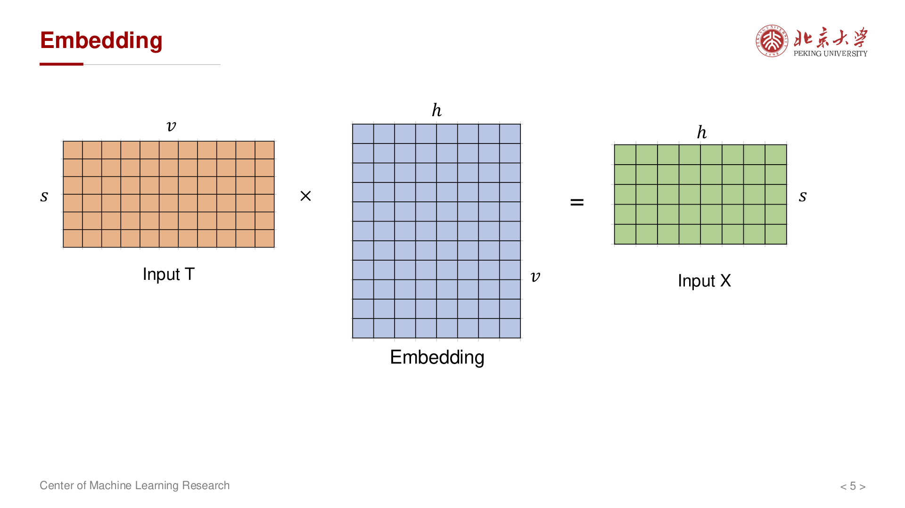{ width="550" }

词嵌入矩阵 $E \in \mathbb{R}^{v \times h}$：矩阵的每一行对应词表中一个 token 的 $h$ 维向量表示。前向时只需以 token id 为索引取出对应行，因此也称 **查表**（lookup）操作。参数量为 $vh$。

关于 **位置编码**：原始 Transformer 使用 **固定正弦位置编码**（无可训练参数）或 **可学习绝对位置嵌入**（参数量 $s \times h$，相对 $vh$ 较小）。现代模型多采用 **旋转位置编码（RoPE）** 或 **ALiBi** 等相对位置编码方案，不额外引入可训练参数，因此讲义在参数量与激活分析中均略去位置嵌入。

### 多头自注意力（MHA）

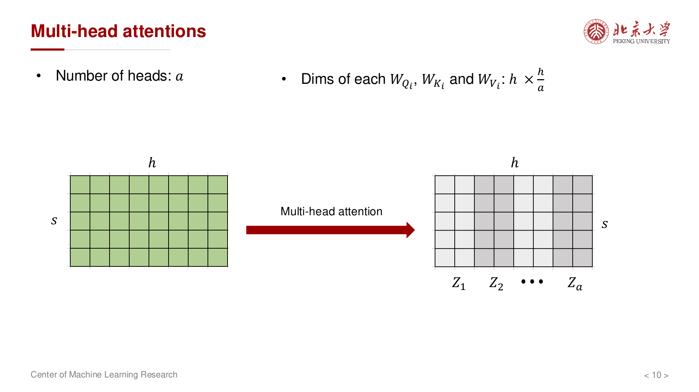{ width="550" }

讲义设定：共 $a$ 个头；每个头独立学习不同的"注意力模式"（例如某些头关注局部语法，另一些头捕捉长距离依赖）。对每个头 $i$，矩阵 $W_Q^{(i)}, W_K^{(i)}, W_V^{(i)}$ 的维度均按 $h \times h$ 计数（实现上常将所有头的投影矩阵合并为三个大矩阵 $W_Q, W_K, W_V \in \mathbb{R}^{h \times h}$，前向时一次矩阵乘得到所有头的 $Q, K, V$，再沿最后一维拆成 $a$ 个 $h/a$ 维的子空间）。

每个头内部的计算为经典的 **缩放点积注意力**：

$$
\text{head}_i = \mathrm{softmax}\!\left(\frac{Q_i K_i^\top}{\sqrt{d}}\right) V_i, \quad d = h/a
$$

其中 $\sqrt{d}$ 的缩放防止点积值过大导致 softmax 饱和（梯度消失）。各头输出拼接后再乘以输出投影 $W_O \in \mathbb{R}^{h \times h}$，将多头信息融合回 $h$ 维空间。

因此 **单层 MHA** 的参数为：

$$
\underbrace{3h^2}_{W_Q, W_K, W_V} + \underbrace{h^2}_{W_O} = 4h^2
$$

### 前馈网络（Feed-forward）

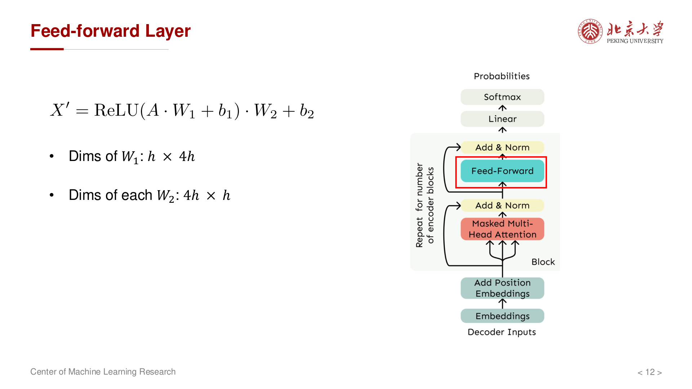{ width="550" }

典型 **扩展比 4**：$W_1 \in \mathbb{R}^{h \times 4h}$，$W_2 \in \mathbb{R}^{4h \times h}$。FFN 的作用是对注意力层提取的特征做 **逐位置的非线性变换**——先将 $h$ 维投影到更高的 $4h$ 维空间（增加表达能力），经激活函数（GELU、ReLU 或 SwiGLU 等）引入非线性，再投影回 $h$ 维：

$$
\text{FFN}(x) = W_2 \cdot \sigma(W_1 x + b_1) + b_2
$$

参数量为：

$$
h \cdot 4h + 4h \cdot h = 8h^2
$$

偏置 $b_1 \in \mathbb{R}^{4h}$，$b_2 \in \mathbb{R}^{h}$，量级为 $O(h)$，相对 $h^2$ 可忽略。

!!! note "为什么扩展比是 4？"
    这是原始 Transformer 论文的经验设定。$4h$ 的中间维度让 FFN 有足够的容量来存储和检索"知识"（有研究认为 FFN 层起到 **键值记忆** 的作用）。一些现代架构（如 LLaMA 使用的 SwiGLU FFN）会调整扩展比为 $8h/3$ 以保持参数量近似不变。

### 层归一化与 LM 头

- **LayerNorm**（层归一化）：对隐藏维度做归一化 $\hat{x} = \frac{x - \mu}{\sigma}$，再做可学习的仿射变换 $\gamma \hat{x} + \beta$，其中 $\gamma, \beta \in \mathbb{R}^h$，共 $2h$ 参数。LayerNorm 稳定训练、加速收敛，但参数量相对 $4h^2$、$vh$ 常忽略不计。每层通常有 2 个 LayerNorm（分别在 MHA 和 FFN 之前或之后）。
- **语言建模头**（LM Head）：$W_v \in \mathbb{R}^{h \times v}$，将最后一层的 $h$ 维隐状态映射到 $v$ 维 logits，经 softmax 后得到下一个 token 的概率分布。参数量 $vh$。若与词嵌入 **权重绑定（tie weights）**——即令 LM Head 与嵌入矩阵共享同一组参数——则词表相关参数只计 $vh$ 一次。权重绑定不仅节省参数，还可作为正则化手段：确保输入输出的 token 表示在同一语义空间中。

---

## 参数量分析

### 单层与堆叠

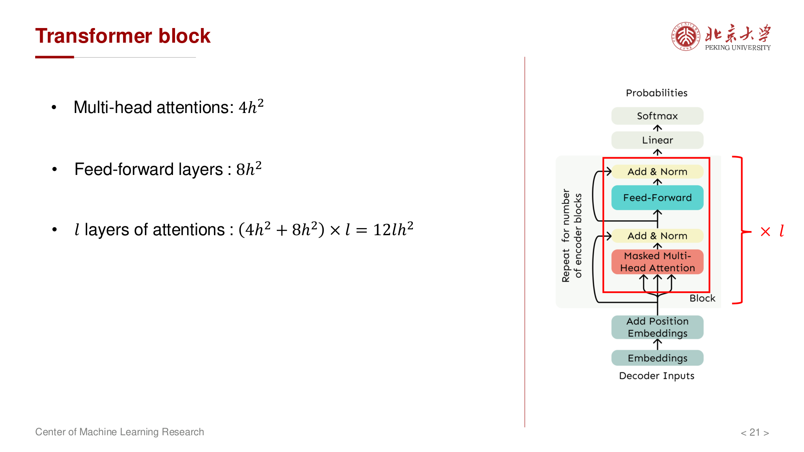{ width="550" }

**单层**（一个 Decoder block）：

- MHA：$4h^2$
- FFN：$8h^2$
- 小计：$12h^2$

共 $l$ 层堆叠，合计 $12lh^2$（未计嵌入与输出头）。

### 总计（嵌入与输出头分开）

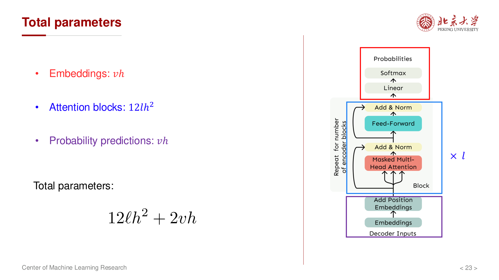{ width="550" }

- 输入嵌入：$vh$
- $l$ 层 Transformer：$12lh^2$
- 输出层 $W_v$（不与嵌入共享时）：$vh$

$$
P \approx 2vh + 12lh^2
$$

若 **嵌入与输出头共享权重**，则 $P \approx vh + 12lh^2$。其余（LayerNorm、bias）为低阶项。

### 实例：LLaMA

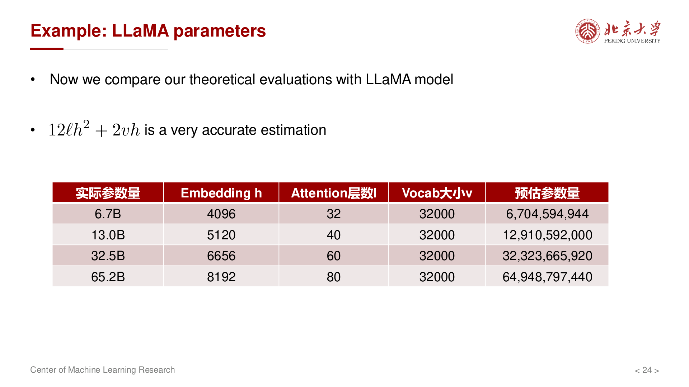{ width="550" }

用 $12lh^2 + 2vh$ 与公开配置对照，与 reported **实际参数量** 非常接近（误差来自 LayerNorm、偏置、GQA 等实现细节）。

| 实际参数量 | Embedding $h$ | 层数 $l$ | 词表 $v$ | 预估 $12lh^2 + 2vh$ |
| --------- | -------------- | -------- | -------- | ------------------- |
| 6.7B      | 4096           | 32       | 32000    | $\approx 6.70 \times 10^9$ |
| 13.0B     | 5120           | 40       | 32000    | $\approx 12.91 \times 10^9$ |
| 32.5B     | 6656           | 60       | 32000    | $\approx 32.32 \times 10^9$ |
| 65.2B     | 8192           | 80       | 32000    | $\approx 64.95 \times 10^9$ |

---

## 计算量（FLOPs）分析

### 矩阵乘与 FLOPs 约定

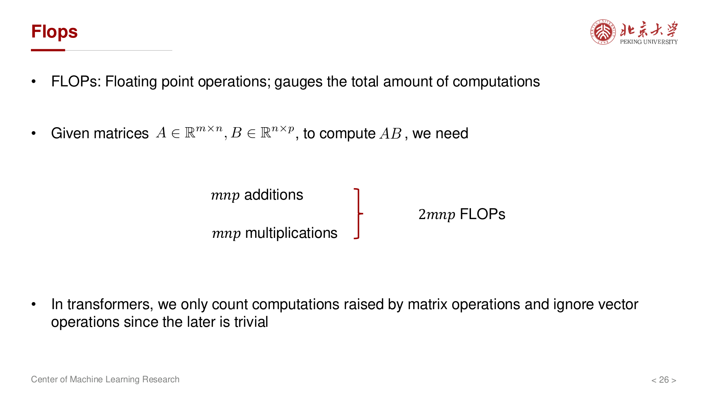{ width="550" }

- **FLOPs**（Floating Point Operations）：浮点运算次数，衡量前向（或训练步）的计算量。注意区分 FLOPs（总运算次数）与 FLOPS（每秒运算次数，即算力）。
- 对 $A \in \mathbb{R}^{m \times n}$ 与 $B \in \mathbb{R}^{n \times p}$，计算 $C = AB$ 时，结果矩阵 $C$ 的每个元素需要 $n$ 次乘法和 $n-1$ 次加法，共 $mp$ 个元素，因此总计约 $2mnp$ FLOPs（ $mnp$ 次乘法 + $mnp$ 次加法）。
- 为什么只关注矩阵乘？Transformer 中 **矩阵乘** 占计算量的绝对主导（通常 > 99%）；逐元素运算（softmax、归一化、激活函数等）的 FLOPs 为 $O(sh)$ 量级，远小于矩阵乘的 $O(sh^2)$ 或 $O(s^2 h)$，讲义中可忽略。

### 单层与前向总量

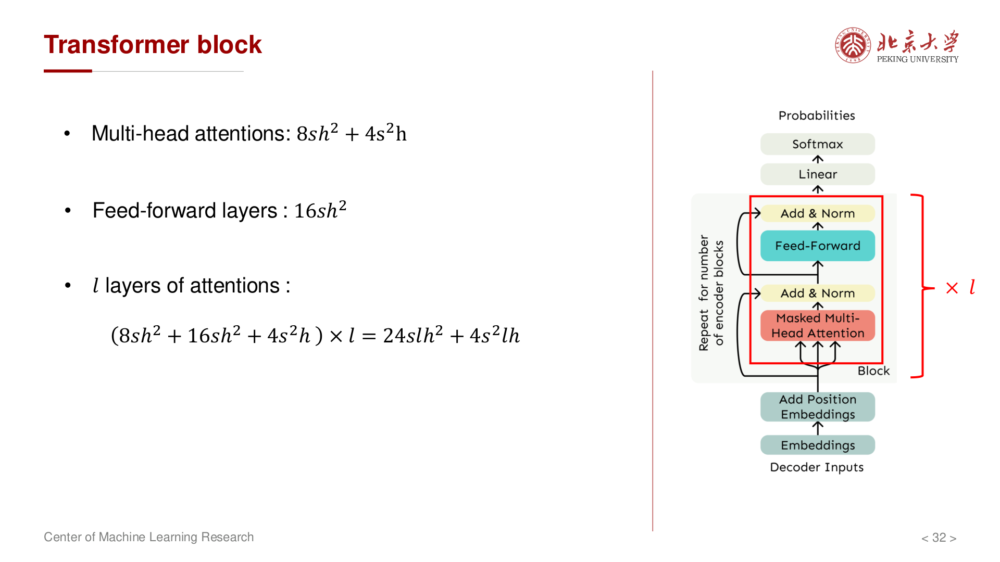{ width="550" }

**单样本**、batch size $=1$ 时，讲义给出量级：

- **词嵌入**（查表本身无矩阵乘，但后续与第一层权重的交互）：约 $2svh$。
- **每层**：
  - **多头注意力**：约 $8sh^2 + 4s^2h$。其中 $8sh^2$ 来自 $Q, K, V$ 三个投影（各 $2sh^2$）加输出投影（$2sh^2$）；$4s^2h$ 来自注意力分数 $QK^\top$（形状 $s \times s$，FLOPs 为 $2s^2 h$）和注意力加权 $\text{score} \cdot V$（同为 $2s^2 h$）。这里的 $s^2$ 项正是自注意力 **二次复杂度** 的来源。
  - **FFN**：$X W_1$ 约 $2s \cdot h \cdot 4h = 8sh^2$，$\phi(X W_1) W_2$ 同为 $8sh^2$，合计 $16sh^2$。
- **单层合计**：$24sh^2 + 4s^2h$。
- 共 $l$ 层合计：$24slh^2 + 4s^2lh$。
- **LM 头**：约 $2svh$。

### 前向总 FLOPs（单样本）

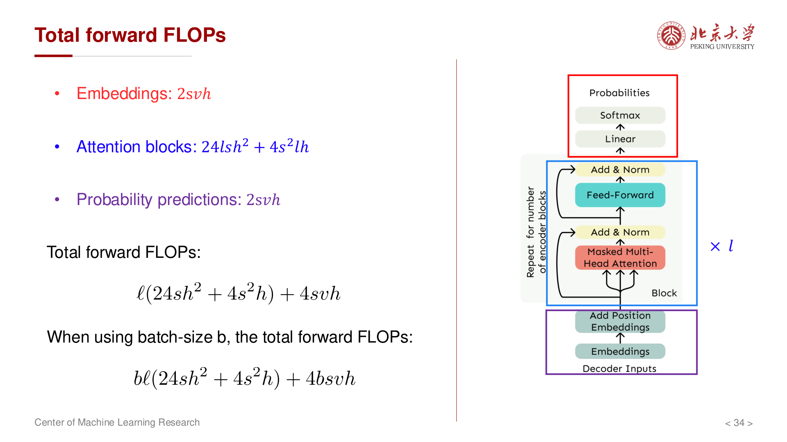{ width="550" }

$$
\text{Forward} \approx 4svh + 24slh^2 + 4s^2lh
$$

- batch size 为 $b$ 时，上式 **线性缩放**：总 FLOPs 近似再乘以 $b$（各矩阵乘的「样本维」扩大，从 $(s, h)$ 变为 $(b, s, h)$）。
- **长序列** 时 $4s^2lh$ 项（随 $s$ 二次增长）不可忽视，这也是为什么长上下文模型需要 **FlashAttention**、**稀疏注意力** 等优化；**宽模型** 时 $24slh^2$ 主导。
- 一个实用的经验法则：当 $s \ll 6h$（对 $h=4096$ 即 $s \ll 24576$）时，$h^2$ 项主导；反之 $s^2$ 项主导。

### 反向传播与训练步

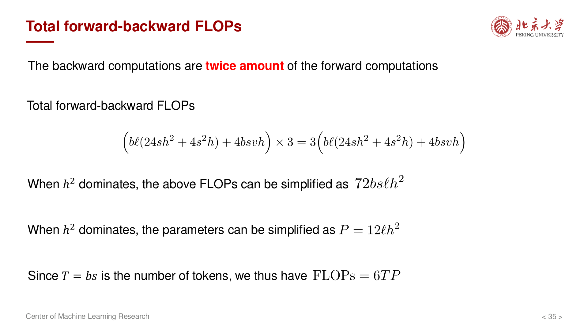{ width="550" }

- **反向传播** 的矩阵乘 FLOPs 通常取为 **前向的约 2 倍**。直觉上：反向传播需要计算 **对输入的梯度** 和 **对权重的梯度** 两组矩阵乘，而前向只做一组。
- 因此一次 **前向 + 反向** 约为 **3 倍** 前向 FLOPs（量级估计）。这是训练 FLOPs 预估的核心公式。
- 当 $h^2$ 项主导时，前向 FLOPs $\approx 2sP$（$P$ 为参数量），则单次训练步（前向 + 反向）约 $6sP$ FLOPs，即 **每处理一个 token 约需 $6P$ 次浮点运算**。这一经验法则常用于快速估算训练成本。

### 实例：GPT-3 175B

量级上：**175B 参数**、训练数据约 **300B tokens**，用于建立「算力—数据—规模」的直观尺度（非精确复现训练日志）。

---

## 显存分解与激活

训练时 GPU 显存不能只存 **模型权重**：还需存储 **梯度**、**优化器状态**，以及反向传播中需要的 **激活**（中间计算结果）。理解显存分解是选择 GPU 数量、决定是否使用模型并行的前提。

### 四大块

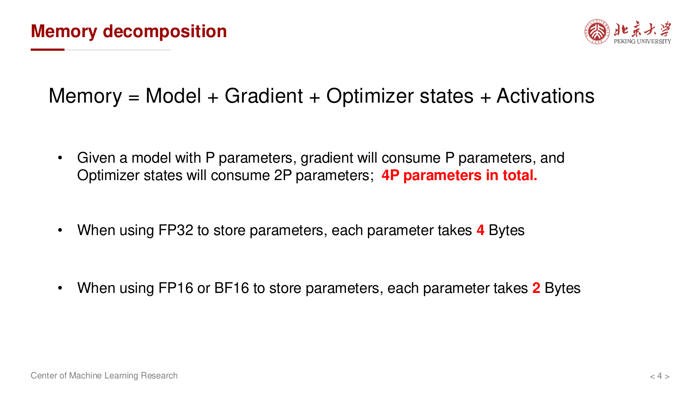{ width="550" }

- **Model**（模型参数）：权重矩阵本体，存储量 = 参数量 × 每参数字节数。
- **Gradient**（梯度）：与参数同形同大小，反向传播时计算并暂存。
- **Optimizer states**（优化器状态）：以最常用的 **Adam** 为例，需要为每个参数额外保存 **一阶动量** $m$（梯度的指数移动平均）和 **二阶动量** $v$（梯度平方的指数移动平均），这两个张量均与参数同形。因此 Adam 的优化器状态约为 $2P$ 的额外存储。加上权重和梯度，共约 $4P$ 份与参数形状相同的张量。
- **Activations**（激活）：前向传播的中间结果，反向时用于计算梯度。这是最容易被低估的部分。

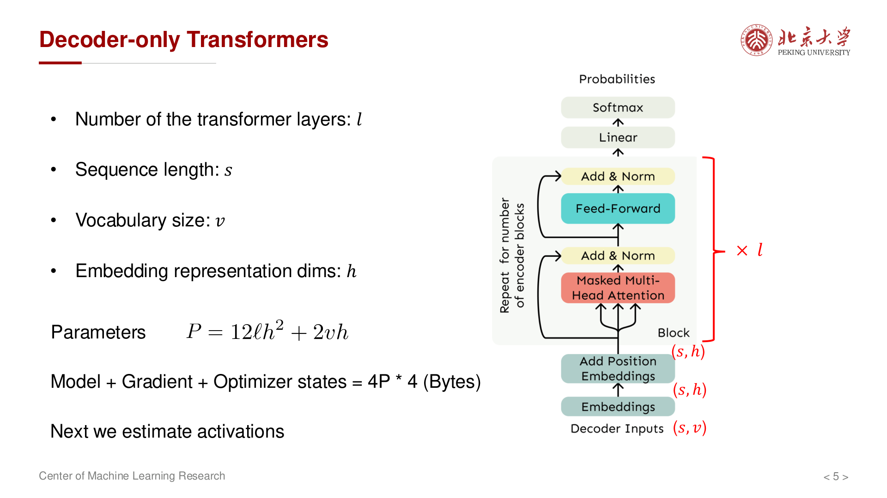{ width="550" }

- **FP32**（单精度浮点）：每参数 **4 Bytes**。$P$ 个参数的模型权重占 $4P$ Bytes，加上梯度和 Adam 状态共 $16P$ Bytes。
- **FP16 / BF16**（半精度）：每参数 **2 Bytes**。**混合精度训练** 中，权重和梯度用 FP16 存储（$2P + 2P = 4P$ Bytes），但 Adam 状态仍用 FP32 保存（$4P + 4P = 8P$ Bytes，对应 $m$ 和 $v$），另需一份 FP32 的 **主权重副本**（$4P$ Bytes）用于数值稳定的参数更新。因此混合精度下总计约 $16P$ Bytes——与纯 FP32 相同量级，但前向/反向的计算速度显著提升。

### 自注意力中的激活（示意）

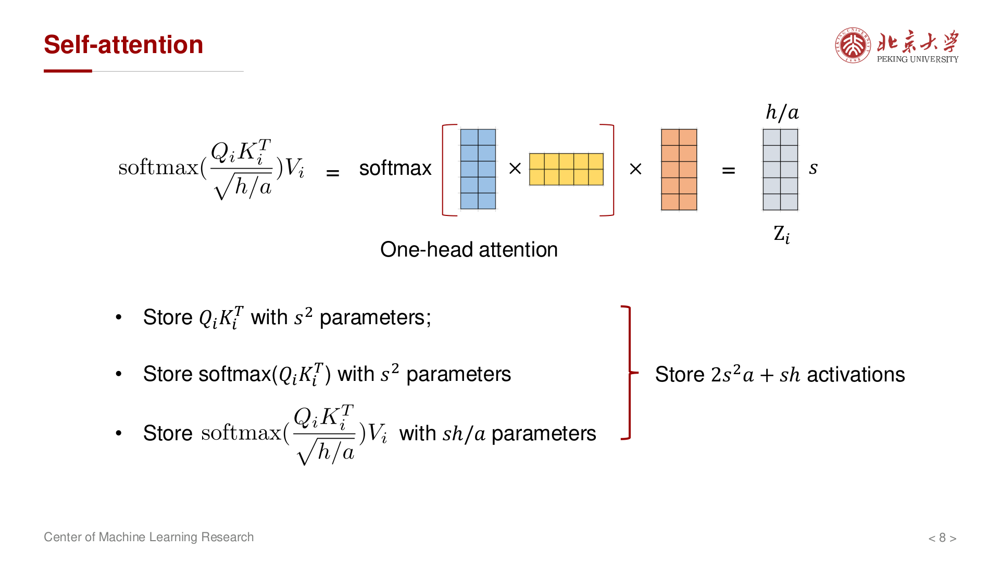{ width="550" }

反向传播需要用到前向时的中间结果来计算梯度（链式法则），因此必须在前向时保存（或选择性重算）这些张量，例如：

- 各头的 $Q_i, K_i, V_i$（用于计算 $W_Q, W_K, W_V$ 的梯度）；
- $Q_i K_i^\top$ 及 $\mathrm{softmax}(Q_i K_i^\top)$（各约 $s \times s$ 大小，这也是注意力激活中最大的部分）；
- 注意力输出及 $W_O$ 前后张量等。

多头合并后，讲义将 **单样本** 下与注意力相关的激活归并为 $\sim 2s^2 a + sh$ 量级的一阶项（与实现是否 **checkpoint**、是否融合 kernel 有关）。

### 单层块与堆叠

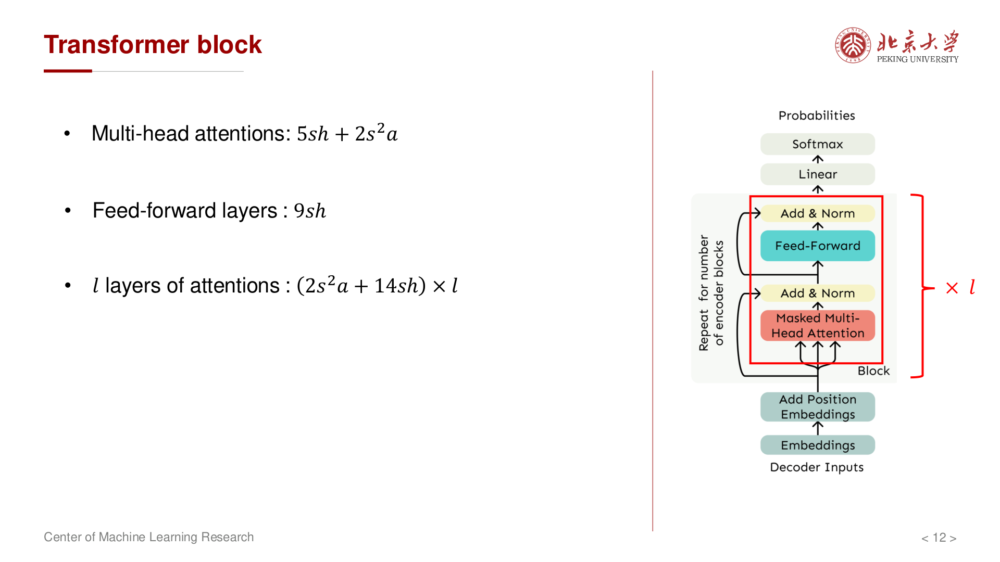{ width="550" }

讲义汇总（单样本）：

- **MHA**：约 $5sh + 2s^2 a$
- **FFN**：约 $9sh$（含 $AW_1$、非线性后再乘 $W_2$ 等）

单层合计 $2s^2 a + 14sh$；共 $l$ 层合计为 $l(2s^2 a + 14sh)$。

### 嵌入、输出头与 batch

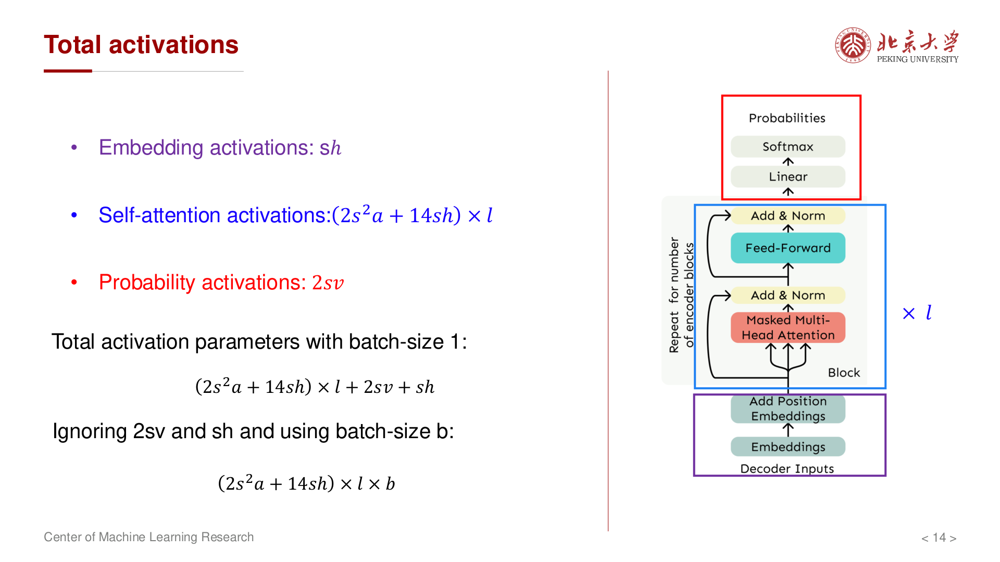{ width="550" }

- **嵌入激活**：约 $sh$。
- **LM 头**：logits $sv$，softmax 等再 $sv$；与 $s^2$、$lsh$ 相比时常可略去或单独估算。
- Batch size 为 $b$ 时，主要激活项近似 **乘以** $b$：

$$
\text{Activations} \sim b\left(2l s^2 a + 14lsh\right)
$$

（在忽略 $2sv$、$sh$ 等较小项的近似下，与讲义写法一致。）

---

## 总显存与何时激活占主导

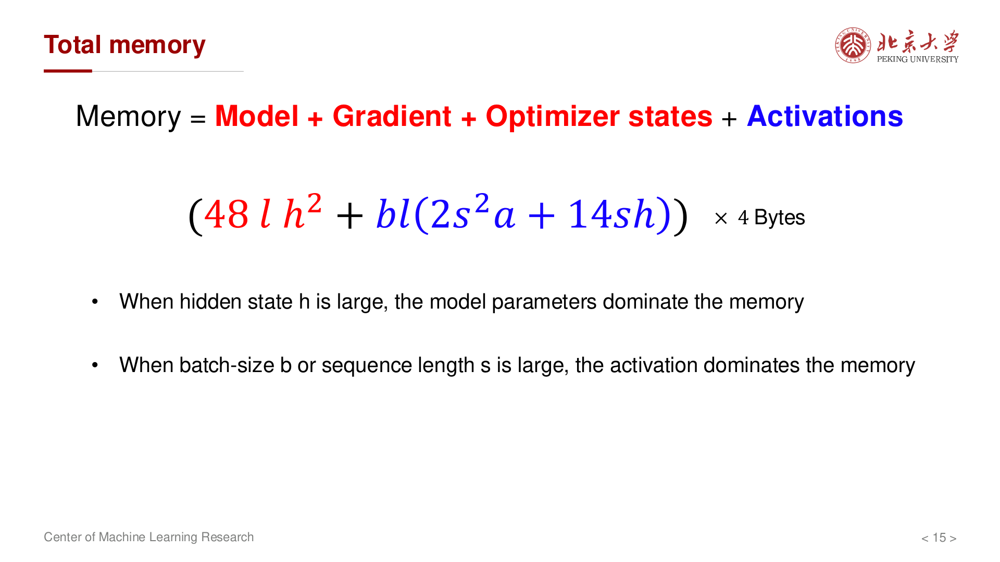{ width="550" }

将 **模型 + 梯度 + 优化器**（对 $12lh^2$ 量级的块参数，约 **4** 份存储）与 **激活** 合并，讲义给出 **FP32** 下量级形式：

$$
\text{Memory} \sim \left(48lh^2 + bl \cdot 2s^2 a + 14blsh\right) \times 4 \ \text{Bytes}
$$

- $48lh^2$：对应 $12lh^2$ 可训练参数 × **4**（权重、梯度、两阶 Adam 状态）的 **参数量级**（未含嵌入、输出头时，块参数占主导的一种写法）。
- 第二、三项体现 $b,s,l,a,h$ 增大时 **激活显存** 上升；$2bls^2a$ 与注意力矩阵 $s \times s$ 及多头数有关。

**何时哪一项主导**——这决定了优化策略的选择：

- $h$ 很大且 $b$、$s$ 较小时：**权重** 与 **优化器状态** 往往占主要显存。此时应优先考虑 **ZeRO**（将优化器状态分片到多卡）或 **模型并行** 来分摊。
- $b$ 或 $s$ 很大时：**激活** 占比急剧上升，**不能** 在预算中忽略。此时应考虑 **梯度检查点**（activation checkpointing，牺牲约 33% 计算时间换取大幅减少激活显存）或 **序列并行**。

!!! tip "工程经验"
    实际训练中，常用的显存优化组合：**混合精度**（减少权重/梯度的字节数 + 加速计算）+ **ZeRO Stage 2**（分片优化器状态和梯度）+ **梯度检查点**（减少激活显存）。三者结合可将显存需求降低到朴素实现的 1/4 ~ 1/8。

### 实例：GPT-3 规模

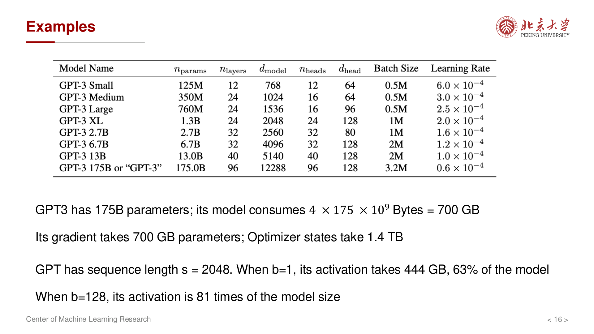{ width="550" }

讲义给出数量级：在 **175B** 参数规模下，FP32 **模型** 约 **700 GB**；**梯度** 同量级；**Adam 状态** 约 **1.4 TB**。在 $s=2048$、$b=1$ 时，**激活** 可达 **数百 GB**，与模型同量级；$b=128$ 时，激活可达模型体积的 **数十倍** 量级（具体随实现与重算策略变化）。

---

## 小结

| 指标 | 公式（量级） | 关键变量 |
| --- | --- | --- |
| 参数量 $P$ | $2vh + 12lh^2$ | $l, h, v$ |
| 前向 FLOPs（单样本） | $4svh + 24slh^2 + 4s^2lh$ | $s, l, h, v$ |
| 训练步 FLOPs | $\approx 3 \times$ 前向 $\times b$ | $b$ |
| 权重侧显存 | $\sim 16P$ Bytes（混合精度 Adam） | $P$ |
| 激活显存 | $\sim b(2ls^2a + 14lsh)$ × 字节数 | $b, s, l, a, h$ |

核心要点：

- **参数量**：$P \approx 2vh + 12lh^2$（嵌入与输出头分开；**tie** 时约 $vh + 12lh^2$）；单层块为 $12h^2 = 4h^2$（MHA）$+ 8h^2$（FFN）。
- **前向 FLOPs（单样本）**：$4svh + 24slh^2 + 4s^2lh$；$s^2$ 项来自自注意力对序列长度的二次依赖，是长上下文模型的核心瓶颈。
- **显存**：权重侧约 $16P$ Bytes（混合精度 Adam），加上随 $b, s, l, a, h$ 增长的 **激活**；大 batch、长上下文训练必须单独估算激活，并考虑 **梯度检查点**、**ZeRO**、**混合精度** 等工程手段。
- **经验法则**：训练一个 $P$ 参数的模型，处理 $T$ 个 token，总 FLOPs $\approx 6PT$。

---

## 参考

- Kun Yuan (Center for Machine Learning Research, Peking University), *Parameters, Memories, and Computations in Transformers*、*Memory Analysis in Transformers*（课程讲义幻灯片；本文插图由讲义页面导出）。
