# 主流大语言模型概览：BERT、GPT 与 DeepSeek

参考：北京大学机器学习研究中心 Kun Yuan 讲义 *BERT and GPTs*、*A Brief Introduction to DeepSeek*；Transformer 基础见 [Transformer](Transformer.md)，参数量与显存量级见 [Parameters, Computations, and Memories in Language Models](<Parameters, Computations, and Memories in Language Models.md>)。部分材料引用 Stanford CS224n、DeepSeek-MoE 相关公开讲解与论文。

---

## 目录

- Teacher Forcing 与训练 / 推理
- 预训练与微调范式（详解）
- BERT：双向编码与 MLM
- GPT 系列：从 GPT-1 到 GPT-3
- DeepSeek：V3 / R1 与「为何出圈」
- DeepSeek 技术要点：MoE、KV Cache、MLA

---

## Teacher Forcing 与训练 / 推理

自回归语言模型在训练时，常把真实标签（ground truth）作为解码器在每一步的输入，而不是用上一步模型自己的预测。这种技巧称为 **Teacher Forcing**。

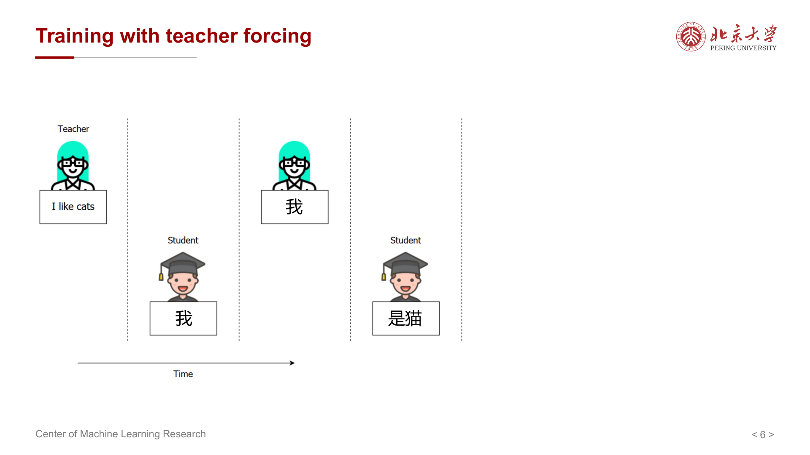{ width="550" }

在 Transformer 上训练时，讲义强调使用 Teacher Forcing 的原因包括：

- **避免误差累积**：若用自身错误预测作为下一步输入，错误会沿序列放大。
- **配合掩码注意力并行**：在已知真实前缀的条件下，可对序列做并行计算，加速训练。

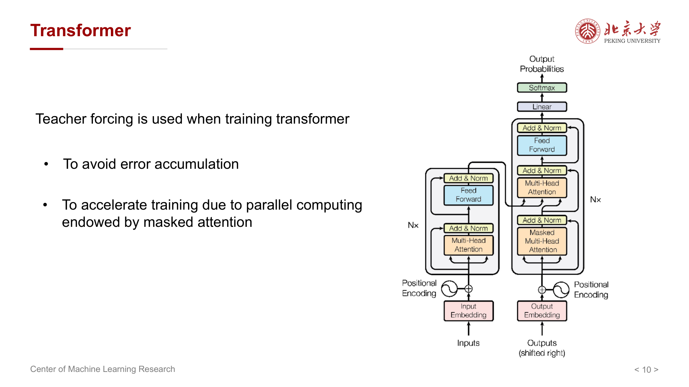{ width="550" }

**推理（Inference）** 阶段没有 ground truth，只能自回归地用上一时刻预测作为下一时刻输入，因此无法像训练时那样整句并行；延迟与算力开销与生成长度成正比。

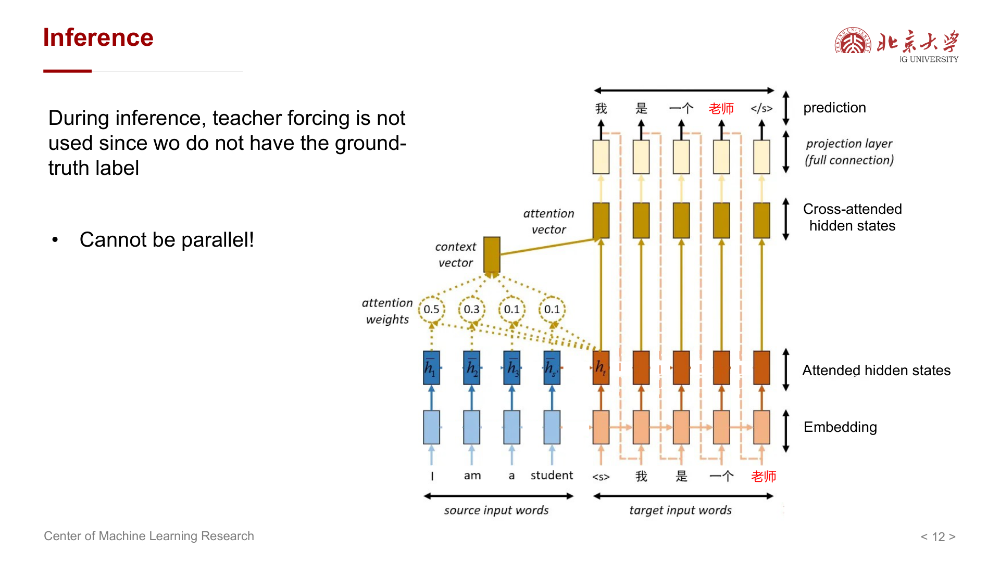{ width="550" }

---

## 预训练与微调范式

**预训练** 与 **微调** 是当代大模型的标准两阶段路线：先在廉价、量大的数据上学通用能力，再在小量、带标签的任务数据上对齐具体目标。下面分步说明各自在做什么、为什么要分两阶段，以及与 BERT / GPT 路线的关系。

### 预训练（Pretraining）在做什么

**预训练** 指：在大规模语料（网页、书籍、代码等，通常无人工标注或仅极弱监督）上，用自监督目标训练一个大容量神经网络（如 Transformer Encoder、Decoder 或二者组合），得到一组初始权重。

- **数据**：规模常达 TB 级 token，覆盖多领域、多文体，使模型见到词汇、语法、常识、推理模式的统计规律。
- **目标（损失）**：不依赖人工标签，而是由文本本身构造监督信号。例如：
  - **语言建模（LM）**：给定前缀，预测下一个词（GPT 系）。
  - **掩码预测（MLM）**：遮住部分词，预测原词（BERT）。
  - 还有下一句预测、句子顺序等辅助任务（视具体论文而定）。
- **产出**：一个基础模型（base model），其隐藏层可看作把 token / 句子映射到语义空间的通用编码器或生成器。

直观理解：预训练解决的是「先从海量文本里学会语言与世界的一般规律」，而不是直接针对「情感分类几类」「命名实体有哪些标签」等具体任务。

### 微调（Finetuning）在做什么

**微调** 指：在预训练得到的权重上继续训练，但数据换成下游任务的标注数据（或指令—回答式数据），损失也换成任务相关的形式。

- **任务头（Head）**：预训练模型的最后一层往往对应词表 logits 或通用向量；做分类、序列标注时，通常会新增一层（如线性层接 softmax）或替换输出结构，把隐藏状态映射到标签空间。
- **更新范围**：
  - **全参数微调**：所有层与任务头一起更新，数据需求相对大，显存与优化器状态成本高。
  - **参数高效微调**：只训练少量附加参数（Adapter、LoRA 等），冻结主干，适合数据很少或算力受限的场景。
- **数据量**：往往远小于预训练（从百万、千万 token 到每任务数万～数十万样本都常见），因为表示能力已在预训练阶段打好底。

直观理解：微调解决的是「在通用模型上，用少量任务数据把行为拧到指定格式与指标上」。

### 为什么要先预训练、再微调

1. **标注昂贵**：若从零用全监督训练大模型到同等能力，需要海量人工标注，几乎不可行。
2. **迁移学习**：预训练权重提供好的初始化，比随机初始化更容易在下游收敛快、泛化好。
3. **一次预训练、多次复用**：同一套基础模型可以分别微调到情感分析、问答、摘要等不同任务，摊薄预训练成本。

讲义中的表述是：预训练作为参数初始化，微调时在下游数据上更新参数（常加改输出层）。这与 NLP、CV 里 ImageNet 预训练再微调的思想是同一类迁移学习范式。

### 与 BERT / GPT 路线的对应关系

- **BERT 系**：预训练用 Encoder + MLM 等；微调时在句子级 / token 级接分类头、CRF 等，做分类、NER、相似度等。
- **GPT 系**：预训练用 Decoder + 语言建模；微调可把任务序列拼进同一自回归形式（如 GPT-1 论文中的做法），或不做微调仅靠提示（GPT-2 以后越来越强调）。

因此：预训练 / 微调是 **框架**；BERT 与 GPT 的差别在于预训练目标与结构（Encoder-only vs Decoder-only），以及下游怎么用（微调是否必须、Prompt 是否足够）。

### 与其它「第三阶段」技术的区别（简要）

- **指令微调（Instruction Tuning）** 与 **对齐（RLHF / DPO 等）** 常发生在预训练之后，数据形态是指令—回答或偏好，目标更偏向对话风格、安全性、遵循指令，不一定等价于传统小任务分类的微调，但仍属于「在预训练权重上继续训练」的大类。
- 若只区分预训练与微调的经典含义：前者侧重自监督、大数据、通用能力；后者侧重有监督或任务化数据、数据量小得多、对齐具体应用。

---

## BERT：双向编码与 MLM

**BERT**（Bidirectional Encoder Representations from Transformers）可理解为预训练 Transformer 的 Encoder 部分。

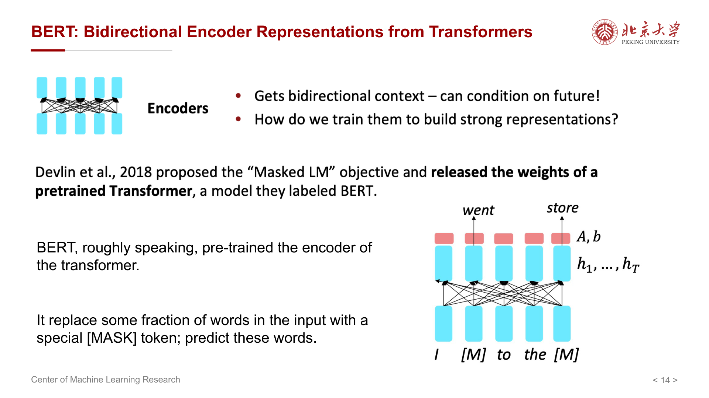{ width="550" }

- 将输入中一部分词替换为特殊符号 `[MASK]`，训练模型预测被掩码词（**掩码语言模型**，MLM）。
- 双向上下文使表示同时看到左右语境，适合分类、抽取、标注等任务。

预训练后，可在下游任务上微调：在 BERT 之上增加或修改输出层，用下游数据做全参数或部分参数更新。

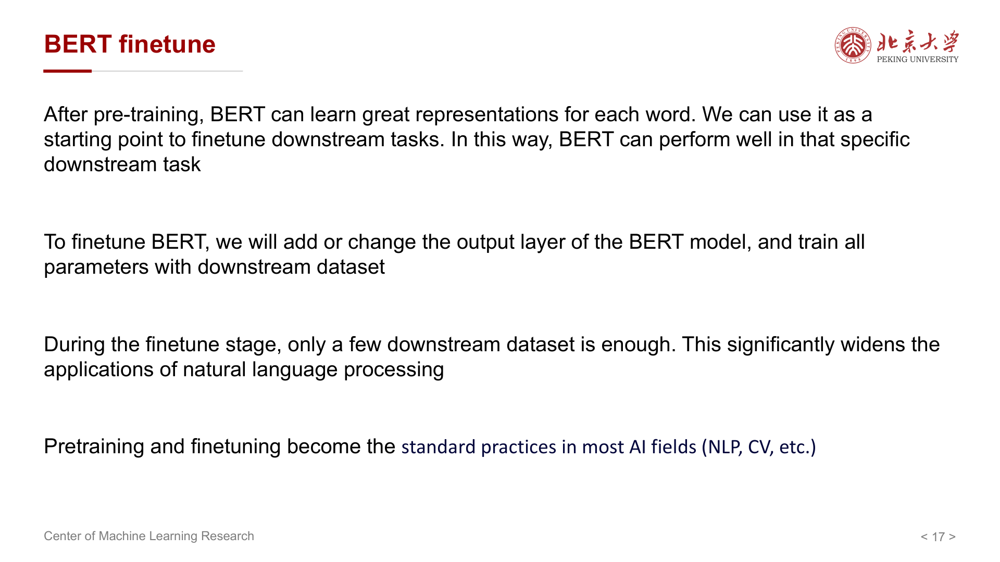{ width="550" }

**局限**：预训练 Encoder 擅长理解与信息抽取，但不擅长需要向未来看的文本生成（生成任务通常用自回归 Decoder）。

---

## GPT 系列：从 GPT-1 到 GPT-3

### GPT 与 Decoder-only

**GPT**（Generative Pretrained Transformer）可理解为预训练 Transformer 的 Decoder（与 [Transformer](Transformer.md) 中因果自注意力的解码器一致）。

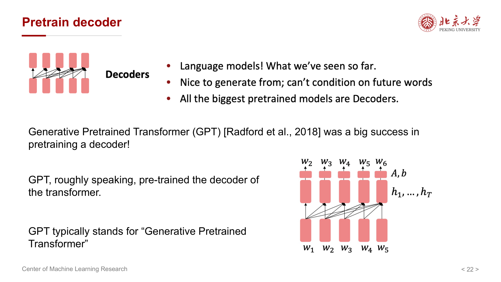{ width="550" }

设上下文为若干 token 的表示，语言建模在每一步预测下一词，目标比 BERT 的「填空」更难，但应用面更广（生成、对话等）。早期经验上，BERT 在多项基准上强于 GPT-1，部分因为双向信息对理解类任务更友好。

### GPT-2：规模与 Zero-shot

**GPT-2** 延续 Decoder-only 架构，通过增大数据与模型规模（约 1.5B 参数）推进能力。与同期 BERT 系相比，纯模型指标上未必全面占优，但 GPT-2 展示了 **零样本（Zero-shot）** 能力：无需下游标注数据、无需微调，仅靠提示（Prompt）即可完成部分任务。

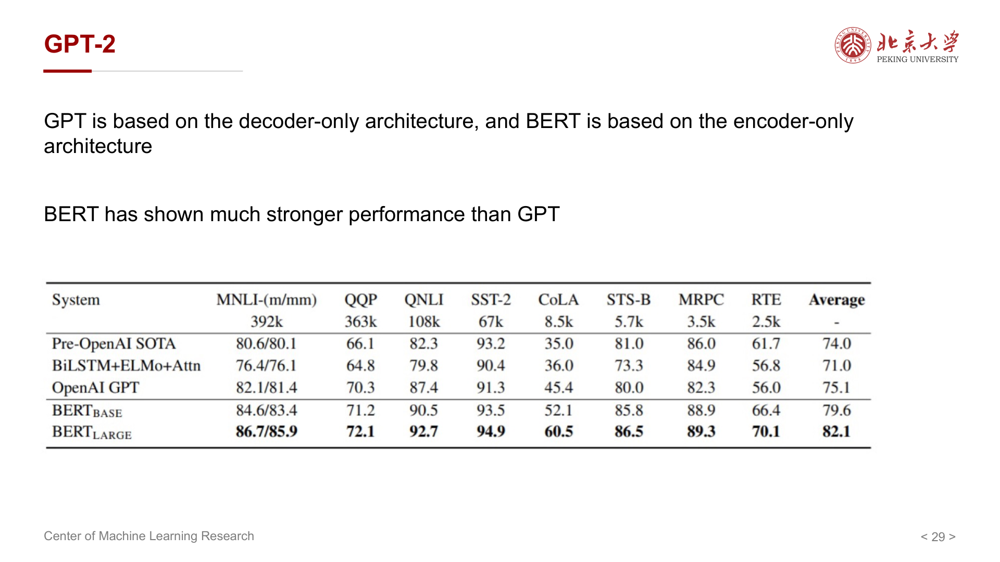{ width="550" }

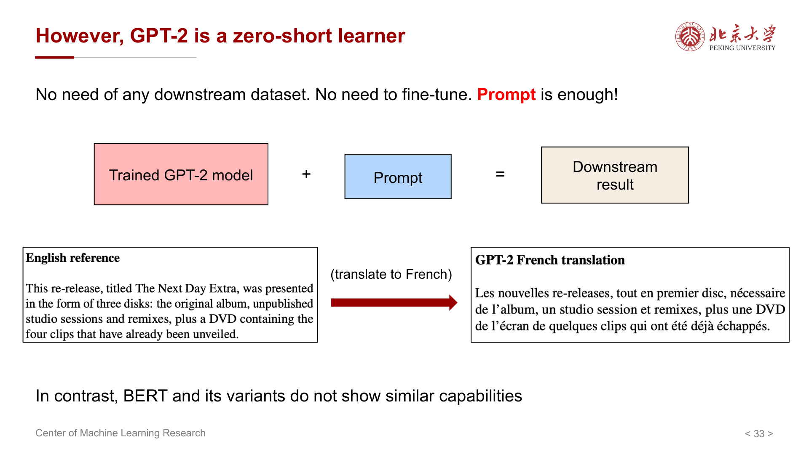{ width="550" }

在多个数据集上可不做任何训练或微调直接得到结果；部分任务上接近或达到当时 SOTA，但并非所有任务都 SOTA。趋势：更大模型、更好表现。

### GPT-3：超大模型与 Few-shot

**GPT-3** 将规模推到 175B 参数（与 GPT-2 的 1.5B 对比，量级跃迁约 100 倍）。GPT-2 侧重 Zero-shot，GPT-3 则强调 **Few-shot（少样本）**：在提示中给少量示例，再让模型完成新任务。

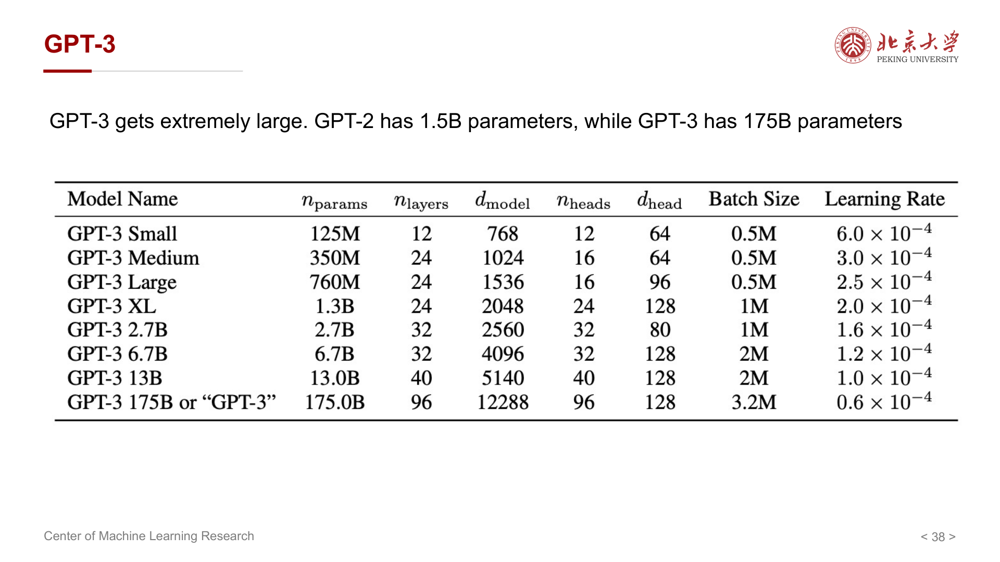{ width="550" }

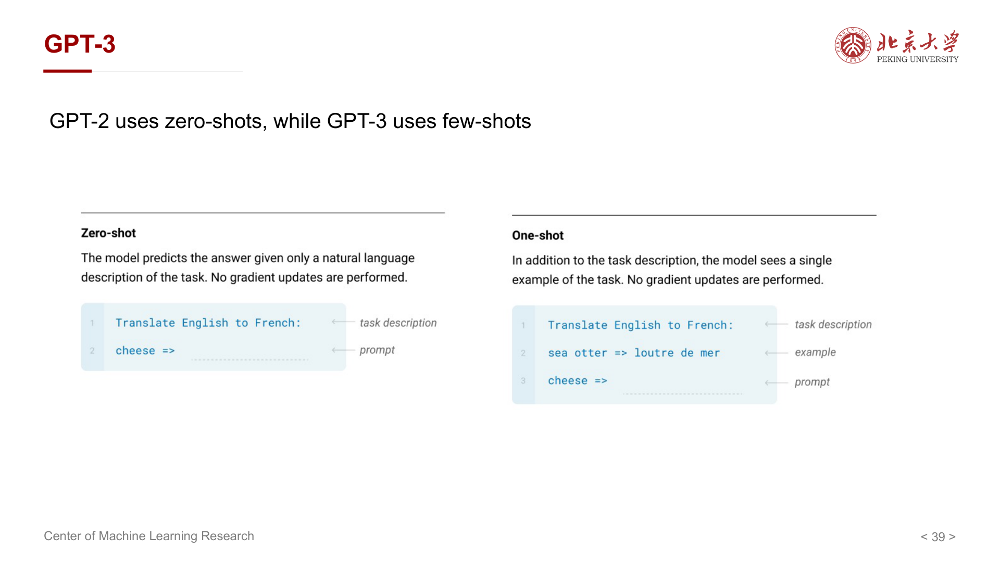{ width="550" }

讲义用「影响力 ≈ 新颖性 × 有效性」作直观类比：GPT-2 新颖性强，GPT-3 则在有效性上进一步拉开差距。开源与闭源、生态路线等属于产业话题，此处从略。

---

## DeepSeek：V3 / R1 与「为何出圈」

### 模型定位：V3 与 R1

讲义中 DeepSeek-V3 与 DeepSeek-R1 的定位可概括为：

- **DeepSeek-V3**：大语言基座，适合日常对话、内容生成等通用任务。
- **DeepSeek-R1**：推理向模型，侧重复杂逻辑，适合数学、编程、自然语言推理等高难度与专业场景。

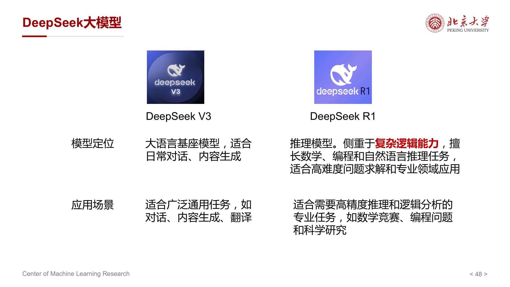{ width="550" }

### 爆火原因（讲义归纳）

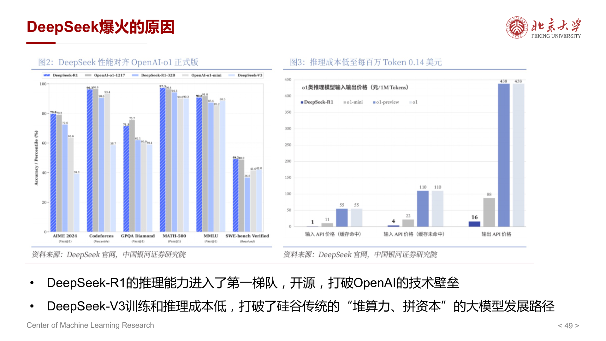{ width="550" }

- DeepSeek-R1 的推理能力进入第一梯队，且开源，打破部分闭源的技术壁垒。
- DeepSeek-V3 在训练与推理成本上的优势，挑战「单纯堆算力、拼资本」的路径叙事。

---

## DeepSeek 技术要点：MoE、KV Cache、MLA

以下对应 *A Brief Introduction to DeepSeek* 讲义，与 **DeepSeek-V2 / V3** 等公开技术路线一致（细节以论文与官方为准）。

### 模型规模、训练成本与推理成本

大模型训练成本随规模上升，但单位能力上可能更划算；推理则常被强调为更贵（有行业分析提到推理相对训练的倍数关系，量级因场景而异）。**MoE（混合专家）** 通过稀疏激活，在训练与推理上追求更高效率。

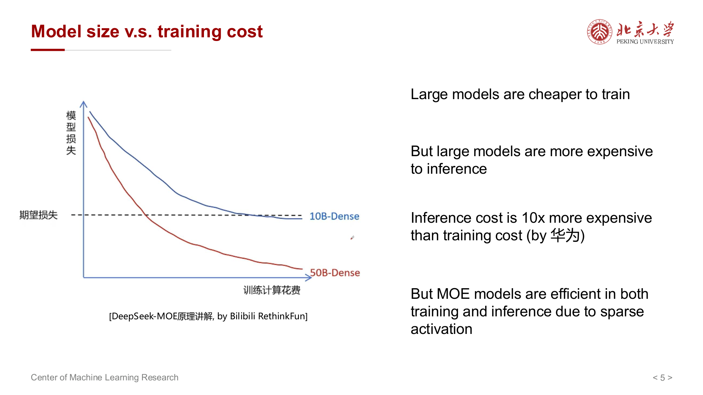{ width="550" }

### 混合专家（MoE）与 DeepSeek

Dense 模型前馈层每次都激活全部参数；MoE 中有多个 Expert，门控为每个 token 只激活少数专家，使多数 token 由少数专家处理，其余专家激活很少。

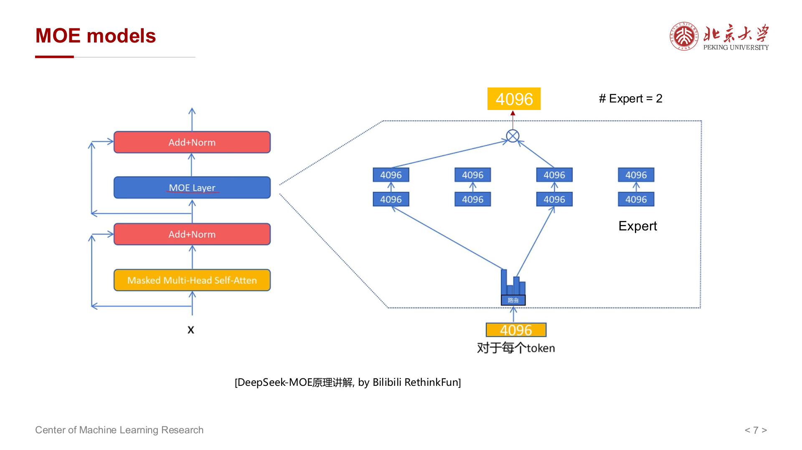{ width="550" }

**负载均衡**：若简单用 $c_i/S$ 等不可微的计数，难以反传；讲义中通过构造可微的替代目标做负载均衡损失，使训练稳定。

DeepSeek MoE 的特点之一：**共享专家（Shared Expert）** + 多个专精专家，在专家更小、更专精的前提下，再组合共享 + 细分以提升效果。

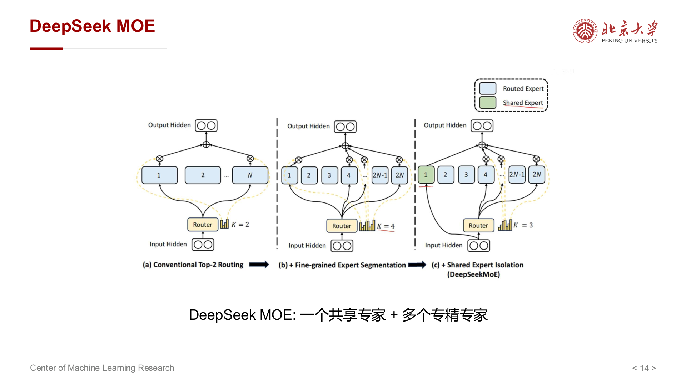{ width="550" }

### 推理与 KV Cache

自回归解码每步依赖之前所有 token 的 Key / Value；**KV Cache** 把已生成位置的 K、V 缓存，新步只算当前 token 的 KV，避免重复计算。

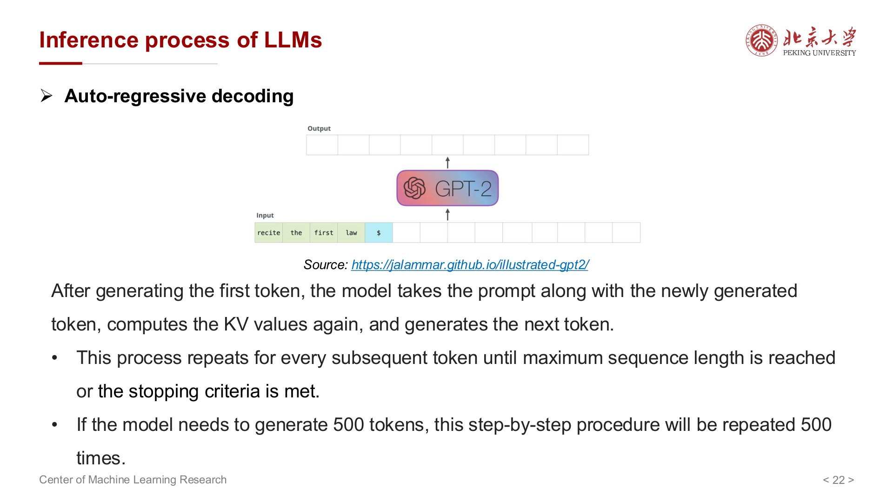{ width="550" }

推理阶段常分两类：

- **Prefill**：对提示（prompt）整段算 KV 并缓存，生成第一个新 token。
- **Decode**：之后逐 token 生成，读取缓存与当前步 KV 结合。

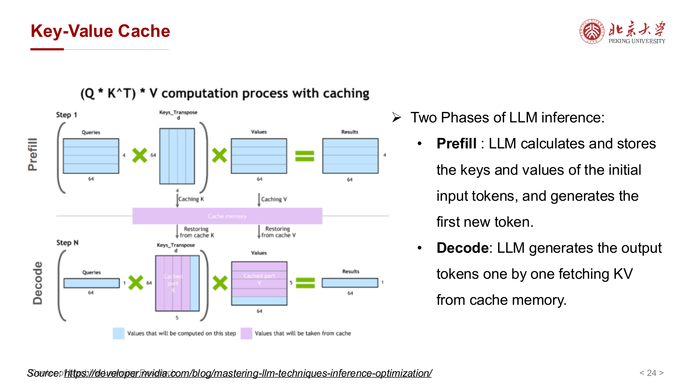{ width="550" }

Prefill 多为矩阵乘矩阵，算力密集、易并行；Decode 多为矩阵乘向量，显存带宽往往成为瓶颈，算力吃不满。

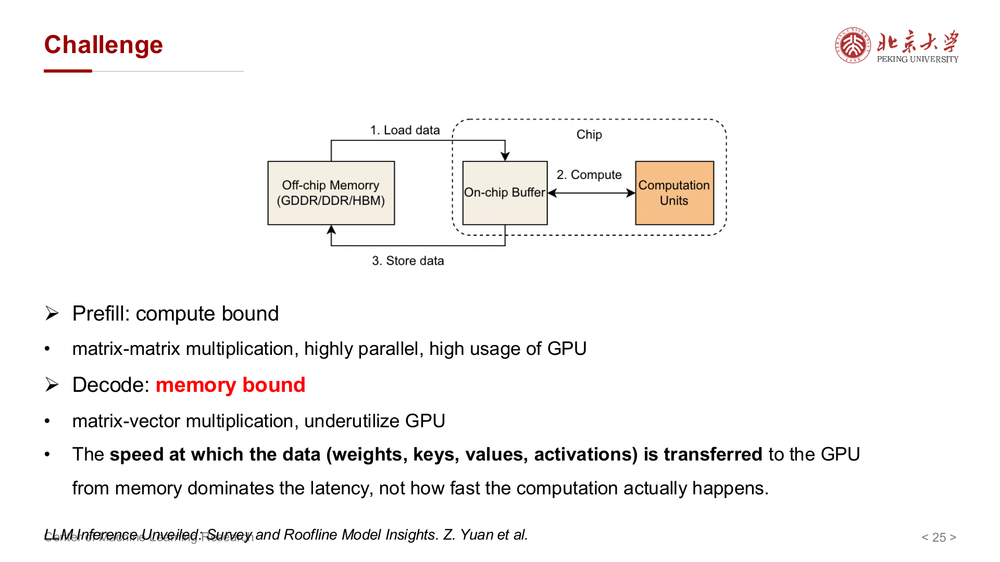{ width="550" }

KV Cache 显存量级与 batch、序列长度、层数、隐层维度、头数、精度成正比；长上下文下 KV 常成为瓶颈（OOM 会导致对话中断等）。

### MQA、GQA 与 MLA

为压缩 KV，业界有 **MQA**（多 Query 共享 K/V）、**GQA**（分组共享）等方案，推理更省显存，但可能损伤精度，需训练适配。

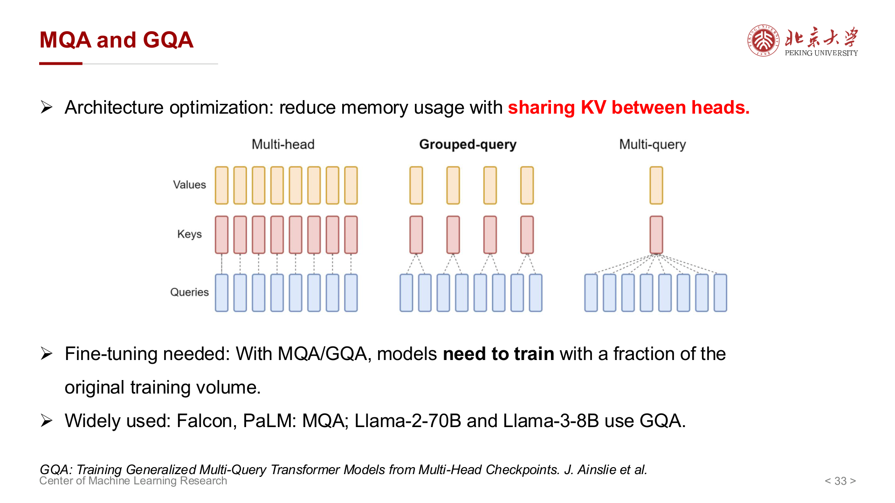{ width="550" }

**Multi-head Latent Attention（MLA）** 的思路：K、V 在隐空间存在低秩结构，可只缓存低维压缩表示 $c_t$，需要时再恢复 $k_t$、$v_t$，从而减小 KV Cache；若朴素实现带来额外计算，可通过推理前合并等变换（如讲义中的 $W_Q U_K = W_Q W_K^T$ 一类）减少在线开销。

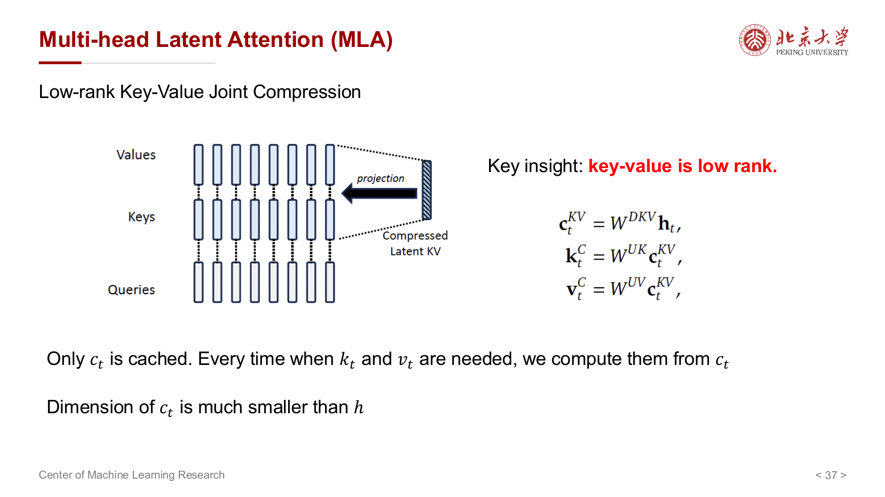{ width="550" }

DeepSeek-V2 一类结构：MLA 与 MoE 等组合。

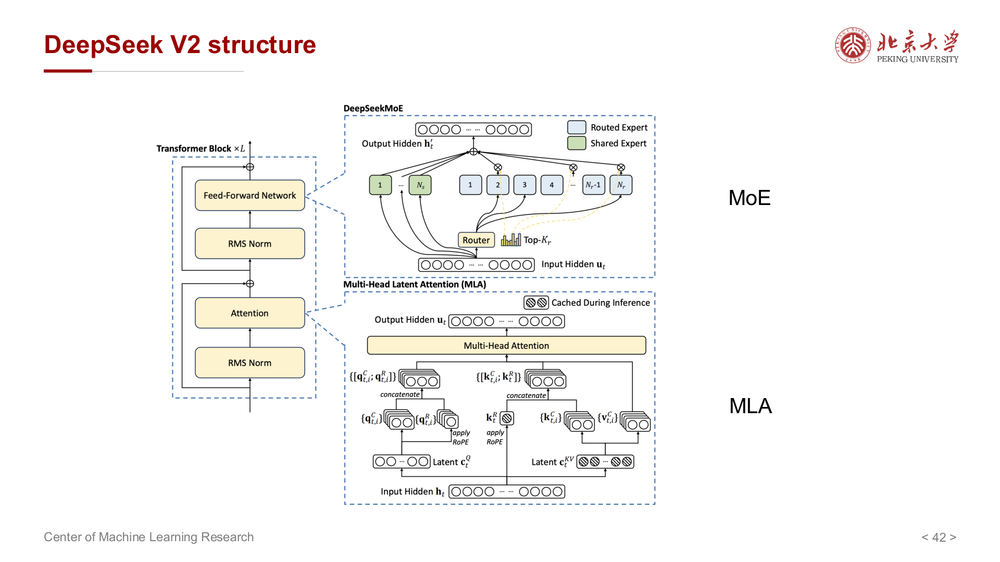{ width="550" }

---

## 小结

- 训练常用 Teacher Forcing 实现并行；推理只能自回归，不能用真实未来标签。
- 预训练用自监督与海量无标注语料学通用表示；微调在预训练权重上，用少量任务数据与任务头对齐下游指标（也可采用 LoRA 等参数高效方式）。
- BERT 预训练 Encoder 与 MLM；GPT 预训练 Decoder 做语言建模；GPT-2 / GPT-3 体现规模效应、Zero-shot / Few-shot 与提示学习。
- DeepSeek 在基座与推理模型、开源与成本上具有讲义所述的定位；MoE、KV Cache 优化、MLA 等是推理效率与长上下文的关键工程方向。

---

## 参考

- Kun Yuan (Center for Machine Learning Research, Peking University), *BERT and GPTs*、*A Brief Introduction to DeepSeek*（课程讲义；插图由讲义导出）。
- Stanford CS224n: Natural Language Processing with Deep Learning（引用见 [1]）。
- DeepSeek / MoE / MLA 等：**DeepSeek-V2** 论文、**Switch Transformers**、**GQA** 论文等（讲义脚注与引用）。
