## 1 深度网络训练与优化问题

课件链接:

[slides](slides/06_SGD.pdf)

[notes](slides/Notes_SGD.pdf)

在深度学习中，我们通常把一个深度神经网络（DNN）看作由两部分组成：特征提取器与分类器。给定输入样本 $a$，模型参数为 $x$，网络输出预测分数 $\hat b = h(x; a)$，再用损失函数 $L(\hat b, b)$ 衡量预测与真实标签 $b$ 的差异。

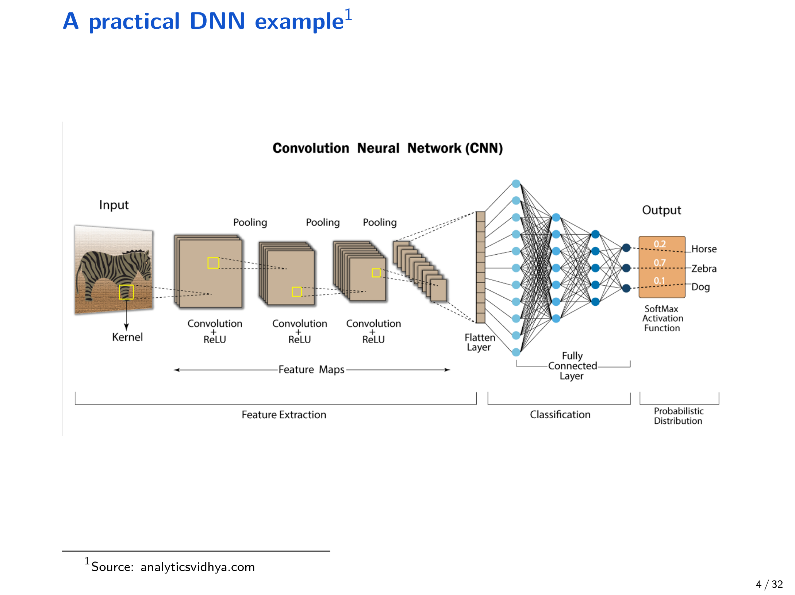{ width="800" }

### 1.1 DNN 训练的经验风险最小化（ERM）

给定数据集 $\{(a_i, b_i)\}_{i=1}^m$，DNN 训练常写成有限和（finite-sum）问题：

$$
x^\star = \arg\min_{x \in \mathbb{R}^d} \; \frac{1}{m}\sum_{i=1}^m L(h(x; a_i), b_i).
$$

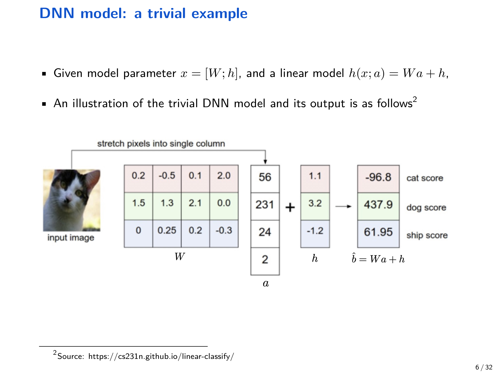{ width="800" }

### 1.2 为什么 DNN 难训练

讲义强调了几个关键难点：

- 目标高度非凸：$L(h(x;a), b)$ 对参数 $x$ 通常是高度非凸的，甚至可能非光滑
- 参数维度巨大：$x=\{W_i, h_i\}$ 维度很大
- 数据量巨大：训练集规模 $m$ 往往很大

其中一个典型的“深层嵌套非线性”结构可以写成：

$$
h(x; a)=\psi(\cdots \psi(W_2\cdot \psi(W_1 a+h_1)+h_2)\cdots),
$$

损失函数可以是平方损失 $\frac{1}{2}\lVert b-\hat b\rVert^2$、交叉熵 $-\sum_i b_i \log(\hat b_i)$ 等。

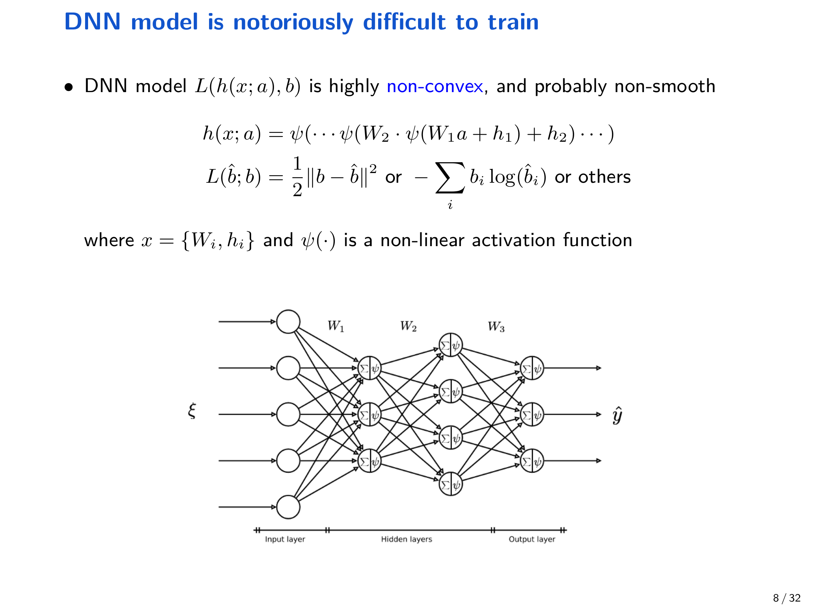{ width="800" }

因此 DNN 训练可以概括为非凸优化 + 高维 + 大规模数据。

这直接推动了随机优化（stochastic optimization）与随机梯度方法（SGD）的使用。

## 2 随机优化建模：从有限和到期望形式

当数据来自未知分布 $D$（machine learning 里常见），可把训练目标写成期望形式：

$$
\min_{x\in\mathbb{R}^d} f(x)=\mathbb{E}_{\xi\sim D}[F(x;\xi)],
$$

其中随机变量 $\xi$ 表示一次数据采样（例如 $(a,b)$），$F(x;\xi)$ 对 $x$ 可微，但 $D$ 未知，导致 $f(x)$ 通常没有闭式表达。

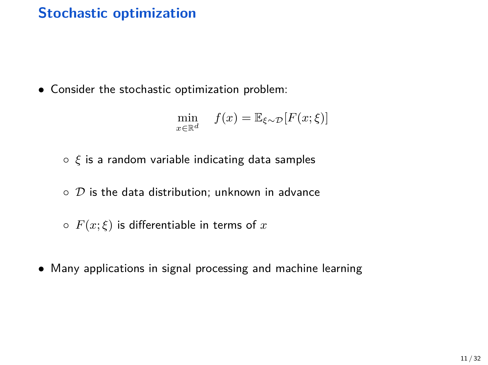{ width="800" }

### 2.1 DNN 训练作为随机优化的特例

如果我们认为存在无限数据 $(a,b)\sim D$，则经验风险可被视作期望风险：

$$
\min_{x\in\mathbb{R}^d} f(x)=\mathbb{E}_{(a,b)\sim D}\left[L(h(x;a),b)\right].
$$

## 3 随机梯度下降（SGD）

### 3.1 算法形式

因为 $f(x)$ 没有闭式表达，我们通常无法直接计算 $\nabla f(x)$，但可以在采样 $\xi_k$ 后计算随机梯度 $\nabla F(x_k;\xi_k)$ 来近似真实梯度。

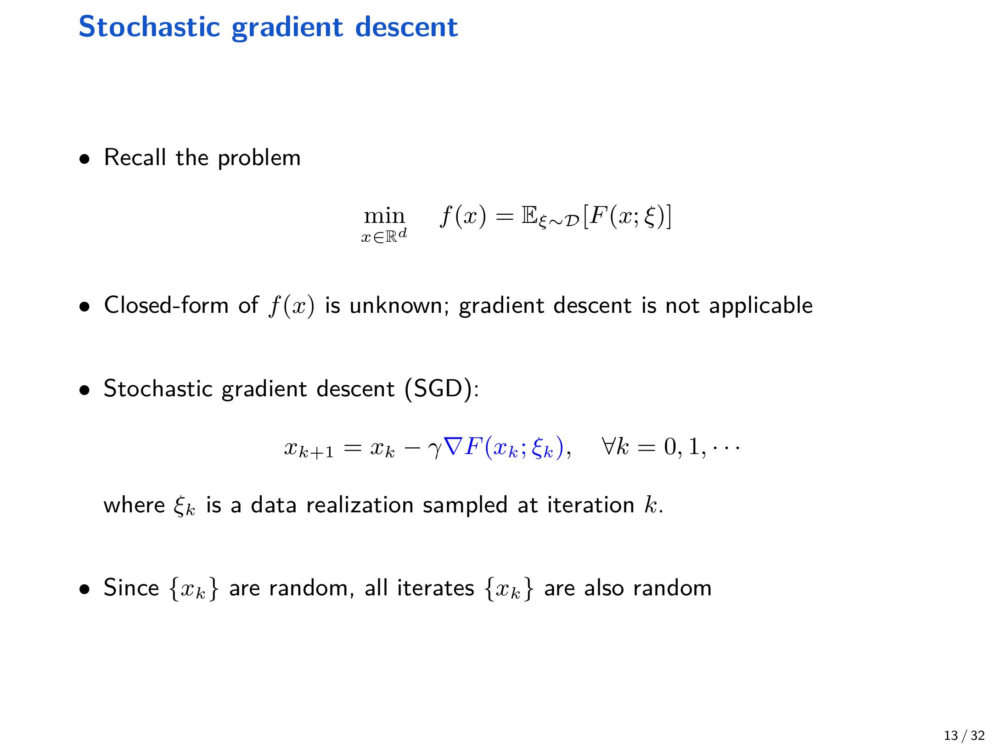{ width="800" }

SGD 的迭代为：

$$
x_{k+1}=x_k-\gamma \nabla F(x_k;\xi_k), \quad k=0,1,2,\ldots
$$

其中 $\gamma>0$ 为学习率（learning rate），$\xi_k\sim D$ 为第 $k$ 次迭代采样的数据。

由于每一步采样 $\xi_k$ 都是随机变量，迭代序列 $\{x_k\}$ 本身也是随机过程；因此收敛分析通常以期望形式给出界。

### 3.2 过滤族（filtration）与随机性建模

为了严谨讨论“条件期望”，引入过滤族：

$$
\mathcal{F}_k=\{x_k,\xi_{k-1},x_{k-1},\ldots,\xi_0\},
$$

它包含迭代 $k$ 之前的全部历史信息（注意 $\xi_k\notin \mathcal{F}_k$）。

!!! note "假设 3.1（无偏 + 有界方差）"
    给定过滤族 $\mathcal{F}_k$，假设

    $$
    \mathbb{E}\left[\nabla F(x_k;\xi_k)\mid \mathcal{F}_k\right]=\nabla f(x_k),
    $$

    $$
    \mathbb{E}\left[\left\lVert \nabla F(x_k;\xi_k)-\nabla f(x_k)\right\rVert^2\mid \mathcal{F}_k\right]\le \sigma^2.
    $$

    这表示随机梯度是无偏估计，并且条件方差被常数 $\sigma^2$ 上界。

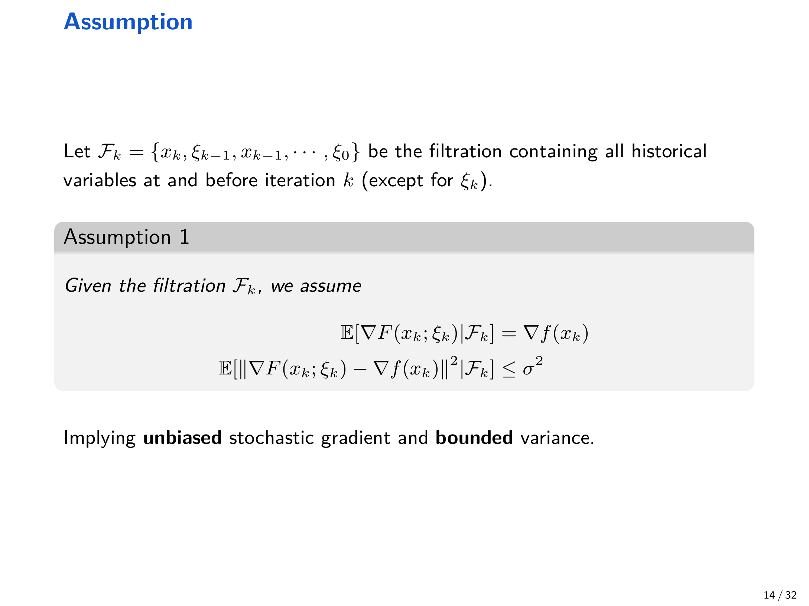{ width="800" }

??? tip " Filtration 与两个核心假设的直观理解"
    $x_k$ 表示迭代到第 $k$ 步时优化的参数。

    **Filtration $\mathcal{F}_k$：** 表示第 $k$ 步时的历史信息，包含初始点 $x_0$、历史随机样本 $\xi_0,\dots,\xi_{k-1}$ 及对应迭代点 $x_1,\dots,x_k$。关键在于：$x_k$ 是已确定的，而当前随机样本 $\xi_k$ 是未知的——这在数学上严格表达了"给定当前位置 $x_k$ 时"的条件。

    **假设 1（无偏估计）：** $\mathbb{E}[\nabla F(x_k;\xi_k)\mid\mathcal{F}_k]=\nabla f(x_k)$。随机梯度 $\nabla F(x_k;\xi_k)$ 的期望等于真实梯度 $\nabla f(x_k)$。直观理解：单次随机方向可能有偏差，但无数次尝试的平均方向是正确的——保证了 SGD 的大方向是对的。

    **假设 2（方差有界）：** $\mathbb{E}[\|\nabla F(x_k;\xi_k)-\nabla f(x_k)\|^2\mid\mathcal{F}_k]\le\sigma^2$。这限制了噪声大小，使随机梯度虽然有波动但不会失控。直观理解：虽然每次会走错路，但不会"错得离谱"。$\sigma^2$ 描述了数据本身的噪声水平。

    **两者的协同作用：** 无偏性保证了大方向正确（偏差在平均意义下相互抵消），方差有界保证了不会失控（配合学习率衰减可压制固定噪声 $\sigma^2$，最终收敛）。

在该假设下，还可推出（讲义推导）：

$$
\mathbb{E}\left[\lVert \nabla F(x_k;\xi_k)\rVert^2 \mid \mathcal{F}_k\right]
\le \lVert \nabla f(x_k)\rVert^2 + \sigma^2.
$$

### 3.3 SGD（伪代码）

$$
\begin{aligned}
& \textbf{算法: } \text{StochasticGradientDescent} \\
& \textbf{输入: } x^{(0)}\in\mathbb{R}^d, \quad \{\gamma_k\}_{k\ge 0}, \quad \text{stochastic oracle } \nabla F(x;\xi) \\
& \textbf{输出: } \{x^{(k)}\}_{k=0}^{K} \\
& 1. \quad \textbf{for } k = 0,1,\ldots,K-1 \textbf{ do} \\
& 2. \quad \quad \text{sample } \xi_k \sim D \\
& 3. \quad \quad g_k \leftarrow \nabla F(x^{(k)};\xi_k) \\
& 4. \quad \quad x^{(k+1)} \leftarrow x^{(k)} - \gamma_k g_k \\
& 5. \quad \textbf{end for} \\
& 6. \quad \textbf{return } \{x^{(k)}\}_{k=0}^{K}
\end{aligned}
$$

## 4 收敛分析：光滑（smooth）情形的三类目标

本节严格复现讲义（slides + Notes）中的核心结论与推导框架。默认采用欧几里得范数 $\lVert\cdot\rVert$。

### 4.1 准备：$L$-smooth 与标准不等式

!!! abstract "定义 4.1（$L$-smooth）"
    函数 $f:\mathbb{R}^d\to \mathbb{R}$ 若满足

    $$
    \lVert \nabla f(x)-\nabla f(y)\rVert \le L\lVert x-y\rVert, \quad \forall x,y,
    $$

    则称 $f$ 是 $L$-smooth（梯度 $L$-Lipschitz）。

一个常用等价形式是（对任意 $x,y$）：

$$
f(y)\le f(x)+\langle \nabla f(x),y-x\rangle + \frac{L}{2}\lVert y-x\rVert^2.
$$

### 4.2 光滑非凸：收敛到“近似”驻点（stationary point）

!!! abstract "定理 4.2（光滑非凸，常数步长）"
    假设 $f$ 是 $L$-smooth 且满足假设 3.1。若 $\gamma\le 1/L$，则 SGD 满足

    $$
    \frac{1}{K+1}\sum_{k=0}^{K}\mathbb{E}\left[\lVert \nabla f(x_k)\rVert^2\right]
    \le \frac{2\Delta_0}{\gamma(K+1)}+\gamma L\sigma^2,
    $$

    其中 $\Delta_0=f(x_0)-f^\star$，$f^\star=\min_x f(x)$。

    该界表明：当步长为常数时，右端存在 $\gamma L\sigma^2$ 的噪声地板（noise floor），因此只能收敛到近似驻点。

??? note "证明（与 Notes_SGD 一致）"
    由 $L$-smooth 不等式，取 $x=x_k,\;y=x_{k+1}$，并对 $\mathcal{F}_k$ 取条件期望：

    $$
    \mathbb{E}[f(x_{k+1})\mid \mathcal{F}_k]
    \le f(x_k)+\mathbb{E}[\langle \nabla f(x_k),x_{k+1}-x_k\rangle\mid \mathcal{F}_k]
    +\frac{L}{2}\mathbb{E}[\lVert x_{k+1}-x_k\rVert^2\mid \mathcal{F}_k].
    $$

    代入 $x_{k+1}-x_k=-\gamma \nabla F(x_k;\xi_k)$，得

    $$
    \mathbb{E}[f(x_{k+1})\mid \mathcal{F}_k]
    \le f(x_k)-\gamma \mathbb{E}[\langle \nabla f(x_k), \nabla F(x_k;\xi_k)\rangle\mid \mathcal{F}_k]
    +\frac{L\gamma^2}{2}\mathbb{E}[\lVert \nabla F(x_k;\xi_k)\rVert^2\mid \mathcal{F}_k].
    $$

    由假设 3.1 的无偏性与方差界，可得

    $$
    \mathbb{E}[\langle \nabla f(x_k), \nabla F(x_k;\xi_k)\rangle\mid \mathcal{F}_k]
    = \lVert \nabla f(x_k)\rVert^2,
    $$

    且

    $$
    \mathbb{E}[\lVert \nabla F(x_k;\xi_k)\rVert^2\mid \mathcal{F}_k]
    \le \lVert \nabla f(x_k)\rVert^2 + \sigma^2.
    $$

    因此

    $$
    \mathbb{E}[f(x_{k+1})\mid \mathcal{F}_k]
    \le f(x_k)-\gamma\left(1-\frac{L\gamma}{2}\right)\lVert \nabla f(x_k)\rVert^2+\frac{L\gamma^2\sigma^2}{2}.
    $$

    若 $\gamma\le 1/L$，则 $1-\frac{L\gamma}{2}\ge \frac{1}{2}$，从而

    $$
    \mathbb{E}[f(x_{k+1})\mid \mathcal{F}_k]
    \le f(x_k)-\frac{\gamma}{2}\lVert \nabla f(x_k)\rVert^2+\frac{L\gamma^2\sigma^2}{2}.
    $$

    再对 $\mathcal{F}_k$ 取全期望并整理，得到

    $$
    \mathbb{E}[\lVert \nabla f(x_k)\rVert^2]
    \le \frac{2}{\gamma}\left(\mathbb{E}[f(x_k)]-\mathbb{E}[f(x_{k+1})]\right)+\gamma L\sigma^2.
    $$

    对 $k=0,\ldots,K$ 求和并用望远镜求和（telescoping），且 $\mathbb{E}[f(x_{K+1})]\ge f^\star$，得到结论。$\square$

!!! abstract "推论 4.3（光滑非凸，调参后的平均梯度范数界）"
    在定理 4.2 条件下，取

    $$
    \gamma=\left(\sqrt{\frac{2\Delta_0}{(K+1)L\sigma^2}}+L\right)^{-1},
    $$

    则

    $$
    \frac{1}{K+1}\sum_{k=0}^{K}\mathbb{E}\left[\lVert \nabla f(x_k)\rVert^2\right]
    \le \sqrt{\frac{8L\Delta_0\sigma^2}{K+1}}+\frac{2L\Delta_0}{K+1}.
    $$

### 4.3 非凸情形的解释：为什么只能保证“驻点”

讲义强调：非凸问题中，一般只能保证趋近满足 $\nabla f(x)=0$ 的点，即驻点（stationary point）。驻点可能是局部最小、局部最大或鞍点；因此仅凭这类结果无法保证达到全局最优。

此外，经验上 SGD 在深度网络训练中表现很好；一些更深入的理论（讲义列举）说明 SGD 可能逃离鞍点、局部极大点，甚至某些“尖锐”的局部最小点，并在满足 Polyak–Łojasiewicz（PL）条件时可获得全局收敛性质，但这些内容在本讲中不展开。

### 4.4 光滑凸：目标值收敛（平均意义）

!!! abstract "定理 4.4（光滑凸）"
    假设 $f$ 凸且 $L$-smooth，并满足假设 3.1。若 $\gamma\le \frac{1}{2L}$，则

    $$
    \frac{1}{K+1}\sum_{k=0}^{K}\mathbb{E}\left[f(x_k)-f(x^\star)\right]
    \le \frac{\Delta_0}{\gamma(K+1)}+\gamma\sigma^2,
    $$

    其中 $\Delta_0=\lVert x_0-x^\star\rVert^2$。

    若进一步选择

    $$
    \gamma=\left(\sqrt{\frac{\Delta_0}{(K+1)\sigma^2}}+2L\right)^{-1},
    $$

    则有紧（tight）界

    $$
    \frac{1}{K+1}\sum_{k=0}^{K}\mathbb{E}\left[f(x_k)-f(x^\star)\right]
    \le 2\sqrt{\frac{\sigma^2\Delta_0}{K+1}}+\frac{2L\Delta_0}{K+1}.
    $$

??? note "证明（与 Notes_SGD 的推导一致）"
    由 SGD 递推 $x_{k+1}=x_k-\gamma \nabla F(x_k;\xi_k)$，展开平方距离并对 $\mathcal{F}_k$ 取条件期望：

    $$
    \mathbb{E}[\lVert x_{k+1}-x^\star\rVert^2\mid \mathcal{F}_k]
    = \mathbb{E}[\lVert x_k-x^\star-\gamma \nabla F(x_k;\xi_k)\rVert^2\mid \mathcal{F}_k].
    $$

    利用假设 3.1 得到

    $$
    \mathbb{E}[\lVert x_{k+1}-x^\star\rVert^2\mid \mathcal{F}_k]
    \le \lVert x_k-x^\star\rVert^2 -2\gamma \langle x_k-x^\star,\nabla f(x_k)\rangle
    +\gamma^2\lVert \nabla f(x_k)\rVert^2+\gamma^2\sigma^2.
    $$

    由凸性 $f(x^\star)-f(x_k)\ge \langle \nabla f(x_k),x^\star-x_k\rangle$，以及光滑性蕴含的 $\lVert \nabla f(x_k)\rVert^2 \le 2L(f(x_k)-f(x^\star))$，可推出

    $$
    \mathbb{E}[\lVert x_{k+1}-x^\star\rVert^2\mid \mathcal{F}_k]
    \le \lVert x_k-x^\star\rVert^2 -2\gamma(1-\gamma L)(f(x_k)-f(x^\star))+\gamma^2\sigma^2.
    $$

    当 $\gamma\le 1/(2L)$ 时，$1-\gamma L\ge 1/2$，于是

    $$
    \mathbb{E}[\lVert x_{k+1}-x^\star\rVert^2]
    \le \mathbb{E}[\lVert x_k-x^\star\rVert^2]-\gamma \mathbb{E}[f(x_k)-f(x^\star)]+\gamma^2\sigma^2.
    $$

    移项、求和并望远镜求和即可得到主结论；再按 Notes 的方式选取 $\gamma$ 得到调参界。$\square$

### 4.5 光滑强凸：线性收敛 + 噪声地板

!!! abstract "定理 4.5（光滑强凸）"
    假设 $f$ 为 $\mu$-strongly convex 且 $L$-smooth，并满足假设 3.1。若 $\gamma\le 1/L$，则

    $$
    \mathbb{E}[f(x_k)]-f^\star \le (1-\gamma\mu)^k \Delta_0 + \frac{\gamma L\sigma^2}{\mu},
    $$

    其中 $\Delta_0=f(x_0)-f^\star$。

    若进一步取

    $$
    \gamma=\min\left\{\frac{1}{L},\; \frac{1}{\mu K}\ln\left(\frac{\mu^2\Delta_0 K}{L\sigma^2}\right)\right\},
    $$

    则

    $$
    \mathbb{E}[f(x_K)]-f^\star = \tilde O\left(\frac{L\sigma^2}{\mu^2 K} + \Delta_0 \exp\left(-\frac{\mu}{L}K\right)\right),
    $$

    其中 $\tilde O(\cdot)$ 隐去对数项。

??? note "证明（与 Notes_SGD 一致）"
    Notes 使用强凸性导出一个关键不等式：

    $$
    \lVert \nabla f(x_k)\rVert^2 \ge 2\mu\left(f(x_k)-f(x^\star)\right).
    $$

    把它代回非凸情形推导得到的递推式（对应 Notes 中式 (9) 与其后续整理），可得

    $$
    \mathbb{E}[f(x_{k+1})]-f^\star
    \le (1-\gamma\mu)\left(\mathbb{E}[f(x_k)]-f^\star\right) + \frac{L\gamma^2\sigma^2}{2}.
    $$

    迭代展开并用 $(1-x)\le e^{-x}$（$x\in(0,1)$）即可得到结论；再选择 Notes 中给出的 $\gamma$，可得到 $\tilde O(\cdot)$ 形式界。$\square$

## 5 收敛率与样本复杂度总结

讲义给出了 SGD 与 GD 在不同凸性假设下的对比（强调噪声方差 $\sigma^2$ 会显著恶化收敛率）：

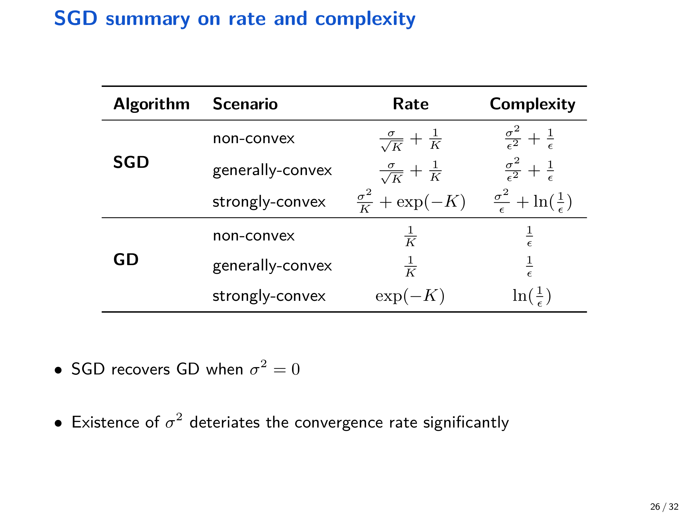{ width="800" }

另一个角度是“dominant sample complexity”（达到精度 $\varepsilon$ 所需样本量），在 mini-batch 章节给出了对比表格。

## 6 Mini-batch SGD：方差降低与并行加速

### 6.1 算法

在深度学习中通常用 batch size 为 $B$ 的 mini-batch 来估计梯度。定义

$$
g_k=\frac{1}{B}\sum_{b=1}^B \nabla F(x_k;\xi^{(b)}_k),
$$

则 mini-batch SGD 迭代为

$$
x_{k+1}=x_k-\gamma g_k.
$$

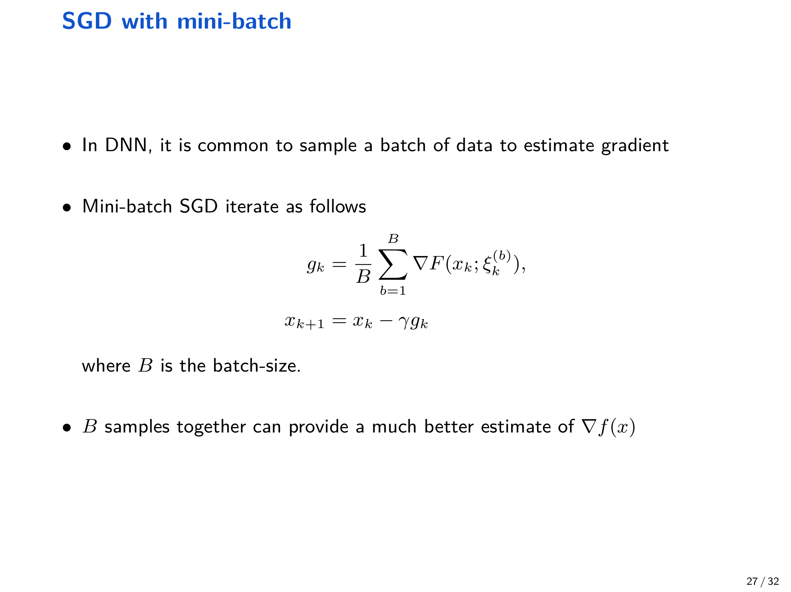{ width="800" }

对应的过滤族可写为：

$$
\mathcal{F}^B_k=\{x_k,\{\xi^{(b)}_{k-1}\}_{b=1}^B,x_{k-1},\ldots,x_0\}.
$$

!!! note "假设 6.1（mini-batch 无偏 + 独立采样）"
    给定 $\mathcal{F}^B_k$，对每个 $b=1,\ldots,B$ 假设

    $$
    \mathbb{E}\left[\nabla F(x_k;\xi^{(b)}_k)\mid \mathcal{F}^B_k\right]=\nabla f(x_k),
    $$

    $$
    \mathbb{E}\left[\left\lVert \nabla F(x_k;\xi^{(b)}_k)-\nabla f(x_k)\right\rVert^2\mid \mathcal{F}^B_k\right]\le \sigma^2,
    $$

    并且 $\{\xi^{(b)}_k\}_{b=1}^B$ 在给定 $k$ 时相互独立。

### 6.2 方差降低：从 $\sigma^2$ 到 $\sigma^2/B$

在假设 6.1 下，$g_k$ 仍是无偏估计：

$$
\mathbb{E}[g_k\mid \mathcal{F}^B_k]=\nabla f(x_k),
$$

且方差满足（讲义与 Notes 的核心结论）：

$$
\mathbb{E}\left[\lVert g_k-\nabla f(x_k)\rVert^2\mid \mathcal{F}^B_k\right]\le \frac{\sigma^2}{B}.
$$

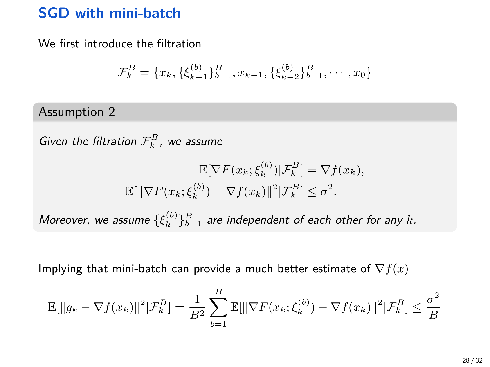{ width="800" }

直观上：更大的 $B$ 让一次更新使用更多样本，随机梯度噪声平均后变小，从而收敛更稳。

### 6.3 收敛结论（给出主导阶）

!!! abstract "定理 6.2（mini-batch SGD 的主导阶）"
    在假设 6.1 下，mini-batch SGD 的收敛分析与 vanilla SGD 基本相同，只需把噪声方差从 $\sigma^2$ 替换为 $\sigma^2/B$。讲义与 Notes 给出三类典型结果（这里写成主导阶）：

    - 若 $f$ 是 $L$-smooth（可非凸），则

    $$
    \frac{1}{K+1}\sum_{k=0}^{K}\mathbb{E}\left[\lVert \nabla f(x_k)\rVert^2\right]
    = O\left(\sqrt{\frac{L\Delta^f_0\sigma^2}{B(K+1)}}+\frac{L\Delta^f_0}{K+1}\right),
    $$

    其中 $\Delta^f_0=f(x_0)-f^\star$。

    - 若 $f$ 是 $L$-smooth 且凸，则

    $$
    \frac{1}{K+1}\sum_{k=0}^{K}\mathbb{E}\left[f(x_k)-f^\star\right]
    = O\left(\sqrt{\frac{L\Delta^x_0\sigma^2}{B(K+1)}}+\frac{L\Delta^x_0}{K+1}\right),
    $$

    其中 $\Delta^x_0=\lVert x_0-x^\star\rVert^2$。

    - 若 $f$ 是 $L$-smooth 且 $\mu$-strongly convex，则

    $$
    \mathbb{E}[f(x_K)]-f^\star
    = \tilde O\left(\frac{L\sigma^2}{\mu^2 B K} + \Delta^f_0\exp\left(-\frac{\mu}{L}K\right)\right),
    $$

    其中 $\tilde O(\cdot)$ 隐去对数项。

    讲义特别指出：更大的 batch size $B$ 会加速收敛，且 $B=1$ 退化回 vanilla SGD。

讲义进一步给出在“主导样本复杂度”层面的对比：

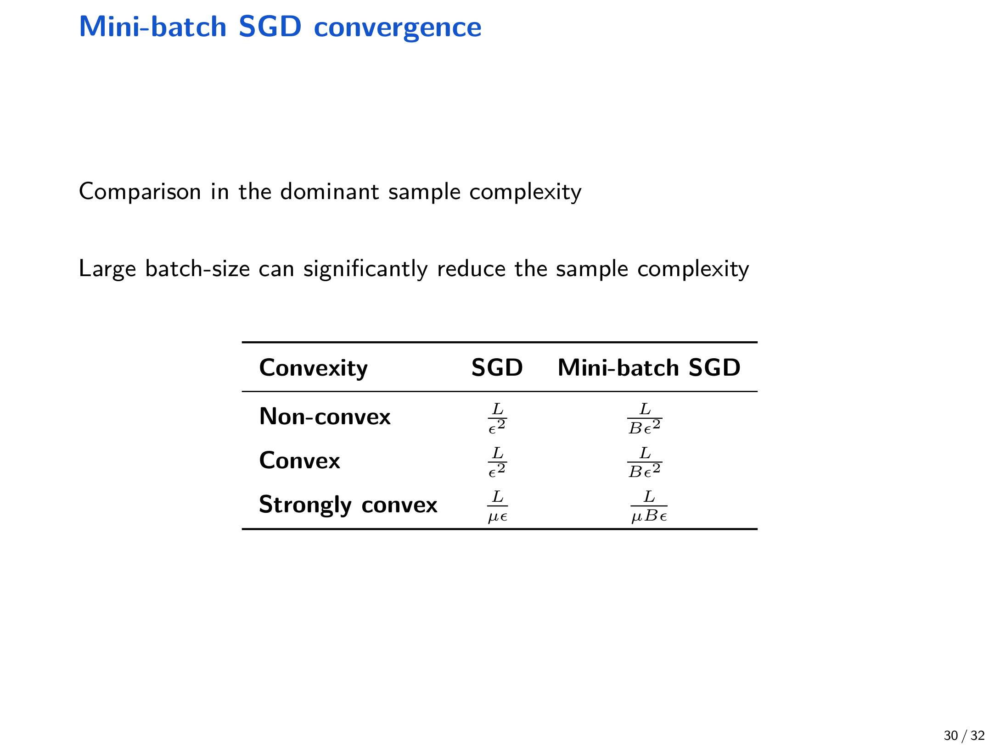{ width="800" }

## 7 实验现象：学习率与 batch size 的影响

本节复现 Notes_SGD 中的实验设计与结论（线性回归 + CIFAR-10 / ResNet-18）。

### 7.1 线性回归：学习率大小与收敛行为

Notes 在线性回归任务中（$N=100,\;d=5$，batch size 为 $1$，epochs 为 $10$）比较了不同学习率。

结论要点：

- 学习率更小：更新更谨慎稳定，最终收敛更好，但训练更慢。
- 适当增大学习率：加速训练，但可能牺牲最终收敛效果。
- 学习率过大：可能导致震荡、甚至发散。

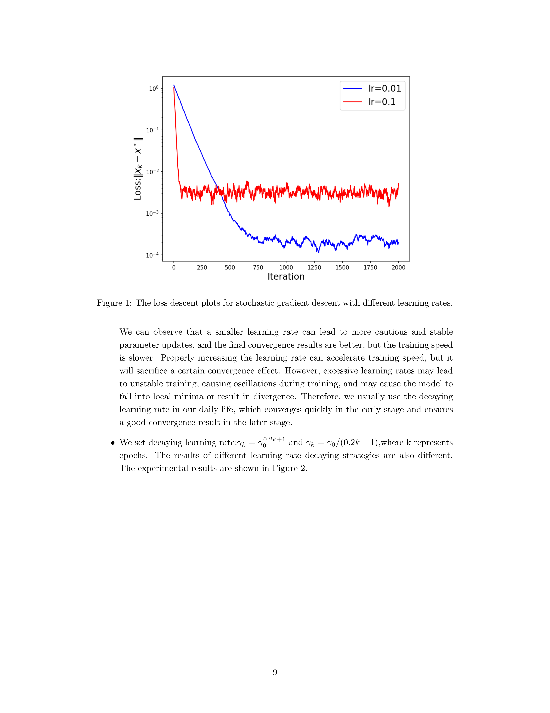{ width="800" }

### 7.2 学习率衰减（learning rate decay）

Notes 给出两种衰减策略示例：

- $\gamma_k=\gamma_0^{0.2k+1}$
- $\gamma_k=\gamma_0/(0.2k+1)$

并指出不同衰减策略会带来不同训练曲线。

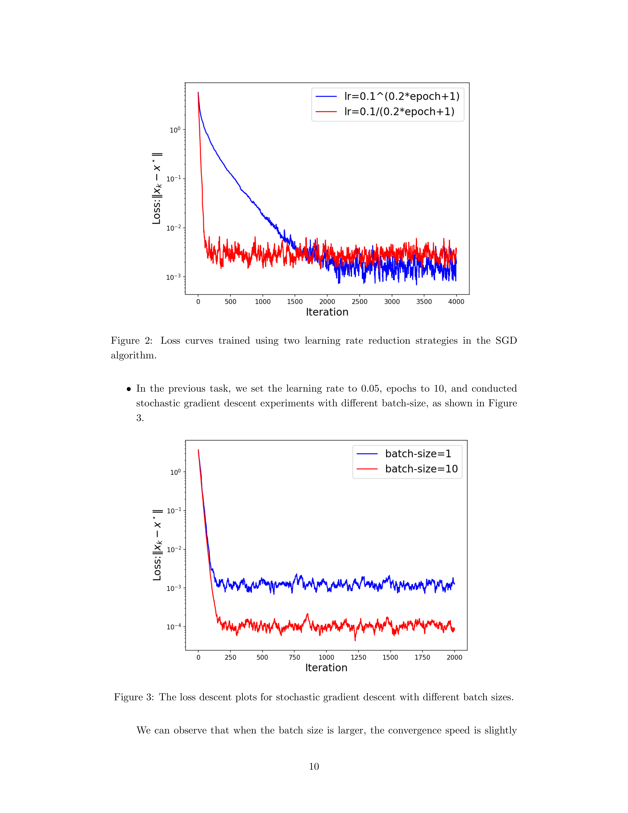{ width="800" }

### 7.3 batch size 的影响：更快更稳的趋势

Notes 在固定学习率（例如 $0.05$）下比较不同 batch size 的线性回归实验，并观察到更大的 batch size 往往带来略快且更好的收敛效果，其原因是每次更新使用的数据更多、更接近整体梯度。

在 CIFAR-10 上用 ResNet-18 做分类实验，讲义与 Notes 都强调 “large batch can help training” 的现象；例如讲义展示了 batch size 约为 $2k$ 的训练损失与验证精度曲线：

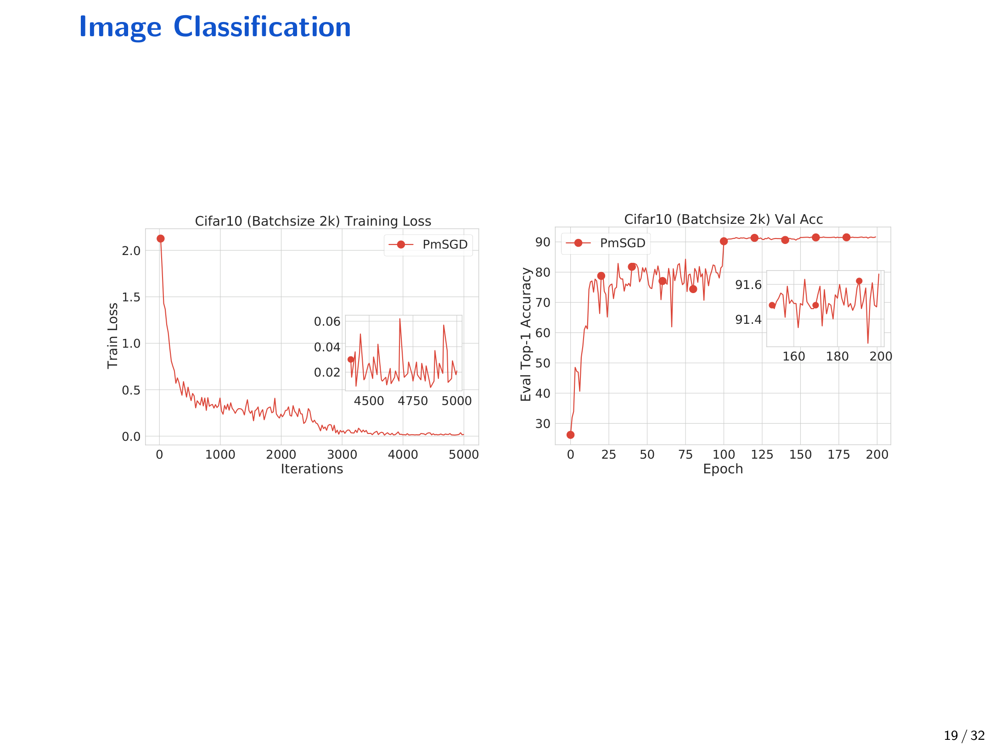{ width="800" }

Notes 进一步比较 batch size 为 $16$ 与 $128$（学习率固定为 $0.005$，训练约 $1200$ steps）时的 loss 曲线：

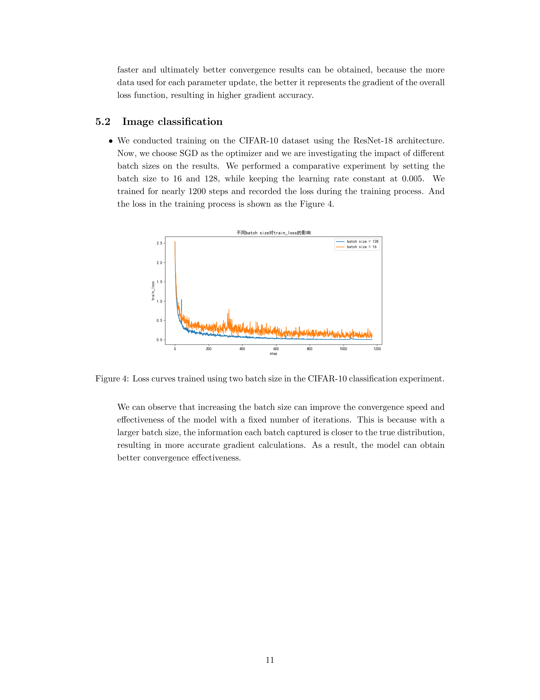{ width="800" }

## 8 参考文献（讲义列举）

- Ge, Huang, Jin, Yuan (2015). Escaping from saddle points—online stochastic gradient for tensor decomposition. COLT.
- Sun, Qu, Wright (2015). When are nonconvex problems not scary? arXiv:1510.06096.
- Jin, Ge, Netrapalli, Kakade, Jordan (2017). How to escape saddle points efficiently. ICML.
- Du, Zhai, Poczos, Singh (2018). Gradient descent provably optimizes over-parameterized neural networks. arXiv:1810.02054.
- Du, Lee, Li, Wang, Zhai (2019). Gradient descent finds global minima of deep neural networks. ICML.
- Kleinberg, Li, Yuan (2018). An alternative view: When does sgd escape local minima? ICML.
- Karimi, Nutini, Schmidt (2016). Linear convergence of gradient and proximal-gradient methods under the Polyak-Łojasiewicz condition. ECML PKDD.
