参考：Stanford CS224n: Natural Language Processing with Deep Learning

---

## 目录

- Sequence-to-sequence models
- Attention
- Transformer

---

## 神经机器翻译 (Neural Machine Translation)

### Sequence-to-sequence Model

Seq2Seq 模型是一种通用的序列转换框架，可以应用于多种任务：

- 机器翻译
- 语音识别
- 问答系统
- 文本摘要
- 对话生成

---

### 训练神经机器翻译系统

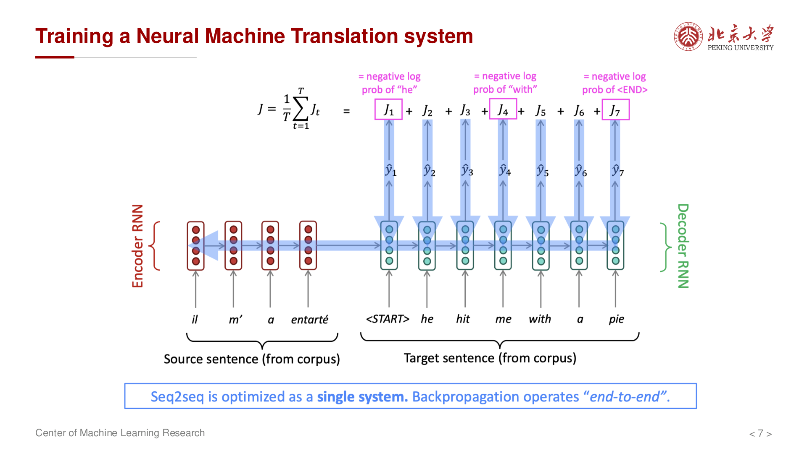{ width="550" }

Seq2Seq 模型由 **编码器 (Encoder)** 和 **解码器 (Decoder)** 两部分组成。

编码器将输入序列 $(x_1, x_2, \dots, x_n)$ 转换为上下文向量 **c**：

$$
h_t = f(x_t, h_{t-1})
$$

$$
c = q(\{h_1, \dots, h_n\})
$$

其中 $f$ 是 RNN/LSTM/GRU 等循环单元，$q$ 可以是最后一个隐藏状态或所有隐藏状态的汇总。

解码器根据上下文向量 **c** 和已生成的输出序列 $(y_1, \dots, y_{t-1})$ 预测下一个词：

$$
p(y_t | y_1, \dots, y_{t-1}, c) = g(y_{t-1}, s_t, c)
$$

其中 $s_t$ 是解码器的隐藏状态。

---

## RNN 的瓶颈问题

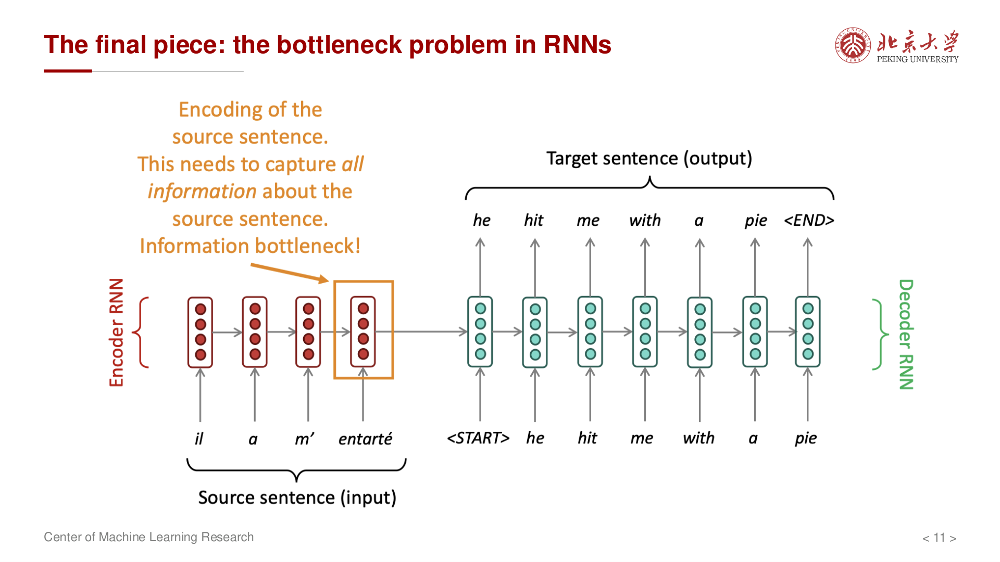{ width="500" }

### 线性交互距离问题

在 RNN 中，相距较远的 token 之间的信息需要通过多个时间步传递：

- 早期输入与后期输出之间的交互是 **线性** 的
- 距离越远，信息损失越大
- 长距离依赖难以捕捉

### 缺乏并行性

RNN 的计算是顺序进行的：

- 必须等待 $h_{t-1}$ 计算完成后才能计算 $h_t$
- 无法利用现代 GPU/TPU 的并行计算能力
- 训练效率低下

---

## Attention 机制

### 起点：RNN 的 Mean-Pooling

传统的 Seq2Seq 使用单个上下文向量 **c** 来编码整个输入序列，这造成了 **信息瓶颈**。

### Attention 是加权平均

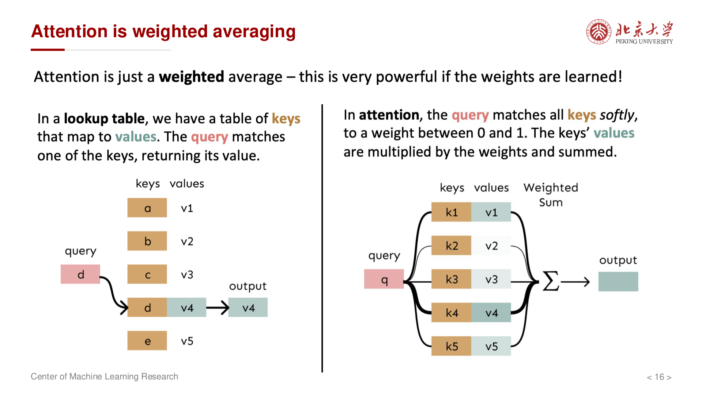{ width="450" }

Attention 机制的核心思想：

- 在解码的每一步，都关注输入序列的不同部分
- 为每个输入位置分配一个 **注意力权重**
- 输出是输入向量的 **加权求和**

### Attention 计算过程

对于解码器第 $t$ 步，计算注意力权重的步骤如下：

**第一步：计算注意力分数**

$$
e_{ti} = a(s_{t-1}, h_i)
$$

其中 $a$ 是评分函数，$s_{t-1}$ 是解码器前一时刻的隐藏状态，$h_i$ 是编码器第 $i$ 步的隐藏状态。

**第二步：Softmax 归一化**

$$
\alpha_{ti} = \frac{\exp(e_{ti})}{\sum_{j=1}^{n} \exp(e_{tj})}
$$

**第三步：计算上下文向量**

$$
c_t = \sum_{i=1}^{n} \alpha_{ti} h_i
$$

**第四步：拼接并继续解码**

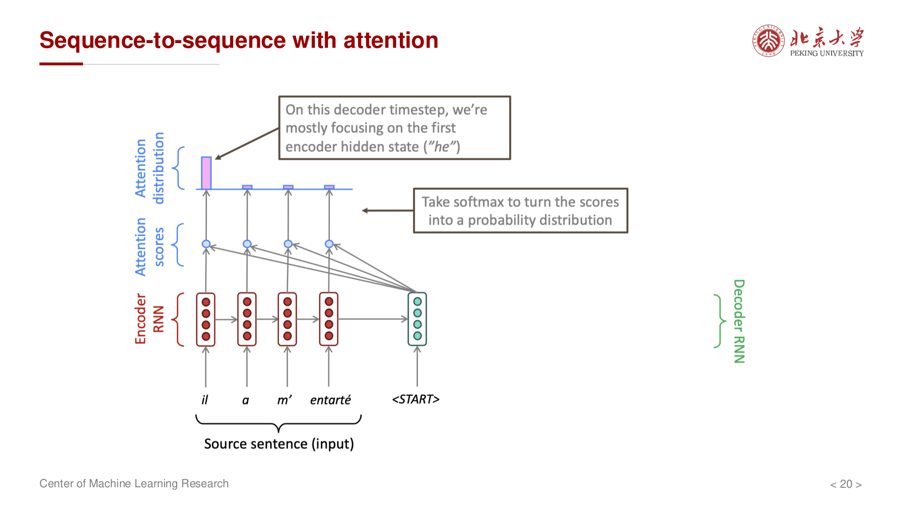{ width="550" }

将注意力向量 $c_t$ 与解码器隐藏状态 $s_t$ 拼接，用于预测输出：

$$
p(y_t | y_1, \dots, y_{t-1}, x) = g(y_{t-1}, s_t, c_t)
$$

---

### Attention 的优势

- **并行化**：注意力权重可以并行计算
- **解决瓶颈**：直接访问所有输入位置，无需通过单一向量传递信息
- **可解释性**：注意力权重显示了模型关注的输入位置

---

### Attention 的变体

常见的评分函数 $a(s, h)$ 有以下几种形式：

**1. Dot Product**

$$
a(s, h) = s^T h
$$

**2. General (Bilinear)**

$$
a(s, h) = s^T W h
$$

**3. Concat (Additive)**

$$
a(s, h) = v^T \tanh(W_s s + W_h h)
$$

**4. Scaled Dot-Product (Transformer 中使用)**

$$
a(Q, K) = \frac{Q K^T}{\sqrt{d_k}}
$$

---

## Self-Attention (自注意力)

### 核心思想

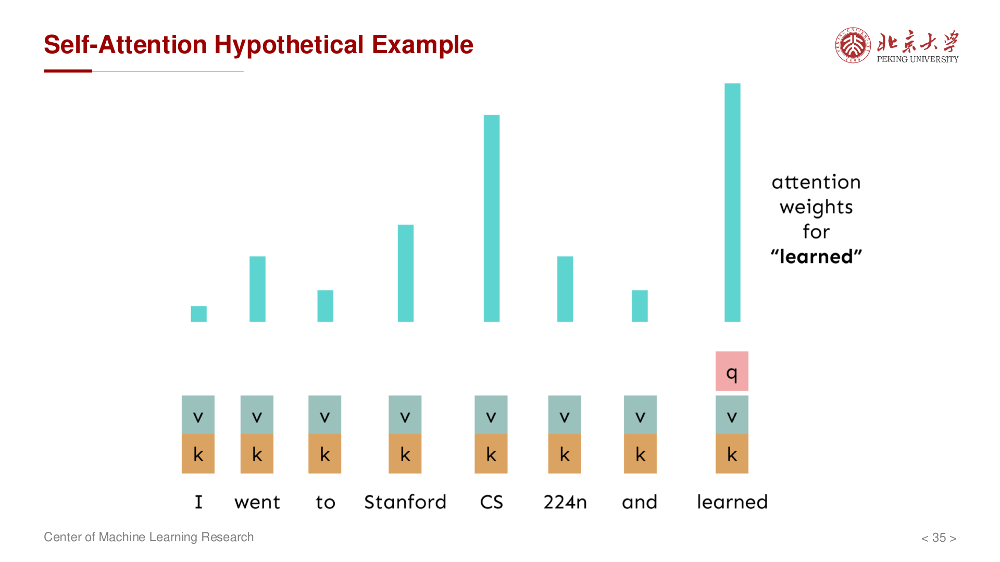{ width="500" }

自注意力让序列中的每个位置都能 **关注序列中的其他位置**，从而捕捉序列内部的依赖关系。

不同于传统的 Attention（编码器-解码器之间的交叉注意力），Self-Attention 的 **Query、Key、Value 都来自同一个序列**。

---

### Self-Attention 的矩阵表示

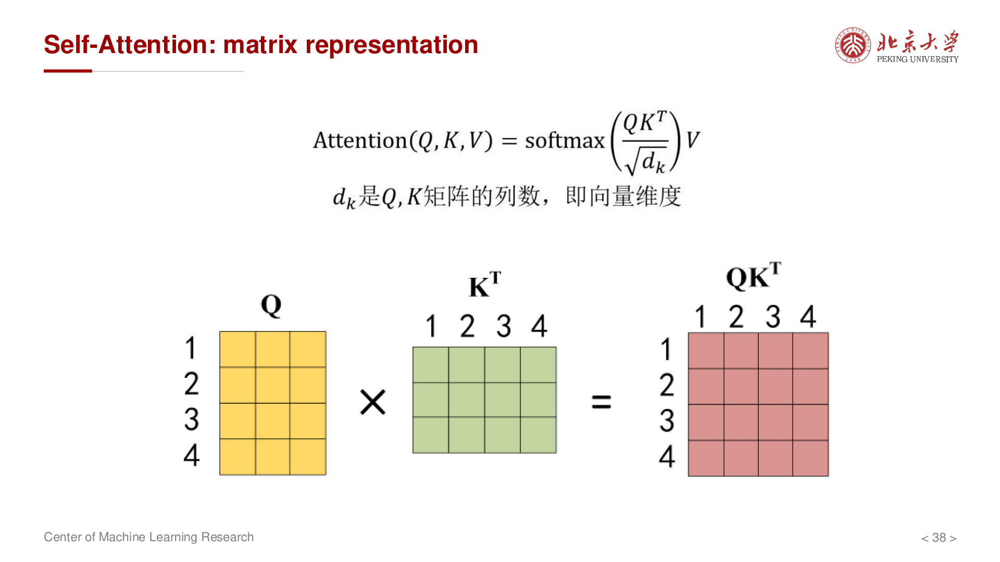{ width="550" }

给定输入矩阵 $X \in \mathbb{R}^{n \times d}$（$n$ 个 token，每个维度为 $d$）：

**第一步：计算 Q、K、V**

$$
Q = X W_Q, \quad K = X W_K, \quad V = X W_V
$$

其中 $W_Q, W_K, W_V \in \mathbb{R}^{d \times d_k}$ 是可学习的投影矩阵。

**第二步：计算注意力分数**

$$
\text{Scores} = Q K^T \in \mathbb{R}^{n \times n}
$$

**第三步：缩放并 Softmax**

$$
A = \text{softmax}\left(\frac{Q K^T}{\sqrt{d_k}}\right) \in \mathbb{R}^{n \times n}
$$

除以 $\sqrt{d_k}$ 是为了防止点积过大导致 softmax 梯度消失。

**第四步：计算输出**

$$
\text{Output} = A V \in \mathbb{R}^{n \times d_k}
$$

完整公式：

$$
\text{Attention}(Q, K, V) = \text{softmax}\left(\frac{Q K^T}{\sqrt{d_k}}\right) V
$$

---

## Position Embedding (位置编码)

### 问题

Self-Attention 本身是 **置换不变** 的（permutation invariant）：

- 改变输入序列的顺序，输出也会相应置换
- 模型 **无法感知位置信息**

### 解决方案：位置编码

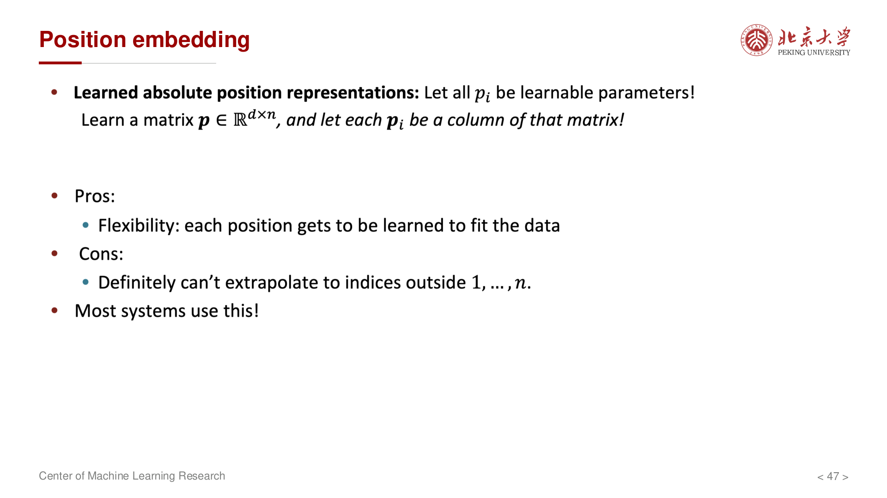{ width="500" }

Transformer 使用 **正弦/余弦位置编码**：

$$
PE_{(pos, 2i)} = \sin\left(\frac{pos}{10000^{2i/d_{model}}}\right)
$$

$$
PE_{(pos, 2i+1)} = \cos\left(\frac{pos}{10000^{2i/d_{model}}}\right)
$$

其中 $pos$ 是位置，$i$ 是维度索引。

位置编码与词嵌入相加：

$$
X_{embedded} = X_{token} + PE
$$

---

## Multi-Head Attention (多头注意力)

### 核心思想

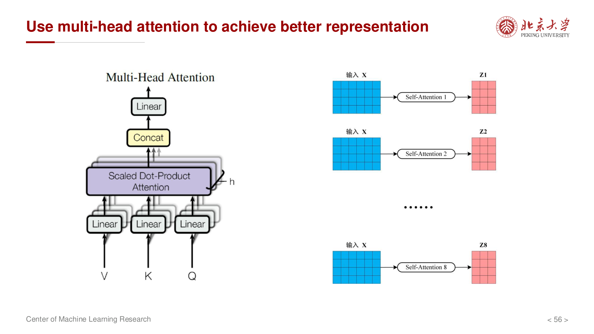{ width="550" }

使用多组不同的 $W_Q, W_K, W_V$ 投影矩阵，让模型在 **不同子空间** 中关注不同的信息：

- 某些头可能关注语法关系
- 某些头可能关注语义关系
- 某些头可能关注长距离依赖

### 计算过程

对于第 $i$ 个头：

$$
\text{head}_i = \text{Attention}(X W_Q^{(i)}, X W_K^{(i)}, X W_V^{(i)})
$$

将所有头的输出拼接后投影：

$$
\text{MultiHead}(Q, K, V) = \text{Concat}(\text{head}_1, \dots, \text{head}_h) W_O
$$

其中 $h$ 是头的数量，$W_O$ 是输出投影矩阵。

---

## Transformer 架构

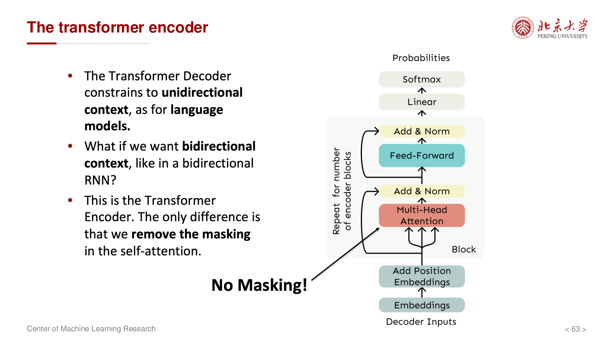{ width="500" }

### 编码器 (Encoder)

每个编码器层包含两个子层：

**1. Multi-Head Self-Attention**

$$
\text{Attention}(Q, K, V) = \text{softmax}\left(\frac{Q K^T}{\sqrt{d_k}}\right) V
$$

**2. Position-wise Feed-Forward Network**

$$
\text{FFN}(x) = \max(0, x W_1 + b_1) W_2 + b_2
$$

或使用 GELU 激活函数的变体。

每个子层都使用 **残差连接 (Residual Connection)** 和 **层归一化 (Layer Normalization)**：

$$
\text{Output} = \text{LayerNorm}(x + \text{Sublayer}(x))
$$

---

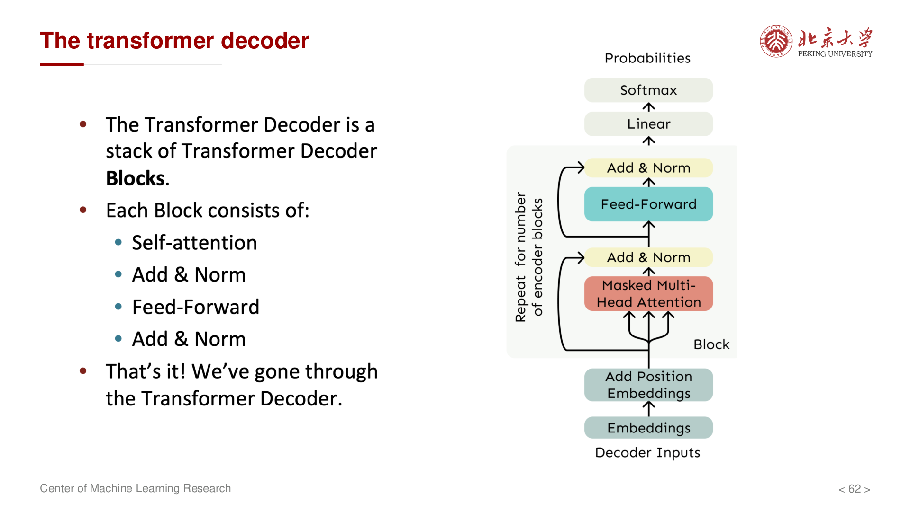{ width="500" }

### 解码器 (Decoder)

每个解码器层包含三个子层：

**1. Masked Multi-Head Self-Attention**

- 防止解码器在预测位置 $t$ 时看到位置 $t$ 之后的信息
- 通过 **Mask** 将未来位置设置为 $-\infty$

**2. Multi-Head Cross-Attention**

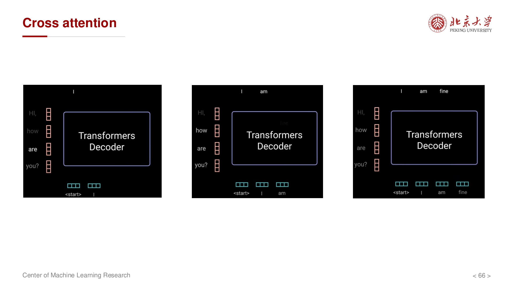{ width="500" }

- Query 来自解码器前一层的输出
- Key 和 Value 来自编码器的输出
- 实现编码器-解码器之间的信息交互

**3. Position-wise Feed-Forward Network**

与编码器相同。

---

### 残差连接与层归一化

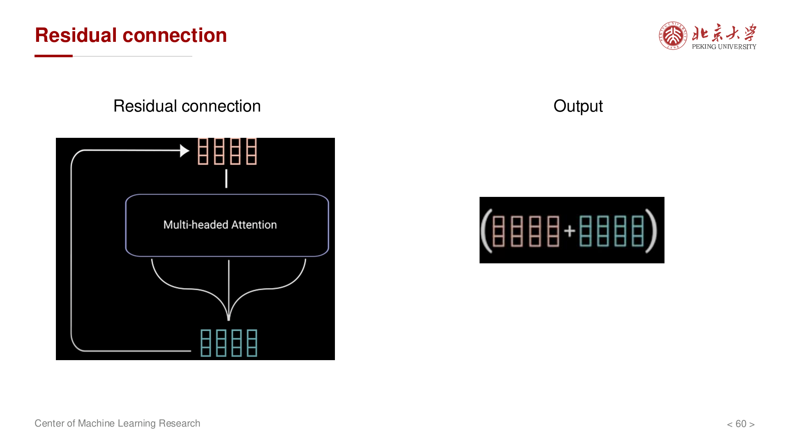{ width="400" }

**残差连接 (Residual Connection)**：

$$
\text{Output} = x + \text{F}(x)
$$

解决深层网络的梯度消失问题，使训练更加稳定。

**层归一化 (Layer Normalization)**：

$$
\text{LayerNorm}(x) = \frac{x - \mu}{\sqrt{\sigma^2 + \epsilon}} \cdot \gamma + \beta
$$

对每个样本的所有特征进行归一化，加速训练收敛。

---

## Transformer 的优势与局限

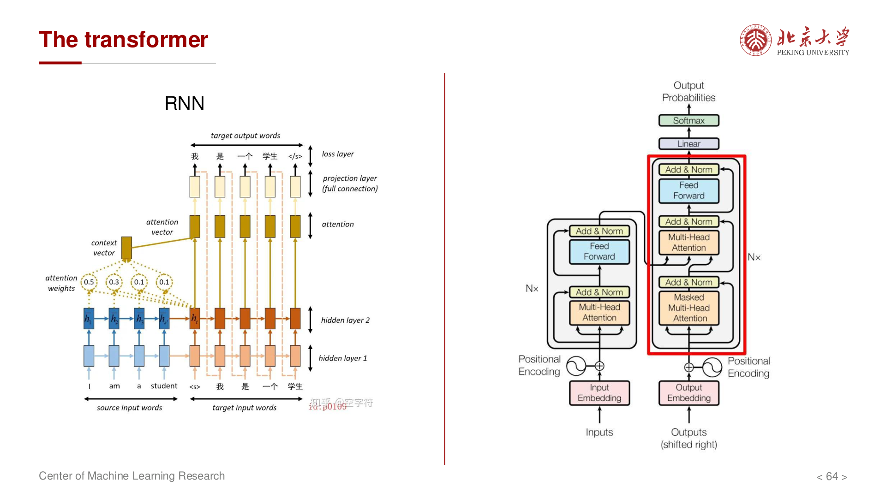{ width="550" }

### 优势

- **完全并行**：不像 RNN 需要顺序计算
- **长距离依赖**：Self-Attention 使任意两个位置直接交互
- **可解释性**：注意力权重提供模型决策的可视化

### 局限

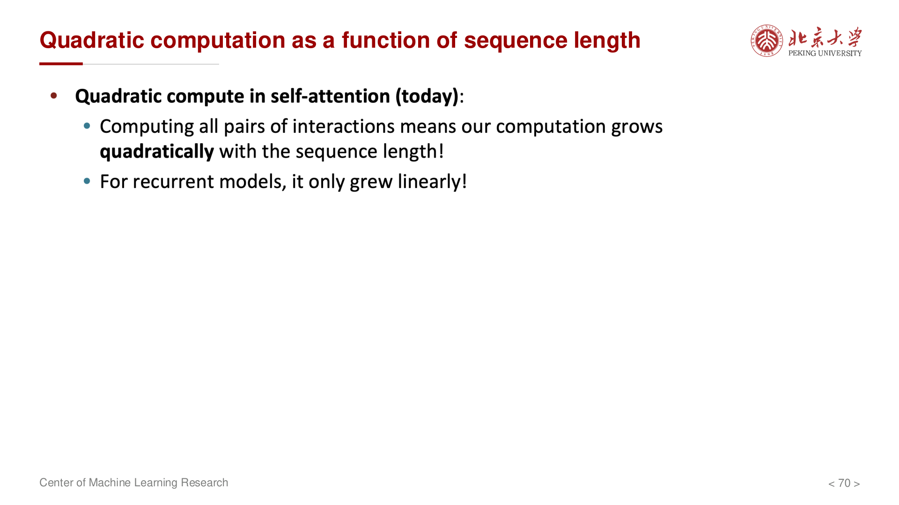{ width="450" }

- **计算复杂度**：Self-Attention 的时间复杂度为 $O(n^2 \cdot d)$
- **内存消耗**：需要存储 $n \times n$ 的注意力矩阵
- **序列长度限制**：长序列时计算和内存开销巨大

---

## 总结

Transformer 是现代 NLP 和大模型的基础架构：

1. **Self-Attention** 提供了强大的序列建模能力
2. **Multi-Head Attention** 增强了表示的多样性
3. **位置编码** 引入了位置信息
4. **残差连接和层归一化** 使深层网络可训练

从 BERT 到 GPT 系列，Transformer 架构已经成为深度学习领域的核心组件。
