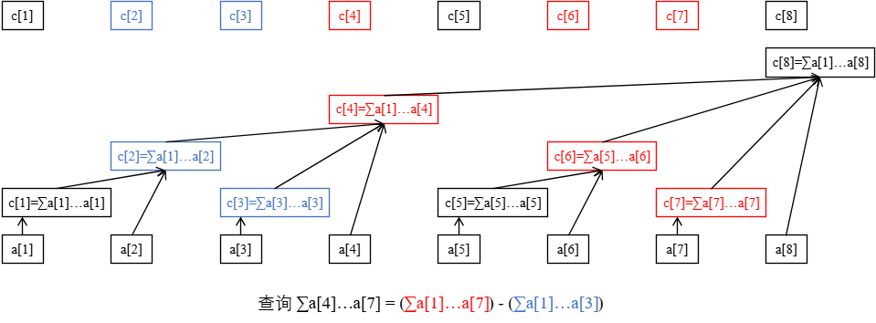

# OJ 复习笔记

## 离散化

离散化是一种数据处理的技巧，本质上可以看作是一种哈希，其保证数据结构在哈希以后仍然保持原来的状态。

- 创建原数组的副本。
- 将副本中的值从小到大排序。
- 将排序好的副本去重。
- 查找原数组的每一个元素在副本中的位置，位置即为排名，将其作为离散化后的值。

```c++
// arr[i] 为初始数组，下标范围为 [1, n]
for (int i = 1; i <= n; ++i) // step 1
    tmp[i] = arr[i];
std::sort(tmp + 1, tmp + n + 1); // step 2
int len = std::unique(tmp + 1, tmp + n + 1) - (tmp + 1); // step 3
for (int i = 1; i <= n; ++i) // step 4
    arr[i] = std::lower_bound(tmp + 1, tmp + len + 1, arr[i]) - tmp;
```

---

## 堆与优先队列

堆是一棵树，其每个节点都有一个键值，且每个节点的键值都大于等于/小于等于其父亲的键值。

每个节点的键值都大于等于其父亲键值的堆叫做小根堆，否则叫做大根堆。STL 中的 `priority_queue` 其实就是一个大根堆。（`priority_queue<int, vector<int>, greater<int>>` 是一个小根堆。）

（小根）堆主要支持的操作有：插入一个数、查询最小值、删除最小值、合并两个堆、减小一个元素的值。

一些功能强大的堆（可并堆）还能（高效地）支持 merge 等操作。

一些功能更强大的堆还支持可持久化，也就是对任意历史版本进行查询或者操作，产生新的版本。

习惯上，不加限定提到「堆」时往往都指二叉堆。

### 建堆

自底向上逐步把子树调整成堆，注意保持子树性质。

向上调整：

```c++
void up(int x) {
    while (x > 1 && h[x] > h[x / 2]) {
        swap(h[x], h[x / 2]);
        x /= 2;
    }
}
```

向下调整：

```c++
void down(int x) {
    while (x * 2 <= n) {
        int t = x * 2;
        if (t + 1 <= n && h[t + 1] > h[t]) t++;
        if (h[t] <= h[x]) break;
        swap(h[x], h[t]);
        x = t;
    }
}
```

方法一：使用 decreasekey（向上调整），从根节点开始，按 BFS 序进行。

```c++
void build_heap_1() {
    for (i = 1; i <= n; i++) up(i);
}
```

复杂度 $O(n\log n)$

方法二：使用向下调整。

```c++
void build_heap_2() {
    for (i = n; i >= 1; i--) down(i);
}
```

每次合并两个已经调整好的堆。复杂度 $O(n)$

---

## 树状数组

### 引入

树状数组是一种支持 **单点修改** 和 **区间查询** 的，代码量小的数据结构。

???+ question "什么是「单点修改」和「区间查询」？"
    假设有这样一道题：
    已知一个数列 `a`，你需要进行下面两种操作：

    - 给定 `x, y` 将 `a[x]` 自增 `y`。
    - 给定 `l, r`，求解 `a[l...r]` 的和。

    其中第一种操作就是「单点修改」，第二种操作就是「区间查询」。
    类似地还有：「区间修改」、「单点查询」。它们分别的一个例子如下：

    - 区间修改：给定 $l, r, x$，将 $a$ 中的每个数都分别自增 $x$；
    - 单点查询：给定 $x$，求解 $a$ 的值。

    注意到，区间问题一般严格强于单点问题，因为对单点的操作相当于对一个长度为 1 的区间操作。

普通树状数组维护的信息及运算要满足 **结合律** 且 **可差分**，如加法（和）、乘法（积）、异或等。

- 可差分：具有逆运算的运算，即已知 $x \circ y$ 和 $x$ 可以求出 $y$。

需要注意的是：

- 模意义下的乘法若要可差分，需保证每个数都存在逆元（模数为质数时一定存在）；
- 例如 $\gcd, \max$ 这些信息不可差分，所以不能用普通树状数组处理，但是：
    - 使用两个树状数组可以用于处理区间最值，见 [Efficient Range Minimum Queries using Binary Indexed Trees](http://history.ioinformatics.org/oi/files/volume9.pdf#page=41)。
    - 一种支持不可差分信息查询的，$\Theta(\log^2n)$ 时间复杂度的拓展树状数组。

事实上，树状数组能解决的问题是线段树能解决的问题的子集：树状数组能做的，线段树一定能做；线段树能做的，树状数组不一定可以。然而，树状数组的代码要远比线段树短，时间效率常数也更小，因此仍有学习价值。

有时，在 **差分数组** 和 **辅助数组** 的帮助下，树状数组还可解决更强的 **区间加单点值** 和 **区间加区间和** 问题。

### 基本原理

树状数组可以快速求解信息的原因：我们总能将一段前缀 `[1, n]` 拆成 **不多于 $\log n$ 段区间**，使得这 $\log n$ 段区间的信息是 **已知的**。

于是，我们只需要合并这 $\log n$ 段区间的信息，就可以得到答案。

不难发现信息必须满足结合律。

树状数组的工作原理：


最下面的八个方块代表原始数据数组 $a$。上面参差不齐的方块代表数组 $a$ 的上级—— $c$ 数组。

$c$ 数组就是用来存储原始数组 $a$ 某段区间的和，也就是说，这些区间的信息是已知的，我们的目标就是把查询拆成这些小区间。

例如，从图中可以看出：

- $c_2$ 管辖的是 $a[1 \dots 2]$
- $c_4$ 管辖的是 $a[1 \dots 4]$
- $c_6$ 管辖的是 $a[6 \dots 6]$
- $c_8$ 管辖的是 $a[1 \dots 8]$
- 剩下的 $c[x]$ 管辖的都是 $a[x]$ 自己（可以看做 $a[x \dots x]$ 的长度为 $1$ 的小区间）

不难发现，$c[x]$ 管辖的一定是一段右边界是 $x$ 的区间总信息。先不管左边界，先来感受一下树状数组是如何查询的。

举例：计算 $a[1\dots7]$ 的和。

过程：从 $c_7$ 开始往前跳，发现 $c_7$ 只管辖 $a_7$ 这一个元素；然后找 $c_6$，发现 $c_6$ 管辖的是 $a[6 \dots 6]$，然后跳到 $c_4$，发现 $c_4$ 管辖的是 $a[1\dots4]$ 这些元素，然后再试图跳到 $c_0$，但事实上 $c_0$ 不存在，不跳了。

我们刚刚找到的 $c$ 是 $c_7, c_6, c_4$，这就是 $a[1\dots7]$ 拆分出的三个小区间，合并得到答案是 $c_7 + c_6 + c_4$。

举例：计算 $a[4\dots7]$ 的和。

我们还是从 $c_7$ 开始跳，跳到 $c_6$ 再跳到 $c_4$。此时我们发现它管理了 $a[1\dots4]$ 的和，但是我们不想要 $a[1\dots3]$ 这一部分，怎么办呢？很简单，减去 $a[1\dots3]$ 的和就行了。

那不妨考虑最开始，就将查询 $a[4\dots7]$ 的和转化为查询 $a[1\dots7]$ 的和，以及查询 $a[1\dots3]$ 的和，最终将两个结果作差。

{ width="550" }

### 管辖区间

树状数组中规定，$c[x]$ 管辖的区间长度为 $2^k$，其中：

- 设二进制最低位为第 $0$ 位，则 $k$ 恰好为 $x$ 二进制表示中，最低位的 `1` 所在的二进制位数；
- $2^k$ （$c[x]$ 的管辖区间长度）恰好为 $x$ 二进制表示中，最低位的 `1` 以及后面所有的 $0$ 组成的数。

我们记 $x$ 二进制最低位 `1` 以及后面的 `0` 组成的数为 $\text{lowbit}(x)$，那么 $c[x]$ 管辖的区间就是 $[x - \text{lowbit}(x) + 1, x]$。

根据 ICS 中的知识，可知 `lowbit(x) = x & -x`。

### 区间查询

回顾查询 $a[1\dots7]$ 的过程，不难发现，每次往前跳，一定是跳到现区间的左端点的左一位，作为新区间的右端点，这样才能将前缀不重不漏地拆分。比如现在 $c_6$ 管的是 $a[5\dots6]$，下一次就跳到 $5 - 1 = 4$，即访问 $c_4$。

我们可以写出查询 $a[1 \dots x]$ 的过程：

- 从 $c[x]$ 开始往前跳，有 $c[x]$ 管辖 $a[x - \text{lowbit}(x) + 1 \dots x]$
- 令 $x \leftarrow x - \text{lowbit}(x)$，如果 $x = 0$ 说明已经跳到尽头了，终止循环；否则回到第一步。
- 将跳到的 $c$ 合并。

实现时，我们不一定要先把 $c$ 都跳出来然后一起合并，可以边跳边合并。

比如我们要维护的信息是和，直接令初始 $ans = 0$，然后每跳到一个 $c[x]$ 就 $ans \leftarrow ans + c[x]$，最终 $ans$ 就是所有合并的结果。

```c++
int getsum(int x) {
    int ans = 0;
    while (x > 0) {
        ans = ans + c[x];
        x = x - lowbit(x);
    }
    return ans;
}
```

### 树状数组与其树形态的性质

在讲解单点修改之前，先讲解树状数组的一些基本性质，以及其树形态来源，这有助于更好理解树状数组的单点修改。

我们约定：

1. $l(x) = x - \text{lowbit}(x) + 1$，即 $l(x)$ 是 $c[x]$ 管辖范围的左端点。
2. 对于任意正整数 $x$，总能将 $x$ 表示成 $s \times 2^{k + 1} + 2^k$ 的形式，其中 $\text{lowbit}(x) = 2^k$。
3. 下面 "$c[x]$ 和 $c[y]$ 不交" 指 $c[x]$ 的管辖范围和 $c[y]$ 的管辖范围不相交，即 $[l(x),x]$ 和 $[l(y),y]$ 不相交。"$c[x]$ 包含于 $c[y]$" 等表述同理。

**性质 1** ：对于 $x \leq y$，要么有 $c[x]$ 和 $c[y]$ 不交，要么有 $c[x]$ 包含于 $c[y]$。

**性质 2** ：$c[x]$ 真包含于 $c[x + \text{lowbit}(x)]$。

**性质 3** ：对于任意 $x < y < x + \text{lowbit}(x)$，有 $c[x]$ 和 $c[y]$ 不交。

有了这三条性质的铺垫，我们接下来看树状数组的树形态（请忽略 $a$ 向 $c$ 的连边）。

{ width="550" }

事实上，树状数组的树形态是 $x$ 向 $x + \text{lowbit}(x)$ 连边得到的图，其中 $x + \text{lowbit}(x)$ 是 $x$ 的父亲。

注意，在考虑树状数组的树形态时，我们不考虑树状数组大小的影响，即我们认为这是一棵无限大的树，方便分析。实际实现时，我们只需用到 $x \leq n$ 的 $c[x]$，其中 $n$ 是原数组的长度。

这棵树满足很多美好的性质，下面举例若干（设 $fa[u]$ 表示 $u$ 的直系父亲）：

- $u < fa[u]$。
- $u$ 大于任何一个 $u$ 的后代，小于任何一个 $u$ 的祖先。
- 点 $u$ 的 $\text{lowbit}$ 严格小于 $fa[u]$ 的 $\text{lowbit}$。
- 点 $x$ 的高度是 $\log_2\text{lowbit}(x)$，即 $x$ 二进制最低位 `1` 的位数。
- $c[u]$ 真包含于 $c[v]$，其中 $v$ 是 $u$ 的任一祖先（性质 2 归纳）。
- 对于任意 $v^{'} > u$，若 $v^{'}$ 不是 $u$ 的祖先，则 $c[u]$ 和 $c[v^{'}]$ 不交。
- 对于任意 $v > u$，当且仅当 $v$ 是 $u$ 的祖先，$c[u]$ 真包含于 $c[v]$（上面几条性质的总结， **树状数组单点修改的核心原理**）。
- 设 $u = s \times 2^{k + 1} + 2^k$，则其儿子数量为 $k = \log_2\text{lowbit}(u)$，编号分别为 $u - 2^t(0 \leq t < k)$。
    - 举例：假设 $k = 3$，$u$ 的二进制编号为 `...1000`，则 $u$ 有三个儿子，二进制编号分别为 `...0111`、`...0110`、`...0100`。
- $u$ 的所有儿子对应 $c$ 的管辖区间恰好拼接成 $[l(u), u - 1]$。

### 单点修改

现在来考虑如何单点修改 $a[x]$。

我们的目的是快速正确地维护 $c$ 数组。为保证效率，我们只需遍历并修改管辖了 $a[x]$ 的所有 $c[y]$，因为其他的 $c$ 显然没有发生变化。

管辖 $a[x]$ 的 $c[y]$ 一定包含 $c[x]$（根据性质 1），所以 $y$ 在树状数组树形态上是 $x$ 的祖先。因此我们从 $x$ 开始不断跳父亲，直到跳得超过了原数组长度为止。

设 $n$ 表示 $a$ 的大小，不难写出单点修改 $a[x]$ 的过程：

- 初始令 $x^{'} = x$。
- 修改 $c[x^{'}]$。
- 令 $x^{'} \leftarrow x^{'} + \text{lowbit}(x^{'})$，如果 $x^{'} > n$ 说明已经跳到尽头了，终止循环；否则回到第二步。

区间信息和单点修改的种类，共同决定 $c[x^{'}]$ 的修改方式。下面给出几个例子：

- 若 $c[x^{'}]$ 维护区间和，修改种类是将 $a[x]$ 加上 $p$，则修改方式是将所有 $c[x^{'}]$ 也加上 $p$。
- 若 $c[x^{'}]$ 维护区间积，修改种类是将 $a[x]$ 乘上 $p$，则修改方式则是将所有 $c[x^{'}]$ 也乘上 $p$。

然而，单点修改的自由性使得修改的种类和维护的信息不一定是同种运算，比如，若 $c[x^{'}]$ 维护区间和，修改种类是将 $a[x]$ 赋值为 $p$，可以考虑转化为将 $a[x]$ 加上 $p - a[x]$。如果是将 $a[x]$ 乘上 $p$，就考虑转化为 $a[x]$ 加上 $a[x] \times p - a[x]$。

```c++
void add(int x, int k) {
    while (x <= n) {
        c[x] = c[x] + k;
        x = x + lowbit(x);
    }
}
```

### 建树

也就是根据最开始给出的序列，将树状数组建出来（$c$ 全部预处理好）。

一般可以直接转化为 $n$ 次单点修改，时间复杂度为 $\Theta(n \log n)$。

比如给定序列 $a = (5, 1, 4)$ 要求建树，直接看作对 $a[1]$ 单点加 $5$，对 $a[2]$ 单点加 $1$，对 $a[3]$ 单点加 $4$ 即可。

也有 $\Theta(n)$ 的建树方法。

方法一：每一个节点的值是由所有与自己直接相连的儿子的值求和得到的。因此可以倒着考虑贡献，即每次确定完儿子的值后，用自己的值更新自己的直接父亲。

```c++
// O(n) 建树
void init() {
    for (int i = 1; i <= n; i++) {
        t[i] += a[i];
        int j = i + lowbit(i);
        if (j <= n) t[j] += t[i];
    }
}
```

方法二：前面讲到 $c[i]$ 表示的区间是 $[i - \text{lowbit}(i) + 1, i]$，那么我们可以先预处理一个 $sum$ 前缀和数组，再计算 $c$ 数组。

```c++
// O(n) 建树
void init() {
    for (int i = 1; i <= n; i++) {
        t[i] = sum[i] - sum[i - lowbit(i)];
    }
}
```

### 区间加区间和

这个问题可以使用两个树状数组维护差分数组解决。

考虑序列 $a$ 的差分数组 $d$，其中 $d[i] = a[i] - a[i - 1]$。由于差分数组的前缀和就是原数组，所以 $a_i = \sum\limits_{j = 1}^i d_j$。

一样地，我们考虑将查询区间和通过差分转化为查询前缀和。那么考虑查询 $a[1 \dots r]$ 的和，即 $\sum\limits_{i = 1}^r a_i$，进行推导：

$$
\begin{align}
\sum\limits_{i = 1}^r a_i &= \sum\limits_{i = 1}^r\sum\limits_{j = 1}^i d_j  \\
&= \sum\limits_{i = 1}^r d_i \times ( r - i + 1) \\
&= \sum\limits_{i = 1}^r d_i \times (r + 1) - \sum\limits_{i = 1}^r d_i \times i
\end{align}
$$

要用两个树状数组分别维护 $d_i$ 和 $d_i \times i$ 的和信息。

考虑给原数组 $a[l \dots r]$ 区间加 $x$ 给 $d$ 带来的影响。

差分是 $d[i] = a[i] - a[i - 1]$；

- $a[l]$ 多了 $v$ 而 $a[l - 1]$ 不变，所以 $d[l]$ 的值多了 $v$
- $a[r + 1]$ 不变而 $a[r]$ 多了 $v$，所以 $d[r + 1]$ 的值少了 $v$
- 对于不等于 $l$ 且不等于 $r + 1$ 的其他任意 $i$，$a[i]$ 和 $a[i - 1]$ 要么都没发生变化，要么都加了 $v$，它们的差都没有变化，所以其他的 $d[i]$ 都不变

所以维护方式为：对于维护 $d_i$ 的树状数组，对 $l$ 单点加 $v$，$r + 1$ 单点加 $-v$；对于维护 $d_i \times i$ 的树状数组，对 $l$ 单点加 $v \times l$，对 $r + 1$ 单点加 $-v \times (r + 1)$。

而更弱的问题，"区间加求单点值"，只需用树状数组维护一个差分数组 $d_i$。询问 $a[x]$ 的单点值，直接求 $d[1 \dots x]$ 的和即可。

这里直接给出"区间加区间和"的代码：

```c++
int t1[MAXN], t2[MAXN], n;

int lowbit(int x) { return x & -x; }

void add(int k, int v) {
    int v1 = k * v;
    while (k <= n) {
        t1[k] += v, t2[k] += v1;
        // 注意不能写成 t2[k] += k * v，因为 k 的值已经不是原数组的下标了
        k += lowbit(k);
    }
}

int getsum(int *t, int k) {
    int ret = 0;
    while (k) {
        ret += t[k];
        k -= lowbit(k);
    }
    return ret;
}

void add1(int l, int r, int v) {
    add(l, v), add(r + 1, -v); // 将区间加差分为两个前缀加
}

long long getsum1(int l, int r) {
    return (r + 1ll) * getsum(t1, r) - 1ll * l * getsum(t1, l - 1)
         - (getsum(t2, r) - getsum(t2, l - 1));
}
```

根据这个原理，应该可以实现"区间乘区间积"，"区间异或一个数，求区间异或值"等，只要满足维护的信息和区间操作是同种运算即可。

### 权值树状数组及应用

我们知道，普通树状数组直接在原序列的基础上构建，$c_6$ 表示的就是 $a[5 \dots 6]$ 的区间信息。

然而事实上，我们还可以在原序列的权值数组上构建树状数组，这就是权值树状数组。

???+ question "什么是权值数组？"
    一个序列 $a$ 的权值数组 $b$，满足 $b[x]$ 的值为 $x$ 在 $a$ 中的出现次数。
    例如：$a = (1,3,4,3,4)$ 的权值数组为 $b = (1,0,2,2)$。
    很明显，$b$ 的大小和 $a$ 的值域有关。
    若原数组值域过大，且重要的不是具体值而是值与值之间的相对大小关系，常常离散化原数组后再建立权值数组。
    另外，权值数组是原数组无序性的一种表示：它重点描述数组的元素内容，忽略了数组的顺序，若两数组只是顺序不同，所含内容一致，则它们的权值数组相同。
    因此，对于给定数组的顺序不影响答案的问题，在权值数组的基础上思考一般更直观。

运用权值树状数组，我们可以解决一些经典问题。

#### 单点修改，查询全局第 k 小

在此处只讨论第 $k$ 小，第 $k$ 大问题可以通过简单计算转化为第 $k$ 小问题。

该问题可离散化，如果原序列 $a$ 值域过大，离散化后再建立权值数组 $b$。注意，还要把单点修改中涉及到的值也一起离散化，不能只离散化原数组 $a$ 中的元素。

对于单点修改，只需将原数列的单点修改转化为对权值数组的单点修改即可。具体来说，原数组 $a[x]$ 从 $y$ 修改为 $z$，转化为对权值数组 $b$ 的单点修改就是 $b[y]$ 单点减 $1$，$b[z]$ 单点加 $1$。

对于查询第 $k$ 小，考虑二分 $x$，查询权值数组中 $[1,x]$ 的前缀和，找到 $x_0$ 使得 $[1, x_0]$ 的前缀和 $< k$ 而 $[1, x_0 + 1]$ 的前缀和 $\geq k$，则第 $k$ 大的数是 $x_0 + 1$（注：这里认为 $[1,0]$ 的前缀和是 $0$）。

这样做的时间复杂度是 $\Theta(\log^2n)$ 的。

考虑用倍增替代二分。

设 $x=0, sum = 0$，枚举 $i$ 从 $\log_2 n$ 降为 $0$：

- 查询权值数组中 $[x + 1 \dots x + 2^i]$ 的区间和 $t$
- 如果 $sum + t < k$，拓展成功，$x \leftarrow x + 2^i$，$sum \leftarrow sum + t$；否则拓展失败，不操作

这样得到的 $x$ 是满足 $[1 \dots x]$ 前缀和 $< k$ 的最大值，所以最终 $x + 1$ 就是答案。

看起来这种方法时间效率上没有任何改善，但事实上，查询 $[x + 1 \dots x + 2^i]$ 的区间和只需要访问 $c[x + 2^i]$ 的值即可。

原因很简单，考虑 $\text{lowbit}(x + 2^i)$，它一定是 $2^i$，因为 $x$ 之前只累加过 $2^j$ 满足 $j > i$。因此 $c[x + 2^i]$ 表示的区间就是 $[x + 1 \dots x + 2^i]$。

如此一来，时间复杂度就降低为 $\Theta(\log n)$。

```c++
// 权值树状数组查询第 k 小
int kth(int k) {
    int sum = 0, x = 0;
    for (int i = log2(n); ~i; --i) {
        x += 1 << i; // 尝试扩展
        if (x >= n || sum + t[x] >= k) // 如果拓展失败
            x -= 1 << i;
        else
            sum += t[x];
    }
    return x + 1;
}
```

#### 全局逆序对（全局二维偏序）

全局逆序对也可以用权值树状数组巧妙解决。

该问题可离散化。

我们考虑从 $n$ 到 $1$ 倒序枚举 $i$，作为逆序对中第一个元素的索引，然后计算有多少个 $j > i$ 满足 $a[j] < a[i]$，然后累计答案即可。

事实上，我们只需要这样做（设当前 $a[i] = x$）：

- 查询 $b[1 \dots x - 1]$ 的前缀和，即为左端点为 $a[i]$ 的逆序对的数量。
- $b[x]$ 自增 $1$。

原因十分自然：出现在 $b[1 \dots x - 1]$ 中的元素一定比当前的 $x = a[i]$ 小，而 $i$ 的倒序枚举，自然使得这些已在权值数组中的元素，在原数组上的索引 $j$ 大于当前遍历到的索引 $i$。

### 时间戳优化

对付多组数据很常见的技巧。若每次输入新数据都暴力清空树状数组，就可能会造成超时。因此用 $tag$ 标记，存储当前节点上次使用的时间（即最近一次是被第几组数据使用）。每次操作时判断这个位置 $tag$ 中的时间和当前时间是否相同，就可以判断这个位置是 $0$ 还是数组内的值。

```c++
int tag[MAXN], t[MAXN], Tag;

void reset() { ++Tag; }

void add(int k, int v) {
    while (k <= n) {
        if (tag[k] != Tag) t[k] = 0;
        t[k] += v, tag[k] = Tag;
        k += lowbit(k);
    }
}

int getsum(int k) {
    int ret = 0;
    while (k) {
        if (tag[k] == Tag) ret += t[k];
        k -= lowbit(k);
    }
    return ret;
}
```

---

## 图的存储

### 邻接矩阵

使用一个二维数组 `adj` 来存边，其中 `adj[u][v]` 为 1 表示存在 $u$ 到 $v$ 的边，为 0 表示不存在。如果是带边权的图，可以在 `adj[u][v]` 中存储 $u$ 到 $v$ 的边权。

```c++
#include <iostream>
#include <vector>

using namespace std;

int n, m;
vector<bool> vis;
vector<vector<bool>> adj;

bool find_edge(int u, int v) { return adj[u][v]; }

void dfs(int u) {
    if (vis[u]) return;
    vis[u] = true;
    for (int v = 1; v <= n; ++v) {
        if (adj[u][v]) {
            dfs(v);
        }
    }
}

int main() {
    cin >> n >> m;

    vis.resize(n + 1);
    adj.resize(n + 1, vector<bool>(n + 1));

    for (int i = 1; i <= m; ++i) {
        int u, v;
        cin >> u >> v;
        adj[u][v] = true;
    }

    return 0;
}
```

```python
vis = [False] * (n + 1)
adj = [[False] * (n + 1) for _ in range(n + 1)]

for i in range(1, m + 1):
    u, v = map(int, input().split())
    adj[u][v] = True

def find_edge(u, v):
    return adj[u][v]

def dfs(u):
    if vis[u]:
        return
    vis[u] = True
    for v in range(1, n + 1):
        if adj[u][v]:
            dfs(v)
```

邻接矩阵在稀疏图上效率很低，尤其是在点数较多的图上，空间无法承受，所以一般只会在稠密图上使用邻接矩阵。

### 邻接表

使用一个支持动态增加元素的数据结构构成的数组，如 `vector<int> adj[n + 1]` 来存边，其中 `adj[u]` 存储的是点 `u` 的所有出边的相关信息（终点，边权等）。

```c++
#include <iostream>
#include <vector>

using namespace std;

int n, m;
vector<bool> vis;
vector<vector<int>> adj;

bool find_edge(int u, int v) {
    for (int i = 0; i < adj[u].size(); ++i) {
        if (adj[u][i] == v) {
            return true;
        }
    }
    return false;
}

void dfs(int u) {
    if (vis[u]) return;
    vis[u] = true;
    for (int i = 0; i < adj[u].size(); ++i) dfs(adj[u][i]);
}

int main() {
    cin >> n >> m;

    vis.resize(n + 1);
    adj.resize(n + 1);

    for (int i = 1; i <= m; ++i) {
        int u, v;
        cin >> u >> v;
        adj[u].push_back(v);
    }

    return 0;
}
```

```python
vis = [False] * (n + 1)
adj = [[] for _ in range(n + 1)]

for i in range(1, m + 1):
    u, v = map(int, input().split())
    adj[u].append(v)

def find_edge(u, v):
    for i in range(0, len(adj[u])):
        if adj[u][i] == v:
            return True
    return False

def dfs(u):
    if vis[u]:
        return
    vis[u] = True
    for i in range(0, len(adj[u])):
        dfs(adj[u][i])
```

### 链式前向星

本质上是用链表实现的邻接表，核心代码如下（边的读入顺序和存储顺序刚好相反）：

```c++
// head[u] 和 cnt 的初始值都为 -1
void add(int u, int v) {
    nxt[++cnt] = head[u]; // 当前边的后继
    head[u] = cnt;        // 起点 u 的第一条边
    to[cnt] = v;
}

// 遍历 u 的出边
for (int i = head[u]; i != -1; i = nxt[i]) {
    int v = to[i];
}

// C++ 风格
vector<int> head, nxt, to;
head.resize(n + 1, -1);

void add(int u, int v) {
    nxt.push_back(head[u]);
    head[u] = to.size();
    to.push_back(v);
}

for (int i = head[u]; i != -1; i = nxt[i]) {
    int v = to[i];
}
```

参考代码：

```c++
#include <iostream>
#include <vector>

using namespace std;

int n, m;
vector<bool> vis;
vector<int> head, nxt, to;

void add(int u, int v) {
    nxt.push_back(head[u]);
    head[u] = to.size();
    to.push_back(v);
}

bool find_edge(int u, int v) {
    for (int i = head[u]; i != -1; i = nxt[i]) {
        if (to[i] == v) {
            return true;
        }
    }
    return false;
}

void dfs(int u) {
    if (vis[u]) return;
    vis[u] = true;
    for (int i = head[u]; i != -1; i = nxt[i]) dfs(to[i]);
}

int main() {
    cin >> n >> m;
    vis.resize(n + 1, false);
    head.resize(n + 1, -1);
    for (int i = 1; i <= m; ++i) {
        int u, v;
        cin >> u >> v;
        add(u, v);
    }
}
```

边是带编号的，有时会非常有用，而且如果 `cnt` 的初始值为奇数，存双向边时 `i^1` 即是 `i` 的反边（常用于网络流）。

---

## 拓扑排序

在一个 DAG（有向无环图）中，我们将图中的顶点以线性方式进行排序，使得对于任何的顶点 $u$ 到 $v$ 的有向边 $(u, v)$，都可以有 $u$ 在 $v$ 的前面。

还有给定一个 DAG，如果从 $i$ 到 $j$ 有边，则认为 $j$ 依赖于 $i$。如果 $i$ 到 $j$ 有路径（$i$ 可达 $j$），则称 $j$ 间接依赖于 $i$。

拓扑排序的目标是将所有节点排序，使得排在前面的节点不能依赖于排在后面的节点。

### AOV 网

日常生活中，一项大的工程可以看作是由若干个子工程组成的集合，这些子工程之间必定存在一定的先后顺序，即某些子工程必须在其他的一些子工程完成后才能开始。

我们用有向图来表现子工程之间的先后关系，子工程之间的先后关系为有向边，这种有向图称为顶点活动网络，即 **AOV 网（Activity On Vertex Network）**。一个 AOV 网必定是一个有向无环图。与 DAG 不同的是，AOV 的活动都表示在顶点上。

在 AOV 网中，顶点表示活动，弧表示活动间的优先关系。AOV 网中不应该出现环，这样就能够找到一个顶点序列，使得每个顶点代表的活动的前驱活动都排在该顶点的前面，这样的序列称为拓扑序列（一个 AOV 网的拓扑序列不是唯一的），由 AOV 网构造拓扑序列的过程称为拓扑排序。因此，拓扑排序也可以解释为将 AOV 网中所有活动排成一个序列，使得每个活动的前驱活动都排在该活动的前面（一个 AOV 网中的拓扑排序也不是唯一的）。

- **前驱活动** ：有向边起点的活动称为终点的前驱活动（只有当一个活动的前驱全部都完成后，这个活动才能进行）。
- **后继活动** ：有向边终点的活动称为起点的后继活动。

检测 AOV 网中是否带环的方式是构造拓扑序列，看是否包含所有顶点。

#### 构造拓扑序列步骤

1. 从图中选择一个入度为零的点。
2. 输出该顶点，从图中删除此顶点及所有的出边。

重复上面两步，直到所有顶点都输出，拓扑排序完成，或者图中不存在入度为零的点，此时说明图是有环图，拓扑排序无法完成，陷入死锁。

### 关键路径和 AOE 网

与 AOV 网对应的是 **AOE 网（Activity On Edge Network）** 即边表示活动的网。AOE 网是一个带权的有向无环图，其中，顶点表示事件，弧表示活动持续的时间。通常，AOE 网可以用来估算工程的完成时间。AOE 网应该是无环的，且存在唯一入度为零的起始顶点（源点），以及唯一出度为零的完成顶点（汇点）。


AOE 网中的有些活动是可以并行进行的，所以完成整个工程的最短时间是从开始点到完成点的最长活动路径长度（这里所说的路径长度是指路径上各活动的持续时间之和，即弧的权值之和，不是路径上弧的数目）。因为一项工程需要完成所有工程内的活动，所以最长的活动路径也是关键路径，它决定工程完成的总时间。

#### AOE 网的相关概念

- **活动** ：AOE 网中，弧表示活动。弧的权值表示活动持续的时间，活动在其前驱事件（即该弧的起点）被触发后开始。
- **事件** ：AOE 网中，顶点表示事件，事件在它的所有前驱活动（即指向该边的弧）全部完成后被触发。
- **事件 $v_i$ 的最早发生时间** ：该事件最早可能的发生时间，记为 $ve(i)$，它决定了以该顶点开始的活动的最早发生时间，显然源点的最早发生时间为 0。因为事件发生需要其所有前驱活动全部完成，所以它等于初始点到该顶点的路径长度的最大值，写成递推：$ve(i) = \max\{ve(j) + val_i^j \mid j \in pre_i\}$，其中 $val_i^j$ 表示 $j$ 到 $i$ 的边的权值（即 $j$ 到 $i$ 的活动的持续时间），$pre_i$ 表示 $i$ 的所有前驱事件的集合。
- **事件 $v_i$ 的最迟发生时间** ：在不推迟整个工期的前提下，该事件最晚能容忍的发生时间，记为 $vl(i)$，它决定了所有以该状态结束的活动的最迟发生时间，它等于事件的所有后继活动的最迟开始时间的最小值，即 $vl(i) = \min\{vl(j) - val_j^i \mid j \in nxt_i\}$，其中 $val_j^i$ 表示 $i$ 到 $j$ 的边的权值，$nxt_i$ 表示 $i$ 的所有后继事件的集合。
- **活动 $(u,v)$ 的最早开始时间** ：该活动最早可能的发生时间，记为 $e(u,v)$，显然，它等于其前驱事件的最早发生时间，即 $e(u,v) = ve(u)$。
- **活动 $(u,v)$ 的最迟开始时间** ：在不推迟整个工期的前提下，活动开始最晚能容忍的时间，记为 $l(u,v)$，它等于其后继事件的最迟发生时间减去该事件的持续时间（权值），即 $l(u,v) = vl(v) - val_v^u$。
- **关键路径** ：AOE 网中从源点到汇点的最长路径的长度。
- **关键活动** ：即关键路径上的活动，它的最早开始时间和最迟开始时间相等。

#### 递推求最早和最迟发生时间

按拓扑顺序求，最早发生时间从前往后递推，最迟发生时间从后往前递推，递推公式如上所示。

### Kahn 算法

**过程**

初始状态下，集合 $S$ 装着所有入度为 $0$ 的点，$L$ 是一个空列表。

每次从 $S$ 中取出一个点 $u$（可以随便取）放入 $L$，然后将 $u$ 的所有边 $(u, v_1), (u, v_2), (u, v_3)\dots$ 删除。对于边 $(u, v)$，若将该边删除后点 $v$ 的入度变为 $0$，则将 $v$ 放入 $S$ 中。

不断重复以上过程，直到集合 $S$ 为空。检查图中是否存在任何边，如果有，那么这个图一定有环路，否则返回 $L$，$L$ 中顶点的顺序就是构造拓扑序列的结果。

```text
L <- Empty list that will contain the sorted elements
S <- Set of all nodes with no incoming edges

while S is not empty do
    remove a node n from S
    insert n into L
    for each node m with an edge e from n to m do
        remove edge e from the graph
        if m has no other incoming edges then
            insert m into S

if graph has edges then
    return error (graph has at least one cycle)
else
    return L (a topologically sorted order)
```

**时间复杂度**

假设这个图 $G = (V, E)$ 在初始化入度为 $0$ 的集合 $S$ 的时候就要遍历整个图，并检查每一条边，因而有 $O(E + V)$ 的复杂度。然后对该集合进行操作，显然也是需要 $O(E + V)$ 的时间复杂度。

因而总的时间复杂度就有 $O(E + V)$。

```c++
int n, m;
vector<int> G[MAXN];
int in[MAXN];

bool toposort() {
    vector<int> L;
    queue<int> S;
    for (int i = 1; i <= n; i++) {
        if (in[i] == 0) S.push(i);
    }
    while (!S.empty()) {
        int u = S.front();
        S.pop();
        L.push_back(u);
        for (auto v : G[u]) {
            if (--in[v] == 0) {
                S.push(v);
            }
        }
    }
    if (L.size() == n) {
        for (auto i : L) cout << i << " ";
        return true;
    }
    else return false;
}
```

```python
from collections import defaultdict, deque

def topo_sort(graph):
    lst = []
    in_degree = defaultdict(int)
    for u in graph:
        for v in graph[u]:
            in_degree[v] += 1

    s = deque([u for u in graph if in_degree[u] == 0])
    while s:
        u = s.popleft()
        lst.append(u)
        for v in graph.get(u, []):
            in_degree[v] -= 1
            if in_degree[v] == 0:
                s.append(v)

    return None if any(in_degree.values()) else lst
```

### DFS 算法

```c++
using Graph = vector<vector<int>>; // 邻接表

struct TopoSort {
    enum class Status : uint8_t { to_visit, visiting, visited };

    const Graph& graph;
    const int n;
    vector<Status> status;
    vector<int> order;
    vector<int>::reverse_iterator it;

    TopoSort(const Graph& graph)
        : graph(graph),
          n(graph.size()),
          status(n, Status::to_visit),
          order(n),
          it(order.rbegin()) {}

    bool sort() {
        for (int i = 0; i < n; i++) {
            if (status[i] == Status::to_visit && !dfs(i)) return false;
        }
        return true;
    }

    bool dfs(const int u) {
        status[u] = Status::visiting;
        for (const int v : graph[u]) {
            if (status[v] == Status::visiting) return false;
            if (status[v] == Status::to_visit && !dfs(v)) return false;
        }
        status[u] = Status::visited;
        *it++ = u;
        return true;
    }
};
```

时间复杂度 $O(E + V)$，空间复杂度 $O(V)$。

合理性：考虑一个图，删除掉某个入度为 $0$ 节点之后，如果新图可以拓扑排序，那么原图一定也可以。反过来，如果原图可以拓扑排序，那么删掉之后也可以。

---

## 最短路算法

### Floyd 算法

用来求任意两个结点之间的最短路，复杂度比较高，但是常数小，容易实现（只有三个 `for`）。适用于任何图，不管有向无向，边权正负，但是最短路必须存在（不能有负环）。

#### 实现

我们定义一个数组 `f[k][x][y]`，表示只允许经过结点 $1$ 到 $k$，结点 $x$ 到结点 $y$ 的最短路长度。显然，`f[n][x][y]` 就是结点 $x$ 到结点 $y$ 的最短路长度。

接下来考虑如何求出 `f` 数组的值：

- `f[0][x][y]`：$x$ 与 $y$ 的边权，或者为 $0$，或者为 $+\infty$。
- `f[k][x][y] = min(f[k-1][x][y], f[k-1][x][k] + f[k-1][k][y])`

```c++
for (k = 1; k <= n; k++) {
    for (x = 1; x <= n; x++) {
        for (y = 1; y <= n; y++) {
            f[k][x][y] = min(f[k - 1][x][y], f[k - 1][x][k] + f[k - 1][k][y]);
        }
    }
}
```

因为第一维对结果无影响，我们可以发现数组的第一维是可以省略的，于是可以直接改成 `f[x][y] = min(f[x][y], f[x][k] + f[k][y])`。

???+ tip "省略第一维的正确性"
    对于给定的 `k`，当更新 `f[k][x][y]` 时，涉及的元素总是来自 `f[k-1]` 数组的第 `k` 行和第 `k` 列。然后我们可以发现，对于给定的 `k`，当更新 `f[k][k][y]` 或 `f[k][x][k]` 时，总是不会发生数值更新，因为按照公式 `f[k][k][y] = min(f[k-1][k][y], f[k-1][k][k]+f[k-1][k][y])`，`f[k-1][k][k]` 为 $0$，因此这个值总是 `f[k-1][k][y]`，对于 `f[k][x][k]` 的证明类似。
    因此，如果省略第一维，在给定的 `k` 下，每个元素的更新中使用到的元素都没有在这次迭代中更新，因此第一维的省略并不会影响结果。

```c++
for (k = 1; k <= n; k++) {
    for (x = 1; x <= n; x++) {
        for (y = 1; y <= n; y++) {
            f[x][y] = min(f[x][y], f[x][k] + f[k][y]);
        }
    }
}
```

#### 应用

???+ question "给一个正权无向图，找一个最小权值和的环"
    首先这一定是一个简单环。想一想这个环是怎么构成的。
    考虑环上编号最大的结点 $u$。
    `f[u-1][x][y]` 和 $(u,x),(u,y)$ 共同构成了环。
    在 Floyd 的过程中枚举 $u$，计算这个和的最小值即可。
    时间复杂度为 $O(n^3)$。
    更多参见 [最小环](https://oi-wiki.org/graph/min-cycle/) 部分内容。

???+ question "已知一个有向图中任意两点之间是否有连边，要求判断任意两点是否连通"
    该问题即是求 **图的传递闭包**。
    我们只需要按照 Floyd 的过程，逐个加入点判断一下。
    只是此时的边权变为 $1/0$，而取 $\min$ 变成了 **或** 运算。
    再进一步用 bitset 优化，复杂度可以到 $O(\frac{n^3}{w})$。

    ```c++
    // std::bitset<SIZE> f[SIZE];
    for (k = 1; k <= n; k++)
        for (i = 1; i <= n; i++)
            if (f[i][k]) f[i] = f[i] | f[k];
    ```

    `f[i][j] = 1` 表示结点 `i` 可以到达结点 `j`。
    `f[i]` 表示 `i` 直接可达的所有结点。

### Bellman-Ford 算法

Bellman-Ford 算法是基于松弛（relax）操作的最短路算法，可以求出有负权的图的最短路，并可以对最短路不存在的情况进行判断。SPFA 就是 Bellman-Ford 算法的一种实现。

#### 过程

对于边 $(u,v)$，松弛操作对应下面式子：$dis(v) = \min(dis(v), dis(u) + w(u,v))$。

这么做的含义：我们尝试用 $S \rightarrow u \rightarrow v$（其中 $S \rightarrow u$ 的路径取最短路）这条路径去更新 $v$ 点最短路的长度，如果这条路径更优，就进行更新。

Bellman-Ford 算法所做的，就是不断尝试对图上每一条边进行松弛。我们每进行一轮循环，就对图上所有的边都尝试进行一次松弛操作，当一次循环中没有成功的松弛操作时，算法停止。

每次循环是 $O(m)$ 的，那么最多会循环多少次？

在最短路存在的情况下，每一次松弛操作会使最短路的边数至少 $+1$，而最短路的边数最多为 $n - 1$，因此整个算法最多执行 $n - 1$ 轮松弛操作。故总时间复杂度为 $O(nm)$。

但还有一种情况，如果从 $S$ 点出发，抵达一个负环时，松弛操作会无休止地进行下去。因此如果第 $n$ 轮循环时仍然存在能松弛的边，说明从 $S$ 点出发，能够抵达一个负环。

???+ warning "负环判断中存在的常见误区"
    需要注意的是，以 $S$ 点为源点跑 Bellman-Ford 算法时，如果没有给出存在负环的结果，只能说明从 $S$ 点出发不能抵达一个负环，而不能说明图上不存在负环。
    因此如果需要判断整个图上是否存在负环，最严谨的做法是建立一个超级源点，向图上每个节点连一条权值为 0 的边，然后以超级源点为起点执行 Bellman-Ford 算法。

#### 实现

```c++
struct Edge {
    int u, v, w;
};
vector<Edge> edge;

int dis[MAXN], u, v, w;
constexpr int INF = 0x3f3f3f3f;

bool bellmanford(int n, int s) {
    memset(dis, 0x3f, (n + 1) * sizeof(int));
    dis[s] = 0;
    bool flag = false; // 判断一轮循环过程中是否发生松弛操作
    for (int i = 1; i <= n; i++) {
        flag = false;
        for (int j = 0; j < edge.size(); j++) {
            u = edge[j].u, v = edge[j].v, w = edge[j].w;
            if (dis[u] == INF) continue;
            // 无穷大与常数加减仍然为无穷大
            // 因此最短路长度为 INF 的点引出的边不可能发生松弛操作
            if (dis[v] > dis[u] + w) {
                dis[v] = dis[u] + w;
                flag = true;
            }
        }
        // 没有可以松弛的边就停止算法
        if (!flag) {
            break;
        }
    }
    // 第 n 轮循环仍然可以松弛时说明 s 点可以抵达一个负环
    return flag;
}
```

#### 队列优化：SPFA

即 Shortest Path Faster Algorithm。

很多时候我们并不需要那么多无用的松弛操作。

很显然，只有上一次被松弛的结点，所连接的边，才有可能引起下一次的松弛操作。

那么我们用队列来维护 **哪些结点可能会引起松弛操作**，就能只访问必要的边了。

```c++
struct edge {
    int v, w;
};

vector<edge> e[MAXN];
int dis[MAXN], cnt[MAXN], vis[MAXN];
queue<int> q;

bool spfa(int n, int s) {
    memset(dis, 0x3f, (n + 1) * sizeof(int));
    dis[s] = 0, vis[s] = 1;
    q.push(s);
    while (!q.empty()) {
        int u = q.front();
        q.pop(), vis[u] = 0;
        for (auto ed : e[u]) {
            int v = ed.v, w = ed.w;
            if (dis[v] > dis[u] + w) {
                dis[v] = dis[u] + w;
                cnt[v] = cnt[u] + 1; // 记录最短路经过的边数
                if (cnt[v] >= n) return false;
                // 在不经过负环的情况下，最短路至多经过 n - 1 条边
                // 因此如果经过了多于 n 条边，一定说明经过了负环
                if (!vis[v]) q.push(v), vis[v] = 1;
            }
        }
    }
    return true;
}
```

虽然大多数情况下 SPFA 跑得很快，但其最坏情况下的时间复杂度为 $O(nm)$，将其卡到这个复杂度也是不难的。（在没有负权边时最好使用 Dijkstra 算法）

### Dijkstra 算法

Dijkstra 算法由荷兰计算机科学家 E. W. Dijkstra 于 1956 年发现，1959 年公开发表。是一种求解 **非负权图** 上单源最短路径的算法。

#### 过程

将结点分成两个集合：已确定最短路长度的点集（记为 $S$ 集合）和未确定最短路长度的点集（记为 $T$ 集合）。一开始所有的点都属于 $T$ 集合。

初始化 $dis(s) = 0$，其他点的 $dis$ 均为 $+\infty$。

然后重复这些操作：

1. 从 $T$ 集合中，选取一个最短路长度最小的结点，移到 $S$ 集合中。
2. 对那些刚刚被加入 $S$ 集合的结点的所有出边执行松弛操作。

直到 $T$ 集合为空，算法结束。

#### 优先队列实现

```c++
struct edge {
    int v, w;
};

struct node {
    int dis, u;

    bool operator>(const node& a) const { return dis > a.dis; }
};

vector<edge> e[MAXN];
int dis[MAXN], vis[MAXN];
priority_queue<node, vector<node>, greater<node>> q;

void dijkstra(int n, int s) {
    memset(dis, 0x3f, (n + 1) * sizeof(int));
    memset(vis, 0, (n + 1) * sizeof(int));
    dis[s] = 0;
    q.push({0, s});
    while (!q.empty()) {
        int u = q.top().u;
        q.pop();
        if (vis[u]) continue;
        vis[u] = 1;
        for (auto ed : e[u]) {
            int v = ed.v, w = ed.w;
            if (dis[v] > dis[u] + w) {
                dis[v] = dis[u] + w;
                q.push({dis[v], v});
            }
        }
    }
}
```

时间复杂度 $O(m\log n)$

---

## 最小生成树

无向图的 **最小生成树（MST）** 为边权和最小的生成树。

### Kruskal 算法

Kruskal 算法是一种常见并且好写的最小生成树算法，由 Kruskal 发明。该算法的基本思想是从小到大加入边，是个贪心算法。

前置知识：并查集、图的存储。

伪代码：

```text
Input. The edges of the graph e, where each element in e is (u,v,w)
    denoting that there is an edge between u and v weighted w.
Output. The edges of the MST of the input graph.
Method.
result <- {}
sort e into nondecreasing order by weight w
for each (u,v,w) in the sorted e
    if u and v are not connected in the union_find set
        connect u and v in the union_find set
        result <- result ∪ {(u,v,w)}
return result
```

算法虽简单，但需要相应的数据结构来支持……具体来说，维护一个森林，查询两个结点是否在同一棵树中，连接两棵树。

抽象一点地说，维护一堆 **集合**，查询两个元素是否属于同一集合，合并两个集合。

其中，查询两点是否连通和连接两点可以使用并查集维护。

如果使用 $O(m\log m)$ 的排序算法，并且使用 $O(m\alpha(m,n))$ 或 $O(m\log n)$ 的并查集，就可以得到时间复杂度为 $O(m\log m)$ 的 Kruskal 算法。

### Prim 算法

Prim 算法是另一种常见并且好写的最小生成树算法。该算法的基本思想是从一个结点开始，不断加点（而不是 Kruskal 算法的加边）。

具体来说，每次要选择距离最小的一个结点，以及用新的边更新其他结点的距离。

其实跟 Dijkstra 算法一样，每次找到距离最小的一个点，可以暴力找也可以用堆维护。

堆优化的方式类似 Dijkstra 的堆优化，但如果使用二叉堆等不支持 $O(1)$ decrease-key 的堆，复杂度就不优于 Kruskal，常数也比 Kruskal 大。所以，一般情况下都使用 Kruskal 算法，在稠密图尤其是完全图上，暴力 Prim 的复杂度比 Kruskal 优，但 **不一定** 实际跑得更快。

```c++
// 使用二叉堆优化的 Prim 算法
#include <cstring>
#include <iostream>
#include <queue>
using namespace std;
constexpr int N = 5050, M = 2e5 + 10;

struct E {
    int v, w, x;
} e[M * 2];

int n, m, h[N], cnte;

void adde(int u, int v, int w) { e[++cnte] = E{v, w, h[u]}, h[u] = cnte; }

struct S {
    int u, d;
};

bool operator<(const S& x, const S& y) { return x.d > y.d; }

priority_queue<S> q;
int dis[N];
bool vis[N];

int res = 0, cnt = 0;

void Prim() {
    memset(dis, 0x3f, sizeof(dis));
    dis[1] = 0;
    q.push({1, 0});
    while (!q.empty()) {
        if (cnt >= n) break;
        int u = q.top().u, d = q.top().d;
        q.pop();
        if (vis[u]) continue;
        vis[u] = true;
        ++cnt;
        res += d;
        for (int i = h[u]; i; i = e[i].x) {
            int v = e[i].v, w = e[i].w;
            if (w < dis[v]) {
                dis[v] = w, q.push({v, w});
            }
        }
    }
}

int main() {
    cin >> n >> m;
    for (int i = 1, u, v, w; i <= m; ++i) {
        cin >> u >> v >> w, adde(u, v, w), adde(v, u, w);
    }
    Prim();
    if (cnt == n)
        cout << res;
    else
        cout << "No MST.";
    return 0;
}
```

### 最小生成树的唯一性

考虑最小生成树的唯一性。如果一条边不在 MST 的边集中，并且可以替换与其权值相同并且在 MST 边集的另一条边，那么这个 MST 就是不唯一的。

对于 Kruskal 算法，只要计算为当前权值的边可以放几条，实际放了几条，如果这两个值不一样，那么就说明这几条边与之前的边产生了一个环（这个环中至少有两条当前权值的边，否则根据并查集，这条边是不能放的），即最小生成树不唯一。

寻找权值与当前边相同的边，我们只需要记录头尾指针，用单调队列即可在 $O(\alpha(m))$（$m$ 为边数）的时间复杂度里解决这个问题。（基本与原算法时间相同）

### 次小生成树

#### 求解方法

- 求出无向图的最小生成树 $T$，设其权值和为 $M$
- 遍历每条未被选中的边 $e = (u, v, w)$，找到 $T$ 中 $u$ 到 $v$ 路径上边权最大的一条边 $e^{'} = (s, t, w^{'})$，则在 $T$ 中以 $e$ 替换它，可得到一棵权值和为 $M^{'} = M + w - w^{'}$ 的新生成树
- 对所有替换得到的答案 $M^{'}$ 取最小值即可。

可以使用求 LCA 的倍增算法来预处理 $u, v$ 路径上的边权最大值。

### 瓶颈生成树

#### 定义

无向图 $G$ 的瓶颈生成树是这样的一个生成树，它的最大的边权值在 $G$ 的所有生成树中最小。

#### 性质

最小生成树是瓶颈生成树的充分不必要条件。可以用反证法证明。

### 最小瓶颈路

#### 定义

无向图 $G$ 中 $x$ 到 $y$ 的最小瓶颈路是这样的一类简单路径，满足这条路径上的最大的边权在所有 $x$ 到 $y$ 的简单路径中是最小的。

#### 性质

根据最小生成树定义，$x$ 到 $y$ 的最小瓶颈路上的最大边权等于最小生成树上 $x$ 到 $y$ 路径上的最大边权。虽然最小生成树不唯一，但是每种最小生成树 $x$ 到 $y$ 路径的最大边权相同且为最小值。也就是说，每种最小生成树上的 $x$ 到 $y$ 的路径均为最小瓶颈路。

但是，并不是所有最小瓶颈路都存在一棵最小生成树满足其为树上 $x$ 到 $y$ 的简单路径。

### Kruskal 重构树

（略）

---

## 最近公共祖先（LCA）

### 定义

最近公共祖先简称 LCA（Lowest Common Ancestor）。两个节点的最近公共祖先，就是这两个点的公共祖先里面，离根最远的那个。为了方便，我们记某点集 $S = \{v_1, v_2, \dots, v_n\}$ 的最近公共祖先为 $LCA(v_1, v_2, \dots, v_n)$ 或 $LCA(S)$。

### 性质

1. $LCA(\{u\}) = u$
2. $u$ 是 $v$ 的祖先，当且仅当 $LCA(u,v) = u$
3. 如果 $u$ 不为 $v$ 祖先并且 $v$ 不为 $u$ 的祖先，那么 $u,v$ 分别处于 $LCA(u, v)$ 的两棵不同子树中
4. 前序遍历中，$LCA(S)$ 出现在所有 $S$ 中元素之前，后序遍历中 $LCA(S)$ 则出现在所有 $S$ 中元素之后
5. 两点集并的最近公共祖先为两点集分别的最近公共祖先的最近公共祖先，即 $LCA(A \cup B) = LCA(LCA(A), LCA(B))$
6. 两点的最近公共祖先必定处在树上两点间的最短路上
7. $d(u, v) = h(u) + h(v) - 2h(LCA(u, v))$，其中 $d$ 是树上两点间的距离，$h$ 代表某点到树根的距离

### 求法

#### 朴素算法

可以每次找深度比较大的那个点，让它向上跳。显然在树上，这两个点最后一定会相遇，相遇的位置就是想要求的 LCA。或者先向上调整深度较大的点，令他们深度相同，然后再共同向上跳转，最后也一定会相遇。

朴素算法预处理时需要 dfs 整棵树，时间复杂度为 $O(n)$，单次查询时间复杂度为 $\Theta(n)$。如果树满足随机性质，则时间复杂度与这种随机树的期望高度有关。

#### 倍增算法

倍增算法是最经典的 LCA 求法，是朴素算法的改进算法。通过预处理 $fa_{x,i}$ 数组，游标可以快速移动，大幅减少了游标的跳转次数。$fa_{x,i}$ 表示点 $x$ 的第 $2^i$ 个祖先。$fa_{x,i}$ 数组可以通过 dfs 预处理出来。

现在我们看看如何优化这些跳转：在调整游标的第一阶段中，我们要将 $u,v$ 两点跳转到同一深度。我们可以计算出 $u,v$ 两点的深度之差，设为 $y$。通过将 $y$ 进行二进制拆分，我们将 $y$ 次跳转优化为 **$y$ 的二进制表示中 `1` 的个数** 次跳转。在第二阶段中，我们从最大的 $i$ 开始循环尝试，一直尝试到 0（包括 0），如果 $fa_{u, i} \neq fa_{v, i}$，则 $u \leftarrow fa_{u, i}, v \leftarrow fa_{v, i}$，那么最后的 LCA 为 $fa_{u, 0}$。

倍增算法的预处理时间复杂度为 $O(n\log n)$，单次查询时间复杂度为 $O(\log n)$。另外倍增算法可以通过交换 `fa` 数组的两维使较小维放在前面，这样可以减少 cache miss 次数，提高程序效率。

实现步骤：

1. 存储一棵树
2. 获取树各结点的深度（DFS）
3. 获取 2 次幂祖先的结点，用 `fa[][]` 数组存储
4. 用倍增法查询 LCA

```c++
#include <bits/stdc++.h>
using namespace std;

const int N = 5e6 + 10;
const int MAX_LEVEL = 20;
struct node {
    int to, nex;
} e[N << 1];
int dep[N], fa[22][N], head[N], cnt;

void add(int a, int b) {
    e[++cnt].to = b;
    e[cnt].nex = head[a];
    head[a] = cnt;
}

// dfs 初始化 fa 和 dep
void dfs(int cur, int father) {
    dep[cur] = dep[father] + 1;
    fa[0][cur] = father;
    for (int i = 1; (1 << i) <= dep[cur]; i++) {
        fa[i][cur] = fa[i - 1][fa[i - 1][cur]];
    }
    for (int i = head[cur]; i; i = e[i].nex) {
        int v = e[i].to;
        if (v == father) continue;
        dfs(v, cur);
    }
}

int lca(int u, int v) {
    if (dep[u] < dep[v]) swap(u, v);
    for (int k = MAX_LEVEL; k >= 0; --k) {
        if (dep[u] - (1 << k) >= dep[v]) {
            u = fa[k][u];
        }
    }
    if (u == v) return u;
    for (int k = MAX_LEVEL - 1; k >= 0; --k) {
        if (dep[fa[k][u]] <= 0) continue;
        if (fa[k][u] == fa[k][v]) continue;
        u = fa[k][u], v = fa[k][v];
    }
    return fa[0][u];
}

void solve() {
    int n, m, s;
    cin >> n >> m >> s;
    for (int i = 0; i < n; i++) {
        int a, b;
        cin >> a >> b;
        add(a, b);
        add(b, a);
    }
    dfs(s, 0);
    while (m--) {
        int u, v;
        cin >> u >> v;
        cout << lca(u, v) << endl;
    }
}

int main() {
    ios::sync_with_stdio(false);
    cin.tie(0);
    int _;
    cin >> _;
    while (_--) solve();
    return 0;
}
```

#### Tarjan 算法

Tarjan 算法是一种 **离线算法**，需要使用并查集记录某个结点的祖先结点。做法如下：

1. 首先接受输入边（邻接链表）、查询边（存储在另一个邻接链表内）。查询边其实是虚拟加上去的边，为了方便，每次输入查询边的时候，将这个边及其反向边都加入到 `queryEdge` 数组里。
2. 然后对其进行一次 DFS 遍历，同时使用 `visited` 数组进行记录某个结点是否被访问过，`parent` 记录当前结点的父亲结点。
3. 其中涉及到了 **回溯思想**，我们每次遍历到某个结点的时候，认为这个结点的根结点就是它本身。让以这个结点为根结点的 DFS 全部遍历完毕以后，再将这个结点的根节点设置为这个结点的父一级结点。
4. 回溯的时候，如果以该结点为起点，`queryEdge` 查询边的另一个结点也恰好访问过了，则直接更新查询边的 LCA 结果。
5. 最后输出结果。

Tarjan 算法需要初始化并查集，所以预处理时间复杂度为 $O(n)$。
朴素的 Tarjan 算法处理所有 $m$ 次询问的时间复杂度为 $O(m\alpha(m + n, n) + n)$，但是 Tarjan 算法的常数比倍增算法大。存在 $O(m + n)$ 的实现。

#### 用欧拉序列转化为 RMQ 问题

（参见 RMQ 问题、欧拉序列相关资料）

#### 树链剖分

LCA 为两个游标跳转到同一条重链上时深度较小的那个游标所指向的点。

树链剖分的预处理时间复杂度为 $O(n)$，单次查询的时间复杂度为 $O(\log n)$，并且常数较小。

---

## 字符串算法

### KMP 算法

#### 前缀函数

**定义**

给定一个长度为 $n$ 的字符串 $s$，其 **前缀函数** 被定义为一个长度为 $n$ 的数组 $\pi$。 其中 $\pi[i]$ 的定义是：

1. 如果子串 $s[0\dots i]$ 有一对相等的真前缀与真后缀：$s[0\dots k-1]$ 和 $s[i - (k - 1) \dots i]$，那么 $\pi[i]$ 就是这个相等的真前缀（或者真后缀，因为它们相等）的长度，也就是 $\pi[i]=k$；
2. 如果不止有一对相等的，那么 $\pi[i]$ 就是其中最长的那一对的长度；
3. 如果没有相等的，那么 $\pi[i]=0$。

简单来说 $\pi[i]$ 就是，子串 $s[0\dots i]$ 最长的相等的真前缀与真后缀的长度。

用数学语言描述如下：

$$
\pi[i] = \max_{k = 0 \dots i}\{k: s[0 \dots k - 1] = s[i - (k - 1) \dots i]\}
$$

特别地，规定 $\pi[0]=0$。

#### 计算前缀函数的高效算法

<!-- 图片缺失：前缀函数示意图 -->

观察可以发现，因为 $s[0\dots \pi[i] - 1] = s[i - \pi[i] + 1\dots i]$，所以对于 $s[0\dots i]$ 的第二长度 $j$，有这样的性质：

$$
s[0\dots j-1] = s[i-j+1\dots i] = s[\pi[i]-j\dots \pi[i]-1]
$$

```c++
vector<int> prefix_function(string s) {
    int n = (int)s.length();
    vector<int> pi(n);
    for (int i = 1; i < n; i++) {
        int j = pi[i - 1];
        while (j > 0 && s[i] != s[j]) j = pi[j - 1];
        if (s[i] == s[j]) j++;
        pi[i] = j;
    }
    return pi;
}
```

这是一个 **在线** 算法，即其当数据到达时处理它——举例来说，你可以一个字符一个字符的读取字符串，立即处理它们以计算出每个字符的前缀函数值。该算法仍然需要存储字符串本身以及先前计算过的前缀函数值，但如果我们已经预先知道该字符串前缀函数的最大可能取值 $M$，那么我们仅需要存储该字符串的前 $M + 1$ 个字符以及对应的前缀函数值。

#### 在字符串中查找子串：Knuth-Morris-Pratt 算法

给定一个文本 $t$ 和一个字符串 $s$，我们尝试找到并展示 $s$ 在 $t$ 中的所有出现（occurrence）。

为了简便起见，我们用 $n$ 表示字符串 $s$ 的长度，用 $m$ 表示文本 $t$ 的长度。

我们构造一个字符串 $s +$ \# $+ t$，其中 \# 为一个既不出现在 $s$ 中也不出现在 $t$ 中的分隔符。接下来计算该字符串的前缀函数。现在考虑该前缀函数除去最开始 $n + 1$ 个值（即属于字符串 $s$ 和分隔符的函数值）后其余函数值的意义。根据定义，$\pi[i]$ 为右端点在 $i$ 且同时为一个前缀的最长真子串的长度，具体到我们的这种情况下，其值为与 $s$ 的前缀相同且右端点位于 $i$ 的最长子串的长度。由于分隔符的存在，该长度不可能超过 $n$。而如果等式 $\pi[i] = n$ 成立，则意味着 $s$ 完整出现在该位置（即其右端点位于位置 $i$）。注意该位置的下标是对字符串 $s +$ \# $+ t$ 而言的。

因此如果在某一位置 $i$ 有 $\pi[i] = n$ 成立，则字符串 $s$ 在字符串 $t$ 的 $i - (n - 1) - (n + 1) = i - 2n$ 处出现。

<!-- 图片缺失：KMP 索引示意图 -->

正如在前缀函数的计算中已经提到的那样，如果我们知道前缀函数的值永远不超过一特定值，那么我们不需要存储整个字符串以及整个前缀函数，而只需要二者开头的一部分。在我们这种情况下这意味着只需要存储字符串 $s +$ \# 以及相应的前缀函数值即可。我们可以一次读入字符串 $t$ 的一个字符并计算当前位置的前缀函数值。

**实现**

```c++
vector<int> find_occurrences(string text, string pattern) {
    string cur = pattern + '#' + text;
    int sz1 = text.size(), sz2 = pattern.size();
    vector<int> v;
    vector<int> lps = prefix_function(cur);
    for (int i = sz2 + 1; i <= sz1 + sz2; i++) {
        if (lps[i] == sz2) v.push_back(i - 2 * sz2);
    }
    return v;
}
```

#### 根据前缀函数构建一个自动机

让我们重新回到通过一个分隔符将两个字符串拼接的新字符串。对于字符串 $s$ 和 $t$ 我们计算 $s +$ \# $+ t$ 的前缀函数。显然，因为 \# 是一个分隔符，前缀函数值永远不会超过 $|s|$。因此我们只需要存储字符串 $s +$ \# 和其对应的前缀函数值，之后就可以动态计算对于之后所有字符的前缀函数值：

实际上在这种情况下，知道 $t$ 的下一个字符 $c$ 以及之前位置的前缀函数值便足以计算下一个位置的前缀函数值，而不需要用到任何其它 $t$ 的字符和对应的前缀函数值。

换句话说，我们可以构造一个 **自动机**（一个有限状态机）：其状态为当前的前缀函数值，而从一个状态到另一个状态的转移则由下一个字符确定。

因此，即使没有字符串 $t$，我们同样可以应用构造转移表的算法构造一个转移表 $(\text{old}\ \pi, c) \rightarrow \text{new}\_\pi$：

```c++
void compute_automaton(string s, vector<vector<int>>& aut) {
    s += '#';
    int n = s.size();
    vector<int> pi = prefix_function(s);
    aut.assign(n, vector<int>(26));
    for (int i = 0; i < n; i++) {
        for (int c = 0; c < 26; c++) {
            int j = i;
            while (j > 0 && 'a' + c != s[j]) j = pi[j - 1];
            if ('a' + c == s[j]) j++;
            aut[i][c] = j;
        }
    }
}
```

然而在这种形式下，对于小写字母表，算法的时间复杂度为 $O(|\Sigma|n^2)$。注意到我们可以应用动态规划来利用表中已计算过的部分。只要我们从值 $j$ 变化到 $\pi[j - 1]$，那么我们实际上在说转移 $(j, c)$ 所到达的状态同转移 $(\pi[j - 1], c)$ 一样，但该答案我们之前已经精确计算过了。

**优化实现**

```c++
void compute_automaton(string s, vector<vector<int>>& aut) {
    s += '#';
    int n = s.size();
    vector<int> pi = prefix_function(s);
    aut.assign(n, vector<int>(26));
    for (int i = 0; i < n; i++) {
        for (int c = 0; c < 26; c++) {
            if (i > 0 && 'a' + c != s[i])
                aut[i][c] = aut[pi[i - 1]][c];
            else
                aut[i][c] = i + ('a' + c == s[i]);
        }
    }
}
```

最终我们可在 $O(|\Sigma|n)$ 的时间复杂度内构造该自动机。

该自动机在什么时候有用呢？首先，记得大部分时候我们为了一个目的使用字符串 $s +$ \# $+ t$ 的前缀函数：寻找字符串 $s$ 在字符串 $t$ 中的所有出现。

因此使用该自动机的最直接的好处是加速计算字符串 $s +$ \# $+ t$ 的前缀函数。

通过构建 $s +$ \# 的自动机，我们不再需要存储字符串 $s$ 以及其对应的前缀函数值。所有转移已经在表中计算过了。

但除此以外，还有第二个不那么直接的应用。我们可以在字符串 $t$ 是 **某些通过一些规则构造的巨型字符串** 时，使用该自动机加速计算。Gray 字符串，或者一个由一些短的输入串的递归组合所构造的字符串都是这种例子。

### Z 函数（拓展 KMP）

约定：字符串下标以 $0$ 起点。

#### 定义

对于一个长度为 $n$ 的字符串 $s$，定义函数 $z[i]$ 表示 $s$ 和 $s[i, n-1]$（即以 $s[i]$ 开头的后缀）的最长公共前缀（LCP）的长度，则 $z$ 被称为 $s$ 的 Z 函数。特别地，$z[0] = 0$。

#### 线性算法

如同大多数字符串主题所介绍的算法，其关键在于，运用自动机的思想寻找限制条件下的状态转移函数，使得可以借助之前的状态来加速计算新的状态。

在该算法中，我们从 $1$ 到 $n-1$ 顺次计算 $z[i]$ 的值（$z[0] = 0$）。在计算 $z[i]$ 的过程中，我们会利用已经计算好的 $z[0],\dots, z[i-1]$。

对于 $i$，我们称区间 $[i, i + z[i] - 1]$ 是 $i$ 的 **匹配段**，也可以叫 Z-box。

算法的过程中我们维护右端点最靠右的匹配段。为了方便，记作 $[l, r]$。根据定义，$s[l, r]$ 是 $s$ 的前缀。在计算 $z[i]$ 时我们保证 $l \leq i$。初始时 $l = r = 0$。

在计算 $z[i]$ 的过程中：

- 如果 $i \leq r$，那么根据 $[l, r]$ 的定义有 $s[i, r]=s[i - l, r - l]$（$s[0, r - l] = s[l, r]$），因此 $z[i] \geq \min(z[i - l], r - i + 1)$。此时：
    - 若 $z[i - l] < r - i + 1$，则 $z[i] = z[i - l]$。
    - 否则 $z[i - l] \geq r - i + 1$，这时我们令 $z[i] = r - i + 1$，然后暴力枚举下一个字符扩展 $z[i]$ 直到不能扩展为止。
- 如果 $i > r$，那么我们直接按照朴素算法，从 $s[i]$ 开始比较，暴力求出 $z[i]$。
- 在求出 $z[i]$ 后，如果 $i + z[i] - 1 > r$，我们就需要更新 $[l,r]$，即令 $l = i, r = i + z[i] - 1$。

```c++
vector<int> z_function(string s) {
    int n = (int)s.length();
    vector<int> z(n);
    for (int i = 1, l = 0, r = 0; i < n; i++) {
        if (i <= r && z[i - l] < r - i + 1) {
            z[i] = z[i - l];
        } else {
            z[i] = max(0, r - i + 1);
            while (i + z[i] < n && s[z[i]] == s[i + z[i]]) ++z[i];
        }
        if (i + z[i] - 1 > r) l = i, r = i + z[i] - 1;
    }
    return z;
}
```

另一种常数大一些的写法：

```c++
vector<int> z_function(string s) {
    int n = (int)s.length();
    vector<int> z(n, 0);
    for (int i = 1, l = 0, r = 0; i < n; i++) {
        if (i <= r) z[i] = min(z[i - l], r - i + 1);
        while (i + z[i] < n && s[z[i]] == s[i + z[i]]) ++z[i];
        if (i + z[i] - 1 > r) l = i, r = i + z[i] - 1;
    }
    return z;
}
```

```python
def z_function(s):
    n = len(s)
    z = [0] * n
    l, r = 0, 0
    for i in range(1, n):
        if i <= r and z[i - l] < r - i + 1:
            z[i] = z[i - l]
        else:
            z[i] = max(0, r - i + 1)
            while i + z[i] < n and s[z[i]] == s[i + z[i]]:
                z[i] += 1
        if i + z[i] - 1 > r:
            l = i
            r = i + z[i] - 1
    return z
```

#### 复杂度分析

对于内层 `while` 循环，每次执行都会使得 $r$ 向后移动至少 $1$ 位，而 $r < n - 1$，所以总共只会执行 $n$ 次。

对于外层循环，只有一遍线性遍历。

总复杂度为 $O(n)$。
