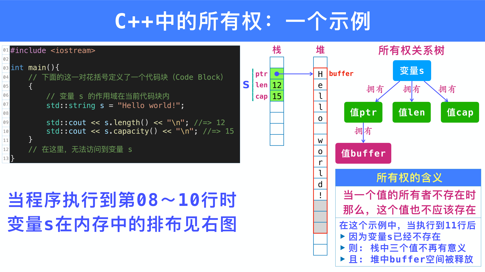
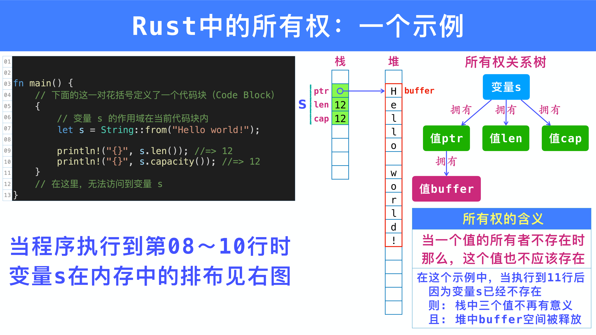
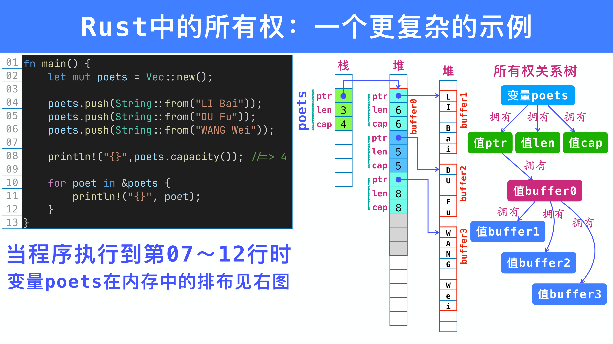
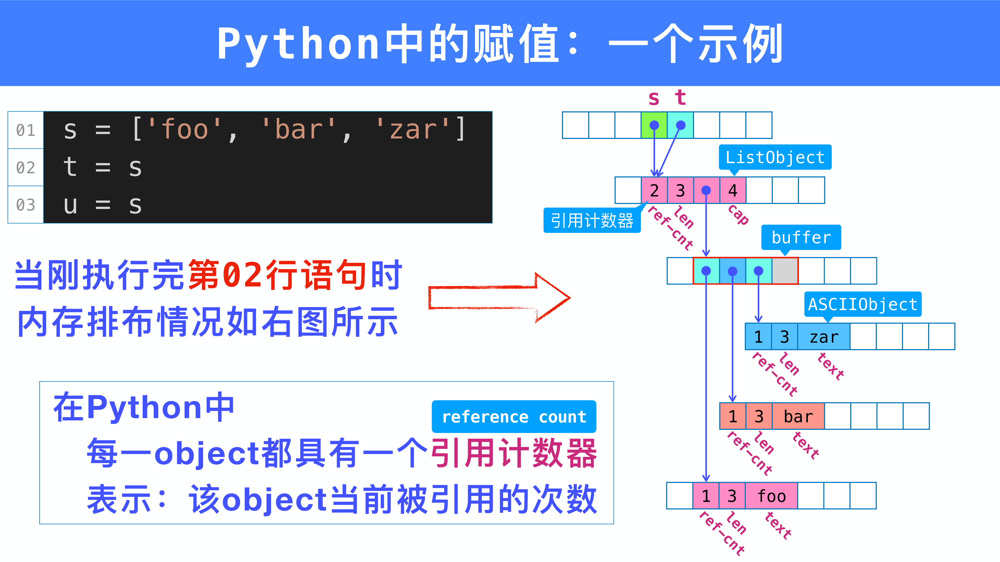
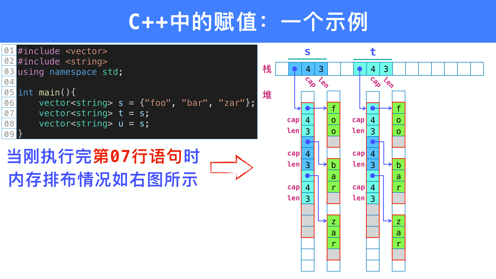
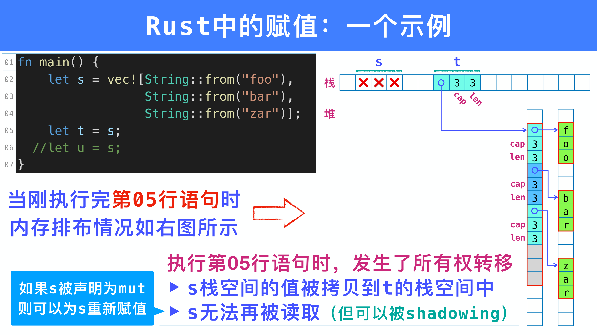
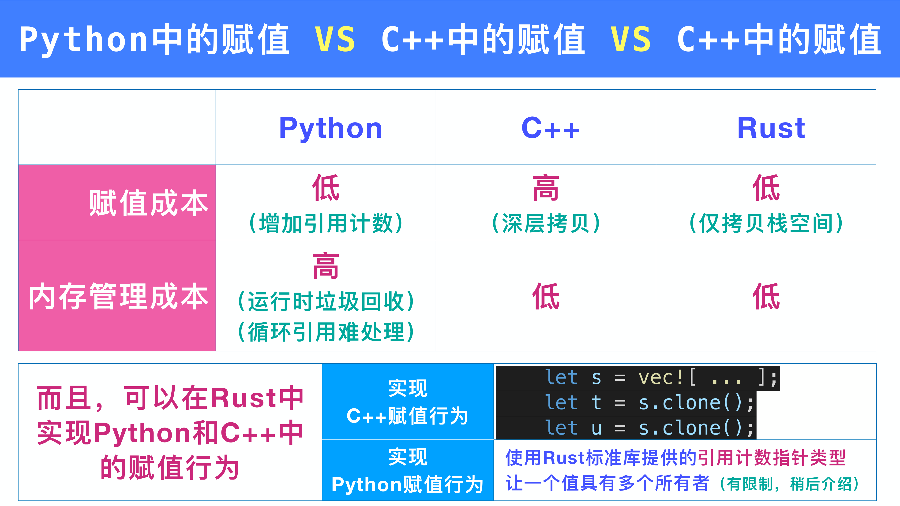
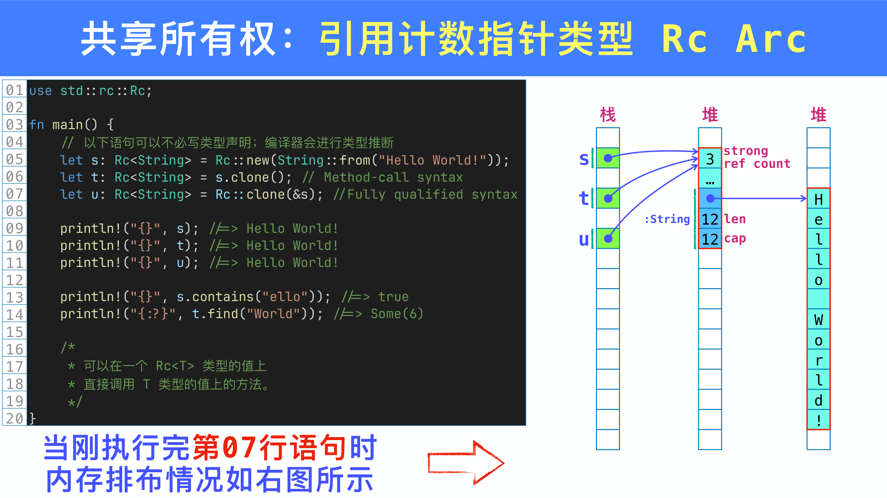
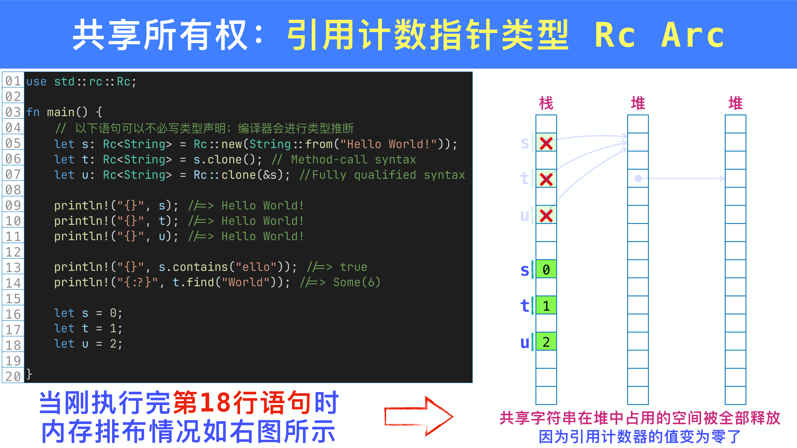

本章讨论 Rust 的 **所有权** （Ownership）系统以及 **所有权转移** （Move）机制。通过与 C++ 和 Python 的对比，理解 Rust 在赋值语义上的独特设计，以及这种设计如何在编译期保证内存安全。

---

## 目录

- 所有权基础
- 赋值语义的三种模型：Python、C++、Rust
- 所有权转移（Move）的各种场景
- 集合元素的所有权转移
- Copy 类型
- 共享所有权：Rc 与 Arc

---

## 1 所有权基础

### 1.1 C++ 的所有权与悬垂指针问题

在 C++ 中，`std::string` 类型的变量在栈上存储三个值：指针（ptr）、长度（len）、容量（cap），字符数据存储在堆上。当变量离开作用域时，其析构函数释放堆内存：

```cpp
#include <iostream>
int main(){
    {
        // 变量 s 的作用域在当前代码块内
        std::string s = "Hello world!";
        std::cout << s.length() << "\n";   //=> 12
        std::cout << s.capacity() << "\n"; //=> 15
    }
    // 在这里，无法访问到变量 s
}
```

{ width="550" }

然而，C++ 允许通过指针绕过所有权规则，制造 **悬垂指针** （dangling pointer）：

```cpp
int main(){
    std::string *ptr;
    {
        std::string s = "Hello world!";
        ptr = &s; // 把变量 s 的地址赋值给 ptr
    }
    // s 已被销毁，但 ptr 仍然指向 s 原来占用的栈/堆空间
    std::cout << *ptr << "\n"; //=> Hello world!（未定义行为）
}
```

!!! warning "C++ 的悬垂指针问题"
    C++ 中的所有权贯彻得 **不彻底** ：程序员可以通过裸指针绕过所有权规则，访问已释放的内存。把 Memory Safety 的责任完全交给程序员不是一种好的选择，因为程序员会犯错。

### 1.2 Rust 的所有权模型

Rust 的 `String` 类型内存布局与 C++ 类似——栈上存放 ptr、len、cap，堆上存放字符数据：

```rust
fn main() {
    {
        // 变量 s 的作用域在当前代码块内
        let s = String::from("Hello world!");
        println!("{}", s.len());      //=> 12
        println!("{}", s.capacity()); //=> 12
    }
    // 在这里，无法访问到变量 s
}
```

{ width="550" }

Rust 编译器会 **在编译期** 阻止悬垂指针的产生：

```rust
fn main() {
    let ptr: &String;
    {
        let s = String::from("Hello world!");
        ptr = &s; // 把 s 的引用赋给 ptr
    }
    println!("{}", ptr); // 编译错误！
}
```

```
error[E0597]: `s` does not live long enough
 --> src/main.rs:13:15
   |
13 |         ptr = &s;
   |               ^^ borrowed value does not live long enough
14 |     }
   |     - `s` dropped here while still borrowed
16 |     println!("{}", ptr);
   |                    --- borrow later used here
```

!!! tip "Rust 的编译期安全保证"
    Rust 编译器通过 **借用检查器** （borrow checker）在编译时检测所有权和生命周期违规，无需运行时开销即可防止悬垂指针、双重释放等内存安全问题。

### 1.3 复杂数据结构的所有权树

`Vec<String>` 展示了更复杂的所有权关系：`Vec` 拥有其 buffer，buffer 中的每个 `String` 拥有各自的字符缓冲区，形成一棵 **所有权树** ：

```rust
fn main() {
    let mut poets = Vec::new();
    poets.push(String::from("LI Bai"));
    poets.push(String::from("DU Fu"));
    poets.push(String::from("WANG Wei"));

    for poet in &poets {
        println!("{}", poet);
    }
}
```

{ width="550" }

### 1.4 Rust 所有权的三条规则

!!! abstract "Rust 所有权的三条规则"
    在任意时刻：

    1. 一个值具有 **唯一** 一个所有者
    2. 每一个变量，作为根节点，出现在一棵所有权关系树中
    3. 当一个变量离开当前作用域后，它所有权关系树中的所有值都无法再被访问；其中，所有存在于堆中的值，所占空间会被自动释放

### 1.5 所有权的四种放宽机制

!!! info "四种放宽机制"
    1. **所有权转移（Move）** ：一个值的所有权可以被转移给其他所有者
    2. **Copy 类型豁免** ：对于简单类型（整数、浮点数、字符等），赋值时自动按位拷贝，所有权规则不适用
    3. **引用计数指针（Rc / Arc）** ：允许一个值具有多个所有者（但有限制）
    4. **借用引用（Borrow）** ：在不改变所有权的情况下，通过引用访问一个值

---

## 2 赋值语义：Python vs C++ vs Rust

不同语言对"赋值"这一基本操作有着完全不同的语义，并不存在什么"约定俗成"。

### 2.1 Python 的赋值：共享引用

Python 中赋值只是让新变量指向同一个对象，并增加引用计数：

```python
s = ['foo', 'bar', 'zar']
t = s  # t 和 s 指向同一个 ListObject，引用计数从 1 变为 2
u = s  # 引用计数从 2 变为 3
```

{ width="550" }

Python 的赋值成本很低（仅增加引用计数），但内存管理成本高（需要运行时垃圾回收，循环引用难处理）。

### 2.2 C++ 的赋值：深拷贝

C++ 中赋值执行 **深拷贝** ——所有栈数据和堆数据都被完整复制：

```cpp
vector<string> s = {"foo", "bar", "zar"};
vector<string> t = s;  // 深拷贝：s 和 t 各自拥有独立的堆内存
vector<string> u = s;  // 再次深拷贝
```

{ width="550" }

C++ 的赋值成本很高（深层复制），但内存管理成本低（每个变量独立拥有数据，析构即释放）。

### 2.3 Rust 的赋值：Move 语义

Rust 对 non-copy 类型的赋值执行 **Move** ——只拷贝栈上的数据（ptr、len、cap），源变量变为 **无效** ：

```rust
fn main() {
    let s = vec![String::from("foo"),
                 String::from("bar"),
                 String::from("zar")];
    let t = s;      // s 的栈数据拷贝到 t，s 变为无效
    // let u = s;   // 编译错误！s 已经无效
}
```

{ width="550" }

如果在 Move 后继续使用源变量，编译器会报错：

```rust
let s = vec![String::from("foo"), String::from("bar")];
let t = s;
let u = s;  // 编译错误！
```

```
error[E0382]: use of moved value: `s`
 --> src/main.rs:6:13
  |
2 |     let s = vec![String::from("foo"),
  |         - move occurs because `s` has type `Vec<String>`,
  |           which does not implement the `Copy` trait
5 |     let t = s;
  |             - value moved here
6 |     let u = s;
  |             ^ value used here after move
```

!!! warning "Move 后源变量不可使用"
    在 Rust 中，`let t = s;` 执行后，`s` 不再有效。任何对 `s` 的后续使用都会导致编译错误（但 `s` 可以被 shadowing，也可以在声明为 `mut` 时被重新赋值）。

### 2.4 三种语言对比

{ width="550" }

|  | Python | C++ | Rust |
|---|---|---|---|
| 赋值成本 | 低（增加引用计数） | 高（深层拷贝） | 低（仅拷贝栈空间） |
| 内存管理成本 | 高（运行时 GC） | 低 | 低 |

!!! tip "在 Rust 中实现其他语言的赋值行为"
    - **C++ 风格深拷贝** ：使用 `.clone()` 方法

        ```rust
        let s = vec![String::from("foo"), String::from("bar")];
        let t = s.clone();  // 深拷贝
        let u = s.clone();  // 再次深拷贝，s 仍然有效
        ```

    - **Python 风格共享引用** ：使用 `Rc<T>`（引用计数指针），允许一个值具有多个所有者

---

## 3 所有权转移详解

### 3.1 可变变量的重新赋值

为一个 `mut` 变量重新赋值时，旧值的堆内存会被释放，然后新值替代它：

```rust
fn main() {
    let mut s = String::from("foo");
    s = String::from("bar");  // "foo" 的堆内存被释放
    println!("{}", s);         //=> bar
}
```

### 3.2 Move 发生的场景

!!! info "Move 发生的场景（对 non-copy 类型）"
    1. 把值 **赋给** 一个变量（`let t = s;`）
    2. 把值作为 **参数** 传入函数调用（`foo(s);`）
    3. 把值在函数调用中 **返回** （`return s;`）
    4. **构造** 元组、结构体等复合值

### 3.3 条件语句中的 Move

Rust 编译器采用 **保守策略** ：如果变量 **有可能** 在条件语句的某一个分支中被移走所有权，即使运行时没有经过该分支，条件语句后也不能读取该变量：

```rust
fn main() {
    let x = vec![10, 20, 30];
    let c = 10;

    if c < 0 {
        foo(x);             // x 的所有权可能被移走
    } else {
        println!("{} >= 0", c);
    }

    println!("{:?}", x);    // 编译错误！
}

fn foo(vs: Vec<i32>) {}
```

```
error[E0382]: borrow of moved value: `x`
  |
6 |         foo(x);
  |             - value moved here
...
11|     println!("{:?}", x);
  |                      ^ value borrowed here after move
```

!!! warning "编译器的保守策略"
    编译器不会分析运行时条件的真假。只要某个分支中存在 Move，编译器就认为该值在条件语句之后可能已经无效。

### 3.4 循环中的 Move

在循环中移动值意味着第一次迭代后该值就不再有效，编译器会拒绝编译：

```rust
fn main() {
    let x = vec![10, 20, 30];
    let mut len = x.len();
    while len > 0 {
        foo(x);       // 编译错误！第二次迭代时 x 已经无效
        len -= 1;
    }
}

fn foo(vs: Vec<i32>) {}
```

```
error[E0382]: use of moved value: `x`
  |
6 |         foo(x);
  |             ^ value moved here, in previous iteration of loop
```

解决方案：在循环体内为变量重新赋值：

```rust
fn main() {
    let mut x = vec![10, 20, 30];
    let mut len = x.len();
    while len > 0 {
        foo(x);
        x = vec![10, 20, 30];  // 重新赋值，x 再次有效
        len -= 1;
    }
}

fn foo(vs: Vec<i32>) {}
```

---

## 4 集合元素的所有权转移

### 4.1 不能通过索引移出元素

Rust **不允许** 通过赋值语句把数组/向量/切片中某个元素的所有权转移出来——这会在集合中留下一个未初始化的"空洞"：

```rust
fn main() {
    let mut v = Vec::new();
    for i in 1..10 {
        v.push(i.to_string());
    }
    let third = v[2];  // 编译错误！
}
```

```
error[E0507]: cannot move out of index of `Vec<String>`
  |
7 |     let third = v[2];
  |                 ^^^^
  |                 move occurs because value has type `String`,
  |                 which does not implement the `Copy` trait
  |                 help: consider borrowing here: `&v[2]`
```

!!! tip "多数情况下不必转移所有权"
    编译器建议使用 `&v[2]` 获取元素的引用，这在大多数场景下已经足够。如果确实需要转移所有权，请参考以下几种方法。

### 4.2 Vec::remove

`remove(i)` 方法删除索引 `i` 处的元素并返回它，后续元素左移填补空位。时间复杂度 $O(n)$：

```rust
let mut v = vec![String::from("abc"), String::from("def"),
                 String::from("ghi"), String::from("jkl")];

let e = v.remove(1);
println!("{:?}", v);  //=> ["abc", "ghi", "jkl"]
println!("{}", e);    //=> def
```

### 4.3 Vec::swap_remove

`swap_remove(i)` 先将索引 `i` 处的元素与末尾元素交换，再弹出末尾。时间复杂度 $O(1)$，但 **不保持顺序** ：

```rust
let mut v = vec![String::from("abc"), String::from("def"),
                 String::from("ghi"), String::from("jkl")];

let e = v.swap_remove(1);
println!("{:?}", v);  //=> ["abc", "jkl", "ghi"]
println!("{}", e);    //=> def
```

### 4.4 Vec::pop

`pop()` 弹出末尾元素，返回 `Option<T>`：

```rust
let mut v = vec![String::from("abc"), String::from("def"),
                 String::from("ghi"), String::from("jkl")];

let e = v.pop().expect("空向量！");
println!("{:?}", v);  //=> ["abc", "def", "ghi"]
println!("{}", e);    //=> jkl
```

### 4.5 std::mem::replace 与 std::mem::swap

`std::mem::replace(&mut dest, src)` 将 `src` 移入 `dest`，返回 `dest` 原来的值。适用于向量、数组、切片：

```rust
let mut v = vec![String::from("abc"), String::from("def"),
                 String::from("ghi"), String::from("jkl")];

let e = std::mem::replace(&mut v[1], String::from("dog"));
println!("{:?}", v);  //=> ["abc", "dog", "ghi", "jkl"]
println!("{}", e);    //=> def
```

`std::mem::swap(&mut a, &mut b)` 交换两个可变引用处的值，不产生任何 drop。

### 4.6 std::mem::take

`std::mem::take(&mut dest)` 用 `T` 的默认值替换 `dest`，返回原来的值。要求 `T: Default`：

```rust
let mut v = vec![String::from("abc"), String::from("def"),
                 String::from("ghi"), String::from("jkl")];

let e = std::mem::take(&mut v[1]);
println!("{:?}", v);  //=> ["abc", "", "ghi", "jkl"]
println!("{}", e);    //=> def
```

### 4.7 使用 Option\<T\> 标记元素是否存在

将元素包装在 `Option<T>` 中，用 `take()` 移出值后，原位置留下 `None`：

```rust
let mut v = vec![Some(String::from("abc")), Some(String::from("def")),
                 Some(String::from("ghi")), Some(String::from("jkl"))];

let e1 = std::mem::take(&mut v[1]);
println!("{:?}", v);
//=> [Some("abc"), None, Some("ghi"), Some("jkl")]

let e2 = std::mem::take(&mut v[2]);
println!("{:?}", v);
//=> [Some("abc"), None, None, Some("jkl")]
```

### 4.8 for 循环消耗集合

`for item in collection` 会消耗整个集合，将每个元素的所有权依次转移给循环变量：

```rust
let v = vec![String::from("abc"), String::from("def"),
             String::from("ghi")];

for mut s in v {
    s.push(';');
    println!("{}", s);  //=> abc; / def; / ghi;
}
// 这里不能再读取 v 了
```

!!! info "for 循环消耗集合"
    `for item in collection` 会 **消耗** （consume）整个集合。如果只需要借用，可以使用 `for item in &collection`（不可变借用）或 `for item in &mut collection`（可变借用）。

---

## 5 Copy 类型

### 5.1 Copy 类型列表与行为

!!! abstract "Copy 类型"
    实现了 `Copy` trait 的类型在赋值时进行 **按位拷贝** 而非移动。赋值后源变量仍然有效。

Rust 中的 Copy 类型：

| 类型 | 示例 |
|---|---|
| 所有整数类型 | `i8`, `i16`, `i32`, `i64`, `u8`, `u16`, `u32`, `u64`, `isize`, `usize` |
| 所有浮点数类型 | `f32`, `f64` |
| 字符与布尔 | `char`, `bool` |
| 元素为 Copy 的数组 | `[i32; 5]` |
| 所有元素为 Copy 的元组 | `(i32, f64, bool)` |

Copy 类型与 non-copy 类型的行为对比：

```rust
fn main() {
    let s1 = String::from("dog");
    let s2 = s1;
    // s1 无法再使用（String 不是 Copy Type，发生了 Move）

    let n1: i32 = 36;
    let n2 = n1;
    // n1 仍然有效（i32 是 Copy Type，值被复制）
    println!("{}, {}", s2, n2);
}
```

### 5.2 自定义类型实现 Copy

默认情况下，用户自定义的 `struct` **不是** Copy 类型。但如果所有字段的类型都是 Copy 类型，可以通过 `#[derive(Copy, Clone)]` 将其声明为 Copy 类型：

```rust
#[derive(Copy, Clone)]
struct Label { number: u32 }

fn print(l: Label) { println!("{}", l.number); }

let l = Label { number: 3 };
print(l);                     //=> 3
println!("{}", l.number);     //=> 3（l 仍然有效）
```

!!! warning "不能对包含非 Copy 字段的结构体实现 Copy"
    如果结构体包含 `String`、`Vec<T>` 等非 Copy 类型的字段，则无法实现 `Copy`：

    ```rust
    #[derive(Copy, Clone)]
    struct Label { number: u32, name: String }
    // 编译错误：the trait `Copy` may not be implemented for this type
    //   this field does not implement `Copy`
    ```

---

## 6 共享所有权：Rc 与 Arc

### 6.1 Rc\<T\> 引用计数

`Rc<T>`（Reference Counted）允许多个变量共享同一个值的所有权。每次 `clone()` 增加引用计数，每次 drop 减少引用计数，引用计数归零时释放值：

```rust
use std::rc::Rc;

fn main() {
    let s: Rc<String> = Rc::new(String::from("Hello World!"));
    let t: Rc<String> = s.clone();         // ref_count: 1 -> 2
    let u: Rc<String> = Rc::clone(&s);     // ref_count: 2 -> 3

    // 可以在 Rc<T> 上直接调用 T 的方法
    println!("{}", s);                      //=> Hello World!
    println!("{}", s.contains("ello"));     //=> true
    println!("{:?}", t.find("World"));      //=> Some(6)
}
```

{ width="550" }

当 `Rc` 变量被 shadowing 或离开作用域时，引用计数递减；当引用计数归零时，值及其堆内存被释放：

```rust
use std::rc::Rc;

fn main() {
    let s = Rc::new(String::from("Hello World!"));
    let t = s.clone();   // ref_count = 2
    let u = s.clone();   // ref_count = 3

    let s = 0;           // 原 s 被 shadowing，ref_count = 2
    let t = 1;           // 原 t 被 shadowing，ref_count = 1
    let u = 2;           // 原 u 被 shadowing，ref_count = 0 -> 值被释放
}
```

{ width="550" }

### 6.2 Rc 的不可变约束

!!! warning "Rc 持有的值是不可变的"
    `Rc<T>` 只提供对内部值的 **共享引用** （`&T`），不能获取可变引用：

    ```rust
    use std::rc::Rc;

    let s = Rc::new(String::from("Hello World!"));
    s.push_str(" and dog.");  // 编译错误！cannot borrow as mutable
    ```

    如果需要在共享所有权的同时修改值，可以结合 `RefCell<T>` 使用（内部可变性模式）。

### 6.3 Rc vs Arc

!!! tip "Rc 与 Arc 的选择"
    | | Rc | Arc |
    |---|---|---|
    | 线程安全 | 否（non-thread-safe） | 是（thread-safe） |
    | 性能 | 更快 | 较慢（使用原子操作） |

    **使用建议** ：始终使用 `Rc`，除非编译器告诉你需要 `Arc`。当在多线程环境下误用了 `Rc`，编译器会给出明确的错误提示。

---

## 7 总结

| 概念 | 说明 |
|---|---|
| 所有权 | 每个值有且仅有一个所有者，所有者离开作用域时值被释放 |
| Move | 赋值时转移所有权，源变量失效，开销仅为栈数据拷贝 |
| Copy | 简单类型赋值时按位复制，源变量仍有效 |
| Clone | 显式深拷贝，需要手动调用 `.clone()` |
| Rc / Arc | 引用计数实现共享所有权，Rc 单线程，Arc 多线程 |

!!! tip "Rust 所有权系统的设计哲学"
    Rust 通过所有权系统在 **编译期** 保证内存安全，无需垃圾回收器的运行时开销。Move 语义是默认行为，深拷贝（`.clone()`）和共享所有权（`Rc` / `Arc`）都需要 **显式声明** ，确保程序员清楚每一次资源操作的代价。
