这是一份面向期末考试的快速复习笔记。建议按以下顺序把握主线：先熟悉 **工具链** 与 **基础类型**，再理解 **所有权 / 引用 / 生命周期**  trio，随后掌握 **表达式、错误处理、模块组织**，最后把 **Struct、Enum、Pattern、Trait、Generic** 串成“自定义类型 + 多态”的知识闭环。

[:material-file-pdf-box: 下载 A4 速查表 PDF](cheatsheet.pdf)

## 1 初见 Rust

### 1.1 Rust 工具链

!!! abstract "Rust 工具链"
    Rust 程序设计依赖 `rustup` 管理的工具链，核心命令包括：

    - **rustup**：安装、更新、卸载工具链（`rustup update stable`、`rustup self uninstall`、`rustup doc`）
    - **cargo**：构建、运行、测试、依赖管理
    - **rustc**：Rust 编译器（通常由 cargo 自动调用）
    - **rustdoc**：根据文档注释生成文档

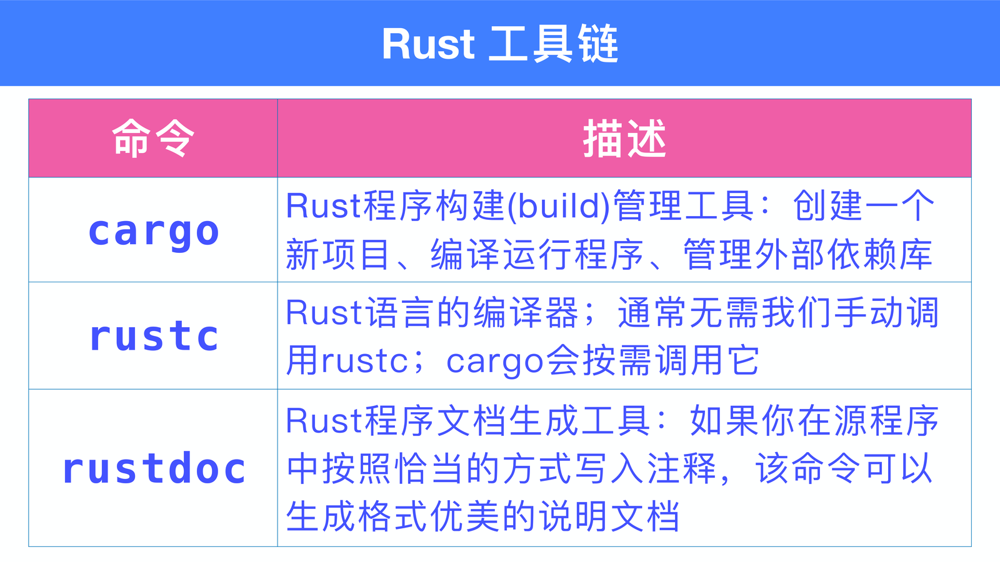{ width="800" }

### 1.2 cargo 常用命令

```rust
// 创建项目
cargo new hello           // 生成 Cargo.toml + src/main.rs
cargo run                 // 编译并运行
cargo build               // 默认 debug 编译
cargo build --release     // release 编译，启用优化
cargo check               // 只检查，不生成可执行文件
cargo test                // 运行单元测试
cargo clean               // 清除 target/
```

### 1.3 可变性与 shadowing

- 变量默认 **不可变**，需要修改时要加 `mut`。
- 即使不可变，也可以用同名变量 **shadowing**，这相当于声明了一个新变量。

```rust
fn main() {
    let x = 5;
    // x = 6;          // 错误：cannot assign twice to immutable variable
    let mut y = 5;
    y = 6;             // OK

    let x = x + 1;     // shadowing，新 x
    {
        let x = x * 2; // 内层 shadowing
        println!("{}", x); // 12
    }
    println!("{}", x);     // 6
}
```

!!! tip "记忆技巧"
    `mut` 改变的是 **同一个变量** 的值；`let x = ...`  shadowing 是 **新建变量**，因此甚至可以改变类型。

### 1.4 代码块是表达式

```rust
fn main() {
    let y = {
        let z = 7;
        z * z          // 末尾无分号：作为块值返回
    };
    println!("{}", y); // 49
}
```

!!! warning "分号决定表达式还是语句"
    代码块最后一行如果带 `;`，则变成语句，块值为单元 `()`；不带 `;` 才返回该表达式的值。

---

## 2 基础类型

### 2.1 定宽数字类型

Rust 有 14 种定宽数字类型：

| 宽度 | 无符号 | 有符号 | 浮点 |
|------|--------|--------|------|
| 8 bit  | `u8`  | `i8`  | —    |
| 16 bit | `u16` | `i16` | —    |
| 32 bit | `u32` | `i32` | `f32` |
| 64 bit | `u64` | `i64` | `f64` |
| 128 bit| `u128`| `i128`| —    |
| 指针宽度 | `usize` | `isize` | — |

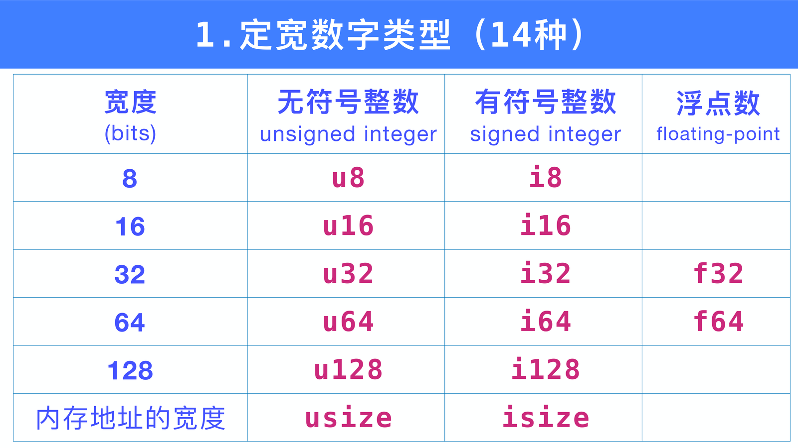{ width="800" }

### 2.2 整数编码与 `as` 转换

!!! abstract "补码表示"
    有符号整数使用 **二进制补码** 存储。`as` 转换规则：

    - 目标位数 **变短**：截断高位
    - 目标位数 **不变**：按位解释
    - 目标位数 **变长**：按源符号位扩展（无符号则补 0）

```rust
fn main() {
    assert_eq!(10_i8 as u16, 10_u16);       // 零扩展
    assert_eq!(-1_i16 as i32, -1_i32);      // 符号扩展
    assert_eq!(1000_i16 as i8, -24_i8);     // 截断
    assert_eq!(255_u8 as i8, -1_i8);        // 截断后解释
}
```

!!! warning "有符号转无符号是 reinterpret，不是报错"
    `-1_i8 as u8` 得到 `255_u8`。转换时不会 panic，溢出才会 panic（debug 模式）。

### 2.3 溢出处理

| 方法族 | 行为 |
|--------|------|
| `checked_*` | 溢出返回 `None` |
| `wrapping_*` | 按补码回绕 |
| `overflowing_*` | 返回 `(结果, 是否溢出)` |
| `saturating_*` | 钳到最值 |

```rust
assert_eq!(100_u8.checked_add(200), None);
assert_eq!(500_u16.wrapping_mul(500), 53392);
assert_eq!(255_u8.overflowing_add(2), (1, true));
assert_eq!(32760_i16.saturating_add(10), 32767);
```

### 2.4 布尔、字符、元组

- `bool`：`true` / `false`，占 1 字节；`as` 可转整数，但整数不能 `as` bool。
- `char`：4 字节 Unicode 标量值；字面值可用 `'字'`、`'\\'`、`'\n'`、`'\x41'`、`'\u{1F44D}'`。
- `tuple`：固定长度、类型可异构；用 `.0`、`.1` 访问；单元素元组必须加逗号 `(i,)`。

```rust
fn main() {
    let t: (i32, bool, f64) = (1, false, 3.14);
    println!("{}, {}", t.0, t.2);
    let one = (1,);  // 1-tuple
}
```

### 2.5 指针类型

| 类型 | 说明 | 所有权 |
|------|------|--------|
| `&T` / `&mut T` | 引用，受借用检查约束 | 无 |
| `Box<T>` | 堆上单一所有权指针 | 有 |
| `*const T` / `*mut T` | 裸指针，只能用于 `unsafe` 块 | 无 |

### 2.6 数组、向量、切片

!!! abstract "序列类型"
    - **数组** `[T; N]`：长度编译期确定，默认在栈上
    - **向量** `Vec<T>`：堆上动态数组，可增长
    - **切片** `[T]` / `&[T]`：对数组/向量的连续片段的引用（fat pointer：ptr + len）

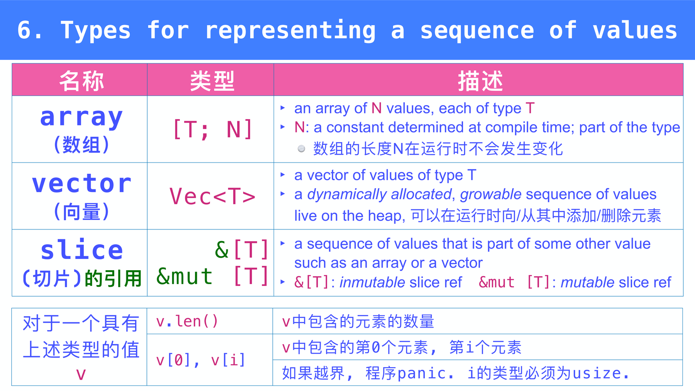{ width="800" }

```rust
fn main() {
    let a: [i32; 3] = [1, 2, 3];
    let mut v = vec![1, 2, 3];
    v.push(4);

    let s: &[i32] = &a[0..2];     // 切片
    let all: &[i32] = &v[..];     // 整个向量切片
    print_slice(all);
}

fn print_slice(s: &[i32]) {       // 同时适用于数组和向量
    for x in s { println!("{}", x); }
}
```

!!! tip "记忆技巧"
    函数参数写 `&[T]` 可以一次兼容 `Vec<T>` 和 `[T; N]`，因为 `&Vec<T>` 和 `&[T; N]` 都会自动解引用为 `&[T]`。

### 2.7 字符串类型

| 类型 | 类比 | 特点 |
|------|------|------|
| `String` | `Vec<u8>` | 可变、堆分配、拥有所有权 |
| `&str` | `&[u8]` | 字符串切片引用，不可变 |

{ width="800" }

```rust
fn main() {
    let s = String::from("hello");
    let slice: &str = &s[1..4];   // "ell"
    let literal: &str = "world";   // 字符串字面量，位于只读区

    let mut z = String::from("中文");
    z.push('字');
    println!("{} 字节, {} 字符", z.len(), z.chars().count());
}
```

!!! warning "String 不能按整数索引"
    `s[0]` 非法，因为 UTF-8 变长编码。想取子串用 `&s[range]`，范围必须是字符边界。

---

## 3 所有权与所有权转移

第三章已有专门的高质量笔记 **[所有权与所有权转移](所有权与所有权转移.md)**，这里只列出期末必须记住的结论。

### 3.1 所有权三规则

!!! abstract "所有权三规则"
    1. 任意时刻，一个值具有 **唯一** 一个所有者。
    2. 每个变量作为根节点，出现在一棵 **所有权关系树** 中。
    3. 当变量离开作用域，它所有权树中的所有值不再可访问；堆上的值自动释放。

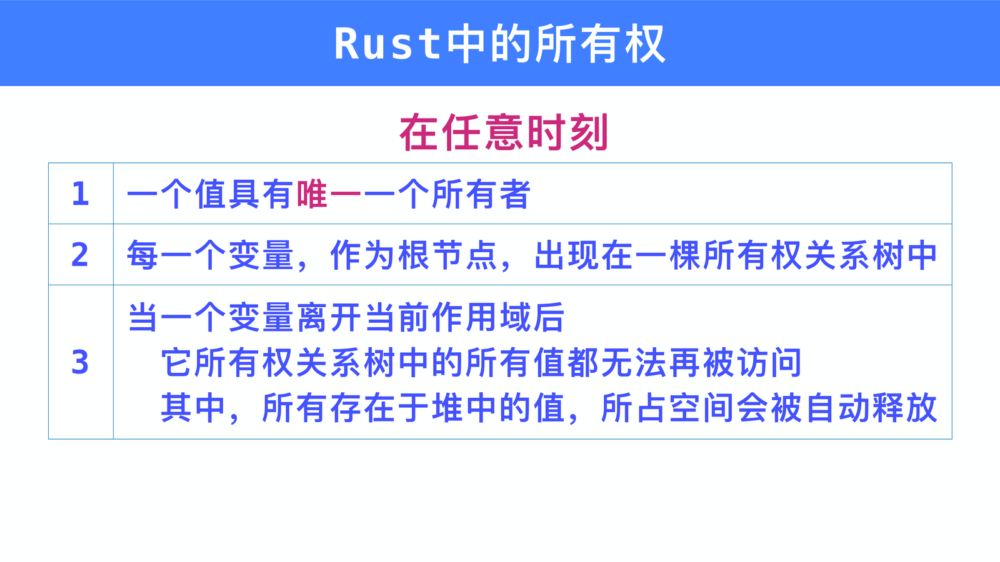{ width="800" }

### 3.2 Move 语义

- 对 non-Copy 类型，赋值、传参、返回、构造复合值时都会 **Move**。
- Move 后源变量 **失效**，除非被 shadowing 或重新赋值。
- 需要深拷贝显式调用 `.clone()`；需要共享所有权用 `Rc<T>` / `Arc<T>`。

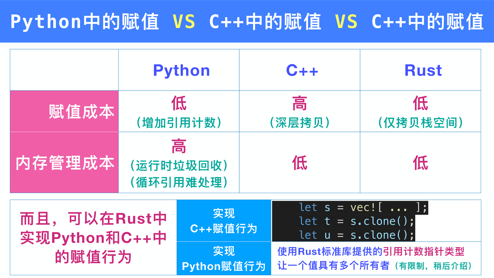{ width="800" }

| 语言 | 赋值成本 | 内存管理成本 |
|------|----------|--------------|
| Python | 低（引用计数 + 1） | 高（运行时 GC） |
| C++ | 高（深拷贝） | 低 |
| Rust | 低（仅拷贝栈数据） | 低 |

### 3.3 Copy 类型

!!! abstract "Copy 类型"
    实现 `Copy` trait 的类型在赋值时按位复制，源变量仍可用。默认 Copy 类型：

    - 所有整数、浮点、字符、布尔
    - 元素全为 Copy 的数组 `[T; N]`
    - 元素全为 Copy 的元组 `(T, U, ...)`

自定义 `struct` 需要 `#[derive(Copy, Clone)]`，且 **所有字段都必须是 Copy**。

### 3.4 Rc / Arc

- `Rc<T>`：单线程引用计数共享所有权，只读。
- `Arc<T>`：线程安全版本，开销更大。
- 需要共享且可变时用 `Rc<RefCell<T>>`（运行时借用检查）。

---

## 4 引用

### 4.1 两种引用

| 引用 | 创建 | 读/写 | 数量限制 |
|------|------|-------|----------|
| 共享引用 | `&e` | 只读 | 任意多个 |
| 可变引用 | `&mut e` | 可读可写 | 同时只能有一个 |

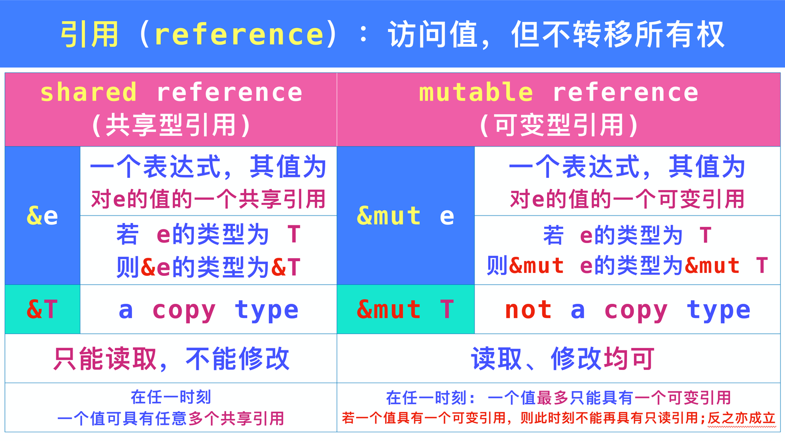{ width="800" }

!!! abstract "读写隔离规则"
    1. **共享访问是只读访问**：存在共享引用时，被引用值及其可达部分都不能被修改或 Move。
    2. **可变访问是排他访问**：存在可变引用时，连所有者也不能访问该值，直到可变引用结束。

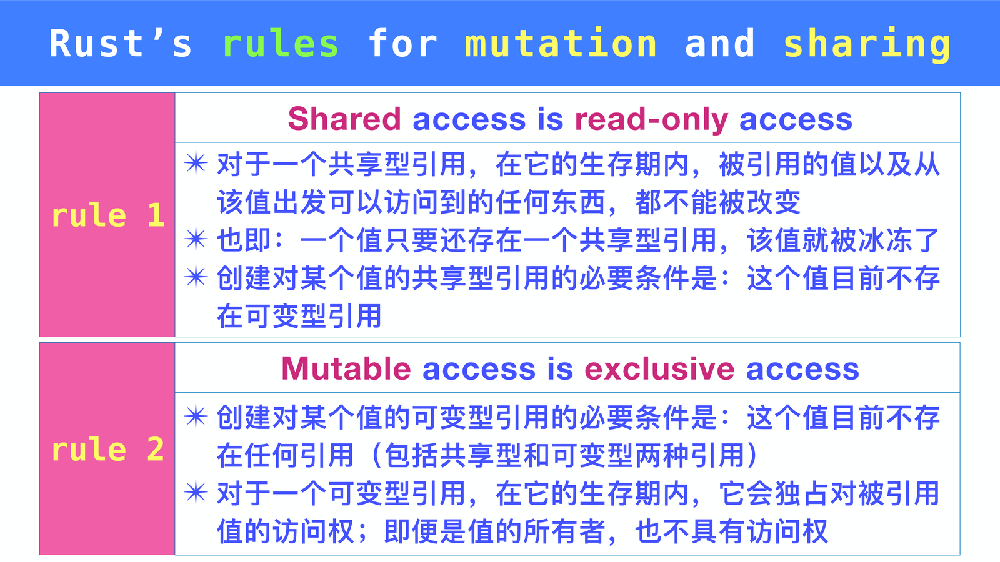{ width="800" }

```rust
fn main() {
    let mut v = vec![1, 2, 3];
    let r1 = &v;
    let r2 = &v;          // OK：多个共享引用
    println!("{} {}", r1[0], r2[0]);

    let m = &mut v;       // 共享引用使用完后才能借可变
    m.push(4);
}
```

!!! warning "不能在持有共享引用时创建可变引用"
    即使你觉得“我只是读了一下”，只要共享引用的生命周期还没结束，就不能 `&mut`。

### 4.2 生命周期

!!! abstract "Lifetime 约束"
    - 引用 `&x` 的 lifetime 不能超过 `x` 的 lifetime。
    - 若把 `&x` 赋给变量 `r`，则 `&x` 的 lifetime 至少要覆盖 `r` 的使用期。
    - 常见关系：`x >= &x >= r`。

```rust
fn smallest(v: &[i32]) -> &i32 {   // 隐式等价于 <'a>
    let mut s = &v[0];
    for r in &v[1..] {
        if r < s { s = r; }
    }
    s
}

fn main() {
    let s;
    {
        let v = [9, 4, 1];
        s = smallest(&v);          // 错误：v 活得不够长
    }
    println!("{}", s);
}
```

### 4.3 生命周期省略规则

函数签名中，编译器会自动添加 lifetime：

1. 每个引用参数分配一个独立 lifetime 参数。
2. 若只有一个输入 lifetime，返回值（若有引用）使用该 lifetime。
3. 方法中的 `&self` 或 `&mut self`：返回值引用与 `self` 同 lifetime。

```rust
fn first_third(point: &[i32; 3]) -> (&i32, &i32) {
    (&point[0], &point[2])
}
// 等价于
fn first_third<'a>(point: &'a [i32; 3]) -> (&'a i32, &'a i32) { ... }
```

### 4.4 自动解引用与重借用

```rust
fn main() {
    struct Label { name: String }
    let label = Label { name: String::from("dog") };
    let r = &label;
    println!("{}", r.name);   // 自动解引用，等价于 (*r).name

    let mut v = vec![3, 1, 2];
    v.sort();                  // 自动取 &mut v
}
```

---

## 5 表达式

Rust 是一门 **表达式语言**（expression language）。

### 5.1 表达式 vs 语句

- **表达式** 求值后产生一个值，例如 `5`、`a + b`、`if { ... } else { ... }`。
- **语句** 不返回值，例如 `let` 声明、`x = 3;`（赋值表达式加分号后成为语句）。

### 5.2 控制流也是表达式

```rust
fn main() {
    let a = 42;
    let b = if a > 0 { true } else { false };   // 两分支类型必须相同
    println!("{}", b);

    let code = 42;
    let msg = match code {
        0 => "OK",
        1 => "Wires Tangled",
        2 => "User Asleep",
        _ => "Unknown",
    };
    println!("{}", msg);
}
```

!!! warning "if/match 分支类型必须一致"
    `if a > 0 { true } else { 0 }` 会编译错误，因为 `bool` 与整数不兼容。

### 5.3 四种循环

| 循环 | 形式 | 返回值 |
|------|------|--------|
| `while` | `while cond { ... }` | `()` |
| `while let` | `while let pattern = expr { ... }` | `()` |
| `for` | `for x in iterable { ... }` | `()` |
| `loop` | `loop { ... }` | `break value;` 可返回值 |

```rust
fn main() {
    let mut n = 81;
    let sqrt = 'outer: loop {
        n += 1;
        for i in 1.. {
            let square = i * i;
            if square == n { break 'outer i; }
            if square > n { break; }
        }
    };
    println!("{}", sqrt); // 10
}
```

### 5.4 类型转换与运算符

- 显式转换用 `as`。
- 不存在 `++` / `--`，不存在链式赋值 `a = b = 3;`。
- 位运算优先级高于比较运算，`x & BIT != 0` 等价于 `(x & BIT) != 0`。

---

## 6 错误处理

### 6.1 panic 与 Result

| 错误类型 | 例子 | 原因 | 应对 |
|----------|------|------|------|
| 程序内部错误 | 数组越界、整数除零、断言失败 | 逻辑错误 | `panic!` |
| 程序外部错误 | 输入错误、网络不可达、无权限 | 不可控因素 | `Result<T, E>` |

!!! abstract "panic 行为"
    默认 `unwinding`：打印错误信息，按创建顺序的逆序 drop 局部变量，清空调用栈，线程退出（主线程则进程退出）。可用 `-C panic=abort` 关闭 unwinding。

### 6.2 Result 常用方法

```rust
enum Result<T, E> {
    Ok(T),
    Err(E),
}
```

| 方法 | 说明 |
|------|------|
| `is_ok()` / `is_err()` | 判断变体 |
| `unwrap()` | Ok 返回值，Err 触发 panic |
| `expect(msg)` | 同 `unwrap`，但 panic 时打印 msg |
| `unwrap_or(fallback)` | Err 返回默认值 |
| `unwrap_or_else(f)` | Err 调用闭包生成默认值 |
| `?` | 若 Err 直接返回给调用者 |

```rust
fn read_number(s: &str) -> Result<i32, std::num::ParseIntError> {
    let n = s.parse::<i32>()?;   // Err 时直接返回
    Ok(n * 2)
}
```

!!! warning "? 需要函数返回 Result"
    `?` 只能在返回 `Result` / `Option` 或实现了 `Try` 的函数中使用，且错误类型必须匹配。

---

## 7 Crates and Modules

### 7.1 Crate 与 Package

!!! abstract "关键概念"
    - **Package**：cargo 的概念，用于构建、测试、共享；包含一个或多个 crate。
    - **Crate root**：crate 的入口源文件；`main.rs` 表示 binary crate，`lib.rs` 表示 library crate。
    - 一个 crate 是一棵 **模块树**（module tree）。

| 文件 | 生成的 crate |
|------|--------------|
| 仅 `src/main.rs` | 一个 binary crate |
| 仅 `src/lib.rs` | 一个 library crate |
| 同时存在 | 一个 bin + 一个 lib |
| `src/bin/*.rs` | 每个文件是一个 binary crate |

### 7.2 模块树与路径

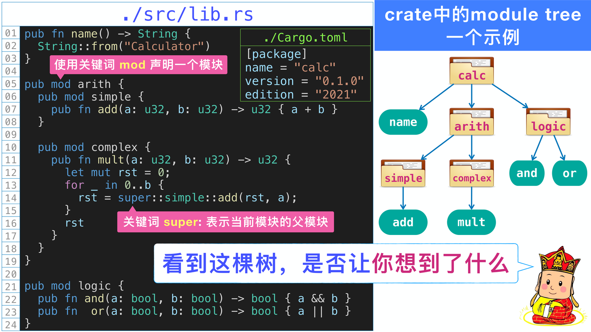{ width="800" }

```rust
pub mod arith {
    pub mod simple {
        pub fn add(a: u32, b: u32) -> u32 { a + b }
    }
}

fn demo() {
    crate::arith::simple::add(1, 2);   // 从 crate root
    self::arith::simple::add(1, 2);    // 从当前模块
    super::...;                         // 父模块
    ::arith::simple::add(1, 2);         // 外部 crate（顶层虚拟模块）
}
```

### 7.3 可见性

| 可见性 | 声明 | 可见范围 |
|--------|------|----------|
| private | 无修饰 | 当前模块及其后代 |
| `pub` | `pub fn ...` | 模块内外均可 |
| `pub(crate)` | `pub(crate) fn ...` | 当前 crate 内 |
| `pub(super)` | `pub(super) fn ...` | 父模块及其后代 |
| `pub(in path)` | `pub(in crate::a) fn ...` | 指定祖先模块及其后代 |

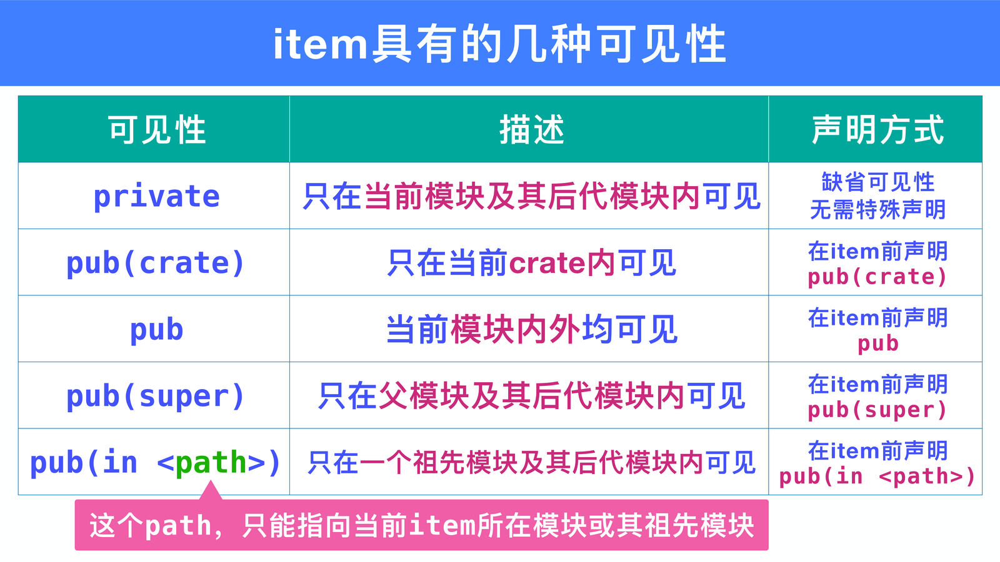{ width="800" }

### 7.4 use 与 pub use

```rust
use std::collections::{HashMap, HashSet};
use std::io::Result as IoResult;      // 重命名

pub use self::inner::add;             // re-export，把私有模块的项公开
```

!!! warning "use 引入的别名不能穿过模块壳"
    在函数或模块内 `use` 引入的别名，在 **该作用域内** 可用，但在其内部声明的 **子模块** 中不可用。

### 7.5 外部依赖与 Workspace

```toml
# 本地路径依赖
[dependencies]
calc = { path = "../calc" }

# crates.io 依赖（语义版本）
[dependencies]
image = "0.23"          # 等价于 ^0.23
```

Workspace 把多个 cargo 项目组织在一起，共享 `Cargo.lock` 与 `target`：

```toml
[workspace]
members = ["crate_1", "crate_2"]
```

---

## 8 Struct

### 8.1 三种 Struct

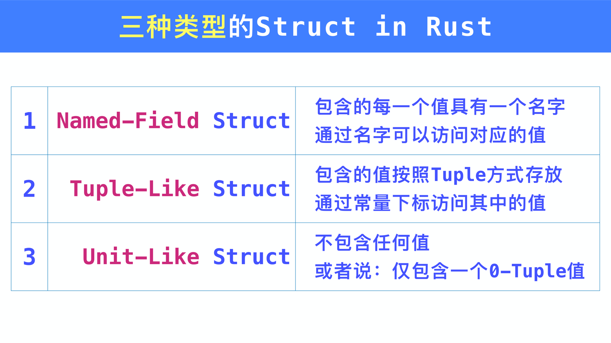{ width="800" }

| 类型 | 定义 | 使用 |
|------|------|------|
| Named-field | `struct Point { x: f64, y: f64 }` | `Point { x: 1.0, y: 2.0 }` |
| Tuple-like | `struct Bound(usize, usize);` | `Bound(1024, 768)`，访问 `.0` `.1` |
| Unit-like | `struct OneSuch;` | 只有一个值 `OneSuch` |

```rust
struct ColorImage {
    size: (usize, usize),
    pixels: Vec<u32>,
}

fn new_image(size: (usize, usize), pixels: Vec<u32>) -> ColorImage {
    ColorImage { size, pixels }   // 字段初始化简写
}
```

### 8.2 部分移动与 `..expr`

```rust
struct Demon { name: String, age: u32, addr: String }

fn main() {
    let d = Demon { name: "孙悟空".to_string(), age: 10000, addr: "花果山".to_string() };
    let name = d.name;            // 部分移动
    println!("{}", d.age);        // OK：age 仍可用
    // println!("{:?}", d);        // 错误：d 已被部分移动

    // 只能用仍拥有的剩余字段重新构造
    let d2 = Demon { name, age: d.age / 2, addr: d.addr };
    println!("{}", d2.name);
}
```

```rust
let whole = Demon { name: "a".to_string(), age: 1, addr: "b".to_string() };
let d2 = Demon { age: whole.age / 2, ..whole };   // whole 被整体消耗
```

### 8.3 方法

```rust
pub struct Queue<T> {
    older: Vec<T>,
    ynger: Vec<T>,
}

impl<T> Queue<T> {
    pub fn new() -> Self { Self { older: vec![], ynger: vec![] } }
    pub fn push(&mut self, t: T) { self.ynger.push(t); }
    pub fn is_empty(&self) -> bool { self.older.is_empty() && self.ynger.is_empty() }
}
```

!!! tip "Self 与 self"
    - `Self`（大写）表示当前类型。
    - `self` / `&self` / `&mut self` / `self: Rc<Self>` 表示方法接收者。

### 8.4 Derive

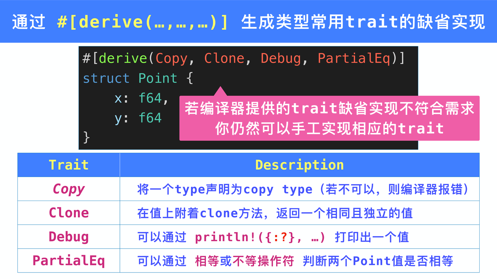{ width="800" }

```rust
#[derive(Copy, Clone, Debug, PartialEq, Eq)]
struct Point { x: f64, y: f64 }
```

| Trait | 效果 |
|-------|------|
| `Copy` / `Clone` | 复制语义 |
| `Debug` | 支持 `{:?}` 打印 |
| `PartialEq` / `Eq` | 支持 `==` / `!=` |
| `PartialOrd` / `Ord` | 支持比较排序 |
| `Default` | 提供默认值 |

### 8.5 内部可变性（简要）

- `Cell<T>`：适用于 `Copy` 类型，通过共享引用修改值（`set` / `get`）。
- `RefCell<T>`：运行时检查借用规则（`borrow` / `borrow_mut`），违规会 panic。

---

## 9 Enum

### 9.1 C-style 与带数据变体

```rust
enum Ordering { Less, Equal, Greater }              // C-style
enum Color { RGB(u8, u8, u8), Gray(u8) }            // tuple 变体
enum Message {                                     // struct 变体
    Quit,
    Move { x: i32, y: i32 },
    Write(String),
}
```

### 9.2 内存表示

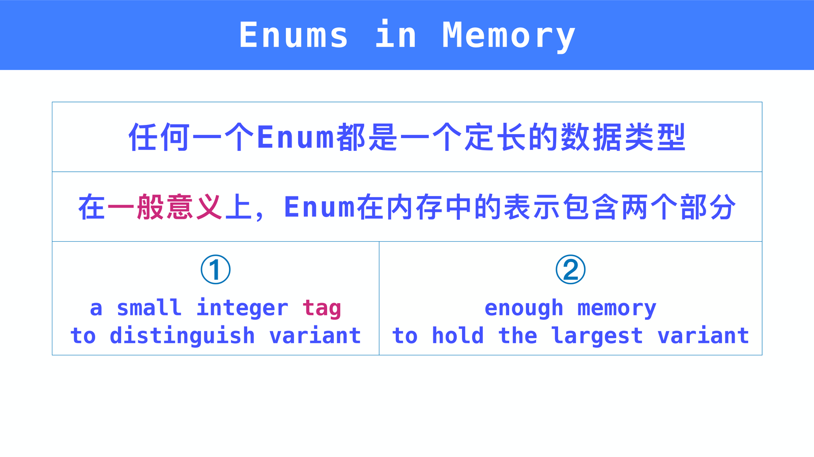{ width="800" }

!!! abstract "Enum 的内存布局"
    - 定长类型：一个整数 **tag** + 足够容纳最大变体的空间。
    - Rust 不承诺具体布局，但允许用 `#[repr(...)]` 控制。
    - 对于 `Option<T>`，若 `T` 是指针/Box/Rc，编译器会消除 tag（null pointer 优化）。

### 9.3 Option 与 Result

```rust
enum Option<T> { Some(T), None }
enum Result<T, E> { Ok(T), Err(E) }
```

| 操作 | Option | Result |
|------|--------|--------|
| 取值 | `unwrap()`、`expect()`、`unwrap_or` | 同上 |
| 传播 | `?`（函数返回 Option） | `?`（函数返回 Result） |
| 判断 | `is_some()` / `is_none()` | `is_ok()` / `is_err()` |

!!! tip "Option 的 null pointer 优化"
    `Option<Box<T>>` 与 `Box<T>` 通常占同样内存，因为 `None` 用空指针表示。这保证了与 C/C++ 指针一样的性能，却消除了空指针解引用。

---

## 10 Pattern

### 10.1 match 必须穷尽

```rust
enum TimeUnit { Second, Minute, Hour }

fn plural(unit: TimeUnit) -> &'static str {
    match unit {
        TimeUnit::Second => "seconds",
        TimeUnit::Minute => "minutes",
        TimeUnit::Hour   => "hours",
    }   // 必须覆盖所有变体
}
```

### 10.2 常见模式

| 模式 | 示例 | 说明 |
|------|------|------|
| 字面量 | `0` | 匹配具体值 |
| 变量 | `x` | 绑定整个值 |
| 通配符 | `_` | 忽略 |
| 元组 | `(a, b)` | 解构元组 |
| 结构体 | `Point { x, y }` | 解构 struct |
| 数组/切片 | `[a, b, ..]` / `[first, .., last]` | 解构序列 |
| 引用模式 | `&Point { x, y }` | 匹配引用 |
| `ref` | `ref name` | 绑定引用而非 Move |
| `ref mut` | `ref mut name` | 绑定可变引用 |
| `@` 绑定 | `value @ 1..=10` | 绑定并同时匹配 |

```rust
#[derive(Debug)]
struct Point { x: f64, y: f64 }

fn describe(point: &Point) {
    match point {
        &Point { x: 0.0, y } => println!("y axis, y={}", y),
        p @ &Point { x, y } if x == y => println!("diag {:?}", p),
        _ => {}
    }
}
```

!!! warning "Move 与 ref 的选择"
    默认模式会 Move 值。若不想转移所有权，在匹配 `Option<String>` 等时用 `ref` 或 `ref mut`。

### 10.3 if let / while let

```rust
if let Some(v) = opt { println!("{}", v); }

while let Some(top) = stack.pop() {
    println!("{}", top);
}
```

---

## 11 Trait 与泛型

### 11.1 Trait 定义与实现

```rust
trait Drawable {
    fn draw(&self);
    fn describe(&self) -> String { String::from("a drawable") }
}

struct Circle { radius: f64 }

impl Drawable for Circle {
    fn draw(&self) { println!("circle {}", self.radius); }
}
```

- Trait 可以包含 **默认实现**。
- `Self` 表示实现该 trait 的类型。
- **supertrait**：`trait Creature: Visible { ... }` 表示实现 `Creature` 必须先实现 `Visible`。

### 11.2 Trait Object 与泛型

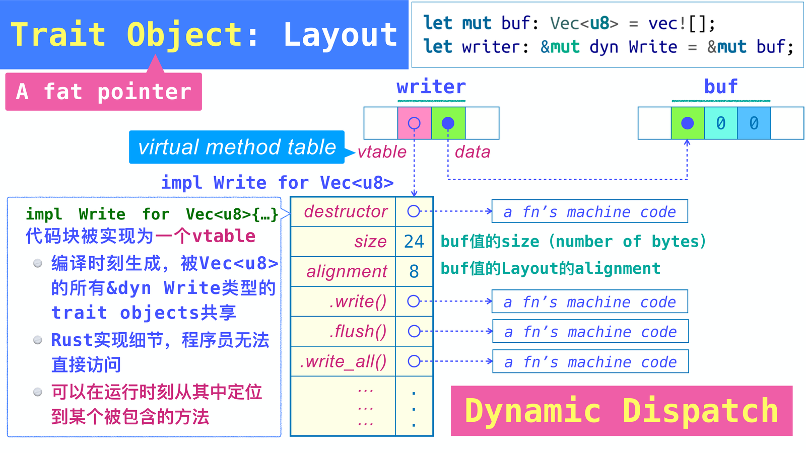{ width="800" }

!!! abstract "Trait Object"
    `&dyn Trait`、`Box<dyn Trait>` 是 **fat pointer**：一个指向数据，一个指向 vtable。通过 vtable 在运行时查找方法地址，称为 **动态分发**（dynamic dispatch）。

| | Trait Object `&dyn Trait` | 泛型 `T: Trait` |
|---|---------------------------|-----------------|
| 分发方式 | 动态分发 | 静态分发（monomorphization） |
| 灵活性 | 可在同一段代码中混用不同类型 | 编译期为每种类型生成专用代码 |
| 代码体积 | 小 | 大 |
| 运行速度 | 略慢（查表） | 快 |
| 限制 | 部分 trait 不能形成 object-safe trait object | 几乎所有 trait bound 都可以 |

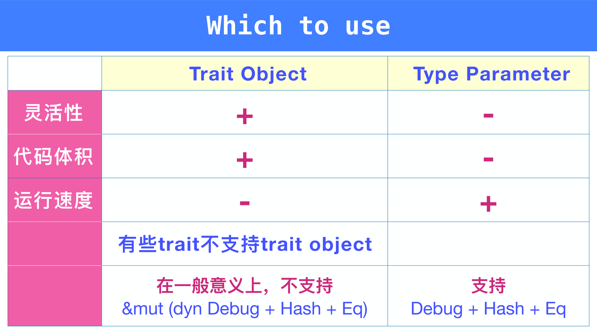{ width="800" }

### 11.3 Trait bound 与 where 子句

```rust
fn min<T: Ord>(a: T, b: T) -> T { if a < b { a } else { b } }

fn dump<I>(iter: I)
where
    I: Iterator,
    I::Item: std::fmt::Debug,
{
    for (i, v) in iter.enumerate() { println!("{}: {:?}", i, v); }
}
```

### 11.4 关联类型与关联常量

```rust
trait Iterator {
    type Item;                       // 关联类型
    fn next(&mut self) -> Option<Self::Item>;
}

// 与类型参数的区别：一个类型只能实现一次某个关联类型 trait
```

### 11.5 孤儿规则与 Object Safety

!!! abstract "孤儿规则（orphan rule）"
    在 crate C 中实现 `impl Trait for Type` 时，`Trait` 和 `Type` 至少有一个必须定义在 C 中。目的是防止不同 crate 产生冲突实现。

!!! abstract "Object Safety"
    一个 trait 能成为 `dyn Trait` 需要满足：方法不含泛型参数、方法签名不含 `Self`（除 `where Self: Sized` 的方法外）、方法不是静态方法（同样除 `where Self: Sized` 外）。带有 `where Self: Sized` 的方法在 trait object 上不可调用。

---

## 复习与考试重点

!!! abstract "复习与考试重点"
    - **所有权**：三规则、Move 后源变量失效、Copy 类型、`.clone()` / `Rc` / `Arc` 的代价。
    - **引用**：共享 &T 与可变 &mut T 的互斥；生命周期约束 `x >= &x >= r`；函数签名省略规则。
    - **基础类型**：`as` 转换的截断/扩展、`checked/wrapping/overflowing/saturating`、String 不能整数索引、`&str` 是切片。
    - **表达式**：代码块求值、if/match 分支类型一致、loop 可返回值、`for` 消耗集合需用 `&` 借用。
    - **错误处理**：`panic` 用于内部逻辑错误；`Result` + `?` 用于可恢复外部错误；`unwrap` / `expect` 会 panic。
    - **模块**：`main.rs` / `lib.rs`、路径 `crate::` / `self::` / `super::` / `::`、可见性 `pub` / `pub(crate)` / `pub(super)`。
    - **Struct / Enum**：三种 struct、部分移动、`..expr`、enum 变体与 tag + payload、`Option`/`Result`。
    - **Pattern**：match 穷尽、`ref`/`ref mut`、guard、`@` 绑定。
    - **Trait / Generic**：trait bound、`where`、trait object vs 泛型、关联类型、孤儿规则、object safety。
