## 数据格式与复杂计算单元

### 加法器设计

#### Ripple Carry 加法器

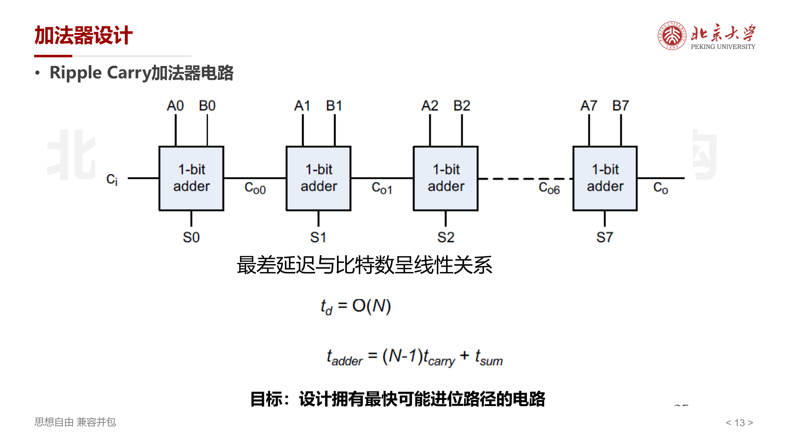{ width="800" }

将多个 1-bit 全加器串联，前一级的 $C_{out}$ 作为下一级的 $C_{in}$。

- 最差延迟与比特数呈 **线性关系** ：$t_d = O(N)$
- $t_{adder} = (N-1) \cdot t_{carry} + t_{sum}$
- 目标：设计拥有最快可能进位路径的电路

#### 基于 PGK 的加法器设计

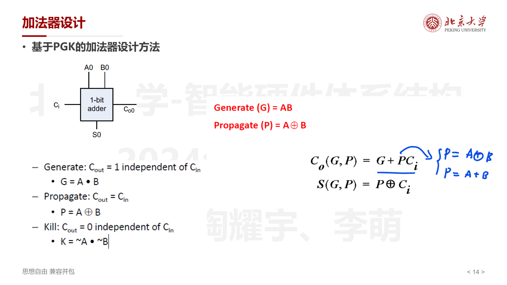{ width="800" }

Ripple Carry 加法器的瓶颈在于 **进位链** ——每一位的进位都依赖前一位的结果，必须串行等待。PGK 方法的核心思想是：**预先判断每一位会如何处理进位** ，从而打破串行依赖。

对每一位，根据输入 $A_i$ 和 $B_i$ 的值，进位行为只有三种可能：

- **Generate** （$G_i = A_i \cdot B_i$）：当 $A_i = B_i = 1$ 时，无论进位输入 $C_{in}$ 是什么，一定会 **产生** 进位 $C_{out} = 1$
- **Propagate** （$P_i = A_i \oplus B_i$）：当 $A_i \neq B_i$ 时，进位输出 **等于** 进位输入，即 $C_{out} = C_{in}$，进位被"传播"
- **Kill** （$K_i = \overline{A_i} \cdot \overline{B_i}$）：当 $A_i = B_i = 0$ 时，无论 $C_{in}$ 是什么，进位一定被 **消灭** ，$C_{out} = 0$

注意 G、P、K 三者互斥且完备（恰好覆盖所有情况），因此只需要 G 和 P 就能完全确定进位行为（$K = \overline{G} \cdot \overline{P}$）。

利用 G 和 P，进位和求和可以统一表达为：

$$
C_o(G, P) = G + P \cdot C_i, \quad S(G, P) = P \oplus C_i
$$

直观理解：要么自己产生进位（G），要么把别人的进位传过来（$P \cdot C_i$）。

#### 从单比特到多比特：组合 PG

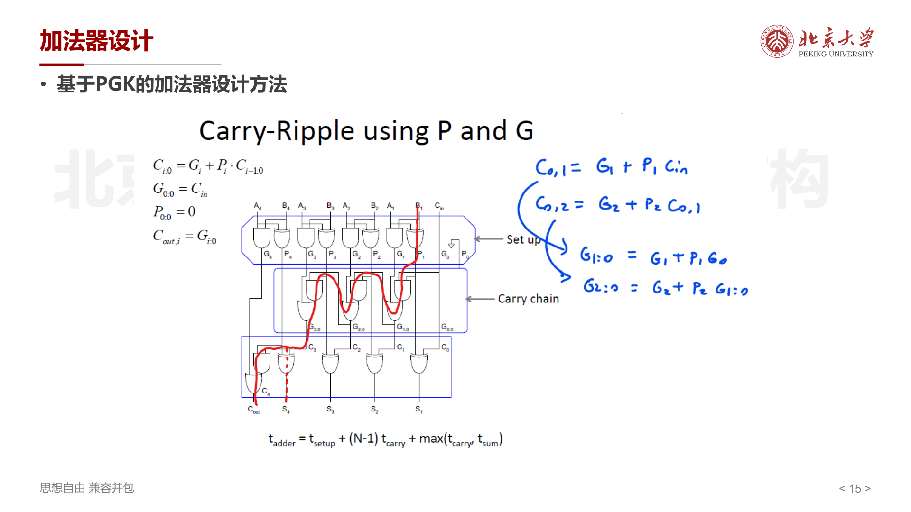{ width="800" }

单比特的 G 和 P 可以 **逐级合并** ，得到覆盖多位范围的"组合 PG"。定义 $G_{i:0}$ 表示"第 0 位到第 $i$ 位这个范围内，是否会产生进位"：

$$
C_{i:0} = G_i + P_i \cdot C_{i-1:0}
$$

展开递推可以得到：

- $G_{1:0} = G_1 + P_1 \cdot G_0$（含义：第 1 位自己产生进位，或者第 1 位传播、且第 0 位产生进位）
- $G_{2:0} = G_2 + P_2 \cdot G_{1:0}$

初始条件 $G_{0:0} = C_{in}$，$P_{0:0} = 0$。最终每一位的进位输出 $C_{out,i} = G_{i:0}$。

如果仍然逐级串行计算 $G_{i:0}$，延迟还是 $O(N)$，但关键在于：**合并操作满足结合律** ，可以用树形结构并行计算！

延迟：$t_{adder} = t_{setup} + (N-1) \cdot t_{carry} + \max(t_{carry}, t_{sum})$

#### PG 合并的三种基本单元

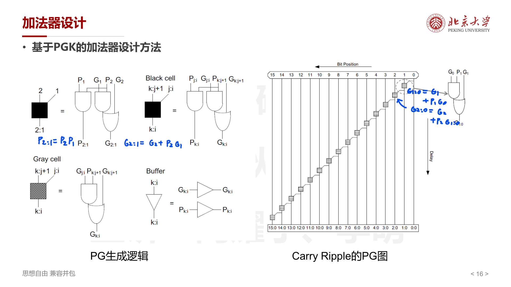{ width="800" }

为了构建树形结构，定义三种基本硬件单元：

- **Black cell** ：将两个相邻区间的 PG 合并为一个更大区间的 PG
    - 输入：左区间 $(P_{j:i}, G_{j:i})$ 和右区间 $(P_{k:j+1}, G_{k:j+1})$
    - 输出：合并区间 $(P_{k:i}, G_{k:i})$
    - 公式：$P_{k:i} = P_{k:j+1} \cdot P_{j:i}$，$G_{k:i} = G_{k:j+1} + P_{k:j+1} \cdot G_{j:i}$
    - 直观理解：大区间的 Propagate 要求每一位都 Propagate；大区间的 Generate 要么右半产生，要么右半传播且左半产生
- **Gray cell** ：只输出 $G_{k:i}$（不计算 $P_{k:i}$），用于最终进位输出的位置（因为最终只需要 $G_{i:0}$ 来得到进位，不再需要向后传播 P）
- **Buffer** ：简单转发 $G_{k:i}$ 和 $P_{k:i}$，用于对齐延迟

#### 复杂 PG 树加法器

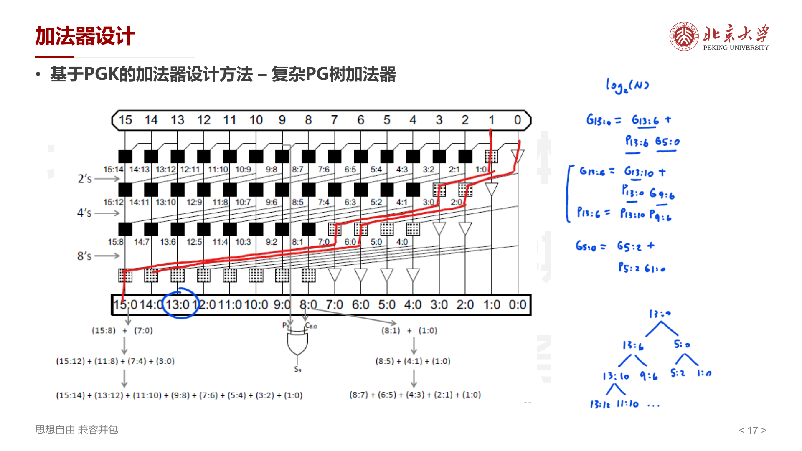{ width="800" }

有了可结合的合并操作和基本单元，就可以构建 **树形结构** 并行计算所有 $G_{i:0}$，将进位延迟从 $O(N)$ 降低到 $O(\log N)$。

以 16 位加法器为例，树的工作过程：

1. **第 1 层（2's）** ：每两个相邻位合并，得到 $G_{1:0}, G_{3:2}, G_{5:4}, \ldots$
2. **第 2 层（4's）** ：每两个 2-bit 区间合并，得到 $G_{3:0}, G_{7:4}, \ldots$
3. **第 3 层（8's）** ：合并为 8-bit 区间，得到 $G_{7:0}, G_{15:8}$
4. **第 4 层** ：最终合并得到 $G_{15:0}$

每一层只需 1 级门延迟，总共 $\log_2(16) = 4$ 层，远快于 Ripple Carry 的 15 级。

但不同的树形拓扑在 **逻辑层数、扇出（fanout）和布线复杂度** 之间存在不同的权衡：

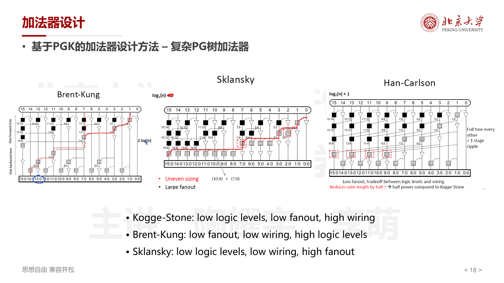{ width="800" }

| 结构 | 逻辑层数 | Fanout | 布线复杂度 | 特点 |
|---|---|---|---|---|
| **Kogge-Stone** | $\log_2(N)$ | 低 | 高 | 每一层每个位置都有 black cell，布线最密集但延迟最低 |
| **Brent-Kung** | $2\log_2(N)$ | 低 | 低 | 先向上合并（forward tree）再向下分发（backward tree），节省面积 |
| **Sklansky** | $\log_2(N)$ | 高 | 低 | 布线简单但高层的 fanout 指数增长，需要更大的驱动 |
| **Han-Carlson** | $\log_2(N)+1$ | 低 | 中 | Kogge-Stone 的隔一取一 + 1 级 ripple，布线减半，功耗约为 Kogge-Stone 一半 |

实际设计中的选择取决于具体约束：追求极致速度选 Kogge-Stone，面积受限选 Brent-Kung，需要平衡则选 Han-Carlson。

### 乘法器设计

#### 基本原理：为什么乘法比加法难

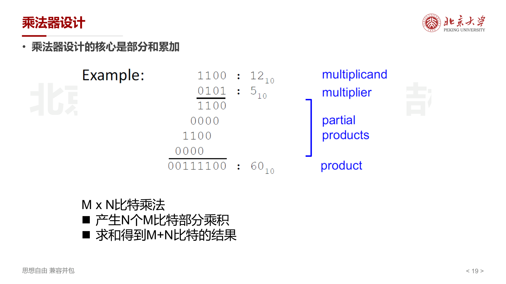{ width="800" }

回忆小学学的竖式乘法：把乘数的每一位分别与被乘数相乘，得到多个 **部分乘积（partial products）** ，再对齐相加。二进制乘法完全一样，只是每个部分乘积要么是 0（该位为 0），要么是被乘数本身左移若干位（该位为 1）。

$M \times N$ 比特乘法：

- 产生 N 个 M 比特部分乘积
- 求和得到 $M+N$ 比特的结果

$$
P = \left(\sum_{j=0}^{M-1} y_j 2^j\right) \left(\sum_{i=0}^{N-1} x_i 2^i\right) = \sum_{i=0}^{N-1} \sum_{j=0}^{M-1} x_i y_j 2^{i+j}
$$

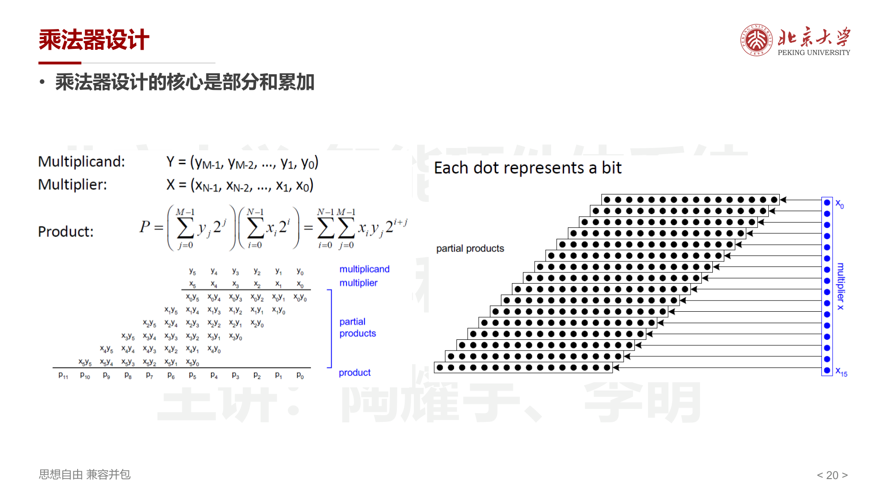{ width="800" }

上图中每个点代表一个 1-bit 乘积 $x_i \cdot y_j$（即一个 AND 门的输出）。乘法器设计的核心问题就是 **如何高效地把这些点加起来** 。

#### 阵列乘法器：最直接的实现

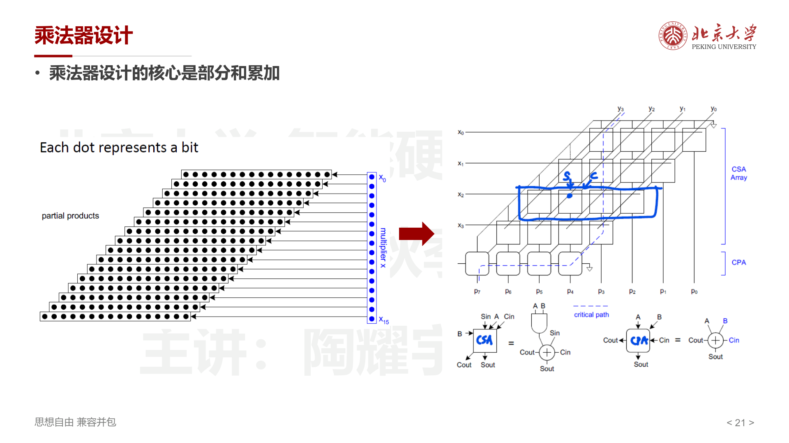{ width="800" }

最直观的做法：用一行行的加法器，从上到下逐行累加部分积。

- **CSA（Carry Save Adder）** ：每个 CSA 接收三个输入（上一行的 Sum、Carry 和新的部分积），输出两个值（新的 Sum 和 Carry），而 **不传播进位** 。这使得每一行的延迟是固定的（一个全加器的延迟），与位宽无关。
- **CPA（Carry Propagate Adder）** ：最后一级需要一个普通加法器（如 Ripple Carry 或 PG 树加法器）将最终的 Sum 和 Carry 相加，产生进位传播。

关键路径延迟 = $(N-1)$ 行 CSA 延迟 + 1 个 CPA 延迟。CSA 部分是 $O(N)$，CPA 部分取决于加法器类型。

#### 为什么要减少部分积数量

阵列乘法器的 CSA 部分延迟正比于部分积的行数 N。如果能 **减少部分积的行数** ，就能直接减少 CSA 层数，从而降低延迟。

#### Radix 编码：分组减少部分积

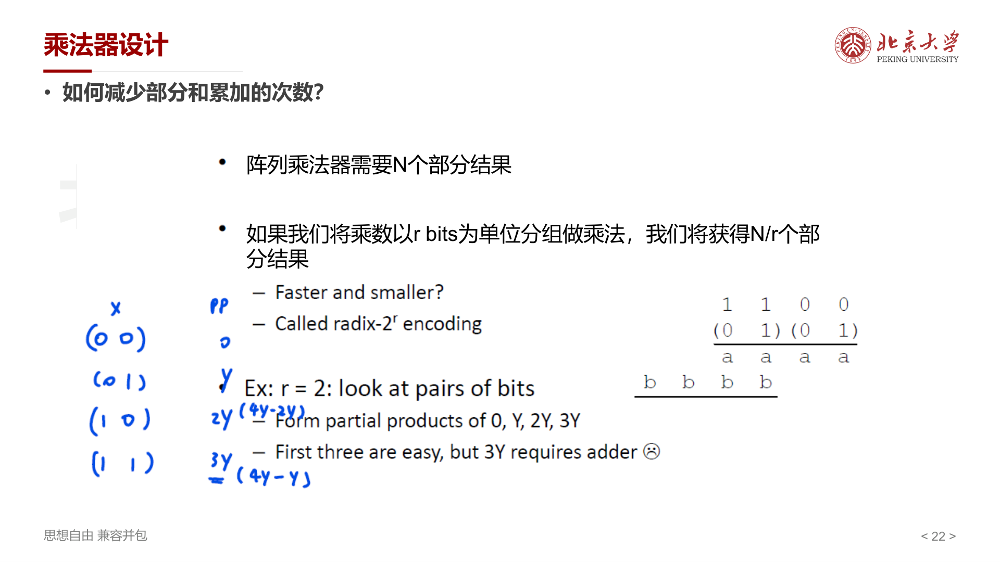{ width="800" }

核心思想：不再逐位查看乘数，而是 **每 $r$ 位一组** 。这样部分积从 N 个减少到 $N/r$ 个。

以 $r = 2$（Radix-4）为例：每次看乘数的 2 位，部分积可能是 $0, Y, 2Y, 3Y$。

- $0$：直接跳过
- $Y$：就是被乘数本身
- $2Y$：被乘数左移 1 位（硬件中只需要接线，不需要逻辑门）
- $3Y$：这是问题所在——$3Y$ 无法通过简单的移位得到，需要一个额外的加法器来算 $2Y + Y$

$3Y$ 的问题促使了布斯编码的发明。

#### 布斯编码的核心思想

布斯编码的核心洞察是：$3 = 4 - 1$，即 $3Y = 4Y - Y$。

而 $4Y$ 恰好是下一组部分积的权重（左移 2 位），可以 **向下一组"借位"** 。这样所有部分积都只需要 $0, \pm Y, \pm 2Y$，全部可以通过 **移位和取反** 实现，不需要额外的加法器！

类似地，$2Y$ 也可以表示为 $4Y - 2Y$，向下一组借位。

#### Radix-4 布斯编码推导

将补码数 $y$ 按两位一组重新分组。补码表示下：

$$
y = -2^{n-1}y_{n-1} + 2^{n-2}y_{n-2} + \cdots + 2y_1 + y_0 + y_{-1} \quad (y_{-1} = 0)
$$

通过在每两位边界处加减相同的项（配对消去），可以整理为：

$$
y = 2^{n-2}(-2y_{n-1} + y_{n-2} + y_{n-3}) + \cdots + 2(-2y_3 + y_2 + y_1) + (-2y_1 + y_0 + y_{-1})
$$

每组括号内 $(-2y_{2i+1} + y_{2i} + y_{2i-1})$ 的取值范围是 $\{-2, -1, 0, 1, 2\}$，恰好对应 $\{-2Y, -Y, 0, Y, 2Y\}$。

#### 布斯编码表

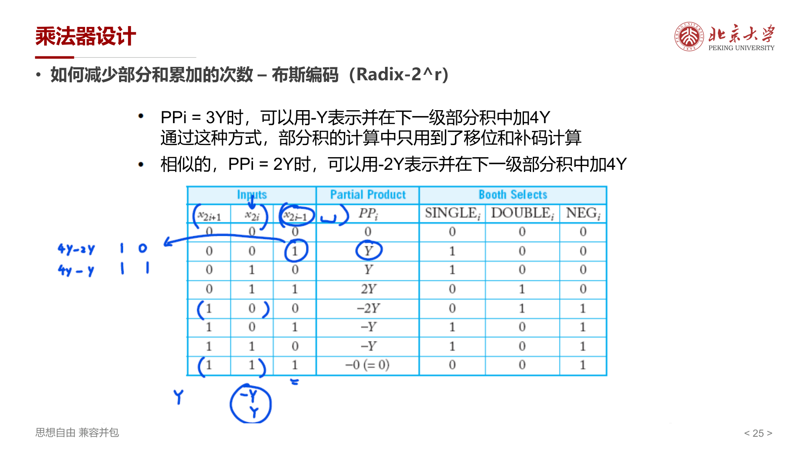{ width="800" }

查看 $(x_{2i+1}, x_{2i}, x_{2i-1})$ 三位（注意 $x_{-1} = 0$），部分积的选择和控制信号如下：

| $x_{2i+1}$ | $x_{2i}$ | $x_{2i-1}$ | 部分积 $PP_i$ | SINGLE | DOUBLE | NEG |
|---|---|---|---|---|---|---|
| 0 | 0 | 0 | 0 | 0 | 0 | 0 |
| 0 | 0 | 1 | Y | 1 | 0 | 0 |
| 0 | 1 | 0 | Y | 1 | 0 | 0 |
| 0 | 1 | 1 | 2Y | 0 | 1 | 0 |
| 1 | 0 | 0 | -2Y | 0 | 1 | 1 |
| 1 | 0 | 1 | -Y | 1 | 0 | 1 |
| 1 | 1 | 0 | -Y | 1 | 0 | 1 |
| 1 | 1 | 1 | -0 (=0) | 0 | 0 | 1 |

硬件实现只需要 3 个控制信号：

- **SINGLE** ：选择 $\pm Y$
- **DOUBLE** ：选择 $\pm 2Y$（Y 左移 1 位）
- **NEG** ：取补码（按位取反加 1）

布斯编码要求：

- 乘数、被乘数、结果均为 **补码**
- 乘法计算前在乘数末尾补零（$x_{-1} = 0$）
- 被乘数使用 **双符号位** （保证 $-2Y$ 不溢出）
- 符号位参与计算

#### 布斯编码计算实例

**例 1：** $Y \times Q = -6 \times -7$（4bit）

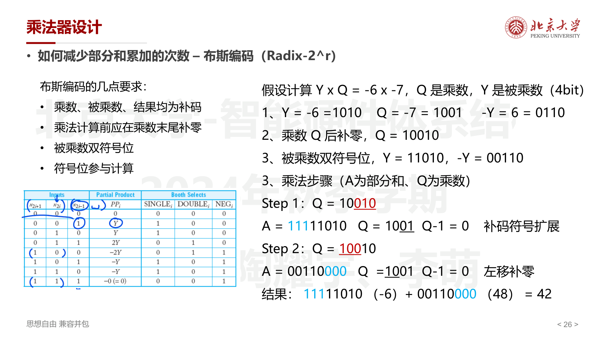{ width="800" }

1. $Y = -6 = 1010$，$Q = -7 = 1001$，$-Y = 6 = 0110$
2. 乘数 Q 后补零：$Q = 1001\underline{0}$
3. 被乘数双符号位：$Y = 111010$，$-Y = 000110$
4. 按两位分组，查表确定每组的部分积：
    - Step 1：查看 $Q$ 的 $(x_1, x_0, x_{-1}) = (0, 1, 0)$ → 部分积 = $Y = 111010$，符号扩展后 $A = 11111010$
    - Step 2：查看 $Q$ 的 $(x_3, x_2, x_1) = (1, 0, 0)$ → 部分积 = $-2Y = 000110$，左移 2 位后 $A = 00110000$
5. 结果：$11111010 + 00110000 = 00101010 = 42$

**例 2：** $Y \times Q = -6 \times 7$（6bit）

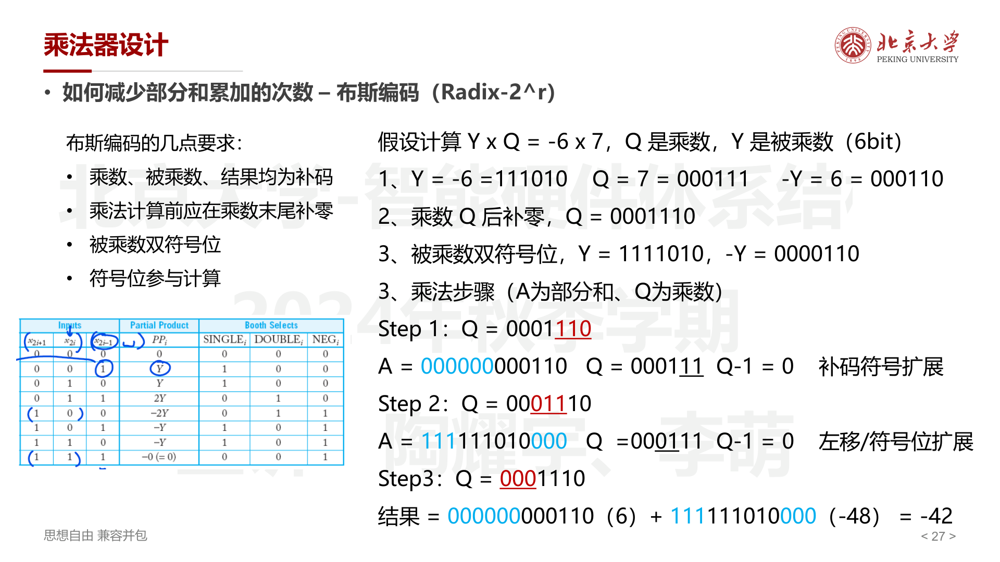{ width="800" }

1. $Y = -6 = 111010$，$Q = 7 = 000111$，$-Y = 000110$
2. 乘数后补零：$Q = 000111\underline{0}$
3. 被乘数双符号位：$Y = 1111010$，$-Y = 0000110$
4. 三组部分积：
    - Step 1：$(1, 1, 0)$ → $-Y$，$A = 000000000110$
    - Step 2：$(0, 1, 1)$ → $2Y$，左移后 $A = 111111010000$
    - Step 3：$(0, 0, 0)$ → $0$
5. 结果：$000000000110 + 111111010000 = 111111010110 = -42$

#### 乘法器设计总结

| 方法 | 部分积数量 | 乘法复杂度 | 关键优势 |
|---|---|---|---|
| 直接乘法 | N | $O(N^2)$ | 最简单 |
| 阵列乘法器 (CSA) | N | $O(N)$ 行 CSA + CPA | 规整结构，易于布局 |
| Radix-4 布斯编码 | N/2 | CSA 行数减半 | 部分积只需移位和取反 |
| Wallace Tree | N 或 N/2 | $O(\log N)$ 行 CSA | 用树形压缩代替逐行累加 |

### 位移器设计

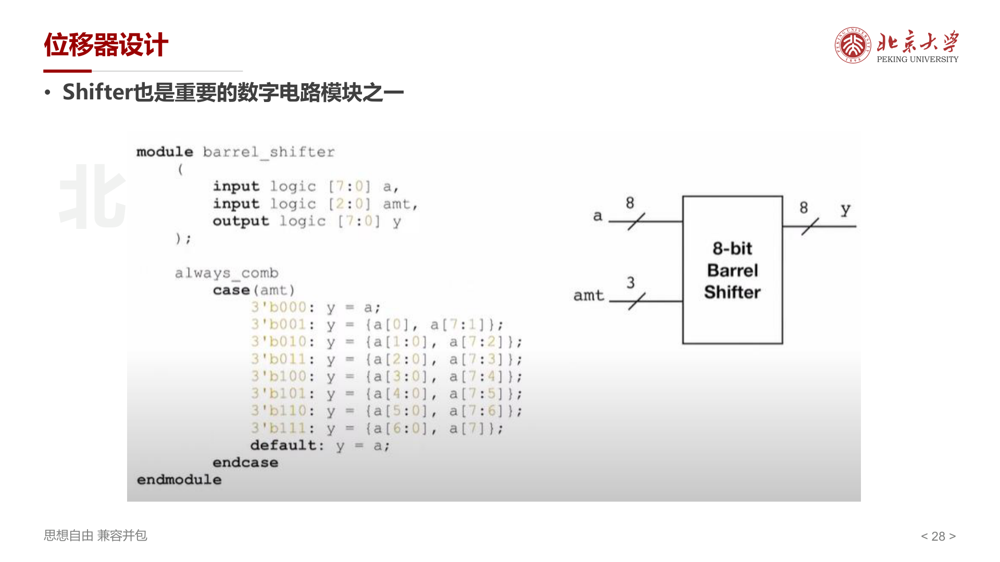{ width="800" }

Barrel Shifter 通过多路选择器实现任意位数的循环移位，用 case 语句根据移位量 `amt` 选择输出。

### 复杂模块电路设计 1：卷积加速（Winograd）

#### 卷积基础

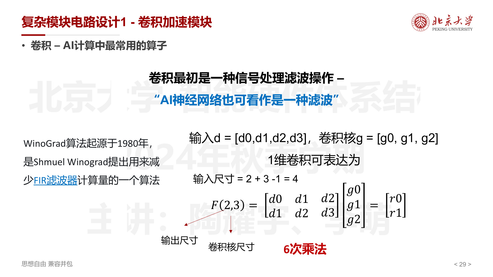{ width="800" }

在深度学习加速器中，卷积是最核心的计算模式。理解卷积的硬件实现是设计AI芯片的基础。

**一维卷积的直观理解**：

给定输入信号 $d = [d_0, d_1, d_2, d_3]$（4个元素）和卷积核 $g = [g_0, g_1, g_2]$（3个元素），我们希望在输入上滑动卷积核，计算输出。当 **步长（stride）为 1** 时：

- 位置 0：卷积核覆盖 $[d_0, d_1, d_2]$，输出 $r_0 = d_0 \cdot g_0 + d_1 \cdot g_1 + d_2 \cdot g_2$
- 位置 1：卷积核覆盖 $[d_1, d_2, d_3]$，输出 $r_1 = d_1 \cdot g_0 + d_2 \cdot g_1 + d_3 \cdot g_2$

用矩阵形式表示（记作 $F(2, 3)$，表示输出 2 个值，卷积核大小为 3）：

**为什么输入长度是 $m + r - 1$？**

在 Winograd 记号 $F(m, r)$ 中，$m$ 是要计算的输出数量，$r$ 是卷积核大小。输入信号的长度为 $m + r - 1$，这由卷积的滑动窗口机制决定：

1. **第一个输出** $r_0$ 需要覆盖输入的 $[d_0, d_1, \ldots, d_{r-1}]$，共 $r$ 个点
2. **后续每个输出** 滑动 1 位（stride = 1），与前一个窗口重叠 $r - 1$ 个点
3. **最后一个输出** $r_{m-1}$ 覆盖 $[d_{m-1}, d_m, \ldots, d_{m+r-2}]$

因此，要产生 $m$ 个输出，输入总长度为：

$$
\text{输入长度} = r + (m - 1) \times 1 = m + r - 1
$$

**图示理解**（以 $F(2, 3)$ 为例，输入长度 $2 + 3 - 1 = 4$）：

```
输入:  [d0] [d1] [d2] [d3]
        ↑___↑___↑
        | 窗口1 |  → r0
           ↑___↑___↑
           | 窗口2 |  → r1
```

- 窗口1（位置0）：覆盖 d0, d1, d2 → 产生 r0
- 窗口2（位置1）：覆盖 d1, d2, d3 → 产生 r1
- 两个窗口重叠 d1, d2（共 $r - 1 = 2$ 个点）
- 总输入点数 = 窗口大小 + (输出数 - 1) × 步长 = $3 + (2-1) \times 1 = 4$

$$
F(2,3) = \begin{bmatrix} d_0 & d_1 & d_2 \\ d_1 & d_2 & d_3 \end{bmatrix} \begin{bmatrix} g_0 \\ g_1 \\ g_2 \end{bmatrix} = \begin{bmatrix} r_0 \\ r_1 \end{bmatrix}
$$

**直接计算的代价**：

每个输出需要 3 次乘法和 2 次加法，2 个输出共需要 **6 次乘法** 和 **4 次加法** 。注意到输入矩阵中有重复元素（$d_1, d_2$ 各出现两次），这意味着我们 **重复计算** 了某些乘积。

**Winograd 的核心洞察**：

如果巧妙地重新组织计算，利用中间结果的共享，可以减少乘法次数。乘法在硬件中比加法昂贵得多（面积、功耗、延迟），因此减少乘法能显著提升效率。

#### 1D Winograd：减少乘法的原理

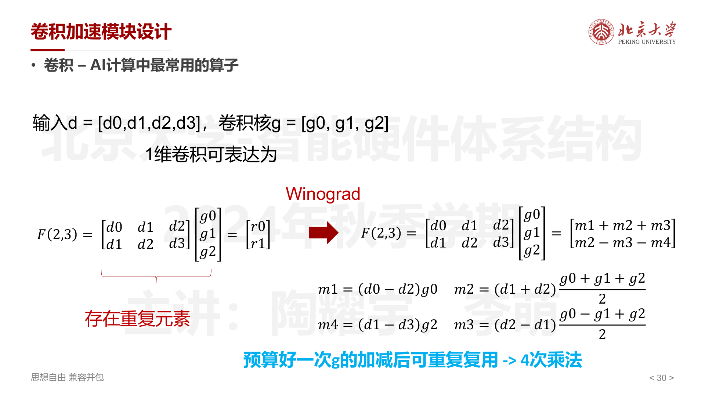{ width="800" }

对于 $F(2, 3)$ 卷积，Winograd 算法将乘法次数从 6 次降低到 **4 次** 。下面是完整的推导过程：

**目标**：计算 $r_0 = d_0 g_0 + d_1 g_1 + d_2 g_2$ 和 $r_1 = d_1 g_0 + d_2 g_1 + d_3 g_2$

**关键观察**：输入数据有重叠。我们可以通过线性变换，让某些乘法结果被两个输出共享。

定义中间变量（4次乘法）：

$$
\begin{aligned}
m_1 &= (d_0 - d_2) \cdot g_0 \\
m_2 &= (d_1 + d_2) \cdot \frac{g_0 + g_1 + g_2}{2} \\
m_3 &= (d_2 - d_1) \cdot \frac{g_0 - g_1 + g_2}{2} \\
m_4 &= (d_1 - d_3) \cdot g_2
\end{aligned}
$$

然后通过加减组合得到输出：

$$
\begin{aligned}
r_0 &= m_1 + m_2 + m_3 \\
r_1 &= m_2 - m_3 - m_4
\end{aligned}
$$

**验证正确性**（展开 $r_0$）：

$$
\begin{aligned}
r_0 &= (d_0 - d_2)g_0 + (d_1 + d_2)\frac{g_0 + g_1 + g_2}{2} + (d_2 - d_1)\frac{g_0 - g_1 + g_2}{2} \\
&= d_0 g_0 - d_2 g_0 + \frac{(d_1 + d_2)(g_0 + g_1 + g_2) + (d_2 - d_1)(g_0 - g_1 + g_2)}{2} \\
&= d_0 g_0 - d_2 g_0 + \frac{d_1 g_0 + d_1 g_1 + d_1 g_2 + d_2 g_0 + d_2 g_1 + d_2 g_2 + d_2 g_0 - d_2 g_1 + d_2 g_2 - d_1 g_0 + d_1 g_1 - d_1 g_2}{2} \\
&= d_0 g_0 - d_2 g_0 + \frac{2d_1 g_1 + 2d_2 g_0 + 2d_2 g_2}{2} \\
&= d_0 g_0 - d_2 g_0 + d_1 g_1 + d_2 g_0 + d_2 g_2 \\
&= d_0 g_0 + d_1 g_1 + d_2 g_2 \quad \checkmark
\end{aligned}
$$

$r_1$ 的验证类似。可以看到，通过精心设计的变换，我们用 **4 次乘法** 完成了原本需要 6 次乘法的工作。

#### Winograd 矩阵形式与变换矩阵

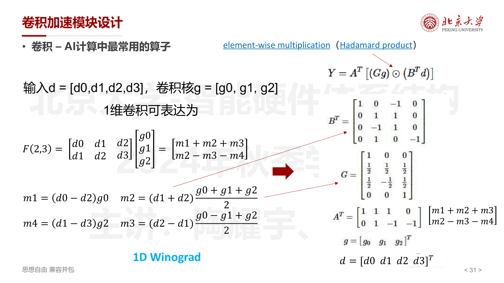{ width="800" }

为了硬件实现的统一性和可扩展性，Winograd 算法被表示为统一的矩阵形式：

$$
Y = A^T \left[ (Gg) \odot (B^T d) \right]
$$

其中：

- $d$ 是输入向量，维度 $(m + r - 1) \times 1 = 4 \times 1$
- $g$ 是卷积核向量，维度 $r \times 1 = 3 \times 1$
- $Y$ 是输出向量，维度 $m \times 1 = 2 \times 1$
- $\odot$ 表示逐元素乘法（Hadamard product）

对于 $F(2, 3)$，变换矩阵为：

**输入变换矩阵 $B^T$**（$4 \times 4$）：

$$
B^T = \begin{bmatrix} 1 & 0 & -1 & 0 \\ 0 & 1 & 1 & 0 \\ 0 & -1 & 1 & 0 \\ 0 & 1 & 0 & -1 \end{bmatrix}
$$

**卷积核变换矩阵 $G$**（$4 \times 3$）：

$$
G = \begin{bmatrix} 1 & 0 & 0 \\ \frac{1}{2} & \frac{1}{2} & \frac{1}{2} \\ \frac{1}{2} & -\frac{1}{2} & \frac{1}{2} \\ 0 & 0 & 1 \end{bmatrix}
$$

**输出变换矩阵 $A^T$**（$2 \times 4$）：

$$
A^T = \begin{bmatrix} 1 & 1 & 1 & 0 \\ 0 & 1 & -1 & -1 \end{bmatrix}
$$

**计算过程分为 4 步**：

1. **输入变换**：$d' = B^T d$

   - 维度：$4 \times 4$ 矩阵乘 $4 \times 1$ 向量 = $4 \times 1$ 向量
   - 操作：纯加法/减法，无乘法

2. **卷积核变换**：$g' = Gg$

   - 维度：$4 \times 3$ 矩阵乘 $3 \times 1$ 向量 = $4 \times 1$ 向量
   - 注意：$g$ 是固定的，$Gg$ 可以 **离线预计算** 存储在权重缓存中

3. **逐元素乘法**（核心计算）：$e = g' \odot d'$

   - $e_i = g'_i \cdot d'_i$，共 4 次乘法
   - 这是唯一需要乘法器的步骤

4. **输出变换**：$Y = A^T e$

   - 维度：$2 \times 4$ 矩阵乘 $4 \times 1$ 向量 = $2 \times 1$ 向量
   - 操作：纯加法/减法

**硬件优势分析**：

- 乘法次数：从 6 次降到 4 次，减少 **33%**
- 卷积核变换 $Gg$ 可预计算，运行时只需查表
- 输入变换 $B^T d$ 只有加减法，可用简单逻辑实现
- 对于更大的卷积核，收益更显著（如 $F(4, 3)$ 乘法减少 50%）

#### Winograd 复杂度分析

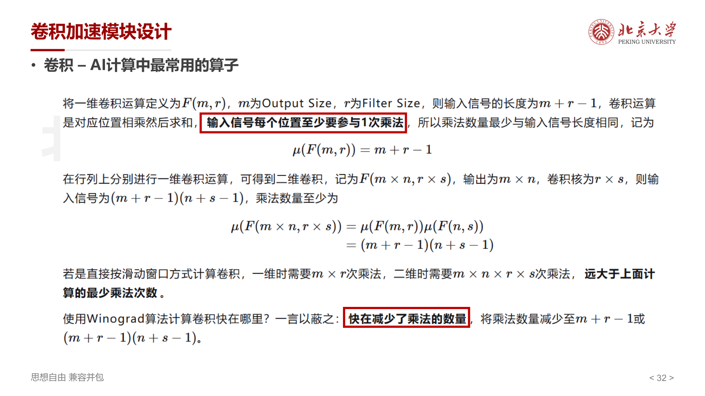{ width="800" }

**理论下界**：对于一维卷积 $F(m, r)$（输出 $m$ 个点，卷积核大小 $r$），最少需要的乘法次数为：

$$
\mu(F(m, r)) = m + r - 1
$$

Winograd 算法达到了这个理论下界，因此是 **最优的** 。

**对比**：

| 算法 | 乘法次数 | 加法次数 |
|------|---------|---------|
| 直接计算 | $m \times r$ | $m \times (r-1)$ |
| Winograd | $m + r - 1$ | 更多（变换引入） |

以 $F(4, 3)$ 为例：

- 直接计算：$4 \times 3 = 12$ 次乘法
- Winograd：$4 + 3 - 1 = 6$ 次乘法，减少 **50%**

**二维扩展**：

二维卷积 $F(m \times n, r \times s)$（输出 $m \times n$ 的二维块，卷积核 $r \times s$）：

$$
\mu = (m + r - 1)(n + s - 1)
$$

以常见的 3×3 卷积核为例：

- $F(4 \times 4, 3 \times 3)$：$(4+3-1)(4+3-1) = 6 \times 6 = 36$ 次乘法
- 直接计算：$4 \times 4 \times 3 \times 3 = 144$ 次乘法
- 减少 **75%** 的乘法！

#### 2D Winograd：嵌套的一维算法

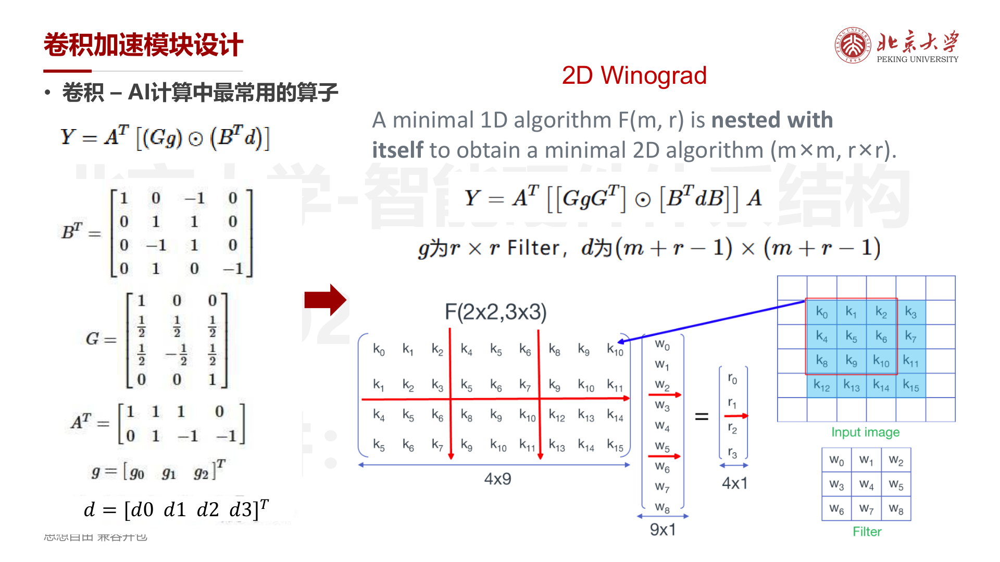{ width="800" }

2D Winograd 通过 **嵌套** 1D 算法实现。对于图像卷积，我们先在行方向应用 1D Winograd，再在列方向应用。

**矩阵形式**：

$$
Y = A^T \left[ [GgG^T] \odot [B^T dB] \right] A
$$

其中：

- $d$ 是输入 tile，维度 $(m+r-1) \times (n+s-1) = 6 \times 6$（对于 $F(4\times4, 3\times3)$）
- $g$ 是卷积核，维度 $r \times s = 3 \times 3$
- $Y$ 是输出 tile，维度 $m \times n = 4 \times 4$

**计算步骤详细拆解**：

1. **输入变换**（$B^T d B$）：
   - 先对 $d$ 的每一行左乘 $B^T$：得到中间结果 $d_{\text{row}} = B^T d$
   - 再对中间结果的每一列右乘 $B$：$d' = d_{\text{row}} B = B^T d B$
   - 结果维度：$(m+r-1) \times (n+s-1) = 6 \times 6$

2. **卷积核变换**（$G g G^T$）：
   - 类似地，$g' = G g G^T$
   - 维度：$(m+r-1) \times (n+s-1) = 6 \times 6$
   - **关键**：可完全预计算

3. **逐元素乘法**（核心）：
   - $e = g' \odot d'$
   - $6 \times 6 = 36$ 次乘法
   - 每个元素相互独立，可 **完全并行**

4. **输出变换**（$A^T e A$）：
   - 先对 $e$ 的每一行左乘 $A^T$：$e_{\text{row}} = A^T e$
   - 再对中间结果的每一列右乘 $A$：$Y = e_{\text{row}} A = A^T e A$
   - 结果维度：$m \times n = 4 \times 4$

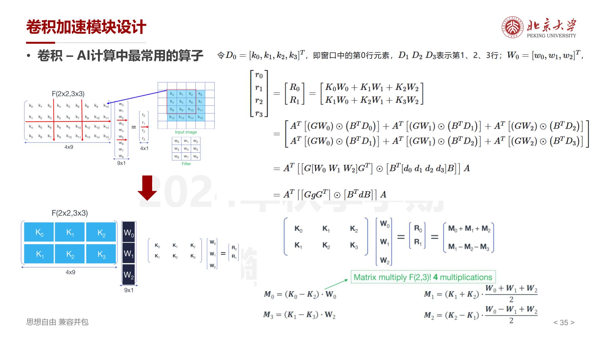{ width="800" }

**实际硬件数据流**：

在典型的深度学习加速器（如 NVDLA）中，2D Winograd 的执行流程如下：

```
输入特征图 → [Tile 分割] → [输入变换单元] → [逐元素乘阵列] → [输出变换单元] → 输出特征图
                    ↓                                      ↑
              权重缓存 (存储预计算的 GgG^T) ------------------┘
```

- **Tile 分割**：将输入特征图切分成 $(m+r-1) \times (n+s-1)$ 的 overlapping tiles
- **输入变换单元**：专用硬件计算 $B^T d B$，只有加减法
- **逐元素乘阵列**：大规模的并行乘法器阵列（MAC 阵列），这是计算密度的核心
- **输出变换单元**：计算 $A^T e A$，同样只有加减法

#### NVDLA 中的 Winograd 实现

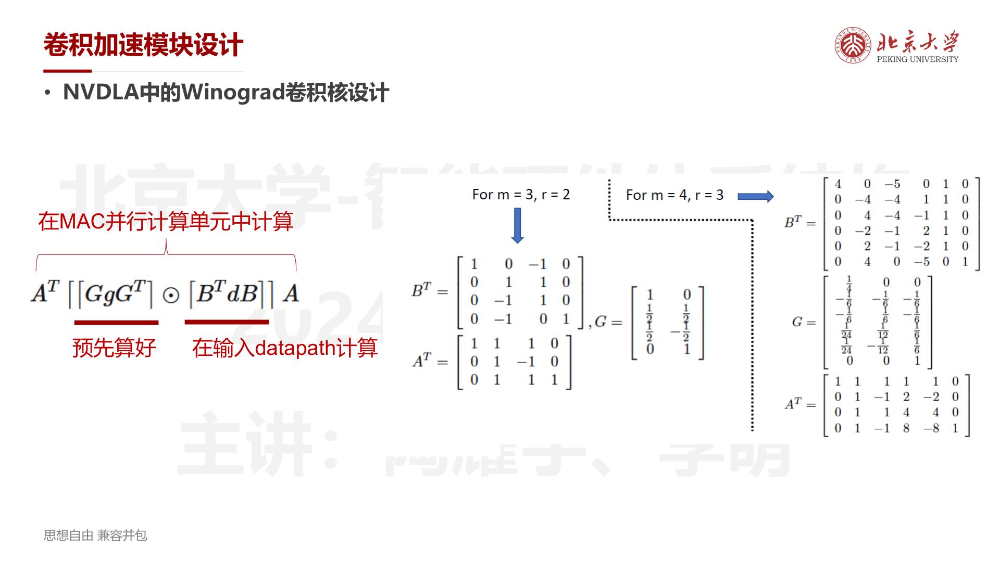{ width="800" }

NVIDIA Deep Learning Accelerator (NVDLA) 是一个开源的深度学习推理加速器架构，它支持 Winograd 卷积加速。

**NVDLA 的 Winograd 数据流**：

1. **权重离线处理**：
   - 训练好的 3×3 卷积核 $g$ 在编译时通过 $GgG^T$ 变换
   - 变换后的权重存储在片外存储器（DDR）中
   - 运行时加载到片内权重缓存

2. **输入数据流**：
   - 从特征图加载 $(m+r-1) \times (n+s-1) = 6 \times 6$ 的 tile
   - 在输入 datapath 中实时计算 $B^T d B$
   - 使用专用加法器网络，延迟小

3. **核心计算**：
   - 变换后的输入和权重送入 **MAC 并行计算单元**
   - 通常是大规模的脉动阵列（Systolic Array）或并行乘法器组
   - 每个周期完成 $(m+r-1)(n+s-1) = 36$ 个元素的逐元素乘

4. **结果聚合**：
   - 逐元素乘结果通过 $A^T [\cdot] A$ 变换得到最终输出
   - 写回输出特征图

**Winograd 的局限与适用场景**：

Winograd 算法并非总是最优选择，需权衡以下因素：

| 因素 | Winograd 优势 | Winograd 劣势 |
|------|--------------|--------------|
| 卷积核大小 | 小卷积核（3×3）收益大 | 大卷积核变换矩阵过大 |
| 步长（Stride） | Stride=1 完美匹配 | Stride>1 需额外处理 |
| 填充（Padding） | 边界 tile 需特殊处理 | 增加控制复杂度 |
| 精度要求 | 乘法减少降低累积误差 | 变换引入额外舍入误差 |
| 硬件面积 | MAC 阵列面积减小 | 需额外的变换单元 |

**实际部署建议**：

- 对于 ResNet、VGG 等以 3×3 卷积为主的网络，Winograd 通常能带来 **2~4 倍** 的加速
- 第一/最后一层通常用直接卷积（特征图尺寸特殊）
- 1×1 卷积直接用矩阵乘法更高效
- 需通过软件栈自动选择最优算法

### 复杂模块电路设计 2：CORDIC

CORDIC（Coordinate Rotation Digital Computer）可以用来实现多种复杂非线性函数（sin、cos、arctan 等）。

#### 旋转原理

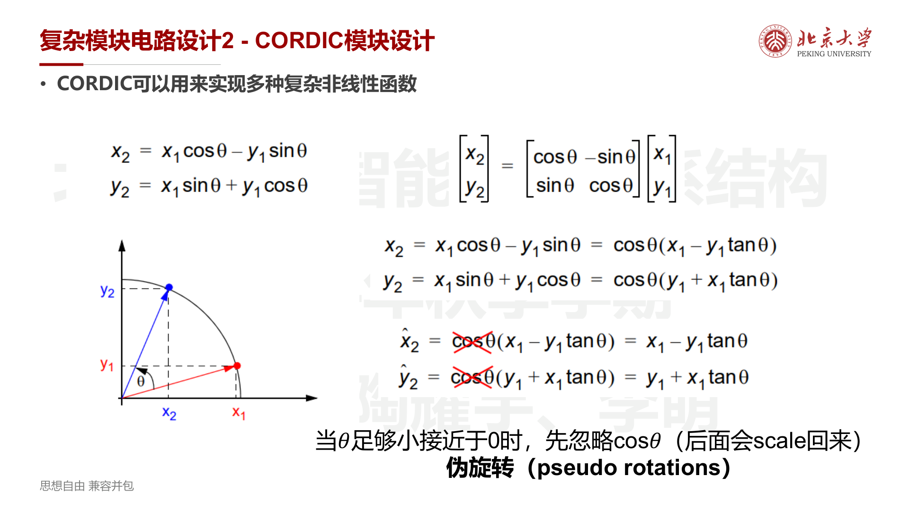{ width="800" }

二维坐标旋转：

$$
x_2 = x_1 \cos\theta - y_1 \sin\theta = \cos\theta(x_1 - y_1 \tan\theta)
$$

$$
y_2 = x_1 \sin\theta + y_1 \cos\theta = \cos\theta(y_1 + x_1 \tan\theta)
$$

#### 伪旋转

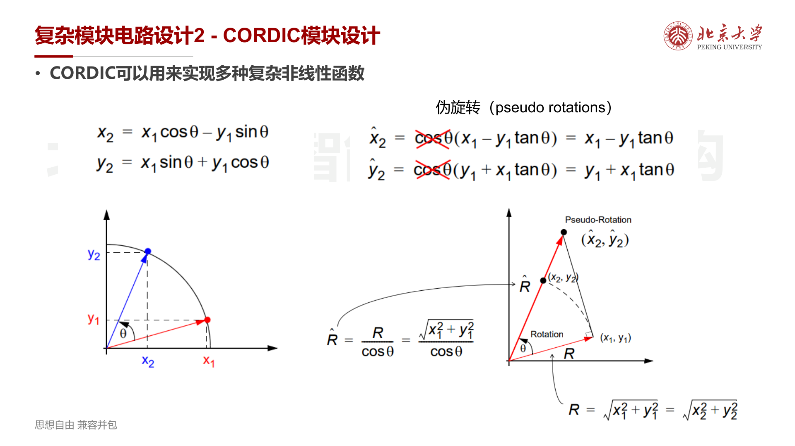{ width="800" }

当 $\theta$ 足够小时，忽略 $\cos\theta$ 因子（后面通过 Scaling Factor 补偿）：

$$
\hat{x}_2 = x_1 - y_1 \tan\theta, \quad \hat{y}_2 = y_1 + x_1 \tan\theta
$$

伪旋转的半径 $\hat{R} = R / \cos\theta$ 会被放大。

#### 选择旋转角度

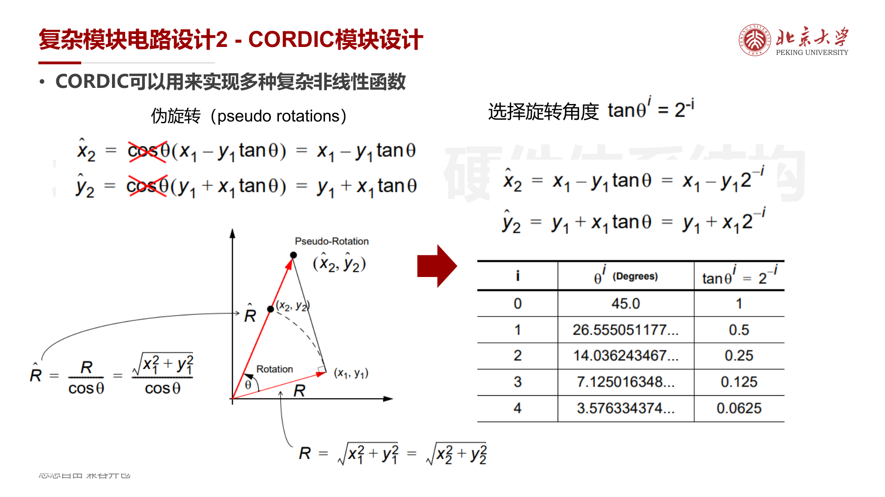{ width="800" }

选择 $\tan\theta^{(i)} = 2^{-i}$，使得乘法变为 **移位操作** ：

$$
\hat{x}_2 = x_1 - y_1 \cdot 2^{-i}, \quad \hat{y}_2 = y_1 + x_1 \cdot 2^{-i}
$$

| i | $\theta^{(i)}$ (度) | $\tan\theta^{(i)} = 2^{-i}$ |
|---|---|---|
| 0 | 45.0 | 1 |
| 1 | 26.565 | 0.5 |
| 2 | 14.036 | 0.25 |
| 3 | 7.125 | 0.125 |
| 4 | 3.576 | 0.0625 |

#### CORDIC 迭代

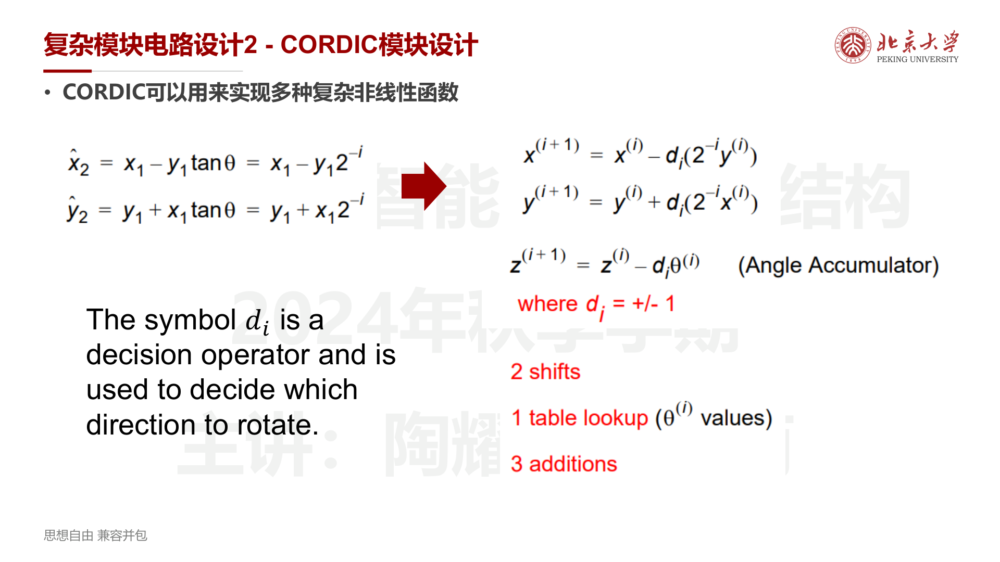{ width="800" }

每次迭代的公式：

$$
x^{(i+1)} = x^{(i)} - d_i (2^{-i} y^{(i)})
$$

$$
y^{(i+1)} = y^{(i)} + d_i (2^{-i} x^{(i)})
$$

$$
z^{(i+1)} = z^{(i)} - d_i \theta^{(i)} \quad \text{(Angle Accumulator)}
$$

其中 $d_i = \pm 1$ 为方向决策算子。每次迭代仅需：**2 次移位 + 1 次查表 + 3 次加法** 。

#### Scaling Factor

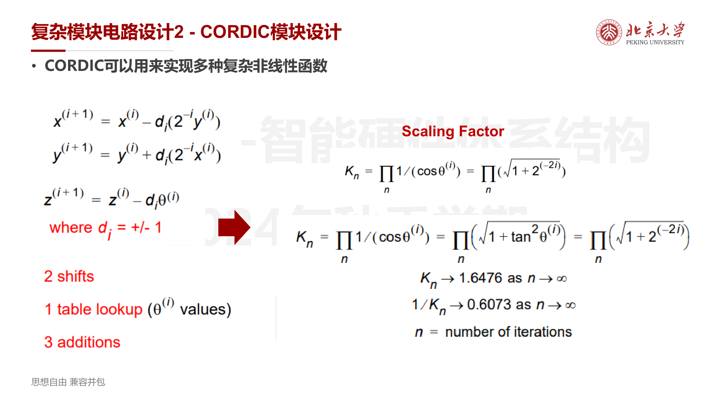{ width="800" }

由于忽略了 $\cos\theta$，最终需要乘以缩放因子：

$$
K_n = \prod_n \frac{1}{\cos\theta^{(i)}} = \prod_n \sqrt{1 + 2^{-2i}}
$$

当 $n \to \infty$ 时，$K_n \to 1.6476$，$1/K_n \to 0.6073$。

#### CORDIC 硬件架构

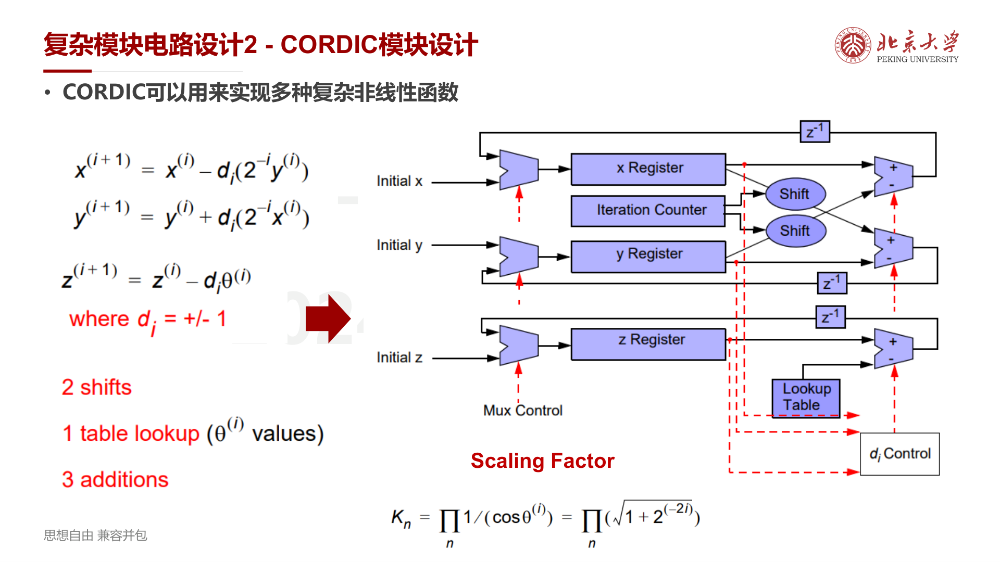{ width="800" }

硬件包含三个寄存器（x、y、z），每次迭代通过移位器和加减法器更新，角度通过查找表（Lookup Table）获取，$d_i$ 控制加/减方向。

## 控制单元设计与时序分析

### 状态机（FSM）

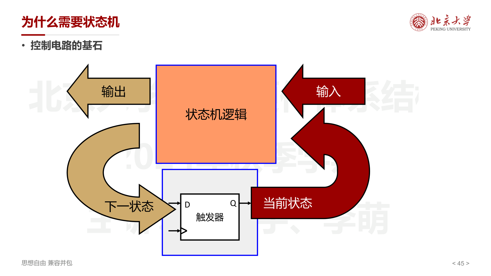{ width="800" }

状态机是控制电路的基石，由三部分组成：

- **状态机逻辑** ：根据当前状态和输入，计算输出和下一状态
- **触发器** ：存储当前状态（D 触发器）
- 输入 / 输出接口

#### 状态机设计实例：红绿灯

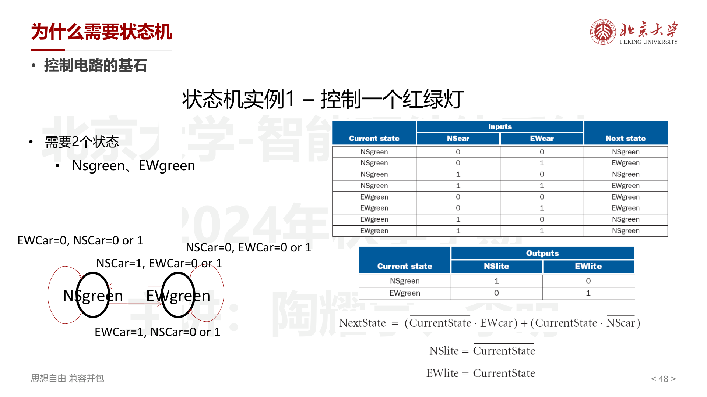{ width="800" }

2 个状态（NSgreen、EWgreen），2 个输入（NScar、EWcar），2 个输出（NSlite、EWlite）。

逻辑表达式：

$$
\text{NextState} = (\overline{\text{CurrentState}} \cdot \text{EWcar}) + (\text{CurrentState} \cdot \overline{\text{NScar}})
$$

$$
\text{NSlite} = \overline{\text{CurrentState}}, \quad \text{EWlite} = \text{CurrentState}
$$

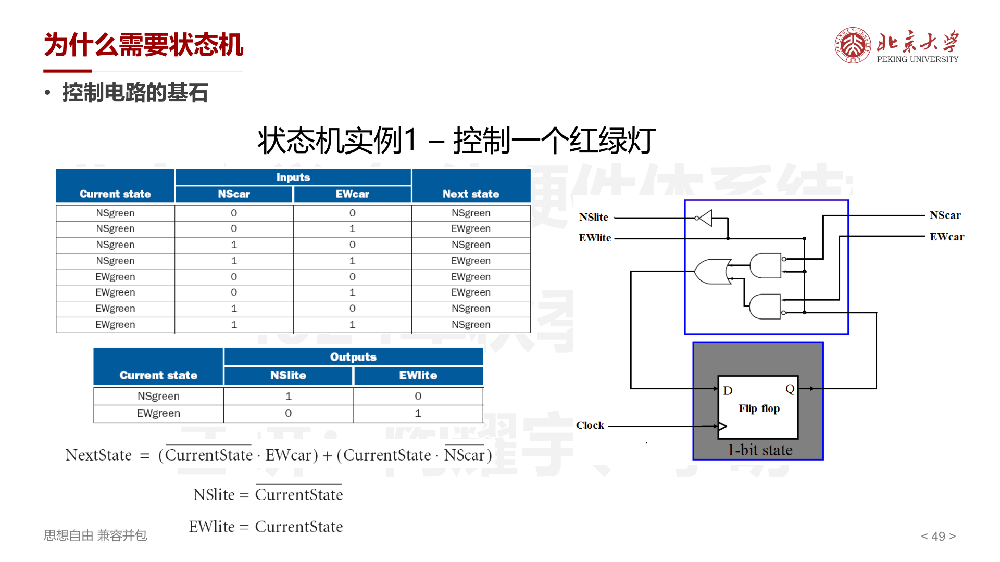{ width="800" }

#### 状态机设计步骤

1. 定义状态并画出状态转换图
2. 给每一个状态赋值并更新状态转换图
3. 根据状态转换图写出下一状态和输出的逻辑表达式
4. 画出实际电路图

状态在每一个 **时钟上升沿** 更新。

### 电路时序

#### 为什么需要时钟

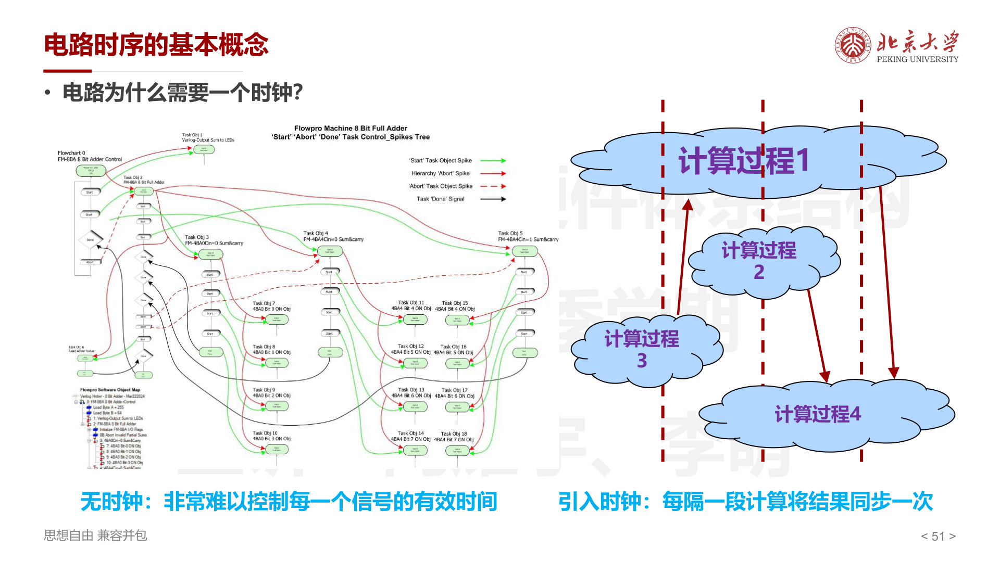{ width="800" }

- **无时钟** ：非常难以控制每一个信号的有效时间
- **引入时钟** ：每隔一段计算将结果同步一次

#### 同步时序

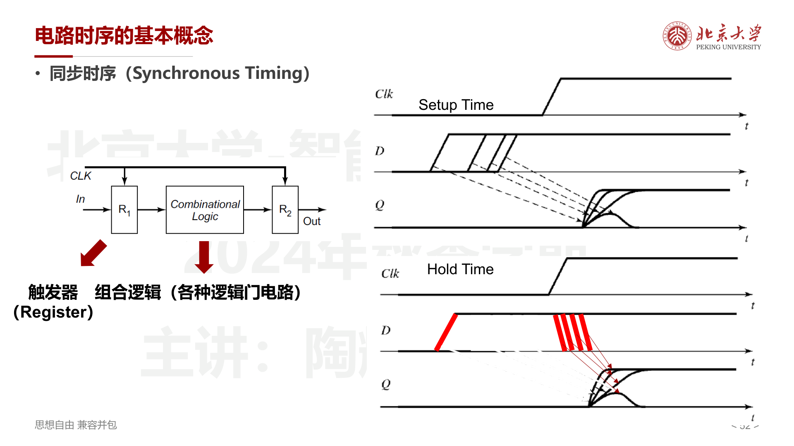{ width="800" }

- **Setup Time** （$t_{su}$）：数据必须在时钟边沿 **之前** 稳定的最小时间
- **Hold Time** （$t_{hold}$）：数据必须在时钟边沿 **之后** 保持稳定的最小时间

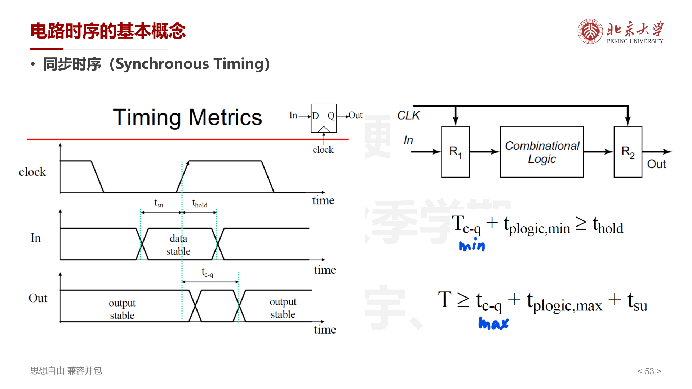{ width="800" }

时序约束：

- **最小周期** ：$T \geq t_{c\text{-}q} + t_{plogic,max} + t_{su}$
- **Hold 约束** ：$T_{c\text{-}q,min} + t_{plogic,min} \geq t_{hold}$

#### 时钟不稳定性

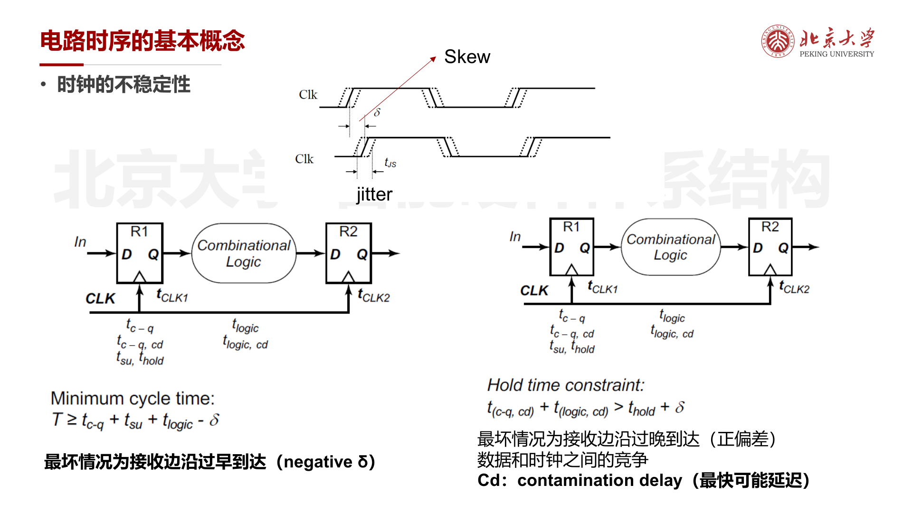{ width="800" }

- **Skew** （$\delta$）：不同寄存器接收到的时钟边沿存在时间偏差
- **Jitter** ：时钟周期本身的抖动

考虑 Skew 后的约束：

- 最小周期：$T \geq t_{c\text{-}q} + t_{su} + t_{logic} - \delta$（最坏情况：接收边沿过早到达，$\delta < 0$）
- Hold 约束：$t_{c\text{-}q,cd} + t_{logic,cd} > t_{hold} + \delta$（最坏情况：接收边沿过晚到达，$\delta > 0$）
- **Contamination delay** （Cd）：最快可能延迟，用于检查 hold 违例

## 指令集设计与微架构基础

### 为什么需要指令集

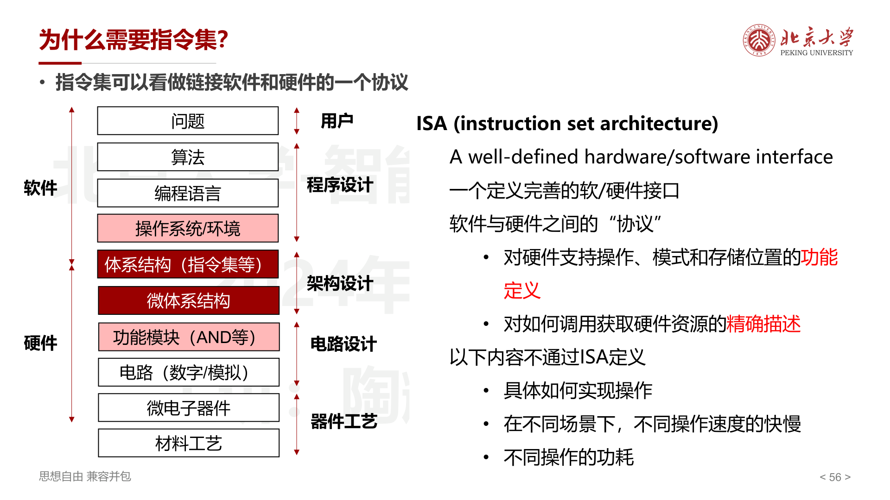{ width="800" }

**ISA（Instruction Set Architecture）** 是定义完善的软/硬件接口，是软件与硬件之间的"协议"。

ISA 定义的内容：

- 硬件支持的操作、模式和存储位置的功能定义
- 如何调用获取硬件资源的精确描述

ISA **不** 定义的内容：

- 具体如何实现操作
- 不同操作的速度和功耗

### CISC vs RISC

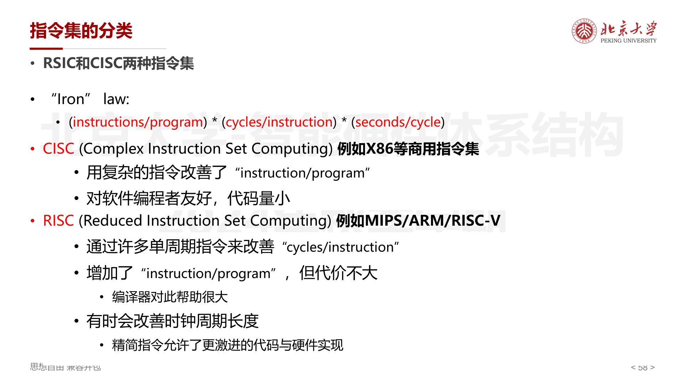{ width="800" }

"Iron" law：$\text{Time} = \frac{\text{instructions}}{\text{program}} \times \frac{\text{cycles}}{\text{instruction}} \times \frac{\text{seconds}}{\text{cycle}}$

| | CISC | RISC |
|---|---|---|
| 代表 | x86 | MIPS / ARM / RISC-V |
| 思路 | 减少 instructions/program | 减少 cycles/instruction |
| 特点 | 指令复杂，代码量小 | 单周期指令多，依赖编译器优化 |

指令集设计需兼顾三方面：

- **Programmability** ：可以高效表达程序
- **Implementability** ：能设计出高性能/低功耗/低成本的硬件
- **Compatibility** ：在软件迭代后保持兼容性

### 冯诺依曼架构

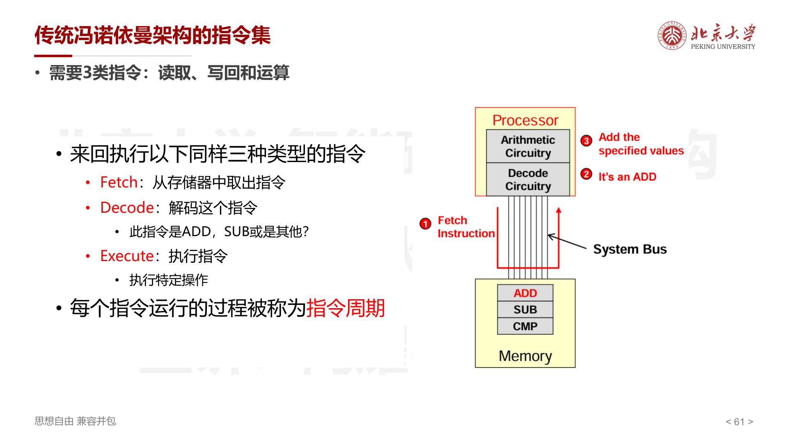{ width="800" }

传统冯诺依曼架构需要 3 类指令：读取、写回和运算。

指令周期：**Fetch**（取指）→ **Decode**（解码）→ **Execute**（执行）

处理器 3 种主要组成部分：

- **ALU** （算术逻辑单元）：执行加减、逻辑运算
- **寄存器** ：处理器内部的快速暂存
- **控制电路** ：协调各部件工作

通过地址、数据和控制 **总线（Bus）** 与存储器和 I/O 连接。

### 寄存器的作用

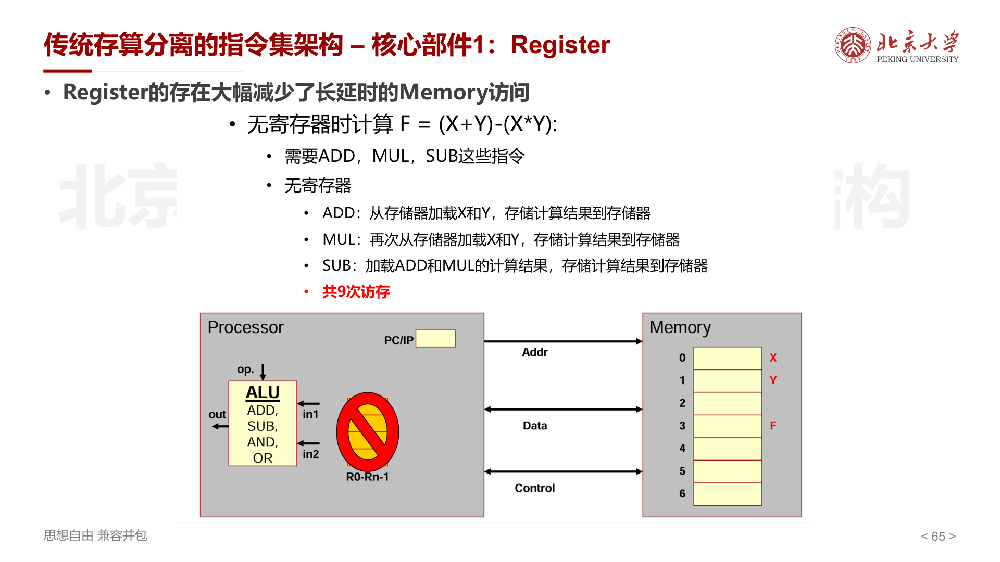{ width="800" }

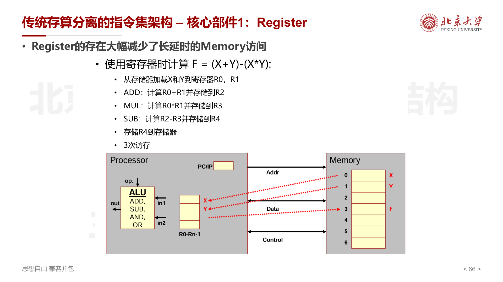{ width="800" }

以计算 $F = (X+Y) - (X \times Y)$ 为例：

- **无寄存器** ：每次运算都需从存储器加载和存储，共 **9 次访存**
- **有寄存器** ：先将 X、Y 加载到 R0、R1，中间结果存寄存器，共 **3 次访存**

寄存器还包括 **PC/IP** （程序计数器/指令指针），保存下一条要获取的指令地址。

### 指令集操作流程

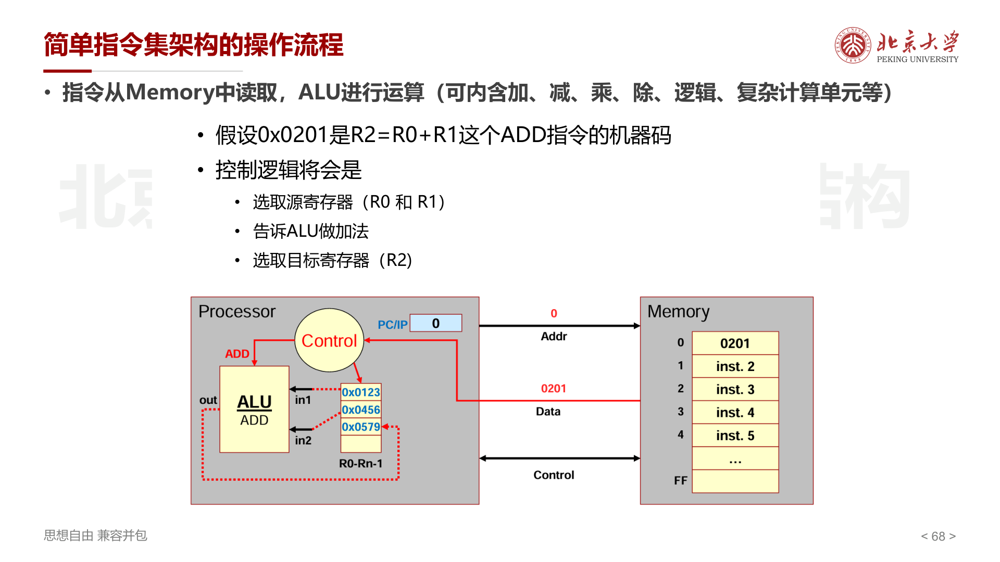{ width="800" }

以 ADD 指令为例（机器码 0x0201 表示 R2=R0+R1）：

1. PC/IP 指向地址 0，从 Memory 取出指令 0x0201
2. 控制逻辑解码：选取源寄存器 R0、R1，告诉 ALU 做加法
3. ALU 执行 0x0123 + 0x0456 = 0x0579，写入目标寄存器 R2
4. PC/IP 自增，进入下一条指令

数据来源可以是：

- **寄存器值** （eg. %rax）
- **主存中的值** （eg. 0x0200e8）
- **立即数** （immediate，存储在指令内部的常量，eg. ADDI $1, D0）
