## 晶体管与逻辑门电路基础

### MOSFET 晶体——现代芯片的基石

- n 型半导体：半导体内富含 ==自由电子==
- p 型半导体：富含没有电子的 "空穴"

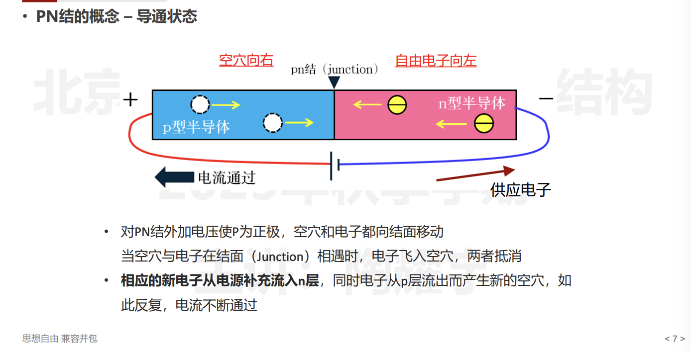{ width="800"}

内部电流流通方向使得空穴和自由电子都向 pn 结靠近

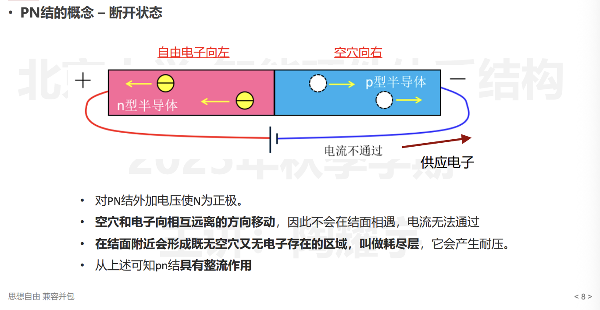{ width="800"}

内部电流流通方向使得空穴和自由电子移动方向相反


- MOSFET 结的概念——珊极（gate），漏极（drain）和源极（source）

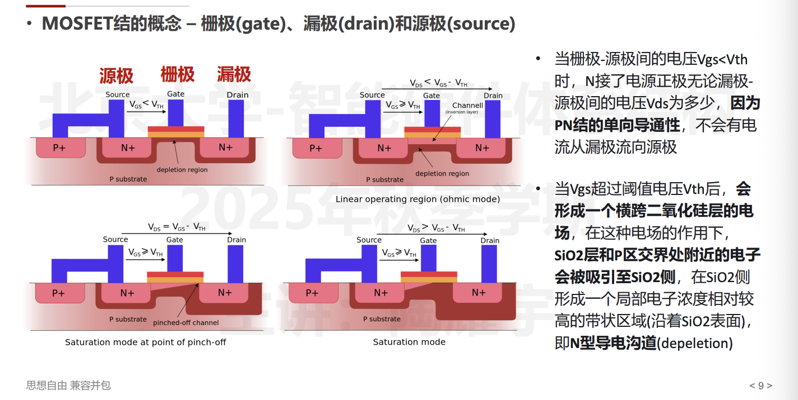{ width="800"}

!!! abstract "NMOS 结构四要素"
    **栅极（Gate）**：金属或多晶硅电极，通过 **栅氧化层（SiO₂）** 与衬底绝缘，施加电压产生垂直电场控制沟道。

    **源极（Source）与漏极（Drain）**：对称的 **N⁺ 重掺杂区**，是电子的来源和收集端。

    **P 型衬底**：本体硅材料，多子为空穴。

    **沟道区**：栅极下方、源漏之间的表面区域，电场作用下可反转为 **N 型导电沟道**。

源极和漏极之间隔着 P 型衬底，因此它们之间形成了两个背靠背的 PN 结（N⁺-P 和 P-N⁺）。正常情况下，这两个 PN 结中总有一个处于反向偏置，所以没有外加电压时，源漏之间是不导通的。

!!! info "无栅压时的关断机制"
    无论 Drain 接正还是负，Source-Drain 路径上 **至少有一个 PN 结处于反偏**：

    - 若 $V_D > V_S$，则 **Drain 端的 N⁺-P 结反偏**
    - 若 $V_D < V_S$，则 **Source 端的 P-N⁺ 结反偏**

    因此，没有栅压引入的表面反型层时，器件本质上是 **断开的开关**。

上图的四幅截面图展示了 **栅压 $V_{GS}$ 逐步升高** 时硅表面发生的物理变化：

!!! tip "四状态演变：截止 → 反型 → 夹断 → 饱和"
    **状态1：截止（Cut-off）** —— $V_{GS} < V_{TH}$

    栅压不足以改变 P 型衬底表面的能带结构。Si-SiO₂ 界面处仍然是 P 型，**无导电沟道**。此时即使 Drain 接正电，也因 PN 结的单向导电性而无电流。

    **状态2：线性区（Linear / Ohmic）** —— $V_{GS} \ge V_{TH}$，且 $V_{DS} < V_{GS} - V_{TH}$

    栅压产生的垂直电场 $E_{\perp}$ 足够强，将界面附近的 **空穴排斥走**，同时 **吸引电子** 到表面。当电子浓度超过空穴浓度，表面由 **P 型反型为 N 型**，形成 **N-channel（反型层）**。沟道连通源漏，器件像一个 **可变电阻**，电流随 $V_{DS}$ 近似线性增加。

    **状态3：夹断临界点（Pinch-off）** —— $V_{DS} = V_{GS} - V_{TH}$

    沿沟道从 Source 到 Drain，电位从 0 升高到 $V_D$。栅-沟道有效电压从源端的 $V_{GS}$ 逐渐降低到漏端的 $V_{GS} - V_{DS}$。当漏端满足 $V_{GS} - V_{DS} = V_{TH}$ 时，该处的反型层刚好消失，沟道被 **「夹断」**。

    **状态4：饱和区（Saturation）** —— $V_{DS} > V_{GS} - V_{TH}$

    继续增大 $V_{DS}$，夹断点向 Source 移动，反型层与 Drain 之间隔着一个 **耗尽区**。电子经沟道到达夹断点后，在高电场作用下 **漂移穿过耗尽区** 进入 Drain。由于夹断点处的载流子浓度由 $V_{GS} - V_{TH}$ 固定，电流 **基本不再随 $V_{DS}$ 增加**，进入饱和状态。

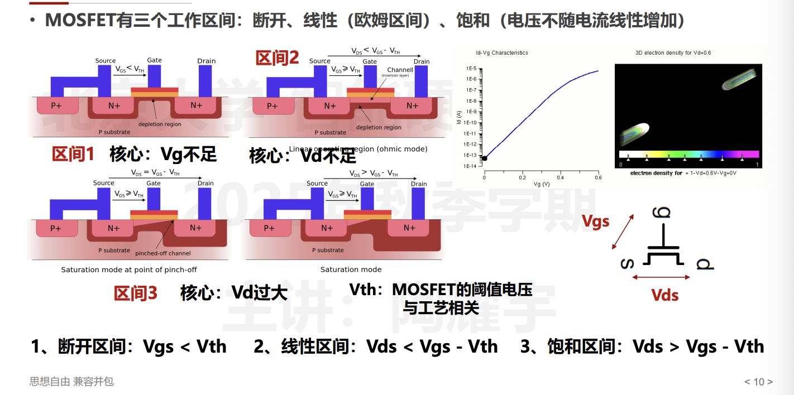{ width="800"}

!!! abstract "NMOS 三个工作区的判据"
    | 工作区 | 条件 | 电流公式（一级近似） |
    |--------|------|------------------|
    | **截止** | $V_{GS} < V_{TH}$ | $I_D \approx 0$ |
    | **线性/欧姆** | $V_{GS} \ge V_{TH}$ 且 $V_{DS} < V_{GS} - V_{TH}$ | $I_D \approx \mu_n C_{ox} \frac{W}{L} \left[(V_{GS}-V_{TH})V_{DS} - \frac{V_{DS}^2}{2}\right]$ |
    | **饱和** | $V_{GS} \ge V_{TH}$ 且 $V_{DS} \ge V_{GS} - V_{TH}$ | $I_D \approx \frac{1}{2}\mu_n C_{ox}\frac{W}{L}(V_{GS}-V_{TH})^2$ |

    其中 **过驱动电压** $V_{OV} = V_{GS} - V_{TH}$ 是真正控制电流的有效栅压。

上图右侧的 **$I_d$-$V_g$ 特性曲线** 展示了栅压扫过阈值时电流的急剧上升（对数坐标下的指数增长），这是数字电路能够 **快速开关** 的物理基础。

### MOSFET 的制造过程总结：

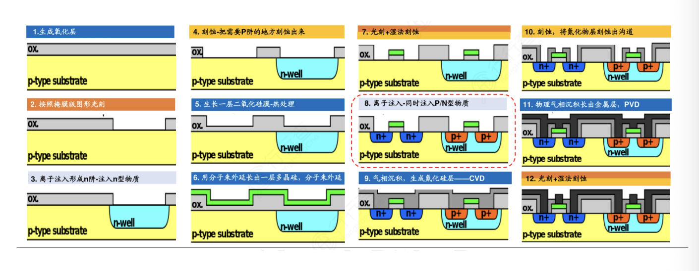{ width="800"}

### NMOS 和 PMOS

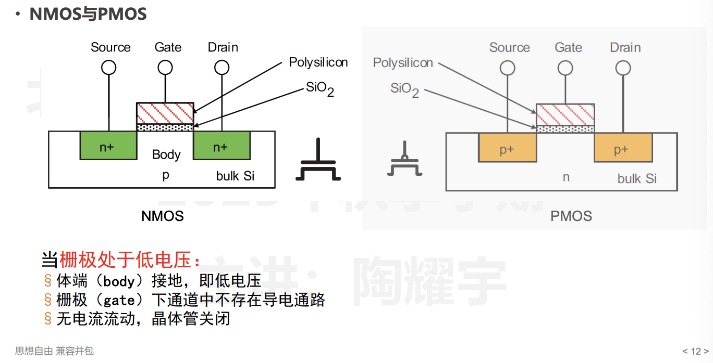{ width="800"}

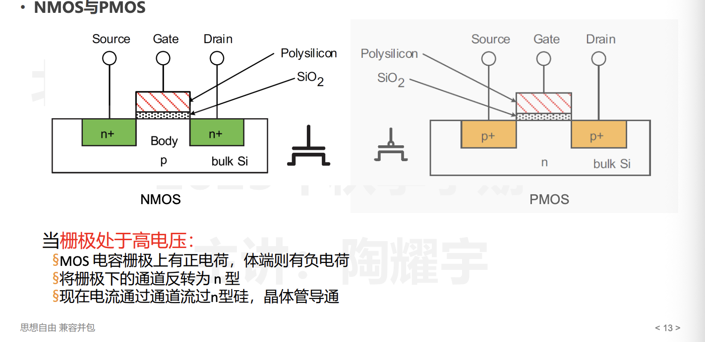{ width="800"}

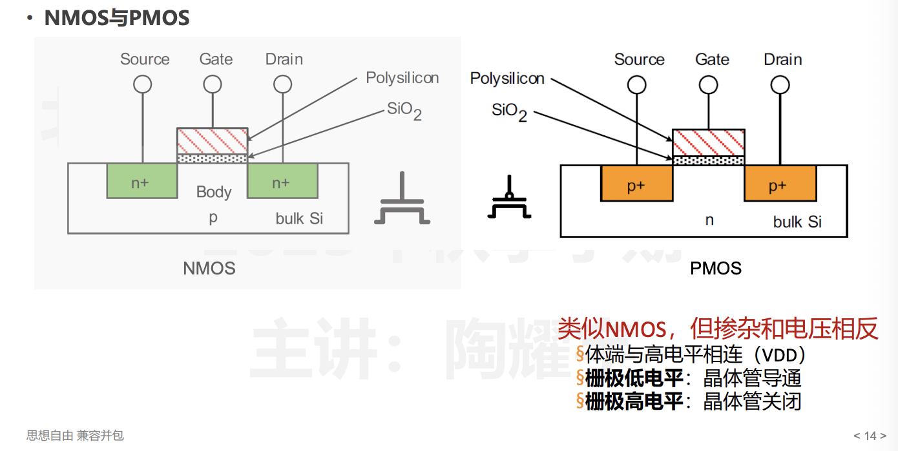{ width="800"}

### 经典静态逻辑电路

#### PUN 和 PDN

NMOS、PMOS 可以组成 PDN（Pull-Down Network）和 PUN（Pull-Up Network）。

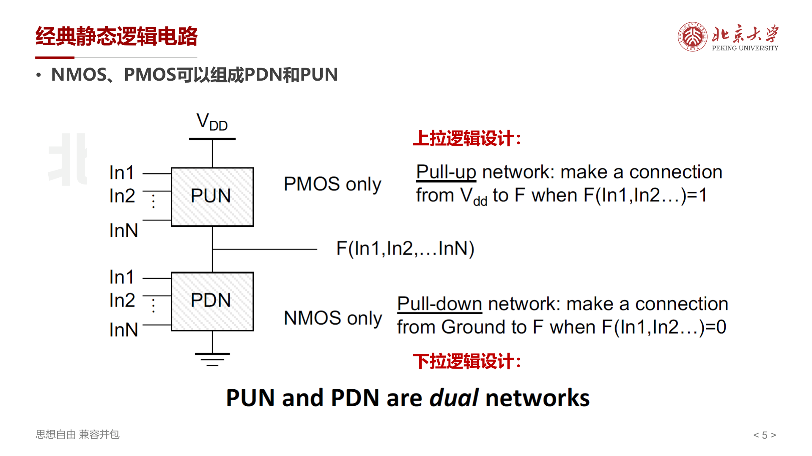{ width="800" }

**PUN (Pull-Up Network) — 上拉网络**

- 由 PMOS 晶体管组成
- 连接在 VDD（电源）和输出节点之间
- 当 **输出应为逻辑 1** 时，PUN 导通将输出连接到 $V_{DD}$

**PDN (Pull-Down Network) — 下拉网络**

- 由 NMOS 晶体管组成
- 连接在输出节点和 GND（地）之间
- 当 **输出应为逻辑 0** 时，PDN 导通将输出连接到 GND

!!! warning "体端与源端的连接区别"
    **体端（Bulk/Body）**：

    - 所有 NMOS 共享 P 型衬底，体端必须接 **GND**（最低电位）
    - 所有 PMOS 共享 N 型阱，体端必须接 **VDD**（最高电位）
    - 这是为了防止源-体和漏-体的寄生 PN 结导通

    **源端（Source）**：

    - **直接接地的 NMOS**（PDN 最底层）：源端 = GND
    - **串联结构中的上层 NMOS**：源端接 **下层 NMOS 的漏端**，而非直接接地

    例如 2 输入 NAND 的 PDN：

    ```
            Output Node
                 |
              ┌──┴──┐
              │NMOS_A│  ← 上层：源端接 NMOS_B 漏端，漏端接 Output
              └──┬──┘
                 │
              ┌──┴──┐
              │NMOS_B│  ← 下层：源端接 GND，漏端接 NMOS_A 源端
              └──┬──┘
                 |
                GND
    ```

    NMOS_A 的源端电位 **不是 0V**，而是 NMOS_B 的导通压降（几十到几百毫伏），但体端仍然是 **GND**。

!!! info "物理导通条件与逻辑功能的对应"
    **NMOS 导通条件**：$V_{GS} > V_{TH}$（栅极高电平导通）

    - 输入为 **1**（高电平）时导通
    - 输入为 **0**（低电平）时截止

    **PMOS 导通条件**：$V_{GS} < V_{TH}$（栅极低电平导通，$V_{TH}$ 为负值）

    - 输入为 **0**（低电平）时导通
    - 输入为 **1**（高电平）时截止

    **关键洞察**：PMOS 和 NMOS 的导通条件恰好 **互补**。这使得：

    - PDN 直接响应输入的 **正逻辑**（输入为 1 时 NMOS 导通，下拉输出到 0）
    - PUN 响应输入的 **反逻辑**（输入为 0 时 PMOS 导通，上拉输出到 1）

    因此，PUN 实现的逻辑是 **PDN 逻辑的对偶（De Morgan 对偶）**。

**PUN 和 PDN 互为对偶网络（dual networks）：**

- PUN 导通时 PDN 截止，反之亦然
- 串联 NMOS（PDN 中实现 AND）对应并联 PMOS（PUN 中实现同一逻辑的补）
- 并联 NMOS（PDN 中实现 OR）对应串联 PMOS

#### NAND 门电路

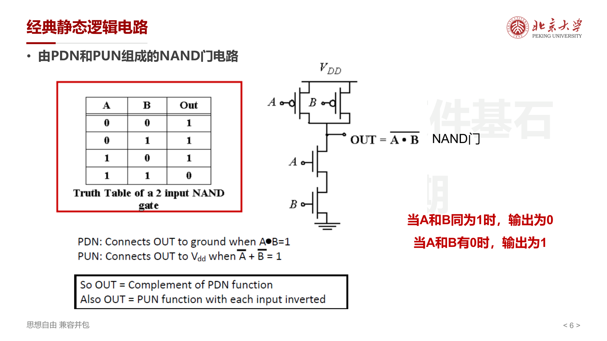{ width="800" }

NAND 门 $\text{OUT} = \overline{A \cdot B}$ ：

- 当 A 和 B 同为 1 时，输出为 0（PDN 导通，NMOS 串联）
- 当 A 和 B 有 0 时，输出为 1（PUN 导通，PMOS 并联）

PDN: 当 $A \cdot B = 1$ 时将 OUT 连接到 GND

PUN: 当 $\overline{A} + \overline{B} = 1$ 时将 OUT 连接到 $V_{DD}$

#### 复杂静态逻辑电路

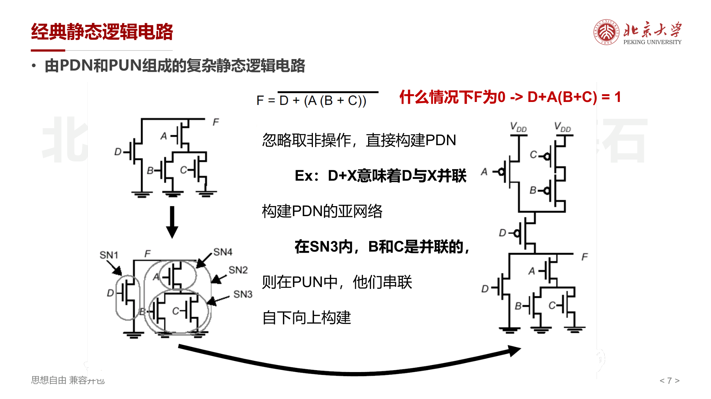{ width="800" }

以 $F = \overline{D + A(B + C)}$ 为例：

- 什么情况下 F 为 0？当 $D + A(B + C) = 1$ 时
- **构建 PDN** ：忽略取非操作，直接根据逻辑表达式构建
    - $D + X$ 意味着 D 与 X **并联**
    - $A \cdot X$ 意味着 A 与 X **串联**
- **构建 PUN** ：PDN 的对偶网络
    - PDN 中并联的，在 PUN 中串联
    - PDN 中串联的，在 PUN 中并联
- 自下向上构建

#### 简单 1-bit 加法器电路

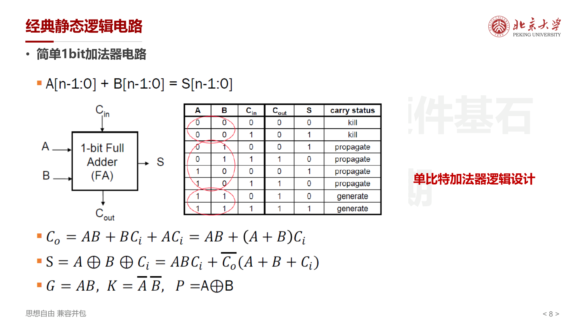{ width="800" }

$A[n-1:0] + B[n-1:0] = S[n-1:0]$

单比特全加器（Full Adder）的关键公式：

$$
C_o = AB + BC_i + AC_i = AB + (A + B)C_i
$$

$$
S = A \oplus B \oplus C_i = ABC_i + \overline{C_o}(A + B + C_i)
$$

!!! tip "异或的等价逻辑表示"
    **基本定义**：

    $$
    A \oplus B = A\overline{B} + \overline{A}B
    $$

    **与/或/非形式**：

    $$
    A \oplus B = (A + B) \cdot \overline{AB}
    $$

    含义：**A 或 B 至少一个为 1，但不同时为 1**。

    **同或（XNOR）的补**：

    $$
    A \oplus B = \overline{A \odot B} = \overline{AB + \overline{A}\overline{B}}
    $$

    其中 $A \odot B$ 是同或（相等时为 1）。

    **传播进位的物理意义**：

    在全加器中，$P = A \oplus B$ 表示 **当 A 和 B 不同时，进位会「穿透」到输出**（$C_{out} = C_{in}$）。

    - 若 $A = B$：$A \oplus B = 0$，此时要么两者都生成进位（$G=1$），要么都杀死进位（$K=1$）
    - 若 $A \neq B$：$A \oplus B = 1$，进位状态由 $C_{in}$ 决定

    ==异或操作满足结合律==

进位状态（carry status）：

- **Generate** （$G = AB$）：$C_{out} = 1$，与 $C_{in}$ 无关
- **Propagate** （$P = A \oplus B$）：$C_{out} = C_{in}$，传播进位
- **Kill** （$K = \overline{A} \cdot \overline{B}$）：$C_{out} = 0$，与 $C_{in}$ 无关

全加器的晶体管实现共需 **28 个晶体管** ：

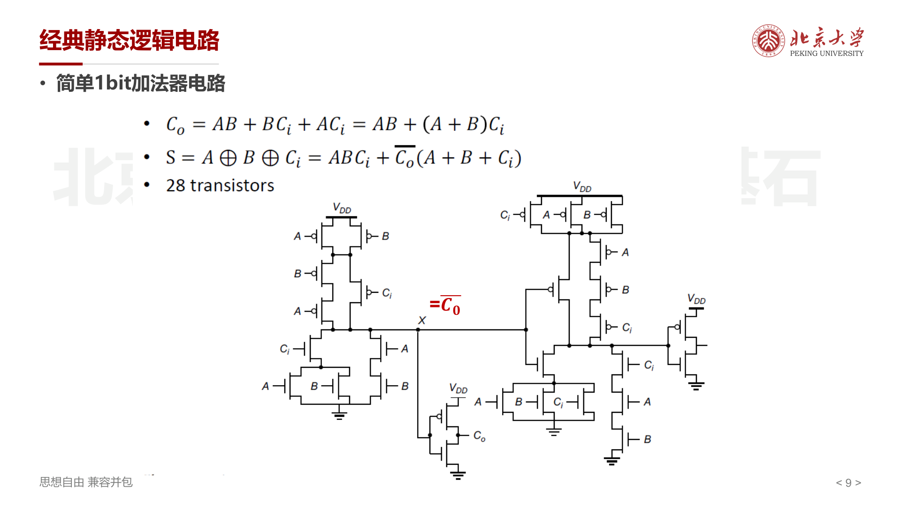{ width="800" }

## 电路延迟分析与功耗分析

### 什么是电路的延迟

以 Inverter 反相器为例：

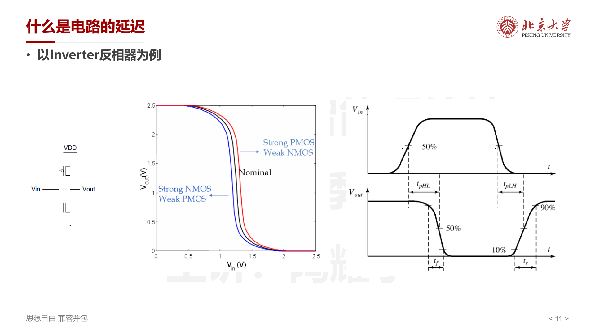{ width="800" }

- $t_{pHL}$ ：输出从高到低的传播延迟（50% 点测量）
- $t_{pLH}$ ：输出从低到高的传播延迟
- $t_f$ ：下降时间（90% → 10%）
- $t_r$ ：上升时间（10% → 90%）

### 一阶 RC 延迟分析

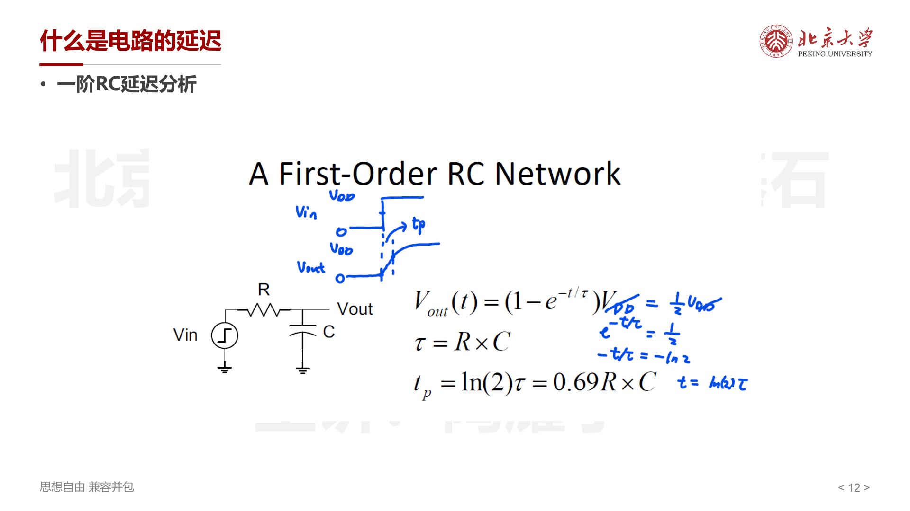{ width="800" }

对于一阶 RC 网络：

$$
V_{out}(t) = (1 - e^{-t/\tau}) V_{DD}
$$

其中时间常数 $\tau = R \times C$ 。当输出达到 50% $V_{DD}$ 时：

$$
t_p = \ln(2) \cdot \tau = 0.69 R \times C
$$

#### 反相器延迟

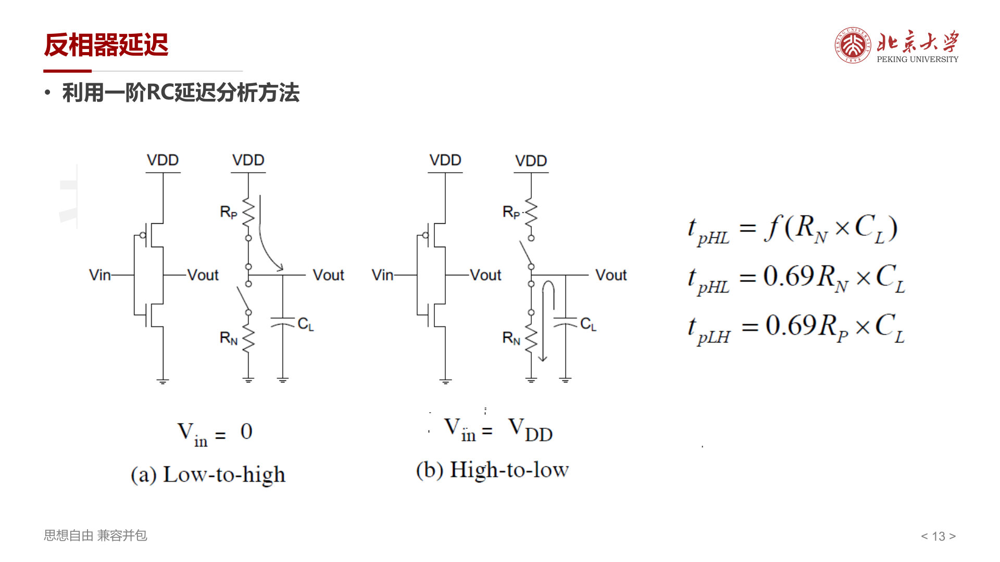{ width="800" }

利用一阶 RC 模型分析反相器：

- **High-to-Low** （$V_{in} = V_{DD}$）：NMOS 导通，$t_{pHL} = 0.69 R_N \times C_L$
- **Low-to-High** （$V_{in} = 0$）：PMOS 导通，$t_{pLH} = 0.69 R_P \times C_L$

### 降低延迟的设计方法

- **降低电容 C** ：版图紧凑，布局合理；保持较短走线 & 减少 diffusion routing
- **降低电阻 R（增加晶体管尺寸）** ：需避免 self-loading，否则会导致寄生电容增大
- **增加电源电压** ：同时会影响可靠性与功耗，因而一般不采用

### 输入 Pattern 对延迟的影响

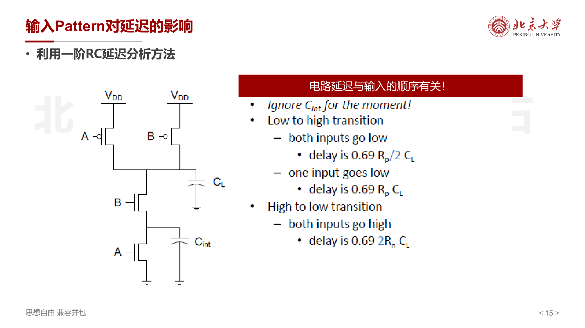{ width="800" }

电路延迟与输入的顺序有关！以 NAND 门（忽略 $C_{int}$）为例：

- **Low-to-High 转换** ：
    - 两个输入都变低：延迟为 $0.69 \frac{R_p}{2} C_L$（PMOS 并联，电阻减半）
    - 一个输入变低：延迟为 $0.69 R_p C_L$
- **High-to-Low 转换** ：
    - 两个输入都变高：延迟为 $0.69 \cdot 2R_n \cdot C_L$（NMOS 串联，电阻翻倍）

### 利用 Transistor Ordering 提升逻辑速度

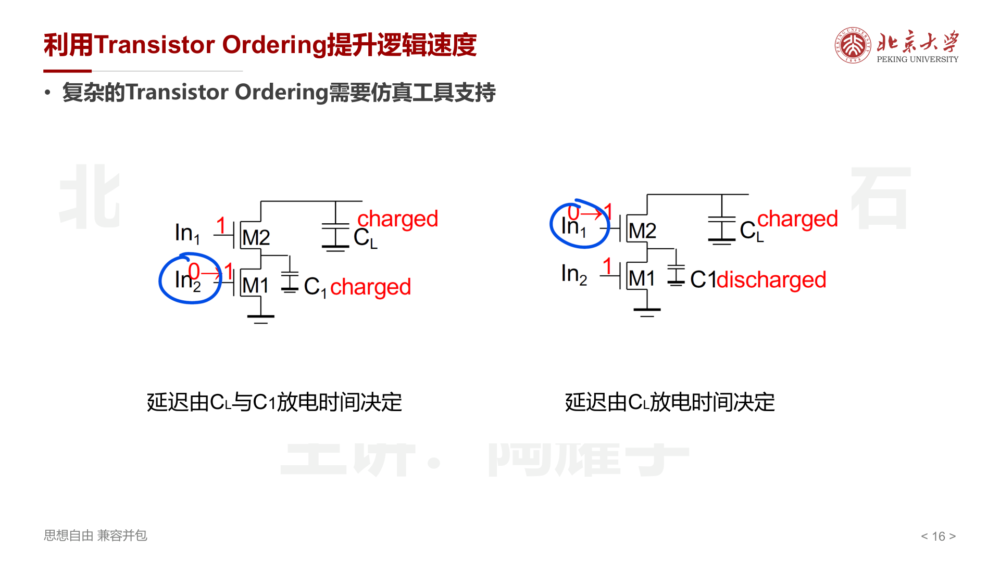{ width="800" }

当串联晶体管的输入到达顺序不同时，延迟也不同：

- **较晚到达的信号放在靠近输出端的晶体管** ：此时内部电容 $C_1$ 已被提前放电，延迟仅由 $C_L$ 放电决定
- **较晚到达的信号放在远离输出端** ：$C_L$ 和 $C_1$ 都需要放电，延迟更大

### Elmore Delay 模型

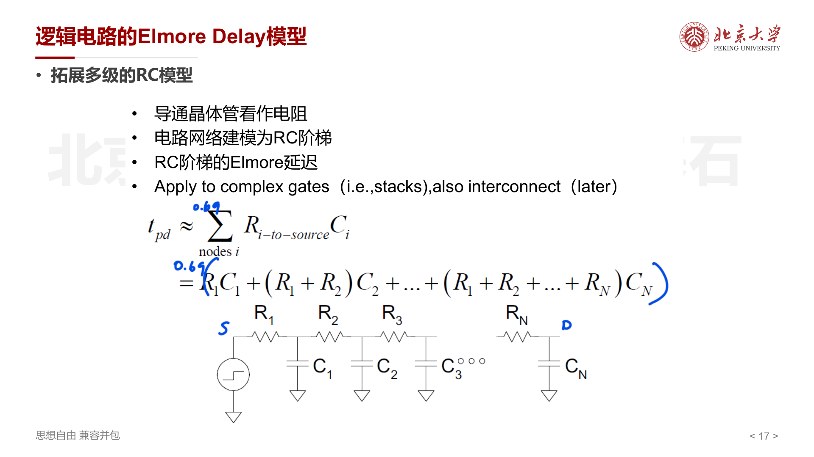{ width="800" }

将导通晶体管看作电阻，电路网络建模为 RC 阶梯（RC ladder），Elmore 延迟公式为：

$$
t_{pd} \approx 0.69 \sum_{\text{nodes } i} R_{i\text{-to-source}} \cdot C_i
$$

$$
= 0.69 \left( R_1 C_1 + (R_1 + R_2) C_2 + \cdots + (R_1 + R_2 + \cdots + R_N) C_N \right)
$$

适用于复杂门电路（如晶体管堆叠）和互连线的延迟估计。

### 逻辑电路的 Transistor Sizing

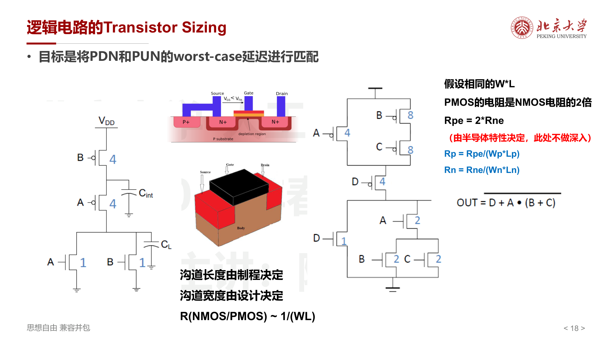{ width="800" }

目标是将 PDN 和 PUN 的 worst-case 延迟进行匹配。

- 沟道长度由制程决定，沟道宽度由设计决定
- $R(\text{NMOS/PMOS}) \sim \frac{1}{W \cdot L}$
- 假设相同的 $W \times L$ ，PMOS 的电阻是 NMOS 电阻的 **2 倍** ：$R_{pe} = 2 R_{ne}$（由半导体载流子迁移率决定）

因此在设计中，PMOS 的宽度通常是 NMOS 的 2 倍，以匹配上拉和下拉延迟。对于串联晶体管，需要按串联级数成倍增大宽度。

### 逻辑电路功耗

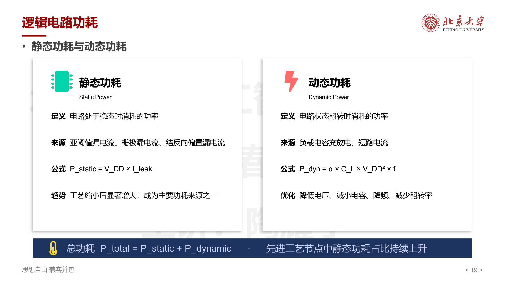{ width="800" }

| | 静态功耗 | 动态功耗 |
|---|---|---|
| 定义 | 电路处于稳态时消耗的功率 | 电路状态翻转时消耗的功率 |
| 来源 | 亚阈值漏电流、栅极漏电流、结反向偏置漏电流 | 负载电容充放电、短路电流 |
| 公式 | $P_{static} = V_{DD} \times I_{leak}$ | $P_{dyn} = \alpha \cdot C_L \cdot V_{DD}^2 \cdot f$ |
| 优化 | 先进工艺节点中占比持续上升 | 降低电压、减小电容、降频、减少翻转率 $\alpha$ |

总功耗：$P_{total} = P_{static} + P_{dynamic}$

#### 动态功耗的能量分析

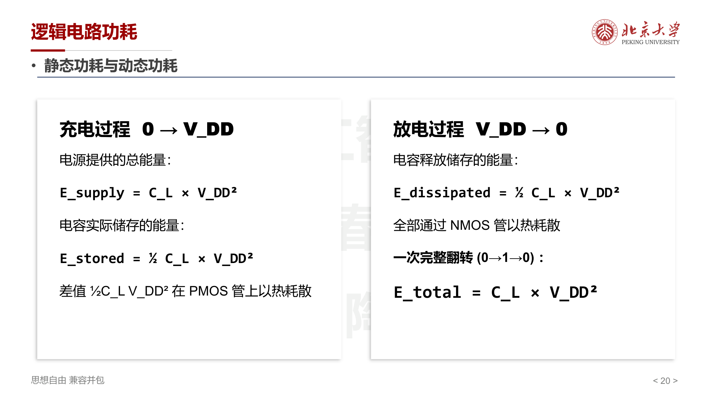{ width="800" }

**充电过程** $0 \to V_{DD}$ ：

- 电源提供总能量：$E_{supply} = C_L \cdot V_{DD}^2$
- 电容实际储存：$E_{stored} = \frac{1}{2} C_L \cdot V_{DD}^2$
- 差值 $\frac{1}{2} C_L V_{DD}^2$ 在 PMOS 管上以热耗散

**放电过程** $V_{DD} \to 0$ ：

- 电容释放的 $\frac{1}{2} C_L \cdot V_{DD}^2$ 全部通过 NMOS 管以热耗散

一次完整翻转（$0 \to 1 \to 0$）总耗能：$E_{total} = C_L \cdot V_{DD}^2$

## 数据量化与逻辑单元设计

- 原码，反码，补码

计概和 ics 都有，不再写了

- 浮点数，IEEE-754 标准

计算方法和 ics 都有，不写了
