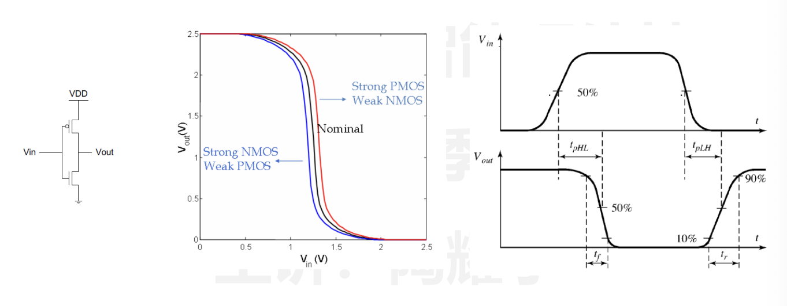
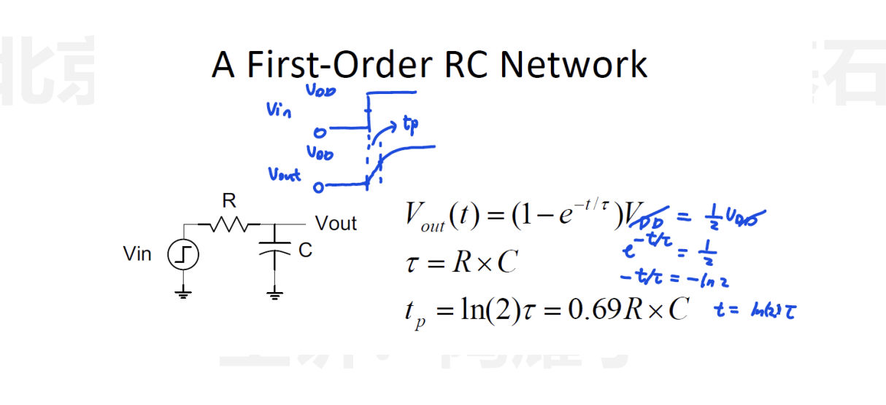
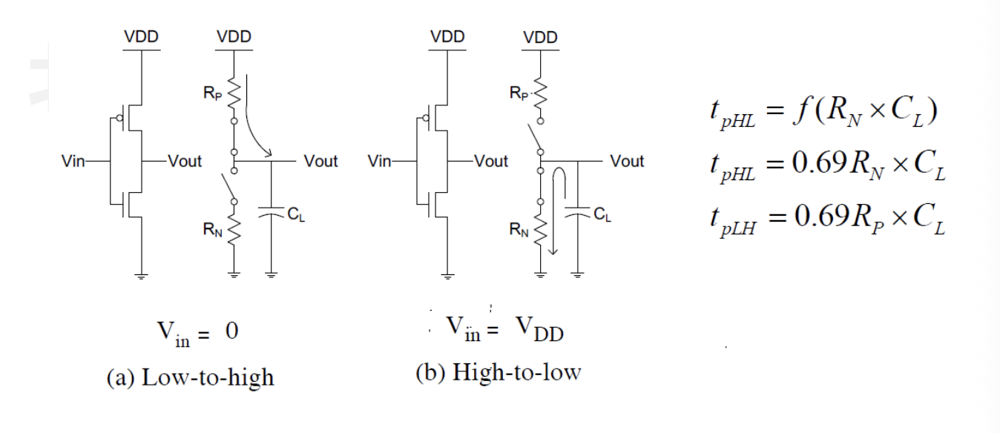
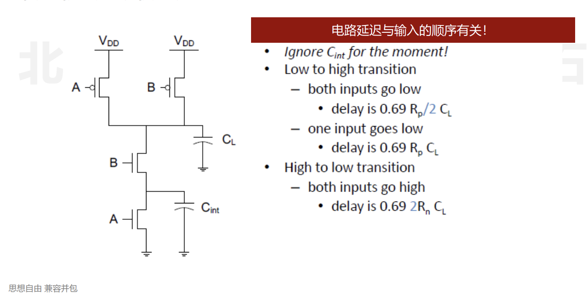
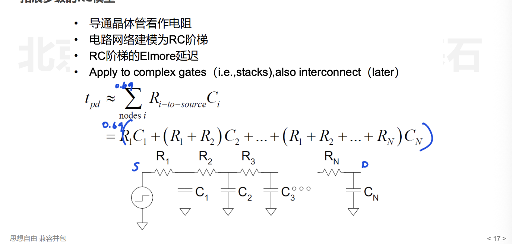
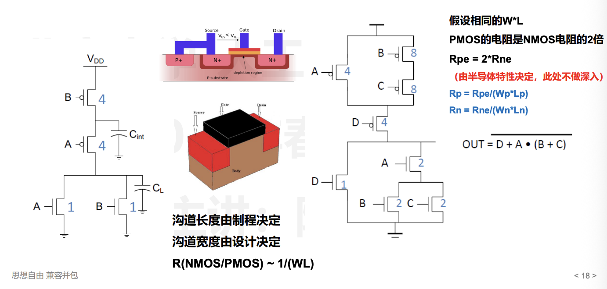
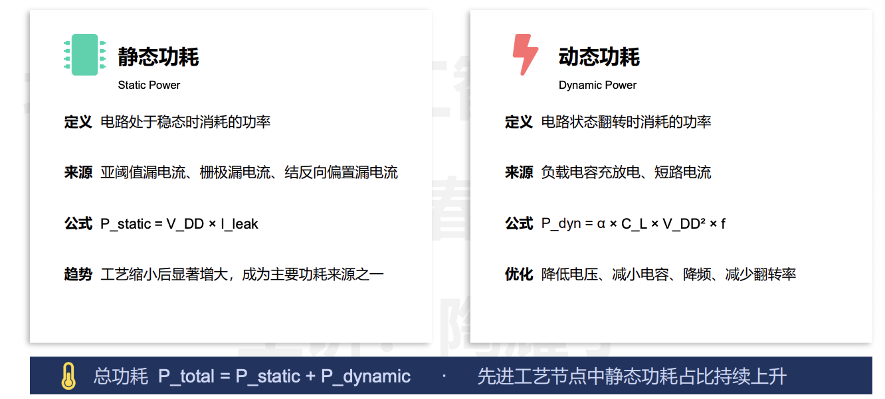
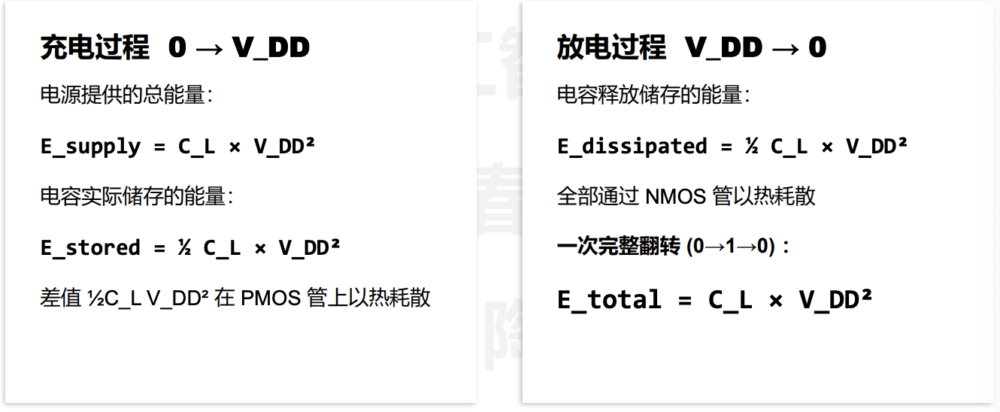

## 晶体管与逻辑门电路基础

### MOSFET 晶体——现代芯片的基石

- n 型半导体：半导体内富含 ==自由电子==  
- p 型半导体：富含没有电子的 “空穴”

{ width="500"}

{ width="500"}

- MOSFET 结的概念——珊极（gate），漏极（drain）和源极（source）

{ width="500"}

{ width="500"}

- MOSFET 的制造过程总结：

{ width="500"}

### NMOS 和 PMOS

{ width="500"}

{ width="500"}

{ width="500"}

#### PUN 和 PDN

**PUN (Pull-Up Network) — 上拉网络**

- 由 PMOS 晶体管组成

- 连接在 VDD（电源）和输出节点之间

- 作用：当输入满足特定条件时，将输出"拉高"到逻辑 1（VDD）

- PMOS 在栅极为低电平时导通，所以 PUN 在输入为 0 时提供通路


  **PDN** **(Pull-Down** **Network)** **—** **下拉网络**

- 由 NMOS 晶体管组成
- 连接在输出节点和 GND（地）之间
- 作用：当输入满足特定条件时，将输出"拉低"到逻辑 0（GND）
- NMOS 在栅极为高电平时导通，所以 PDN 在输入为 1 时提供通路

  **两者的关系**
  PUN 和 PDN 是互补的：

  
```

          VDD

           |

        [ PUN ]  ← PMOS 组成

           |

           +——→ Output

           |

        [ PDN ]  ← NMOS 组成

           |

          GND

```


  关键原则：
  
- PUN 和 PDN 互为对偶（dual）——PUN 导通时 PDN 截止，反之亦然
- 串联 NMOS（PDN 中实现 AND）对应并联 PMOS（PUN 中实现同一逻辑的补）
- 并联 NMOS（PDN 中实现 OR）对应串联 PMOS

  **举个例子：NAND** **门（与非门）**
  
  Y = ~(A · B)

  PUN: A 和 B 的 PMOS 并联（任一输入为 0 → 输出拉高）

  PDN: A 和 B 的 NMOS 串联（两个输入都为 1 → 输出拉低）
  
  简单记忆：PDN 决定什么时候输出 0，PUN 决定什么时候输出 1，两者始终一个通一个断。


## 电路延迟分析与功耗分析

- 什么是电路的延迟：以 Inverter 反向器为例

{ width="600"}


- 一阶 RC 延迟分析

{ width="600"}


{ width="600"}

- 利用较小的电容——降低 C
	- 版图紧凑，布局合理
	- 保持较短走线 & 减少 diffusion routing
- 增加晶体管尺寸——降低 R
	- 避免 self-loading 出现，否则会导致寄生电容增大
- 增加电源电压
	- 同时会影响可靠性与功耗，因而一般不采用

{ width="600"}

- 拓展多级的 RC 模型

{ width="600"}


### 逻辑电路的Transistor Sizing

目标是将 PDN 和 PUN 的 worst-case 延迟进行匹配

{ width="600"}


### 逻辑电路功耗

{ width="600"}

$\alpha$ 是翻转率， $f$ 是电路的频率

一次完整的翻转：

{ width="600"}


## 数据量化与逻辑单元设计

- 原码，反码，补码

计概和 ics 都有，不再写了

- 浮点数，IEEE-754 标准

计算方法和 ics 都有，不写了


