参考：Stanford CS231n 10th Anniversary, Lecture 2, April 3, 2025

---

## Image Classification

图像分类是计算机视觉的核心任务：给定一张图像和一组预定义的类别标签 $\{dog, cat, truck, plane, \dots\}$，系统需要为图像分配一个类别标签。

### 语义鸿沟 (Semantic Gap)

对人类来说，识别一只猫很简单，但对计算机来说，图像只是一个 $H \times W \times C$ 的整数张量（值在 $[0, 255]$ 之间）。例如一张 $800 \times 600$ 的 RGB 图像就是一个三维数组。从像素值到 "cat" 这个语义概念之间存在巨大的鸿沟。

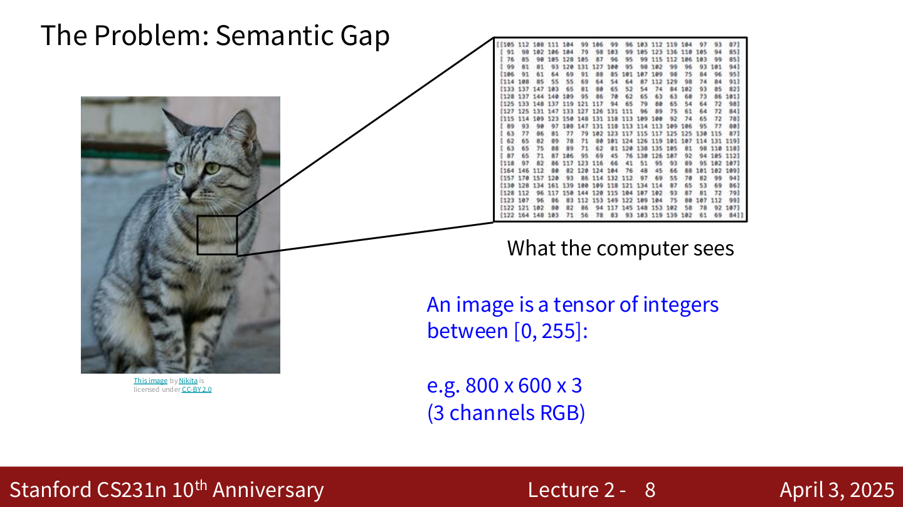{ width="550" }

### 图像分类面临的挑战

- **视角变化 (Viewpoint Variation)**：摄像机移动时，所有像素值都会改变
- **光照变化 (Illumination)**：不同光照条件下，同一物体的像素值差异巨大
- **背景干扰 (Background Clutter)**：物体与背景融为一体
- **遮挡 (Occlusion)**：物体只有一部分可见
- **形变 (Deformation)**：同一类物体可以有各种姿态
- **类内差异 (Intraclass Variation)**：同一类别的个体在外观上可能差异很大
- **上下文依赖 (Context)**：需要借助上下文才能正确识别

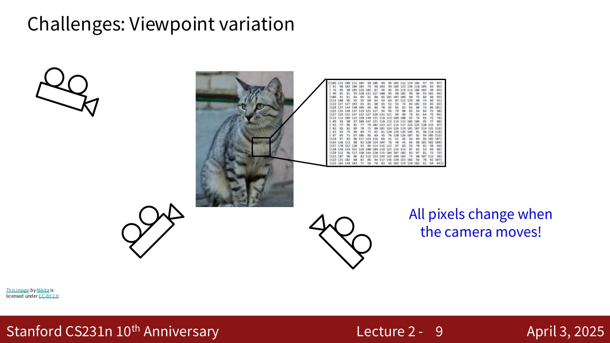{ width="550" }

### 为什么不能硬编码？

不像排序算法那样有明确的步骤，识别一只猫并没有显而易见的硬编码方法。早期尝试过 "找边缘 → 找角点 → ？" 的流程（如 Canny 边缘检测），但效果不佳。

---

## 数据驱动方法 (Data-Driven Approach)

机器学习的方法分三步：

1. 收集一个包含图像和标签的数据集
2. 使用机器学习算法训练一个分类器
3. 在新图像上评估分类器

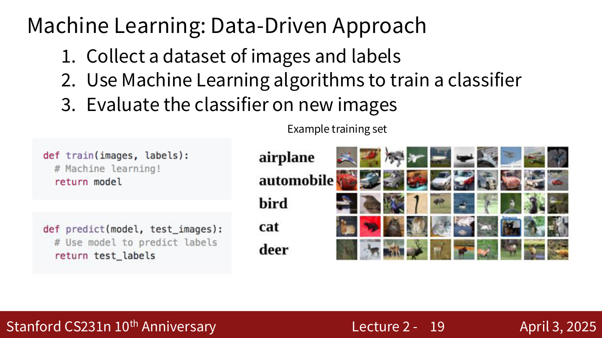{ width="550" }

```python
def train(images, labels):
    # Machine learning!
    return model

def predict(model, test_images):
    # Use model to predict labels
    return test_labels
```

---

## 最近邻分类器 (Nearest Neighbor Classifier)

### 基本思想

- **训练阶段**：记住所有训练数据和标签
- **预测阶段**：对于每张测试图像，找到与之最相似的训练图像，用该训练图像的标签作为预测结果

### 距离度量 (Distance Metric)

需要一个距离函数来衡量两张图像的相似度。

**L1 距离 (Manhattan Distance)**：

$$
d_1(I_1, I_2) = \sum_p |I_1^p - I_2^p|
$$

逐像素取绝对值差，然后求和。

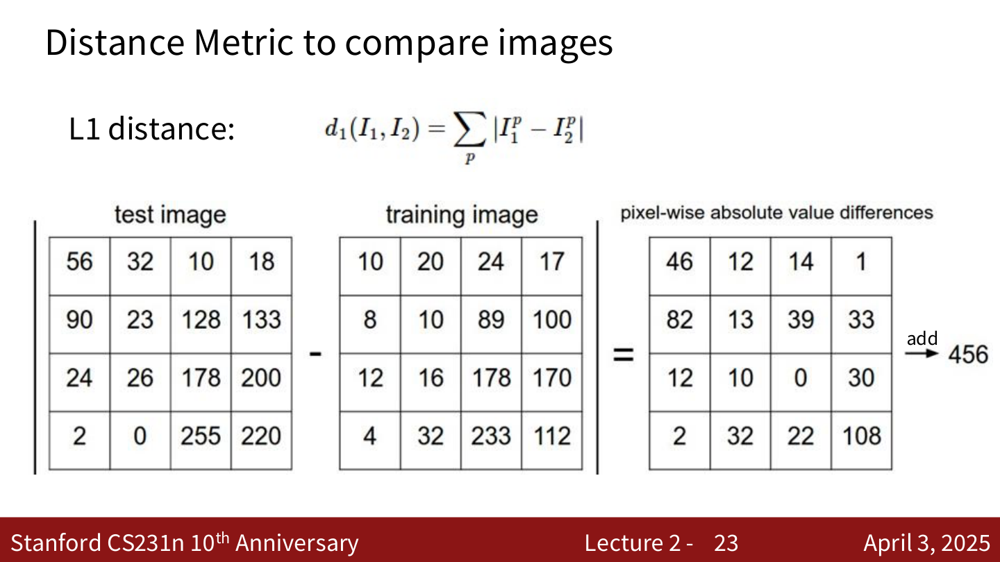{ width="550" }

### 代码实现


```python
import numpy as np

class NearestNeighbor:
    def __init__(self):
        pass

    def train(self, X, y):
        # X is N x D, Y is 1-dimension of size N
        self.Xtr = X
        self.ytr = y

    def predict(self, X):
        num_test = X.shape[0]
        Ypred = np.zeros(num_test, dtype=self.ytr.dtype)
        for i in range(num_test):
            distances = np.sum(np.abs(self.Xtr - X[i, :]), axis=1)
            min_index = np.argmin(distances)
            Ypred[i] = self.ytr[min_index]
        return Ypred
```

### 时间复杂度

- **训练**：$O(1)$，仅存储数据
- **预测**：$O(N)$，需要遍历所有训练数据

这很糟糕！我们希望分类器在预测时快速，训练时慢是可以接受的。（存在 fast / approximate nearest neighbor 方法，如 Facebook 的 FAISS 库。）

---

## K-最近邻 (K-Nearest Neighbors, KNN)

### 基本思想

不再只看最近的一个邻居，而是找到 **K 个** 最近的训练样本，通过 **多数投票** 来决定预测标签。

- $K = 1$：决策边界不规则，容易受噪声影响
- $K = 3$：边界更平滑
- $K = 5$：边界进一步平滑

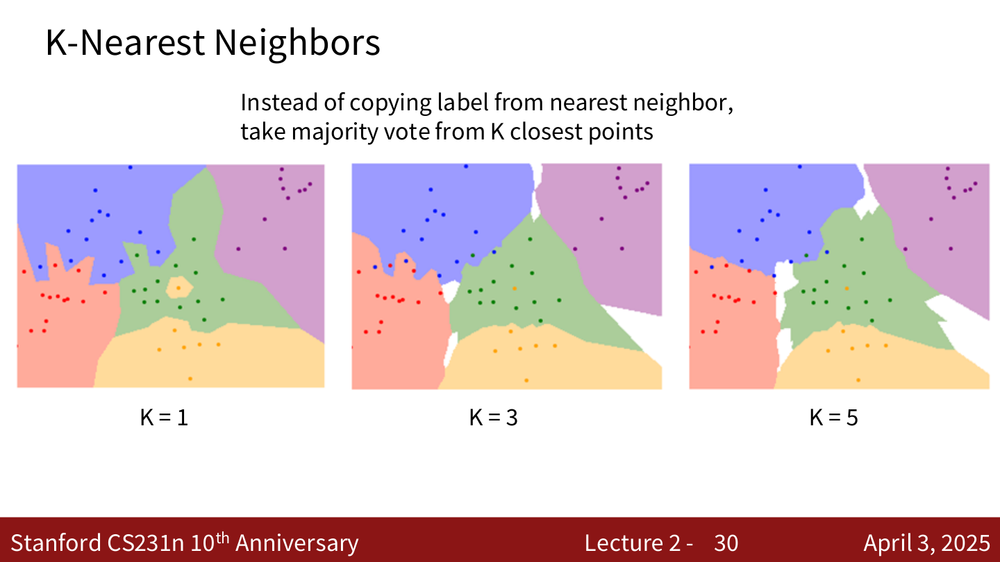{ width="550" }

### 距离度量对比

**L1 距离 (Manhattan Distance)**：

$$
d_1(I_1, I_2) = \sum_p |I_1^p - I_2^p|
$$

沿网格线移动的距离（类似在城市街区中行走），等距线呈菱形。

**L2 距离 (Euclidean Distance)**：

$$
d_2(I_1, I_2) = \sqrt{\sum_p (I_1^p - I_2^p)^2}
$$

直线距离，等距线呈圆形。

**示例**：设原点 $O(0,0)$，点 $A(1, 0)$

- L1 距离下，$B(0.5, 0.5)$ 与 $O$ 的距离 = $|0.5| + |0.5| = 1 = d_1(O, A)$
- L2 距离下，$B(1/\sqrt{2}, 1/\sqrt{2})$ 与 $O$ 的距离 = $\sqrt{1/2 + 1/2} = 1 = d_2(O, A)$

L1 和 L2 的决策边界形状不同：L1 的边界倾向于沿坐标轴对齐，L2 的边界更自然。

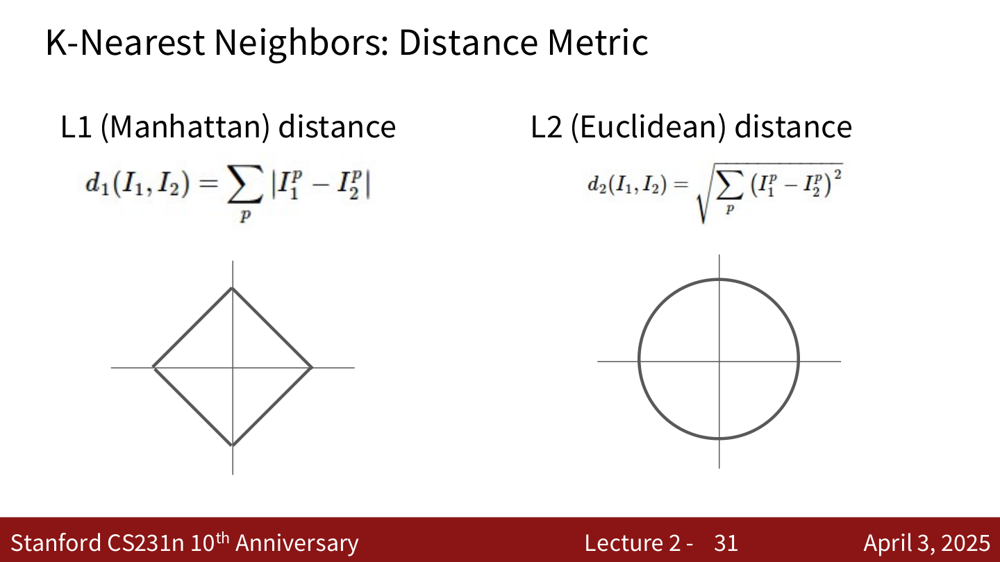{ width="550" }

---

## 超参数 (Hyperparameters)

KNN 中有两个超参数需要选择：

- **K 值**：使用多少个最近邻
- **距离度量**：L1 还是 L2

这些是关于算法本身的选择，非常依赖于具体的问题和数据集，必须通过实验来确定最佳值。

### 如何设置超参数

**Idea #1**：选择在训练数据上表现最好的超参数

- 不可取！$K = 1$ 在训练数据上总是完美的

**Idea #2**：选择在测试数据上表现最好的超参数

- 不可取！这样无法知道算法在新数据上的表现（永远不要这样做！）

**Idea #3**：将数据分为 **训练集、验证集、测试集**

- 在训练集上训练
- 在验证集上调超参数
- 最后在测试集上评估一次

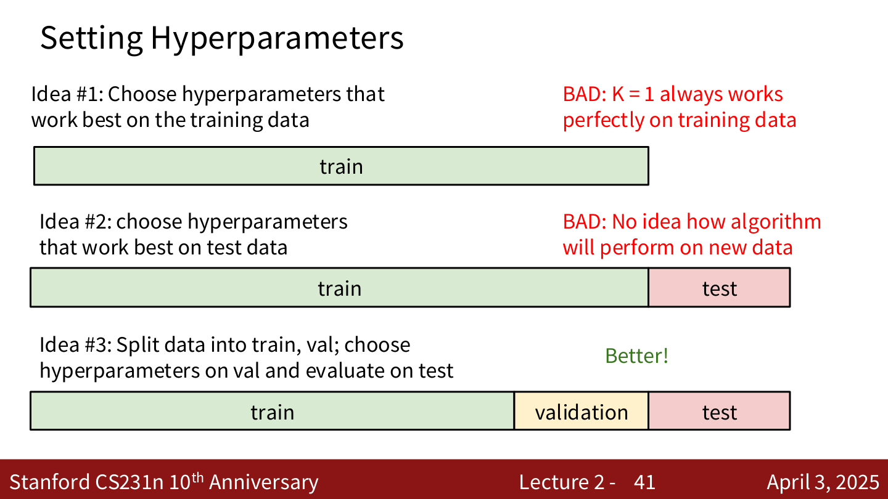{ width="550" }

**Idea #4**：**交叉验证 (Cross-Validation)**

- 将训练数据分成多个 fold（如 5 折）
- 轮流用每个 fold 作为验证集，其余作为训练集
- 取平均结果选择最佳超参数
- 适用于小数据集，在深度学习中不太常用

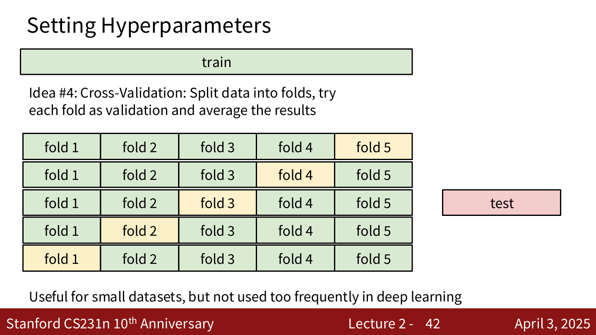{ width="550" }

### KNN 的局限性

在图像上使用像素距离的 KNN **几乎不会被实际使用**，因为像素级距离度量不具备语义信息。例如，将一张人脸图像进行遮挡、平移 1 个像素、或改变色调，这三种变换后的图像与原图的像素距离可能完全相同，但语义差异巨大。

### KNN 总结

- 图像分类：给定训练集的图像和标签，预测测试集的标签
- KNN 基于 K 个最近训练样本的标签来预测
- **距离度量** 和 **K** 是超参数
- 使用验证集选择超参数
- 测试集只在最后运行一次

---

## 线性分类器 (Linear Classifier)

### 参数化方法 (Parametric Approach)

与 KNN 不同，参数化方法将训练数据的知识 **压缩** 到参数 $W$ 中：

$$
f(x, W) = Wx + b
$$

- $x$：输入图像，展平为列向量（如 $32 \times 32 \times 3 = 3072$ 维）
- $W$：权重矩阵（$C \times D$，其中 $C$ 为类别数，$D$ 为输入维度）
- $b$：偏置向量（$C \times 1$）
- 输出：$C$ 个类别的得分

对于 CIFAR-10（10 类，$32 \times 32 \times 3$ 图像）：

$$
f(x, W) = Wx + b
$$

其中 $f$ 为 $10 \times 1$，$W$ 为 $10 \times 3072$，$x$ 为 $3072 \times 1$，$b$ 为 $10 \times 1$。

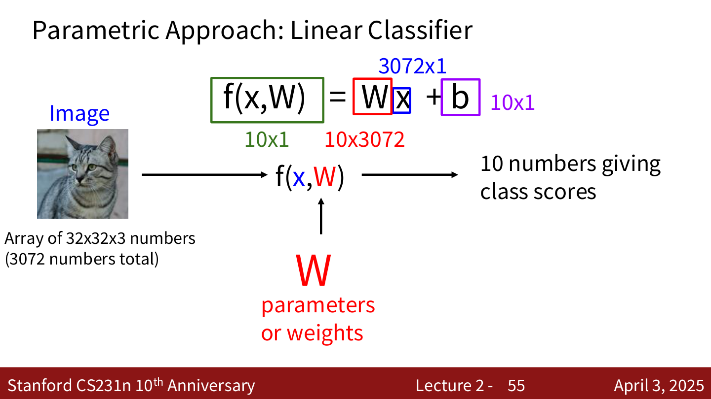{ width="550" }

线性分类器是神经网络的基本构件——深度网络中的每个 "全连接层" 本质上就是一个线性变换。

### 代数视角的例子

假设图像只有 4 个像素，3 个类别（cat / dog / ship）：

将图像展平为向量 $x = [56, 231, 24, 2]^T$，给定权重矩阵 $W$ 和偏置 $b$：

$$
\begin{bmatrix} 0.2 & -0.5 & 0.1 & 2.0 \\ 1.5 & 1.3 & 2.1 & 0.0 \\ 0 & 0.25 & 0.2 & -0.3 \end{bmatrix} \begin{bmatrix} 56 \\ 231 \\ 24 \\ 2 \end{bmatrix} + \begin{bmatrix} 1.1 \\ 3.2 \\ -1.2 \end{bmatrix} = \begin{bmatrix} -96.8 \\ 437.9 \\ 61.95 \end{bmatrix}
$$

得分分别为 Cat: $-96.8$, Dog: $437.9$, Ship: $61.95$。

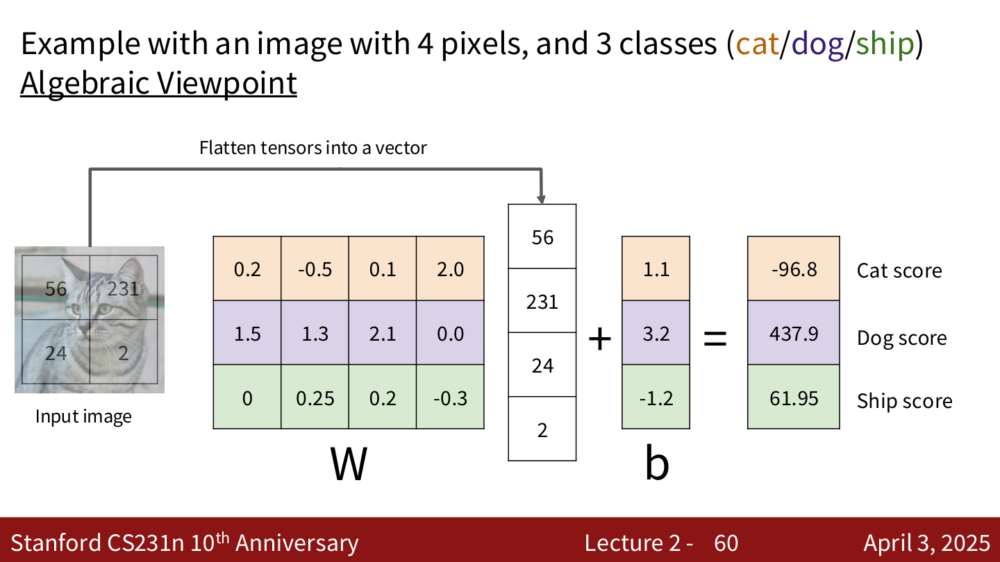{ width="550" }

### 解读线性分类器

**视觉视角**：$W$ 的每一行可以被 reshape 回图像大小，可视化后代表该类别的"模板"。分类时，线性分类器实际上在计算输入图像与每个模板的点积（相似度）。

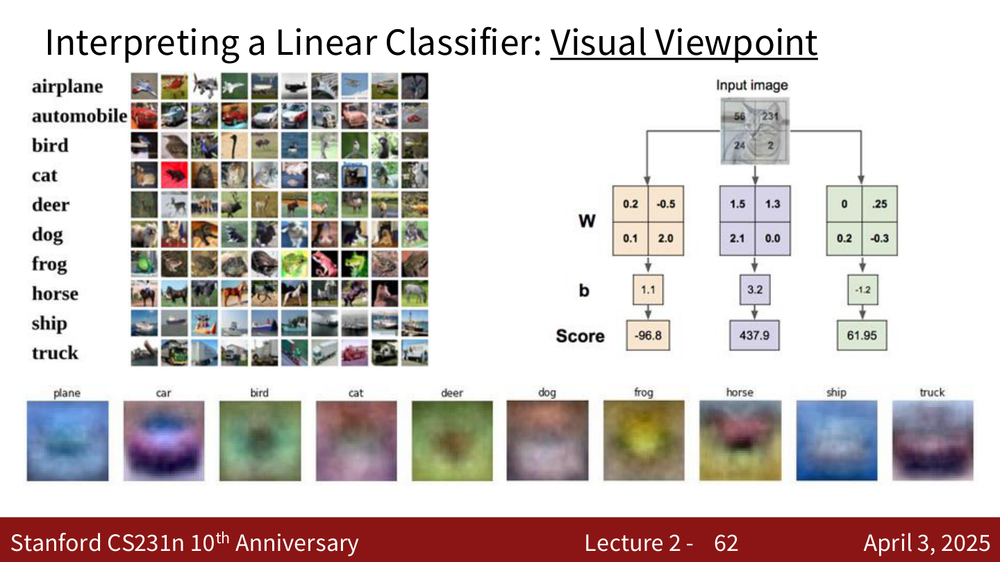{ width="550" }

**几何视角**：每个类别的分类器定义了高维像素空间中的一个 **超平面**。$W$ 的每一行是对应超平面的法向量，$b$ 决定超平面的偏移。空间被这些超平面划分为不同区域。

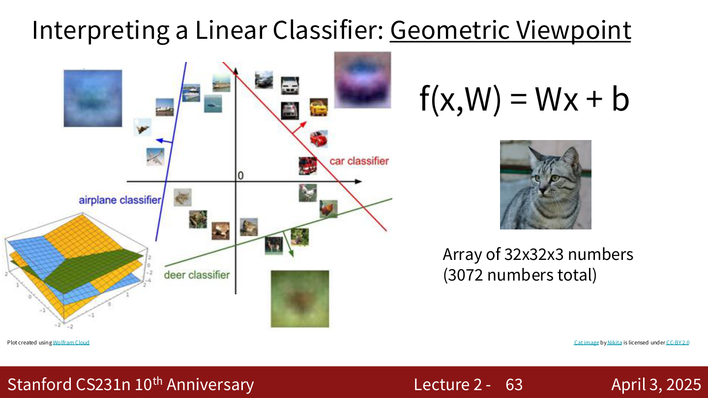{ width="550" }

### 线性分类器的局限

线性分类器无法处理以下情况：

- **XOR 问题**：类别分布在第一、三象限 vs 第二、四象限
- **环形分布**：一个类别在另一个类别的包围中
- **多模态分布**：同一类别有多个不连通的区域

这些情况无法用单个线性决策边界分开。

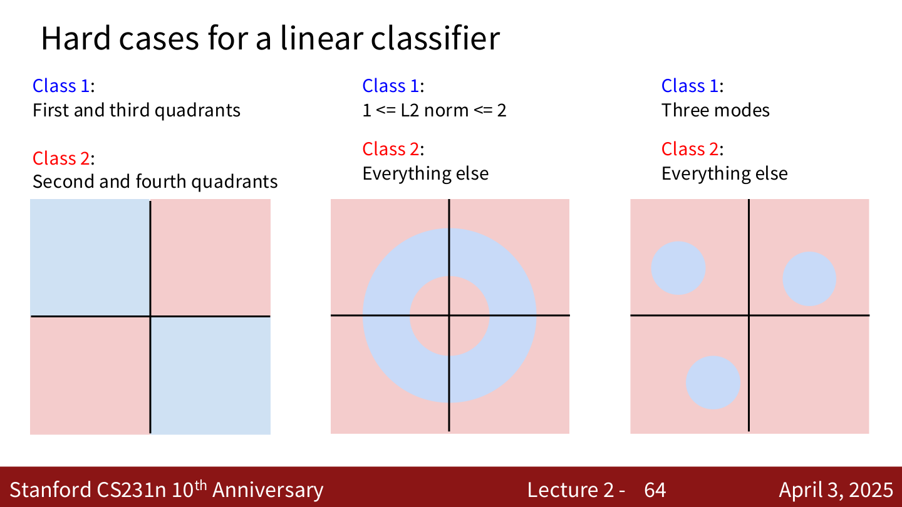{ width="550" }

---

## 损失函数 (Loss Function)

### 基本框架

给定数据集 $\{(x_i, y_i)\}_{i=1}^N$，其中 $x_i$ 是图像，$y_i$ 是整数标签。

损失函数衡量当前分类器的好坏：

$$
L = \frac{1}{N} \sum_i L_i(f(x_i, W), y_i)
$$

目标是找到使损失最小的权重 $W$。

---

## Softmax 分类器 (Cross-Entropy Loss)

### 核心思想

将原始得分解释为 **概率**。

**步骤**：

1. 计算原始得分（logits）：$s = f(x_i; W)$
2. 通过 Softmax 函数转换为概率：

$$
P(Y = k | X = x_i) = \frac{e^{s_k}}{\sum_j e^{s_j}}
$$

3. 最大化正确类别的概率，等价于最小化交叉熵损失：

$$
L_i = -\log P(Y = y_i | X = x_i) = -\log \left( \frac{e^{s_{y_i}}}{\sum_j e^{s_j}} \right)
$$

### 计算示例

对于一张猫的图像，得分为 cat: $3.2$, car: $5.1$, frog: $-1.7$：

- **取指数** (unnormalized probabilities)：$e^{3.2} = 24.5$，$e^{5.1} = 164.0$，$e^{-1.7} = 0.18$
- **归一化** (probabilities)：$24.5 / 188.68 = 0.13$，$164.0 / 188.68 = 0.87$，$0.18 / 188.68 = 0.00$
- **损失**：$L_i = -\log(0.13) = 2.04$

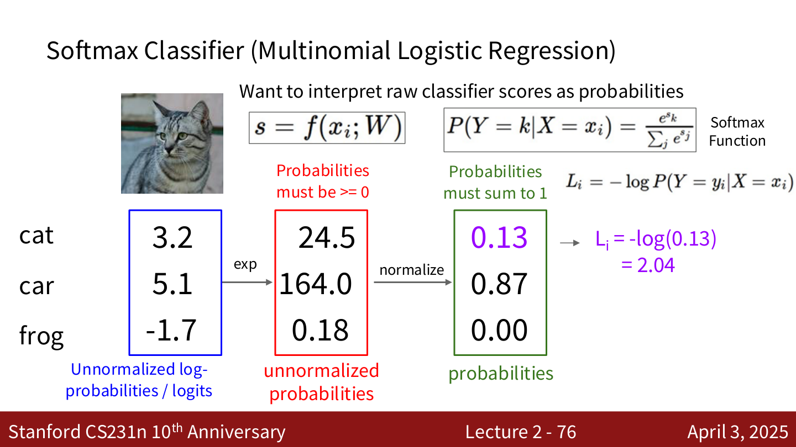{ width="550" }

### 关键性质

- **最小值**：$L_i = 0$（当正确类别概率为 1 时），理论上不可达到，只能趋近
- **最大值**：$L_i = +\infty$（当正确类别概率趋近 0 时）
- **初始化时的损失**：所有得分近似相等时，$P \approx 1/C$，所以 $L_i \approx -\log(1/C) = \log C$。对于 CIFAR-10（$C = 10$），初始损失约为 $\log(10) \approx 2.3$。这是一个很好的 **sanity check**。

### 概率解释

Softmax 损失等价于 **最大似然估计 (Maximum Likelihood Estimation)**：选择权重来最大化观测数据的似然。

也可以理解为最小化预测概率分布与真实分布（one-hot 向量）之间的 **交叉熵 (Cross Entropy)** 或 **KL 散度 (Kullback-Leibler Divergence)**。

---

## SVM 损失 (Hinge Loss) — 阅读作业

### Multiclass SVM Loss

$$
L_i = \sum_{j \neq y_i} \max(0, s_j - s_{y_i} + 1)
$$

其中 $s = f(x_i, W)$ 是得分向量。

**含义**：对于每个不正确的类别 $j$，如果正确类别的得分 $s_{y_i}$ 没有比 $s_j$ 高出至少 1（margin），就会产生损失。

### 计算示例

假设 3 个训练样本，3 个类别，得分如下：

|       | cat (图1) | car (图2) | frog (图3) |
|-------|----------|----------|-----------|
| cat   | 3.2      | 1.3      | 2.2       |
| car   | 5.1      | 4.9      | 2.5       |
| frog  | -1.7     | 2.0      | -3.1      |

**图1 (cat)**：$L_1 = \max(0, 5.1 - 3.2 + 1) + \max(0, -1.7 - 3.2 + 1) = 2.9 + 0 = 2.9$

**图2 (car)**：$L_2 = \max(0, 1.3 - 4.9 + 1) + \max(0, 2.0 - 4.9 + 1) = 0 + 0 = 0$

**图3 (frog)**：$L_3 = \max(0, 2.2 - (-3.1) + 1) + \max(0, 2.5 - (-3.1) + 1) = 6.3 + 6.6 = 12.9$

**总损失**：$L = (2.9 + 0 + 12.9) / 3 = 5.27$

### Hinge Loss 的形状

损失关于得分差 $s_{y_i} - s_j$ 的图像是一个"铰链"形状：当正确类别得分足够高时损失为 0，否则线性增长。

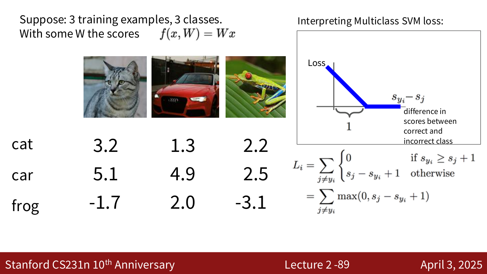{ width="550" }

### 关键问题

- **Q: 如果 car 的分数降低 0.5？** 损失不变（因为 car 已经远高于 margin）
- **Q: 最小 / 最大损失？** 最小为 0，最大为 $+\infty$
- **Q: 初始化时所有 $s \approx 0$，损失是多少？** $L_i = C - 1$（$C$ 为类别数），可以用来做 sanity check
- **Q: 如果 sum 包含 $j = y_i$？** 损失会增加 1（加一个常数，不影响最优 $W$）
- **Q: 如果用 mean 代替 sum？** 只是缩放损失，不影响最优 $W$
- **Q: 如果用 $\max(0, s_j - s_{y_i} + 1)^2$？** 这是 squared hinge loss，不同的损失函数，会得到不同的 $W$

### SVM Loss 代码

```python
def L_i_vectorized(x, y, W):
    scores = W.dot(x)
    margins = np.maximum(0, scores - scores[y] + 1)
    margins[y] = 0
    loss_i = np.sum(margins)
    return loss_i
```

---

## Softmax vs. SVM

| 特性 | Softmax (Cross-Entropy) | SVM (Hinge Loss) |
|------|------------------------|-------------------|
| 输出 | 概率分布 | 原始得分 |
| 损失 | $-\log(e^{s_{y_i}} / \sum_j e^{s_j})$ | $\sum_{j \neq y_i} \max(0, s_j - s_{y_i} + 1)$ |
| 对得分变化的敏感度 | 即使正确类别已经领先，仍然会试图让得分差距更大 | 一旦正确类别的得分超过其他类别 margin 以上，损失就不再变化 |

**示例**：假设 $y_i = 0$，分别考虑以下得分：

- $[10, -2, 3]$：SVM loss = 0, Softmax loss > 0
- $[10, 9, 9]$：SVM loss = 0, Softmax loss 较大
- $[10, -100, -100]$：SVM loss = 0, Softmax loss 接近 0

如果将正确类别得分从 10 提高到 20：SVM loss 不变（已经是 0），Softmax loss 会进一步减小。

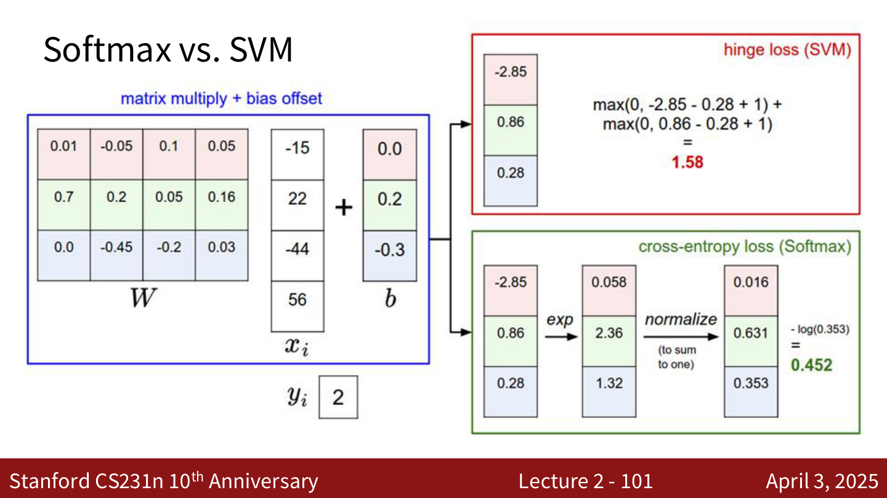{ width="550" }

---

## 接下来的内容

- **正则化 (Regularization)**：防止过拟合
- **优化 (Optimization)**：如何找到最优的 $W$
