参考：Stanford CS231n 10th Anniversary, Lecture 3, April 8, 2025

---

## 回顾：损失函数

在上一讲中，我们建立了线性分类器的基本框架：

- **得分函数 (Score Function)**：$s = f(x; W) = Wx$
- **损失函数 (Loss Function)**：衡量预测与真实标签之间的差距

给定数据集 $\{(x_i, y_i)\}_{i=1}^N$，总损失为各样本损失的平均：

$$
L = \frac{1}{N} \sum_i L_i(f(x_i, W), y_i)
$$

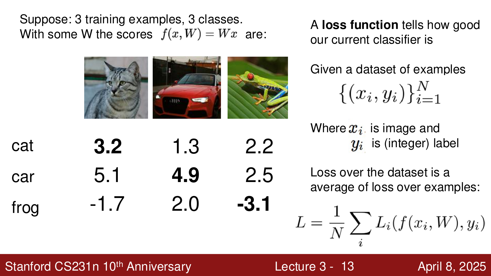{ width="550" }

---

## 正则化 (Regularization)

### 为什么需要正则化？

仅靠数据损失来训练模型存在一个根本问题：模型可能会 **过拟合 (overfit)** 训练数据——在训练集上表现完美，但在新数据上表现很差。

正则化的完整损失函数：

$$
L(W) = \frac{1}{N} \sum_{i=1}^{N} L_i(f(x_i, W), y_i) + \lambda R(W)
$$

- 第一项是 **数据损失 (Data Loss)**：模型预测应当匹配训练数据
- 第二项是 **正则化损失 (Regularization Loss)**：阻止模型在训练数据上拟合得 *太好*

$\lambda$ 是 **正则化强度**（超参数），控制两项之间的权衡。

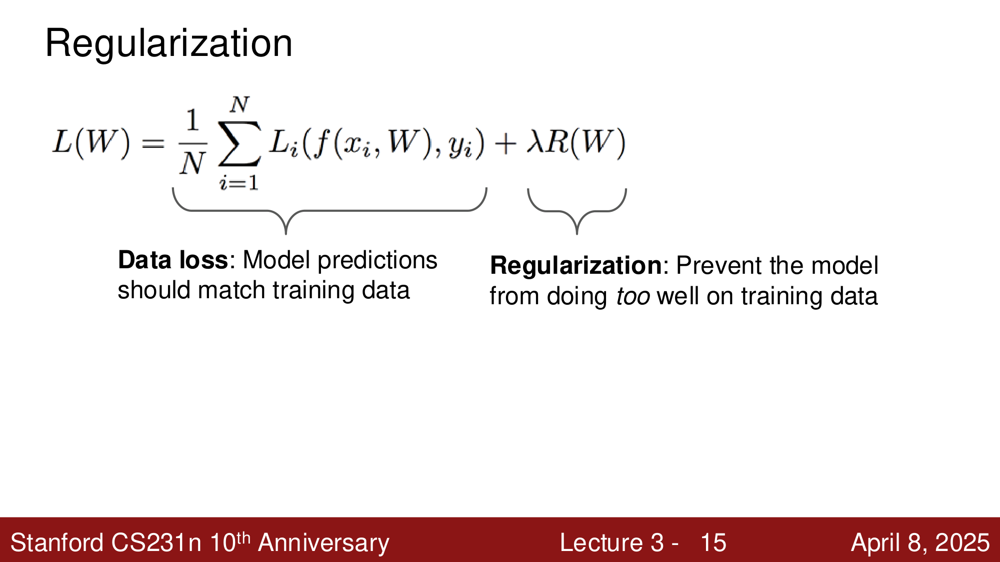{ width="550" }

### 正则化的直觉

考虑一个简单的回归问题。给定训练数据点，有两种拟合方式：

- $f_1$：一条复杂的高次曲线，完美穿过每一个训练点
- $f_2$：一条简单的直线，大致拟合趋势但不完美

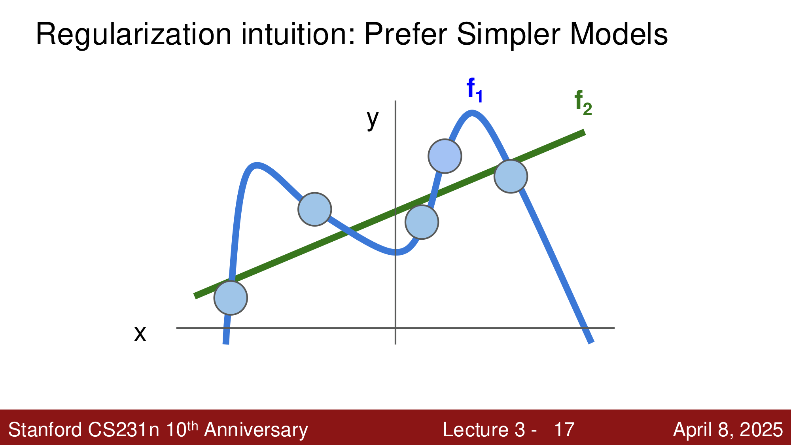{ width="550" }

当出现新的测试数据时，$f_2$（简单模型）通常表现更好，因为它没有拟合训练数据中的噪声。这就是 **奥卡姆剃刀 (Occam's Razor)** 的思想：在多个能解释数据的假说中，最简单的那个往往是最好的。

### 常见的正则化方法

**简单形式**：

- **L2 正则化**：$R(W) = \sum_k \sum_l W_{k,l}^2$
- **L1 正则化**：$R(W) = \sum_k \sum_l |W_{k,l}|$
- **Elastic Net (L1 + L2)**：$R(W) = \sum_k \sum_l \beta W_{k,l}^2 + |W_{k,l}|$

**更复杂的形式**：Dropout、Batch Normalization、Stochastic Depth 等（后续课程讨论）。

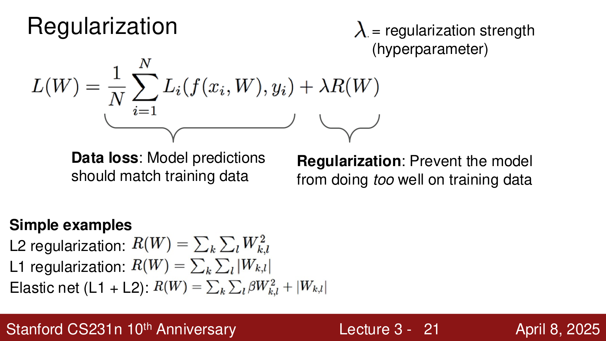{ width="550" }

### 为什么正则化有效？

- **表达对权重的偏好**：引导模型选择特定形式的权重
- **使模型更简单**：提高泛化能力
- **改善优化**：为损失函数增加曲率

### L2 正则化的偏好

考虑输入 $x = [1, 1, 1, 1]$，两组权重：

- $w_1 = [1, 0, 0, 0]$
- $w_2 = [0.25, 0.25, 0.25, 0.25]$

两者的预测结果相同：$w_1^T x = w_2^T x = 1$

但 L2 正则化值不同：

- $R(w_1) = 1^2 + 0 + 0 + 0 = 1$
- $R(w_2) = 4 \times 0.25^2 = 0.25$

**L2 正则化偏好 $w_2$**，因为它将权重 **分散** 到所有维度上，让模型更多地依赖所有输入特征，而非仅依赖某一个特征。

相反，**L1 正则化偏好 $w_1$**（稀疏权重），因为 $|w_1|_1 = 1 < |w_2|_1 = 1$... 实际上这个例子中 L1 范数相同，但通常 L1 会推动权重变为稀疏（许多值为 0）。

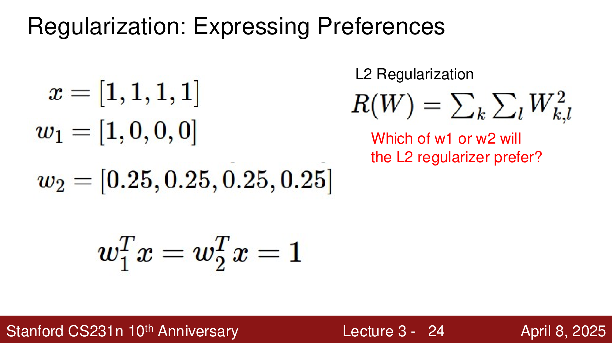{ width="550" }

---

## 回顾：完整框架

到目前为止我们有：

- **数据集**：$(x, y)$ 对
- **得分函数**：$s = f(x; W) = Wx$
- **损失函数**：如 Softmax（交叉熵）$L_i = -\log\left(\frac{e^{s_{y_i}}}{\sum_j e^{s_j}}\right)$
- **完整损失**：$L = \frac{1}{N}\sum_{i=1}^N L_i + R(W)$

**核心问题**：如何找到最优的 $W$？这就是 **优化 (Optimization)** 的任务。

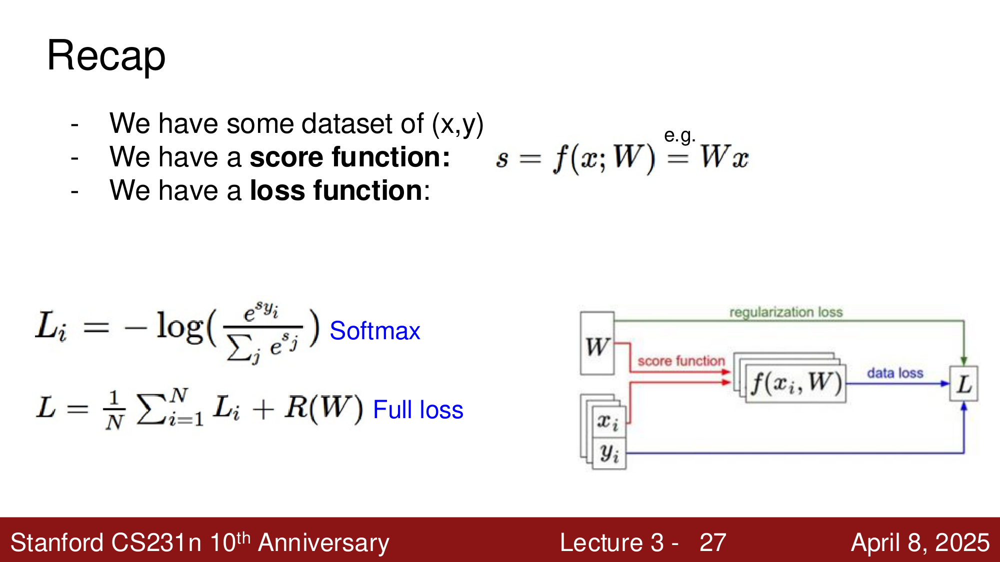{ width="550" }

---

## 优化 (Optimization)

### 策略 #1：随机搜索（非常差的方法）

随机生成大量权重矩阵 $W$，评估损失，保留最好的一个。

在 CIFAR-10 上只能达到约 **15.5%** 的准确率（随机猜测是 10%，SOTA 约 99.7%）。这显然不是一个好方法。

### 策略 #2：沿着斜坡走下去

想象站在山上，想走到最低的山谷——应该沿着 **最陡** 的方向走下去。在数学中，这就是 **梯度下降 (Gradient Descent)**。

### 梯度 (Gradient)

在一维中，函数的导数定义为：

$$
\frac{df(x)}{dx} = \lim_{h \to 0} \frac{f(x+h) - f(x)}{h}
$$

在多维中，**梯度 (Gradient)** 是偏导数组成的向量：

$$
\nabla_W f = \left[\frac{\partial f}{\partial W_1}, \frac{\partial f}{\partial W_2}, \dots \right]
$$

- 任意方向的斜率 = 该方向与梯度的 **点积**
- **最速下降方向** 就是 **负梯度方向**

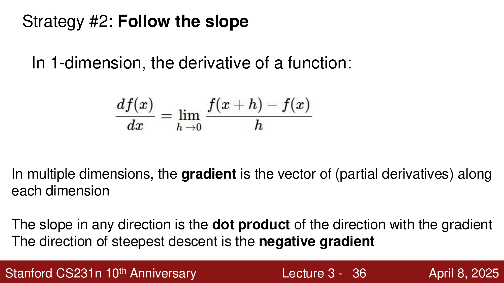{ width="550" }

### 数值梯度 vs 解析梯度

**数值梯度 (Numerical Gradient)**：

对每个维度，逐一微扰 $W$ 的某个分量，计算损失变化：

$$
\frac{\partial L}{\partial W_k} \approx \frac{L(W + h \cdot e_k) - L(W)}{h}
$$

- 优点：容易实现
- 缺点：**非常慢**（需要对每个参数都做一次前向传播），且只是近似值

**解析梯度 (Analytic Gradient)**：

利用微积分直接推导出梯度的封闭形式表达式。

- 优点：**精确、快速**
- 缺点：容易写错

**实践中**：始终使用解析梯度，但用数值梯度来验证实现的正确性。这称为 **梯度检查 (Gradient Check)**。

### 梯度下降 (Gradient Descent)

有了梯度，优化过程非常简单：反复沿负梯度方向更新权重。

$$
W_{t+1} = W_t - \alpha \nabla_W L(W_t)
$$

其中 $\alpha$ 是 **学习率 (Learning Rate)**，控制每步走多远。

```python
# Vanilla Gradient Descent
while True:
    weights_grad = evaluate_gradient(loss_fun, data, weights)
    weights += - step_size * weights_grad  # perform parameter update
```

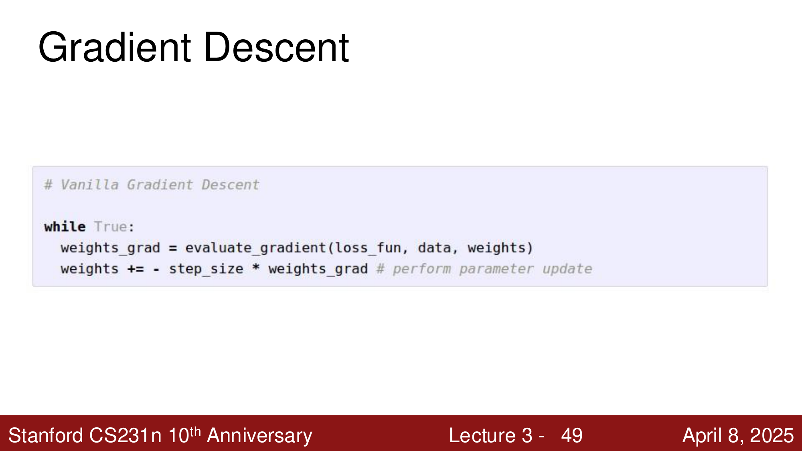{ width="550" }

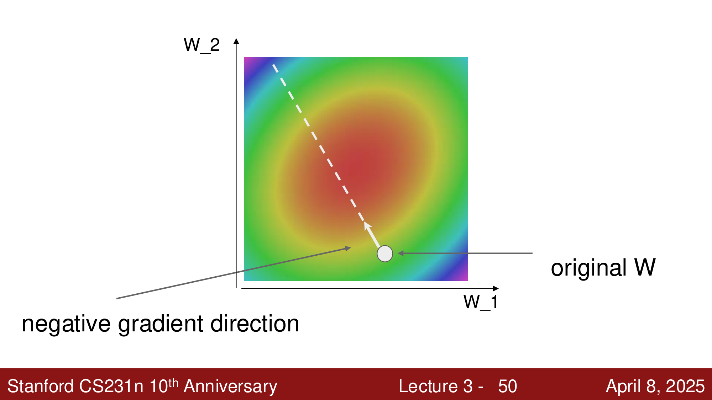{ width="550" }

### 随机梯度下降 (Stochastic Gradient Descent, SGD)

当数据集很大时（如 $N$ 为百万级别），计算全部样本的梯度非常昂贵。**SGD** 的核心思想是用一个 **小批量 (minibatch)** 的样本来近似全体梯度：

$$
\nabla_W L(W) = \frac{1}{N} \sum_{i=1}^{N} \nabla_W L_i(x_i, y_i, W) + \lambda \nabla_W R(W)
$$

每次随机采样一小批样本（通常 32 / 64 / 128 个）来估计梯度。

```python
# Vanilla Minibatch Gradient Descent
while True:
    data_batch = sample_training_data(data, 256)  # sample 256 examples
    weights_grad = evaluate_gradient(loss_fun, data_batch, weights)
    weights += - step_size * weights_grad  # perform parameter update
```

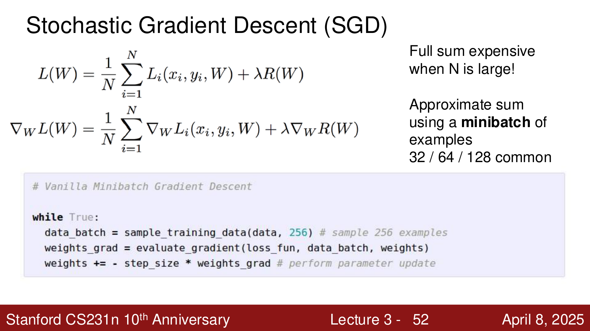{ width="550" }

---

## SGD 的问题与改进

### 问题 #1：病态条件 (Poor Conditioning)

当损失函数在某些方向上变化很快、在另一些方向上变化很慢时（即 Hessian 矩阵的 **条件数** 很大），SGD 会在陡峭方向上来回振荡，而在平坦方向上进展缓慢。

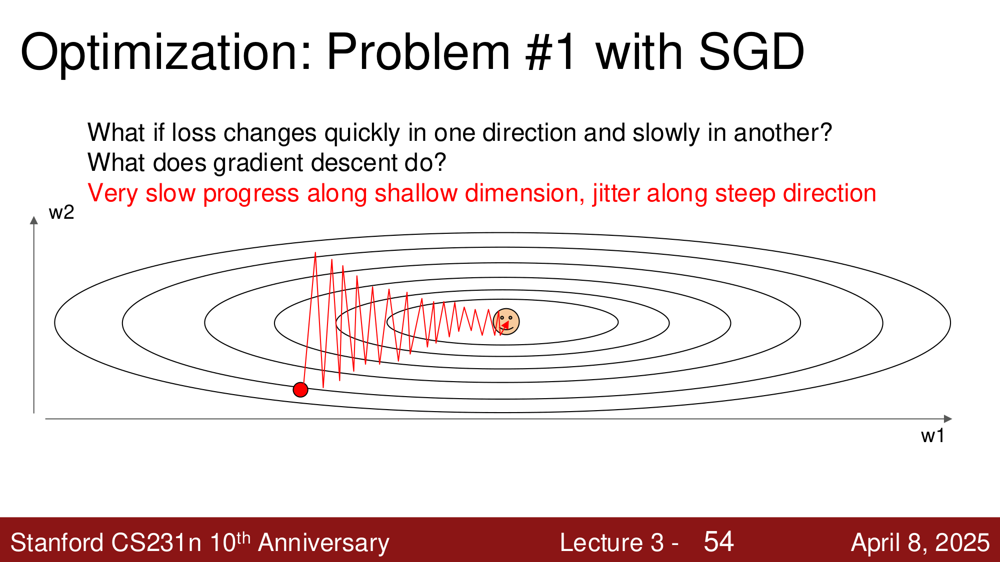{ width="550" }

### 问题 #2：局部极小值和鞍点

- **局部极小值 (Local Minima)**：梯度为零，SGD 会卡住
- **鞍点 (Saddle Point)**：某些方向上是极小、某些方向上是极大，梯度也为零

在高维空间中，**鞍点比局部极小值更常见**。

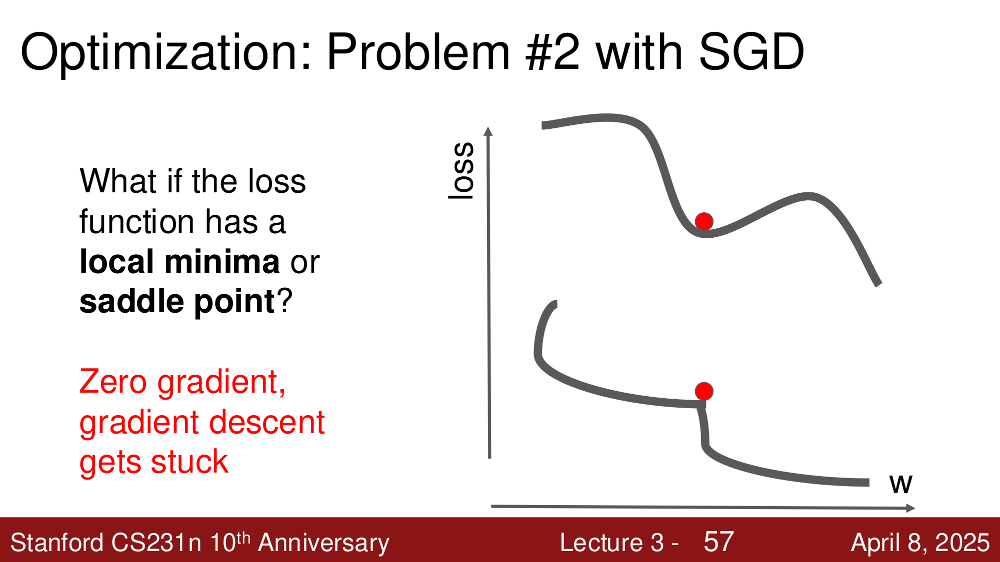{ width="550" }

**鞍点的直观理解**：考虑 $f(x, y) = x^2 - y^2$，在原点处 $\frac{\partial f}{\partial x} = 2x = 0$，$\frac{\partial f}{\partial y} = -2y = 0$，梯度为零，但该点既不是极大值也不是极小值。

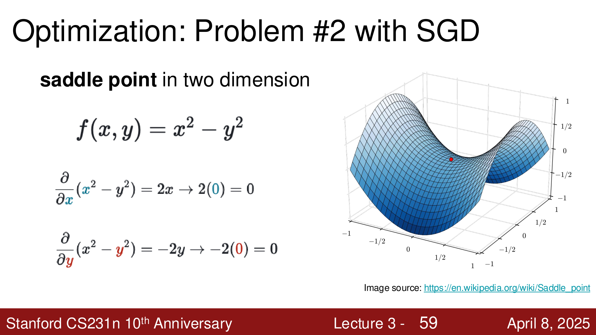{ width="550" }

### 问题 #3：梯度噪声

由于 SGD 使用 minibatch 近似梯度，估计的梯度本身带有噪声，导致优化路径不平滑。

---

## SGD + Momentum

**动量法 (Momentum)** 是解决上述三个问题的经典方法。核心思想是维护一个 **速度 (velocity)** 变量，作为梯度的指数移动平均：

$$
v_{t+1} = \rho v_t + \nabla f(x_t)
$$

$$
x_{t+1} = x_t - \alpha v_{t+1}
$$

- $\rho$ 是 **动量系数**（通常 $\rho = 0.9$ 或 $0.99$），表示"摩擦力"
- 速度 $v$ 累积了历史梯度的信息

```python
vx = 0
while True:
    dx = compute_gradient(x)
    vx = rho * vx + dx
    x -= learning_rate * vx
```

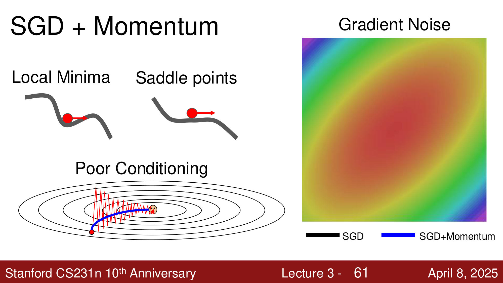{ width="550" }

**为什么有效？**

- **局部极小值 / 鞍点**：即使梯度为零，速度仍然非零，可以继续前进
- **病态条件**：在振荡方向上，正负梯度相互抵消；在一致方向上，速度不断累积
- **梯度噪声**：速度对梯度进行了平均，减少了噪声的影响

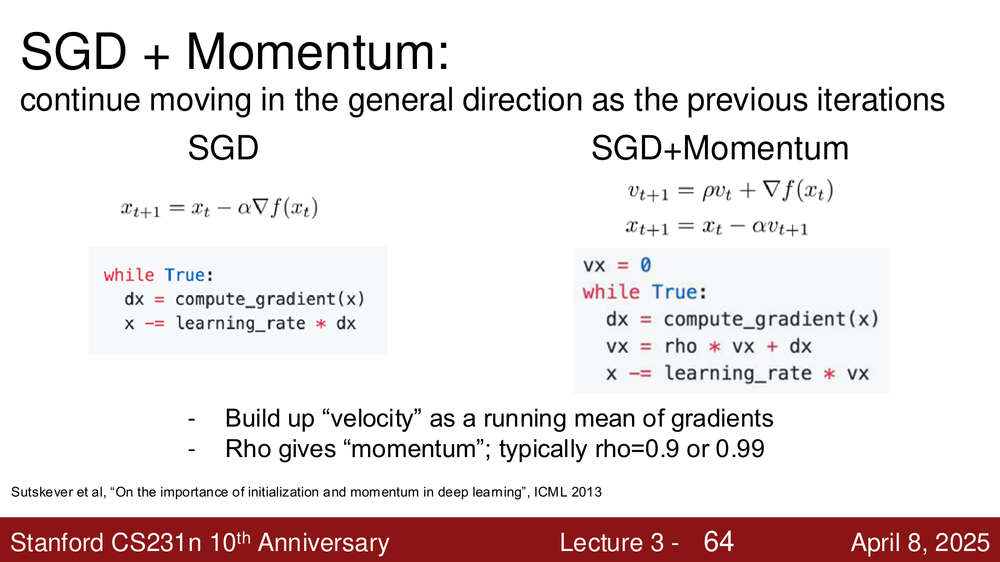{ width="550" }

---

## RMSProp

RMSProp 采用另一种思路来解决病态条件问题：为每个参数维护一个 **自适应学习率 (adaptive learning rate)**。

```python
grad_squared = 0
while True:
    dx = compute_gradient(x)
    grad_squared = decay_rate * grad_squared + (1 - decay_rate) * dx * dx
    x -= learning_rate * dx / (np.sqrt(grad_squared) + 1e-7)
```

- 对梯度的 **平方** 做指数移动平均
- 更新时除以 $\sqrt{\text{grad\_squared}}$：梯度大的维度步长变小，梯度小的维度步长变大

**效果**：在陡峭方向上减速，在平坦方向上加速，从而更快地到达最优解。

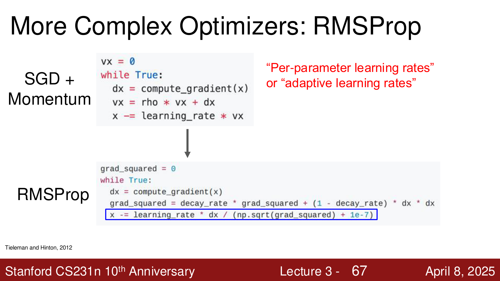{ width="550" }

---

## Adam

**Adam (Adaptive Moment Estimation)** 结合了 Momentum 和 RMSProp 的优点，是目前最常用的优化器之一。

Adam 维护两个指数移动平均：

- **一阶矩 (First Moment)**：梯度的均值（类似 Momentum）
- **二阶矩 (Second Moment)**：梯度平方的均值（类似 RMSProp）

并加入 **偏差校正 (Bias Correction)**，修正初始阶段因矩估计从零开始导致的偏差。

```python
first_moment = 0
second_moment = 0
for t in range(1, num_iterations):
    dx = compute_gradient(x)
    first_moment = beta1 * first_moment + (1 - beta1) * dx          # Momentum
    second_moment = beta2 * second_moment + (1 - beta2) * dx * dx   # RMSProp
    first_unbias = first_moment / (1 - beta1 ** t)                  # Bias correction
    second_unbias = second_moment / (1 - beta2 ** t)                # Bias correction
    x -= learning_rate * first_unbias / (np.sqrt(second_unbias) + 1e-7)
```

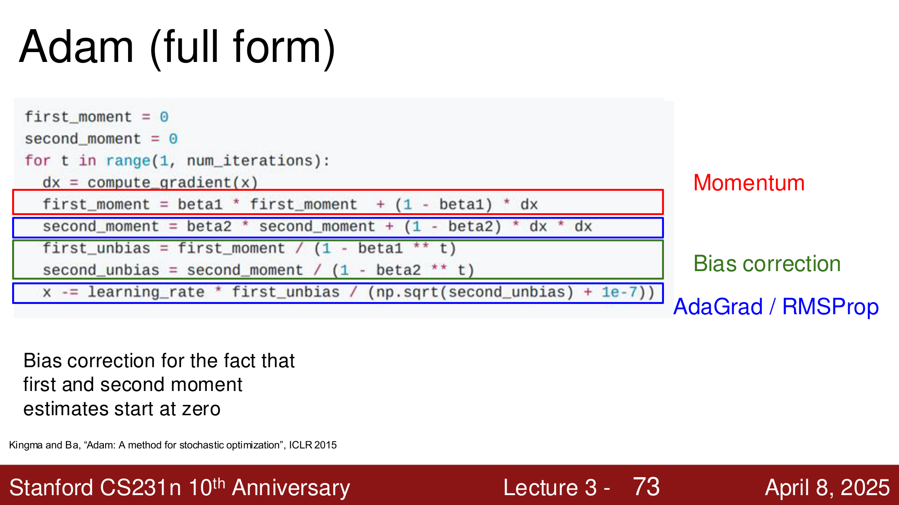{ width="550" }

**推荐的默认参数**：

- $\beta_1 = 0.9$
- $\beta_2 = 0.999$
- learning_rate = $1 \times 10^{-3}$ 或 $5 \times 10^{-4}$

这是许多模型的良好起点。

### 优化器对比可视化

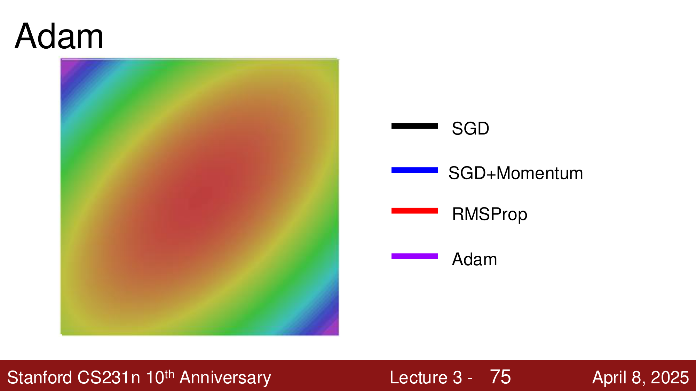{ width="550" }

---

## AdamW：带权重衰减的 Adam

正则化与优化器的交互方式很重要。标准 Adam 在 **计算梯度时** 就包含了 L2 正则化项，这意味着正则化梯度也会参与一阶矩和二阶矩的计算。

**AdamW** 将权重衰减（等价于 L2 正则化）从梯度计算中 **分离** 出来，直接在参数更新步骤中施加：

- **标准 Adam**：在 `compute_gradient(x)` 中计算 L2，用于动量计算
- **AdamW**：在最终更新 `x -= ...` 后额外添加 `x -= wd * x`

实验表明，AdamW 通常比标准 Adam + L2 正则化表现更好。

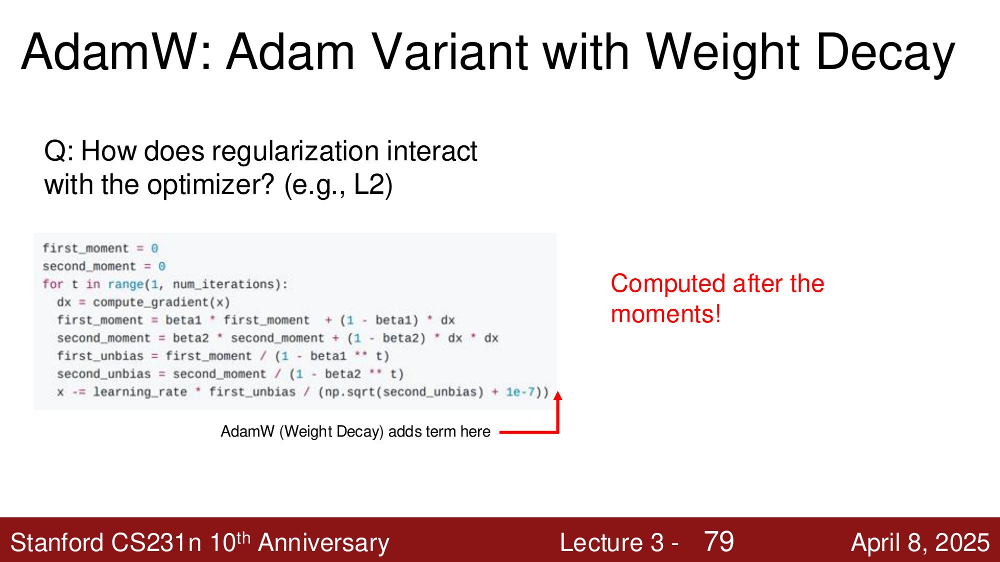{ width="550" }

---

## 学习率调度 (Learning Rate Schedules)

学习率是所有优化器最重要的超参数。过大的学习率会导致损失爆炸，过小的学习率会收敛缓慢。

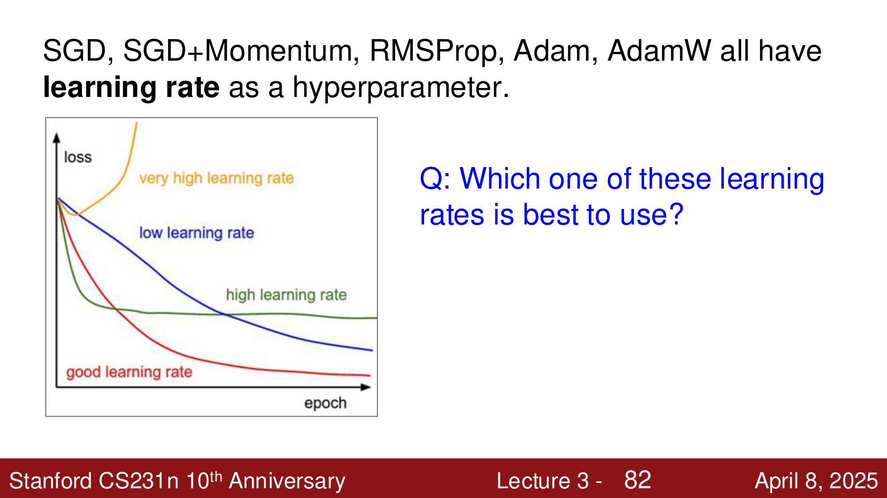{ width="550" }

实践中，通常不使用固定学习率，而是让学习率随训练过程 **逐渐减小**。

### 常见的学习率衰减策略

**Step Decay**：在固定的 epoch 节点降低学习率。例如 ResNet 在 epoch 30、60、90 时将学习率乘以 0.1。

**Cosine Decay**：

$$
\alpha_t = \frac{1}{2}\alpha_0 \left(1 + \cos(t\pi / T)\right)
$$

其中 $\alpha_0$ 是初始学习率，$t$ 是当前 epoch，$T$ 是总 epoch 数。

**Linear Decay**：

$$
\alpha_t = \alpha_0 (1 - t/T)
$$

**Inverse Square Root Decay**：

$$
\alpha_t = \alpha_0 / \sqrt{t}
$$

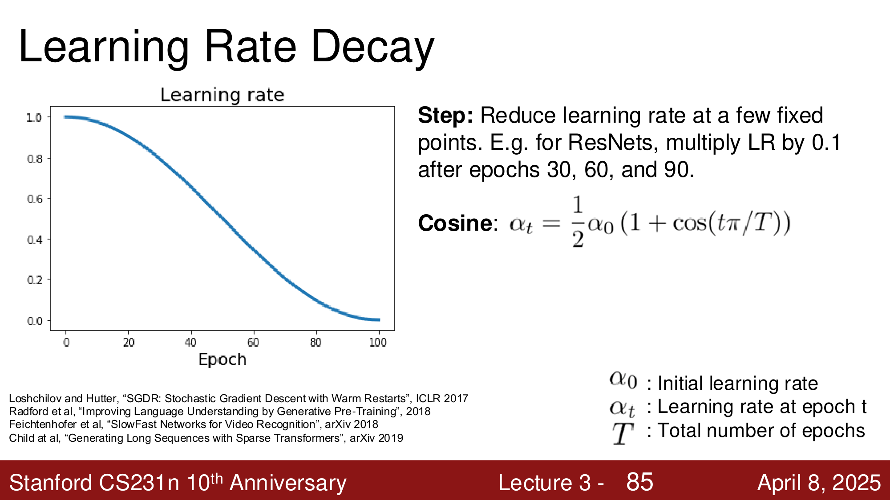{ width="550" }

### 学习率预热 (Linear Warmup)

高初始学习率可能导致训练初期损失爆炸。**线性预热** 在训练前 $\sim 5000$ 步内将学习率从 0 线性增加到目标值，之后再开始衰减。

经验法则：如果将 batch size 增大 $N$ 倍，初始学习率也应相应增大 $N$ 倍。

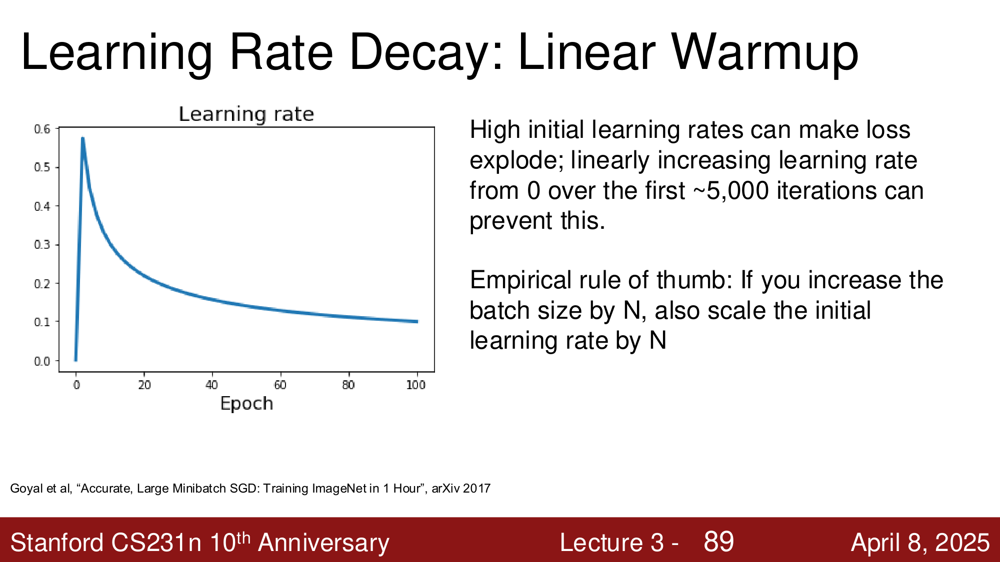{ width="550" }

---

## 一阶优化 vs 二阶优化

我们讨论的所有优化器（SGD、Momentum、Adam 等）都是 **一阶方法 (First-Order)**：只使用梯度（一阶导数）来构建线性近似，然后沿下降方向走一步。

**二阶方法 (Second-Order)** 使用梯度 **和** Hessian 矩阵（二阶导数）来构建 **二次近似**，直接跳到近似函数的极小值点：

$$
\theta^* = \theta_0 - H^{-1} \nabla_\theta J(\theta_0)
$$

优点是不需要选择学习率，收敛更快。但 Hessian 矩阵有 $O(N^2)$ 个元素，求逆需要 $O(N^3)$ 的计算量——当 $N$ 为几千万甚至上亿参数时，这是不可行的。

近似方法（如 L-BFGS）在全批量小模型中效果很好，但在大规模随机优化中效果不佳。

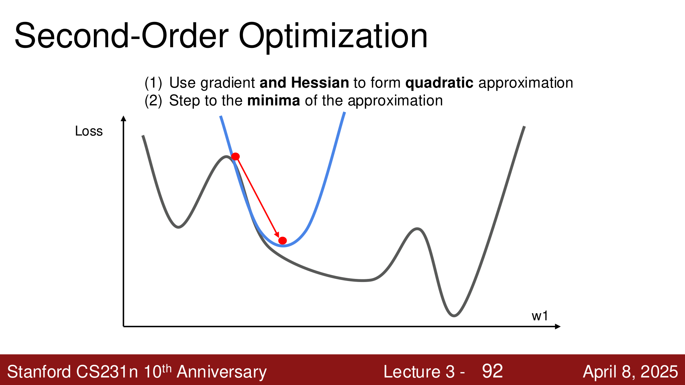{ width="550" }

### 实践建议

- **Adam(W)** 是大多数情况下的良好默认选择，即使使用常数学习率也能工作
- **SGD+Momentum** 经过仔细调参后可能比 Adam 表现更好，但需要更多的学习率和调度调优
- 如果能承受全批量更新，可以尝试二阶方法

---

## 展望：神经网络

目前我们使用的是线性得分函数 $f = Wx$，表达能力有限。下一讲将引入 **神经网络**，通过叠加多个线性层和非线性激活函数来构建更强大的模型。

### 为什么需要非线性？

线性分类器无法解决某些分布问题（如同心圆分布）。但如果先对输入做一个 **非线性特征变换**（例如从笛卡尔坐标 $(x, y)$ 变换到极坐标 $(r, \theta)$），原本不可分的数据就变得线性可分了。

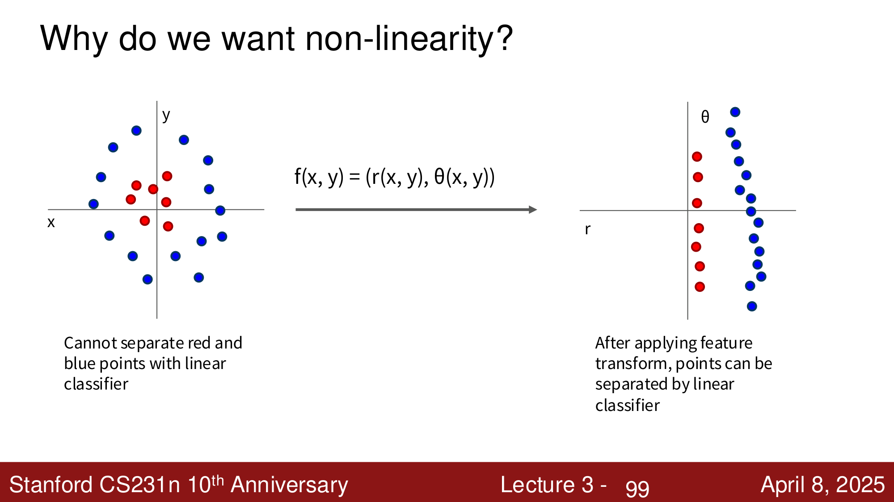{ width="550" }

### 两层神经网络

$$
f = W_2 \max(0, W_1 x)
$$

其中 $x \in \mathbb{R}^D$，$W_1 \in \mathbb{R}^{H \times D}$，$W_2 \in \mathbb{R}^{C \times H}$。

$\max(0, \cdot)$ 是 **ReLU 激活函数**，提供了关键的非线性。没有这个非线性，两个线性变换的组合仍然是线性的（$W_2 W_1 x$ 等价于一个新的矩阵乘法），不会增加表达能力。

这种网络也称为 **全连接网络 (Fully-Connected Network)** 或 **多层感知机 (MLP)**。

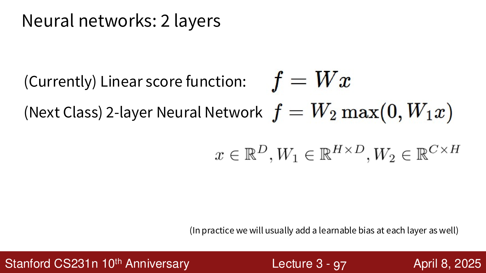{ width="550" }

---

## 下节预告

- 神经网络详解
- **反向传播 (Backpropagation)**：如何高效计算神经网络中的梯度
