[拉普拉斯变换讲义](slides/!%20工程数学_复变函数_第七章_拉普拉斯变换_20260412.pdf)

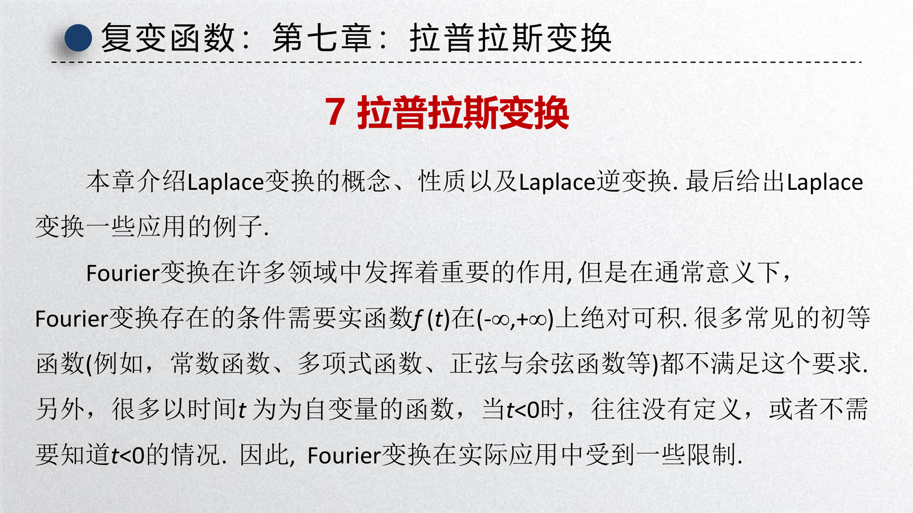{ width="750" }

**重点**：Laplace 变换的性质与应用、逆变换的留数计算法

**难点**：周期函数和 $\delta$ 函数的变换、留数法求逆变换

---

## 7.0 动机：从 Fourier 到 Laplace（单边变换）

Fourier 变换在理论与工程中非常重要，但通常要求 $f(t)$ 在 $(-\infty,+\infty)$ 上绝对可积。很多常见函数（常数、多项式、正弦余弦等）不满足该条件；并且许多工程信号只关心 $t\ge 0$ 的响应（初值问题、因果系统），对 $t<0$ 的取值要么没有定义、要么没有意义。

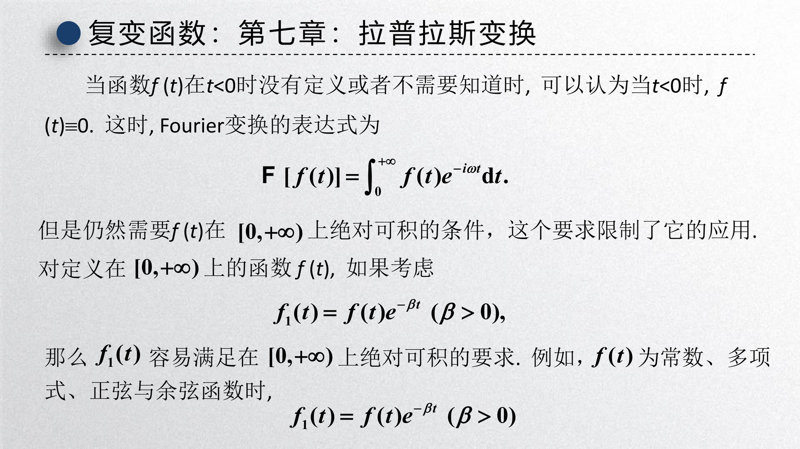{ width="750" }

讲义的核心思路是：对 $t\ge 0$ 的函数 $f(t)$，引入一个指数衰减因子 $e^{-\beta t}$（$\beta>0$）把增长“压住”，使其更容易绝对可积。于是类似 Fourier 变换的积分变为

$$
\int_0^{+\infty} f(t)e^{-\beta t}e^{-i\omega t}\,\mathrm{d}t
=
\int_0^{+\infty} f(t)e^{-(\beta+i\omega)t}\,\mathrm{d}t.
$$

记 $s=\beta+i\omega$，就得到 Laplace 变换的标准形式：

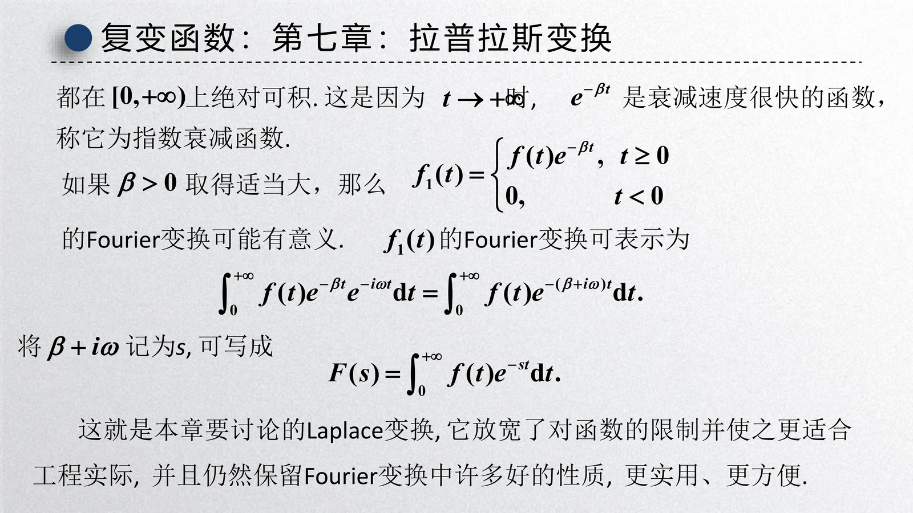{ width="750" }

这解释了两个关键点：

- Laplace 变换本质上是在 Fourier 框架里把频率轴“推”到复平面 $s=\sigma+i\omega$ 上，从而显著放宽可积性要求。
- 工程里常用的是 **单边（unilateral）Laplace**：把 $t<0$ 视为 $0$，尤其适合初值问题与因果系统。

## 7.1 Laplace 变换的概念

### 定义与存在定理

!!! abstract "定义 1（Laplace 变换）"
    设函数 $f(t)$ 在 $t \geq 0$ 上有定义，且积分

    $$
    \mathcal{L}[f(t)] = F(s) = \int_0^{+\infty} f(t)e^{-st} \, \mathrm{d}t
    $$

    在复参数 $s$ 的某一区域内收敛，则称 $F(s)$ 为 $f(t)$ 的 **Laplace 变换**（像函数），$f(t)$ 为 $F(s)$ 的 **像原函数**。

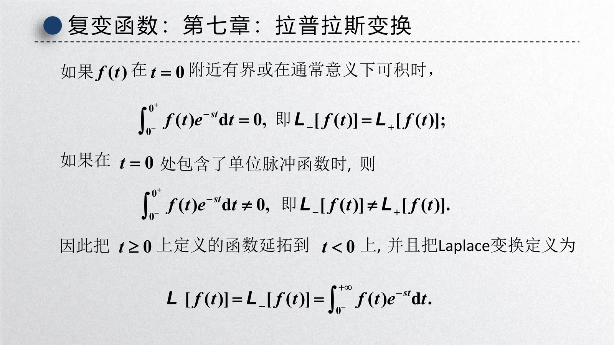{ width="650" }

!!! note "单边（unilateral）与双边（bilateral）Laplace"
    本章默认采用单边 Laplace：只积分 $t\ge 0$ 的部分，因此非常适合处理初值问题。若 $f(t)$ 在 $t=0$ 附近可积且无冲激项，通常可以把 $t<0$ 处延拓为 $0$ 而不影响变换结果；但若 $t=0$ 处含有 $\delta(t)$ 等冲激项，则需要特别注意 $t=0$ 的贡献。

!!! abstract "定理 1（Laplace 变换存在定理）"
    若函数 $f(t)$ 满足：

    1. 在 $t \geq 0$ 的任一有限区间上 **分段连续**
    2. 当 $t \to +\infty$ 时，$f(t)$ 的 **增长指数** 不超过某一指数函数，即存在常数 $M > 0$，$\sigma_0 \geq 0$，使得

    $$
    |f(t)| \leq Me^{\sigma_0 t}, \quad t \geq 0
    $$

    则 $f(t)$ 的 Laplace 变换在 **半平面** $\text{Re}(s) > \sigma_0$ 上 **存在且解析**。

    其中 $\sigma_0$ 称为 $f(t)$ 的 **增长指数**。

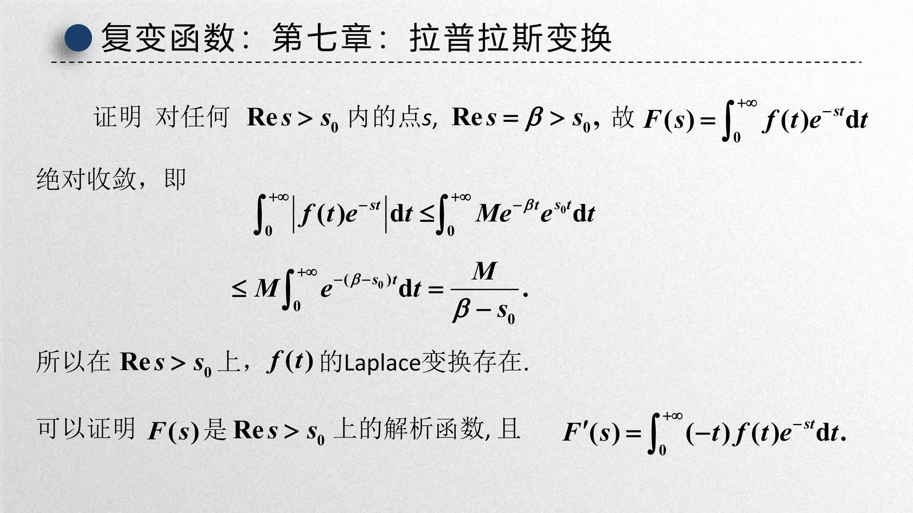{ width="650" }

!!! abstract "定理 1.1（Abel 型收敛定理与收敛半平面）"
    若积分 $\int_0^{+\infty} f(t)e^{-st}\,\mathrm{d}t$ 在 $s_1=\beta_1+i\omega_1$ 处收敛，则它在半平面 $\text{Re}(s)>\beta_1$ 上处处收敛，且由该积分确定的像函数 $F(s)$ 在该半平面上解析；若它在 $s_2=\beta_2+i\omega_2$ 处发散，则它在 $\text{Re}(s)<\beta_2$ 上处处发散。

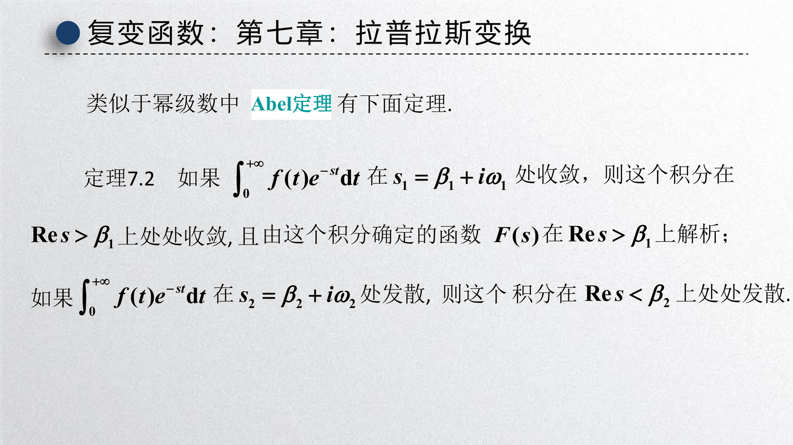{ width="650" }

!!! info "收敛域（ROC）与收敛指数 $\sigma$"
    由上一结论可知：存在一个实数 $\sigma$（可能为 $\pm\infty$），使得

    - 当 $\text{Re}(s)>\sigma$ 时，$\int_0^{+\infty} f(t)e^{-st}\,\mathrm{d}t$ 收敛
    - 当 $\text{Re}(s)<\sigma$ 时，该积分发散

    且在收敛域内像函数 $F(s)=\mathcal{L}[f(t)]$ 是 $s$ 的解析函数。

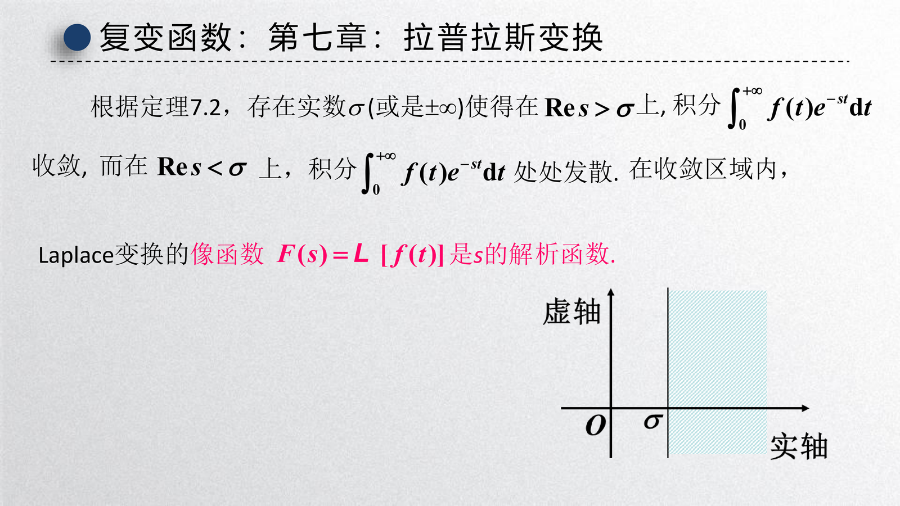{ width="650" }

### 基本变换对

???+ example "例 1：单位阶跃函数 $u(t)$"

    $$
    \mathcal{L}[u(t)] = \int_0^{+\infty} e^{-st} \, \mathrm{d}t = \frac{1}{s}, \quad \text{Re}(s) > 0
    $$

???+ example "例 2：指数函数 $e^{at}$"

    $$
    \mathcal{L}[e^{at}] = \int_0^{+\infty} e^{at}e^{-st} \, \mathrm{d}t = \int_0^{+\infty} e^{-(s-a)t} \, \mathrm{d}t = \frac{1}{s-a}, \quad \text{Re}(s) > \text{Re}(a)
    $$

???+ example "例 3：正弦函数 $\sin\omega t$ 和余弦函数 $\cos\omega t$"

    利用 $\sin\omega t = \frac{e^{i\omega t} - e^{-i\omega t}}{2i}$：

    $$
    \mathcal{L}[\sin\omega t] = \frac{1}{2i}\left(\frac{1}{s-i\omega} - \frac{1}{s+i\omega}\right) = \frac{\omega}{s^2 + \omega^2}, \quad \text{Re}(s) > 0
    $$

    同理：

    $$
    \mathcal{L}[\cos\omega t] = \frac{s}{s^2 + \omega^2}, \quad \text{Re}(s) > 0
    $$

???+ example "例 4：幂函数 $t^n$（$n$ 为正整数）"

    利用分部积分：

    $$
    \mathcal{L}[t^n] = \frac{n!}{s^{n+1}}, \quad \text{Re}(s) > 0
    $$

    特别地，$\mathcal{L}[1] = \frac{1}{s}$，$\mathcal{L}[t] = \frac{1}{s^2}$。

    对于一般幂函数 $t^\alpha$（$\alpha > -1$）：

    $$
    \mathcal{L}[t^\alpha] = \frac{\Gamma(\alpha+1)}{s^{\alpha+1}}
    $$

    其中 $\Gamma(s)$ 为 Gamma 函数。

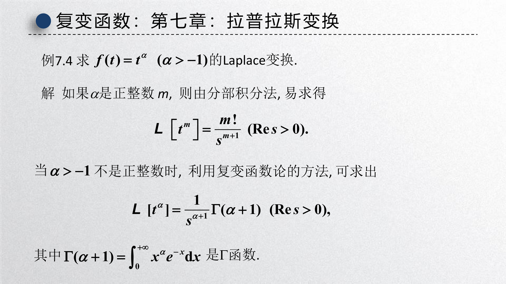{ width="650" }

### 常用 Laplace 变换对表

| $f(t)$ | $F(s) = \mathcal{L}[f(t)]$ | 收敛域 |
|:---:|:---|:---:|
| $1$ | $\frac{1}{s}$ | $\text{Re}(s) > 0$ |
| $t^n$（$n = 0, 1, 2, \ldots$） | $\frac{n!}{s^{n+1}}$ | $\text{Re}(s) > 0$ |
| $e^{at}$ | $\frac{1}{s-a}$ | $\text{Re}(s) > \text{Re}(a)$ |
| $\sin\omega t$ | $\frac{\omega}{s^2 + \omega^2}$ | $\text{Re}(s) > 0$ |
| $\cos\omega t$ | $\frac{s}{s^2 + \omega^2}$ | $\text{Re}(s) > 0$ |
| $\sinh\omega t$ | $\frac{\omega}{s^2 - \omega^2}$ | $\text{Re}(s) > |\omega|$ |
| $\cosh\omega t$ | $\frac{s}{s^2 - \omega^2}$ | $\text{Re}(s) > |\omega|$ |
| $t\sin\omega t$ | $\frac{2\omega s}{(s^2 + \omega^2)^2}$ | $\text{Re}(s) > 0$ |
| $t\cos\omega t$ | $\frac{s^2 - \omega^2}{(s^2 + \omega^2)^2}$ | $\text{Re}(s) > 0$ |
| $e^{at}\sin\omega t$ | $\frac{\omega}{(s-a)^2 + \omega^2}$ | $\text{Re}(s) > \text{Re}(a)$ |
| $e^{at}\cos\omega t$ | $\frac{s-a}{(s-a)^2 + \omega^2}$ | $\text{Re}(s) > \text{Re}(a)$ |

### 周期函数和 $\delta$ 函数的 Laplace 变换

#### 周期函数的变换

!!! abstract "定理 2（周期函数的 Laplace 变换）"
    设 $f(t)$ 是以 $T$ 为周期的函数，则

    $$
    \mathcal{L}[f(t)] = \frac{1}{1 - e^{-sT}} \int_0^T f(t)e^{-st} \, \mathrm{d}t
    $$

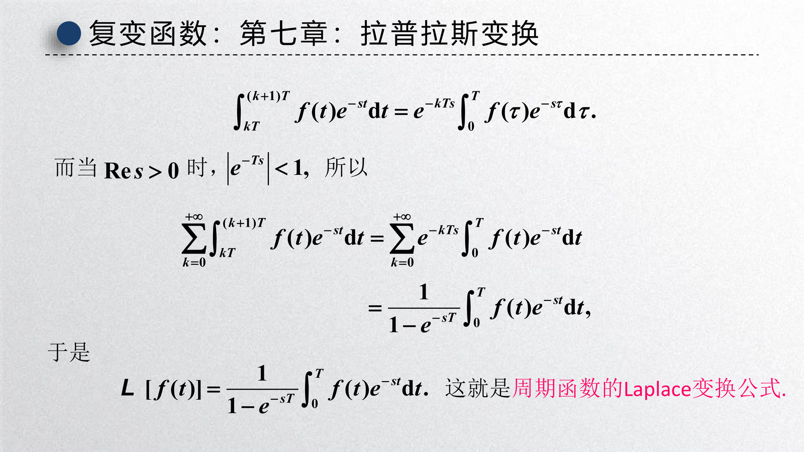{ width="650" }

???+ example "例 5：全波整流函数 $f(t) = |\sin t|$"

    周期 $T = \pi$，在 $[0, \pi]$ 上 $f(t) = \sin t$：

    $$
    \mathcal{L}[|\sin t|] = \frac{1}{1 - e^{-\pi s}} \int_0^\pi \sin t \cdot e^{-st} \, \mathrm{d}t = \frac{1 + e^{-\pi s}}{(1 - e^{-\pi s})(s^2 + 1)}
    $$

#### 单位脉冲函数 $\delta(t)$

!!! abstract "定义 2（单位脉冲函数/Dirac delta 函数）"
    **单位脉冲函数** $\delta(t)$ 定义为：

    $$
    \delta(t) = \begin{cases} 0, & t \neq 0 \\ \infty, & t = 0 \end{cases}, \quad \int_{-\infty}^{+\infty} \delta(t) \, \mathrm{d}t = 1
    $$

    筛选性质：$\int_{-\infty}^{+\infty} f(t)\delta(t-t_0) \, \mathrm{d}t = f(t_0)$

???+ example "例 6：$\delta(t)$ 的 Laplace 变换"

    $$
    \mathcal{L}[\delta(t)] = \int_0^{+\infty} \delta(t)e^{-st} \, \mathrm{d}t = e^{-s \cdot 0} = 1
    $$

???+ example "例 7：含延迟脉冲函数的变换"

    $$
    \mathcal{L}[\delta(t - t_0)] = e^{-st_0}, \quad t_0 > 0
    $$

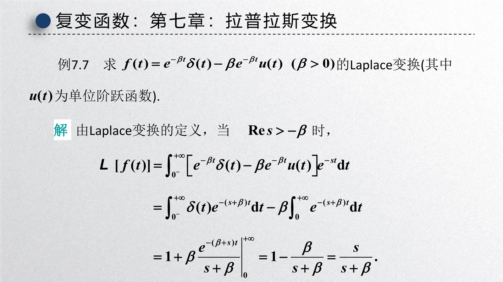{ width="650" }

!!! info "关于 $\delta(t)$ 的几个常用记忆点"
    记住下面三点：

    - $\delta(t)$ 是广义函数（分布），它用“筛选性质”刻画：$\int f(t)\delta(t-t_0)\,\mathrm{d}t=f(t_0)$。
    - 与单位阶跃函数的关系：在分布意义下 $u'(t)=\delta(t)$，因此在处理含跳变输入的微分方程时，$\delta$ 往往表示“瞬时冲击”。
    - 单边 Laplace 中，若 $t=0$ 处包含冲激项，需注意 $t=0$ 附近的积分贡献（讲义有专门说明）。

---

## 7.2 Laplace 变换的性质

### 十大基本性质

#### 1. 线性性质

**性质 1（线性）**：
$$
\mathcal{L}[\alpha f_1(t) + \beta f_2(t)] = \alpha F_1(s) + \beta F_2(s)
$$

#### 2. 微分性质

**性质 2（微分）**：
$$
\mathcal{L}[f'(t)] = sF(s) - f(0)
$$

一般地：

$$
\mathcal{L}[f^{(n)}(t)] = s^nF(s) - s^{n-1}f(0) - s^{n-2}f'(0) - \cdots - f^{(n-1)}(0)
$$

???+ example "例 8：用微分性质求 $\mathcal{L}[\cos\omega t]$"
    因 $(\sin\omega t)' = \omega\cos\omega t$，故

    $$
    \mathcal{L}[\cos\omega t] = \frac{1}{\omega}\mathcal{L}[(\sin\omega t)'] = \frac{1}{\omega}(s \cdot \frac{\omega}{s^2+\omega^2} - 0) = \frac{s}{s^2+\omega^2}
    $$

#### 3. 像函数的微分性质

**性质 3（像函数的微分）**：
$$
F'(s) = -\mathcal{L}[tf(t)] \quad \text{即} \quad \mathcal{L}[tf(t)] = -F'(s)
$$

一般地：$\mathcal{L}[t^nf(t)] = (-1)^n F^{(n)}(s)$。

???+ example "例 10：求 $\mathcal{L}[t\sin\omega t]$"

    已知 $\mathcal{L}[\sin\omega t] = \frac{\omega}{s^2+\omega^2}$

    $$
    \mathcal{L}[t\sin\omega t] = -\frac{\mathrm{d}}{\mathrm{d}s}\left(\frac{\omega}{s^2+\omega^2}\right) = \frac{2\omega s}{(s^2+\omega^2)^2}
    $$

#### 4. 积分性质

**性质 4（积分）**：
$$
\mathcal{L}\left[\int_0^t f(\tau) \, \mathrm{d}\tau\right] = \frac{F(s)}{s}
$$

#### 5. 像函数的积分性质

**性质 5（像函数的积分）**：若 $\lim_{t \to 0^+} \frac{f(t)}{t}$ 存在，则

$$
\mathcal{L}\left[\frac{f(t)}{t}\right] = \int_s^{+\infty} F(u) \, \mathrm{d}u
$$

???+ example "例 13：求 $\mathcal{L}\left[\frac{\sin t}{t}\right]$ 及 $\int_0^{+\infty} \frac{\sin t}{t} \, \mathrm{d}t$"

    $$
    \mathcal{L}\left[\frac{\sin t}{t}\right] = \int_s^{+\infty} \frac{1}{u^2+1} \, \mathrm{d}u = \arctan u \bigg|_s^{+\infty} = \frac{\pi}{2} - \arctan s = \arctan\frac{1}{s}
    $$

    令 $s = 0$：

    $$
    \int_0^{+\infty} \frac{\sin t}{t} \, \mathrm{d}t = \frac{\pi}{2}
    $$

#### 6. 位移性质

**性质 6（位移）**：
$$
\mathcal{L}[e^{at}f(t)] = F(s - a)
$$

???+ example "例 11：求 $\mathcal{L}[e^{at}\sin\omega t]$"

    $$
    \mathcal{L}[e^{at}\sin\omega t] = \frac{\omega}{(s-a)^2 + \omega^2}
    $$

#### 7. 延迟性质

**性质 7（延迟）**：设 $f(t) = 0$（$t < 0$），则 $\mathcal{L}[f(t - \tau)] = e^{-s\tau}F(s)$（$\tau > 0$）。

#### 8. 相似性质

**性质 8（相似）**：
$$
\mathcal{L}[f(at)] = \frac{1}{a}F\left(\frac{s}{a}\right), \quad a > 0
$$

#### 9. 初值和终值定理

**性质 9（初值和终值定理）**：

- **初值定理**：$f(0^+) = \lim_{t \to 0^+} f(t) = \lim_{s \to \infty} sF(s)$
- **终值定理**（若 $\lim_{t \to +\infty} f(t)$ 存在）：$\displaystyle\lim_{t \to +\infty} f(t) = \lim_{s \to 0} sF(s)$

#### 10. 卷积定理

**定义 3（卷积）**：函数 $f_1(t)$ 和 $f_2(t)$ 的 **卷积** 定义为

$$
(f_1 * f_2)(t) = \int_0^t f_1(\tau)f_2(t-\tau) \, \mathrm{d}\tau
$$

**性质 10（卷积定理）**：

$$
\mathcal{L}[f_1 * f_2] = F_1(s) \cdot F_2(s) \quad \text{或} \quad \mathcal{L}^{-1}[F_1(s) \cdot F_2(s)] = (f_1 * f_2)(t)
$$

??? note "卷积定理证明"
    令 $\tau' = t - \tau$，交换积分次序：

    $$
    \begin{aligned}
    \mathcal{L}[f_1 * f_2] &= \int_0^{+\infty} \left[\int_0^t f_1(\tau)f_2(t-\tau) \, \mathrm{d}\tau\right] e^{-st} \, \mathrm{d}t \\
    &= \int_0^{+\infty} f_1(\tau) \left[\int_\tau^{+\infty} f_2(t-\tau)e^{-st} \, \mathrm{d}t\right] \, \mathrm{d}\tau \\
    &= \int_0^{+\infty} f_1(\tau)e^{-s\tau} \, \mathrm{d}\tau \cdot \int_0^{+\infty} f_2(u)e^{-su} \, \mathrm{d}u \\
    &= F_1(s) \cdot F_2(s)
    \end{aligned}
    $$

    $$\square$$

---

## 7.3 Laplace 逆变换

### 反演积分公式

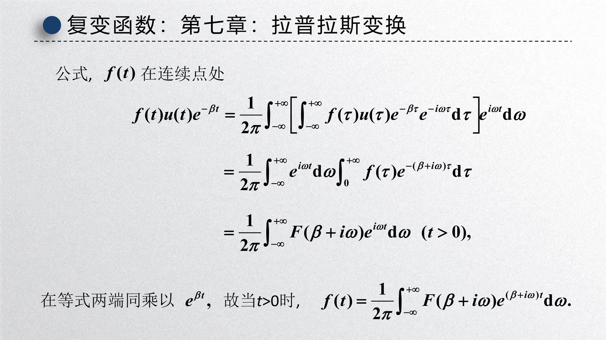{ width="650" }

!!! abstract "定理 3（反演积分公式）"
    若 $F(s)$ 是 $f(t)$ 的 Laplace 变换，则

    $$
    f(t) = \mathcal{L}^{-1}[F(s)] = \frac{1}{2\pi i} \int_{\beta-i\infty}^{\beta+i\infty} F(s)e^{st} \, \mathrm{d}s
    $$

    其中积分路径为复平面上直线 $s = \beta$（$\beta > \sigma_0$，$\sigma_0$ 为 $f(t)$ 的增长指数），方向自下而上。

!!! info "$\beta$ 取在奇点右侧是什么意思"
    反演积分路径 $s=\beta$ 通常要求落在 $F(s)$ 的收敛域内（ROC），并且位于 $F(s)$ 的所有孤立奇点右侧。这样在用围道闭合并应用留数时，可以把所有需要贡献的奇点都包进闭合曲线内部。

### 留数法求逆变换

!!! abstract "定理 4（留数法）"
    若 $F(s)$ 在复平面上除有限个孤立奇点 $s_1, s_2, \ldots, s_n$ 外解析，且当 $s \to \infty$ 时 $F(s) \to 0$，则

    $$
    f(t) = \sum_{k=1}^{n} \text{Res}[F(s)e^{st}, s_k]
    $$

    即 $f(t)$ 等于 $F(s)e^{st}$ 在其所有奇点处留数之和。

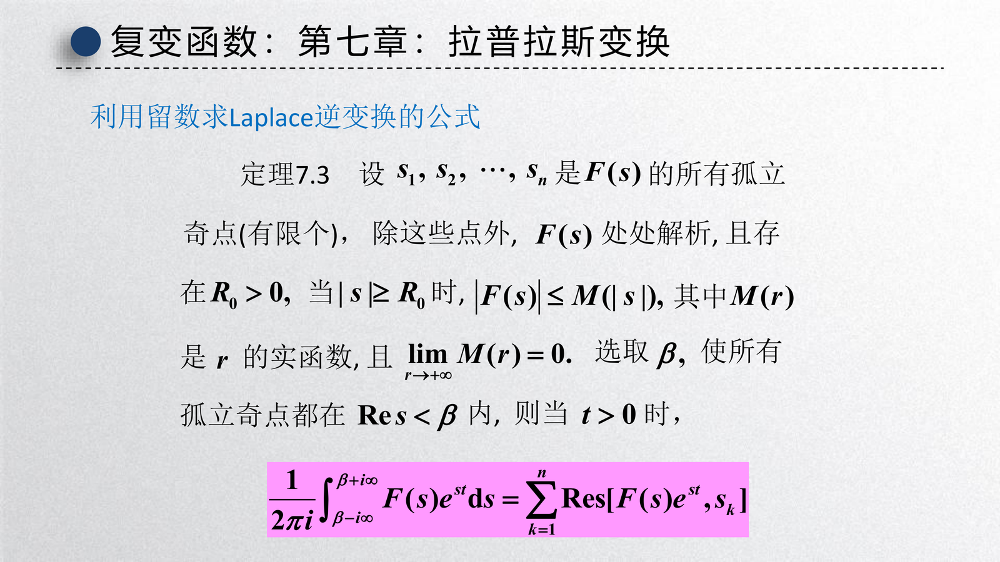{ width="650" }

???+ example "例 21：求 $\mathcal{L}^{-1}\left[\frac{1}{s^2+1}\right]$"

    $F(s)e^{st} = \frac{e^{st}}{s^2+1} = \frac{e^{st}}{(s-i)(s+i)}$ 有奇点 $s = \pm i$

    在 $s = i$：

    $$
    \text{Res} = \lim_{s \to i} (s-i) \cdot \frac{e^{st}}{(s-i)(s+i)} = \frac{e^{it}}{2i}
    $$

    在 $s = -i$：

    $$
    \text{Res} = \lim_{s \to -i} (s+i) \cdot \frac{e^{st}}{(s-i)(s+i)} = \frac{e^{-it}}{-2i}
    $$

    因此

    $$
    f(t) = \frac{e^{it}}{2i} - \frac{e^{-it}}{2i} = \sin t
    $$

???+ example "例 22：求 $\mathcal{L}^{-1}\left[\frac{1}{s(s-1)^2}\right]$"

    $F(s)e^{st}$ 有奇点 $s = 0$（一级）和 $s = 1$（二级）

    在 $s = 0$：

    $$
    \text{Res} = \lim_{s \to 0} s \cdot \frac{e^{st}}{s(s-1)^2} = 1
    $$

    在 $s = 1$：

    $$
    \text{Res} = \lim_{s \to 1} \frac{\mathrm{d}}{\mathrm{d}s}\left[(s-1)^2 \cdot \frac{e^{st}}{s(s-1)^2}\right] = \lim_{s \to 1} \frac{\mathrm{d}}{\mathrm{d}s}\left(\frac{e^{st}}{s}\right) = te^t - e^t
    $$

    因此

    $$
    f(t) = 1 + e^t(t-1)
    $$

---

## 7.4 Laplace 变换的应用

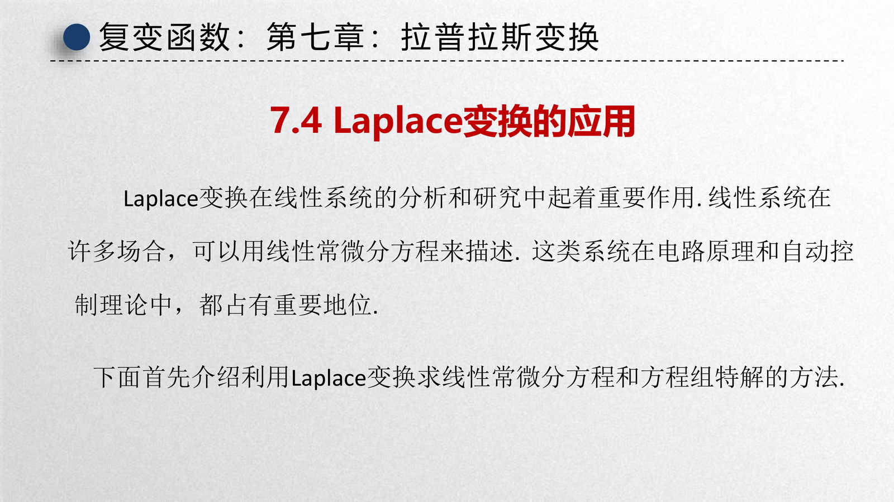{ width="650" }

### 求解微分方程

**基本思路**：
1. 对方程两边进行 Laplace 变换
2. 得出像函数的代数方程
3. 求出像函数
4. 通过逆变换得出解

???+ example "例 26：求解二阶常系数线性微分方程初值问题"

    $$
    x'' - 2x' + 2x = 2e^t\cos t, \quad x(0) = x'(0) = 0
    $$

    **解**：设 $\mathcal{L}[x(t)] = X(s)$，对方程两边取 Laplace 变换：

    $$
    s^2X(s) - 2sX(s) + 2X(s) = \frac{2(s-1)}{(s-1)^2+1}
    $$

    （利用 $\mathcal{L}[e^t\cos t] = \frac{s-1}{(s-1)^2+1}$）

    解得：

    $$
    X(s) = \frac{2(s-1)}{[(s-1)^2+1](s^2-2s+2)} = \frac{2(s-1)}{[(s-1)^2+1]^2}
    $$

    逆变换得：

    $$
    x(t) = te^t\sin t
    $$

???+ example "例 27：求解积分方程"

    $$
    y(t) = at + \int_0^t y(\tau)\sin(t-\tau) \, \mathrm{d}\tau
    $$

    **解**：设 $\mathcal{L}[y(t)] = Y(s)$，方程化为

    $$
    Y(s) = \frac{a}{s^2} + Y(s) \cdot \frac{1}{s^2+1}
    $$

    （利用卷积定理）

    解得：

    $$
    Y(s) = \frac{a(s^2+1)}{s^4} = \frac{a}{s^2} + \frac{a}{s^4}
    $$

    逆变换得：

    $$
    y(t) = at + \frac{a}{6}t^3
    $$

### 电路分析

#### RC 电路

???+ example "例 32：RC 串联电路分析"

    电路方程：$RC\frac{\mathrm{d}u_C}{\mathrm{d}t} + u_C = E$（$u_C(0) = 0$）

    取 Laplace 变换：

    $$
    RCsU_C(s) + U_C(s) = \frac{E}{s}
    $$

    解得：

    $$
    U_C(s) = \frac{E}{s(RCs+1)} = E\left(\frac{1}{s} - \frac{1}{s+\frac{1}{RC}}\right)
    $$

    逆变换得：

    $$
    u_C(t) = E(1 - e^{-\frac{t}{RC}})
    $$

#### RLC 电路

???+ example "例 33：RLC 串联电路分析"

    电路方程：$LC\frac{\mathrm{d}^2u_C}{\mathrm{d}t^2} + RC\frac{\mathrm{d}u_C}{\mathrm{d}t} + u_C = E$

    类似地通过 Laplace 变换求解，根据特征根的不同情况（过阻尼、临界阻尼、欠阻尼）得到不同形式的解。

### 线性定常系统与传递函数

**定义 4（传递函数）**：**传递函数** 定义为系统输出与输入的 Laplace 变换之比：

$$
H(s) = \frac{Y(s)}{U(s)}
$$

其中 $Y(s)$ 为输出的 Laplace 变换，$U(s)$ 为输入的 Laplace 变换。

!!! info "多输入多输出系统"
    对于多输入多输出系统，可用传递函数矩阵描述：

    $$
    \mathbf{Y}(s) = \mathbf{H}(s)\mathbf{U}(s)
    $$

    其中 $\mathbf{H}(s)$ 为传递函数矩阵。

---

## 小结

### 核心公式

#### Laplace 变换定义

$$
\mathcal{L}[f(t)] = F(s) = \int_0^{+\infty} f(t)e^{-st} \, \mathrm{d}t
$$

#### 基本变换对

!!! summary "最常用的 5 个基本变换对"
    先把下面这 5 个“母公式”记牢：

    - $1 \;\longleftrightarrow\; \dfrac{1}{s}$
    - $t^n \;\longleftrightarrow\; \dfrac{n!}{s^{n+1}}$
    - $e^{at} \;\longleftrightarrow\; \dfrac{1}{s-a}$
    - $\sin\omega t \;\longleftrightarrow\; \dfrac{\omega}{s^2+\omega^2}$
    - $\cos\omega t \;\longleftrightarrow\; \dfrac{s}{s^2+\omega^2}$

### 十大性质速查

!!! summary "十大性质速查"
    下面按“名字 + 公式”直接速记：

    - **线性**：$\mathcal{L}[\alpha f_1 + \beta f_2] = \alpha F_1 + \beta F_2$
    - **微分**：$\mathcal{L}[f'] = sF(s) - f(0)$
    - **像函数微分**：$\mathcal{L}[tf(t)] = -F'(s)$
    - **积分**：$\mathcal{L}\!\left[\int_0^t f(\tau)\,\mathrm{d}\tau\right] = \dfrac{F(s)}{s}$
    - **像函数积分**：$\mathcal{L}\!\left[\dfrac{f(t)}{t}\right] = \int_s^\infty F(u)\,\mathrm{d}u$
    - **位移**：$\mathcal{L}[e^{at}f(t)] = F(s-a)$
    - **延迟**：$\mathcal{L}[f(t-\tau)] = e^{-s\tau}F(s)$
    - **相似**：$\mathcal{L}[f(at)] = \dfrac{1}{a}F\!\left(\dfrac{s}{a}\right)$
    - **初值定理**：$f(0^+) = \lim_{s \to \infty} sF(s)$
    - **终值定理**：$\lim_{t \to \infty} f(t) = \lim_{s \to 0} sF(s)$
    - **卷积**：$\mathcal{L}[f_1 * f_2] = F_1(s)F_2(s)$

### 逆变换方法

!!! summary "逆变换方法速查"
    看到像函数 $F(s)$ 时，可以按下面的顺序判断：

    - **部分分式分解**：适用于 $F(s)$ 为有理函数
    - **留数法**：适用于 $F(s)$ 有孤立奇点
    - **查表法**：适用于常见标准形式
    - **卷积定理**：适用于 $F(s)=F_1(s)F_2(s)$

### 应用流程

```
实际问题 → 建立微分/积分方程 → Laplace变换 → 代数方程
                                               ↓
实际解 ← 逆变换 ← 像函数解 ← 求解代数方程
```

!!! tip "记忆口诀"
    速记如下：

    - 微分性质：$s$ 乘像函数减初值
    - 位移性质：$s$ 替换为 $s-a$
    - 延迟性质：乘以 $e^{-s\tau}$
    - 卷积定理：时域卷积变频域乘积
    - 逆变换留数法：$F(s)e^{st}$ 的留数之和
