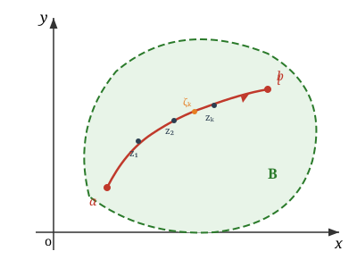
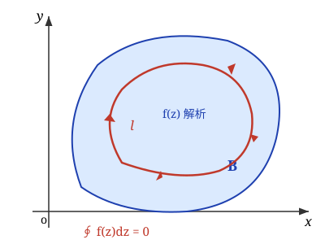
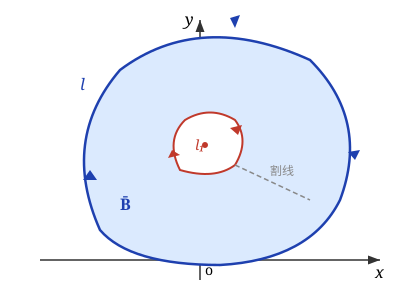
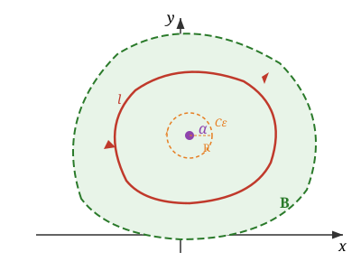

# 第三章 解析函数的积分表示

**重点** ：复积分的基本定理；柯西积分公式与高阶导数公式

**难点** ：复合闭路定理与复积分的计算

---

## 3.1 复变函数的积分

复变函数的积分是复平面上的 **线积分** ，定义为和的极限，与实函数积分类似。

### （一）积分的定义

{ width="350" }

设函数 $w = f(z)$ 定义在区域 $B$ 内，$l$ 为区域 $B$ 内起点为 $a$、终点为 $b$ 的一条光滑的有向曲线。把曲线 $l$ 任意分成 $n$ 个弧段，设分点为 $a = z_0, z_1, \cdots, z_{k-1}, z_k, \cdots, z_n = b$，在每个弧段 $\widehat{z_{k-1}z_k}$（$k = 1,2,\cdots,n$）上任意取一点 $\zeta_k$。

作和式：

$$
S_n = \sum_{k=1}^{n} f(\zeta_k)(z_k - z_{k-1}) = \sum_{k=1}^{n} f(\zeta_k) \Delta z_k
$$

当 $n$ 无限增加，如果不论对 $l$ 的分法及 $\zeta_k$ 的取法如何，$S_n$ 有唯一极限，那么称这极限值为函数 $f(z)$ 沿曲线 $l$ 的 **积分** ，记为：

$$
\int_l f(z)\mathrm{d}z = \lim_{n \to \infty} \sum_{k=1}^{n} f(\zeta_k) \cdot \Delta z_k
$$

!!! note "关于定义的说明"
    - 如果 $l$ 是闭曲线，那么沿此闭曲线的积分记为 $\oint_l f(z)\mathrm{d}z$。闭曲线是有向曲线，并定义区域总是在观察者 **左侧** 的曲线为正
    - 如果 $l$ 是 $x$ 轴上的区间 $a \le x \le b$，而 $f(z) = u(x)$，这个积分定义就是一元实变函数定积分的定义

### （二）积分的计算法

#### 计算法 1：化为二元实函数的第二型曲线积分

注意到 $f(z) = u(x,y) + iv(x,y)$，$\mathrm{d}z = \mathrm{d}x + i\mathrm{d}y$，代入积分定义有：

$$
\int_l f(z)\mathrm{d}z = \int_l (u + iv)(\mathrm{d}x + i\mathrm{d}y) = \int_l (u\mathrm{d}x - v\mathrm{d}y) + i\int_l (v\mathrm{d}x + u\mathrm{d}y)
$$

#### 计算法 2：参数方程法

设路径 $l$ 的参数方程为 $z = z(t)$（$\alpha \le t \le \beta$），由求导法则 $\mathrm{d}z = z'(t)\mathrm{d}t$，则有：

$$
\int_l f(z)\mathrm{d}z = \int_\alpha^\beta f[z(t)]z'(t)\mathrm{d}t
$$

### （三）性质

设 $l$ 是简单逐段光滑曲线，$f, g$ 在 $l$ 上连续，则：

- **路径可加性** ：$\displaystyle\int_l f(z)\mathrm{d}z = \sum_{k=1}^{n} \int_{l_k} f(z)\mathrm{d}z$，其中 $l$ 由 $l_1, l_2, \cdots, l_n$ 依次连接组成
- **方向反转** ：若 $l$ 和 $l^-$ 是同线段但走向相反，则 $\displaystyle\int_l f(z)\mathrm{d}z = -\int_{l^-} f(z)\mathrm{d}z$
- **常数因子** ：$\displaystyle\int_l Cf(z)\mathrm{d}z = C\int_l f(z)\mathrm{d}z$，其中 $C$ 为复常数
- **线性性** ：$\displaystyle\int_l [f(z) \pm g(z)]\mathrm{d}z = \int_l f(z)\mathrm{d}z \pm \int_l g(z)\mathrm{d}z$
- **积分不等式** ：$\displaystyle\left|\int_l f(z)\mathrm{d}z\right| \le \int_l |f(z)||\mathrm{d}z|$。特别地，若在 $l$ 上有 $|f(z)| \le M$，$l$ 的长记为 $|l|$，则 $\displaystyle\left|\int_l f(z)\mathrm{d}z\right| \le M|l|$

### 例题

???+ example "例1：计算 $\int_l z\mathrm{d}z$，$l$：从原点到点 $3+4i$ 的直线段"
    **解** ：直线参数方程 $z = (3+4i)t$，$0 \le t \le 1$，$\mathrm{d}z = (3+4i)\mathrm{d}t$。

    $$
    \int_l z\mathrm{d}z = \int_0^1 (3+4i)^2 t\mathrm{d}t = (3+4i)^2 \int_0^1 t\mathrm{d}t = \frac{(3+4i)^2}{2}
    $$

???+ example "例2：计算 $\int_l |z|\mathrm{d}z$，$l$：圆周 $|z| = 2$"
    **解** ：参数方程 $z = 2e^{i\theta}$（$0 \le \theta \le 2\pi$），$f(z) = |z| = 2$，$\mathrm{d}z = 2ie^{i\theta}\mathrm{d}\theta$。

    $$
    \int_l |z|\mathrm{d}z = \int_0^{2\pi} 2 \cdot 2ie^{i\theta}\mathrm{d}\theta = 4i\int_0^{2\pi}(\cos\theta + i\sin\theta)\mathrm{d}\theta = 0
    $$

???+ example "例3（重要结论）：求 $\oint_l \frac{1}{(z-z_0)^{n+1}}\mathrm{d}z$，$l$ 为以 $z_0$ 为中心、$r$ 为半径的正向圆周，$n$ 为整数"
    **解** ：参数方程 $z = z_0 + re^{i\theta}$（$0 \le \theta \le 2\pi$）。

    $$
    \oint_l \frac{1}{(z-z_0)^{n+1}}\mathrm{d}z = \int_0^{2\pi} \frac{ire^{i\theta}}{r^{n+1}e^{i(n+1)\theta}}\mathrm{d}\theta = \frac{i}{r^n}\int_0^{2\pi} e^{-in\theta}\mathrm{d}\theta
    $$

    - 当 $n = 0$ 时：$= i\int_0^{2\pi}\mathrm{d}\theta = 2\pi i$
    - 当 $n \neq 0$ 时：$= \frac{i}{r^n}\int_0^{2\pi}(\cos n\theta - i\sin n\theta)\mathrm{d}\theta = 0$

    因此：

    $$
    \oint_l \frac{1}{(z-z_0)^{n+1}}\mathrm{d}z = \begin{cases} 2\pi i, & n = 0 \\ 0, & n \neq 0 \end{cases}
    $$

    !!! warning "重要结论"
        积分值与路径圆周的中心和半径无关。此结论在后续柯西公式中反复使用。

---

## 3.2 柯西定理

### （一）单连通区域柯西定理

{ width="320" }

**定理1（单连通区域柯西定理）** ：如果函数 $f(z)$ 在闭单连通域 $\bar{B}$ 上 **解析** ，则沿 $\bar{B}$ 上任一分段光滑闭曲线 $l$（也可以是 $\bar{B}$ 的边界），有

$$
\oint_l f(z)\mathrm{d}z = 0
$$

??? note "证明思路"
    利用 $f(z) = u(x,y) + iv(x,y)$，将复积分拆为实部和虚部两个实曲线积分，再用 **格林公式** 化为面积分，最后利用 **柯西—黎曼方程** 证明被积函数为零。

    $$
    \oint_l f(z)\mathrm{d}z = \oint_l [u\mathrm{d}x - v\mathrm{d}y] + i\oint_l [v\mathrm{d}x + u\mathrm{d}y]
    $$

    由格林公式和 C-R 条件 $\frac{\partial u}{\partial x} = \frac{\partial v}{\partial y}$，$\frac{\partial u}{\partial y} = -\frac{\partial v}{\partial x}$，两部分均为零。

**推论** ：单连通域的积分只与各积分曲线的 **起点和终点** 有关：

$$
\int_{l_1} f(z)\mathrm{d}z = \int_{l_2} f(z)\mathrm{d}z = \int_{z_0}^{z_1} f(z)\mathrm{d}z
$$

???+ example "例1：计算 $\oint_{|z|=1} \frac{1}{2z-3}\mathrm{d}z$"
    函数 $\frac{1}{2z-3}$ 在 $|z| \le 1$ 内解析（奇点 $z = \frac{3}{2}$ 在圆外），根据柯西定理，积分 $= 0$。

### （二）复连通域柯西定理

{ width="320" }

对于复连通域，围线 $l$ 内部可能包含函数的奇点，因此围道积分 **不一定为零** 。

通过作 **割线** ，将复连通域转化为单连通域，可以证明：

$$
\oint_l f(z)\mathrm{d}z = \oint_{l_1} f(z)\mathrm{d}z
$$

其中 $l$ 和 $l_1$ 取相同方向（均为逆时针）。

!!! info "闭路变形原理"
    在区域内的一个解析函数沿着闭曲线的积分，不因闭曲线在区域内部作连续变形而改变它的值，只要在变形过程中曲线 **不经过函数的奇点** 。

**多连通域柯西定理** ：设 $\bar{B}$ 是以 $C = l + l_1 + \cdots + l_n$ 边为界的 $n+1$ 闭连通区域，若 $f(z)$ 在 $\bar{B}$ 边界上连续，在 $B$ 内解析，则有

$$
\oint_C f(z)\mathrm{d}z = 0
$$

其中 $C$ 取关于区域 $B$ 的正向，或等价地写为：

$$
\oint_l f(z)\mathrm{d}z = \sum_{k=1}^{n} \oint_{l_k} f(z)\mathrm{d}z
$$

（外边界逆时针积分等于所有内边界逆时针积分之和）

???+ example "例3：求 $\oint_l \frac{1}{(z-a)^{n+1}}\mathrm{d}z$，$l$ 为含 $a$ 的任一简单闭路，$n$ 为整数"
    因为 $a$ 在 $l$ 内部，取小圆 $l_1: |z-a| = \rho$ 含在 $l$ 内，$\frac{1}{(z-a)^{n+1}}$ 在以 $l$ 和 $l_1$ 为边界的复连通域内处处解析。由复合闭路定理：

    $$
    \oint_l \frac{1}{(z-a)^{n+1}}\mathrm{d}z = \oint_{l_1} \frac{1}{(z-a)^{n+1}}\mathrm{d}z = \begin{cases} 2\pi i, & n = 0 \\ 0, & n \neq 0 \end{cases}
    $$

    此结论非常重要——闭曲线不必是圆，$a$ 也不必是圆心，只要 $a$ 在简单闭曲线内即可。

### （三）柯西定理小结

1. 单通区域上的解析函数沿区域内任一条光滑闭曲线的积分为零
2. 闭复通区域上的解析函数沿所有内外境界线正方向的积分和为零
3. 闭复通区域上的解析函数沿外境界线逆时针方向的积分等于沿所有内境界线逆时针方向的积分的和
4. 固定起点和终点，积分路径的连续形变不改变积分

!!! warning "注意事项"
    - 注意定理的条件 **"单连通域"**
    - 定理不能反过来用：不能由 $\oint_C f(z)\mathrm{d}z = 0$ 而说 $f(z)$ 在 $C$ 内处处解析

---

## 3.3 不定积分

### 1. 原函数

如果函数 $f(z)$ 在单连通域 $B$ 内处处解析，那么函数

$$
F(z) = \int_{z_0}^{z} f(\zeta)\mathrm{d}\zeta
$$

必为 $B$ 内的一个解析函数，同时是 $f(z)$ 的 **原函数** ，即 $F'(z) = f(z)$。

??? note "证明思路"
    设 $z$ 为 $B$ 内任一点，以 $z$ 为中心作一含于 $B$ 内的邻域 $C_R$，取 $|\Delta z|$ 充分小使 $z + \Delta z$ 在 $C_R$ 内。

    $$
    F(z + \Delta z) - F(z) = \int_z^{z+\Delta z} f(\zeta)\mathrm{d}\zeta
    $$

    因为 $f(z)\Delta z = \int_z^{z+\Delta z} f(z)\mathrm{d}\zeta$，所以

    $$
    \frac{F(z+\Delta z) - F(z)}{\Delta z} - f(z) = \frac{1}{\Delta z}\int_z^{z+\Delta z}[f(\zeta) - f(z)]\mathrm{d}\zeta
    $$

    由 $f(z)$ 在 $B$ 内连续，$|f(\zeta) - f(z)| < \varepsilon$，故上式模 $\le \varepsilon$，令 $\Delta z \to 0$ 即得 $F'(z) = f(z)$。

### 2. 不定积分的定义

称 $f(z)$ 的原函数的一般表达式 $F(z) + c$（$c$ 为任意常数）为 $f(z)$ 的 **不定积分** ，记作：

$$
\int f(z)\mathrm{d}z = F(z) + c
$$

### 3. 牛顿-莱布尼兹公式

如果函数 $f(z)$ 在单连通域 $B$ 内处处解析，$F(z)$ 为 $f(z)$ 的一个原函数，$z_1, z_2$ 为域 $B$ 内的两点，那么

$$
\int_{z_1}^{z_2} f(z)\mathrm{d}z = F(z_2) - F(z_1)
$$

!!! info "说明"
    有了牛顿-莱布尼兹公式，复变函数的积分就可以用跟微积分学中类似的方法（凑微分、分部积分等）去计算。

### 例题

???+ example "例1：求 $\int_{z_0}^{z_1} z\mathrm{d}z$ 的值"
    $z$ 是解析函数，原函数为 $\frac{1}{2}z^2$，由牛顿-莱布尼兹公式：

    $$
    \int_{z_0}^{z_1} z\mathrm{d}z = \frac{1}{2}z^2\bigg|_{z_0}^{z_1} = \frac{1}{2}(z_1^2 - z_0^2)
    $$

???+ example "例2：求 $\int_0^{\pi i} z\cos z^2\mathrm{d}z$ 的值"
    凑微分法：

    $$
    \int_0^{\pi i} z\cos z^2\mathrm{d}z = \frac{1}{2}\int_0^{\pi i}\cos z^2\mathrm{d}z^2 = \frac{1}{2}\sin z^2\bigg|_0^{\pi i} = \frac{1}{2}\sin(-\pi^2) = -\frac{1}{2}\sin\pi^2
    $$

???+ example "例3：求 $\int_0^{i} z\cos z\mathrm{d}z$ 的值"
    分部积分法：

    $$
    \int_0^{i} z\cos z\mathrm{d}z = \int_0^{i} z\mathrm{d}(\sin z) = [z\sin z]_0^{i} - \int_0^{i}\sin z\mathrm{d}z = [z\sin z + \cos z]_0^{i} = e^{-1} - 1
    $$

---

## 3.4 柯西公式

### （一）问题的提出

设 $B$ 为一单连通域，$z_0$ 为 $B$ 中一点。如果 $f(z)$ 在 $B$ 内解析，那么 $\frac{f(z)}{z - z_0}$ 在 $z_0$ 不解析，所以 $\oint_l \frac{f(z)}{z - z_0}\mathrm{d}z$ 一般不为零——那么等于多少？

### （二）柯西积分公式

{ width="320" }

#### 1. 有界区域的单连通柯西积分公式

如果 $f(\alpha)$ 在闭单连通区域 $\bar{B}$ 内处处解析，$l$ 为 $\bar{B}$ 内的边界线，$\alpha$ 为 $B$ 内的任一点，那么

$$
f(\alpha) = \frac{1}{2\pi i}\oint_l \frac{f(z)}{z - \alpha}\mathrm{d}z
$$

称为 **柯西积分公式** 。

??? note "证明思路"
    由闭路变形原理，将 $l$ 上的积分变为以 $\alpha$ 为中心、半径为 $R$ 的小圆 $C_\varepsilon$ 上的积分：

    $$
    \oint_l \frac{f(z)}{z-\alpha}\mathrm{d}z = \oint_{C_\varepsilon} \frac{f(\alpha)}{z-\alpha}\mathrm{d}z + \oint_{C_\varepsilon} \frac{f(z) - f(\alpha)}{z - \alpha}\mathrm{d}z = 2\pi i f(\alpha) + \oint_{C_\varepsilon}\frac{f(z)-f(\alpha)}{z-\alpha}\mathrm{d}z
    $$

    由 $f(z)$ 在 $\alpha$ 处连续，第二个积分的模 $\le 2\pi\varepsilon \to 0$，故 $\oint_l \frac{f(z)}{z-\alpha}\mathrm{d}z = 2\pi i f(\alpha)$。

!!! info "柯西公式的意义"
    - 把函数在 $l$ 内部任一点的值用它在 **边界上的积分值** 表示（解析函数的特征）
    - 提供了计算某些复变函数沿闭路积分的方法，也给出了解析函数的积分表达式
    - 一个解析函数在圆心处的值等于它在圆周上的 **平均值**

#### 2. 有界区域的复连通柯西积分公式

设 $l$ 为复连通域 $B$ 内的一条简单闭曲线，$l_1, l_2, \cdots, l_n$ 是在 $l$ 内部的简单闭曲线，且互相分离。若 $f(\zeta)$ 在 $B$ 内解析，$\Gamma$ 为由 $l$ 以及 $l_k$（$k=1,2,\ldots,n$）所组成的复合闭路，$z$ 为 $f(\zeta)$ 解析区域内的任一点，则

$$
f(z) = \frac{1}{2\pi i}\oint_\Gamma \frac{f(\zeta)}{\zeta - z}\mathrm{d}\zeta = \frac{1}{2\pi i}\left[\oint_l \frac{f(\zeta)}{\zeta - z}\mathrm{d}\zeta + \sum_{k=1}^{n}\oint_{l_k}\frac{f(\zeta)}{\zeta - z}\mathrm{d}\zeta\right]
$$

#### 3. 无界区域中的柯西积分公式

假设 $|z| \to \infty$，$f(z)$ 在某一闭曲线 $l$ 的外部解析，则对于 $l$ 外部区域中的点有

$$
f(z) = \frac{1}{2\pi i}\oint_l \frac{f(\zeta)}{\zeta - z}\mathrm{d}\zeta + f(\infty)
$$

其中 $f(\infty)$ 有界。特别地，当 $|z| \to \infty$ 满足 $f(z) \to 0$ 时，即 $f(\infty) = 0$，则

$$
f(z) = \frac{1}{2\pi i}\oint_l \frac{f(\zeta)}{\zeta - z}\mathrm{d}\zeta
$$

### （三）高阶导数

解析函数 $f(z)$ 的导数仍为解析函数，它的 $n$ 阶导数为：

$$
f^{(n)}(z) = \frac{n!}{2\pi i}\oint_l \frac{f(\zeta)}{(\zeta - z)^{n+1}}\mathrm{d}\zeta
$$

其中 $l$ 为在函数 $f(\zeta)$ 的解析区域 $B$ 内围绕 $z$ 的任何一条正向简单闭曲线，而且它的内部全含于 $B$。

!!! tip "高阶导数公式的用法"
    这个公式的重要性 **不在于** 通过积分来求导，**而在于** 通过求导来求积分——将复杂的围道积分转化为求解析函数在某点的导数值。

### 例题

???+ example "例1：计算 $\oint_{|z|=2} \frac{e^z}{z-1}\mathrm{d}z$"
    $f(z) = e^z$ 在复平面内解析，$z = 1$ 位于 $|z| < 2$ 内，由柯西积分公式：

    $$
    \oint_{|z|=2} \frac{e^z}{z-1}\mathrm{d}z = 2\pi i \cdot e^z\big|_{z=1} = 2e\pi i
    $$

???+ example "例2：计算 $\oint_{|z-i|=\frac{1}{2}} \frac{1}{z(z^2+1)}\mathrm{d}z$"
    **解** ：$|z - i| = \frac{1}{2}$ 是半径为 $\frac{1}{2}$、中心在 $(0,1)$ 的圆。

    $$
    \frac{1}{z(z^2+1)} = \frac{1}{z(z+i)(z-i)} = \frac{\frac{1}{z(z+i)}}{z-i}, \quad z_0 = i
    $$

    $f(z) = \frac{1}{z(z+i)}$ 在 $|z-i| \le \frac{1}{2}$ 内解析，由柯西积分公式：

    $$
    \oint_{|z-i|=\frac{1}{2}} \frac{1}{z(z^2+1)}\mathrm{d}z = 2\pi i \cdot \frac{1}{z(z+i)}\bigg|_{z=i} = 2\pi i \cdot \frac{1}{2i^2} = -\pi i
    $$

???+ example "例4：计算 $\oint_l \frac{\cos z}{(z-i)^3}\mathrm{d}z$，$l$ 是绕 $i$ 一周的围线"
    $f(z) = \cos z$，$n = 2$，由高阶导数公式：

    $$
    \oint_l \frac{\cos z}{(z-i)^3}\mathrm{d}z = \frac{2\pi i}{2!}(\cos z)''\big|_{z=i} = -\pi i \cos i = -\pi i \cdot \frac{e^{-1} + e}{2}
    $$

---

## 小结

**柯西积分公式** 是复积分计算中的重要公式，它的证明基于柯西定理。其重要性在于：一个解析函数在区域内部的值可以用它在 **边界上的值** 通过积分表示，所以它是研究解析函数的重要工具。

核心公式总结：

$$
f(z) = \frac{1}{2\pi i}\oint_l \frac{f(\zeta)}{\zeta - z}\mathrm{d}\zeta \qquad \text{（柯西积分公式）}
$$

$$
f^{(n)}(z) = \frac{n!}{2\pi i}\oint_l \frac{f(\zeta)}{(\zeta - z)^{n+1}}\mathrm{d}\zeta \qquad \text{（高阶导数公式）}
$$

???+ question "思考题"
    **复函数积分与实函数定积分是否一致？**

    若 $l$ 是实轴上区间 $[\alpha, \beta]$，则 $\int_l f(z)\mathrm{d}z = \int_\alpha^\beta f(x)\mathrm{d}x$。如果 $f(x)$ 是实值的，即为一元实函数的定积分。但一般不能把积分记作 $\int_\alpha^\beta f(z)\mathrm{d}z$，因为这是一个 **线积分** ，要受积分路线的限制，必须记作 $\int_l f(z)\mathrm{d}z$。
