## 1 GPU 内存概述

### 1.1 CPU-GPU 异构计算系统

CPU 和 GPU 基于 **不同的硬件设计架构** ，它们在编程模型上具有很大差异。这样的系统我们称之为 **异构计算系统（Heterogeneous Computing System）** 。

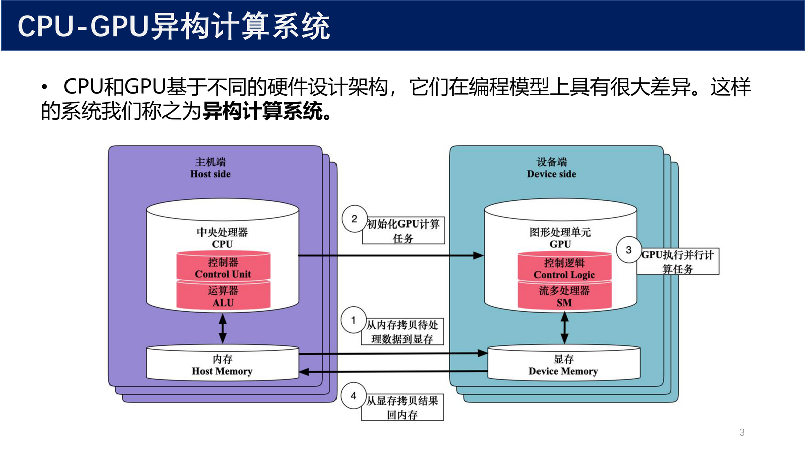{ width="800" }

上图展示了典型的 CPU-GPU 异构计算流程：

1. 从内存拷贝待处理数据到显存
2. CPU 初始化 GPU 计算任务
3. GPU 执行并行计算任务
4. 从显存拷贝结果回内存

!!! abstract "定义 1（异构计算系统）"
    **异构计算系统** 是指由两种或两种以上不同类型的计算处理器（如 CPU 和 GPU）组成的计算系统，它们具有不同的指令集架构、内存层次结构和编程模型，通过协同工作完成计算任务。

### 1.2 GPU 内存分类

GPU 内存主要包含以下几种类型：

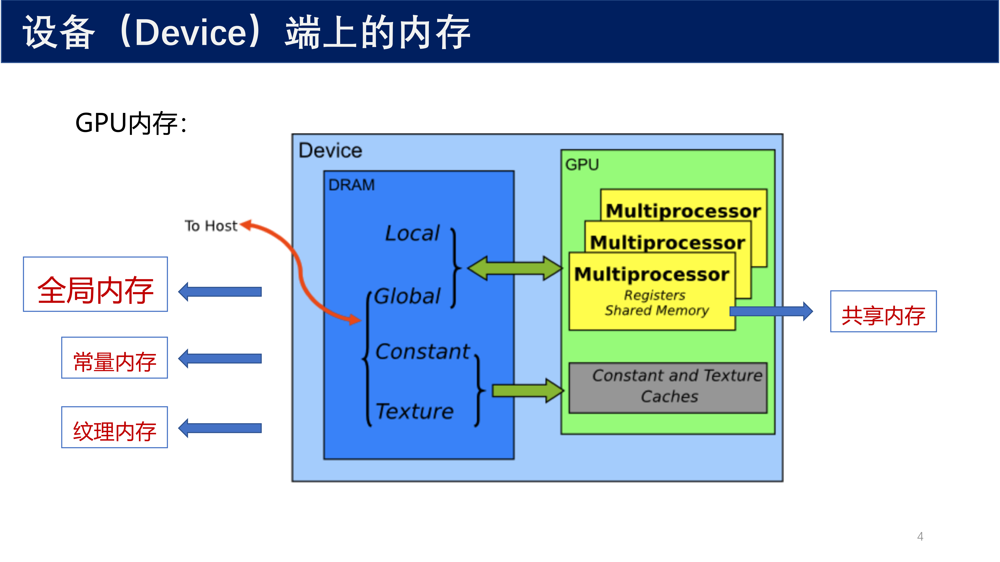{ width="800" }

| 内存类型 | 位置 | 访问范围 | 速度 | 特点 |
|----------|------|----------|------|------|
| **寄存器（Register）** | SM 内部 | 线程私有 | 最快 | 存储局部变量和中间结果 |
| **共享内存（Shared Memory）** | SM 内部 | 线程块内共享 | 很快 | 可编程的片上内存 |
| **L1/L2 缓存（Cache）** | SM/GPU 级 | 自动管理 | 快 | 对程序员透明 |
| **全局内存（Global Memory）** | DRAM | 所有线程可访问 | 慢 | 容量最大，带宽最小 |
| **常量内存（Constant Memory）** | DRAM + 缓存 | 所有线程只读 | 较快 | 专用缓存，广播读取 |
| **纹理内存（Texture Memory）** | DRAM + 缓存 | 所有线程只读 | 较快 | 适合空间局部性访问 |

### 1.3 GPU 内存模型层次

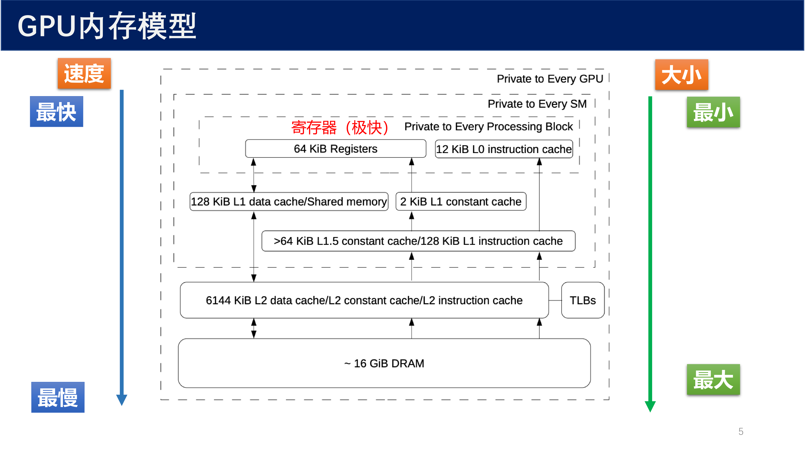{ width="800" }

GPU 内存模型呈现明显的 **金字塔结构** ：越靠近计算单元，速度越快、容量越小；越远离计算单元，速度越慢、容量越大。

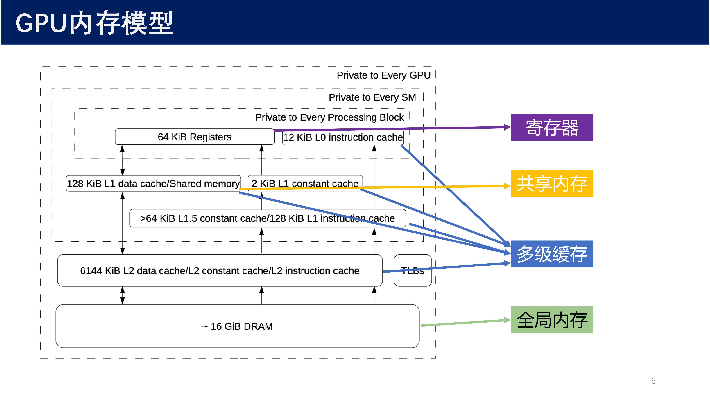{ width="800" }

从图中可以看出内存层次：

- **寄存器**：64 KiB，Private to Every Processing Block
- **L0 指令缓存**：12 KiB
- **L1 数据缓存 / 共享内存**：128 KiB
- **L1 常量缓存**：2 KiB
- **L1.5 缓存**：> 64 KiB 常量缓存 / 128 KiB 指令缓存
- **L2 缓存**：6144 KiB，包含数据、常量、指令缓存
- **DRAM**：约 16 GiB

!!! tip "内存层次的关键洞察"
    GPU 内存层次设计的核心思想是 **用空间换时间** —— 将频繁访问的数据放在靠近计算单元的高速存储中，减少对慢速 DRAM 的访问。理解这一层次结构是编写高效 GPU 程序的基础。

---

## 2 寄存器

### 2.1 寄存器的基本特性

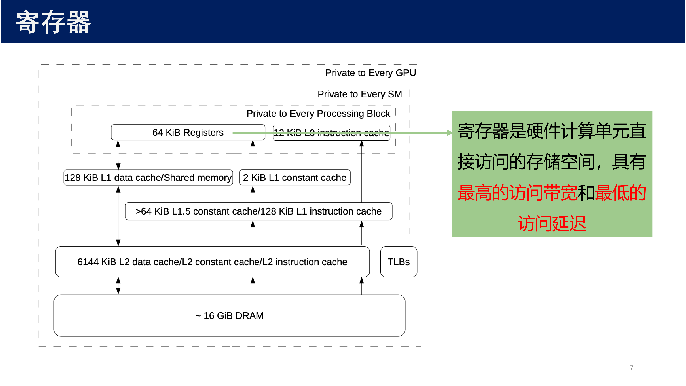{ width="800" }

寄存器是 **硬件计算单元直接访问的存储空间**，具有 **最高的访问带宽和最低的访问延迟**。

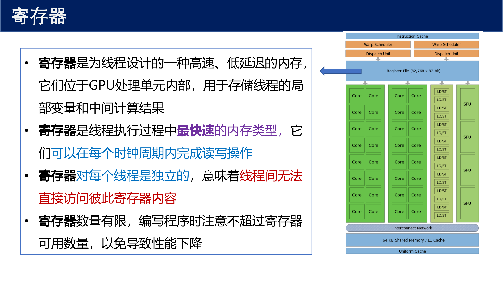{ width="800" }

寄存器具有以下关键特性：

- 寄存器是为线程设计的一种 **高速、低延迟** 的内存，它们位于 GPU 处理单元内部，用于存储线程的局部变量和中间计算结果
- 寄存器是线程执行过程中 **最快速的内存类型**，它们可以在 **每个时钟周期内完成读写操作**
- 寄存器对每个线程是 **独立的**，意味着 **线程间无法直接访问彼此寄存器内容**
- 寄存器数量有限，编写程序时注意不超过寄存器可用数量，以免导致性能下降

!!! abstract "定义 2（GPU 寄存器）"
    **GPU 寄存器** 是位于流多处理器（SM）内部的高速存储单元，每个线程拥有独立的寄存器集合，用于保存线程私有的局部变量和计算中间结果。寄存器访问延迟约为 1 个时钟周期。

!!! warning "寄存器溢出风险"
    当核函数使用的寄存器数量超过 SM 上每个线程可用的寄存器配额时，编译器会将部分变量 **溢出（spill）** 到局部内存（实际位于全局内存中），这将导致性能急剧下降。因此，控制核函数的寄存器使用量至关重要。

---

## 3 全局内存

### 3.1 全局内存概述

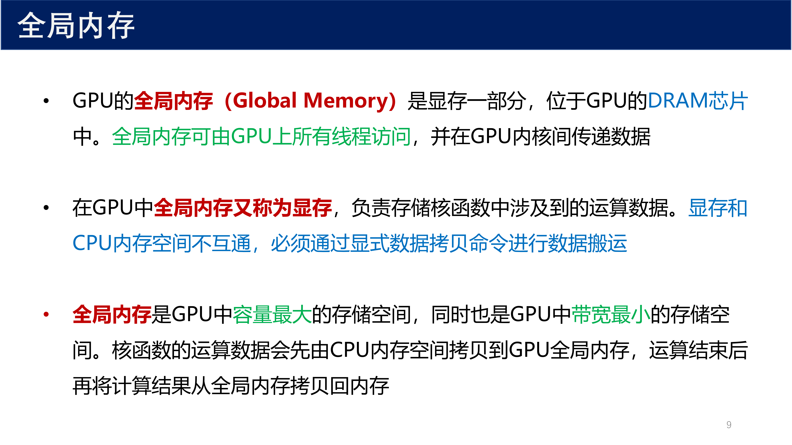{ width="800" }

!!! abstract "定义 3（全局内存 / Global Memory）"
    GPU 的 **全局内存（Global Memory）** 是显存的一部分，位于 GPU 的 DRAM 芯片中。全局内存可由 GPU 上所有线程访问，并在 GPU 内核间传递数据。

全局内存具有以下特点：

- 在 GPU 中全局内存又称为 **显存**，负责存储核函数中涉及到的运算数据
- **显存和 CPU 内存空间不互通**，必须通过 **显式数据拷贝命令** 进行数据搬运
- 全局内存是 GPU 中 **容量最大的存储空间**，同时也是 GPU 中 **带宽最小的存储空间**
- 核函数的运算数据会先由 CPU 内存空间拷贝到 GPU 全局内存，运算结束后再将计算结果从全局内存拷贝回内存

### 3.2 全局内存的动态声明

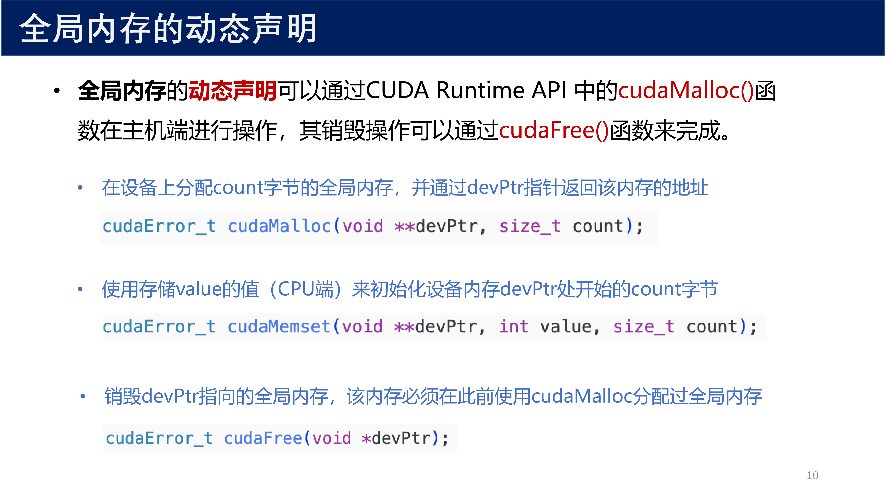{ width="800" }

全局内存的动态声明可以通过 CUDA Runtime API 中的 `cudaMalloc()` 函数在主机端进行操作，其销毁操作可以通过 `cudaFree()` 函数来完成。

#### 核心 API 函数

```cpp
// 在设备上分配 count 字节的全局内存，并通过 devPtr 指针返回该内存的地址
cudaError_t cudaMalloc(void **devPtr, size_t count);

// 使用存储 value 的值（CPU 端）来初始化设备内存 devPtr 处开始的 count 字节
cudaError_t cudaMemset(void **devPtr, int value, size_t count);

// 销毁 devPtr 指向的全局内存，该内存必须在此前使用 cudaMalloc 分配过
cudaError_t cudaFree(void *devPtr);
```

### 3.3 内存间的数据传输

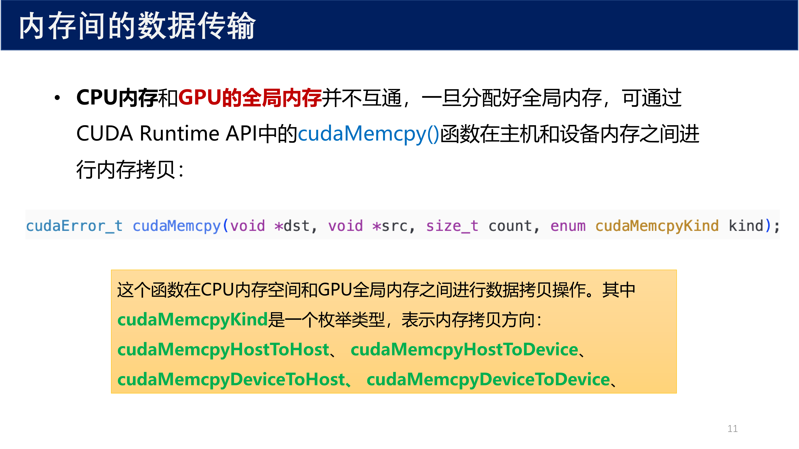{ width="800" }

CPU 内存和 GPU 的全局内存并不互通，一旦分配好全局内存，可通过 CUDA Runtime API 中的 `cudaMemcpy()` 函数在主机和设备内存之间进行内存拷贝：

```cpp
cudaError_t cudaMemcpy(void *dst, void *src, size_t count, enum cudaMemcpyKind kind);
```

这个函数在 CPU 内存空间和 GPU 全局内存之间进行数据拷贝操作。其中 `cudaMemcpyKind` 是一个枚举类型，表示内存拷贝方向：

| 枚举值 | 含义 |
|--------|------|
| `cudaMemcpyHostToHost` | 主机内存到主机内存 |
| `cudaMemcpyHostToDevice` | 主机内存到设备内存 |
| `cudaMemcpyDeviceToHost` | 设备内存到主机内存 |
| `cudaMemcpyDeviceToDevice` | 设备内存到设备内存 |

### 3.4 设备变量

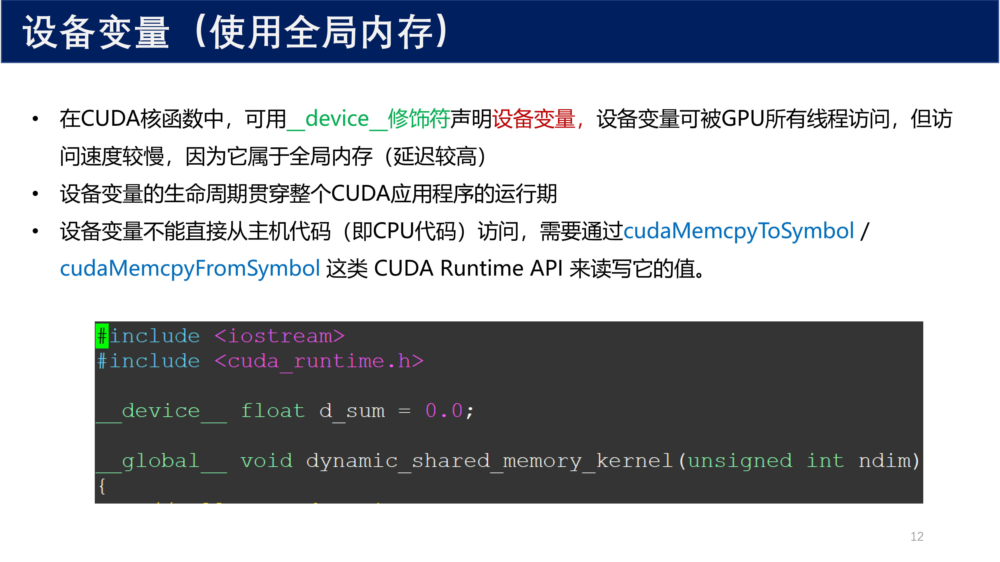{ width="800" }

在 CUDA 核函数中，可用 `__device__` 修饰符声明设备变量：

- 设备变量可被 GPU 所有线程访问，但访问速度较慢，因为它属于全局内存（延迟较高）
- 设备变量的生命周期贯穿整个 CUDA 应用程序的运行期
- 设备变量不能直接从主机代码（即 CPU 代码）访问，需要通过 `cudaMemcpyToSymbol` / `cudaMemcpyFromSymbol` 这类 CUDA Runtime API 来读写它的值

!!! abstract "定义 4（设备变量 / Device Variable）"
    **设备变量** 是使用 `__device__` 修饰符在全局作用域声明的 GPU 静态变量，存储于全局内存中。设备变量对核函数内所有线程可见，但只能通过 `cudaMemcpyToSymbol` 和 `cudaMemcpyFromSymbol` 从主机端读写。

### 3.5 例 1：拷贝符号内存

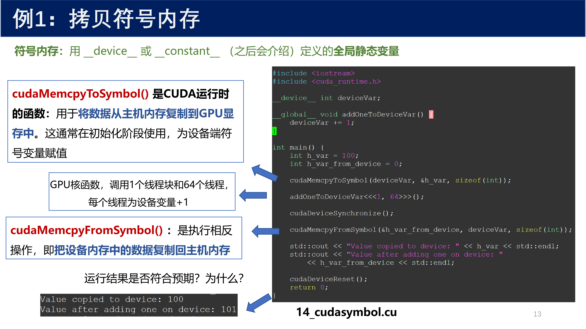{ width="800" }

**符号内存**：用 `__device__` 或 `__constant__` 定义的全局静态变量。

```cpp
#include <iostream>
#include <cuda_runtime.h>

__device__ int deviceVar;

__global__ void addOneToDeviceVar() {
    deviceVar += 1;
}

int main() {
    int h_var = 100;
    int h_var_from_device = 0;

    // 将主机变量拷贝到设备符号变量
    cudaMemcpyToSymbol(deviceVar, &h_var, sizeof(int));

    // 调用核函数：1 个线程块，64 个线程
    addOneToDeviceVar<<<1, 64>>>();

    cudaDeviceSynchronize();

    // 将设备符号变量拷贝回主机
    cudaMemcpyFromSymbol(&h_var_from_device, deviceVar, sizeof(int));

    std::cout << "Value copied to device: " << h_var << std::endl;
    std::cout << "Value after adding one on device: "
              << h_var_from_device << std::endl;

    cudaDeviceReset();
    return 0;
}
```

!!! warning "数据竞争问题"
    上述代码中，64 个线程同时执行 `deviceVar += 1`，由于 `+=` 操作不是原子的（实际包含读-改-写三个步骤），多个线程可能同时读取相同的旧值，导致更新丢失。因此运行结果 **不符合预期**（预期 164，实际可能小于 164）。

---

## 4 原子操作

### 4.1 原子操作的概念

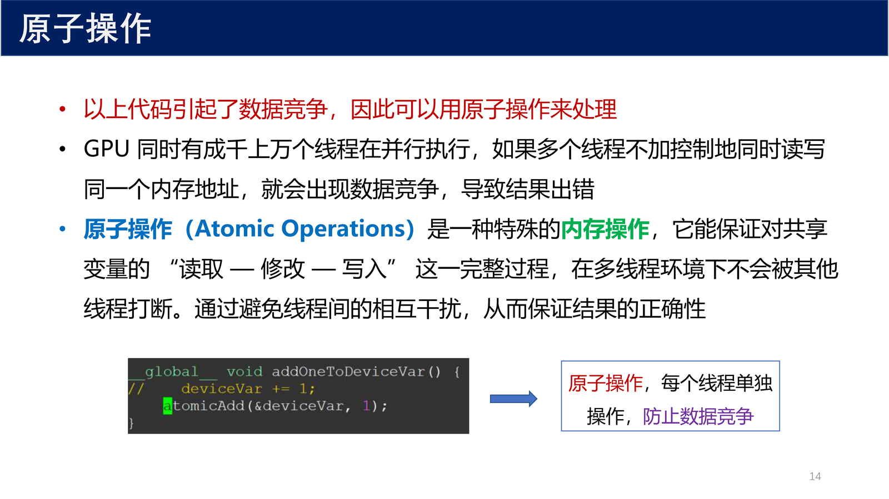{ width="800" }

GPU 同时有成千上万个线程在并行执行，如果多个线程不加控制地同时读写同一个内存地址，就会出现 **数据竞争（Data Race）**，导致结果出错。

!!! abstract "定义 5（原子操作 / Atomic Operation）"
    **原子操作（Atomic Operations）** 是一种特殊的内存操作，它能保证对共享变量的 "读取 — 修改 — 写入" 这一完整过程，在多线程环境下不会被其他线程打断。通过避免线程间的相互干扰，从而保证结果的正确性。

### 4.2 原子操作函数

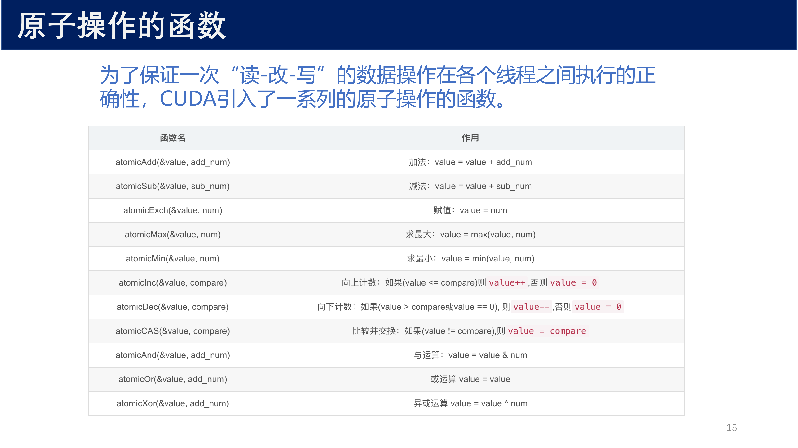{ width="800" }

为了保证一次 "读-改-写" 的数据操作在各个线程之间执行的正确性，CUDA 引入了一系列原子操作函数：

| 函数名 | 作用 |
|--------|------|
| `atomicAdd(&value, add_num)` | 加法：`value = value + add_num` |
| `atomicSub(&value, sub_num)` | 减法：`value = value - sub_num` |
| `atomicExch(&value, num)` | 交换：`value = num` |
| `atomicMax(&value, num)` | 求最大值：`value = max(value, num)` |
| `atomicMin(&value, num)` | 求最小值：`value = min(value, num)` |
| `atomicInc(&value, compare)` | 向上计数：如果 `value <= compare` 则 `value++`，否则 `value = 0` |
| `atomicDec(&value, compare)` | 向下计数：如果 `value > compare` 或 `value == 0`，则 `value--`，否则 `value = 0` |
| `atomicCAS(&value, compare)` | 比较并交换：如果 `value != compare`，则 `value = compare` |
| `atomicAnd(&value, add_num)` | 与运算：`value = value & num` |
| `atomicOr(&value, add_num)` | 或运算：`value = value \| num` |
| `atomicXor(&value, add_num)` | 异或运算：`value = value ^ num` |

### 4.3 例 2：使用原子操作修正数据竞争

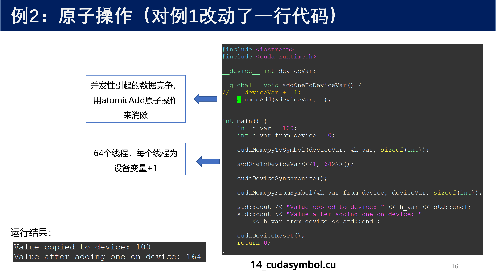{ width="800" }

将例 1 中的 `deviceVar += 1` 改为 `atomicAdd(&deviceVar, 1)`：

```cpp
#include <iostream>
#include <cuda_runtime.h>

__device__ int deviceVar;

__global__ void addOneToDeviceVar() {
    // 使用原子操作消除数据竞争
    atomicAdd(&deviceVar, 1);
}

int main() {
    int h_var = 100;
    int h_var_from_device = 0;

    cudaMemcpyToSymbol(deviceVar, &h_var, sizeof(int));

    // 64 个线程，每个线程为设备变量 +1
    addOneToDeviceVar<<<1, 64>>>();

    cudaDeviceSynchronize();

    cudaMemcpyFromSymbol(&h_var_from_device, deviceVar, sizeof(int));

    std::cout << "Value copied to device: " << h_var << std::endl;
    std::cout << "Value after adding one on device: "
              << h_var_from_device << std::endl;

    cudaDeviceReset();
    return 0;
}
```

**运行结果**：

```
Value copied to device: 100
Value after adding one on device: 164
```

!!! tip "原子操作的代价"
    原子操作虽然保证了正确性，但会 **串行化** 对同一内存地址的访问，降低并行度。在高竞争场景下（大量线程同时原子操作同一地址），性能会显著下降。因此，应尽量减少原子操作的使用，或采用 **归约（Reduction）** 等算法优化策略。

---

## 5 高速缓存

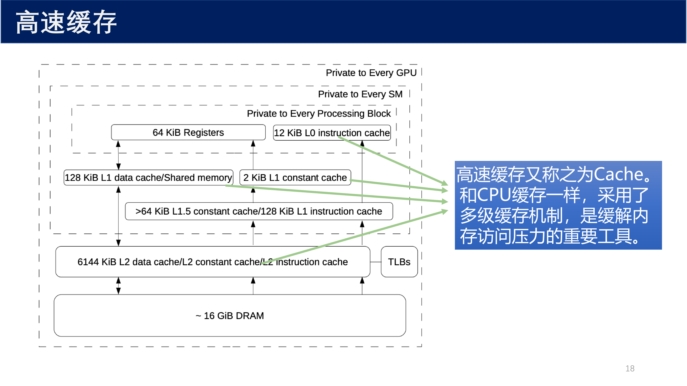{ width="800" }

高速缓存又称之为 **Cache**。和 CPU 缓存一样，GPU 采用了 **多级缓存机制**，是缓解内存访问压力的重要工具。

GPU 缓存层次包括：

- **L0 指令缓存**：每个处理块私有，12 KiB
- **L1 数据缓存 / 共享内存**：每个 SM 128 KiB（可配置比例）
- **L1 常量缓存**：2 KiB
- **L1.5 缓存**：常量缓存和指令缓存
- **L2 缓存**：GPU 级别共享，6144 KiB，统一缓存数据、常量和指令

!!! info "缓存对程序员透明"
    与共享内存不同，高速缓存（L1/L2）对程序员是 **透明的**，由硬件自动管理数据的缓存和替换。程序员无法直接控制缓存内容，但可以通过 **内存访问模式优化**（如合并访问、避免 bank conflict）来提高缓存命中率。

---

## 6 共享内存

### 6.1 共享内存概述

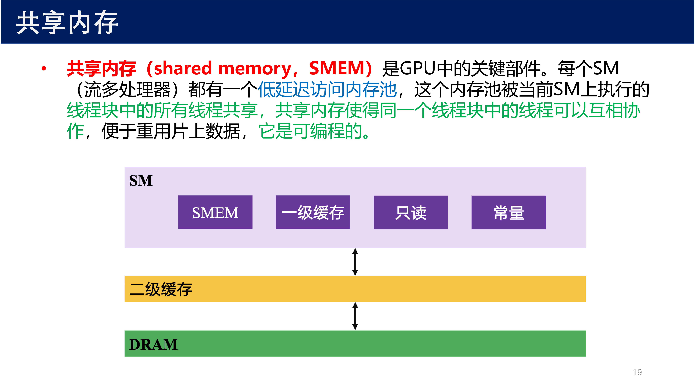{ width="800" }

!!! abstract "定义 6（共享内存 / Shared Memory）"
    **共享内存（shared memory，SMEM）** 是 GPU 中的关键部件。每个 SM（流多处理器）都有一个低延迟访问内存池，这个内存池被当前 SM 上执行的线程块中的所有线程共享。共享内存使得同一个线程块中的线程可以互相协作，便于重用片上数据，它是 **可编程的**。

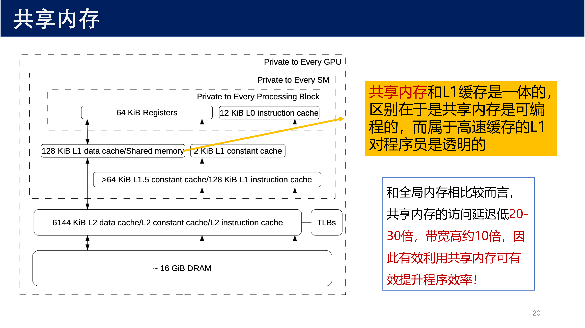{ width="800" }

共享内存的关键特性：

- 共享内存和 L1 缓存是 **一体的**，区别在于是共享内存是 **可编程的**，而属于高速缓存的 L1 对程序员是 **透明的**
- 和全局内存相比较而言，共享内存的访问延迟 **低 20-30 倍**，带宽 **高约 10 倍**，因此有效利用共享内存可有效提升程序效率

### 6.2 例 3：共享内存静态分配

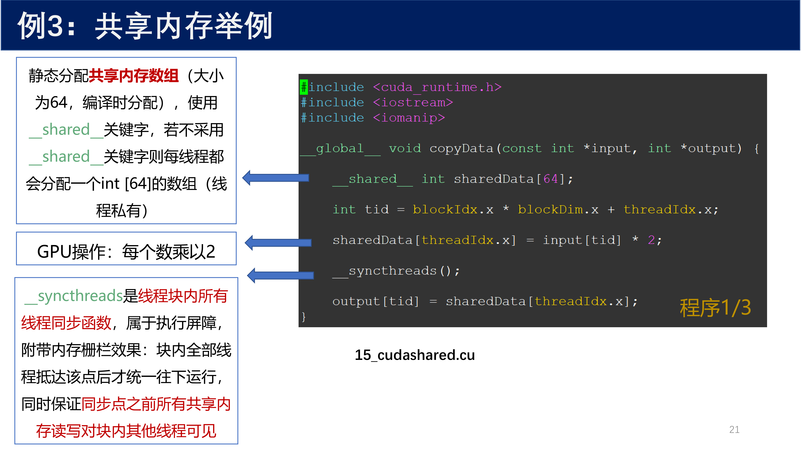{ width="800" }

```cpp
#include <cuda_runtime.h>
#include <iostream>
#include <iomanip>

__global__ void copyData(const int *input, int *output) {
    // 静态分配共享内存数组（大小为 64，编译时分配）
    __shared__ int sharedData[64];

    int tid = blockIdx.x * blockDim.x + threadIdx.x;

    // 从全局内存读取数据到共享内存
    sharedData[threadIdx.x] = input[tid] * 2;

    // 线程块内同步：确保所有线程完成写入
    __syncthreads();

    // 从共享内存写回全局内存
    output[tid] = sharedData[threadIdx.x];
}
```

!!! abstract "定义 7（__syncthreads）"
    `__syncthreads()` 是线程块内所有线程的 **同步函数**，属于执行屏障（Execution Barrier），附带内存栅栏效果：块内全部线程抵达该点后才统一往下运行，同时保证同步点之前所有共享内存读写对块内其他线程可见。

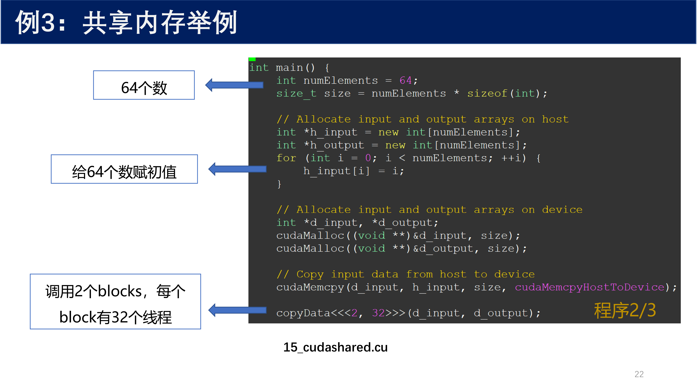{ width="800" }

```cpp
int main() {
    int numElements = 64;
    size_t size = numElements * sizeof(int);

    // 在主机端分配输入和输出数组
    int *h_input = new int[numElements];
    int *h_output = new int[numElements];

    // 给 64 个数赋初值
    for (int i = 0; i < numElements; ++i) {
        h_input[i] = i;
    }

    // 在设备端分配输入和输出数组
    int *d_input, *d_output;
    cudaMalloc((void **)&d_input, size);
    cudaMalloc((void **)&d_output, size);

    // 从主机拷贝数据到设备
    cudaMemcpy(d_input, h_input, size, cudaMemcpyHostToDevice);

    // 调用 2 个 blocks，每个 block 有 32 个线程
    copyData<<<2, 32>>>(d_input, d_output);
```

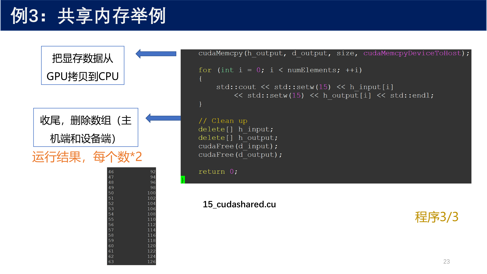{ width="800" }

```cpp
    // 把显存数据从 GPU 拷贝到 CPU
    cudaMemcpy(h_output, d_output, size, cudaMemcpyDeviceToHost);

    for (int i = 0; i < numElements; ++i) {
        std::cout << std::setw(15) << h_input[i]
                  << std::setw(15) << h_output[i] << std::endl;
    }

    // 收尾：删除数组（主机端和设备端）
    delete[] h_input;
    delete[] h_output;
    cudaFree(d_input);
    cudaFree(d_output);

    return 0;
}
```

**运行结果**：每个数乘以 2（0 -> 0, 1 -> 2, 2 -> 4, ...）。

!!! tip "静态共享内存的要点"
    - 使用 `__shared__` 关键字声明
    - 数组大小在 **编译时确定**
    - 若不采用 `__shared__` 关键字，则每线程都会分配一个私有数组，造成内存浪费
    - 共享内存的生命周期与线程块相同

### 6.3 例 4：共享内存的动态分配

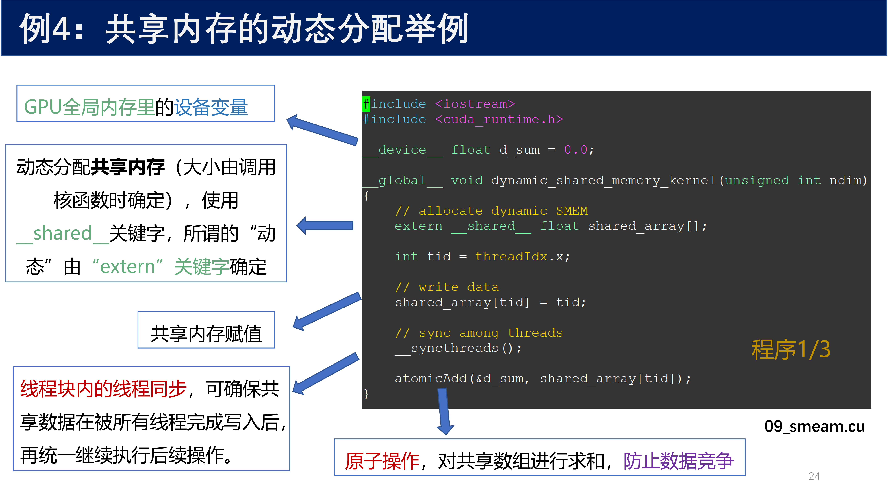{ width="800" }

```cpp
#include <iostream>
#include <cuda_runtime.h>

// GPU 全局内存里的设备变量
__device__ float d_sum = 0.0;

__global__ void dynamic_shared_memory_kernel(unsigned int ndim) {
    // 动态分配共享内存（大小由调用核函数时确定）
    // 使用 __shared__ 关键字，"动态"由 "extern" 关键字确定
    extern __shared__ float shared_array[];

    int tid = threadIdx.x;

    // 共享内存赋值
    shared_array[tid] = tid;

    // 线程块内的线程同步
    __syncthreads();

    // 原子操作：对共享数组进行求和，防止数据竞争
    atomicAdd(&d_sum, shared_array[tid]);
}
```

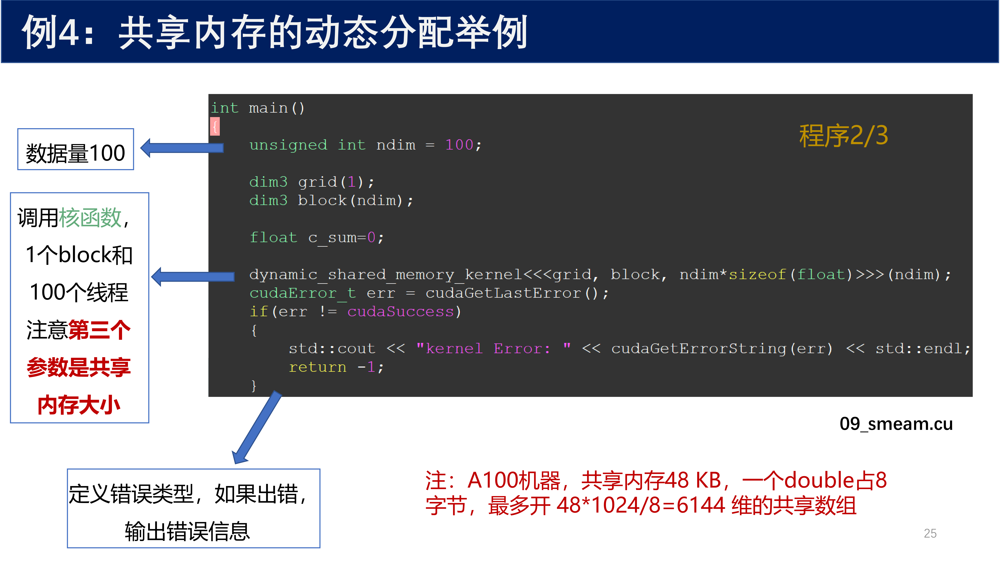{ width="800" }

```cpp
int main() {
    unsigned int ndim = 100;

    dim3 grid(1);
    dim3 block(ndim);

    float c_sum = 0;

    // 调用核函数：1 个 block 和 100 个线程
    // 注意第三个参数是共享内存大小（字节）
    dynamic_shared_memory_kernel<<<grid, block, ndim * sizeof(float)>>>(ndim);

    cudaError_t err = cudaGetLastError();
    if (err != cudaSuccess) {
        std::cout << "Kernel Error: " << cudaGetErrorString(err) << std::endl;
        return -1;
    }
```

!!! info "核函数调用中的共享内存大小"
    核函数调用的第三个参数 `ndim * sizeof(float)` 指定了每个线程块分配的 **动态共享内存字节数**。这是动态共享内存与静态共享内存的关键区别。

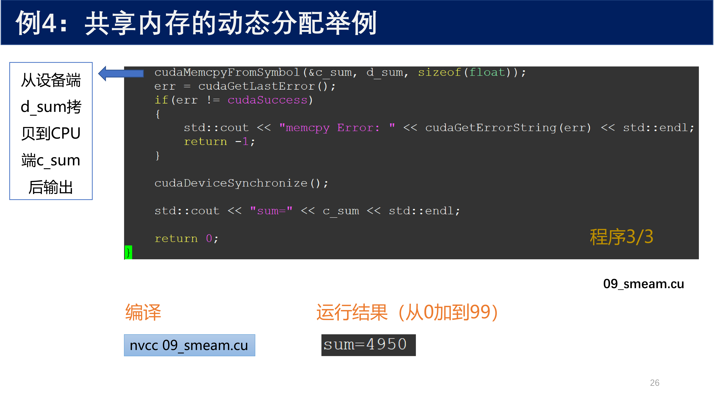{ width="800" }

```cpp
    // 从设备端 d_sum 拷贝到 CPU 端 c_sum 后输出
    cudaMemcpyFromSymbol(&c_sum, d_sum, sizeof(float));

    err = cudaGetLastError();
    if (err != cudaSuccess) {
        std::cout << "memcpy Error: " << cudaGetErrorString(err) << std::endl;
        return -1;
    }

    cudaDeviceSynchronize();

    std::cout << "sum=" << c_sum << std::endl;

    return 0;
}
```

**编译与运行**：

```bash
nvcc 09_smeam.cu
```

**运行结果**（从 0 加到 99）：

```
sum=4950
```

!!! warning "共享内存容量限制"
    以 A100 机器为例，共享内存为 48 KB。一个 `double` 占 8 字节，最多可开 $48 \times 1024 / 8 = 6144$ 维的共享数组。超过此限制会导致运行时错误。

---

## 7 设备函数

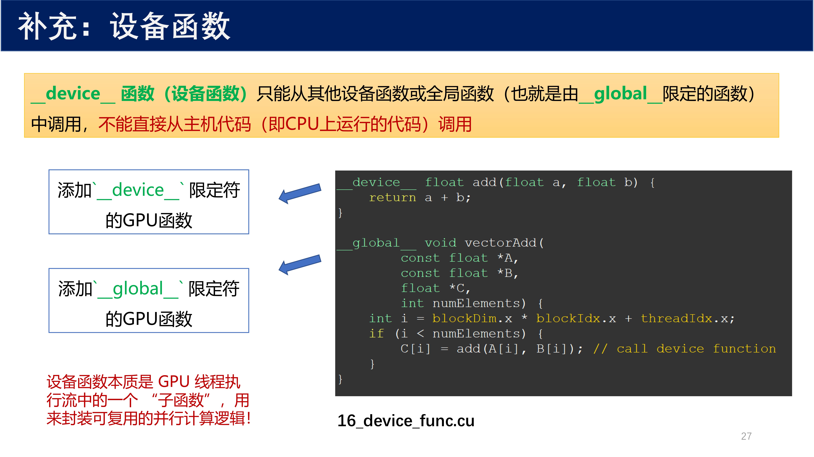{ width="800" }

!!! abstract "定义 8（设备函数 / Device Function）"
    `__device__` 函数（设备函数）只能从其他设备函数或全局函数（也就是由 `__global__` 限定的函数）中调用，不能直接从主机代码（即 CPU 上运行的代码）调用。

```cpp
// 添加 __device__ 限定符的 GPU 函数
__device__ float add(float a, float b) {
    return a + b;
}

// 添加 __global__ 限定符的 GPU 函数
__global__ void vectorAdd(
    const float *A,
    const float *B,
    float *C,
    int numElements) {
    int i = blockDim.x * blockIdx.x + threadIdx.x;
    if (i < numElements) {
        C[i] = add(A[i], B[i]);  // 调用设备函数
    }
}
```

!!! tip "设备函数的作用"
    设备函数本质是 GPU 线程执行流中的一个 "子函数"，用来 **封装可复用的并行计算逻辑**。合理使用设备函数可以提高代码的模块化和可读性，编译器通常会将其 **内联展开**，不会引入额外的函数调用开销。

---

## 8 常量内存

### 8.1 常量内存概述

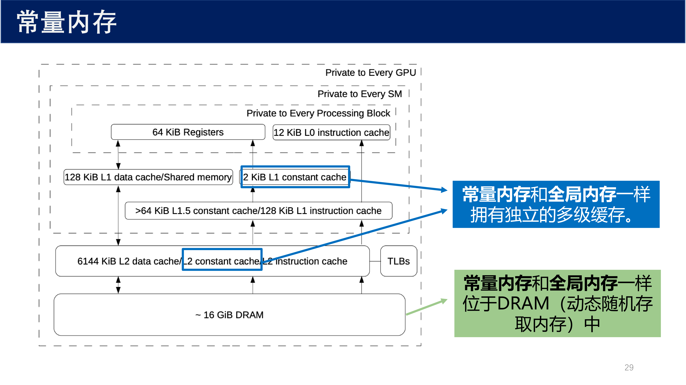{ width="800" }

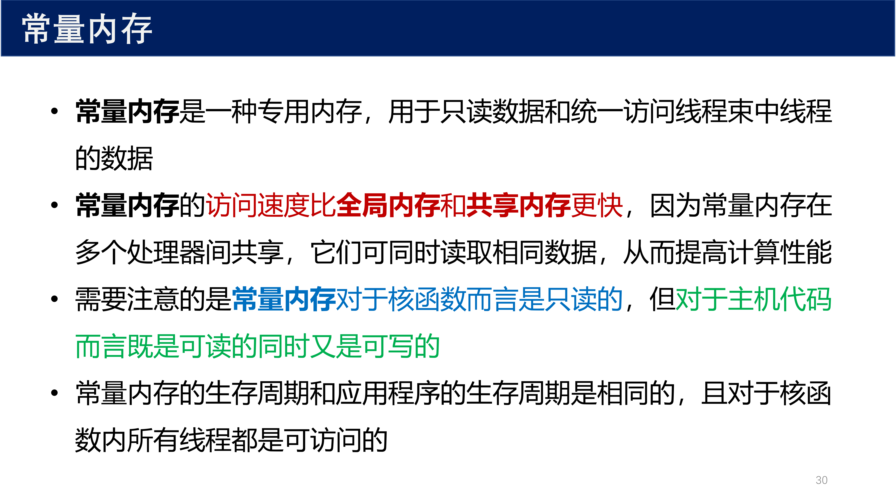{ width="800" }

!!! abstract "定义 9（常量内存 / Constant Memory）"
    **常量内存** 是一种专用内存，用于只读数据和统一访问线程束中线程的数据。

常量内存具有以下特性：

- 常量内存的访问速度比全局内存和共享内存更快，因为常量内存在多个处理器间共享，它们可同时读取相同数据，从而提高计算性能
- 常量内存对于核函数而言是 **只读的**，但对于主机代码而言既是可读的又是可写的
- 常量内存的生存周期和应用程序的生存周期是相同的，且对于核函数内所有线程都是可访问的
- 常量内存和全局内存一样拥有 **独立的多级缓存**
- 常量内存和全局内存一样位于 **DRAM** 中

### 8.2 例 5：常量内存用法

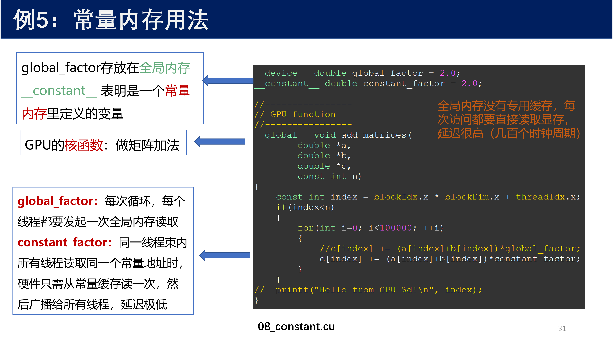{ width="800" }

```cpp
// global_factor 存放在全局内存
__device__ double global_factor = 2.0;

// __constant__ 表明是一个常量内存里定义的变量
__constant__ double constant_factor = 2.0;

// GPU 的核函数：做矩阵加法
__global__ void add_matrices(
    double *a,
    double *b,
    double *c,
    const int n) {
    const int index = blockIdx.x * blockDim.x + threadIdx.x;
    if (index < n) {
        for (int i = 0; i < 100000; ++i) {
            // global_factor：每次循环，每个线程都要发起一次全局内存读取
            c[index] += (a[index] + b[index]) * global_factor;

            // constant_factor：同一线程束内所有线程读取同一个常量地址时，
            // 硬件只需从常量缓存读一次，然后广播给所有线程，延迟极低
            c[index] += (a[index] + b[index]) * constant_factor;
        }
    }
}
```

!!! tip "常量内存的性能优势"
    - **全局内存** 没有专用缓存，每次访问都要直接读取显存，延迟很高（几百个时钟周期）
    - **常量内存** 有专用常量缓存，当同一线程束（warp）内所有线程读取同一个常量地址时，硬件只需从缓存读 **一次**，然后 **广播** 给所有线程，延迟极低
    - 常量内存特别适合存储 **所有线程共享的只读参数**（如滤波器系数、变换矩阵等）

---

## 9 纹理内存

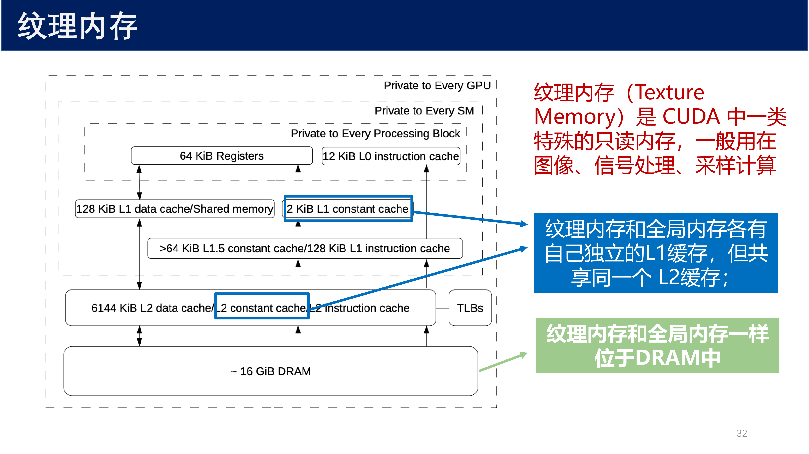{ width="800" }

!!! abstract "定义 10（纹理内存 / Texture Memory）"
    **纹理内存（Texture Memory）** 是 CUDA 中一类特殊的只读内存，一般用在图像、信号处理、采样计算。

纹理内存的特性：

- 纹理内存和全局内存各有自己独立的 L1 缓存，但共享同一个 L2 缓存
- 纹理内存和全局内存一样位于 DRAM 中
- 纹理缓存专用于那些在内存访问模式中存在大量 **空间局部性（Spatial Locality）** 的图形应用程序

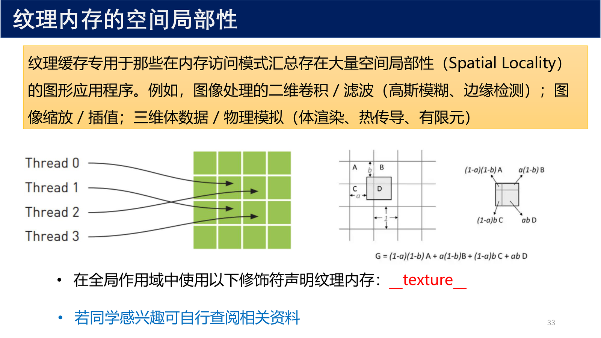{ width="800" }

纹理内存的典型应用场景：

- 图像处理的二维卷积 / 滤波（高斯模糊、边缘检测）
- 图像缩放 / 插值
- 三维体数据 / 物理模拟（体渲染、热传导、有限元）

在全局作用域中使用以下修饰符声明纹理内存：

```cpp
__texture__
```

!!! info "纹理内存的使用"
    纹理内存的具体使用较为复杂，涉及纹理对象、采样器等概念。若同学感兴趣可自行查阅 CUDA 官方文档和相关资料。

---

## 10 统一内存模型

### 10.1 统一内存的概念

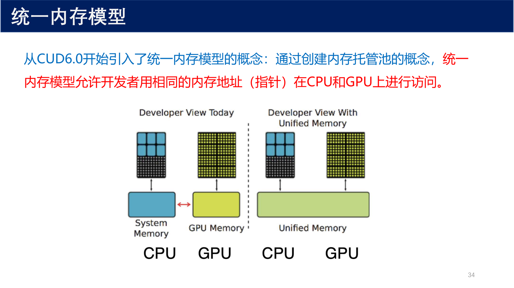{ width="800" }

从 **CUDA 6.0** 开始引入了 **统一内存模型（Unified Memory）** 的概念：通过创建内存托管池的概念，统一内存模型允许开发者用 **相同的内存地址（指针）** 在 CPU 和 GPU 上进行访问。

!!! abstract "定义 11（统一内存 / Unified Memory）"
    **统一内存模型** 是一种内存管理机制，它通过创建托管内存池，使得 CPU 和 GPU 可以使用相同的指针访问同一块内存数据，无需程序员手动管理主机和设备之间的数据拷贝。

### 10.2 统一内存的 API

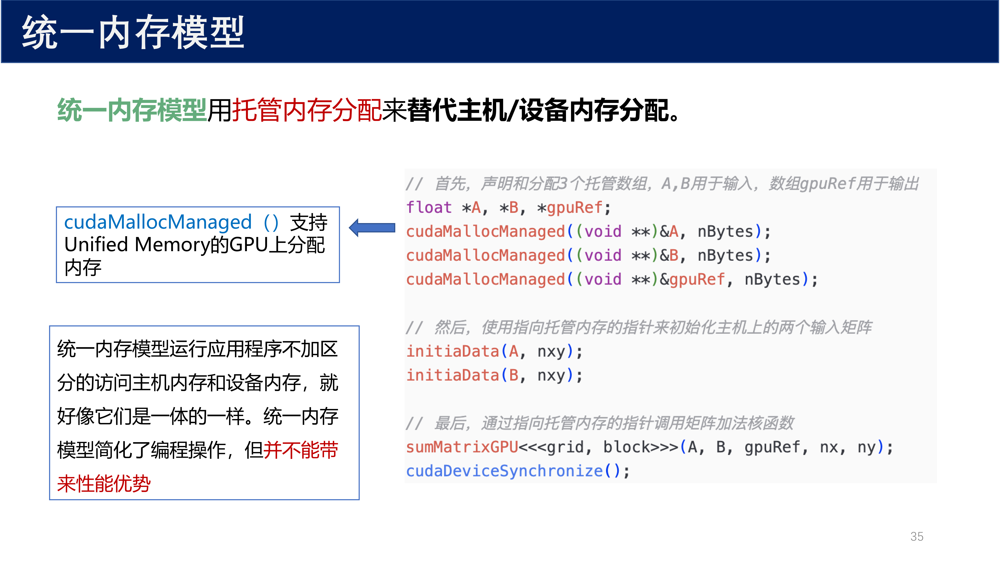{ width="800" }

统一内存模型用 **托管内存分配** 来替代主机/设备内存分配：

```cpp
// 首先，声明和分配 3 个托管数组，A, B 用于输入，数组 gpuRef 用于输出
float *A, *B, *gpuRef;

// cudaMallocManaged() 支持 Unified Memory 的 GPU 上分配内存
cudaMallocManaged((void **)&A, nBytes);
cudaMallocManaged((void **)&B, nBytes);
cudaMallocManaged((void **)&gpuRef, nBytes);

// 然后，使用指向托管内存的指针来初始化主机上的两个输入矩阵
initiaData(A, nxy);
initiaData(B, nxy);

// 最后，通过指向托管内存的指针调用矩阵加法核函数
sumMatrixGPU<<<grid, block>>>(A, B, gpuRef, nx, ny);
cudaDeviceSynchronize();
```

!!! warning "统一内存的性能考量"
    统一内存模型简化了编程操作，但 **并不能带来性能优势**。数据在 CPU 和 GPU 之间的实际迁移仍然会发生（由 CUDA 驱动自动管理），只是对程序员透明了。对于性能敏感的应用，显式内存管理仍然是更好的选择。

### 10.3 统一内存与内存栅栏

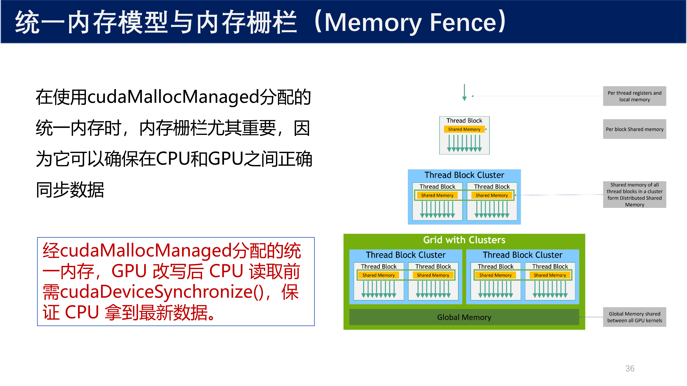{ width="800" }

在使用 `cudaMallocManaged` 分配的统一内存时，**内存栅栏（Memory Fence）** 尤其重要，因为它可以确保在 CPU 和 GPU 之间正确同步数据。

!!! abstract "定义 12（内存栅栏 / Memory Fence）"
    **内存栅栏** 是一种同步机制，用于确保内存操作的顺序性。在统一内存模型中，经 `cudaMallocManaged` 分配的统一内存，GPU 改写后 CPU 读取前需调用 `cudaDeviceSynchronize()`，保证 CPU 拿到最新数据。

```cpp
// GPU 核函数修改统一内存数据
kernel<<<grid, block>>>(managed_ptr);

// 内存栅栏：确保 GPU 完成所有内存操作
cudaDeviceSynchronize();

// 现在 CPU 可以安全读取最新数据
printf("%f\n", managed_ptr[0]);
```

---

## 11 小结

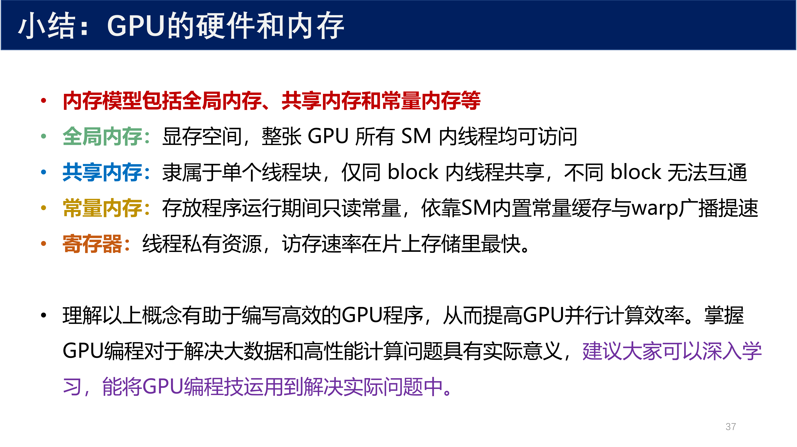{ width="800" }

### 11.1 GPU 内存类型对比

| 内存类型 | 位置 | 访问范围 | 速度 | 生命周期 | 可编程性 |
|----------|------|----------|------|----------|----------|
| **寄存器** | SM 内部 | 线程私有 | 最快 | 线程 | 编译器自动分配 |
| **共享内存** | SM 内部 | 线程块共享 | 很快 | 线程块 | 程序员显式控制 |
| **L1/L2 缓存** | SM/GPU | 自动管理 | 快 | 自动 | 硬件透明管理 |
| **常量内存** | DRAM + 缓存 | 所有线程只读 | 较快 | 应用程序 | 声明时指定 |
| **纹理内存** | DRAM + 缓存 | 所有线程只读 | 较快 | 应用程序 | 需纹理 API |
| **全局内存** | DRAM | 所有线程读写 | 最慢 | 应用程序 | 显式分配/释放 |
| **统一内存** | DRAM | CPU/GPU 共享 | 自动迁移 | 应用程序 | 托管分配 |

### 11.2 核心要点总结

- **内存模型** 包括全局内存、共享内存和常量内存等
- **全局内存**：显存空间，整张 GPU 所有 SM 内线程均可访问，容量最大但速度最慢
- **共享内存**：隶属于单个线程块，仅同 block 内线程共享，不同 block 无法互通，延迟低 20-30 倍
- **常量内存**：存放程序运行期间只读常量，依靠 SM 内置常量缓存与 warp 广播提速
- **寄存器**：线程私有资源，访存速率在片上存储里最快，但数量有限
- **统一内存**：简化编程模型，但不能带来性能优势，需要配合内存栅栏使用

理解以上概念有助于编写高效的 GPU 程序，从而提高 GPU 并行计算效率。掌握 GPU 编程对于解决大数据和高性能计算问题具有实际意义，建议深入学习和实践。
