## 1 为什么使用 GPU

### 1.1 GPU 在 AI 时代的重要性

近年来，以 ChatGPT 为代表的大语言模型（LLM）引发了全球范围内的 AI 浪潮。ChatGPT 于 2022 年 11 月末公开测试，活跃用户数突破 1 亿仅用了 2 个多月。作为对比，电话达到 1 亿用户用了 75 年，手机用了 16 年，互联网站用了 7 年，推特用了 5 年。这一惊人的增长速度背后，离不开 **GPU 并行计算** 的强大支撑。

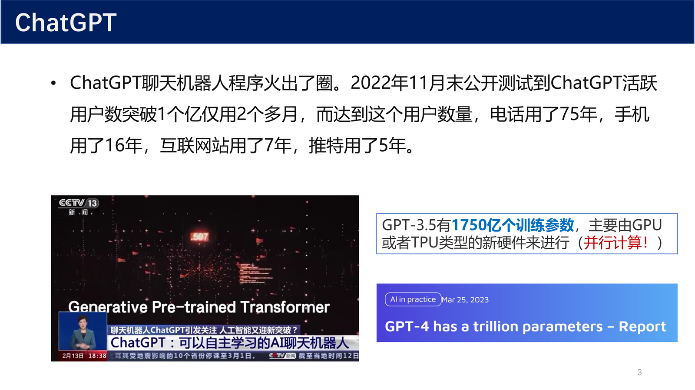{ width="800" }

GPT-3.5 拥有 **1750 亿个训练参数**，主要由 GPU 或 TPU 类型的新硬件通过 **并行计算** 完成训练。而 GPT-4 的参数规模更是达到了万亿级别。

OpenAI 的 CEO Sam Altman 曾透露，GPT-3 的训练时间为 **355 GPU 年**，成本高达 **460 万美元**。这充分说明了大模型训练对 GPU 算力的巨大需求。

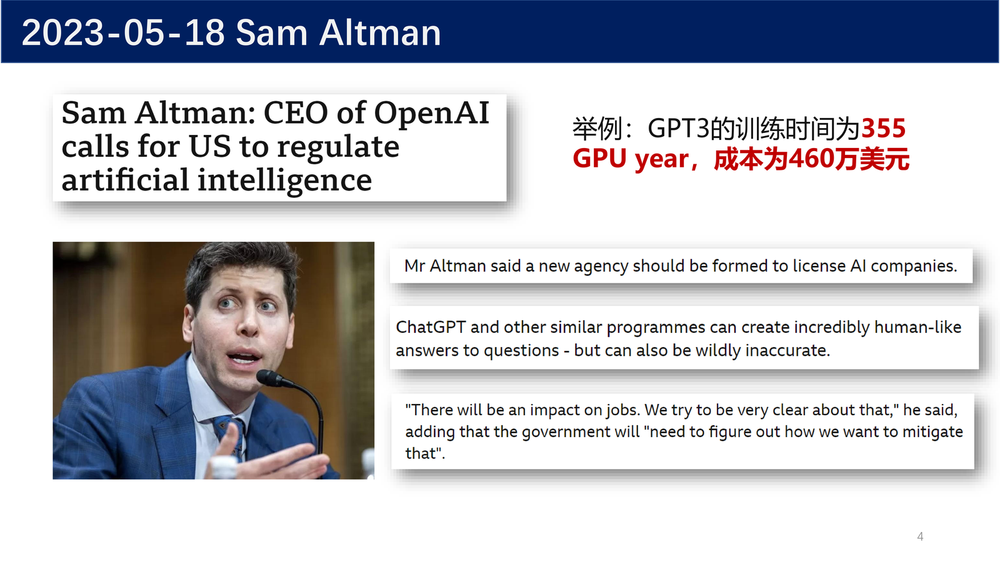{ width="800" }

截至 2024 年，国内各大科技公司大量采购 NVIDIA H100 GPU：

| 公司 | 购买数量 |
|:---:|:---:|
| 腾讯 | 5 万块 |
| 百度 | 4 万块 |
| 阿里巴巴 | 2.5 万块 |
| 字节跳动 | 2 万块 |

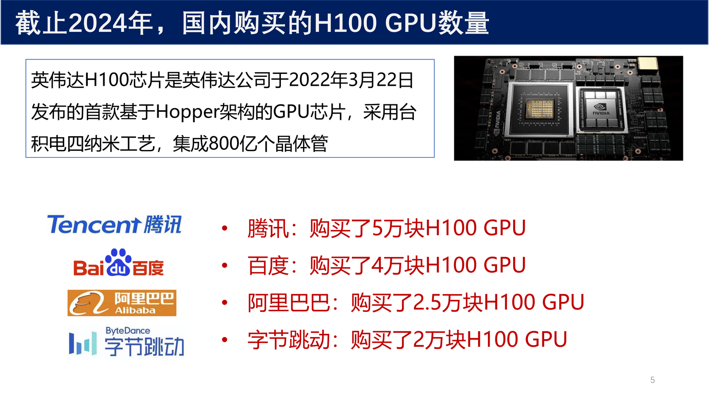{ width="800" }

NVIDIA H100 芯片于 2022 年 3 月 22 日发布，是首款基于 **Hopper 架构** 的 GPU 芯片，采用台积电四纳米工艺，集成了 **800 亿个晶体管**。

### 1.2 GPU 的起源与发展历程

!!! abstract "定义 1（GPU）"
    **GPU（Graphics Processing Unit，图形处理单元）** 是计算机系统中专门用于图形处理的处理器。1999 年 10 月，英伟达（NVIDIA）发布了 **GeForce 256**，这是一款基于台积电 220 纳米工艺、集成了 **2300 万个晶体管** 的图形处理芯片。英伟达将 "Graphics Processing Unit" 的首字母 "GPU" 提炼出来，把 GeForce 256 冠以 "世界上第一块 GPU" 的称号，巧妙地定义了 GPU 这个新品类。

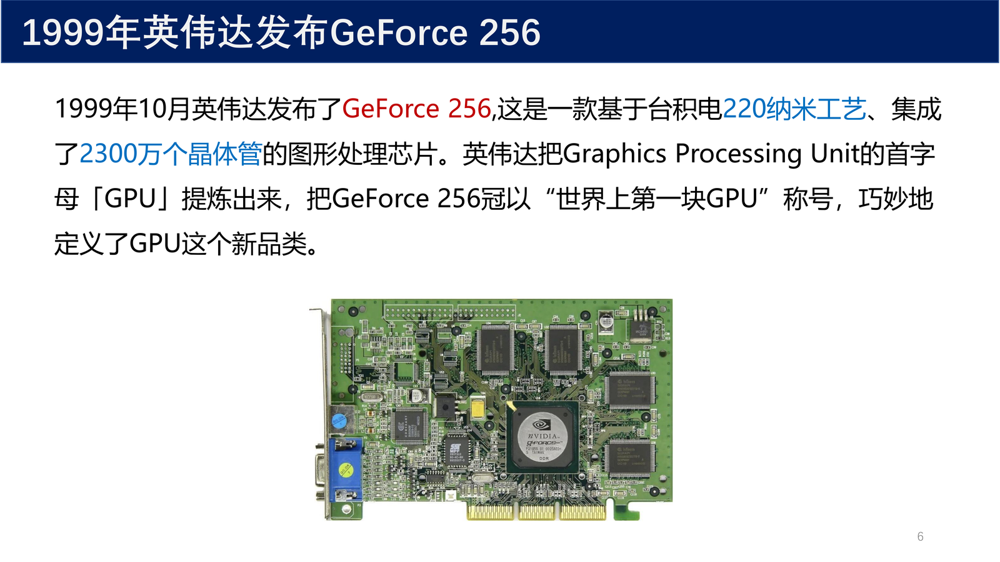{ width="800" }

GPU 最初是为了 **图形处理** 而设计的，其常见应用领域包括：

- **游戏渲染**
- **图形设计**
- **并行计算**

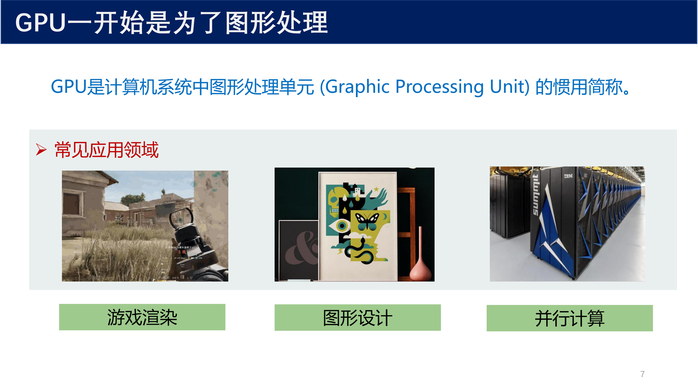{ width="800" }

1996 年，第一人称射击游戏 **雷神之锤（Quake）** 于 6 月 22 日发布，这款游戏带来了独立 3D 显卡的革命。对比图显示，使用普通 VGA 的 Quake 分辨率为 320×200，而使用 OpenGL 的 3dfx 显卡后分辨率提升至 640×480，色彩和帧率也有显著改善。

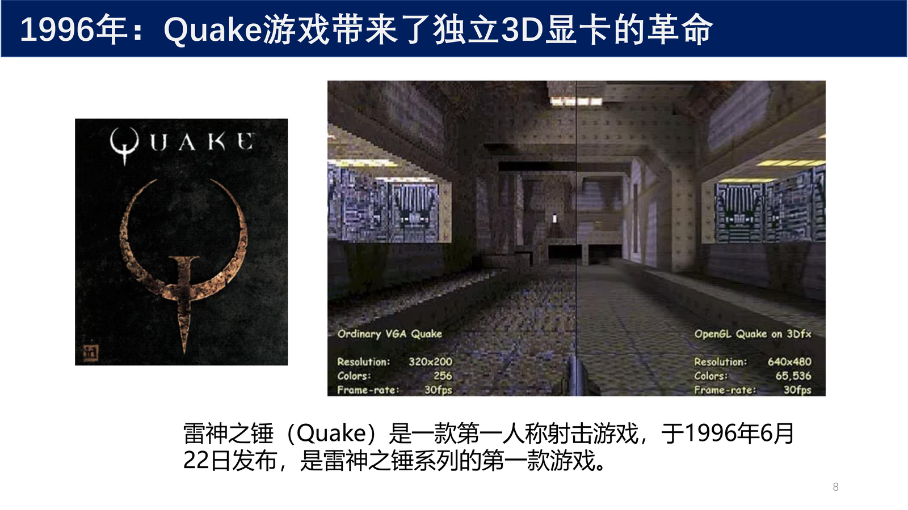{ width="800" }

### 1.3 GPU 走向通用计算：GPGPU

2006 年，如今的亚马逊 AI/ML 总经理 **Kumar Chellapilla** 使用英伟达的 **GeForce 7800** 显卡第一次实现了 **卷积神经网络（CNN）**，发现比使用 CPU 要快 4 倍。这是已知最早将 GPU 用于深度学习的尝试。

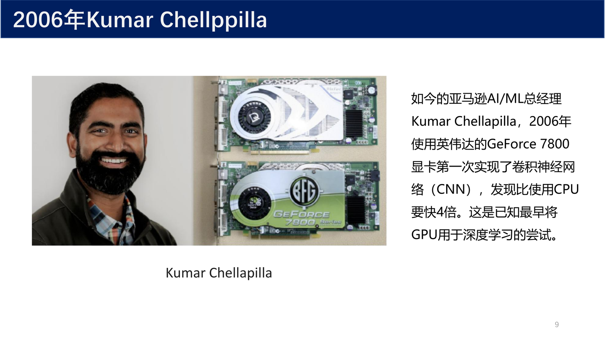{ width="800" }

2009 年，斯坦福的 **吴恩达（Andrew Ng）** 等人发表了突破性的一篇论文，GPU 凭借 **超过 CPU 70 倍的算力** 将 AI 训练时间从几周缩短到了几小时。这篇论文为人工智能的硬件实现指明了方向，GPU 大大加速了 AI 从论文走向现实的过程。

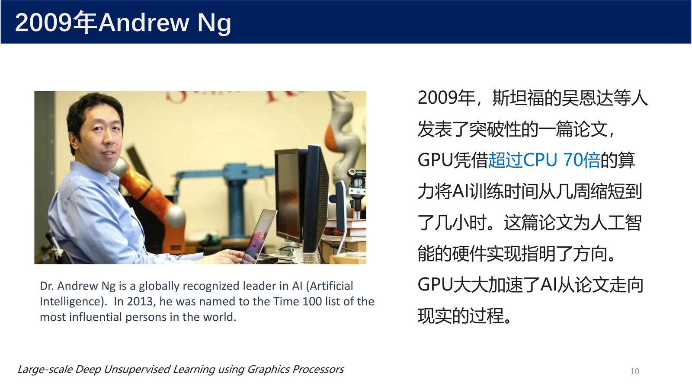{ width="800" }

2012 年，**AlexNet** 横空出世，在 ImageNet 大规模视觉识别挑战赛（ILSVRC）中夺得冠军。ImageNet 是一个计算机视觉系统识别项目，是目前世界上图像识别最大的数据库。AlexNet 的训练需要 **1400 万张图片**、总计 **262 千万亿次浮点运算**。在一个星期的训练过程中，AlexNet 仅用了 **2 颗英伟达 GeForce GTX 580**（费米架构），分类准确率远超第二名传统分类方法。借助 GTX 训练的 AlexNet 引发了 AI 的第三次浪潮。

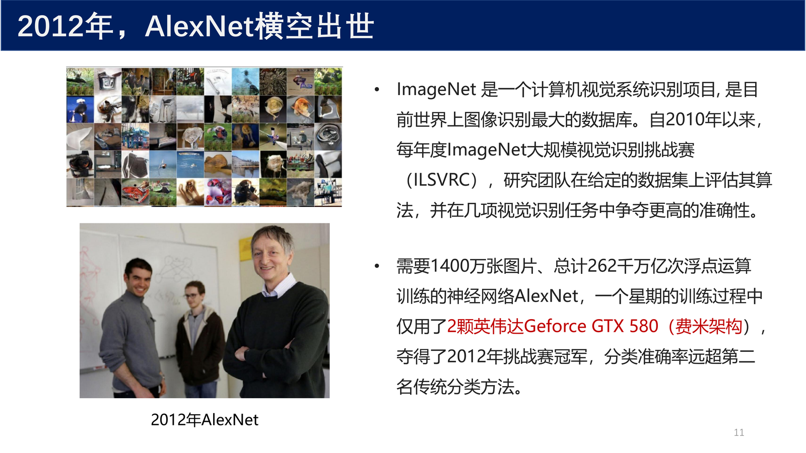{ width="800" }

---

## 2 GPU 架构

### 2.1 GPU 与 CPU 架构对比

GPU 硬件中 **简化了操作逻辑**（也带来了麻烦），更多的晶体管被用于计算部分。下图展示了 CPU 与 GPU 的架构差异：

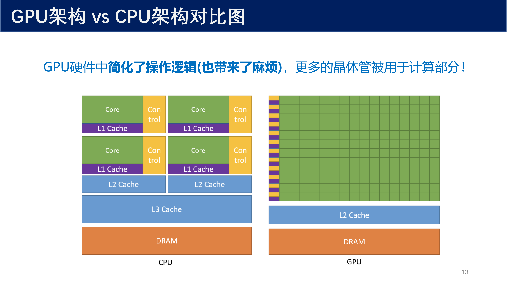{ width="800" }

从图中可以看出：

- **CPU**：拥有少量强大的核心（Core），配备大容量的 L1/L2/L3 Cache 和复杂的控制逻辑（Control），适合处理串行任务和复杂控制流。
- **GPU**：拥有大量简化的计算核心，控制逻辑和缓存相对较小，将更多晶体管用于计算单元，适合大规模并行计算。

!!! abstract "定义 2（GPGPU）"
    **GPGPU（General-Purpose computing on Graphics Processing Units）** 即 **通用图形处理器计算**，是利用图形处理器（GPU）的并行计算能力来 **加速通用计算任务** 的技术。传统的 CPU 在处理一些需要大量计算的任务时，由于其架构的限制，无法发挥出其最大的计算能力。GPU 的并行计算能力可以更好地处理这些任务，因此 GPGPU 技术可以大大提高计算效率。GPGPU 技术被广泛应用于科学计算、机器学习、图像处理、视频编码等领域。

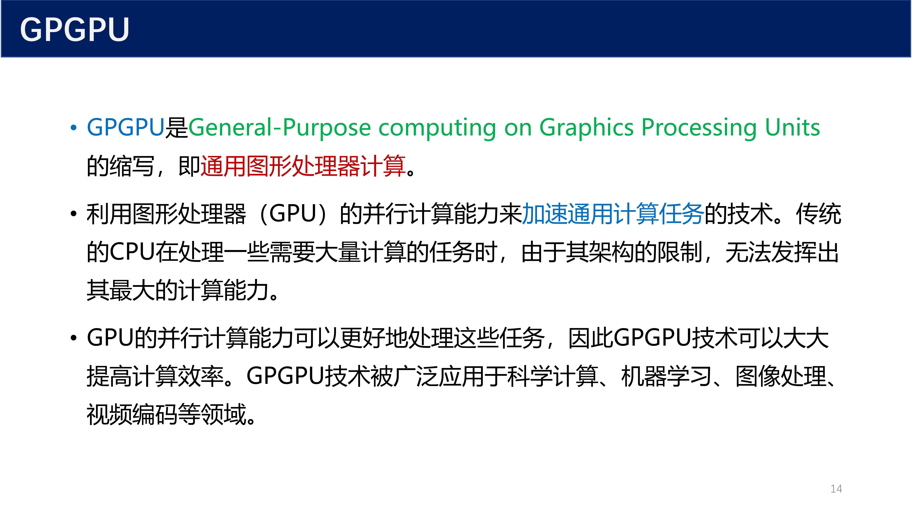{ width="800" }

### 2.2 英伟达 GPU 架构演化史

英伟达的 GPU 架构以著名科学家的名字命名，经历了多次重大演进：

| 时间 | 架构名称 | 命名来源 | 关键特性 |
|:---:|:---:|:---|:---|
| 1999 | GeForce 系列 | — | 首款 GPU |
| 2006 | Tesla | 电力商业化的重要推动者 | G80 第一款支持 C 语言的 GPU，引入单指令多线程 SIMT |
| 2010 | Fermi | 著名物理学家 | 第一款计算 GPU，提高双精度性能，更多共享内存 > 16 KB，30 亿晶体管，每个 SM 32 个计算核心，共 512 个内核 |
| 2012 | Kepler | 开普勒三定律 | SM 扩充到 192 个计算核心（SMX） |
| 2014 | Maxwell | 发现麦克斯韦方程组 | — |
| 2016 | Pascal | 帕斯卡定律（流体静力学基本规律） | 16nm 工艺，性能大幅提升，功耗不增加，例如 GTX 1080Ti |
| 2017 | Volta | 伏打，电池发明人 | V100 增加了 TensorCore 功能，以深度学习为核心 |
| 2018 | Turing | 图灵，计算机之父 | 去掉了对 FP64 的支持，RTX 2080 Ti |
| 2019 | Ampere | 对电磁学作了大量贡献 | 第 8 代 GPU，A100，架构又把 FP64 Core 加回来了 |
| 2022 | Hopper | 发明第一个编译器 | H100 有 800 亿个晶体管 |

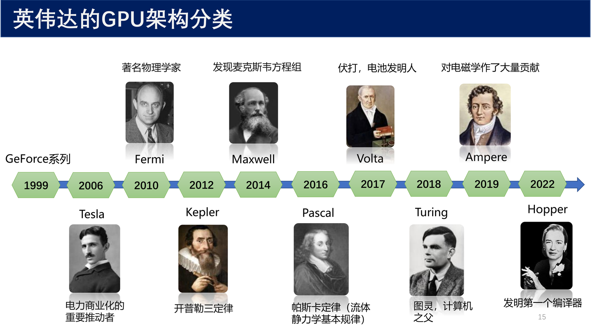{ width="800" }

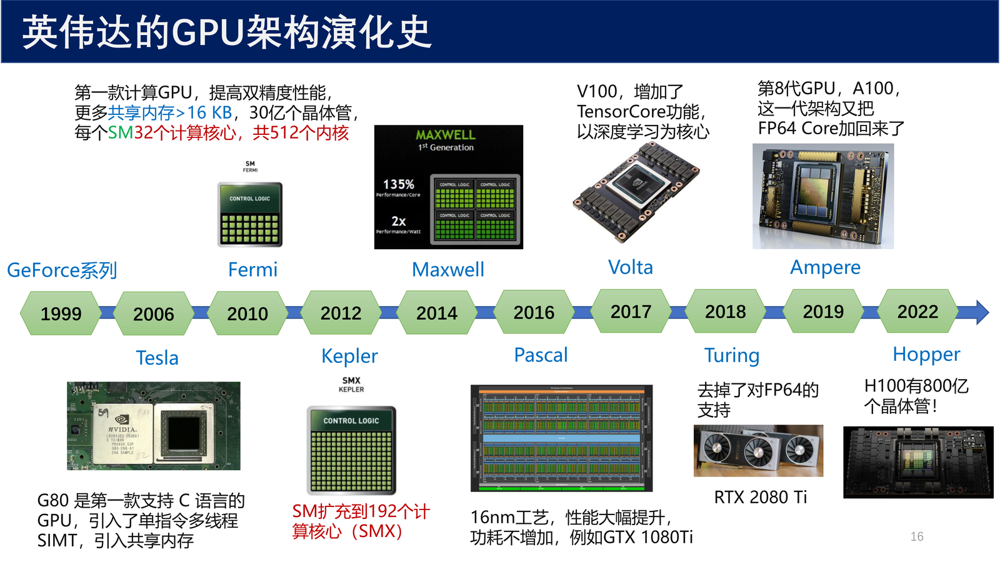{ width="800" }

### 2.3 费米架构详解：以 GTX 480 为例

!!! abstract "定义 3（SM，Streaming Multiprocessor）"
    **SM（流式多处理器，Streaming Multiprocessor）** 是一种计算机处理器架构，主要用于图形处理器（GPU）和加速器。它包含多个处理器核心和共享缓存，并支持并行计算。每个 SM 可以同时处理多个线程，这些线程可以在不同的核心上运行，从而实现高效的并行计算。通过使用流多处理器，可极大提高计算机的处理能力和效率。

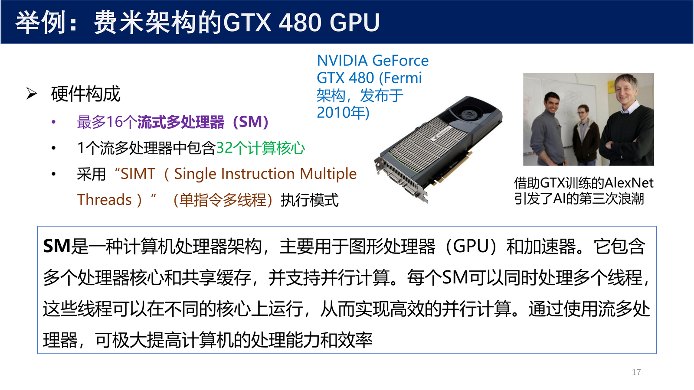{ width="800" }

**NVIDIA GeForce GTX 480**（Fermi 架构，发布于 2010 年）的硬件构成：

- 最多 **16 个流式多处理器（SM）**
- 1 个流多处理器中包含 **32 个计算核心**
- 采用 **SIMT（Single Instruction Multiple Threads，单指令多线程）** 执行模式

GPU 架构是围绕一个流式多处理器（SM）的 **可扩展阵列** 搭建的。Fermi 架构一个 GPU 有 15（16）个 SM。GPU 中的每一个 SM 都能 **支持数百个线程并发执行**。因为每个 GPU 都有多个 SM，所以同时并发 **成千上万个线程** 是有可能的（这是 CPU 难以达到的！）。

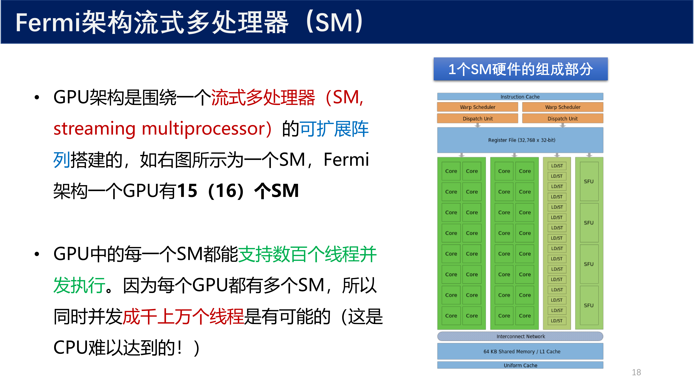{ width="800" }

#### 2.3.1 SM 的关键组件

Fermi 架构里 SM（流多处理器）的关键组件包括：

- **线程束（Warp）调度器**：2 个
- **指令分派单元**
- **寄存器**
- **CUDA 核心 32 个**：SM 内部负责浮点 / 整数运算的最小执行核
- **共享内存、一级缓存**（影响性能的关键因素）
- **互联网络**
- **LD/ST（Load/Store）单元**
- **SFU（Special Function Unit，特殊函数单元）**

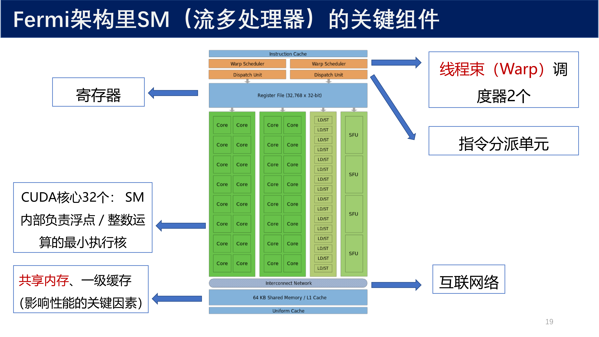{ width="800" }

#### 2.3.2 流式多处理器的计算能力

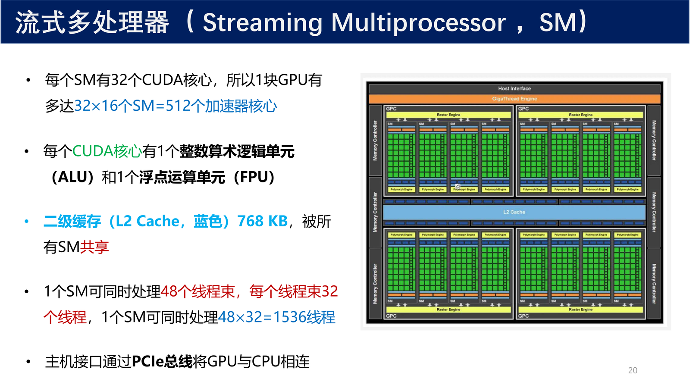{ width="800" }

每个 SM 有 32 个 CUDA 核心，所以 1 块 GPU 有多达：

$$
32 \times 16 \text{ 个 SM} = 512 \text{ 个加速器核心}
$$

每个 CUDA 核心有 1 个 **整数算术逻辑单元（ALU）** 和 1 个 **浮点运算单元（FPU）**。

**二级缓存（L2 Cache，蓝色）768 KB**，被所有 SM 共享。

1 个 SM 可同时处理 **48 个线程束**，每个线程束 **32 个线程**，所以 1 个 SM 可同时处理：

$$
48 \times 32 = 1536 \text{ 线程}
$$

主机接口通过 **PCIe 总线** 将 GPU 与 CPU 相连。

#### 2.3.3 GTX 480 的总线程数

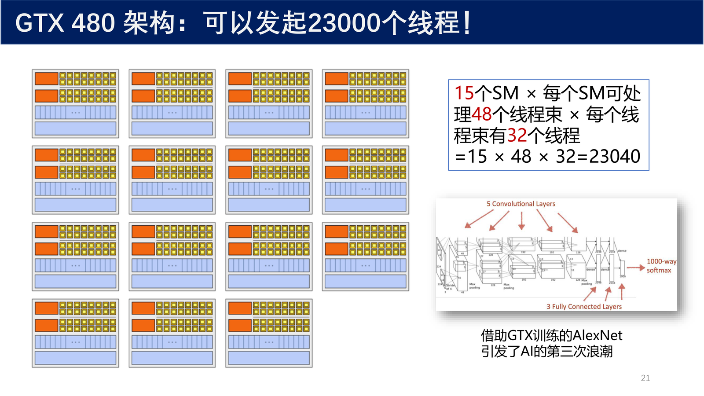{ width="800" }

GTX 480 可以发起的总线程数为：

$$
15 \text{ 个 SM} \times 48 \text{ 个线程束/SM} \times 32 \text{ 个线程/线程束} = 15 \times 48 \times 32 = 23040
$$

### 2.4 Volta 架构：以 V100 为例

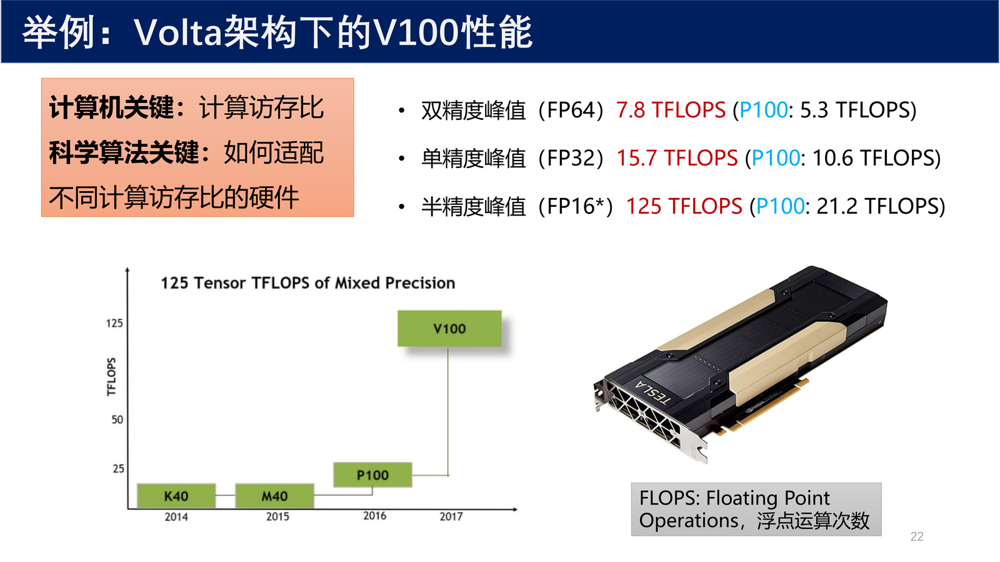{ width="800" }

**V100** 的性能指标：

| 精度 | 峰值性能 | 对比 P100 |
|:---:|:---:|:---:|
| 双精度（FP64） | 7.8 TFLOPS | P100: 5.3 TFLOPS |
| 单精度（FP32） | 15.7 TFLOPS | P100: 10.6 TFLOPS |
| 半精度（FP16*） | 125 TFLOPS | P100: 21.2 TFLOPS |

!!! tip "计算访存比"
    计算机关键：**计算访存比**。科学算法关键：如何适配不同计算访存比的硬件。

从图中可以看到，从 K40（2014）到 M40（2015）再到 P100（2016），最后到 V100（2017），混合精度 Tensor TFLOPS 实现了飞跃式增长，V100 达到了 125 TFLOPS。

### 2.5 GPU 在超级计算机中的应用

#### 2.5.1 美国 Summit 超算（2018）

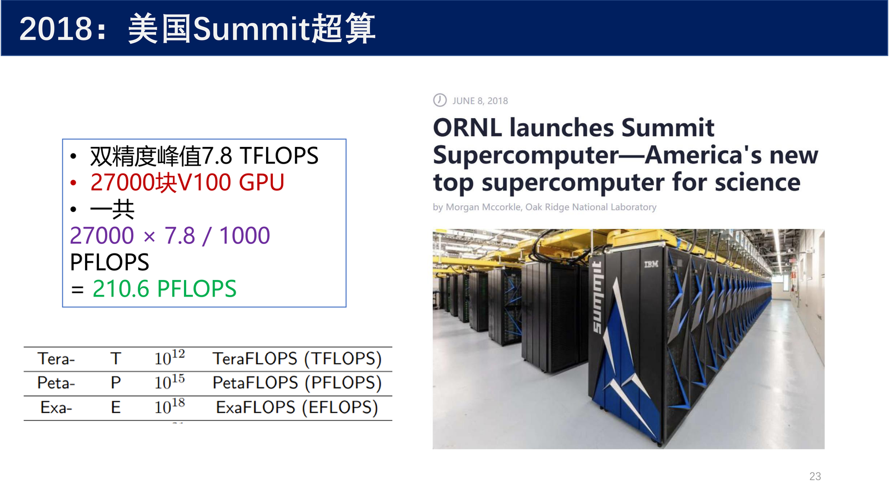{ width="800" }

2018 年美国 Oak Ridge 国家实验室（ORNL）发布的 **Summit** 超级计算机：

- 双精度峰值 **7.8 TFLOPS**
- **27000 块 V100 GPU**
- 总算力：$27000 \times 7.8 / 1000 = 210.6$ **PFLOPS**

单位换算：

| 前缀 | 符号 | 数值 |
|:---:|:---:|:---:|
| Tera | T | $10^{12}$ |
| Peta | P | $10^{15}$ |
| Exa | E | $10^{18}$ |

#### 2.5.2 Top500 榜单（2023 年 5 月）

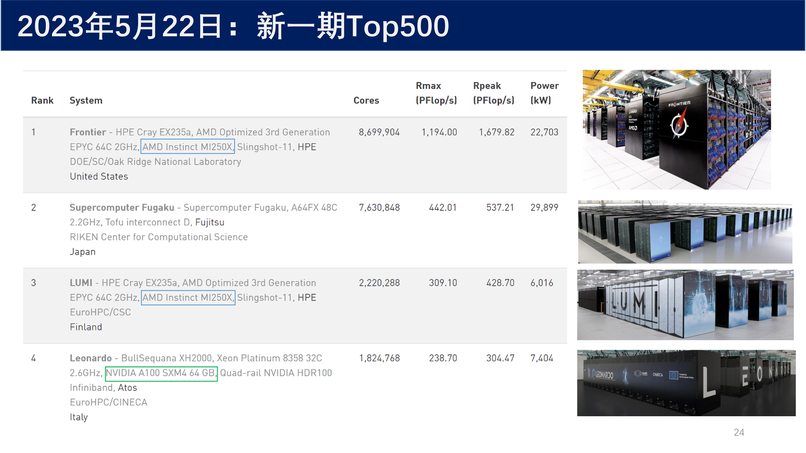{ width="800" }

| 排名 | 系统 | 核心数 | Rmax (PFlop/s) | Rpeak (PFlop/s) | 功耗 (kW) |
|:---:|:---|:---:|:---:|:---:|:---:|
| 1 | Frontier - HPE Cray EX235a, AMD Optimized 3rd Generation EPYC 64C 2GHz, AMD Instinct MI250X | 8,699,904 | 1,194.00 | 1,679.82 | 22,703 |
| 2 | Supercomputer Fugaku - Supercomputer Fugaku, A64FX 48C 2.2GHz, Tofu interconnect D, Fujitsu | 7,630,848 | 442.01 | 537.21 | 29,899 |
| 3 | LUMI - HPE Cray EX235a, AMD Optimized 3rd Generation EPYC 64C 2GHz, AMD Instinct MI250X | 2,220,288 | 309.10 | 428.70 | 6,016 |
| 4 | Leonardo - BullSequana XH2000, Xeon Platinum 8358 32C 2.6GHz, NVIDIA A100 SXM4 40 GB, Quad-rail NVIDIA HDR100 | 1,824,768 | 238.70 | 304.47 | 7,404 |

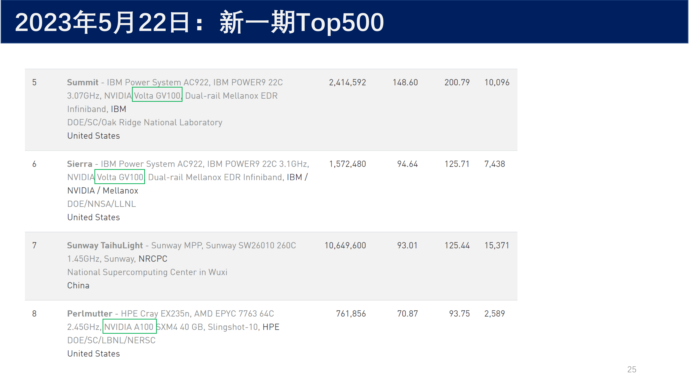{ width="800" }

| 排名 | 系统 | 核心数 | Rmax | Rpeak | 功耗 |
|:---:|:---|:---:|:---:|:---:|:---:|
| 5 | Summit - IBM Power System AC922, IBM POWER9 22C 3.07GHz, NVIDIA Volta GV100 | 2,414,592 | 148.60 | 200.79 | 10,096 |
| 6 | Sierra - IBM Power System AC922, IBM POWER9 22C 3.1GHz, NVIDIA Volta GV100 | 1,572,480 | 94.64 | 125.71 | 7,438 |
| 7 | Sunway TaihuLight - Sunway SW26010 260C 1.45GHz | 10,649,600 | 93.01 | 125.44 | 15,371 |
| 8 | Perlmutter - HPE Cray EX235n, AMD EPYC 7763 64C 2.45GHz, NVIDIA A100 SXM4 40 GB | 761,856 | 70.87 | 93.75 | 2,589 |

#### 2.5.3 Top500 榜单（2026 年 5 月）

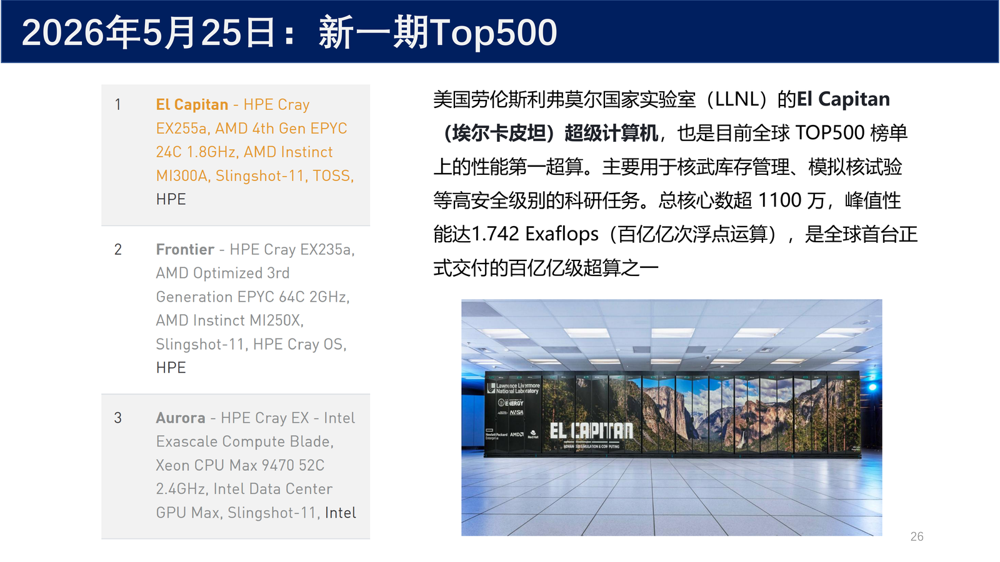{ width="800" }

2026 年 5 月 25 日的新一期 Top500 榜单：

| 排名 | 系统 | 配置 |
|:---:|:---|:---|
| 1 | El Capitan - HPE Cray EX255a, AMD 4th Gen EPYC 24C 1.8GHz, AMD Instinct MI300A, Slingshot-11, TOSS, HPE | 美国劳伦斯利弗莫尔国家实验室（LLNL），总核心数超 1100 万，峰值性能达 **1.742 EFlops** |
| 2 | Frontier - HPE Cray EX235a, AMD Optimized 3rd Generation EPYC 64C 2GHz, AMD Instinct MI250X, Slingshot-11, HPE Cray OS, HPE | — |
| 3 | Aurora - HPE Cray EX - Intel Exascale Compute Blade, Xeon CPU Max 9470 52C 2.0GHz, Intel Data Center GPU Max, Slingshot-11, Intel | — |

美国劳伦斯利弗莫尔国家实验室（LLNL）的 **El Capitan（埃尔卡皮坦）** 超级计算机，是目前全球 TOP500 榜单上的性能第一超算。主要用于核武库存管理、模拟核试验等高安全级别的科研任务。总核心数超 1100 万，峰值性能达 **1.742 EFlops（百亿亿次浮点运算）**，是全球首台正式交付的百亿亿级超算之一。

---

## 3 CUDA 编程模型

### 3.1 CUDA 并行编程平台

!!! abstract "定义 4（CUDA）"
    **CUDA（Compute Unified Device Architecture）** 是 NVIDIA 公司推出的一种 **并行计算平台和编程模型**。它允许开发人员使用 NVIDIA 的图形处理器（GPU）来实现 **通用计算功能**，从而大大提高了程序运行的速度。CUDA 非常适合处理大量并行任务，因为 GPU 内部通常有成千上万个独立的计算核心。

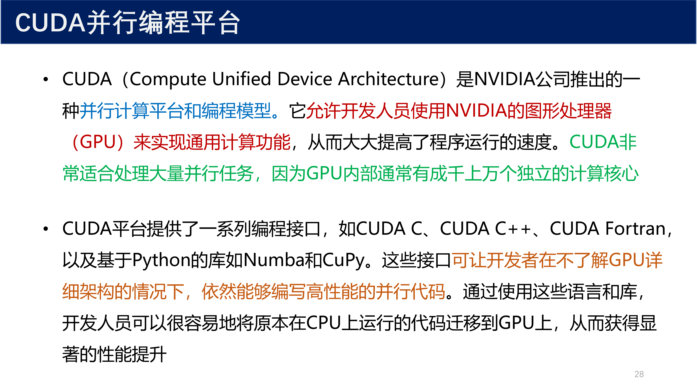{ width="800" }

CUDA 平台提供了一系列编程接口，如 **CUDA C、CUDA C++、CUDA Fortran**，以及基于 Python 的库如 **Numba** 和 **CuPy**。这些接口可让开发者在不了解 GPU 详细架构的情况下，依然能够编写高性能的并行代码。通过使用这些语言和库，开发人员可以很容易地将原本在 CPU 上运行的代码迁移到 GPU 上，从而获得显著的性能提升。

### 3.2 CUDA 并行编程模型的核心方面

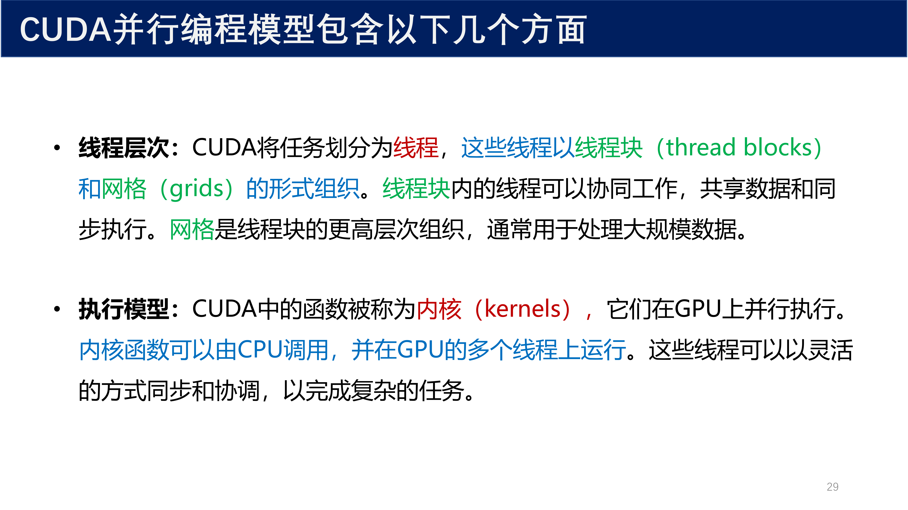{ width="800" }

#### 3.2.1 线程层次

CUDA 将任务划分为 **线程**，这些线程以 **线程块（thread blocks）** 和 **网格（grids）** 的形式组织。

- **线程块（thread block）**：线程块内的线程可以协同工作，共享数据和同步执行。
- **网格（grid）**：线程块的更高层次组织，通常用于处理大规模数据。

#### 3.2.2 执行模型

CUDA 中的函数被称为 **内核（kernels）**，它们在 GPU 上并行执行。内核函数可以由 CPU 调用，并在 GPU 的多个线程上运行。这些线程可以以灵活的方式同步和协调，以完成复杂的任务。

#### 3.2.3 内存模型

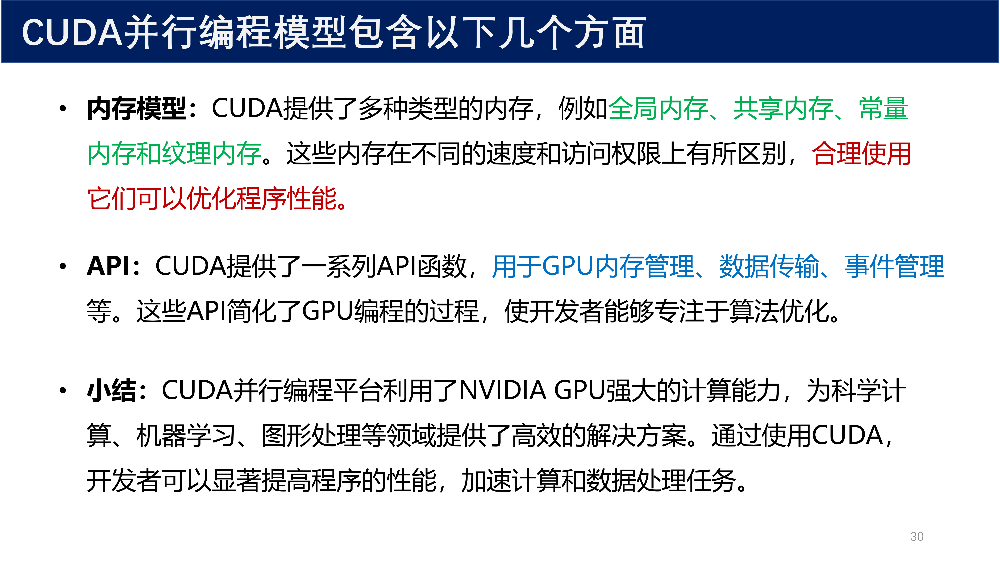{ width="800" }

CUDA 提供了多种类型的内存：

- **全局内存（Global Memory）**
- **共享内存（Shared Memory）**
- **常量内存（Constant Memory）**
- **纹理内存（Texture Memory）**

这些内存在不同的速度和访问权限上有所区别，合理使用它们可以优化程序性能。

#### 3.2.4 API

CUDA 提供了一系列 API 函数，用于 **GPU 内存管理、数据传输、事件管理** 等。这些 API 简化了 GPU 编程的过程，使开发者能够专注于算法优化。

!!! tip "CUDA 小结"
    CUDA 并行编程平台利用了 NVIDIA GPU 强大的计算能力，为科学计算、机器学习、图形处理等领域提供了高效的解决方案。通过使用 CUDA，开发者可以显著提高程序的性能，加速计算和数据处理任务。

### 3.3 OpenACC

!!! abstract "定义 5（OpenACC）"
    **OpenACC（Open Accelerators）** 是一种用于加速科学应用程序的编程范例，允许开发人员通过简单地在代码中添加编译指令（通常称为 **指令**）来加速计算密集型部分。这些指令可以让编译器自动在多核 CPU 和 GPU 等异构计算设备上并行执行代码，而无需显式管理数据移动和设备内核等底层细节。

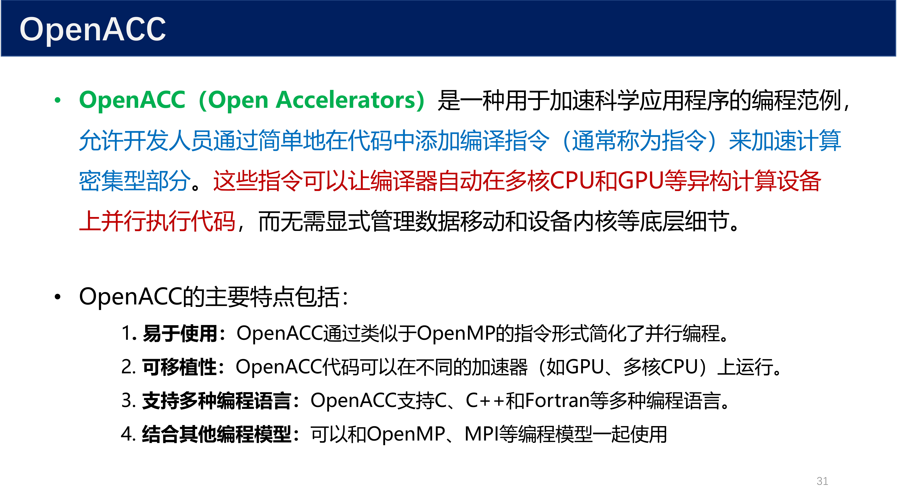{ width="800" }

OpenACC 的主要特点包括：

1. **易于使用**：OpenACC 通过类似于 OpenMP 的指令形式简化了并行编程。
2. **可移植性**：OpenACC 代码可以在不同的加速器（如 GPU、多核 CPU）上运行。
3. **支持多种编程语言**：OpenACC 支持 C、C++ 和 Fortran 等多种编程语言。
4. **结合其他编程模型**：可以和 OpenMP、MPI 等编程模型一起使用。

---

## 4 总结

本笔记从三个维度系统介绍了 GPU：

| 维度 | 核心内容 |
|:---|:---|
| **为什么使用 GPU** | GPU 在 AI 大模型时代的重要性、GPU 的起源（1999 年 GeForce 256）、从图形处理到通用计算（GPGPU）的演进、关键里程碑（Quake、Chellapilla、Andrew Ng、AlexNet） |
| **GPU 架构** | GPU vs CPU 架构差异、英伟达 GPU 架构演化史（Tesla → Hopper）、费米架构 SM 详解、V100 性能指标、GPU 在超算中的应用 |
| **CUDA 编程模型** | CUDA 平台介绍、线程层次（线程/线程块/网格）、执行模型（内核函数）、内存模型（全局/共享/常量/纹理内存）、OpenACC 简介 |

GPU 的发展史是一部从专用图形处理器到通用并行计算引擎的蜕变史。随着 AI 和大数据时代的到来，GPU 已经成为现代计算基础设施中不可或缺的核心组件。
