## 1 核函数（Kernel）

### 1.1 异构并行与核函数

!!! abstract "定义 1（异构并行 / Heterogeneous Parallelism）"
    异构并行是一种并行计算技术，指在计算系统中使用不同类型处理器或加速器（例如 CPU、GPU、FPGA 等）同时执行计算任务。这种并行方式允许不同处理器根据其特点和优势处理相应任务，从而提高整个系统性能和计算能力。

在 CPU-GPU 异构并行架构中，CPU 被称为 **主机（Host）**，GPU 被称为 **设备（Device）**。主机负责调度控制，设备负责密集计算。两者之间通过 PCIe 总线连接，数据通过 Bridge 进行传输。

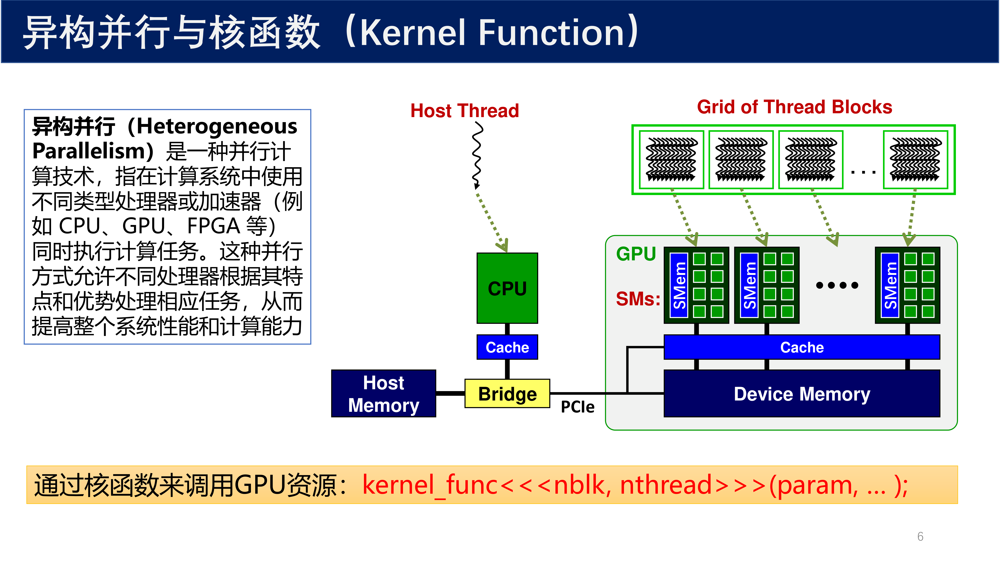{ width="800" }

CPU-GPU 异构并行的典型流程包含三个步骤：

1. **把数据从 CPU 内存拷贝到 GPU 显存** —— 涉及主机（Host）和设备（Device）之间的数据传输方式
2. **调用核函数对存储在 GPU 显存中的数据进行操作** —— 涉及核函数定义、内存的种类和分配内存方式等
3. **将数据从 GPU 显存传送回到 CPU 内存** —— 涉及销毁分配的内存、同步等

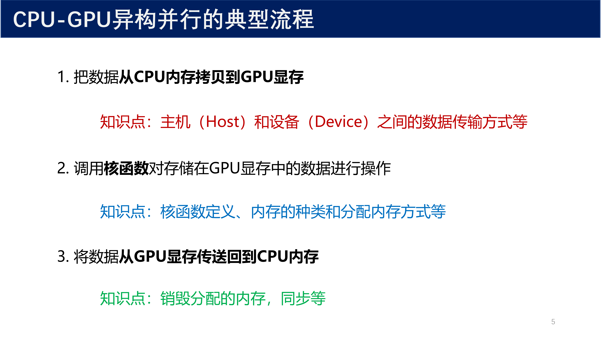{ width="800" }

!!! abstract "定义 2（CUDA 核函数 / Kernel Function）"
    CUDA 的核函数是在 GPU 上运行的特殊类型函数，用于实现并行计算。核函数由 CPU（主机）调用，但在 GPU（设备）上执行。由于 GPU 具有大量的并行处理单元，核函数可以同时处理多个数据元素，从而大幅提高计算性能。

通过核函数来调用 GPU 资源的语法为：

```cuda
kernel_func<<<num_blk, num_thd>>>(param, ...);
```

其中 `num_blk` 表示线程块数量，`num_thd` 表示每个线程块中的线程数量。

### 1.2 Hello World 示例

下面是一个最简单的 CUDA 程序示例，演示如何定义和调用核函数：

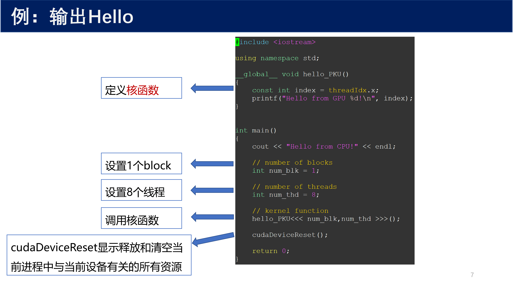{ width="800" }

```cuda
#include <iostream>

using namespace std;

__global__ void hello_PKU()
{
    const int index = threadIdx.x;
    printf("Hello from GPU %d!\n", index);
}

int main()
{
    cout << "Hello from CPU!" << endl;

    // number of blocks
    int num_blk = 1;
    // number of threads
    int num_thd = 8;

    // kernel function
    hello_PKU<<< num_blk, num_thd >>>();

    cudaDeviceReset();

    return 0;
}
```

代码说明：

- `__global__` 是 CUDA 的关键字，用于标识核函数。核函数由 Host（CPU）端发起调用，由 Device（GPU）端负责执行
- `threadIdx.x` 是 CUDA 的内建变量，表示当前 CUDA 线程的 ID
- `hello_PKU<<< num_blk, num_thd >>>()` 是核函数的调用方式，`num_blk` 为线程块数量，`num_thd` 为线程数量
- `cudaDeviceReset()` 显式释放和清空当前进程中与当前设备有关的所有资源

!!! warning "注意"
    核函数将被每一个发起的 CUDA 线程执行！也就是说，如果有 8 个线程，那么 `hello_PKU` 函数会被执行 8 次，每次由不同的线程执行。

编译和运行结果：

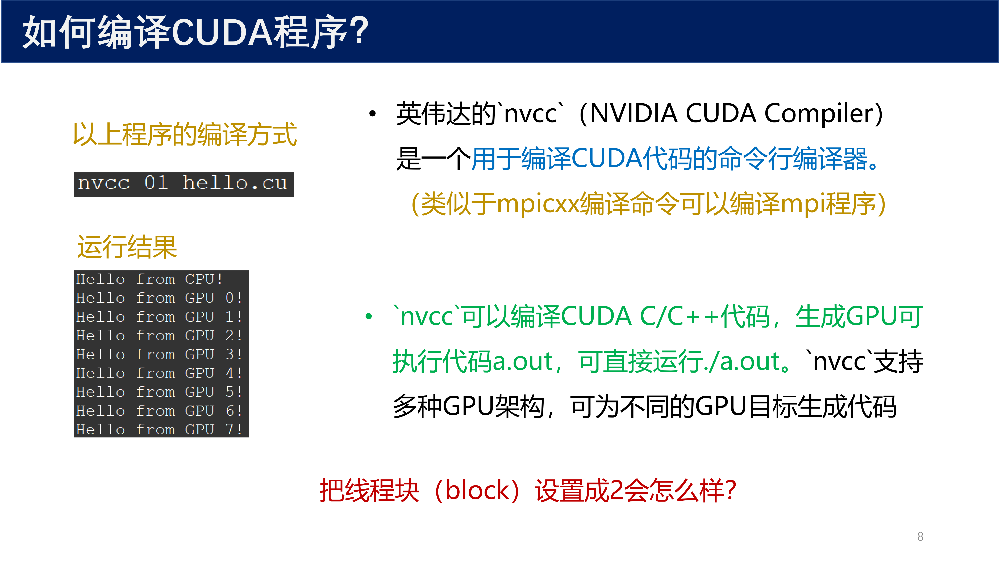{ width="800" }

使用 `nvcc`（NVIDIA CUDA Compiler）编译 CUDA 程序：

```bash
nvcc 01_hello.cu
```

`nvcc` 可以编译 CUDA C/C++ 代码，生成 GPU 可执行代码 `a.out`，可直接运行 `./a.out`。`nvcc` 支持多种 GPU 架构，可为不同的 GPU 目标生成代码。

!!! tip "提示"
    `nvcc` 类似于 `mpicxx` 编译命令可以编译 MPI 程序。更多 `nvcc` 命令选项可以参考 NVIDIA 官方文档：https://docs.nvidia.com/cuda/cuda-compiler-driver-nvcc/index.html

### 1.3 核函数的调用语法

核函数的调用语法如下：

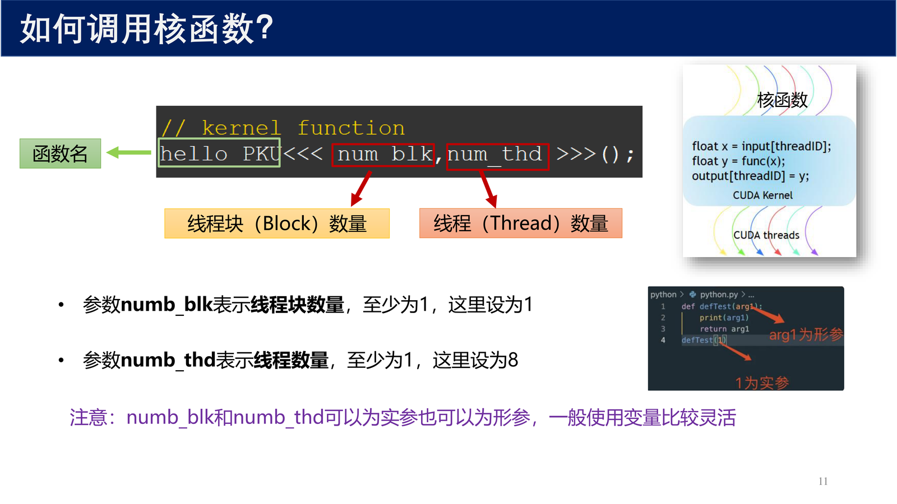{ width="800" }

```cuda
hello_PKU<<< num_blk, num_thd >>>();
```

- `num_blk`（`numb_blk`）：表示线程块（Block）数量，至少为 1
- `num_thd`（`numb_thd`）：表示线程（Thread）数量，至少为 1

!!! warning "注意"
    `num_blk` 和 `num_thd` 可以为实参也可以为形参，一般使用变量比较灵活。

如果把线程块（block）设置成 2，线程数保持 8，那么总共会发起 $2 \times 8 = 16$ 个线程，每个线程都会执行一次核函数。

## 2 线程和线程块

### 2.1 线程块（Block）和线程（Thread）

在主机（CPU）上启动 Kernel 函数，调用设备端上的硬件，需要用户指定线程块的个数（block）和每个线程块的线程个数（thread）。

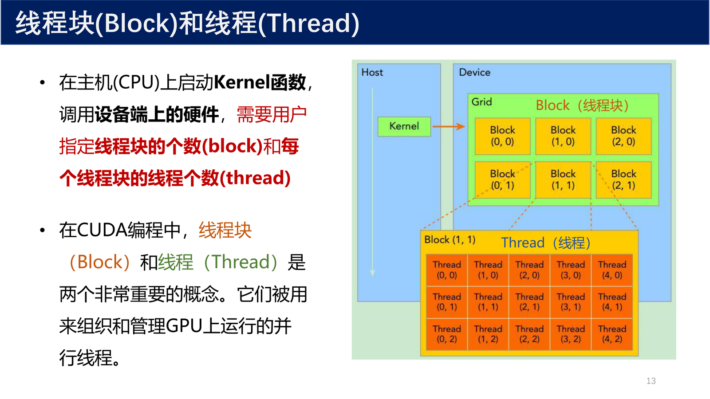{ width="800" }

在 CUDA 编程中，线程块（Block）和线程（Thread）是两个非常重要的概念。它们被用来组织和管理 GPU 上运行的并行线程。

!!! abstract "定义 3（线程块 / Block）"
    线程块用来组织和调度线程。一个线程块内的线程可以共享同一个共享内存空间，从而实现线程间的通信和数据交换。每个线程块由一定数量的线程组成。

线程块的数量决定了并行任务在 GPU 上的分布，也影响着 GPU 的资源利用率。线程块的数量可以手动设置，根据计算任务的规模和硬件特性进行调整。

!!! abstract "定义 4（线程 / Thread）"
    每个线程块的线程数量表示一个线程块内的线程总数，每个线程负责执行一个独立的计算任务。每个线程块的线程数量有上限，具体取决于 GPU 架构（例如费米架构每个 SM 可以起 1536 个线程，即 $48 \times 32$）。

### 2.2 软件与硬件视角的 GPU 并行任务

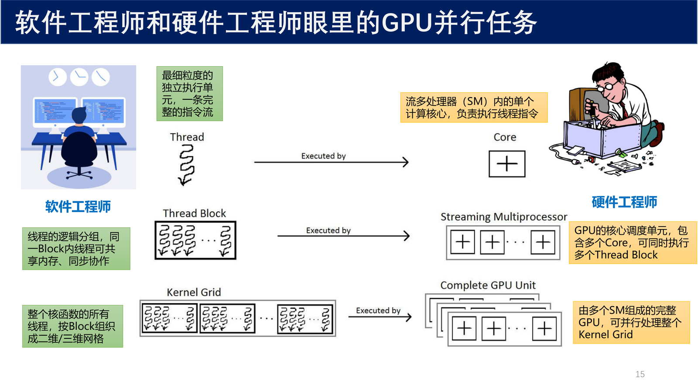{ width="800" }

从软件工程师和硬件工程师的不同视角来看 GPU 并行任务：

| 软件视角 | 硬件视角 | 说明 |
|---------|---------|------|
| Thread（线程） | Core（计算核心） | 最细粒度的独立执行单元，一条完整的指令流。流多处理器（SM）内的单个计算核心，负责执行线程指令 |
| Thread Block（线程块） | Streaming Multiprocessor（SM） | 线程的逻辑分组，同一 Block 内线程可共享内存、同步协作。GPU 的核心调度单元，包含多个 Core，可同时执行多个 Thread Block |
| Kernel Grid（核函数网格） | Complete GPU Unit | 整个核函数的所有线程块（Block）组织成一个二维网格。由多个 SM 组成的完整 GPU，可并行处理整个 Kernel Grid |

### 2.3 核函数的内存分配和参数传递

#### 2.3.1 参数类型与传值方式

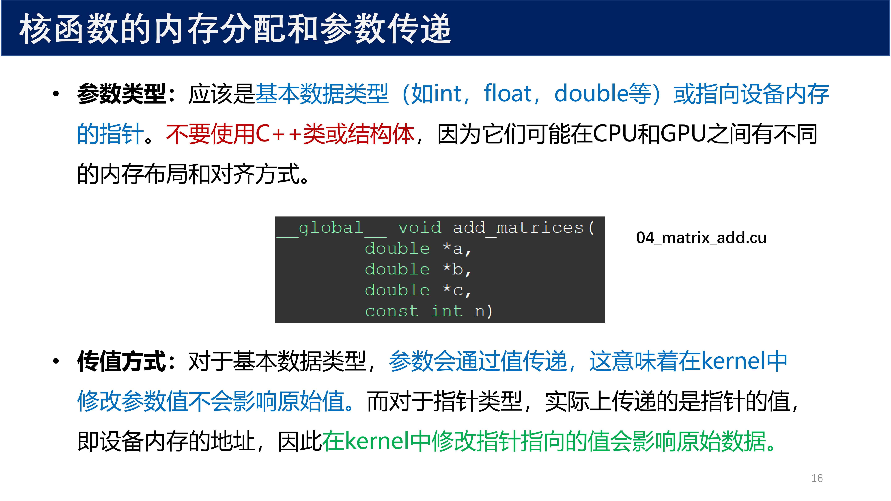{ width="800" }

- **参数类型**：应该是基本数据类型（如 `int`、`float`、`double` 等）或指向设备内存的指针。不要使用 C++ 类或结构体，因为它们可能在 CPU 和 GPU 之间有不同的内存布局和对齐方式
- **传值方式**：对于基本数据类型，参数会通过值传递，这意味着在 kernel 中修改参数值不会影响原始值。而对于指针类型，实际上传递的是指针的值，即设备内存的地址，因此在 kernel 中修改指针指向的值会影响原始数据

#### 2.3.2 设备内存分配

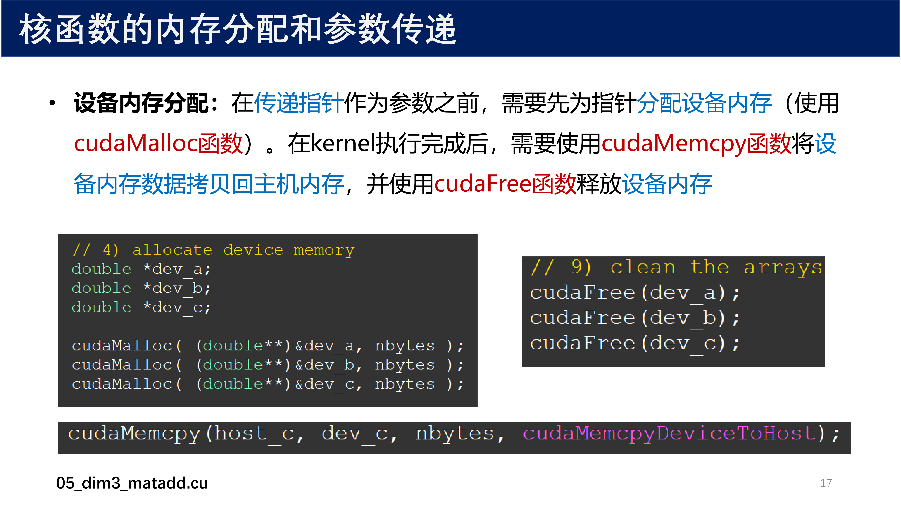{ width="800" }

在传递指针作为参数之前，需要先为指针分配设备内存（使用 `cudaMalloc` 函数）。在 kernel 执行完成后，需要使用 `cudaMemcpy` 函数将设备内存数据拷贝回主机内存，并使用 `cudaFree` 函数释放设备内存。

```cuda
// 4) allocate device memory
double *dev_a;
double *dev_b;
double *dev_c;

cudaMalloc((double**)&dev_a, nbytes);
cudaMalloc((double**)&dev_b, nbytes);
cudaMalloc((double**)&dev_c, nbytes);

// 9) clean the arrays
cudaFree(dev_a);
cudaFree(dev_b);
cudaFree(dev_c);
```

#### 2.3.3 cudaMalloc 函数

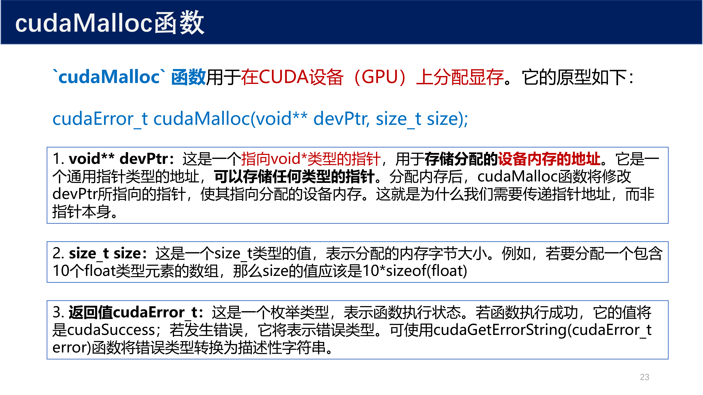{ width="800" }

`cudaMalloc` 函数用于在 CUDA 设备（GPU）上分配显存。它的原型如下：

```cuda
cudaError_t cudaMalloc(void** devPtr, size_t size);
```

参数说明：

1. `void** devPtr`：这是一个指向 `void*` 类型的指针，用于存储分配的设备内存的地址。它是一个通用指针类型的地址，可以存储任何类型的指针。分配内存后，`cudaMalloc` 函数将修改 `devPtr` 所指向的指针，使其指向分配的设备内存。这就是为什么我们需要传递指针地址，而非指针本身
2. `size_t size`：这是一个 `size_t` 类型的值，表示分配的内存字节大小。例如，若要分配一个包含 10 个 `float` 类型元素的数组，那么 `size` 的值应该是 `10 * sizeof(float)`
3. 返回值 `cudaError_t`：这是一个枚举类型，表示函数执行状态。若函数执行成功，它的值将是 `cudaSuccess`；若发生错误，它将表示错误类型。可使用 `cudaGetErrorString(cudaError_t error)` 函数将错误类型转换为描述性字符串

### 2.4 矩阵加法完整示例

下面是一个完整的矩阵加法 CUDA 程序示例（`04_matrix_add.cu`）：

**程序 1/5 —— 从 CPU 读入矩阵的函数：**

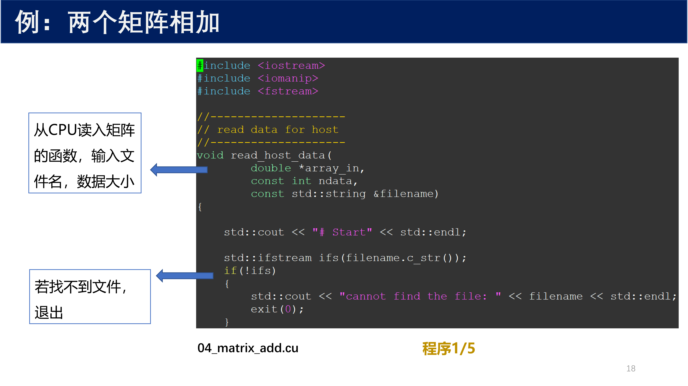{ width="800" }

```cuda
#include <iostream>
#include <iomanip>
#include <fstream>

//-------------------
// read data for host
//-------------------
void read_host_data(
    double *array_in,
    const int ndata,
    const std::string &filename)
{
    std::cout << "# Start" << std::endl;

    std::ifstream ifs(filename.c_str());
    if(!ifs)
    {
        std::cout << "cannot find the file: " << filename << std::endl;
        exit(0);
    }

    for(int i=0; i<ndata; ++i)
    {
        ifs >> array_in[i];
        //std::cout << "read " << i+1 << " data: " << array_in[i] << std::endl;
        std::cout << std::setw(10) << array_in[i];
        if((i+1)%3==0) std::cout << std::endl;
    }

    ifs.close();
    std::cout << "# End" << std::endl;

    return;
}
```

**程序 3/5 —— CUDA 核函数：**

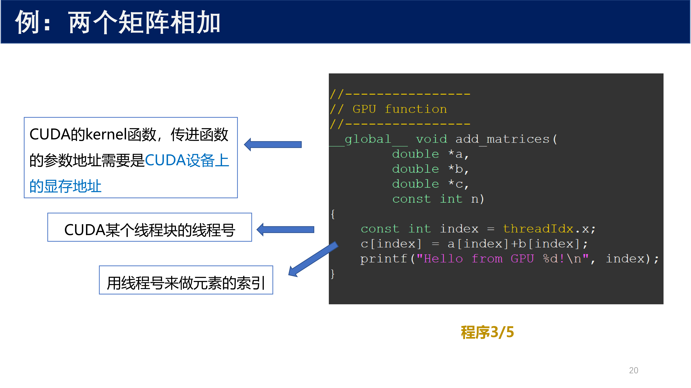{ width="800" }

```cuda
//----------------
// GPU function
//----------------
__global__ void add_matrices(
    double *a,
    double *b,
    double *c,
    const int n)
{
    const int index = threadIdx.x;
    c[index] = a[index] + b[index];
    printf("Hello from GPU %d!\n", index);
}
```

注意：CUDA 的 kernel 函数传进函数的参数地址需要是 CUDA 设备上的显存地址。这里用 `threadIdx.x` 作为线程号来做元素的索引。

**程序 4/5 —— 主函数（内存分配与数据传输）：**

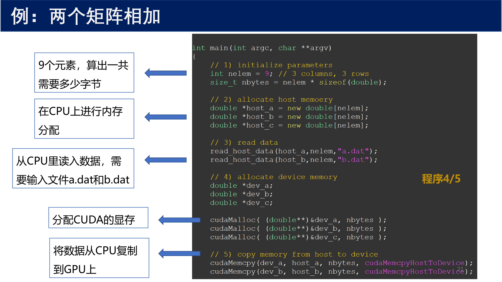{ width="800" }

```cuda
int main(int argc, char **argv)
{
    // 1) initialize parameters
    int nelem = 9; // 3 columns, 3 rows
    size_t nbytes = nelem * sizeof(double);

    // 2) allocate host memory
    double *host_a = new double[nelem];
    double *host_b = new double[nelem];
    double *host_c = new double[nelem];

    // 3) read data
    read_host_data(host_a, nelem, "a.dat");
    read_host_data(host_b, nelem, "b.dat");

    // 4) allocate device memory
    double *dev_a;
    double *dev_b;
    double *dev_c;
    cudaMalloc((double**)&dev_a, nbytes);
    cudaMalloc((double**)&dev_b, nbytes);
    cudaMalloc((double**)&dev_c, nbytes);

    // 5) copy memory from host to device
    cudaMemcpy(dev_a, host_a, nbytes, cudaMemcpyHostToDevice);
    cudaMemcpy(dev_b, host_b, nbytes, cudaMemcpyHostToDevice);
```

**程序 5/5 —— 主函数（调用核函数与清理）：**

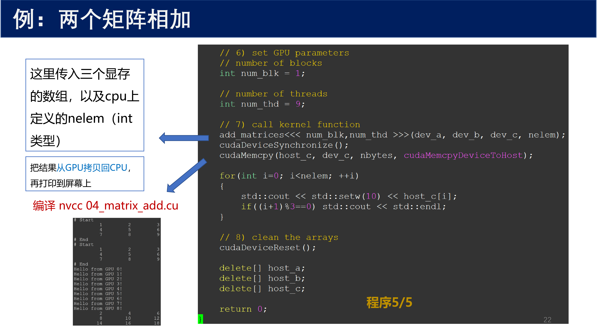{ width="800" }

```cuda
    // 6) set GPU parameters
    // number of blocks
    int num_blk = 1;
    // number of threads
    int num_thd = 9;

    // 7) call kernel function
    add_matrices<<< num_blk, num_thd >>>(dev_a, dev_b, dev_c, nelem);
    cudaDeviceSynchronize();
    cudaMemcpy(host_c, dev_c, nbytes, cudaMemcpyDeviceToHost);

    for(int i=0; i<nelem; ++i)
    {
        std::cout << std::setw(10) << host_c[i];
        if((i+1)%3==0) std::cout << std::endl;
    }

    // 9) clean the arrays
    cudaDeviceReset();

    delete[] host_a;
    delete[] host_b;
    delete[] host_c;

    return 0;
}
```

完整流程总结：

1. 初始化参数（9 个元素，算出需要多少字节）
2. 在 CPU 上进行内存分配（`new`）
3. 从 CPU 里读入数据（需要输入文件 `a.dat` 和 `b.dat`）
4. 分配 CUDA 的显存（`cudaMalloc`）
5. 将数据从 CPU 复制到 GPU 上（`cudaMemcpyHostToDevice`）
6. 设置 GPU 参数（线程块数、线程数）
7. 调用核函数，进行矩阵加法，之后同步，最后把结果从 GPU 拷贝回 CPU（`cudaMemcpyDeviceToHost`）
8. 把结果打印到屏幕上
9. 清理资源（`cudaDeviceReset`、`delete[]`）

### 2.5 GPU 上的全局线程 ID

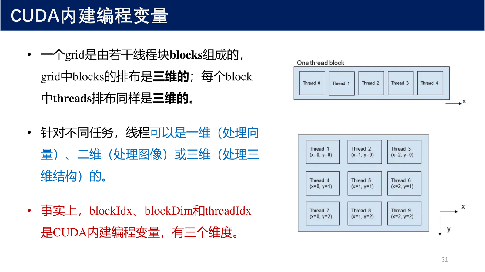{ width="800" }

当使用多个线程块时，需要计算线程的全局 ID：

$$
\text{线程的全局 ID} = \text{线程块 ID} \times \text{线程块的线程数量} + \text{线程块里的线程 ID}
$$

用 CUDA 内建变量表示为：

```cuda
const unsigned int thread_idx = (blockIdx.x * blockDim.x) + threadIdx.x;
```

示例代码（`02_param.cu`）：

```cuda
#include <iostream>

__global__ void hello_PKU()
{
    const unsigned int thread_idx =
        (blockIdx.x * blockDim.x) + threadIdx.x;

    printf("Block ID %d Thread ID %d\n"
           "global_thread_idx %d\n",
           blockIdx.x, threadIdx.x, thread_idx);
}

int main()
{
    // number of blocks
    int num_blk = 2;
    // number of threads
    int num_thd = 4;

    hello_PKU<<< num_blk, num_thd >>>();

    cudaDeviceSynchronize();

    return 0;
}
```

输出结果（2 个 block，每个 block 4 个 thread）：

```
Block ID 1 Thread ID 0   global_thread_idx 4
Block ID 1 Thread ID 1   global_thread_idx 5
Block ID 1 Thread ID 2   global_thread_idx 6
Block ID 1 Thread ID 3   global_thread_idx 7
Block ID 0 Thread ID 0   global_thread_idx 0
Block ID 0 Thread ID 1   global_thread_idx 1
Block ID 0 Thread ID 2   global_thread_idx 2
Block ID 0 Thread ID 3   global_thread_idx 3
```

!!! tip "思考"
    CUDA 线程的三个属性（线程块、线程、线程全局 ID）相互之间的关系是什么？

### 2.6 CUDA 内建编程变量

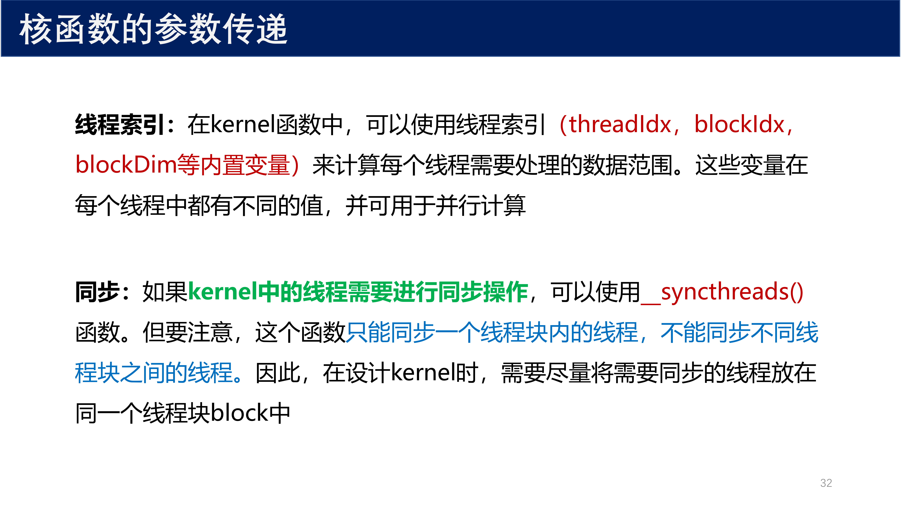{ width="800" }

一个 grid 是由若干线程块 blocks 组成的，grid 中 blocks 的排布是**三维的**；每个 block 中 threads 排布同样是**三维的**。

针对不同任务，线程可以是一维（处理向量）、二维（处理图像）或三维（处理三维结构）。

!!! info "信息"
    `blockIdx`、`blockDim` 和 `threadIdx` 是 CUDA 内建编程变量，有三个维度（`x`、`y`、`z`）。

### 2.7 核函数的参数传递与同步

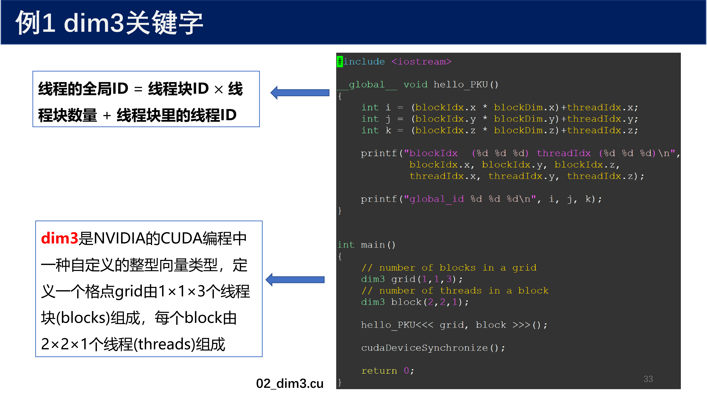{ width="800" }

**线程索引**：在 kernel 函数中，可以使用线程索引（`threadIdx`、`blockIdx`、`blockDim` 等内置变量）来计算每个线程需要处理的数据范围。这些变量在每个线程中都有不同的值，并可用于并行计算。

**同步**：如果 kernel 中的线程需要进行同步操作，可以使用 `__syncthreads()` 函数。但要注意，这个函数**只能同步一个线程块内的线程**，不能同步不同线程块之间的线程。因此，在设计 kernel 时，需要尽量将需要同步的线程放在同一个线程块 block 中。

### 2.8 dim3 关键字

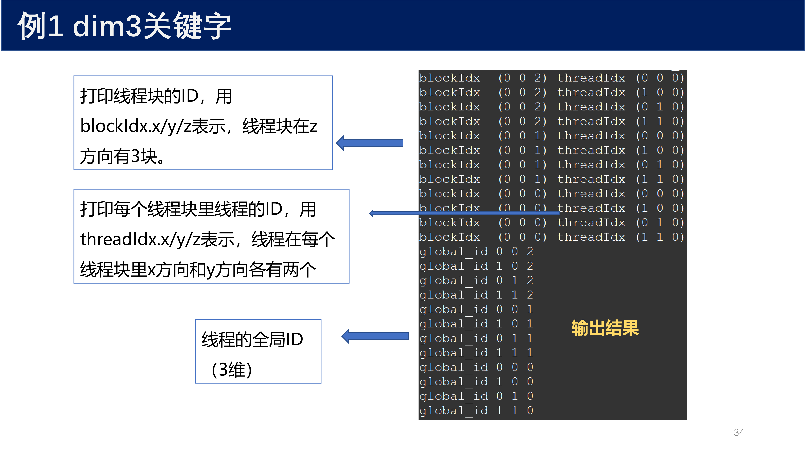{ width="800" }

`dim3` 是 NVIDIA 的 CUDA 编程中一种自定义的整型向量类型，定义一个格点 grid 由 $1 \times 1 \times 3$ 个线程块（blocks）组成，每个块由 $2 \times 2 \times 1$ 个线程（threads）组成。

示例代码（`02_dim3.cu`）：

```cuda
#include <iostream>

__global__ void hello_PKU()
{
    int i = (blockIdx.x * blockDim.x) + threadIdx.x;
    int j = (blockIdx.y * blockDim.y) + threadIdx.y;
    int k = (blockIdx.z * blockDim.z) + threadIdx.z;

    printf("blockIdx: %d %d %d threadIdx: %d %d %d\n",
           blockIdx.x, blockIdx.y, blockIdx.z,
           threadIdx.x, threadIdx.y, threadIdx.z);

    printf("global_id %d %d %d\n", i, j, k);
}

int main()
{
    // number of blocks in a grid
    dim3 grid(1, 1, 3);
    // number of threads in a block
    dim3 block(2, 2, 1);

    hello_PKU<<< grid, block >>>();

    cudaDeviceSynchronize();

    return 0;
}
```

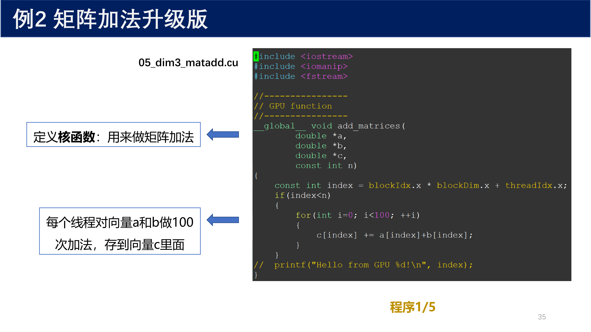{ width="800" }

输出结果说明：

- 打印线程块的 ID，用 `blockIdx.x/y/z` 表示，线程块在 z 方向有 3 块
- 打印每个线程块里线程的 ID，用 `threadIdx.x/y/z` 表示，线程在每个线程块里 x 方向和 y 方向各有两个
- 线程的全局 ID（3 维）

### 2.9 矩阵加法升级版（dim3 应用）

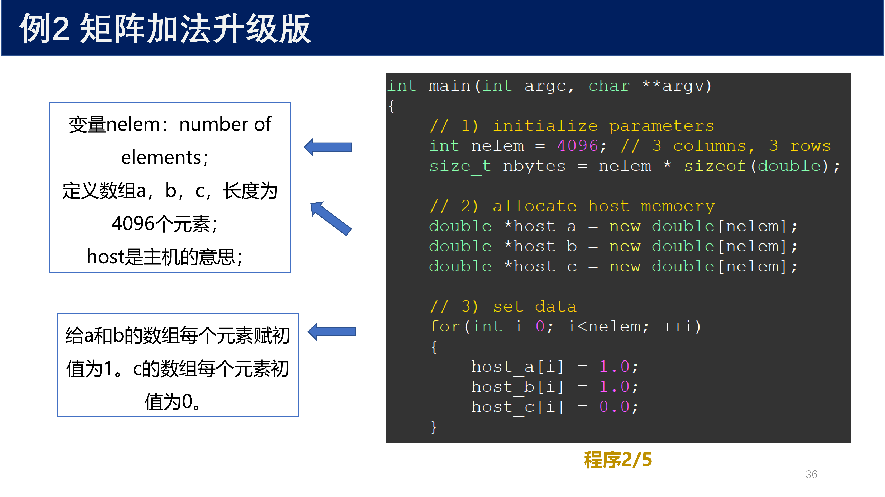{ width="800" }

使用 `dim3` 升级矩阵加法程序（`05_dim3_matadd.cu`）：

**核函数：**

```cuda
__global__ void add_matrices(
    double *a,
    double *b,
    double *c,
    const int n)
{
    const int index = blockIdx.x * blockDim.x + threadIdx.x;
    if(index < n)
    {
        for(int i = 0; i < 100; ++i)
        {
            c[index] += a[index] + b[index];
        }
    }
    // printf("hello from GPU %d!\n", index);
}
```

每个线程对向量 a 和 b 做 100 次加法，存到向量 c 里面。

**主函数（初始化与内存分配）：**

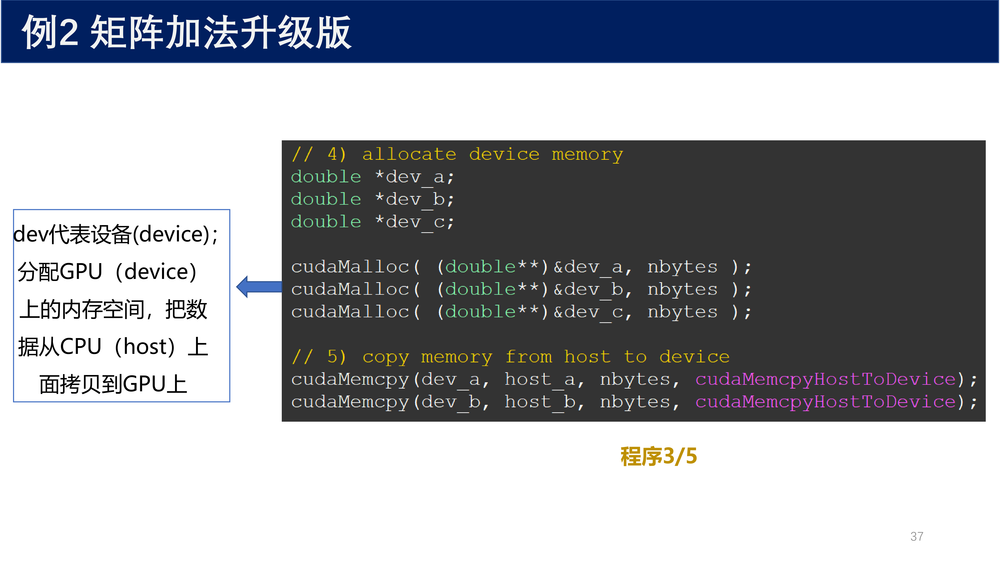{ width="800" }

```cuda
int main(int argc, char **argv)
{
    // 1) initialize parameters
    int nelem = 4096; // 3 columns, 3 rows
    size_t nbytes = nelem * sizeof(double);

    // 2) allocate host memory
    double *host_a = new double[nelem];
    double *host_b = new double[nelem];
    double *host_c = new double[nelem];

    // 3) set data
    for(int i = 0; i < nelem; ++i)
    {
        host_a[i] = 1.0;
        host_b[i] = 1.0;
        host_c[i] = 0.0;
    }
```

**主函数（设备内存分配与数据传输）：**

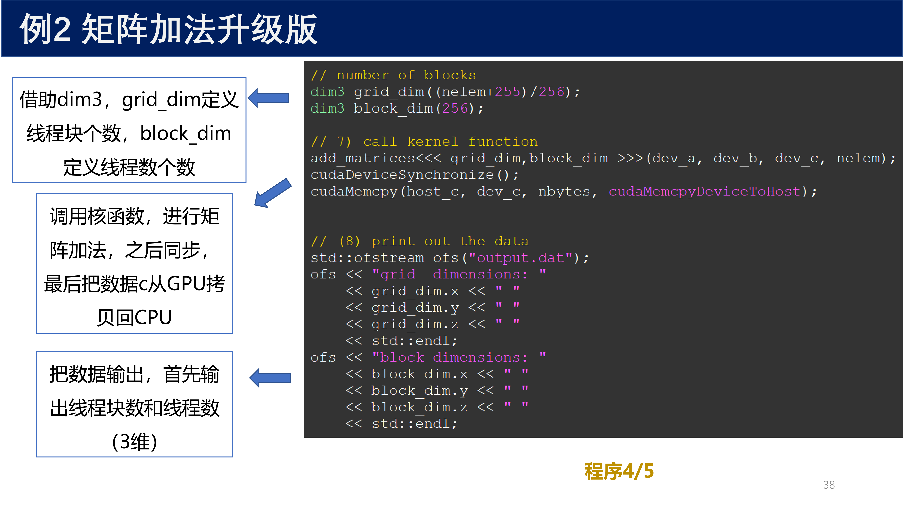{ width="800" }

```cuda
    // 4) allocate device memory
    double *dev_a;
    double *dev_b;
    double *dev_c;

    cudaMalloc((double**)&dev_a, nbytes);
    cudaMalloc((double**)&dev_b, nbytes);
    cudaMalloc((double**)&dev_c, nbytes);

    // 5) copy memory from host to device
    cudaMemcpy(dev_a, host_a, nbytes, cudaMemcpyHostToDevice);
    cudaMemcpy(dev_b, host_b, nbytes, cudaMemcpyHostToDevice);
```

**主函数（调用核函数与输出）：**

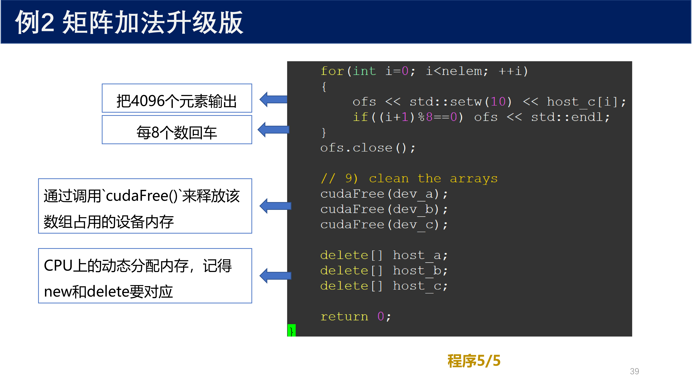{ width="800" }

```cuda
    // number of blocks
    dim3 grid_dim((nelem + 255) / 256);
    dim3 block_dim(256);

    // 7) call kernel function
    add_matrices<<< grid_dim, block_dim >>>(dev_a, dev_b, dev_c, nelem);
    cudaDeviceSynchronize();
    cudaMemcpy(host_c, dev_c, nbytes, cudaMemcpyDeviceToHost);

    // 8) print out the data
    std::ofstream ofs("output.dat");
    ofs << "grid_dimensions: "
        << grid_dim.x << " "
        << grid_dim.y << " "
        << grid_dim.z << std::endl;
    ofs << "block_dimensions: "
        << block_dim.x << " "
        << block_dim.y << " "
        << block_dim.z << std::endl;
```

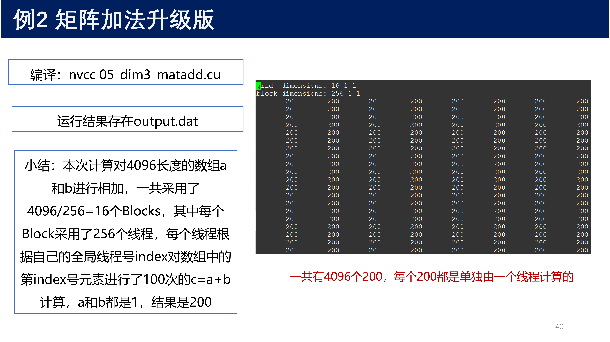{ width="800" }

```cuda
    for(int i = 0; i < nelem; ++i)
    {
        ofs << std::setw(10) << host_c[i];
        if((i + 1) % 8 == 0) ofs << std::endl;
    }
    ofs.close();

    // 9) clean the arrays
    cudaFree(dev_a);
    cudaFree(dev_b);
    cudaFree(dev_c);

    delete[] host_a;
    delete[] host_b;
    delete[] host_c;

    return 0;
}
```

编译运行：

```bash
nvcc 05_dim3_matadd.cu
```

运行结果存在 `output.dat` 中。

!!! info "信息"
    本次计算对 4096 长度的数组 a 和 b 进行相加，一共采用了 $4096 / 256 = 16$ 个 Blocks，其中每个 Block 采用了 256 个线程。每个线程根据自己的全局线程号 index 对数组中的第 index 号元素进行了 100 次的 $c = a + b$ 计算。a 和 b 都是 1，结果是 200。一共有 4096 个 200，每个 200 都是单独由一个线程计算的。

## 3 比较 CPU 和 GPU 的线程

### 3.1 CPU 和 GPU 的硬件架构对比

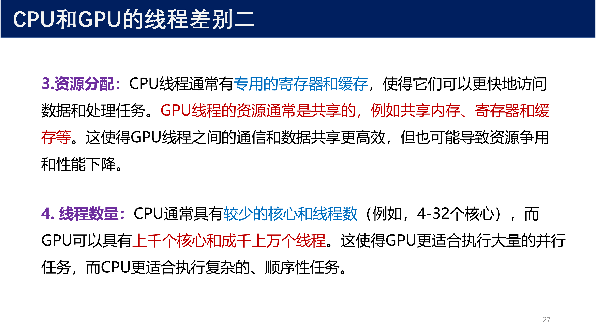{ width="800" }

回顾 CPU 和 GPU 的硬件架构对比：

- **CPU**：具有少量核心（Core），每个核心配有独立的控制单元（Control）和 L1 Cache，多个核心共享 L2 Cache 和 L3 Cache，最后连接 DRAM
- **GPU**：具有大量核心，排列成网格状，共享 L2 Cache 和 DRAM

### 3.2 CPU 和 GPU 的线程差别

#### 3.2.1 设计目的与执行模型

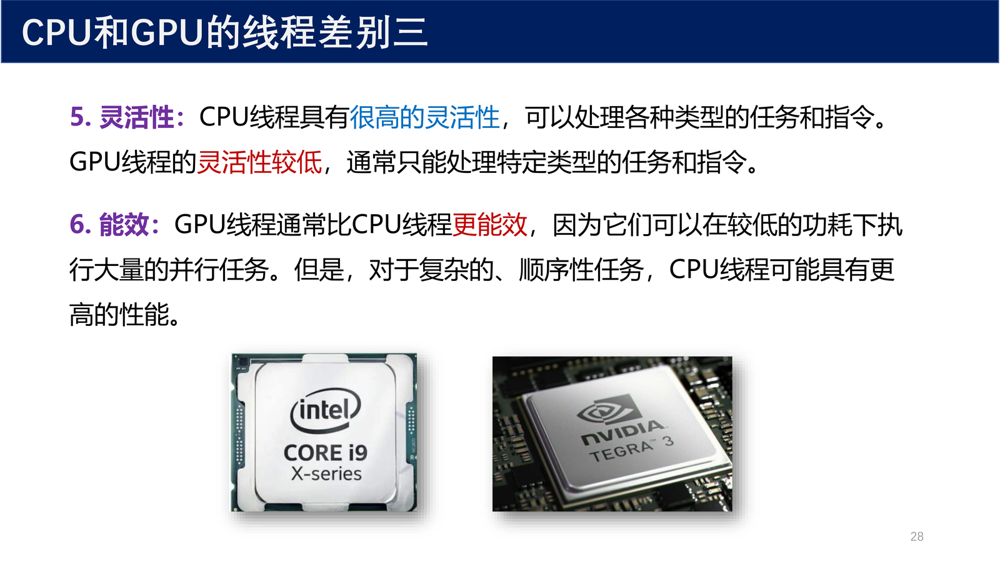{ width="800" }

**1. 设计目的**：

- CPU 是为了处理各种类型的通用计算任务而设计的
- GPU 则主要针对图形处理和并行计算
- 因此，**CPU 线程**通常用于处理**更复杂的、顺序性**的任务
- **GPU 线程**用于处理**更简单的、高度并行**的任务

**2. 执行模型**：

- CPU 线程通常是独立的，并且可以单独执行任务。它们之间的通信和同步需要复杂的机制，如**互斥同步**
- GPU 线程则通常以**线程束（warp）**为单位执行，一个线程束中的线程执行相同的指令
- GPU 线程束之间的通信和同步相对简单，通常使用**共享内存**和**屏障**等方法

#### 3.2.2 资源分配与线程数量

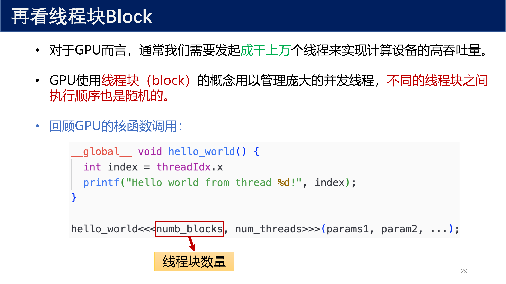{ width="800" }

**3. 资源分配**：

- CPU 线程通常有**专用的寄存器和缓存**，使得它们可以更快地访问数据和处理任务
- GPU 线程的资源通常是**共享的**，例如共享内存、寄存器和缓存等。这使得 GPU 线程之间的通信和数据共享更高效，但也可能导致资源争用和性能下降

**4. 线程数量**：

- CPU 通常具有**较少的核心和线程数**（例如，4-32 个核心）
- GPU 可以具有**上千个核心和成千上万个线程**
- 这使得 GPU 更适合执行大量的并行任务，而 CPU 更适合执行复杂的、顺序性任务

#### 3.2.3 灵活性与能效

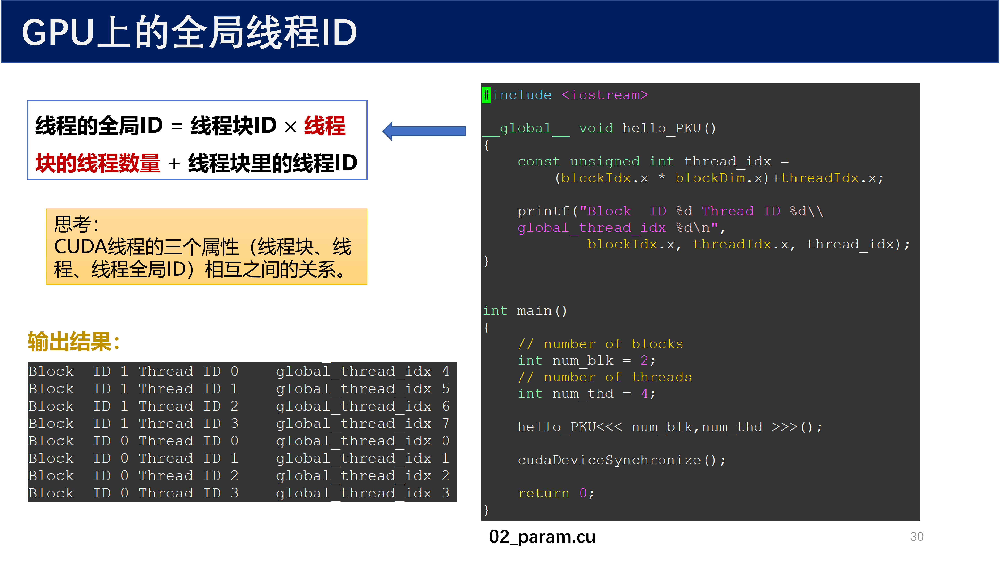{ width="800" }

**5. 灵活性**：

- CPU 线程具有**很高的灵活性**，可以处理各种类型的任务和指令
- GPU 线程的**灵活性较低**，通常只能处理特定类型的任务和指令

**6. 能效**：

- GPU 线程通常比 CPU 线程**更能效**，因为它们可以在较低的功耗下执行大量的并行任务
- 但是，对于复杂的、顺序性任务，CPU 线程可能具有更高的性能

### 3.3 CPU 和 GPU 线程差别总结

| 对比维度 | CPU 线程 | GPU 线程 |
|---------|---------|---------|
| 设计目的 | 通用计算，复杂顺序任务 | 图形处理，高度并行任务 |
| 执行模型 | 独立执行，互斥同步 | 以 warp 为单位，共享内存和屏障同步 |
| 资源分配 | 专用寄存器和缓存 | 共享内存、寄存器和缓存 |
| 线程数量 | 较少（4-32 核心） | 极多（上千核心，成千上万线程） |
| 灵活性 | 很高 | 较低 |
| 能效 | 顺序任务性能高 | 并行任务能效高 |

## 4 小结

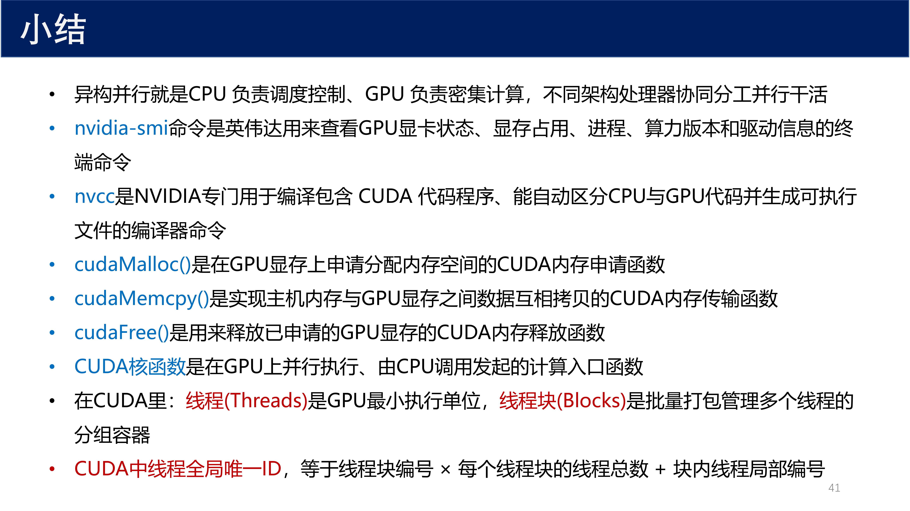{ width="800" }

本章核心知识点总结：

- **异构并行**就是 CPU 负责调度控制、GPU 负责密集计算，不同架构处理器协同分工并行干活
- `nvidia-smi` 命令是英伟达用来查看 GPU 显卡状态、显存占用、进程、算力版本和驱动信息的终端命令
- `nvcc` 是 NVIDIA 专门用于编译包含 CUDA 代码程序、能自动区分 CPU 与 GPU 代码并生成可执行文件的编译器命令
- `cudaMalloc()` 是在 GPU 显存上申请分配内存空间的 CUDA 内存申请函数
- `cudaMemcpy()` 是实现主机内存与 GPU 显存之间数据互相拷贝的 CUDA 内存传输函数
- `cudaFree()` 是用来释放已申请的 GPU 显存的 CUDA 内存释放函数
- **CUDA 核函数**是在 GPU 上并行执行、由 CPU 调用发起的计算入口函数
- 在 CUDA 里：**线程（Threads）**是 GPU 最小执行单位，**线程块（Blocks）**是批量打包管理多个线程的容器
- CUDA 中线程全局唯一 ID，等于线程块编号 $\times$ 每个线程块的线程总数 $+$ 块内线程局部编号

---

## 5 附录：查看 GPU 状态

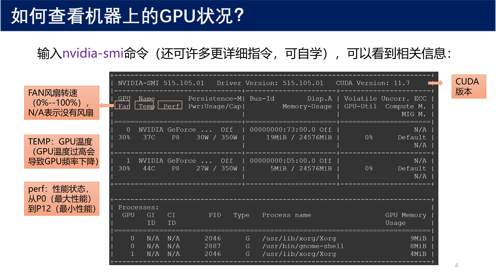{ width="800" }

输入 `nvidia-smi` 命令可以查看 GPU 相关信息：

- **FAN**：风扇转速（0%~100%），N/A 表示没有风扇
- **TEMP**：GPU 温度（GPU 温度过高会导致 GPU 频率下降）
- **perf**：性能状态，从 P0（最大性能）到 P12（最小性能）
- **CUDA 版本**：显示当前安装的 CUDA 版本

```bash
nvidia-smi
```

输出示例中可以看到：

- Driver Version: 515.105.01
- CUDA Version: 11.7
- 两个 NVIDIA GeForce 显卡，温度分别为 37°C 和 44°C
- 功耗分别为 10W/350W 和 27W/350W
- 显存使用情况等
