## 1 线程束（Warp）

### 1.1 线程束的基本概念

!!! abstract "定义 1（线程束 / Warp）"
    **线程束（Warp）** 是 GPU 中 **调度和执行的基本单元**，是一个在 GPU 中执行的并行线程组。

当一个线程块（block）被调度到流多处理器（SM）上执行后，线程块中的线程会被进一步划分为线程束。

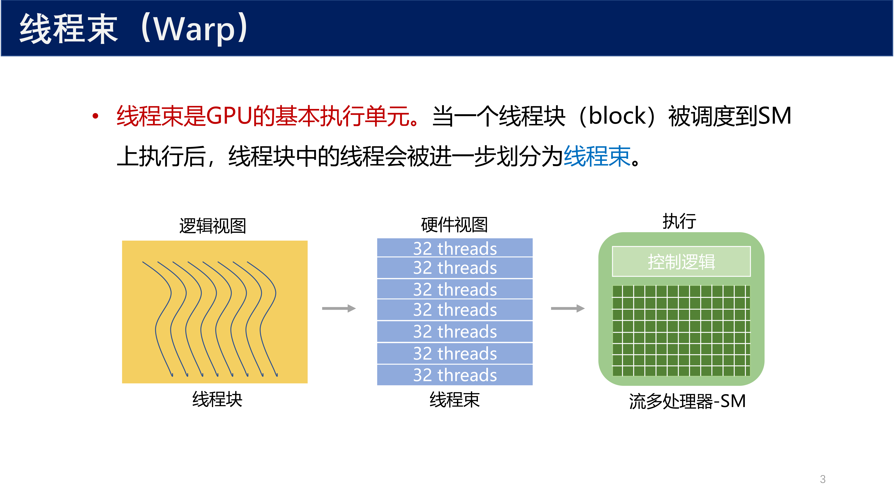{ width="800" }

从逻辑视图来看，一个线程块包含大量线程；从硬件视图来看，这些线程被组织成若干个固定大小的组，每个组就是一个线程束；最终由 SM 的控制逻辑统一调度执行。

!!! abstract "线程束的核心特性"
    - 线程束的大小是 **固定的**，通常为 **32 线程**
    - 一个线程束中的 **所有线程将在同一时间执行相同的指令**
    - 线程束的概念与 **SIMD（单指令多数据流）** 架构密切相关，其中一个指令可以在多个数据元素上并行执行

由于 GPU 内核的设计原理，这种执行方式可以最大限度地提高吞吐量，从而提高计算性能。在 GPU 编程中，使用线程束可以确保在处理大量数据时最大程度地利用硬件资源。

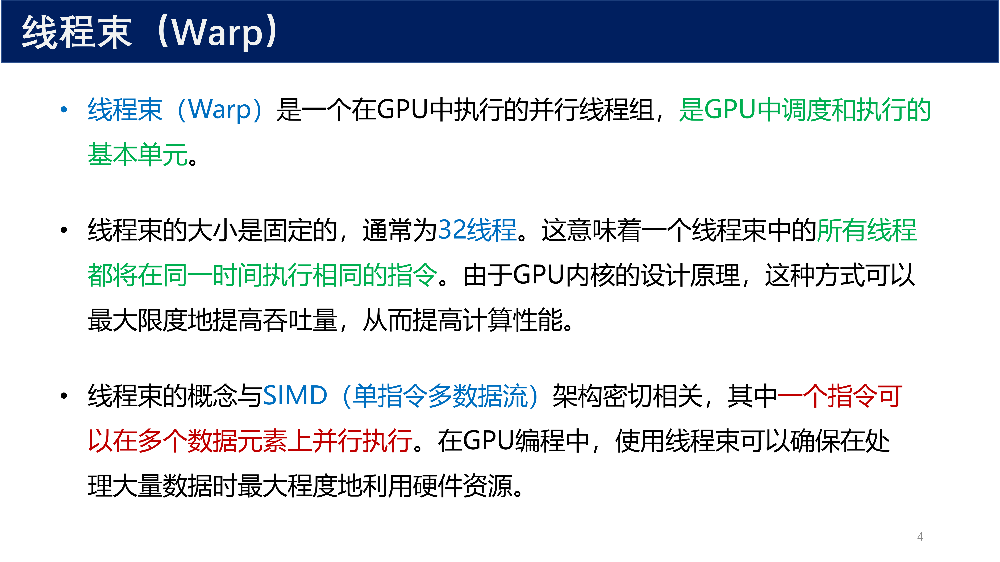{ width="800" }

### 1.2 获取线程束大小

CUDA 提供了内建变量 `warpSize`，表示当前硬件支持的线程束大小。

!!! tip "注意"
    核函数中不能使用 `cout`，只能用 `printf` 输出。

```cuda
#include <iostream>

__global__ void hello_PKU()
{
    printf("warpSize=%d\n", warpSize);
}

int main()
{
    // number of blocks
    int num_blk = 2;
    // number of threads
    int num_thd = 4;

    hello_PKU<<< num_blk, num_thd >>>();

    cudaDeviceSynchronize();

    return 0;
}
```

运行结果：

```
warpSize=32
warpSize=32
warpSize=32
warpSize=32
warpSize=32
warpSize=32
warpSize=32
warpSize=32
```

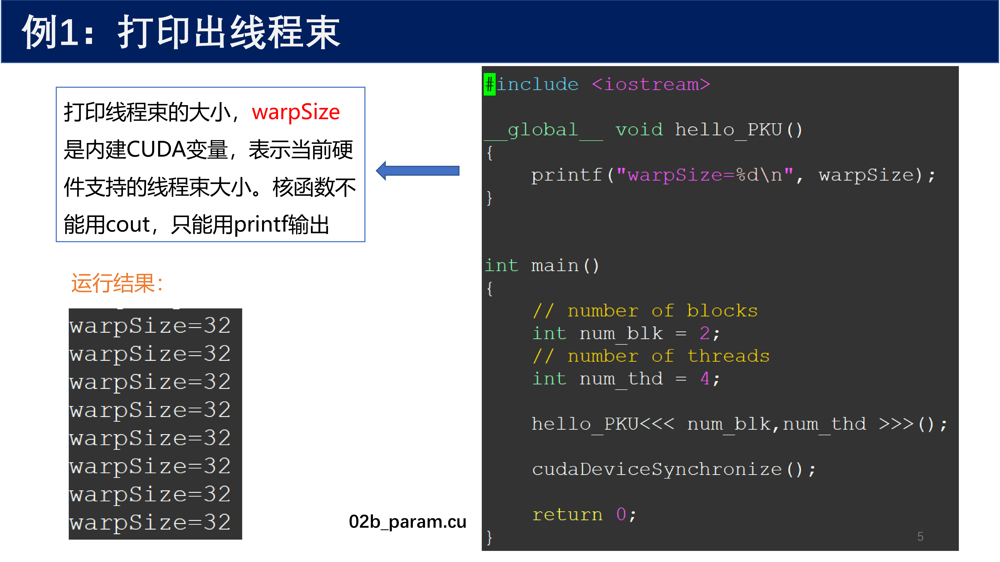{ width="800" }

### 1.3 分支对线程束效率的影响

GPU 中频繁的分支程序会导致利用率的严重下降。

!!! warning "分支发散（Branch Divergence）"
    如果同一个线程束内的线程做出了不同的分支选择（例如一半线程执行条件为真的分支，另一半执行条件为假的分支），由于硬件上每次只能为一个线程束获取一条执行指令，因此近一半的线程将会阻塞。

具体来说：

- 不同线程的分支选择：如果有一半线程执行条件为真的分支代码块，另一半线程将执行条件为假的分支代码块
- 由于硬件上每次只能为一个线程束获取一条执行指令，因此近一半的线程将会阻塞，GPU 的硬件利用率将只有 50%

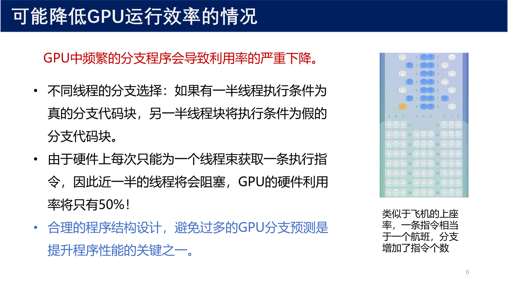{ width="800" }

!!! tip "优化建议"
    合理的程序结构设计，**避免过多的 GPU 分支预测** 是提升程序性能的关键之一。可以类比为飞机的上座率：一条指令相当于一个航班，分支增加了指令个数。

### 1.4 分支发散示例

下面的示例展示了线程束内分支的执行效果。

```cuda
#include <iostream>
using namespace std;

__global__ void hello_PKU()
{
    const int index = threadIdx.x + 1;

    if (index <= 8)
    {
        printf("id<=8 id=%d\n", index);
    }
    else
    {
        printf("id> 8 id=%d\n", index);
    }
}

int main()
{
    cout << "Hello from CPU!" << endl;

    // number of blocks
    int num_blk = 1;
    // number of threads
    int num_thd = 9;

    // kernel function
    hello_PKU<<< num_blk, num_thd >>>();

    cudaDeviceReset();

    return 0;
}
```

运行结果：

```
Hello from CPU!
id> 8 id=9
id<=8 id=1
id<=8 id=2
id<=8 id=3
id<=8 id=4
id<=8 id=5
id<=8 id=6
id<=8 id=7
id<=8 id=8
```

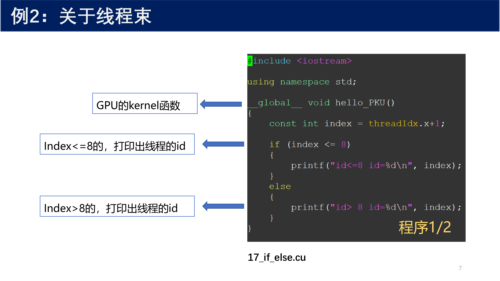{ width="800" }

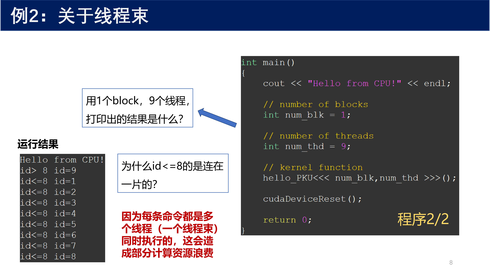{ width="800" }

!!! info "为什么 id<=8 的结果是连在一片的？"
    因为每条命令都是多个线程（一个线程束）同时执行的。在这个例子中，9 个线程被分到一个线程束中（线程束大小为 32），前 8 个线程执行 `if` 分支，第 9 个线程执行 `else` 分支。由于线程束内所有线程必须执行相同的指令，硬件会先执行 `if` 分支（前 8 个线程活跃，第 9 个线程被屏蔽），再执行 `else` 分支（第 9 个线程活跃，前 8 个线程被屏蔽），这会造成部分计算资源浪费。

### 1.5 回顾矩阵加法中的线程调度

回顾一段矩阵加法的 CUDA 程序：

```cuda
__global__ void add_matrices(
    double *a,
    double *b,
    double *c,
    const int n)
{
    const int index = threadIdx.x;
    c[index] = a[index] + b[index];
    printf("Hello from GPU %d!\n", index);
}
```

这里有 3 个操作：

1. 读取内存里 `a` 和 `b` 的值
2. 把 `a` 和 `b` 加起来的操作
3. 把结果 `c` 存下来的操作

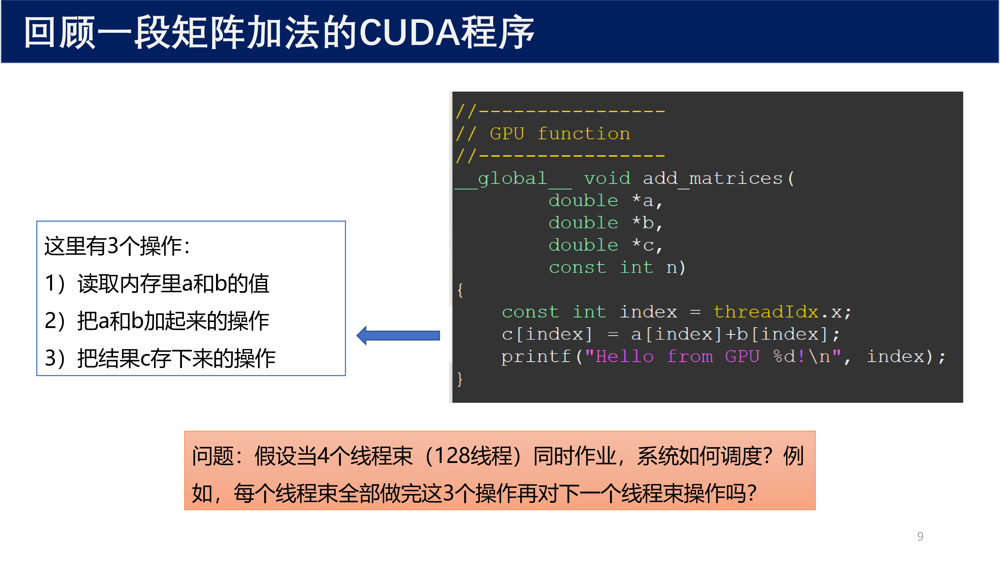{ width="800" }

!!! info "思考问题"
    假设当 4 个线程束（128 线程）同时作业，系统如何调度？例如，每个线程束全部做完这 3 个操作再对下一个线程束操作吗？

    答案是否定的。GPU 采用的是 **细粒度的线程调度**：当一个线程束因为访存等原因被挂起时，SM 会立即切换到其他就绪的线程束执行，而不是等待当前线程束完成所有操作。

## 2 线程同步机制

### 2.1 `__syncwarp()` 与 `__syncthreads()`

`__syncwarp()` 和 `__syncthreads()` 都是用来同步线程的函数，但它们作用的范围不同。

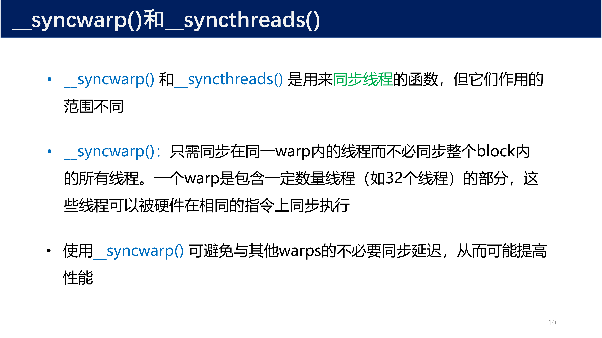{ width="800" }

| 函数 | 同步范围 | 使用场景 |
|------|----------|----------|
| `__syncthreads()` | 整个线程块（block） | 需要块内所有线程同步时 |
| `__syncwarp()` | 单个线程束（warp） | 只需 warp 内线程同步时 |

!!! abstract "`__syncwarp()` 的特点"
    - 只需同步在同一 warp 内的线程，而不必同步整个 block 内的所有线程
    - 一个 warp 是包含一定数量线程（如 32 个线程）的部分，这些线程可以被硬件在相同的指令上同步执行
    - 使用 `__syncwarp()` 可避免与其他 warps 的不必要同步延迟，从而可能提高性能

### 2.2 线程块级同步：`__syncthreads()`

下面的示例展示了使用 `__syncthreads()` 进行线程块级同步。

```cuda
#include <cuda_runtime.h>
#include <stdio.h>

__global__ void block_sync_demo()
{
    __shared__ int sh_data[64];
    int tid = threadIdx.x;

    // 所有线程写入共享内存
    sh_data[tid] = tid;

    // 等待当前 block 内全部 64 个线程执行到此处
    __syncthreads();

    // 安全读取其他线程的数据
    if (tid == 0)
        printf("block 同步完成, sh_data[1] = %d\n", sh_data[1]);
}

int main()
{
    // 1 个 block，64 个线程（包含 2 个 warp）
    block_sync_demo<<<1, 64>>>();
    cudaDeviceSynchronize();
    return 0;
}
```

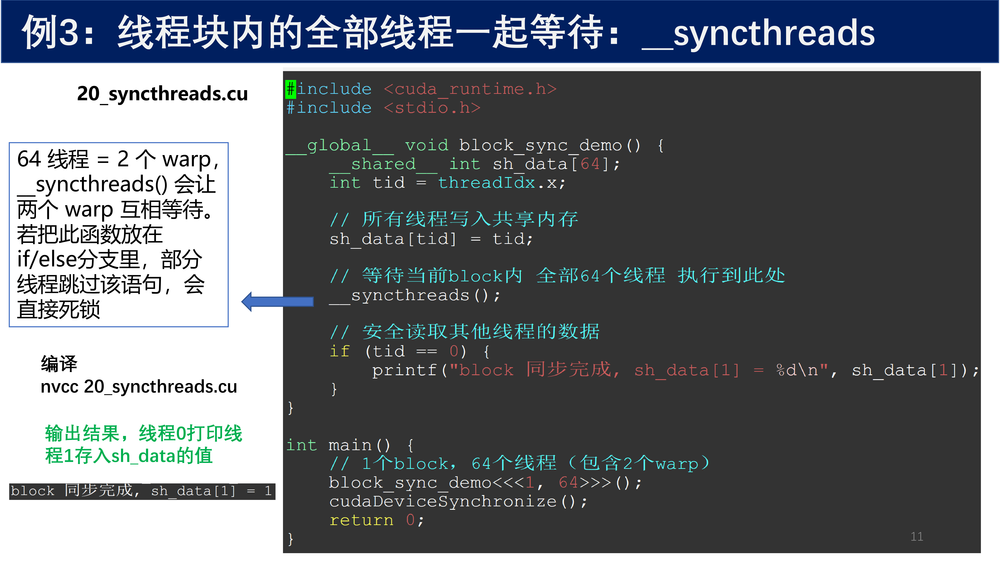{ width="800" }

!!! warning "`__syncthreads()` 的死锁风险"
    64 线程 = 2 个 warp，`__syncthreads()` 会让两个 warp 互相等待。**若把此函数放在 if/else 分支里，部分线程跳过该语句，会直接死锁。**

    `__syncthreads()` 的硬性要求：**当前线程块内，每一个线程都必须执行到这条指令，严禁分支。**

### 2.3 线程束级同步：`__syncwarp()`

下面的示例展示了使用 `__syncwarp()` 进行线程束级同步。

```cuda
__global__ void warp_sync_demo()
{
    int tid = threadIdx.x;
    int lane = tid % 32; // 当前线程在 warp 内的编号 0~31

    // 分支内使用 __syncwarp 合法
    if (lane < 16)
    {
        // 仅同步当前这一个 warp 的线程
        __syncwarp();
        printf("warp 内线程 %d 同步完成\n", tid);
    }
}

int main()
{
    // 1 个 block，64 个线程（2 个独立 warp）
    warp_sync_demo<<<1, 64>>>();
    cudaDeviceSynchronize();
    return 0;
}
```

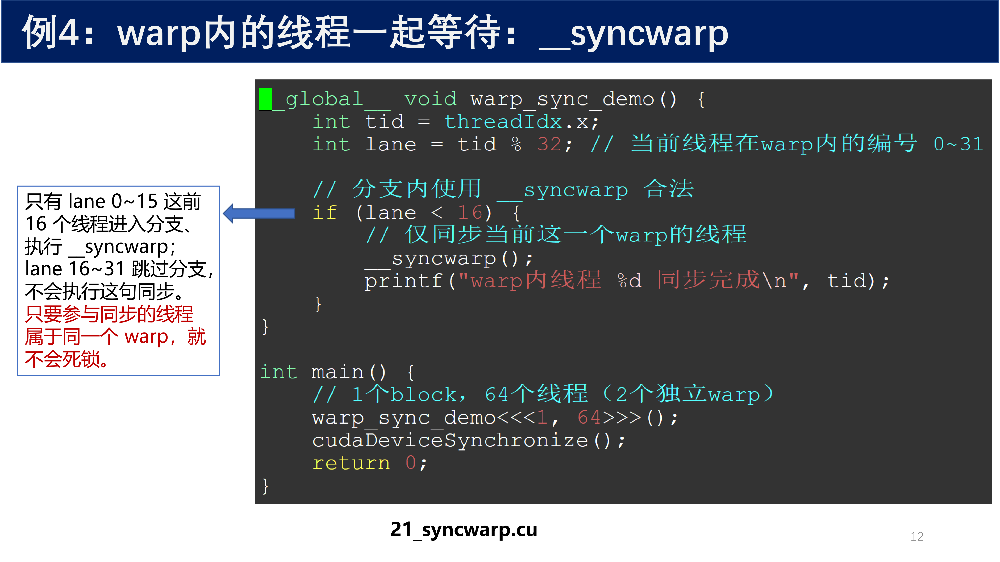{ width="800" }

!!! info "为什么这里不会死锁？"
    只有 lane 0~15 这前 16 个线程进入分支、执行 `__syncwarp`；lane 16~31 跳过分支，不会执行这句同步。**只要参与同步的线程属于同一个 warp，就不会死锁。**

### 2.4 `__syncthreads()` 与 `__syncwarp()` 的分支对比

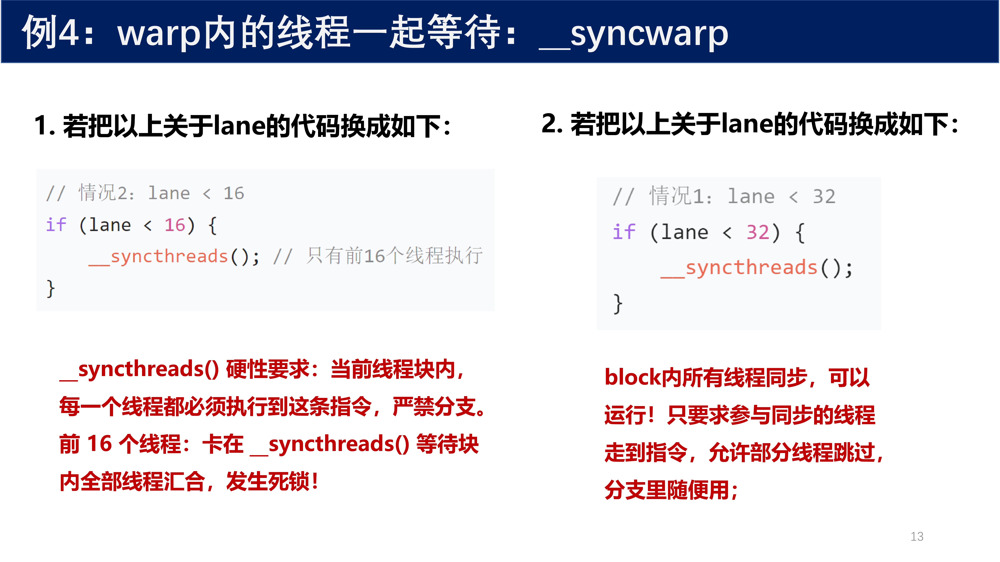{ width="800" }

**情况 1：使用 `__syncthreads()` 在分支内（死锁）**

```cuda
// 情况2: lane < 16
if (lane < 16) {
    __syncthreads(); // 只有前16个线程执行
}
```

- `__syncthreads()` 硬性要求：当前线程块内，每一个线程都必须执行到这条指令，严禁分支
- 前 16 个线程：卡在 `__syncthreads()` 等待块内全部线程汇合，**发生死锁！**

**情况 2：使用 `__syncthreads()` 在 warp 全参与的分支内（合法）**

```cuda
// 情况1: lane < 32
if (lane < 32) {
    __syncthreads();
}
```

- block 内所有线程同步，可以运行！
- 只要求参与同步的线程走到指令，允许部分线程跳过，分支里随便用
- 注意：`lane < 32` 对所有线程都成立，等价于没有分支

## 3 延迟（Latency）

### 3.1 延迟的基本概念

!!! abstract "定义 2（指令延迟）"
    GPU 的 **算术指令延迟（Arithmetic Instruction Latency）** 和 **访存指令延迟（Memory Access Instruction Latency）** 是指 GPU 执行算术指令和访问内存指令所需的时间。它们是衡量 GPU 性能的重要指标。

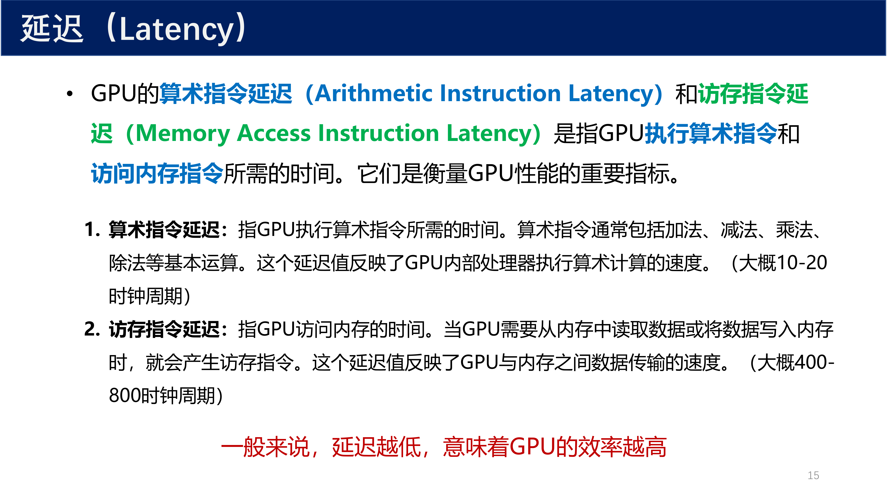{ width="800" }

| 延迟类型 | 含义 | 典型值 |
|----------|------|--------|
| 算术指令延迟 | GPU 执行算术指令所需的时间，包括加法、减法、乘法、除法等基本运算 | 大概 10~20 时钟周期 |
| 访存指令延迟 | GPU 访问内存的时间，包括从内存读取数据或将数据写入内存 | 大概 400~800 时钟周期 |

一般来说，**延迟越低，意味着 GPU 的效率越高**。

### 3.2 算术指令延迟的影响因素

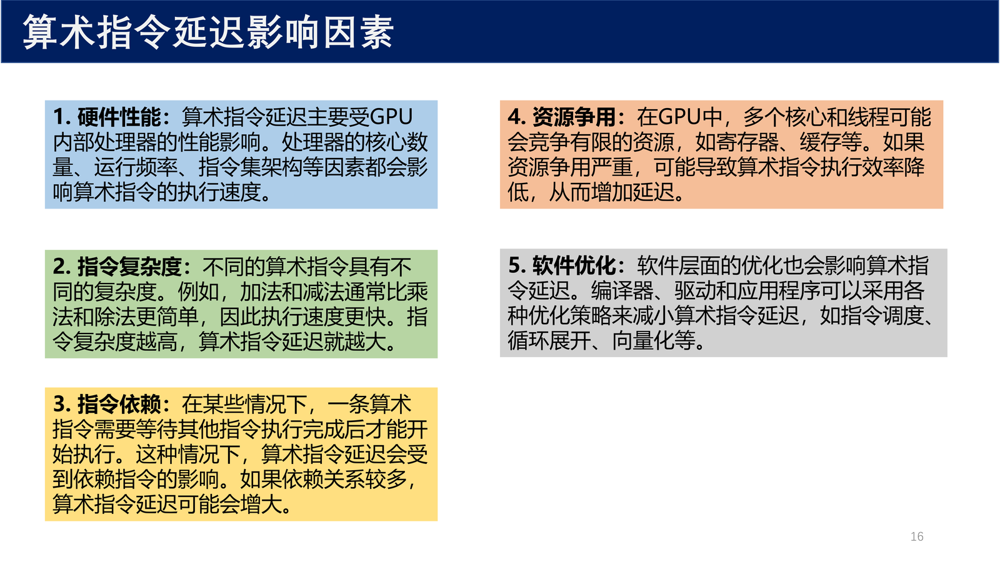{ width="800" }

1. **硬件性能**：算术指令延迟主要受 GPU 内部处理器的性能影响。处理器的核心数量、运行频率、指令集架构等因素都会影响算术指令的执行速度
2. **指令复杂度**：不同的算术指令具有不同的复杂度。例如，加法和减法通常比乘法和除法更简单，因此执行速度更快。指令复杂度越高，算术指令延迟就越大
3. **指令依赖**：在某些情况下，一条算术指令需要等待其他指令执行完成后才能开始执行。这种情况下，算术指令延迟会受到依赖指令的影响。如果依赖关系较多，算术指令延迟可能会增大
4. **资源争用**：在 GPU 中，多个核心和线程可能会竞争有限的资源，如寄存器、缓存等。如果资源争用严重，可能导致算术指令执行效率降低，从而增加延迟
5. **软件优化**：软件层面的优化也会影响算术指令延迟。编译器、驱动和应用程序可以采用各种优化策略来减小算术指令延迟，如指令调度、循环展开、向量化等

### 3.3 GPU 中的线程调度与延迟隐藏

GPU 通过 **线程调度** 来隐藏访存延迟。当一个线程束因为等待内存数据而被挂起时，SM 会立即切换到其他就绪的线程束继续执行。

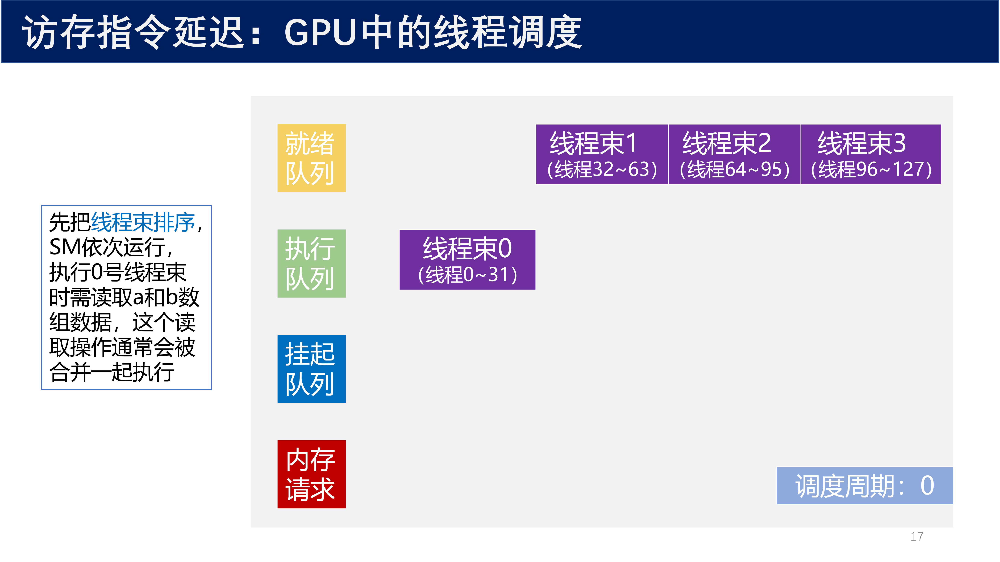{ width="800" }

**调度周期 0**：

- 先把线程束排序，SM 依次运行
- 执行 0 号线程束时需读取 `a` 和 `b` 数组数据，这个读取操作通常会被合并一起执行
- 线程束 0 进入执行队列，线程束 1~3 在就绪队列等待

### 3.4 线程挂起

!!! abstract "定义 3（线程挂起）"
    GPU 线程被挂起是指在执行 GPU 计算任务时，GPU 上的一个或多个线程暂时停止执行。

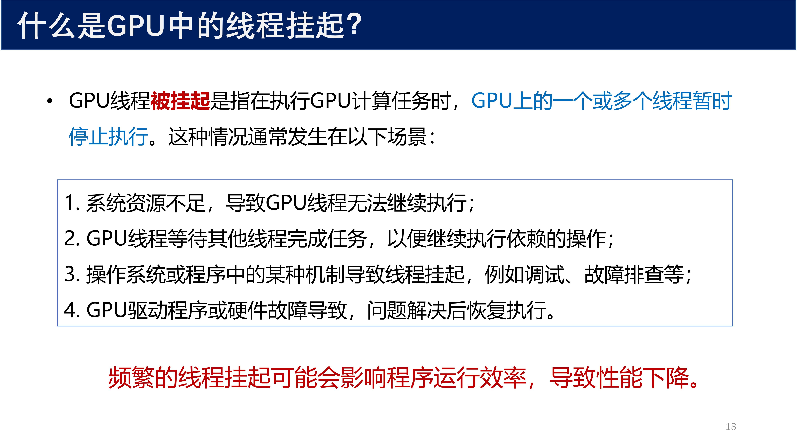{ width="800" }

线程挂起通常发生在以下场景：

1. 系统资源不足，导致 GPU 线程无法继续执行
2. GPU 线程等待其他线程完成任务，以便继续执行依赖的操作
3. 操作系统或程序中的某种机制导致线程挂起，例如调试、故障排查等
4. GPU 驱动程序或硬件故障导致，问题解决后恢复执行

!!! warning "注意"
    频繁的线程挂起可能会影响程序运行效率，导致性能下降。

### 3.5 线程调度的完整过程

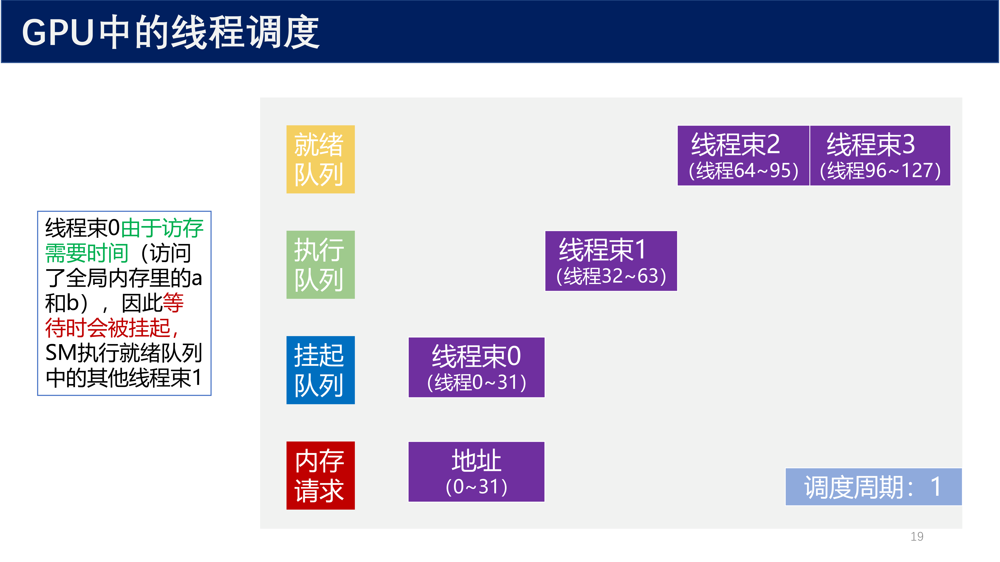{ width="800" }

**调度周期 1**：

- 线程束 0 由于访存需要时间（访问了全局内存里的 `a` 和 `b`），因此等待时会被挂起
- SM 执行就绪队列中的其他线程束 1
- 内存请求队列中记录了线程束 0 请求的地址（0~31）

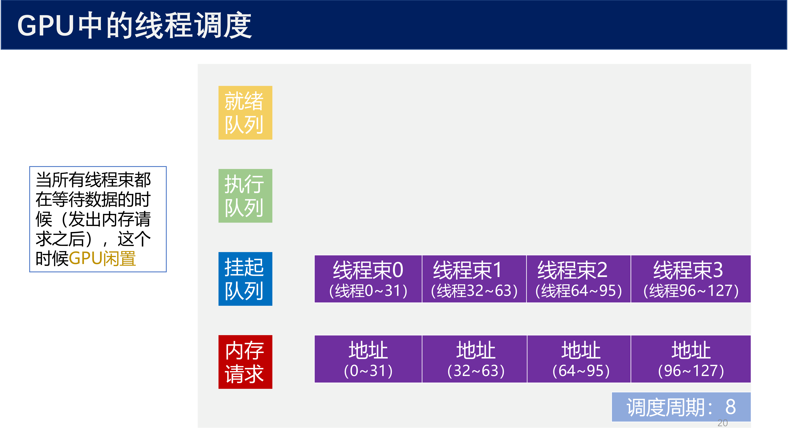{ width="800" }

**调度周期 8**：

- 当所有线程束都在等待数据的时候（发出内存请求之后），这个时候 GPU 闲置
- 线程束 0~3 全部进入挂起队列
- 内存请求队列中记录了所有线程束的地址请求

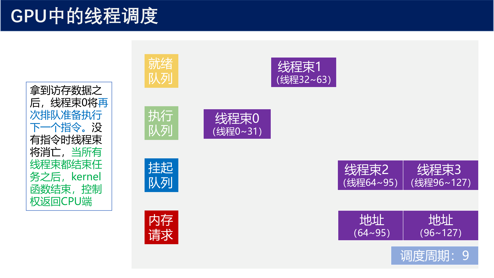{ width="800" }

**调度周期 9**：

- 拿到访存数据之后，线程束 0 将再次排队准备执行下一个指令
- 没有指令时线程束将消亡
- 当所有线程束都结束任务之后，kernel 函数结束，控制权返回 CPU 端

### 3.6 利特尔法则估算所需线程束数量

!!! abstract "定理 1（利特尔法则 / Little's Law）"
    利特尔法则起源于队列理论，这里可以用于估算 GPU 隐藏延迟所需要的活跃线程束数量：

    $$
    \text{所需线程束数量} = \text{延迟} \times \text{吞吐量}
    $$

    其中：

    - **延迟**：线程的延迟（指令从送入运算单元到运算结束所需的时钟周期数）
    - **吞吐量**：单位时间内 SM 执行的操作数量（每周期可同时调度的 warp 数）

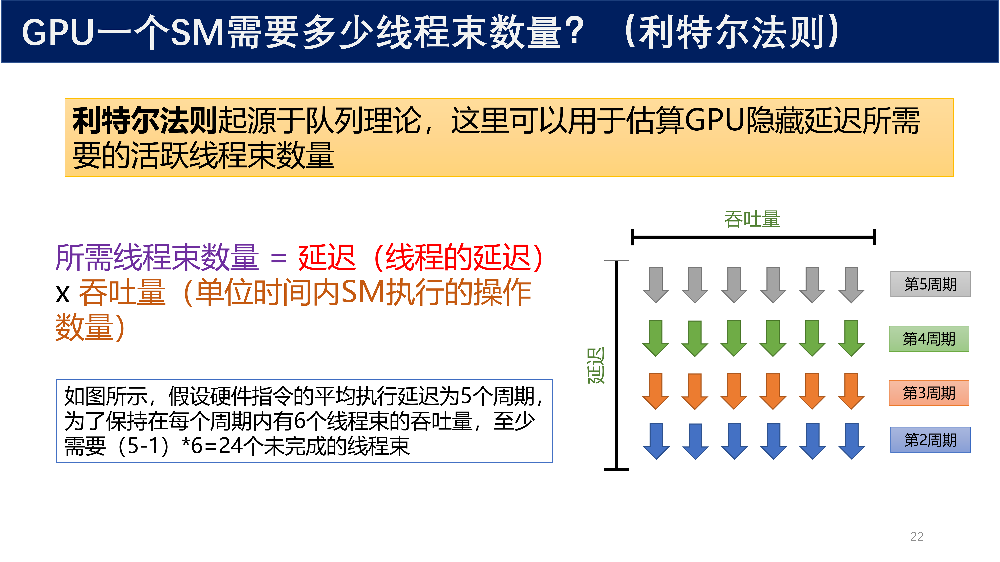{ width="800" }

!!! example "计算示例"
    已知：

    - 单条指令从送入运算单元到运算结束要 5 个时钟周期
    - SM 每个周期可以同时调度 6 个 warp 进入运算

    分析：

    - 单个线程束 warp 送出一条指令后，自身要闲置 $5 - 1 = 4$ 个周期才能再次被调度
    - 想要硬件每时每刻都不空转、稳定每周期跑满 6 个 warp，则空档的 4 个周期里不断换别的 warp 顶上
    - 最少需要：$4 \times 6 = 24$ 个活跃 warp

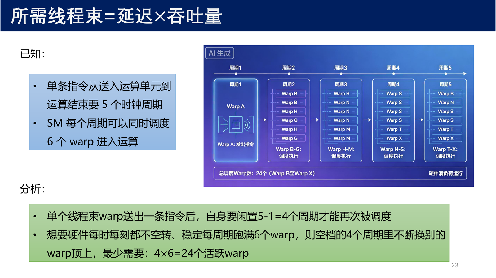{ width="800" }

## 4 CPU 与 GPU 应对延迟的策略对比

### 4.1 CPU 针对指令延迟的方法

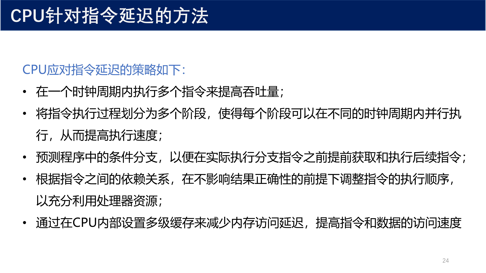{ width="800" }

CPU 应对指令延迟的策略如下：

- 在一个时钟周期内执行多个指令来提高吞吐量（**超标量执行**）
- 将指令执行过程划分为多个阶段，使得每个阶段可以在不同的时钟周期内并行执行，从而提高执行速度（**流水线**）
- 预测程序中的条件分支，以便在实际执行分支指令之前提前获取和执行后续指令（**分支预测**）
- 根据指令之间的依赖关系，在不影响结果正确性的前提下调整指令的执行顺序，以充分利用处理器资源（**乱序执行**）
- 通过在 CPU 内部设置多级缓存来减少内存访问延迟，提高指令和数据的访问速度（**多级缓存**）

### 4.2 GPU 的延迟隐藏方法

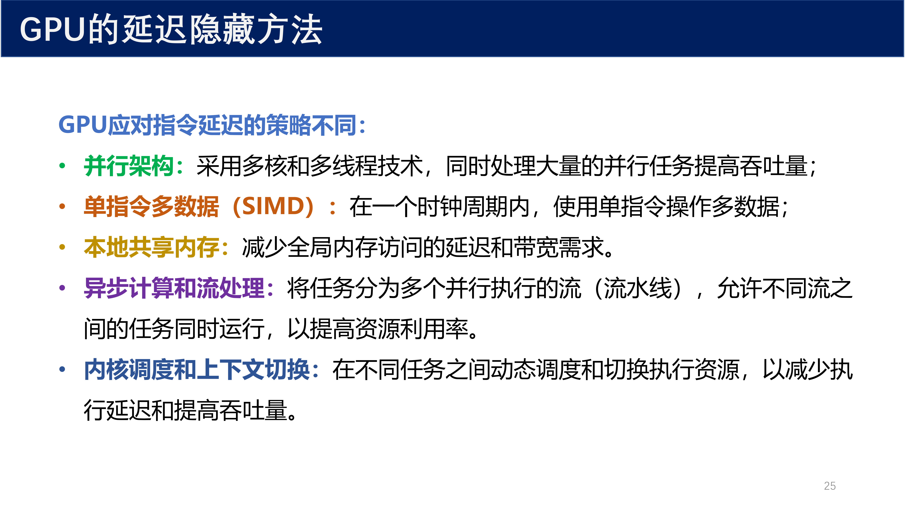{ width="800" }

GPU 应对指令延迟的策略与 CPU 不同：

- **并行架构**：采用多核和多线程技术，同时处理大量的并行任务提高吞吐量
- **单指令多数据（SIMD）**：在一个时钟周期内，使用单指令操作多数据
- **本地共享内存**：减少全局内存访问的延迟和带宽需求
- **异步计算和流处理**：将任务分为多个并行执行的流（流水线），允许不同流之间的任务同时运行，以提高资源利用率
- **内核调度和上下文切换**：在不同任务之间动态调度和切换执行资源，以减少执行延迟和提高吞吐量

!!! tip "核心区别"
    CPU 主要通过 **减少延迟**（更复杂的硬件设计、更大的缓存、分支预测等）来提升性能；而 GPU 主要通过 **隐藏延迟**（大量线程并行、快速上下文切换）来提升吞吐量。GPU 的设计理念是：既然访存延迟不可避免，那就用足够多的线程来 "盖住" 它。

## 5 总结

| 概念 | 说明 |
|------|------|
| 线程束（Warp） | GPU 调度和执行的基本单元，通常包含 32 个线程 |
| SIMD 执行 | 同一线程束内的所有线程同时执行相同指令 |
| 分支发散 | 同一线程束内线程走不同分支会导致串行执行，降低利用率 |
| `__syncthreads()` | 线程块级同步，**要求块内所有线程都执行到**，严禁分支 |
| `__syncwarp()` | 线程束级同步，**只要求同 warp 内线程执行到**，可在分支内使用 |
| 算术指令延迟 | 约 10~20 时钟周期 |
| 访存指令延迟 | 约 400~800 时钟周期 |
| 利特尔法则 | 所需线程束数量 = 延迟 $\times$ 吞吐量 |
| GPU 延迟隐藏 | 通过大量线程的快速切换来隐藏访存延迟 |
| CPU 延迟应对 | 通过复杂硬件设计（流水线、缓存、分支预测等）减少延迟 |
