## 1 并行编程基础

### 1.1 进程与线程

在并行编程中，有两个核心概念：

- **进程（Process）** ：拥有独立的地址空间，进程间数据默认不共享。进程间通信需要显式的消息传递机制。
- **线程（Thread）** ：同一进程内的多个线程共享地址空间，可以通过共享变量直接通信，但需要同步机制（如锁、信号量）避免竞争条件。

### 1.2 两种并行编程模型

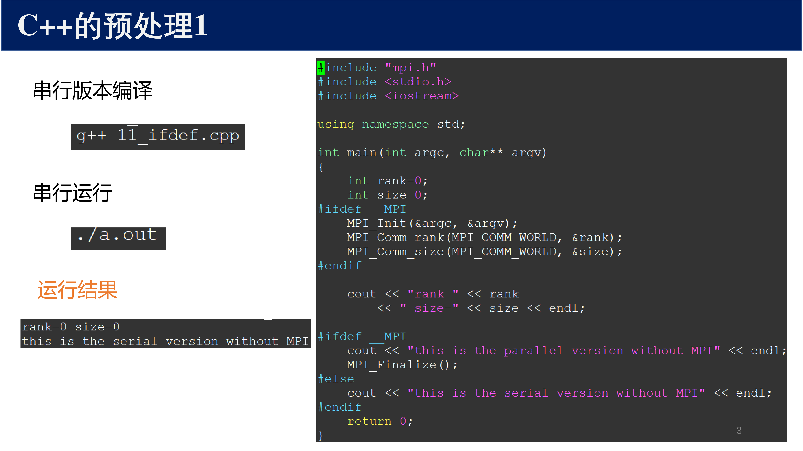{ width="800" }

**共享内存模型** （如 OpenMP）：

- 所有线程共享同一内存空间
- 通信隐式完成（通过读写共享变量）
- 需要处理同步问题（race condition）
- 适合单机多核环境

**分布式内存模型** （如 MPI）：

- 每个进程拥有独立的内存空间
- 通信显式完成（通过发送/接收消息）
- 天然避免数据竞争
- 适合多机集群环境

!!! tip "MPI + OpenMP 混合编程"
    现代高性能计算中，常用 MPI + OpenMP 混合模式：MPI 处理节点间通信，OpenMP 处理节点内多核并行。这种模式能充分利用多核集群的硬件特性。

---

## 2 MPI 概述

### 2.1 什么是 MPI

MPI（Message Passing Interface）是分布式内存并行编程的事实标准。它不是一种编程语言，而是一个 **库** ，定义了可以被 C、C++、Fortran 等语言调用的函数接口。

MPI 的核心特性：

- **可移植性** ：同一份 MPI 代码可以在不同平台上编译运行
- **标准化** ：MPI 论坛维护标准，主要版本有 MPI-1、MPI-2、MPI-3、MPI-4
- **高性能** ：各厂商提供针对自家硬件的优化实现（如 Intel MPI、Open MPI、MPICH）

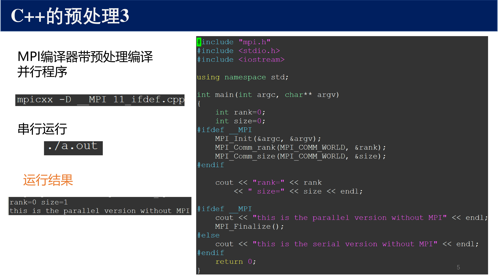{ width="800" }

### 2.2 通信子（Communicator）

!!! abstract "定义 1（通信子）"
    通信子（Communicator）是 MPI 的核心概念，它定义了一组可以相互通信的进程的集合，以及通信的上下文。

    - **MPI_COMM_WORLD** ：预定义的全局通信子，包含所有参与计算的进程
    - 每个通信子内的进程被分配从 $0$ 开始的连续 **rank** （进程号）
    - 同一个进程在不同的通信子中可以拥有不同的 rank

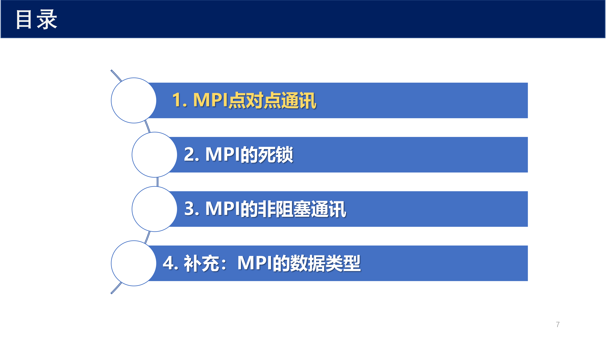{ width="800" }

通信子的作用：

- **进程组管理** ：将进程组织为逻辑组
- **通信隔离** ：不同通信子之间的消息不会相互干扰（通过 context 实现）
- **模块化编程** ：库函数可以使用独立的通信子，避免与用户代码的消息冲突

### 2.3 SPMD 编程模型

MPI 采用 **SPMD** （Single Program Multiple Data）模型：

- 所有进程执行 **同一份程序代码**
- 但每个进程根据自身的 rank 走不同的分支
- 数据分布在不同的进程中，各进程处理本地数据

!!! note "SPMD vs MPMD"
    SPMD 是 MPI 中最常见的模式。MPI-2 引入的进程创建机制也支持 MPMD（Multiple Program Multiple Data），但实践中较少使用。

---

## 3 MPI 基本框架

### 3.1 最小的 MPI 程序

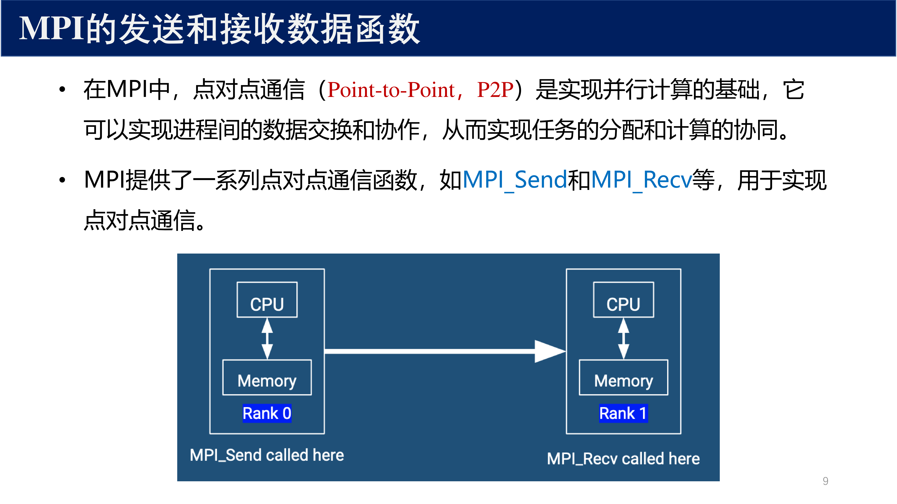{ width="800" }

每个 MPI 程序必须包含四个基本元素：

- `MPI_Init(&argc, &argv)` — 初始化 MPI 环境
- `MPI_Comm_rank(MPI_COMM_WORLD, &rank)` — 获取当前进程的 rank
- `MPI_Comm_size(MPI_COMM_WORLD, &size)` — 获取通信子中的进程总数
- `MPI_Finalize()` — 终止 MPI 环境

!!! warning "注意"
    `MPI_Init` 必须在所有其他 MPI 函数之前调用，`MPI_Finalize` 必须在程序结束前调用。在 `MPI_Finalize` 之后不能再调用任何 MPI 函数。

### 3.2 编译与运行

```bash
# 编译
mpicc -o program program.c

# 运行（启动 4 个进程）
mpirun -np 4 ./program
# 或
mpiexec -n 4 ./program
```

---

## 4 点对点通信基础

### 4.1 消息信封

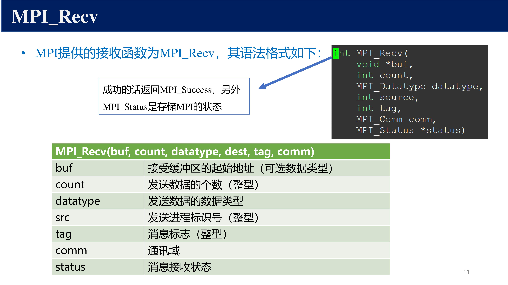{ width="800" }

在 MPI 中，每条消息由一个 **信封（envelope）** 和 **数据（data）** 组成：

| 组成部分 | 内容 | 说明 |
|---------|------|------|
| 信封 | `(source/dest, tag, comm)` | 用于消息匹配 |
| 数据 | `(buf, count, datatype)` | 实际传输的内容 |

**信封的三要素** ：

- **source / dest** ：发送方或接收方的 rank
- **tag** ：消息标签（整数），用于区分同一对进程间的不同消息
- **comm** ：通信子，消息只在同一个通信子内传递

**数据的三要素** ：

- **buf** ：数据缓冲区的起始地址
- **count** ：数据元素的个数
- **datatype** ：每个数据元素的类型（如 `MPI_INT`、`MPI_DOUBLE`、`MPI_CHAR` 等）

!!! tip "MPI 预定义数据类型"
    MPI 提供了一系列预定义数据类型，与 C/Fortran 的基本类型对应。例如 `MPI_INT`、`MPI_FLOAT`、`MPI_DOUBLE`、`MPI_CHAR`、`MPI_BYTE` 等。也支持用户自定义派生数据类型。

---

## 5 阻塞通信

### 5.1 MPI_Send 和 MPI_Recv

!!! abstract "定义 2（阻塞通信）"
    阻塞通信（Blocking Communication）是指通信函数在满足特定条件前 **不会返回** ，调用进程会被阻塞。

    - **阻塞发送** ：直到消息数据已被安全地复制出发送缓冲区，函数才返回
    - **阻塞接收** ：直到接收缓冲区中已包含完整的数据，函数才返回

**MPI_Send** ：

```c
int MPI_Send(
    const void *buf,     // 发送缓冲区地址
    int count,           // 发送元素个数
    MPI_Datatype dtype,  // 数据类型
    int dest,            // 目标进程 rank
    int tag,             // 消息标签
    MPI_Comm comm        // 通信子
);
```

**MPI_Recv** ：

```c
int MPI_Recv(
    void *buf,           // 接收缓冲区地址
    int count,           // 最大接收元素个数
    MPI_Datatype dtype,  // 数据类型
    int source,          // 源进程 rank（可用 MPI_ANY_SOURCE）
    int tag,             // 消息标签（可用 MPI_ANY_TAG）
    MPI_Comm comm,       // 通信子
    MPI_Status *status   // 状态对象（包含实际 source, tag, 消息长度）
);
```

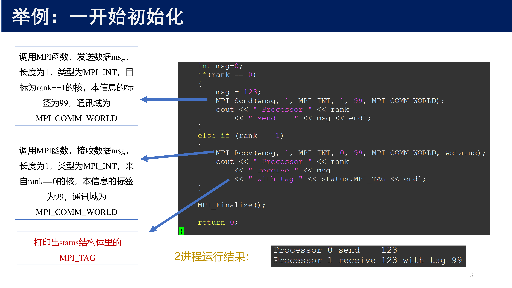{ width="800" }

### 5.2 消息匹配

接收方使用 `(source, tag, comm)` 三元组来匹配消息。规则：

- `source` 可以是具体 rank 或 `MPI_ANY_SOURCE`（通配符）
- `tag` 可以是具体标签或 `MPI_ANY_TAG`（通配符）
- 消息按照 **先进先出（FIFO）** 顺序匹配（在同一对 (source, tag) 上）
- MPI 保证消息 **不会 overtake** ：如果发送方按顺序发送消息 A、B，接收方也按相同顺序接收

!!! info "MPI_Status 结构"
    接收完成后，`MPI_Status` 对象包含：
    
    - `status.MPI_SOURCE` — 实际发送方 rank
    - `status.MPI_TAG` — 实际消息标签
    - `MPI_Get_count(&status, dtype, &count)` — 实际接收到的元素数

---

## 6 通信模式

MPI 定义了四种发送模式，它们在 **何时可以返回** 方面有所不同：

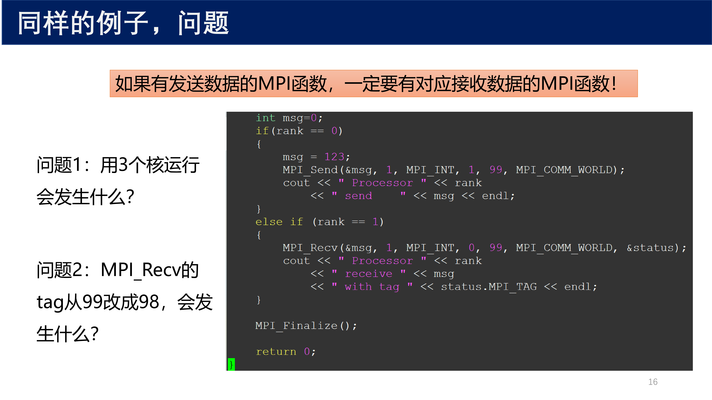{ width="800" }

!!! abstract "定义 3（四种通信模式）"

    | 模式 | 函数 | 返回条件 | 是否需要匹配接收 |
    |------|------|---------|:---:|
    | 标准（Standard） | `MPI_Send` | 实现决定（可能缓冲，可能阻塞） | 是 |
    | 同步（Synchronous） | `MPI_Ssend` | 接收方已开始接收 | 是 |
    | 缓冲（Buffered） | `MPI_Bsend` | 数据已复制到用户提供的缓冲区 | 否 |
    | 就绪（Ready） | `MPI_Rsend` | 立即返回（前提是接收方已就绪） | 是 |

### 6.1 标准模式（Standard）

- 最常用的模式
- MPI 实现自行决定是否缓冲小消息
- 对于大消息，通常需要等待匹配的接收
- **不保证安全性** ：可能因实现不同导致死锁或成功

### 6.2 同步模式（Synchronous）

- 发送方 **必须** 等待接收方开始接收才能返回
- 保证双方的同步点
- 即使 MPI 内部有缓冲也不会使用
- 更 **安全** 但可能更 **慢**

### 6.3 缓冲模式（Buffered）

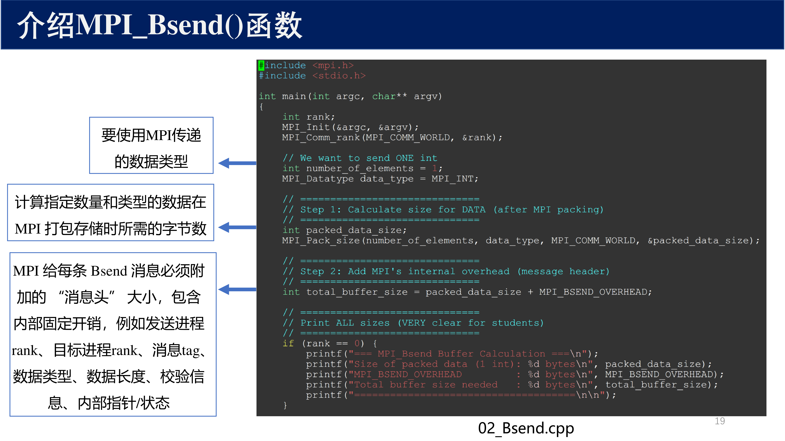{ width="800" }

- 用户通过 `MPI_Buffer_attach` 提供缓冲区
- 发送方立即将数据复制到缓冲区后返回
- 实际的传输由 MPI 在后台完成
- 需要 **谨慎管理缓冲区大小** ：缓冲区不足会导致错误

```c
int bufsize = 1024 * 1024;  // 1 MB
char *buf = malloc(bufsize);
MPI_Buffer_attach(buf, bufsize);
// ... 使用 MPI_Bsend ...
MPI_Buffer_detach(&buf, &bufsize);
free(buf);
```

### 6.4 就绪模式（Ready）

- 发送方 **假设** 接收方已经开始接收
- 如果接收方未就绪，行为 **未定义** （可能 crash）
- 在某些硬件上可以 **省去握手开销**
- 通常用于性能极致优化，需要程序员保证正确性

!!! warning "就绪模式的危险性"
    就绪模式是四种模式中 **最危险** 的。只有当程序员可以通过程序逻辑 **确定** 接收已经 posted 时才能使用。一般不建议初学者使用。

---

## 7 死锁问题

### 7.1 不安全通信模式

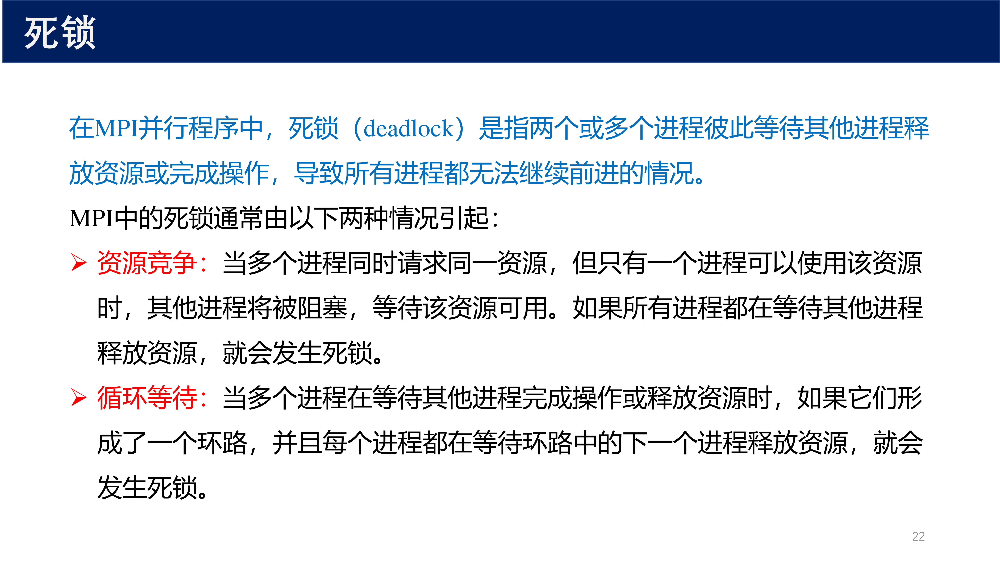{ width="800" }

当两个进程互相发送消息时，如果都先调用 `MPI_Send` 再调用 `MPI_Recv`，可能发生死锁：

```c
// 危险代码：可能死锁
if (rank == 0) {
    MPI_Send(data_to_1, count, MPI_DOUBLE, 1, 0, MPI_COMM_WORLD);
    MPI_Recv(data_from_1, count, MPI_DOUBLE, 1, 0, MPI_COMM_WORLD, &status);
} else if (rank == 1) {
    MPI_Send(data_to_0, count, MPI_DOUBLE, 0, 0, MPI_COMM_WORLD);
    MPI_Recv(data_from_0, count, MPI_DOUBLE, 0, 0, MPI_COMM_WORLD, &status);
}
```

原因：当两个进程同时执行 `MPI_Send`（标准模式），MPI 实现可能选择不缓冲。两个 `Send` 都在等待对方的 `Recv`，形成循环等待。

### 7.2 解决方案

**方案一：改变发送/接收顺序**

让一个进程先收后发，另一个先发后收：

```c
if (rank == 0) {
    MPI_Send(data, count, MPI_DOUBLE, 1, 0, MPI_COMM_WORLD);
    MPI_Recv(data, count, MPI_DOUBLE, 1, 0, MPI_COMM_WORLD, &status);
} else {
    MPI_Recv(data, count, MPI_DOUBLE, 0, 0, MPI_COMM_WORLD, &status);
    MPI_Send(data, count, MPI_DOUBLE, 0, 0, MPI_COMM_WORLD);
}
```

**方案二：使用 MPI_Sendrecv**

MPI 提供了组合的发送-接收函数，内部避免了死锁：

```c
MPI_Sendrecv(
    sendbuf, sendcount, sendtype, dest, sendtag,
    recvbuf, recvcount, recvtype, source, recvtag,
    MPI_COMM_WORLD, &status
);
```

**方案三：使用非阻塞通信**

---

## 8 非阻塞通信

### 8.1 基本概念

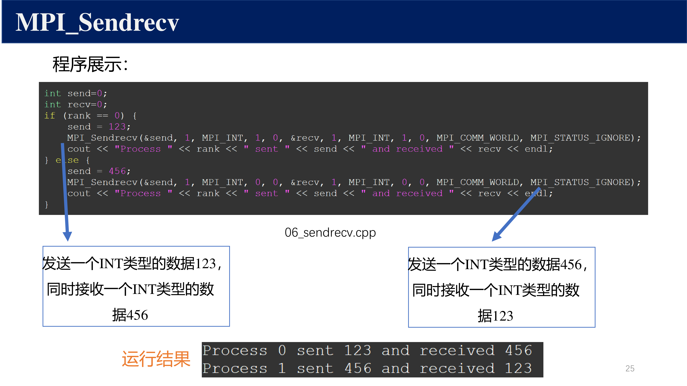{ width="800" }

!!! abstract "定义 4（非阻塞通信）"
    非阻塞通信（Non-blocking Communication）函数 **立即返回** ，不等待通信完成。实际的通信在后台进行，程序员需要显式检查通信是否完成。

| | 阻塞 | 非阻塞 |
|---|:---:|:---:|
| 发送 | `MPI_Send` | `MPI_Isend` |
| 接收 | `MPI_Recv` | `MPI_Irecv` |

非阻塞通信的优势：

- **避免死锁** ：由于函数立即返回，不会形成循环等待
- **重叠计算与通信** ：在等待通信完成的间隙，CPU 可以执行有用的计算
- **更灵活的通信模式** ：可以实现复杂的非规则通信

### 8.2 MPI_Isend 和 MPI_Irecv

```c
int MPI_Isend(void *buf, int count, MPI_Datatype dtype,
              int dest, int tag, MPI_Comm comm,
              MPI_Request *request);

int MPI_Irecv(void *buf, int count, MPI_Datatype dtype,
              int source, int tag, MPI_Comm comm,
              MPI_Request *request);
```

注意多出的 `MPI_Request *request` 参数——这是一个句柄，用于后续检查该通信是否完成。

!!! warning "缓冲区安全"
    在通信 **完成之前** ， **不能修改** 发送缓冲区或读取接收缓冲区。否则行为未定义。

### 8.3 通信完成检测

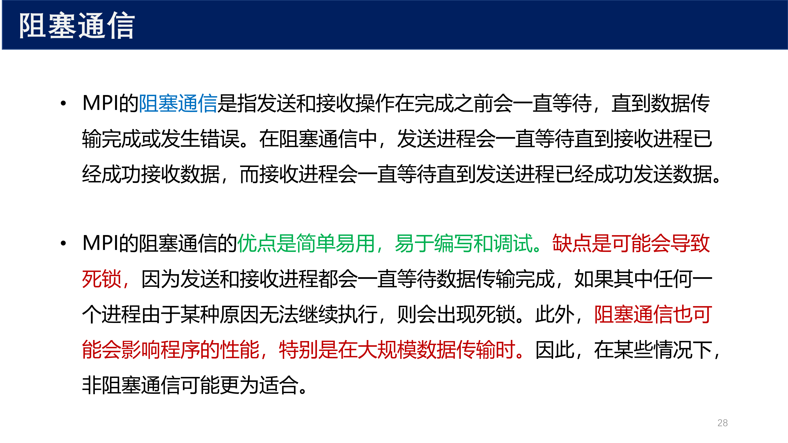{ width="800" }

MPI 提供两类完成检测函数：

**等待类（阻塞直到完成）** ：

- `MPI_Wait(&request, &status)` — 等待单个通信完成
- `MPI_Waitall(count, requests, statuses)` — 等待所有通信完成
- `MPI_Waitsome(count, requests, &outcount, indices, statuses)` — 等待至少一个完成
- `MPI_Waitany(count, requests, &index, &status)` — 等待任意一个完成

**测试类（不阻塞，立即返回）** ：

- `MPI_Test(&request, &flag, &status)` — 测试单个通信是否完成
- `MPI_Testall(count, requests, &flag, statuses)` — 测试是否全部完成
- `MPI_Testsome(count, requests, &outcount, indices, statuses)` — 测试哪些已完成
- `MPI_Testany(count, requests, &index, &flag, &status)` — 测试任意一个是否完成

典型的非阻塞通信模式：

```c
MPI_Request req_s, req_r;
MPI_Status status_s, status_r;

// 启动非阻塞通信
MPI_Irecv(recv_buf, N, MPI_DOUBLE, src, tag, comm, &req_r);
MPI_Isend(send_buf, N, MPI_DOUBLE, dest, tag, comm, &req_s);

// 在等待期间做有用的计算
compute_something();

// 等待通信完成
MPI_Wait(&req_s, &status_s);
MPI_Wait(&req_r, &status_r);
```

---

## 9 通信模式与安全性

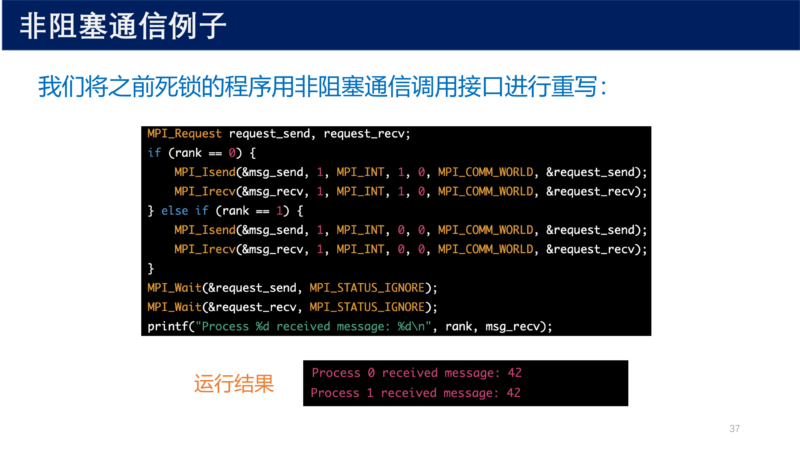{ width="800" }

### 9.1 安全通信的三个条件

!!! abstract "定义 5（通信安全性）"
    一个通信模式是 **安全的** ，当且仅当满足以下条件时程序不会发生死锁：

    1. 每条 `Send` 最终都有对应的 `Recv` 匹配
    2. 通信图中不存在 **循环依赖**
    3. 使用合适的通信模式避免缓冲区耗尽

### 9.2 典型通信模式

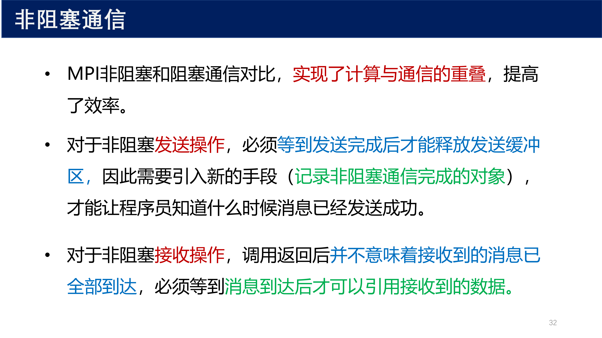{ width="800" }

常见的点对点通信模式：

- **一对多** ：一个进程向多个进程发送不同数据
- **多对一** ：多个进程向一个进程发送数据
- **环形通信** ：进程排成环，每个进程向下一个发送
- **全交换** ：每对进程之间互相交换数据

!!! tip "实践建议"
    在实际编程中：
    
    - 优先使用 **MPI_Sendrecv** 处理对称交换
    - 优先使用 **非阻塞通信** + `MPI_Waitall` 处理复杂通信模式
    - 避免在阻塞通信中使用 **标准模式** 进行对称交换（可能导致死锁）
    - 考虑使用 **集合通信** 替代手动编写的点对点通信模式

---

## 10 实例：矩阵-向量乘法

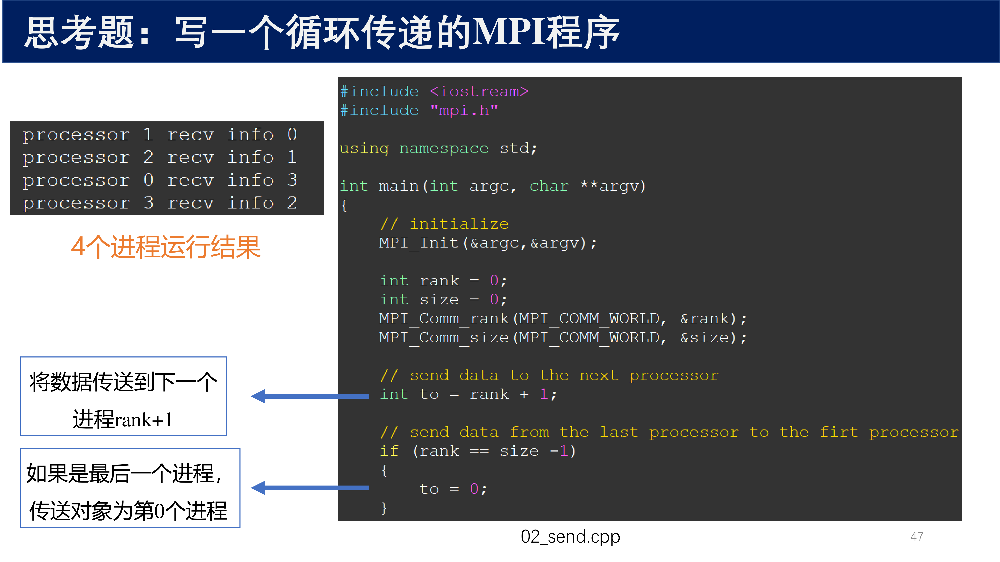{ width="800" }

矩阵-向量乘法 $y = Ax$ 的并行实现：

- 矩阵 $A$ 按行分布在各进程中
- 向量 $x$ 需要被所有进程共享
- 各进程计算本地的局部结果
- 通过 MPI 收集所有局部结果形成完整的 $y$

---

## 11 总结

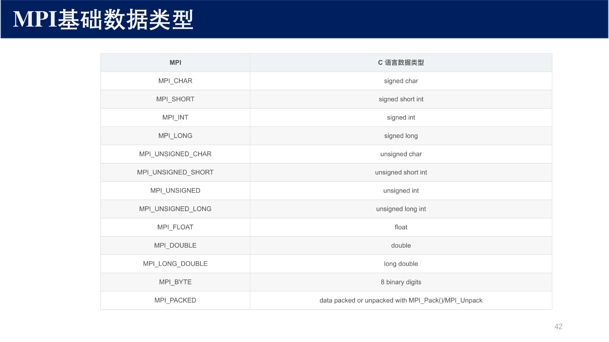{ width="800" }

| 概念 | 要点 |
|------|------|
| MPI 编程模型 | SPMD，通信子隔离，显式消息传递 |
| 阻塞通信 | `MPI_Send` / `MPI_Recv`，等待通信完成后返回 |
| 四种发送模式 | Standard / Synchronous / Buffered / Ready |
| 死锁 | 循环等待导致，可用 Sendrecv 或非阻塞通信解决 |
| 非阻塞通信 | `MPI_Isend` / `MPI_Irecv`，立即返回，显式检测完成 |
| 完成检测 | Wait 系列（阻塞等待）和 Test 系列（非阻塞测试） |

核心原则：

- 通信器的上下文保证了消息隔离
- 选择适当的通信模式平衡 **性能** 与 **安全性**
- 非阻塞通信 + 计算重叠是高性能 MPI 程序的关键技术
- 当点对点通信模式匹配集合通信时， **优先使用集合通信** （见下章）
