## 1 集合通信概述

!!! abstract "定义 1（集合通信）"
    集合通信（Collective Communication）是指通信子中**所有进程**都参与的通信操作。与点对点通信不同，集合通信涉及整个进程组，由 MPI 库进行全局优化。

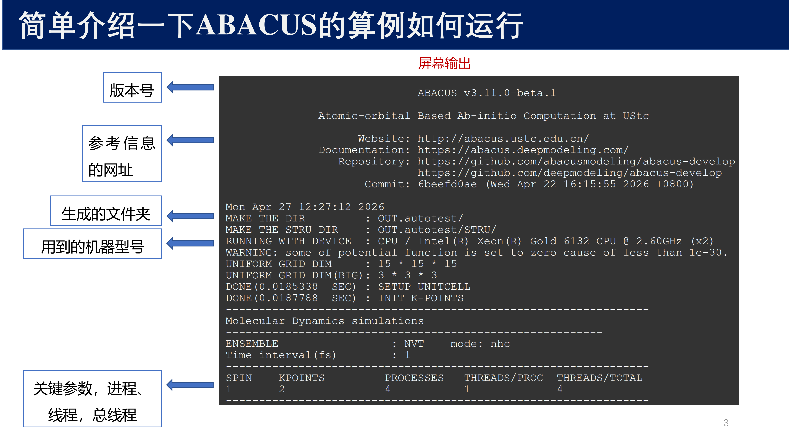{ width="800" }

集合通信的特点：

- 通信子内的**所有进程**必须同时调用同一个集合通信函数
- 参数必须**一致**（count、datatype 在所有进程中必须匹配）
- **不允许**使用通配符（`MPI_ANY_SOURCE`、`MPI_ANY_TAG`）
- 集合通信**没有 tag 参数**
- 消息大小必须**精确指定**，而不是最大上限

与点对点通信的对比：

| 特性 | 点对点通信 | 集合通信 |
|------|:---:|:---:|
| 参与进程 | 两个 | 通信子内全部 |
| 消息标签 | 有 tag | 无 tag |
| 通配符 | 支持 MPI_ANY_SOURCE | 不支持 |
| 优化空间 | 有限 | MPI 可对拓扑进行全局优化 |

!!! tip "优先使用集合通信"
    当通信模式可以用集合通信表达时，应该优先使用集合通信而不是手动用点对点通信实现。MPI 实现会对集合通信进行优化（如使用树形算法减少通信轮数）。

---

## 2 同步屏障 — MPI_Barrier

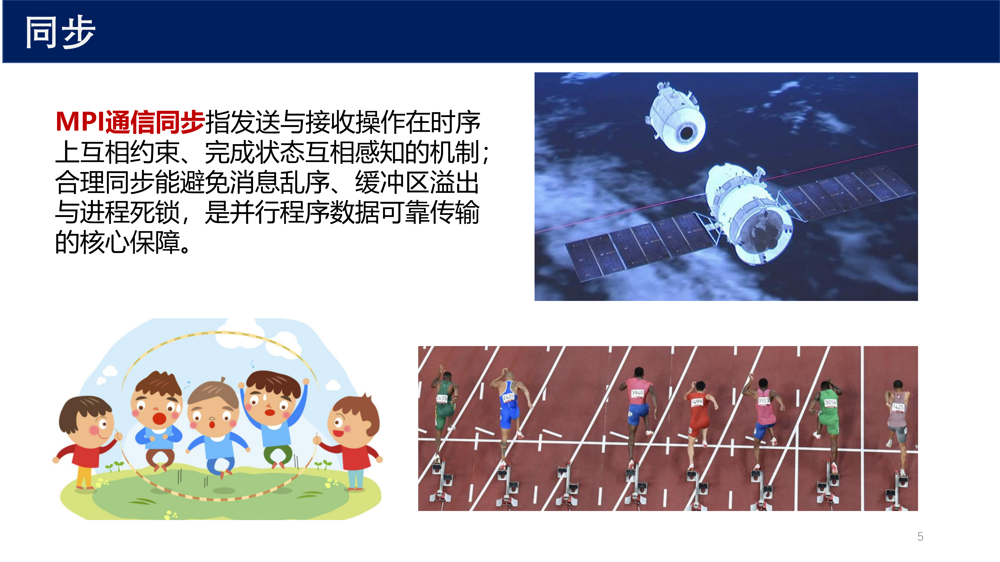{ width="800" }

!!! abstract "定义 2（MPI_Barrier）"
    `MPI_Barrier` 是一个全局同步操作。调用此函数的进程会被阻塞，直到通信子中**所有**进程都调用了此函数。

```c
int MPI_Barrier(MPI_Comm comm);
```

使用场景：

- 确保所有进程完成了某个阶段的计算再进入下一阶段
- 正确的时间测量（确保所有进程同时开始计时）
- 调试（在特定位置同步以确定性复现 bug）

!!! warning "性能警告"
    Barrier 是开销较大的操作，因为它要求全局同步。过度使用会严重影响并行性能。如果算法逻辑本身不需要同步，不要添加不必要的 Barrier。

---

## 3 广播 — MPI_Bcast

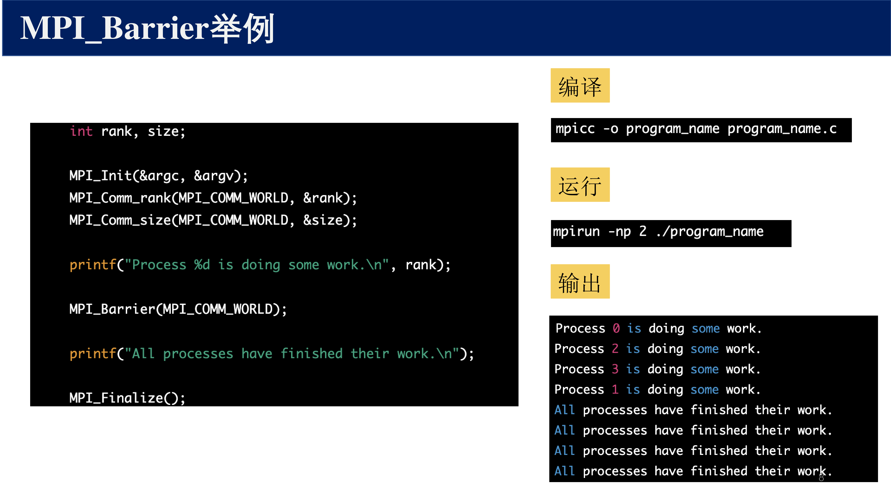{ width="800" }

!!! abstract "定义 3（MPI_Bcast）"
    广播操作将数据从 **root 进程** 复制到通信子中的所有其他进程。调用后，每个进程都拥有 data 的副本。

```c
int MPI_Bcast(
    void *buffer,        // 数据缓冲区（root 读，其他写）
    int count,           // 数据元素个数
    MPI_Datatype dtype,  // 数据类型
    int root,            // 根进程的 rank
    MPI_Comm comm        // 通信子
);
```

**通信模式**：

- 所有进程调用同一个 `MPI_Bcast`，指定相同的 `root`
- `root` 进程的 buffer 是**输入**（发送数据）
- 其他进程的 buffer 是**输出**（接收数据）

**实现优化**：

MPI 实现通常使用**树形广播算法**而不是 root 逐个发送：

- 第 1 步：root → 1 个进程
- 第 2 步：已有数据的 2 个进程 → 2 个新进程
- 第 $k$ 步：已有数据的 $2^{k-1}$ 个进程 → $2^{k-1}$ 个新进程

总步数为 $O(\log p)$，远好于线性的 $O(p)$。

---

## 4 散发 — MPI_Scatter

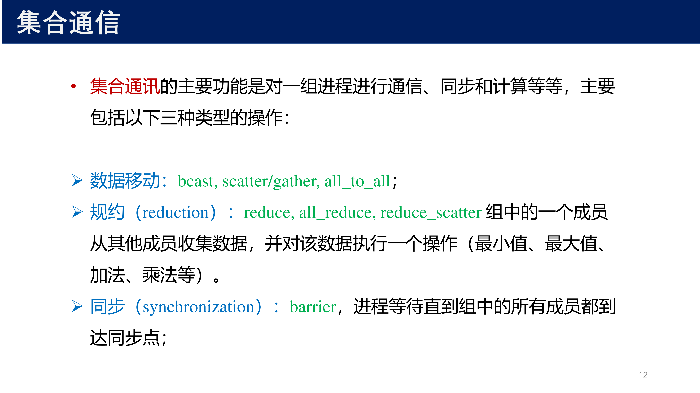{ width="800" }

!!! abstract "定义 4（MPI_Scatter）"
    散发操作将 root 进程中的一个大数组**均匀分配**到所有进程。

```c
int MPI_Scatter(
    const void *sendbuf,  // 发送缓冲区（仅在 root 有效）
    int sendcount,        // 发给每个进程的元素数
    MPI_Datatype sendtype,
    void *recvbuf,        // 接收缓冲区
    int recvcount,        // 接收的元素数
    MPI_Datatype recvtype,
    int root,             // 根进程
    MPI_Comm comm
);
```

**通信模式**：

- `sendcount` 是发送给**每个**进程的元素数（不是总数）
- root 的 sendbuf 长度 = `sendcount × p`
- 进程 $i$（包括 root 自己）收到原数组的第 $[i \cdot \text{sendcount}, (i+1) \cdot \text{sendcount})$ 块

---

## 5 收集 — MPI_Gather

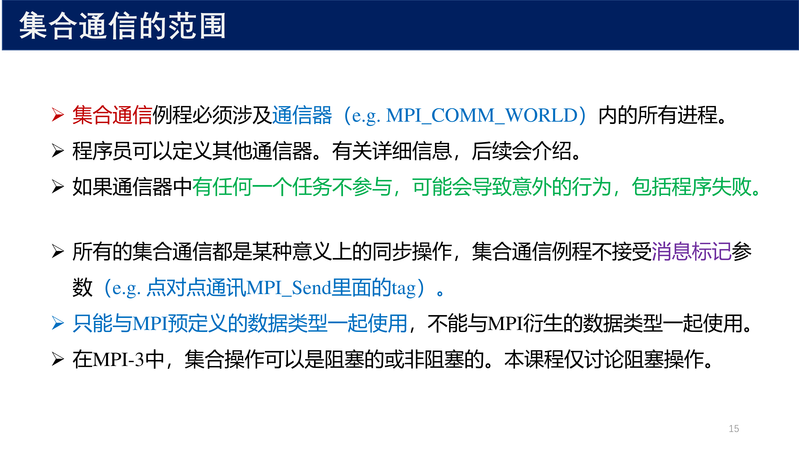{ width="800" }

!!! abstract "定义 5（MPI_Gather）"
    收集操作是 Scatter 的**逆操作**：将各进程的数据汇集到 root 进程。

```c
int MPI_Gather(
    const void *sendbuf,  // 各进程发送的数据
    int sendcount,        // 发送的元素数
    MPI_Datatype sendtype,
    void *recvbuf,        // 接收缓冲区（仅在 root 有效）
    int recvcount,        // 从每个进程接收的元素数
    MPI_Datatype recvtype,
    int root,             // 根进程
    MPI_Comm comm
);
```

**通信模式**：

- 每个进程贡献 `sendcount` 个元素
- root 按 rank 顺序收集：进程 0 的数据在最前面，进程 1 次之，以此类推
- 非 root 进程的 `recvbuf` 被忽略

**变体：MPI_Gatherv**

当各进程贡献的数据量**不同**时，使用变长收集：

```c
int MPI_Gatherv(
    const void *sendbuf, int sendcount, MPI_Datatype sendtype,
    void *recvbuf,
    const int *recvcounts,   // 数组：每个进程贡献的数量
    const int *displs,        // 数组：各数据块在接收缓冲区中的偏移
    MPI_Datatype recvtype,
    int root, MPI_Comm comm
);
```

---

## 6 全收集 — MPI_Allgather

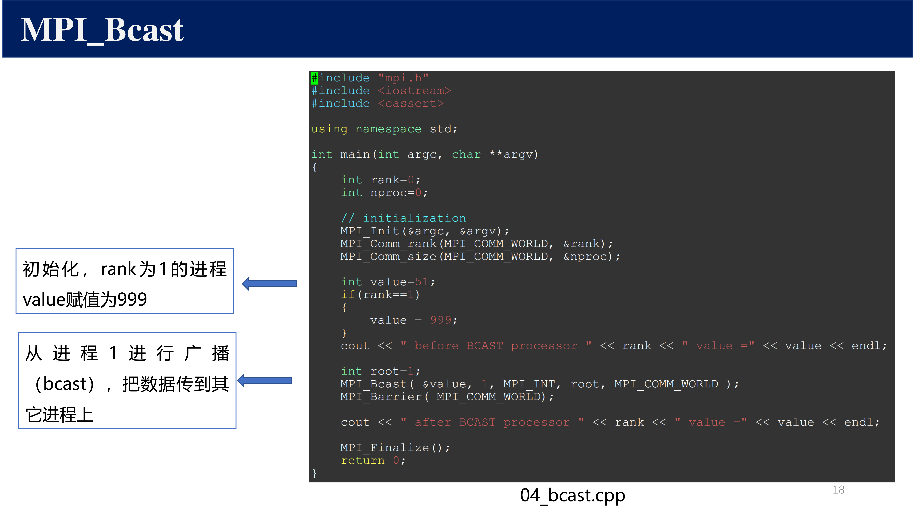{ width="800" }

!!! abstract "定义 6（MPI_Allgather）"
    全收集是 MPI_Gather + MPI_Bcast 的组合：**所有**进程都获得完整的收集结果。

```c
int MPI_Allgather(
    const void *sendbuf, int sendcount, MPI_Datatype sendtype,
    void *recvbuf, int recvcount, MPI_Datatype recvtype,
    MPI_Comm comm
);
```

与 `MPI_Gather` 的关键区别：

- **没有 root 参数**：所有进程都是接收方
- 每个进程的 `recvbuf` 都必须足够大（`p × recvcount` 个元素）
- 相当于每个进程执行了一次广播

---

## 7 全交换 — MPI_Alltoall

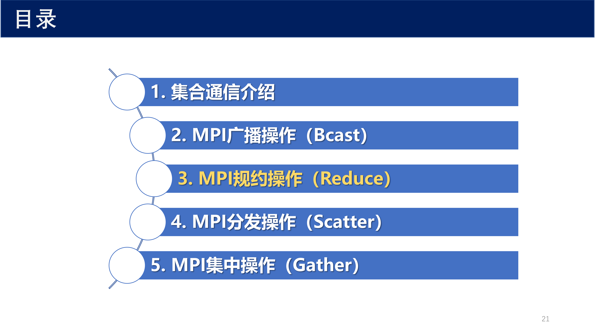{ width="800" }

!!! abstract "定义 7（MPI_Alltoall）"
    全交换操作：每个进程向**每个**其他进程发送不同的数据块。进程 $i$ 向进程 $j$ 发送 sendbuf 的第 $j$ 块，同时从进程 $j$ 接收数据放入 recvbuf 的第 $j$ 块。

```c
int MPI_Alltoall(
    const void *sendbuf, int sendcount, MPI_Datatype sendtype,
    void *recvbuf, int recvcount, MPI_Datatype recvtype,
    MPI_Comm comm
);
```

**典型应用**：

- 矩阵转置（将按行分布的数据转换为按列分布）
- FFT 中的数据重排
- 分布式排序中的数据交换

**变体：MPI_Alltoallv**

允许各进程发送/接收的数据块大小不同：

```c
int MPI_Alltoallv(
    const void *sendbuf, const int *sendcounts, const int *sdispls, MPI_Datatype sendtype,
    void *recvbuf, const int *recvcounts, const int *rdispls, MPI_Datatype recvtype,
    MPI_Comm comm
);
```

---

## 8 规约 — MPI_Reduce

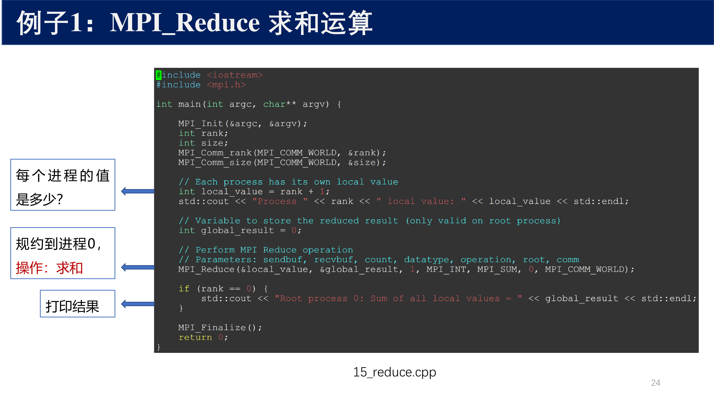{ width="800" }

!!! abstract "定义 8（MPI_Reduce）"
    规约操作将各进程中相同位置的数据元素通过指定的**结合运算**（如求和、求积、求最大值）合并，结果存储在 root 进程中。

```c
int MPI_Reduce(
    const void *sendbuf,  // 各进程的输入数据
    void *recvbuf,        // 结果（仅在 root 有效）
    int count,            // 元素个数
    MPI_Datatype dtype,
    MPI_Op op,            // 规约操作
    int root,
    MPI_Comm comm
);
```

**预定义规约操作**：

| 操作 | 含义 | 操作 | 含义 |
|------|------|------|------|
| `MPI_SUM` | 求和 | `MPI_MAX` | 最大值 |
| `MPI_PROD` | 求积 | `MPI_MIN` | 最小值 |
| `MPI_LAND` | 逻辑与 | `MPI_LOR` | 逻辑或 |
| `MPI_BAND` | 按位与 | `MPI_BOR` | 按位或 |
| `MPI_BXOR` | 按位异或 | `MPI_MAXLOC` | 最大值及其位置 |
| `MPI_MINLOC` | 最小值及其位置 | | |

!!! note "用户自定义规约操作"
    可以使用 `MPI_Op_create` 创建自定义的规约操作。自定义操作函数必须是**结合律**的，即 $f(f(a, b), c) = f(a, f(b, c))$，不要求交换律。

---

## 9 全规约 — MPI_Allreduce

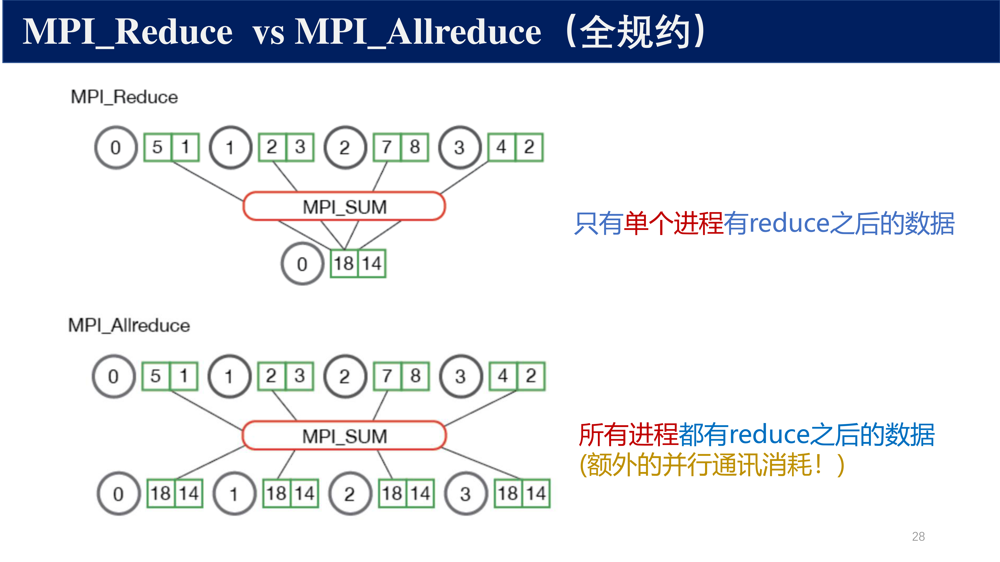{ width="800" }

!!! abstract "定义 9（MPI_Allreduce）"
    全规约是 MPI_Reduce + MPI_Bcast 的组合：**所有**进程都获得规约结果。

```c
int MPI_Allreduce(
    const void *sendbuf,
    void *recvbuf,
    int count,
    MPI_Datatype dtype,
    MPI_Op op,
    MPI_Comm comm
);
```

与 `MPI_Reduce` 的区别：

- 没有 root 参数：所有进程都接收结果
- 常用于需要全局一致性的场景（如计算全局误差、全局内积）

**实现优化**：

相比手动 `MPI_Reduce` + `MPI_Bcast`（共 $2 \log p$ 步），`MPI_Allreduce` 可以使用**蝶形交换**或**环形 Allreduce** 在 $\log p$ 步内完成。在大规模并行计算中这种优化效果显著。

---

## 10 扫描 — MPI_Scan

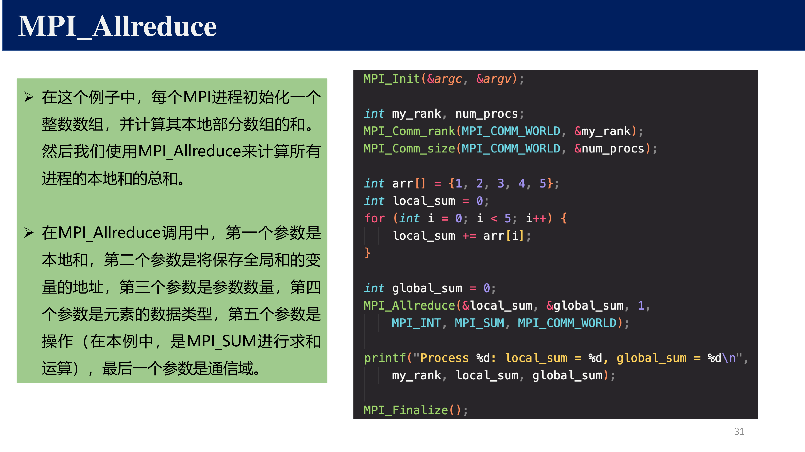{ width="800" }

!!! abstract "定义 10（MPI_Scan）"
    扫描（前缀规约）对 rank $0, 1, \ldots, i$ 的进程数据进行规约，结果存入进程 $i$。

```c
int MPI_Scan(
    const void *sendbuf,
    void *recvbuf,
    int count,
    MPI_Datatype dtype,
    MPI_Op op,
    MPI_Comm comm
);
```

**示例**（使用 MPI_SUM）：

| 进程 rank | sendbuf | recvbuf（Scan 结果） |
|:---:|:---:|:---:|
| 0 | $a_0$ | $a_0$ |
| 1 | $a_1$ | $a_0 + a_1$ |
| 2 | $a_2$ | $a_0 + a_1 + a_2$ |
| 3 | $a_3$ | $a_0 + a_1 + a_2 + a_3$ |

**变体：MPI_Exscan**

排他扫描（Exclusive Scan）：进程 $i$ 得到 $0, 1, \ldots, i-1$ 的规约结果。进程 0 的结果为未定义。

---

## 11 通信子管理

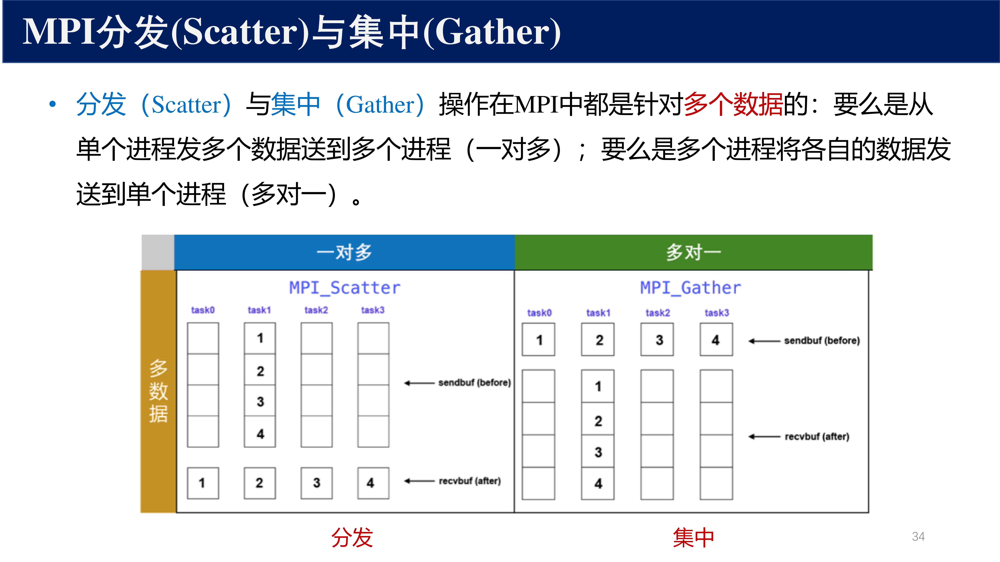{ width="800" }

### 11.1 创建新通信子

**MPI_Comm_dup**：复制通信子

```c
int MPI_Comm_dup(MPI_Comm comm, MPI_Comm *newcomm);
```

新的通信子拥有与原始通信子相同的进程组，但上下文不同。用于库函数隔离通信。

**MPI_Comm_split**：分裂通信子

```c
int MPI_Comm_split(
    MPI_Comm comm,       // 原始通信子
    int color,           // 分组标识（同 color 的进程分到同一子通信子）
    int key,             // 新通信子中的 rank 排序依据
    MPI_Comm *newcomm    // 输出的新通信子
);
```

- 相同 `color` 的进程被分到**同一个**新通信子
- `key` 决定新通信子中的 rank 顺序（小 key → 小 rank）
- `color = MPI_UNDEFINED` 表示该进程不参与任何新通信子

**典型用法**：创建按行/列划分的子通信子（用于矩阵计算）。

### 11.2 释放通信子

```c
int MPI_Comm_free(MPI_Comm *comm);
```

---

## 12 虚拟拓扑

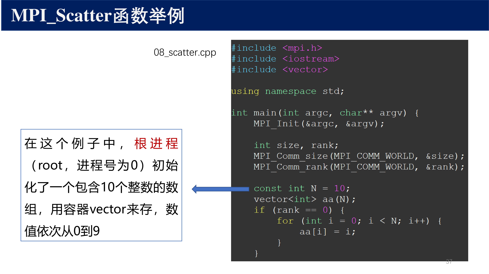{ width="800" }

### 12.1 笛卡尔拓扑

!!! abstract "定义 11（笛卡尔拓扑）"
    笛卡尔拓扑将进程映射到多维网格坐标上，方便表达近邻通信模式（如 PDE 求解中的 stencil 计算）。

```c
int MPI_Cart_create(
    MPI_Comm comm_old,   // 原始通信子
    int ndims,           // 维数
    const int *dims,     // 各维大小
    const int *periods,  // 各维是否周期性
    int reorder,         // 是否允许重排进程 rank
    MPI_Comm *comm_cart  // 输出的笛卡尔通信子
);
```

相关辅助函数：

- `MPI_Cart_rank` — 坐标 → rank
- `MPI_Cart_coords` — rank → 坐标
- `MPI_Cart_shift` — 获取某维上的邻居 rank

### 12.2 图拓扑

图拓扑允许定义**任意**的进程连接关系：

```c
int MPI_Graph_create(
    MPI_Comm comm_old,
    int nnodes, const int *index, const int *edges,
    int reorder, MPI_Comm *comm_graph
);
```

---

## 13 MPI I/O 基础

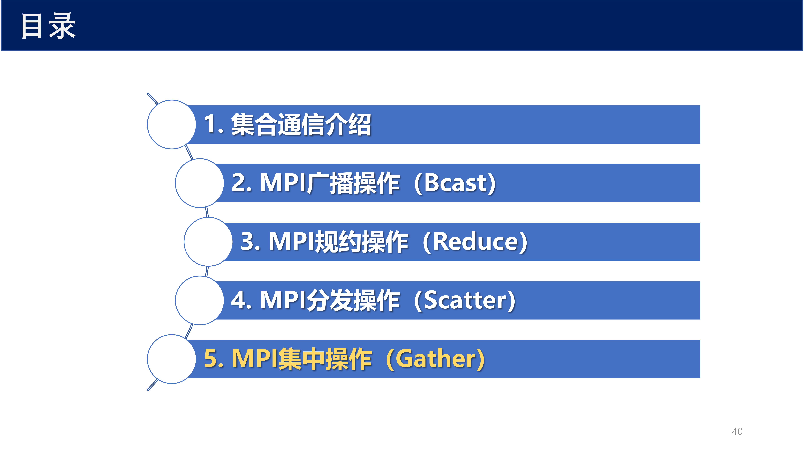{ width="800" }

MPI-2 引入了并行 I/O 支持，允许多个进程同时对同一个文件进行读写：

- **MPI_File_open** — 并行打开文件
- **MPI_File_read** / **MPI_File_write** — 独立读写
- **MPI_File_read_all** / **MPI_File_write_all** — 集合读写（所有进程参与）
- **MPI_File_set_view** — 设置文件视图（每个进程看到的文件部分）
- **MPI_File_close** — 关闭文件

并行 I/O 的优势：

- 多个进程可同时写入一个大文件的不同区域
- MPI 实现可优化为单次大 I/O（而非 $p$ 次小 I/O）
- 支持 stripe 分布以利用并行文件系统（如 Lustre）

---

## 14 总结

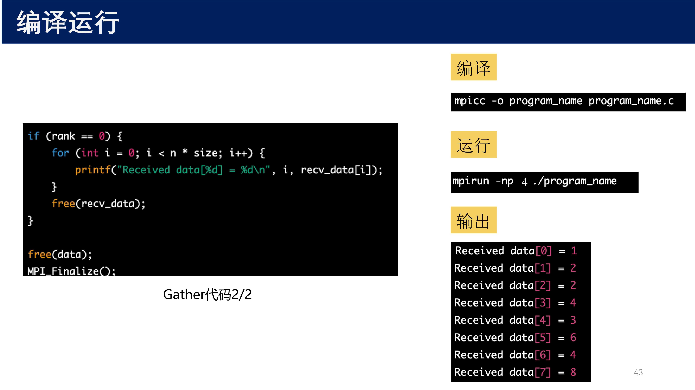{ width="800" }

| 操作 | 类型 | 数据流向 | 备注 |
|------|------|:---:|------|
| `MPI_Barrier` | 同步 | — | 全局同步点 |
| `MPI_Bcast` | 一对多 | root → all | 树形算法，$O(\log p)$ |
| `MPI_Scatter` | 一对多 | root → all（切分） | 均匀分配 |
| `MPI_Gather` | 多对一 | all → root | Scatter 的逆操作 |
| `MPI_Allgather` | 多对多 | all → all | Gather + Bcast |
| `MPI_Alltoall` | 多对多 | all ↔ all | 全交换 |
| `MPI_Reduce` | 多对一 | all → root | 带聚合运算 |
| `MPI_Allreduce` | 多对多 | all → all | Reduce + Bcast |
| `MPI_Scan` | 多对多 | 前缀 | rank $i$ 得 $0 \ldots i$ 规约 |
| 通信子管理 | — | — | Split / Dup |
| 虚拟拓扑 | — | — | 笛卡尔 / 图 |
| MPI I/O | — | — | 并行文件读写 |

核心原则：

- 集合通信比手写点对点模式更**简洁**、更**高效**（MPI 内部优化）
- 所有进程**必须**同时参与；参数必须一致
- `MPI_Allreduce` 是最常用的集合操作之一（全局求和非局部梯度）
- 通信子管理支持**模块化**和**分层**并行
- 虚拟拓扑让通信模式匹配问题几何结构
