## 1 回顾与引入

### 1.1 single 构造

!!! abstract "定义 1（single 构造）"
    **single 构造** 是线程组中 **仅由一个线程执行** 的共享工作构造。其他线程在构造结束时隐含的栅栏（barrier）处等待。该栅栏可以通过 `nowait` 子句来禁用。

C/C++ 和 Fortran 中的基本语法如下：

```cpp
// C/C++
#pragma omp single [nowait]
    structured block
```

```fortran
! Fortran
!$omp single
    structured block
!$omp end single [nowait]
```

single 构造对于需要在多个线程之间 **共享变量** 或执行 **特定初始化/收尾操作** 的代码块非常有用。使用 `#pragma omp single` 可以确保只有一个线程执行下面的代码块。

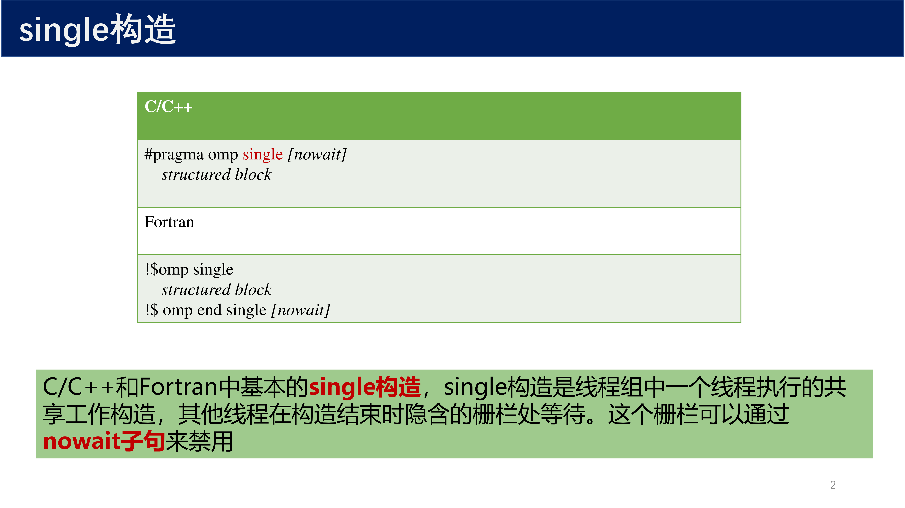{ width="800" }

#### 1.1.1 single 指令示例 1

以下示例展示了如何使用 single 指令打印线程数，然后并行计算数组元素的平方：

```cpp
#include <iostream>
#include <omp.h>

int main()
{
    int num_threads = 4;
    int array_size = 100;
    int array[array_size];

    #pragma omp parallel num_threads(num_threads)
    {
        #pragma omp single
        {
            std::cout << "Running with " << omp_get_num_threads()
                      << " threads." << std::endl;
        }

        #pragma omp for
        for(int i=0; i<array_size; i++)
        {
            array[i] = i * i;
        }
    }

    std::cout << "The array is: ";
    for(int i=0; i<array_size; i++)
        std::cout << array[i] << " ";
    std::cout << std::endl;

    return 0;
}
```

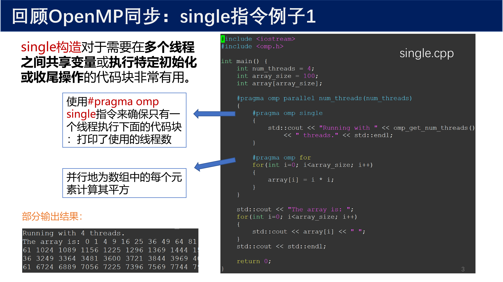{ width="800" }

#### 1.1.2 single 指令示例 2

以下示例展示了 single 指令与显式 barrier 的配合使用：

```cpp
#include <iostream>
#include <omp.h>

int main()
{
    int x = 0;

    #pragma omp parallel num_threads(3)
    {
        #pragma omp single
        {
            x = 1;
            std::cout << "Thread " << omp_get_thread_num()
                      << " sets x to " << x << std::endl;
        }

        #pragma omp barrier

        std::cout << "Thread " << omp_get_thread_num()
                  << " with x being " << x << std::endl;
    }

    return 0;
}
```

single 指令让第一个进入并行区域的线程执行了设置 x 为 1 的操作（x 是全局变量）。其他线程会在 barrier 指令处等待，直到所有线程都执行完 single 指令中的代码，所有线程都会输出 x 的值（x = 1）。

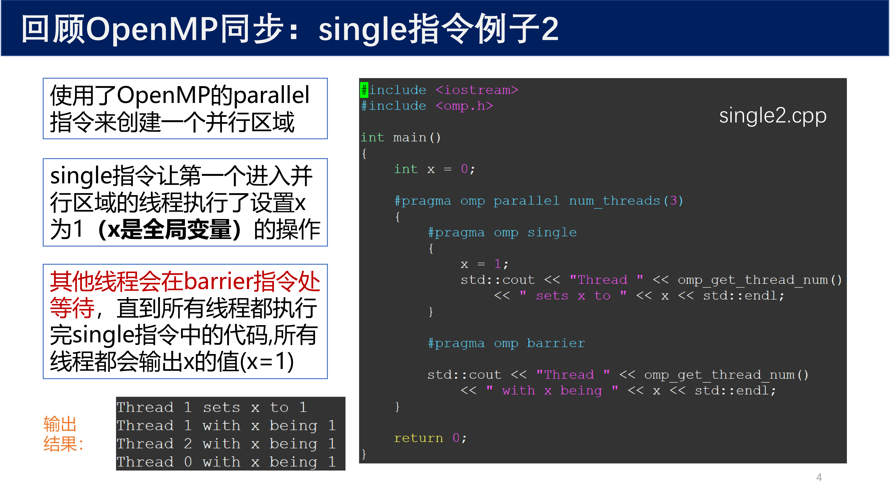{ width="800" }

### 1.2 循环处理方式与 if 子句

OpenMP 的 `parallel for` 指令可以与 `if` 子句结合使用，根据条件决定是否启动并行：

#### 1.2.1 方式 1：正常并行

```cpp
int sum=0;
int n=11;
#pragma omp parallel for firstprivate(n)
for(int i=0; i<n; ++i)
{
    #pragma omp critical
    {
        sum += i;
        cout << "id=" << omp_get_thread_num() << endl;
    }
}
cout << "sum=" << sum << endl;
```

将 n 拷贝到每个线程上，8 个线程并行，其中 0、1、2 三个线程运行两个迭代。

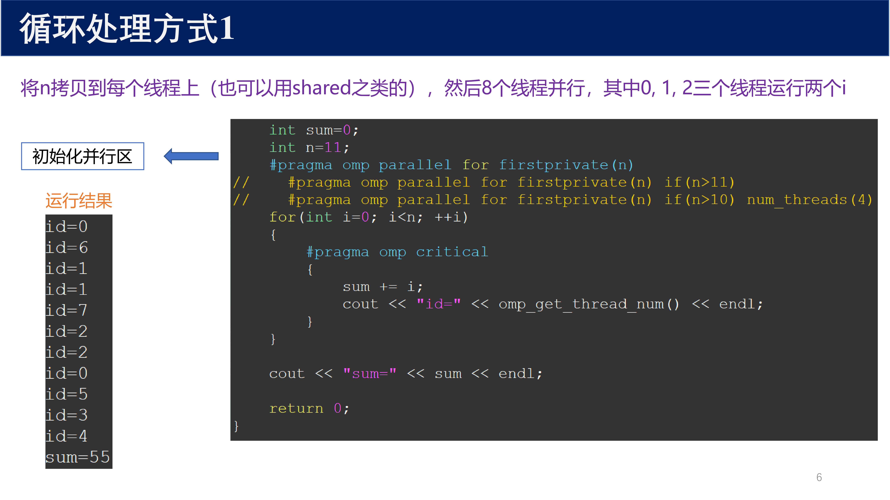{ width="800" }

#### 1.2.2 方式 2：条件不满足，不并行

```cpp
#pragma omp parallel for firstprivate(n) if(n>11)
```

将 n 拷贝到每个线程上，但是不满足 if 条件（n = 11，条件为 n > 11），不启动线程并行，只有一个线程做循环。

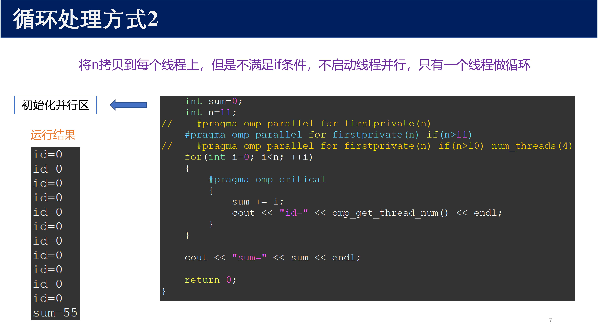{ width="800" }

#### 1.2.3 方式 3：条件满足，但限制线程数

```cpp
#pragma omp parallel for firstprivate(n) if(n>10) num_threads(4)
```

将 n 拷贝到每个线程上，满足 if 条件（n = 11 > 10），但使用 4 个线程而不是 8 个线程执行。

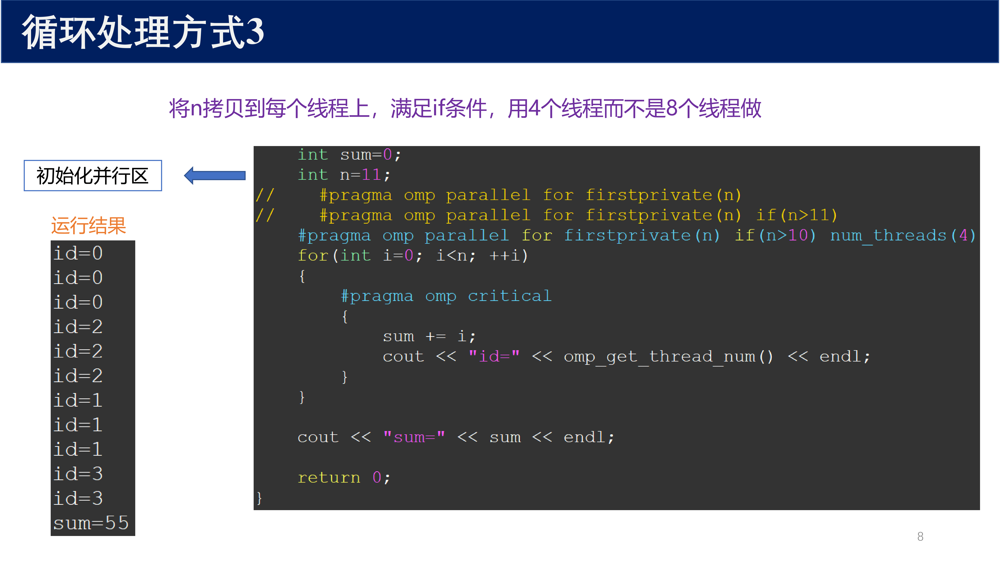{ width="800" }

---

## 2 不规则问题

### 2.1 循环级并行的局限

对于大多数 OpenMP 程序员来说，**循环级并行** 是 OpenMP 的精髓。典型的开发模式为：通过在串行程序中找到计算密集型的循环，并通过 **共享工作循环构造** 将其转化为并行应用程序。

要做好并行程序，核心工作是要使得 **并行程序负载平衡**。然而，另有一类重要问题是 **不规则问题**（例如稀疏数据结构问题），并不反映到循环上。一开始 OpenMP 忽略了不规则问题，从 **OpenMP 3.0（2008年5月）** 开始引入了 **task 构造**。

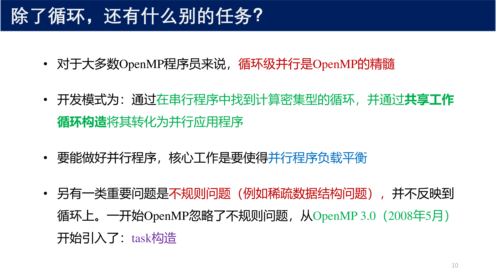{ width="800" }

### 2.2 链表——不规则问题的典型例子

!!! abstract "定义 2（链表）"
    **链表** 是一种数据结构，是数据在内存中存放和访问的一种方法。链表由 **一系列结点**（链表中每一个元素称为节点）组成，节点可以在运行时动态生成。每个结点包含两部分：一个是存储数据元素的 **数据域**（data），另一个是存储下一个节点地址的 **指针域**（next）。

```cpp
struct node
{
    datatype data;       // 数据域
    struct node *next;   // 指针域：指向 node 结点指针
};
```

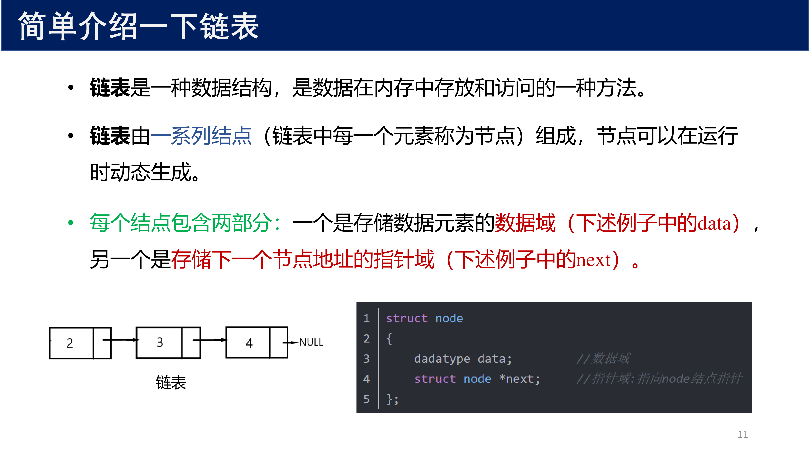{ width="800" }

### 2.3 链表遍历的并行化困难

不规则问题常见于 **控制流和依赖性不可预测的问题**。比如考虑一个带有 while 循环控制的程序，其操作是遍历链表：

```cpp
p = head;
while (p != NULL) {
    processwork(p);
    p = p->next;
}
```

串行链表程序遍历链表，假定任意节点的 `processwork(p)` 与其他结点无关。思考如何将这段程序进行并行化实现？**不能用共享工作循环构造**。

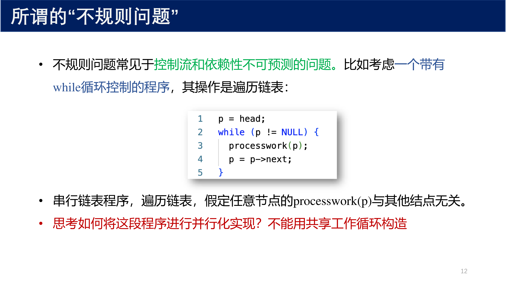{ width="800" }

在考虑这段程序并行化的时候，很难应用之前的 OpenMP 编程技巧，原因如下：

- 不可以应用共享循环工作构造，因为该构造只适合于带有 **循环增量** 和 **循环边界条件不变** 的 for 循环。
- 在迭代空间中没有解析表达式，这意味着在编译时 while 循环的长度是 **未知的**，不可转为 for 循环。
- 链表中的元素是 **依赖于数据的**，而且是 **动态的**。

{ width="800" }

### 2.4 简单的链表并行方法（三次遍历法）

考虑到问题的特殊性，可以提出如下的三步并行链表算法：

- **步骤 1**：遍历链表，统计列表中的项数。**分配一个足够大的数组来存放链表中节点的指针**。
- **步骤 2**：将每个节点的指针存放到数组中（第二次遍历所有节点）。
- **步骤 3**：用工作循环构造并行来处理节点（第三次遍历所有节点）。

!!! warning "三次遍历法的缺陷"
    由于需要遍历三次数据，这样的遍历链表算法增加了大量的额外开销。而且将一个简洁优雅的 while 循环变成了三个循环和一个额外的数组来保存列表中每个节点的指针，非常麻烦。

{ width="800" }

---

## 3 task 构造

### 3.1 OpenMP 任务的概念

有一个更好的方法来处理这类问题——**OpenMP 任务**。OpenMP 任务是 **独立于线程的工作单元**，通过 **task 子句** 来显式创建。任务是由 **两部分** 组成的独立工作单元：

- 任务相关联的结构化块中的代码，以及该结构化块中调用的外部函数。
- 任务相关联的数据环境。

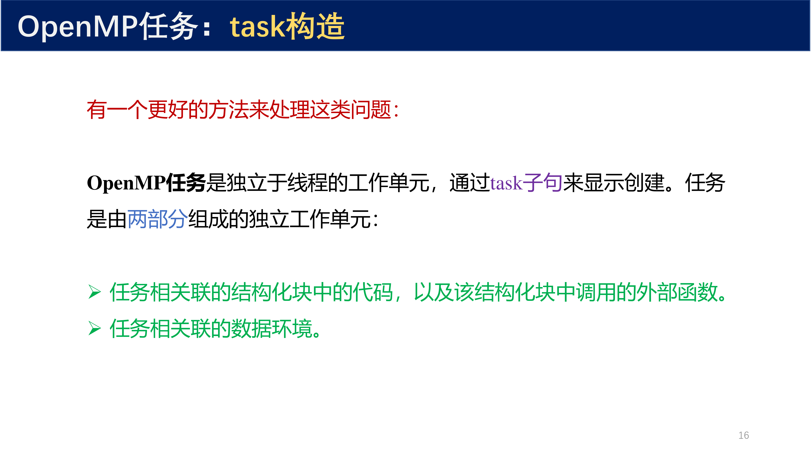{ width="800" }

以串行和并行方式执行任务。当以串行方式执行任务时，任务一个接一个执行；当以并行方式执行时，任务之间可以同时执行，总体完成时间会减少。

{ width="800" }

### 3.2 task 构造语法

!!! abstract "定义 3（task 构造）"
    **task 构造** 可以创建一个 **显式任务**。C/C++ 和 Fortran 中的基本语法如下：

```cpp
// C/C++
#pragma omp task [clause[,] clause]...
    structured block
```

```fortran
! Fortran
!$omp task [clause[,] clause]...
    structured block
!$omp end task [nowait]
```

可选子句同样包含了 `schedule`、`reduction` 以及 `nowait` 等等。

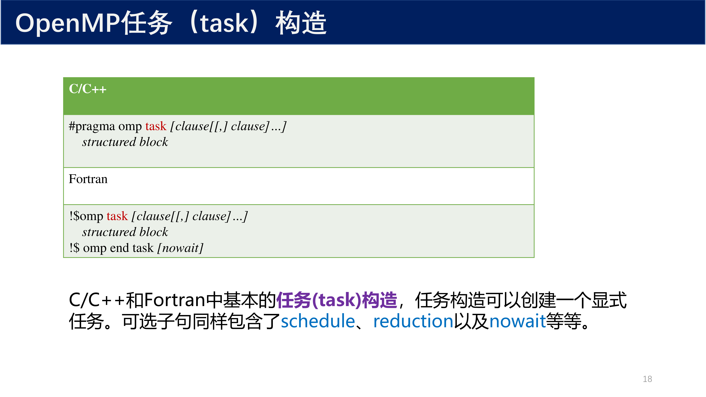{ width="800" }

### 3.3 taskwait 与任务依赖

任务之间可能存在依赖关系。通过 **`taskwait`** 来确保依赖关系成立。

考虑如下任务依赖图：任务 A 之后分出任务 B、C、D，其中任务 E 需要依赖 C 和 D 都算完，而任务 F 需要依赖任务 B 和任务 E 都算完，任务 G 需要依赖任务 A 和任务 F 都算完。

```cpp
#pragma omp parallel
{
    #pragma omp single
    {
        #pragma omp task A();
        #pragma omp task if (0)
        {
            #pragma omp task B();
            #pragma omp task if (0)
            {
                #pragma omp task C();
                D();
                #pragma omp taskwait
                E();
            }
        }
        #pragma omp taskwait
        F();
    }
    #pragma omp taskwait
    G();
}
```

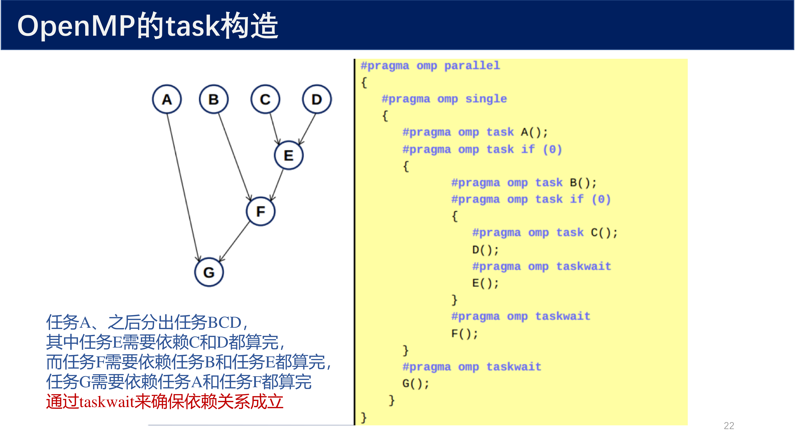{ width="800" }

### 3.4 基本任务实例

```cpp
#pragma omp parallel
{
    #pragma omp single
    {
        #pragma omp task
        fred();
        #pragma omp task
        daisy();
        #pragma omp task
        billy();
    } // end of single region
} // end of parallel region
```

!!! tip "任务并行的工作机制"
    任务（task）是不规则问题的理想选择，一个面向任务的系统被称为 **自动平衡负载**（自动、动态负载均衡）。在 Barrier 处等待的线程 **从任务队列中拉出一个任务**，执行完成，然后再回到队列中接受另一个任务。

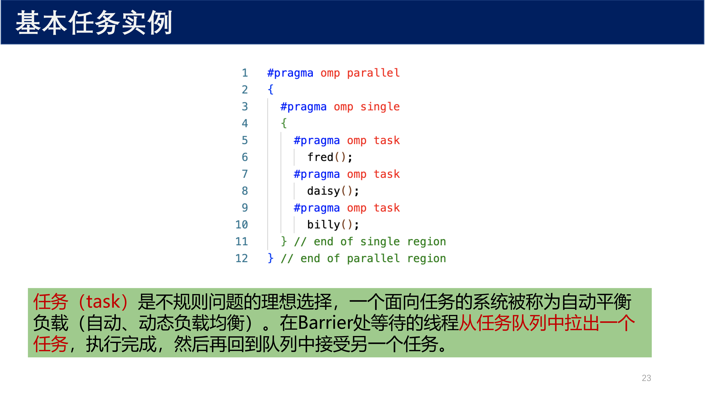{ width="800" }

---

## 4 举例

### 4.1 例 1：二叉树任务的并行

二叉树是一种典型的递归数据结构，非常适合用 task 进行并行化。

#### 4.1.1 二叉树节点定义与处理函数

```cpp
#include <iostream>
#include <omp.h>

// Binary tree node structure
struct Node {
    int val;
    Node* left;
    Node* right;
    Node(int v) : val(v), left(nullptr), right(nullptr) {}
};

// Recursively process a binary tree - THIS IS WHERE OPENMP TASKS SHINE!
// Parallel 'tasks' for() on OMP can handle recursive structures efficiently
void processTree(Node* root) {
    if (!root) return;

    // Simulate work on current node
    printf("Thread %d processing node: %d\n",
           omp_get_thread_num(), root->val);

    // --- openMP Task: Dynamically create a new task for left subtree ---
    // The thread that encounters this creates a task; any IDLE thread can execute it
    #pragma omp task
    processTree(root->left);

    // Create another task for right subtree
    #pragma omp task
    processTree(root->right);

    // Wait for All child tasks (left and right) to complete before exiting
    // Ensures we don't return prematurely
    #pragma omp taskwait
}
```

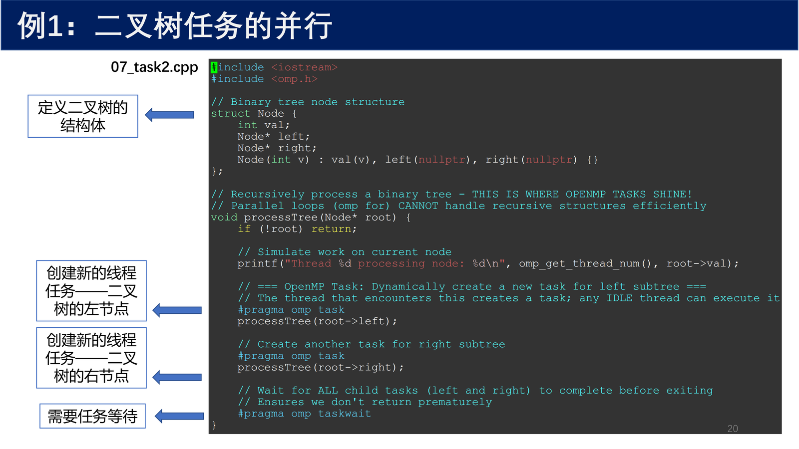{ width="800" }

#### 4.1.2 主函数与并行区域

```cpp
// Recursively delete all nodes in the tree to avoid memory leaks
void deleteTree(Node* root) {
    if (!root) return;
    // Post-order deletion: delete children first, then parent
    deleteTree(root->left);
    deleteTree(root->right);
    delete root;           // Free the current node
    root = nullptr;        // Avoid dangling pointer (good practice)
}

int main()
{
    const int nthreads = 4;
    omp_set_num_threads(nthreads);

    // Build a small test binary tree
    Node* root = new Node(1);
    root->left = new Node(2);
    root->right = new Node(3);
    root->left->left = new Node(4);
    root->left->right = new Node(5);

    // 1. Start the parallel region (creates a thread pool)
    #pragma omp parallel
    {
        // 2. Only one thread starts the recursion (avoid redundant work)
        // Other threads wait to steal and execute tasks
        #pragma omp single
        processTree(root);
    }

    deleteTree(root);

    return 0;
}
```

用 single 命令，只让 1 个线程去启动递归，防止所有线程同时重复执行。其他 3 个线程空闲等待，去 **抢任务执行**。

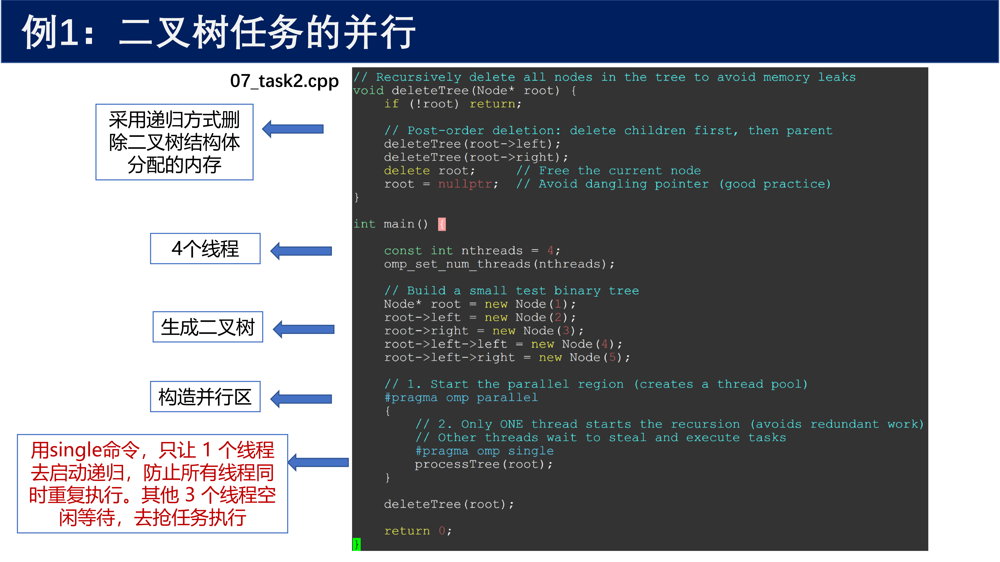{ width="800" }

### 4.2 例 2：计算 pi 的一种算法

#### 4.2.1 数学原理

数学上我们知道：

$$
\int_0^1 \frac{4.0}{1 + x^2} dx = \pi
$$

可以将积分近似为多个矩形面积的和：

$$
\sum_{i=0}^{N} F(x_i) \Delta x \approx \pi
$$

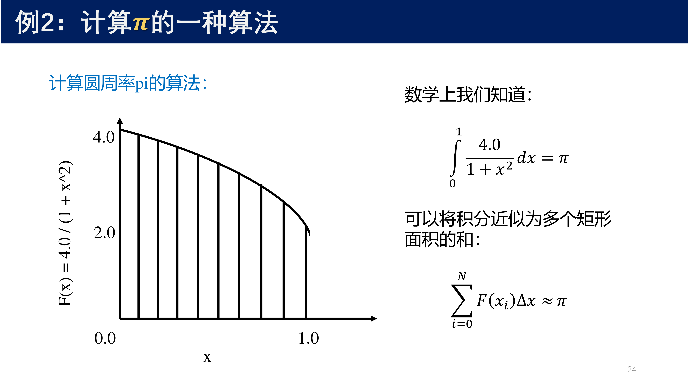{ width="800" }

#### 4.2.2 串行版代码

```cpp
#include <iostream>
#include <omp.h>

using namespace std;

double comp_pi(
    const int nstart,
    const int nfinish,
    const double step,
    const int min_blk)
{
    double x = 0.0;
    double sum = 0.0;

    if (nfinish - nstart < min_blk)
    {
        for (int i = nstart; i < nfinish; ++i)
        {
            x = (i + 0.5) * step;
            sum += 4.0 / (1.0 + x * x);
        }
    }
    else
    {
        int iblk = nfinish - nstart;
        double sum1 = comp_pi(nstart, nfinish - iblk / 2, step, min_blk);
        double sum2 = comp_pi(nfinish - iblk / 2, nfinish, step, min_blk);
        sum = sum1 + sum2;
    }
    return sum;
}
```

写一个串行函数，计算 pi。规定一个最小的计算量 `min_blk`（从 `nstart` 到 `nfinish` 的个数），小于这个计算量才直接计算。否则，就把计算 pi 的任务 **拆成两份**，这是一个 **递归** 的算法。默认进来的数是 $2^n$，`min_blk` 最小是 2。

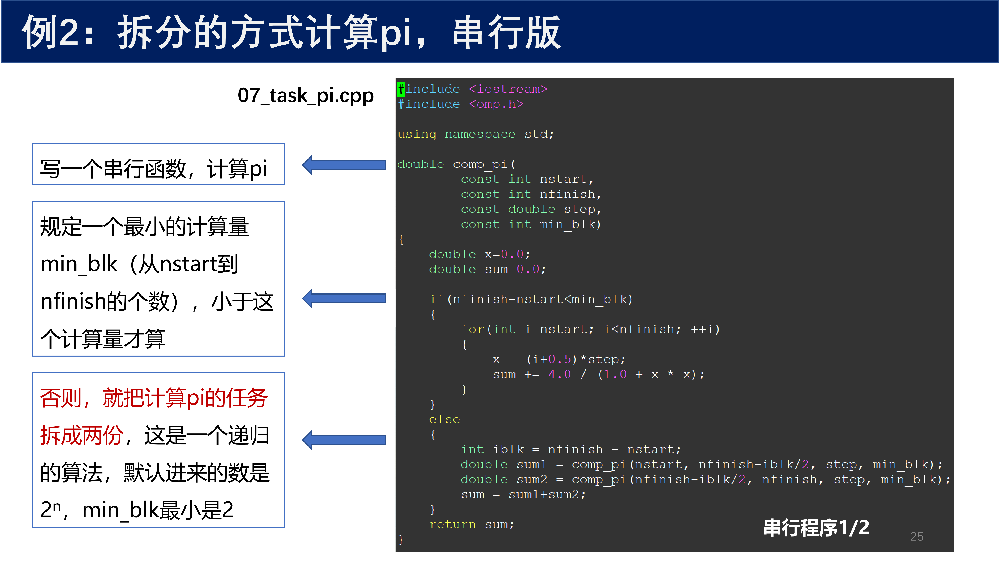{ width="800" }

```cpp
int main()
{
    const int nthreads = 4;
    omp_set_num_threads(nthreads);

    int n = 1024;
    int min_blk = 256;

    double step = 1.0 / (double) n;
    double sum = comp_pi(0, n, step, min_blk);
    double pi = step * sum;

    cout << "pi = " << pi << endl;

    return 0;
}
```

用四个线程来算。计算 n 的范围，只有小于 `min_blk` 的计算量才做 pi 的计算。

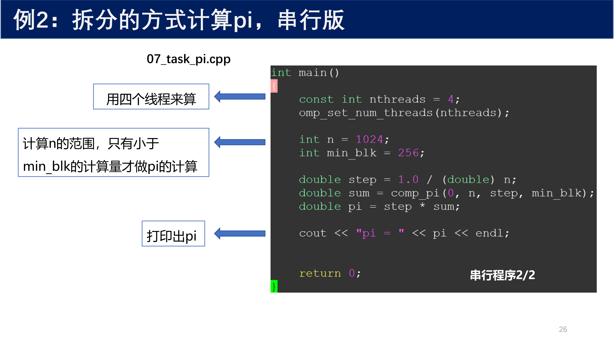{ width="800" }

#### 4.2.3 OpenMP task 并行版

```cpp
#include <iostream>
#include <omp.h>
#include <iomanip>

static int *ntask;

using namespace std;

double comp_pi(
    const int nstart,
    const int nfinish,
    const double step,
    const int min_blk)
{
    double x = 0.0;
    double sum = 0.0;

    if (nfinish - nstart < min_blk)
    {
        for (int i = nstart; i < nfinish; ++i)
        {
            x = (i + 0.5) * step;
            sum += 4.0 / (1.0 + x * x);
        }
    }
    else
    {
        int iblk = nfinish - nstart;
        double sum1 = 0.0;
        double sum2 = 0.0;

        #pragma omp task shared(sum1, ntask)
        {
            sum1 = comp_pi(nstart, nfinish - iblk / 2, step, min_blk);
            int id = omp_get_thread_num();
            #pragma omp critical
            {
                cout << "processor " << id << " do the first half ranging from "
                     << nstart << " to " << nfinish - iblk / 2 << endl;
            }
            ++ntask[id];
        }

        #pragma omp task shared(sum2, ntask)
        {
            sum2 = comp_pi(nfinish - iblk / 2, nfinish, step, min_blk);
            int id = omp_get_thread_num();
            #pragma omp critical
            {
                cout << "processor " << id << " do the second half ranging from "
                     << nfinish - iblk / 2 << " to " << nfinish << endl;
            }
            ++ntask[id];
        }

        #pragma omp taskwait
        sum = sum1 + sum2;
    }
    return sum;
}
```

拆分 pi 的计算程序，分成两部分。计算后将 id 输出出来，并记录到 `ntask` 数组对应位置上。等待上述 task 结束，才能进行求和操作。

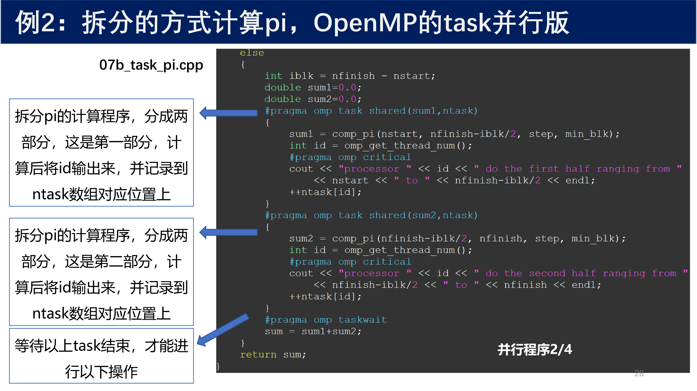{ width="800" }

```cpp
int main()
{
    const int nthreads = 4;
    omp_set_num_threads(nthreads);

    ntask = new int[nthreads]();

    // const int n = 1024*1024*256;
    const int n = 4;
    // const int min_blk = 256*1024;
    const int min_blk = 2;

    double step = 1.0 / (double) n;
    double sum = 0.0;

    #pragma omp parallel
    {
        #pragma omp single
        sum = comp_pi(0, n, step, min_blk);
    }

    double pi = step * sum;

    for (int i = 0; i < nthreads; ++i)
    {
        cout << " process " << i
             << " has " << ntask[i]
             << " tasks" << endl;
    }

    cout << setprecision(12) << "pi=" << pi << endl;

    delete[] ntask;

    return 0;
}
```

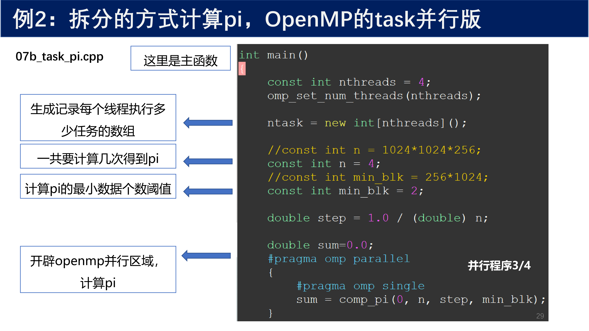{ width="800" }

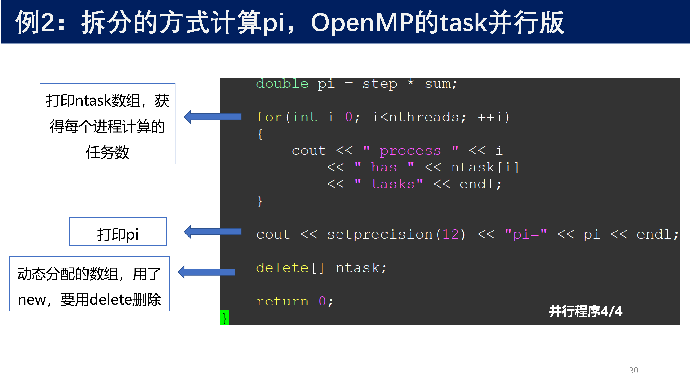{ width="800" }

编译与运行：

```bash
g++ -fopenmp 07b_task_pi.cpp
./a.out
```

4 个线程的程序运行结果示例：

```
processor 2 do the first half ranging from 0 to 1
processor 3 do the second half ranging from 1 to 2
processor 0 do the second half ranging from 3 to 4
processor 2 do the first half ranging from 0 to 2
processor 3 do the second half ranging from 2 to 4
process 0 has 2 tasks
process 1 has 0 tasks
process 2 has 2 tasks
process 3 has 2 tasks
single thread id:1
pi=3.14680051839
```

执行 single 的线程 id 为 1。

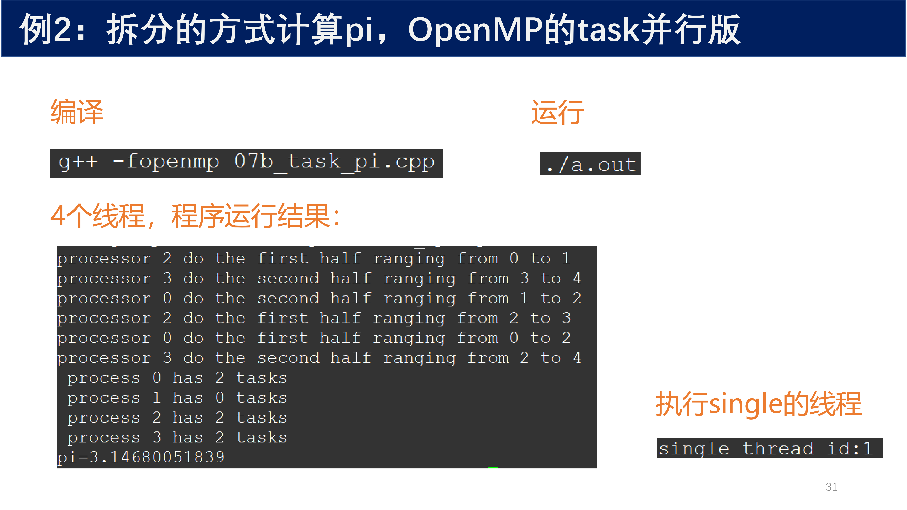{ width="800" }

---

## 5 任务（task）的数据环境

!!! info "task 数据环境的特点"
    任务（task）的 **数据环境** 与线程相比有如下几点的不同之处：

- 任务（task）的数据环境 **绑定的是任务**，而不是线程；
- 如果一个变量在 **任务构造** 上是 `shared`，那么在任务内部对该变量的引用指向同一个内存地址空间；
- 如果一个变量在 **任务构造** 上是 `private`，那么构造内部对它的引用是指向任务执行时新创建的 **未初始化** 存储空间；
- 如果一个变量在 **任务构造** 上是 `firstprivate`，那么构造内部对它的引用是指向任务执行时新创建的具有同名变量的存储空间，该空间使用构造时 firstprivate 变量进行 **初始化**。

{ width="800" }

---

## 6 补充：sections 构造

### 6.1 sections 与 section 指令

在 OpenMP 3.0 支持 **task（动态划分）** 之前，OpenMP 还支持 **sections 构造（静态划分）**。

!!! abstract "定义 4（sections 构造）"
    **sections 构造** 用于对 **非循环任务** 多线程并行执行（前提：已在并行区内）。每个 `section` 仅由一个线程执行，很类似于一个并行的 switch。

sections 构造支持的从句：

| 从句 | 说明 |
|------|------|
| `private(list)` | 私有变量列表 |
| `firstprivate(list)` | 带初始化的私有变量 |
| `lastprivate(list)` | 最后迭代值传递 |
| `reduction(operator: list)` | 归约操作 |
| `nowait` | 禁用隐式栅栏 |

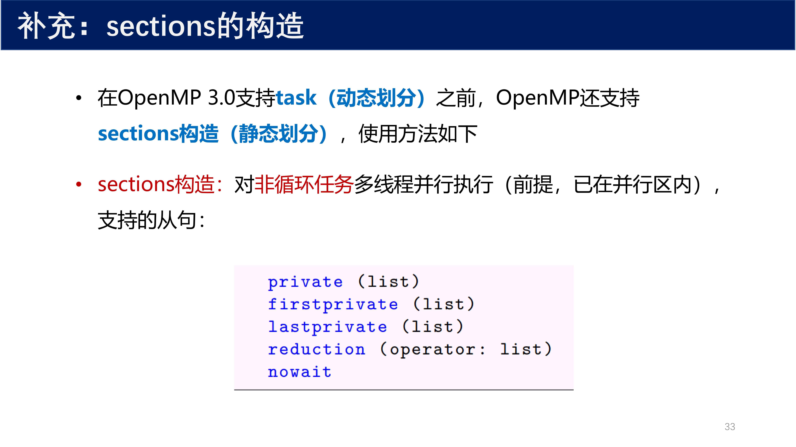{ width="800" }

### 6.2 sections 示例

```cpp
#include <iostream>
#include <omp.h>

int main()
{
    #pragma omp parallel sections
    {
        #pragma omp section
        {
            std::cout << "Hello from section 1" << std::endl;
        }
        #pragma omp section
        {
            std::cout << "Hello from section 2" << std::endl;
        }
        #pragma omp section
        {
            std::cout << "Hello from section 3" << std::endl;
        }
    }

    return 0;
}
```

使用了 `#pragma omp section` 指令来定义三个不同的 section。每个 section 中的代码将在不同的线程中并行执行。运行结果可能会因为线程调度而呈现乱序。

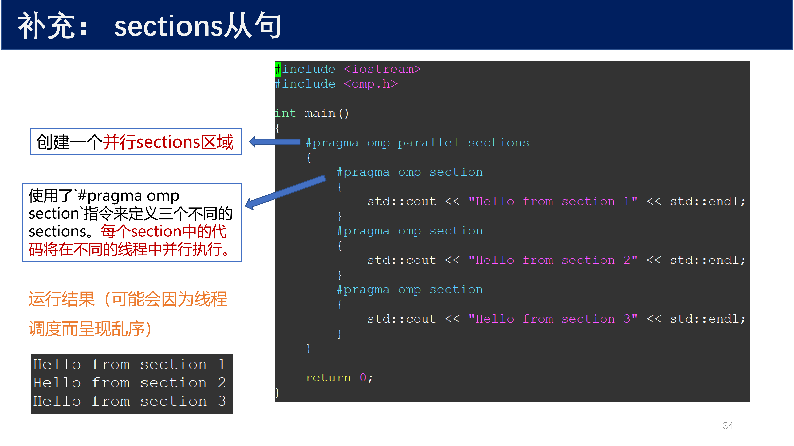{ width="800" }

---

## 7 总结

- **任务（task）** 是 OpenMP 3.0 添加的构造，用以定义可以 **异步执行** 的代码块，即任务（**动态划分**）。当 OpenMP 遇到 `#pragma omp task` 时，就会创建一个新的 task。主程序不会等待这个 task 结束就可以继续向下执行。task **可被任何线程抽取并执行**。自定义任务对于分解 **不规则的工作** 或 **递归算法** 特别有用。

- task 和 single 一起使用时，当代码进入 `single` 区域时，第一个到达的线程进入区域，而其他线程等待或跳过该区域。

- **section** 构造用于将工作在固定数量的线程之间划分（**静态划分任务**）。每个 `section` 仅由一个线程执行，很类似于一个并行的 switch。

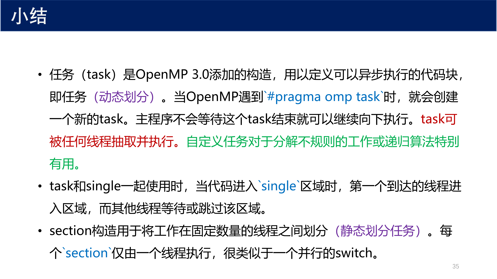{ width="800" }

---

## 8 核心概念对比表

| 特性 | single | sections | task |
|------|--------|----------|------|
| 执行方式 | 仅一个线程执行 | 多个 section 分配给不同线程 | 动态创建，任意线程可执行 |
| 划分方式 | — | 静态划分 | 动态划分 |
| 适用场景 | 初始化/收尾操作 | 固定数量的非循环任务 | 不规则问题、递归算法 |
| 线程数要求 | 与线程组一致 | 与线程组一致 | 独立于线程 |
| 负载均衡 | — | 需手动平衡 | 自动平衡 |
| 引入版本 | OpenMP 1.0 | OpenMP 1.0 | OpenMP 3.0 |
| 依赖控制 | barrier / nowait | barrier / nowait | taskwait |
