## 1 并发性与数据竞争

{ width="800" }

**并发性（concurrency）** 是 OpenMP 的基础。不同线程发出的指令是没有先后顺序的，就像蜜蜂筑巢一样分工明确、互不冲突。

然而，当并发线程要向共享内存中的同一地址读写时，就需要程序员来指定顺序，使之不发生冲突。否则就会引起 **数据竞争（data race）**。

!!! warning "数据竞争"
    数据竞争是指多个线程在没有适当同步的情况下，同时访问同一内存位置，且至少有一个线程执行写操作。数据竞争会导致不可预测的程序行为。

---

## 2 多核 CPU 的内存层次结构

### 2.1 现实世界的 CPU：内存是分层级的

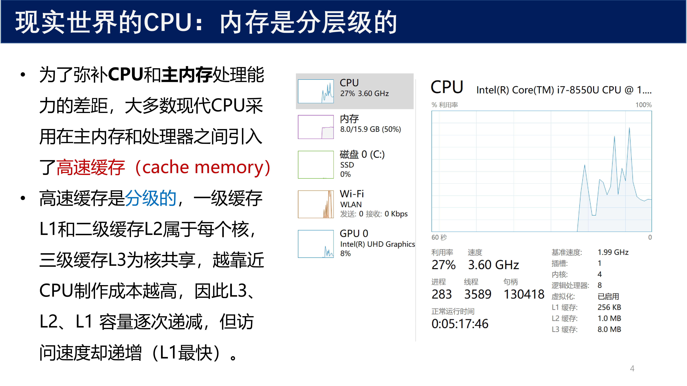{ width="800" }

为了弥补 CPU 和主内存处理能力的差距，大多数现代 CPU 采用在主内存和处理器之间引入 **高速缓存（cache memory）** 的设计。

高速缓存是分级的：

- **一级缓存 L1** 和 **二级缓存 L2** 属于每个核私有
- **三级缓存 L3** 为核共享
- 越靠近 CPU，制作成本越高，因此 L3、L2、L1 容量逐次递减，但访问速度却递增（L1 最快）

### 2.2 多核 CPU 的内存层次结构回顾

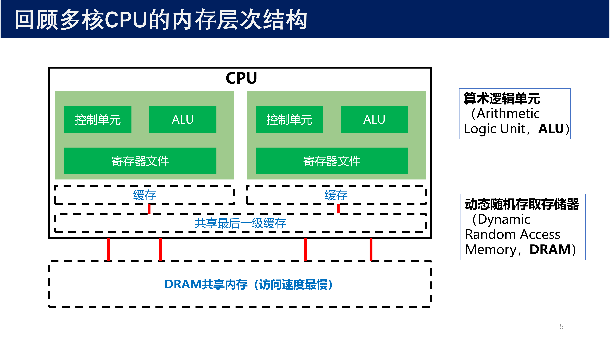{ width="800" }

上图展示了多核 CPU 的内存层次结构，从上到下依次为：

| 层级 | 归属 | 速度 | 容量 |
|:---:|:---:|:---:|:---:|
| 寄存器文件 | 每个核私有 | 最快 | 最小 |
| L1/L2 缓存 | 每个核私有 | 快 | 小 |
| L3 缓存（最后一级缓存） | 核共享 | 较快 | 中等 |
| DRAM 共享内存 | 全局共享 | 最慢 | 最大 |

由于缓存系统的引入，相同时刻同一变量在内存的不同缓存区可能具有不同的值。当这种情况存在时，我们称该系统具有一个 **宽松的内存一致性模型（relaxed memory consistency model）**，这会导致数据竞争。

---

## 3 伪共享（False Sharing）

### 3.1 什么是伪共享

{ width="800" }

!!! abstract "定义 1（伪共享 / False Sharing）"
    伪共享是指：缓存不能察觉除了本处理器以外的外部因素对内存内容的修改，导致本不应产生共享的变量因位于同一缓存行而被迫产生缓存一致性开销的现象。

伪共享的更直白意思是 **"其实不是共享"**。

**"共享"** 这个概念的意思是：如果多个处理器同时访问同一块内存区域，就叫做共享。多处理器共享的 **最小内存区域大小** 称为一个 **缓存行（Cache Line）**。

例如：两个处理器各自要访问一个变量，但这两个变量却存在同一个缓存行大小的内存里。

{ width="800" }

以上例子可以用吃巧克力的例子来比喻：缓存行就是一片巧克力，包含 A 和 B。两个人（Alice 和 Bob）分别要吃 A 和 B 巧克力，本来是不相干的两件事情，但因为 A 和 B 巧克力连在一起，所以产生了事实意义上的 "共享"。

### 3.2 伪共享的后果

{ width="800" }

产生了伪共享的事实之后，每次对缓存行的单个变量进行更新时（两个线程都有可能，Alice 和 Bob 都会吃同一片巧克力），都会将缓存行标记为 **无效**。

当处理器看到无效缓存行时，会 **强制从内存等位置再获得缓存行的最新副本**，虽然不取副本也无影响。

以上是基于缓存行保持缓存一致性的要求，但却增加了大量的开销，浪费了系统资源，是程序员不希望看到的。

### 3.3 伪共享代码示例

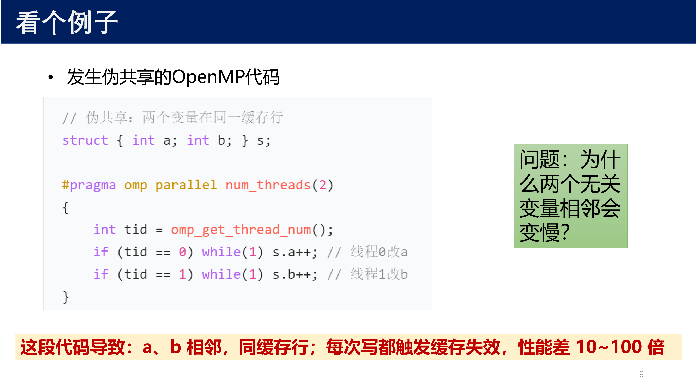{ width="800" }

```cpp
// 伪共享：两个变量在同一缓存行
struct { int a; int b; } s;

#pragma omp parallel num_threads(2)
{
    int tid = omp_get_thread_num();
    if (tid == 0) while(1) s.a++; // 线程0改a
    if (tid == 1) while(1) s.b++; // 线程1改b
}
```

这段代码导致：a、b 相邻，同缓存行；每次写都触发缓存失效，**性能差 10~100 倍**。

!!! warning "问题"
    为什么两个无关变量相邻会变慢？

    因为 `s.a` 和 `s.b` 位于同一个结构体中，在内存上相邻，很可能落在同一个缓存行（64 字节）内。线程 0 修改 `s.a` 时，会将整个缓存行标记为无效；线程 1 修改 `s.b` 时，又会将整个缓存行标记为无效。两个线程不断互相使对方的缓存失效，导致大量不必要的内存访问。

### 3.4 伪共享发生的两种场景

{ width="800" }

伪共享发生的两种场景如下：

**场景 1：多个处理器对同一共享变量进行读写操作。**

例如，处理器 A 将内存共享变量 $x = -10$ 读入自己的缓存，修改为 $30$。然后处理器 B 也将内存共享变量 $x = -10$ 读入自己的缓存，那么 B 看不到 A 的操作。多处理器为了防止这种情况出现，设计了控制协议保证内容一致，但却增加了开销。

**场景 2：不同处理器对同一数组的相邻元素或者对内存地址相邻的变量进行写操作。**

例如，多线程同时操作数组 `b[4]`，子线程 0 对 `b[0]` 进行写操作，子线程 1 对 `b[1]` 进行写操作，子线程 2 对 `b[2]` 进行写操作，子线程 3 对 `b[3]` 进行写操作。这些子线程不应该发生共享，但因为数据在同一个缓存行，被迫启动了控制协议。

### 3.5 解决伪共享的方案

{ width="800" }

要解决伪共享问题，可以采用如下方法：

1. **各处理器对共享变量只进行读操作，不进行写操作**
2. **变量内存对齐（`alignas(64)`、填充字节）**
3. **采用线程私有变量（尽量不共享无关变量）**
4. **不同处理器对数组进行写操作时，尽量使用不同处理器操作数组中相隔比较远的元素。** 对于同一个数组相隔较远的元素会分配到不同的缓存行中，这样不同处理器可以针对不同的缓存行进行写操作，从而避免了伪共享问题

### 3.6 伪共享代码对比示例

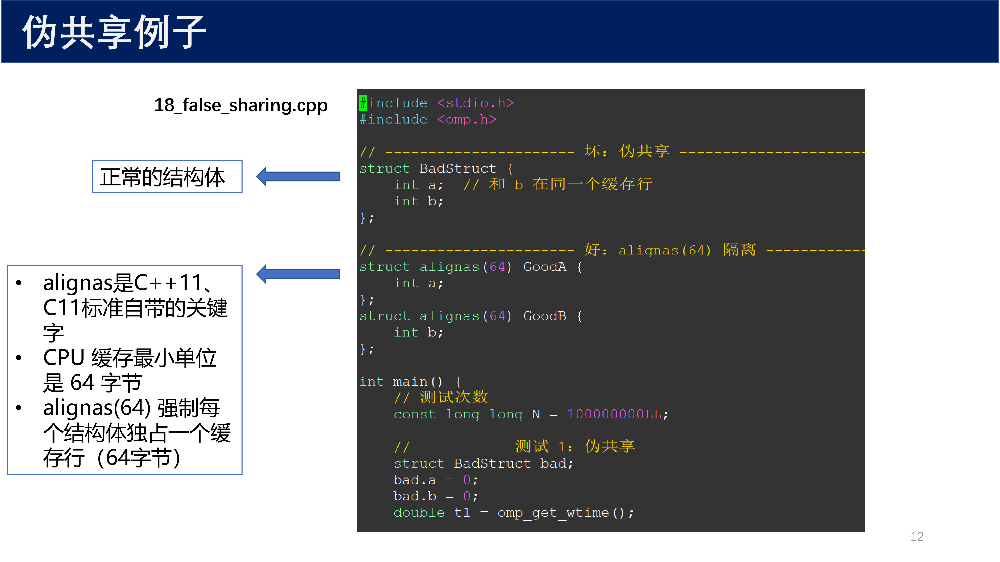{ width="800" }

```cpp
#include <stdio.h>
#include <omp.h>

// -------------------- 坏：伪共享 --------------------
struct BadStruct {
    int a;  // 和 b 在同一个缓存行
    int b;
};

// -------------------- 好：alignas(64) 隔离 --------------------
struct alignas(64) GoodA {
    int a;
};
struct alignas(64) GoodB {
    int b;
};

int main() {
    // 测试次数
    const long long N = 1000000001L;

    // ========== 测试 1：伪共享 ==========
    struct BadStruct bad;
    bad.a = 0;
    bad.b = 0;
    double t1 = omp_get_wtime();
    // ... 线程并行修改 bad.a 和 bad.b
    double t2 = omp_get_wtime();
    printf("伪共享耗时：%.2f 秒\n", t2 - t1);

    // ========== 测试 2：缓存行隔离 ==========
    struct GoodA good_a;
    struct GoodB good_b;
    good_a.a = 0;
    good_b.b = 0;
    double t3 = omp_get_wtime();
    // ... 线程并行修改 good_a.a 和 good_b.b
    double t4 = omp_get_wtime();
    printf("缓存行隔离耗时：%.2f 秒\n", t4 - t3);

    return 0;
}
```

- `alignas` 是 C++11、C11 标准自带的关键字
- CPU 缓存最小单位是 64 字节
- `alignas(64)` 强制每个结构体独占一个缓存行（64 字节）

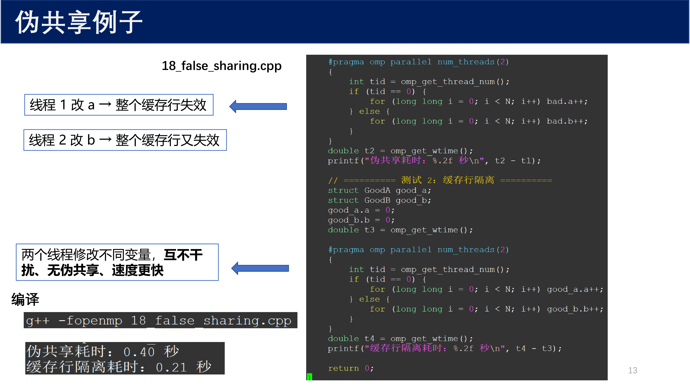{ width="800" }

```cpp
#pragma omp parallel num_threads(2)
{
    int tid = omp_get_thread_num();
    if (tid == 0) {
        for (long long i = 0; i < N; i++) bad.a++;
    } else {
        for (long long i = 0; i < N; i++) bad.b++;
    }
}
```

线程 1 改 `a` 导致整个缓存行失效，线程 2 改 `b` 又导致整个缓存行失效。而使用 `alignas(64)` 隔离后，两个线程修改不同变量，互不干扰、无伪共享、速度更快。

编译命令：

```bash
g++ -fopenmp 18_false_sharing.cpp
```

运行结果示例：

| 版本 | 耗时 |
|:---:|:---:|
| 伪共享 | 0.40 秒 |
| 缓存行隔离 | 0.21 秒 |

---

## 4 宽松的内存一致性模型

### 4.1 为什么需要宽松的内存一致性模型

{ width="800" }

如果不用宽松的内存一致性模型，另一种选择是让变量在整个内存层次中始终保持一致。这会带来以下问题：

- 需要 **强制排序共享变量的更新**，并同步内存各层的副本
- 带来并行程序的 **巨大管理开销**
- 多处理器采用 **宽松内存一致性模型**，编程模型须适配这一硬件现实
- 编程语言定义 **"内存模型"** 规则，定义读取共享变量时可加载值

### 4.2 多核 CPU 的内存一致性

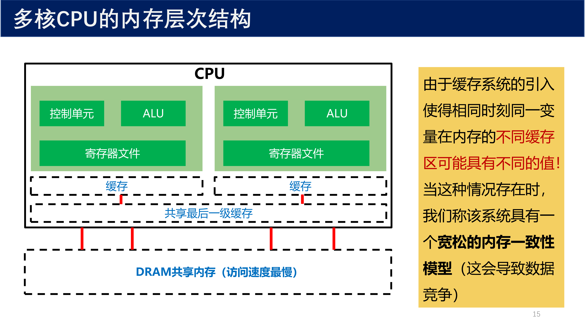{ width="800" }

由于缓存系统的引入，相同时刻同一变量在内存的不同缓存区可能具有不同的值。当这种情况存在时，我们称该系统具有一个 **宽松的内存一致性模型（relaxed memory consistency model）**，这会导致数据竞争。

---

## 5 OpenMP 通用核心的内存模型

### 5.1 内存模型的组成

{ width="800" }

内存模型定义了一系列必须遵循的规则，这样就可以安全地混合多个线程的共享变量的读写操作。通常内存模型由三部分组成：

1. **限制编译器针对共享变量的读/写操作的指令**，确保多线程访问共享变量是安全的（例如 `atomic`）
2. **对在两个或多个线程之间执行的指令的排序约束**（例如 `ordered`、`single`）
3. **使线程的共享变量（如缓存中的值）的临时副本与内存中的值保持一致的方法**（`flush` 指令）

### 5.2 flush 方法

{ width="800" }

OpenMP 最初的内存模型使用了一个叫做 `flush` 的操作定义。该操作 **强制线程变量的临时视图与内存中的变量值保持一致**。在 OpenMP 通用核心中，以下几点都隐含了 `flush` 操作：

- 一个线程组被 `parallel` 构造分叉时
- 一个 **临界区构造** 被线程进入时或退出时
- 进入或退出 **任务区域** 时
- 退出 **显式 Barrier** 时
- 退出 **隐式 Barrier** 时

### 5.3 什么是 OpenMP 的 flush 指令

{ width="800" }

`flush` 指令用于确保多个线程之间的数据同步。使用 `flush` 前，若线程修改了某共享变量值，其他线程可能无法立即看到，因为不同线程可能使用了不同缓存，而缓存同步需要时间。

使用 `flush` 指令可 **强制将缓存中的数据写回到内存中**，让其它线程能看到修改后的值。

`flush` 指令是 **每个线程的单独操作**，对于发起 `flush` 的线程，其变量值与共享内存保持一致。共享变量值所涉及的所有线程都必须发起自己的 `flush` 操作。

### 5.4 flush 指令代码示例

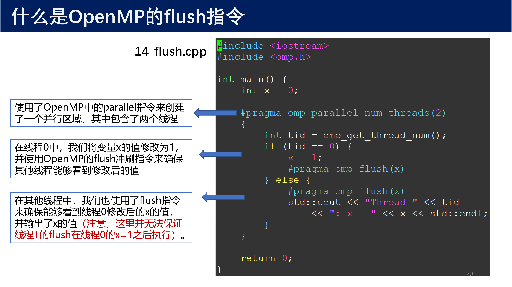{ width="800" }

```cpp
#include <iostream>
#include <omp.h>

int main() {
    int x = 0;

    #pragma omp parallel num_threads(2)
    {
        int tid = omp_get_thread_num();
        if (tid == 0) {
            x = 1;
            #pragma omp flush(x)
        } else {
            #pragma omp flush(x)
            std::cout << "Thread " << tid
                      << ": x = " << x << std::endl;
        }
    }

    return 0;
}
```

代码说明：

- 使用了 OpenMP 中的 `parallel` 指令来创建了一个并行区域，其中包含了两个线程
- 在线程 0 中，将变量 `x` 的值修改为 1，并使用 OpenMP 的 `flush` 冲刷指令来确保其他线程能够看到修改后的值
- 在其他线程中，也使用了 `flush` 指令来确保能够看到线程 0 修改后的 `x` 的值，并输出了 `x` 的值

!!! warning "注意"
    这里并 **无法保证** 线程 1 的 `flush` 在线程 0 的 `x = 1` 之后执行。`flush` 本身不提供线程间的顺序保证，需要配合同步原语使用。

### 5.5 再谈 flush 操作

{ width="800" }

关于 `flush` 操作，有以下几点重要理解：

- `flush` **不是同步操作**，同步操作定义了两个或多个线程之间的顺序约束
- `flush` **只影响单个线程的内存操作**，而不涉及其它线程的操作。但 `flush` 是同步的一个重要方面
- 需要 `flush` 和 **同步操作结合**，才能安全地混合对共享内存中的重叠范围值的读写操作
- 高级程序员会小心翼翼的在同步操作之外布设 `flush` 操作，才能减小开销。但做好这件事情非常困难。因此，**通用核心里面并没有 `flush`**，`flush` 被隐含在许多隐藏的地方，例如进入和退出任务区域

---

## 6 MPI-OpenMP 混合编程

### 6.1 混合编程概述

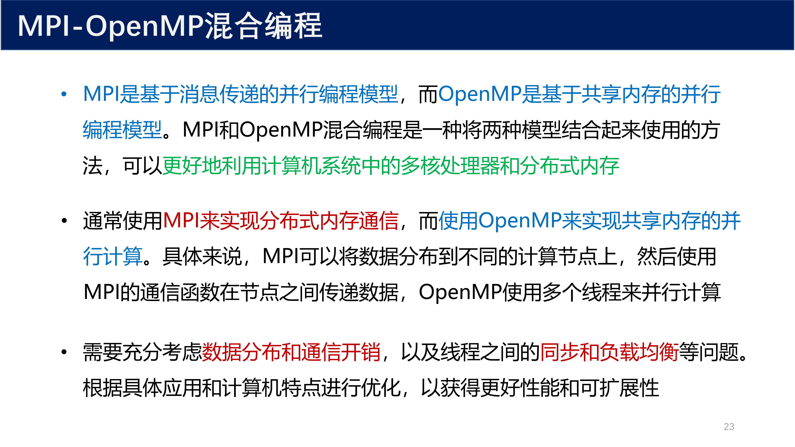{ width="800" }

MPI 是基于 **消息传递** 的并行编程模型，而 OpenMP 是基于 **共享内存** 的并行编程模型。MPI 和 OpenMP 混合编程是一种将两种模型结合起来使用的方法，可以更好地利用计算机系统中的多核处理器和分布式内存。

通常使用 **MPI 来实现分布式内存通信**，而使用 **OpenMP 来实现共享内存的并行计算**。具体来说，MPI 可以将数据分布到不同的计算节点上，然后使用 MPI 的通信函数在节点之间传递数据，OpenMP 使用多个线程来并行计算。

需要充分考虑 **数据分布和通信开销**，以及线程之间的 **同步和负载均衡** 等问题。根据具体应用和计算机特点进行优化，以获得更好性能和可扩展性。

### 6.2 混合编程示例：初始化数组

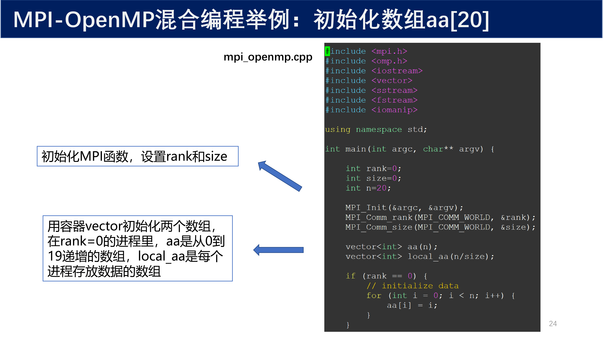{ width="800" }

```cpp
#include <mpi.h>
#include <omp.h>
#include <vector>
#include <iostream>
#include <fstream>
#include <iomanip>

using namespace std;

int main(int argc, char** argv) {
    int rank = 0;
    int size = 0;
    int n = 20;

    MPI_Init(&argc, &argv);
    MPI_Comm_rank(MPI_COMM_WORLD, &rank);
    MPI_Comm_size(MPI_COMM_WORLD, &size);

    vector<int> aa(n);
    vector<int> local_aa(n / size);

    if (rank == 0) {
        // initialize data
        for (int i = 0; i < n; i++) {
            aa[i] = i;
        }
    }
    // ...
}
```

- 初始化 MPI 函数，设置 `rank` 和 `size`
- 用容器 `vector` 初始化两个数组，在 `rank = 0` 的进程里，`aa` 是从 0 到 19 递增的数组，`local_aa` 是每个进程存放数据的数组

### 6.3 混合编程示例：数据分发与并行计算

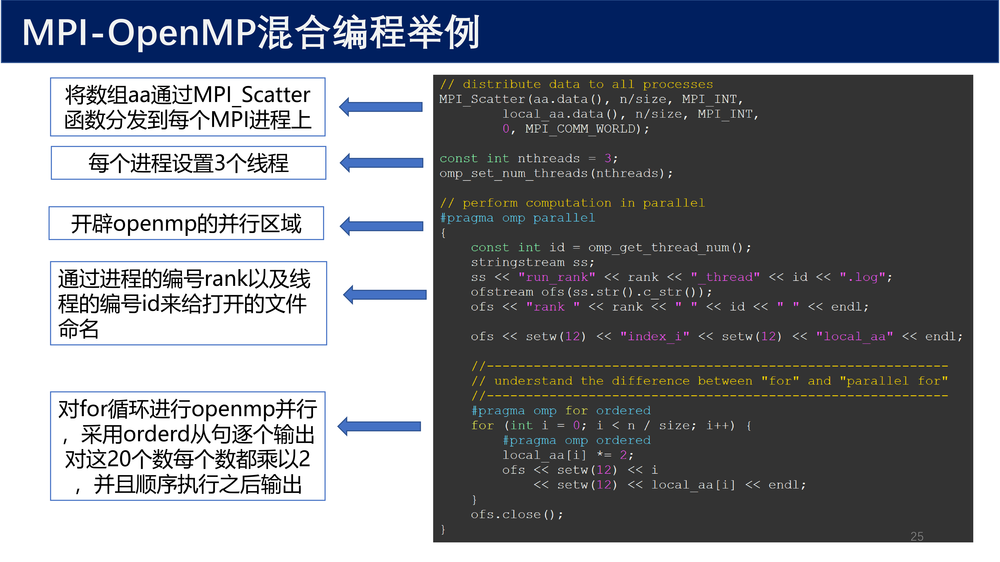{ width="800" }

```cpp
// distribute data to all processes
MPI_Scatter(aa.data(), n / size, MPI_INT,
            local_aa.data(), n / size, MPI_INT,
            0, MPI_COMM_WORLD);

const int nthreads = 3;
omp_set_num_threads(nthreads);

// perform computation in parallel
#pragma omp parallel
{
    const int id = omp_get_thread_num();
    stringstream ss;
    ss << "run_rank" << rank << "_thread" << id << ".log";
    ofstream ofs(ss.str().c_str());
    ofs << setw(4) << "index_i" << setw(12) << "local_aa" << endl;

    // understand the difference between "for" and "parallel for"
    #pragma omp for ordered
    for (int i = 0; i < n / size; i++) {
        #pragma omp ordered
        local_aa[i] *= 2;
        ofs << setw(4) << i << setw(12) << local_aa[i] << endl;
    }
    ofs.close();
}
```

代码说明：

- 将数组 `aa` 通过 `MPI_Scatter` 函数分发到每个 MPI 进程上
- 每个进程设置 3 个线程
- 开辟 OpenMP 的并行区域
- 通过进程的编号 `rank` 以及线程的编号 `id` 来给打开的文件命名
- 对 `for` 循环进行 OpenMP 并行，采用 `ordered` 从句逐个输出
- 对这 20 个数每个数都乘以 2，并且顺序执行之后输出

### 6.4 混合编程示例：收集数据

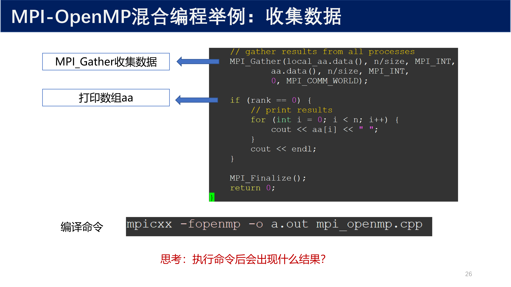{ width="800" }

```cpp
// gather results from all processes
MPI_Gather(local_aa.data(), n / size, MPI_INT,
           aa.data(), n / size, MPI_INT,
           0, MPI_COMM_WORLD);

if (rank == 0) {
    // print results
    for (int i = 0; i < n; i++) {
        cout << aa[i] << " ";
    }
    cout << endl;
}

MPI_Finalize();
return 0;
```

- `MPI_Gather` 收集数据
- 打印数组 `aa`

编译命令：

```bash
mpicxx -fopenmp -o a.out mpi_openmp.cpp
```

### 6.5 混合编程示例：结果展示

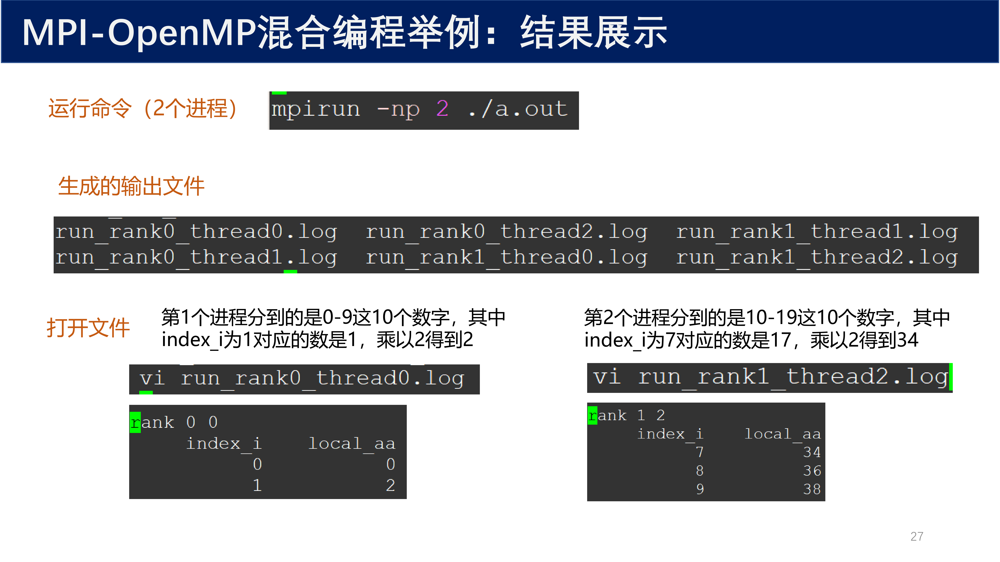{ width="800" }

运行命令（2 个进程）：

```bash
mpirun -np 2 ./a.out
```

生成的输出文件：

```
run_rank0_thread0.log  run_rank1_thread1.log
run_rank0_thread1.log  run_rank1_thread2.log
run_rank0_thread2.log  run_rank1_thread0.log
```

第 1 个进程（`rank 0`）分到的是 0~9 这 10 个数字，其中 `index_i` 为 1 对应的数是 1，乘以 2 得到 2。

第 2 个进程（`rank 1`）分到的是 10~19 这 10 个数字，其中 `index_i` 为 7 对应的数是 17，乘以 2 得到 34。

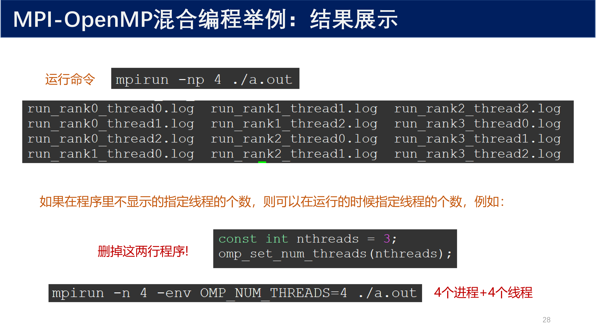{ width="800" }

运行命令（4 个进程）：

```bash
mpirun -np 4 ./a.out
```

如果在程序里不显示地指定线程的个数，则可以在运行的时候指定线程的个数。例如，删掉下面这两行程序：

```cpp
const int nthreads = 3;
omp_set_num_threads(nthreads);
```

然后运行时指定：

```bash
mpirun -n 4 -env OMP_NUM_THREADS=4 ./a.out
```

这样就实现了 **4 个进程 + 4 个线程** 的混合并行。

---

## 7 OpenMP 环境变量

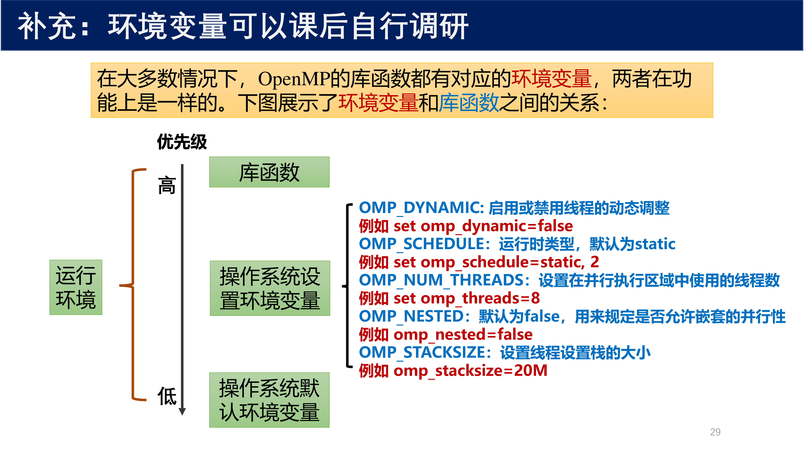{ width="800" }

在大多数情况下，OpenMP 的库函数都有对应的环境变量，两者在功能上是一样的。环境变量和库函数之间的优先级关系如下：

| 优先级 | 来源 | 说明 |
|:---:|:---:|:---|
| 高 | 库函数 | `omp_set_*` 系列函数 |
| 中 | 操作系统设置环境变量 | `OMP_DYNAMIC`、`OMP_SCHEDULE`、`OMP_NUM_THREADS`、`OMP_NESTED`、`OMP_STACKSIZE` |
| 低 | 操作系统默认环境变量 | 系统默认值 |

常用环境变量：

| 环境变量 | 功能 | 示例 |
|:---:|:---|:---|
| `OMP_DYNAMIC` | 启用或禁用线程的动态调整 | `set omp_dynamic=false` |
| `OMP_SCHEDULE` | 运行时调度类型，默认为 `static` | `set omp_schedule=static, 2` |
| `OMP_NUM_THREADS` | 设置在并行执行区域中使用的线程数 | `set omp_threads=8` |
| `OMP_NESTED` | 默认为 `false`，用来规定是否允许嵌套的并行性 | `omp_nested=false` |
| `OMP_STACKSIZE` | 设置线程设置栈的大小 | `omp_stacksize=20M` |

---

## 8 总结：OpenMP 和 MPI

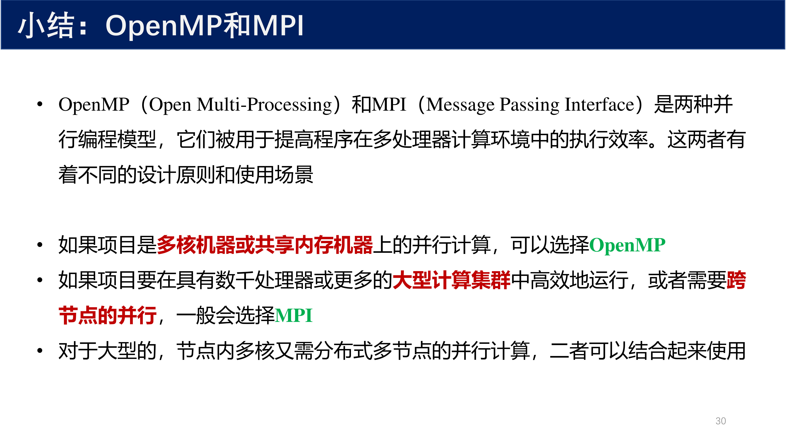{ width="800" }

OpenMP（Open Multi-Processing）和 MPI（Message Passing Interface）是两种并行编程模型，它们被用于提高程序在多处理器计算环境中的执行效率。这两者有着不同的设计原则和使用场景：

| 场景 | 推荐模型 |
|:---|:---|
| 多核机器或共享内存机器上的并行计算 | **OpenMP** |
| 具有数千处理器或更多的大型计算集群，或者需要跨节点的并行 | **MPI** |
| 大型的，节点内多核又需分布式多节点的并行计算 | **OpenMP + MPI 混合** |

!!! tip "选择建议"
    - 如果项目是多核机器或共享内存机器上的并行计算，可以选择 **OpenMP**
    - 如果项目要在具有数千处理器或更多的大型计算集群中高效地运行，或者需要跨节点的并行，一般会选择 **MPI**
    - 对于大型的，节点内多核又需分布式多节点的并行计算，二者可以结合起来使用

---

## 9 核心概念回顾

| 概念 | 说明 |
|:---|:---|
| **伪共享（False Sharing）** | 不同线程修改同一缓存行中的不同变量，导致缓存行反复失效 |
| **缓存行（Cache Line）** | CPU 缓存的最小单位，通常为 64 字节 |
| **宽松内存一致性模型** | 允许同一变量在不同缓存中具有不同值，以减少同步开销 |
| **flush 指令** | 强制将线程的缓存数据写回内存，使其他线程可见 |
| **MPI + OpenMP 混合编程** | MPI 负责节点间通信，OpenMP 负责节点内多线程并行 |
| **alignas(64)** | C++11/C11 关键字，强制变量按 64 字节对齐，避免伪共享 |
