## 1 SIMD 与编译器优化基础

### 1.1 什么是 SIMD

!!! abstract "定义 1（SIMD）"
    **SIMD**（Single Instruction, Multiple Data，单指令多数据）是一种 **数据级别的并行计算技术**，核心是一条指令同时对多个数据执行相同操作，显著提升批量数据处理效率。

SIMD 的核心原理在于：传统 CPU 一条指令一次只能处理一个数据；而 SIMD 通过 **宽向量寄存器**（如 128/256/512 位）打包多个数据，一条指令并行处理所有数据。例如，一次完成 4 个 32 位浮点数（每个浮点数 4 字节）的加法，需要 128 bit 的向量寄存器，以少量硬件开销实现 **4~32 倍** 吞吐量提升。

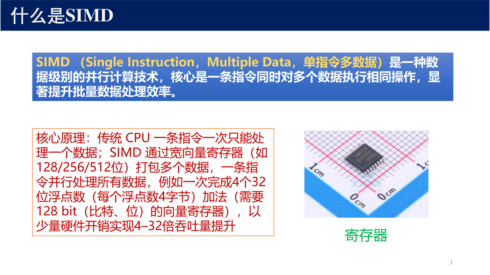{ width="800" }

### 1.2 寄存器

!!! abstract "定义 2（寄存器）"
    **寄存器（Register）** 是 CPU 内部 **速度最快、容量最小** 的高速存储单元，集成在 CPU 核心内部。

存储层次结构的速度对比为：

$$
\text{内存} > \text{缓存 L3/L2/L1} > \text{寄存器}
$$

寄存器离运算单元（ALU、浮点单元）最近，**不用走总线、不用访存**，指令直接从寄存器取数、运算、结果放回寄存器。

| 部件 | 位置 | 速度 | 容量 | 作用 |
|------|------|------|------|------|
| 寄存器 | CPU 内部 | 最快 | 极小（几百字节） | 唯一计算场所 |
| 内存（内存条） | 主板插槽 | 慢几百万倍 | 很大（16G/32G 等） | 存数据，不计算 |

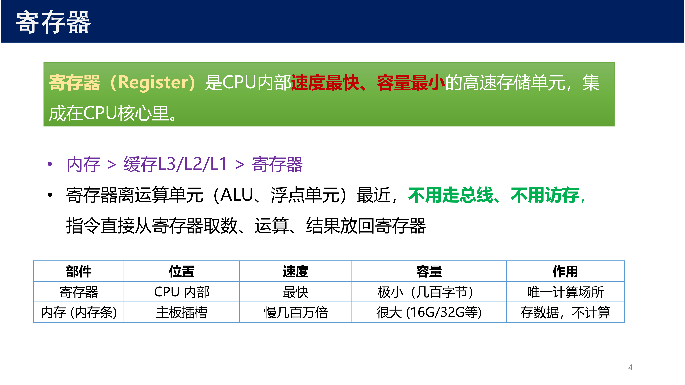{ width="800" }

### 1.3 指令集

CPU 只会执行固定的简单指令（加减、存取数据、跳转等），把这些全部指令汇总起来，就叫 **指令集**。不用直接读寄存器，看 CPU 支持的指令集（说明如何操作寄存器），就等于知道 SIMD 寄存器多大。

在 Linux 下查看所有支持的指令集：

```bash
grep -oE 'sse|sse2|sse3|ssse3|sse4_1|sse4_2|avx|avx2|avx512f|avx512vl' /proc/cpuinfo | sort -u
```

x86 架构的 SIMD 指令集扩展主要包括：

| 指令集 | 寄存器宽度 | 单次操作能力 |
|--------|-----------|-------------|
| **SSE** | 128 bit 寄存器（XMM） | 一次 4 个 float / 2 个 double |
| **AVX** | 256 bit 寄存器（YMM） | 一次 8 个 float / 4 个 double |
| **AVX-512** | 512 bit 寄存器（ZMM） | 一次 16 个 float / 8 个 double |

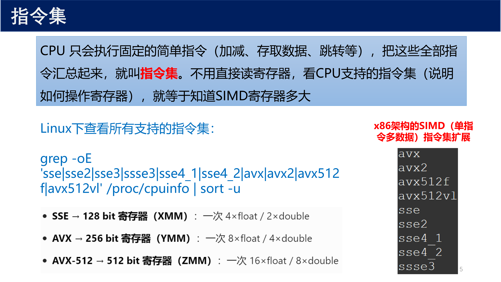{ width="800" }

#### 1.3.1 SSE 系列

**SSE**（Streaming SIMD Extensions，128 位向量）是早期的 x86 SIMD 标准，向量宽度固定为 128 位。

- SSE 首次引入 128 位浮点向量运算
- SSE2 将整数运算纳入向量支持
- SSE3 补充了高效整数运算增强指令
- SSE4.1/SSE4.2 则进一步优化点积、字符串处理与 CRC 校验

SSE 成为后续 AVX 系列发展的技术基石。

#### 1.3.2 AVX 系列

**AVX**（Advanced Vector Extensions，256/512 位向量）是 SSE 的升级，向量宽度翻倍，并引入了新的编码方式和更灵活的指令格式。

AVX 系列是 x86 架构的向量扩展指令集，通过逐步加宽向量位宽、增强运算能力实现并行加速：

- **AVX**（256 位浮点）奠定基础
- **AVX2** 补齐 256 位整数运算与 gather/scatter 等高级操作
- **AVX512F** 将位宽扩展至 512 位成为该系列的基础
- **AVX512VL** 则新增 128/256 位向量模式，让 AVX512 指令可灵活适配不同数据宽度，同时兼容旧指令集生态

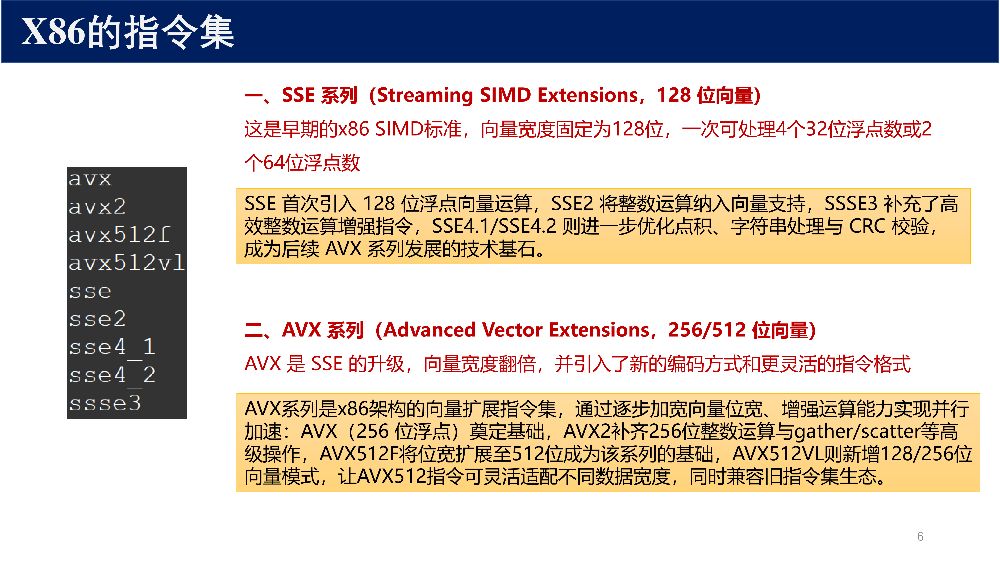{ width="800" }

### 1.4 编译器优化级别

编译器的优化级别直接影响 SIMD 的自动使用程度：

| 编译选项 | 级别 | 效果 | 速度 | 适用场景 | SIMD |
|----------|------|------|------|----------|------|
| `-O0` | 0 级 | 无优化 | 最慢 | 写代码、调试 | 无 |
| `-O1` | 1 级 | 轻度优化 | 慢 | — | 几乎不 |
| `-O2` | 2 级 | 标准优化 | 快 | 正式运行 | 自动开启 |
| `-O3` | 3 级 | 激进优化 | 最快 | 科学计算 | 更强 SIMD |

各级别的详细说明：

- **`-O0`（零优化、默认）**：完全不做任何代码修改
- **`-O1`（轻度优化）**：删掉没用的变量、没用的计算、简单合并重复代码
- **`-O2`（标准优化，生产环境默认）**：开启自动 SIMD、循环展开、函数内联
- **`-O3`（最高优化级别）**：开激进的 SIMD、更宽的寄存器使用

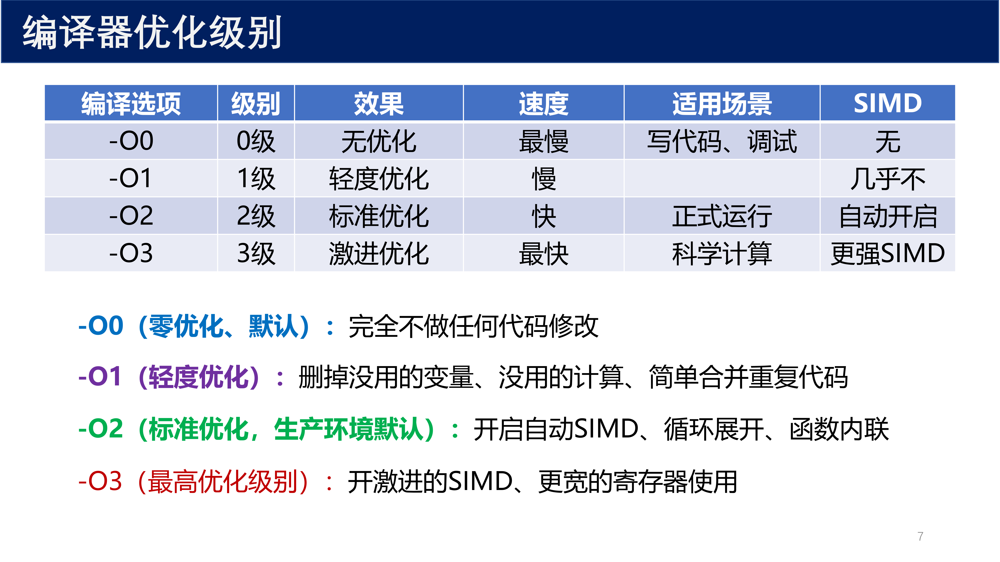{ width="800" }

### 1.5 SIMD 与并行技术的关系

SIMD 本质就是靠 **专用向量寄存器** 撑起来的，完全和寄存器强绑定，没有特殊寄存器就没有 SIMD。**SIMD 是 CPU 硬件功能，不是某个库专属**，所有语言都能用，只是方式不同。

| 并行技术 | 自带 SIMD？ | 怎么用 SIMD？ |
|----------|------------|--------------|
| **OpenMP** | 手动加 simd | `#pragma omp simd` |
| **MPI** | 无 | 代码内部自己加 SIMD |
| **CUDA** | 天生自带 | 写核函数 → 自动 SIMD |

示例：数据 `[1][2][3][4] [5][6][7][8] [9][10]` 的处理方式

- 前 8 个数据：SIMD 并行处理（每次 4 个或 8 个）
- 最后 2 个数据：标量收尾处理

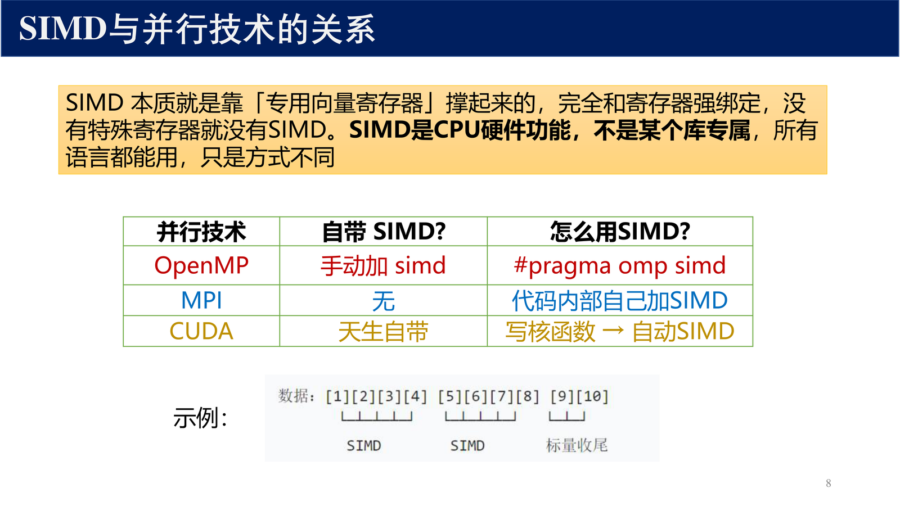{ width="800" }

## 2 SIMD 实践举例

### 2.1 例 1：直接在 C++ 里做 SIMD

本例演示纯 C++ 的 SIMD（单指令多数据）优化，核心目的是对比 **标量求和** 与 **原生 SIMD 向量求和** 的性能差异，直观展示 SIMD 指令如何大幅提升计算效率。

#### 2.1.1 标量求和代码

```cpp
#include <iostream>
#include <vector>
#include <chrono>

using namespace std;
using chrono::high_resolution_clock;
using chrono::milliseconds;

// 128bit SIMD 向量：一次处理 4 个 float
using Vec4f = float __attribute__((vector_size(16)));

// 改成安全的大小，一定不会内存失败
const int N = 10000000;  // 1 千万，安全稳定

// 普通标量求和
float scalar_sum(const vector<float>& a)
{
    float sum = 0.0f;
    for (int i = 0; i < N; ++i) {
        sum += a[i];
    }
    return sum;
}
```

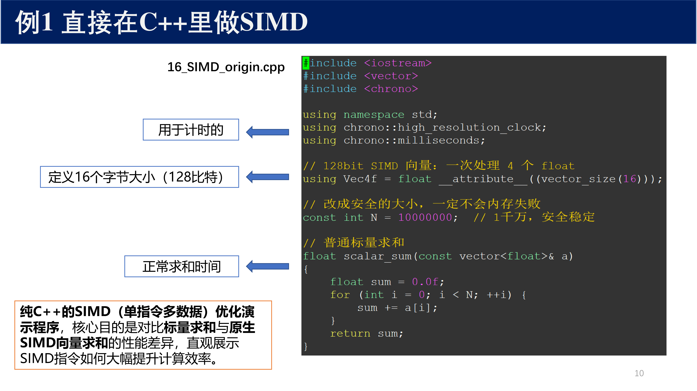{ width="800" }

#### 2.1.2 SIMD 加速求和代码

```cpp
// 原生 SIMD 求和（无 OpenMP，纯 C++）
float simd_sum(const vector<float>& a)
{
    Vec4f sum_vec{0.0f, 0.0f, 0.0f, 0.0f};
    int i = 0;

    // SIMD 核心：一次读 4 个数
    for (; i <= N - 4; i += 4) {
        const Vec4f v = *(reinterpret_cast<const Vec4f*>(&a[i]));
        sum_vec += v;
    }

    // 合并向量结果
    float sum = sum_vec[0] + sum_vec[1] + sum_vec[2] + sum_vec[3];

    // 处理剩余元素
    for (; i < N; ++i) {
        sum += a[i];
    }
    return sum;
}
```

核心要点：

- 初始化 `sum_vec`，包含四个 float（对应 128 位向量寄存器）
- 每次读取 4 个 float，SIMD 并行加法
- 循环结束后合并向量结果的 4 个分量
- 最后处理不足 4 个的剩余元素（标量收尾）

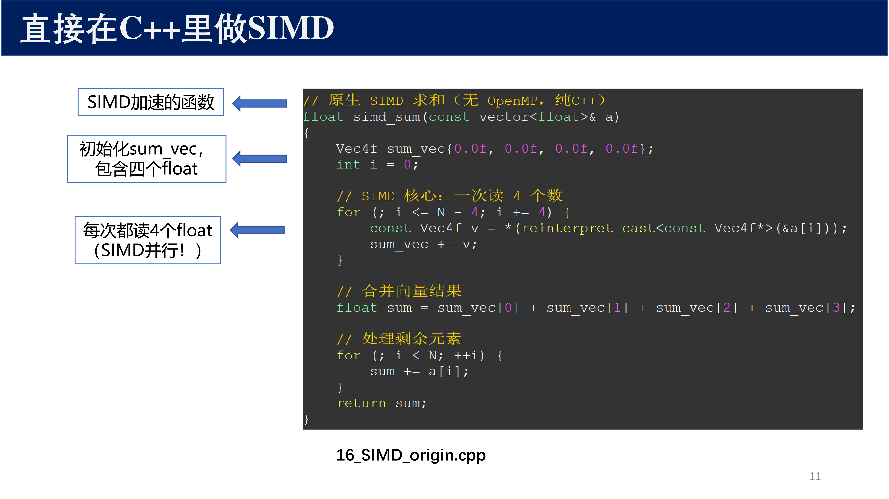{ width="800" }

#### 2.1.3 主函数与计时

```cpp
int main()
{
    // 安全初始化
    vector<float> arr(N, 1.0f);
    cout << "数组大小：" << arr.size() << endl;

    // 标量
    auto t1 = high_resolution_clock::now();
    float s1 = scalar_sum(arr);
    auto t2 = high_resolution_clock::now();

    // SIMD
    auto t3 = high_resolution_clock::now();
    float s2 = simd_sum(arr);
    auto t4 = high_resolution_clock::now();

    // 修复：添加 std::chrono:: 前缀
    cout << "标量求和：" << s1 << " 耗时："
         << std::chrono::duration_cast<milliseconds>(t2 - t1).count() << "ms\n";

    cout << "SIMD求和：" << s2 << " 耗时："
         << std::chrono::duration_cast<milliseconds>(t4 - t3).count() << "ms\n";

    return 0;
}
```

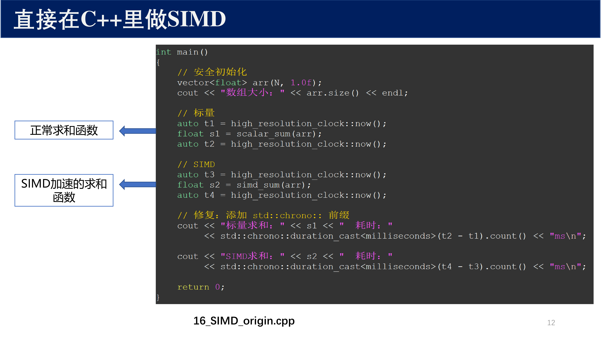{ width="800" }

#### 2.1.4 编译与运行结果

**不加优化选项**：

```bash
g++ -fopenmp 16_SIMD_origin.cpp
```

运行结果：

```
数组大小：10000000
标量求和：1e+07  耗时：27ms
SIMD求和：1e+07  耗时：8ms
```

**手动 SIMD 起作用了！**

**加 `-O3` 优化选项**：

```bash
g++ -O3 -fopenmp 16_SIMD_origin.cpp
```

运行结果：

```
数组大小：10000000
标量求和：1e+07  耗时：15ms
SIMD求和：1e+07  耗时：3ms
```

**优化更多冗余操作！**

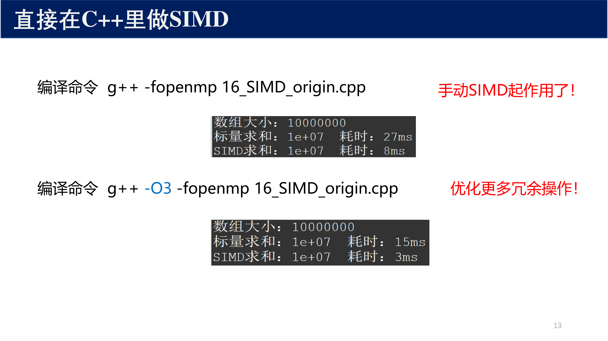{ width="800" }

### 2.2 例 2：采用 OpenMP 的 SIMD

本例演示三种不同的求和实现方式，对比它们的性能差异。

#### 2.2.1 普通循环（无优化，用于对比）

```cpp
#include <iostream>
#include <vector>
#include <chrono>
#include <omp.h>

using namespace std;
using namespace chrono;

const int N = 100000000;  // 一亿个数

int main() {
    int nthreads = 4;
    omp_set_num_threads(nthreads);

    vector<float> arr(N, 1.0f);
    double sum = 0.0;

    // ============== 1. 普通循环（无优化，用于对比）==============
    sum = 0.0;
    auto start1 = high_resolution_clock::now();
    for (int i = 0; i < N; ++i) {
        sum += arr[i];
    }
    auto end1 = high_resolution_clock::now();
    auto time1 = duration_cast<milliseconds>(end1 - start1).count();
    cout << "普通循环 结果：" << sum << endl;
    cout << "普通循环 耗时：" << time1 << " ms" << endl << endl;
```

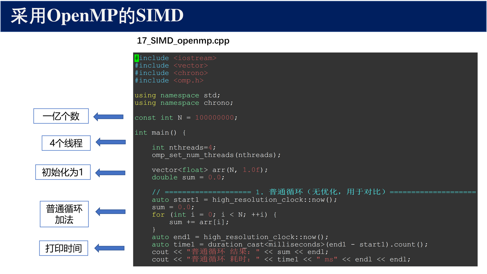{ width="800" }

#### 2.2.2 OpenMP SIMD 向量化（单核心 + SIMD）

```cpp
    // ============== 2. OpenMP SIMD 向量化（单核心+SIMD）=====
    sum = 0.0;
    auto start2 = high_resolution_clock::now();
    // 核心：告诉编译器生成 SIMD 向量化指令
    #pragma omp simd reduction(+:sum)
    for (int i = 0; i < N; ++i) {
        sum += arr[i];
    }
    auto end2 = high_resolution_clock::now();
    auto time2 = duration_cast<milliseconds>(end2 - start2).count();
    cout << "OpenMP SIMD 结果：" << sum << endl;
    cout << "OpenMP SIMD 耗时：" << time2 << " ms" << endl << endl;
```

核心要点：

- `#pragma omp simd`：单线程内部 SIMD 向量化指令
- `reduction(+:sum)`：规约操作，自动处理累加
- 用 `-O3` 编译指令即可识别

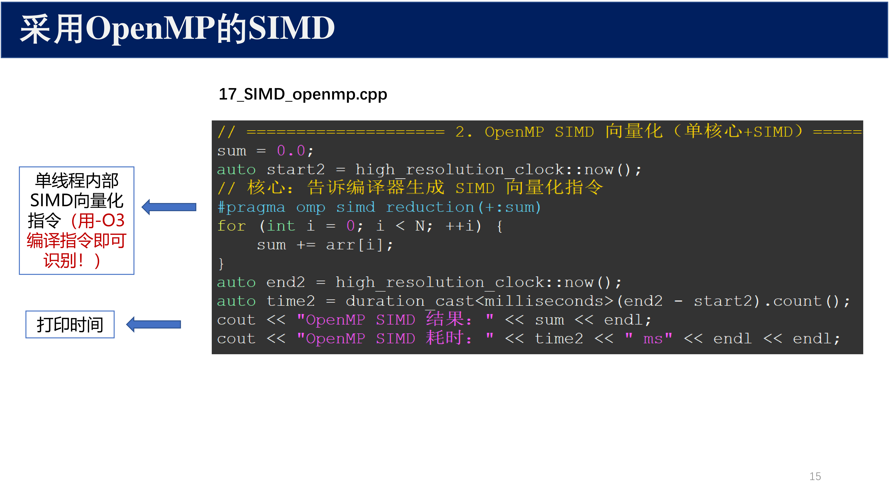{ width="800" }

#### 2.2.3 多核并行 + SIMD 混合优化（最强版本）

```cpp
    // ============== 3. 多核并行 + SIMD 混合优化（最强版本）==
    sum = 0.0;
    auto start3 = high_resolution_clock::now();
    // 多核并行 + 每个核心内部 SIMD 向量化
    #pragma omp parallel for simd reduction(+:sum)
    for (int i = 0; i < N; ++i) {
        sum += arr[i];
    }
    auto end3 = high_resolution_clock::now();
    auto time3 = duration_cast<milliseconds>(end3 - start3).count();
    cout << "多核+SIMD 混合 结果：" << sum << endl;
    cout << "多核+SIMD 混合 耗时：" << time3 << " ms" << endl;

    return 0;
}
```

核心要点：

- `#pragma omp parallel for simd`：OpenMP 的多线程 SIMD 向量化指令
- **多线程 + SIMD 双加速**，理论最快

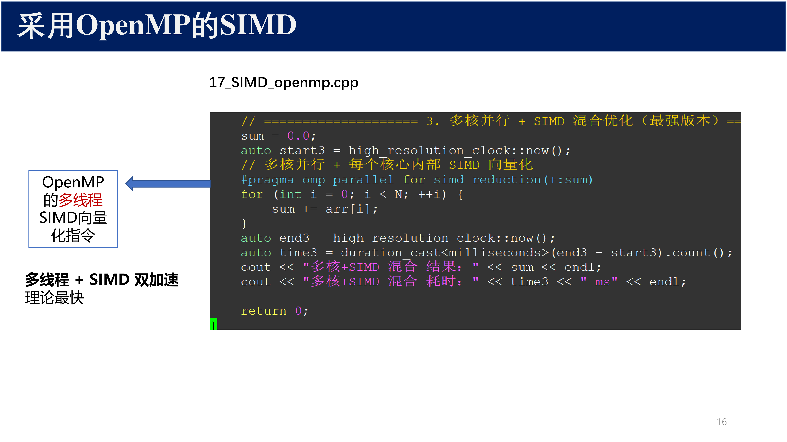{ width="800" }

#### 2.2.4 编译与运行结果

**不加优化选项**：

```bash
g++ -fopenmp 17_SIMD_openmp.cpp
```

运行结果：

```
普通循环 结果：1e+08
普通循环 耗时：266 ms
OpenMP SIMD 结果：1e+08
OpenMP SIMD 耗时：267 ms
多核+SIMD 混合 结果：1e+08
多核+SIMD 混合 耗时：77 ms
```

**不加编译选项 SIMD 不起作用！**

**加 `-O3` 优化选项**：

```bash
g++ -O3 -fopenmp 17_SIMD_openmp.cpp
```

运行结果：

```
普通循环 结果：1e+08
普通循环 耗时：260 ms
OpenMP SIMD 结果：1e+08
OpenMP SIMD 耗时：34 ms
多核+SIMD 混合 结果：1e+08
多核+SIMD 混合 耗时：38 ms
```

**开了优化选项，SIMD 起作用了！**

- 普通循环 → OpenMP SIMD：**260/34 = 7.64 倍加速**！（一条指令算 8 个 float）

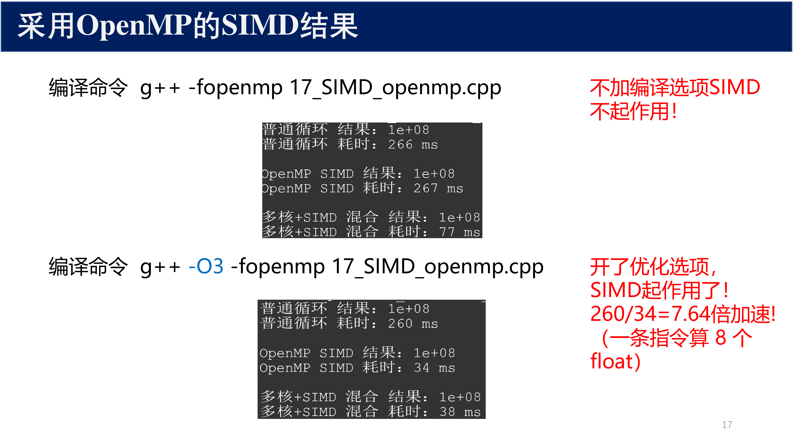{ width="800" }

## 3 再次讨论 SIMD 和 OpenMP

### 3.1 SIMD 向量化操作回顾

现代 CPU 中普遍包含了向量单元。单条 **向量指令流** 在专用的向量寄存器上操作，这些寄存器可以容纳多个值，我们称之为单指令多数据或 SIMD 执行模型。

!!! tip "编译器自动向量化"
    一般情况下编译器会自动进行循环的向量化，绝大部分程序员永远也不会编写显式的向量化代码。

但是，当编译器没有办法判断代码重组是否对语义产生影响时，编译器会忽略代码，以至于 **未能对很多循环进行向量化**。因此，可以采用 `simd` 指令来对循环向量化。

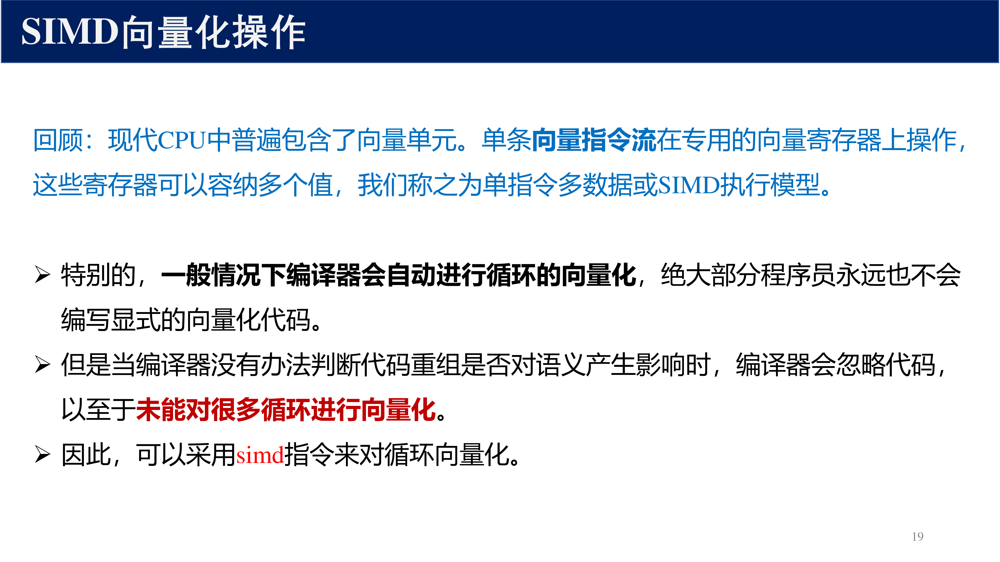{ width="800" }

### 3.2 如何知道哪些代码被 SIMD 向量化

#### 3.2.1 GCC 编译器

```bash
g++ -O3 -fopt-info-vec -fopt-info-vec-missed your.cpp
```

| 选项 | 作用 |
|------|------|
| `-O3` | 开启最高优化 |
| `-fopt-info-vec` | 打印成功向量化的循环 |
| `-fopt-info-vec-missed` | 打印没成功向量化的循环 + 原因 |

Intel 编译器也有类似指令（需要的话自己查）。

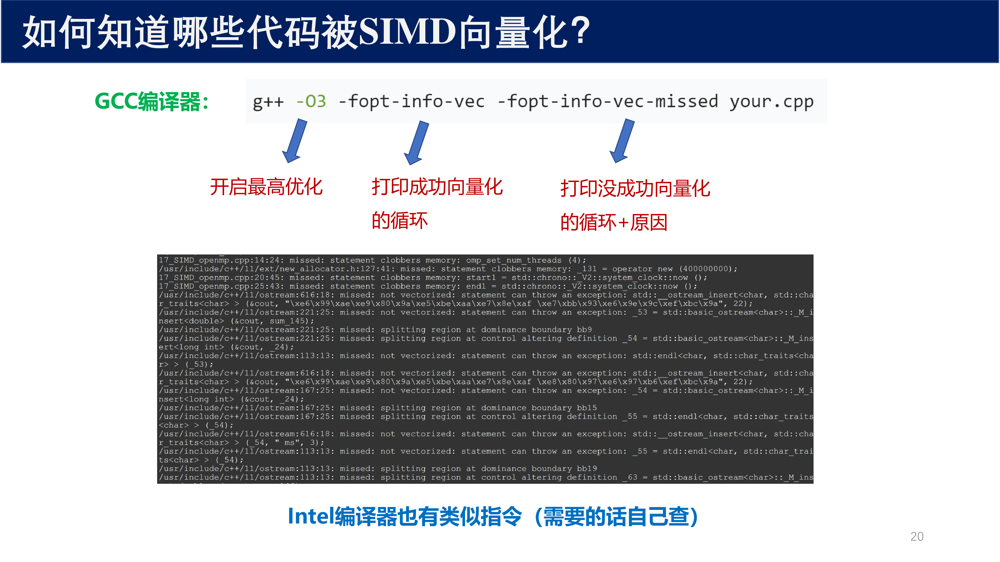{ width="800" }

### 3.3 什么时候编译器不会自动向量化（经验规则）

!!! warning "编译器自动向量化的限制"
    以下情况会阻碍编译器自动向量化，需要程序员手动干预或使用 `pragma omp simd` 指令。

#### 3.3.1 有 if / else / break

`if/else` 会产生分支，不同数据可能走不同路径；`break` 会让循环长度不确定。

#### 3.3.2 有函数调用

如果调用的是普通外部函数，编译器无法分析它的行为，就不敢向量化。

!!! info "例外情况"
    如果函数是 `static inline` 且被完全内联，或者是编译器内置函数（如 `sqrtf`），编译器可以安全地把它向量化。

#### 3.3.3 数据有依赖

例如 `a[i]` 依赖 `a[i-1]`，无法并行算，也不能向量化。

#### 3.3.4 下标不连续

SIMD 指令天生适合处理 **连续内存**，比如一次加载 8 个连续的 float。

#### 3.3.5 浮点求和

浮点加法不满足结合律：$(a+b)+c \neq a+(b+c)$，向量化会改变求和顺序，导致结果微小差异，编译器默认不敢做 SIMD。

!!! tip "经验法则而非绝对规则"
    为什么这些是经验法则而不是绝对规则？

    **现代编译器（GCC/Clang/ICC）的向量化能力一直在进步！**

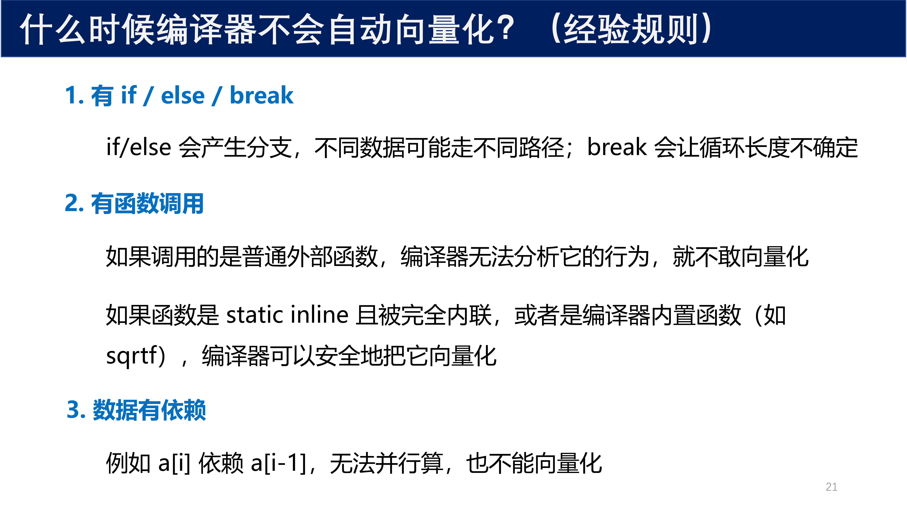{ width="800" }

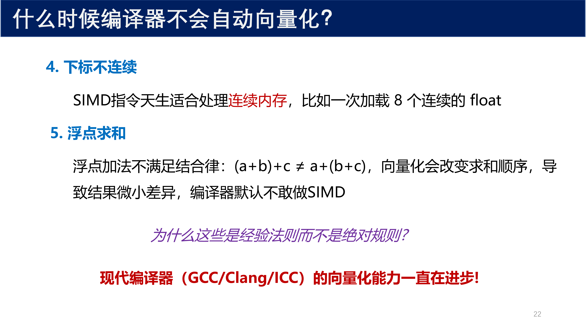{ width="800" }

### 3.4 一些例子：不开启 SIMD 优化

#### 3.4.1 例 1：条件分支导致控制流分歧

**问题**：`ionmbl[i][k]` 的条件判断导致控制流分歧，SIMD 要求所有 lane 执行相同指令。

```cpp
for (int i = 0; i < ucell.nat; ++i)
{
    for (int k = 0; k < 3; ++k)
    {
        if (ionmbl[i][k])  // X 数据依赖的条件分支
        {
            pos[i][k] = vel[i][k] * dt_over_lat0;
        }
        else
        {
            pos[i][k] = 0;
        }
    }
    pos[i] = pos[i] * ucell.GT;  // X Vector3 运算符重载
}
```

**可能的修改方式**（使用乘法代替分支）：

```cpp
for (int i = 0; i < ucell.nat; ++i)
{
    for (int k = 0; k < 3; ++k)
    {
        // 使用乘法代替分支
        pos[i][k] = vel[i][k] * dt_over_lat0 * ionmbl[i][k];
    }
}
```

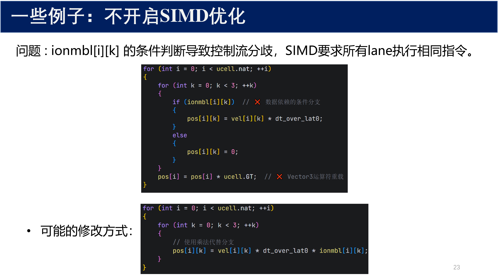{ width="800" }

#### 3.4.2 例 2：atomic 操作强制串行化

**问题**：`#pragma omp atomic` 强制串行化，无法 SIMD。

```cpp
for (int ion = 0; ion < natom; ++ion)
{
    const double mass = allmass[ion];
    const double vx = vel[ion][0];
    ...
    #pragma omp atomic  // X atomic 操作阻止 SIMD
    t_vector(0, 0) += mass * vx * vx;
    #pragma omp atomic
    t_vector(0, 1) += mass * vx * vy;
    ...  // 9 个 atomic 操作
}
```

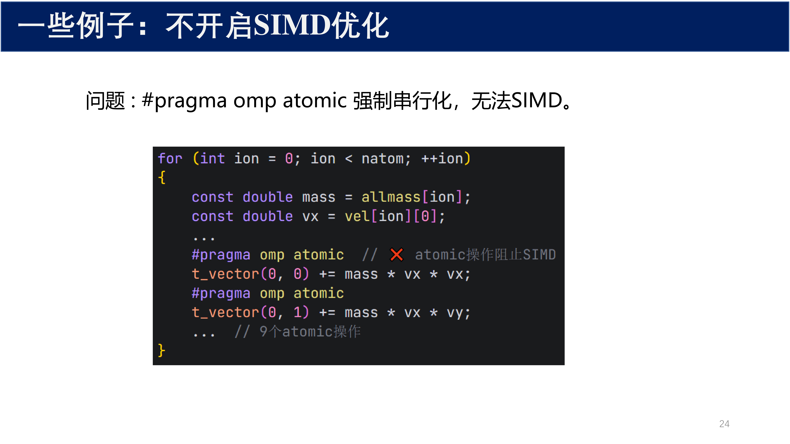{ width="800" }

#### 3.4.3 例 3：循环携带依赖 + 函数调用

**问题**：`v_eta[m]` 依赖于 `v_eta[m+1]`，存在循环携带依赖。

```cpp
for (int m = mdp.md_tchain - 1; m >= 0; --m)  // X 逆向循环+数据依赖
{
    factor = exp(-v_eta[m + 1] * delta / 8.0);  // X exp() 调用
    v_eta[m] *= factor;                          // X 依赖 v_eta[m+1]
    v_eta[m] += g_eta[m] * delta / 4.0;
    v_eta[m] *= factor;
}
```

该例存在三个阻碍向量化的因素：

1. **逆向循环**：循环方向与数据依赖冲突
2. **`exp()` 调用**：外部函数调用
3. **循环携带依赖**：`v_eta[m]` 依赖 `v_eta[m+1]`

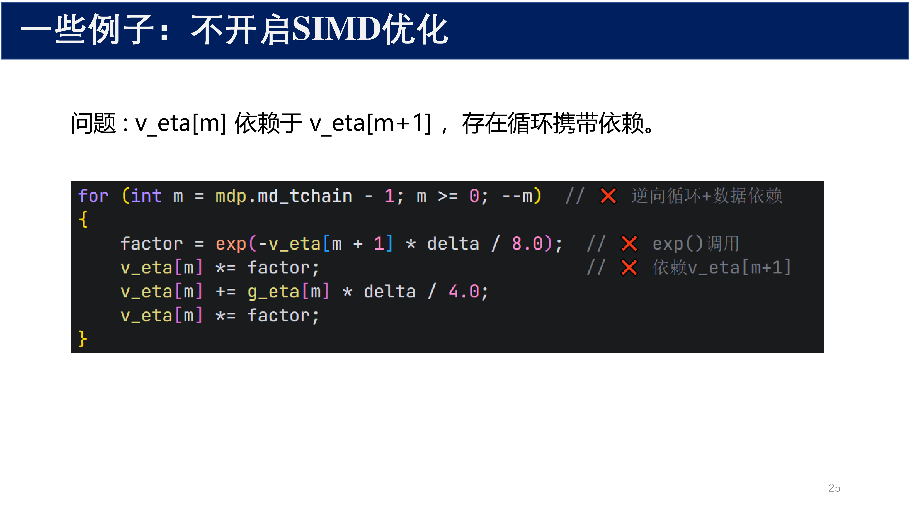{ width="800" }

### 3.5 结语：再讨论 OpenMP

!!! warning "OpenMP 的适用场景限制"
    在高性能计算（HPC）领域，禁止 OpenMP、强制只用 MPI 是极其普遍的规矩，不是随便定的，而是由 **硬件架构、稳定性、扩展性、编程难度** 四大核心原因决定的。

OpenMP 的特点：

- **只能在一台电脑、一个节点内跑**（多核 CPU 共享内存），程序无法跨机器扩展
- MPI 可以在成百上千台电脑、整个集群上跑
- OpenMP 调试起来极容易出错，在大型软件里容易引入 Bugs（数据竞争、死锁、伪共享、随机数），破坏程序稳定性和可维护性

!!! tip "结论"
    **根据实际代码和需求情况来决定是否采用 OpenMP 并行。**

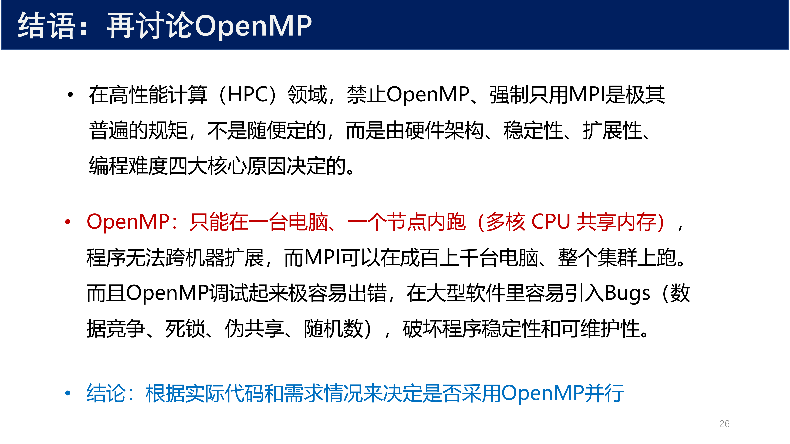{ width="800" }

---

## 4 总结

| 主题 | 核心要点 |
|------|----------|
| **SIMD 原理** | 单指令多数据，利用宽向量寄存器（128/256/512 bit）并行处理多个数据 |
| **寄存器** | CPU 内部最快存储，是计算的唯一场所 |
| **指令集** | SSE（128 bit）→ AVX（256 bit）→ AVX-512（512 bit），逐步加宽 |
| **编译优化** | `-O2` 自动开启 SIMD，`-O3` 激进 SIMD；无优化则 SIMD 不生效 |
| **手动 SIMD** | 纯 C++ 可用 `__attribute__((vector_size(16)))` 定义向量类型 |
| **OpenMP SIMD** | `#pragma omp simd`（单核）、`#pragma omp parallel for simd`（多核+SIMD）|
| **向量化障碍** | 分支、函数调用、数据依赖、不连续访问、浮点结合律问题 |
| **诊断工具** | GCC 的 `-fopt-info-vec` 和 `-fopt-info-vec-missed` |
| **OpenMP 局限** | 仅共享内存节点内，HPC 大规模并行首选 MPI |
